# 2. 销售数据仓库用例：聚合函数

本章我们的主要目标是学习并应用一类称为聚合函数的窗口函数。我们将从描述将要使用的名为 `APSales` 的销售数据仓库开始。

文中呈现了一个简单的业务概念模型以及一些简单的数据字典，以帮助我们理解数据库的业务内容。

我们包含了关于性能调优的讨论，然后对每个窗口函数进行实际演练。最后，我们将简要讨论 SQL Server 2022 的一个新功能 `WINDOW`，它用于为窗口函数定义 `OVER()` 子句。

注意

用于创建这个小型数据仓库的 DDL 以及用于创建所有表和视图、为表加载测试数据的脚本，可以在本书的 Google 网站上找到。代码易于使用。每个步骤都有标签，并且在必要时注释有助于澄清每个步骤的作用。

让我们花点时间了解一下我们的小型销售数据仓库是关于什么的。

## 销售数据仓库

`APSales` 数据仓库存储了一家虚构公司的交易和历史信息，该公司以传统欧式风格烘焙和销售各种蛋糕、馅饼、挞和巧克力。

该公司有 100 名客户，我们想要跟踪和分析他们跨越数年数据的购买模式。公司销售 60 种产品，这些产品属于蛋糕、馅饼、挞、牛角包和巧克力等多个类别。

客户在遍布美国的 16 家商店之一购买他们喜爱的甜点。

最后，使用一个暂存表来模拟每位客户过去几年的购买情况。你的第一个任务是创建数据库和表，加载数据，并编写一些简单的查询来查看你将要分析的实际数据。

图 2-1 是 SSMS 对象资源管理器的截图，显示了数据库和表。一旦你创建了数据库和所有表对象，你自己的对象资源管理器面板应该看起来像这样。

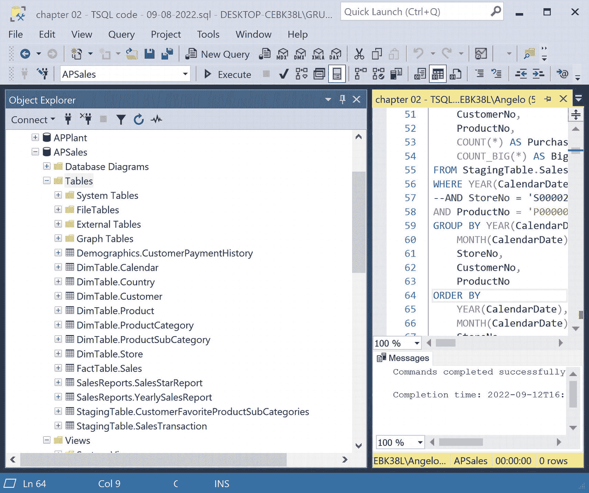

一张 S S M S 窗口的截图。左侧面板展示了对象资源管理器，包含多个文件和文件夹。它显示了 A P Plant、A P sales、数据库关系图文件夹和表。表文件夹有另外 4 个文件夹和 13 个关系图表文件。右侧面板有一段代码和统计信息。

图 2-1

数据仓库表

请注意 `SalesReports` 和 `StagingTable` 架构中的表。分配给 `SalesReports` 架构的表代表通过星型查询查询销售事实表生成的非规范化视图，该星型查询将所有维度连接到事实表，以便我们可以向业务分析师提供一些使用所有名称、代码等的数据。

分配给 `StagingTable` 架构的表被 TSQL 批处理脚本使用，这些脚本生成一些随机的交易数据，以便我们可以将其加载到销售事实表中。让我们看一个简单的业务概念模型，以了解这一切是如何联系在一起的。

## 销售数据仓库概念模型

以下是一个简单的业务概念数据模型，它标识了销售数据仓库的主要业务对象。目标数据库是一个基本的星型模式模型，因为它有一个事实表和几个维度表（当然，你可以有多个事实表）。

还包括几个非规范化的报告表，以便于运行复杂查询。

这些表称为 `SalesStarReport` 和 `YearlySalesReport`，并被分配到 `SalesReports` 架构。这些表用于关联事实表和维度表，并用实际的维度表列替换代理键。它们每天晚上都会预加载，以便用户在第二天可以使用。预加载表提供了性能优势，因为它允许在数据插入表之前执行计算；更简单的查询将运行得更快。

对于那些不熟悉数据仓库或数据集市的人来说，被赋予代理键角色的列用于建立维度表和事实表之间的关联。这些是数值列，因为它们在连接中比字母数字列使用得更快。

在图中查看，发挥你的想象力，它们类似一颗星，因此被称为星型模式。

以下模型仅旨在显示基本业务对象及其关系。它不是一个完整的物理数据仓库模型。顺便说一句，我假设你知道什么是事实表以及什么是维度。

注意

网上有很多资源描述什么是数据仓库或数据集市。如果你不熟悉这种架构，这里有一个链接可能有帮助：

[`www.snowflake.com/data-cloud-glossary/data-warehousing/`](http://www.snowflake.com/data-cloud-glossary/data-warehousing/)

另一个很好的资源是 [`www.kimballgroup.com/`](http://www.kimballgroup.com/)。

每个维度表都有一个扮演主键角色的代理键。所有这些代理键都作为外键出现在事实表中。从技术上讲，事实表中的所有外键都可以用作事实表的主键。事实表还包含代表你可以计数的数据的列，换句话说，是数值数据。在特殊情况下，事实表可以包含其他类型的列，但这是另一本书的主题。（请查阅无事实事实表和垃圾维度。）

请参考图 2-2。

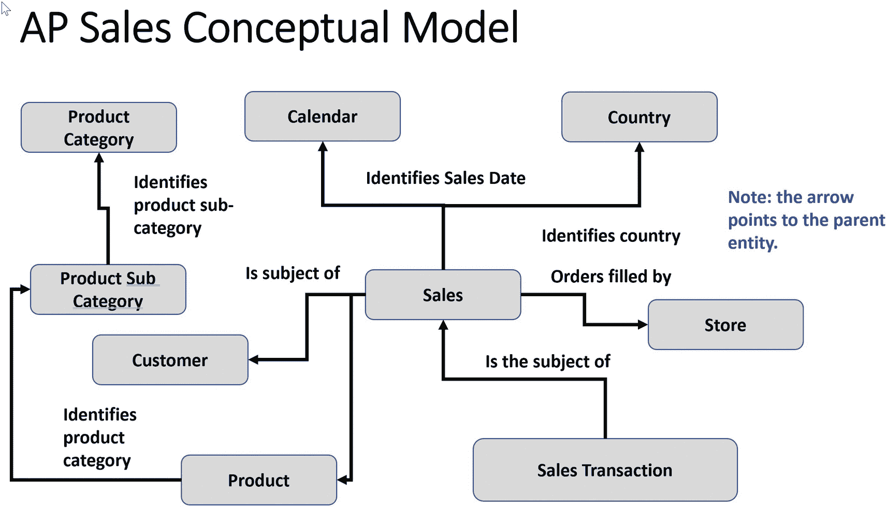

A P 销售概念模型的方块图。销售与日历、国家、客户、商店和产品相关联。产品之后是产品子类别和产品类别的识别。一笔销售交易流向销售。

图 2-2

APSales 概念业务模型

这被称为概念业务模型，因为它旨在向非技术用户（我们的朋友，业务分析师和经理们）清晰地标识主要的业务数据对象。这类模型用于数据库设计的初始阶段。

数据建模师、业务分析师和其他利益相关者聚集在一起，识别将包含在数据库或数据仓库中的主要数据对象。在设计过程的这个阶段，只识别基本的元数据，比如实体名称及其相互关系。

后续的会议将概念模型演变为物理非规范化星型或雪花模式设计，其中所有代理键、列和其他对象都被识别出来。

我呈现这个简单的模型，以便你能对将要实现数据仓库的数据库有一个基本的了解。

接下来，我们需要创建一系列称为数据字典的简单文档，以进一步描述元数据。


表 2-1 是一个简单的表格，展示了将成为事实表和维度表的各个实体之间的关联。你需要理解这些关联，以便构建将这些表连接起来的查询。

## 表 2-1：事实-维度关联

| 维度 | 业务规则 | 事实/维度表 | 基数 |
| --- | --- | --- | --- |
| 国家 | 标识 | 销售 | 一对零、一对多或多对多 |
| 门店 | 完成 | 销售 | 一对零、一对多或多对多 |
| 客户 | 是 | 销售 | 一对零、一对多或多对多 |
| 产品 | 是 | 销售 | 一对零、一对多或多对多 |
| 产品类别 | 产品的类别分类 | 产品 | 一对零、一对多或多对多 |
| 产品子类别 | 的子类别分类 | 产品类别 | 一对一，多对一 |
| 日历 | 标识 | 销售 | 一对零、一对多或多对多 |

通常，这类表格出现在包含构成数据库的各种数据对象信息的数据字典中。观察前表中的关联，我们还想强调连接这些关联的业务规则。

一个国家在 `Sales` 事实表中标识零个、一个或多个行的位置。一个事实表行需要包含国家代码，但也可能存在 `Country` 表中的行在 `Sales` 表中没有相关行的情况。在你将构建的数据库中，尽管 `Country` 维度包含了大部分 ISO 标准国家代码的信息，但只有美国的销售交易记录。

注意

数据仓库是一种特殊类型的表。在本章中，我将这两个术语互换使用。

一个门店可以是 `Sales` 事实表中零个、一个或多个记录的主体。可能存在一个尚未售出任何产品的新门店，因此在 `Sales` 事实表中没有记录。

同样的规则适用于客户。一个客户可以在 `Sales` 表中出现零次、一次或多次。可能存在一个尚未购买任何东西的新客户，因此该客户会出现在 `Customer` 维度中，但不会出现在 `Sales` 事实表中。

一个产品可以在 `Sales` 事实表中出现零次、一次或多次销售记录。可能存在一个尚未售出的产品出现在 `Product` 表中的情况。

一个产品类别可以指一个或多个产品子类别，每个产品类别可以指一个或多个产品。可能存在由于各种原因（例如尚未生产出来）尚未分配给产品的产品类别和产品子类别。（例如，我们计划销售冰淇淋但尚未生产出来。）

最后但同样重要的是，这是一个描述表本身的基本数据字典，尽管其名称已经相当一目了然。请参考表 2-2。

## 表 2-2：表定义数据字典

| 表名 | 描述 |
| --- | --- |
| Calendar | 用于时间报告的基本日历日期对象（例如日期、季度、月份和年份对象）。 |
| Country | 包含世界上大多数国家的 ISO 双字符和三字符代码，例如 US 或 USA。 |
| Customer | 基本客户表，用于存储客户的姓名和标识符。 |
| Product | 基本产品表，存储产品的名称和描述。 |
| Product Category | 产品的高级类别代码和描述：巧克力、蛋糕、馅饼、羊角面包和果塔饼干。 |
| Product Subcategory | 进一步细分产品类别。例如，巧克力可以细分为黑巧克力-小、黑巧克力-中和黑巧克力-大。 |
| Store | 包含 16 家门店的基本信息：门店编号、名称和区域。对销售业绩分析很有用。 |
| Sales | 存储客户多年的所有销售交易记录。谁在何时何地买了什么！ |

请记住，这只是我们将要使用的基本数据仓库的一套基本设计规范。在介绍数据仓库和星型模式的最基本概念时，我做了很大的简化。你还需要描述主键、外键和代理键的数据字典，以及描述事实表和维度表中各列及其数据类型的数据字典。

总而言之，我们的目标是拥有一个简单的数据仓库，我们可以在学习本书讨论的所有窗口函数功能时加载并使用它。希望本节能让你对将使用本书 Google 网站上的脚本构建的数据仓库有一个基本的了解。


## 关于性能调优的几点说明

创建利用窗口函数（以及 `OVER()` 子句）的查询和批处理脚本时，关键在于性能。我们希望创建的查询不仅准确，而且速度快。没有用户会满意一个运行超过一分钟的查询。

你将需要培养一些性能调优的技能，这包括使用 SQL Server 提供的工具，以及如何根据分析所设计查询时这些工具给出的反馈来创建索引。

SQL Server 提供了多种工具，同时不同厂商也提供了各种工具。我们将重点关注以下 SQL Server 工具：

*   查询计划
*   设置 `STATISTICS IO ON/OFF`
*   设置 `STATISTICS TIME ON/OFF`
*   客户端统计信息
*   创建索引（建议的或自行创建的）
*   大量的好奇心和耐心

此外，还有表反规范化、分区表、物理表文件放置以及硬件升级等方法，但我们不在此讨论。

### 那么，什么是查询计划？

直观上看，查询计划是一个图形化的图像，显示 SQL Server 执行查询将采取的步骤。它向你展示了每个任务的流程以及以执行时间衡量的开销。可以通过菜单栏访问此工具：点击 `Query`，然后向下滚动到 `Display Estimated Execution Plan`。

请参考图 2-3。

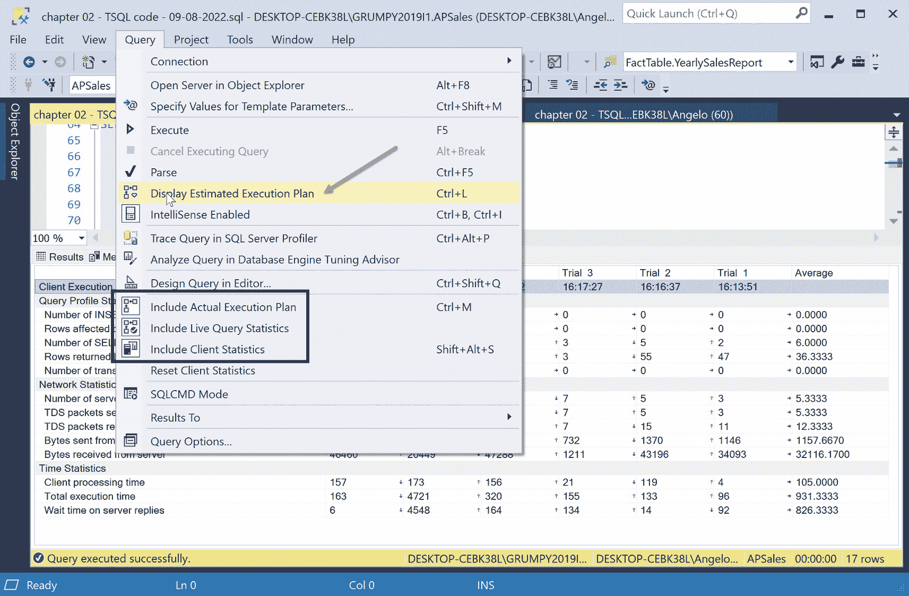

一个 SSMS 窗口的截图。菜单栏中的 Query 选项被选中。它打开一个包含 18 个选项的下拉菜单，其中高亮显示了 Display Estimated Execution Plan。

图 2-3

查询下拉菜单

你还可以通过选择前面图中方框标出的选项，来包含执行计划、实时查询统计信息和客户端统计信息。

访问这些工具的另一种方式是点击前面图 2-4 中方框标出的菜单栏中的一个或多个按钮。

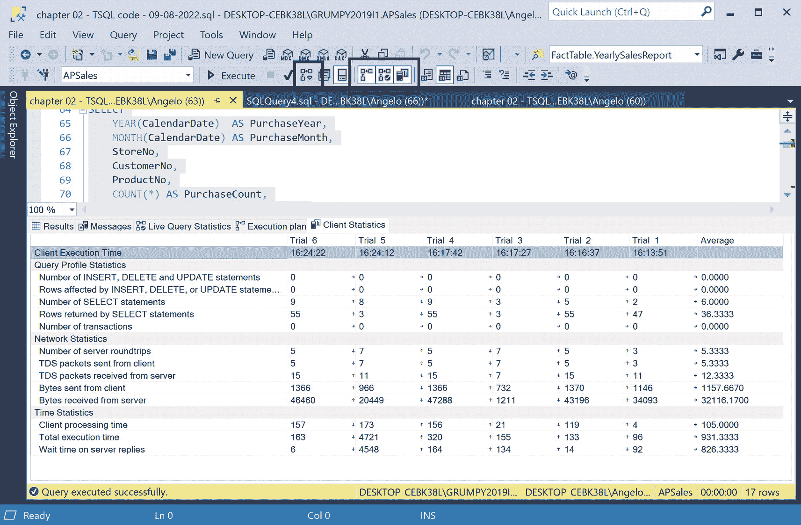

一个 SSMS 窗口的截图。它展示了一段代码和一个包含 8 列 17 行的表格。列标题为：无列名、trial 6、trial 5、trial 4、trial 3、trial 2、trial 1 和 average。它展示了客户端执行时间、网络统计和时间统计的详细信息。

图 2-4

查询性能工具

第一个按钮将打开 `Display Estimated Execution Plan` 工具。参考前面图中方框标出的接下来的三个按钮，你也可以点击 `Include Actual Query Plan` 按钮生成查询计划，或点击 `Include Live Query Statistics` 按钮生成 IO 统计信息。最后，你可以点击最后一个名为 `Include Client Statistics` 的按钮来包含客户端统计信息。将鼠标悬停在每个按钮上，会显示一个说明该按钮功能的消息。

让我们看一个查询计划示例。请参考图 2-5。

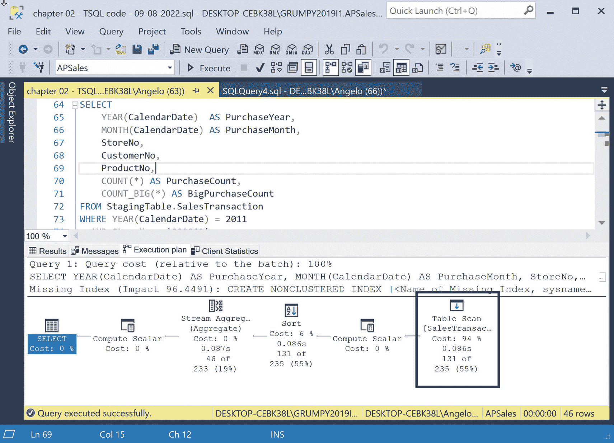

一个 SSMS 窗口的截图。它展示了一段代码和一个包含 6 个组件的估算查询计划。这些组件是：select、compute scalar、stream aggregate、sort、compute scalar 和 table scan。sort 和 table scan 的开销分别为 6% 和 94%。

图 2-5

估算查询计划

查询计划是从右向左读取的。它包含称为任务（或操作，或简称步骤）的图标，这些任务执行特定功能，如排序数据、合并数据或使用索引。每个任务都关联一个开销估算，显示为执行查询所花费总时间的百分比。

例如，查看前面图中计划右侧的第一个任务，我们看到一个表扫描（table scan），其开销为 94%。这立即告诉我们存在问题。这个任务占用了大部分的执行时间。

这类任务就是我们需要用某种策略来解决的，比如添加索引或重写查询。

注意

有时，由于数据量巨大，唯一能做的就是在夜间运行查询，以便加载到一个反规范化的报表表中。我们为什么想这样做？因为这将为任何访问反规范化表的用户提供快速的性能表象。在处理用户报表时，连接、计算和其他复杂逻辑都被消除了。用户查询的是一个预加载并计算好的表！

最后，确保在报表工具（如 `SSRS`）中运行这些查询，这样你可以添加筛选器来限制用户看到的内容。（根据用户如何筛选查询来创建索引。）没有人愿意滚动浏览数百万行数据。

我们还看到一个对数据进行排序的步骤，它占用了总执行时间的 6%。注意，94% + 6% = 100%。通常，当你把所有估算开销相加时，它们会加起来等于 100%。

接下来，我们用以下命令开启 `IO` 和 `TIME` 统计信息：

```
SET STATISTICS IO ON
GO
SET STATISTICS TIME ON
GO
```

顺便提一下，在分析结束时，将关键字 `ON` 替换为 `OFF` 以关闭统计信息：

```
SET STATISTICS IO OFF
GO
SET STATISTICS TIME OFF
GO
```

使用这些命令并执行查询后，我们会得到一些重要的性能统计信息：

```
SQL Server parse and compile time:
CPU time = 0 ms, elapsed time = 0 ms.
SQL Server Execution Times:
CPU time = 0 ms,  elapsed time = 0 ms.
SQL Server Execution Times:
CPU time = 0 ms,  elapsed time = 0 ms.
SQL Server parse and compile time:
CPU time = 15 ms, elapsed time = 70 ms.
(46 rows affected)
Table 'Worktable'. Scan count 0, logical reads 0, physical reads 0, page server reads 0, read-ahead reads 0, page server read-ahead reads 0, lob logical reads 0, lob physical reads 0, lob page server reads 0, lob read-ahead reads 0, lob page server read-ahead reads 0.
Table 'SalesTransaction'. Scan count 1, logical reads 718, physical reads 0, page server reads 0, read-ahead reads 718, page server read-ahead reads 0, lob logical reads 0, lob physical reads 0, lob page server reads 0, lob read-ahead reads 0, lob page server read-ahead reads 0.
(6 rows affected)
```

我们想关注的一些有趣值是扫描计数、逻辑读和物理读，以及是否使用了工作表。注意逻辑读计数为 718。这需要降低。如果你有足够的内存可用，逻辑读在内存中执行，否则在硬盘上执行，这会大大降低速度。目标应是个位数的读计数。

当前的目标是让你了解这些工具以及输出是什么样子。在开发使用窗口函数和 `OVER()` 子句的 TSQL 查询时，我们将研究它们的含义。现在，只需知道在哪里可以找到它们，如何开启它们，以及运行查询时如何查看结果。

提示

你可能需要查阅前面提到的计数器在 Microsoft 文档中的说明，以开始理解它们的含义。是的，有很多，但理解它们会物有所值：[`https://learn.microsoft.com/en-us/sql/relational-databases/showplan-logical-and-physical-operators-reference?view=sql-server-ver16`](https://learn.microsoft.com/en-us/sql/relational-databases/showplan-logical-and-physical-operators-reference?view=sql-server-ver16)。

上面的 URL 输入起来相当长。只需使用你最喜欢的搜索引擎搜索 “Showplan Logical and Physical Operators Reference”。

最后，`Display Estimated Execution Plan` 工具还会建议一个为提高查询性能而需要的缺失索引。让我们看一个例子。请参考清单 2-1。


### 查询优化与性能分析

```sql
/*
Missing Index Details from chapter 02 - TSQL code - 09-08-2022.sql - DESKTOP-CEBK38L\GRUMPY2019I1.APSales (DESKTOP-CEBK38L\Angelo (63))
The Query Processor estimates that implementing the following index could improve the query cost by 96.4491%.
*/
/*
USE [APSales]
GO
CREATE NONCLUSTERED INDEX []
ON [StagingTable].[SalesTransaction] ([ProductNo])
INCLUDE ([CustomerNo],[StoreNo],[CalendarDate])
GO
*/
Listing 2-1
Suggested Index by Query Plan Tool
```

生成了许多有用的注释和索引模板。注意那些方括号。当`SSMS`为你生成代码时，它们总是被包含在内，可能只是为了防止你在数据库表和列中使用了带空格或特殊字符的名称！

生成的语句告诉我们，它需要一个基于`StagingTable` schema 下名为`SalesTransaction`的表的非聚集索引。需要包含的列是`ProductNo`列，以及`INCLUDE`关键字后出现的`CustomerNo`、`StoreNo`和`CalendarDate`列。

如果我们创建这个索引并重新运行“**显示估计执行计划**”工具，应该会看到一些改进。

请参见图 2-6。

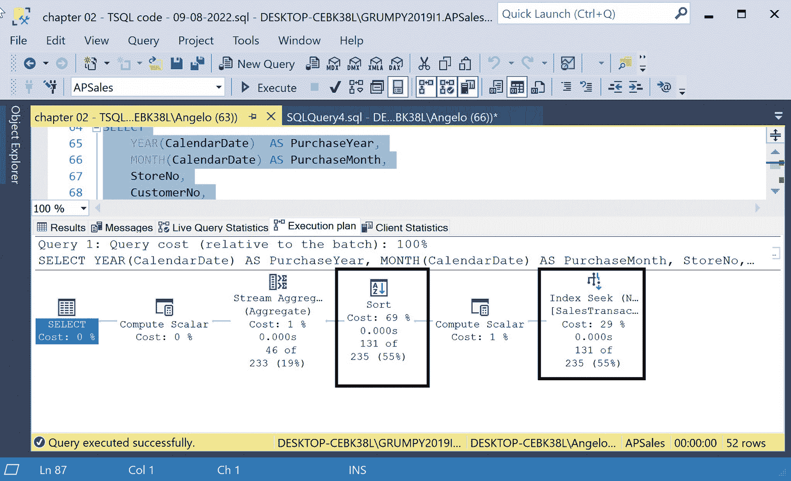

一个`SSMS`窗口的截图。它展示了一段代码和一个包含 6 个组件的修订后估计查询计划。这些组件是 select、compute scalar、stream aggregate、sort、compute scalar 和 index seek。stream aggregate、sort 和 index seek 的成本分别为 1%、69% 和 29%。

**图 2-6** 修订后的估计查询计划

成功！表扫描步骤已被成本为 29%的索引查找步骤取代。排序步骤仍然存在，成本增加到 69%。这是更好还是更糟呢？

让我们在打开统计信息设置的情况下执行查询，看看结果如何。

请参见图 2-7。

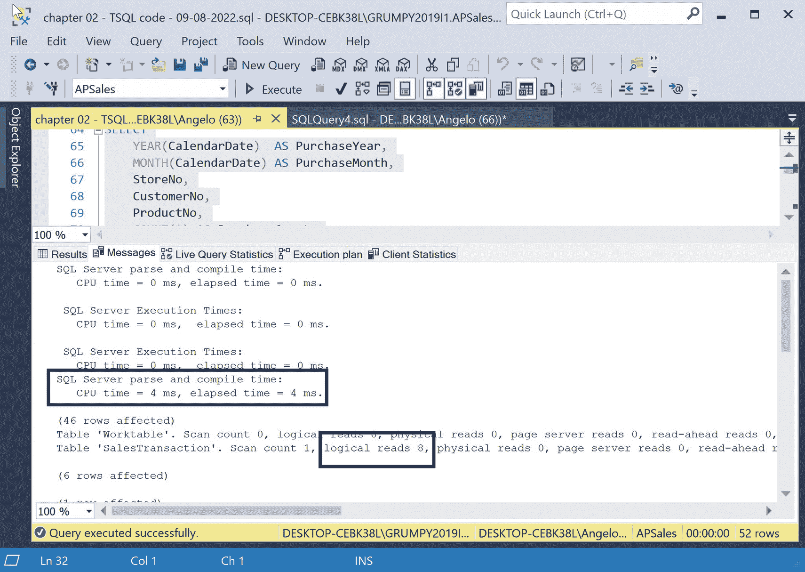

一个`SSMS`窗口的截图。文本展示了`IO`和`TIME`统计信息。对于`CPU`和已用时间，`SQL Server`的解析和编译时间分别为 4 毫秒和 4 毫秒。`SQL Server`的执行时间分别为 0 毫秒和 0 毫秒。影响了 46 行，共 2 个表列。

**图 2-7** 统计信息`IO`报告

哇！之前的逻辑读次数 718 次现已减少到 8 次。之前的`CPU`时间是 15 毫秒，现在减少到 4 毫秒。显著的改进。回想一下，逻辑读表示必须读取内存缓存的次数。如果内存不足，则必须读取物理磁盘。

当表很大而你的磁盘速度又慢时，这将非常昂贵！企业生产环境通常在固态硬盘上实现`TEMPDB`以提高性能。

我差点忘了客户端统计信息。这是当你点击该选项时生成的报告。请参见图 2-8。

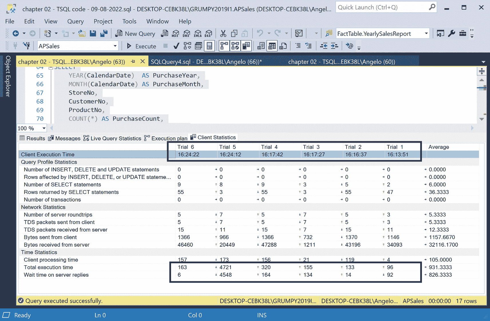

一个`SSMS`窗口的截图。它展示了一段代码和一个包含 8 列 17 行的表格。列标题为“no column name”、“trial 6”、“trial 5”、“trial 4”、“trial 3”、“trial 2”、“trial 1”和“average”。它展示了客户端执行时间、网络统计信息和时间统计信息的详细信息。

**图 2-8** 客户端统计信息

这份报告中的统计信息非常全面。注意所有的试验。这意味着查询运行了六次，我们获得了每次试验运行的客户端执行时间。还有统计信息的平均执行时间。另一组重要信息是总执行时间和等待服务器回复的时间。试验 6 的信息似乎是最好的，可能是因为索引的原因。

这些信息加上我们刚刚检查的工具的输出，将使你能够诊断和识别性能瓶颈。确保你用一些简单的查询练习一下，看看是否能解释返回的统计信息。

顺便说一句，我不想暗示性能调优是轻而易举的事。这是一门难以掌握的学科，需要多年的实践才能达到专家水平。我只是触及了这个非常有趣且重要的活动的表面。

这一节很长，正如前面所说，旨在向你介绍这些工具并查看它们的输出。信息量很大，所以如果你还不明白所有统计信息的含义，请不要担心。现阶段重要的是你知道在哪里可以找到它们，并能在一些查询上尝试它们。随着本章的进行，我们将深入探讨重要的查询计划步骤告诉了我们什么，以及如何利用这些信息来创建索引以提供更好的性能。

我们将对几个查询进行此操作，但第 14 章将专门讨论性能调优。我将包含我们在其他章节中开发的查询的查询计划示例，以便你能了解与窗口函数相关的性能问题以及如何解决它们。

我们准备好开始编写一些代码了！

## 聚合函数

以下是我们将在本章中讨论的窗口聚合函数：

*   `COUNT()` 和 `COUNT_BIG()`
*   `SUM()`
*   `MAX()`
*   `MIN()`
*   `AVG()`
*   `GROUPING()`
*   `STRING_AGG()`
*   `STDEV()`
*   `STDEVP()`
*   `VAR()`
*   `VARP()`

我们将采取的方法是：为每个函数展示代码、进行讨论、显示执行时的结果，并检查结果。我们甚至可能生成一些`Excel`图表来更好地分析结果。

对于`GROUPING()`和`STDEV()`函数，我们将按照前面讨论的步骤生成`IO`和`TIME`统计信息以及估计的查询执行计划。通常，查询计划也会建议一个要创建的推荐索引。如果建议了索引，我们将复制模板并通过给它一个名称来修改它，然后创建它。

一旦索引创建完毕，我们重新生成统计信息和查询计划，并将新的统计信息集与之前的统计信息集进行比较，以查看通过创建新索引获得了哪些性能改进。

有时创建索引没有帮助，甚至可能损害性能，更不用说你创建的索引越多，在需要删除、更新或插入行时性能下降就越严重。

### `COUNT( )`, `MAX( )`, `MIN( )`, `AVG( )` 和 `SUM( )` 函数

让我们开始研究那些你将在查询和报告中频繁使用的核心函数。下面是一个查询示例，它报告了交易次数、交易的最大和最小数量，以及特定产品的购买总数量。

我们希望创建一个按年、月、商店和产品分类的交叉表报告，以给出销售业绩概况。请不要将交易次数与售出商品数量混淆。单次交易可能包含 10 件商品，或者 1 件，也可能是 20 件或更多。请注意这其中的区别。

最后，我们希望将结果限制为单个商店、产品和年份，以便进行分析。请参考代码清单 2-2 中的查询。

```sql
SELECT YEAR(CalendarDate) AS PurchaseYear,
MONTH(CalendarDate) AS PurchaseMonth,
StoreNo,
ProductNo,
ProductName,
COUNT(*) AS NumTransactions,
MIN(TransactionQuantity) AS MinQuantity,
MAX(TransactionQuantity) AS MaxQuantity,
AVG(TransactionQuantity) AS AvgQuantity,
SUM(TransactionQuantity) AS SumQuantity
FROM SalesReports.YearlySalesReport
WHERE StoreNo = 'S00001'
AND ProductNo = 'P0000001112'
AND YEAR(CalendarDate) = 2010
GROUP BY YEAR(CalendarDate),
MONTH(CalendarDate),
StoreNo,
ProductNo,
ProductName
ORDER BY YEAR(CalendarDate),
MONTH(CalendarDate),
StoreNo,
ProductNo,
ProductName
GO
```
代码清单 2-2：基础销售概况报告

这里没有使用任何花哨的语法，没有 `OVER()` 子句，没有 `CTE`，仅仅是一个从 `YearlySalesReport` 表中检索行的 `SELECT` 子句。我们包含了 `COUNT()`, `MIN()`, `MAX()`, `AVG()` 和 `SUM()` 函数，并将 `TransactionQuantity` 列作为参数传递。

`WHERE` 子句对结果进行筛选，因此我们只获取商店 `S00001`、产品 `P0000001112` 和日历年 `2010` 的行。

当你使用聚合函数时，必须包含 `GROUP BY` 子句，而我们利用 `ORDER BY` 子句对结果进行排序。请参考图 2-9 中的部分结果。

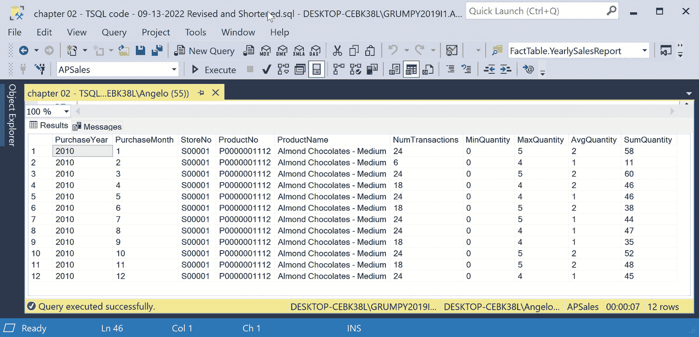

这是一个 SSMS 窗口的截图。它呈现了一个包含 10 列和 13 行的表格。列标题分别是购买年份、购买月份、商店编号、产品编号、产品名称、交易次数、最小数量、最大数量、平均数量和总数量。

图 2-9：销售概况报告

看起来二月份是一个销售淡季，这有点奇怪，毕竟有情人节假期。你本会以为销量会上升。

### 使用 `OVER( )`

让我们基于之前的查询，增加一些窗口功能。这个解决方案分为两部分。首先，我们需要创建一个名为 `ProductPurchaseAnalysis` 的 `CTE`（公用表表达式），它执行一些日期操作，并包含了 `COUNT()` 函数，用于按年、月、商店编号和产品编号生成交易次数。

解决方案的第二部分是创建一个查询，引用该 `CTE` 并使用所有基本的聚合函数，但这次我们将包含一个 `OVER()` 子句，以便在分区中创建并排序行以进行处理。让我们来检查一下代码。

请参考代码清单 2-3。

```sql
WITH ProductPurchaseAnalysis (
PurchaseYear,PurchaseMonth,CalendarDate,StoreNo,CustomerFullName,ProductNo,ItemsPurchased,NumTransactions
)
AS (
SELECT YEAR(CalendarDate) AS PurchaseYear,
MONTH(CalendarDate) AS PurchaseMonth,
CalendarDate,
StoreNo,
CustomerFullName,
ProductNo,
TransactionQuantity AS ItemsPurchased,
COUNT(*)            AS NumTransactions
FROM SalesReports.YearlySalesReport
GROUP BY YEAR(CalendarDate) ,
MONTH(CalendarDate),
CalendarDate,
StoreNo,
CustomerFullName,
ProductNo,
ProductName,
TransactionQuantity
)
```
代码清单 2-3：第一部分，`CTE`

非常直接。从日历日期中提取出日历年份和月份，并包含在 `SELECT` 子句中。商店编号、客户全名和产品编号也被包含进来。最后，包含了交易数量（即购买了多少件商品），并且我们按照 `GROUP BY` 子句定义的每个组来统计交易次数。

现在来看这个批处理的第二部分，即引用 `CTE` 的查询。这个查询将为我们提供每个产品按年、月、客户和商店分类的交易次数和购买数量的概况。

请参考代码清单 2-4。

```sql
SELECT PurchaseYear,PurchaseMonth,CalendarDate,StoreNo,
CustomerFullName,ProductNo,NumTransactions,
SUM(NumTransactions) OVER (
PARTITION BY PurchaseYear,CustomerFullName
ORDER BY CustomerFullName,PurchaseMonth
) AS SumTransactions,ItemsPurchased,
SUM(ItemsPurchased) OVER (
PARTITION BY PurchaseYear,CustomerFullName
ORDER BY CustomerFullName,PurchaseMonth
) AS TotalItems,
AVG(CONVERT(DECIMAL(10,2),ItemsPurchased)) OVER (
PARTITION BY PurchaseYear,CustomerFullName
ORDER BY CustomerFullName,PurchaseMonth
) AS AvgPurchases,
MIN(ItemsPurchased) OVER (
PARTITION BY PurchaseYear,CustomerFullName
ORDER BY CustomerFullName,PurchaseMonth
) AS MinPurchases,
MAX(ItemsPurchased) OVER (
PARTITION BY PurchaseYear,CustomerFullName
ORDER BY CustomerFullName,PurchaseMonth
) AS MaxPurchases
FROM ProductPurchaseAnalysis
WHERE StoreNo = 'S00001'
AND ProductNo = 'P0000001112'
AND PurchaseYear = 2010
AND PurchaseMonth = 1
AND ItemsPurchased > 0
GROUP BY PurchaseYear,PurchaseMonth,CalendarDate,StoreNo,
CustomerFullName,ProductNo,NumTransactions,ItemsPurchased
ORDER BY CustomerFullName,PurchaseYear,PurchaseMonth,CalendarDate,StoreNo,
ProductNo,ItemsPurchased
GO
```
代码清单 2-4：第二部分 – 使用窗口函数

注意，我添加了一个筛选条件，仅报告 `2010` 年一月份的结果。这样做是为了保持结果集较小，以便调试和分析查询。一旦它能正确运行，你可以移除这些筛选条件以获取所有月份（当你下载代码时）。你也可以移除 `PurchaseYear` 筛选条件以获取更多年份的数据。如果你想要所有商店和客户的信息，可以修改查询，将结果插入到一个报告表中，然后你就可以编写查询来查看任何你想要的客户、商店和产品的组合了。

让我们继续浏览剩余的代码。

每个 `OVER()` 子句中都包含了一个 `ORDER BY` 子句和一个 `PARTITION BY` 子句。数据集结果按 `PurchaseYear` 和 `CustomerFullName` 列进行分区。分区内的行按 `CustomerFullName` 和 `PurchaseMonth` 排序。


## 查询结果分析与分组函数

如前所述，查询中包含一个 `WHERE` 子句，用于按商店 “S00001”、产品 “P0000001112”、购买年份 2010 年以及 1 月份进行过滤。我还过滤掉了任何 `ItemsPurchased` 值为零的记录。（它们不知何故在测试数据的表加载过程中混了进来。这个数字是随机生成的，所以零值会混进来！）

让我们看看结果。请参考图 2-10。

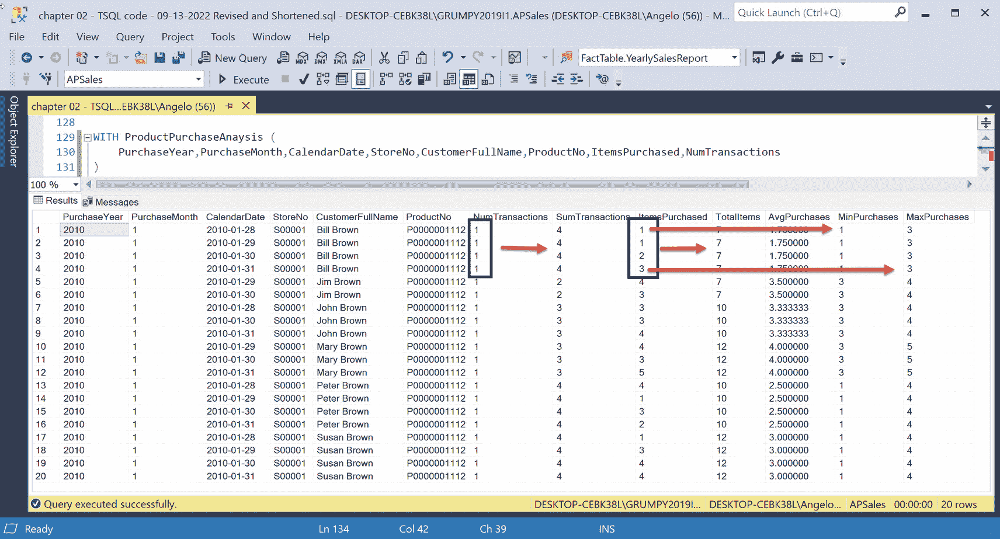

SSMS 窗口的截图。它展示了一个包含 13 列和 21 行的表格。列标题为：购买年份、月份、日历日期、商店编号、客户名称、产品编号、交易次数与总和、已购商品、总商品数、平均购买量、最小和最大购买量。

图 2-10

交易数量与已购商品概况

让我们重点关注 Bill Brown 的购买记录。有四个日期发生了购买。假设每天一次购买，这总共就是四笔交易，显示在 `SumTransactions` 列中。

接下来，如果我们查看 `ItemsPurchased` 列，我们会看到与 Bill 购买商品的四天相对应的四个值。在 1 月 28 日和 29 日，他每天购买了一件商品。在 1 月 30 日，他购买了两件，在 1 月 31 日购买了三件。如果我们将它们全部相加，得到总购买量为七件，这反映在 `TotalItems` 列中。

注意，如果未包含窗口框架子句，`PARTITION BY` 和 `ORDER BY` 子句的默认行为。总计出现在结果的每一行中。这意味着在计算当前行的每个总计值时，会包含相对于当前正在处理的行之前和之后的所有行。

这同样适用于平均值的计算。最后，注意最小值和最大值。它们可以清楚地在 `ItemsPurchased` 列中看到。Bill 的最小购买量是一件商品，而他的最大购买量是三件商品。

这种处理模式对于由分区定义的每一组行都会重复。

### GROUPING() 函数

`GROUPING()` 函数允许您为数据类别定义的层级中的每个级别创建汇总值（例如 Excel 数据透视表中的汇总）。一图胜千言，它阐明了此函数的结果。请参考图 2-11。

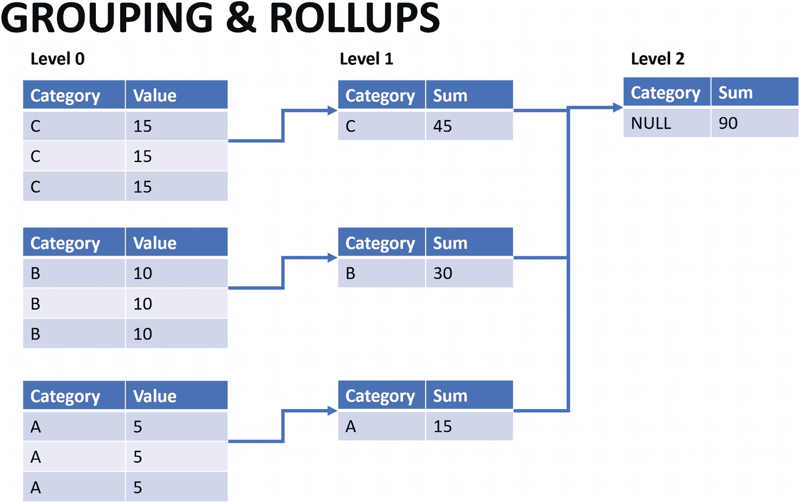

一个图表展示了 3 个层级：0、1 和 2。层级 0 有三行类别 A、B、C，其值分别为 5、10、15。层级 1 有三个类别 A、B、C，其总和分别为 15、30、45。层级 2 有类别 NULL，其总和为 90。

图 2-11

数据组内汇总的概念模型

从图表左侧的三行类别开始，数据集中的每一行都有一个类别和一个值。类别是 A、B 和 C。如果我们在层级 0 上对每个类别的值进行汇总，我们会在层级 1 得到类别 A 的汇总值 15，类别 B 的汇总值 30，类别 C 的汇总值 45。如果我们对这三个汇总总计进行汇总，我们会在层级 2 得到最终值 90。

这看起来很容易，但想象一下，如果您必须对组层级中的五个或更多级别进行数据汇总，复杂性会有多大。例如，我们可以按年份、月份、产品类别、产品子类别和产品进行汇总。让我们再加上客户，这样我们就能看到按客户统计的总计！这可能使输出难以阅读和分析，因此请确保提供满足用户要求的最少必要信息。

有了这些知识，让我们编写一个查询，为我们的销售数据创建汇总，并尝试在 `ORDER BY` 子句中使用一个巧妙的技巧，使结果易于浏览。

请参考代码清单 2-5。

```sql
WITH StoreProductSalesAnalysis
(TransYear,TransQuarter,TransMonth,TransDate,StoreNo,ProductNo,MonthlySales)
AS
(
SELECT
YEAR(CalendarDate)        AS TransYear,
DATEPART(qq,CalendarDate) AS TransQuarter,
MONTH(CalendarDate)       AS TransMonth,
CalendarDate              AS TransDate,
StoreNo,
ProductNo,
SUM(TotalSalesAmount)     AS MonthlySales
FROM FactTable.YearlySalesReport
GROUP BY
CalendarDate,
StoreNo,
ProductNo
)
SELECT TransYear,
TransQuarter,
TransMonth,
StoreNo,
ProductNo,
MonthlySales,
SUM(MonthlySales)      AS SumMonthlySales,
GROUPING(MonthlySales) AS RollupFlag
FROM StoreProductSalesAnalysis
WHERE TransYear = 2011
AND ProductNo = 'P0000001103'
AND StoreNo = 'S00001'
GROUP BY TransYear,
TransQuarter,
TransMonth,
StoreNo,
ProductNo,
MonthlySales WITH ROLLUP
ORDER BY TransYear,
TransQuarter,
TransMonth,
StoreNo,
ProductNo,
(
CASE
WHEN MonthlySales IS NULL THEN 0
END
) DESC,
GROUPING(MonthlySales) DESC
GO
```

代码清单 2-5

生成汇总报告

我们使用了与之前示例相同的 CTE，但这个查询有一些复杂性。我们使用 `SUM()` 函数来生成每月销售额的汇总，并使用 `GROUPING()` 函数来创建 `GROUP BY` 子句中包含的列的汇总。`GROUPING()` 函数紧跟在 `SELECT` 子句中的最后一列之后。

我们为什么要做这一切？

具体来说，我们希望按年份、季度、月份、商店编号和产品编号对销售汇总进行汇总。这些代表了我们汇总层级中的各个级别。

我们需要在 `ORDER BY` 子句中包含一些巧妙的代码，以便显示效果看起来有点像我们刚刚讨论的图表。每次我们汇总一个级别时，许多 `NULL` 会出现在那些不再适用于当前层级的行中（因为汇总了上一级别的值）。如果没有对结果进行正确的排序，将很难理解。

我们需要做的是在 `ProductNo` 列之后的 `ORDER BY` 子句中引入一个 `CASE` 语句，该语句将告诉查询如果 `MonthlySales` 列是 `NULL` 时该如何处理：

```sql
ProductNo,
(
CASE
WHEN MonthlySales IS NULL THEN 0
END
) DESC,
```


如果值为 `NULL`，则使用 0 并按降序排序。注意末尾的 `GROUPING()` 函数。对于这些值，也按降序排序。对于 `ORDER BY` 子句中的所有其他列，按升序排序。（提醒：如果未包含 `ASC` 关键字，则默认为升序排序。）

让我们执行查询并查看结果。
请参考图 2-12。

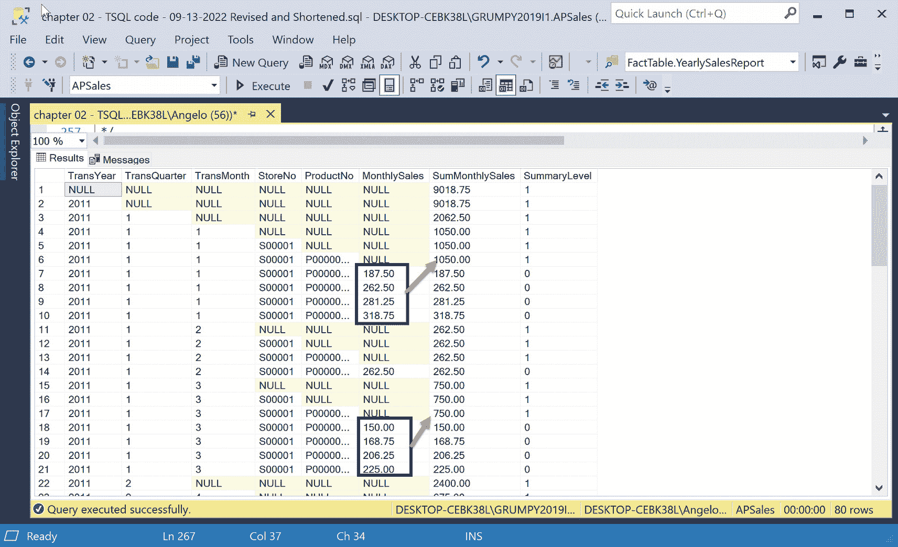

一张 SSMS 窗口的截图。它展示了一个有 9 列和 22 行的表格。列标题是交易年份、交易季度、交易月份、商店编号、产品编号、月销售额、累计月销售额和汇总级别。

图 2-12：一个汇总报告

自我感觉还不错吧！结果看起来和我们之前讨论的概念图差不多（可能我有点牵强了）。

随着你向上遍历层次结构，会出现更多的 `NULL`。还要注意 `SummaryLevel` 列。如果值为零，则我们处于层次结构中的叶行（或最低级别节点）。如果值为 1，则我们处于层次结构中某个位置的汇总行。

查看两组高亮显示的行，如果我们将 $150.00、$168.75、$206.25 和 $225.00 相加，得到的总值是 $750.00。如果检查第二组并将 $187.50、$262.50、$281.25 和 $318.75 相加，我们得到 $1050.00。后一个值是由年份、季度、月份、商店和产品定义的级别组的汇总。

这只是部分截图，但汇总模式在层次结构组中的每一组行都会重复。

看一下第 3 行中的 $2062.50 总计，这代表该年份第一季度的汇总。第 2 行包含该年度的总计，第 1 行是总计。它与年度总计相同。如果我们包含了其他年份，这个总计当然会大得多。

请自行尝试此查询，方法是从本书专用的 Google 网站下载代码，并包含两三年的数据，看看结果如何。

**提示：** 对于此类查询，始终通过使用 `WHERE` 子句从小的结果集开始，这样你可以确保所有数据都正确汇总，并且排序无误，从而生成清晰易懂的输出。一旦你确信其工作正确，就可以移除 `WHERE` 子句的筛选器，以满足原始的查询规范。（在小数据集上测试！）

### GROUPING：性能调优注意事项

尽管第 14 章专门讨论性能调优，但让我在这里插入一个例子。图 2-13 是我们刚刚讨论的查询的查询计划。

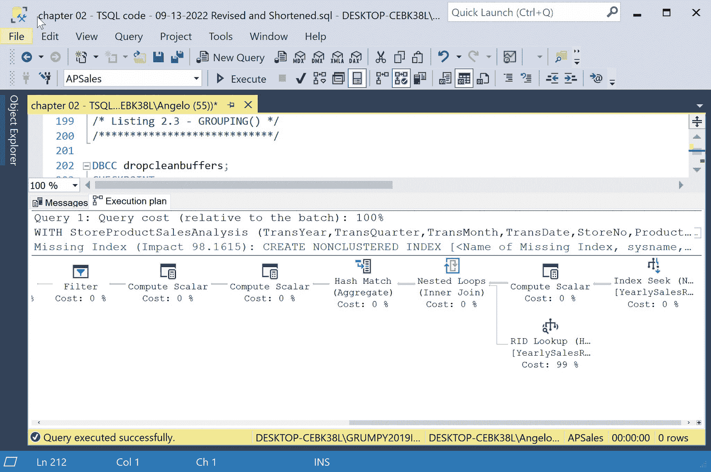

一张 SQL SSMS 窗口的截图。它展示了一个包含 8 个组件的查询计划。这些组件是筛选器、计算标量、计算标量、哈希匹配、嵌套循环、计算标量、RID 查找和索引查找。RID 查找的成本是 99%。其他组件的成本值为 0。

图 2-13：`GROUPING()` 函数示例的查询计划

注意计划右侧的索引查找。尽管我们使用了索引，但查询计划估算器建议我们添加一个不同的索引。索引查找的成本为 0%，但 RID（行 ID）查找任务的成本为 99%。RID 查找是基于索引中的 RID 针对 `YearlySalesReport` 表执行的。所以这看起来非常昂贵。剩余任务的成本为 0%，因此我们暂时忽略这些。

让我们通过右键单击它并选择“缺失索引详细信息”来复制建议的索引模板。它会出现在 SSMS 的一个新查询窗口中。我们真正需要做的就是给新索引起个名字。

请参考清单 2-6。

```
/*
Missing Index Details from chapter 02 - TSQL code - 09-13-2022.sql - DESKTOP-CEBK38L\GRUMPY2019I1.APSales (DESKTOP-CEBK38L\Angelo (55))
The Query Processor estimates that implementing the following index could improve the query cost by 98.1615%.
*/
/*
USE [APSales]
GO
CREATE NONCLUSTERED INDEX []
ON [SalesReports].[YearlySalesReport] ([ProductNo],[StoreNo])
INCLUDE ([CalendarDate],[TotalSalesAmount])
GO
*/
DROP INDEX IF EXISTS [ieProductNoStoreNoDateTotalSalesAmt]
ON [SalesReports].[YearlySalesReport]
GO
CREATE NONCLUSTERED INDEX [ieProductNoStoreNoDateTotalSalesAmt]
ON [SalesReports].[YearlySalesReport] ([ProductNo],[StoreNo])
INCLUDE ([CalendarDate],[TotalSalesAmount])
GO
Listing 2-6: 建议的新索引
```

复制建议的索引模板并将其粘贴到注释下方。你需要做的就是给它一个名字：`ieProductNoStoreNoDateTotalSalesAmt`。

由于我们正在学习索引和性能调优，我决定给索引起个冗长的名字，这样当你处理它们时，你知道涉及哪些列。这是一个非聚集索引。注意日期和销售额列是如何直接包含在 `INCLUDE` 关键字之后的。让我们创建索引并生成新的查询计划。

我们需要拆分查询计划，因为它相当大。

请参考图 2-14 查看第一部分。

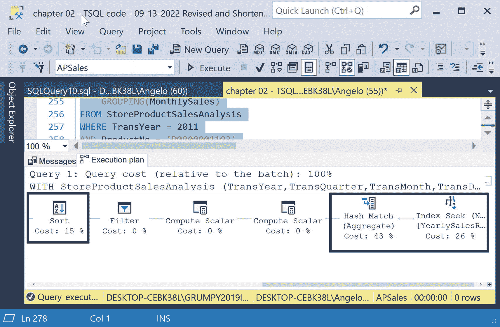

一张 SSMS 窗口的截图。它展示了修订后查询计划的 A 部分，包含 6 个组件。这些组件是排序、筛选器、计算标量、计算标量、哈希匹配和索引查找。排序、哈希匹配和索引查找的成本分别为 15%、43% 和 26%。

图 2-14：修订后的查询计划，A 部分

RID 查找和嵌套循环联接消失了。我们的索引查找现在关联了 26% 的成本。还有一个数据流的排序步骤，成本为 15%。让我们看看查询计划的第二部分。请参考图 2-15。

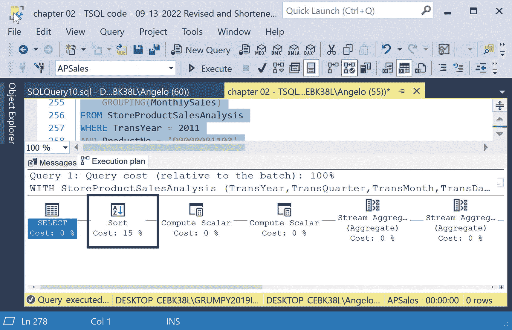

一张 SSMS 窗口的截图。它展示了修订后查询计划的 B 部分，包含 6 个组件。这些组件是选择、排序、计算标量、计算标量、流聚合和流聚合。排序的成本为 15%。其他组件的成本为零。

图 2-15：修订后的查询计划，B 部分

出现了更多的计算标量和流聚合步骤，但成本为 0%。我们将忽略这些。还有第二个排序步骤，成本为 15%。这更好吗？


让我们重新运行查询，但在此之前，我们需要通过执行以下命令来清空内存缓冲区并生成一些`IO`统计信息：

```
DBCC dropcleanbuffers;
CHECKPOINT;
GO
-- 打启统计信息收集
SET STATISTICS IO ON
GO
SET STATISTICS TIME ON
GO
```

`DBCC`命令将确保内存缓冲区被清空，这样我们就能从一个干净的起点开始。如果不执行此步骤，旧的查询计划将保留在内存缓存中，从而导致错误的结果。

接下来的两个命令将生成我们的`IO`和计时统计信息。让我们看看执行查询后得到的结果。

请参见表 2-3。

表 2-3

计划间的统计信息对比

| SQL Server 解析和编译时间 | 现有索引 | 新索引 |
| --- | --- | --- |
| CPU 时间 (ms) | 15 | 16 |
| 耗时 (ms) | **4492** | **89** |
| **统计信息 (YearlySalesReport)** | **现有索引** | **新索引** |
| 扫描次数 | 1 | 1 |
| 逻辑读取 | **260** | **10** |
| 物理读取 | 1 | 1 |
| 预读 | **51** | **7** |
| **SQL Server 执行时间** | **现有索引** | **新索引** |
| CPU 时间 (ms) | **83** | **74** |
| 耗时 (ms) | 0 | 0 |

查看统计信息，我们看到 CPU 时间增加了 1 毫秒(ms)，但耗时从 4492 毫秒下降到了 89 毫秒。扫描次数保持不变，但逻辑读取从 260 次下降到了 10 次。这是好的。

物理读取保持 1 次不变，预读从 51 次下降到了 7 次。最后，SQL Server 执行 CPU 时间从 83 毫秒下降到了 74 毫秒。总体来看，这个新索引似乎提升了性能。

这是一个你可以采取哪些步骤来分析性能的快速示例。如前所述，第 14 章将完全专注于对我们所涵盖的选定查询进行性能调优。现在，让我们看看下一个函数，即`STRING_AGG()`函数，它用于将一些字符串连接在一起（一语双关！）。

### STRING_AGG 函数

这个函数是做什么的？

正如其名，这个函数允许你聚合字符串。当你需要列出感兴趣的条目时，这非常有用，例如你想显示一个航班行程中的所有经停点，或者在我们的例子中，特定日期购买的商品。另一个有趣的例子是，如果你需要列出物流场景中的经停点，比如一辆卡车在运送我们示例中商店销售的巧克力糖果和蛋糕时将经过的所有站点。

这个函数易于使用。你需要提供列名和一个分隔符（通常是一个逗号）。

让我们看一个简单的例子，显示客户`C00000008`购买了哪些商品。我们希望按年和月获取结果。

请参见代码清单 2-7。

```
WITH CustomerPurchaseAnalysis(PurchaseYear,PurchaseMonth,CustomerNo,ProductNo,PurchaseCount)
AS
(
SELECT DISTINCT
YEAR(CalendarDate)  AS PurchaseYear,
MONTH(CalendarDate) AS PurchaseMonth,
CustomerNo,
ProductNo,
COUNT(*) AS PurchaseCount
FROM StagingTable.SalesTransaction
GROUP BY YEAR(CalendarDate),
MONTH(CalendarDate),
CustomerNo,
ProductNo
)
SELECT
PurchaseYear,
PurchaseMonth,
CustomerNo,
STRING_AGG(ProductNo,',') AS ItemsPurchased,
COUNT(PurchaseCount)      AS PurchaseCount
FROM CustomerPurchaseAnalysis
WHERE CustomerNo = 'C00000008'
GROUP BY
PurchaseYear,
PurchaseMonth,
CustomerNo
ORDER BY CustomerNo,
PurchaseYear,
PurchaseMonth
GO
代码清单 2-7
使用 STRING_AGG() 的产品报告
```

注意`STRING_AGG()`函数是如何使用的。`ProductNo`列与一个逗号（作为分隔符）一起传入。这里使用了一个公共表表达式（CTE），以便我们可以从`CalendarDate`列中提取年份和月份，并统计购买次数。

在这个例子中，CTE 中的计数值将始终为 1，因此我们需要通过计数出现次数来获取购买的总数量。最终的购买次数和聚合的产品编号在购买商品数量上应该匹配。

提示

务必在 CTE 中测试查询，以确保其按预期工作！

让我们看看图 2-16 中的结果。

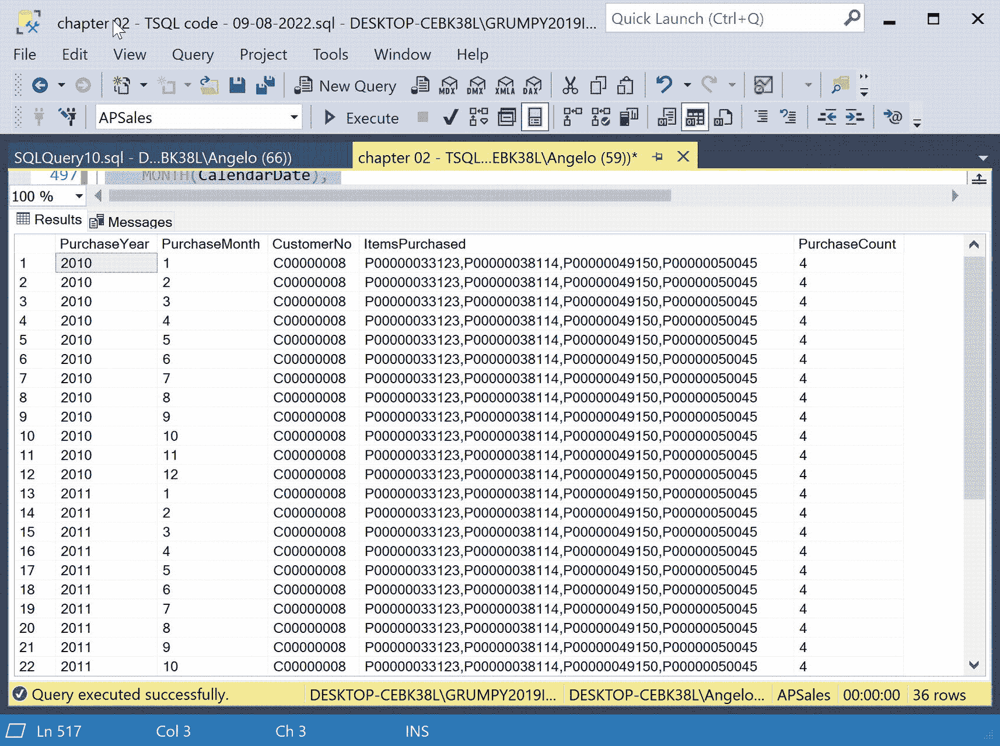

S S M S 窗口的截图。它展示了一个 6 列 22 行的表格。列标题为：序号、购买年份、购买月份、客户编号、已购商品和购买数量。每一行包含不同的值。

图 2-16

已购商品清单报告

这看起来是正确的。`ItemsPurchased`列列出了四个项目，`PurchaseCount`列的值为 4。看来这位客户每个月总是购买相同的商品和相同的数量。喜欢什么就坚持什么，我还能说什么呢？

你可以通过修改 CTE 查询，按客户进行筛选来验证结果：

```
SELECT DISTINCT
YEAR(CalendarDate)  AS PurchaseYear,
MONTH(CalendarDate) AS PurchaseMonth,
CalendarDate,
CustomerNo,
ProductNo,
COUNT(*) AS PurchaseCount
FROM StagingTable.SalesTransaction
WHERE CustomerNo = 'C00000008'
GROUP BY YEAR(CalendarDate),
MONTH(CalendarDate),
CalendarDate,
CustomerNo,
ProductNo
ORDER BY
YEAR(CalendarDate),
MONTH(CalendarDate),
CalendarDate,
CustomerNo,
ProductNo
GO
```

这是留给你尝试的内容。为了增加趣味性，可以调整加载`SalesTransaction`表的脚本，使得每个月购买的商品不同。

是时候看些统计数据了。


### STDEV() 与 STDEVP() 函数

`STDEV()` 函数在整体**总体**数据未知或不可用时，计算一组值的统计标准差。

`STDEVP()` 函数则在已知数据集的整个**总体**时，计算其统计标准差。

但这具体意味着什么呢？

它的含义是衡量数据集中各数字与算术 `MEAN`（即平均值的另一种说法）的接近或偏离程度。在我们的上下文中，平均值或 `MEAN` 是指所有相关数据值的总和除以数据值的个数。

还有其他类型的 `MEAN`，如几何平均数、调和平均数或加权 `MEAN`，我将在附录 B 中简要介绍。

那么，标准差是如何计算的呢？

您可以使用以下算法，通过 T-SQL 计算标准差：

*   计算所有相关值的平均值 (`MEAN`) 并将其存储在一个变量中。
*   对于数据集中的每个值
    *   减去计算出的平均值。
    *   将结果平方。
*   将所有结果求和，然后将该值除以数据元素个数减 1。（此步骤计算方差；若要计算整个总体的方差，则无需减 1。）
*   现在对方差取平方根，即得到标准差。

当然，您也可以直接使用 `STDEV()` 函数！如前所述，还有一个 `STDEVP()` 函数。如前所述，两者的唯一区别在于 `STDEV()` 作用于数据的**部分总体**。这适用于整个数据集未知的情况。而 `STDEVP()` 函数则作用于代表**整个总体**的数据集。

其语法如下：

```sql
SELECT STDEV( ALL | DISTINCT ) AS [Column Alias]
FROM [Table Name]
GO
```

您需要提供一个包含所需数据的列名。您可以选择性地指定 `ALL` 或 `DISTINCT` 关键字。如果省略这些关键字，与其他函数一样，默认行为将采用 `ALL`。使用 `DISTINCT` 关键字将忽略列中的重复值。

让我们看一个使用此窗口函数的 T-SQL 查询示例。我们希望按年份、客户、商店编号和产品编号计算标准差及平均值。

通常，我们从一个公共表表达式 (CTE) 开始，进行一些预处理并返回我们的数据集。

请参考清单 2-8。

```sql
WITH CustomerPurchaseAnalysis
(PurchaseYear,PurchaseMonth,StoreNo,ProductNo,CustomerNo,TotalSalesAmount)
AS
(
SELECT
YEAR(CalendarDate)  AS PurchaseYear,
MONTH(CalendarDate) AS PurchaseMonth,
StoreNo,
ProductNo,
CustomerNo,
SUM(TransactionQuantity * UnitRetailPrice) AS TotalSalesAmount
FROM StagingTable.SalesTransaction
GROUP BY YEAR(CalendarDate),MONTH(CalendarDate),ProductNo,CustomerNo,StoreNo
)
SELECT
cpa.PurchaseYear,
cpa.PurchaseMonth,
cpa.StoreNo,
cpa.ProductNo,
c.CustomerNo,
CONVERT(DECIMAL(10,2),cpa.TotalSalesAmount) AS TotalSalesAmount,
AVG(CONVERT(DECIMAL(10,2),cpa.TotalSalesAmount)) OVER(
--PARTITION BY cpa.PurchaseYear,c.CustomerNo
ORDER BY cpa.PurchaseYear,c.CustomerNo
) AS AvgPurchaseCount,
STDEV(CONVERT(DECIMAL(10,2),cpa.TotalSalesAmount)) OVER(
ORDER BY cpa.PurchaseMonth
) AS StdevTotalSales,
STDEVP(CONVERT(DECIMAL(10,2),cpa.TotalSalesAmount)) OVER(
ORDER BY cpa.PurchaseMonth
) AS StdevpTotalSales,
STDEV(CONVERT(DECIMAL(10,2),cpa.TotalSalesAmount)) OVER(
) AS StdevTotalSales,
STDEVP(CONVERT(DECIMAL(10,2),cpa.TotalSalesAmount)) OVER(
) AS StdevpYearTotalSales
FROM CustomerPurchaseAnalysis cpa
JOIN DimTable.Customer c
ON cpa.CustomerNo = c.CustomerNo
WHERE cpa.CustomerNo = 'C00000008'
AND PurchaseYear = 2011
AND ProductNo = 'P00000038114';
GO
```

清单 2-8：标准差销售分析

该 CTE 从日期中提取年份和月份部分。我们还通过将交易数量乘以单位零售价来计算总销售额。

我们计算了整个年份的平均值，因为我们希望在 Excel 电子表格中使用该值来计算和绘制正态分布的钟形曲线。我们很快会看到它。

接下来，使用 `STDEV()` 和 `STDEVP()` 函数计算标准差值。我们以两种不同的方式执行计算。第一对在 `OVER()` 子句中使用了 `ORDER BY` 子句，以便获得滚动的月度结果。第二对没有使用 `PARTITION BY` 或 `ORDER BY` 子句，因此默认的框架行为生效：处理结果时，包括相对于当前行的所有先前和后续行。

让我们在图 2-17 中查看结果。

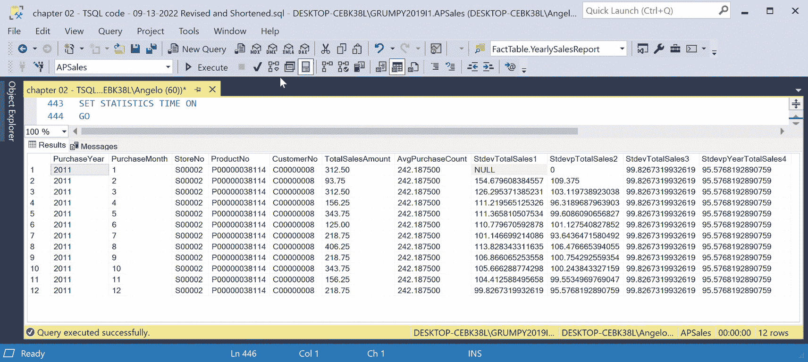

图 2-17：计算标准差

简短明了。结果针对一个客户，一年按月份展示。注意第一列标准差结果 `StdevTotalSales1` 中的 `NULL` 值。这是因为它是分区中的第一个值，无法为单个值计算标准差，因此结果为 `NULL`。而 `STDEVP()` 函数则没有问题，它直接返回 0。对于剩余月份，滚动标准差是逐月计算的。

如果您不喜欢 `NULL`，只需使用一个 `CASE` 语块来检测返回的值并用零替换即可！

列 `StdevTotalSales2` 使用了 `STDEVP()`，可以看到其值略低，因为使用了数据集的整个总体。

最后，列 `StdevTotalSales3` 和 `StdevTotalSales4` 计算了整个年份的标准差。我们将在 Excel 电子表格中使用 `STDEV()` 的年度结果来生成正态分布值，并基于每个正态分布值生成一个名为钟形曲线的图表。

现在让我们查看图 2-18 中的图表。

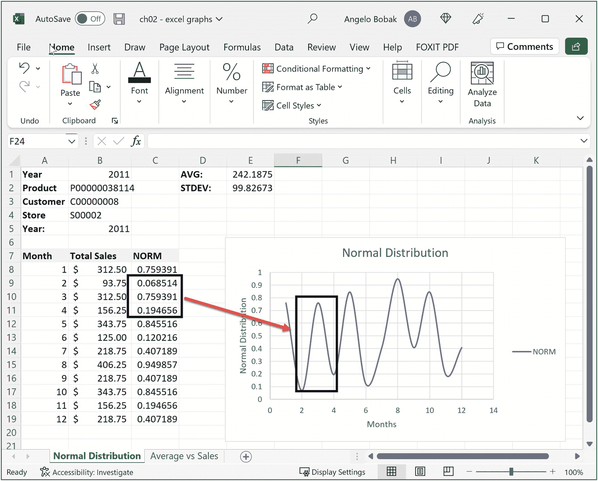

图 2-18：标准差钟形曲线

这里展示的是一系列小的钟形曲线。例如，注意第 2-4 个月和第 4-6 个月之间的曲线。在这种情况下，每条曲线由三个值生成：一个低值，然后一个高值，再回到一个低值。为第 2-4 个月生成的曲线值为 0.068514、0.759391 和 0.194656。这些都是钟形曲线的理想值。

为了生成每个月的正态分布，使用了 Excel 的 `NORM.DIST` 函数。该函数使用这些参数：数值、平均值 (`MEAN`) 以及我们查询生成的标准差。然后，我们为这些值插入一个建议的图表。


### STDEV：性能调优注意事项

让我们进行一些性能分析。通过高亮显示我们刚才讨论的查询，并使用常用方法之一生成查询计划，我们会看到一个似乎已经使用了索引的计划。

请参考图 2-19。

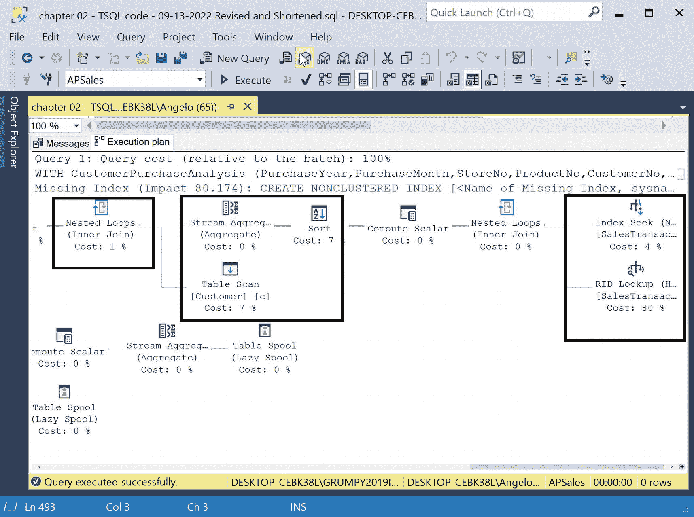

图 2-19
首次分析查询计划

从右向左看，我们看到一个成本为 4% 的索引查找（index seek）和一个估计成本为 80% 的 RID（行 ID）查找任务。这似乎是大部分工作发生的地方。

忽略成本为 0% 的任务，我们看到 `Customer` 表上的表扫描（table scan）成本为 7%，排序（sort）步骤成本为 7%。最后，我们看到一个成本为 1% 的嵌套循环内部连接（nested loops inner join）步骤。

这是一个部分截图。我忽略了成本为零的步骤，以便我们能够专注于高成本步骤（在你的查询中，请将所有步骤考虑在内）。

注意，这里生成了一个建议索引。将鼠标指针悬停在索引上（它会以绿色字体显示），然后右键单击该索引。当弹出菜单出现时，单击“缺失索引详细信息”以在新的查询窗口中生成 TSQL 代码。将出现清单 2-9 中的以下代码。

```
/*
Missing Index Details from chapter 02 - TSQL code - 09-13-2022.sql - DESKTOP-CEBK38L\GRUMPY2019I1.APSales (DESKTOP-CEBK38L\Angelo (65))
The Query Processor estimates that implementing the following index could improve the query cost by 80.174%.
*/
/*
USE [APSales]
GO
CREATE NONCLUSTERED INDEX []
ON [StagingTable].[SalesTransaction] ([CustomerNo],[ProductNo])
INCLUDE ([StoreNo],[CalendarDate],[TransactionQuantity],[UnitRetailPrice])
GO
*/
/* Copy code from above and paste and supply name */
DROP INDEX IF EXISTS [CustNoProdNoStoreNoDateQtyPrice]
ON [StagingTable].[SalesTransaction]
GO
CREATE NONCLUSTERED INDEX [CustNoProdNoStoreNoDateQtyPrice]
ON [StagingTable].[SalesTransaction] ([CustomerNo],[ProductNo])
INCLUDE ([StoreNo],[CalendarDate],[TransactionQuantity],[UnitRetailPrice])
GO
```
清单 2-9
估计查询计划 – 建议的索引

我需要做的只是复制并粘贴建议的索引模板，并为索引提供一个名称。我在名称中使用了与索引相关的所有列，以便清楚地表明该索引覆盖的内容。

在真实的生产环境中，你可能只会给它一个较短的名称，但由于我们处于学习模式，我决定在名称方面稍显冗长。我还添加了一个 `DROP INDEX` 命令，以便当你开始自行分析此查询时可以使用。

让我们创建索引，生成一个新的查询计划，然后执行查询，以便使用 `SET STATISTICS` 命令生成一些统计信息。

请参考图 2-20 获取新计划。

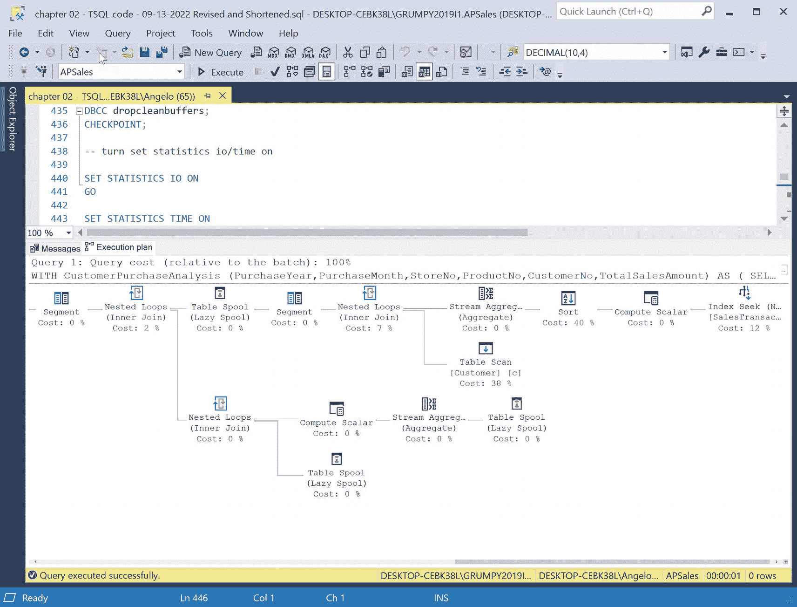

图 2-20
修订后的查询计划

有了一些明显的改进。从查询计划的右侧向左看，我们现在看到在 `SalesTransaction` 表上的索引查找成本为 12%。接下来是一个相当昂贵的排序步骤，成本为 40%。`Customer` 表使用表扫描，成本为 38%，这无法避免，因为我们没有为该表创建索引。这个表只有 100 行，所以索引很可能不会被使用，但你可以自行创建一个并进行实验，看看是否有任何好处。

正中间是一个成本为 7% 的嵌套循环内部连接，不算太昂贵。还有一个成本为 2% 的最终嵌套循环内部连接。对于我们的讨论，我们将忽略成本为 0% 的任务。

那么，这算是一种改进吗？看起来是的，因为有了索引查找。不过，`IO` 和 `TIME` 统计信息将给我们更清晰的图景，所以让我们来看看它们。

请参考表 2-4。

表 2-4
比较 IO 统计信息

| SQL Server 解析和编译时间 | 现有索引 | 新索引 |
| --- | --- | --- |
| CPU 时间（毫秒） | 0 | 31 |
| 已用时间（毫秒） | 11 | 79 |
| **统计信息（工作表）** | **现有索引** | **新索引** |
| 扫描计数 | 18 | 18 |
| 逻辑读取 | 133 | 133 |
| 物理读取 | 0 | 0 |
| 预读读取 | 0 | 0 |
| **统计信息（SalesTransaction）** | **现有索引** | **新索引** |
| 扫描计数 | 1 | 1 |
| 逻辑读取 | **43** | **5** |
| 物理读取 | 0 | 0 |
| 预读读取 | 0 | 0 |
| **统计信息（Customer）** | **现有索引** | **新索引** |
| 扫描计数 | 1 | 1 |
| 逻辑读取 | 216 | 216 |
| 物理读取 | 0 | 0 |
| 预读读取 | 0 | 0 |
| **SQL Server 执行时间** | **现有索引** | **新索引** |
| CPU 时间（毫秒） | 16 | 0 |
| 已用时间（毫秒） | 4 | 30 |

该表显示了创建索引前后的统计信息。

我认为结果很有趣。从 SQL Server 解析和编译时间开始，新索引的时间统计信息实际上增加了，而不是减少了。

工作表的统计信息保持不变，而 `SalesTransaction` 表的统计信息显著下降。逻辑读取从 43 次减少到 5 次，这非常好。物理读取和预读读取保持为 0。

最后，在处理结束时，对于 SQL Server 执行时间，CPU 时间从 16 毫秒降为零，这是一个显著的改进，而用时从 4 毫秒增加到了 30 毫秒。

总之，添加索引减少了逻辑读取，但解析和执行的用时增加了。

`SalesTransaction` 表大约有 24,886 行，这不算多。如果我们有几百万行，才会注意到实际性能的改进或变化。

表 2-5 显示了在我通过删除加载脚本中的任何 `WHERE` 子句过滤器加载了大约 175 万行数据后的前后统计信息。（此脚本可在出版商的 Google 站点上的本章加载脚本中找到。）

表 2-5
比较 200 万行数据上的统计信息

| SQL Server 解析和编译时间 | 现有索引 | 新索引 |
| --- | --- | --- |
| CPU 时间（毫秒） | **32** | **0** |
| 已用时间（毫秒） | **62** | **0** |
| **统计信息（工作表）** | **现有索引** | **新索引** |
| 扫描计数 | 18 | 18 |
| 逻辑读取 | 133 | 134 |
| 物理读取 | 0 | 0 |
| 预读读取 | 0 | 0 |
| **统计信息（SalesTransaction）** | **现有索引** | **新索引** |
| 扫描计数 | **5** | **1** |
| 逻辑读取 | **41840** | **76** |
| 物理读取 | 0 | 3 |
| 预读读取 | **38135** | **71** |
| **统计信息（Customer）** | **现有索引** | **新索引** |
| 扫描计数 | 1 | 1 |
| 逻辑读取 | 18 | 18 |
| 物理读取 | 0 | 0 |
| 预读读取 | 0 | 0 |
| **SQL Server 执行时间** | **现有索引** | **新索引** |
| CPU 时间（毫秒） | 485 | 0 |
| 已用时间（毫秒） | **2926** | **48** |


我们确实获得了一些有趣的统计数据。对于 SQL Server 的解析和编译时间步骤，CPU 时间和经过时间统计分别从 32 和 62 下降到了 0。

工作表的统计信息保持不变。

对于 `SalesTransaction` 表，我们确实看到了逻辑读取类别的显著改善，从创建索引前的 41,840 次读取减少到 76 次。物理读取从 0 略微增加到 3，而预读取从 38,135 次下降到 71 次。

Customer 表的统计信息在创建索引前后均保持不变。（这是合理的，因为索引是在另一张表上创建的。）

总结一下 SQL Server 的执行时间：CPU 时间从 485 毫秒减少到 0 毫秒，经过的执行时间从 2926 毫秒减少到 48 毫秒。

看来，我们确实需要处理大量的数据行，才能看到索引如何提高或在某些情况下降低性能。

最后一点说明，随着你持续对查询进行分析，生成的统计信息会每次都有所不同，因此请确保使用 `DBCC` 命令清除所有内存缓冲区。

此外，请将 `DBCC` 和 `SET STATISTICS ON` 步骤与查询分开执行；否则，如果你将它们一起运行，你将得到这两个小步骤和被评估查询的统计信息。这可能会令人困惑。

### VAR() 和 VARP() 函数

`VAR()` 和 `VARP()` 函数用于计算数据样本中一组值的方差。与 `STDEV()/STDEVP()` 示例中使用的数据集相关的相同讨论，也适用于 `VAR()` 和 `VARP()` 函数相对于数据总体的情况。

当整个数据集未知或不可用时，`VAR()` 函数在数据的部分集合上工作；而当整个数据集总体已知时，`VARP()` 函数在整体数据集总体上工作。

因此，如果你的数据集包含十行，函数名以 P 结尾的在处理值时将包含全部十行；不以字母 P 结尾的则会查看 N – 1 行（即 10 – 1 = 9 行）。

那么，*方差* 到底是什么意思呢？

通俗地说，如果你取每个值与平均值的所有差值，将结果平方，然后将所有结果相加，最后除以数据样本的数量，你就得到了方差。

对于我们的场景，假设我们有一些数据预测了我们某一产品在特定年份的销售额。当产品的销售数据最终生成后，我们希望看到销售数字与预测值有多接近或多远。它回答了以下问题：

*   我们是否未达到目标？
*   我们是否达到了目标？
*   我们是否超出了目标？

顺便提一下，这个统计公式也在附录 B 中讨论。我们将编写 TSQL 代码来复制 `STDEV()` 和 `VAR()` 函数。让我们看看它们是否能得到相同的结果！

让我们查看在清单 2-10 中使用这些函数的查询。

```sql
WITH CustomerPurchaseAnalysis
(PurchaseYear,PurchaseMonth,StoreNo,ProductNo,CustomerNo,TotalSalesAmount)
AS
(
SELECT
YEAR(CalendarDate)  AS PurchaseYear,
MONTH(CalendarDate) AS PurchaseMonth,
StoreNo,
ProductNo,
CustomerNo,
SUM(TransactionQuantity * UnitRetailPrice) AS TotalSalesAmount
FROM StagingTable.SalesTransaction
GROUP BY YEAR(CalendarDate),MONTH(CalendarDate),
ProductNo,CustomerNo,StoreNo
)
SELECT
cpa.PurchaseYear,
cpa.PurchaseMonth,
cpa.StoreNo,
cpa.ProductNo,
c.CustomerNo,
c.CustomerFullName,
CONVERT(DECIMAL(10,2),cpa.TotalSalesAmount) AS TotalSalesAmount,
AVG(CONVERT(DECIMAL(10,2),cpa.TotalSalesAmount)) OVER(
ORDER BY cpa.PurchaseMonth) AS AvgPurchaseCount,
VAR(CONVERT(DECIMAL(10,2),cpa.TotalSalesAmount)) OVER(
ORDER BY cpa.PurchaseMonth
) AS VarTotalSales,
VARP(CONVERT(DECIMAL(10,2),cpa.TotalSalesAmount)) OVER(
ORDER BY cpa.PurchaseMonth
) AS VarpTotalSales,
VAR(CONVERT(DECIMAL(10,2),cpa.TotalSalesAmount)) OVER(
) AS VarTotalSales,
VARP(CONVERT(DECIMAL(10,2),cpa.TotalSalesAmount)) OVER(
) AS VarpYearTotalSales
FROM CustomerPurchaseAnalysis cpa
JOIN DimTable.Customer c
ON cpa.CustomerNo = c.CustomerNo
WHERE cpa.CustomerNo = 'C00000008'
AND PurchaseYear = 2011
AND ProductNo = 'P00000038114';
GO
```
清单 2-10
计算销售方差

基本上，我复制粘贴了标准差查询，并将 `STDEV()` 函数替换为 `VAR()` 函数。使用了常见的 CTE。我还注释掉了 Product 和 Customer 列，因为从 `WHERE` 子句可以看出，它们只针对一个客户和一个产品。我这样做是因为结果列太多，显示效果不好。

当你测试这些查询时，请随意取消注释它们，并获取多个客户的结果。同时显示客户和产品信息。

让我们在图 2-21 中查看结果。

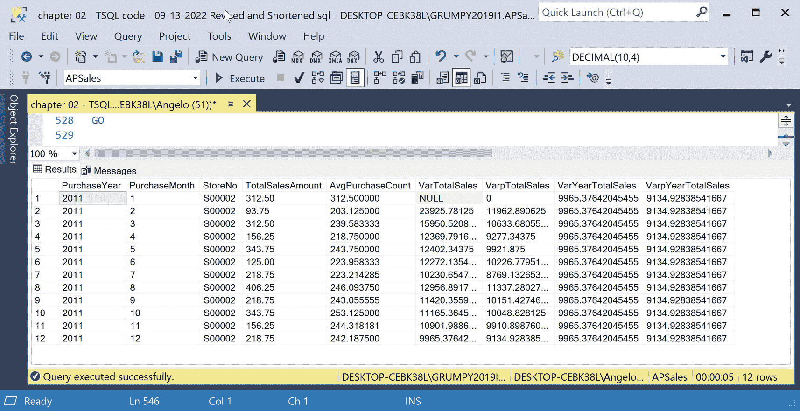

图 2-21
比较样本方差与总体方差

平均值和前两个方差列是按月滚动的值，如每个月的不同值所示。这些只包含 `ORDER BY` 子句，因此默认的窗口帧行为是：

```sql
RANGE BETWEEN UNBOUNDED PRECEDING AND CURRENT ROW
```

最后两列既未指定 `PARTITION BY` 也未指定 `ORDER BY` 子句，因此默认行为是：

```sql
ROWS BETWEEN UNBOUNDED PRECEDING AND UNBOUNDED FOLLOWING
```

如果你还没有这样做，请下载本章的代码并尝试这些示例。对于此示例，请取消客户和产品相关列的注释。当你熟悉代码后，也尝试查询多年的数据，然后是多个客户和产品的数据。最后，尝试调整 `RANGE` 和 `ROWS` 子句，看看它们如何影响窗口帧行为。

关于报告生成的一点建议：你不希望生成一份数据过多以至于无法阅读的报告。你可以创建一个 SSRS（SQL Server Reporting Services）可以使用的查询，其中包含所有客户、产品和年的数据。你需要做的只是在 SSRS 报告中添加一些过滤器，这样用户就可以从下拉列表中选择他们想要查看的过滤器组合。


## SQL Server 2022：命名窗口示例

让我们通过创建一个使用 `AVG()` 函数与 `OVER()` 子句的查询，来探索 SQL Server 2022 中的新 `WINDOW` 功能。我们将按常规方式收集 `IO` 和 `TIME` 统计信息，并生成查询计划，以观察此新功能对性能的影响。

如果查询计划建议创建索引（由于没有任何索引，它通常会建议），我们将创建该索引，然后再次运行查询，并查看新的查询计划和统计信息。

注意：我是在 SQL Server 2022 的评估版上运行此示例的。欢迎下载安装。同时，也请研究一下此版本的其他新功能。跟进最新版本的变化非常重要。

请参考清单 `2-11` 查看查询代码。

```
WITH CustomerPurchaseAnalysis
(PurchaseYear,PurchaseMonth,CustomerNo,TotalSalesAmount)
AS
(
SELECT
YEAR(CalendarDate)  AS PurchaseYear,
MONTH(CalendarDate) AS PurchaseMonth,
CustomerNo,
SUM(TransactionQuantity * UnitRetailPrice) AS TotalSalesAmount
FROM StagingTable.SalesTransaction
GROUP BY YEAR(CalendarDate),MONTH(CalendarDate),CustomerNo
)
SELECT
cpa.PurchaseYear,
cpa.PurchaseMonth,
c.CustomerNo,
c.CustomerFullName,
cpa.TotalSalesAmount,
AVG(cpa.TotalSalesAmount) OVER (SalesWindow) AS AvgTotalSales
FROM CustomerPurchaseAnalysis cpa
INNER JOIN StagingTable.Customer c ON cpa.CustomerNo = c.CustomerNo
WINDOW SalesWindow AS (
PARTITION BY cpa.PurchaseYear
ORDER BY cpa.PurchaseYear ASC, cpa.PurchaseMonth ASC
)
ORDER BY cpa.PurchaseYear, cpa.PurchaseMonth, c.CustomerNo
```
清单 2-11
按年、月和客户计算平均值

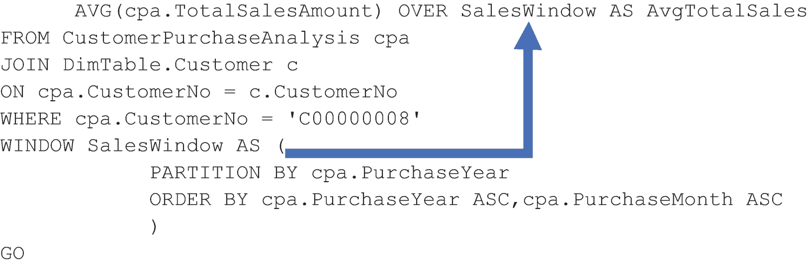
一段 A C T E 代码。第一行读作：A V G 开括号 c p a 点 total sales amount 关括号 OVER sales window as a v g total sales。第六行读作：WINDOW sales window as，括号内为语句。一个箭头从第六行指向第一行。

和往常一样，我们使用 `CTE` 代码结构来搭建查询。当然，`CTE` 语法没有变化。我们想要做的是按年、月和客户计算总销售额。我们在 `CTE` 中使用了 `SUM()` 函数，因此需要包含一个 `GROUP BY` 子句。

该查询引用了 `CTE` 并计算所有总和值的平均值。这次，`OVER()` 子句只是引用了一个定义了 `PARTITION` 和 `ORDER BY` 子句的块的名称。这个块名为 `SalesWindow`，在查询末尾声明。

新的 `WINDOW` 命令后跟名称 `SalesWindow`，然后在括号内声明 `PARTITION BY` 和 `ORDER BY` 子句：

```
WINDOW SalesWindow AS (
PARTITION BY cpa.PurchaseYear
ORDER BY cpa.PurchaseYear ASC,cpa.PurchaseMonth ASC
)
```

执行查询后，我们得到如图 `2-22` 所示的结果。

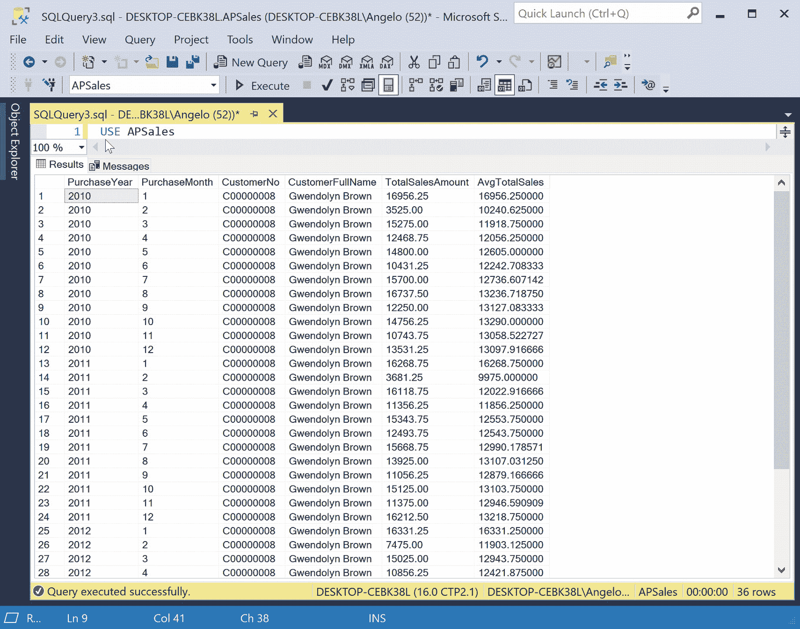
S Q L S S M S 窗口的截图。它展示了一个包含 7 列和 28 行的表格。列标题为购买年份、购买月份、客户编号、客户全名、总销售额和平均总销售额。每行包含不同的值。
图 `2-22` 查询结果

此查询生成了 36 行。足够大以评估结果。这里没有意外，按预期工作。

滚动平均值似乎有效。让我们生成一个查询计划，看看是否有任何索引建议，或者更重要的是，此新功能是否在查询计划中生成了更多或更少的步骤。

请参考图 `2-23`。

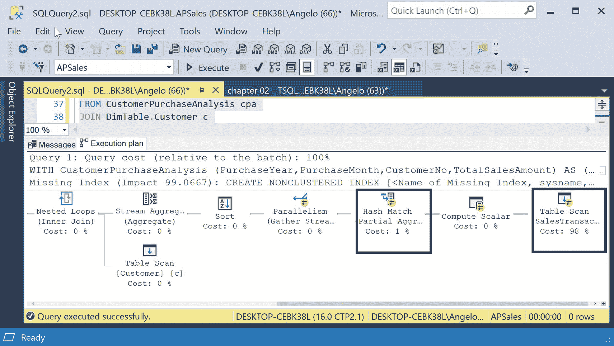
S Q L S S M S 窗口的截图。它展示了创建索引前的查询计划，包含 8 个组件。它们是嵌套循环、流聚合、排序、并行、哈希匹配、计算标量、表扫描和表扫描。哈希匹配和表扫描的成本分别为 1% 和 98%。其他组件成本为零。
图 `2-23` 创建索引前的查询计划

正如预期的那样，由于没有索引，我们看到了一个代价高昂的表扫描，占用了总执行时间的 98%。我们还看到一个哈希匹配任务，成本为 1%。这里有一个索引建议。右键单击它，像往常一样将索引提取到新的查询窗口中。

请参考清单 `2-12` 查看我们得到的内容。

```
/*
Missing Index Details from SQLQuery2.sql - DESKTOP-CEBK38L.APSales (DESKTOP-CEBK38L\Angelo (66))
The Query Processor estimates that implementing the following index could improve the query cost by 99.0667%
*/
/*
USE [APSales]
GO
CREATE NONCLUSTERED INDEX []
ON [StagingTable].[SalesTransaction] ([CustomerNo])
INCLUDE ([CalendarDate],[TransactionQuantity],[UnitRetailPrice])
GO
*/
DROP INDEX IF EXISTS [CustomerNoieDateQuantityRetailPrice]
ON [StagingTable].[SalesTransaction]
GO
CREATE NONCLUSTERED INDEX [CustomerNoieDateQuantityRetailPrice]
ON [StagingTable].[SalesTransaction] ([CustomerNo])
INCLUDE ([CalendarDate],[TransactionQuantity],[UnitRetailPrice])
GO
```
清单 2-12
建议的索引

做了一点复制粘贴操作，这样我们就能给索引起个名字。我保留了方括号，因为它们是 SQL Server 生成的（而且我懒得删除它们）。让我们创建索引，重新运行统计信息，并生成一个新的查询计划。

请参考图 `2-24`。

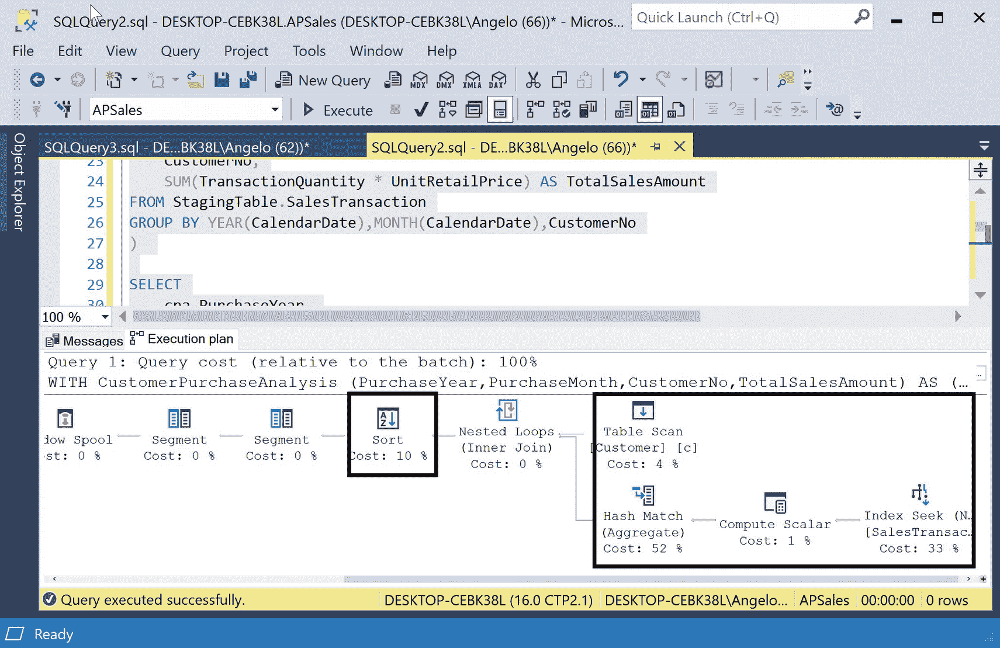
S Q L S S M S 窗口的截图。它展示了创建索引后的查询计划，包含 9 个组件。它们是窗口假脱机、段、段、排序、嵌套循环、表扫描、哈希匹配、计算标量和索引查找。排序、表扫描、哈希匹配和索引查找的成本分别为 10%、4%、52% 和 33%。
图 `2-24` 创建索引后的查询计划

我们看到一大堆步骤，但至少现在 `SalesTransaction` 表上有一个索引查找操作。此任务占用了总执行时间的 33%。有一个成本为 1% 的小型计算标量任务，以及一个成本为 52% 的哈希匹配。最后，有一个成本为 10%（占总执行时间）的排序任务。

还有一个成本为 0% 的窗口假脱机任务，这很重要。此任务与 `OVER()` 子句以及 `ROWS` 和 `RANGE` 子句相关，因为它将所需的行加载到内存中，以便可以根据需要随时检索。如果我们没有足够的内存，那么这些行就需要存储在临时存储中，这可能会大大降低速度。这是一个你应该始终留意并查看其成本的任务！

和往常一样，为了简单起见，我忽略了成本为 0% 的任务（窗口假脱机除外），但你自己应该去查阅 Microsoft 文档，了解它们的作用。

这很重要。记住窗口假脱机的作用：
> 此任务与 `OVER()` 子句以及 `ROWS` 和 `RANGE` 子句相关，因为它将所需的行加载到内存中，以便可以根据需要随时检索。如果我们没有足够的内存，那么这些行就需要存储在临时存储中，这可能会大大降低速度。这是一个你应该始终留意并查看其成本的任务！

看起来索引查找消除了第一个昂贵的表扫描，但也引入了几个新的步骤。

让我们比较一下创建索引前后的 `IO` 统计信息，看看有什么改进。

请参考表 `2-6`。

表 `2-6` IO 统计信息对比，创建索引前后


### SQL Server 解析与编译时间

| SQL Server 解析与编译时间 | 无索引 | 有索引 |
| --- | --- | --- |
| CPU 时间 (ms) | **31** | **0** |
| 已用时间 (ms) | **290** | **49** |
| **统计信息 (工作表)** | **无索引** | **有索引** |
| 扫描计数 | **39** | **39** |
| 逻辑读取 | **217** | **217** |
| 物理读取 | 0 | 0 |
| 预读读取 | 0 | 0 |
| **统计信息 (工作文件)** | **无索引** | **有索引** |
| 扫描计数 | 0 | 0 |
| 逻辑读取 | 0 | 0 |
| 物理读取 | 0 | 0 |
| 预读读取 | 0 | 0 |
| **统计信息 (SalesTransaction)** | **无索引** | **有索引** |
| 扫描计数 | **5** | **1** |
| 逻辑读取 | **17244** | **42** |
| 物理读取 | 0 | 1 |
| 预读读取 | 17230 | 10 |
| **统计信息 (Customer)** | **无索引** | **有索引** |
| 扫描计数 | **1** | **1** |
| 逻辑读取 | **648** | **18** |
| 物理读取 | 1 | 1 |
| 预读读取 | 0 | 0 |
| **SQL Server 执行时间** | **无索引** | **有索引** |
| CPU 时间 (ms) | 156 | 0 |
| 已用时间 (ms) | 1210 | 105 |

通过查看 `统计信息`，似乎有了显著的改善。我们关心的是改善的程度有多大。新的 `WINDOW` 特性是否导致执行成本更高、更快，还是保持不变？

`工作表` 和 `工作文件` 的 `统计信息` 保持不变，而 `SalesTransaction` 表的 `统计信息` 则有了显著改善。我们的 `逻辑读取` 从 `17,244` 次下降到 `42` 次，`预读读取` 从 `17,230` 次下降到 `10` 次。这非常好！

`Customer` 表的 `逻辑读取` 从 `648` 次下降到 `18` 次，我们的 `CPU` 时间从 `156` ms 下降到 `0` ms。最后，`已用执行时间` 从 `1210` ms 下降到 `105` ms。

总而言之，好消息是新的 `WINDOW` 特性并不会降低性能。查询计划的改善程度与先前的 `OVER()` 子句语法类似。

看起来好处在于，我们可以将 `OVER()` 子句的逻辑集中在一个地方定义，并从多个列调用，如果窗口框架规范相同，这就消除了重复输入。

还不止如此。你可以定义多个 `窗口`，甚至可以让一个 `窗口` 引用另一个 `窗口` 定义，如代码清单 2-13 中的部分代码所示。

```sql
SELECT
cpa.PurchaseYear,
cpa.PurchaseMonth,
c.CustomerNo,
c.CustomerFullName,
cpa.TotalSalesAmount,
AVG(cpa.TotalSalesAmount) OVER AvgSalesWindow AS AvgTotalSales,
STDEV(cpa.TotalSalesAmount) OVER StdevSalesWindow AS StdevTotalSales,
SUM(cpa.TotalSalesAmount) OVER SumSalesWindow AS SumTotalSales
FROM CustomerPurchaseAnalysis cpa
JOIN DimTable.Customer c
ON cpa.CustomerNo = c.CustomerNo
WHERE cpa.CustomerNo = 'C00000008'
WINDOW
StdevSalesWindow AS (AvgSalesWindow),
AvgSalesWindow AS (
PARTITION BY cpa.PurchaseYear
ORDER BY cpa.PurchaseYear ASC,cpa.PurchaseMonth ASC
),
SumSalesWindow AS (
);
GO
```

清单 2-13 定义多个窗口

一个有趣的特性。让我们来结束本章。你可以随时回头复习那些你可能还模糊不清的部分。

### 总结

我们达成目标了吗？

我们介绍了 `APSales` 数据仓库，并研究了这个数据库的概念模型。

我们还通过引入一些简单的 `数据字典`，熟悉了表、列以及表之间的关系。

我们通过创建使用 `OVER()` 子句为查询生成的 `数据集` 定义 `窗口框架` 的例子，涵盖了 `聚合函数类别` 中的 `窗口函数`。

一个重要的目标是，我们需要理解与使用 `窗口函数` 和 `OVER()` 子句的查询相关的 `性能分析` 和 `调优`。这通过生成和研究 `查询计划` 与 `IO 统计信息` 得以实现。这些信息被用于得出如何提升性能的结论。

我们还确定了 `窗口假脱机统计信息` 是一个需要监控的重要数值。请确保你理解它的含义。

最后但同样重要的是，我们初步了解了 `SQL Server 2022` 中新的 `WINDOW` 特性，它在代码可读性和实现方面展现出很大的潜力。我们的快速分析表明，它并没有降低性能，但也没有比旧语法提升性能，不过还需要使用更大数据集进行进一步测试。

顺便说一句，如果你还没有下载本章的示例脚本，现在正是好时机，可以练习一下刚刚学到的知识。

在下一章中，我们将介绍 `分析函数`，这是一套在数据分析和报表中非常强大的工具。我们还将开始在讨论的查询中添加 `ROWS` 和 `RANGE` 子句，这些子句会覆盖我们不指定 `窗口框架` 时的默认行为。

