# 3. 销售用例：分析函数

既然我们已经创建并熟悉了销售数据仓库，并创建了使用聚合 `窗口函数` 的查询，我们可以进入下一步，学习并创建使用 `SQL Server` 提供的 `分析函数` 的查询。

在上一章中，我们涉及了查询的 `性能调优`。在本章中，我们将采用相同的方法，但会关注其他 `性能工具`，例如 `客户端统计信息`，以更全面地了解查询运行情况。

我们将大量使用 `执行统计信息`，也就是说，我们比较创建推荐 `索引` 之前和之后的 `统计信息`，看看它们是否提升了性能。

最后，我们将研究建立 `预加载报表表` 和 `内存优化表`，看看它们是否能带来更高的查询性能。

我们正在研究的函数是计算密集型的，因此我们希望确保编写出高效、准确且执行快速的查询和脚本。`查询调优`、`索引创建` 和 `性能分析` 都是向你的业务分析师交付有用且可操作数据的过程的一部分。

## 分析函数

以下是按名称排序的此类别中的八个函数。它们可以与查询中的 `OVER()` 子句一起使用，为我们的业务分析师生成有价值的报表：

*   `CUME_DIST()`
*   `FIRST_VALUE()`
*   `LAST_VALUE()`
*   `LAG()`
*   `LEAD()`
*   `PERCENT_RANK()`
*   `PERCENTILE_CONT()`
*   `PERCENTILE_DISC()`

我们将采用与前一章相同的方法。我会描述函数的功能，并展示代码和结果。接着，进行一些 `性能分析`，以便我们了解需要进行哪些改进（如果有的话）。

正如我们在第 2 章的例子中所看到的，改进措施可以包括添加 `索引`，甚至创建一个 `反规范化报表表`，这样当执行使用 `分析窗口函数` 的查询时，它直接针对 `预加载的数据` 操作，避免了连接、计算和复杂逻辑。


## CUME_DIST() 函数

此函数用于计算某个值在数据集（如表、分区或加载了测试数据的表变量）中的相对位置。

### 它是如何工作的？

首先，计算有多少个值排在它之前或与之相等（将此值称为 C1）。接着，计算数据集中的值或行数（称为 C2）。然后，用 C1 除以 C2，从而得出累积分布结果。返回的值是浮点数据类型，因此你需要使用 `FORMAT()` 函数将其转换为百分比。

顺便一提，这个函数与 `PERCENT_RANK()` 函数类似，后者的工作原理如下：给定数据集中的一组值，此函数计算每个单独值相对于整个数据集的排名。该函数也返回一个百分比。

回到 `CUME_DIST()` 函数。我们将看两个例子，一个简单的，另一个则会查询我们的销售数据仓库。

### 一个简单示例

让我们先看一个简单的例子，以便了解前面的描述在一个小数据集上如何运作。请参考清单 3-1a。

```sql
USE TEST
GO
DECLARE @CumDistDemo TABLE (
Col1 VARCHAR(8),
ColValue INTEGER
);
INSERT INTO @CumDistDemo VALUES
('AAA',1),
('BBB',2),
('CCC',3),
('DDD',4),
('EEE',5),
('FFF',6),
('GGG',7),
('HHH',8),
('III',9),
('JJJ',10)
SELECT Col1,ColValue,
CUME_DIST() OVER(
ORDER BY ColValue
) AS CumeDistValue,
A.RowCountLE,
B.TotalRows,
CONVERT(DECIMAL(10,2),A.RowCountLE)
/ CONVERT(DECIMAL(10,2),B.TotalRows) AS MyCumeDist
FROM @CumDistDemo CDD
CROSS APPLY (
SELECT COUNT(*) AS RowCountLE FROM @CumDistDemo
WHERE ColValue <= CDD.ColValue
) A
CROSS APPLY (
SELECT COUNT(*) AS TotalRows FROM @CumDistDemo
) B
GO
```

清单 3-1a: 一个简单示例

声明了一个名为 `@CumDistDemo` 的简单表变量，并加载了十行数据。只创建了两列。第一列名为 `Col1`，充当键列，而 `ColValue` 列保存数据。在我们的例子中，这些数据是数字 1-10。非常简单。

该查询使用了 `CUME_DIST()` 函数和一个 `OVER()` 子句。没有包含 `PARTITION BY` 子句，但使用了 `ORDER BY` 子句来按 `ColValue` 列升序对分区行进行排序。

我们需要包含计算累积分布的公式，以便了解其工作原理并与 SQL Server 的版本进行比较。公式如下：

行数（其值小于或等于当前列值）除以总行数。

为了获得该公式的值，使用了两个 `CROSS APPLY` 运算符。第一个计算值小于或等于当前列值的行数，第二个计算数据集中的总行数。

这个查询可能可以优化，但就我们的目的而言，它应该能说明 `CUME_DIST()` 函数是如何工作的。

`CROSS APPLY` 块中查询返回的值被用在 `SELECT` 子句的公式中：

```sql
CONVERT(DECIMAL(10,2),A.RowCountLE)
/ CONVERT(DECIMAL(10,2),B.TotalRows) AS MyCumeDist
```

让我们执行查询，看看结果。请参考图 3-1。


图 3-1: 计算累积分布的两种方式

我认为，看起来不错且符合预期！`MyCumeDist` 列包含我们创建的公式计算出的值，而名为 `CumeDistValue` 的列包含 SQL Server 函数计算出的值。可能需要一点格式化使它们看起来一致，但数值是匹配的。

### 查询销售数据

现在我们理解了这个函数的工作原理，让我们创建一个针对我们销售数据的查询。我们将使用前一章中用过的策略。即，我们将使用一个 `CTE`（公用表表达式）来准备数据，然后在我们访问该 `CTE` 的查询中使用正在学习的函数。

请参考清单 3-1b。

```sql
WITH CustSales (
SalesYear,SalesQuarter,SalesMonth,CustomerNo,StoreNo,CalendarDate,SalesTotal
)
AS
(
SELECT YEAR(CalendarDate)        AS SalesYear
,DATEPART(qq,CalendarDate) AS SalesQuarter
,MONTH(CalendarDate)       AS SalesMonth
,ST.CustomerNo,
ST.StoreNo,
ST.CalendarDate,
SUM(ST.UnitRetailPrice * ST.TransactionQuantity) AS SalesTotal
FROM StagingTable.SalesTransaction ST
GROUP BY ST.CustomerNo
,ST.StoreNo
,ST.CalendarDate
,ST.UnitRetailPrice
,ST.TransactionQuantity
)
SELECT SalesYear
,SalesQuarter
,SalesMonth
,CustomerNo
,SUM(SalesTotal) AS MonthlySalesTotal
,CUME_DIST() OVER (
PARTITION BY SalesYear
ORDER BY SUM(SalesTotal)
) AS CumeDist
FROM CustSales
WHERE SalesYear IN(2010,2011)
AND CustomerNo = 'C00000001'
GROUP BY SalesYear
,SalesQuarter
,SalesMonth
,CustomerNo
GO
```

清单 3-1b: 实战中的 `CUME_DIST()` 函数

我们设置了惯用的 `CTE`，以便从 `SalesTransaction` 表中提取事务数据，这样我们可以提取出具体的日期对象：年、季度和月。销售总额也通过将 `UnitRetailPrice` 乘以 `TransactionQuantity` 列的结果相加来计算。（我必须承认这不够高效。我本可以使用 `TotalSalesAmount` 列来避免这个公式。算了。）

`CUME_DIST()` 函数使用了一个包含 `PARTITION BY` 子句和 `ORDER BY` 子句的 `OVER()` 子句。在 `SalesYear` 列上设置了一个分区，并且分区的行集按 `SalesTotal` 列排序。

结果需要再次汇总，因为我们排除了商店编号，并且只想按年、季度、月和客户查看总计。包含了一个 `WHERE` 子句来过滤结果，只显示一个客户和两个年份的数据。我这样做是为了保持结果集较小，但你可以移除它们以查看结果。

请参考图 3-2 中的结果。

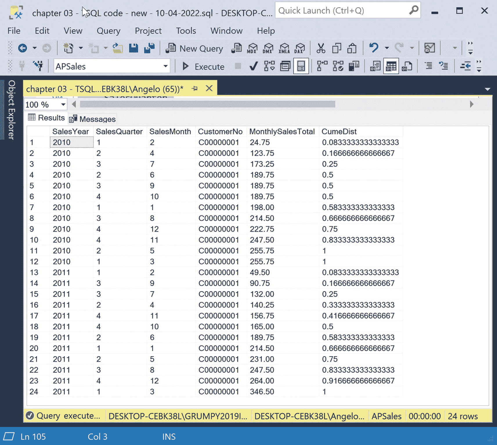

图 3-2: 测试脚本的查询结果

结果按 `OVER()` 子句中的 `SalesTotal` 列排序，以便查看销售总额和累积分布结果的升序值，这样你就能看到公式是如何应用的。按销售额升序排序能很好地对齐数据。

尝试按销售年份、季度和月对结果进行排序，这是业务分析师通常希望看到的方式。


#### 性能考量

让我们以通常的方式生成一个估计的查询执行计划。结果很长，因此我们只查看显示的右半部分，因为这里展示了任务最有趣的统计数据。计划中的其他任务或步骤成本大多为 0%，为了节省空间，我们忽略它们。

请参考图 3-3。

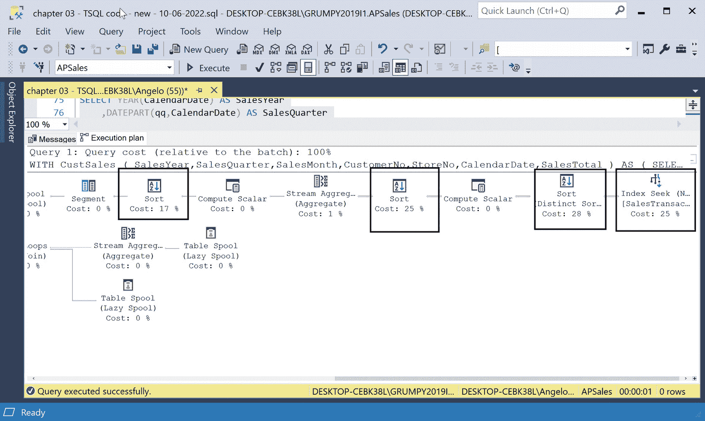

图 3-3：脚本的估计查询计划

哎呀！看看这三个排序步骤。至少有一个索引查找，并且估计性能工具没有建议其他索引。

索引查找任务占总执行计划成本的 25%，其旁边的排序步骤成本为 28%。可以看到第二个排序步骤占 25%，因此这个查询似乎进行了大量排序。第三个排序步骤的成本是 17%！

这表明我们可以通过将 `CTE` 生成的初始数据暂存到某种报表或临时表中，并构建索引来辅助主查询的执行，从而提高性能。一个很大的好处是，你每天加载一次这个表，并且假设用户满足于 24 小时的数据刷新，那么当用户执行带有窗口函数的主查询时，加载过程的处理开销就不会包含在内。

顺便说一句，如果你将鼠标悬停在每个排序步骤上，你会看到以下列被排序：

*   第一个排序步骤：店铺和日历日期
*   第二个排序步骤：按客户排序
*   第三个排序步骤：再次按客户排序

现在我们在反推查询计划估计器了。请自行尝试，根据前面的信息创建一两个索引来支持所需的排序。看看排序步骤是否被消除或至少减少。请记住，你在表上创建的索引越多，加载或编辑表行时的性能就会越慢。

我在清单中包含了一个基于 `CTE` 逻辑的脚本，它将数据暂存到一个表中。还创建了一个索引来支持排序（该索引由估计查询计划工具建议）。结果是索引查找的成本略低，但排序仍然存在且略高。

改进体现在查询统计信息中。在第一个查询中，访问销售事务表时，逻辑读取数为 23，但使用临时表后减少到 10。第一个查询中的物理读取数为 1，而访问临时表的查询中则为 0。

这个策略似乎有效。再次强调，在看我的例子之前，请自己尝试一下。

请参考表 3-1 查看一些统计数据。

**表 3-1：执行统计 – 无临时表 vs 有临时表**

| SQL Server 解析和编译时间 | 无临时表 | 有临时表 |
| :--- | :--- | :--- |
| CPU 时间 (毫秒) | 0 | 0 |
| 已用时间 (毫秒) | **77** | **6** |
| **统计信息 (工作表)** | **现有索引** | **新索引** |
| 扫描计数 | 26 | 26 |
| 逻辑读取 | **198** | **196** |
| 物理读取 | 0 | |
| 预读 | 0 | |
| **统计信息 (SalesTransaction)** | **现有索引** | **新索引** |
| 扫描计数 | **1** | **2** |
| 逻辑读取 | **23** | **10** |
| 物理读取 | **0** | **1** |
| 预读 | **0** | **3** |
| **SQL Server 执行时间** | **现有索引** | **新索引** |
| CPU 时间 (毫秒) | 0 | 0 |
| 已用时间 (毫秒) | 35 | 2 |

我重新运行了原始查询和访问临时表的查询。原始查询（包含 `CUME_DIST()` 函数）除了现在访问临时表而不是 `CTE` 外，没有做任何更改。另外，还创建了一些新索引。

原始查询中的 `CTE` 被修改为只加载一次临时表。假设在真实的生产环境中，它会在非高峰时段每晚运行。

如你所见，第一组的已用时间从 77 毫秒减少到 6 毫秒。这是个好的开始。扫描计数保持不变，工作表的逻辑读取数略有下降（198 vs 196）。

查看 `SalesTransaction` 表的统计信息，扫描计数从 1 增加到 2，而逻辑读取数下降到 10。这也很好！

现在我们来看物理读取和预读；它们分别从 0 增加到 1 和 3。这就不太好了。最后，两种情况下的 CPU 时间都是零，但已用时间从 35 毫秒下降到 2 毫秒，所以这里有重大改进。

最后几点说明：当你进行此分析时，由于硬件配置不同，你会得到不同的结果。你需要多次运行这些测试，以全面了解哪些有效、哪些无效。别忘了运行 `DBCC`，以便总是从干净的缓冲区开始。如果在每次运行测试前不执行此命令，会给你误导性的结果！

> **注意**
> 顺便说一下，`DBCC` 代表数据库一致性检查。这是一个非常强大且有用的工具。我建议你查阅 Microsoft SQL Server 关于它的文档。

让我们查看第一个查询和使用临时表的查询的客户端统计信息。客户端统计信息按钮可以在带有绿色复选框的按钮右侧的菜单栏中找到。单击它可以打开或关闭它。

请参考图 3-4。

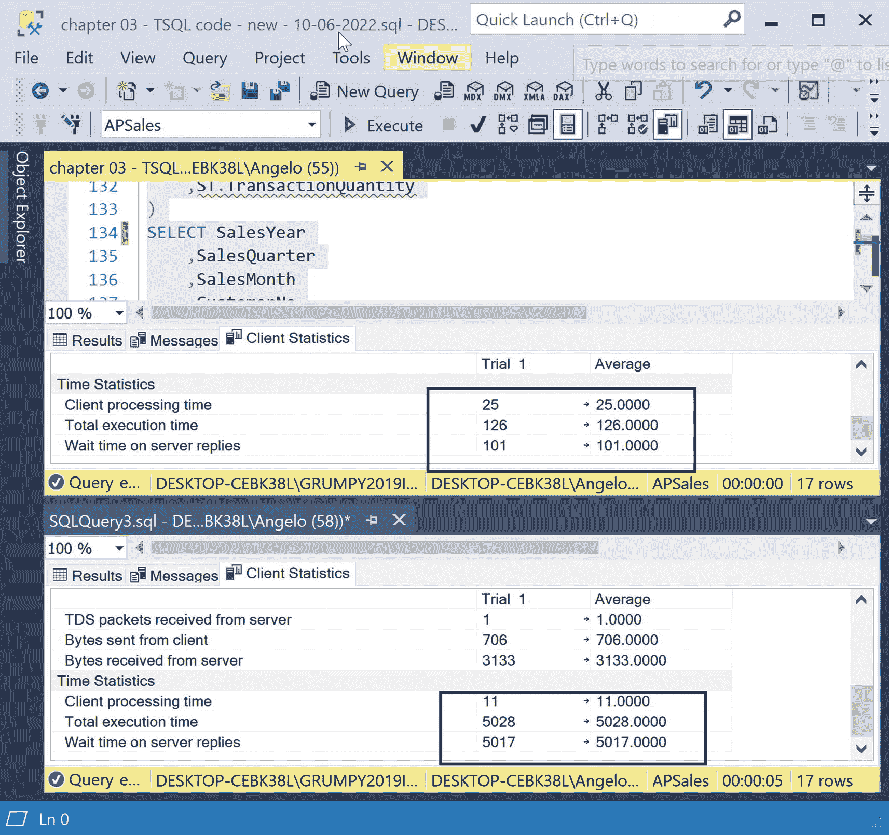

图 3-4：查询的客户端统计信息

这很有趣。顶部的报告是第一个查询的。我只显示了客户端处理时间、总执行时间和等待服务器回复的时间。它们分别是 25、126 和 101。

第二个客户端统计信息报告显示客户端处理时间为 11（很好），但看看总执行时间为 5028，等待服务器回复的时间为 5017。这些指标显著上升了。

因此，从我们的讨论中可以得出几点要点。第一，你拥有一套由一些有价值的工具生成的统计信息和计划，在执行查询设计和调优时应该使用它们。

第二，你需要多次运行测试以获得结果的“平均”视图。创建索引似乎是个好主意，但大多数时候，它们给出的结果与查询估计执行计划工具建议的索引相同或更差。如果你忘记运行 `DBCC` 命令来清除缓冲区，你会得到误导性的结果，让你误以为性能在提升。

最后，在处理少于 20 万行的小数据集时进行测试不会显示出太大差异。你需要看看当处理数百万行或更多时，一切是如何运作的！（查看销售数据仓库的加载脚本，看看是否可以通过修改我的加载脚本，在正在使用的事实表中加载 500 万到 1000 万行。请确保你做了备份。）

我们工具箱中的下一个函数是 `PERCENT_RANK()` 函数。

### PERCENT_RANK() 函数

接下来要介绍的是 `PERCENT_RANK()` 函数。它的作用是什么？

这个函数使用来自查询、分区或表变量的数据集，计算每个值相对于整个数据集（以百分比形式）的相对排名。你需要将结果（返回值为浮点数）乘以 100.00，或者使用 `FORMAT()` 函数将结果转换为百分比格式。

此外，它的行为与 `CUME_DIST()` 函数非常相似；至少微软文档是这么说的。我们在本章开头讨论过这个函数，如果你忘记了，可以回头再看一下它的作用。

你还会发现它在理论上也与 `RANK()` 函数非常相似。`RANK()` 函数返回值的位置，而 `PERCENT_RANK()` 返回一个百分比值。我们将把这个函数与刚才讨论的 `CUME_DIST()` 函数一起使用，以便比较结果，并看看它对即将生成的查询计划有什么影响。

但首先，让我们像之前那样，再看一个简单的例子，以便清晰地看到简单数据集生成的结果。

我还会根据以下公式提供一个自定义的百分比排名计算版本：
`(当前行值 - 1) / (数据集总行数 - 1)`

很简单！我们将使用与 `CUME_DIST()` 函数相同的表变量数据。

对于我们自定义的代码，我们需要模拟 `RANK()` 函数，该函数将在下一章介绍。为了将我们的自定义代码结果与 SQL Server 函数结果进行比较，我也在 `SELECT` 子句中包含了 `RANK()` 函数。

请参考清单 3-2。

```sql
DECLARE @CumeDistDemo TABLE (
Col1     VARCHAR(8),
ColValue DECIMAL(10,2)
);
INSERT INTO @CumeDistDemo VALUES
('AAA',1.0),
('BBB',2.0),
('CCC',3.0),
('DDD',4.0),
('EEE',5.0),
('FFF',6.0),
('GGG',7.0),
('HHH',8.0),
('III',9.0),
('JJJ',10.0)
SELECT Col1,ColValue,A.RowCountLTE AS MyRank,
RANK() OVER(
ORDER BY ColValue
) AS SQLRank,
PERCENT_RANK() OVER(
ORDER BY ColValue
) AS PCTRank,
/* current value rank - 1 /data sample total row count - 1 */
(RANK() OVER(
ORDER BY ColValue
) - 1.0) / CONVERT(DECIMAL(10,2),(
SELECT COUNT(*) AS SampleRowCount
FROM @CumeDistDemo) - 1.0
) AS MyPctRank
FROM @CumeDistDemo CDD
CROSS APPLY (
SELECT COUNT(*) AS RowCountLTE FROM @CumeDistDemo
WHERE ColValue <= CDD.ColValue
) A
GO
```
清单 3-2 一个简单的百分比排名示例

注意，我重新利用了 `@CumeDistDemo` 表变量（懒得重命名！）。

和之前一样，数据值从 1.0 到 10.0 依次递增。这使得将值与排名结果关联起来变得容易。`FROM` 子句中使用了一个 `CROSS APPLY` 块，以便计算数据集中小于或等于当前行的总行数：
```sql
CROSS APPLY (
SELECT COUNT(*) AS RowCountLTE
FROM @CumeDistDemo WHERE ColValue <= CDD.ColValue
) A
```

应用简单公式，以下代码计算出百分比排名：
```sql
(RANK() OVER(
ORDER BY ColValue
) - 1.0) / CONVERT(DECIMAL(10,2),(SELECT COUNT(*) AS SampleRowCount FROM @CumeDistDemo) - 1.0) AS MyPctRank
```

注意，我们正在使用 `RANK()` 函数来计算排名分配（我们将在下一章讨论它）。如果我们对被排名的数据（即 `ColValue` 列）进行升序排序，作为一个技巧，我们也可以使用 `ROW_NUMBER()` 函数，如下所示（我们也将在下一章讨论这个）：
```sql
ROW_NUMBER() OVER(
ORDER BY ColValue
) AS RowNumberAsRank,
```

最后一种替代方法是直接使用列 `RowCountLTE` 作为排名：
```sql
/* current value rank - 1 /sample total row count - 1 */
FORMAT(
(RowCountLTE - 1.0) /
CONVERT(DECIMAL(10,2),(
SELECT COUNT(*) AS SampleRowCount
FROM @CumeDistDemo
) - 1.0),'P'
) AS MyPctRank
```

尝试修改代码，使用所有版本的百分比排名，以便验证结果是否相同以及公式是否有效。在查看附加脚本之前，请先自己尝试一下。

让我们看看结果。请参考图 3-5。

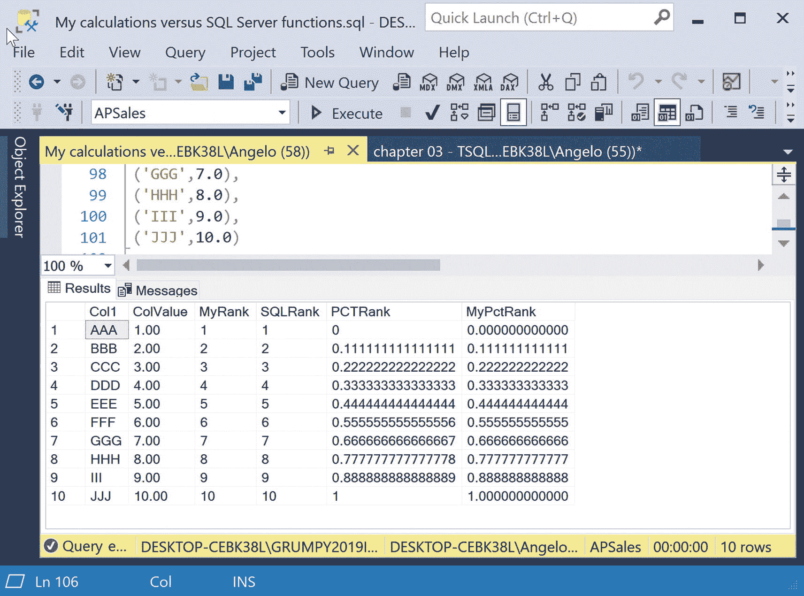
图 3-5 使用 SQL Server 函数和自定义脚本计算百分比排名

以下是排序后的结果。两个百分比排名结果匹配，使用 SQL Server 函数和自定义函数计算的排名结果也匹配。如果你愿意，可以使用 `FORMAT()` 函数将结果转换为百分比，例如：
```sql
FORMAT(
PERCENT_RANK() OVER(
ORDER BY ColValue
),'P'
) AS PCTRank,
```

只需用括号包裹 `PERCENT_RANK()` 代码块，使用 `FORMAT()` 函数，并在最后一个括号前包含 `'P'` 参数。非常容易使用。

> **提示**
> 在我看来，基于公式创建自己的函数版本是理解函数作用的好方法。

让我们在我们的销售数据仓库上试试这个函数。

请参考清单 3-3。

```sql
WITH CustSales (
SalesYear,SalesQuarter,SalesMonth,CustomerNo,
StoreNo,CalendarDate,SalesTotal
)
AS
(
SELECT YEAR(CalendarDate)        AS SalesYear
,DATEPART(qq,CalendarDate) AS SalesQuarter
,MONTH(CalendarDate)       AS SalesMonth
,ST.CustomerNo
,ST.StoreNo
,ST.CalendarDate
,SUM(ST.TotalSalesAmount) AS SalesTotal
FROM StagingTable.SalesTransaction ST
GROUP BY ST.CustomerNo
,ST.StoreNo
,ST.CalendarDate
)
SELECT SalesYear
,SalesQuarter
,SalesMonth
,CustomerNo
,SUM(SalesTotal) AS MonthlySalesTotal
,CUME_DIST() OVER (
PARTITION BY SalesYear
ORDER BY SUM(SalesTotal)
) AS CumeDist
,PERCENT_RANK() OVER (
PARTITION BY SalesYear
ORDER BY SUM(SalesTotal)
) AS PctRank
FROM CustSales
WHERE SalesYear IN(2010,2011)
AND CustomerNo = 'C00000001'
GROUP BY SalesYear
,SalesQuarter
,SalesMonth
,CustomerNo
GO
```
清单 3-3 实际应用中的 `PERCENT_RANK()` 函数

我认为我们不需要再回顾 `CTE` 了，除了强调我们正在按商店汇总销售额。我们可以使用为之前示例创建的暂存表，但让我们再次使用 `CTE`。另外，我在 `SELECT` 子句中包含了 `CUME_DIST()` 函数，以便我们可以比较两个函数之间的结果。

`OVER()` 子句使用了相同的 `ORDER BY` 和 `PARTITION BY` 子句。我们希望按年、季度、月和客户汇总值。我们没有使用商店编号列，因此需要跨年、季度、月和客户编号列应用 `SUM()` 函数。这意味着我们需要使用 `GROUP BY` 子句。

我们再次使用 `WHERE` 子句来过滤 2010 年和 2011 年，并针对单个客户（“C0000001”），以保持结果集较小。一旦你熟悉了查询的工作原理，请随时下载脚本并修改 `WHERE` 子句，以便加载更多年份（确保你的笔记本电脑或台式机性能足够）。

让我们看看结果。请参考图 3-6 中的部分结果。

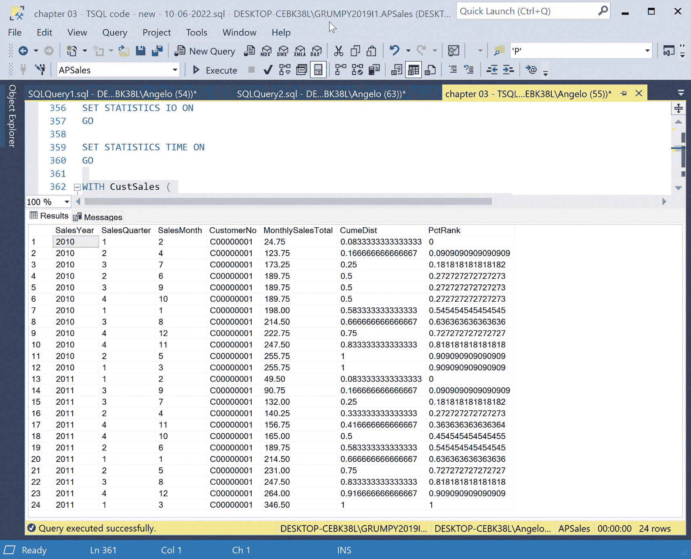
图 3-6 测试脚本的查询结果

我对查询做了一些更改，消除了 `WHERE` 子句过滤器，并包含了一个 `ORDER BY` 子句。这个更改导致查询执行后返回了 16,380 行数据。

最后，在示例脚本中还有一个额外的查询，它使用了自定义的百分比排名逻辑，并通过我们讨论的公式与 SQL Server 函数进行了比较。

性能仍然保持在一秒以下。接下来，我们来看看估计查询计划和统计信息是什么样子的。

#### 性能考量

让我们运行一个估计查询计划并执行查询，以便生成 `IO` 和 `TIME` 统计信息。同样，系统没有建议新的索引，因此我们之前创建的索引似乎正在被使用。

请参考图 3-7 的估计查询计划。

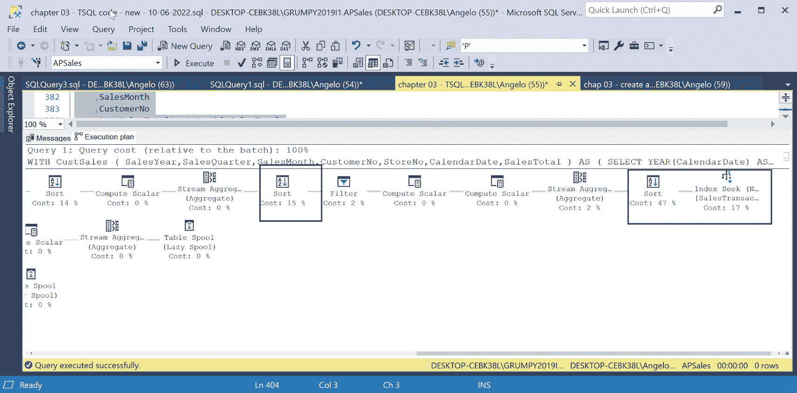

这是第 03 章 T SQL 代码窗口的屏幕截图。上半部分显示了一些程序代码。下半部分显示了查询成本的消息。排序成本，15%。排序成本，47%。索引查找成本，17%。

图 3-7

估计执行计划结果

从右向左看，我们遇到一个成本为 17% 的索引查找操作和一个成本为 47% 的排序任务。唯一另一个成本较高的步骤是另一个成本为 15% 的排序任务。其余任务的成本要么很低，要么为零，因此我们忽略它们。通常，在实际生产环境中，你至少需要了解它们，但主要关注成本较高的步骤，以确定是否可以消除它们或至少降低成本。

有时，基于维度列创建索引可能会有所帮助。检查排序步骤，看看是否需要基于排序步骤中引用的列创建索引。

目前看来我们能做的似乎不多，那么让我们看看性能统计信息能告诉我们什么。

请参考表 3-2。

表 3-2

性能分析

| SQL Server 解析和编译时间 | 现有索引 | 新索引 |
| --- | --- | --- |
| CPU 时间 (毫秒) | 0 |   |
| 已用时间 (毫秒) | 37 |   |
| **统计信息 (工作表)** | **现有索引** | **新索引** |
| 扫描计数 | 26 |   |
| 逻辑读取 | 196 |   |
| 物理读取 | 0 |   |
| 预读 | 0 |   |
| **统计信息 (SalesTransaction)** | **现有索引** | **新索引** |
| 扫描计数 | 1 |   |
| 逻辑读取 | 17 |   |
| 物理读取 | 1 |   |
| 预读 | 14 |   |
| **SQL Server 执行时间** | **现有索引** | **新索引** |
| CPU 时间 (毫秒) | 0 |   |
| 已用时间 (毫秒) | 30 |   |

工作表的扫描计数步骤较高，为 26。工作表和 `SalesTransaction` 表的逻辑读取统计信息似乎也偏高，分别为 196 和 17。最后，`SalesTransaction` 表的预读为 14。看起来可能需要一些改进。接下来我们看看客户端统计信息。

请参考图 3-8。

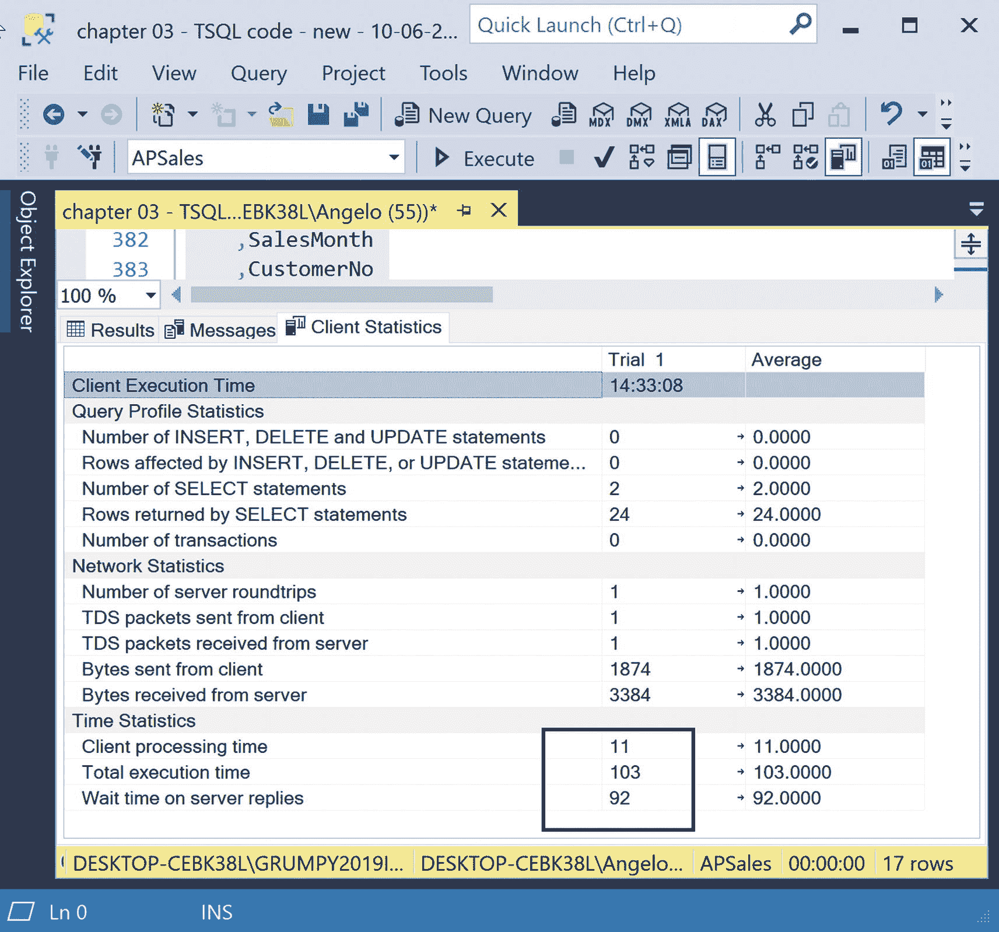

这是第 03 章 T SQL 代码窗口的屏幕截图。上半部分显示了一些程序代码。下半部分显示了一个结果表、消息和客户端统计信息。客户端处理时间、总执行时间和等待服务器回复时间这几列被高亮显示。

图 3-8

客户端统计信息分析

我们只看底部的时间统计信息。其他的也很重要，但这些告诉我们一些需要了解的性能数据。客户端处理时间为 11，总执行时间略高，为 103，等待服务器回复时间为 92。

有时仅仅创建索引是不够的。其他解决方案可能包括修改查询、利用临时表或报表表，甚至创建内存优化表。最后一种选择是，如果你有足够的内存，它会将所有表行加载到内存中。我们接下来将讨论这一点。

### 高性能策略

在本节中，我们将创建一个内存优化表并用基础数据加载它（这替代了先前查询中的 `CTE` 查询）。此策略假设该表每天晚上加载一次，用户在第二天查询内存优化表。

此策略也替代了我们之前讨论的暂存表或报表表的策略，因为我们假设存在于内存中的表比存在于物理磁盘上的表能提供更快的性能。当然，如果内存用尽，SQL Server 将不得不访问物理磁盘上的数据。这就是为什么创建内存优化表的步骤包括创建一个专用文件组和一个物理文件（或两个）。

以下是创建内存优化表需要采取的步骤。

步骤 1：检查兼容级别。

首先，确保你的计算机或笔记本电脑支持内存优化表，通过运行清单 3-4 中的简单查询来检查 SQL Server 的兼容级别。

```sql
SELECT d.compatibility_level
FROM sys.databases as d
WHERE d.name = Db_Name();
GO
```

清单 3-4
检查兼容级别

你应处于 130 级或更高版本。如果是，我们需要设置一个系统参数。如果不是，仍然阅读本节，以便了解其内容！

步骤 2：将参数 `MEMORY_OPTIMIZED_ELEVATE_TO_SNAPSHOT` 设置为 `ON`。

请参见清单 3-5。

```sql
ALTER DATABASE [APSAles]
SET MEMORY_OPTIMIZED_ELEVATE_TO_SNAPSHOT = ON;
GO
```

清单 3-5
设置内存优化提升到快照

步骤 3：接下来，通过运行以下命令添加一个用于内存优化数据的专用文件组。

请参见清单 3-6。

```sql
ALTER DATABASE APSales
ADD FILEGROUP APSalesMemOptimized CONTAINS MEMORY_OPTIMIZED_DATA;
GO
```

清单 3-6
为内存优化数据添加文件组

注意，需要包含一个指令，指定该文件组将包含内存优化数据。

步骤 4：为内存优化表创建专用文件。

接下来，我们以常规方式向该文件组添加一个文件。请参见清单 3-7。

```sql
ALTER DATABASE APSales
ADD FILE (
name='APSalesMemoOptData',
filename=N'D:\APRESS_DATABASES\AP_SALES\MEMORYOPT\AP_SALES_MEMOPT.mdf'
)
TO FILEGROUP APSAlesMemOptimized
GO
```

清单 3-7
向文件组添加文件

步骤 5：创建内存优化表。

接下来，我们以常规方式创建一个表，但需要添加一些代码来定义它为内存优化表。请参见清单 3-8。

```sql
CREATE TABLE [SalesReports].MemorySalesTotals   NOT NULL,
[StoreNo]      nvarchar   NULL,
[CalendarDate] [date]           NOT NULL,
[SalesTotal]   decimal NULL
)
WITH (
MEMORY_OPTIMIZED = ON,
DURABILITY = SCHEMA_AND_DATA
);
GO
```

清单 3-8
创建内存优化表

我们需要确保定义一个主键，并在 `CREATE TABLE` 命令末尾设置两个参数：

```sql
MEMORY_OPTIMIZED = ON,
DURABILITY = SCHEMA_AND_DATA
```

步骤 6：检查是否创建成功。

接下来，我们需要查询两个系统表，以确保该表已注册为内存优化表。请参见清单 3-9。

```sql
SELECT g.name, g.type_desc, f.physical_name
FROM sys.filegroups g JOIN sys.database_files f ON g.data_space_id = f.data_space_id
WHERE g.type = 'FX' AND f.type = 2
GO
```

清单 3-9
检查文件组和数据库文件表

`sys.filegroups` 和 `sys.database_files` 表有很多有趣的列，我建议你查看一下。为了节省篇幅，在我们的简短讨论中，我只列出基本的列。


## 步骤 7：加载内存优化表

现在是加载表的时候了。请参阅清单 3-10。

```sql
INSERT INTO [SalesReports].[MemorySalesTotals]
SELECT YEAR(CalendarDate)        AS SalesYear
,DATEPART(qq,CalendarDate) AS SalesQuarter
,MONTH(CalendarDate)       AS SalesMonth
,ST.CustomerNo
,ST.StoreNo
,ST.CalendarDate
,SUM(ST.UnitRetailPrice * ST.TransactionQuantity) AS SalesTotal
FROM StagingTable.SalesTransaction ST
GROUP BY ST.CustomerNo
,ST.StoreNo
,ST.CalendarDate
,ST.UnitRetailPrice
,ST.TransactionQuantity
GO
Listing 3-10
加载内存优化表
```

请记住，这是我们之前讨论过的例子中用于 `CTE` 的查询。现在我们已经准备好进行性能分析了。

## 步骤 8：检查估计查询计划

在运行查询之前，我们需要按照常规方式检查估计查询计划。看看是否建议了索引。如果是，则创建索引并重新运行查询计划估计工具。创建索引后，设置参数以显示性能统计信息。

## 步骤 9：运行查询

使用 `DBCC` 清除缓冲区，确保设置了 `IO` 和 `TIME` 统计信息，然后运行查询。

请参阅清单 3-11。

```sql
DBCC dropcleanbuffers;
CHECKPOINT;
GO
SET STATISTICS IO ON
GO
SET STATISTICS TIME ON
GO
SELECT SalesYear
,SalesQuarter
,SalesMonth
,CustomerNo
,SUM(SalesTotal) AS MonthlySalesTotal
,CUME_DIST() OVER (
PARTITION BY SalesYear
ORDER BY SUM(SalesTotal)
) AS CumeDist
,PERCENT_RANK() OVER (
PARTITION BY SalesYear
ORDER BY SUM(SalesTotal)
) AS PctRank
FROM [SalesReports].[MemorySalesTotals]
WHERE SalesYear IN(2010,2011)
AND CustomerNo = 'C00000001'
GROUP BY SalesYear
,SalesQuarter
,SalesMonth
,CustomerNo
GO
Listing 3-11
查询内存优化表
```

务必通过运行 `DBCC` 命令来清除缓冲区。接下来，运行两个命令以开启 `IO` 和 `TIME` 统计信息，然后运行查询。

## 步骤 10：创建建议的索引

这是建议索引的代码。我把它放在这里，但你应该在查看第一个估计查询计划之后运行它。想想看，还是应该先运行查询再创建索引，这样你才能记录性能统计信息。

请参阅清单 3-12。

```sql
ALTER TABLE SalesReports.MemorySalesTotals
ADD INDEX ieCustNoSaleYearMemTable
NONCLUSTERED (CustomerNo,SalesYear)
GO
Listing 3-12
创建建议的索引
```

## 步骤 11：创建第二个估计查询计划

索引创建后，创建第二个估计查询计划。也许你可以在两个水平放置的查询窗格中完成。顶部窗格包含没有建议索引的查询计划，底部窗格包含创建建议索引后的查询计划，这样你就可以比较两者了。

## 步骤 12：重新运行查询并确保所有统计信息已开启

在检查估计查询计划和运行带有统计信息的查询时，请确保使用 `DBCC` 清除缓冲区。

我运行了两次估计查询计划。第一次是为了查看估计器建议了什么索引。第二次是在我创建了建议的索引之后。

请参考图 3-9 查看索引创建后的估计查询计划。

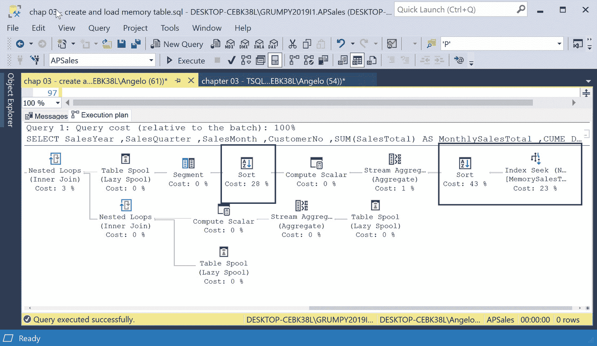

第 0 章 3 T S Q L 代码窗口的屏幕截图。顶部屏幕有一些程序代码。底部屏幕显示查询成本的消息。排序成本，28%。排序成本，43%。索引查找成本，23%。

图 3-9
估计查询计划

从右向左阅读查询计划，我们注意到一个成本为 23% 的索引查找操作。接下来是一个成本为 43% 的排序步骤。忽略成本为零或最小的任务，我们看到另一个成本为 28% 的排序步骤。还有一个成本为 3% 的嵌套循环联接。未显示的是嵌套循环联接左侧的更多任务，但它们的成本都为零。

请自行下载代码并查看计划和统计信息。学习如何进行这项性能分析活动是值得的。

让我们通过比较为 `CTE` 版本查询和利用内存优化表的查询生成的统计信息来总结。

请参考表 3-3 查看 `CTE` 与内存优化表统计信息分析。

表 3-3
比较 CTE 与内存优化表统计信息

| SQL Server 解析和编译时间 | 使用 CTE | 内存优化表 |
| --- | --- | --- |
| CPU 时间 (毫秒) | **46** | **0** |
| 已用时间 (毫秒) | **83** | **0** |
| **统计信息 (工作表)** | **使用 CTE** | **内存优化表** |
| 扫描次数 | 26 | 26 |
| 逻辑读取 | 196 | 198 |
| 物理读取 | 0 | 0 |
| 预读读取 | 0 | 0 |
| **统计信息 (SalesTransaction 和 MemorySalesTotals)** | **使用 CTE** | **内存优化表** |
| 扫描次数 | 1 | N/A |
| 逻辑读取 | **23** | N/A |
| 物理读取 | 1 | N/A |
| 预读读取 | 20 | N/A |
| **SQL Server 执行时间** | **使用 CTE** | **内存优化表** |
| CPU 时间 (毫秒) | **0** | **0** |
| 已用时间 (毫秒) | **34** | **0** |

这很有趣。对于内存优化表策略，我们只有工作表的统计信息——没有 `MemorySalesTotal` 表的统计信息，该表现在已加载到内存中。

我们看到在解析和编译时间以及执行时间的 CPU 时间和已用时间这两组统计信息上都有显著改进。使用内存优化表时，它们都为零。最后，工作表的统计信息结果大致相同。

看起来内存优化表产生了显著的性能提升。

最后一点说明：在进行此类分析时，最好将统计信息存储在电子表格中，以便分析和比较。运行多次测试以：

*   生成查询计划。
*   生成 `IO` 和 `TIME` 统计信息。
*   生成客户端统计信息。

还有另一点说明：如前所述，有时你需要超越索引创建，考虑其他修改，例如报告和内存增强表（甚至查询本身）。

最后的手段是让管理层用更多和/或更快的内存、快速磁盘或 SAN 解决方案来升级你的服务器。（为 `TEMPDB` 配备一个不错的固态硬盘也会有帮助！）

让我们继续前进，学习接下来的两个分析函数。


### LAST_VALUE() 和 FIRST_VALUE()

那么这对相关的函数能为我们做什么呢？名称已经给了我们一些提示。

给定一组排序后的值，`FIRST_VALUE()` 函数将返回第一个值。

给定一组排序后的值，`LAST_VALUE()` 函数将返回最后一个值。

很简单，让我们直接看一个例子。这次我们省略了 `CTE`，并利用了我们之前创建的内存优化表。

请参考清单 3-13。

```sql
SELECT SalesYear
,SalesQuarter
,SalesMonth
,CustomerNo
,SUM(SalesTotal) AS MonthlySalesTotal
,FIRST_VALUE(SUM(SalesTotal)) OVER (
PARTITION BY SalesYear
ORDER BY SalesMonth
) AS SalesTotalFirstValue
,LAST_VALUE(SUM(SalesTotal)) OVER (
PARTITION BY SalesYear
ORDER BY SalesMonth
) AS SalesTotalLastValue
,FIRST_VALUE(SUM(SalesTotal)) OVER (
PARTITION BY SalesYear
ORDER BY SalesMonth
) -
LAST_VALUE(SUM(SalesTotal)) OVER (
PARTITION BY SalesYear
ORDER BY SalesMonth
) AS Change
,CASE
WHEN (
FIRST_VALUE(SUM(SalesTotal)) OVER (
PARTITION BY SalesYear
ORDER BY SalesMonth
) - -
LAST_VALUE(SUM(SalesTotal)) OVER (
PARTITION BY SalesYear
ORDER BY SalesMonth
)
) > 0 THEN 'Sales Increase'
WHEN (
FIRST_VALUE(SUM(SalesTotal)) OVER (
PARTITION BY SalesYear
ORDER BY SalesMonth
) -
LAST_VALUE(SUM(SalesTotal)) OVER (
PARTITION BY SalesYear
ORDER BY SalesMonth
)
) < 0 THEN 'Sales Decrease'
ELSE 'No change'
END AS [Sales Performance]
FROM SaleReports.MemorySalesTotals
WHERE SalesYear IN(2010,2011)
AND CustomerNo = 'C00000001'
GROUP BY SalesYear
,SalesQuarter
,SalesMonth
,CustomerNo
GO
```

清单 3-13
`FIRST_VALUE()` 和 `LAST_VALUE()` 函数实际应用

这里使用了这些函数通常的 `OVER()` 结构。`PARTITION BY` 子句按销售年份设置分区。`ORDER BY` 子句按 `SalesMonth` 列对分区内的行进行排序。

我们进行了第二次汇总，因为我们希望仅按客户获取结果，而内存优化表中的行已经按门店、客户以及常规的年、季、月列进行了汇总。

请参考图 3-10 中的部分结果。

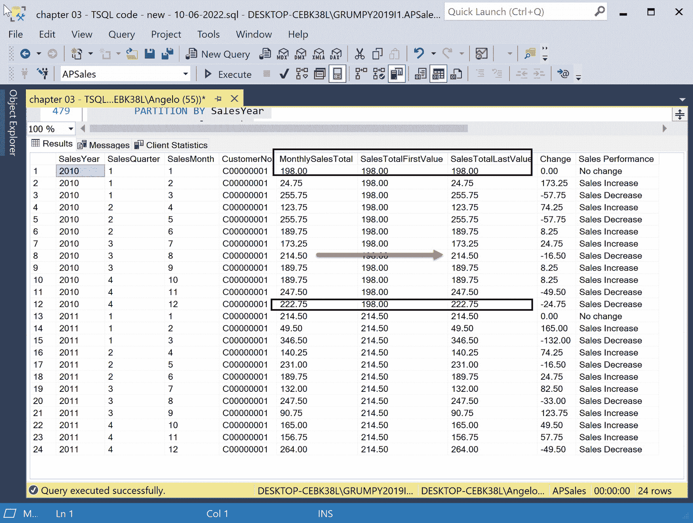

第 03 章 T S Q L 代码窗口的截图。顶部屏幕显示一些编程代码。底部屏幕有一个结果表和客户端统计信息。该表有 9 列。月度销售总额、销售总额首值和销售总额末值列被突出显示。

图 3-10

测试脚本的查询结果

结果显示了两年的数据。注意第一行的首值和末值。它们是相等的，因为窗口框架只包含一行。当我们移动到第二行时，首值保持不变，但末值现在反映的是二月份的月度销售总额。

随着窗口框架变大，末值会进行调整以反映分区中的最后一个月。我还包含了一个公式，用于计算首末总销售额之间的变化，以及一条小消息，显示销售额是增长、下降还是完全没有变化。

如果我们包含所有年份，这对我们的分析师来说可能是一份相当不错的报告。像 SQL Server Reporting Services 这样的工具可以使用此查询，并包含一个下拉列表，以便分析师可以选择一年、两年或更多年份。

### 性能考虑

让我们以通常的方式生成一个估计的查询计划，看看内存优化表加上为支持它而创建的索引是否产生了积极的结果。

请参考图 3-11。

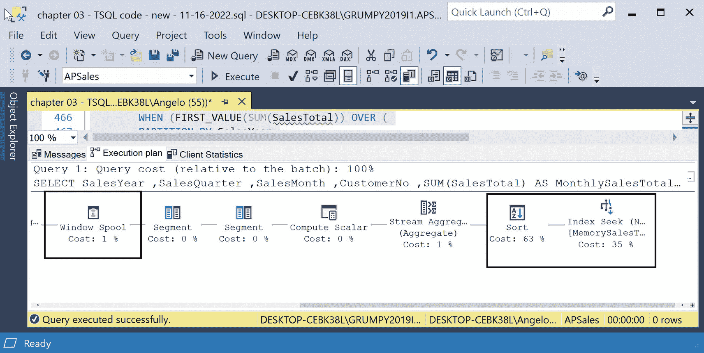

第 03 章 T S Q L 代码窗口的截图。顶部屏幕显示一些编程代码。底部屏幕有一个查询成本的消息。窗口假脱机成本，1%。排序成本，63%。索引查找成本，35%。

图 3-11

使用内存优化表的估计查询计划

看起来不错。从右向左阅读步骤，我们看到一个成本为 35% 的索引查找，一个成本为 63% 的排序，然后是一个成本为 1% 的流聚合步骤。忽略成本为 0% 的步骤，我们有一个成本为 1% 的窗口假脱机任务。未显示的其余步骤都是零，因此为了我们的讨论目的，可以忽略它们。（在真实的生产环境中，请查看所有任务！）

附带说明：我基于以下命令添加了一个索引：

```sql
ALTER TABLE [SalesReports].[MemorySalesTotals]
ADD INDEX ieSalesYearQuarterMonth(SalesYear,SalesQuarter,SalesMonth)
GO
```

我还添加了一个 `ORDER BY` 子句，按年、季、月列对行进行排序。我生成了另一个估计查询计划，第一步的索引查找任务成本从 35% 降到了 25%，排序步骤成本从 63% 降到了 46%。

所以，有时你需要创建查询计划估算器未建议的其他索引。

现在我们检查查询运行时生成的 `IO` 和 `TIME` 统计信息。

请参考表 3-4。

表 3-4

时间和 I/O 统计信息分析报告

| SQL Server 解析和编译时间 | 第一次运行 | 第二次运行 |
| --- | --- | --- |
| CPU 时间 (毫秒) | 15 | **5** |
| 已用时间 (毫秒) | 47 | **5** |
| **统计信息 (工作表)** | **第一次运行** | **第二次运行** |
| 扫描次数 | 26 | 26 |
| 逻辑读取 | 145 | 145 |
| 物理读取 | 0 | 0 |
| 预读读取 | 0 | 0 |
| **SQL Server 执行时间** | **第一次运行** | **第二次运行** |
| CPU 时间 (毫秒) | 0 | 0 |
| 已用时间 (毫秒) | **1** | **0** |

我运行了查询两次。第一次结果在解析步骤的 `CPU` 和已用时间值分别为 15 和 47。第二次运行这两个值都是 5。很可能查询计划被缓存了，因此解析时间有所减少。这说明了每次在打开统计信息的情况下运行查询时，运行 `DBCC` 来清除缓冲区的重要性（例如将旧计划移出缓存）。

客户端统计信息请参考图 3-12。

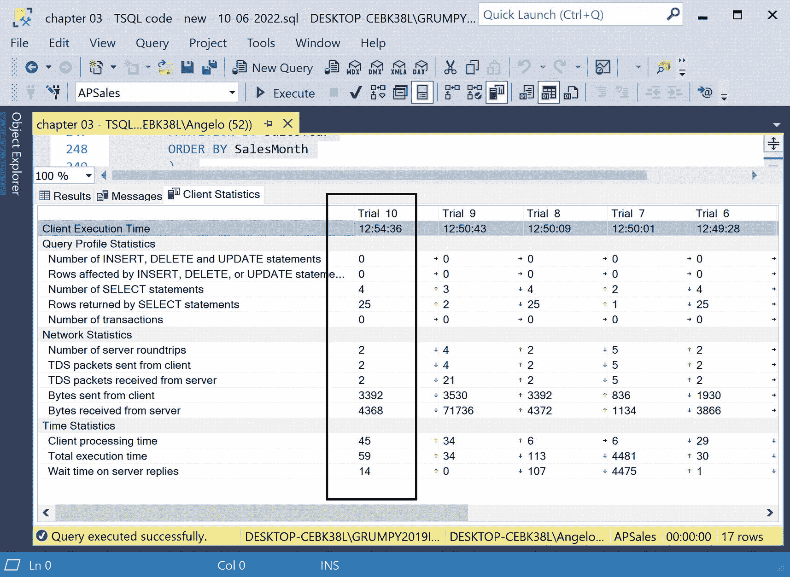

第 03 章 T S Q L 代码窗口的截图。顶部屏幕显示一些编程代码。底部屏幕有一个结果表和客户端统计信息。该表有 9 列。第 10 次试验列被突出显示。

图 3-12

客户端统计信息性能报告

请记住，运行这些性能工具每次都会产生不同的结果，差异可能不大，但由于您使用的计算平台不同，它们很可能与本书中显示的结果不同。让我们继续下一组函数。


### `LAG()` 与 `LEAD()`

这些是在您的编程工具箱中用于分析数据时非常重要的函数。您的业务分析师所执行的活动之一，是在本质上属于历史的数据集中，进行回顾性或前瞻性的观察。当然，这些数据可能是一个包含当前和过去数据、但不包含未来数据的快照。这些函数允许您创建强大的查询和报告来实现这一目标。

`LAG()` 函数的功能如下：

此函数用于获取当前行某一列值之前某一行的列值。例如，给定某产品本月的销售额，获取该产品上个月的销售额，或者指定某个偏移量，比如三个月前甚至一年或更久以前，这取决于您收集了多少历史数据以及您的业务用户希望看到什么。

`LEAD()` 函数的功能如下：

此函数用于获取当前行某一列值之后某一行的列值。例如，给定某产品本月的销售额，获取该产品下个月的销售额或者指定某个偏移量，比如三个月后甚至一年后。

这些函数在需要分析历史销售业绩或当前业绩与过去业绩对比的销售场景中尤为方便。

现在我们有了一个内存优化表，我们将用它来代替本章大部分示例中使用的`CTE`方案。性能应该会非常快！

请参考代码清单 3-14。

```
SELECT
SalesYear,
SalesQuarter,
SalesMonth,
StoreNo,
ProductNo,
CustomerNo,
CalendarDate AS SalesDate,
SalesTotal,
LAG(SalesTotal) OVER (
PARTITION BY SalesYear,CustomerNo
ORDER BY SalesMonth,CustomerNo,CalendarDate
) AS LastMonthlySales,
LEAD(SalesTotal) OVER (
PARTITION BY SalesYear,CustomerNo
ORDER BY SalesMonth,CustomerNo,CalendarDate
) AS NextMonthylSales
FROM [SalesReports].[MemorySalesTotals]
WHERE StoreNO = 'S00005'
AND SalesYear = 2002
GO
```

**代码清单 3-14**
运行中的 `LAG()` 和 `LEAD()` 函数

这一次，我们加入了商店编号和年份的过滤条件来运行查询。该查询生成了 902 行（就 SQL Server 而言，这仍然不算多行）。

执行时间不到一秒。请参考图 3-13 中的部分结果。

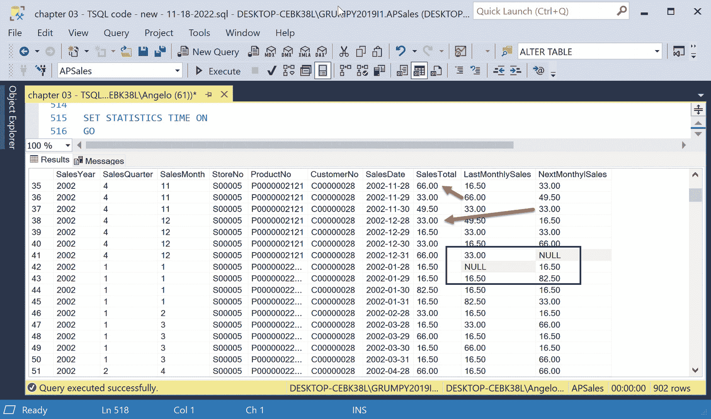

第 03 章 T-SQL 代码窗口的截图。顶部屏幕显示了一些编程代码。底部屏幕显示了一个结果表。该表有 9 列。“上月销售额”和“下月销售额”列的部分值被高亮显示。

**图 3-13**
测试脚本的查询结果

我向下滚动了一点，这样当窗口框架移动到下一个分区时，您可以看到数据模式。注意红色箭头。我们可以看到 `LastMonthlySales` 列指向了前一个月的值，而 `NextMonthlySales` 列指向了 `SalesTotal` 列中下个月的值。

我们可以在第 41 行和第 42 行看到窗口框架的动作。当下个月的销售额在分区变更时被设置为 `NULL`，第 42 行的前一个月的销售额值也是 `NULL`，因为我们正在开始一个新的分区（请记住分区与分区内窗口框架之间的区别）。

下载脚本并移除年份的过滤条件，这样您就能获得该商店所有年份的数据。如果您不仅需要所有年份，还需要所有商店的数据，您可能需要稍微调整一下排序顺序，以便所有内容正确对齐。

这就是为什么我总是建议在创建复杂的脚本或查询时，从一个小型数据集开始。当您确定它工作正确时，您可以通过移除任何过滤器来扩大范围。

#### 性能考量

接下来，我们将看看与这些函数相关的性能问题以及一些可能的提高性能的解决方案。和往常一样，我们的第一步是按照通常的方式创建一个估计的查询计划。请确保首先运行 `DBCC` 命令来清除缓冲区。

请参考图 3-14 查看估计的执行计划。

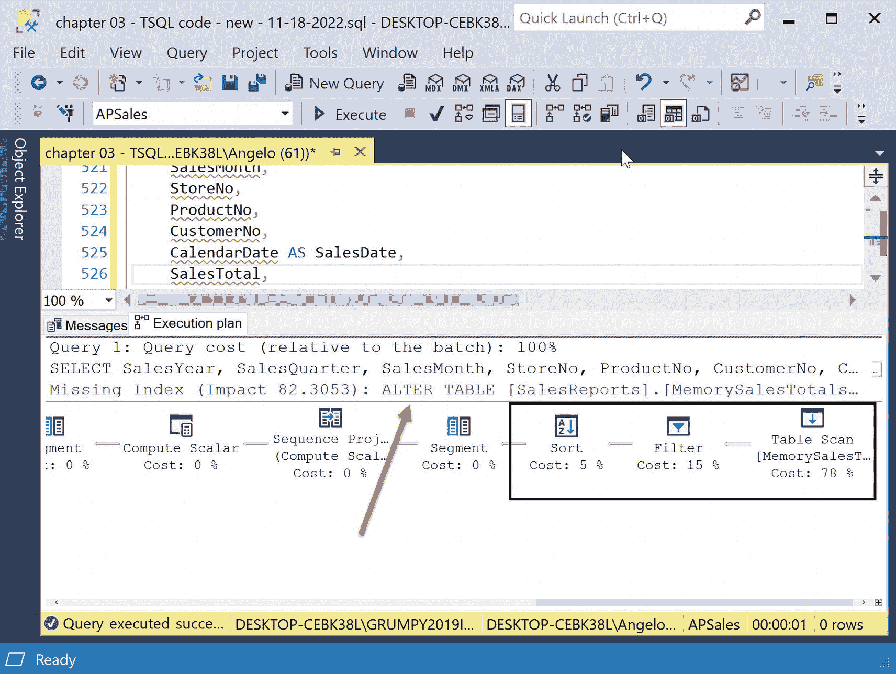

第 03 章 T-SQL 代码窗口的截图。顶部屏幕显示了一些编程代码。底部屏幕显示了查询成本信息。排序成本，1%。筛选成本，15%。表扫描成本，78%。

**图 3-14**
估计执行计划

此估计查询计划显示该查询需要关注。

从右向左读取，我们看到一个成本为 78%的表扫描，接着是一个成本为 15%的筛选，然后是一个成本仅为 5%的排序步骤。系统建议了一个索引，因此我们把它提取出来并为其命名。

请参考代码清单 3-15 查看建议的索引。

```
ALTER TABLE [SalesReports].[MemorySalesTotals]
ADD INDEX ieSalesYearStoreNo
NONCLUSTERED ([SalesYear],[StoreNo])
GO
```

**代码清单 3-15**
估计查询计划工具建议的索引

请注意，我们必须使用 `ALTER` 命令，因为内存增强表不支持 `CREATE INDEX` 命令！

此索引基于销售年份和商店编号列。让我们创建它，再次运行 `DBCC` 命令，并生成一个新的估计查询计划。

请参考图 3-15 查看索引创建后的估计计划。

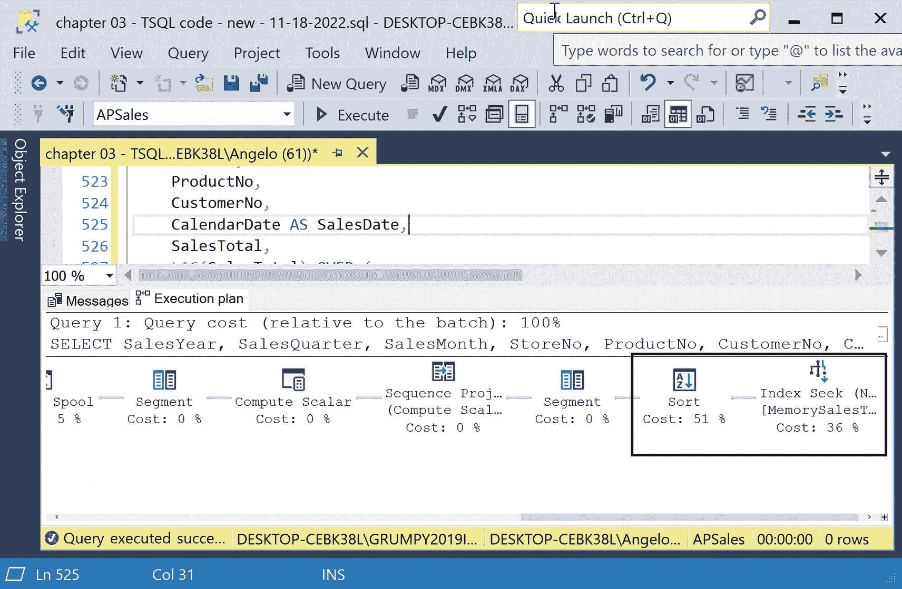

第 03 章 T-SQL 代码窗口的截图。顶部屏幕显示了一些编程代码。底部屏幕显示了查询成本信息。排序成本，15%。索引查找成本，36%。

**图 3-15**
索引创建后的估计查询计划

一个成本为 36%的索引扫描取代了原来成本为 78%的表扫描，因此我们有了一个良好的开端。筛选任务消失了，但排序步骤的成本从 5%增加到了 51%。看来，当我们使用索引查找时，排序步骤的成本又上升了。让我们通过向左滚动来查看计划的第二部分。

请参考图 3-16。

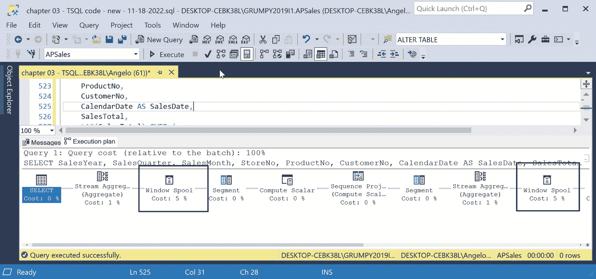

第 03 章 T-SQL 代码窗口的截图。顶部屏幕显示了一些编程代码。底部屏幕显示了查询成本信息。窗口假脱机成本，5%。窗口假脱机成本，5%。

**图 3-16**
估计查询计划的左侧部分

再次从右向左看，注意第一个窗口假脱机任务。它的成本是 5%，用于在分区（位于内存中）内多次引用数据。还有一些其他低成本任务，我们看到了第二个窗口假脱机任务。这也有 5%的成本。需要记住的一点是：我们应该力争使窗口假脱机任务的成本为 0%。这意味着操作在内存中进行。如果值大于零，则假脱机活动在磁盘上进行。（更多内存会有帮助吗？）

索引创建后，最终的 `IO` 和 `TIME` 统计数据如下。查询运行了两次。每次都执行了 `DBCC` 命令来清除内存缓冲区（一个小提醒…）。

请参考表 3-5。

**表 3-5**
`LAG()` 和 `LEAD()` 函数的 IO 和 TIME 统计数据


### SQL Server 性能与百分位数函数解析

| SQL Server 解析与编译时间 | 首次运行 | 第二次运行 |
| --- | --- | --- |
| CPU 时间 (毫秒) | `16` | `0` |
| 已用时间 (毫秒) | `76` | `39` |
| **统计信息（工作表）** | **首次运行** | **第二次运行** |
| 扫描计数 | 0 | 0 |
| 逻辑读取 | 0 | 0 |
| 物理读取 | 0 | 0 |
| 预读 | 0 | 0 |
| **内存表** | **首次运行** | **第二次运行** |
| 扫描计数 | N/A | N/A |
| 逻辑读取 | N/A | N/A |
| 物理读取 | N/A | N/A |
| 预读 | N/A | N/A |
| | N/A | N/A |
| **SQL Server 执行时间** | **首次运行** | **第二次运行** |
| CPU 时间 (毫秒) | 31 | 31 |
| 已用时间 (毫秒) | `174` | `121` |

看来这个查询非常快，执行时间在毫秒的两位数级别。第二次运行的解析时间下降了，`work table`（工作表）的统计全是零，而`memory table`（内存表）没有统计信息（这很合理，因为表在内存中）。最后看执行时间，`CPU`时间保持在 31 毫秒不变，而`Elapsed time`（已用时间）统计从 174 毫秒下降到了 121 毫秒。

## `PERCENTILE_CONT()` 与 `PERCENTILE_DISC()`

这两个函数是做什么的？

`PERCENTILE_CONT()`函数基于给定的百分位数，在连续数据集上工作，返回满足该百分位数的数据集内的一个值（你需要提供一个百分位参数，如`.25`、`.5`、`.75`等）。

对于这个函数，值是**插值**出来的。它通常不存在于数据集中，而是被引入的。或者巧合地，如果数字排列正确，它也可能使用数据集中的某个值。

到底什么是连续数据？简单地说，它是随特定时间段变化的数据，例如，某个产品在时间段内的销售额，比如一个月内的总销售额。

`PERCENTILE_DISC()`函数基于给定的百分位数，在离散数据集上工作，返回满足该百分位数的数据集内的一个值。对于这个函数，该值存在于数据集中；它不像`PERCENTILE_CONT()`函数那样是插值出来的。

那么，离散数据又是什么呢？

简单地说，离散数据值是可以随时间计数的数值，例如，产品在日、月、年中的销售额。你可以将这些值相加得到总销售额。

连续数据是在一段时间内测量的数据，例如，设备在 24 小时内的锅炉温度。将每个锅炉温度相加没有意义。但将锅炉温度相加然后除以时间段以获得平均值则有意义。

在我们深入分析销售数据之前，让我们先从一个简单的例子开始。

请参考代码清单 3-16。

```sql
DECLARE @ExampleValues TABLE (
    TestKey VARCHAR(8) NOT NULL,
    TheValue SMALLINT NOT NULL
);
INSERT INTO @ExampleValues VALUES
('ONE',1),('TWO',2),('THREE',3),('FOUR',4),('SIX',6),('SEVEN',7),('EIGHT',8),('NINE',9),('TEN',10),('TWELVE',12);
SELECT
    TestKey,TheValue,
    PERCENTILE_CONT(.5)
        WITHIN GROUP (ORDER BY TheValue)
        OVER() AS PctCont, -- continuous
    PERCENTILE_DISC(.5)
        WITHIN GROUP (ORDER BY TheValue)
        OVER() AS PctDisc -- discrete
FROM @ExampleValues
GO
-- 代码清单 3-16
-- PERCENTILE_CONT() 和 PERCENTILE_DISC() 函数演示
```

这是一个非常简单的例子。数据集包含十行两列：一个文本值和一个数值。

`PERCENTILE_CONT()`函数被传递`.5`作为参数，以插值出一个值，该值将适合数据集中第 50 百分位的位置。它将数据集视为值的**连续分布**。

`PERCENTILE_DISC()`函数也被传递`.5`作为参数，以识别一个存在的值，该值落在数据集的第 50 百分位位置。它将数据集视为值的**离散分布**。（你可以传递任何小于或等于 1 的值，如`.75`或`.25`）。

让我们看看结果如何。请参考图 3-17。

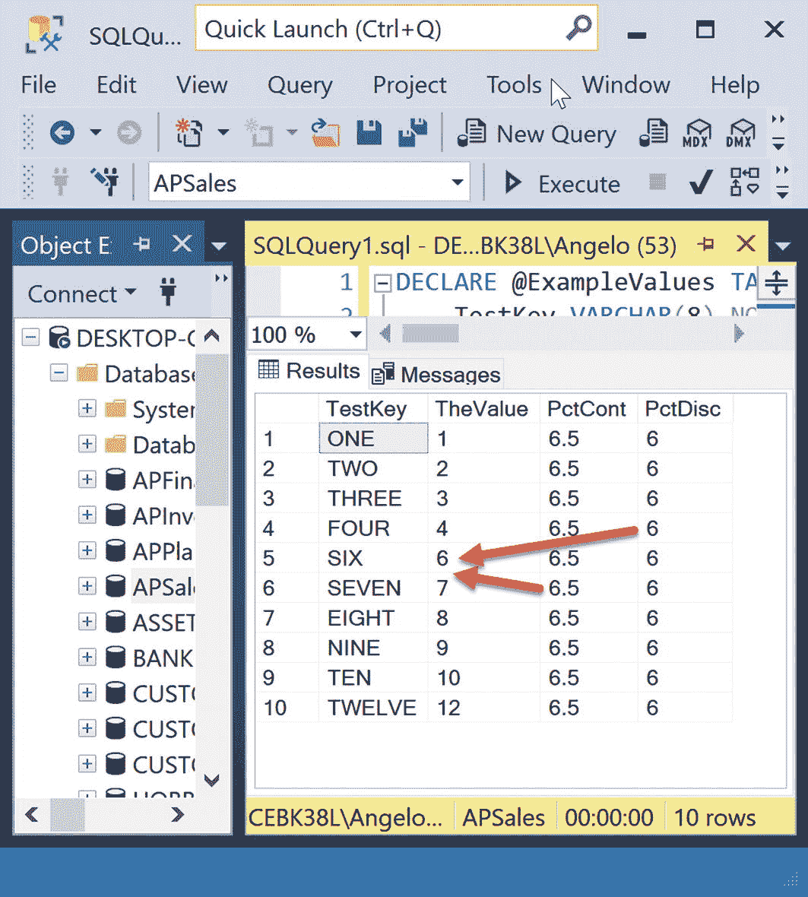
*图 3-17*
*百分位连续与离散结果对比*

百分位连续值是插值出来的，而百分位离散值不是。请注意，值`6.5`落在`TheValue`列中值`6`和`7`之间。百分位离散值是`6`，它存在于`TheValue`列中。很简单吧！

有了这个强大的知识，让我们在销售数据上试试这些函数。请参考代码清单 3-17，我们将回到我们的朋友——`CTE`。

```sql
WITH StoreSalesAnalysis (
    SalesYear,SalesMonth,StoreNo,StoreName ,StoreTerritory,TotalSales
)
AS (
    SELECT YEAR(CalendarDate) AS SalesYear
          ,MONTH(CalendarDate) AS SalesMonth
          ,StoreNo
          ,StoreName
          ,StoreTerritory
          ,SUM(TotalSalesAmount) AS TotalSales
    FROM APSales.SalesReports.YearlySalesReport
    GROUP BY YEAR(CalendarDate)
            ,MONTH(CalendarDate)
            ,StoreNo
            ,StoreName
            ,StoreTerritory
)
SELECT  SalesYear
      ,SalesMonth
      ,StoreNo
      ,StoreName
      ,StoreTerritory
      ,FORMAT(TotalSales,'C') AS TotalSales
      ,FORMAT(PERCENTILE_CONT(.5)
              WITHIN GROUP (ORDER BY TotalSales)
              OVER (
                  PARTITION BY SalesYear
              ),'C') AS PctCont
      ,FORMAT(PERCENTILE_DISC(.5)
              WITHIN GROUP (ORDER BY TotalSales)
              OVER (
                  PARTITION BY SalesYear
              ),'C') AS PctDisc
FROM StoreSalesAnalysis
WHERE SalesYear IN(2010,2011)
  AND StoreNo = 'S00004'
GO
-- 代码清单 3-17
-- 百分位连续与离散分析
```

我决定将百分位数格式化为货币，这样在报告中看起来更美观。注意`OVER()`子句只能包含`PARTITION BY`子句；不允许`ORDER BY`，你稍后会明白原因。（在这里我们按`SalesYear`分区。）

还要注意，在`OVER()`子句正上方，我们需要包含一个`WITHIN GROUP (ORDER BY TotalSales)`指令。所以，如你所见，这些函数的语法略有不同。

让我们看看结果。请参考图 3-18 中的部分结果。

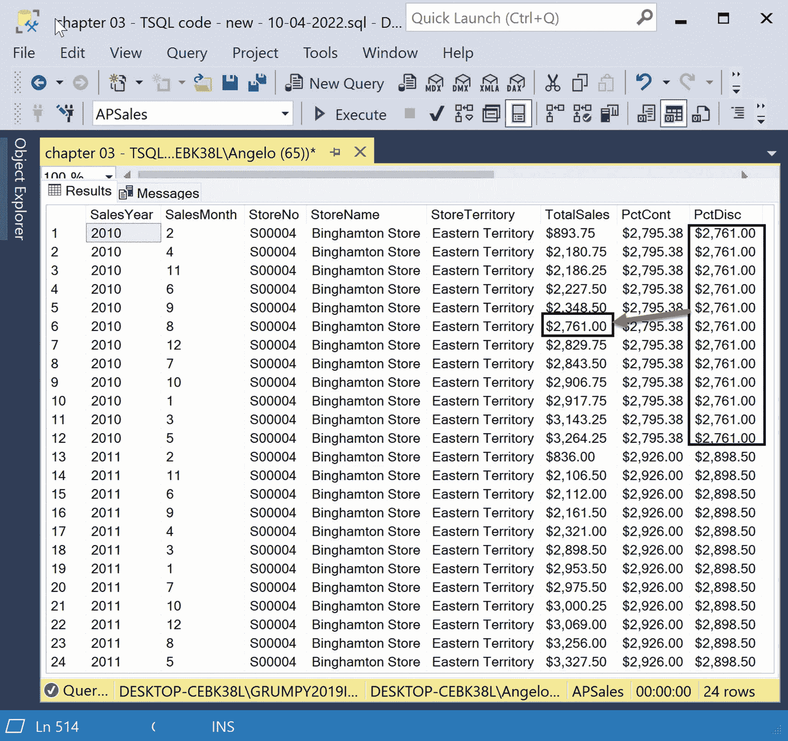
*图 3-18*
*测试脚本的查询结果*

请注意，百分位离散的结果如何出现在`TotalSales`列中。换句话说，结果不是插值出来的。而百分位连续的情况则不同；结果可能出现在`TotalSales`列中，但通常是插值出来的。值`$2,795.38`并没有作为实际值出现在`TotalSales`列中。

> **注意**
> SQL Server 2022 包含了两个新函数，`APPROX_PERCENTILE_DIS()`和`APPROX_PERCENTILE_CONT()`，我们将在另一章中介绍它们。

让我们看看这些函数会生成什么样的估计查询计划。

### 性能注意事项

我们以通常的方式为菜单栏中的下拉查询选择生成了一个估计的查询计划。我们立即注意到系统建议创建一个索引。让我们来检查一下该计划。

请参考图 3-19 查看估计的查询计划。

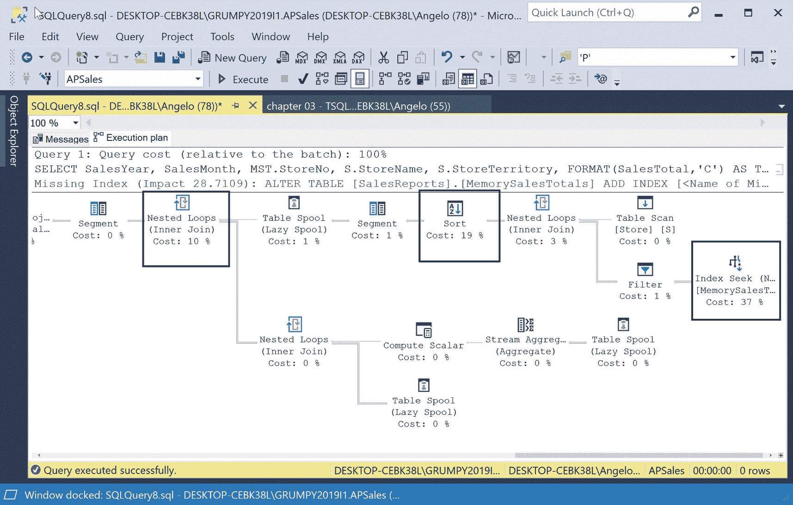

*图 3-19：百分位函数的估计查询计划*

从右向左看，我们看到一个成本为 37% 的索引查找任务，但显然这个索引并未满足所有性能要求。尽管有一个可用的索引被使用，系统还是建议了一个新索引，因此我们必须处理这个需求。

下一个较昂贵的任务是成本为 19% 的排序任务和成本为 10% 的嵌套循环连接任务。所有其他任务成本为零或很低，因此我们此时不讨论它们。你应该始终检查每个任务，即使是低成本的任务，以便理解查询将如何被处理。

表 3-6 显示了使用现有索引执行此查询时的统计信息。

*表 3-6：使用现有索引的统计信息*

| SQL Server Parse and Compile Times | Existing Index | New Index |
| --- | --- | --- |
| CPU time (ms) | 0 | TBD |
| Elapsed time (ms) | 98 | TBD |
| **Statistics (Work Table)** | **Existing Index** | **New Index** |
| Scan count | 9 | TBD |
| Logical reads | 171 | TBD |
| Physical reads | 0 | TBD |
| Read-ahead reads | 0 | TBD |
| **Statistics (Work File)** | **Existing Index** | **New Index** |
| Scan count | 0 | TBD |
| Logical reads | 0 | TBD |
| Physical reads | 0 | TBD |
| Read-ahead reads | 0 | TBD |
| **Statistics (YearlySalesReport)** | **Existing Index** | **New Index** |
| Scan count | 1 | TBD |
| Logical reads | 4033 | TBD |
| Physical reads | 1 | TBD |
| Read-ahead reads | 4041 | TBD |
| **SQL Server Execution Times** | **Existing Index** | **New Index** |
| CPU time (ms) | 47 | TBD |
| Elapsed time (ms) | 1025 | TBD |

从顶部开始，解析和编译的耗时是 98 毫秒。统计信息中出现了一个工作文件和一个工作表，还包括了 `YearlySalesReport` 表。对于工作表，我们看到扫描计数为 9，逻辑读取数为 171。这些可以改进。

查看工作文件，所有值都是 0，因此我们不需要担心这组统计信息。

现在，需要注意 `YearlySalesReport` 的统计信息。我们看到扫描计数为 1。逻辑读取数为 4,033，物理读取数为 1，最后预读数为 4,041。

最后，`CPU` 时间为 47 毫秒，耗时为 1025 毫秒。有点高。让我们创建建议的索引，看看是否有助于降低这些统计信息。

请参考代码清单 3-18，其中显示了 SQL Server 生成的索引和注释。

```sql
/*
Missing Index Details from chapter 03 - TSQL code - new - 10-06-2022.sql - DESKTOP-CEBK38L\GRUMPY2019I1.APSales (DESKTOP-CEBK38L\Angelo (52))
The Query Processor estimates that implementing the following index could improve the query cost by 87.5919%.
*/
/*
USE [APSales]
GO
CREATE NONCLUSTERED INDEX []
ON [SalesReports].[YearlySalesReport] ([StoreNo])
INCLUDE ([StoreName],[StoreTerritory],[CalendarDate],[TotalSalesAmount])
GO
*/
```
*代码清单 3-18：建议的索引*

SQL Server 告诉我们，如果我们创建这个索引（在给它命名后），将提升 87.5% 的性能。

好的，听起来不错，但我们拭目以待。

我们将此索引命名为 `ieStoreTerritoryDateTotalSales`。经过一些复制粘贴操作来包含带名称的命令，得到了以下 DDL 查询：

```sql
CREATE NONCLUSTERED INDEX ieStoreTerritoryDateTotalSales
ON [SalesReports].[YearlySalesReport] ([StoreNo])
INCLUDE ([StoreName],[StoreTerritory],[CalendarDate],[TotalSalesAmount])
GO
```

我们执行它，然后生成一个新的估计查询计划。

请参考图 3-20。

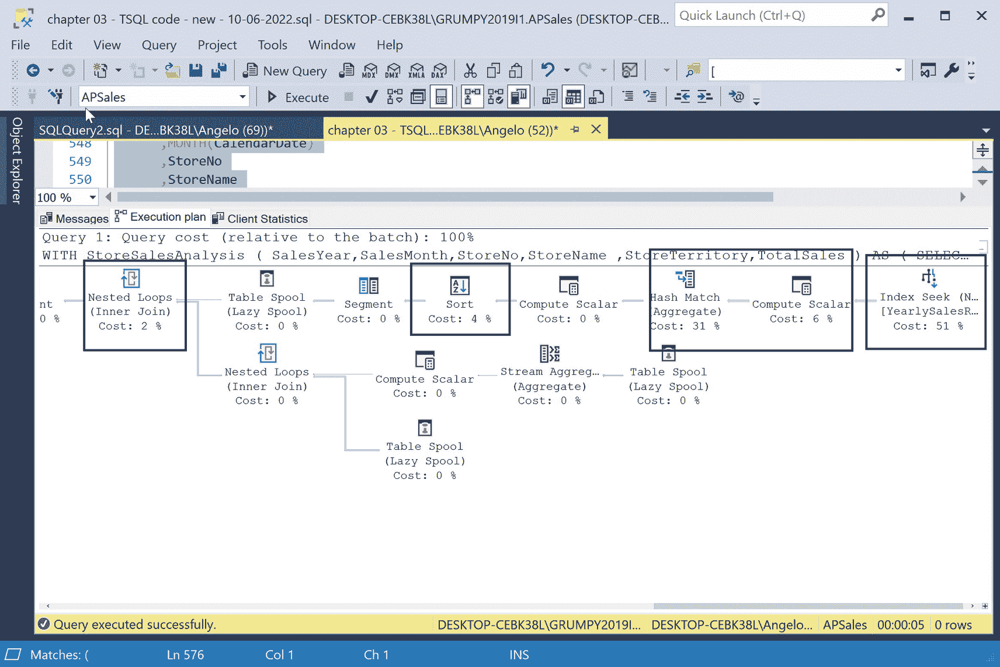

*图 3-20：创建索引后的估计查询计划*

我们立即看到了改进。看起来新索引正在被使用。索引查找任务的成本占 51%。我们确实有一个成本为 31% 的哈希匹配聚合。排序现在占 4% 的成本，嵌套循环连接占 2%。

表 3-7 显示了使用新索引执行查询后的统计信息。

*表 3-7：创建建议索引后的统计信息*

| SQL Server Parse and Compile Times | Existing Index | New Index |
| --- | --- | --- |
| CPU time (ms) | 0 | 31 |
| Elapsed time (ms) | 98 | 113 |
| **Statistics (Work Table)** | **Existing Index** | **New Index** |
| Scan count | 9 | 9 |
| Logical reads | 171 | 171 |
| Physical reads | 0 | 0 |
| Read-ahead reads | 0 | 0 |
| **Statistics (Work File)** | **Existing Index** | **New Index** |
| Scan count | 0 | 0 |
| Logical reads | 0 | 0 |
| Physical reads | 0 | 0 |
| Read-ahead reads | 0 | 0 |
| **Statistics (YearlySalesReport)** | **Existing Index** | **New Index** |
| Scan count | 1 | 1 |
| Logical reads | 4033 | 343 |
| Physical reads | 1 | 0 |
| Read-ahead reads | 4041 | 332 |
| **SQL Server Execution Times** | **Existing Index** | **New Index** |
| CPU time (ms) | 47 | 16 |
| Elapsed time (ms) | 1025 | 159 |

对于解析步骤，`CPU` 时间上升到 31 毫秒，耗时上升到 113 毫秒。我们在向错误的方向前进！

工作表和工作文件没有变化，但如果我们查看处理 `YearlySalesReport` 表的统计信息，我们看到：

*   扫描计数保持不变——没有消息就是好消息。
*   逻辑读取数从 4,033 降到了 343——一个重大的改进。
*   物理读取数从 1 降到了 0——我们接受这个改进。
*   预读数从 4,041 降到了 332——另一个重大改进。

最后，对于 SQL 执行时间，`CPU` 时间从 47 毫秒降至 16 毫秒，耗时从 1025 毫秒降至 159 毫秒。创建建议的索引帮助很大。

那么，一个替换了 `CTE` 的反规范化报告表会有更多帮助吗？或者，内存优化表呢？

### 使用报告表

有时，为利用窗口函数或复杂计算（或两者兼有）的查询创建一个或多个索引来提高性能是不够的。接下来要考虑的是创建一个所谓的反规范化表或报告表，该表在非工作时段加载，前提是用户可以容忍数据有 24 小时的延迟。

此步骤的关键在于理解业务分析师的需求。一些用户会需要或想要当前实时数据，而另一些用户则可以接受较旧的数据，比如当他们需要运行月末汇总或其他某种总结历史绩效的报告时。

作为 SQL 开发人员或架构师，你需要与业务方合作，收集业务用户期望的数据和性能报告。希望在需求收集会议之后，你会得到这样一个场景：80%的用户不需要实时数据；相反，一天前的数据或更旧的数据就足够了。另外 20%需要实时数据的用户则需要复杂的解决方案，这可能涉及硬件、复杂的复制方案或直接查询事务表，而后者并不推荐。

让我们看一下针对刚才研究的查询的一个可能解决方案，它使用了一个在非工作时段加载的报告表。查询的`CTE`部分被报告表取代。我们将预加载它，然后检查包含窗口函数的查询的性能。

请参阅清单 3-19，了解加载报告表和修订后查询的脚本。

```sql
DROP TABLE IF EXISTS [SalesReports].[YearlySummaryReport]
GO
CREATE TABLE [SalesReports].YearlySummaryReport NOT NULL,
[StoreName]      nvarchar NOT NULL,
[StoreTerritory] nvarchar NOT NULL,
[TotalSales]     decimal NULL
) ON [AP_SALES_FG]
GO
INSERT INTO APSales.SalesReports.YearlySummaryReport
SELECT YEAR(CalendarDate) AS SalesYear
,MONTH(CalendarDate) AS SalesMonth
,StoreNo
,StoreName
,StoreTerritory
,SUM(TotalSalesAmount) AS TotalSales
FROM APSales.SalesReports.YearlySalesReport
GROUP BY YEAR(CalendarDate)
,MONTH(CalendarDate)
,StoreNo
,StoreName
,StoreTerritory
GO
CREATE NONCLUSTERED INDEX [ieYearlySalesStoreTerritorySummary]
ON [SalesReports].[YearlySummaryReport] ([StoreNo],[SalesYear])
INCLUDE ([SalesMonth],[StoreName],[StoreTerritory],[TotalSales])
GO
清单 3-19
用于预加载的 YearlySummaryReport 表
```

此脚本使用为`CTE`定义的输出列，并用它们创建一个名为`YearlySummaryReport`的物理表。表创建好后，原本用于`CTE`的查询被用在`INSERT`语句中来加载该表。这一步很简单。现在，对于包含窗口函数的查询以及我们需要进行的分析，以查看在估计查询计划以及`IO`和`TIME`统计信息方面是否有改进，请参阅清单 3-20。

```sql
DBCC dropcleanbuffers
CHECKPOINT;
GO
SET STATISTICS TIME ON
GO
SET STATISTICS IO ON
GO
SELECT     SalesYear
,SalesMonth
,StoreNo
,StoreName
,StoreTerritory
,FORMAT(TotalSales,'C') AS TotalSales
,FORMAT(PERCENTILE_CONT(.5)
WITHIN GROUP (ORDER BY TotalSales)
OVER (
PARTITION BY SalesYear
),'C') AS PctCont
,FORMAT(PERCENTILE_DISC(.5)
WITHIN GROUP (ORDER BY TotalSales)
OVER (
PARTITION BY SalesYear
),'C') AS PctDisc
FROM APSales.SalesReports.YearlySummaryReport
WHERE SalesYear IN(2010,2011)
AND StoreNo = 'S00004
GO
SET STATISTICS TIME OFF
GO
SET STATISTICS IO OFF
GO
清单 3-20
查询报告表
```

我们之前已经介绍过这个查询，所以让我们直接进入主题，按通常的方式生成估计查询计划。我确实在新的报告表上创建了一个索引。这个索引是由估计查询计划工具建议的。请参阅清单 3-21。

```sql
CREATE NONCLUSTERED INDEX [ieYearlySalesStoreTerritorySummary]
ON [SalesReports].[YearlySummaryReport] ([StoreNo],[SalesYear])
INCLUDE ([SalesMonth],[StoreName],[StoreTerritory],[TotalSales])
GO
清单 3-21
用于支持报告表的索引
```

我们需要将新计划与之前的计划进行比较，以查看发生了哪些改进（如果有的话）。

请参阅图 3-21，了解两种方法的估计查询计划。

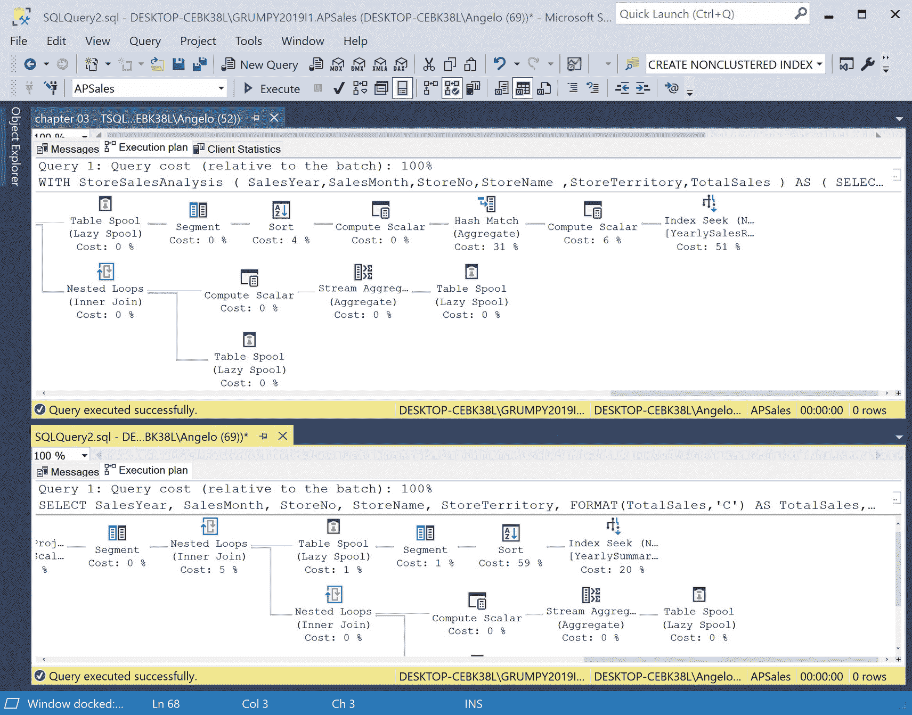

一个第 03 章 T-SQL 代码窗口的截图。屏幕被分成 2 个子窗口。顶部屏幕有一些编程代码。底部屏幕有一条关于查询计划的消息。它比较了执行计划后的新计划与之前的计划。

图 3-21
比较估计查询计划

顶部的估计查询计划代表使用原始`CTE`的查询。底部的查询计划是用于查询预加载报告表的修订脚本。

我们看到，报告表查询的索引查找成本为 20%，而原始查询的索引查找成本为 51%。新查询还有一个排序步骤，其成本明显高于使用`CTE`的原始查询中的排序步骤。看来当索引查找成本下降时，排序成本就会上升。这是需要留意的一点。

这是改进吗？不确定，所以让我们看看`IO`和`TIME`统计信息，看看它们能告诉我们什么。

请参阅表 3-8。

表 3-8
比较 IO 和 TIME 统计信息

| SQL Server 解析和编译时间 | 无报告表 | 有报告表 |
| --- | --- | --- |
| CPU 时间 (毫秒) | 15 | 0 |
| 已用时间 (毫秒) | **20** | **58** |
| **统计信息 (工作表)** | **现有索引** | **新索引** |
| 扫描计数 | 9 | 9 |
| 逻辑读取 | 171 | 171 |
| 物理读取 | 0 | 0 |
| 预读读取 | 0 | 0 |
| **统计信息 (工作文件)** | **现有索引** | **新索引** |
| 扫描计数 | 0 | 不适用 |
| 逻辑读取 | 0 | 不适用 |
| 物理读取 | 0 | 不适用 |
| 预读读取 | 0 | 不适用 |
| **统计信息 (YearlySalesReport) vs. YearlySummaryReport** | **现有索引** | **新索引** |
| 扫描计数 | **1** | **2** |
| 逻辑读取 | **343** | **6** |
| 物理读取 | **2** | **1** |
| 预读读取 | **345** | **8** |
| **SQL Server 执行时间** | **现有索引** | **新索引** |
| CPU 时间 (毫秒) | **16** | **0** |
| 已用时间 (毫秒) | **132** | **67** |

查看生成的统计信息，我们看到当使用名为`YearlySummaryReport`的报告表时，性能有显著提升。扫描计数从 1 增加到 2，但逻辑读取从 343 降到了 6。物理读取在新报告表中减少了 1，最好的是，预读读取从 345 降到了 8。所以，是的，在使用窗口函数的查询中使用预加载和预计算的报告表似乎有显著的改进。想一想——从分析中消除`CTE`或加载步骤肯定会提高查询性能。

最后但同样重要的是，执行时间的 CPU 时间从 16 毫秒降到了 0 毫秒，已用时间从 132 毫秒降到了 67 毫秒。

在进行此类分析时，最后一个建议是：始终运行多次测试，每次试验前使用`DBCC`清除缓冲区。将结果记录在电子表格中，以便后续分析和评估哪种性能改进方案效果最佳。

顺便说一句，隔离报告表的加载步骤并不意味着我们完全忽略对加载步骤的性能分析。如果我们每晚加载数百万行数据，那么我们需要提出一个加载策略，确保其耗时不会过长以至于侵占工作时间！


### 总结

我们刚刚介绍了第二组窗口函数——分析函数。我认为，无论是在满足业务分析师需求的**分析技术**方面，还是在**性能调优**方面，我们都取得了一些有趣的发现。

我们利用估计的查询计划以及`IO`和`TIME`统计数据进行了常规分析，同时也审视了客户端统计数据。

接着，我们引入了非规范化暂存表或报告表，以模拟一个在夜间加载数据并执行所有计算和连接的生产环境。我们对基于`CTE`的查询进行了与之前相同的性能分析。

最后，我们介绍了内存优化表，这些表被加载到内存中。我们发现它们可以非常快。

总之，您现在知道了如何在使用`OVER()`子句的分区中使用分析函数。在下一章中，我们将研究排名函数，并尝试使用窗口帧定义来让事情变得更有趣。

还有一点需要说明：我们仅仅是触及了性能分析和调优技术的皮毛。本书的范围是关于窗口函数，但学习如何使用一些性能调优工具和技术是最低要求，因为它将帮助您编写快速有效的脚本和查询。

关于性能调优的优秀读物，请参阅 Grant Fritchey 所著的*《SQL Server 2022 查询性能调优：故障排除与优化查询性能》*（第六版，Apress）。

这是一本很棒的读物，在我看来，如果您认真学习性能分析、相关工具和性能改进，这是您书架上的必备书。

