# 4. 销售用例：排名/窗口函数

这是我们处理销售数据仓库的最后一章。我们将探讨第三类函数，即窗口或排名函数。我们将采用与前面章节相同的方法，即简要解释函数，展示代码和查询结果，并通过添加索引和报告表进行一些性能分析和调优。最后，我们将提出一个称为“间隙与孤岛”的数据分析问题，其中我们使用在第 3 章中学到的一些窗口系统函数来识别销售数据中的日期间隙和序列。

## 排名/窗口函数

这个类别只有四个函数，但我们将重新审视上一章的`PERCENT_RANK()`函数，因为它与其中一些函数有许多相似之处：

*   `RANK()`
*   `PERCENT_RANK()`
*   `DENSE_RANK()`
*   `NTILE()`
*   `ROW_NUMBER()`

`RANK()`函数显示数据集中每一行某列值相对于数据集中其他行值的排名。如果出现并列排名，则并列的行获得相同的排名，但下一个值在重复值之后被分配的排名等于并列数量加上当前的排名值。

因此，如果您有三个并列值（例如值 4）被分配排名 4，那么下一个大于 4 的值的排名将是 4 + 3（并列数量）= 7（哎呀！）。

`DENSE_RANK()`函数的工作方式几乎与`RANK()`函数相同。如果出现并列排名，并列的行获得相同的排名，但下一个值在重复值之后只是被分配下一个排名数字。因此，如果并列值的排名是 4，那么分配给下一个更高值的排名就是 5（这对我来说很合理……）。

`PERCENT_RANK()`函数将排名分配为百分比。并列的行获得相同的排名百分比值。使用类似于查询、分区或表变量结果的数据集，该函数计算每个值相对于整个数据集的相对排名（以百分比形式）。您需要将结果（返回值是`float`数据类型）乘以 100.00 或使用`FORMAT()`函数将结果转换为百分比。

`ROW_NUMBER()`函数只是简单地为每一行分配下一个最大的数字，无论是否出现并列。

因此，如果当前行是数据集中的第四行，则分配行号 4。对于第 5 行，那么，请等待一下，数字 5 被分配，依此类推。此函数不关心包含值的列中是否存在并列。它只关心行在数据集中的位置。

`NTILE()`函数允许您将数据集中的一组行划分为若干个切片或桶。如果您有一个包含 12 行的数据集，并且想分配 4 个切片，那么每个切片将有 3 行。当您想评估销售人员绩效并根据销售业绩授予奖金时，此功能非常方便。（我们将看到如何操作。我们将生成多个切片来实现绩效桶，并将销售人员分配到其中。）

好的，我确信所有这些有点令人困惑，您正在挠头。让我们使用上一章的简单示例，稍作修改，然后查看一些简单的数据，以便我们解释每个函数的作用（`NTILE()`除外）以及它们彼此之间的相似之处（和不同之处）。

请参考代码清单[4-1]。

```sql
DECLARE @ExampleValues TABLE (
TestKey VARCHAR(8) NOT NULL,
TheValue SMALLINT NOT NULL
);
INSERT INTO @ExampleValues VALUES
('ONE',1),('TWO',2),('THREE',3),('FOUR',4),
('FOUR',4),('SIX',6),('SEVEN',7),
('EIGHT',8),('NINE',9),('TEN',10);
SELECT
TestKey,
TheValue,
ROW_NUMBER()          OVER(ORDER BY TheValue) AS RowNo,
RANK()                OVER(ORDER BY TheValue) AS ValueRank,
DENSE_RANK()          OVER(ORDER BY TheValue) AS DenseRank,
PERCENT_RANK()        OVER(ORDER BY TheValue) AS ValueRank,
FORMAT(PERCENT_RANK() OVER(ORDER BY TheValue),'P') AS ValueRankAsPct
FROM @ExampleValues;
GO
```
代码清单 4-1
排名函数实战

我们声明了简单的表变量并向其中插入了十行。注意`INSERT`语句中`('FOUR',4)`的重复值。这是故意为之的，这样我们就能看到重复值如何影响每个函数的行为。

每个函数都与一个`OVER()`子句一起使用。我们只包含一个`ORDER BY`子句，该子句按“`TheValue`”列中的值对分区数据集进行排序。注意使用`FORMAT()`函数将`PERCENT_RANK()`函数的结果显示为百分比。让我们看看结果。

注意


在这个示例中，由于没有包含 `PARTITION BY` 子句，分区就是整个数据集。毕竟，我们只有十行数据。

请参见图 4-1。

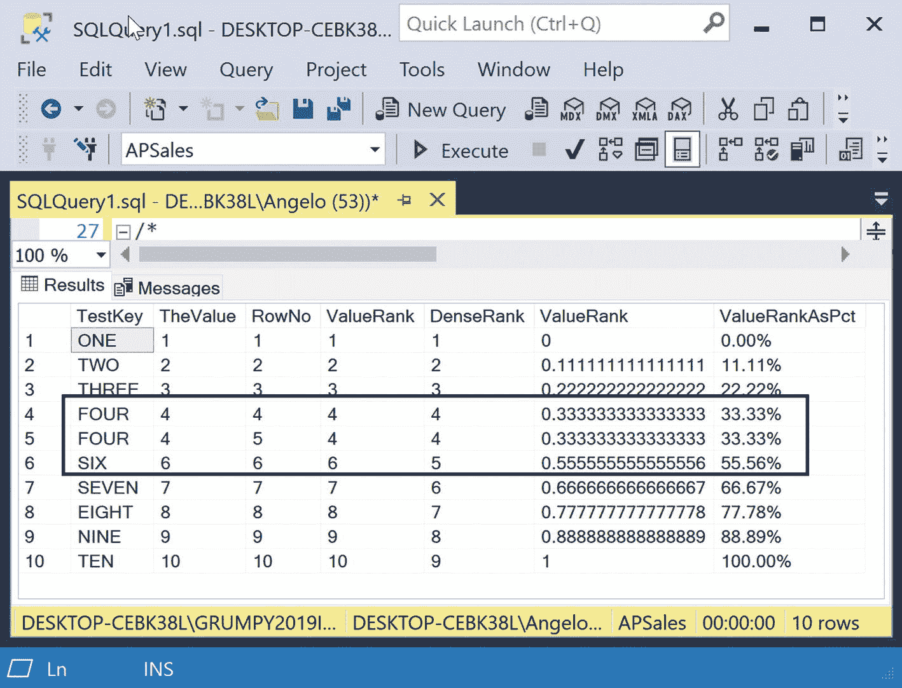

SQL 查询 1 的截图展示了一个包含 7 列 10 行数据的表格，其中列出了排名函数，显示在选项卡下。第 4、5、6 行被高亮显示。表格的标题分别是测试键、值、行号、值排名、密集排名、值排名以及值排名作为百分比。

图 4-1

实际运行中的排名函数结果

我们从 `ROW_NUMBER()` 函数的结果开始。共有十行数据，行号按顺序从 1 到 10。这正是函数名所暗示的。

接下来是 `RANK()` 函数的结果。注意值 4 出现的两次平局（并列）是如何处理的。因为它们相同，所以都被赋予排名 4。但是看看下一行的值发生了什么。它跳过了数字 5，被赋予了值 6。就像我们之前讨论的公式一样，它取平局的数量（2），加上当前的排名 4，从而赋予排名 6。

现在看看 `DENSE_RANK()` 函数的结果。与 `RANK()` 函数类似，平局被赋予相同的排名值，但下一行的值会被赋予下一个更高的排名，也就是 5。

最后但同样重要的是，`PERCENT_RANK()` 函数将排名分配为 0 到 1 之间的百分比值。我添加了一列，以便使用 `FORMAT()` 函数将结果格式化为百分比。这样我们就可以比较格式，并决定哪种格式更有意义。

## `NTILE()` 示例

现在我们来创建一些“瓦片”（tiles）。不，不是厨房地砖，而是数据桶（我知道，这是个蹩脚的双关语）。我们将从另一个简单的示例开始，以便清楚地看到这个函数的作用。我们将使用一个表变量，其中加载了我们销售团队的十行年初至今的销售金额。

我们想要做的是创建三个数据桶或分组，然后根据销售人员落入哪个桶，将其作为给他们发放奖金的标准。

请参考代码清单 4-2。

```
DECLARE @SalesPersonBonusStructure TABLE (
    SalesPersonNo VARCHAR(4) NOT NULL,
    SalesYtd      MONEY      NOT NULL
);
INSERT INTO @SalesPersonBonusStructure VALUES
('S001',2500.00),
('S002',2250.00),
('S003',2000.00),
('S004',1950.00),
('S005',1800.00),
('S006',1750.00),
('S007',1700.00),
('S008',1500.00),
('S009',1250.00),
('S010',1000.00);
-- 排序方式（升序 ASC 或降序 DESC）必须谨慎选择
SELECT SalesPersonNo
      ,SalesYtd
      ,NTILE(3) OVER(ORDER BY SalesYtd DESC) AS BonusBucket
      ,CASE
          WHEN (NTILE(3) OVER(ORDER BY SalesYtd DESC)) = 1 THEN '奖励 $500.00 奖金'
          WHEN (NTILE(3) OVER(ORDER BY SalesYtd DESC)) = 2 THEN '奖励 $250.00 奖金'
          WHEN (NTILE(3) OVER(ORDER BY SalesYtd DESC)) = 3 THEN '奖励 $150.00 奖金'
       END AS BonusAward
FROM @SalesPersonBonusStructure
GO
```

代码清单 4-2

为奖金分配绩效桶

解决方案很简单。`NTILE()` 函数与 `OVER()` 子句一起使用以创建三个桶。由于数据集很小，没有 `PARTITION BY` 子句，但我们包含了一个 `ORDER BY` 子句，以便按降序对年初至今的销售金额进行排序。

接下来，一系列三个 `CASE` 语句块通过再次使用 `NTILE()` 函数来确定分配到哪个桶，从而根据销售人员所在的桶打印出他们获得的奖金金额。

也许有点简单粗暴，因为我们可以使用 `CTE`（公用表表达式）来确定桶，然后编写查询只测试桶的值，而不用再次使用 `NTILE()` 函数。你可以尝试下载本章的脚本，然后使用 `CTE` 方法编写一个查询。万一你在本节的脚本中卡住了，我确实提供了解决方案。

让我们看看每位销售人员获得了什么奖励。请参考图 4-2。

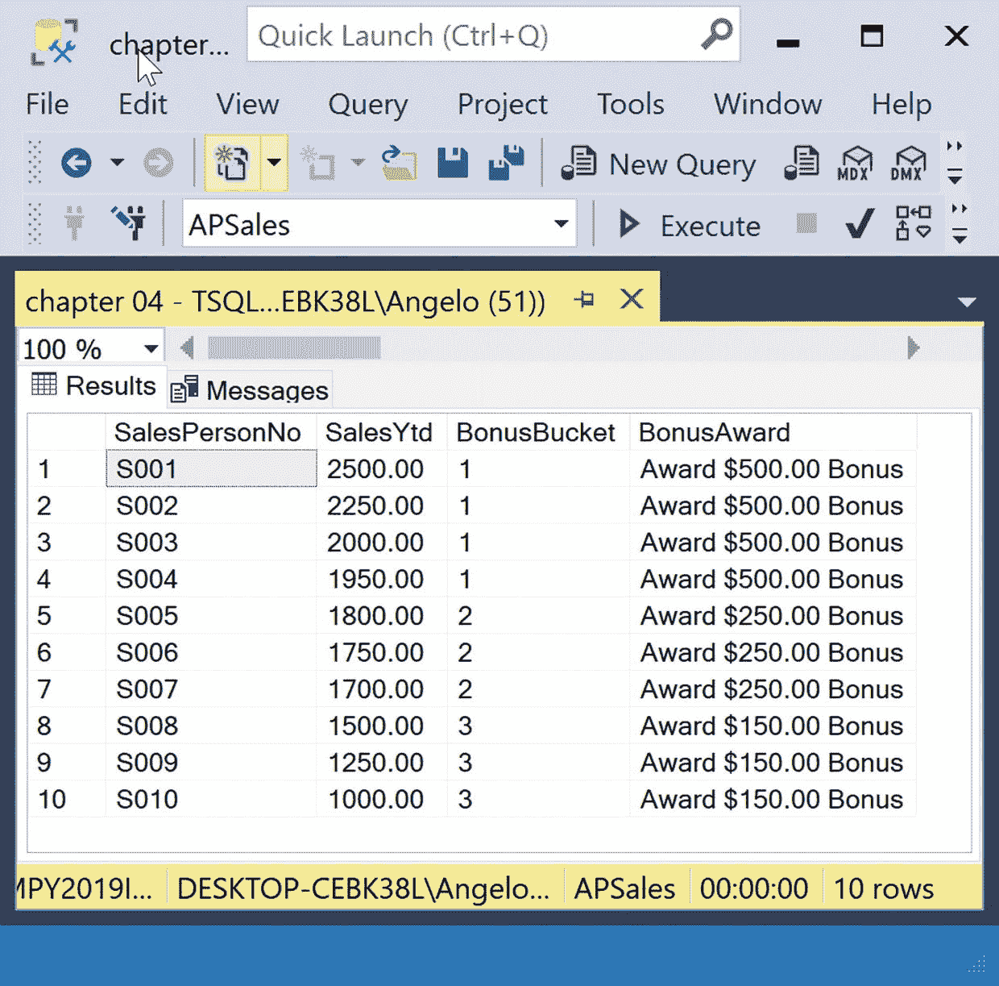

一个窗口的截图展示了一个包含 4 列 10 行的表格，描绘了销售人员获得的奖励，显示在选项卡下。表格的标题分别是销售人员编号、销售年初至今、奖金桶和奖金奖励。

图 4-2

奖金绩效桶

结果集中有十行数据，而我们只指定了三个桶，因此桶的分配是不均匀的。前两个桶各有三行，最后一个桶有四行。如果我们有 12 行，那么每个桶将得到 4 行。无论哪种情况，这些奖金都相当寒酸。如果我们的销售人员想要更高的奖金，他们需要卖出更多！

基于我们对这些函数工作原理的理解，让我们在我们的销售数据仓库上使用这些函数。我们将从 `RANK()` 和 `PERCENT_RANK()` 开始，并在本章后面重新审视 `NTILE()`。


## RANK( ) 对比 PERCENT_RANK( )

让我们看看这两个函数如何工作，并通过对比结果来观察它们的相似之处。`PERCENT_RANK()` 属于我们在上一章介绍过的分析函数范畴，但我将它放在本章中，以便我们能将其与 `RANK()` 函数进行比较。

我们将使用惯常的结构来测试这些函数。请参考 **清单 4-3**。

```sql
WITH CustomerRanking (
CalendarYear,CalendarMonth,CustomerFullName,TotalSales
)
AS
(
SELECT CalendarYear
,CalendarMonth
,CustomerFullName
,SUM(TotalSalesAmount) AS TotalSales
FROM SalesReports.YearlySalesReport YSR
JOIN DimTable.Calendar C
ON YSR.CalendarDate = C.CalendarDate
GROUP BY C.CalendarYear
,C.CalendarMonth
,CustomerFullName
)
SELECT
CalendarYear
,CalendarMonth
,CustomerFullName
,FORMAT(TotalSales,'C') AS TotalSales
,RANK()
OVER (
--            PARTITION BY CalendarYear
ORDER BY TotalSales
) AS Rank
,PERCENT_RANK()
OVER (
--            PARTITION BY CalendarYear
ORDER BY TotalSales
) AS PctRank
FROM CustomerRanking
WHERE CalendarYear = 2011
AND CalendarMonth = 1
ORDER BY
RANK() OVER (
PARTITION BY CalendarYear
ORDER BY TotalSales
) DESC
GO
```

**清单 4-3**
RANK 对比 PERCENT_RANK

我们的 `CTE`（公用表表达式）只是组装了我们需要报告的几列，并包含了 `SUM()` 函数来按年、月和客户姓名计算总销售额。为了限制返回的行数，使用了一个 `WHERE` 子句按年份和仅一个月（2011 年 1 月）来过滤结果。

提醒——从小型数据集开始。先开发解决方案并进行测试。一旦你确信它能正确工作，再将解决方案应用到更大的数据集上。

`RANK()` 和 `PERCENT_RANK()` 函数都使用了一个包含 `ORDER BY` 子句的 `OVER()` 子句，以便分区内的行按 `TotalSales` 列排序。`PARTITION BY` 子句被注释掉了，因为我们只检索了一年的数据。一旦你熟悉了其中的逻辑，可以自由地检索多行数据，并取消 `PARTITION BY` 子句的注释，这样我们就可以处理多个年份。

最后，这里有个有趣的地方。你可以在查询的 `ORDER BY` 子句中包含一个窗口函数（而不是 `OVER()` 子句）。我们使用了与 `RANK()` 函数相同的代码来实现这一点。省略它会得到相同的结果，但顺序相反。但至少你知道这是可行的。只要理解其中的区别就好。当 `ORDER BY` 子句在 `OVER()` 子句中时，它会对分区内的行进行排序。当 `ORDER BY` 子句在查询末尾时，它会对查询的最终结果进行排序。

请参考 **图 4-3** 中的部分结果。

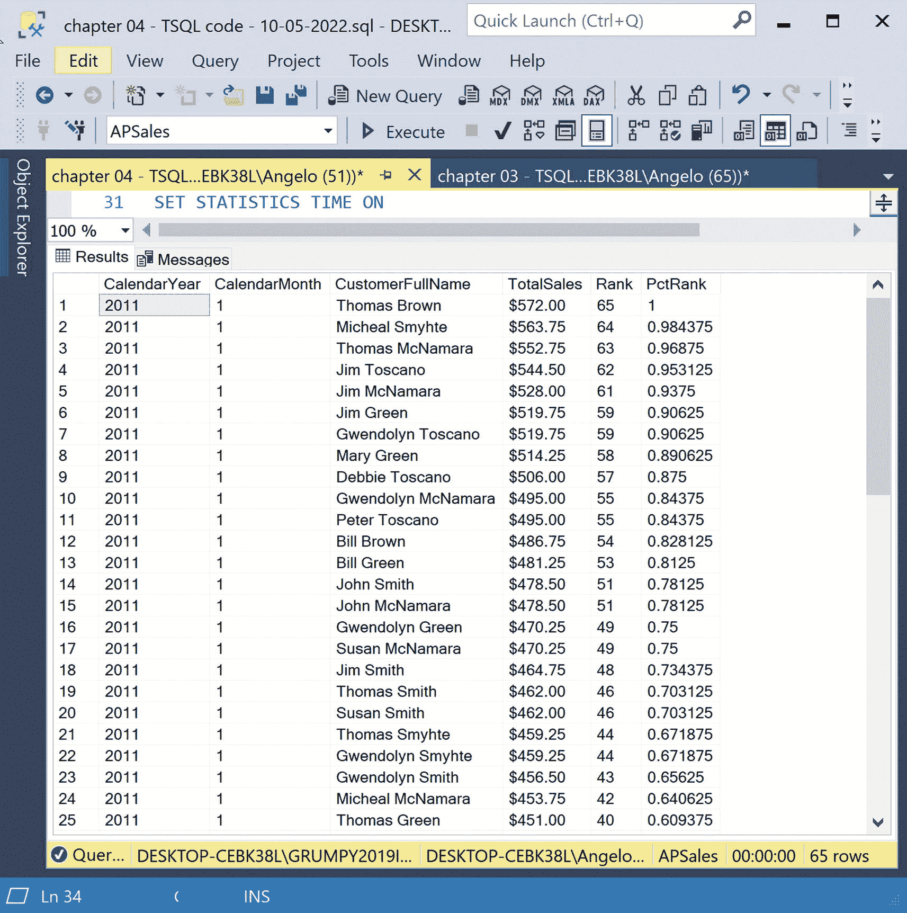

一个窗口截图展示了一个包含 6 列 25 行条目的表格，条目基于百分比排名排序。表头为日历年份、日历月份、客户全名、总销售额、排名和百分比排名。

**图 4-3**
RANK 对比 PERCENT_RANK

结果按降序排列。注意第 6-7 行和第 21-22 行中重复值的行为。如前所述，将百分比排名乘以 100.00，这样你就能看到百分比形式的值，或者使用 `FORMAT()` 函数代替。这样你就可以在 Microsoft Excel 中绘制结果图，如下所示。

我复制并粘贴了结果，并将百分比排名结果乘以 100.00，因此我们得到了一个漂亮的图表，而不是小于或等于 1.0 的小数值。

请参考 **图 4-4**。

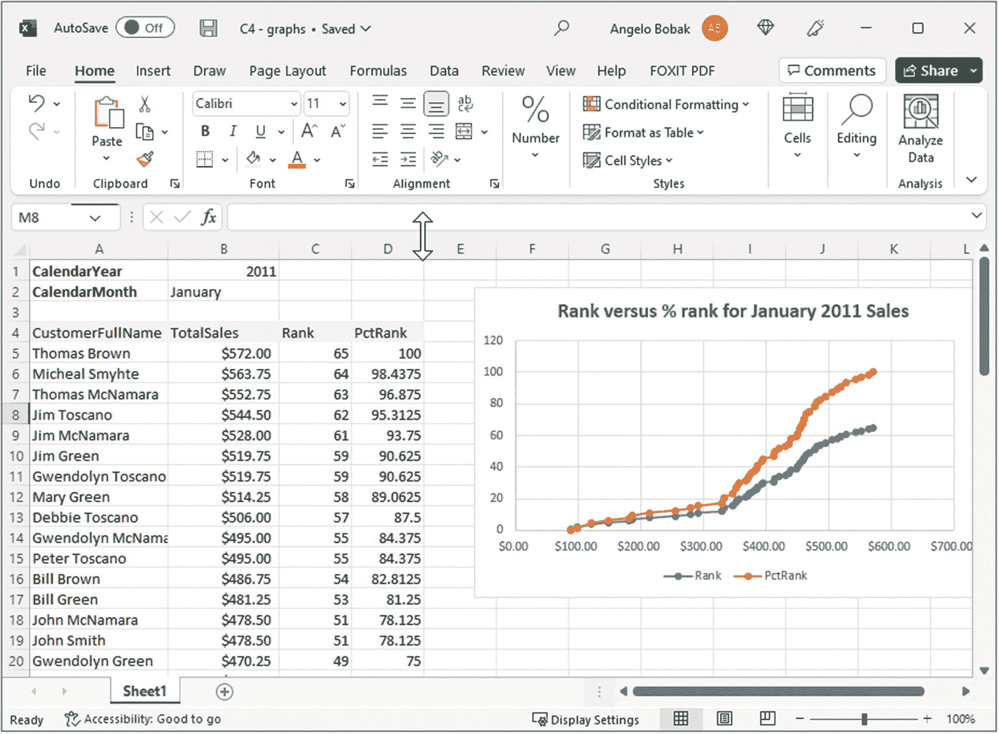

一个 Excel 工作表的截图展示了一个包含 4 列 16 行的表格，以及一个关于排名对比销售额（美元）的折线图。标记为排名和百分比排名的线条呈现出轻微波动的上升趋势。

**图 4-4**
RANK 对比 PERCENT_RANK 分析

还不错。我们确实看到两个函数的图表结果几乎相同，并呈现出良好的上升趋势。我本应添加一条注释，说明百分比排名结果已乘以 100.00，以便图表读者了解这一处理。

数据展示在左侧以便于参考。为你的用户生成一些漂亮的图表和图形总是一个好主意，这样他们就能解读结果。一图胜千言！Microsoft Power BI 也是一个出色的数据可视化工具。

让我们看看这个查询的性能特征。

**提示**
作为 SQL 开发人员或架构师，你还需要掌握一些其他技能，比如熟练掌握 Microsoft Excel 或 Power BI，以便为你的用户和管理层生成强大的可视化效果。掌握一些 SSIS（SQL Server Integration Services）的 ETL 技能也会很有价值。


#### 性能考量

让我们首先以常规方式生成一个估计查询计划（菜单栏 ➤ 查询 ➤ 显示估计执行计划）。你会看到一些相当有趣且令人困惑的结果。

请参考图 4-5。

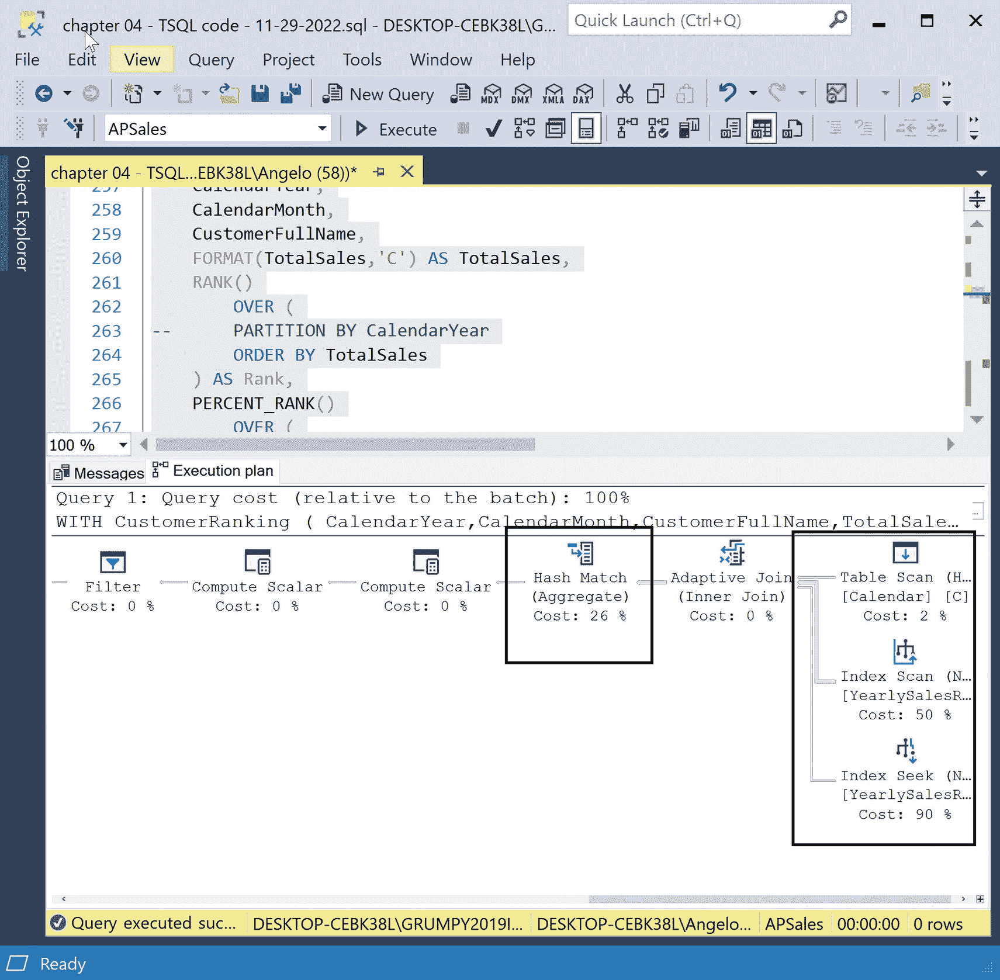

T SQL 代码的截图呈现了两个部分。上半部分展示了一些代码行，包含变量初始化、`order by`子句以及`rank`函数内的`over`函数。下半部分展示了估计查询计划的流程图。

图 4-5

估计查询计划 – `RANK` 对比 `PERCENT_RANK`

我们手头有一些现成的索引，因此估计器没有建议创建新的索引，但等一下——各项任务的成本总和超过了 100%：

*   表扫描：2%
*   索引扫描：50%
*   索引查找：90%
*   哈希匹配：26%

这些值加起来是 168%。

这是不可能的。成本不可能超过 100%。为什么会这样？

你可能不会喜欢这个答案。

这是客户端软件的一个错误，有时你会得到像这样令人惊讶的结果。我建议你在 Microsoft 网站上研究一下，看看新版本的 SSMS 是否会修复这个问题。幸运的是，这种情况似乎不常发生。

回到查询计划，如你所见，由于上一章遗留的一些索引，它们被使用了。这正是你所希望的；你希望你的索引能被多个查询使用，而不是每当有新请求到来时都创建一个新索引。

让我们检查一下此查询生成的 `IO` 和 `TIME` 统计信息。

请参考表 4-1。

表 4-1

查询 IO 和时间统计

| SQL Server 解析和编译时间 | 现有索引 |
| --- | --- |
| CPU 时间 (毫秒) | 0 |
| 已用时间 (毫秒) | 127 |
| **统计信息 (工作表 1)** | **现有索引** |
| 扫描计数 | 0 |
| 逻辑读取 | 0 |
| 物理读取 | 0 |
| 预读读取 | 0 |
| **统计信息 (工作表 2)** | **现有索引** |
| 扫描计数 | 0 |
| 逻辑读取 | 0 |
| 物理读取 | 0 |
| 预读读取 | 0 |
| **统计信息 (YearlySalesReport)** | **现有索引** |
| 扫描计数 | 1 |
| 逻辑读取 | `1384` |
| 物理读取 | 1 |
| 预读读取 | `1401` |
| **统计信息 (Calendar)** | **现有索引** |
| 扫描计数 | 1 |
| 逻辑读取 | 48 |
| 物理读取 | 0 |
| 预读读取 | 0 |
| **SQL Server 执行时间** | **现有索引** |
| CPU 时间 (毫秒) | 125 |
| 已用时间 (毫秒) | 334 |

看来我们在逻辑读取和预读读取方面存在问题。这些问题存在于 `CTE` 端的 `YearlySalesReport` 表上。不过逻辑读取可能不是问题，因为它们是在内存中执行的（也就是说，如果你的内存足够的话！）。敬请关注。我们需要查看 `IO` 和 `TIME` 统计信息，以确定是否存在与逻辑读取相关的问题。

`CTE` 中的查询可能适合作为非规范化报告或暂存表的候选方案，或者更好的是，作为内存增强表的候选方案。索引有帮助，但仅靠创建索引能做的终究有限。你添加的索引越多，当你在这个表中加载、修改或删除行时，性能下降就越严重。

根据上一章的代码示例，尝试修改这个表，用加载报告或内存增强表的脚本替换 `CTE`，然后自行尝试进行此分析。

## `RANK()` 对比 `DENSE_RANK()`

让我们再次看一下 `RANK()` 函数，但现在我们将它与 `DENSE_RANK()` 函数进行比较。

作为提醒，省去你翻回本章开头的麻烦，`DENSE_RANK()` 函数的工作方式与 `RANK()` 函数几乎相同。在出现并列时，相同的值获得相同的排名，但重复值之后的下一个值只是被简单地赋予下一个排名数字。

请参考代码清单 4-4。

```sql
WITH CustomerRanking (
CalendarYear,CalendarMonth,CustomerFullName,TotalSales
)
AS
(
SELECT YEAR(CalendarDate)
,MONTH(CalendarDate)
,CustomerFullName
-- add one duplicate value on the fly
,CASE
WHEN CustomerFullName = 'Jim OConnel' THEN 17018.75
ELSE SUM(TotalSalesAmount)
END AS TotalSales
FROM SalesReports.YearlySalesReport
GROUP BY YEAR(CalendarDate)
,MONTH(CalendarDate)
,CustomerFullName
)
SELECT
CalendarYear
,CalendarMonth
,CustomerFullName
,FORMAT(TotalSales,'C') AS TotalSales
,RANK()
OVER (
ORDER BY TotalSales
) AS Rank
,DENSE_RANK()
OVER (
ORDER BY TotalSales
) AS DenseRank
FROM CustomerRanking
WHERE CalendarYear = 2011
AND CalendarMonth = 1
ORDER BY
DENSE_RANK() OVER (
PARTITION BY CalendarYear
ORDER BY TotalSales
) DESC
GO
```

代码清单 4-4

`RANK` 对比 `DENSE_RANK`

我在 `CTE` 中包含了一个 `CASE` 语句，以硬编码方式添加了一个重复值，这样我们就能看到效果。这只是一个在原型设计时使用的技巧。如果数据是测试数据，你总是可以引入重复值。千万不要碰生产数据。如果你这么做了，我希望你的简历已经更新好了！

基本上，这与之前的查询如出一辙，但我包含了 `DENSE_RANK()` 函数，以便我们可以比较结果。我们确实说过这些函数是相似的。数值结果加上 Microsoft Excel 中的图表将验证这一说法。

再次，为了保持结果集较小，查询使用了 `WHERE` 子句过滤器，仅提取 2011 年 1 月的数据。让我们看看查询结果。

请参考图 4-6。

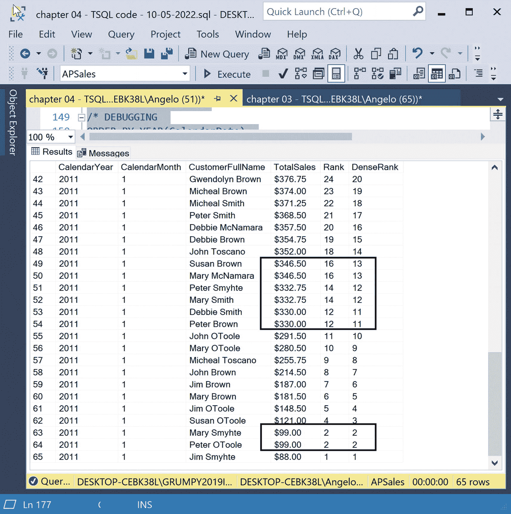

一个窗口的截图显示了一个标签页，其中包含一个 6 列 24 行的表格。第 49 至 54 行、第 63 行和第 64 行的总销售额、排名和密集排名列被高亮显示。

图 4-6

`RANK` 对比 `DENSE_RANK` 分析

我们这里想看的是，如果存在重复值，这些函数的结果有何不同。从底部的第 63 行和第 64 行开始，两个销售总额都是 $99.00，所以有趣的地方开始了。两者都获得了排名和密集排名 2，但看看当我们转到第 62 行时发生了什么。`DENSE_RANK()` 的值从下一个数值 3 开始，而 `RANK()` 的值跳过了一个数字，变成了 4。数值 3 被忽略了。

当我们看第 54 行和第 53 行时，我们遇到了另一组重复值，模式重复出现。使用哪个函数取决于你如何处理重复值。

最后一点：请注意使用 `DENSE_RANK()` 时，排名中没有间隙。

这是我们使用 Microsoft Excel 生成的图表。请参考图 4-7。

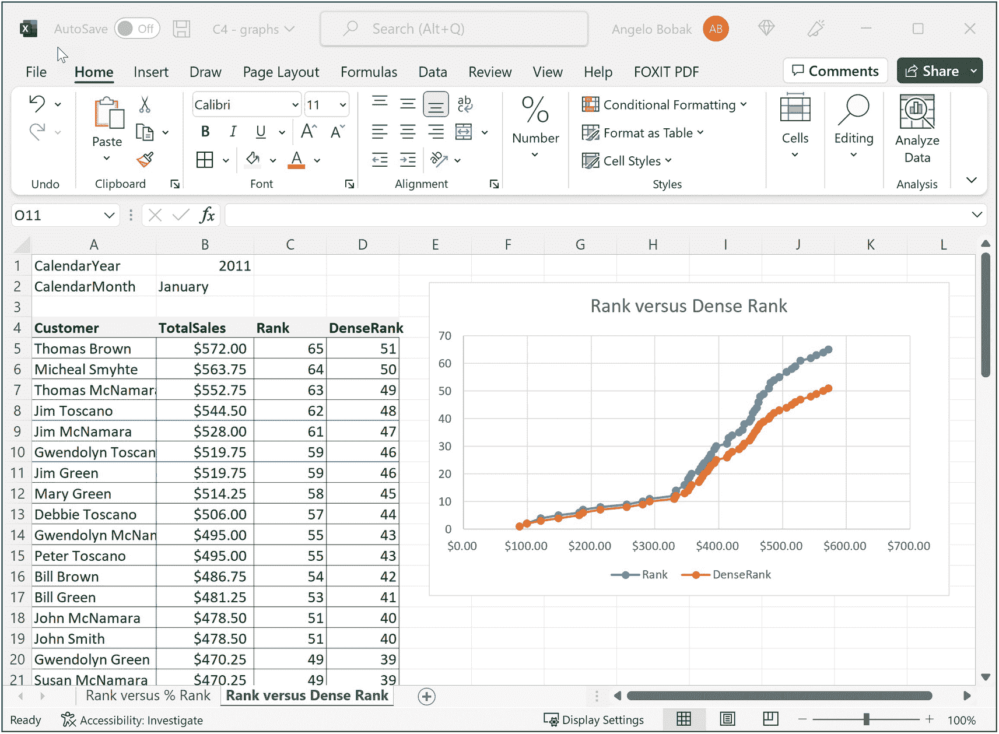

一个 Excel 工作表的截图显示了一个 4 列 17 行的表格，用于对比 `RANK` 和 `DENSE_RANK`，以及一个 `RANK` 对比销售额的折线图。标记为 `rank` 和 `dense rank` 的线条呈现略有波动的上升趋势。

图 4-7

绘制 `RANK` 对比 `DENSE_RANK` 图

果然，结果再次相似。为你的用户提供完整的数据集和类似这样的图表，将保证有效的分析和决策。

顺便说一句，生成这些图表很容易。将结果复制并粘贴到电子表格中。整理一下数据，然后选中它以便生成图表。点击菜单栏中的“插入”，然后选择“推荐图表”。挑选一种图表，除了进行一些格式调整使其看起来更专业之外，就完成了。


#### 性能考量

我想这里不会有什么意外，因为我们在前面的章节中已经创建了所有索引。让我们按惯例创建一个估计的查询计划（如果你忘记了，可以点击菜单栏中的“查询”，然后点击“显示估计执行计划”）。

请参考图 4-8。

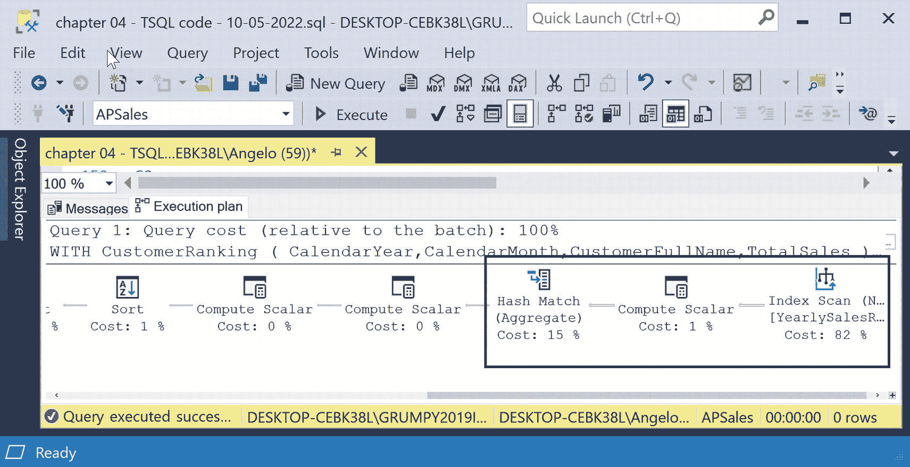

截图展示了一个估计执行计划的流程图。流程依次为：排序、计算标量、计算标量、哈希匹配、计算机标量和索引扫描。最后 3 个步骤被高亮显示。

图 4-8

RANK 与 DENSE_RANK 的估计执行计划

再次说明，现有的索引导致了一个成本为 82% 的索引扫描任务。如果我们把所有成本加起来，得到 82% + 1% + 15% = 98%。左侧未显示的是两个成本各为 1% 的排序任务，所以这里的总成本相加为 100%。这次没有遇到 bug。接下来我们看看 `IO` 和 `TIME` 统计数据。

请参考表 4-2。

表 4-2

查询 IO 和时间统计

| SQL Server 解析和编译时间 | 现有索引 |
| --- | --- |
| CPU 时间 (ms) | 4 |
| 已用时间 (ms) | 4 |
| 统计信息 (工作文件) | 现有索引 |
| 扫描计数 | 0 |
| 逻辑读取 | 0 |
| 物理读取 | 0 |
| 预读读取 | 0 |
| 统计信息 (工作表) | 现有索引 |
| 扫描计数 | 0 |
| 逻辑读取 | 0 |
| 物理读取 | 0 |
| 预读读取 | 0 |
| 统计信息 (YearlySalesReport) | 现有索引 |
| 扫描计数 | 1 |
| 逻辑读取 | 1384 |
| 物理读取 | 1 |
| 预读读取 | 1401 |
| SQL Server 执行时间 | 现有索引 |
| CPU 时间 (ms) | 62 |
| 已用时间 (ms) | 58 |

工作文件和工作表的统计信息都很好。逻辑读取看起来很高，但考虑到逻辑读取通常是针对内存缓存，所以这个值很可能无需担心。有一次物理读取，这意味着 SQL Server 必须访问物理磁盘来检索所需的页。预读读取统计信息表示预先加载到内存中的页数（回想一下，如果你有大量内存，这通常不是问题）。只需留意表假脱机任务，这意味着使用了 `TEMPDB`。

最后，扫描计数为 1 和物理读取为 1 是较低的值，我们不必担心。别忘了每次执行分析时运行 `DBCC` 来清除缓存，并开启和关闭统计信息，以避免得到错误的结果。在最后再开启统计信息，这样它们只针对查询收集，而不是在你运行估计执行计划时收集——换句话说，就在执行查询之前。

### NTILE( ) 函数再探

我们在本章开头介绍过这个函数，但让我们再看一遍。这里有一个关于信用评级和付款逾期的小例子，它将客户分组，以便根据他们逾期付款的天数分配给催收代理。本章的脚本文件夹中提供了用于加载信用相关表的代码。

请参考清单 4-5。

```
DECLARE @NumTiles INT;
SELECT @NumTiles = COUNT(DISTINCT [90DaysLatePaymentCount])
FROM Demographics.CustomerPaymentHistory
WHERE [90DaysLatePaymentCount] > 0;
SELECT CreditYear
,CreditQtr
,CustomerNo
,CustomerFullName
,SUM([90DaysLatePaymentCount]) AS Total90DayDelinquent
,NTILE(@NumTiles) OVER (
PARTITION BY CreditYear,CreditQtr
ORDER BY CreditQtr
) AS CreditAnaystBucket
,CASE NTILE(@NumTiles) OVER (
PARTITION BY CreditYear,CreditQtr
ORDER BY CreditQtr
)
WHEN 1 THEN 'Assign to Collection Analyst 1'
WHEN 2 THEN 'Assign to Collection Analyst 2'
WHEN 3 THEN 'Assign to Collection Analyst 3'
WHEN 4 THEN 'Assign to Collection Analyst 4'
WHEN 5 THEN 'Assign to Collection Analyst 5'
END AS CreditAnalystAssignment
FROM Demographics.CustomerPaymentHistory
WHERE [90DaysLatePaymentCount] > 0
GROUP BY CreditYear
,CreditQtr
,CustomerNo
,CustomerFullName
ORDER BY CreditYear
,CreditQtr
,SUM([90DaysLatePaymentCount]) DESC
GO
清单 4-5
将信用分析师分配给逾期账户
```

我们使用了一个名为 `@NumTiles` 的变量来统计逾期 90 天的账户实例数。以下查询对其进行初始化：

```
SELECT @NumTiles = COUNT(DISTINCT [90DaysLatePaymentCount])
FROM Demographics.CustomerPaymentHistory
WHERE [90DaysLatePaymentCount] > 0;
```

主查询提取年份、季度、客户编号和客户全名，以及客户逾期的总天数。接着，`CreditAnalystBucket` 列通过使用 `NTILE()` 函数和一个按年份与季度分区的 `OVER()` 子句，分配了客户所属的组号。分区内的行按季度和客户排序。由于我们只为一年加载了结果，因此不需要按年份分区。

接下来，设置一个 CASE 语句块来打印一条消息，内容为

> **“Assign to Collection Analyst N”**

N 是一个从 1 到 5 的值。如果信用分析师组号值为 1，则客户账户分配给信用分析师 1；如果值为 2，则分配给信用分析师 2，以此类推。尝试通过修改此表的加载脚本来加载多年信用数据。你将需要添加一个 `PARTITION BY` 子句。

让我们看看结果。请参考图 4-9。

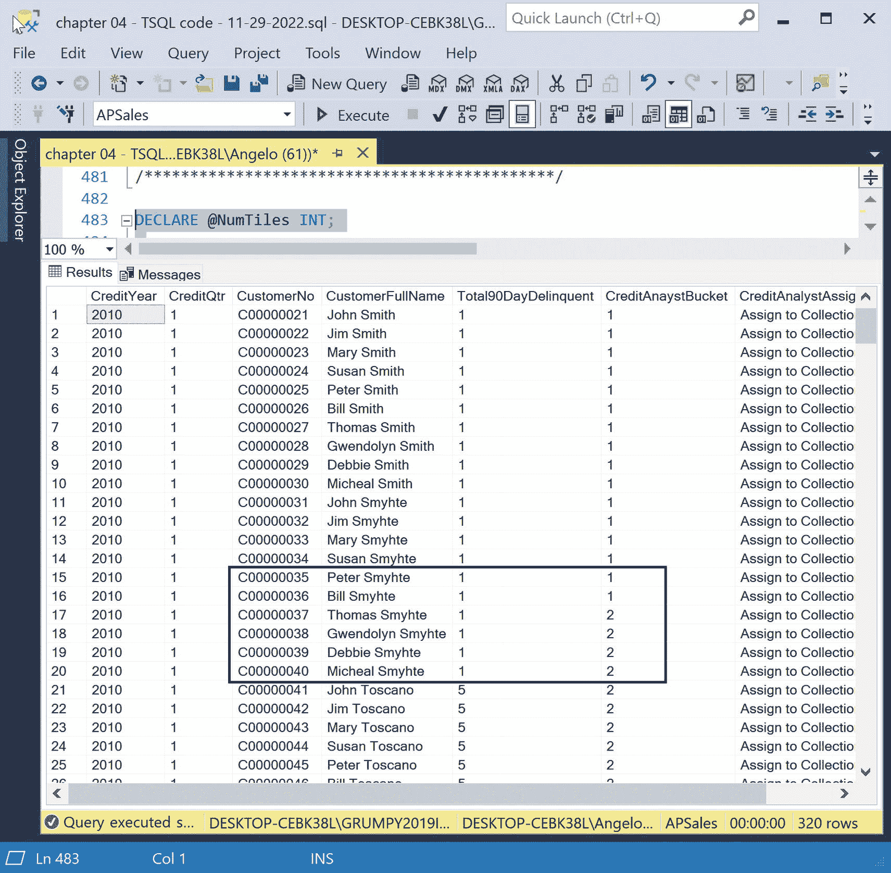

一个窗口的截图展示了一个选项卡，其中有一个包含 8 列 25 行的信用分析师分配表。从第 15 行到第 20 行，客户编号、客户全名、90 天逾期总额和信用分析师分组列被高亮显示。

图 4-9

90 天账户的信用分析师分配

它运行良好，但可以看到存在一些重叠。一些逾期 90 天的客户被分配给信用分析师 1 或 2。因此，此策略尝试按数量而不是客户逾期 90 天的次数来平衡分配。

让我们看看 `NTILE()` 函数在性能方面的表现如何。


#### 性能考量

我们来生成一个估计执行计划，它是以常规方式创建的。（记住，有几种创建方式。）这次有两个计划，一个是加载变量的查询的计划，另一个是使用 `NTILE()` 函数的查询的计划。

请参阅图 4-10。

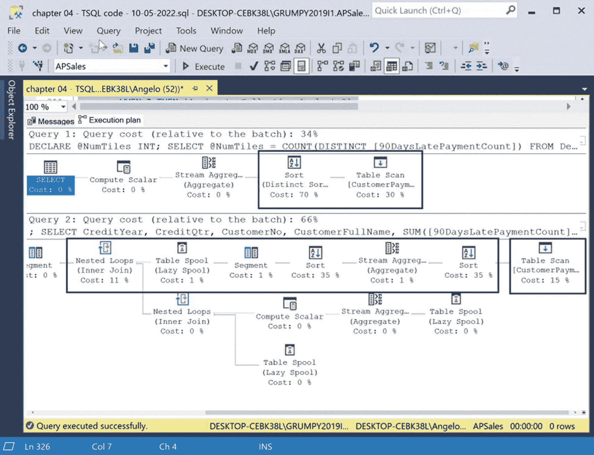

一个窗口的截图，展示了一个选项卡，其中包含查询 1 和查询 2 的两个估计执行计划流程图，查询成本分别为 34%和 66%。

图 4-10
`NTILE()` 示例的估计执行计划

查看设置 `@NumTiles` 变量的查询的第一个执行计划，我们感觉它的开销很大。（从右向左看）我们看到表扫描任务的成本为 30%，一个非常昂贵的排序步骤成本为 70%。其余步骤的成本为 0%，因此我们不必担心它们。

虽然没有建议索引，但我想知道在排序步骤中使用的列上创建索引是否会有帮助。答案是否定的。在这种情况下，该表只有 400 行，因此索引不会提供帮助或不会被使用。唯一的替代方案是在加载时对它进行排序，或者将表放入内存中。也就是说，将其创建为内存优化表。

让我们看看第二个计划。没有建议索引，我们看到一个表扫描、两个排序任务、一些表假脱机和两个嵌套循环联接。这里无事可做。

正如我之前所说，该表只有 400 行，所以我们就别折腾了。不过为了进行完整的分析练习，不妨看看一些统计数据。

请参阅表 4-3。

表 4-3
查询 IO 和时间统计信息

| SQL Server 解析和编译时间 | 第一个查询 | 第二个查询 |
| --- | --- | --- |
| CPU 时间 (ms) | 0 | 16 |
| 已用时间 (ms) | 43 | 41 |
| `统计信息 (临时表)` | `第一个查询` | `第二个查询` |
| 扫描计数 | 0 | 3 |
| 逻辑读取 | 0 | 657 |
| 物理读取 | 0 | 0 |
| 预读读取 | 0 | 0 |
| `统计信息 (CustomerPaymentHistory)` | `第一个查询` | `第二个查询` |
| 扫描计数 | 1 | 1 |
| 逻辑读取 | 5 | 5 |
| 物理读取 | 0 | 0 |
| 预读读取 | 0 | 0 |
| `SQL Server 执行时间` | `第一个查询` | `第二个查询` |
| CPU 时间 (ms) | 16 | 0 |
| 已用时间 (ms) | 41 | 78 |

同样，这里无需担心。第二个查询有 657 次逻辑读取，这意味着它需要 657 次访问内存缓存来检索所需数据，但这并不是一个显著的数值。

正如我之前所说，当你的查询处理的数据量很小且执行时间在一秒钟以内时，就转向处理更棘手的查询吧（挑硬柿子捏）。

### 注意

归根结底，如果你的查询在一秒钟内运行完毕，就不要动它。最终，需要处理的是那些运行时间长的查询。此外，你的用户愿意容忍多长时间？长达一分钟？将这点考虑进去。

## ROW_NUMBER( ) 函数

让我们再次看看 `ROW_NUMBER()` 函数。在下一个示例中，我们希望为在两年时间段（2011 年、2012 年）内两家特定商店销售的产品，按月保留一个累计总计。另外，我们只想跟踪一种产品：黑巧克力 - 中号盒装。

这里使用了 `SUM()` 聚合函数，而 `ROW_NUMBER()` 函数则以一种简单的方式使用，用于为每个月分配一个条目编号。该函数将被使用三次，以便我们能够观察在查询中使用不同的 `PARTITION BY` 和 `ORDER BY` 子句组合时的行为。

本章的最后一个示例将向你展示如何使用 `ROW_NUMBER()` 函数来解决与数据范围相关的岛屿和间隙问题。这将会很有趣且实用。估计查询计划应该也会很有趣。接下来让我们看看如何计算滚动总计。

请参阅清单 4-6。

```sql
WITH StoreProductAnalysis
(TransYear,TransMonth,TransQtr,StoreNo,ProductNo,ProductsBought)
AS
(
SELECT
YEAR(CalendarDate)         AS TransYear
,MONTH(CalendarDate)       AS TransMonth
,DATEPART(qq,CalendarDate) AS TransQtr
,StoreNo
,ProductNo
,SUM(TransactionQuantity)  AS ProductsBought
FROM StagingTable.SalesTransaction
GROUP BY YEAR(CalendarDate)
,MONTH(CalendarDate)
,DATEPART(qq,CalendarDate)
,StoreNo
,ProductNo
)
SELECT
spa.TransYear
,spa.TransMonth
,spa.StoreNo
,spa.ProductNo
,p.ProductName
,spa.ProductsBought
,SUM(spa.ProductsBought) OVER(
PARTITION BY spa.StoreNo,spa.TransYear
ORDER BY spa.TransMonth
) AS RunningTotal
,ROW_NUMBER() OVER(
PARTITION BY spa.StoreNo,spa.TransYear
ORDER BY spa.TransMonth
) AS EntryNoByMonth
,ROW_NUMBER() OVER(
PARTITION BY spa.StoreNo,spa.TransYear,TransQtr
ORDER BY spa.TransMonth
) AS EntryNoByQtr
,ROW_NUMBER() OVER(
ORDER BY spa.TransYear,spa.StoreNo
) AS EntryNoByYear
FROM StoreProductAnalysis spa
JOIN DimTable.Product p
ON spa.ProductNo = p.ProductNo
WHERE spa.TransYear IN(2011,2012)
AND spa.StoreNo IN ('S00009','S00010')
AND spa.ProductNo = 'P00000011129'
GO
```

清单 4-6
按月计算的滚动销售总计

从 `CTE` 开始，该查询生成按年、月、商店和产品分类的交易总和。总和是按月生成的。

使用该 `CTE` 的查询需要按年生成按月的总和滚动总计。为此，使用了带有 `OVER()` 子句的 `SUM()` 函数，该子句包含按商店编号和交易年的分区，并包含一个按交易月的 `ORDER BY` 子句。

相同的 `OVER()` 子句用于 `ROW_NUMBER()` 函数以生成条目编号。这里使用了三次，以便我们可以观察如果修改 `PARTITION BY` 子句，使其反映月份、季度和年份时，其行为会如何变化。

让我们检查一下结果。请参阅图 4-11。

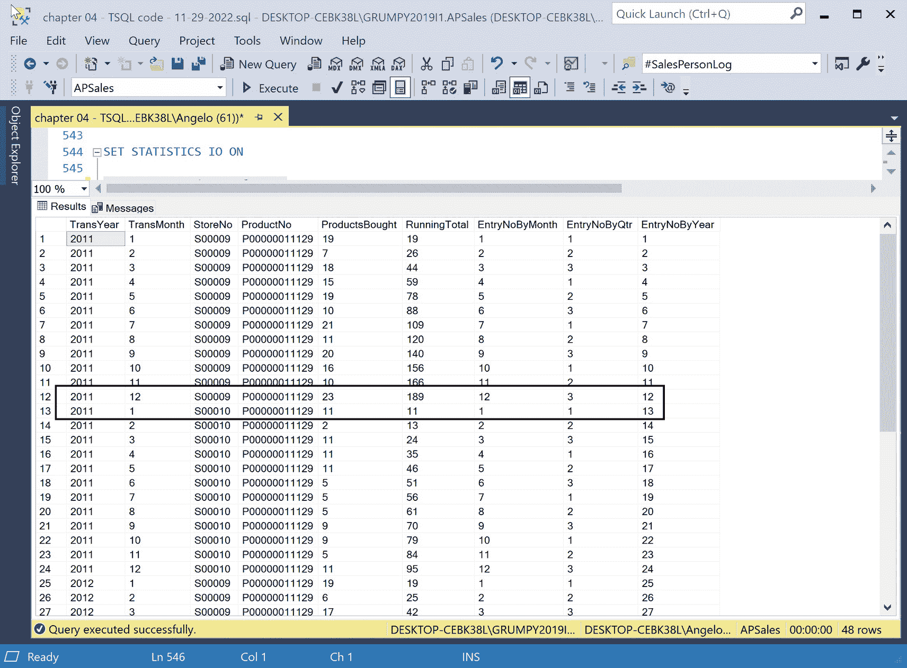

一个窗口的截图，展示了一个选项卡，其中包含一行代码和一个 9 列 27 行的表格。该表格显示了按月计算的滚动总销售额。第 12 行和第 13 行被高亮显示。

图 4-11
按月计算的滚动总销售额

该报表在计算按月累计总计方面效果足够好。注意新年伊始或商店变更的位置。滚动总计会重置，条目编号级别也会重置。根据 `PARTITION BY` 子句的定义方式，我们可以按月、季度或年生成行号：

```sql
,ROW_NUMBER() OVER(
PARTITION BY spa.StoreNo,spa.TransYear
ORDER BY spa.TransMonth
) AS EntryNoByMonth
,ROW_NUMBER() OVER(
PARTITION BY spa.StoreNo,spa.TransYear,TransQtr
ORDER BY spa.TransMonth
) AS EntryNoByQtr
,ROW_NUMBER() OVER(
ORDER BY spa.TransYear,spa.StoreNo
) AS EntryNoByYear
```

`ROW_NUMBER()` 函数的这种组合使用方式让你了解了它的工作原理。通常，你可以为整个结果集或为分区生成行号。但是，你不能包含 `ROWS` 或 `RANGE` 子句。想一想，这是有道理的。它必须在完整的分区或结果集上运行！

让我们看看使用此函数时的性能影响。


#### 性能考量

这次我将展示大部分估算的查询计划；它很长。我需要将执行计划分成两个截图。我们将按照惯例从右向左开始。图 4-12 中的第一个截图显示了计划的第一（右侧）部分。

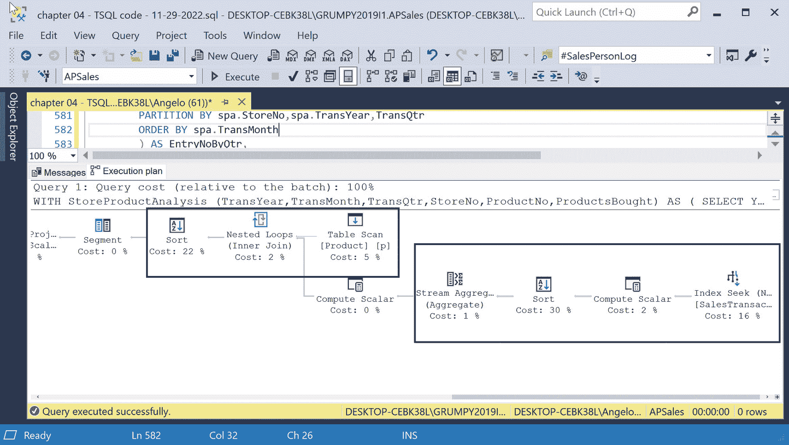

*一个窗口截图，上方面板显示 3 行代码的选项卡，下方面板显示查询 1 的估算索引计划流程图。流程图中有 2 个部分被高亮显示。*

**图 4-12**
滚动月度销售分析的估算索引计划

索引查找作为第一步出现，其成本占总估算执行时间的 16%。忽略低成本步骤，一个排序步骤占比 30%。接下来，由于我们（通过 `JOIN`）将 `SalesTransaction` 表与 `Product` 表连接，出现了一个表扫描步骤，成本为 5%。由于这是个小表，不算太昂贵，因此不需要索引。一个嵌套循环连接任务将两个数据流连接起来。随后是一个成本为 22% 的排序步骤，最后是一个成本为 1% 的窗口假脱机。

我们总是需要关注假脱机任务，因为这是一个指示器，表明缓存的数据被假脱机，以便可以重复访问。根据假脱机任务的类型（表、索引、延迟、急切），会使用临时存储，然后执行时间方面可能会变得非常昂贵（将 `TEMPDB` 放在固态驱动器上会有所帮助……）。

查阅 Microsoft 文档以了解哪些假脱机任务是物理的（`TEMPDB`）、逻辑的（内存缓存），或两者兼有。这里是表 4-4，其中列出了选定的任务，并标识了它们是逻辑的、物理的还是两者兼有。

**表 4-4**
逻辑与物理计划任务

| 任务 | 物理 | 逻辑 |
| --- | --- | --- |
| 排序 | X | X |
| 急切假脱机 | | X |
| 延迟假脱机 | | X |
| 假脱机 | X | |
| 表假脱机 | | X |
| 窗口假脱机 | X | X |
| 表扫描 | X | X |
| 索引扫描 | X | X |
| 索引查找 | X | X |
| 索引假脱机 | | X |

最后，物理任务是针对物理磁盘的操作，逻辑任务是针对内存缓存的操作。从前面的表中可以看出，根据查询的不同，某些任务可以两者兼有。在分析性能时，请将此信息与 `IO` 和 `TIME` 统计信息一起牢记于心。

**注意**
对于那些想要尝试并且手头有些闲钱的读者，我见过大约 90 美元的便宜固态 USB 驱动器。安装 SQL Server 2022，并确保在固态驱动器上创建 `TEMPDB`。我自己也考虑圣诞节买一个！

### 计划的左侧

让我们看看估算执行计划的左侧。请参考图 4-13。

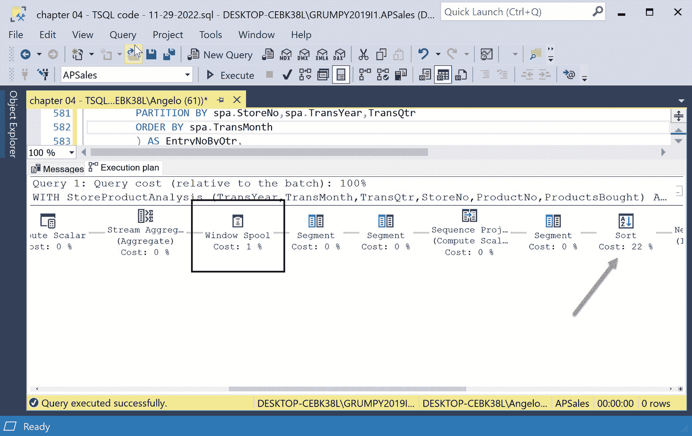

*一个窗口截图，上方面板显示 3 行代码的选项卡，下方面板显示查询 1 的估算执行计划左侧部分的流程图。任务窗口假脱机被高亮显示。一个箭头指向成本为 22%。*

**图 4-13**
计划的左侧

这里有一个成本为 22% 的排序步骤，作为之前截图的参考点。我们在这里看到的就是我们刚刚讨论过的窗口假脱机步骤。它出现是因为我们使用了窗口函数。1% 的成本是一个很好的低值，所以我们不需要担心它。真的不需要吗？

如果逻辑读数不为零，并且窗口假脱机任务大于零，那么窗口假脱机就没有使用内存。

### 查询 IO 和时间统计信息

我们的统计信息来了。请参考表 4-5。

**表 4-5**
查询 IO 和时间统计信息

| SQL Server 解析和编译时间 | 现有索引 |
| --- | --- |
| CPU 时间 (ms) | 15 |
| 已用时间 (ms) | 70 |
| **统计信息 (工作表)** | **现有索引** |
| 扫描次数 | 52 |
| 逻辑读取 | 289 |
| 物理读取 | 0 |
| 预读读取 | 0 |
| **统计信息 (SalesTransaction)** | **现有索引** |
| 扫描次数 | 2 |
| 逻辑读取 | 28 |
| 物理读取 | 1 |
| 预读读取 | 21 |
| **统计信息 (Product)** | **现有索引** |
| 扫描次数 | 1 |
| 逻辑读取 | 1 |
| 物理读取 | 1 |
| 预读读取 | 0 |
| **SQL Server 执行时间** | **现有索引** |
| CPU 时间 (ms) | 0 |
| 已用时间 (ms) | 44 |

唯一高成本的是工作表上的逻辑读取，但请记住，逻辑读取是针对内存中的缓存（即，如果你有足够的内存），所以这个值不应该引起担忧。

其余值都很低，估算查询计划分析器也没有建议新索引，因此查询运行良好。回想一下我们的窗口假脱机任务。它不为零，这意味着它正在向物理磁盘上的 `TEMPDB` 执行假脱机操作。

所有这些信息都很棒，但这到底意味着什么？我们如何利用这些信息来提高性能？

### 索引策略

经验法则是根据 `PARTITION BY` 子句中的列创建索引，然后是 `ORDER BY` 子句中的列。在之前的例子中，我们在 `PARTITION BY` 子句中有以下列：`StoreNo`, `TransYear`, `TransQtr`。而 `ORDER BY` 子句使用了 `TransMonth` 列。

好的，但我们有个难题要考考你。这些日期列都是在 `CTE` 中通过 `YEAR()`, `MONTH()`, 和 `DATEPART()` 函数生成的。它们使用了 `SalesTransaction` 表中的 `CalendarDate` 列。这些都是派生列，所以我们的索引需要基于 `StoreNo` 列和 `CalendarDate` 列。连接到日历维度表以提取这些日期部分是否会更有效？这种策略是否比使用日期函数派生它们更高效？试试看吧！

### 检查索引查找任务

让我们看看索引查找任务在估算查询计划中做了什么。请参考图 4-14。

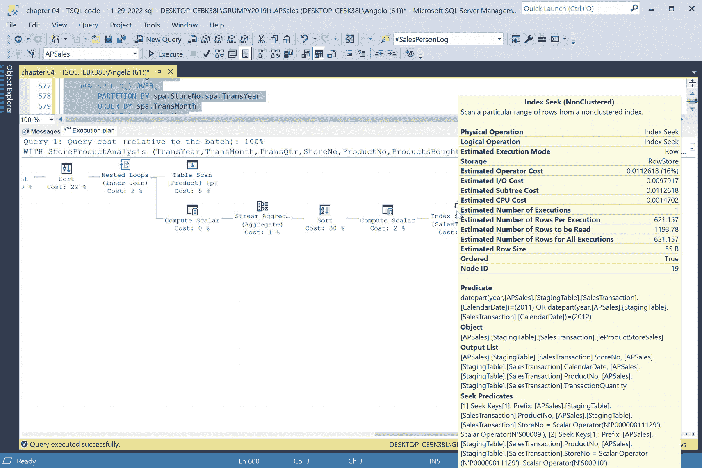

*一个窗口的截图。右上角的一个对话框与窗口重叠。它有一个标题“索引查找，非聚集”，并列出了详细信息。一些细节包括物理和逻辑操作、存储、节点 ID、谓词、对象、输出列表和查找谓词。*

**图 4-14**
索引查找详细信息

将鼠标指针悬停在任何任务上，会出现一个漂亮的黄色弹出面板，显示所有详细信息。这信息量很大，可能难以阅读，但让我重点标出四个部分中的两个部分所标识的列：

**谓词** 使用属于 `SalesTransaction` 表的 `CalendarDate` 列。

**查找谓词** 使用属于 `SalesTransaction` 表的查找键 `ProductNo` 和 `StoreNo`。

所以这表明我们不仅需要查看 `OVER()` 子句的 `PARTITION BY` 和 `ORDER BY` 子句中的列，还需要查看 `WHERE` 子句中的列，特别是 `WHERE` 子句中的 `PREDICATES`。

此查询中使用的索引名为 `ieProductStoreSales`。它基于列 `ProductNo` 和 `StoreNo`，而 `INCLUDE` 列是 `CalendarDate` 和 `TransactionQuantity`。

**提示**
`INCLUDE` 列是你在 `CREATE INDEX` 命令中使用 `INCLUDE` 关键字包含的列。名称中的前缀“ie”代表倒排条目索引。这意味着我们向用户呈现的是一个非唯一的数据访问路径。如果你看到“pk”，表示主键；“ak”表示替代键，它是主键的替代；“fk”表示外键。我认为在索引名称中包含这些前缀是良好的实践。


### 深入性能分析

因此，现在我们已经将性能分析深入到更细致的层面。通过审视高成本任务背后的细节，我们可以进一步判断某个策略是否有效。

那么，让我们总结一下我们的性能分析和策略需要基于哪些要点：

*   生成估算和实际的执行计划，并识别高成本步骤。
*   明确哪些任务是逻辑运算符、物理运算符，或两者兼具。
*   生成`IO`和`TIME`性能统计信息。
*   每次测试运行都执行`DBCC`，以确保内存缓存已清除。
*   将索引列建立在`PARTITION BY`子句（位于`OVER()`子句中）所使用的列上。
*   将索引列建立在`ORDER BY`子句（位于`OVER()`子句中）所使用的列上。
*   将索引列建立在`WHERE`子句（如果`CTE`中使用了的话）所使用的列上。
*   如果使用像`YEAR()`、`MONTH()`、`DATEPART()`等函数来提取日期的年、月、季度、日部分，则将索引列建立在用于派生字段的列上。
*   通过修改现有索引使其支持多个查询，从而加以利用。
*   作为最后的手段，考虑使用内存优化表或预加载的报表表。
*   为`TEMPDB`配置固态硬盘会有所帮助！

## 反规范化策略

前文提到的倒数第二步建议考虑构建暂存表或报表表，这样像由`CTE`生成的数据这类预处理数据可以加载到暂存表中一次，然后被包含窗口函数的查询使用（假设用户可以接受 24 小时的数据或更旧的数据）。

作为前述工作的一部分，分析所有查询，看看是否可以为多个查询设计一套通用的索引和暂存表。索引功能强大，但过多的索引会将表的加载和修改处理时间拖慢到危险的程度。

考虑构建内存优化表以获得快速性能。

如果所有方法都失败了，我们需要考虑重新设计查询或表，甚至考虑硬件升级，例如增加内存、使用更多更快的 CPU 以及像固态硬盘这样的存储设备。

最后，测试，测试，再测试你的查询？制定一个简单的测试策略，并记录结果用于分析。

### 建议

一旦你熟悉了阅读估算执行计划以及`IO`和`TIME`统计信息，就可以修改用于加载数据库的脚本，尝试加载大量行（例如数百万行），观察性能受到的影响。

## 间隙与孤岛示例

一个经典的数据挑战是“间隙与孤岛”的概念。例如，销售人员销售产品的日期是否存在间隙？或者是否存在产品持续销售的连续日期簇？最后一个例子将向你展示如何通过使用本章介绍的一些窗口函数来解决这个挑战。

解决方案需要几个步骤。这个谜题的关键在于找到一种方法，生成某种可以在`GROUP BY`子句中使用的类别名称，以便我们能够使用`MIN()`和`MAX()`聚合函数提取孤岛和间隙的最小开始日期和最大结束日期。

我们将使用`ROW_NUMBER()`函数和`LAG()`函数来识别间隙或孤岛何时开始，同时也会生成一个数字，用于构建前面提到的`GROUP BY`子句中所需的值（例如 ISLAND1, GAP1 等）。

在我们的测试场景中，我们仅跟踪销售人员在 31 天内是否产生了销售额。某些销售额被设置为零，持续一天或多天（这些就是间隙）。

> **提示**
>
> 总是从一个小数据集开始。应用你的逻辑，进行测试，一旦确认其有效，再将其应用到更大的生产数据集。

同样的方法也适用于销售产生的日期组（这些就是孤岛）。

以下是需要发生的步骤：

**步骤 1：** 生成一些测试数据。为简便起见，包含一个标识行属于孤岛还是间隙的列。这些将用于创建`GROUP BY`子句中使用的分组。

**步骤 2：** 添加一个数值列，用于标识孤岛或间隙的起始日。这将用于识别`GROUP BY`的文本值。

**步骤 3：** 添加一个包含唯一数字的列，这样对于每一组孤岛和间隙，我们可以生成类似于 ISLAND1, ISLAND2, GAP1, GAP2 等的类别名称（我们将使用`ROW_NUMBER()`函数来实现）。

一旦这些类别被正确地分配到每一行，开始和结束日期就可以通过`MIN()`和`MAX()`聚合函数轻松提取。

让我们开始吧。首先生成一些测试数据。

请参考清单 4-7a。

```sql
USE TEST
GO
DROP TABLE IF EXISTS SalesPersonLog
GO
CREATE TABLE SalesPersonLog (
SalesPersonId VARCHAR(8),
SalesDate     DATE,
SalesAmount        DECIMAL(10,2),
IslandGapGroup VARCHAR(8)
);
TRUNCATE TABLE SalesPersonLog
GO
INSERT INTO SalesPersonLog
SELECT 'SP001'
,[CalendarDate]
,UPPER (
CONVERT(INT,CRYPT_GEN_RANDOM(1)
)) AS SalesAmount
,'ISLAND'
FROM APSales.[DimTable].[Calendar]
WHERE [CalendarYear] = 2010
AND [CalendarMonth] = 10
GO
/********************/
/* Set up some gaps */
/********************/
UPDATE SalesPersonLog
SET SalesAmount = 0,
IslandGapGroup = 'GAP'
WHERE SalesDate BETWEEN '2010-10-5' AND '2010-10-6'
GO
UPDATE SalesPersonLog
SET SalesAmount = 0,
IslandGapGroup = 'GAP'
WHERE SalesDate BETWEEN '2010-10-11' AND '2010-10-16'
GO
UPDATE SalesPersonLog
SET SalesAmount = 0,
IslandGapGroup = 'GAP'
WHERE SalesDate BETWEEN '2010-10-22' AND '2010-10-23'
GO
-- Just in case the random sales value generator
-- set sales to 0 but the update labelled it as an ISLAND
UPDATE SalesPersonLog
SET IslandGapGroup = 'GAP'
WHERE SalesAmount = 0
GO
```
**清单 4-7a** 加载 SalesPersonLog 表

间隙和孤岛的文本字符串本可以在以下查询中生成，但我想简化事情。注意所有的 `UPDATE` 语句，它们为我们设置了测试场景。

请参考清单 4-7b。

## 4.7 生成缺口和孤岛报告

```
SELECT SalesPersonId,GroupName,SUM(SalesAmount) AS TotalSales
,MIN(StartDate) AS StartDate,MAX(StartDate) AS EndDate
,CASE
WHEN SUM(SalesAmount) <> 0 THEN 'Working, finally!'
ELSE 'Goofing off again!'
END AS Reason
FROM (
SELECT SalesPersonId,SalesAmount,
,IslandGapGroup + CONVERT(VARCHAR,(SUM(IslandGapGroupId)
OVER(ORDER BY StartDate) )) AS GroupName
,StartDate
,PreviousSalesDate AS EndDate
FROM
(
SELECT ROW_NUMBER() OVER(ORDER BY SalesDate) AS RowNumber
,SalesPersonId
,SalesAmount
,IslandGapGroup
,SalesDate AS StartDate
,LAG(SalesDate)
OVER(ORDER BY SalesDate) AS PreviousSalesDate
,CASE
WHEN LAG(SalesDate) OVER(ORDER BY SalesDate) IS NULL
OR
(
LAG(SalesAmount) OVER(ORDER BY SalesDate) <> 0
AND SalesAmount = 0
) THEN ROW_NUMBER() OVER(ORDER BY SalesDate)
WHEN (LAG(SalesAmount) OVER(ORDER BY SalesDate) = 0
AND SalesAmount <> 0)
THEN ROW_NUMBER() OVER(ORDER BY SalesDate)
ELSE 0
END AS IslandGapGroupId
FROM SalesPersonLog
) T1
)T2
GROUP BY SalesPersonId,GroupName
ORDER BY StartDate
GO
```

这个查询有三个层级或三个嵌套子查询，它们像表一样协同工作以解决问题。标记为`T1`的、被用作表的内联查询，生成了如图 4-15 所示的值。

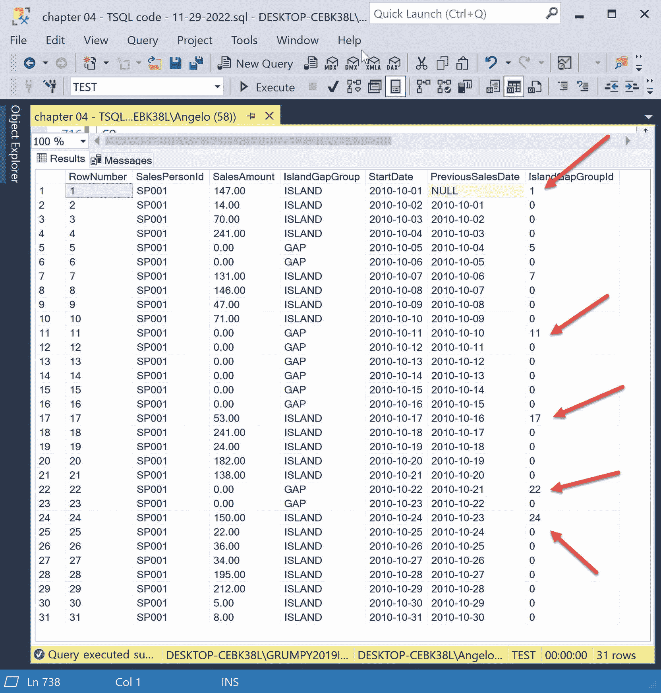

图 4-15 缺口和孤岛中间结果

注意用于标识缺口或孤岛起始点的值是如何由 `ROW_NUMBER()` 函数生成的。这保证了它们的唯一性。让我们看看下一层级的查询。

请参考图 4-16。

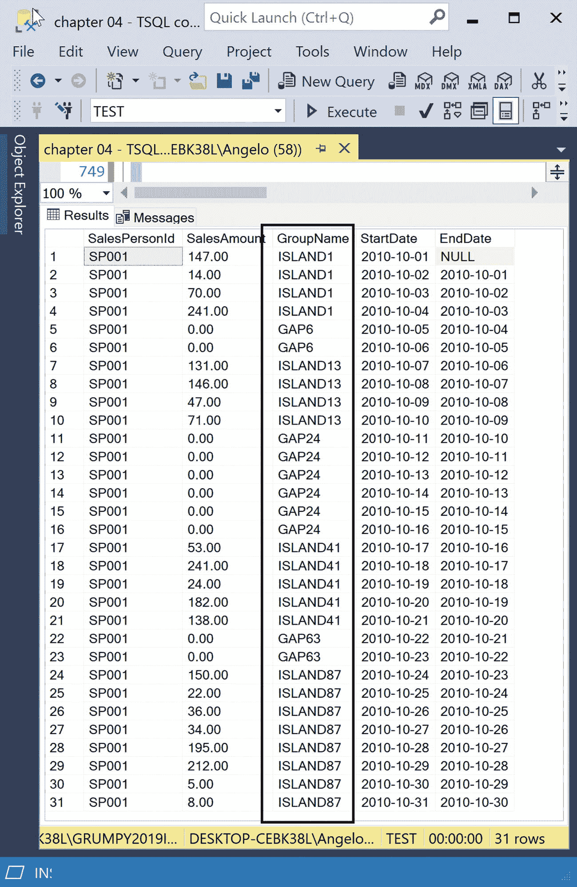

图 4-16 为最终 `GROUP BY` 子句生成值

在这个层级，我们生成了所有的类别值，并且我们使用了 `LAG()` 函数来设置结束日期。结果仍然是线性的、顺序的日期。我们现在需要做的就是结合 `MAX()` 和 `MIN()` 函数与一个 `GROUP BY` 子句，以便为每个缺口或孤岛提取出开始和结束日期。

以下是原始查询中执行此操作的代码片段：

```
SELECT SalesPersonId,GroupName,SUM(SalesAmount) AS TotalSales,
MIN(StartDate) AS StartDate,MAX(StartDate) AS EndDate,
CASE
WHEN SUM(SalesAmount) <> 0 THEN 'Working, finally!'
ELSE 'Goofing off again!'
END AS Reason
FROM ...
```

让我们看看结果。请参考图 4-17。

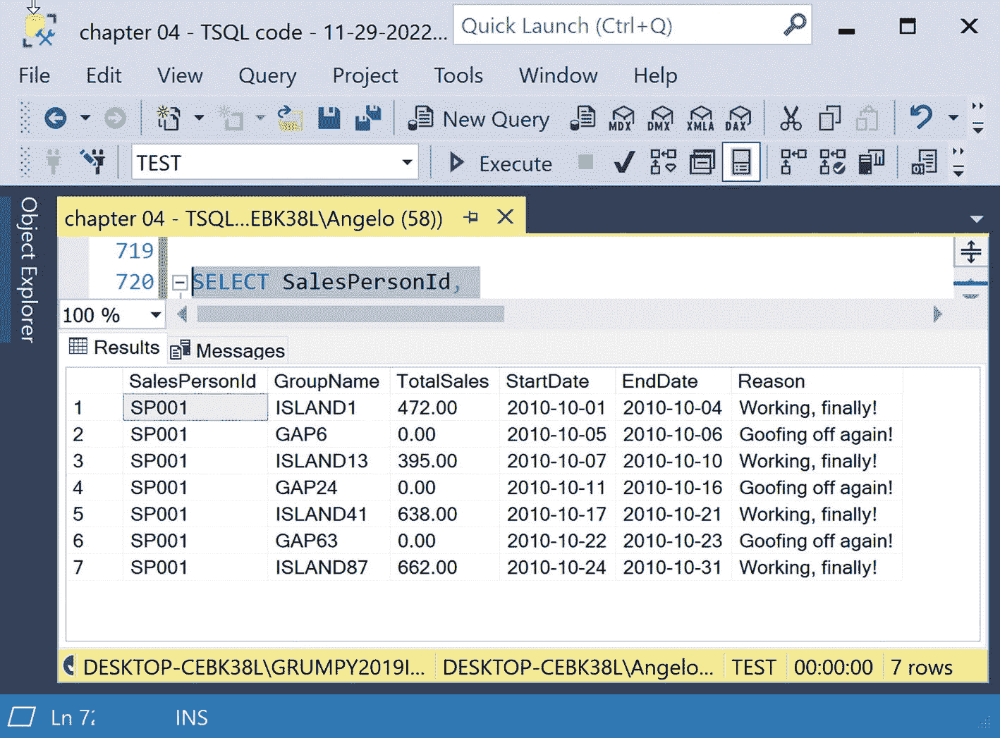

图 4-17 缺口和孤岛报告

看起来不错。一个名为 `Reason` 的列告诉我们销售日缺口的原因。这位销售员需要好好谈谈了！

总之，需要设计逻辑来识别孤岛和缺口的起始日期。接下来，制定一个策略来生成可用于 `GROUP BY` 子句的值，以便对孤岛和缺口进行分类。最后，使用 `MAX()` 和 `MIN()` 函数来生成缺口和孤岛的开始和停止日期。

### 总结

我们涵盖了很多内容。我们学到了什么？

*   我们学习了如何将窗口或排名函数应用于我们的销售数据仓库。
*   通过理解数据如何被缓存在内存或物理磁盘上，我们更深入地进行了性能分析。
*   我们开始基于估计计划任务的性质以及 `IO` 和 `TIME` 统计信息来分析性能并得出结论。
*   我们简要讨论并总结了进行性能分析时需要考虑的一些步骤。
*   最后，我们研究了一个称为“缺口和孤岛”的真实世界数据问题。

掌握了所有这些知识，我们将继续观察所有函数如何在财务数据库上发挥作用。

