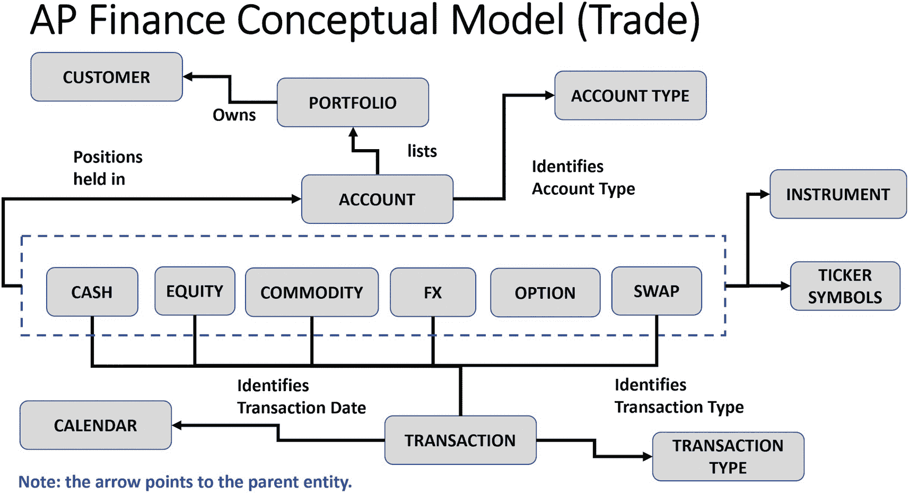
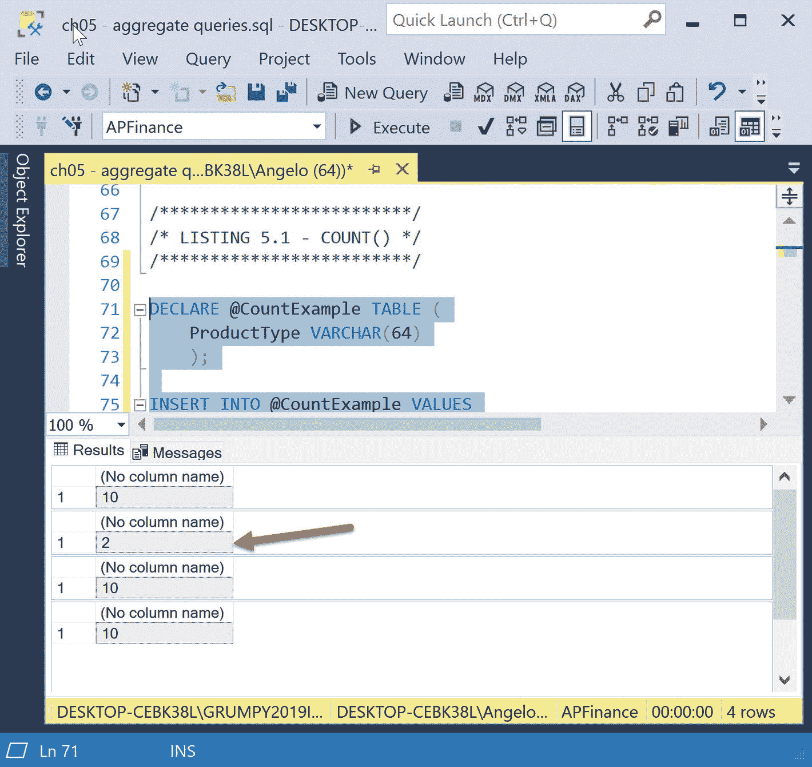

# 5. 金融用例：聚合函数

现在，我们将重点转向金融行业。与前三章一样，我们将使用可用的三类 SQL Server 函数来分析股票交易场景。我们将用一章专门介绍每一类函数。每个函数都将在查询中使用。我们将通过查看输出来检查结果，然后在大多数情况下，将输出复制到 Microsoft Excel 电子表格中，以便生成一两个图表来可视化结果。

我们还将更深入地进行性能调优。一个名为 `SET PROFILE STATISTICS ON` 的强大命令可用于深入了解 SQL Server 在执行查询时究竟在做什么。这将是很长的一章，所以煮好咖啡吧！

> **提示**
>
> 请记住，估计的查询计划成本不是完成某个步骤所需的时间，而是查询优化器分配的一个加权值，它考虑了 IO、内存和 CPU 成本。

## 聚合函数

聚合函数与 `OVER()` 子句（因此我们可以对结果集进行**分区**）结合使用，提供了一套强大的工具。回想一下，此类别包含以下函数：

*   `COUNT()` 和 `COUNT_BIG()`
*   `SUM()`
*   `MAX()`
*   `MIN()`
*   `AVG()`
*   `GROUPING()`
*   `STRING_AGG()`
*   `STDEV()` 和 `STDEVP()`
*   `VAR()` 和 `VARP()`

但有一点需要注意：如果将这些函数与 `OVER()` 子句一起使用，括号之间不允许使用 `DISTINCT` 作为关键字！这将产生错误：`AVG(DISTINCT ...) OVER(...)`。

另外，我们将不再回顾 `COUNT_BIG()` 函数，因为它的工作方式与 `COUNT()` 函数完全相同。唯一的区别在于它返回 `BIGINT` 数据类型。

顺便说一下，这种数据类型的范围在 **-**9,223,372,036,854,775,808 和 9,223,372,036,854,775,807 之间。与我们在示例中使用的整数数据类型相比，它需要 8 字节的存储空间。该数据类型仅需 4 字节存储空间，其值范围在 **-**2,147,483,648 和 2,147,483,647 之间。用这些统计数据给你的朋友们留下深刻印象吧（其实并没有）。

回到我们的聚合函数。这些函数可以成为工具集的一部分，让你能够分析金融数据，并为你的用户、分析师、财务顾问和经理建立强大的脚本和报告。将它们包含在存储过程中，就可以从 SSRS（SQL Server Reporting Services）中调用，为财务利益相关者创建有价值的报告。

在学习本章时要记住的一点是，金融数据的特点是每日交易量巨大，历史交易量更是庞大。根据金融机构的规模，我们谈论的是每天数亿笔交易，涉及数百万客户。因此，我们需要牢记性能分析和调优，以创建强大而快速的查询。你每年可能要处理数十亿行数据。我就曾经不得不这样！

为了做到这一点，我们必须非常熟悉我们正在使用的数据库 **–** 其大小、表内容以及表之间的关系。

让我们首先花些时间了解我们将要使用的数据库的数据模型。我们将使用一个简单的概念性业务模型来完成此操作。

请参阅图 5-1。



一个框图展示了 A P 财务概念模型。账户通过其类型来识别：现金账户、权益账户、商品账户、外汇账户、期权账户和掉期账户。

图 5-1

金融数据库物理数据模型

这被称为概念模型，因为它仅从业务角度识别了高级别的实体和关系。非技术分析师和管理层可以理解此图。他们在数据库的设计阶段将提供宝贵的意见。

让我们逐步了解这些实体以及它们之间的关系。

客户拥有一个投资组合，该投资组合由多个账户组成。账户通过其类型来识别。账户可以是以下类型之一：

*   现金账户
*   权益账户
*   商品账户
*   外汇（FX）账户
*   期权账户（一种衍生品）
*   掉期账户（另一种衍生品）

这些账户类型中的每一个都持有由其股票代码标识的金融工具的头寸（余额），例如代表国际商业机器公司的 IBM。

最后，每天发生一笔或多笔交易，并更新账户的头寸（余额）。交易通过其类型和类别来识别。类型可以是我们刚才讨论的账户类型之一。在我们的场景中，类别要么是买入交易，要么是卖出交易。（为简单起见，我没有显示类别实体，因为它只有两个值。）

最后，`Calendar` 实体标识交易中的交易日期。

接下来，我们需要一组称为数据字典的文档，用于描述模型中的关键组件，在我们的例子中是实体及其之间的关系。

表 5-1 是一个简单的数据字典，描述了数据库中的每个表。

表 5-1

金融数据库表数据字典

| 表名 | 描述 |
| --- | --- |
| `Account` | 用于跟踪客户账户中的交易余额。链接到 `Portfolio`。 |
| `Account Versus Target` | 该实体用于跟踪账户实际余额与目标余额，以查看账户是否达标或未达标。 |
| `Account Type` | 标识账户类型：权益、现金、外汇（FX）、商品或衍生品。 |
| `Transaction` | 存储所有客户和交易类型的每日买卖交易。 |
| `Transaction Type` | 标识交易类型：权益、现金、外汇（FX）、商品或衍生品。 |
| `Transaction Account Type` | 将账户类型链接到交易类型。例如，TT00001（现金交易）链接到账户类型 AT00001，即现金余额账户。 |
| `Portfolio` | 记录以下投资组合类型的月度头寸：<br>FX - FINANCIAL PORTFOLIO<br>EQUITY - FINANCIAL PORTFOLIO<br>COMMODITY - FINANCIAL PORTFOLIO<br>OPTION - FINANCIAL PORTFOLIO<br>SWAP - FINANCIAL PORTFOLIO<br>CASH - FINANCIAL PORTFOLIO |
| `Calendar` | 用于时间报告的基本日历日期对象（如日期、季度、月份和年份对象）。 |
| `Country` | 包含世界上大多数国家的 ISO 双字符和三字符代码，例如 US 或 USA。 |
| `Customer` | 用于存储客户名称和标识符的基本客户表。 |
| `Customer Ticker Symbols` | 用于标识客户交易的股票代码。 |
| `Ticker Symbols` | 标识金融交易工具股票代码的名称，例如代表美国铝业公司的 AA，以及代表 I/R（利率）掉期 10 年期的 SWAADY10.RT。 |
| `Ticker Price Range History` | 按日期存储 37 个示例股票代码的历史低点、高点和价差。例如：<br>股票代码： BSBR<br>公司： Banco Santander Brasil<br>股票代码日期： 2015-03-19<br>低点： 123.10<br>高点： 139.90<br>价差： 16.80 |
| `Ticker History` | 仅存储一个虚构股票代码 (GOITGUY) 的交易历史。用于示例。 |

接下来，表 5-2 是一个简单的数据字典，描述了数据库中表之间的关系。

表 5-2

金融表关系字典

| 父表 | 业务规则 | 子表 | 基数 |
| --- | --- | --- | --- |
| `Customer` | 拥有 | `Portfolio` | 一对零、一或多 |
| `Portfolio` | 由...组成 | `Account` | 一对零、一或多 |
| `Account Type` | 标识...的类型 | `Account` | 一对零、一或多 |
| `Account` | 可能是 | `Cash Account` | 一，零对一 |
|   | 可能是 | `Equity Account` | 一，零对一 |
|   | 可能是 | `Commodity Account` | 一，零对一 |
|   | 可能是 | `FX Account` | 一，零对一 |
|   | 可能是 | `Option Account` | 一，零对一 |
|   | 可能是 | `Swap Account` | 一，零对一 |
| `Account` | 指向一个 | `Instrument` | 一对零、一或多 |
| `Instrument` | 由...标识 | `Ticker Symbol` | 一对一 |
| `Transaction` | 更新 | `Account` | 零、一、多对一 |
| `Transaction Type` | 标识...的类型 | `Transaction` | 一对零、一或多 |
| `Calendar` | 标识...的日期 | `Transaction` | 一对零、一或多 |

## 业务概念模型

此业务概念模型旨在阐述一个客户持有一个或多个投资组合。一个投资组合由账户构成，而账户则包括现金、股票、商品（如黄金、白银）、外汇（外汇交易）、期权和衍生品。我本可以创建一个名为衍生品的子类型，并将掉期、期权和奇异衍生品（如掉期期权）作为其子类型，但我想保持模型的简洁性。你可以尝试一下。研究一下这些金融工具是什么。如果你受到启发并且你是金融专家，你可以修改数据模型和数据库。

接下来我们讨论交易。交易涉及前面提到的金融工具（不是你演奏的乐器），并且每个客户每天可能有一笔或多笔交易。最后，`Calendar`实体为`Transaction`实体中的每个日期标识数据对象，即不仅包括日期，还包括该日期的年、月、季度和周部分。

我没有为主键和外键属性包含数据字典，但你可以通过下载本章用于创建数据库、表以及填充表的代码，在物理表本身中识别这些。`Customer`实体主键属性的一个例子是“客户号码”。这可以用来唯一标识一个客户。当它出现在另一个实体（如`Transaction`实体）中时，它充当外键。此属性用于将两个实体链接在一起。

> **注意**
>
> 用于创建`APFinance`财务数据库的`DDL`命令可以在本书本章的 Google 网站上找到，同时提供了创建所有表和视图的脚本以及加载测试数据的脚本。代码易于使用。每个步骤都有标签，必要时还有注释帮助澄清每个步骤的作用。（图形示例中使用的电子表格也可用。）
>
> 确保你复习我们刚刚讨论的模型和数据字典，以便你能够舒适地理解我们将要讨论的查询，特别是当我们在查询中引用和连接多个表时。

如果你不是按顺序阅读章节，我将再次简要描述每个函数的作用。我总是觉得翻回 20、30 页或更多页来复习一个对我来说是新概念的东西有点麻烦。如果你对这些还不熟悉，一点复习也无妨。如果你知道它们的作用，直接跳过描述即可。

## COUNT( ) 和 SUM( ) 函数

`COUNT()`函数允许你计算数据值在行的一列中出现的次数。我还将包括`SUM()`函数，它对列中的数据值求和。这两者都将在我们的示例中使用，看看如何将其应用于我们的金融银行业务场景。

语法很简单：

```sql
COUNT(*) or COUNT(ALL|DISTINCT )
SUM() or SUM(ALL|DISTINCT )
```

回到`COUNT()`函数。使用通配符符号“*”来计算满足查询要求的所有行；我的意思是，如果查询包含或不包含`GROUP BY`子句。如果你指定了一个列，你可以选择包含关键字`ALL`或`DISTINCT`，或者完全省略它。

例如，假设一个表中有十行，该表包含一个名为`ProductType`的列。对于表中的六行，该列包含“Type A”，对于四行，该列的值为“Type B”。如果我们计算类型的数量，我们得到 2。如果我们计算第一个类型中的值的数量，我们得到六。如果我们计算第二个类型中的值的数量，我们得到四。如果我们不考虑类型计算所有值，我们得到十。小菜一碟！

让我们看看在一些简单的查询中使用函数的语法变体后的结果。

请参考代码清单 5-1。

```sql
DECLARE @CountExample TABLE (
ProductType VARCHAR(64)
);
INSERT INTO @CountExample VALUES
('Type A'),
('Type A'),
('Type A'),
('Type A'),
('Type A'),
('Type A'),
('Type B'),
('Type B'),
('Type B'),
('Type B');
SELECT COUNT(*) FROM @CountExample;
SELECT COUNT(DISTINCT ProductType) FROM @CountExample;
SELECT COUNT(ALL ProductType) FROM @CountExample;
SELECT COUNT(ProductType) FROM @CountExample;
GO
-- 代码清单 5-1
-- COUNT() 函数的各种形式
```

例子很简单。但有一些你需要意识到的细微差别。

例如，使用`DISTINCT`只会计算不同的值，这可能取决于业务用户给你的业务规范，是你想要的或者不是你想要的。

确保你计算的是你认为想要计算的东西。例如，如果你一天内有 2、2、5、7、7 和 2 笔交易（在不同时间，针对相同或不同的金融工具），你想要计算它们全部，而不仅仅是不同的值。这里我们有六个交易事件，总计 25 笔交易，所以要注意其中的区别。

让我们执行这些简单的查询并检查结果。请参考图 5-2。



> 图 5-2
>
> 使用 `ALL` 与 `DISTINCT`

回到查询示例，我们看到查询 1、3 和 4 的结果相同，值为 10。使用了`DISTINCT`关键字的第二个查询生成的值是 2！

所以要注意，如果你省略`ALL`关键字，你会得到与在`COUNT()`函数中包含它相同的结果。使用通配符星号将计算所有内容。

在使用所有聚合函数和其他函数时请记住这一点，因为这种语法在所有函数中都是通用的。

如果在此阶段你有点困惑，为什么不下载代码并尝试一下。稍微修改一下查询，直到你感到得心应手。

让我们在一个更复杂的查询中尝试这个函数，使用我们的财务数据。让我们从第一个示例的简单业务规范开始。

