# 客户交易分析：SQL CTE 与滚动计算

我们的业务用户希望对客户 C0000001，John Smith 先生（还记得他吗？）进行一项分析。具体来说，是分析 2012 年金融工具 AA（即 Alcoa 公司）的买入交易。感兴趣的账号是 A02C1，这是一个股票账户。最后，这需要是一个四天滚动计数，因此我们需要为 `OVER()` 子句指定一个 `ROWS()` 框架。数据可以有 24 小时的延迟（提示：我们可以在夜间加载它）。

> **注意**
>
> Microsoft SQL Server 将 `CTE` 定义为包含三个部分：`CTE` **表达式**、`CTE` **查询**和**外部查询**。`CTE` 表达式跟随 `WITH` 关键字并为 `CTE` 命名；其后是 `CTE` 返回的列列表。`CTE` 查询是括号之间的查询；它跟随在 `AS ()` 块之后。最后，外部查询是处理由 `CTE` 返回的行的查询。

此解决方案将使用 `COUNT()` 和 `SUM()` 函数来满足业务需求。它采用我称之为我们惯用的 `CTE` 内外层查询格式，但让我们先看看用于 `CTE` 的查询。

请参考 **清单 5-2a**。

```sql
SELECT YEAR(T.TransDate)          AS TransYear
,DATEPART(qq,(T.TransDate)) AS TransQtr
,MONTH(T.TransDate)         AS TransMonth
,DATEPART(ww,T.TransDate)   AS TransWeek
,T.TransDate
,C.CustId
,C.CustFname
,C.CustLname
,T.AcctNo
,T.BuySell
,T.Symbol
,COUNT(*) AS DailyCount
FROM [Financial].[Transaction] T
JOIN [MasterData].[Customer] C
ON T.CustId = C.CustId
GROUP BY YEAR(T.TransDate)
,DATEPART(qq,(T.TransDate))
,MONTH(T.TransDate)
,T.TransDate
,T.BuySell
,T.Symbol
,C.CustId
,C.CustFname
,C.CustLname
,AcctNo
ORDER BY C.CustId
,YEAR(T.TransDate)
,DATEPART(qq,(T.TransDate))
,MONTH(T.TransDate)
,T.TransDate
,T.BuySell
,T.Symbol
,C.CustFname
,C.CustLname
,AcctNo
GO
```
**清单 5-2a**
客户分析 CTE 查询

这是一个直接明了的查询。注意 `COUNT()` 函数及其支持属性，以及因为使用了聚合函数而必需的 `GROUP BY` 子句。我包含了 `ORDER BY` 子句，以便我们能更好地了解数据的样子。当用作 `CTE` 查询时，这需要被注释掉。如果不这样做，将会收到错误信息。

由于这是一个用于历史分析的查询，我们可能考虑使用它来加载报表表，以提高性能并消除 `CTE`。该查询返回 444,144 行，并且是时间快照，因此只需加载一次。值得考虑。

回到我们的讨论。请参考 **图 5-3** 中的部分结果。

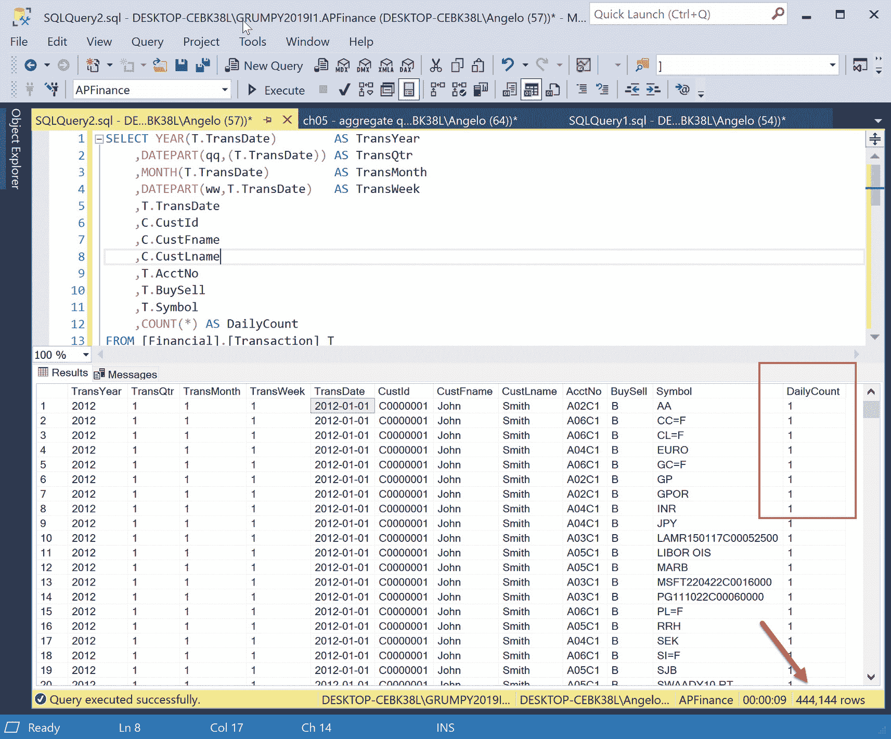

**图 5-3**
客户分析 CTE 结果

有两个项目值得我们关注。注意，`COUNT()` 函数返回的所有值都是 1。这是因为客户每天每种工具只交易一次。我就是这样加载测试数据的。尝试修改加载此表的代码，使一个客户在某天对一种或多种工具有多笔交易。试着混合一下，有两到三笔买入交易和一、两或三笔卖出交易。完全有理由假设客户会在同一天对同一工具执行多次买入或卖出交易。一个警告：`Transaction` 表会变得很大！

> **注意**
>
> 金融行业将股票、合约、产品等称为金融工具。如果你希望在这个领域工作，有很多有趣的术语需要学习。

现在让我们看看查询的剩余部分。

请参考 **清单 5-2b**。

```sql
SELECT TransYear
,TransQtr
,TransMonth
,TransWeek
,TransDate
,CustId
,CustFName + ' ' + CustLname AS [Customer Name]
,AcctNo
,BuySell
,Symbol
,DailyCount
,SUM(DailyCount) OVER (
PARTITION BY TransQtr
ORDER BY TransQtr,TransMonth,TransDate
ROWS BETWEEN 3 PRECEDING AND CURRENT ROW
)AS RollingTransCount
FROM CustomerTransactions
WHERE CustId  = 'C0000001'
AND TransYear = 2012
AND BuySell   = 'B'
AND Symbol    = 'AA'
AND AcctNo    = 'A02C1'
ORDER BY TransYear
,TransQtr
,TransMonth
,TransDate
,CustId
,BuySell
,Symbol
GO
```
**清单 5-2b**
客户分析外部查询

让我们从分析 `OVER()` 子句开始。它包括一个 `PARTITION BY` 和一个 `ORDER BY` 子句以及一个 `ROWS` 子句。我们按日历季度分区，并对分区结果按季度、月份和交易日期排序。`ROWS` 子句设置了四天滚动求和（前 3 天 + 当天 = 4 天）。

注意我悄悄加入了 `SUM()` 函数，这将在下一节介绍。我们希望将 `CTE` 查询返回的所有交易计数相加。让我们看看结果如何。

请参考 **图 5-4** 中的部分结果。

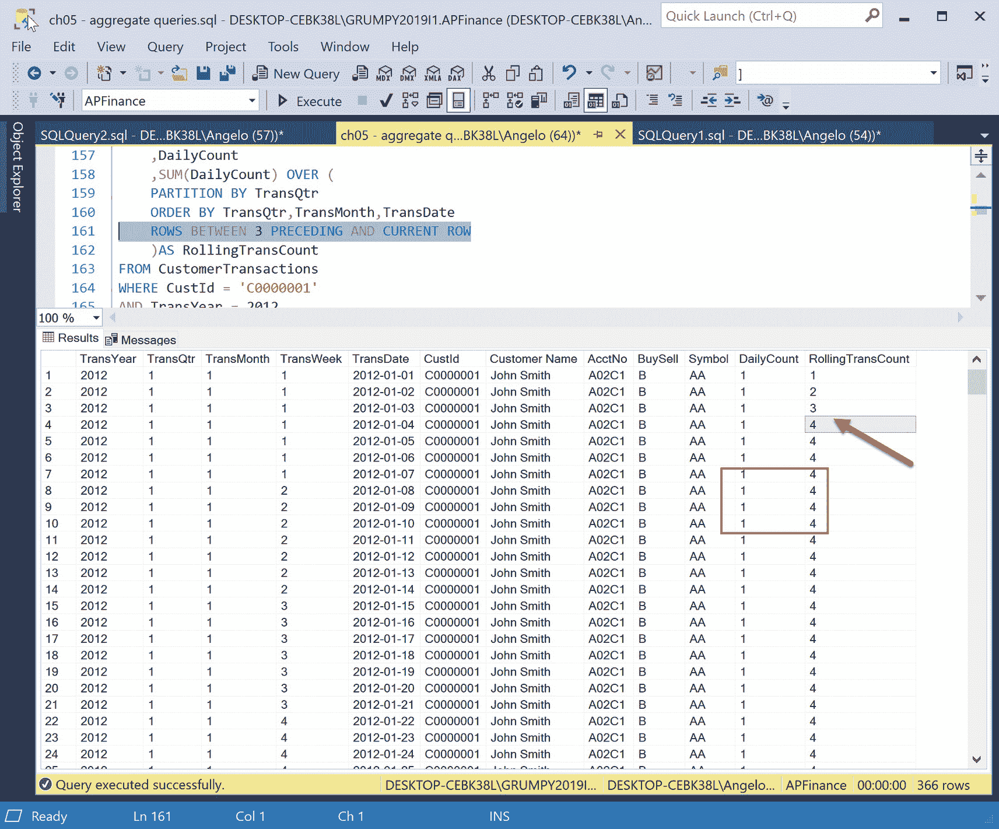

**图 5-4**
交易计数四天滚动总计

前四行看起来不错，滚动计数总和每天增加一。第 4 天之后，它们就都一样了。每天只有一笔买入交易，所以我们得到的最后四天的总和始终是 4。在现实世界中，这可能是一个值得研究的有趣模式：客户只执行一笔交易的日子与执行多笔交易的日子。

正如我们讨论过的，这是预期之中的，因为客户每天只进行一笔交易。尝试修改此查询，以便同时考虑买入和卖出交易。同时为选定的客户和工具加载更多交易，使结果更有趣一些。

#### 性能考量

接下来，让我们用目前学到的工具做一些性能分析。请记住，如果你决定每天加载多笔交易，结果会怎样。`Transaction` 表会迅速变得非常庞大，从而导致性能下降。

我们将采用的方法是先查看原始的基于 `CTE` 的查询。然后，我们会提取出 `CTE` 查询部分并检查其查询计划。我们希望利用 `CTE` 查询来加载一个报表表，这样带有 `OVER()` 子句的查询就能在预加载的表上运行，而不是使用 `CTE`（可以推测这样运行速度会更快）。如果建议了任何索引，我们会构建它，使用查询来加载表，然后修改原始查询，使其使用报表表而非 `CTE`，并对其生成预估查询计划。

让我们先看看原始的预估查询计划。请参见图 5-5a。

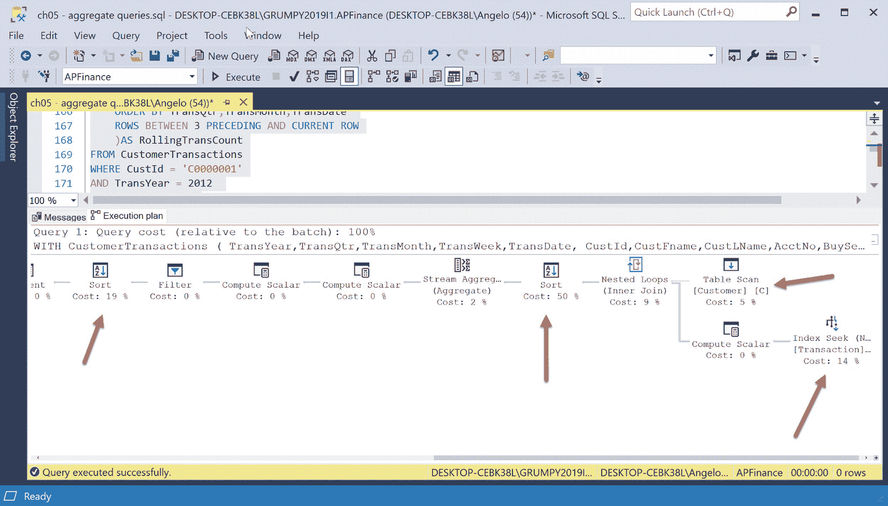

c h 0 5 聚合查询 s q l 的屏幕截图。屏幕上半部分显示一些编程代码。下半部分显示消息和执行计划。排序成本，19%。流聚合成本，2%。排序成本，50%。表扫描成本，5%。索引查找成本，14%。

图 5-5a

原始查询，第一部分

有很多成本高昂的任务。从右往左看，我们看到 `Customer` 表上的表扫描占了 5%。无需担心，因为该表只有五个客户，所以我们不需要对它做太多处理。索引不会有帮助，因为 SQL Server 会将小表加载到内存中。

我们确实看到了一个成本为 14% 的索引查找操作。

索引查找是好的。查找意味着所需的行是通过一种称为 `b-tree`（二叉树）的结构检索的。索引扫描则不理想，因为它需要按顺序逐行检查表中的每一行，直到找到所需的行。在性能分析活动中，要持续关注这些情况。

请记住：“`Index` seek good, `index` scan bad”（索引查找好，索引扫描坏），大多数时候都是如此。

接下来，我们看到一个成本为 50% 的昂贵排序操作，最后还有一个成本为 19% 的排序操作。等等。这只是查询计划的一半。让我们看看左边另一半包含什么。

请参见图 5-5b。

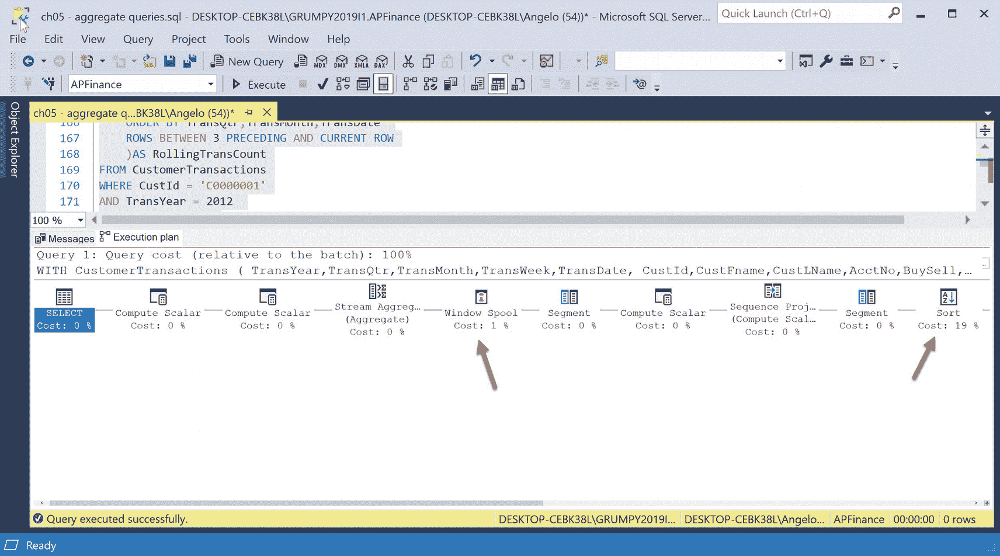

c h 0 5 聚合查询 s q l 的屏幕截图。屏幕上半部分显示一些编程代码。下半部分显示消息和执行计划。排序成本，19%。流聚合成本，2%。排序成本，50%。表扫描成本，5%。索引查找成本，14%。

图 5-5b

原始查询，第二部分

这里是我们刚才讨论的那个作为占位符的成本为 19% 的排序操作，以便我们知道在整体查询计划中的位置。另一个需要考虑的任务是由于 `ROWS` 子句导致的窗口假脱机。这仅占 1%，但它确实表明假脱机操作是针对物理存储执行的，而不是在内存中。

现在我们有了一个性能基准。我们希望考虑使用 `CTE` 查询来加载一个报表表。记住，数据最多可以有 24 小时的延迟。

在 `CTE` 查询上运行预估查询计划后，我们得到了图 5-5c 中的计划。

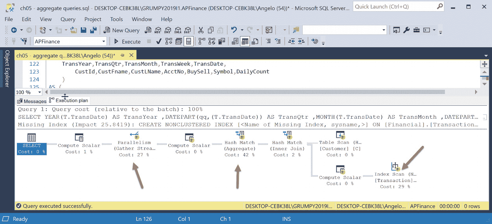

c h 0 5 聚合查询 s q l 的屏幕截图。屏幕上半部分显示一些编程代码。下半部分显示消息和执行计划。选择成本，0%。窗口假脱机成本，1%。排序成本，19%。

图 5-5c

`CTE` 预估查询计划

预估查询计划确实建议了一个索引，可将性能提升 25.8%；提升幅度不算很大，但在夜间加载报表表时仍然会有帮助。如果我们能最小化加载时间，其他需要在夜间加载的查询就会有一些空间。注意，`Customer` 表扫描的成本为 0%。另请注意，索引任务是一个扫描操作而不是查找操作。这占了 29% 的成本。这就是为什么查询计划估算工具建议了该索引。我们希望看到一个索引查找操作。

清单 5-3 是建议的索引 `DDL` 命令。

```
USE [APFinance]
GO
CREATE NONCLUSTERED INDEX []
ON [Financial].[Transaction] ([CustId])
INCLUDE ([TransDate],[Symbol],[AcctNo],[BuySell])
GO
```

清单 5-3
建议的索引

我想出的索引名称是

```
ieTransDateSymbolAcctNoBuySell
```

将此名称复制到上面的代码中，然后执行命令即可创建索引。让我们运行第二个预估查询计划，看看有什么改进。

请参见图 5-6 获取新的预估查询计划。

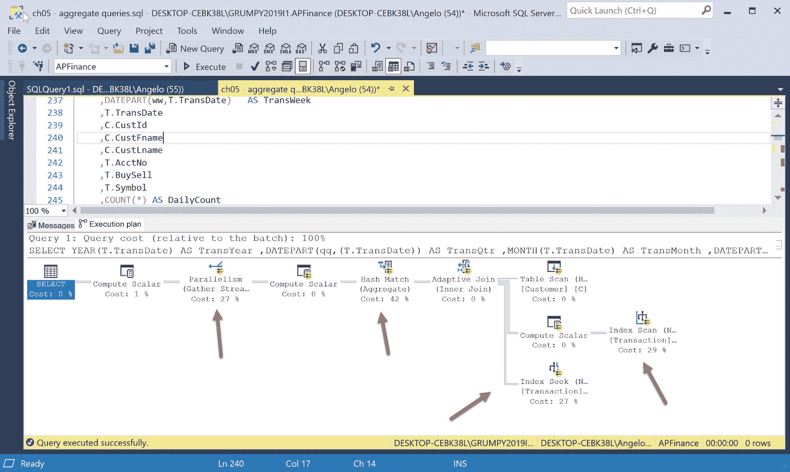

c h 0 5 聚合查询 s q l 的屏幕截图。屏幕上半部分显示一些编程代码。下半部分显示消息和执行计划。选择成本，0%。并行成本，27%。哈希匹配成本，42%。索引查找成本，27%。索引扫描成本，29%。

图 5-6
修订后的预估查询计划

这很有趣。索引扫描仍然存在，但现在我们有了一个索引查找操作。两者都基于同一个索引。随后是一个成本为 0% 的自适应联接，接着是一个成本为 42% 的哈希匹配。最后，来自所有任务的流被汇集起来以生成最终的行输出。

运行此查询来加载报表表耗时十秒，处理了 444,144 行。看起来时间很长。清单 5-4 是使用我们刚才讨论的表的 `INSERT` 命令。

```
TRUNCATE TABLE Report.CustomerC0000001Analysis
GO
INSERT INTO Report.CustomerC0000001Analysis
SELECT YEAR(T.TransDate)          AS TransYear
,DATEPART(qq,(T.TransDate)) AS TransQtr
,MONTH(T.TransDate)         AS TransMonth
,DATEPART(ww,T.TransDate)   AS TransWeek
,T.TransDate
,C.CustId
,C.CustFname
,C.CustLname
,T.AcctNo
,T.BuySell
,T.Symbol
,COUNT(*) AS DailyCount
FROM [Financial].[Transaction] T
JOIN [MasterData].[Customer] C
ON T.CustId = C.CustId
GROUP BY YEAR(T.TransDate)
,DATEPART(qq,(T.TransDate))
,MONTH(T.TransDate)
,T.TransDate
,T.BuySell
,T.Symbol
,C.CustId
,C.CustFname
,C.CustLname
,AcctNo
GO
```

清单 5-4
加载客户分析表

这个操作运行了 15 秒。甚至比我们测试前一个查询的时间还要长。我们可能需要考虑为使用客户数据创建一个 `内存优化表`，因为我们处理的行数较少。（我在本章的脚本中包含了创建内存优化表的代码，你可以试试看。）

现在运行我们原始的查询并修改它，使其使用报表表。图 5-7 是当我们使用预加载的报表表代替 `CTE` 时，修订后的预估执行计划。

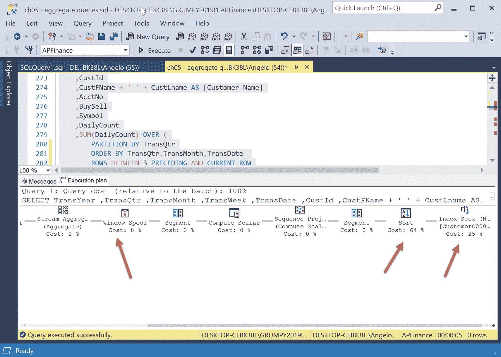

c h 0 5 聚合查询 s q l 的屏幕截图。屏幕上半部分显示一些编程代码。下半部分显示消息和执行计划。三个箭头分别指向窗口假脱机成本 8%，排序成本 64%，以及索引查找成本 25%。

图 5-7
修订后查询的预估执行计划

这看起来是一个更精简的计划。我们看到了一个成本为 25% 的索引查找，但也有一个成本高达 64% 的排序操作，还有那个窗口假脱机！它占了 8%，这意味着我们正在使用物理存储。我们需要更深入地研究这个策略并查看 `profile statistics`（配置文件统计信息）。我们也应该看看 `IO` 和 `TIME` 统计信息，但限于篇幅，我们只查看 `PROFILE` 统计信息。


让我们先检查在创建索引前后的 `PROFILE` 统计信息。请确保在执行查询前先运行以下命令：

```
DBCC dropcleanbuffers;
CHECKPOINT;
GO
SET STATISTICS PROFILE ON
GO
```

现在，让我们执行查询并查看 `PROFILE` 统计信息。请参考图 5-8。

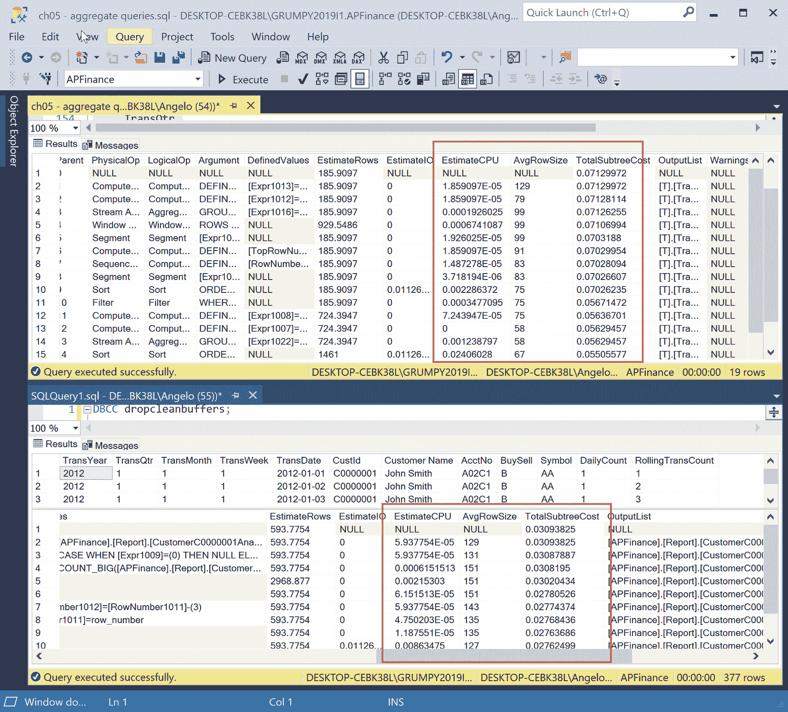

这是一张 CH 0 5 聚合查询 SQL 的截图。屏幕被分割为多个面板，展示了在执行计划前后，用于比较预估 CPU、平均行大小和子树总成本统计信息的结果表格。

图 5-8

对比部分性能统计数据

首先，让我们看看处理此查询所需的步骤。使用 `CTE` 时我们有 19 个步骤，而使用报表表策略只有 11 个步骤。对于预加载的报表表，`EstimateIO` 统计数据略低一些。当然，我们的步骤更少了。原始的基于 `CTE` 的查询 `EstimateCPU` 更低，但第二个基于报表表的查询 `TotalSubTreeCost` 更小。

我认为我们有了改进，因为第二个选项的步骤更少。此外，第二个查询运行时间为零秒，而第一个查询为两秒。

请参考图 5-9。

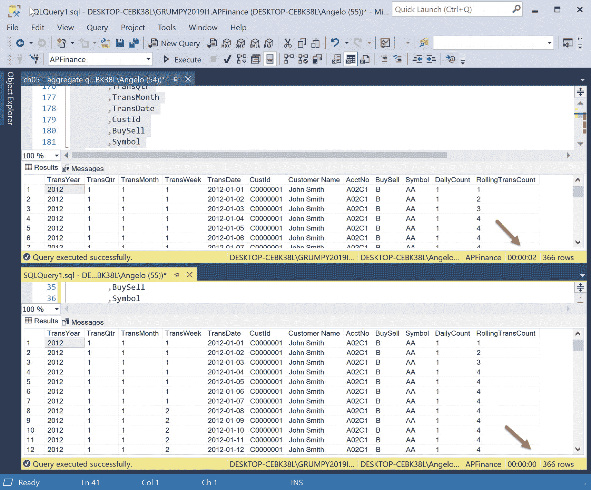

这是一张 CH 0 5 聚合查询 SQL 的截图。屏幕被分割为多个面板，展示了查询执行前后子树统计信息的对比表格。两个箭头指示第一个查询运行了 2 秒，第二个查询运行了 0 秒。

图 5-9

对比子树成本统计数据

很明显，`CTE` 方法生成了 19 个步骤，而报表表方法只生成了 11 个步骤。

总之，经过一番详尽的性能分析，我们发现创建一个报表表来预加载原本由 CTE 生成的数据可以带来性能提升。建议的索引也没有带来损害。

另一个结论是：开启性能统计将产生宝贵的性能分析数据。这又是一个可用的工具！

## SUM( ) 函数

这次我们的分析侧重于客户账户。账户用于每日和每月汇总交易头寸，以便向客户出具报告。

其语法如下：

```
SUM(ALL|DISTINCT *) 或 SUM(ALL|DISTINCT )
```

我不会展示简单的例子，因为我想到现在你已经明白了何时使用 `ALL` 与 `DISTINCT` 关键字。

让我们来看看分析师提交的业务需求。

同样，我们需要为同一客户，客户 C0000001（John Smith）的现金账户进行一些分析。这次我们想为 2012 年 1 月生成滚动的每日余额总计。我们还需要能够为同一个月的 2012、2013 和 2014 这三年生成报告。在未来，我们希望能够比较当前日期与上一年同一日期的性能（这将涉及 `LAG()` 函数）。

最后但同样重要的是，报告需要按年份、月份、过账日期、客户、账户名称和账户编号排序。报告的输出需要复制粘贴到 Microsoft Excel 电子表格中，以便生成分析图表。

非常感谢我们的业务分析师提供了这份易于遵循的需求规格。务必确保获取书面而非口头的需求规格；否则，用户会告诉你搞错了，并给你更多的口头需求和额外要求。

这份报告有很多可能性，可以重新用于其他账户类型，如股票和外汇。让我们来审视一下。

请参考代码清单 5-5。

```
SELECT YEAR(PostDate) AS AcctYear
,MONTH(PostDate)  AS AcctMonth
,PostDate
,CustId
,PrtfNo
,AcctNo
,AcctName
,AcctTypeCode
,AcctBalance
,SUM(AcctBalance) OVER(
PARTITION BY YEAR(PostDate),MONTH(PostDate)
ORDER BY PostDate
) AS RollingDailyBalance
FROM APFinance.Financial.Account
WHERE YEAR(PostDate) = 2012
/* 取消下面这行的注释以报告超过 1 年的数据，
并注释掉上面那行 */
--WHERE YEAR(PostDate) IN(2012,2013,2014)
AND CustId = 'C0000001'
AND AcctName = 'CASH'
AND MONTH(PostDate) = 1
ORDER BY YEAR(PostDate)
,MONTH(PostDate)
,PostDate
,CustId
,AcctName
,AcctNo
GO
```

代码清单 5-5

现金账户总计汇总分析

这是一份基础报告，没有使用 `CTE`。`SELECT` 子句使用了 `YEAR()` 和 `MONTH()` 函数，这可能会带来较高的成本。`SUM()` 函数与 `OVER()` 子句一起使用以生成滚动日余额。我们按年份和月份进行分区，尽管从技术上讲你不需要年份列，但如果想处理多年数据（通过更改 `WHERE` 子句），它在那里以备扩展。

`WHERE` 子句实现了过滤输出的业务需求，最后 `ORDER BY` 子句为用户展示对报告进行排序。让我们看看它是什么样子。

请参考图 5-10 中的部分结果。

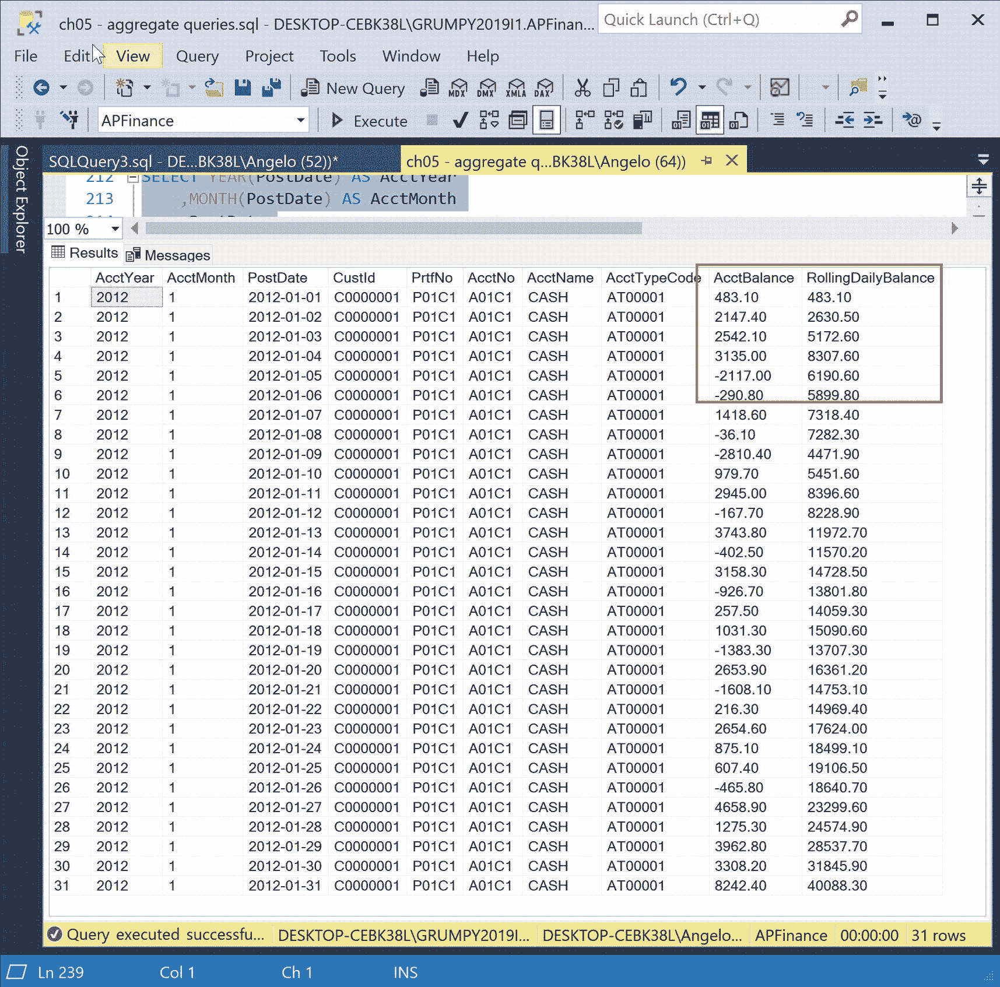

这是一张 CH 0 5 聚合查询 SQL 的截图。上面板展示了一些程序代码。下面板展示了结果表。账户余额列和滚动日余额列被方框高亮显示。

图 5-10

现金账户总计汇总报告

务必进行一些数据验证，以免出现意外。在这个案例中检查滚动总计。将前两天的账户余额相加，$483.10 + $2147.40，我们确实得到了 $2630.50。由于这是一份小报告，只有 31 行。将结果放入电子表格并验证滚动总计。

现在，我们将结果复制粘贴到另一个 Excel 电子表格中，并创建一个漂亮的折线图来查看账户的表现。

请参考图 5-11 中的部分结果。

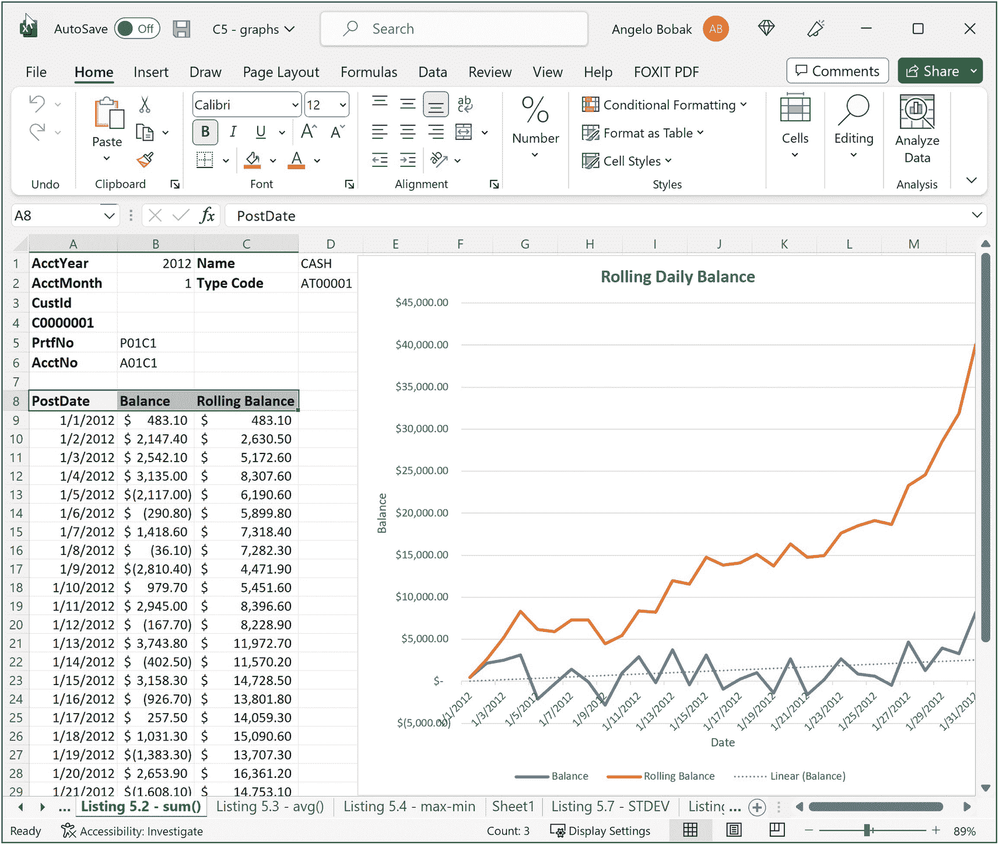

这是一张 Microsoft Excel 电子表格的截图。左侧有一个表格，包含 3 列：过账日期、余额和滚动余额。屏幕右侧，一张余额随时间变化的折线图描绘了余额、滚动余额和线性余额的不同曲线。

图 5-11

现金账户汇总图表

将结果粘贴到 Excel 电子表格中可以为我们提供一个良好的财务绩效可视化视角——在这个案例中是现金账户头寸，涉及存款、取款以及货币市场基金头寸。

在这里，我们看到余额的折线图波动较大，但趋势是上升的，所以我认为这是好的。虚线是趋势线，所以看起来它在稳步上升。还要记住，现金账户用于为买入交易提供资金。当卖出金融工具时，利润会回到现金账户。

滚动余额也呈上升趋势，这表明其他金融投资是盈利的。

总之，查询中通过窗口函数生成的数据是重要且有价值的，但添加图表可以提供原始数字中可能不突出的额外洞察！


#### 性能考量

需要提醒的是，出于本书的目的和篇幅限制，我们仅检查和分析查询计划中成本大于零的任务。例如，如果一个窗口假脱机任务（通常出现在 `OVER()` 子句中的 `ROWS` 或 `RANGE` 子句）的值为 0%，这意味着它发生在内存中，因此我们无需担心。如果其值大于零，我们便会在分析中考虑它，因为它很可能正在使用物理存储。

现在，让我们开始查看初始的查询计划。我们的 `Account` 表有 43,860 行。会推荐创建索引吗？

请参考图 5-12。

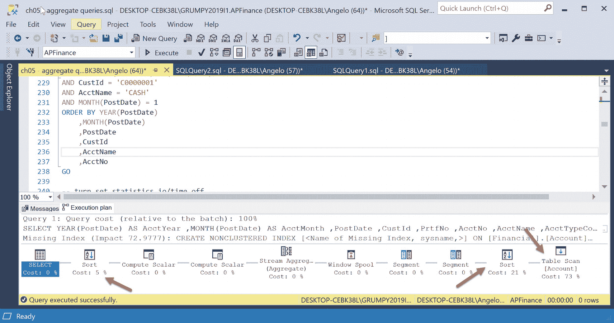

一张 c h 0 5 聚合查询 s q l 的截图。上半屏显示了一些编程代码。下半屏显示了消息和执行计划。三个箭头分别指示窗口排序成本 8%、排序成本 21% 和表扫描成本 73%。

图 5-12

估计的执行计划建议创建索引

是的，建议创建索引。我们立刻就能看到对 `Account` 表的一次表扫描，成本为 73%。其次是排序（21%）和窗口假脱机任务（0%）（在内存中执行）。在左侧还出现了另一个排序任务（5%）。

显然，我们需要接受建议并创建所推荐的索引。清单 5-6 是我提供了一个详细名称后创建的索引。

```
CREATE NONCLUSTERED INDEX [iePrtNoAcctNoTypeBalPostDate]
ON [Financial].[Account] ([CustId],[AcctName])
INCLUDE ([PrtfNo],[AcctNo],[AcctTypeCode],[AcctBalance],[PostDate])
GO
清单 5-6
建议的索引
```

创建索引后，我们生成并检查新的执行计划。

请参考图 5-13。

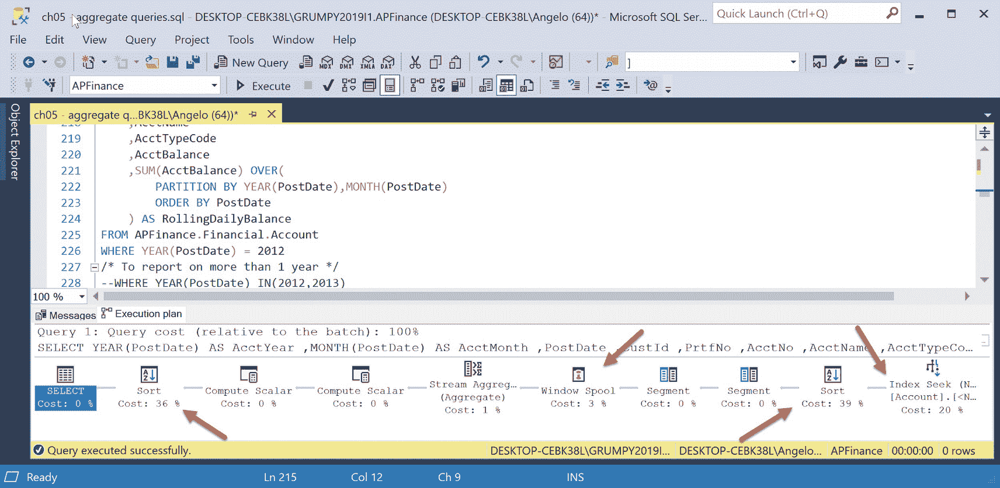

一张 c h 0 5 聚合查询 s q l 的截图。上半屏有一些编程代码。下半屏显示了消息和执行计划。四个箭头分别指示窗口排序成本 36%、窗口假脱机成本 3%、排序成本 39% 和索引查找成本 20%。

图 5-13

修订后的执行计划

情况有所改善。我们看到索引查找占 20%，排序任务占 39%，但是看看窗口假脱机任务。它现在成本是 3%，这意味着数据被写到了磁盘，所以这并不算改进。最后，在查询计划的末尾，左侧还有一个最终排序任务，占 39%。

让我们查看一下性能分析统计数据：

```
SET STATISTICS PROFILE ON
GO
```

图 5-14 是创建索引前后性能分析统计数据的对比。

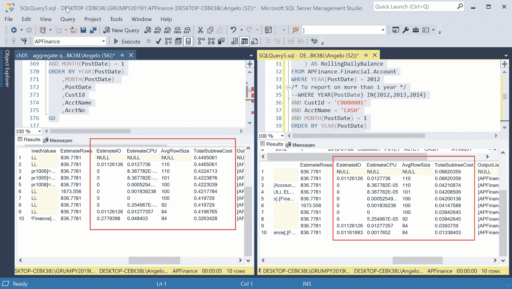

一张 c h 0 5 聚合查询 s q l 的截图。屏幕有 2 个面板，对比了创建索引前后的性能分析统计数据。

图 5-14

有索引和无索引时的性能分析统计数据

我们可以看到，无论有无索引，两种情况下的步骤数量是相同的。我们关注两组统计数据中的 `EstimateIO`、`EstimateCPU` 和 `TotalSubtreeCost`，可以看到有索引的版本略有改善，但幅度不大。让我们创建一些图表来展示这些信息。

请参考图 5-15。

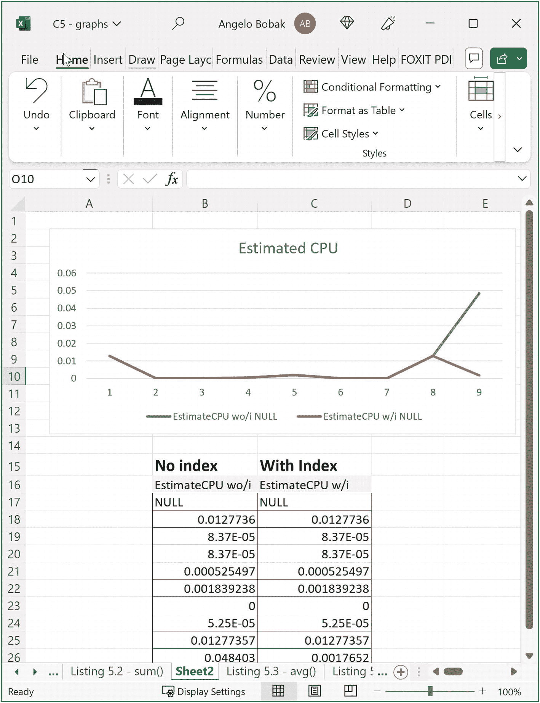

一张 Microsoft Excel 电子表格的截图。上半部分屏幕显示了一条估计 CPU 的折线图。下半部分屏幕，一张表格对比了有索引和无索引情况下的估计 CPU 统计数据集。

图 5-15

估计的 CPU 性能统计数据

我们清楚地看到，直到最后几步之前，CPU 统计数据都是相同的，之后有索引的曲线下降，而无索引的曲线上升。因此，这是我们用来判断创建的索引是否有价值的另一个指标。

请参考图 5-16。

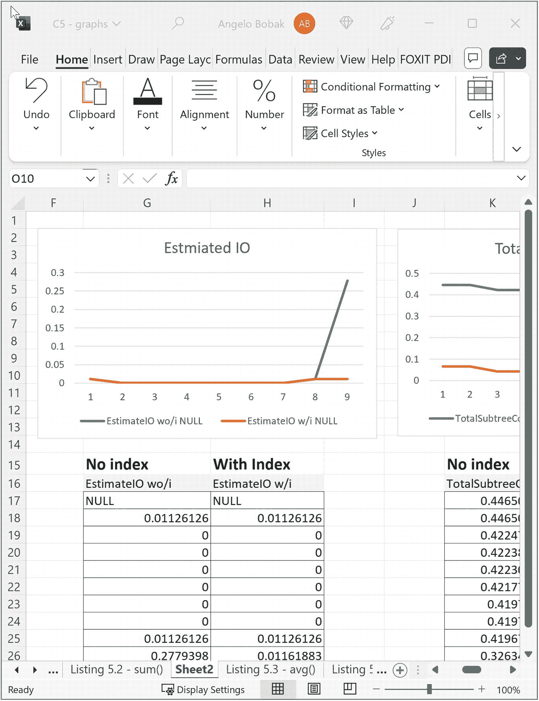

一张 Microsoft Excel 电子表格的截图。上半部分屏幕显示了一条估计 IO 的折线图。下半部分屏幕，一张表格对比了有索引和无索引情况下的估计 IO 统计数据集。

图 5-16

估计的 IO 统计数据

`IO` 统计数据的情况也类似。有了索引，`IO` 下降；没有索引，`IO` 上升。我们希望保持较低的 CPU 利用率和 IO。最后，让我们看看子树成本。

请参考图 5-17。

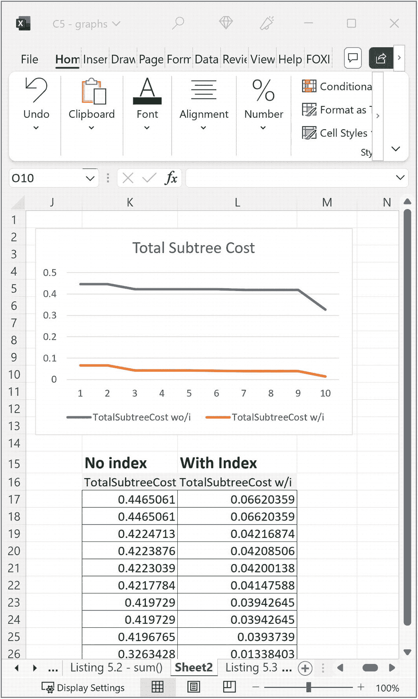

一张 Microsoft Excel 电子表格的截图。上半部分屏幕显示了一条总子树成本的折线图。下半部分屏幕，一张表格对比了有索引和无索引情况下的总子树成本统计数据集。

图 5-17

总子树成本

有索引时，子树成本统计数据也显著下降。至此，我们已经查看了几个性能统计数据类别和工具，我们可以使用它们来分析、评估和改进那些使用带有 `OVER()` 子句的聚合函数来处理数据分区的查询的性能。

所有这些分析证明，SQL Server 查询估计工具通常是正确的！

你现在拥有一些非常重要的查询性能工具，可用于你的性能分析活动：

*   显示估计的执行计划
*   包含实时查询统计信息
*   包含客户端统计信息
*   `SET STATISTICS IO ON/OFF` 设置
*   `SET STATISTICS TIME ON/OFF` 设置
*   `SET STATISTICS PROFILE ON/OFF` 设置

接下来，我们将看看通常在分析报告中一起出现的两个函数。


#### MIN() 和 MAX() 函数

快速回顾一下，`MIN()` 和 `MAX()` 函数分别返回一列中的最小值和最大值。

其语法与我们讨论过的其他聚合函数相同：

```sql
MIN(ALL|DISTINCT *) or MIN(ALL|DISTINCT )
```

和

```sql
MAX(ALL|DISTINCT *) or MAX(ALL|DISTINCT )
```

当我们将这些函数与 `OVER()` 子句结合使用时，它们的功能会更强大。值得重申的是，如果与 `OVER()` 子句一起使用，则不能使用 `DISTINCT`。

## 简单示例

让我们从一个简单的示例开始，为以前没有见过或使用过这些函数的读者复习一下。请参考 **代码清单 5-7**。

```sql
DECLARE @MinMaxExample TABLE (
ExampleValue SMALLINT
);
INSERT INTO @MinMaxExample VALUES(20),(20),(30),(40),(60),(60);
SELECT MIN(ExampleValue)   AS MinExampleValue
,COUNT(ExampleValue) AS MinCount
FROM @MinMaxExample;
SELECT MIN(ALL ExampleValue)    AS MinExampleValueALL
,COUNT( ALL ExampleValue) AS MinCountALL
FROM @MinMaxExample;
SELECT MIN(DISTINCT ExampleValue)  AS MinExampleValueDISTINCT
,COUNT(DISTINCT ExampleValue) AS MinCountDISTINCT
FROM @MinMaxExample;
SELECT MAX(ExampleValue)   AS MaxExampleValue
,COUNT(ExampleValue) AS MAXCount
FROM @MinMaxExample;
SELECT MAX(ALL ExampleValue)    AS MaxExampleValueALL
,COUNT( ALL ExampleValue) AS MAXCountALL
FROM @MinMaxExample;
SELECT MAX(DISTINCT ExampleValue)    AS MaxExampleValueDISTINCT
,COUNT( DISTINCT ExampleValue) AS MAXCountDISTINCT
FROM @MinMaxExample;
GO
```

**代码清单 5-7**
简单示例中的 `MIN()` 和 `MAX()`

我包含了使用 `ALL` 或 `DISTINCT` 关键字的所有变体，结果如 **图 5-18** 所示。

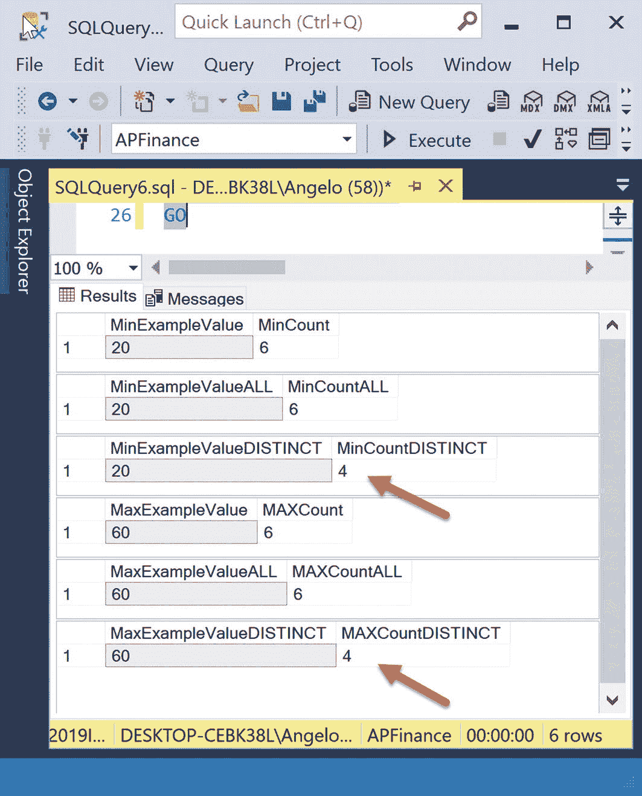

一张 SQL 查询窗口的截图。它展示了 6 个查询的最小示例值。两个箭头指示最小不同值计数为 4，最大不同值计数为 4。

**图 5-18**
`MIN()` 和 `MAX()`， `ALL`， `DISTINCT`

虽然你可以在 `MIN()` 和 `MAX()` 函数中使用 `ALL` 或 `DISTINCT`，但输出结果都是一样的。毕竟，无论存在多少重复值，最小值就是最小值，最大值就是最大值！

## 金融数据库示例

现在让我们把注意力转向我们的金融数据库示例，看看这个查询的业务需求是什么。

对于客户 C000001，John Smith 先生，我们想查看 2012 年每个月中现金账户价值的每日最小值和最大值。查询需要这样编写：如果我们希望查看其他年份，可以包含一个注释掉的 `WHERE` 子句，以便我们可以来回切换。我们预期我们的业务分析师会希望在分析中包含其他年份。

请参考 **代码清单 5-8**。

```sql
SELECT YEAR(PostDate) AS AcctYear
,MONTH(PostDate) AS AcctMonth
,PostDate
,CustId
,PrtfNo
,AcctNo
,AcctName
,AcctTypeCode
,AcctBalance
,MIN(AcctBalance) OVER(
PARTITION BY MONTH(PostDate)
/* 要报告超过 1 年的数据 */
--PARTITION BY YEAR(PostDate),MONTH(PostDate)
ORDER BY PostDate
) AS MonthlyAcctMin
,MAX(AcctBalance) OVER(
PARTITION BY MONTH(PostDate)
/* 要报告超过 1 年的数据 */
--PARTITION BY YEAR(PostDate),MONTH(PostDate)
ORDER BY PostDate
) AS MonthlyAcctMax
FROM APFinance.Financial.Account
WHERE YEAR(PostDate) = 2012
/* 要报告超过 1 年的数据 */
--WHERE YEAR(PostDate) IN(2012,2013)
AND CustId = 'C0000001'
AND AcctName = 'CASH'
ORDER BY YEAR(PostDate)
,MONTH(PostDate)
,PostDate
,CustId
,AcctName
,AcctNo
GO
```

**代码清单 5-8**
使用 `MIN()` 和 `MAX()` 分析客户 C000001 的现金情况

由于我们最初只查看 2012 年，我们的 `MIN()` 和 `MAX()` 函数的 `OVER()` 子句都有一个 `PARTITION BY` 子句，该子句使用过账日期的月份部分（每一天都是一个过账日期）。两个 `ORDER BY` 子句都按 `PostDate` 排序。

如前所述，如果你想查看超过一年的结果，请取消注释按年份和月份分区的 `PARTITION BY` 子句。我们不需要按月份和过账日期对分区进行排序，因为仅按过账日期排序就足以保持正确的顺序。

最后，`WHERE` 子句筛选出客户 `C0000001` 和现金账户的结果。关于报告多年数据的情况同样适用。如果你想生成多年报告，请使用注释掉的 `WHERE` 子句。

为了看到一些有趣的结果，比如三天滚动最小值和最大值余额，只需将 `OVER()` 子句替换为以下代码片段：

```sql
,MIN(AcctBalance) OVER(
PARTITION BY MONTH(PostDate)
ORDER BY PostDate
ROWS BETWEEN 2 PRECEDING AND CURRENT ROW
) AS MonthlyAcctMin
,MAX(AcctBalance) OVER(
PARTITION BY MONTH(PostDate)
ORDER BY PostDate
ROWS BETWEEN 2 PRECEDING AND CURRENT ROW
) AS MonthlyAcctMax
```

这里我们使用 `ROWS` 框架定义来定义三天的窗口框架。请注意，前两行加上当前行加起来构成了一个包含三行的窗口框架。这你应该知道！

## 查询结果

让我们看看原始查询的结果。请参考 **图 5-19** 中的部分结果。

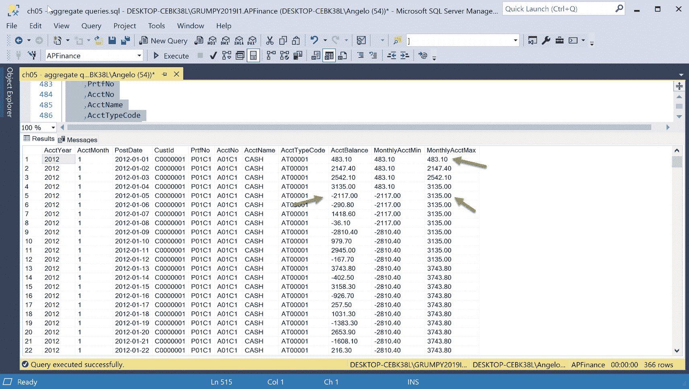

一张 ch05 聚合查询 sql 的截图。上面面板展示了一些程序代码。下面面板展示了结果表。三个箭头指示了账户余额、月度账户最小值和月度账户最大值列的一些值。

**图 5-19**
滚动每日最小和最大现金余额

可以看出，我们开始时具有相同的最小和最大余额。每当出现新的最小或最大余额时，这些值会相应地更新。当我们将这些值用于 Microsoft Excel 电子表格时，会产生一个有趣的图表。

请参考 **图 5-20** 中的部分结果。

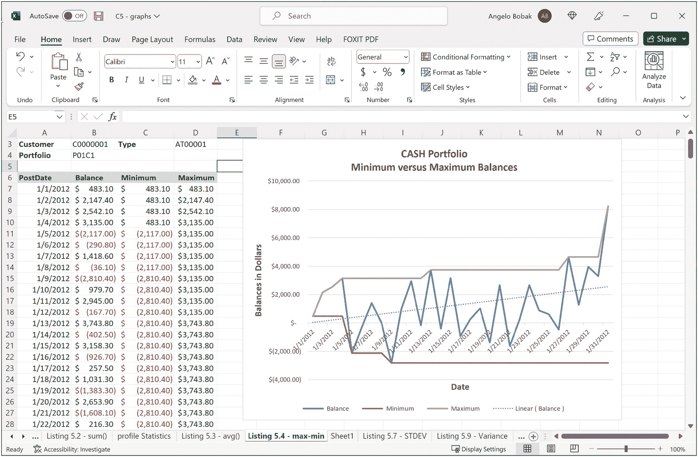

一张 Microsoft Excel 电子表格的截图。左侧的表格有 4 列：过账日期、余额、最小值、最大值。在右侧屏幕上，余额与日期的折线图绘制了最小和最大余额的变化曲线。

**图 5-20**
最小和最大现金账户分析

好消息是现金余额呈上升趋势。但我们看到的是最小和最大余额的波动，这表明存在一些大量的交易活动。请记住，客户使用此账户为其他工具（如外汇和股权交易）的买卖交易提供资金。


#### 性能考量

在分区上使用`MIN()`和`MAX()`函数也可能对性能造成压力。让我们进行常规分析，看看如何评估并改进此查询的性能。

请参考图 5-21。

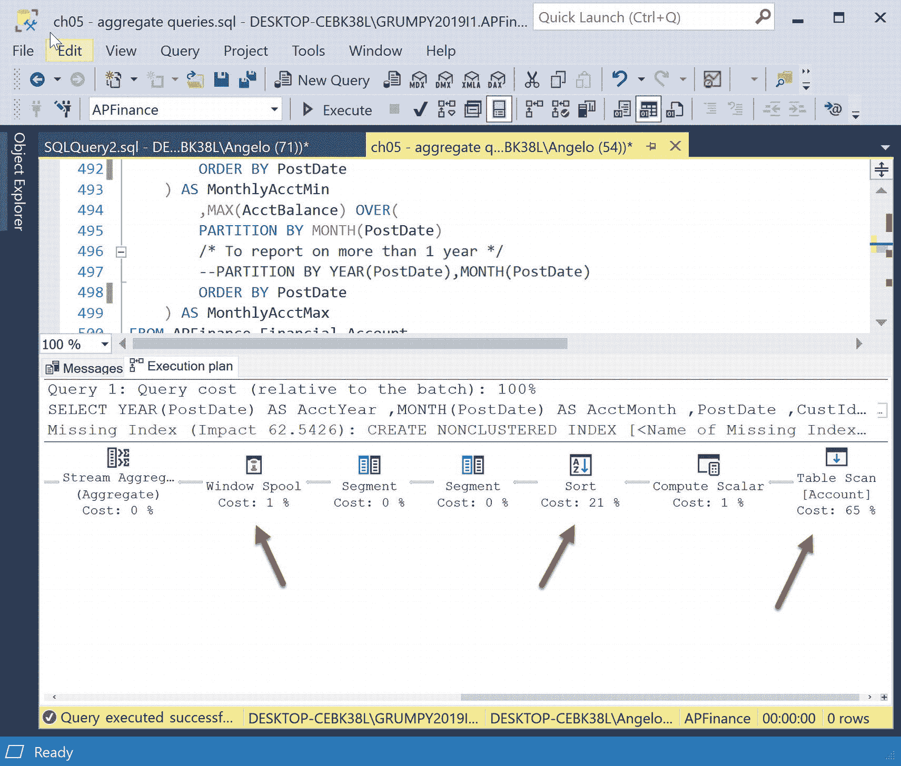

`c h 0 5 aggregate queries s q l`的截图。屏幕上半部分显示了一些编程代码。下半部分显示了消息和执行计划。三个箭头分别指示窗口假脱机成本 1%、排序成本 21% 和表扫描成本 65%。

图 5-21
`MIN/MAX`查询的估计查询计划

我们立刻看到一个成本为 65%的表扫描任务和一个缺失索引消息。接着是一个成本为 21%的排序操作，以及一个成本为 1%的窗口假脱机，这表明我们正在使用物理存储而非内存。让我们看看图 5-22 中估计查询计划的第 2 部分。

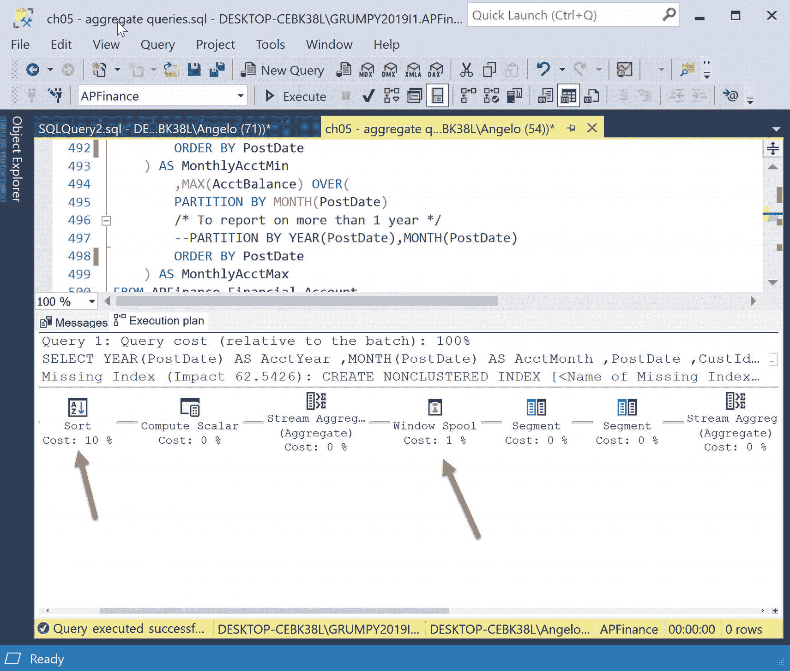

`c h 0 5 aggregate queries s q l`的截图。屏幕上半部分显示了一些编程代码。下半部分显示了消息和执行计划。两个箭头分别指示排序假脱机成本 10% 和窗口假脱机成本 1%。

图 5-22
估计查询计划第 2 部分

我们看到第二个窗口假脱机，成本为 1%。两个窗口假脱机任务是合理的，因为我们使用了`MIN()`和`MAX()`函数，所以每个函数生成一个假脱机任务。最后，我们有一个成本为 10%的排序任务。请记住，我不讨论成本为 0%的任务，因为本章关于性能调优讨论的范围，我们只想处理成本更高的任务。不过，一个好的性能调优方法是先查看高成本任务，然后是那些你不知道其作用的未知任务。你不知道的东西可能会对你造成很大损害！

同时，请确保检查任何带有警告图标的任务。让我们检查建议的索引，然后使用建议的名称创建它。

请参考清单 5-9。

```
/*
Missing Index Details from ch05 - aggregate queries.sql - DESKTOP-CEBK38L\GRUMPY2019I1.APFinance (DESKTOP-CEBK38L\Angelo (54))
The Query Processor estimates that implementing the following index could improve the query cost by 62.5426%.
*/
/*
USE [APFinance]
GO
CREATE NONCLUSTERED INDEX []
ON [Financial].[Account] ([CustId],[AcctName])
INCLUDE ([PrtfNo],[AcctNo],[AcctTypeCode],[AcctBalance],[PostDate])
GO
*/
清单 5-9
建议的索引
```

查询优化器称创建此索引可以将性能提升 62.54%。听起来不错！

让我们来构建它。我们将此索引命名为`iePrtfNoAcctNoAcctTypeCodeAcctBalancePostDate`。

是的，我知道索引名很长，但本书的目的是，我决定创建包含列名的索引名称以便于识别。这样，在学习过程中，你可以快速识别索引的用途。随着你的进展，你可以将索引重命名为更短但仍具描述性的名称。你的公司已经或应该有一些良好的数据库对象命名标准。

前面的代码被复制到本章的脚本中，并使用了建议的名称，索引被创建。我们还执行了常规的`DBCC`命令来清除内存计划缓存并生成新的查询计划。让我们看看效果如何。请参考图 5-23。


`c h 0 5 aggregate queries s q l`的截图。屏幕上半部分显示了一些编程代码。下半部分显示了消息和执行计划。三个箭头分别指示窗口假脱机成本 4%、排序成本 37% 和索引查找成本 14%。

图 5-23
创建索引后的估计查询计划

表扫描已被一个成本为 14%的索引查找所取代。到目前为止，一切顺利！

我们现在看到一个昂贵的排序任务，成本为 37%，以及一个窗口假脱机，成本为 4%。这些成本上升了。情况不太好。让我们看看估计查询计划的左侧，看看那边是否有改善。

请参考图 5-24。

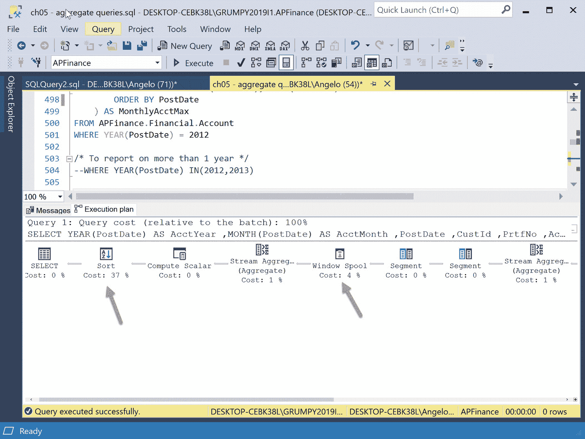

`c h 0 5 aggregate queries s q l`的截图。屏幕上半部分显示了一些编程代码。下半部分显示了消息和执行计划。两个箭头分别指示排序成本 37% 和窗口假脱机成本 4%。

图 5-24
查询计划的左侧

我们在这里发现了同样的问题；窗口假脱机成本上升到了 4%，最后一个排序任务上升到了 37%。所以我们需要提出疑问：索引是帮助了还是让事情变得更糟了？为了回答这个问题，我们需要查看执行以下命令时生成的统计数据：

```
SET STATISTICS PROFILE OFF
GO
```

我们需要在创建索引前后都进行此操作，以查看`IO`和其他统计数据是上升了还是下降了。结果请参考图 5-25。

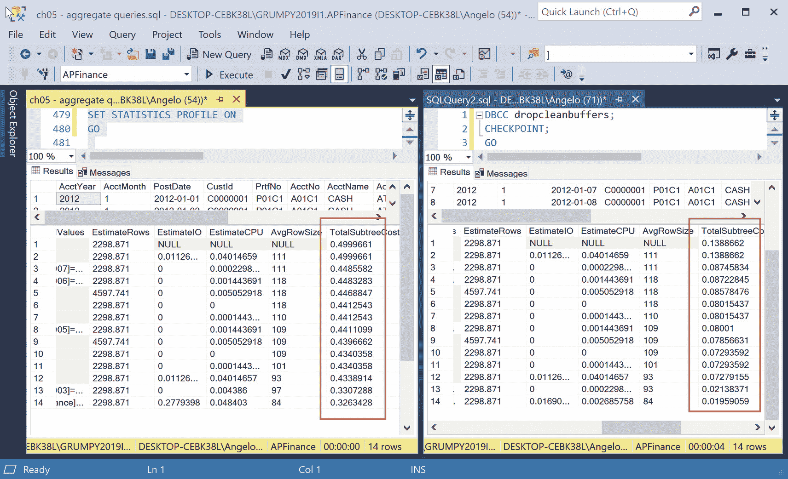

`c h 0 5 aggregate queries s q l`的截图。屏幕有两个面板，比较了创建索引前后的总体子树成本统计数据。

图 5-25
创建索引前后的`PROFILE`统计数据

这需要一些准备工作。首先，你需要在创建索引之前，在一个查询窗格中执行用于执行查询的`DBCC`命令。设置配置文件统计信息为开启状态并执行查询。

打开第二个查询窗格，复制并粘贴`DBCC`、`SET PROFILE ON`和查询以及创建索引的代码。请遵循以下步骤：

*   步骤 1：创建索引。
*   步骤 2：执行`SET PROFILE ON`命令。
*   步骤 3：执行`DBCC`命令。
*   步骤 4：执行查询。

确保查询窗格窗口垂直并排显示。可以看出，唯一的改善似乎是在子树成本上。估计的 CPU 统计数据有微小改善，但不多。

让我们比较创建索引前后的`IO`和`TIME`统计数据，看看它们告诉了我们什么。请参考图 5-26。

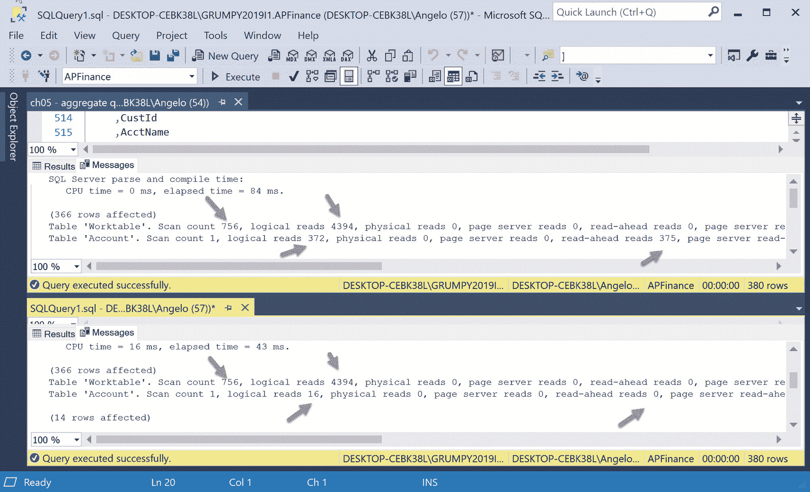

`c h 0 5 aggregate queries s q l`的截图。屏幕有两个面板，比较了创建索引前后的`I O`和`TIME`统计数据。执行后，逻辑读取次数从 372 降至 16，预读读取次数从 375 降至 0。

图 5-26
`IO`和`TIME`统计数据对比分析

这组统计数据告诉了我们什么？

我们可以看到，工作表的扫描计数和逻辑读取次数保持不变。

我们可以看到，`Account`表的扫描计数保持不变，但逻辑读取次数从 372 下降到了 16，预读读取次数从 375 下降到了 0。

所以，你可以看到，我们所有的性能分析工具都是必要的，这样我们才能真正看到一个索引是否有帮助。在这种情况下，它有一定帮助，创建索引是合理的。你确实需要考虑，创建一个只提升 50%或更少性能的索引是否合理。当表被加载时，索引是否会导致性能下降？50%的提升是否意味着原来运行 4 秒的查询现在只需要 2 秒？将所有因素考虑在内。如果你的用户对 4 秒的查询等待时间感到满意，那就不要动它。不要修没坏的东西。

接下来，我们快速看一下`AVG()`函数。我们将不会像本节那样进行严格的性能分析。我将其留给你作为练习，因为现在你已经看到了几个使用所需工具和技巧来测量性能的例子。

#### 随堂测验

成本（cost）意味着什么？它是指一个步骤执行所需的时间，还是基于 IO、内存使用和 CPU 成本的加权人工值？


