# AVG() 函数

## 函数概述

`AVG()` 函数计算表中某列所代表数据集的平均值。

其语法如下：

```
AVG(ALL|DISTINCT *) or AVG(ALL|DISTINCT column_name)
```

## 示例说明

按照惯例，我们通过一个简单的示例来看看在函数调用中包含 `ALL` 或 `DISTINCT` 关键字对结果产生的影响。

请参考清单 5-10。

```
USE TEST
GO
-- 简单示例
DECLARE @AVGMaxExample TABLE (
ValueType VARCHAR(32),
ExampleValue SMALLINT
);
INSERT INTO @AVGMaxExample VALUES
('Type 1',20),
('Type 1',20),
('Type 1',30),
('Type 2',40),
('Type 2',60),
('Type 3',60);
SELECT AVG(ExampleValue)                    AS AVGExampleValue
FROM @AVGMaxExample;
SELECT AVG(ALL ExampleValue)                AS AVGExampleValueALL
FROM @AVGMaxExample;
SELECT AVG(DISTINCT ExampleValue)           AS AVGExampleValueDISTINCT
FROM @AVGMaxExample;
SELECT ValueType,AVG(ExampleValue)          AS AVGExampleValue
FROM @AVGMaxExample
GROUP BY ValueType;
SELECT ValueType,AVG(ALL ExampleValue)      AS AVGExampleValueALL
FROM @AVGMaxExample
GROUP BY ValueType;
SELECT ValueType,AVG(DISTINCT ExampleValue) AS AVGExampleValueDISTINCT
FROM @AVGMaxExample
GROUP BY ValueType;
GO
Listing 5-10
测试查询
```

使用一个加载了六行数据的表变量，我们想查看按类型计算的平均值结果。用简单的数据来理解这一点很关键，因为如果你不确定为重复数据与不同数据生成的结果，那么在查询数十万或数百万行时，你将在结果中产生严重的错误。这可能会变得非常严重！

例如，计算一天中每小时的平均交易次数，包含重复值与仅包含不同值会产生不同的结果。你需要包含所有交易，即使是重复的，以获得准确的平均值（例如，上午 10 点有两笔交易，下午 1 点又有两笔交易，当天总共四笔交易）！

让我们看看这个简单查询的结果。请参考图 5-27。

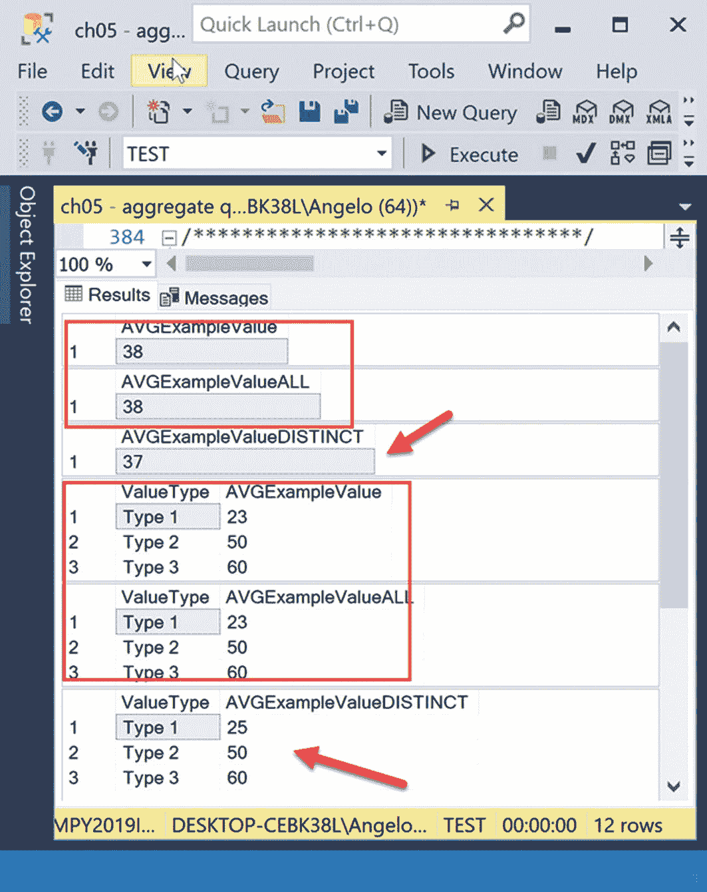
图 5-27
在计算平均值时测试 ALL 与 DISTINCT

从顶部开始，在 `AVG()` 函数中使用 `ALL` 或什么都不用，结果为 38。使用 `DISTINCT` 得到的结果是 37。当我们引入 `ValueType` 列时，我们看到了类似的行为。

掌握了这些知识后，让我们尝试对我们的财务数据运行一个查询。

## 实际应用：计算滚动平均值

我们的业务分析师需要一个查询来生成一份报告显示客户账户的滚动三天平均值。和往常一样，我们选择客户“C0000001”（John Smith）。如果你查看 `Customer` 表，你会发现 Smith 先生的年薪是 250,000 美元。不错！

该查询需要显示现金账户的结果，并且仅限于 2012 年的第一个月。我们希望有能力显示其他年份，因此我们需要包含注释掉的代码，以便根据分析师的请求启用（你可以自己完成这部分）。

请参考清单 5-11。

```
SELECT YEAR(PostDate)  AS AcctYear
,MONTH(PostDate) AS AcctMonth
,PostDate
,CustId
,PrtfNo
,AcctNo
,AcctName
,AcctTypeCode
,AcctBalance
,AVG(AcctBalance) OVER(
PARTITION BY MONTH(PostDate)
/* 取消注释以报告超过 1 年的数据 */
--PARTITION BY YEAR(PostDate),MONTH(PostDate)
ORDER BY PostDate
ROWS BETWEEN 2 PRECEDING AND CURRENT ROW
) AS [3 DayRollingAcctAvg]
FROM APFinance.Financial.Account
WHERE YEAR(PostDate) = 2012
/*******************************************/
/* 取消注释以报告超过 1 年的数据 */
/*******************************************/
--WHERE YEAR(PostDate) IN(2012,2013)
AND CustId = 'C0000001'
AND AcctName = 'CASH'
AND MONTH(PostDate) = 1
ORDER BY YEAR(PostDate)
,MONTH(PostDate)
,PostDate
,CustId
,AcctName
,AcctNo
GO
Listing 5-11
滚动三天平均值
```

顺便说一句，这里没有使用 `CTE`。`AVG()` 函数与 `OVER()` 子句一起使用，该子句按月份对数据集进行分区，并按过账日期对分区结果集进行排序。包含了 `ROWS` 子句来创建一个窗口框架，该框架在处理结果时包括前两行和当前行。

请记住，这只是针对现金账户。比较现金账户平均值与股票账户平均值会很有趣，例如，看看 Smith 先生是赚钱了还是亏钱了。是否有大量现金从账户流出用于购买股票？股票上涨了吗，然后它们被卖出获利，从而现金存款被存回现金账户？

你可以通过修改查询以包含股票账户来做到这一点。

让我们查看图 5-28 中的结果，然后我们可以绘制它们。

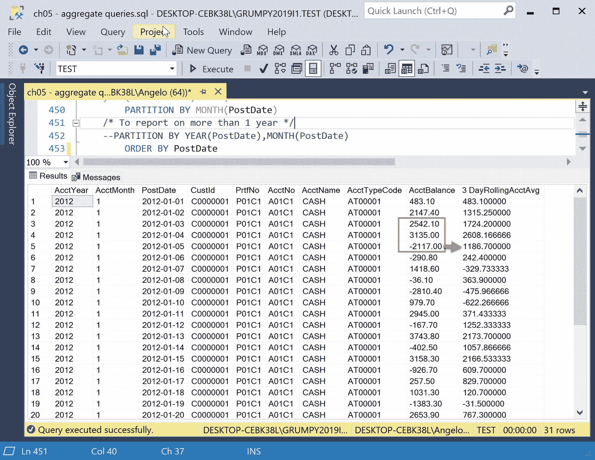
图 5-28
滚动三天现金账户平均值

输出按天排序，因此你可以看到平均值是如何按日计算的。请注意，有很多负的账户余额，这可能意味着存在大量不稳定的交易。在实际的交易场景中，会有检查机制来防止在资金账户余额为负的情况下进行交易，或者可能采取某种机制，以便在出现短缺时可以从其他账户转移资金以备不时之需。

一图胜千言，所以让我们将这些数据复制到 Excel 中并生成一个漂亮的图表。

请参考图 5-29 中的 Excel 图表。

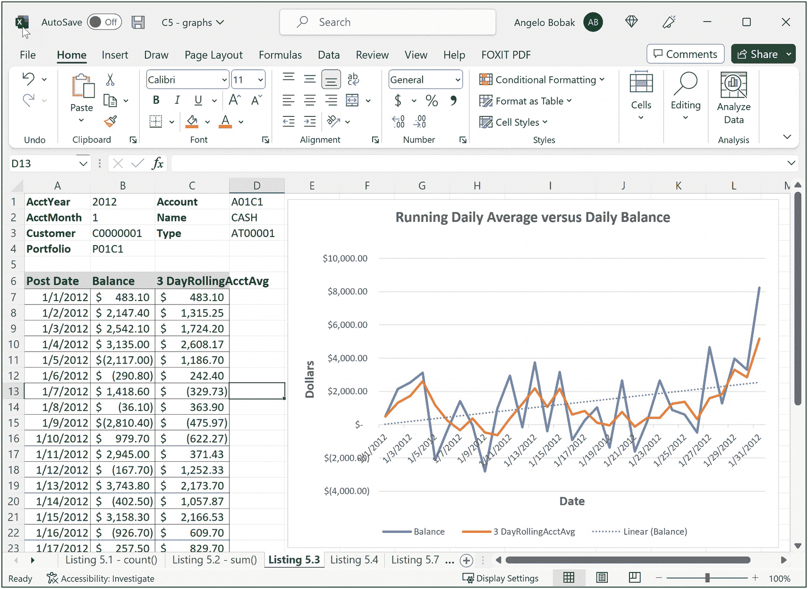
图 5-29
现金账户的滚动三天平均值

账户余额和平均值总体呈上升趋势，但有很多上下波动。虚线线性余额线用于显示趋势，所以它至少是指向上的。

我们正在逐一研究这些函数，但有价值的报告会给出账户绩效的概况。我的意思是，在一份报告中使用我们讨论过的所有函数，这样分析师可以看到账户的所有绩效方面。

通过重新利用之前查询的代码并为现金账户或其他账户类型（如股票或外汇）创建一个概况报告，你可以自己尝试一下。

最后一点：使用 Excel 在 SQL Server 函数生成的值旁边生成三天滚动平均值，以验证结果。始终验证查询生成的数据。

#### 性能考量

`AVG()` 函数是否比我们讨论过的其他聚合函数消耗更多或更少的资源？我复制了刚才讨论的查询，将 `AVG()` 函数改为 `SUM()` 函数。然后我为每个查询生成了估计的查询计划，它们是一样的。步骤、成本等都相同。我还尝试了 `STDEV()` 函数与 `AVG()` 函数对比，结果也是一样的。

#### 随堂测验答案
成本源自一个加权计算，该计算衡量 CPU、IO 和内存使用成本。

要回答这个问题，需要进行更深入的分析。

让我们使用查询计划估算器进行常规分析，这次要注意 `OVER()` 子句中的 `ROWS` 子句。

请参考图 5-30。
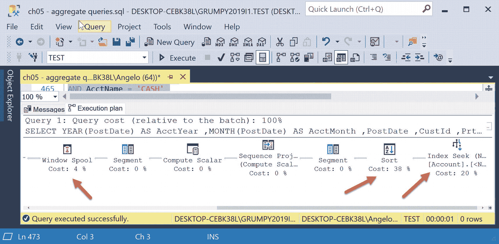
c h 0 5 aggregate queries s q l 的截图。上半屏显示一些程序代码。下半屏显示消息和执行计划。窗口假脱机成本，4%。排序成本，38%。索引查找成本，20%。
**图 5-30**
三天滚动平均值的估计查询计划（A 部分）

使用了现有索引（20% 成本），接着是一个排序步骤（38%），然后就是我们看到的窗口假脱机，成本为 4%。这意味着假脱机活动在物理存储上执行。让我们看看估计查询计划的左侧。请参考图 5-31。
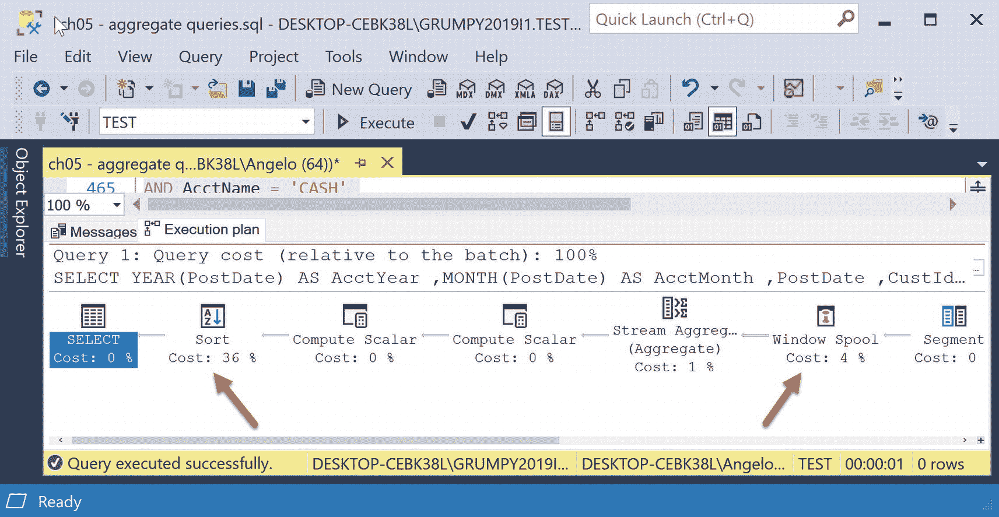
c h 0 5 aggregate queries s q l 的截图。上半屏显示一些程序代码。下半屏显示消息和执行计划。排序成本，36%。窗口假脱机成本，4%。
**图 5-31**
三天滚动平均值的估计查询计划（B 部分）

作为两个截图之间的参考点，这里存在相同的窗口假脱机任务。左侧的排序成本为 36%，是成本方面最后一个较高的任务。

让我们修改 `ROWS` 子句，以便获得四天滚动平均值而不是三天滚动平均值，进行以下修改：
```sql
,AVG(AcctBalance) OVER(
PARTITION BY MONTH(PostDate)
ORDER BY PostDate
ROWS BETWEEN 3 PRECEDING AND CURRENT ROW
```

在我们执行 `DBCC` 函数（以清除计划缓存）后，再次运行估计查询计划，生成了图 5-32 中的计划。

#### 随堂测验
为什么我们使用 `DBCC` 来清除计划缓存？

将 `ROWS` 子句改为生成四天滚动平均值计算，增加了窗口假脱机成本。请参考图 5-32。
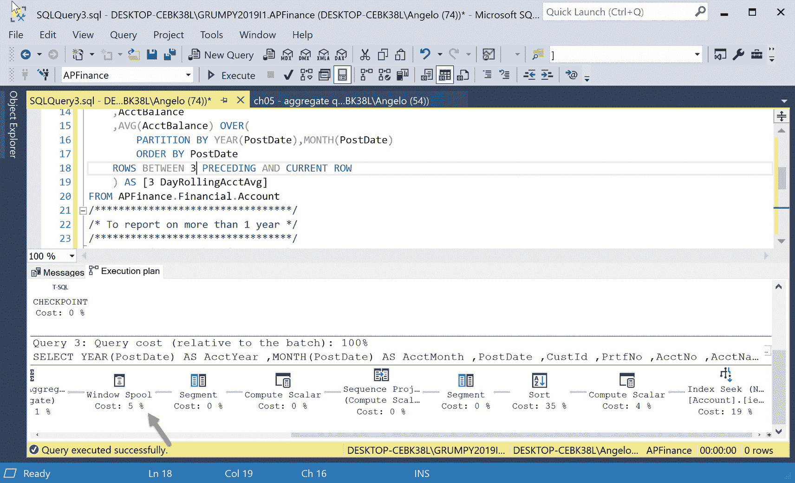
c h 0 5 aggregate queries s q l 的截图。上半屏显示一些程序代码。下半屏显示消息和执行计划。一个箭头指示窗口假脱机成本，4%。
**图 5-32**
四天滚动平均值查询的估计查询性能计划

索引查找成本降至 19%，排序降至 35%，窗口假脱机任务成本为 5%。看起来如果我们在 `ROWS` 子句中增加前行的数值，窗口假脱机成本会上升。遗憾的是，这并非总是成立。我将数值改为 4、5 和 8，窗口假脱机成本又降回了 3。有趣。

我修改了查询，使得其中有三处对 `AVG()` 函数的调用，前行值分别设置为 3、4 和 5，窗口假脱机成本分别为 3%、3% 和 4%。因此我最初的假设并不成立。

不过排序成本倒是降低了一点。你可以自己尝试这个分析，看看得到什么结果。

接下来，让我们通过上卷总计进行一些多维分析。

### GROUPING 函数

回顾第 2 章，`GROUPING()` 函数可以比作 Microsoft Excel 电子表格的数据透视表，但它是用 `T-SQL` 实现的。结果很强大，但查看起来令人困惑，分析起来也很复杂。数据透视表是三维的；函数结果是二维的。

我们将创建一个查询并查看结果。然后我们会修改查询，使其只生成原始数据，并将其复制到 Microsoft Excel 电子表格中，以便创建数据透视表。我们将比较这两个结果，看看是否得到相同的值。

作为复习，回顾第 2 章分组的工作原理。请参考图 5-33。
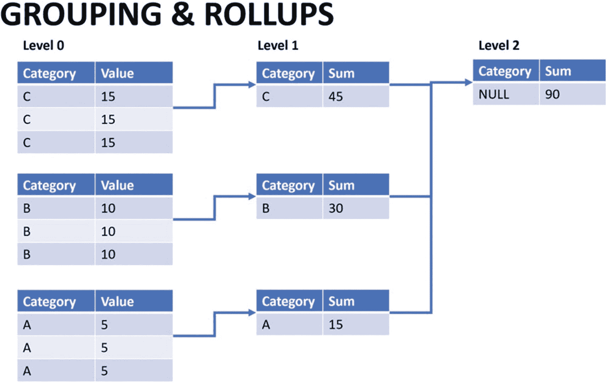
一个图表，包含 3 个第 0 级的表，3 个第 1 级的表，以及 1 个第 2 级的表。每个表有两列，分别用于类别和值或总和。类别是 A、B 和 C。上卷值是类别 A 为 15，类别 B 为 30，类别 C 为 45。最终总和在第 2 级为 90。
**图 5-33**
分组和上卷的工作原理

从图表左侧的三类行开始，数据集中的每一行都有一个类别和一个值。类别是 A、B 和 C。如果我们在第 0 级汇总每个类别的值，我们会得到第 1 级的上卷值：类别 A 为 15，类别 B 为 30，类别 C 为 45。如果我们汇总这三个上卷总计，会在第 2 级得到一个最终值 90。

想象一下，如果我们要对数以万计的行进行分组和上卷总计，这种结构是多么强大而又令人困惑！

回到财务场景。这是我们的业务分析师需求：

为客户 `C0000003`（Sherlock Carruthers）生成一份报告显示 `EURO`（欧盟货币）和 `GBP`（英镑）外币交易的总交易额。仅显示 2012 日历年一月份的数据。

结果需要按年、季度、月、交易日期和金融工具符号进行分组和上卷。

清单 5-12 是基于此规格说明的最终查询。
```sql
SELECT YEAR(TransDate)        AS TransYear
,DATEPART(qq,TransDate) AS TransQtr
,MONTH(TransDate)       AS TransMonth
,TransDate
,Symbol
,CustId
,TransAmount
,SUM(TransAmount)      AS SumOfTransAmt
,GROUPING(TransAmount) AS TransAmtGroup
FROM Financial.[Transaction]
WHERE Symbol IN ('EURO','GBP')
AND CustId = 'C0000003'
AND YEAR(TransDate) = 2012
AND MONTH(TransDate) = 1
GROUP BY YEAR(TransDate)
,DATEPART(qq,TransDate)
,MONTH(TransDate)
,TransDate
,Symbol
,CustId
,TransAmount WITH ROLLUP
ORDER BY YEAR(TransDate)
,DATEPART(qq,TransDate)
,MONTH(TransDate)
,TransDate
,Symbol
,CustId
,(CASE WHEN TransAmount IS NULL THEN 0 END)DESC
,SUM(TransAmount) DESC
,GROUPING(TransAmount) DESC
GO
```
**清单 5-12**
EURO 和 GBP 的交易上卷

`GROUPING()` 函数紧跟在 `SUM()` 函数之后。我们需要留意两个重要的编码部分。

首先，我们需要在 `GROUP BY` 子句中的 `TransAmount` 列添加 `WITH ROLLUP` 指令，以便生成上卷。

其次，在 `ORDER BY` 子句中，我们需要包含条件性的 `CASE` 代码块，以便我们知道如何对 `TransAmount` 列的 `NULL` 值进行排序。注意，我们还通过一个小型的 `CASE` 块在 `ORDER BY` 子句中包含了 `SUM()` 和 `GROUPING()` 函数，这样我们生成的报告在沿着交易金额的 `ROLLUP` 向上导航时，所有 `NULL` 值都能正确对齐。

请参考图 5-34 中的部分结果。
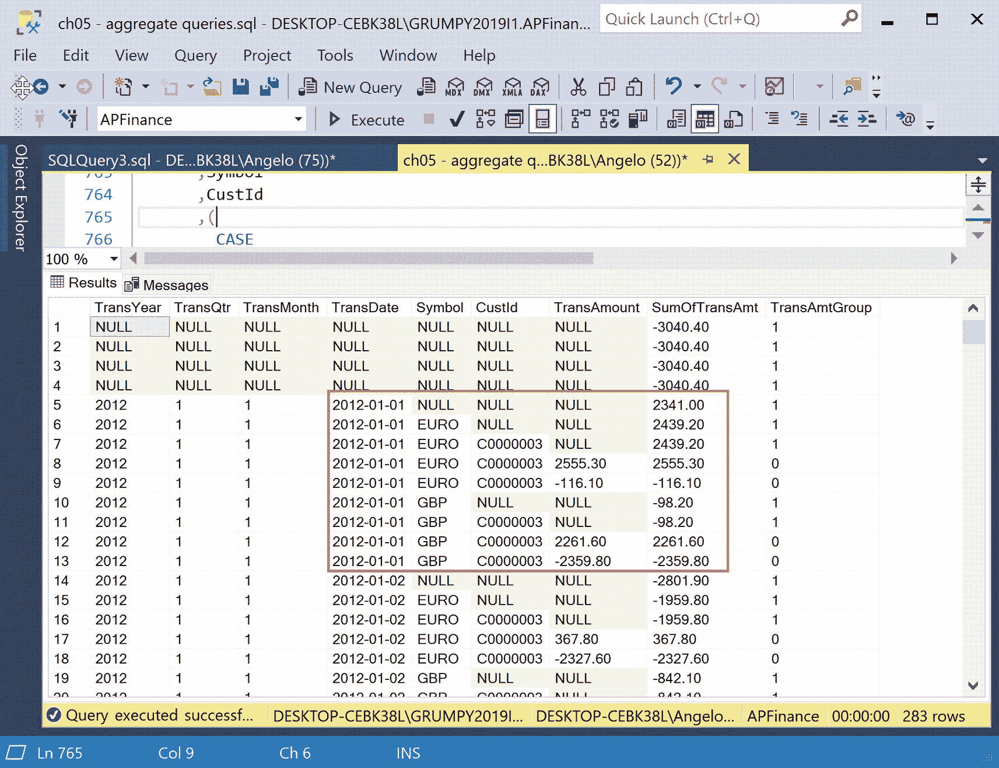


`c h 0 5 aggregate queries s q l` 的截图。屏幕上半部分展示了一些编程代码。下半部分展示了一个有 9 列的结果表，其中 `transaction date`、`symbol`、`customer I d`、`transaction amount` 和 `sum of amount` 列的部分值被高亮显示。

**图 5-34**

欧元和英镑的交易汇总报告

让我们看一下汇总的一小部分。对于 2012 年 1 月 1 日，如果我们把两个英镑（GBP）货币值相加，会发现它们汇总为 –£98.20。真糟糕！如果我们把欧元（EURO）条目相加，最终得到正数 €2439.20。如果我们将 –£98.20（转换为 €98.20）加上 €2439.20，我们得到 €2341。

在这个例子中，我们假设英镑和欧元的汇率是 1:1。否则，数值必须转换为美元或我们正在相加的其中一种货币。否则，加法就没有意义。

请参阅图 `5-35` 中的 Excel 数据透视表。

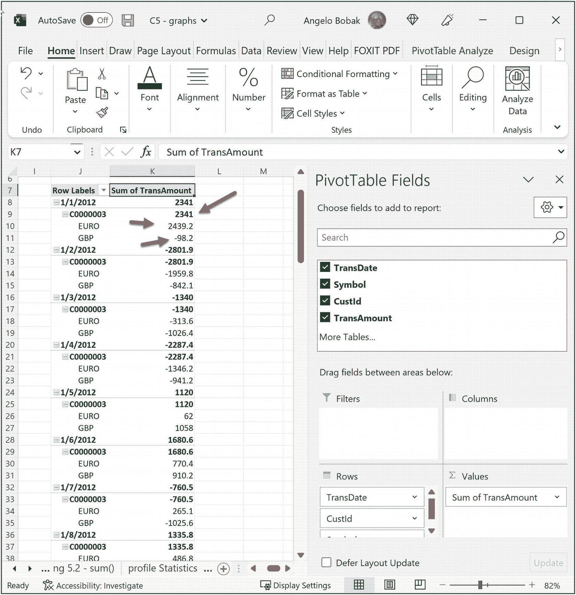

这是一张 Microsoft Excel 电子表格的截图。左侧的表格有 2 列，分别是行标签和交易金额的总和。右侧面板是数据透视表字段。

**图 5-35**

欧元和英镑的货币数据透视表

看起来不错！数值匹配。注意在顶部的 1 月 1 日，假设汇率为 1:1，将欧元和英镑值相加得到的最终总计为 €2341。

如果你有灵感了，可以对交易表做一些修改，将外币值用一些虚构的汇率转换为美元，这样你可以增强报告。

回到我们的编码示例。这告诉了我们关于 `GROUPING()` 函数的什么价值？它确实有效，但需要在查询中使用一些排序技巧，才能使输出看起来像可理解的汇总。在我看来，将原始数据复制粘贴到 Microsoft Excel 电子表格的数据透视表中，会产生更令人印象深刻的视觉效果。你还可以创建数据透视图来配合你的数据透视表。

最后但同样重要的是，你也可以将原始数据加载到 `SQL Server Analysis Services` 中，创建并加载多维数据集，并在那里执行多维分析。

### 性能考虑

这个函数似乎很消耗性能。我们现在有几种分析性能的工具，从创建估计和实际查询计划，到分析诸如 `IO`、`TIME` 和 `STATISTICS PROFILE` 之类的统计信息。我们的过程是查看估计计划，然后更深入地研究正在分析的查询的性能统计信息，以便全面了解情况，并确定是否可以添加任何索引或报表表来提高性能。

随堂测验答案

为了消除任何可能扭曲性能统计信息的先前查询计划。

像往常一样，我们首先以常规方式生成一个估计查询计划。这可能是你开始分析性能时应该总是采取的第一步。

请参阅图 `5-36`。

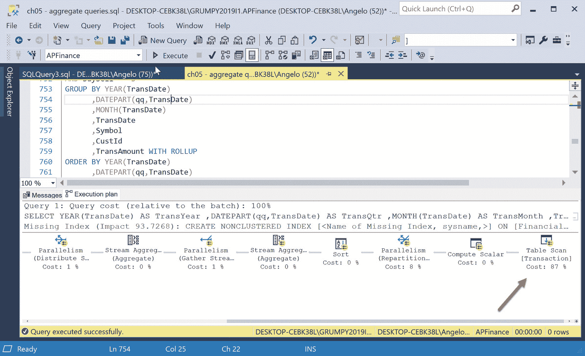

`c h 0 5 aggregate queries s q l` 的截图。屏幕上半部分展示了一些编程代码。下半部分展示了消息和执行计划。一个箭头指示表扫描成本为 87%。

**图 5-36**

估计查询计划显示了一个昂贵的表扫描

我们现在知道，在大表上看到表扫描就意味着麻烦。我们还看到估算器建议了一个索引，所以这是我们采取的第一个补救措施。如果我们创建这个索引，`SQL Server` 告诉我们将会看到 93.72% 的性能提升。

我们将建议的索引复制粘贴到我们的脚本中，给它起个名字，然后执行 DDL 命令来创建索引。祈祷成功吧！

请参阅清单 `5-13`。

```
CREATE NONCLUSTERED INDEX [ieTranSymCustBuySell]
ON [Financial].[Transaction] ([Symbol],[CustId],[BuySell])
INCLUDE ([TransDate],[TransAmount])
GO
清单 5-13
为 GROUPING() 示例建议的索引
```

这个名字不算太长，而且确实传达了索引的用途。事后我本可以加上 `Date` 和 `Amount` 这几个词，但你明白意思就行。一个像 `ieX-1234` 这样的索引名称可能不是个好主意。

我们继续前进，执行命令来创建索引，并生成另一个估计查询计划。请参阅图 `5-37`。

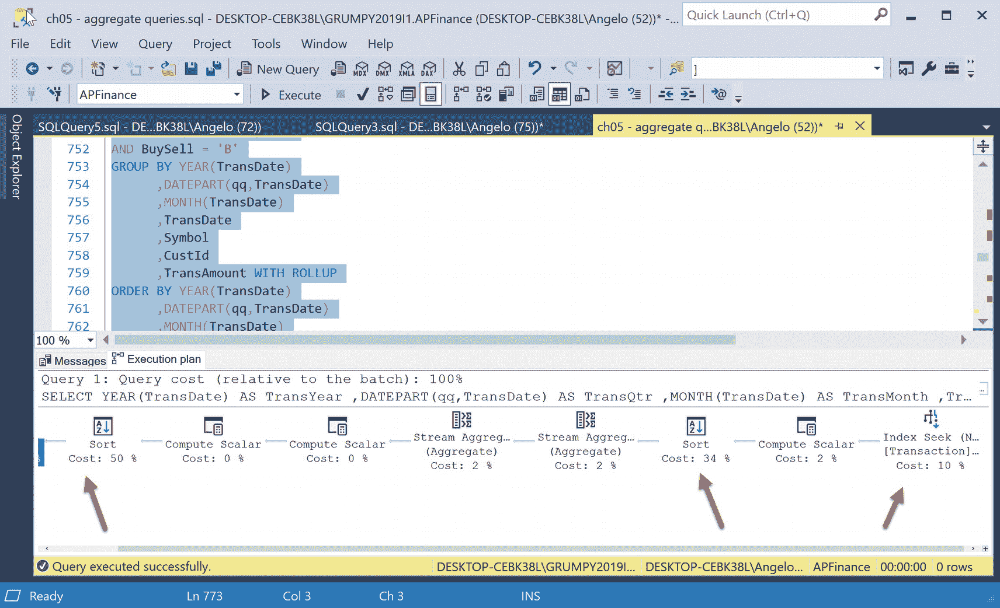

`c h 0 5 aggregate queries s q l` 的截图。屏幕上半部分展示了一些编程代码。下半部分展示了消息和执行计划。三个箭头分别指示排序成本 50%、排序成本 34% 和索引查找成本 10%。

**图 5-37**

修订后的估计查询计划

表扫描消失了，取而代之的是成本为 10% 的索引查找。不过请注意，我们有两个昂贵的排序操作；第一个成本为 34%，第二个成本为 50%。看来每当我们添加一个我们认为高性能的索引时，也会产生一些昂贵的排序任务！

因此，我们需要深入剖析这个查询。以下是你可以遵循的步骤：

*   将查询复制到一个新的查询窗格（包括 `DBCC` 命令、创建查询的命令和 `SET STATISTICS PROFILE` 命令）。
*   将其移动到新的水平选项卡。
*   删除新的表索引。
*   将 `STATISTICS PROFILE` 设置为 `ON`。
*   在原始查询窗格中运行查询。
*   在第二个查询窗格中，创建索引，运行 `DBCC`，并将 `STATISTICS PROFILE` 设置为 `ON`。

现在索引已创建，运行查询并比较配置文件统计信息，如图 `5-38` 所示。

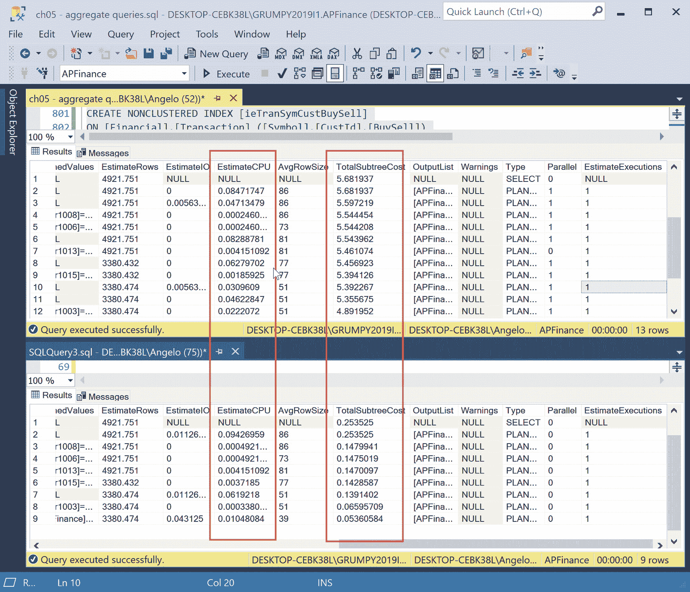

`c h 0 5 aggregate queries s q l` 的截图。屏幕有两个面板，比较了创建索引前后总子树的统计信息。

**图 5-38**

创建索引前后的配置文件统计信息

我们看到了什么？首先，我们立即看到，第二个结果（代表创建索引后的统计信息）比没有索引的原始查询步骤更少。好开端。步骤更少，执行查询的时间更短。

估计的 `IO` 列显示数值实际上上升了，但步骤更少了。估计的 `CPU` 值略有上升，有几个下降了。同样，步骤更少了。最后，`TotalSubTreeCost` 值显著下降，所以看起来创建索引是正确的行动。步骤更少，子树成本更低，CPU 成本则有升有降。

我们的老朋友，`IO` 和 `TIME` 统计信息怎么样呢？

请参阅图 `5-39`。

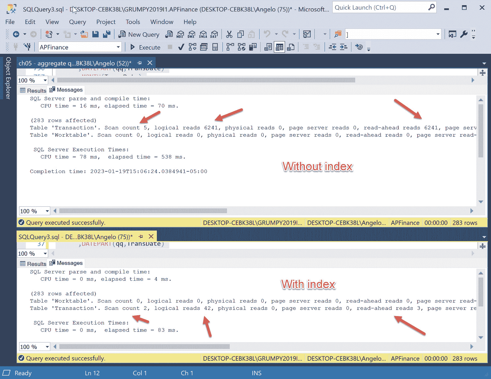

`c h 0 5 aggregate queries s q l` 的截图。屏幕有两个面板，比较了创建索引前后的 IO 和 TIME 统计信息。执行后，扫描计数从 0 增加到 2，逻辑读取从 6241 减少到 42。

**图 5-39**

比较创建索引前后的 IO 和 TIME 统计信息

性能难题的最后一部分是比较查询中使用的工作表和数据库表的扫描计数、逻辑读取和预读读取。从这些统计值可以看出，一切都在索引创建后下降了。逻辑读取和预读读取的数值以千为单位下降。这正是你想看到的。

要设置它，使用与前面讨论相同的步骤，在水平查询窗格中查看两组统计信息。


### STRING_AGG() 函数

这里再次用到用于聚合文本字符串的函数。让我们看一个简单的示例，它展示了如何创建与股票代码价格相关的信息包，这些信息包可用于在交易平台之间通信信息。

语法如下：

```
STRING_AGG(,)
```

通过巧妙地创建一个结合了标签、消息和表中数据的文本字符串，我们可以创建可被应用程序用于按天和小时跟踪股票代码价格的数据包。

在此案例中，分析师的需求是组装股票代码、公司名称、交易日期、小时和价格。交易员在执行买卖交易时需要这些信息。需要在数据包的两端添加某种包开始/停止令牌，以便在接收端处理数据流。

请参考下面的列表。

```
SELECT STRING_AGG('msg start->ticker:' + Ticker
+ ',company:' + Company
+ ',trade date:' + convert(VARCHAR, TickerDate)
+ ',hour:' + convert(VARCHAR, QuoteHour)
+ ',price:' + convert(VARCHAR, Quote) + '<-msg stop', '!') + CHAR(10)
FROM MasterData.TickerHistory
WHERE TickerDate = '2015-01-01'
GO
```

**清单 5-14** 组装 24 小时股票代码价格

这只是一个简单的例子，需要你发挥一点想象力，但它说明了即使在金融交易场景中，这个函数也具有适用性。

请参考下图的结果。

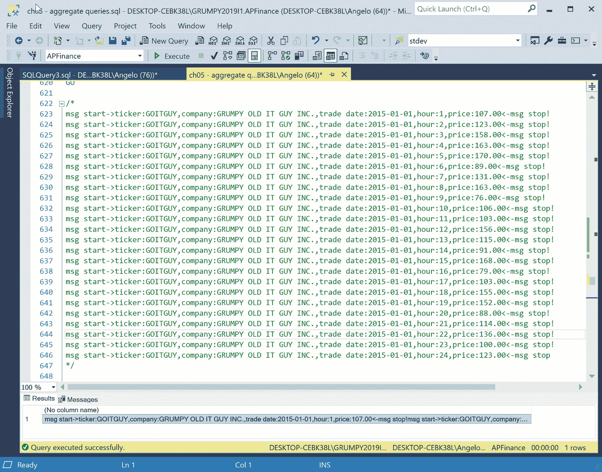

一张 c h 05 聚合查询 s q l 的截图。上半屏显示一些编程代码。下半屏显示结果和消息。

**图 5-40** 符号 GOITGUY 的二十四小时股票代码价格

结果是一个长字符串，内嵌了回车/换行符。我将结果复制到查询窗格中，并在周围添加了一些注释，以便你能看到结果。

我们不会进行任何性能分析，因为这基本上是一次大型表扫描。由于我们有一个按日期过滤的 `WHERE` 子句，我们可以很容易得出结论：该列需要索引。

如果该表存储了数千个跨越数十年的股票代码符号，那么就需要在符号和交易日期上建立聚集索引。

### STDEV() 和 STDEVP() 函数

回想一下第 2 章，`STDEV()` 函数在整体数据未知或不可用时，计算一组值的统计标准差。

再回想一下，`STDEVP()` 函数在数据集的整体数据已知时，计算统计标准差。这很容易记住；它的名称末尾有一个大写的“P”。

这意味着数据集中的数字与算术 `MEAN`（平均值的另一种说法）的接近或远离程度。在我们的上下文中，平均值或 `MEAN` 是所讨论的所有数据值之和除以数据值的数量。还有其他类型的 `MEAN`，如几何平均值、调和平均值和加权 `MEAN`，这些在附录 B 中讨论。

语法与我们目前介绍的其他函数类似：

```
STDEV(ALL|DISTINCT ) and STDEVP(ALL|DISTINCT )
```

当你开始使用 `OVER()` 子句生成结果时，乐趣就开始了。我们将看两个例子，一个使用 `APFinance` 数据库中的测试数据，另一个虽然也是测试数据但只有 12 行，这样我们可以了解如何解释信息并创建一个有趣的图表，称为钟形曲线。

我们也将图表化我们的财务数据结果，但由于财务交易的剧烈波动，我们将看到一个相当有趣且怪异的图！

以下是分析师给我们的业务需求：

创建一个报告，显示月度交易总额以及部分数据和完整数据集可用时的标准差（提示：使用 `STDEVP`）。结果将针对，你猜对了，客户 C0000001，John Smith，以及 2012 日历交易年。显示年份、季度和月份。报告需要标识客户投资组合。我目前只对商品投资组合感兴趣，但你构建的查询可以扩展到报告其他投资组合。最后，根据结果生成 Microsoft Excel 电子表格图表。

研究需求后，下面的列表是我们编写的代码。

```
WITH PortfolioAnalysis (
TradeYear,TradeQtr,TradeMonth,CustId,PortfolioNo,Portfolio,MonthlyValue
)
AS (
SELECT Year                           AS TradeYear
,DATEPART(qq,SweepDate)         AS TradeQtr
,Month                          AS TradeMonth
,CustId
,PortfolioNo
,Portfolio
,SUM(Value)                          AS MonthlyValue
FROM Financial.Portfolio
WHERE Year > 2011
GROUP BY CustId
,PortfolioNo
,Year
,Month
,SweepDate
,Portfolio
)
SELECT TradeYear
,TradeQtr
,TradeMonth
,CustId
,PortfolioNo
,Portfolio
,MonthlyValue
,SUM(MonthlyValue) OVER(
PARTITION BY Portfolio
ORDER BY Portfolio,TradeMonth
) AS RollingMonthlyValue
,STDEV(MonthlyValue) OVER(
PARTITION BY Portfolio
ORDER BY Portfolio,TradeMonth
) AS RollingMonthlyStdev
,STDEVP(MonthlyValue) OVER(
PARTITION BY Portfolio
ORDER BY Portfolio,TradeMonth
) AS RollingMonthlyStdevp
FROM PortfolioAnalysis
WHERE TradeYear = 2012
AND CustId = 'C0000001'
AND Portfolio = 'CASH - FINANCIAL PORTFOLIO'
ORDER BY CustId,Portfolio,TradeYear,TradeQtr,TradeMonth
GO
```

**清单 5-15** 投资组合标准差分析

我们又回到了使用我们的老朋友 `CTE`。日期中的年份、季度和月份部分与客户和投资组合信息一起被提取出来。价值按年份、月份和结算日期进行汇总。

请注意，结果是针对现金投资组合的，因此从技术上讲，你不需要在 `PARTITION BY` 子句中指明投资组合。下载脚本，尝试将其注释掉，然后再加回来。另外在 `WHERE` 子句谓词中添加另一个投资组合名称。那时 `PARTITION BY` portfolio 就会起作用。让我们看看这个查询生成的报告。

请参考下图的结果。

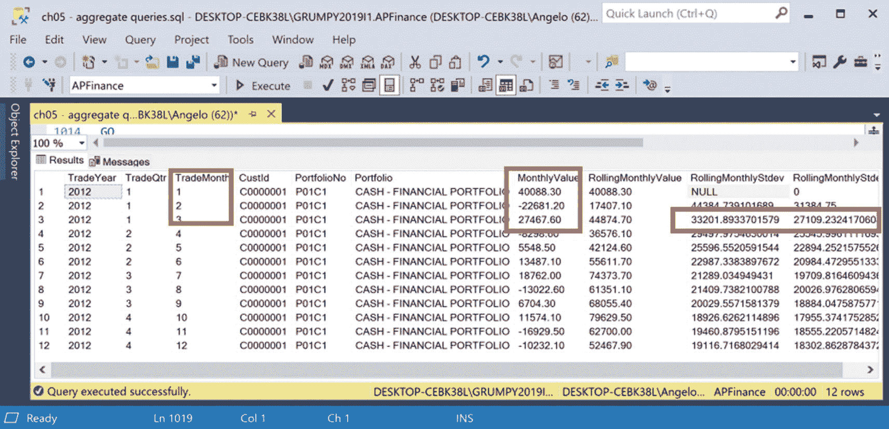


c h 0 5 聚合查询 s q l 的截图。屏幕上半部分展示了一些编程代码。屏幕下半部分展示了一个有 9 列的结果表。列 `trade month`、`monthly value` 和 `rolling monthly s t d e v` 的一些值在框中高亮显示。

## 图 5-41

## 投资组合标准差分析

观察前三个月，我们看到了 `monthly value`、`rolling total value` 以及两个标准差值。结果随着每个月的滚动而更新。请注意，第一组标准差值分别是 `NULL` 和 0 (`STDEV()` 和 `STDEVP()`)。

至少 `STDEVP()` 给了我们一个零！

尝试修改 `WHERE` 子句如下：

```sql
WHERE TradeYear IN(2012,2013)
AND CustId = 'C0000001'
AND Portfolio IN (
    'CASH - FINANCIAL PORTFOLIO',
    'EQUITY - FINANCIAL PORTFOLIO'
)
```

这次第一行的值有了实际金额。有意思。更多数据会这样吗？

让我们将原始结果复制粘贴到 Microsoft Excel 中，并生成如图 5-42 所示的图表。

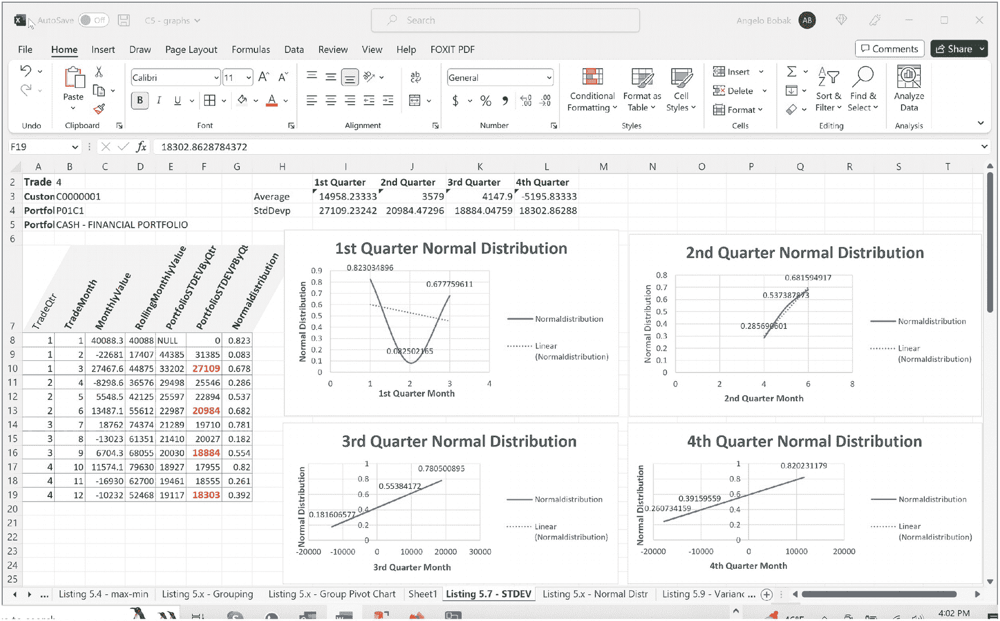

一张 Microsoft Excel 电子表格的截图。左侧表格有 7 列。右侧屏幕展示了第一季度正态分布、第二季度正态分布、第三季度正态分布和第四季度正态分布的折线图。

## 图 5-42

## 季度正态分布曲线

要为标准差值生成图表，你需要计算正态分布。我发挥了一点创意，生成了四张图表，每季度一张。我使用每个季度最后一个月的平均值和标准差值进行正态分布计算，即第 3、6、9 和 12 个月的数值。

第一张第一季度的图表看起来像一个倒置的钟形曲线——其余的图表则不那么像。本电子表格可在本章代码存放的网站上获取。下载该电子表格，分析其工作原理，然后创建你自己的查询，例如生成六个月间隔或整年的钟形曲线。

清单 5-16 是另一个使用一些预置数据生成更传统正态分布钟形曲线的示例。

```sql
DECLARE @TradeYearStdev TABLE (
    TradeYear            SMALLINT      NOT NULL,
    TradeQuarter         SMALLINT      NOT NULL,
    TradeMonth           SMALLINT      NOT NULL,
    CustId               VARCHAR(32)   NOT NULL,
    PortfolioNo          VARCHAR(32)   NOT NULL,
    Portfolio            VARCHAR(64)   NOT NULL,
    MonthlyValue         DECIMAL(10,2) NOT NULL
);
INSERT INTO @TradeYearStdev VALUES
('2012','1','1','C0000001','P01C1','COMMODITY - FINANCIAL PORTFOLIO','13862.80'),
('2012','1','2','C0000001','P01C1','COMMODITY - FINANCIAL PORTFOLIO','14629.50'),
('2012','1','3','C0000001','P01C1','COMMODITY - FINANCIAL PORTFOLIO','15568.90'),
('2012','2','4','C0000001','P01C1','COMMODITY - FINANCIAL PORTFOLIO','17004.80'),
('2012','2','5','C0000001','P01C1','COMMODITY - FINANCIAL PORTFOLIO','18064.90'),
('2012','2','6','C0000001','P01C1','COMMODITY - FINANCIAL PORTFOLIO','18500.30'),
('2012','3','7','C0000001','P01C1','COMMODITY - FINANCIAL PORTFOLIO','17515.00'),
('2012','3','8','C0000001','P01C1','COMMODITY - FINANCIAL PORTFOLIO','16779.50'),
('2012','3','9','C0000001','P01C1','COMMODITY - FINANCIAL PORTFOLIO','15576.00'),
('2012','4','10','C0000001','P01C1','COMMODITY - FINANCIAL PORTFOLIO','15941.60'),
('2012','4','11','C0000001','P01C1','COMMODITY - FINANCIAL PORTFOLIO','14208.80'),
('2012','4','12','C0000001','P01C1','COMMODITY - FINANCIAL PORTFOLIO','13804.30');
SELECT TradeYear
      ,TradeQuarter
      ,TradeMonth
      ,CustId
      ,PortfolioNo
      ,Portfolio
      ,MonthlyValue
      ,AVG(MonthlyValue) OVER(
      ) AS PortfolioAvg
      ,STDEVP(MonthlyValue) OVER(
      ) AS PortfolioStdevp
FROM @TradeYearStdev
ORDER BY CustId
        ,TradeYear
        ,TradeMonth
        ,PortfolioNo
GO
-- 清单 5-16
-- 设置示例 - 第 1 部分
```

正如我提到的，数据 (`MonthlyValue`) 是预置的，因此它会为正态分布生成一个漂亮的钟形曲线。我通过使用一些硬编码的 `INSERT` 语句将数据加载到表变量中来设置测试数据。

注意 `AVG()` 和 `STDEVP()` 函数的 `OVER()` 子句。我想要为每个函数生成一个单一值，这样我们就可以为 12 个月的样本数据生成一个图表。这意味着每个正态分布都使用相同的平均值和标准差值。唯一变化的是月度值。这是 Excel 公式：`=NORM.DIST(C8,$I$3,$I$4,TRUE)`。

单元格 `BC8` 代表一月份的 `MonthlyValue`，`$I$3` 引用代表整个年度数据样本的平均值，`$I$4` 单元格引用代表整个年度的 `STDEVP()` 值。

注意

单元格引用中行和列坐标前面的美元符号 ($) 表示，当你将其用于其他月份时，该引用永远不会改变。总金额的单元格引用会改变以反映每个新行。

让我们看看这个钟形曲线是什么样子。请参阅图 5-43 中绘制的正态分布结果。

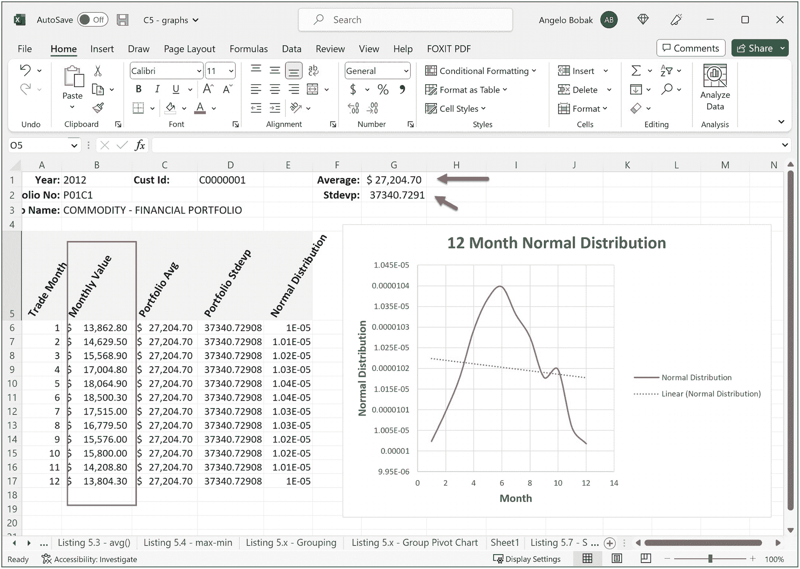

一张 Microsoft Excel 电子表格的截图。左侧表格有 5 列，分别是 `trade month`、`monthly value`、`portfolio average`、`portfolio s t d e v p` 和 `normal distribution`。右侧屏幕展示了 12 个月正态分布的折线图。

## 图 5-43

## 十二个月正态分布曲线

看起来更像意大利的阿尔卑斯山，但这是由数据生成的、更易识别的钟形曲线。这当然是预置的数据，但看起来投资在年中之前呈上升趋势，之后每个月都下降，直到年底。

一位优秀的分析师会问为什么会发生这种情况。我确信我们的客户约翰·史密斯想知道！是时候进行绩效分析了。


#### 性能考量

这次，在我们的性能分析中，我们将深入探讨 `PROFILE` 统计数据，并将其与图形化估计查询计划中出现的任务进行比较。这可能会有点深入细节，但值得付出努力，因为您将掌握大量信息，这些信息将协助您进行性能分析工作。请记住，您需要在执行查询前执行以下命令来生成 profile 统计数据（别忘了关闭它）：

```
SET STATISTICS PROFILE ON
GO
```

> 注意
> 
> 在本次讨论中，请参考图 5-44a 到图 5-44h。

像往常一样，我们首先以通常的方式生成一个估计查询计划。首先，我们检查那些具有高成本的节点。记住，在估计执行计划中，我们从右向左开始。

请参考图 5-44a。

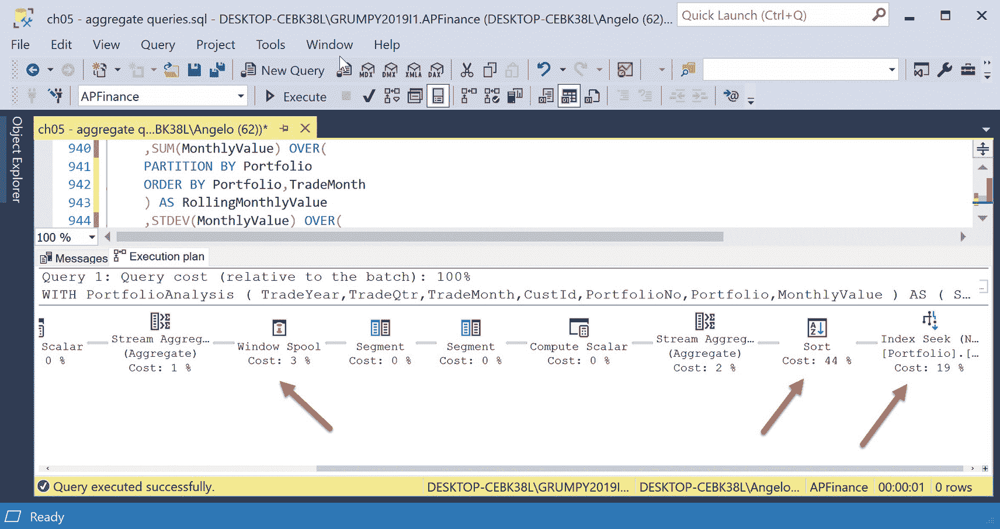

图 5-44a
标准差查询的估计执行计划

因篇幅所限未显示的是计划最左侧的一个排序任务，其成本为 33%，但我们稍后会讨论它。

有四个高成本任务：
*   一个索引查找，成本 19%
*   第一个排序任务，成本 44%
*   窗口假脱机任务，成本 3%
*   第二个排序任务，成本 33%

我们可以通过将鼠标悬停在节点上，让带有统计数据的弹出提示面板出现，来查看每个节点的 `PROFILE` 统计数据。

请参考图 5-44b。

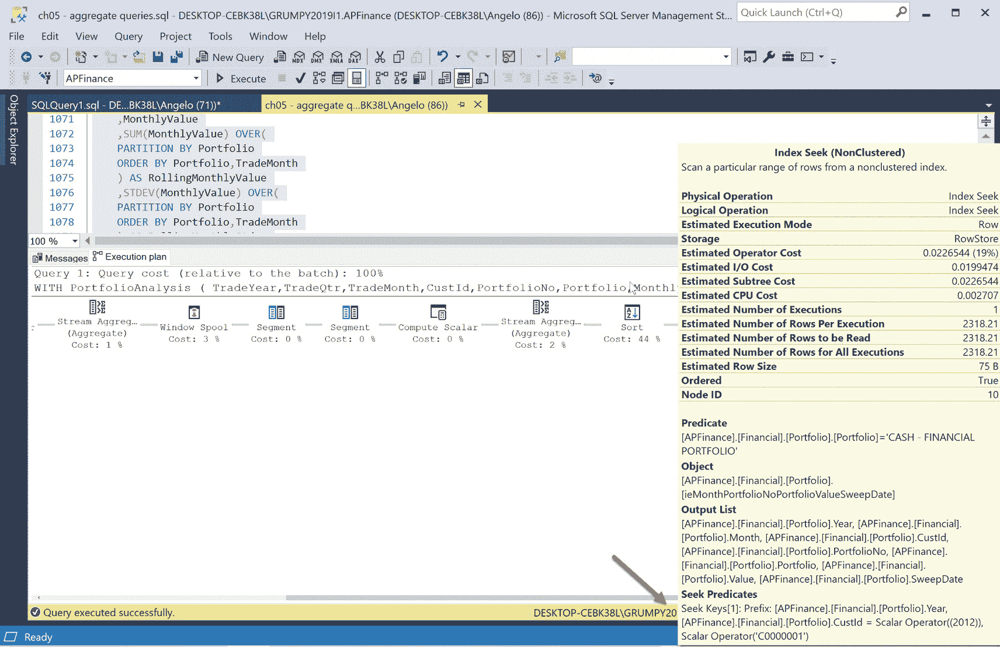

图 5-44b
索引查找节点的 profile 统计数据

这个索引查找是由 `WHERE` 子句谓词引起的。如果您查看节点中的列，它们与 `WHERE` 子句谓词中的列相匹配。这被称为覆盖索引，正如我们之前所说，索引查找通常比索引扫描更受青睐。

作为验证，如果我们查看名为 statement text 的 `PROFILE` 统计数据输出列，我们看到

```
--Index Seek(OBJECT:(
[APFinance].[Financial].[Portfolio].
[ieMonthPortfolioNoPortfolioValueSweepDate]),
SEEK:(
[APFinance].[Financial].[Portfolio].[Year]=(2012)
AND [APFinance].[Financial].[Portfolio].[CustId]='C0000001'
),
WHERE:([APFinance].[Financial].[Portfolio].[Portfolio]
='CASH - FINANCIAL PORTFOLIO')
ORDERED FORWARD
)
```

读起来有点晦涩，但我们可以清楚地看到驱动索引查找的 `WHERE` 子句。

接下来，让我们看看那个昂贵的 44% 排序。

请参考图 5-44c。

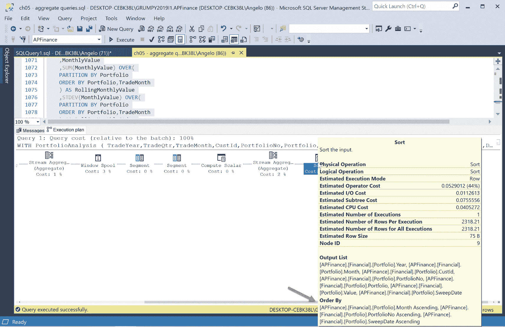

图 5-44c
排序步骤的 profile 统计数据

查看 profile 统计数据输出，它告诉我们排序是按月份、投资组合编号和清算日期进行的：

```
--Sort(ORDER BY:(
[APFinance].[Financial].[Portfolio].[Month] ASC,
[APFinance].[Financial].[Portfolio].[PortfolioNo] ASC,
[APFinance].[Financial].[Portfolio].[SweepDate] ASC
)
)
```

此排序是索引查找的输出。

如果我完全移除 `WHERE` 子句，排序参数看起来会是这样。请参考图 5-44d。

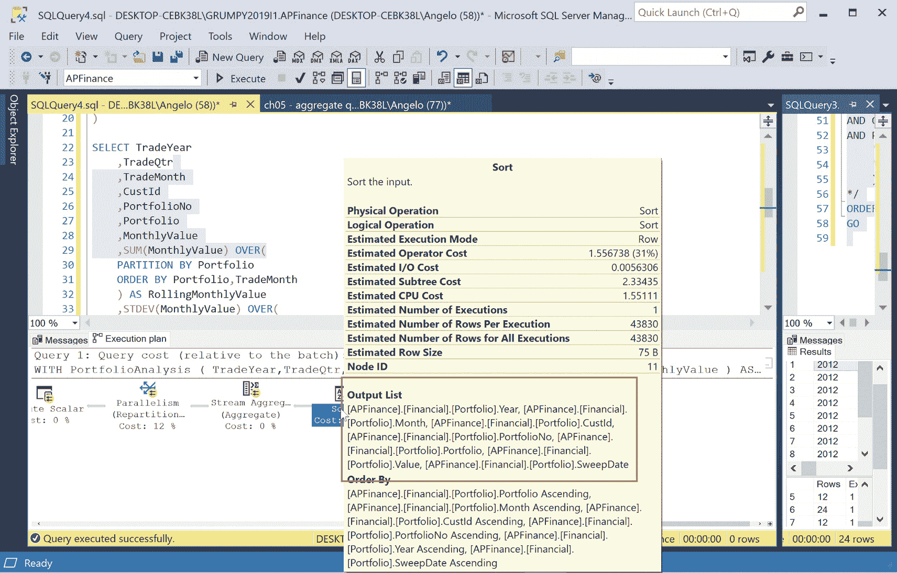


`c h 0 5 aggregate queries s q l` 的一个截图。屏幕上半部分展示了一些编程代码。下半部分展示了消息和执行计划。一个弹出面板显示了排序操作的性能剖析统计信息。输出列表在一个方框内高亮显示。

**图 5-44d**

### 如果移除 `WHERE` 子句后的排序提示

注意现在排序中包含的额外列。

接下来是流聚合步骤。我没有生成此步骤的截图，但它用于通过 `CTE` 查询中的 `SUM()` 函数来生成总和：

```
--Stream Aggregate(
    GROUP BY:([APFinance].[Financial].[Portfolio].[Month],
        [APFinance].[Financial].[Portfolio].[PortfolioNo],
        [APFinance].[Financial].[Portfolio].[SweepDate])
    DEFINE:([Expr1003]=SUM([APFinance].[Financial].[Portfolio].[Value]),
        [APFinance].[Financial].[Portfolio].[CustId]
        =ANY([APFinance].[Financial].[Portfolio].[CustId]),
        [APFinance].[Financial].[Portfolio].[Year]=
        ANY([APFinance].[Financial].[Portfolio].[Year]),
        [APFinance].[Financial].[Portfolio].[Portfolio]
        =ANY([APFinance].[Financial].[Portfolio].[Portfolio])
    )
)
```

尽管 `CTE` 的 `GROUP BY` 包含以下列

```
GROUP BY CustId,PortfolioNo,Year,Month,SweepDate,Portfolio
```

但它只按月份、投资组合和排序日期进行排序，因为我们在 `WHERE` 子句中按年份和客户进行了筛选。

和之前一样，如果我移除 `CTE` 中的 `GROUP BY` 子句，此步骤会被修改以包含缺失的列：

```
|--Stream Aggregate(
    GROUP BY:(
        [APFinance].[Financial].[Portfolio].[Portfolio],
        [APFinance].[Financial].[Portfolio].[Month],
        [APFinance].[Financial].[Portfolio].[CustId],
        [APFinance].[Financial].[Portfolio].[PortfolioNo],
        [APFinance].[Financial].[Portfolio].[Year],
        [APFinance].[Financial].[Portfolio].[SweepDate]
    )
    DEFINE:([Expr1003]=SUM([APFinance].[Financial].[Portfolio].[Value])))
```

> **提示**
>
> 请确保只在 `GROUP BY`、`ORDER BY`、`OVER()` 和 `WHERE` 子句中包含你需要的列，以提高性能，并确保优化器不必执行额外的工作来忽略不需要的列。

接下来是开销占比 3% 的窗口假脱机任务，由默认的 `RANGE` 子句生成。

请参阅图 5-44e。

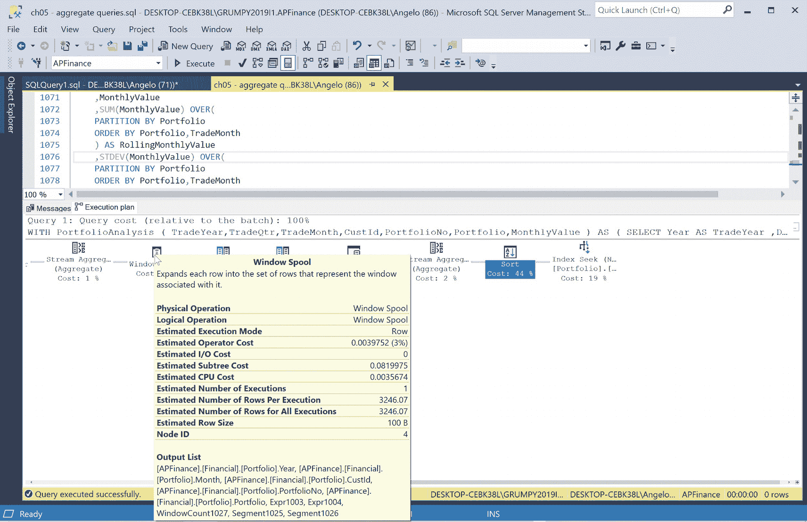

`c h 0 5 aggregate queries s q l` 的一个截图。屏幕上半部分展示了一些编程代码。下半部分展示了消息和执行计划。一个弹出面板显示了窗口假脱机的性能剖析统计信息。

**图 5-44e**

### 窗口假脱机的性能剖析统计信息

回顾我们之前的讨论，窗口假脱机任务用于将需要重复处理的行加载到内存或临时存储中。在我们的案例中，这是由 `OVER()` 子句生成的，具体来说是默认的 `RANGE` 子句。

这是用来计算总和与标准差值的。如果我们查看查询，`OVER()` 子句中的 `ORDER BY` 子句按投资组合和月份排序。请查看图 5-44f 中窗口假脱机的性能剖析统计信息详情。

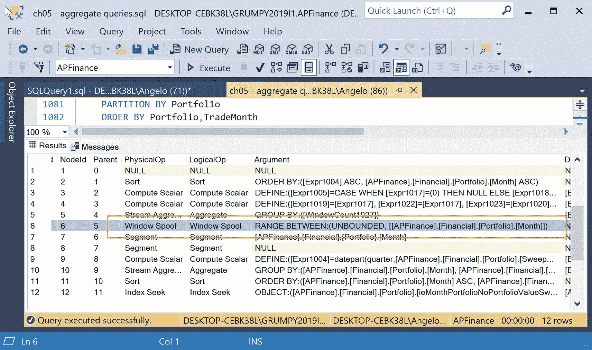

`c h 0 5 aggregate queries s q l` 的一个截图。屏幕上半部分展示了一些编程代码。下半部分展示了结果和消息表。一行窗口假脱机性能剖析统计信息高亮显示。

**图 5-44f**

### 窗口假脱机性能剖析统计信息详情

当 `OVER()` 子句中包含 `PARTITION BY` 和 `ORDER BY` 子句时，窗口假脱机显示了默认行为：

```
RANGE BETWEEN:([UNBOUNDED,[[APFinance].[Financial].[Portfolio].[Month]])
```

等等。我之前说过 `ORDER BY` 子句是按投资组合和月份排序的。嗯，由于 `WHERE` 子句筛选出的行只涉及一个投资组合，即 `现金 - 财务投资组合`，那么这个列就不需要了。我再次从查询中移除了 `WHERE` 子句，这次性能剖析统计信息中的参数值是

```
|--Window Spool(RANGE BETWEEN:(UNBOUNDED, [
    [APFinance].[Financial].[Portfolio].[CustId],
    [APFinance].[Financial].[Portfolio].[Year],
    [APFinance].[Financial].[Portfolio].[Portfolio],
    [APFinance].[Financial].[Portfolio].[Month]
    ])
)
```

现在这告诉我们，需要谨慎设置分区定义。仅通过筛选现金投资组合，我不需要包含按投资组合分区的 `PARTITION BY` 子句，并且 `ORDER BY` 子句应该只引用 `TradeMonth` 列。

由于你可能希望此查询能在多个客户、投资组合和年份上运行，那么你需要在分区定义中包含客户、投资组合和年份列。请确保你理解想要处理的内容；否则，你可能会添加不必要的代码，从而拖慢性能。

以下是你可能想尝试的写法：

```
,STDEV(MonthlyValue) OVER(
    PARTITION BY CustId, TradeYear,Portfolio
    ORDER BY CustId, TradeYear,Portfolio,TradeMonth
) AS RollingMonthlyStdev
```

最后，我们查看查询计划中最后一个排序任务。请参阅图 5-44g。

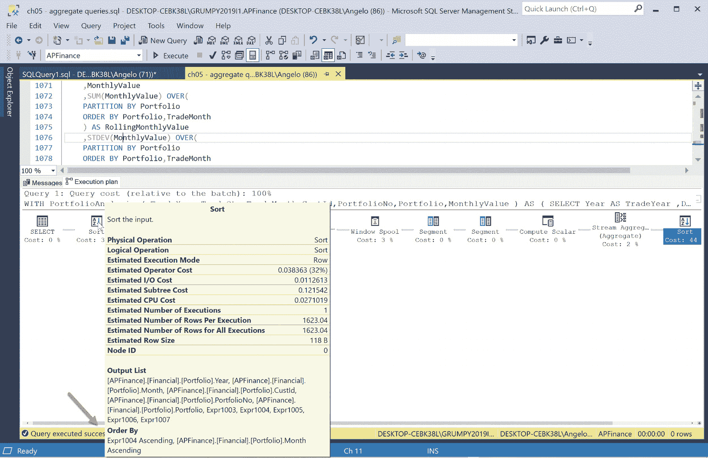

`c h 0 5 aggregate queries s q l` 的一个截图。屏幕上半部分展示了一些编程代码。下半部分展示了消息和执行计划。一个弹出面板显示了排序的性能剖析统计信息。

**图 5-44g**

### 查询计划中的最终排序任务

这个最后的任务按以下列对数据流进行排序，并对应于分区中出现的 `ORDER BY` 子句。因为只有一个投资组合，所以未包含投资组合列：

```
--Sort(
    ORDER BY:([Expr1004] ASC,
        [APFinance].[Financial].[Portfolio].[Month] ASC
    )
)
```

如果我修改查询中的 `WHERE` 子句，以便筛选两年、两个客户和两个投资组合，如下所示

```
FROM PortfolioAnalysis
WHERE TradeYear IN(2012,2013)
AND CustId IN('C0000001','C00000012')
AND Portfolio IN (
    'CASH - FINANCIAL PORTFOLIO',
    'EQUITY - FINANCIAL PORTFOLIO'
)
ORDER BY CustId,Portfolio,TradeYear,TradeQtr,TradeMonth
GO
```

`PROFILE` 统计信息 `StmtText` 列中的排序字符串会被修改以表示新的列：

```
--Sort(
    ORDER BY:(
        [APFinance].[Financial].[Portfolio].[CustId] ASC,
        [APFinance].[Financial].[Portfolio].[Portfolio] ASC,
        [APFinance].[Financial].[Portfolio].[Year] ASC,
        [Expr1004] ASC,
        [APFinance].[Financial].[Portfolio].[Month] ASC)
)
```

让我们总结一下这个函数的分析。我们将分析推进了几步，但可以看到，我们能够获得关于正在发生什么的有价值洞察。另外请注意两个重要因素：

*   图形化的估计查询计划是从右向左读的（我们已经知道这一点）。

*   `PROFILE` 统计信息是从上往下读的，因此性能剖析统计信息中的最后一行语句对应于估计查询计划中最右侧的任务。

*   估计查询计划和 `PROFILE` 统计信息之间的节点 ID 不对应。例如，在 `PROFILE` 统计信息输出中，索引寻道的 `NodeId` 是 12，但在估计查询计划提示中，它的节点 ID 是 10！

这如图 5-44h 所示。

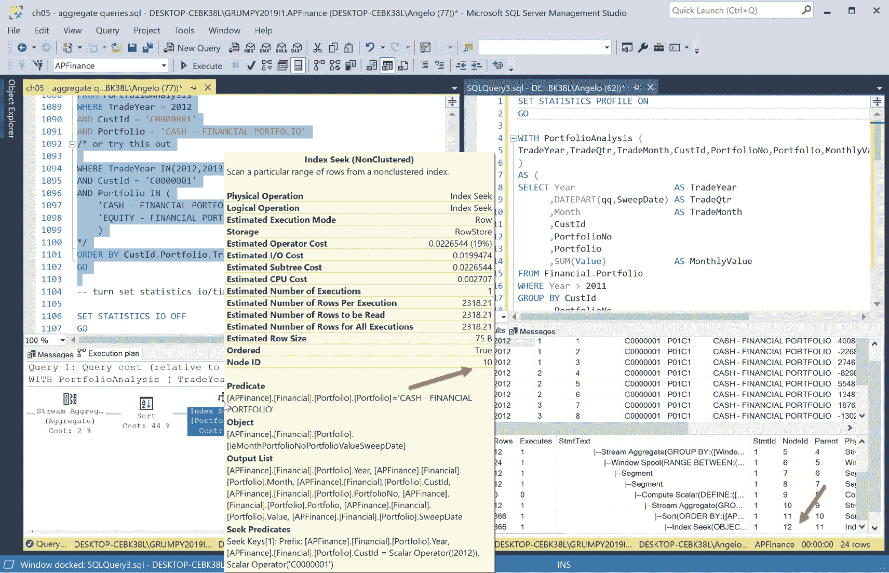

`c h 0 5 aggregate queries s q l` 的一个截图。屏幕上半部分展示了一些编程代码。下半部分展示了消息和执行计划。一个弹出面板显示了索引寻道的性能剖析统计信息。

**图 5-44h**

### 如何解读 `PROFILE` 统计信息与估计查询计划的对比

可以看到，从上到下阅读 `PROFILE` 统计信息对应于从左到右阅读估计查询计划中的任务（如果这还不够令人困惑的话）。

那么，所有这些分析带给了我们什么？


