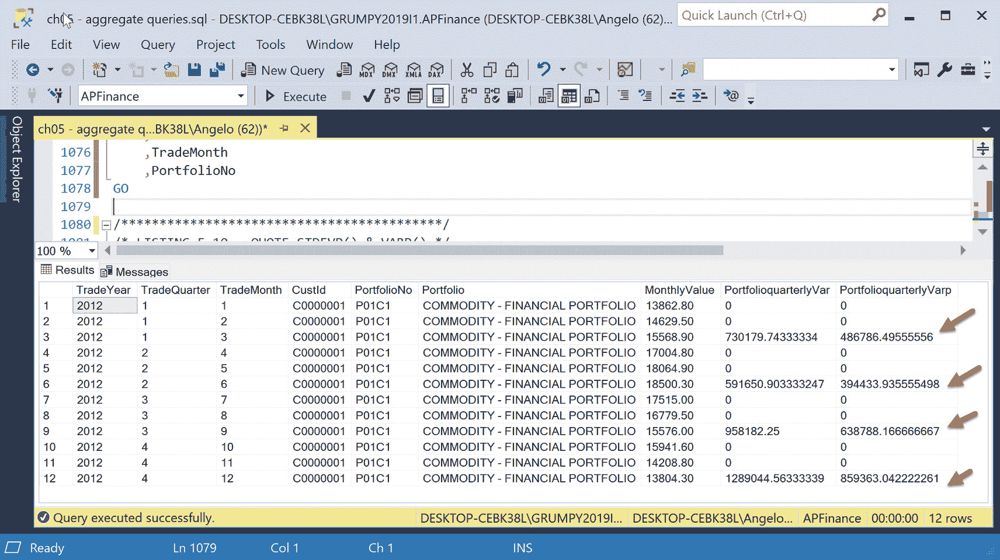
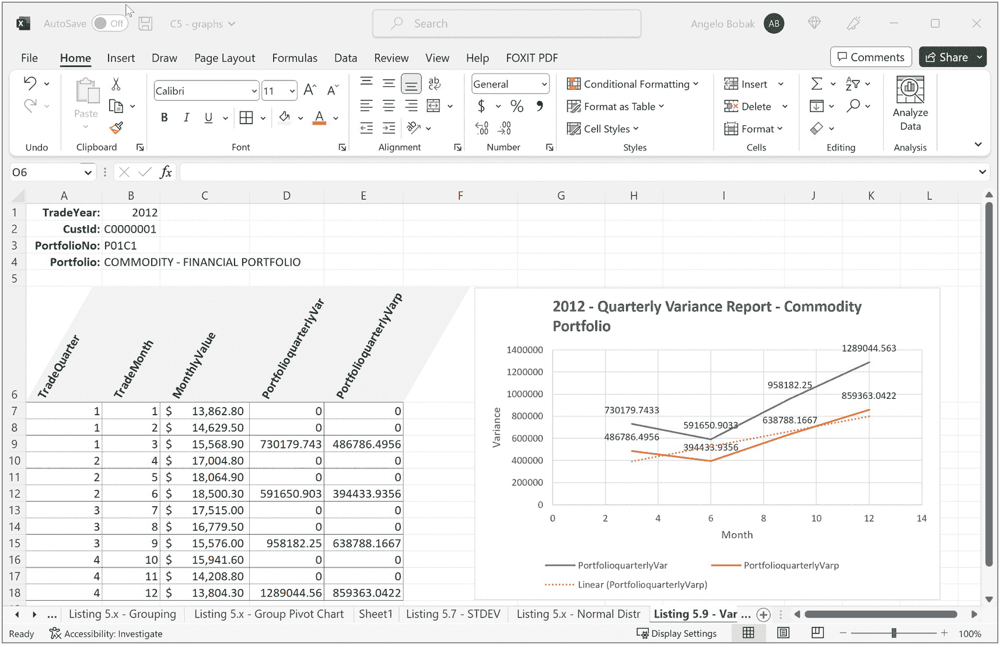
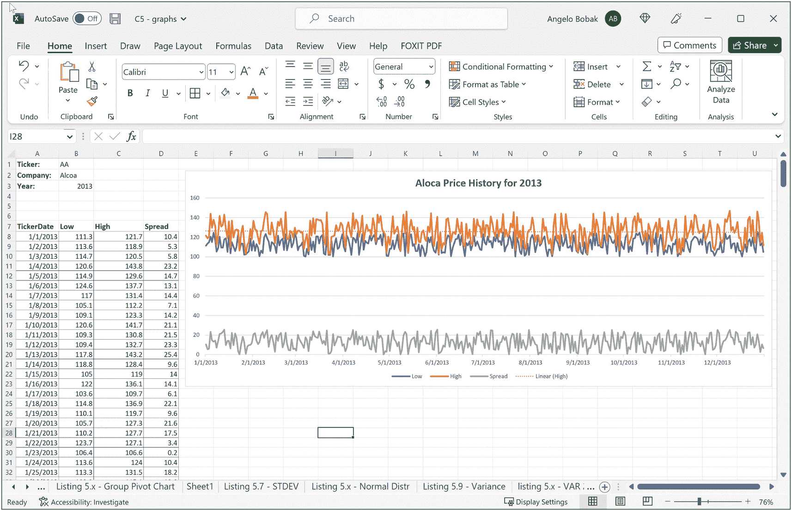
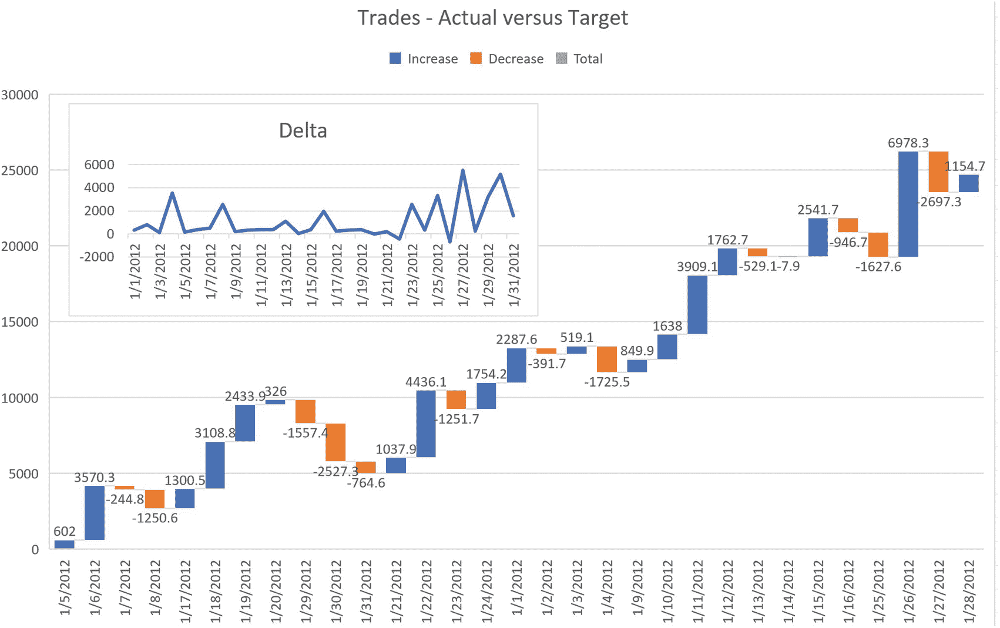

# SQL Server 性能调优与方差函数

SQL Server 在估算查询计划并推荐正确的索引方面表现相当不错。但如果性能仍然是个问题，我们就需要深入这些细节，并决定采取其他措施，比如创建反规范化报表表或重写查询。我们甚至不会涉及增加内存或使用更快磁盘等硬件考量。这是一个性能调优主题，其内容足以成为一整本关于性能调优的书。

实践并熟悉每个任务的作用，以及它如何对应于 `PROFILE` 统计中的条目，这样你就能确定可能需要采取哪些额外步骤来提高性能。

本章还有最后一个聚合函数需要讨论。

### VAR( ) 和 VARP( ) 函数

回想第 2 章，`VAR()` 和 `VARP()` 函数用于为数据样本中的一组值生成方差。与 `STDEV()/STDEVP()` 示例中使用的数据集相关的相同讨论，同样适用于 `VAR()` 和 `VARP()` 函数相对于数据总体的情况：

`VAR()` 函数在无法知道或获得完整数据集时，对数据的部分集合进行计算，而 `STDEVP()` 函数在已知整个数据总体时对其进行计算。

对于我们开发人员来说，一个更简单的解释是：

非正式地说，如果你取每个值与均值（平均值）的所有差值，对结果进行平方，然后将所有结果相加，最后除以数据样本的数量，你就得到了方差。

对于我们的场景，假设我们有一些数据，预测了我们某个投资组合在特定年份的股票业绩目标。我们想看看实际收益与预测的接近或偏离程度。它回答了以下问题：

- 我们是否**未达到**我们的目标投资目标？
- 我们是否**达到了**我们的目标投资目标？
- 我们是否**超过了**我们的目标投资目标？

这些函数生成的数据可以用于统计报告和 Microsoft Excel 图表中，以回答这些问题。

其语法与其他函数相同：

```
VAR(ALL|DISTINCT ) 和 VARP(ALL|DISTINCT )
```

但需要注意的一点是：如果你将它们与 `OVER()` 子句一起使用，则不允许使用 `DISTINCT`！

请参考清单 5-17。

```
DECLARE @TradeYearStdev TABLE (
TradeYear            SMALLINT      NOT NULL,
TradeQuarter         SMALLINT      NOT NULL,
TradeMonth           SMALLINT      NOT NULL,
CustId               VARCHAR(32)   NOT NULL,
PortfolioNo          VARCHAR(32)   NOT NULL,
Portfolio            VARCHAR(64)   NOT NULL,
MonthlyValue         DECIMAL(10,2) NOT NULL
);
INSERT INTO @TradeYearStdev VALUES
('2012','1','1','C0000001','P01C1','COMMODITY - FINANCIAL PORTFOLIO','13862.80'),
('2012','1','2','C0000001','P01C1','COMMODITY - FINANCIAL PORTFOLIO','14629.50'),
('2012','1','3','C0000001','P01C1','COMMODITY - FINANCIAL PORTFOLIO','15568.90'),
('2012','2','4','C0000001','P01C1','COMMODITY - FINANCIAL PORTFOLIO','17004.80'),
('2012','2','5','C0000001','P01C1','COMMODITY - FINANCIAL PORTFOLIO','18064.90'),
('2012','2','6','C0000001','P01C1','COMMODITY - FINANCIAL PORTFOLIO','18500.30'),
('2012','3','7','C0000001','P01C1','COMMODITY - FINANCIAL PORTFOLIO','17515.00'),
('2012','3','8','C0000001','P01C1','COMMODITY - FINANCIAL PORTFOLIO','16779.50'),
('2012','3','9','C0000001','P01C1','COMMODITY - FINANCIAL PORTFOLIO','15576.00'),
('2012','4','10','C0000001','P01C1','COMMODITY - FINANCIAL PORTFOLIO','15941.60'),
('2012','4','11','C0000001','P01C1','COMMODITY - FINANCIAL PORTFOLIO','14208.80'),
('2012','4','12','C0000001','P01C1','COMMODITY - FINANCIAL PORTFOLIO','13804.30');
SELECT TradeYear
,TradeQuarter
,TradeMonth
,CustId
,PortfolioNo
,Portfolio
,MonthlyValue
-- 当有 3 行数值时生成值
,CASE
WHEN TradeMonth % 3 = 0 THEN
VAR(MonthlyValue) OVER(
PARTITION BY TradeQuarter
ORDER BY TradeMonth
ROWS BETWEEN 2 PRECEDING AND CURRENT ROW
)
ELSE 0
END AS PortfolioquarterlyVar
,CASE
WHEN TradeMonth % 3 = 0 THEN
VARP(MonthlyValue) OVER(
PARTITION BY TradeQuarter
ORDER BY TradeMonth
ROWS BETWEEN 2 PRECEDING AND CURRENT ROW
)
ELSE 0
END AS PortfolioquarterlyVarp
FROM @TradeYearStdev
ORDER BY CustId
,TradeYear
,TradeMonth
,PortfolioNo
GO
```
清单 5-17
设置示例

我们将首先声明一个表变量来存储一些月度投资组合头寸。我们包含了交易年份、季度和月份，以及客户 ID、投资组合编号和名称，以及月度账户头寸。

该表变量加载了 12 行数据，每个月一行。我特意分配了金额，这些金额在年中之前逐月增加，之后开始下降。

基于此值生成方差报告的查询很有趣。它使用 `CASE` 块仅为每个季度最后一个月生成方差。取模运算符用于测试数值月份是否能被 3 整除。这样我们就为三月、六月、九月和十二月报告方差。

接下来，在 `OVER()` 子句中，使用 `TradeQuarter` 列定义了一个分区，并按 `TradeMonth` 列对分区进行排序。

最后，整个查询结果按客户 ID、交易年份、交易月份和投资组合编号排序。让我们看看执行此查询后报告的样子。

请参考图 5-45。



图 5-45
2012 年季度投资组合方差

我们可以看到每隔三个月的方差值。注意所有其他方差均为 0。使用这些数据，我们将其复制并粘贴到 Microsoft Excel 电子表格中进行绘图。

请参考图 5-46。



图 5-46
季度方差报告和图表

经过一些巧妙的复制粘贴和在 Microsoft Excel 中的重新格式化，我们得到了一份很好的方差报告，其中只显示季度方差值。`VAR` 和 `VARP` 都呈上升趋势。


## 股票代码分析

让我们对一种名为美国铝业的金融工具进行一些统计分析。其股票代码是 `AA`。

具体要求是报告 2012 年的最低低价、最高低价、最低高价和最高高价。请参考清单 5-18。

```sql
SELECT QuoteYear
,QuoteQtr
,QuoteMonth
,QuoteWeek
,Ticker
,Company
,TickerDate
,[Low]
,[High]
,MIN([Low]) OVER(
PARTITION BY QuoteYear,QuoteQtr,QuoteMonth,[QuoteWeek],[Ticker]
ORDER BY [Low]
ROWS BETWEEN UNBOUNDED PRECEDING AND UNBOUNDED FOLLOWING
) AS MinLow
,MAX([Low]) OVER(
PARTITION BY QuoteYear,QuoteQtr,QuoteMonth,[QuoteWeek],[Ticker]
ORDER BY [Low]
ROWS BETWEEN UNBOUNDED PRECEDING AND UNBOUNDED FOLLOWING
) AS MaxLow
,MIN([High]) OVER(
PARTITION BY QuoteYear,QuoteQtr,QuoteMonth,[QuoteWeek],[Ticker]
ORDER BY [High]
ROWS BETWEEN UNBOUNDED PRECEDING AND UNBOUNDED FOLLOWING
) AS MinHigh
,MAX([High]) OVER(
PARTITION BY QuoteYear,QuoteQtr,QuoteMonth,[QuoteWeek],[Ticker]
ORDER BY [High]
ROWS BETWEEN UNBOUNDED PRECEDING AND UNBOUNDED FOLLOWING
) AS MaxHigh
FROM [MasterData].[TickerPriceRangeHistoryDetail]
WHERE Ticker = 'AA'
AND QuoteYear = 2012
ORDER BY Ticker
,QuoteYear
,QuoteQtr
,QuoteMonth
,QuoteWeek
,Company
,TickerDate
GO
```
清单 5-18
美国铝业股票代码分析

我们想建立一个按年、季、月、周和股票代码的分区。对于最低成交价，我们按 `Low` 列对分区进行排序；对于最高成交价，我们按 `High` 列对分区进行排序。

一个窗口框架由以下定义：

```sql
ROWS BETWEEN UNBOUNDED PRECEDING AND UNBOUNDED FOLLOWING
```

这个逻辑不仅能让我们看到每日的低点和高点，还能看到每周的最小值和最大值。

将结果复制并粘贴到 Microsoft Excel 电子表格中，会得到一张非常有趣的图表。请参考图 5-47。



Microsoft Excel 电子表格的截图。左侧的表格有日期、低价、高价和价差 4 列。右侧屏幕显示了一条折线图，展示了美国铝业 2013 年的价格历史。

图 5-47
美国铝业 2012 年的低价、高价和价差分析

底部的价差线也显示了该金融工具价格的波动性。顺便说一句，所有这些价格都是我编造的，所以它们并不代表美国铝业的实际业绩。

### 更多非统计方差

如果我们想看两个特定数值点之间的距离怎么办，比如想比较当前账户余额与目标账户预期余额？我们是达到了目标还是没达到？没有什么比图表更能直观地指出这些信息了。接下来的例子不会使用计算统计方差的 `VAR()` 和 `VARP()` 函数。我们希望用老式的方法，利用结果来绘制每对实际值与预计值之间的距离图表。

这个技术，结合前面例子中使用的 `VAR()` 和 `VARP()` 函数，将为业务分析师提供一套强大的报告和图表，用来衡量投资组合和账户绩效。

首先，我们需要建立测试环境。我们将创建一个名为 `AccountVersusTarget` 的表，并用一些测试用的实际余额与预测余额（也是编造的）来填充它。

请参考清单 5-19。

```sql
TRUNCATE TABLE [Financial].[AccountVersusTarget]
GO
INSERT INTO [Financial].[AccountVersusTarget]
SELECT [CustId]
,[PrtfNo]
,[AcctNo]
,[AcctName]
,[AcctTypeCode]
,[AcctBalance]
,[PostDate]
,CASE
WHEN [AcctBalance] < 0 THEN (ABS([AcctBalance]) * 1.05)
WHEN [AcctBalance] BETWEEN 500 AND 1000 THEN [AcctBalance] * 1.25
WHEN [AcctBalance] BETWEEN 1001 AND 2000 THEN [AcctBalance] * 1.20
WHEN [AcctBalance] BETWEEN 2001 AND 3000 THEN [AcctBalance] * 1.15
WHEN [AcctBalance] BETWEEN 3001 AND 4000 THEN [AcctBalance] * 1.10
ELSE [AcctBalance] * .90
END AS TargetBalance,
(
CASE
WHEN [AcctBalance] < 0 THEN  (ABS([AcctBalance]) * 1.05)
WHEN [AcctBalance] BETWEEN 500 AND 1000 THEN [AcctBalance] * 1.25
WHEN [AcctBalance] BETWEEN 1001 AND 2000 THEN [AcctBalance] * 1.20
WHEN [AcctBalance] BETWEEN 2001 AND 3000 THEN [AcctBalance] * 1.15
WHEN [AcctBalance] BETWEEN 3001 AND 4000 THEN [AcctBalance] * 1.10
ELSE [AcctBalance] * .90
END
) - [AcctBalance] AS Delta
FROM [APFinance].[Financial].[Account]
GO
```
清单 5-19
创建一个账户预测表

我们使用了几个 `CASE` 代码块来创建一些随机的预测值，以及实际余额与预测余额之间的差值。账户信息从 `Account` 表中检索并插入到我们的新表中。

清单 5-20 是我们将用于分析的查询。

```sql
SELECT [CustId]
,YEAR([PostDate])  AS PostYear
,MONTH([PostDate]) AS PostMonth
,[PostDate]
,[PrtfNo]
,[AcctNo]
,[AcctName]
,[AcctTypeCode]
,[AcctBalance]
,[TargetBalance]
,[Delta]
FROM [Financial].[AccountVersusTarget]
WHERE [CustId] = 'C0000001'
AND [PrtfNo] = 'P01C1'
AND [AcctName] = 'EQUITY'
AND YEAR([PostDate]) = '2012'
AND MONTH([PostDate]) = 1
GO
```
清单 5-20
实际与预测账户余额查询

这是一个非常简单的查询。我们选择了我们的老朋友，客户 `C0000001`（John Smith），并使用一些过滤器来查看他投资组合中 2012 年 1 月份的权益账户。查询中没有其他花里胡哨的东西。所见即所得。

结果请参考图 5-48。


一张标题为 “ch_05_aggregate_queries_sql” 的截图。屏幕上半部分显示了一些程序代码。下半部分显示了结果和消息，其中有一个名为 “messages” 的表格。

图 5-48
John Smith 的实际余额与预测余额

一切看起来都正确。我们将结果复制并粘贴到 Microsoft Excel 电子表格中，以便创建一个漂亮的图表。请参考图 5-49。



一张截图展示了一条折线图和一个正负柱状图。折线图绘制了实际值与预测值的差值报告。柱状图比较了增长额、减少额和总额。

图 5-49
2012 年 1 月实际与预测差值报告

在我看来，这个图表很强大。增长额用蓝色表示，减少额用橙色柱表示。我叠加了第二个图表来显示当月实际余额的趋势。因此，即使没有使用 `OVER()` 子句和分区功能强大的聚合函数，我们也能够为业务分析师创建一份强大的报告。


