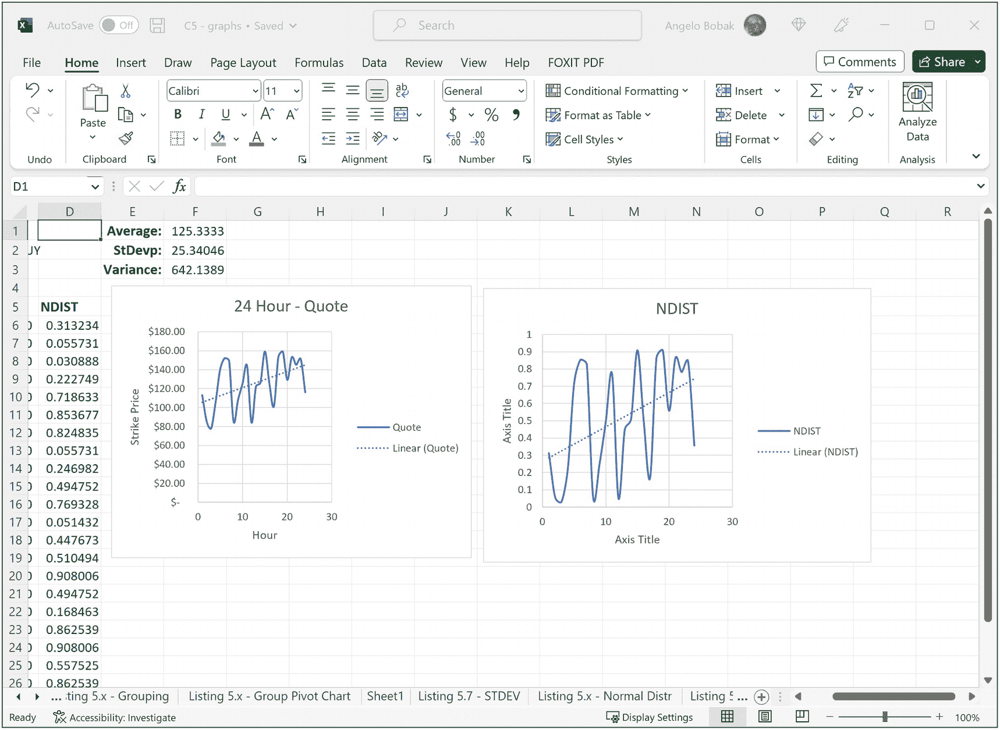
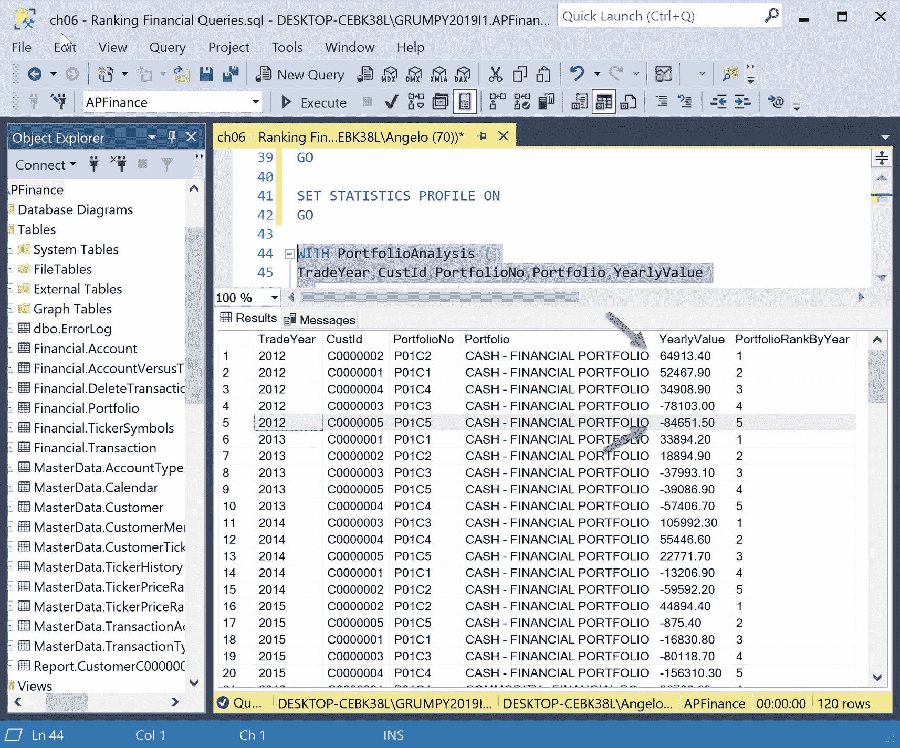
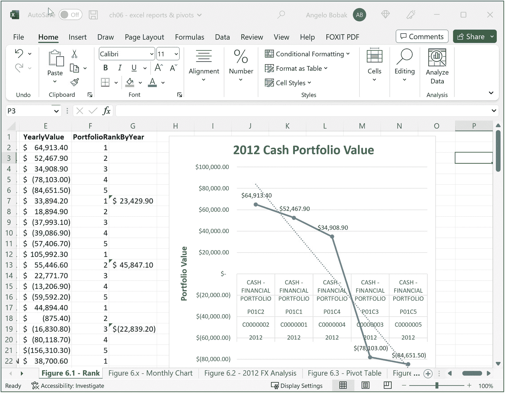

# 6. 金融用例：排名函数

## 更多的统计方差

让我们再尝试一个例子。我们回头看看一些股票代码的表现。让我们再用几个聚合函数来获取 `GOITGUY` 股票代码的快照。这次我们想看看 2015 年 1 月 5 日 24 小时内的价格波动，并生成总体平均值、整个数据总体的标准差以及整个数据总体的方差（假设该股票在全球范围内 7 天 24 小时交易）。

请参见清单 5-21。

```sql
SELECT [Ticker]
,[Company]
,[TickerDate]
,[QuoteHour]
,[Quote]
,AVG(Quote) OVER(
) AS AvgQuote
,STDEVP(Quote) OVER(
) AS TickerSTDEVP
,VARP(Quote) OVER(
) AS TickerVARP
FROM [APFinance].[MasterData].[TickerHistory]
WHERE TickerDate = '2015-01-05'
GO
清单 5-21
更多漂亮的钟形曲线
```

这次查询非常简单。由于我们只查看 24 小时的数据，所有函数的 `OVER()` 子句都是空的，没有 `PARTITION BY` 或 `ORDER BY` 子句。

小测验

当 `OVER()` 子句中未使用 `PARTITION BY` 或 `ORDER BY` 子句时，默认的窗口框架行为是什么？

执行查询产生图 5-50 中的输出，我们用它来填充 Excel 电子表格，以便创建我们惯用的杰作图表！



Microsoft Excel 电子表格的截图。它展示了两幅行权价与小时的关系图。左图展示了变动报价和线性报价。右图展示了变动的 `N DIST` 和线性的 `N DIST`。

图 5-50

更多漂亮的钟形曲线

非常好。我们有两张图。一张显示了该股票 24 小时的价格波动，该日呈上升趋势，这是好事。另一张显示了钟形曲线，或者我应该说，使用 24 小时价格的正态分布值创建的钟形曲线。

我们可以看到，有时我们需要使用聚合窗口函数，有时则使用普通查询。结合起来，我们可以生成有价值的报告和查询，展示金融投资组合以及个股或其他类型金融工具的表现。

这些报告和图表为金融顾问提供了他们所需的工具，不仅可以分析过去的历史表现，还可以预测未来的走势。我们的讨论中唯一缺失的是股价涨跌期间发生的事件，比如公司是否向市场推出了新产品，或者公司的某些产品是否出了问题，或者经济是面临上行还是下行。如果当前新闻和指标告诉我们这些事件即将再次发生，我们就可以很好地猜测是卖出、买入还是按兵不动！

管理金融投资组合需要考虑很多因素，但有了合适的工具，就可以做出决策以避免严重损失，甚至可能赚上几块钱！

遗憾的是，我的策略似乎总是高买低卖！

### 总结

我们在本章中完成了许多工作。我们像在第 2 章中一样，探讨了聚合窗口函数，但这次是使用金融数据。我们还更详细地研究了性能分析，并引入了一些新工具，例如 `SET PERFORMANCE ON` 命令，该命令会生成关于估算查询计划生成所需报告所采取步骤的详细信息。

最后，我们使用 Microsoft Excel 生成了多张不同的图表，这些图表利用了我们的查询产生的数据，为我们提供了一些有趣的视觉信息和模式，使我们深入了解账户、投资组合、股票代码以及金融交易的表现。

接下来，我们将此方法应用于排名窗口函数。

## 排名函数

排名函数应用于金融数据时，可以为分析师或投资组合经理产生有趣且有价值的信息。这些信息用于基于历史模式预测未来的交易模式。一个基于扎实分析数据和分析的、妥善管理的投资组合将（希望如此）产生利润。

本章将涵盖此类函数在几个有趣示例中的应用，范围涵盖从交易到账户、投资组合和股票代码的表现分析。我们将生成 Excel 图表，并通过使用 SQL Server 提供的几种性能调优工具，更深入地研究性能调优。

### 排名函数

以下是属于排名函数类别的四个函数：

*   `RANK()`
*   `DENSE_RANK()`
*   `NTILE()`
*   `ROW_NUMBER()`

我们第一次看到这些函数是在第 4 章，当时我们将它们应用于销售场景。这次我们将它们应用于一个名为 `APFinance` 的金融数据库。我们采用的方法将与其他章节类似，但我们将通过引入新工具（如 `SET PERFORMANCE STATISTIC ON` 设置）来更深入地研究性能调优，该设置会生成与执行计划的每个步骤相关的重要统计信息。此外，我们还将比较估算查询性能计划与实际查询性能计划，后者显示实时计时和行移动统计信息。

我们还将使用 Microsoft Excel 生成一些有趣的图表，这些图表利用了我们的脚本和查询生成的数据。这些图表与 SQL 报告相结合，将使我们深入了解为五个客户模拟的交易模式。这被称为数据可视化。

本章最后介绍 `ROW_NUMBER()` 函数和我们涵盖的其他函数的一些有趣应用，以解决许多分析项目中出现的传统的间隙与孤岛问题。

### RANK( ) 函数

回想第 4 章，`RANK()` 函数显示数据集中每行列中的值相对于数据集中其他行值的排名。如果出现并列，则并列值的排名相同，但重复值之后的下一个值会跳过下一个排名，并分配一个等于并列数量加上当前排名值的数字。我们将在第一个示例中演示这种行为。


#### 示例 1

我们的首要目标是为客户的投资组合表现进行排名。我们的业务分析师已提供了报告的业务规范。它需要按交易年度、客户标识符、投资组合编号和投资组合名称显示客户投资组合的总价值。这些结果需要按年度为每位客户进行排名。数据可以有 24 小时的延迟，因为唯一的更新时间是在夜间账户结算时。仅这一事实就应指导我们如何构建解决方案（提示：使用 `CTE` 方法或报表表方法）。

这份报告将帮助分析师洞察每位客户相对于其他客户的表现情况。

请参考清单 6-1。

```
WITH PortfolioAnalysis (
TradeYear,CustId,PortfolioNo,Portfolio,YearlyValue
)
AS (
SELECT Year AS TradeYear
,CustId
,PortfolioNo
,Portfolio
,SUM(Value) AS YearlyValue
FROM Financial.Portfolio
WHERE Year > 2011
GROUP BY CustId,Year,PortfolioNo
,Portfolio
)
SELECT TradeYear
,CustId
,PortfolioNo
,Portfolio
,YearlyValue
,RANK() OVER(
PARTITION BY Portfolio,TradeYear
ORDER BY YearlyValue DESC
) AS PortfolioRankByYear
FROM PortfolioAnalysis
GO
```

清单 6-1
客户现金投资组合排名

`CTE` 用于生成包含按年度、客户 ID、投资组合编号和投资组合名称汇总的投资组合总价值的结果。

访问该 `CTE` 的查询使用了 `RANK()` 函数，该函数按投资组合编号和交易年度进行分区以生成排名。

请参考图 6-1 中的部分结果。



一个标题为“金融查询排名”的应用程序窗口截图。顶部有一个任务栏。左侧有一个用于对象资源管理器的面板。右侧包含一个列表，内容涉及交易年度、客户 ID、投资组合编号、投资组合、年度价值和按年度排列的投资组合排名。

图 6-1
客户现金投资组合表现排名

对于 2012 年，排名最高的现金投资组合属于客户 C0000002，其价值为 $64,913.40。这看起来不错，但我们的分析师想深入探究并理解其价值如此之高的原因。

是客户出售了大量金融工具吗？

是客户频繁存入现金账户，如支票账户或货币市场账户吗？

那位显示余额为 -$84,651.50 并在列表底部的客户 C0000005 怎么样？这是不良交易的结果吗？我们的分析师会以这份报告为起点，研究这些客户的交易模式以了解情况。

如果能再有一张基于此数据的漂亮图表来辅助分析就更好了。图 6-2 就是！



一个 Excel 表格的截图。它展示了年度价值和按年度排列的投资组合排名两列数据，以及一条显示 2012 年现金投资组合价值下降趋势的折线图。投资组合价值最高和最低的分别是 P01C1 和 P0C5。

图 6-2
客户现金投资组合表现图

确实存在下降趋势，但不仅仅是客户 C0000005，客户 C0000003 似乎也遇到了麻烦。添加一条趋势线还可以显示投资组合价值的变化方向，并能立即引起分析师的注意。

现在让我们将注意力转向客户 C0000001，看看他们的外汇投资组合。他们的现金投资组合看起来很稳固。我们来看看他们的外币投资组合表现如何。

简单的业务规范：我们的分析师要求一份报告显示按年度、月份汇总的投资组合总额，以及每个年度内各月份的外汇余额排名。当然，他们想要一张 Excel 图表，因此我们将为他们制作一张。最后，月份应使用三个字母的缩写拼写，而不是数字。

请参考清单 6-2。


