# SQL 查询分析：2012 年客户月度投资组合表现

```sql
SELECT Year AS TradeYear
,CASE
WHEN [Month] = 1 THEN 'Jan'
WHEN [Month] = 2 THEN 'Feb'
WHEN [Month] = 3 THEN 'Mar'
WHEN [Month] = 4 THEN 'Apr'
WHEN [Month] = 5 THEN 'May'
WHEN [Month] = 6 THEN 'Jun'
WHEN [Month] = 7 THEN 'Jul'
WHEN [Month] = 8 THEN 'Aug'
WHEN [Month] = 9 THEN 'Sep'
WHEN [Month] = 10 THEN 'Oct'
WHEN [Month] = 11 THEN 'Nov'
WHEN [Month] = 12 THEN 'Dec'
END AS Trademonth
,CustId
,PortfolioNo
,Portfolio
,SUM(Value) AS YearlyValue
,RANK() OVER(
ORDER BY SUM(Value) DESC
) AS PortfolioRankByMonth
FROM Financial.Portfolio
WHERE Portfolio = 'FX - FINANCIAL PORTFOLIO'
AND CustId = 'C0000001'
AND Year = 2012
GROUP BY CustId,Year,Month,PortfolioNo
,Portfolio
ORDER BY SUM(Value) DESC
GO
```

**代码清单 6-2** 客户 C0000001 2012 年月度余额

这是一个直接的查询，没有使用 `CTE`，它使用 `case` 代码块来显示月份缩写而不是数字。`SUM()` 函数没有使用 `OVER()` 子句，因为我们希望看到直接的总计数，而不是按月的滚动总计。`RANK()` 函数用于为每个月分配一个排名，以查看表现最好和最差的月份。

最后，包含了强制的 `GROUP BY` 子句，我们根据投资组合总计数按降序对结果进行排序。

注意刚刚提到的 `ORDER BY` 子句。我们真的需要它吗？我注释掉了这一行，重新执行了查询，并得到了相同的结果。结论：我们不需要它。这样的步骤可能会影响性能，因此请务必在查询计划中理解发生了什么。将它们并排运行在两个水平查询窗格中，以确保没有额外的步骤。

在这个特定的例子中，我做了分析，两个查询（一个有额外的 `ORDER BY`，一个没有）的查询计划和配置文件统计信息是相同的，因此性能没有受到影响。

我做了一个小改动，将 `OVER()` 子句中的排序顺序改为升序，并保留了将数据集按降序排序的查询 `ORDER BY` 子句，而第一个查询则没有包含最后的 `ORDER BY` 子句。正是在这里，性能出现了轻微下降，正如结果性能统计信息所示。请参阅图 6-3。

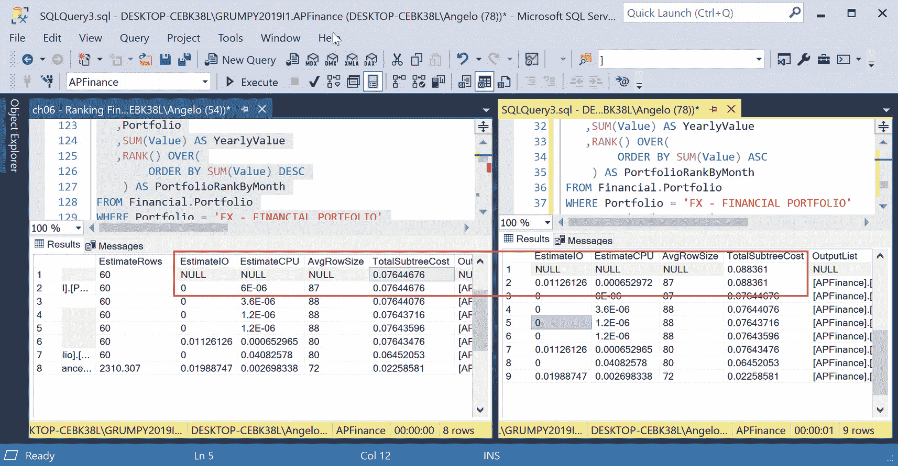

一个 SQL 应用程序的截图。它显示了一个获取金融投资组合的程序以及一个包含估计行数、空值和总子树成本的列表。

**图 6-3** 性能统计对比

看起来性能下降并不显著，但如果你的表有数百万行，这可能就成为问题了。注意那些小细节。它们可能对你造成很大的伤害！

让我们回到查询，看看结果是什么样的。请参阅图 6-4。

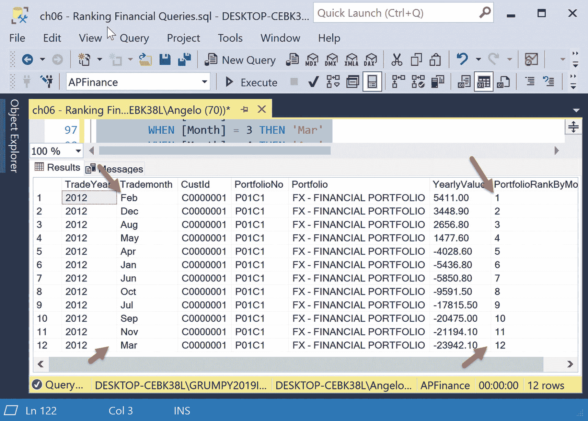

一个名为“金融查询排名”的 SQL 应用程序的截图。它显示了一个包含 12 个交易年份、交易月份、客户 ID、投资组合编号、投资组合、年度价值和按月排名的投资组合的列表。投资组合排名 1 和 12 用两个箭头标出。

**图 6-4** 客户 C0000001 2012 年月度余额报告

我们看到二月份的结果最好，但数值似乎波动很大，三月份的值最低。让我们获取这些数据并生成我们通常的图表。

请参阅图 6-5。

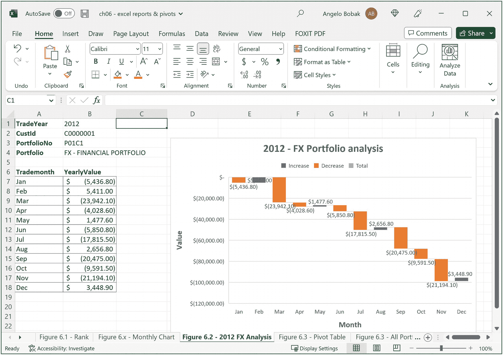

一个 Excel 工作表的截图。左侧是一个包含两列（交易月份和年度价值）的列表。右侧是一个柱状图，显示了 2012 年 FX 投资组合分析中价值与月份的关系。

**图 6-5** 客户 C0000001 2012 年月度余额图表

这次结果按月份升序排列，我们看到一个明显的下降趋势。这需要调查一下。这个投资组合中有大量的买卖操作。这是恐慌性抛售还是获利了结？

#### 性能考量

让我们回到第一个查询，使用估计的查询执行计划进行一些性能分析。

请参阅图 6-6。

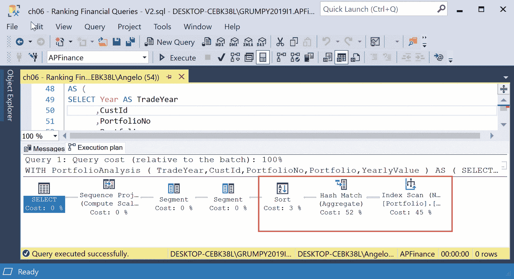

一个名为“金融查询排名”的 SQL 应用程序的截图。它显示了一个程序，用于查找客户 ID、投资组合编号以及一个包含选择、序列项目、2 个段、排序、哈希匹配和索引扫描成本的表格。排序、哈希匹配和索引扫描成本被高亮显示。

**图 6-6** 第一个查询的估计查询计划

从右向左阅读，我们看到一个昂贵的索引扫描和随后的哈希匹配聚合任务，后者同样昂贵，成本为 52%。索引被扫描，输出进入哈希表，以便与来自 `Portfolio` 表本身的行进行匹配。这些行也被放入哈希桶中，匹配的行被传递给排序任务。

> **注意**
> 将鼠标指针悬停在此任务和其他任务上以显示提示面板，其中包括该任务的简短说明。对于你不了解其作用的任务，请这样做！

为了改进此查询的性能，我们至少需要消除哈希匹配任务。回想一下，数据可以是 24 小时前的，因此一个可能的解决方案是用使用相同查询加载的表替换 `CTE`。

这正是我们将要尝试的。请参阅代码清单 6-3。

```sql
TRUNCATE TABLE Financial.DailyPortfolioAnalysis
GO
INSERT INTO Financial.DailyPortfolioAnalysis
SELECT Year AS TradeYear
,CustId
,PortfolioNo
,Portfolio
,SUM(Value) AS YearlyValue
FROM Financial.Portfolio
GROUP BY CustId,Year,PortfolioNo
,Portfolio
ORDER BY Portfolio ASC,Year ASC, SUM(Value) DESC
GO
SELECT TradeYear,
CustId,
PortfolioNo,
Portfolio,
YearlyValue,
RANK() OVER(
PARTITION BY Portfolio,TradeYear
ORDER BY YearlyValue DESC
) AS PortfolioRankByYear
FROM Financial.DailyPortfolioAnalysis
WHERE TradeYear > 2011
GO
```

**代码清单 6-3** 加载投资组合扫描表

假设 `INSERT` 命令每天运行一次，那么分析师只需要对加载的报告表执行查询。我们看到该查询本质上是历史性的，因此每次运行查询时重新生成整个历史数据集是没有意义的。

如果我们现在为每个版本的查询运行估计的查询计划，我们会看到以下结果。请参阅图 6-7。

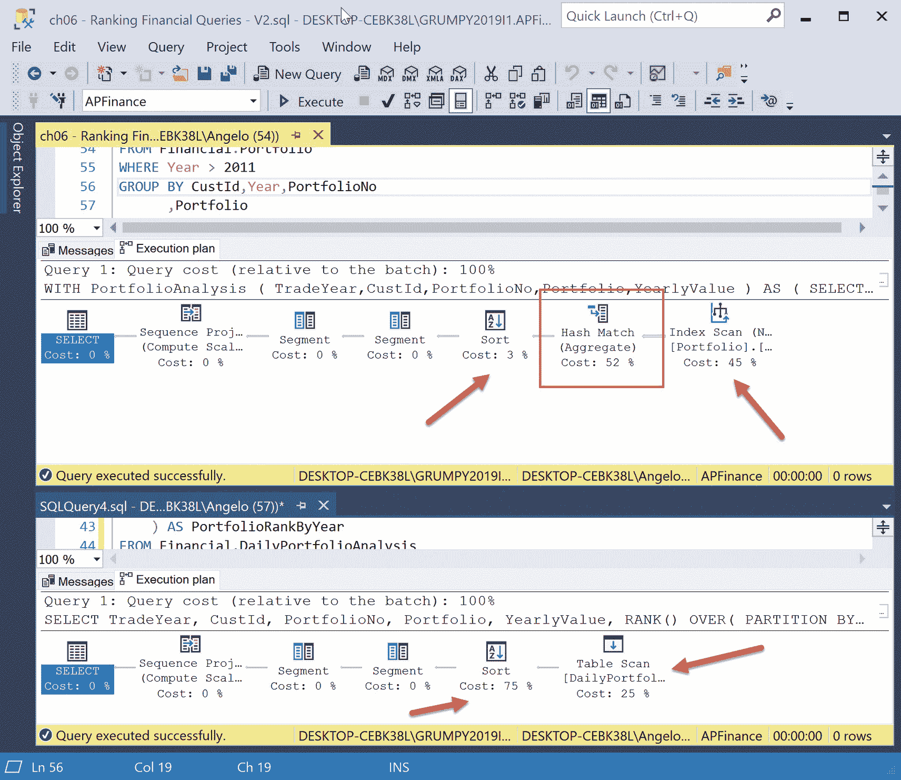

一个名为“金融查询排名”的 SQL 应用程序的截图。在顶部和底部的两个选项卡中，都有一个表格用于查找选择、序列项目、2 个段、排序、哈希匹配和索引的查询成本。哈希匹配成本为 52%。75% 和 25% 的成本分别用于排序和表扫描。

**图 6-7** 查询计划对比

注意，昂贵的表哈希匹配任务消失了。我们确实看到了一个成本为 25% 的表扫描任务，但这是一个小表，只有 120 行，因此不需要索引。排序很昂贵，占 75%，但看看表扫描和排序步骤之间的连线。它们非常细，如果你点击它们，你会看到有 120 行被传递进行排序。

> **注意**
> 运行实时查询性能计划将显示任务之间传递的行数以及每个任务完成所需的时间。在查询运行时，按下带绿色对勾的按钮将生成实时计划。

在第一个版本的估计执行计划中，索引扫描向哈希匹配任务传递了 43,830 行，而该任务向排序任务传递了 600 行。看起来这个策略奏效了！

让我们比较一下 `IO` 和 `TIME` 统计信息。请参阅图 6-8。

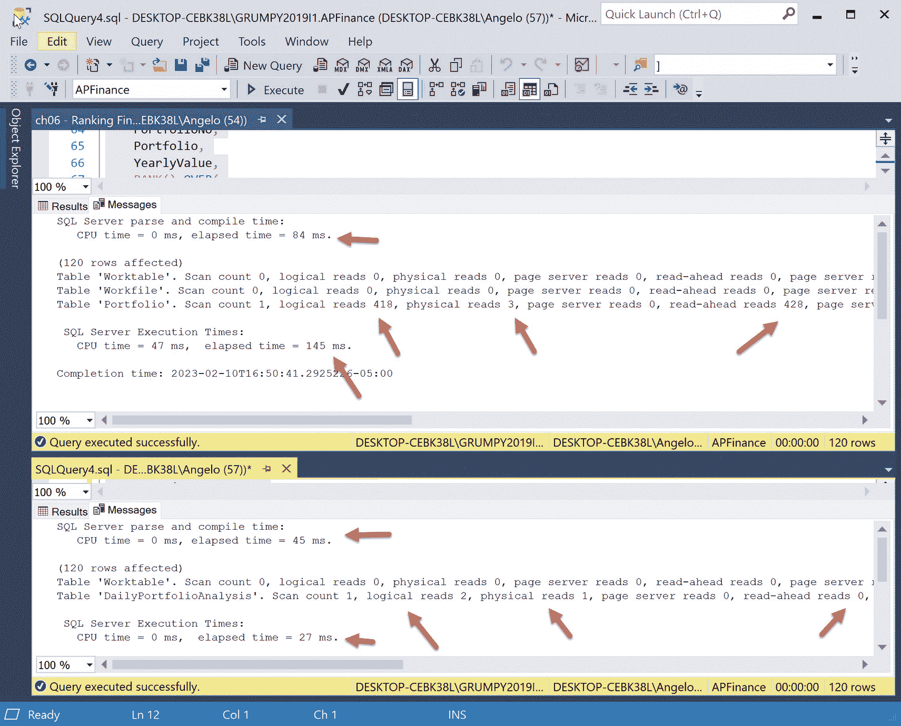


一张 `SQL` 应用程序的截图。它展示了一个用于查找 `IO` 和时间统计信息的程序。它还展示了诸如 84、145、45 和 27 毫秒等耗时。

**图 6-8**  
`IO` 和 `TIME` 统计信息

让我们从比较解析和执行时间开始：

对于 `SQL Server` 的解析和编译时间，`CTE` 查询的耗时为 84 毫秒，而报告表策略为 45 毫秒。

对于 `SQL Server` 的执行时间，`CTE` 查询的耗时为 145 毫秒，而报告表策略为 27 毫秒。

接下来看看 `IO` 统计信息。请参考表 6-1。

**表 6-1**  
`IO` 统计信息比较

| 步骤 | CTE 查询 | 报告查询 |
| --- | --- | --- |
| 扫描计数 | 1 | 1 |
| 逻辑读取 | 418 | 2 |
| 物理读取 | 3 | 1 |
| 预读读取 | 428 | 0 |

结果不言自明。所有统计指标均有显著改善。那么概况统计信息呢？

请参考图 6-9。

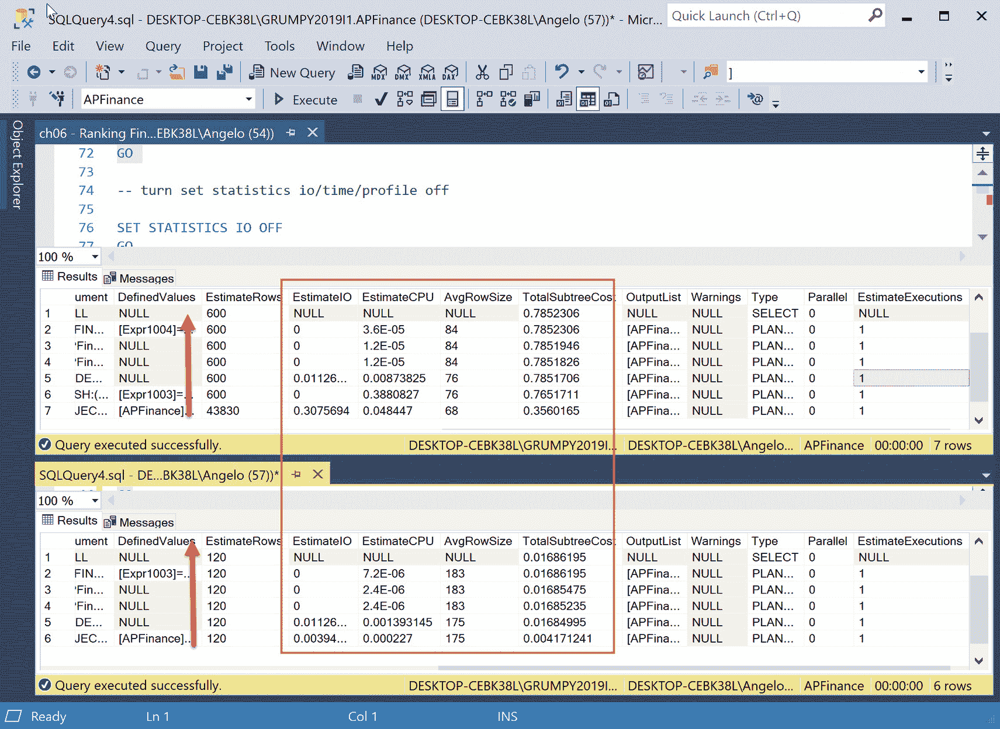

一张 `SQL` 应用程序的截图。它展示了一个程序，其中有一个表格，顶部有 7 行，底部有 6 行。它比较了两张表的定义值、`IO` 的估计行数、`CPU`、平均行大小以及子树总成本。

**图 6-9**  
概况统计信息比较

概况统计信息同样说明了问题。首先，查看计划各步骤之间传递的行数。改进后的性能策略需要处理的行数更少。如果我们检查 `EstimateIO`、`EstimateCPU` 和 `TotalSubTreeCost`，会发现报告表策略有显著的改进。关键要点是什么？

第一个要点是，理解业务需求不仅对于交付分析师想要的报告很重要，它还可能为我们如何改进性能提供线索。在我们的案例中，我们最终创建了报告表（每天加载一次），并使我们的基础报告查询更高效、更快速。

谁能想到呢？

最后一点：确保查询结果是相等的。如果一个解决方案更快但结果错误，那可能就有问题了！请参考图 6-10。

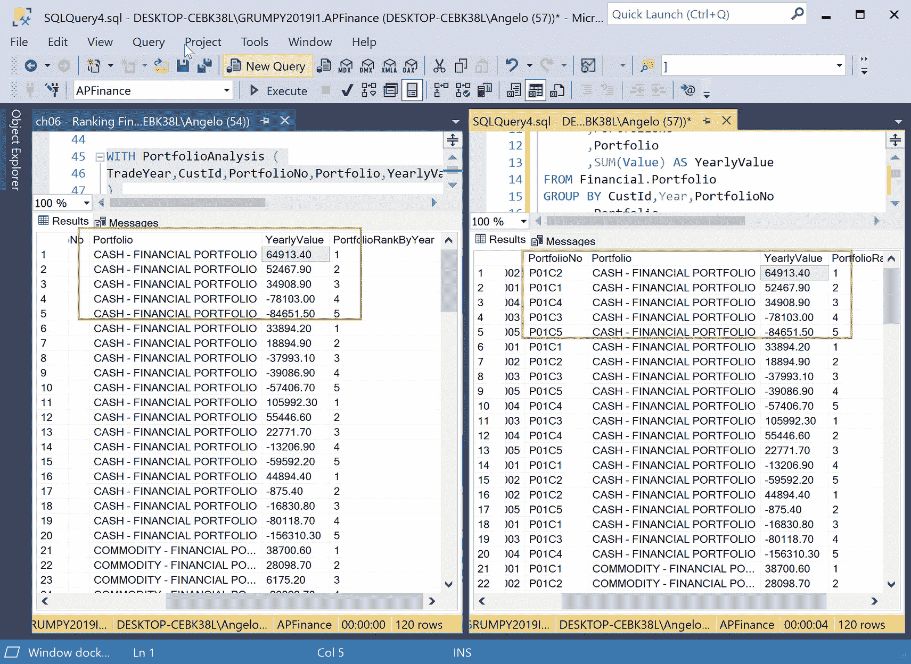

一张 `SQL` 应用程序的截图。它展示了程序，并在左右两个选项卡上比较查询结果。它将每个表的前 5 行与列标题（portfolio, yearly value, and portfolio rank by year）进行比较。

**图 6-10**  
查询结果比较

看起来不错！但请看右下角的时间参数。我们新的改进策略运行花了四秒钟。看到这个，我们应该运行几次测试，并确保每次运行查询时都执行 `DBCC` 命令——每个查询执行一次。如果原始查询似乎运行得更快，那么我们也许应该放弃新的改进策略！

让我们把注意力转回到分析投资组合上！

#### 示例 2

这次我们来看 `FX`（外汇）投资组合头寸。我们将再次查看客户 `C0000001` 在 2012 年的月度头寸。

请参考代码清单 6-4。

```sql
SELECT Year       AS TradeYear
,Month      AS Trademonth
,CustId
,PortfolioNo
,Portfolio
,SUM(Value) AS YearlyValue
FROM Financial.Portfolio
WHERE Portfolio = 'FX - FINANCIAL PORTFOLIO'
AND CustId = 'C0000001'
AND Year = 2012
GROUP BY CustId,Year,Month,PortfolioNo
,Portfolio
ORDER BY Month
GO
```
**代码清单 6-4**  
`FX` 账户深入分析

这是一个直接的查询。`SUM()` 聚合函数用于报告月度头寸。我们想了解当前状况。投资组合表现良好还是正在亏损？让我们看看结果。

请参考图 6-11。

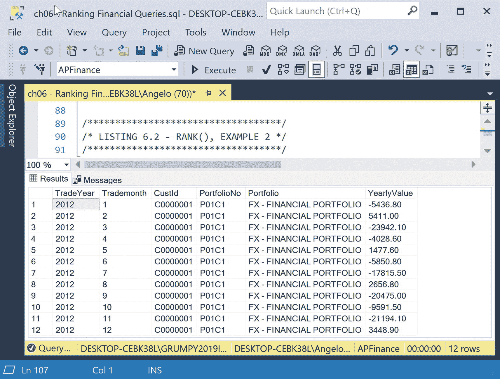

一张题为“金融查询排名”的 `SQL` 应用程序截图。它展示了一个程序和一个包含 12 行 6 列的列表。列标题分别是交易年份、交易月份、客户 ID、投资组合编号、投资组合和年度价值。

**图 6-11**  
2012 年月度 `FX` 头寸

看起来交易模式波动很大。有很多买入和卖出。图表将为我们提供一个更好的视觉指示器来了解情况。请参考图 6-12。

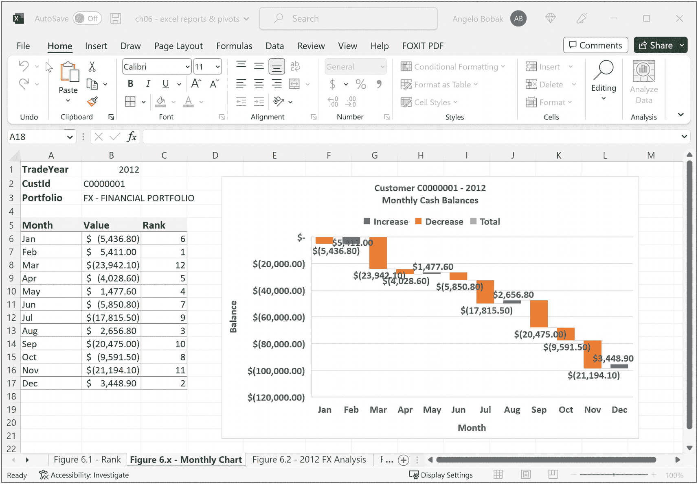

一张 Excel 表格的截图。左侧是一个包含 3 列（月份、价值和排名）和 12 个月的列表。右侧是一个按月份显示月度现金余额的余额条形图。

**图 6-12**  
2012 年月度 `FX` 头寸及趋势

查看此图表，我们发现下降次数多于上升次数。这意味着客户正在抛售外币。这是因为他们有利可图，还是因为该金融工具表现太差，客户正在抛售？

我们需要比较所有投资组合的表现，以了解情况。有时交易策略涉及卖出一种金融工具以购买另一种。让我们将这些数据全部放入一个 `Microsoft Excel` 数据透视表中，以便我们进行一些真正的分析。

请参考代码清单 6-5 中的查询。

```sql
SELECT [Year] AS TradeYear
,CASE
WHEN [Month] = 1 THEN 'Jan'
WHEN [Month] = 2 THEN 'Feb'
WHEN [Month] = 3 THEN 'Mar'
WHEN [Month] = 4 THEN 'Apr'
WHEN [Month] = 5 THEN 'May'
WHEN [Month] = 6 THEN 'Jun'
WHEN [Month] = 7 THEN 'Jul'
WHEN [Month] = 8 THEN 'Aug'
WHEN [Month] = 9 THEN 'Sep'
WHEN [Month] = 10 THEN 'Oct'
WHEN [Month] = 11 THEN 'Nov'
WHEN [Month] = 12 THEN 'Dec'
END AS Trademonth
,CustId
,PortfolioNo
,Portfolio
,SUM(Value) AS [MonthTotal]
FROM Financial.Portfolio
WHERE CustId = 'C0000001'
AND Year = 2012
GROUP BY Year,Month,Custid,PortfolioNo,Portfolio
ORDER BY Custid,Year,Month,PortfolioNo,Portfolio
GO
```
**代码清单 6-5**  
2012 年投资组合价值数据透视表查询

让我们运行查询，并将结果复制粘贴到 `Microsoft Excel` 电子表格中，然后创建一个数据透视表。这样我们就可以进行一些切片和切块操作，以查看各种交易模式。请参考图 6-13。

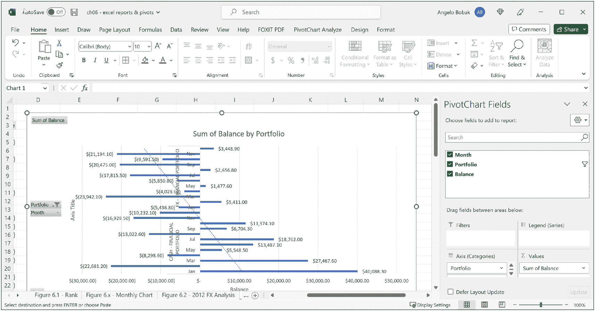

一张 Excel 表格的截图。它展示了按投资组合的余额总和的水平条形图。右侧是数据透视图字段，包括已勾选的月份、投资组合和余额选项。

**图 6-13**  
2012 年投资组合价值数据透视表


我们现在可以深入查看交易明细，了解日常的具体情况。这通常能帮助我们找到导致损失的任何可疑交易模式的根本原因。请记住，我们查看的是按月汇总的买入和卖出交易总额，而非随月份推移的滚动累计总额。后者能让我们真实了解投资组合的表现，以及在汇总所有交易后每月投资组合的剩余情况。让我们看看查询语句。请尝试在每一章之前下载代码并跟着操作。

请参考 `Listing 6-6`。

```sql
SELECT MONTH(T.[TransDate]) AS TransMonth
,CASE
WHEN MONTH(T.[TransDate]) = 1 THEN 'Jan'
WHEN MONTH(T.[TransDate]) = 2 THEN 'Feb'
WHEN MONTH(T.[TransDate]) = 3 THEN 'Mar'
WHEN MONTH(T.[TransDate]) = 4 THEN 'Apr'
WHEN MONTH(T.[TransDate]) = 5 THEN 'May'
WHEN MONTH(T.[TransDate]) = 6 THEN 'Jun'
WHEN MONTH(T.[TransDate]) = 7 THEN 'Jul'
WHEN MONTH(T.[TransDate]) = 8 THEN 'Aug'
WHEN MONTH(T.[TransDate]) = 9 THEN 'Sep'
WHEN MONTH(T.[TransDate]) = 10 THEN 'Oct'
WHEN MONTH(T.[TransDate]) = 11 THEN 'Nov'
WHEN MONTH(T.[TransDate]) = 12 THEN 'Dec'
END AS Trademonth
,T.[TransDate]
,T.[Symbol]
,T.[Price]
,T.[Quantity]
,T.[TransAmount]
,T.[CustId]
,T.[PortfolioNo]
,PAT.PortfolioAccountTypeCode
,PAT.PortfolioAccountTypeName
,T.[AcctNo]
,T.[BuySell]
FROM [APFinance].[Financial].[Transaction] T
JOIN [MasterData].[PortfolioAccountType] PAT
ON T.PortfolioAccountTypeCode = PAT.PortfolioAccountTypeCode
WHERE YEAR(T.TransDate) = 2012
AND T.CustId = 'C0000001'
GO
```

**Listing 6-6** 交易明细分析

这个查询为我们提供了所有工具和买卖类别的交易级别的详细视图。一个 `CASE` 语句块打印出月份缩写，使报告更具可读性。我们使用了投资组合账户类型表（别名 = `PAT`），并提取出该客户的唯一投资组合代码和名称。

### 让我们看看一些交易明细。
请参考 `Figure 6-14`。

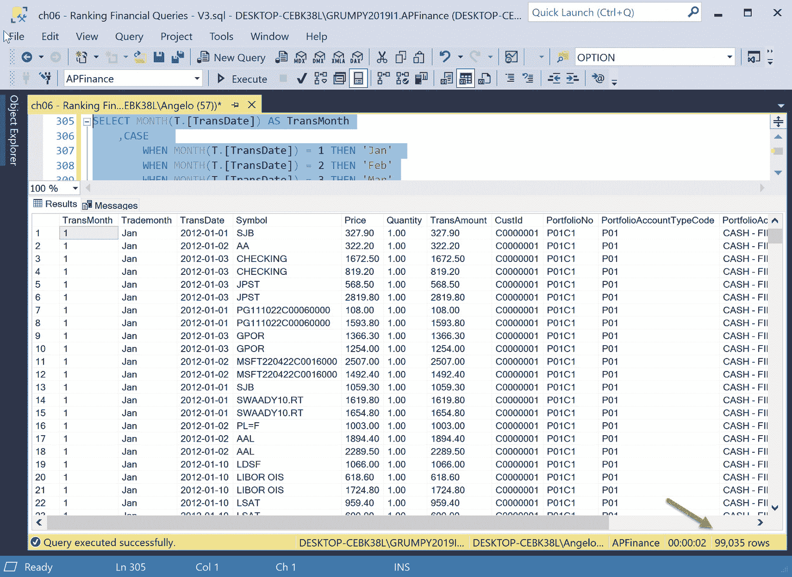
*这是一张标题为“财务查询排名”的 SQL 应用程序截图。它展示了一个程序和一个包含 11 行、22 列的列表。列标题包括交易月份、交易月份、交易日期、代码、价格和数量。一个箭头指向 99035 行。*

**Figure 6-14** 客户 `C0000001` 的交易明细

这为我们提供了大量信息，如交易日期、每笔交易的价格和数量、股票代码，以及交易是买入、卖出、存款还是取款（对于支票、储蓄或货币市场等现金账户）。这种详细程度使分析师能够理解每日的交易模式。

### 让我们用 Microsoft Excel 生成另一个数据透视表，这次是在交易级别。
请参考 `Figure 6-15`。

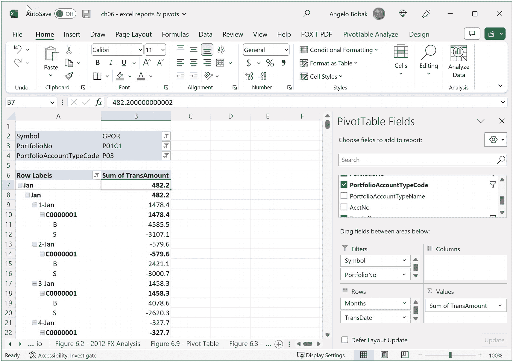
*这是一张 Excel 工作表截图。它展示了代码、投资组合编号和投资组合账户类型代码的 3 行，底部是一个表格。该表格有 2 列、行级别和交易金额的总和。右侧是数据透视表字段和不同的选项。*

**Figure 6-15** 交易明细数据透视表

之前的报告很有价值，因为它提供了很多细节，但说实话，在所有数据中导航比较困难。将结果提取出来，用 Microsoft Excel 生成一个数据透视表，可以让分析师对数据进行切片和切块，并随意切换投资组合、股票代码、月份甚至客户。

在这里，我们不仅能看到一月份的值，还能看到最低粒度——日级别的值，针对股票代码 `GPOR`（Gulfport Energy）以及买入和卖出交易金额的总计。想象一下，如果我们一天内有多笔交易！

> **注意**
> 快速提醒一下，交易金额都是随机生成的，绝不代表我们工具的实际历史价值。另外，为了简单起见，我将交易保持在一天一笔。一旦你熟悉了这些技术和函数的工作原理，就可以向 `Transaction` 表中加载更多交易，看看更大量的数据对查询性能有什么影响。同时，请确保在每次加载后更新 `Account` 和 `Portfolio` 表。

希望最后这几节展示了如何使用各种排名和聚合函数进行分析。其强大的功能在于能够向下钻取一个或多个层级，以了解产生结果的交易模式。这将告诉我们产生利润和亏损的条件，从而完善我们的交易策略。我们的工具不仅是排名函数，还包括性能工具和 Microsoft Excel。

本书范围之外的是将我们的数据加载到 Power BI 中。我们可以用那个工具创建一些令人印象深刻的记分卡和仪表板！


#### 性能考量

让我们对这个详细的事务查询进行一些分析，因为它要从拥有大约 60 万行的 Transaction 表中检索数据。在整个体系中这不算多，但足以在笔记本电脑上运行查询时对性能构成挑战。我们来看看 SSMS 生成的估计查询执行计划。

请参阅图 6-16。

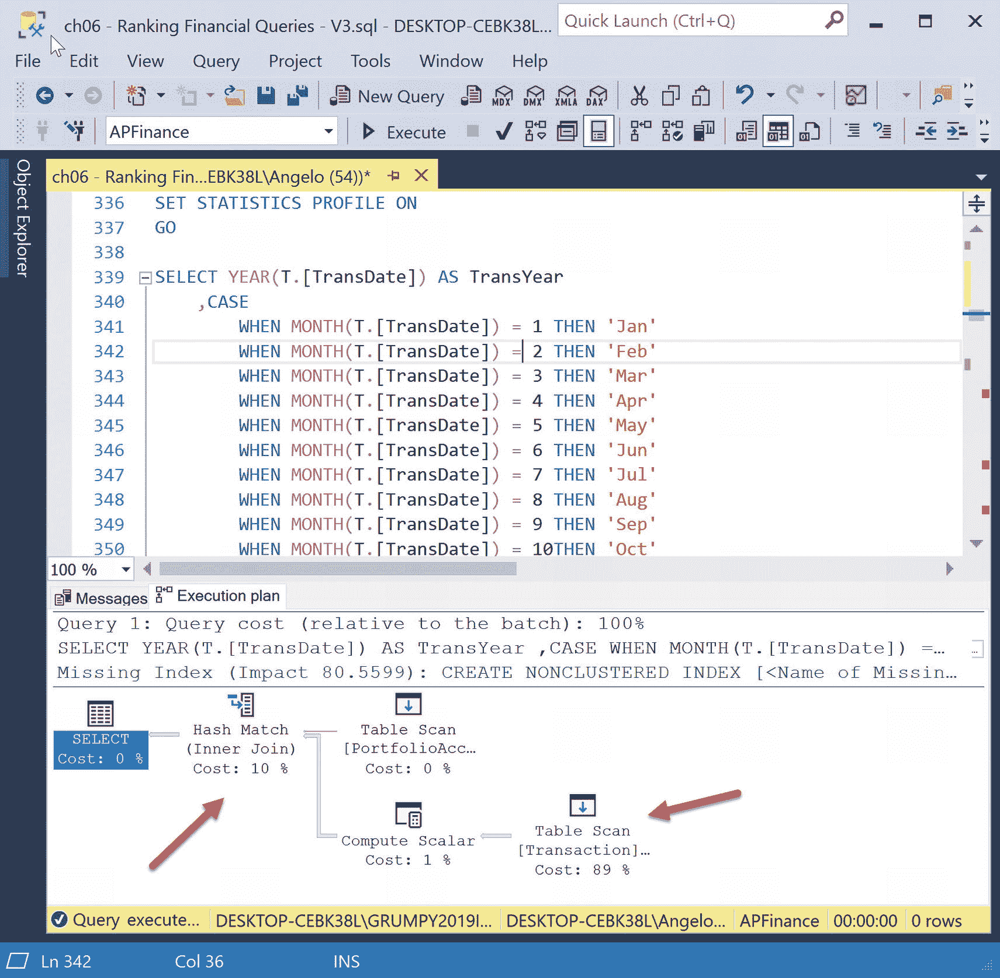

图 6-16  
估计查询计划 – 首次尝试

我们可以看到对 Transaction 表有一个开销巨大的表扫描（89% 成本），对 Portfolio 表有一个表扫描（0% 成本），以及我们的老朋友——哈希匹配内连接任务（成本 10% – 使用哈希来连接表行流）。可以看到一个建议的索引，因此让我们用下面的批处理命令来创建它。我们确保给它起个好名字。

请参阅清单 6-7。

```sql
CREATE NONCLUSTERED INDEX [iePortfolioAnalysisC0000001]
ON [Financial].[Transaction] ([CustId])
INCLUDE (
[TransDate],[Symbol],[Price],[Quantity],[TransAmount],
[PortfolioNo],[AcctNo],[BuySell]
)
GO
```

清单 6-7  
估计查询计划建议的索引

建议的索引基于名为 `CustId` 的客户标识符列，但它还包含了查询中出现的完整列列表。让我们创建该索引并运行另一个估计执行计划。在创建索引后，运行更新统计信息和我们的 `DBCC` 命令不会有坏处。

请参阅图 6-17。

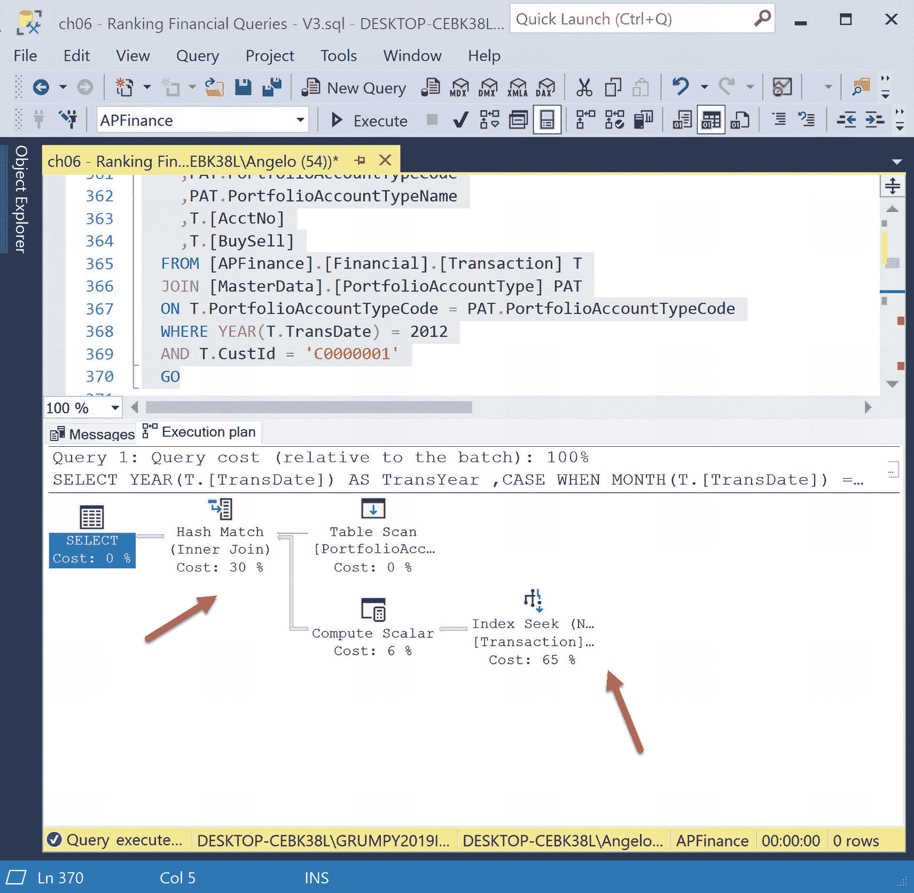

图 6-17  
第二次估计查询计划

我们看到对 Transaction 表的索引查找带来了改进。这产生了 65% 的成本。Portfolio 表上的表扫描仍然是 0%，所以这很好。哈希匹配任务的成本上升到了 30%。可以看出有一些改进。

**建议**  
如果你有预算，考虑购买一块优质的固态硬盘，这样你可以把查询密集型表和索引或 TEMPDB 放在上面。大概需要花费 200 美元左右，但它将是一个宝贵的学习辅助工具，让你看到在设计数据库和报告解决方案时也需要考虑硬件因素。

让我们比较一下两种方法（无索引和有索引）的分析统计信息。

请参阅图 6-18。

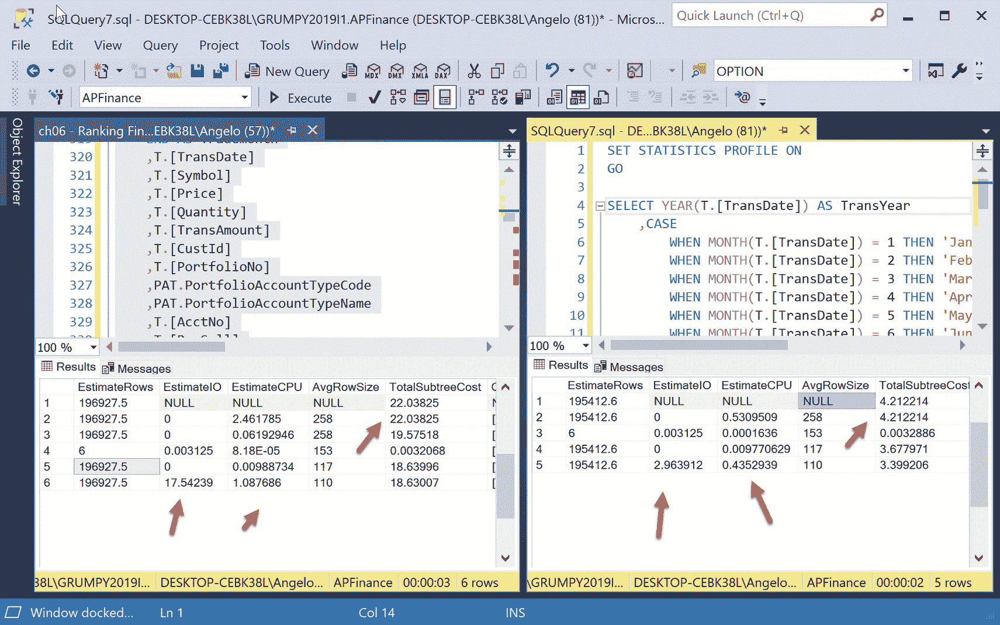

图 6-18  
比较分析统计信息

SQL Server 再次建议了一个好索引。注意 `EstimateIO`、`EstimateCPU` 和 `TotalSubtreeCost` 已经大幅下降。另请注意，使用索引方案我们消除了一个步骤。在这个阶段，我们可以同意，单独运行估计查询计划工具是可以的，但不足以给我们提供足够的信息来分析性能。我们还需要检查 `IO`、`TIME` 和 `PERFORMANCE` 统计信息。

**注意**  
抱歉，又是一个注意点。当在服务器场景（相对于笔记本电脑或工作站设置）分析性能时，你需要考虑网络性能。你的服务器可能足够快地执行查询，但如果你的网络很慢，它可能会让你对你刚创建的查询或脚本的质量产生误解。嘿，就怪网络管理员吧。开个玩笑……

### DENSE_RANK() 函数

下一个函数。回顾第 4 章，`DENSE_RANK()` 函数的工作方式几乎与 `RANK()` 函数相同。在出现并列的情况下，密集排名对并列的值是相同的，但重复值之后的下一个值会被简单地分配下一个排名数字。所以，如果并列的密集排名是 4，那么分配给下一个较高值的下一个排名就是 5。

`RANK()` 函数的结果则不是这样。如果你有五个并列值为 6，且并列的当前排名是 4，那么下一个排名是 9（5 个并列值 + 当前排名值 4 = 9）。确实很奇怪。

#### 示例 1

当我们查看这个将分析投资组合性能排名的查询结果时，回顾一下 `RANK()` 与 `DENSE_RANK()` 的行为。

请参阅清单 6-8。

```sql
WITH PortfolioAnalysis (
TradeYear,CustId,PortfolioNo,Portfolio,YearlyValue
)
AS (
SELECT [Year] AS TradeYear
,CustId
,PortfolioNo
,Portfolio
-- 引入人为的重复值
-- 以观察 rank 和 dense_rank 的行为
,CASE
WHEN Portfolio = 'CASH - FINANCIAL PORTFOLIO'
AND [Year] = 2012 THEN 33894.20
ELSE SUM(Value)
END AS YearlyValue
FROM Financial.Portfolio
WHERE Year > 2011
GROUP BY CustId,Year,PortfolioNo
,Portfolio
)
SELECT TradeYear,
,CustId
,PortfolioNo
,Portfolio
,YearlyValue
,RANK() OVER(
ORDER BY YearlyValue DESC
) AS PortfolioRank
,DENSE_RANK() OVER(
ORDER BY YearlyValue DESC
) AS PortfolioDenseRank
FROM PortfolioAnalysis
WHERE Portfolio = 'CASH - FINANCIAL PORTFOLIO'
GO
```

清单 6-8  
使用密集排名的投资组合分析

我们将使用 `CTE` 查询结构并包含一个 `CASE` 语句块，以便引入一些人为的重复值，从而让 `RANK()` 和 `DENSE_RANK()` 函数充分发挥作用（这样我们就可以比较结果）。

当投资组合是现金投资组合且年份等于 2012 年时，我们就硬编码值 $33,894.20 来生成一些重复值、三重值等。

`RANK()` 和 `DENSE_RANK()` 函数包含一个 `ORDER BY` 子句，该子句按 `YearlyValue` 事务总计对分区结果进行排序。结果应该很有趣。

请参阅图 6-19 中的部分结果。

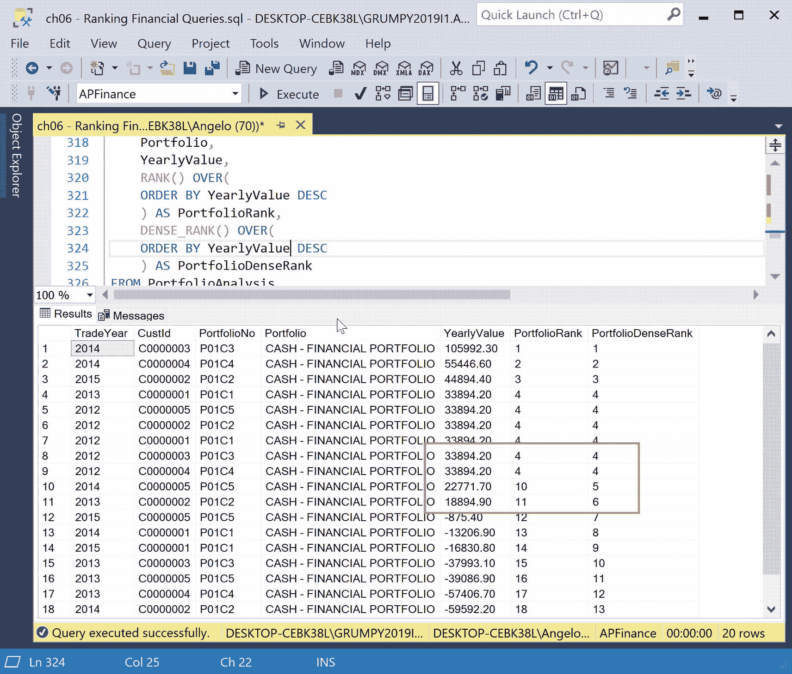

图 6-19  
针对投资组合性能的 RANK() 与 DENSE_RANK() 对比

就是这样。2012 年所有客户投资组合中有一个庞大的六路并列，2013 年有一个客户并列。`DENSE_RANK()` 函数只是将下一个非并列值的排名增加到 5，但 `RANK()` 函数将并列计数值 6 加到排名 4 上，得到下一个排名 10。然后它继续愉快地进行下去。

我个人认为这很令人困惑。`DENSE_RANK()` 函数给出了更直观的结果，但这只是我的看法。

#### 性能考量

让我们来看看这个查询的性能如何。以下是该查询的第一个估计查询计划，将为我们后续的性能调优工作提供基准。

请参考图 6-20。

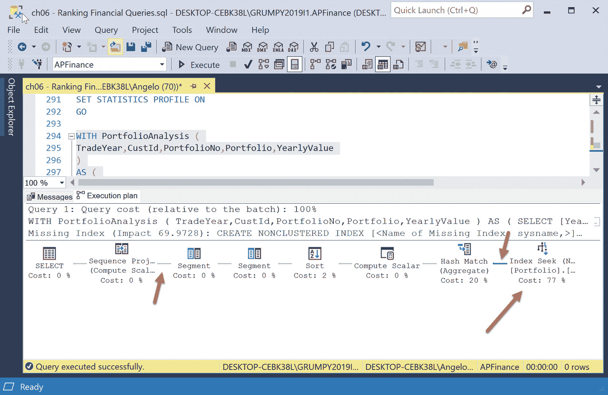

一个名为“Ranking Financial Quarries”的`SQL`应用程序截图。它展示了一个获取执行计划的程序和查询 1，其中包含选择、序列投影、段、排序、计算标量、哈希匹配和索引查找成本。

图 6-20

第一个估计查询计划

尽管使用了索引查找（比索引扫描更好），但系统建议创建一个新索引。我们看到在索引查找之后，哈希匹配占 20%的成本，另一个需要注意的任务是排序，占 2%。让我们提取建议索引的代码，并为其命名以便创建。

请参考清单 6-9。

```sql
/*
Missing Index Details from ch06 - Ranking Financial Queries.sql - DESKTOP-CEBK38L\GRUMPY2019I1.APFinance (DESKTOP-CEBK38L\Angelo (70))
The Query Processor estimates that implementing the following index could improve the query cost by 69.9728%.
*/
/*
USE [APFinance]
GO
CREATE NONCLUSTERED INDEX []
ON [Financial].[Portfolio] ([Portfolio],[Year])
INCLUDE ([CustId],[PortfolioNo],[Value])
GO
*/
DROP INDEX IF EXISTS [ieCustIdPortfolioNoValue]
ON [Financial].[Portfolio]
GO
CREATE NONCLUSTERED INDEX [ieCustIdPortfolioNoValue]
ON [Financial].[Portfolio] ([Portfolio],[Year])
INCLUDE ([CustId],[PortfolioNo],[Value])
GO
```
清单 6-9

建议索引

该索引基于`portfolio`和`year`列，并包含了客户 ID、投资组合编号和交易总价值。提醒一下，我包含了`DROP`命令，以便你在尝试和练习代码时，可以根据需要删除并重新创建它。

让我们创建索引并生成一个新的估计执行计划。

请参考图 6-21。

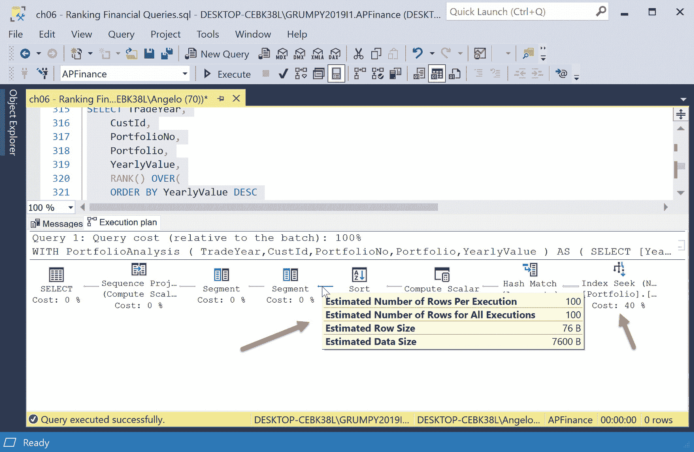

一个名为“Ranking Financial Quarries”的`SQL`应用程序截图。它展示了一个获取执行计划的程序和查询 1，其中包含选择、序列投影、段、排序、计算标量、哈希匹配和索引查找成本。

图 6-21

索引创建后的估计执行计划

让我们看一下两个计划中各项成本在优化前后的数值对比。

请参考表 6-2。

表 6-2

成本比较

| 步骤 | 优化前 | 优化后 |
| --- | --- | --- |
| SELECT | 0% | 0% |
| 序列投影 | 0% | 0% |
| 段 | 0% | 0% |
| 段 | 0% | 0% |
| 排序 | 2% | 8% |
| 计算标量 | 0% | 0% |
| 哈希匹配 | 20% | 52% |
| 索引查找 | 77% | 40% |

索引查找的成本从 77%下降到了 40%，但当然哈希匹配的成本从 20%上升到了 52%，排序步骤的成本也从 2%上升到了 8%。这与我们在其他查询中创建建议索引时的经验相似。

我尝试将`WHERE`子句谓词移到调用查询中，并从`CTE`中移除它，但这没有帮助。我生成了一个看起来与原始计划相同的执行计划。唯一的替代方案是将`CTE`生成的数据暂存到临时表或报表表中，然后查询该表，以避免`CTE`处理的成本。

**提醒**

请记住，交易价值是随机生成的，因此当你尝试这些脚本时，你会得到与本书中图示不同的结果。

让我们尝试另一个例子。

## 示例 2

在下一个例子中，让我们考虑计算股票价格的波动幅度，即一年内股票的最低价格与最高价格之间的差值，作为衡量其表现的一个指标。因此，如果这个值很大，就意味着该股票是高表现者，值得投资。如果这个值为负，那么它就是低表现者！

你会怎么做？是抛售它，还是抱着它迟早会涨的希望继续持有？不要像我之前说的那样做：高买低卖。

请参考清单 6-10。

```sql
SELECT TOP 20 [QuoteYear]
,[Ticker]
,[Company]
,MIN([Low])               AS MinLow
,MAX([High])              AS MaxHigh
,MAX([High]) - MIN([Low]) AS MaxSpread
,RANK() OVER(
ORDER BY MAX([High]) DESC
) AS PerformanceRank
,DENSE_RANK() OVER(
ORDER BY MAX([High]) DESC
) AS PerformanceDenseRank
FROM [APFinance].[MasterData].[TickerPriceRangeHistoryDetail]
WHERE [QuoteYear] = 2015
GROUP BY[QuoteYear]
,[Ticker]
,[Company]
GO
```
清单 6-10

表现最佳的前 20 只股票代码

这是一个稍微有趣的查询。它报告了按年（仅 2015 年）划分的股票代码的最低和最高报价。它还通过再次使用`MIN()`和`MAX()`函数来计算最低值和最高值之间的差值。这可能是低效的，我们应该考虑重写此查询，使用报表表而不是`CTE`。

让我们在图 6-22 中查看结果。

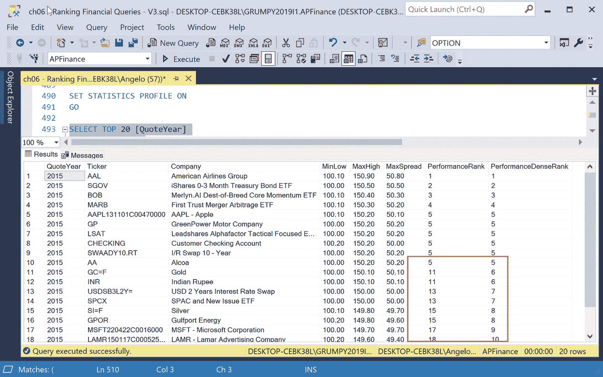

一个名为“Ranking Financial Quarries”的`SQL`应用程序截图。它展示了一个程序和一个包含 18 行 8 列的列表。列标题分别是报价年份、股票代码、公司、最低价、最高价、最大价差、表现排名和表现密集排名。

图 6-22

2015 年股票最低价、最高价和价差

如图所示，我们有几个并列排名的情况，跳过排名值与直接进入下一个值的行为都有体现。尽管如此，我们还是能大致了解这些股票的表现。

**提醒**

所有股票及其他金融工具的价值、交易等均为模拟数据，不反映这些工具在历史上及当前的实际表现。另外，是的，不要以我的投资策略为基础，因为我总是高买低卖。

是时候进行一些性能分析了。


#### 性能考量

让我们运行基线估算执行计划。当你自己操作时，请花时间将鼠标指针悬停在每个任务上，查看各个帮助提示面板。记录下哪些参数让你感到困惑，这样你就可以在 Microsoft 文档网站上查找它们。现在正是提升你对这些重要任务和统计信息认知的好时机。

注意
你永远无法记住所有内容；只需理解最常见的几种，例如索引查找和索引扫描。

请参考图 6-23。

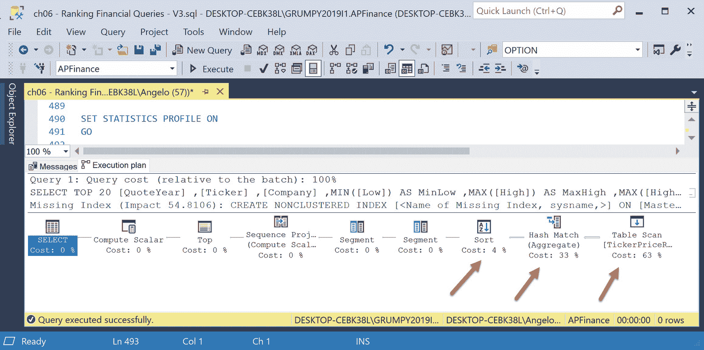
一个标题为“排名财务查询”的 SQL 应用程序截图。它展示了一个获取查询 1 的程序。它包括了选择、计算标量、Top、序列项目、段、排序、哈希匹配和表扫描的成本。排序成本 4%，哈希匹配成本 33%，表扫描成本 63%，并用 3 个箭头高亮标出。

图 6-23
股票代码分析查询的估算查询计划

针对一个有 54,057 行的表，存在一个高达 63% 的昂贵表扫描成本，因此建议创建一个索引。接下来，我们看到一个占 33% 的哈希匹配聚合，随后是一个占 4% 的排序。在我们考虑用报告表替换 `CTE` 之前，让我们先看看建议的索引是什么样子。

请参考清单 6-11。

```sql
DROP INDEX IF EXISTS eTickerCompanyLowHigh
ON [MasterData].[TickerPriceRangeHistoryDetail]
GO
CREATE NONCLUSTERED INDEX [eTickerCompanyLowHigh]
ON [MasterData].[TickerPriceRangeHistoryDetail] ([QuoteYear])
INCLUDE ([Ticker],[Company],[Low],[High])
GO
```
清单 6-11
建议的索引

出于习惯，我总是包含 `DROP INDEX` 命令，以防我需要实验并重建索引。让我们构建索引并生成另一个估算查询计划。

请参考图 6-24。

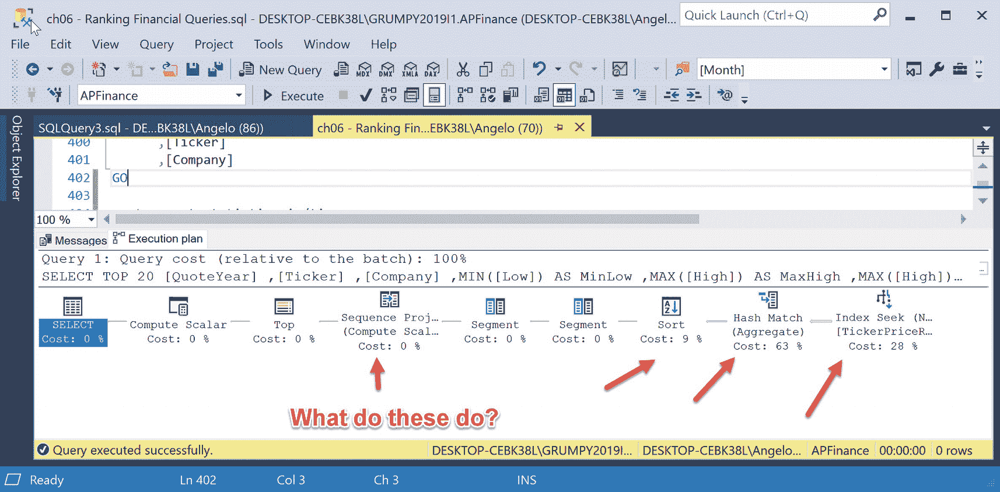
一个标题为“排名财务查询”的 SQL 应用程序截图。它表示一个获取查询 1 的程序。它包括选择、计算标量、Top、序列项目、2 个段、排序、哈希匹配和索引查找。它提出了一个问题：“这些是做什么的？”，一个箭头指向序列项目。

图 6-24
股票代码分析查询修订后的查询计划

像往常一样，索引查找取代了表扫描。像往常一样，哈希匹配和排序的百分比上升了。

请参考表 6-3。

表 6-3
索引前后的成本对比

| 之前 |   |   | 之后 |   |   |
| --- | --- | --- | --- | --- | --- |
| **索引查找** | **哈希匹配** | **排序** | **索引查找** | **哈希匹配** | **排序** |
| 63% | 33% | 4% | 28% | 63% | 9% |

我们在这里看到了常见的模式。一个人能构建的索引和报告表数量是有限的。诀窍在于，当你收集用户规格报告时，识别共同的需求，并创建报告表来满足其中的大部分，这样你最终只会拥有二到五张表。否则，事情会变得难以管理，并且由于所有需要更新的索引，数据加载将是一场噩梦。

回到这个计划。序列项目任务是做什么的？另外，你可能会问自己：“哪些步骤处理了 `MIN()`、`MAX()`、`RANK()` 和 `DENSE_RANK()` 函数？”

这些问题可以通过设置 `PROFILE STATISTICS` 参数并重新运行查询来回答。让我们看看结果。

请参考图 6-25。

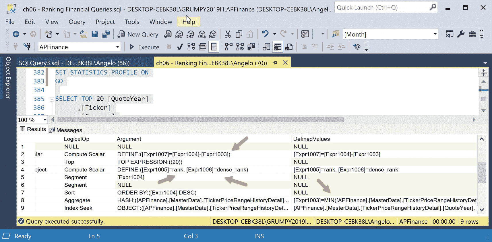
一个标题为“排名财务查询”的 SQL 应用程序截图。它表示一个程序和一个包含三列逻辑操作、参数和定义值的列表。它为计算标量和段提供了参数。定义值对于段和排序是 NULL。

图 6-25
配置文件统计报告

首要任务是识别那些 **ExprXXXX** 表达式的含义：
- Expr1003：`MIN()` 函数
- Expr1004：`MAX()` 函数
- Expr1005：`RANK()` 函数（在计算标量任务中）
- Expr1006：`DENSE_RANK()` 函数（在计算标量任务中）
- Exper1007：Expr1004 – Expr1003

接下来，让我们回答这个问题：***序列项目任务是用来做什么的？***
答案是，它用于包含参与计算的列，在本例中是两个排名函数。
因此，这是一个你无法通过性能调优消除的步骤，除非我们重写查询，使其使用旧的报告表查询方案。换句话说，就是预先计算这些列中的值。

首先，我们需要比较 `PROFILE STATISTICS` 前后的情况，看看新索引是否有所帮助。请参考图 6-26。

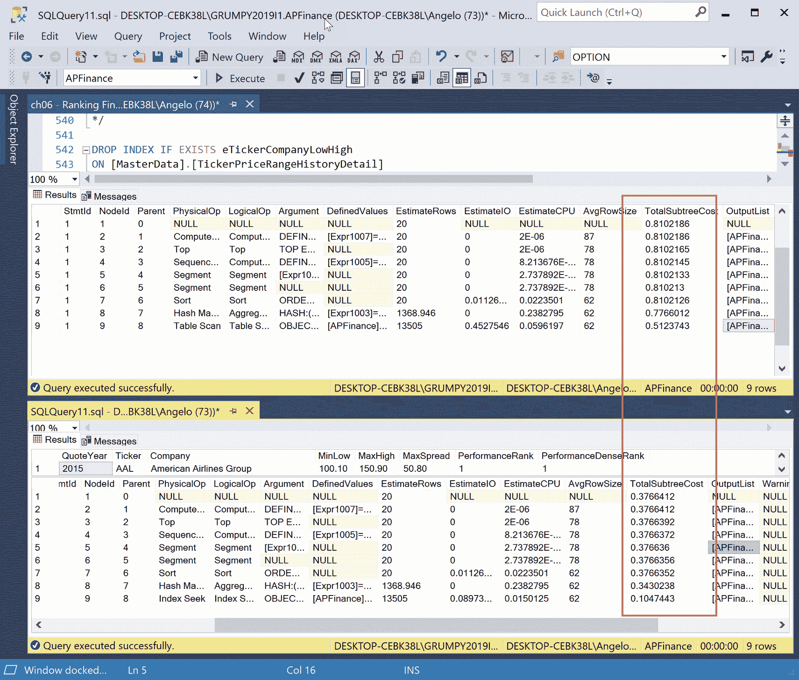
一个 SQL 应用程序截图。它表示一个比较上下两个选项卡中 14 列列表的程序。一个高亮框描绘了两个选项卡中总子树成本值的比较。两个选项卡各有 9 行。

图 6-26
比较配置文件统计信息

看起来索引前后的场景生成了相同数量的步骤，唯一显示改善的类别是图中高亮的总子树成本，下降了 50% 以上。在这个阶段，我们可能会问：再创建一个索引值得吗？

接下来，我们需要通过查看 `IO` 和 `TIME` 统计信息来完成性能分析配置文件。请参考图 6-27。

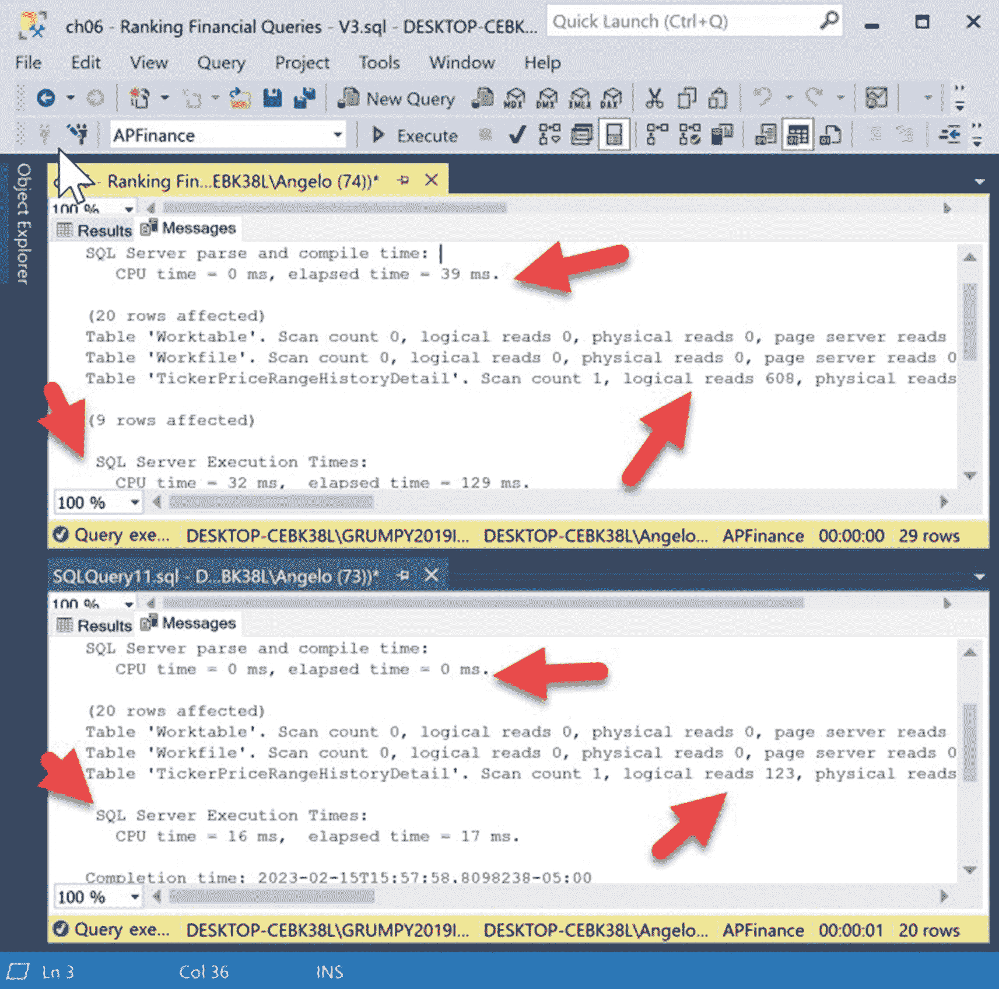
一个标题为“排名财务查询”的 SQL 应用程序截图。它表示查找 IO 和时间统计信息的程序。它指出了两种策略的已用时间，例如 39、129、0 和 17 毫秒。

图 6-27
比较两种策略的 IO 和 TIME 统计信息

是的，我知道，你喜欢那些漂亮的大红箭头！言归正传，我们看到重要的统计值在索引创建后下降了。而这在大多数情况下是预料之中的。前后的逻辑读取分别是 608 和 123，所以这是令人印象深刻的。物理读取在两种情况下都是 0，扫描计数在两种情况下都是 1。看起来两种查询方法都利用了内存来处理。

`CPU` 时间和已用时间则好坏参半。`CPU` 时间上升了，但已用时间下降了。
结论：我们将保留这个索引！下一个主题：我们创建一些数据块来存储财务信息。

### NTILE( ) 函数

还记得这个函数的定义吗？`NTILE()` 函数允许你将数据集中的一行集合划分成数据块或桶（我更喜欢这个术语）。如果你有一个包含 12 行的数据集，并且你想分配 4 个数据块，那么每个数据块将包含 3 行。当你想要创建数据集时，比如需要评估销售人员表现并根据销售业绩授予奖金时，这个函数就派上用场了。

既然我们在讨论财务，另一个例子是为投资组合中的股票表现设置桶类别：表现最好的股票在第一个桶中，表现稍差的股票在下一个桶中，依此类推。这样你就可以对它们进行评级，并根据股票落入哪个桶来制定投资策略。

注意
如果你有奇数行，比如 15 行，并且你决定创建 4 个数据块，你将得到包含 4 行、4 行、4 行和 3 行的数据块。所以无法控制什么进入哪个数据块；它只是进行划分。

对于我们的第一个例子，我们将从简单的开始。我们创建数据块，以便用它们来分类一项投资是好、坏还是垃圾！我将清单分成两部分，以便于解释。


