# 示例 1

首先，我们建立一个包含虚构股票的数据集，并为它们分配 A+、A、B+、B 和 JUNK! 的评级。

请参考清单 6-12a。

```sql
DECLARE @TickerRating TABLE
(
Ticker VARCHAR(8) NOT NULL,
Rating VARCHAR(8) NOT NULL
);
INSERT INTO @TickerRating VALUES
('AAA','A+'),
('AAB','A+'),
('AAC','A+'),
('AAD','A+'),
('BBB','A'),
('BBC','A'),
('BBD','A'),
('BBE','A'),
('CCC','B+'),
('CCD','B+'),
('CCE','B+'),
('CCE','B+'),
('DDD','B'),
('DDE','B'),
('DDF','B'),
('DDG','B'),
('ZZZ','JUNK'),
('ZZA','JUNK'),
('ZZB','JUNK'),
('ZZB','JUNK');
-- 清单 6-12a
-- 设置股票代码数据
```

和往常一样，我们使用一个名为 `@TickerRating` 的表变量，并为每个类别插入四只股票（或者你喜欢的股票代码）。我们为每只股票分配评级，并将这些行加载到表变量中。接下来，我们创建一个查询来分配分组编号，以便进行评估。请参考清单 6-12b。

```sql
DECLARE @RatingBuckets INT;
SELECT @RatingBuckets = COUNT(DISTINCT Rating)
FROM @TickerRating;
SELECT Ticker
,Rating
,CASE
WHEN NTILE(@RatingBuckets) OVER (ORDER BY Ticker) = 1
THEN '强烈推荐'
WHEN NTILE(@RatingBuckets) OVER (ORDER BY Ticker) = 2
THEN '推荐'
WHEN NTILE(@RatingBuckets) OVER (ORDER BY Ticker) = 3
THEN '值得一试'
WHEN NTILE(@RatingBuckets) OVER (ORDER BY Ticker) = 4
THEN '你感觉幸运吗？'
WHEN NTILE(@RatingBuckets) OVER (ORDER BY Ticker) = 5
THEN '快跑！'
END AS AnalystRecommends
FROM @TickerRating;
GO
-- 清单 6-12b
-- 生成推荐分组
```

这次，我们通过计算不同的评级类别数量来生成用于定义分组的数字。在我们的例子中，需要设置五个分组。接下来，我们创建一个包含 `CASE` 语句块的查询，这样我们就可以解码分组编号并根据其值生成消息，例如，第一分组表示为 1 意味着该组中的股票是“强烈推荐”。概念非常简单，但它说明了我们可以使用分组来对事物进行分类。

让我们在图 6-28 中查看结果。

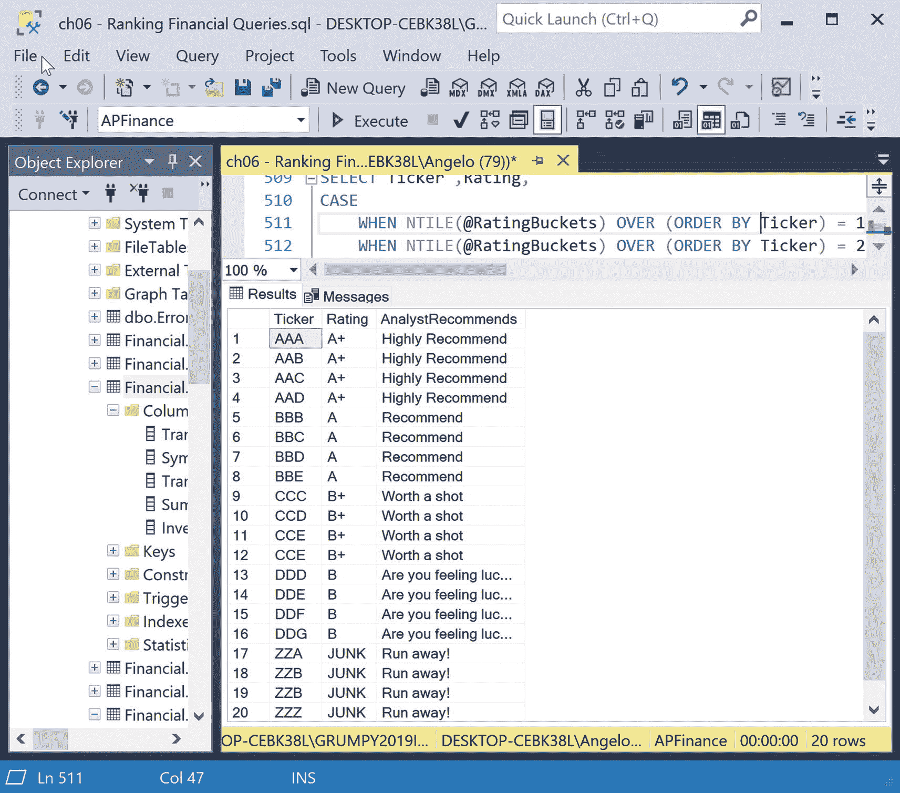

**图 6-28**
金融顾问投资建议

如你所见，这些建议非常专业且精妙。我最喜欢的建议是针对评级 B 和 JUNK 的。

### 性能考虑

虽然这是一个非常小的表格，但它有几个步骤，所以我认为看看它的预估性能计划会很有趣。请参考图 6-29。

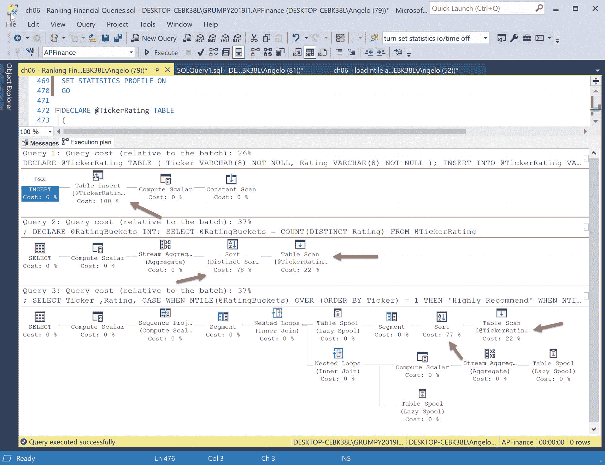

**图 6-29**
`NTILE` 查询的预估执行计划

我们实际上有三个计划，第一个用于设置表变量并向其中插入行。请注意，此查询的成本占三查询批处理脚本的 26%。

第二个计划用于根据评级类别数量计算分组数的查询。此查询的成本为 37%。

最后但同样重要的是包含 `CASE` 语句块的查询，用于根据股票的分组编号生成建议。步骤很多，此查询的成本占整个批处理的 37%。

所以，如果我们把三个成本加起来，26% + 37% + 37%，应该得到 100%，这正是我们得到的结果。

由于表格非常小，我们不会费心进行性能调整，但看看所有的步骤：表扫描、表假脱机、嵌套连接等。如果我们的表有数千行或更多，性能可能会成为问题。

#### 示例 2

接下来，我们想使用 `NTILE()` 创建一些分组，然后使用 `RANK()` 函数在分组内对数值进行排名。我们将使用 `Transaction` 表，该表大约有 651,934 行数据。

**建议**
一旦你熟悉了此函数及其他函数，尝试将 `Transaction` 表加载两到三次，以模拟一天两笔或更多交易。数据量将增加到大约两百万行。根据新的行数加载 `Account` 和 `Portfolio` 表，以观察在运行我们刚刚讨论的查询时，性能会受到怎样的影响。

这是另一个同时使用 `NTILE()` 和 `RANK()` 函数的简单示例。这两个函数以不同的方式处理数据：一个对数据进行分类，另一个对其进行排名。我们将看看估计的查询计划是否复杂。

请参考代码清单 6-13。

```sql
;WITH SymbolCTE (TransYear,Symbol,SumTransactions,InvestmentBucket)
AS
(
SELECT YEAR([TransDate])  AS TransYear
,[Symbol]
,SUM([TransAmount]) AS SumTransactions
,NTILE(9) OVER (
PARTITION BY YEAR([TransDate])
ORDER BY SUM([TransAmount]) DESC
) AS InvestmentBucket
FROM [APFinance].[Financial].[Transaction]
GROUP BY YEAR([TransDate]),Symbol
)
SELECT TransYear
,Symbol
,SumTransactions
,InvestmentBucket
,RANK() OVER(
PARTITION BY TransYear,InvestmentBucket
ORDER BY InvestmentBucket,SumTransactions DESC
) AS InvestmentRank
FROM SymbolCTE
GO
```

*代码清单 6-13*
*在分组内对数值进行排名*

我们只对 `BUY`（买入）交易感兴趣，因此设置了一个 `WHERE` 子句来过滤掉所有非“`BUY`”的交易。`CTE`（公用表表达式）汇总了交易金额，因此需要 `GROUP BY` 子句，因为我们没有包含 `OVER()` 子句。`NTILE()` 函数确实使用了带有 `PARTITION BY` 和 `ORDER BY` 子句的 `OVER()` 子句。分区按年份设置，分区内结果集按总交易金额排序。

请参考图 6-30。

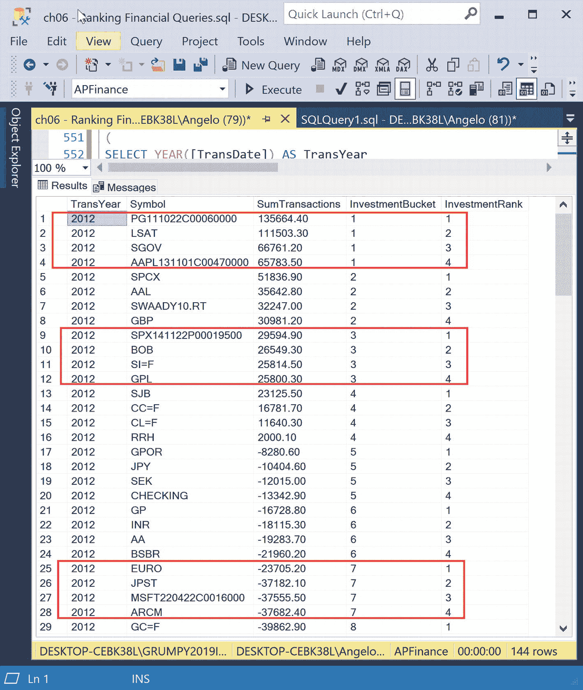
*这是一张标题为“排名金融查询”的 SQL 应用程序截图。它显示了一个包含 29 行 5 列的程序列表。列标题分别是交易年份、代码、总交易额、投资分组和投资排名。高亮显示的行是第 1 到 4 行、第 9 到 12 行以及第 25 到 28 行。*
*图 6-30*
*2012 年股票代码分组评级*

看起来我们有九个分组，每个分组分配了四个股票代码。没有并列情况，因此我们没有看到此函数产生的特殊排名模式。金融工具在每个分组内被评为 1 到 4 级。在规划投资组合时，这可能是有价值的信息。

**练习**
作为一个小练习，使用第一个示例中的逻辑，以便根据分组内的排名对股票代码进行评级。提示：你需要使用一个 `CASE` 代码块。

我认为这个结果集可以生成一些有趣的图表，所以让我们将结果复制粘贴到 Excel 电子表格中，并生成一些图表。

请参考图 6-31。

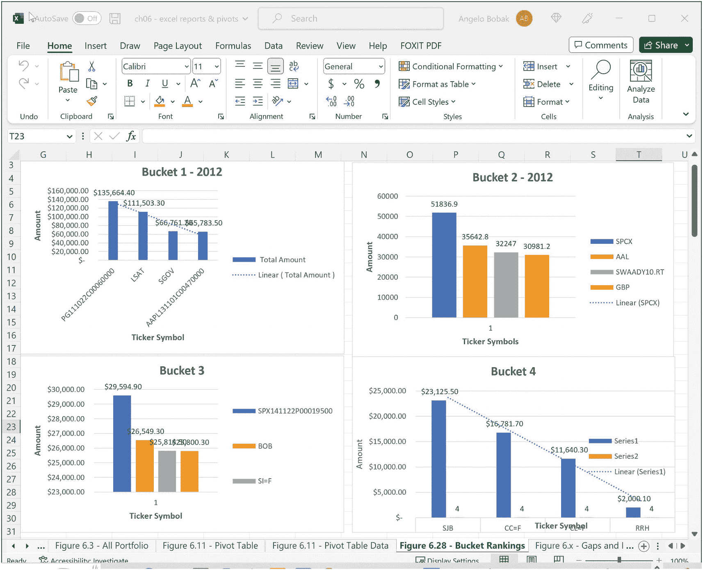
*这是一张 Excel 工作表的截图。它展示了 2012 年第 1、2、3 和 4 分组的，金额与股票代码关系的 4 个不同条形图。所有图表都描绘了下降趋势，而在第 1 和第 2 分组中，总金额和序列 1 的线条呈下降趋势。*
*图 6-31*
*2012 年股票代码分组评级*

这次我们生成了四个较小的图表，每个分组一个，但通过视觉我们可以看到排名位置和趋势线。包含数值也有助于理解信息。看一下第 3 分组的图表，哪个是排名最高的工具？哪个是最低的？最低的几乎并列，但这种可视化表示将帮助分析师决定为其客户的投资组合投资什么。

**思考与想法**
在这个阶段，我们可以看到，我们一直在研究的 SQL Server 函数是我们用于从原始数据生成分析数据的第一线工具。我们的工具范围包括通过查询生成的报告，到使用 Microsoft Excel 根据查询结果生成的图表和数据透视表。另一个工具是使用函数生成的分析数据来填充使用 Microsoft Power BI 创建的计分卡和仪表板。我建议你熟悉 Excel 和 Power BI。

#### 性能考量

让我们来看一个同时包含`RANK()`和`NTILE()`函数的查询，其估算查询计划是什么样子的。请参考图 6-32。

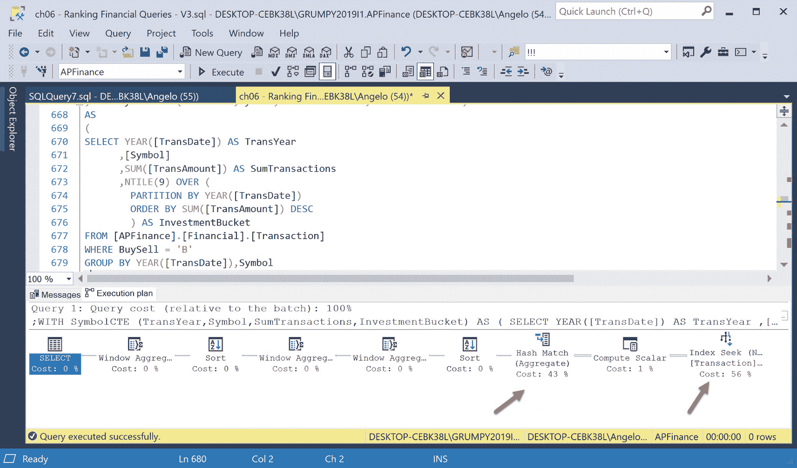

图 6-32

`NTILE()` 和 `RANK()` 的估算查询计划

和往常一样，我们从右向左看。我们看到一个成本为 56%的索引查找，接着是一个成本为 1%的计算标量步骤，最后是一个成本为 43%的哈希匹配聚合任务。让我们通过将鼠标悬停在每个任务上，来详细查看这三个任务。

请参考图 6-33。

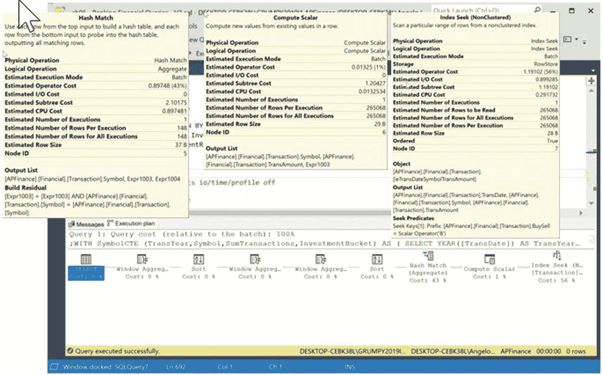

图 6-33

详细的任务信息

从索引扫描开始，我们看到顶部和底部的对象分别是`Transaction`表（顶部对象）和索引`ieTransDateSymbolTransAmount`（底部对象）。接下来，计算标量任务输出了表达式`Expr1003`。

这是什么？以下是从分析统计信息中检索到的表达式：

```
[Expr1003]=datepart(year,[APFinance].[Financial].[Transaction].[TransDate])))
```

谜底揭晓了。它是`DATEPART()`函数的结果，用于提取年份。

最后，回想一下哈希匹配任务的作用：它们将索引扫描中顶部对象的行与底部对象的行进行匹配，并通过构建哈希表来匹配它们。我鼓励你检查查询计划中这些节点的细节，因为它们清楚地说明了正在发生的事情，特别是对于你以前没见过的任务。了解它们的作用可以帮助你提出性能改进措施，比如修改查询或创建暂存表或临时表。

打印出此步骤的语句文本，会产生以下逻辑：

```
--Hash Match(Aggregate,
HASH:(
[Expr1003],
[APFinance].[Financial].[Transaction].[Symbol]
),
RESIDUAL:[
Expr1003] = [Expr1003] AND
[APFinance].[Financial].[Transaction].[Symbol]
= [APFinance].[Financial].[Transaction].[Symbol])
DEFINE:(
[Expr1004]=SUM([APFinance].[Financial].[Transaction].[TransAmount]))
)
--Compute Scalar(DEFINE:
[Expr1003]=datepart(year,[APFinance].[Financial].[Transaction].[TransDate])))
```

我同意，这有点晦涩。

这确定了执行`SUM()`值运算和提取年份日期部分的两个表达式。

回顾查询计划，注意当我们使用索引扫描时线条的宽度，以及当流程从右向左移动时它们如何变细。这个特性可以帮助我们识别高容量任务和性能改进的机会。始终要注意这些。

最后但同样重要的是三个窗口聚合任务。虽然它们的成本占比是 0%，但值得一提的是，这些任务与两个使用`OVER()`子句的排名函数相关。如果我们查看分析统计信息中的这一步，会发现`EstimateIO`值为 0，因此这个处理是在内存中执行的。这正是我们希望看到的！

这些是分析统计信息的`StmtText`列中复制出来的、对应这些任务的语句：

```
--Window Aggregate(
DEFINE:(
[Expr1006]=rank),
PARTITION COLUMNS:([Expr1003], [Expr1005]),
ORDER BY:([Expr1003], [Expr1005]),
ROWS BETWEEN:(UNBOUNDED, CURRENT ROW)
)
--Window Aggregate(
DEFINE:(
[Expr1005]=ntile),
PARTITION COLUMNS:([Expr1003]),
ROWS BETWEEN:(UNBOUNDED, CURRENT ROW)
--Window Aggregate(
DEFINE:(
[AggResult1009]=Count(*)),
PARTITION COLUMNS:([Expr1003]),
ORDER BY:([Expr1003]),
RANGE BETWEEN:(UNBOUNDED, UNBOUNDED)
)
```

现在我们可以将查询计划步骤与实际的查询组件关联起来。但是`COUNT(*)`步骤是从哪里来的呢？查询中并没有包含它。看起来它必须计算行数，以便在下一步中定义和处理数据块（tiles）。

既然我们刚刚引用了它，不妨也查看一下此脚本的`PROFILE`统计信息。

请参考图 6-34。

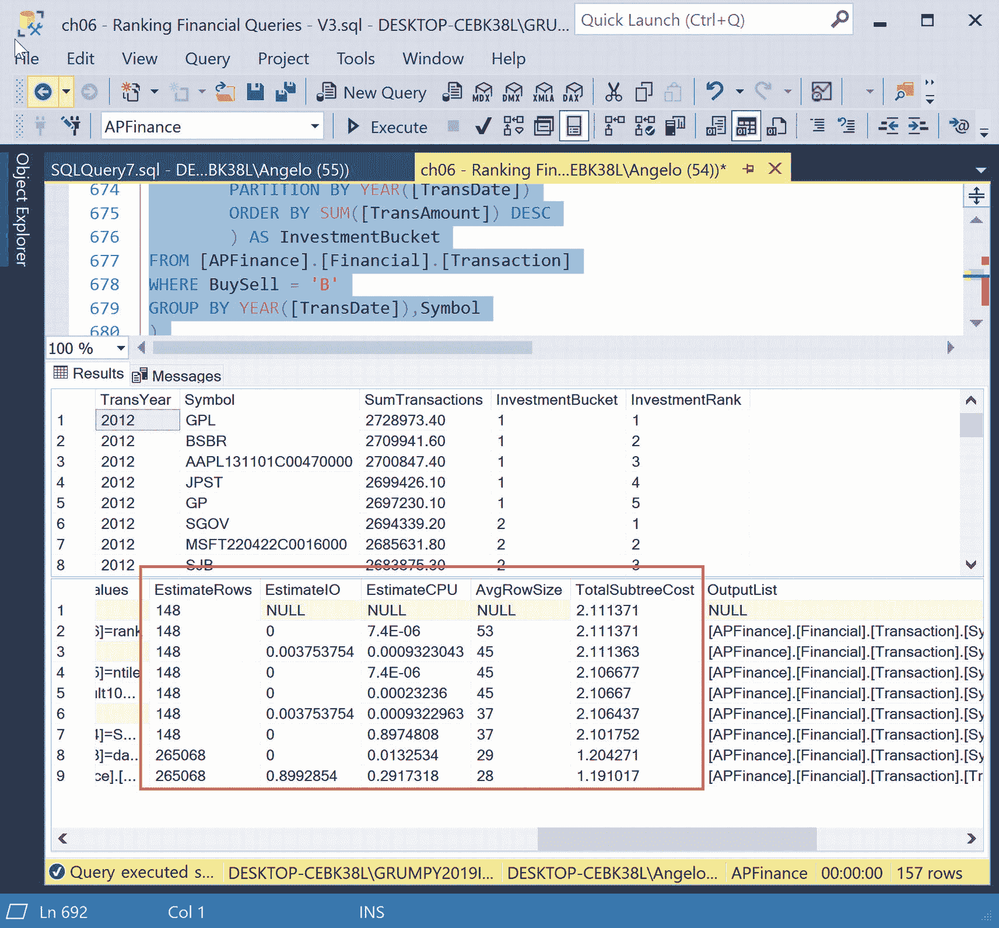

图 6-34

`NTILE()` 和 `RANK()` 的 PROFILE 统计信息

总的子树成本看起来很高。一个可能的解决方案是，你猜对了，用一张每日加载一次的报表表替换`CTE`。这应该能显著改善情况。注意，九个步骤中有六个的`EstimateIO`值为 0，因此处理是在内存中进行的（你拥有的内存越快越好）。

本章的脚本中提供了报表表方法的代码，所以你可以自己尝试一下。我很快会比较两种场景下的统计信息。

让我们看看其他统计信息。以下是两种方法的`IO`和`TIME`统计信息。

请参考图 6-35。

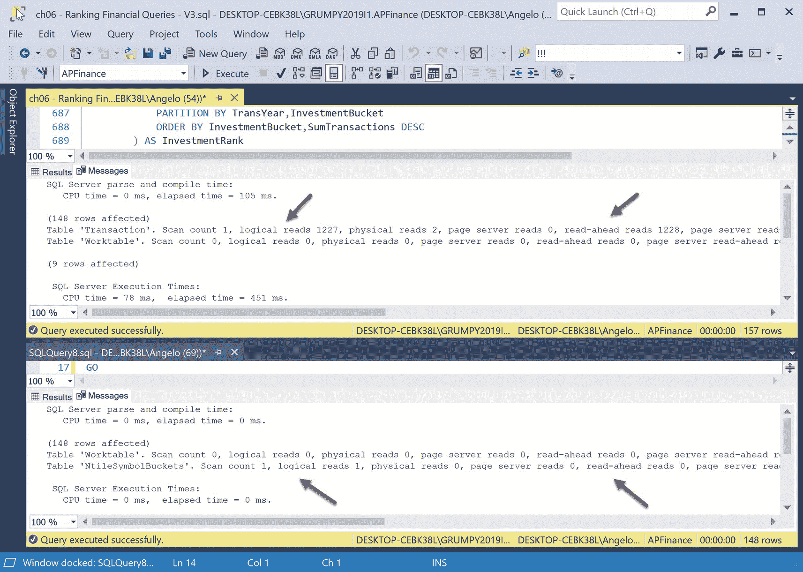

图 6-35

比较 IO 和 TIME 统计信息

这里我们查看由`CTE`和报表表方法生成的统计信息。

查看两种方法的逻辑读取和预读读取，我们发现报表表方法有显著的改进。逻辑读取从 1227 次下降到 1 次，预读读取从 1228 次下降到 0 次。因此，如果业务需求允许数据可以有 24 小时的延迟，你可以将计算密集型数据加载到报表表中，然后运行从预加载的报表表中生成结果的查询。

顺便说一句，当我使用报表表运行新查询的估算查询计划时，昂贵的哈希匹配聚合任务被消除了。简单有效的策略！

**注意**

为节省篇幅，我没有展示报表表策略的代码，但它包含在本章可供下载的代码中。试用它，检查它，弄坏它，然后改进它！这就是学习的方式。

#### ROW_NUMBER() 函数

如果你还记得，这个函数的作用正如其名。给定数据结果集中的一组行，它将为数据集（或分区）中的每一行分配一个连续的行号。
根据你如何设置 `OVER()` 子句以及 `PARTITION BY` 和 `ORDER BY` 子句，它将为结果集中的每个分区分配行号。也就是说，每当你移动到下一个分区时，行号都会从 1 开始，并连续递增，直到分区的最后一行。
最后，这个函数的行为与我们讨论过的其他一些函数类似，比如 `RANK()` 函数。现在让我们来比较一下这两个函数。
下一个脚本的业务需求如下：
对于每个客户的每组投资组合（所有年份），对客户投资组合中的投资组合账户业绩进行排名。包含每组结果的行号。
请参考清单 6-14。

```sql
WITH PortfolioAnalysis (
TradeYear,CustId,PortfolioNo,PortfolioAccountType,Portfolio,YearlyValue
)
AS (
SELECT Year AS TradeYear
,CustId
,PortfolioNo
,PortfolioAccountTypeCode
,Portfolio
,SUM(Value) AS YearlyValue
FROM Financial.Portfolio
WHERE Year > 2011
GROUP BY CustId,Year,PortfolioNo,PortfolioAccountTypeCode,Portfolio
)
SELECT TradeYear
,CustId
,PortfolioNo
,PortfolioAccountType
,Portfolio
,YearlyValue
,RANK() OVER(
PARTITION BY CustId,TradeYear
ORDER BY CustId,TradeYear,YearlyValue DESC
) AS PortfolioRankByYear
,ROW_NUMBER() OVER(
PARTITION BY CustId,TradeYear
ORDER BY CustId,TradeYear,YearlyValue DESC
) AS PortfolioRowNumByYear
FROM PortfolioAnalysis
GO
```
清单 6-14
为每个分区分配行号和排名

再次使用了 `CTE` 策略，这样我们可以生成交易总和值，然后让外部查询执行排名和行号分配。`RANK()` 和 `ROW_NUMBER()` 函数都使用了相同的分区定义和排序顺序。分区由 `CustId` 和 `TradeYear` 定义，分区结果集中的行按 `CustId`、`TradeYear` 和 `YearlyValue` 排序。
请参考图 6-36 中的部分结果。
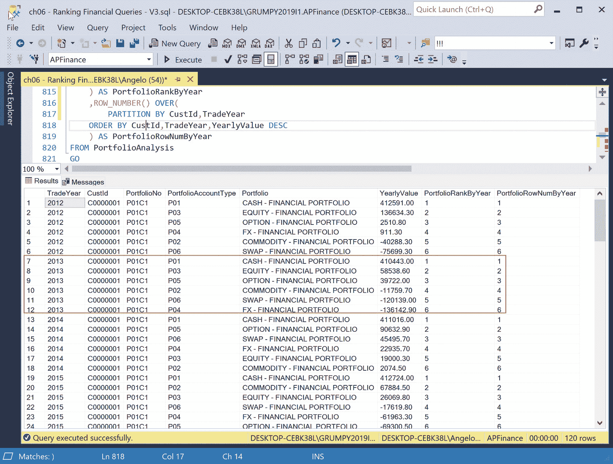
一个题为“排名财务查询”的 SQL 应用程序截图。它显示了一个程序和一个包含 24 行 8 列的列表，列分别为：交易年份、客户 ID、投资组合编号和账户类型、投资组合、年度价值、按年份排名的投资组合、按年份排序的投资组合行号。
图 6-36
投资组合分析报告
效果符合预期。现金投资组合似乎总是表现最佳。这是否意味着客户总是存入额外现金来覆盖交易，还是他们卖出股票并获利？
加载交易的脚本确实会存入额外现金，以确保我们的客户不会资金耗尽！
在开始性能分析之前，还有最后一张图。请参考图 6-37。
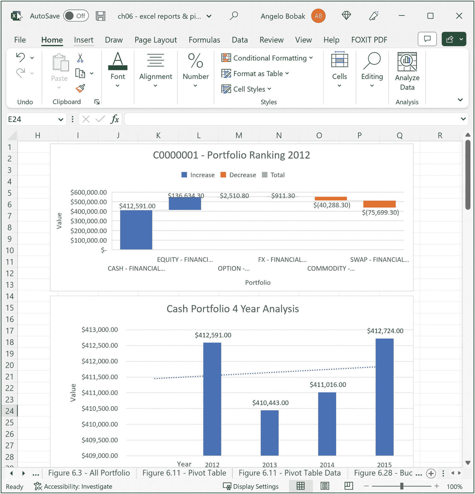
一个题为“ch06”的 Excel 表格截图。它绘制了两个关于价值与投资组合及年份关系的条形图。上图绘制了表示增长、下降和总值的条形。下图中，2015 年的条形具有最高值，为 $412724.00。
图 6-37
现金投资组合分析 – 两种视图
对于客户 `C0000001`（我们的老朋友，我们总是选择他），我们看到了四年间所有投资组合的价值。这些代表了所有买入和卖出交易的总和，加上现金账户的存款（贷记）和取款（借记）。这是你可以跟踪所有投资组合业绩，以及每个投资组合在所有年份中表现的一个例子。
最后一张图告诉我们，大量现金在 2013 年和 2014 年流出，但在 2015 年又赚了回来，并比 2012 年的价值高出约 $200,000。趋势线向上走，所以我想这是件好事！

### 性能考虑
按照我们的惯例，让我们为这个查询生成第一个估计执行计划。记住，它包含了 `RANK()` 和 `ROW_NUMBER()` 函数的步骤，因此结果应该与我们之前的查询没有太大不同。
请参考图 6-38。
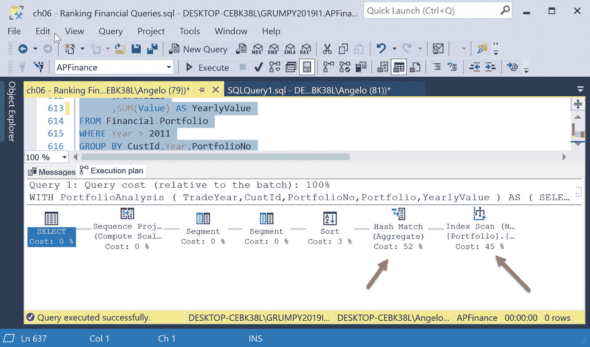
一个题为“排名财务查询”的 SQL 应用程序截图。它显示了程序和查询 1，其中包含选择成本、序列项目成本、2 个段成本、排序成本、哈希匹配成本和索引扫描成本。哈希匹配成本和索引扫描成本分别为 52% 和 45%。
图 6-38
第一个估计查询计划
这里没有意外，但我们有一个索引扫描，这比索引查找成本更高。这一项的开销占 45%。还有我们的老朋友，昂贵的 `哈希匹配聚合` 步骤，开销占 52%。`排序` 步骤占 3%，不算昂贵。让我们再次生成执行计划，但这次使用实时统计信息。
请参考图 6-39。
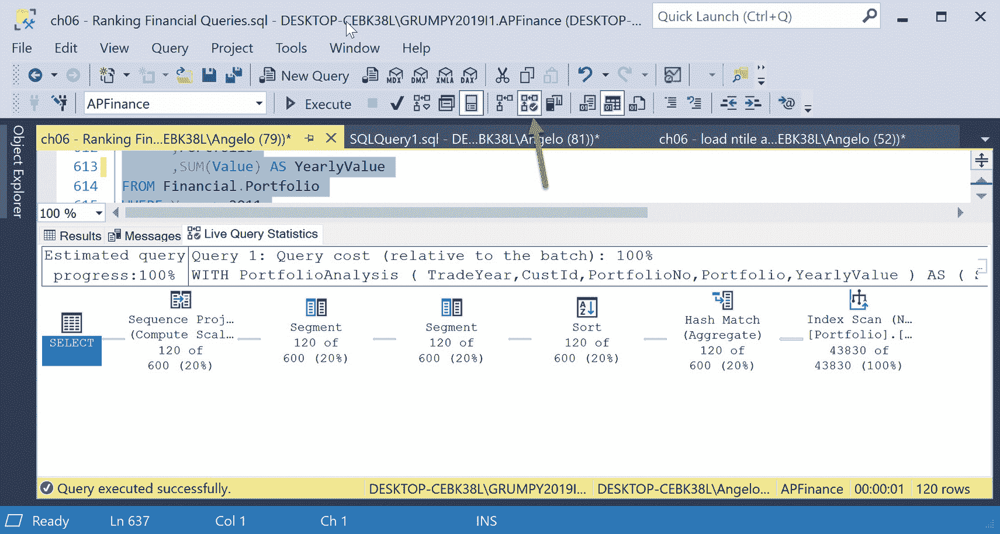
一个题为“排名财务查询”的 SQL 应用程序截图。它显示了程序和查询 1，其中包含选择、序列项目成本、段（120/600）、排序（120/600）、哈希匹配（120/600）和索引扫描（43830/43830）。
图 6-39
估计查询计划（带实时统计信息）
点击菜单栏上带有绿色小勾的图标将生成实时统计信息。顺便说一句，同时运行估计计划和实时统计信息是个好主意。
通常，它们应该相差不远，但如果相差较大，则需要进行一些分析和查询调整，以找出原因，比如计划之间的步骤增减。请注意，随着数据从右向左流动，我们看到了行计数。索引扫描检索到 43,830 行，处理开始后，行集减少到 120 行，这是后续每个步骤的计数。
***等一下。索引扫描显示 100% 而其他步骤显示 20%，这是怎么回事？***
这些实际上是时间进度指示器，而不是成本。如果一个查询运行时间足够长，你可以看到每个步骤的进度指示器递增，直到处理完成。让我们看一个例子。请参考清单 6-15。

```sql
SELECT TransYear,
N.Symbol,
SumTransactions,
InvestmentBucket,
RANK() OVER(
PARTITION BY TransYear,InvestmentBucket
ORDER BY InvestmentBucket,SumTransactions DESC
) AS InvestmentRank
FROM NtileSymbolBuckets N
CROSS JOIN [MasterData].[Calendar]
CROSS JOIN [Financial].[TickerSymbols]
GO
```
清单 6-15
用于生成动态统计信息的查询示例

这个查询本身没有意义。它只是执行了一个三表 `CROSS JOIN` 来生成大量行并使查询运行很长时间。如果你执行它，实际上可以看到随着查询运行，行号和时间花费计数器在变化。这是另一个工具，可以让你看到运行时间长的任务和数据量，以便查看是否可以改进查询以最小化这些密集型任务。查看图 6-40 中的输出。
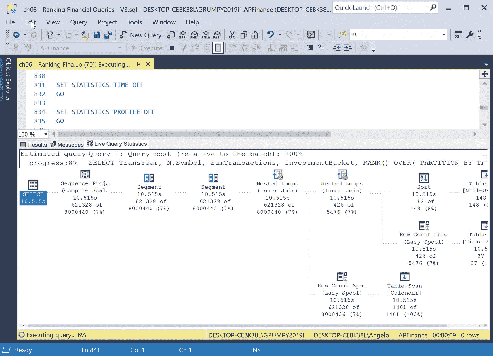
一个题为“排名财务查询”的 SQL 应用程序截图。它显示了一个程序并给出了估计的查询计划。它显示了 12 种成本值。
图 6-40
实时查询计划统计信息
我们可以看到以秒为单位的时间花费，例如计划右上角的 `排序` 步骤显示为 10.515 秒，并且只完成了 8%。我们也看到了行计数，因此这个输出包含大量有价值的信息，可帮助你进行性能调整。


最后但同样重要的是，请注意带有红色大 `X` 符号的嵌套循环任务。这些是警告。在此情况下，发生了 `CROSS JOIN`，并且没有 `ON` 谓词来连接表。如果您点击这些任务，收到的消息是“无连接谓词”。

恭喜！这是您可以添加到工具箱中的另一个工具！

## 数据间隙与岛屿问题

这最后一组脚本解决了经典的“间隙与岛屿”问题。回想一下，在我们的场景中，间隙是指一系列连续日期中缺失的日期，而岛屿则是客户为特定金融工具执行交易的连续日期集群。

这应该很有趣，因为需要采取很多步骤，我们将看到数据在每一步是如何转换的，直到生成最终报告。

我们将从 `LIBOR`（伦敦银行同业拆借利率）金融工具的交易日间隙开始。该脚本将分为五个步骤：第一步是加载测试数据，其余四步用于创建链式 `CTE` 以及生成所需报告的最终查询。用于识别岛屿的脚本将有四个步骤：三步用于创建链式 `CTE`，一步用于生成报告。

**注意**

我所说的链式 `CTE`，是指 `CTE` 查询前一个 `CTE`，直到最后一步，该查询引用链或序列中的最后一个 `CTE`。

我们的业务分析师希望我们创建一个查询，用于识别客户 C0000005 的交易日期中的间隙和岛屿（我们暂且放过客户 C0000001）。如前所述，我们将只关注 `LIBOR` 利率，并且只针对 2012 年。报告应包括间隙和岛屿的开始和停止日期，以及一列列出每种数据模式类别对应的日期。

图 6-41 是解决方案结果的预览。

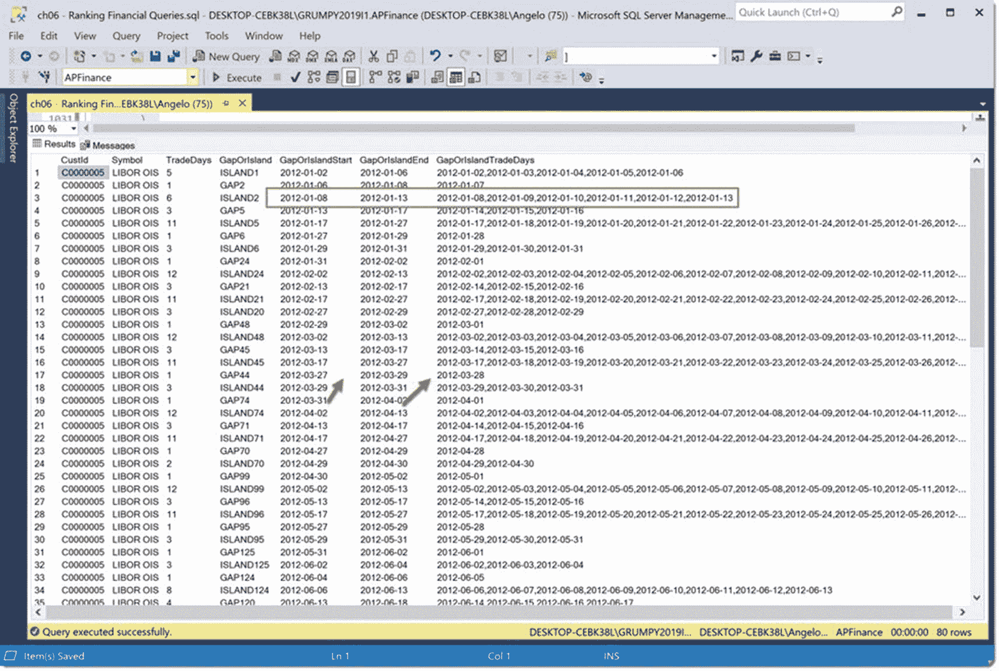

SQL 应用程序“排名金融查询”的截图。其中包含一个包含 35 行和 7 列的列表，数据涉及客户 ID、符号、交易日、间隙或岛屿、间隙或岛屿开始日期、间隙或岛屿结束日期以及间隙或岛屿交易日。

**图 6-41**
最终的间隙与岛屿报告

请注意截图中的框选区域。我们可以看到，岛屿的开始和结束日期后面跟着构成该岛屿的日期列表。这些日期包括开始和停止日期。箭头标识的间隙范围不包括开始和停止日期，只包括其间的日期。最后，我们看到标识日期模式是间隙还是岛屿的字符串。末尾的数字使此代码唯一，我们稍后会看到。我们面前有一项艰巨的任务。

让我们从创建用于存储测试数据的表开始。

请参阅清单 6-16。

```sql
CREATE TABLE Financial.CustomerBuyTransaction(
TransDate            date           NOT NULL,
CustId               varchar(8)     NOT NULL,
Symbol               varchar(64)    NOT NULL,
TradeNo              smallint       NOT NULL,
TransAmount          decimal(10,2)  NOT NULL,
TransTypeCode        varchar(8)     NOT NULL
) ON AP_FINANCE_FG
GO
```

**清单 6-16**
设置数据、间隙和岛屿

所有列名都是自解释的。从技术上讲，主键由 `TransDate`、`CustId`、`Symbol` 和 `TradeNo` 列组成。我们需要 `TradeNo` 列，以防客户在同一天对同一金融工具进行多次交易。

请参阅清单 6-17。

```sql
INSERT INTO Financial.CustomerBuyTransaction
SELECT
CAL.[CalendarDate]
,FT.CustId
,FT.Symbol
,ROW_NUMBER() OVER (
PARTITION BY CAL.[CalendarDate],FT.CustId,FT.Symbol,
FT.TransAmount,FT.TransTypeCode
ORDER BY CAL.[CalendarDate],FT.CustId,FT.Symbol,
FT.TransAmount,FT.TransTypeCode
) AS TradeNo
,FT.TransAmount
,FT.TransTypeCode
FROM [MasterData].[Calendar] CAL
JOIN [Financial].[Transaction] FT
ON CAL.[CalendarDate] = FT.TransDate
WHERE [BuySell] = 'B'
ORDER BY CAL.[CalendarDate],FT.CustId,FT.Symbol
GO
INSERT INTO Financial.CustomerBuyTransaction
VALUES('2012-01-01','C0000001','AA',2,312.40,'TT00002')
GO
```

**清单 6-17**
加载客户的交易数据

这是一个标准的 `INSERT/SELECT` 命令，用于加载表。有趣的是，我们使用了带有 `OVER()` 子句的 `ROW_NUMBER()` 函数来生成交易序列号，以便能够应对同一客户在同一日期对同一金融工具进行多次交易的情况。

创建此测试数据集所需的数据来自我们数据库中的 `Calendar` 和 `Transaction` 表。第二个 `INSERT` 命令只是为 2012 年 1 月 1 日的客户 C0000001 和金融工具 AA（美铝）插入第二笔交易，因此我们在同一天有两笔交易。

让我们通过执行以下查询来看看我们刚刚插入的数据是什么样子：

```sql
SELECT *
FROM [Financial].[CustomerBuyTransaction]
ORDER BY 1,2,3
GO
```

结果如图 6-42 所示。


SQL 应用程序“排名金融查询”的截图。它代表一个程序和一个包含 16 行和 7 列的列表，列分别是交易日期、客户 ID、符号、交易号、交易金额和交易类型代码。第 1、2、12 和 13 行被框选高亮显示。

**图 6-42**
测试数据及同一天多笔交易的实例

看起来 `ROW_NUMBER()` 函数完成了它的工作。前两行显示了同一天多笔交易的情况。第 12 和 13 行也是如此。我基本上是通过这个过程来确保我们为表有一个可行的主键，但看看它如何影响我们的间隙和岛屿逻辑将会很有趣。

接下来，我们需要为我们这个小练习创建一些人工间隙。

请参阅清单 6-18。

```sql
DELETE FROM Financial.CustomerBuyTransaction
WHERE [TransDate] IN(
SELECT [TransDate]
FROM [Financial].[CustomerBuyTransaction]
WHERE YEAR([TransDate]) = 2012
AND DAY(TransDate) IN (1,14,15,16,28)
UNION ALL
SELECT [TransDate]
FROM [Financial].[CustomerBuyTransaction]
WHERE YEAR([TransDate]) = 2013
AND DAY(TransDate) IN (5,17,22,23,24)
UNION ALL
SELECT [TransDate]
FROM [Financial].[CustomerBuyTransaction]
WHERE YEAR([TransDate]) = 2014
AND DAY(TransDate) IN (9,19,25,26,27,28)
UNION ALL
SELECT [TransDate]
FROM [Financial].[CustomerBuyTransaction]
WHERE YEAR([TransDate]) = 2015
AND DAY(TransDate) IN (2,8,11,17,23,24,25,26)
)
GO
-- need to insert these back in
INSERT INTO Financial.CustomerBuyTransaction
VALUES('2012-01-01','C0000001','AA',2,312.40,'TT00002')
GO
INSERT INTO Financial.CustomerBuyTransaction
VALUES('2012-01-01','C0000001','LIBOR OIS',2,2000.40,'TT00005')
GO
```

**清单 6-18**
创建交易活动中的间隙

用于删除一些随机日期的 `DELETE` 命令基本上是一系列 `UNION ALL` 命令，这些命令选择 `IN()` 运算符中列出的日期的 `TransDate` 值。该列表返回给 `DELETE` 命令，相应的行就被删除了。

是的，我需要重新插入我们首次加载表时讨论的那两天的多笔交易。这是可选的；如果您不想做，不需要这样做。

让我们通过创建第一个 `CTE` 来开始构建解决间隙问题的方案。


### 步骤 1：创建首个 CTE

这个首个 `CTE` 从我们的测试表中提取 2012 年、客户编号为 C0000005 的 `LIBOR` 工具相关行。

请参考清单 6-19。

```sql
WITH TradeGapsCTE(
TransDate,NextTradeDate,GapTradeDays,
CustId,Symbol,TransAmount,TransTypeCode
)
AS
(
SELECT
FT.[TransDate] AS TradeDate
,LEAD(FT.[TransDate]) OVER(
ORDER BY FT.[TransDate]
) AS NextTradeDate
,CASE
WHEN (DATEDIFF(dd,FT.[TransDate],LEAD(FT.[TransDate])
OVER(ORDER BY FT.[TransDate])) - 1) = -1
THEN 0
ELSE (DATEDIFF(dd,FT.[TransDate],LEAD(FT.[TransDate])
OVER(ORDER BY FT.[TransDate])) - 1)
END AS GapTradeDays
,FT.CustId
,FT.Symbol
,FT.TransAmount
,FT.TransTypeCode
FROM Financial.CustomerBuyTransaction FT
WHERE CustId = 'C0000005'
AND Symbol = 'LIBOR OIS'
AND YEAR(FT.TransDate) = 2012
),
清单 6-19
创建首个 CTE
```

第一步是检索相对于当前交易日的下一个交易日，因此使用了 `LEAD()` 函数。在 `OVER()` 子句内部，使用 `ORDER BY` 子句按 `TransDate` 列对分区数据集进行排序。

第二步是通过从当前交易日中减去刚刚讨论的相同 `LEAD()` 函数的结果来计算两个日期之间的天数。我们从结果中减去数值 1，因为如果一个交易日紧接另一个交易日，从技术上讲，两个日期之间的间隔为 0 天。

注意使用了 `CASE` 代码块来判断天数是否为 –1。当你从同一天减去自身再额外减去 1 时（如所使用的公式所示），就会发生这种情况。此逻辑会捕获该值并简单地报告为 0。是的，我承认这是一个变通方法。

注意
在构建间隔逻辑时，我们需要将间隔天数定义为仅间隔开始日与间隔结束日之间的天数。开始日和结束日是发生交易的日子，因此我们不希望将它们包含在内。

让我们看看第一个 `CTE` 中的查询生成的数据行。

请参考图 6-43。

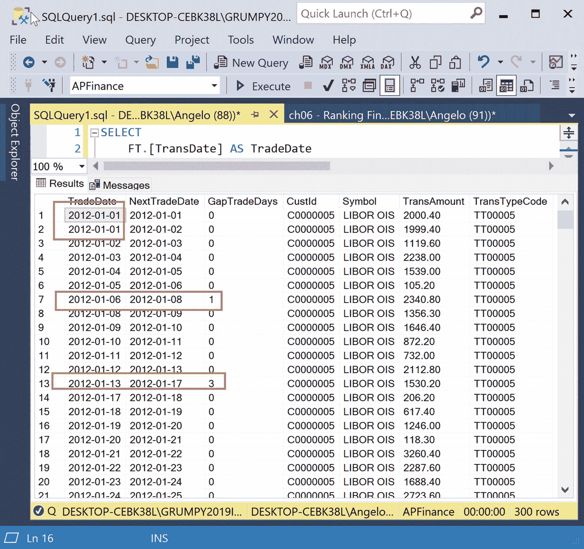
SQL 应用程序的屏幕截图。它展示了一个包含 21 行 8 列数据的程序列表，数据包括交易日、下一个交易日、间隔交易天数、客户 ID、代码、交易金额和交易类型代码。
图 6-43
首个 CTE，已识别出的间隔与孤岛

注意我们在 1 月 1 日的两笔交易。间隔为 0 天，这是正确的。请注意结果集中的第 7 行和第 13 行。交易间隔天数的计算也是正确的。2012 年 1 月 6 日和 2012 年 1 月 8 日之间有一天（2012 年 1 月 7 日）。同样，2012 年 1 月 13 日和 2012 年 1 月 17 日之间有三天（2012 年 1 月 14、15 和 16 日）。

到目前为止，逻辑似乎有效。接下来进入步骤 2，我们将定义第二个 `CTE`。

### 步骤 2：设置第二个 CTE 以标记间隔

现在我们有了基线数据集，我们需要用唯一的文本字符串标记间隔，以便在 `GROUP BY` 子句中使用，这将使我们能够识别间隔的开始和结束日期，同时排除其间的日期。

代码的下一部分将第一个 `CTE` 链接到第二个 `CTE`，以进一步设置数据。

这是我们目前的位置：`CTE2` 查询 `CTE1`。让我们看看代码。

请参考清单 6-20。

```sql
GapsAndIslands(
TransDate,NextTradeDate,GapTradeDays,
GapOrIsland,CustId,Symbol,TransAmount,TransTypeCode
)
AS (
SELECT TG.TransDate
,TG.NextTradeDate
,TG.GapTradeDays
,CASE
WHEN TG.GapTradeDays = 0 THEN 'ISLAND'
ELSE 'GAP' + CONVERT(VARCHAR,
ROW_NUMBER() OVER (ORDER BY YEAR(TG.TransDate)))
END AS GapOrIsland
,TG.CustId
,TG.Symbol
,TG.TransAmount
,TG.TransTypeCode
FROM TradeGapsCTE TG
),
清单 6-20
标记间隔
```

`CASE` 代码块中的 `ROW_NUMBER()` 函数再次派上用场。注意它是如何通过将数值附加到字符串末尾来创建唯一的“GAP”标识符字符串的。另外请注意，没有使用也不需要 `PARTITION BY` 或 `ORDER BY` 子句。

随堂测验
当未包含 `ORDER BY` 和 `PARTITION BY` 子句时，分区窗口框架的默认行为是什么？

“ISLAND”字符串标识符在所有孤岛上都是相同的。我们将在第二个示例中解决如何使每个孤岛的标识符唯一，但我向你保证，这比我们刚刚用于 GAP 标识符字符串的方法要稍微复杂一些。让我们看看临时结果。

请参考图 6-44。

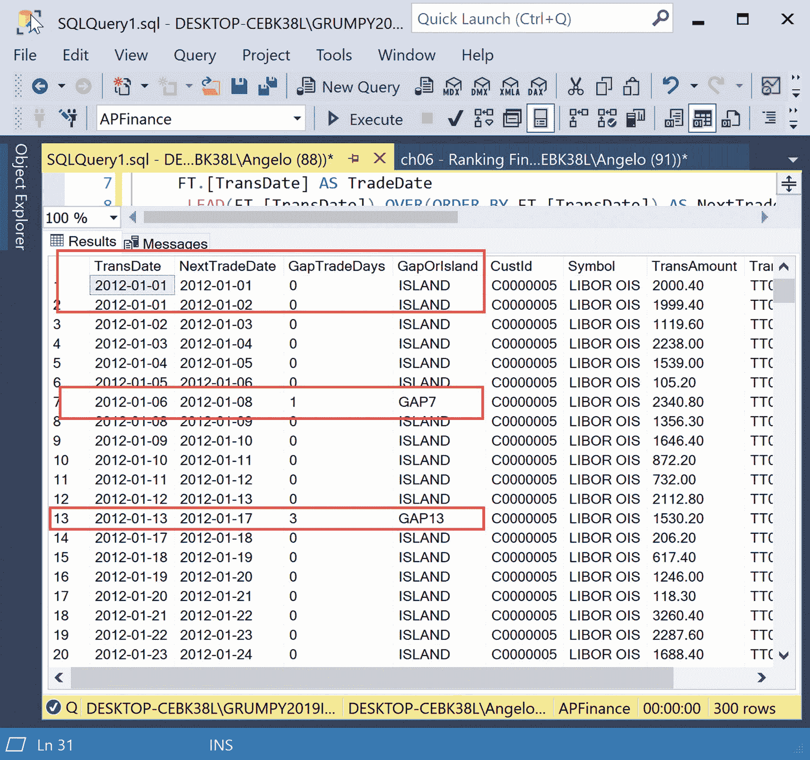
SQL 应用程序的屏幕截图。它展示了一个包含 20 行 8 列数据的列表，数据包括交易日、下一个交易日、间隔交易天数、间隔或孤岛、客户 ID、代码和交易金额。
图 6-44
已识别出的间隔与孤岛

所有间隔和孤岛都被正确标记（ISLAND 字符串稍后需要处理）。

我们可以看到 `ROW_NUMBER()` 函数返回的值如何附加到字符串“GAP”以生成唯一标识符。这对阅读报告的分析人员来说没有意义，但对于最终确定报告的 `GROUP BY` 子句来说，这是一个非常有价值的机制。

### 步骤 3：设置第三个 CTE 并识别间隔的开始/结束日期

现在我们提取日期间隔的开始和结束日期。清单 6-21 是第三个也是最后一个链式 `CTE` 的清单（`CTE3` 调用 `CTE2`，后者调用 `CTE1`）。

```sql
FinalGapIslanCTE (
CustId,Symbol,GapTradeDays,GapOrIsland,GapStart,GapEnd
)
AS (
SELECT ,CustId
,Symbol
,GapTradeDays
,GapOrIsland
,MIN(TransDate)     AS GapStart
,MAX(NextTradeDate) AS GapEnd
FROM GapsAndIslands
WHERE NextTradeDate IS NOT NULL
AND GapTradeDays > 0
GROUP BY CustId
,Symbol
,GapTradeDays
,GapOrIsland
)
清单 6-21
识别间隔的开始和结束日期
```

这个 `CTE` 很简单。它基于一个标准查询，该查询使用 `MIN()` 和 `MAX()` 函数来提取间隔的开始和结束日期。不需要 `OVER()` 子句。我们过滤掉间隔交易天数为 0 的行（即孤岛）以及下一个交易日为 `NULL` 的任何行，只是为了保持整洁。

注意必需的 `GROUP BY` 子句。让我们看看这一步的结果。

请参考图 6-45。

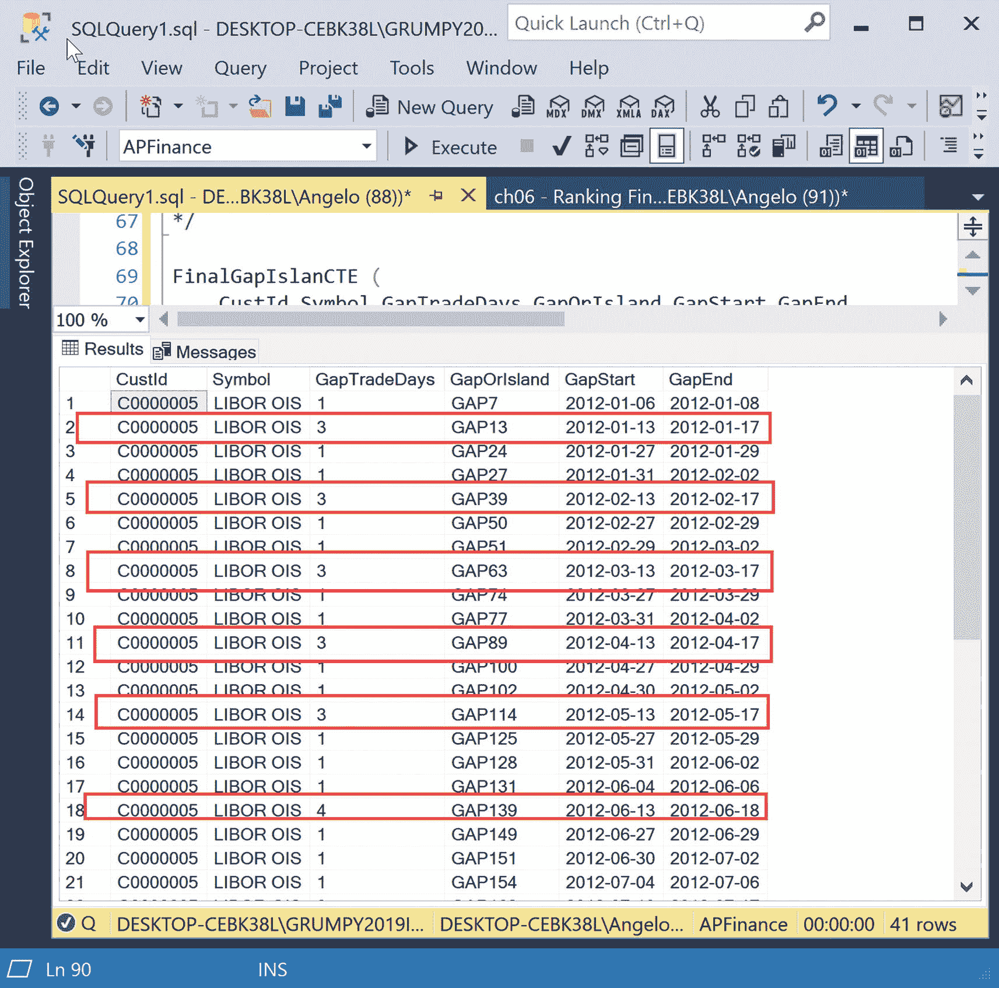
SQL 应用程序的屏幕截图。它展示了一个包含 21 行 6 列数据的列表，数据包括客户 ID、代码、间隔交易天数、间隔或孤岛、间隔开始日期和间隔结束日期。第 2、5、8、11、14 和 18 行用方框突出显示。
图 6-45
带有开始和结束日期的间隔

这正是我们想看到的：所有间隔都有唯一的代码。我高亮显示了值大于一的间隔，这样我们可以抽查开始和结束日期是否合理。看第 18 行，`GAP139`，2012 年 6 月 13 日和 2012 年 6 月 18 日之间确实有四天（2012 年 6 月 14、15、16 和 17 日）。如果我们能以某种方式将这些日期列在这两个日期旁边的逗号分隔字符串中，岂不是很好？

这正是我们将在最后一步要做的！


## 步骤 4：生成报告

我们的下一个也是最后一步，是通过在报告中包含一个以逗号分隔的字符串形式的间隔天数来增强报告。是的，这违反了范式（重复组，`1NF`），但我们正在为数据模式进行反规范化处理，因为它为报告带来了价值。

我们将引入 `STRING_AGG()` 函数来拯救，并将其包含在 `SELECT` 子句的一个嵌入式查询中（这对性能会有什么影响？）。这个最后的查询完成了链式 `CTE`（该查询引用 `CTE3`，`CTE3` 又查询 `CTE2`，而 `CTE2` 查询 `CTE1`）。

请参阅代码清单 6-22。

```
SELECT CustId
,Symbol
,GapTradeDays
,GapStart
,GapEnd
(
SELECT STRING_AGG(CalendarDate,',')
FROM [MasterData].[Calendar]
WHERE CalendarDate BETWEEN DATEADD(dd,1,GapStart)
AND DATEADD(dd,-1,GapEnd)
) AS GapInTradeDays
FROM FinalGapIslanCTE
ORDER BY CustId
,Symbol
,GapStart
GO
代码清单 6-22
组装报告
```

出现在 `SELECT` 子句中的内联查询有点棘手，因为它需要通过使用 `BETWEEN` 谓词中的 `DATEADD()` 函数来跳过间隔的开始和结束日期。我们在间隔开始日期上加一天，并在间隔结束日期上减一天。请记住，交易确实发生在开始和结束日期，因此它们不包括在间隔天数中。

这些天数从日历表中检索，并传递给 `STRING_AGG()` 函数，以便它可以为我们创建一个逗号分隔的列表。非常强大！让我们看看结果。

请参见图 6-46。

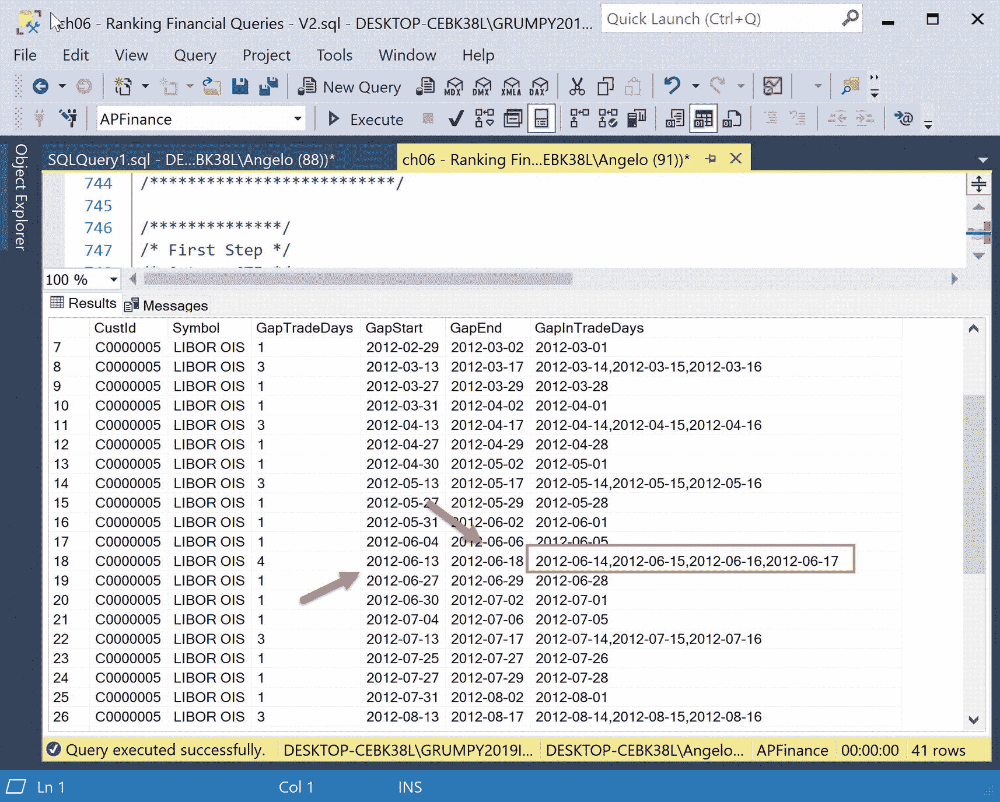

一张标题为“排名财务查询”的 SQL 应用程序截图。它显示了一个包含 26 行 6 列的列表，数据包括客户 ID、符号、间隔交易天数、间隔开始、间隔结束以及交易日期间隔。

图 6-46：最终间隔报告

看起来不错。提醒一下，对于第一个间隔（以及所有其他间隔），请注意我们没有在 `GapInTradeDays` 列中包含第一天和最后一天，因为交易发生在这些天。是那些没有发生交易的中间的一天（或几天）。

看第 18 行，交易发生在 2012 年 6 月 13 日和 2012 年 6 月 18 日，但这两个日期之间没有发生交易，这在 `GapInTradeDays` 列的日期列表中正确显示。它正确地列出了 `GapTradeDays` 列中标识的四个日期。

这很简单。让我们检查一下这个大型脚本的估计查询计划，该脚本包含三个链式 `CTE` 和一个查询。

### 性能考虑

此脚本的估计查询计划很大，因此我将其拆分为两个屏幕截图。我们不会像讨论前面的例子那样进行严格的分析，但对于一个大型脚本，了解它的样子将会很有趣。

请参见图 6-47。

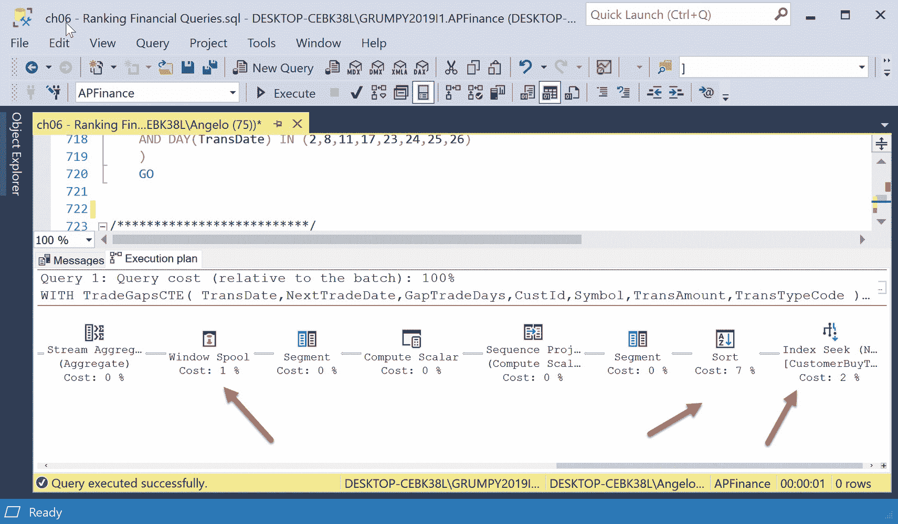

一张标题为“排名财务查询”的 SQL 应用程序截图。它表示一个程序，有 8 列，分别显示流聚合成本、窗口假脱机成本、2 段成本、计算标量成本、序列投影成本、排序成本和索引查找成本。排序成本为 7%。索引查找成本为 2%。

图 6-47：估计查询计划的第一部分（右侧）

从右向左看，我们看到一个低成本的索引查找，占比 2%。这非常高效。接下来是一个排序步骤，占比 7%，以及一个窗口假脱机，占比 1%（表示假脱机到存储而非内存）。还有一些成本为 0% 的任务，但我们像往常一样忽略它们。

这并不是说当您进行自己的分析时也应该忽略它们。分析每一步，不仅是高成本的步骤，还包括那些您不理解其作用的步骤。查阅 Microsoft 文档了解这些步骤的含义，然后确定它们产生的影响（如果有的话）。这样可以扩展您与性能调优相关的知识库。

让我们看一下估计查询计划的第二部分。请参见图 6-48。

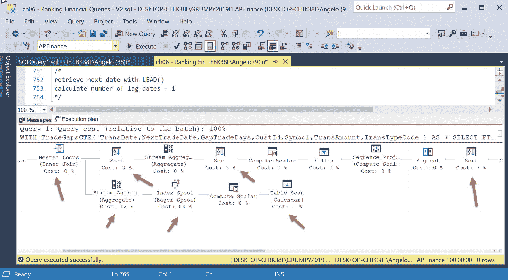

一张标题为“排名财务查询”的 SQL 应用程序截图。它表示一个程序和查询 1，显示了嵌套循环成本、排序成本、流聚合成本、索引假脱机成本和表扫描成本的不同值。

图 6-48：估计查询计划的第二部分（左侧）

这里有更多的活动。在第一层，我们看到一个排序步骤成本为 7%，接着是第二个排序步骤成本为 3%。而且，是的，还有一个排序步骤成本再次为 3%。

在下面的分支中，我们看到一个小的表扫描成本为 1%，一个索引假脱机成本为 63%，以及一个流聚合成本为 12%。

回想一下，索引假脱机意味着搜索值被存储到临时存储中，以便在查询处理分区时可以多次访问。

这个任务为一个流聚合任务（成本 12%）提供数据，并最终为嵌套循环连接任务提供数据。这种类型的连接就是导致索引假脱机的原因。任何类型的假脱机到存储的操作都可能很昂贵，我们应该始终检查是否可以改进它。作为最后的手段，将 `TEMPDB` 实施在固态硬盘上，以使假脱机更快！

不妨打开 `PROFILE STATISTICS` 设置，看看大型脚本的统计信息是什么样的。请参见图 6-49。

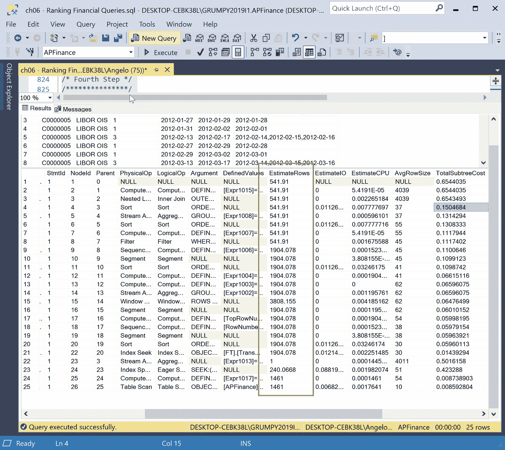

一张标题为“排名财务查询”的 SQL 应用程序截图。它表示一个包含 25 行 12 列的列表。估算行数列被突出显示。

图 6-49：查询配置文件统计信息

估算的 `IO` 统计信息 (`EstimateIO`) 很低，大部分估算的 `CPU` 统计信息 (`EstimateCPU`) 也很低。第一个 `CPU` 统计信息很高，为 5.419，这是第一个 `CTE` 的。结果的第 7 行也有一个较高的 `CPU` 统计信息 (`EstimateCPU`)，恰好对应一个 `CASE` 块。还有两个剩余的段步骤，其 `CPU` (`EstimateCPU`) 值为 3.8。

最后，看看每个步骤返回的估计行数 (`EstimateRows`)。在这里，我们了解了在计划中处理数据时，每个步骤之间那些粗细不同的线条发生了什么（就行数而言）。有趣的是，随着计划中每个步骤处理数据，行数从低到高，然后再回到低。

家庭作业

看看您是否能更快地分析这个查询，并通过修改查询或添加您认为有帮助的索引来提高性能。

在深入修改我们最后也是最终的报告以识别岛屿并在同一报告中包含间隔之前，是时候喝杯咖啡了。

## 接下来是岛屿

本章的最后一个目标是增强我们的间隔报告以包含岛屿。回想一下，岛屿是按顺序出现的数据集群，就像我们连续多天发生的交易一样。

回想一下，连续交易十天或以上、停止三到四天然后又开始交易的客户，就是中间有一个间隔的岛屿的例子。

我们将采取的方法类似于我们处理间隔报告时所遵循的方法，但生成将在 `GROUP BY` 子句中使用的唯一岛屿文本字符串将是一个挑战。

原因是 `ROW_NUMBER()` 函数将为岛屿中的每一行返回一个唯一值，它本身不能用于生成字符串。我们必须想出一个技巧，涉及一行所在月份中的日期及其与行号值之间的差异。


### 步骤 1：使用 `LAG()` 和 `LEAD()` 创建第一个 CTE

`CTE` 链中的第一个 `CTE` 与我们用于间隙报告脚本的那个类似，只是有几处细微的补充，我会进行解释。请参考清单 `6-23`。

```
WITH TradeGapsCTE(
TransDate,NextTradeDate,GapTradeDays,CustId,Symbol,
TransAmount,TransTypeCode
)
AS
(
SELECT
FT.[TransDate] AS TradeDate
,LEAD(FT.[TransDate]) OVER(ORDER BY FT.[TransDate]) AS NextTradeDate
,CASE
WHEN LEAD(FT.[TransDate])
OVER(ORDER BY FT.[TransDate]) = FT.TransDate
THEN 0
ELSE DATEDIFF(dd,FT.[TransDate],LEAD(FT.[TransDate])
OVER(ORDER BY FT.[TransDate])) - 1
END AS GapTradeDays
,FT.CustId
,FT.Symbol
,FT.TransAmount
,FT.TransTypeCode
FROM Financial.CustomerBuyTransaction FT
WHERE CustId = 'C0000005'
AND Symbol = 'LIBOR OIS'
AND YEAR(FT.TransDate) = 2012
--ORDER BY FT.TransDate
)
-- uncomment below to test CTE
SELECT * FROM TradeGapsCTE
ORDER BY 1
清单 6-23
创建岛屿 CTE1
```

这个第一个 `CTE` 与之前间隙示例中的第一个 `CTE` 唯一的区别是**粗体和斜体**字体中的代码。它们是对交易日期等于下一个交易日期的条件进行的逻辑测试。如果成立，它将间隙交易数设为 `0`；否则，它取这两个日期的差值，并从差值中减去 `1` 来确定间隙天数。

这很合理，因为在连续交易日的条件下，间隙为 `0`。让我们执行这个 `CTE`，并用一个小查询来展示生成的值。

请参考图 `6-50`。

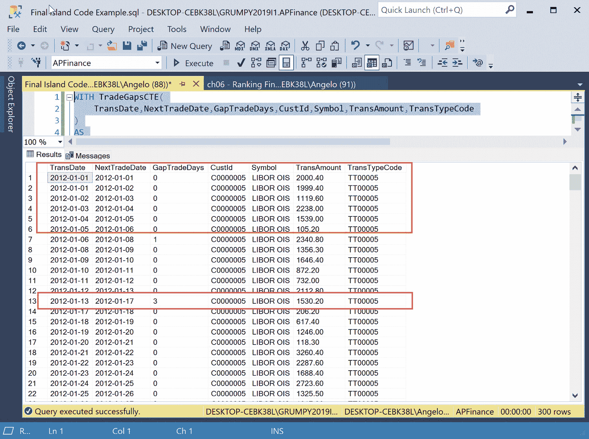

一个 SQL 应用程序的截图。它展示了一个包含 `22` 行和 `7` 列的列表，数据涉及交易日期、下一交易日期、间隙交易日、客户 ID、代码、交易金额和交易类型代码。第 `1` 到 `5` 行以及第 `13` 行被一个方框高亮标出。

图 `6-50`
岛屿 CTE1 报告

看起来不错。间隙显示的值与之前的报告相同。不过，岛屿组的成员是连续出现的。我们希望提取这些岛屿的起始和结束日期。我们需要为每个岛屿组分配一个唯一的文本来标识属于该岛屿的行组。

### 步骤 2：创建用于标记岛屿和间隙的第二个 CTE

在链式 `CTE` 序列中的第二个 `CTE` 将开始为每一行标记其属于间隙还是岛屿的成员关系。我们需要用 `CASE` 块检查几个条件，所以代码即使不复杂也会很有趣。

请参考清单 `6-24`。

```
GapsAndIslands(
TransDate,NextTradeDate,GapTradeDays,GapOrIsland,
CustId,Symbol,TransAmount,TransTypeCode
)
AS (
SELECT TG.TransDate
,CASE
WHEN TG.NextTradeDate IS NULL THEN DATEADD(dd,1,TG.TransDate)
ELSE TG.NextTradeDate
END AS NextTradeDate
,CASE
WHEN TG.GapTradeDays IS NULL THEN 0
ELSE TG.GapTradeDays
END AS GapTradeDays
,CASE
WHEN DATEDIFF(dd,TransDate,NextTradeDate) = 0
THEN 'ISLAND' + CONVERT(VARCHAR,ABS((DAY(TG.NextTradeDate) - ROW_NUMBER()OVER (ORDER BY YEAR(TG.TransDate)))))
WHEN DATEDIFF(dd,TransDate,NextTradeDate) = 1
THEN 'ISLAND' + CONVERT(VARCHAR,ABS((DAY(TG.NextTradeDate) - ROW_NUMBER()OVER(ORDER BY YEAR(TG.TransDate)))))
WHEN NextTradeDate IS NULL
THEN 'ISLAND' + CONVERT(VARCHAR,(ROW_NUMBER()
OVER(ORDER BY YEAR(TG.TransDate))))
ELSE 'GAP' + CONVERT(VARCHAR,ABS(DAY(TG.NextTradeDate) - ROW_NUMBER()OVER(ORDER BY YEAR(TG.TransDate))))
END AS GapOrIsland
,TG.CustId
,TG.Symbol
,TG.TransAmount
,TG.TransTypeCode
FROM TradeGapsCTE TG
)
-- uncomment below to test CTE
--SELECT TransDate,NextTradeDate,GapTradeDays,GapOrIsland,
--CustId,Symbol,TransAmount,TransTypeCode
--FROM GapsAndIslands
--ORDER BY 1
--GO
清单 6-24
创建第二个 CTE，标记岛屿和间隙
```

这里有三个 `CASE` 块。第一个块测试下一个交易为 `NULL` 的条件。这发生在结果集中没有更多数据时。如果是这样，它将在当前交易日期上加一天，并将其报告为下一个交易日。否则，它返回有效的下一个交易日期：

```
,CASE
WHEN TG.NextTradeDate IS NULL THEN DATEADD(dd,1,TG.TransDate)
ELSE TG.NextTradeDate
END AS NextTradeDate
```

下一个 `CASE` 块测试间隙或岛屿天数是否为 `NULL` 的条件。如果是这种情况，它只是返回值 `0` 而不是 `NULL`。否则，返回岛屿或间隙的天数：

```
,CASE
WHEN TG.GapTradeDays IS NULL THEN 0
ELSE TG.GapTradeDays
END AS GapTradeDays
```

第三个 `CASE` 块是我们生成岛屿或间隙组标识符字符串的地方，例如 `ISLAND10` 或 `GAP 15`：

```
,CASE
WHEN DATEDIFF(dd,TransDate,NextTradeDate) = 0
THEN 'ISLAND' + CONVERT(VARCHAR,(DAY(TG.NextTradeDate)
- ROW_NUMBER() OVER (ORDER BY YEAR(TG.TransDate))))
WHEN DATEDIFF(dd,TransDate,NextTradeDate) = 1
THEN 'ISLAND' +  CONVERT(VARCHAR,(DAY(TG.NextTradeDate)
- ROW_NUMBER() OVER (ORDER BY YEAR(TG.TransDate))))
WHEN NextTradeDate IS NULL
THEN 'ISLAND' + CONVERT(VARCHAR,(ROW_NUMBER()
OVER (ORDER BY YEAR(TG.TransDate))))
ELSE 'GAP' + CONVERT(VARCHAR,ABS(DAY(TG.NextTradeDate)
- ROW_NUMBER() OVER (ORDER BY YEAR(TG.TransDate))))
END AS GapOrIsland
```

这有点复杂，有三个条件需要测试，以及一个默认条件。

第一个条件检查交易日期和下一个交易日期之间的天数。如果值为零，我们通过将文本 `ISLAND` 与下一个交易日期的日部分减去行号的数值连接起来，生成岛屿的文本字符串。

第二个条件也检查交易日期和下一个交易日期之间的天数。如果值为 `1`，我们同样通过将文本 `ISLAND` 与下一个交易日期的日部分减去行号的数值连接起来，生成岛屿的文本字符串。

第三个条件检查下一个交易日期是否为 `NULL`。如果值为 `NULL`，我们通过将文本 `ISLAND` 仅与行号的数值连接起来，生成岛屿的文本字符串。


默认条件是生成一个以字符串"GAP"加上交易日期与下一个交易日期的差值绝对值组成的字符串。我们只需要正数，因此不会看到用于命名行分组的两部分文本之间的破折号（–）符号。

让我们执行这个使用两个链式`CTE`的查询。

请参考图 6-51。

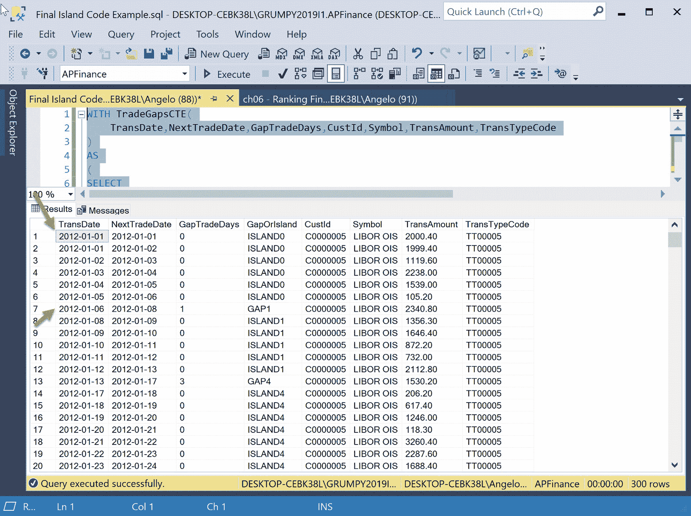

标题为“最终岛屿代码示例”的 SQL 应用程序截图。它显示了一个包含 20 行 8 列的列表，数据包括交易日期、下一个交易日期、间隔交易天数、间隔或岛屿标识、客户 ID、股票代码、交易金额和交易类型代码。

图 6-51

为间隔和岛屿的唯一组命名

看起来成功了。如图所示，每组行在`GapOrIsland`列中都有唯一的值。这就是我们在`GROUP BY`子句中提取每组行的最小和最大交易日期时将使用的依据。这就是我们接下来所做的：添加第三个`CTE`来帮助我们使用`MIN()`和`MAX()`函数。

如果我们获取交易日期和间隔交易天数这两列数据，放入 Excel 电子表格中，就能很好地可视化间隔和岛屿。请参考图 6-52。

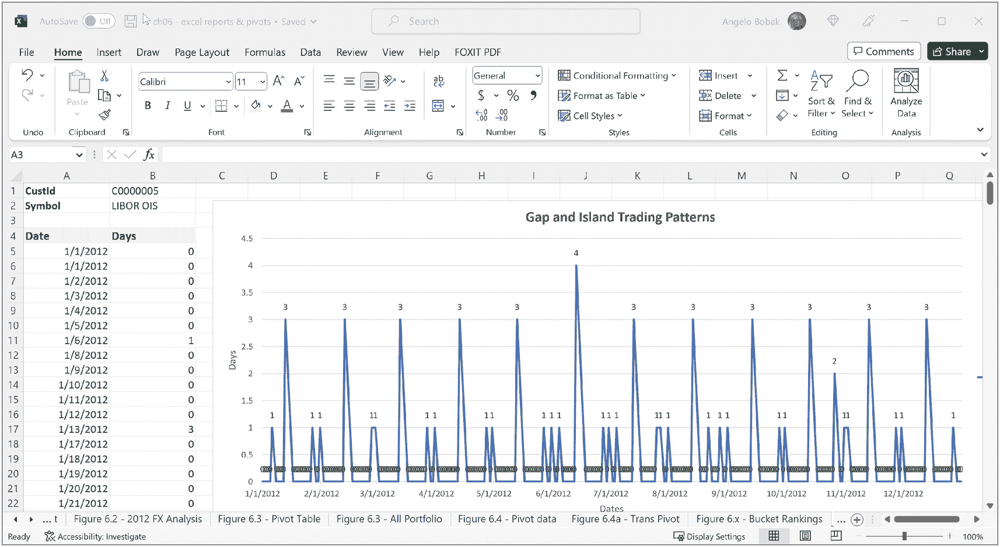

Excel 工作表的截图。左侧是包含“数据”和“天数”两列的列表。右侧是一个天数与日期的折线图，绘制了一条带有尖锐峰值的线。在 2012 年 1 月 6 日至 7 日之间，线达到了最高峰值 4。

图 6-52

间隔与岛屿图表

有时候，一个好的图表或可视化能让原始数据变得清晰易懂！峰值当然是间隔，而所有零值就是岛屿。

### 步骤 3：确定岛屿开始/结束日期

最后一个`CTE`相当简单。我们基本上用它来提取每个岛屿和间隔行集的开始和结束日期。请参考代码清单 6-25。

```
FinalGapIslandCTE (
CustId,Symbol,GapTradeDays,GapOrIsland,GapIslandStart,GapIslandEnd
)
AS (
SELECT CustId
,Symbol
,GapTradeDays
,GapOrIsland
,MIN(TransDate) AS GapIslandStart
,MAX(NextTradeDate) AS GapIslandEnd
FROM GapsAndIslands
GROUP BY CustId
,Symbol
,GapTradeDays
,GapOrIsland
)
--取消下面注释以测试 CTE
SELECT * FROM FinalGapIslandCTE
ORDER BY CustId,GapIslandStart
GO
代码清单 6-25
确定间隔和岛屿的开始与结束日期
```

如前所述，我们现在可以使用`MIN()`和`MAX()`函数了，因为我们有唯一的字符串名称来帮助识别每组岛屿或间隔行。幸运的是，日期都是连续的，所以这个方案适用于此场景。根据你处理的数据，你可能需要设计另一个方案来生成这些唯一的间隔和岛屿字符串标识符。这些数据位于`GapOrIsland`列中，该列出现在`GROUP BY`子句中。

同时请注意这个未被注释的小查询。它用于在`CTE`链的每一步检查结果，以确保一切按预期工作。一旦你在自己的环境中测试完此脚本的所有部分，就可以注释掉该查询。让我们看看结果。

请参考图 6-53。

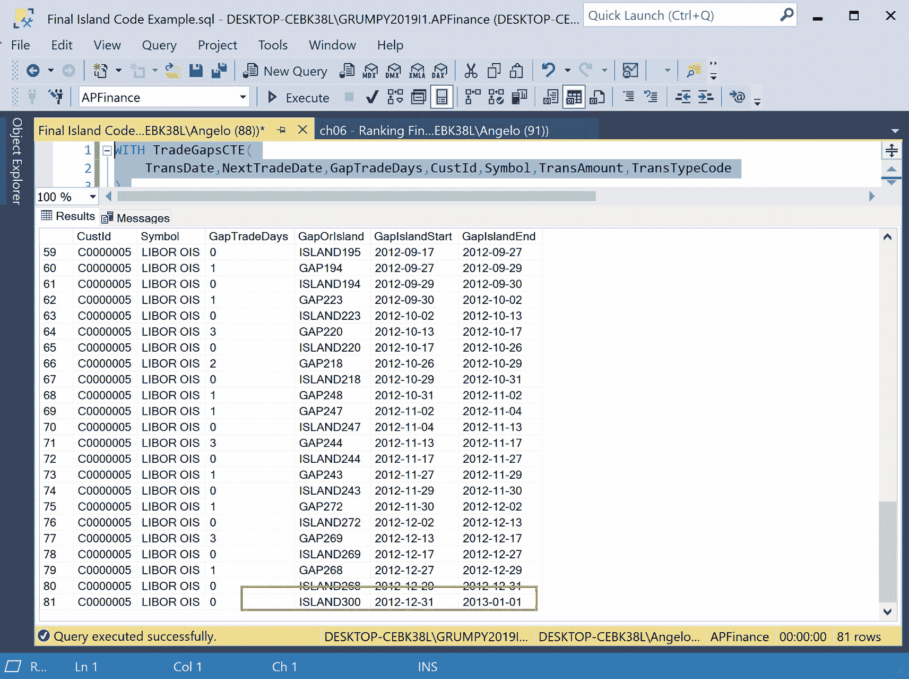

标题为“最终岛屿代码示例”的 SQL 应用程序截图。它显示了一个程序和一个包含 6 列的列表，数据包括客户 ID、股票代码、间隔交易天数、间隔或岛屿标识、间隔岛屿开始日期和间隔岛屿结束日期。

图 6-53

包含开始和结束日期的间隔与岛屿报告

这也成功了。我们快完成了。注意突出显示的最后一行，它显示了岛屿名称以及开始和结束日期。这是数据集的最后一行，因为 2012 年 12 月 31 日之后没有更多的测试交易，尽管脚本中的逻辑会给开始结束日期加一天并将其用作间隔或岛屿的结束日期。我们本可以保留原样显示`NULL`值，但我认为这样处理更整洁。

剩下的就是编写主查询，该查询还将岛屿或间隔中的所有日期包含在一个逗号分隔的字符串中。如前所述，这违反了`1NF`（第一范式）设计规则，但在这种情况下，我认为是合适的。


### 步骤 4：创建最终报告

这是脚本的最后一步。这个脚本有点复杂，因为它还包含两个 `CASE` 语句块，用于正确计算“间隔”和“岛屿”中的天数，以及创建一个字符串来显示所有间隔和岛屿中的日期（但作为单个值）。

请参考清单 6-26。

```sql
SELECT CustId
,Symbol
,CASE
WHEN GapOrIsland LIKE 'ISLAND%' THEN DATEDIFF(dd,GapIslandStart,GapIslandEnd) + 1
ELSE GapTradeDays
END AS TradeDays,
,GapOrIsland
,GapIslandStart AS GapOrIslandStart
,GapIslandEnd AS GapOrIslandEnd,
,CASE
WHEN GapOrIsland LIKE 'GAP%' THEN
(
SELECT STRING_AGG(CalendarDate,',')
FROM [MasterData].[Calendar]
WHERE CalendarDate BETWEEN DATEADD(dd,1,GapIslandStart)
AND DATEADD(dd,-1,GapIslandEnd)
)
ELSE (
SELECT STRING_AGG(CalendarDate,',')
FROM [MasterData].[Calendar]
WHERE CalendarDate BETWEEN GapIslandStart AND GapIslandEnd
)
END AS GapOrIslandTradeDays
FROM FinalGapIslandCTE
ORDER BY CustId,Symbol,GapIslandStart
GO
```

清单 6-26
最终的间隔和岛屿报告

第一个 `CASE` 语句块检查每一行 `GapOrIsland` 列中是否包含字符串 "`ISLAND%`"。如果找到，它会使用 `DATEDIFF()` 函数生成开始和结束日期之间的差值，并对开始日期加 1，对结束日期减 1。

如果该值不是 "`ISLAND%`"，那么它就接受 `TradeDays` 列中的当前结果。请回忆一下，百分比 (`%`) 字符表示存在某种数值，但对于当前这个条件测试，我们并不关心它是什么。

第二个 `CASE` 语句块包含生成岛屿或间隔中逗号分隔日期列表的逻辑。请记住，对于岛屿，我们希望包含开始和结束日期，但对于间隔，我们只想要中间的日期。

第一个测试查找字符串 "`GAP%`"。如果找到该值，一个子查询会提取开始日期和结束日期之间的日期，这些日期分别增加了 1 天和减少了 1 天，因此查询会从日历表中提取这些修改后日期之间的任何日期：

```sql
SELECT STRING_AGG(CalendarDate,',')
FROM [MasterData].[Calendar]
WHERE CalendarDate BETWEEN DATEADD(dd,1,GapIslandStart)
AND DATEADD(dd,-1,GapIslandEnd)
```

可靠的 `BETWEEN` 谓词就用来做这个！这可能是一个昂贵的策略，因为我们有一个嵌套的 `SELECT` 查询，并且它所查询的 `Calendar` 表有 1,461 行。

最后，第二个也是最后一个测试实际上是默认条件。它使用相同的查询提取日期列表，但这次不需要使用 `DATEADD()` 函数：

```sql
SELECT STRING_AGG(CalendarDate,',')
FROM [MasterData].[Calendar]
WHERE CalendarDate BETWEEN GapIslandStart AND GapIslandEnd
```

数据通过 `ORDER BY` 子句排序，这样我们就完成了。让我们看看结果。希望它有效。请参考图 6-54。


SQL 应用程序的截图，标题为“SQL 查询 1”。它代表一个程序和一个包含 7 列数据的列表，数据涉及客户 ID、符号、交易日、间隔或岛屿、间隔或岛屿开始日期、间隔或岛屿结束日期以及间隔或岛屿交易日。

图 6-54
最终的岛屿和间隔报告

看起来不错！

注意，这次岛屿的开始和结束日期被包含了。这正是我们想要的，因为它们是发生交易的日期。再次说明，对于间隔，我们不把开始和结束日期包含在那个包含所有用逗号分隔日期的长字符串中。

它也能正确处理闰年，所以我认为我们可以为这项圆满完成的工作而祝贺自己。

最后一点说明：当你从分析师那里收到口头或书面的业务需求时，你应该花时间编写一个简单的技术规范，包括以下三个步骤：

步骤 1：定义初始条件。

步骤 2：写出满足业务需求的逻辑。

步骤 3：定义能正确生成报告的最终条件。

那么，我所说的初始和最终条件是什么意思呢？对于我们的小脚本，它们由以下问题解答：

我们如何处理第一行？我们是包含缺失数据还是只显示 `NULL`？

我们如何处理最后一行？我们是包含缺失数据还是只显示 `NULL`？

所以，换句话说，要识别出任何不包含在脚本主体逻辑中的特殊处理。

最后但同样重要的是，测试，测试，再测试（我说过测试吗）？

## 本章小结

我们在本章学到了什么？

一方面，我们意识到我们的工具包不仅包含聚合函数、排名函数和分析函数，还包括辅助工具，如估计查询计划生成器；各种性能和运行时统计信息，如 `IO`、`TIME` 和 `PERFORMANCE`；以及 Microsoft Excel。我们使用 Excel 来直观地解释数据结果，为我们的分析师提供完整的视图。

我们还通过深入探究查询计划步骤，了解了查询的各个部分是如何处理的以及生成了哪些统计信息，从而扩展了我们的知识。

最后，我们快速讨论了实时查询计划生成器，这样我们就可以看到每个任务花费了多少时间，以及任务之间传递的数据量，从而让我们对幕后处理有一个完整的了解。这有助于识别需要分析的高性能步骤。

希望在本阶段，您能看到如何遵循结构化的性能调优方法，以及可以应用哪些工具和解决方案来解决性能问题。这些方法包括添加索引、使用报告表，以及在某些情况下为 `TEMPDB` 升级更快的内存和固态硬盘硬件。我们没有讨论内存增强表，但这也是您可以考虑的一个工具。

下一章将把分析窗口函数应用于我们的金融数据库，并对其进行严格测试。

