# 第 7 章 金融用例：分析函数

这是处理我们金融数据库的最后一章。我们将对分析函数进行全面测试并执行通常的性能分析，但同时也会研究一些涉及查询变体的策略，例如从基于 `CTE` 的查询转到基于报告表的查询，再到使用内存增强表，以查看哪种方案能产生更好的性能。

## 分析函数

以防您没有阅读第 3 章，以下是本类别中我们将讨论的八个函数（按名称排序）。它们与 `OVER()` 子句一起使用，以为我们的业务分析师生成有价值的报告：

*   `CUME_DIST()`
*   `FIRST_VALUE()`
*   `LAST_VALUE()`
*   `LAG()`
*   `LEAD()`
*   `PERCENT_RANK()`
*   `PERCENTILE_CONT()`
*   `PERCENTILE_DISC()`

我们将采用与前一章相同的方法。我会描述函数的功能，并给出代码和结果。接着，进行一些性能分析，以便我们查看是否需要进行任何改进。

正如我们在第 3 章的示例中所看到的，改进措施可以是添加索引，甚至是创建一个反规范化报告表，这样当执行使用分析窗口函数的查询时，它针对的是预加载的数据，避免了 `JOIN`、计算和复杂逻辑。您很少会收到需要对实时数据使用窗口函数的需求。如果出现了这种情况，报告表策略将对您没有帮助。


### CUME_DIST( ) 函数

该函数用于计算某个值在数据集（如表、分区或加载了测试数据的表变量）中的相对位置。这里的关键词是“相对”。

## 它是如何工作的？

首先，计算有多少个值排在它前面或与它相等（将此值称为 `C1`）。接下来，计算数据集中的值或行数（将此值称为 `C2`）。然后用 `C1` 除以 `C2`，即可得到累积分布结果。请查阅微软文档以了解所有函数的返回数据类型，因为他们的文档描述中包含大量有用信息。此处的数据类型是 `FLOAT(53)`。你可能需要使用 `FORMAT()` 函数将其转换为百分比，以便在结果报告中看起来更美观。

回想一下，该函数与 `PERCENT_RANK()` 函数类似，后者的工作方式如下：

给定数据集中的一组值，该函数会计算每个单独值相对于整个数据集的排名。该函数也返回一个百分比，数据类型同样是 `FLOAT(53)`。

回到 `CUME_DIST()` 函数。我们将看两个例子，一个简单的，然后是一个将查询我们金融交易数据库的例子。

我们的分析师希望我们创建一份报告，按年、季度、月份、客户 ID 以及投资组合编号和名称分组，显示 `Portfolio` 表中的月度和季度累积分布。当然，客户是我们的朋友客户 `C0000001`（John Smith），年份是 2012 年。John Smith 的收入等级在 15 万到 25 万美元之间，还不错。

一旦查询得到验证，就可以修改为适用于多个客户和年份。记住，先生成满足要求的小范围结果，然后（在测试后）根据需要修改数据范围。

## 简单示例

我们先看一个简单的例子，以便了解前面的描述在小数据集上是如何工作的。请参考清单 7-1。

```
USE TEST
GO
DECLARE @CumDistDemo TABLE (
Col1 VARCHAR(8),
ColValue INTEGER
);
INSERT INTO @CumDistDemo VALUES
('AAA',1),
('BBB',2),
('CCC',3),
('DDD',4),
('EEE',5),
('FFF',6),
('GGG',7),
('HHH',8),
('III',9),
('JJJ',10)
SELECT Col1,ColValue,
CUME_DIST() OVER(
ORDER BY ColValue
) AS CumeDistValue,
A.RowCountLE,
B.TotalRows,
CONVERT(DECIMAL(10,2),A.RowCountLE)
/ CONVERT(DECIMAL(10,2),B.TotalRows) AS MyCumeDist
FROM @CumDistDemo CDD
CROSS APPLY (
SELECT COUNT(*) AS RowCountLE FROM @CumDistDemo
WHERE ColValue <= CDD.ColValue
) A
CROSS APPLY (
SELECT COUNT(*) AS TotalRows FROM @CumDistDemo
) B
GO
```

**清单 7-1**  
一个简单的示例

声明了一个名为 `@CumeDistDemo` 的简单表变量，并加载了十行数据。只创建了两列。第一列名为 `Col1`，充当键列，而 `ColValue` 列存储数据。在我们的例子中，这些数据是数字 1 到 10。非常简单。

查询使用了 `CUME_DIST()` 函数和一个 `OVER( )` 子句。未包含 `PARTITION BY` 子句，但使用了 `ORDER BY` 子句，按 `ColValue` 列的升序对分区行进行排序。

我们需要包含计算累积分布的公式，以便了解其工作原理并与 SQL Server 版本进行比较。公式如下：

值小于或等于当前列值的行数除以总行数。

为了获取此公式的值，使用了两个 `CROSS APPLY` 运算符。第一个计算值小于或等于当前列值的行数，第二个计算数据集中的总行数。

这个查询可能可以优化，但就我们的目的而言，它应该足以说明 `CUME_DIST()` 函数的工作原理。

`CROSS APPLY` 块中查询返回的值用于 `SELECT` 子句中的公式：

```
CONVERT(DECIMAL(10,2),A.RowCountLE)
/ CONVERT(DECIMAL(10,2),B.TotalRows) AS MyCumeDist
```

让我们执行查询，看看结果。请参考图 7-1。

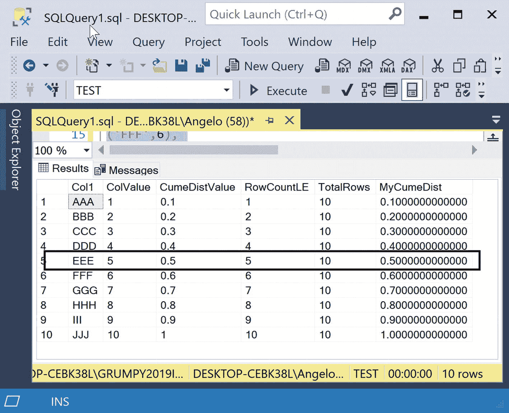

**图 7-1**  
计算累积分布的两种方法

看起来不错且符合预期，我想！`MyCumeDist` 列包含我们创建的公式计算出的值，而名为 `CumeDistValue` 的列包含 SQL Server 函数计算出的值。可能需要一点格式化以使它们看起来相同，但值是匹配的。

## 金融示例

现在看一个金融例子。我们的分析师提供了以下业务需求：

为 John Smith 客户 (`C0000001`) 生成一份报告，显示按月份和季度的累积分布。结果需要是针对 2012 年的，并且还需要显示年份、季度、月份、客户 ID、投资组合和月度价值。

请参考清单 7-2。

```
WITH PortfolioAnalysis (
TradeYear,TradeQtr,TradeMonth,CustId,PortfolioNo,Portfolio,MonthlyValue
)
AS (
SELECT Year AS TradeYear
,DATEPART(qq,SweepDate) AS TradeQtr
,Month                  AS TradeMonth
,CustId
,PortfolioNo
,Portfolio
,SUM(Value)             AS MonthlyValue
FROM Financial.Portfolio
WHERE Year > 2011
GROUP BY CustId
,PortfolioNo
,Year
,Month
,SweepDate
,Portfolio
)
SELECT TradeYear
,TradeQtr
,TradeMonth
,CustId
,PortfolioNo
,Portfolio
,MonthlyValue
,CUME_DIST() OVER(
PARTITION BY Portfolio
ORDER BY TradeMonth,Portfolio
) AS CumeDistByMonth
,CUME_DIST() OVER(
PARTITION BY Portfolio
ORDER BY TradeQtr,Portfolio
) AS CumeDistByMonth
FROM PortfolioAnalysis
WHERE TradeYear = 2012
AND CustId = 'C0000001'
GO
```

**清单 7-2**  
月度投资组合累积分布分析

使用了我们常见的 `CTE` 模板。该 `CTE` 计算投资组合的月度总和，而引用该 `CTE` 以计算累积分布的查询使用了两个 `OVER()` 子句。该 `CTE` 返回年份大于 2011 年的结果。我们跳过了 2011 年，因为那是账户开户的时间，我们知道初始余额是 10 万美元（所有账户都以此金额初始化）。

查看基础查询，第一个 `OVER()` 子句包含一个 `PARTITION BY` 子句，该子句按月份和投资组合名称设置分区。分区结果集由 `ORDER BY` 子句按交易月份和投资组合名称排序。

第二个 `OVER()` 子句也包含一个 `PARTITION BY` 子句，但这次分区是按季度和投资组合名称设置的。此外，分区结果集在 `ORDER BY` 子句中按交易季度和投资组合名称排序。

如果你包含多年的数据，可以添加一个 `OVER()` 子句来按年计算累积分布。这是一个很好的练习。只需将以下代码添加到 `SELECT` 子句中：

```
,CUME_DIST() OVER(
PARTITION BY Portfolio
ORDER BY TradeYear,Portfolio
) AS CumeDistByMonth
```

别忘了修改 `WHERE` 子句，使其不包含仅过滤一年的谓词。这将给你一个更大的结果集，但就累积分布而言，它提供了更完整的分析。

最终查询不需要 `ORDER BY` 子句。让我们查看图 7-2 中的结果。

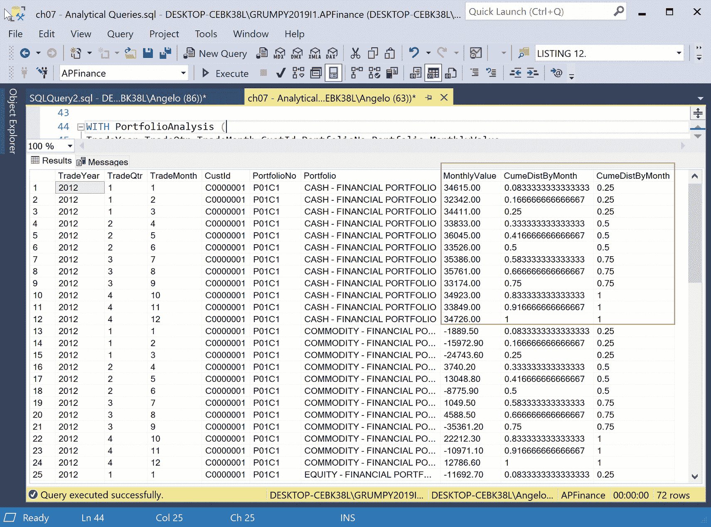

**图 7-2**  
客户 C0000001 的投资组合累积分布分析


如图所示，我们得到了按月份和季度划分的投资组合累积分布。这是一个非常有趣的查询。该模式在每个投资组合中都会重复出现。

#### 性能考量

这个查询的性能如何？让我们运行通常的估计查询计划，为我们的分析建立一个基线，之后我们将对其进行分析，并看看是否可以通过添加索引或用报表表替换 `CTE` 来提高性能。

请参阅图 7-3。

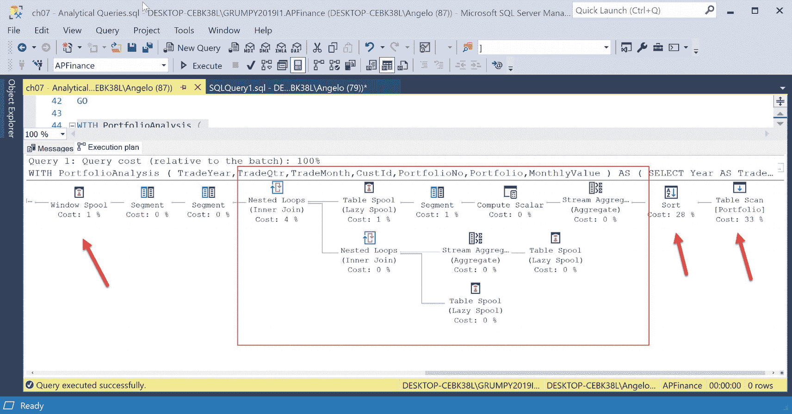

一张 S S M S 窗口的截图。它展示了累积分布基线查询计划的第 1 部分，包含 14 个组件。这些组件是：窗口假脱机、2 个分段、嵌套循环、表假脱机、分段、计算标量、流聚合、排序、表假脱机、嵌套循环、流聚合和 2 个表假脱机。

**图 7-3**
累积分布基线查询计划 – 第 1 部分

这是估计查询计划的右侧。注意这里的表扫描；由于表很小（大约 1,470 行），所以不需要索引。表扫描的成本为 33%，随后是一个成本为 28%的排序步骤。（通过将鼠标悬停在图标上并查看 ID，可以记下表扫描的 ID。大多数情况下，表扫描用于其他任务，比如创建在 `TEMPDB` 中的临时表。）

红色框出的区域对应于第一个累积分布函数。它将在查询计划的下一部分中为第二个累积分布函数调用重复出现。它包含一些零成本任务和一些表假脱机任务，这些任务使数据在临时物理存储中可用，以便应用计算。其中两个假脱机任务成本为 0%，而最后一个成本为 1%。两个嵌套循环联接任务完成了这部分，一个成本 0%，一个成本 4%。到目前为止，没什么可担心的。

让我们看看第二部分。请参阅图 7-4。

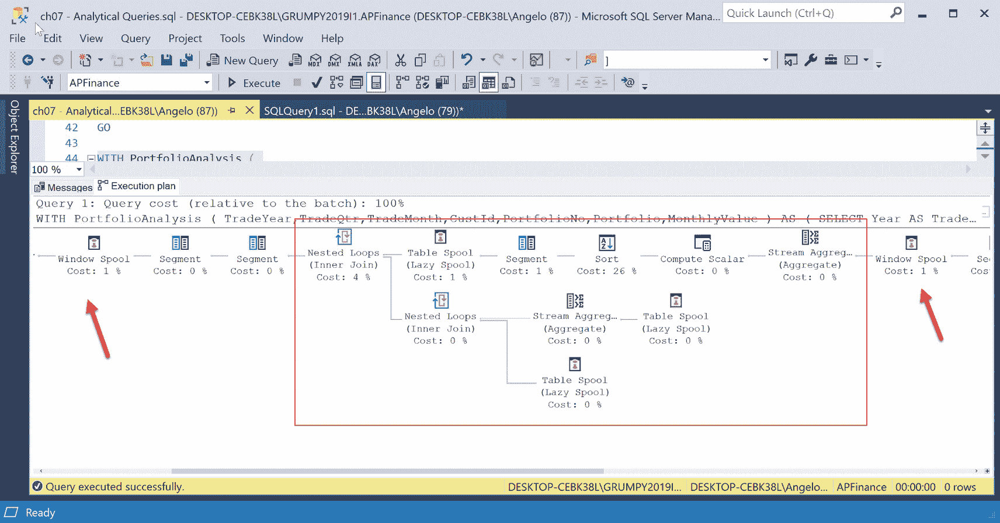

一张 S S M S 窗口的截图。它展示了累积分布基线查询计划的第 2 部分，包含 14 个组件。这些组件是：窗口假脱机、2 个分段、嵌套循环、表假脱机、分段、排序、计算标量、流聚合、窗口假脱机、嵌套循环、流聚合和 2 个表假脱机。

**图 7-4**
累积分布基线查询计划 – 第 2 部分

注意计划右侧的窗口假脱机任务。它的成本为 1%，这意味着假脱机操作是在磁盘而非内存中执行的。这个窗口假脱机任务与第一个累积分布函数调用相关联。

这里有一个框出的区域，它与我们讨论的第一个区域相同。它后面也跟着一个窗口假脱机任务。看起来我们有三个需要留意的低成本任务：成本为 1%的表假脱机、成本为 4%的内部联接嵌套循环，以及成本为 1%的窗口假脱机任务。

我尝试了报表表方法，即使用 `CTE` 中的查询来填充一个报表表，然后针对该报表表执行基础查询。就查询计划而言，改进是微乎其微的（代码包含在本章的脚本中）。

使用报表表方法时，`TIME` 和 `IO` 统计数据显示出边际改善，因此我在此附上屏幕截图。请参阅图 7-5。

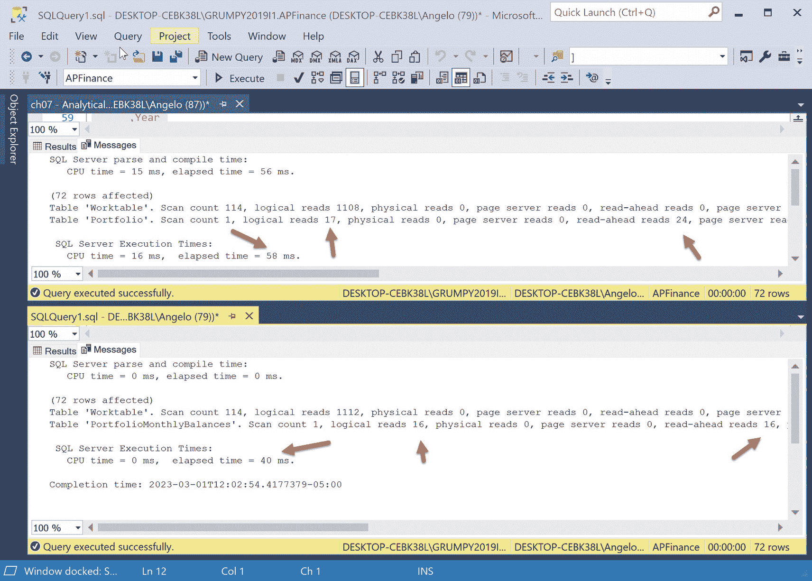

一张 S S M S 窗口的截图。文本展示了 2 组 I O 和 TIME 统计数据。解析和编译时间（CPU 和已用时间）对于 1 和 2 分别为 15、56 毫秒和 0、0 毫秒。执行时间（CPU 和已用时间）对于 1 和 2 分别为 16、58 毫秒和 0、40 毫秒。影响了 72 行。

**图 7-5**
比较 IO 和 TIME 统计信息

SQL Server 执行时间和预读读取量有适度改善。由于这是历史数据，报表表方法可能比 `CTE` 方法更高效，特别是当多个用户运行相同的查询时，例如从允许分析人员通过报告中的下拉列表选择不同年份的 SQL Server Reporting Services (SSRS) 报告中运行。

报表表策略也有成本，因为它必须定期加载以更新数据，保持其时效性。这可以每天或每周执行，通常是在夜间通过计划的加载过程完成，这样就不会影响用户。

最后但同样重要的是，我修改了原始的 `CTE` 查询，使其不使用 `CTE`，而是直接针对 Portfolio 表，并在两次调用累积分布函数之前立即计算 `SUM()`。结果几乎与 `CTE` 版本匹配，并且 SQL Server 执行时间略低于 `CTE` 版本，230 毫秒（`CTE`）对 171 毫秒（非 `CTE`）。就 `STATISTICS PROFILE` 值而言，非 `CTE` 版本的步骤更少（72 步对 32 步），但总的来说，除了执行时间稍快之外，性能是一样的。所以，也许对于这类查询，`CTE` 块不是首选？如果我们需要查询数百万行数据，那么可能根本不会考虑 `CTE`。

始终要考虑查询将如何被使用和运行，例如，是在多个用户的网页报告中运行，还是由一个用户单独运行。另外，不要仅仅因为你认为某个功能（如 `CTE`）很巧妙，并且使用它会给你的经理留下深刻印象，就去使用它。最简单、最快、当然也是最准确的解决方案才是最好的解决方案。同时也要考虑维护这些查询的人力成本。


#### FIRST_VALUE() 与 LAST_VALUE() 函数

那么，这一对相关函数能为我们做什么呢？如果您没有阅读过第 3 章，或者需要复习一下，请阅读接下来的讨论；否则，可以直接跳转到示例部分。

函数名称给了我们一些提示。它们回答了以下问题：

在分区内，谁排第一，谁排最后？

给定一组已排序的值，`FIRST_VALUE()` 函数将返回分区内第一个值。

给定一组已排序的值，`LAST_VALUE()` 函数将返回分区内最后一个值。

这两个函数都返回作为参数传入的任何数据类型；可能是整数，也可能是字符串，等等。非常简单。让我们直接深入示例。

以下是我们的业务需求说明：

这次，分析师要求我们关注所有客户账户。我们需要创建一个报告，该报告将返回由年份和客户 ID 定义、并按月份排序的分区内最后一个和第一个账户值。分析师希望看到包含当前月份以及所有未来月份的数据集（分区）中的这些值，同时也希望看到包含当前月份以及所有过去月份的数据集中的这些值。换句话说，即向前看和向后看（提示：需要定义一个窗口框架）。

最后，报告将仅限于现金账户。

请参考清单 7-3。

```sql
WITH MonthlyAccountBalances (
AcctYear,AcctMonth,CustId, PrtfNo, AcctNo, AcctName, AcctBalance
)
AS
(
SELECT YEAR(PostDate)  AS AcctYear
,MONTH(PostDate) AS AcctMonth
,CustId
,PrtfNo
,AcctNo
,AcctName
,SUM(AcctBalance)
FROM Financial.Account
GROUP BY YEAR(PostDate)
,MONTH(PostDate)
,CustId
,PrtfNo
,AcctNo
,AcctName
)
SELECT CustId
,AcctYear
,AcctMonth
,AcctNo
,AcctName
,AcctBalance
,FIRST_VALUE(AcctBalance) OVER (
PARTITION BY AcctYear,CustId
ORDER BY AcctMonth
ROWS BETWEEN CURRENT ROW AND UNBOUNDED FOLLOWING
) AS FirstValueBalance
,LAST_VALUE(AcctBalance) OVER (
PARTITION BY AcctYear,CustId
ORDER BY AcctMonth
ROWS BETWEEN CURRENT ROW AND UNBOUNDED FOLLOWING
) AS LastValueBalanceCRUF
,FIRST_VALUE(AcctBalance) OVER (
PARTITION BY AcctYear,CustId
ORDER BY AcctMonth
ROWS BETWEEN UNBOUNDED PRECEDING AND CURRENT ROW
) AS FirstValueBalanceUPCR
,LAST_VALUE(AcctBalance) OVER (
PARTITION BY AcctYear,CustId
ORDER BY AcctMonth
ROWS BETWEEN UNBOUNDED PRECEDING AND CURRENT ROW
) AS LastValueBalanceUPCR
FROM MonthlyAccountBalances
WHERE AcctYear >= 2013
AND AcctNAme = 'CASH'
ORDER BY CustId
,AcctYear
,AcctName
,AcctMonth
GO
```

清单 7-3
按年份和客户、并按月份排序的首个与末个账户余额

这个 `CTE` 看起来与我们前一个示例中讨论的类似，但这次它引用的是 Account 表，其粒度比 Portfolio 表更低。

有趣的是，我们包含了两组具有不同 `ROWS` 框架子句的 `FIRST_VALUE()OVER()` 和 `LAST_VALUE()OVER()` 子句。

第一组使用以下 `ROWS` 窗口框架定义，以在分区内基于当前行和其后的所有行（向前看）来定义窗口框架：

```
ROWS BETWEEN CURRENT ROW AND UNBOUNDED FOLLOWING
```

第二组使用以下 `ROWS` 窗口框架定义，以处理当前行及其之前的所有行（向后看）来定义窗口框架：

```
ROWS BETWEEN UNBOUNDED PRECEDING AND CURRENT ROW
```

请记住，窗口框架是相对于分区内在行间移动处理时正在处理的当前行而言的。如果这个概念有点模糊，请复习第 1 章中的相关内容，然后尝试使用十个值、一个表变量和这些函数进行一个简单的示例，以便在简单数据集上观察它们的工作原理。查看第 1 章中关于此主题的图表；它们会让这个概念变得清晰。

查询已执行。这个查询运行了四秒钟！迫不及待地想查看估计的执行计划。请参考图 7-6 中的部分结果。

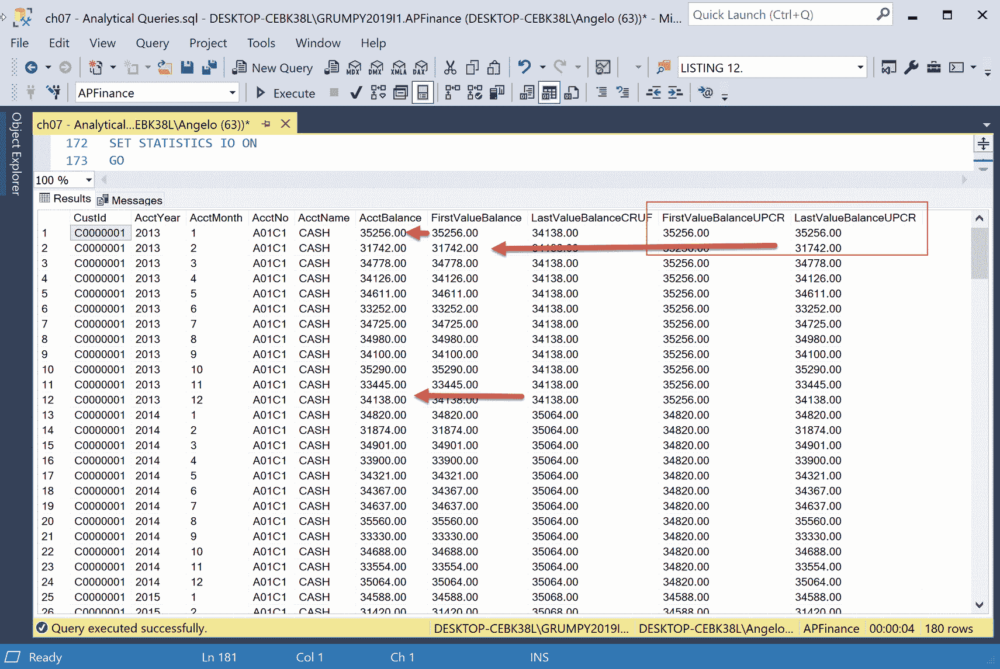

一张 S S M S 窗口的截图。其中有一个包含 11 列和 26 行的表格。列标题分别是客户 I D、账户年份、账户月份、账户名称、账户余额、首值余额、末值余额 C R U F、首值余额 U P C R 和末值余额 U P C R。

图 7-6
在定义的分区内，首行与末行

从第一组首末余额中可以看出，首值是当前行中的值，而末值始终指向分区中的最后一个值，`$34,138.00`。在这里我们向前看。

在第二组首末余额中，首值始终指向分区中的第一个值，而末值始终是窗口框架当前行中的值。在这里我们向后看。

我猜想这很有价值，因为我们可以看到相对于余额，我们起始于何处、当前位于何处以及将走向何方。这个方案告诉你，随着时间推移（按月），账户是在增值还是在贬值。

最好检查一下估计的查询计划，因为我们看到这个查询运行了四秒钟。


#### 性能考量

我们需要将估计的查询计划分成两部分。从右向左看，大约在屏幕中间，我们在图 7-7 中看到以下任务。

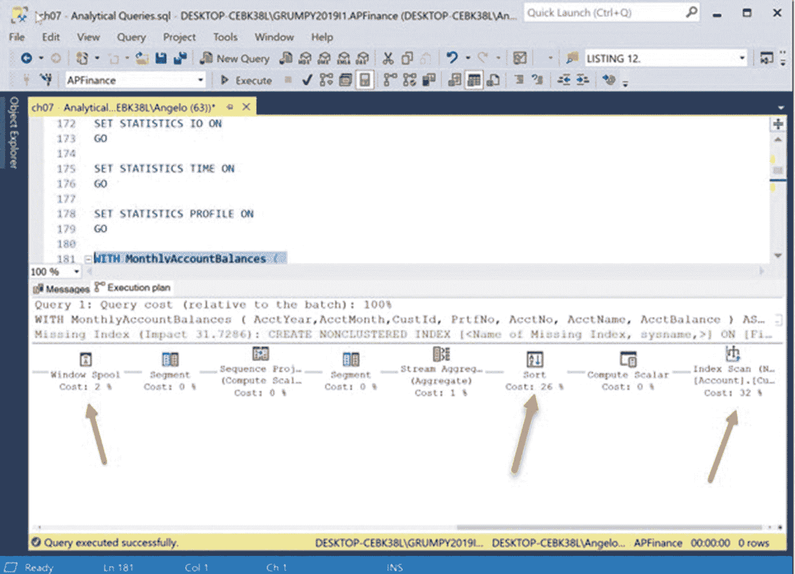

*图 7-7：`FIRST_VALUE()` 和 `LAST_VALUE()` 的估计查询计划，第 1 部分*

这只是一个估计查询计划的一半，但这种模式在所有函数调用对中都会重复，因此我们在这里应用的任何改进也可以应用于查询计划中的其他模式（我所说的模式是指操作符（任务）和连接流的组合）。

请参考图 7-8。

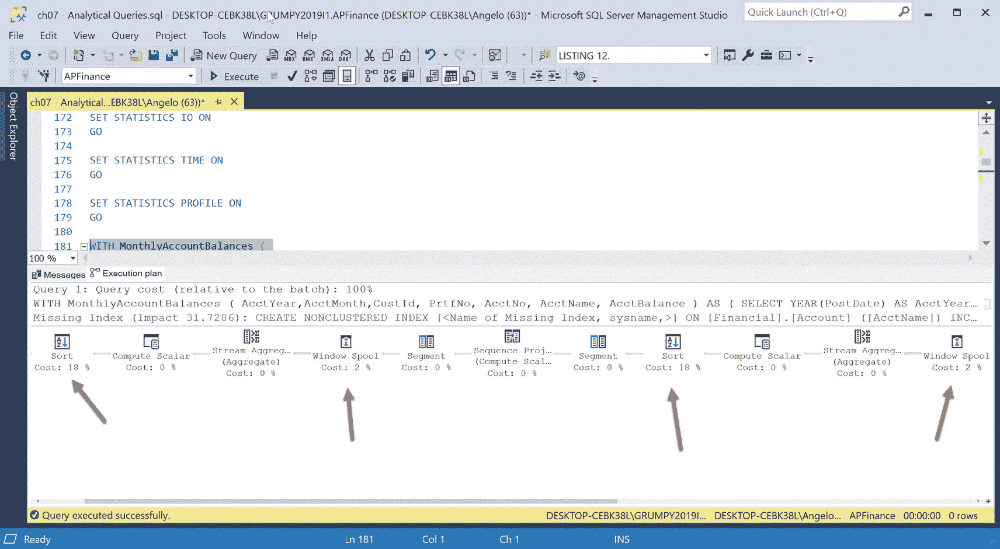

*图 7-8：`FIRST_VALUE()` 和 `LAST_VALUE()` 的估计查询计划，第 2 部分*

可以看到，`Compute Scalar`、`Sort`、`Segment`、`Sequence Project`、`Segment` 和 `Window Spool` 任务的相同模式在重复。成本大致相同，但排序步骤的成本略有不同。估计查询计划器告诉我们，建议的索引将提高 31.7286% 的性能。我接受这个改进！

让我们复制并粘贴索引模板，给它起个名字，然后执行命令来构建索引。

清单 7-4 是建议索引的完整代码。

```sql
CREATE NONCLUSTERED INDEX [ieAcctPrtBalancePostDate]
ON [Financial].[Account] ([AcctName])
INCLUDE ([CustId],[PrtfNo],[AcctNo],[AcctBalance],[PostDate])
GO
-- 清单 7-4
-- 建议的估计查询计划索引
```

这是一个基于账户名称列的非聚集索引，但根据查询计划工具的建议，我们包含了客户 ID、投资组合编号、账户编号、账户余额和过账日期列。注意那些讨厌的方括号。由于 SQL Server 生成了这段 `T-SQL` 代码，所以包含了它们。你可能想删除它们，但这值得吗？

假设你有一个包含数千行代码的大型脚本，并且你对方括号进行了全局替换。如果你使用的表名和列名中包含空格，会发生什么？如果你进行全局替换以删除方括号，你的脚本将会出错。没错，会出错！

> **注意**
> 编程命名标准在现实应用中是很好的，但有人可能过于严格，大部分时间会花在输入漂亮的代码上，而不是构思良好有效的解决方案上。如果你的部门有预算，可以使用工具来“美化”代码。嗯，不管怎样，这是我的拙见。

让我们创建索引，看看查询计划是否有所改善。请参考图 7-9a。

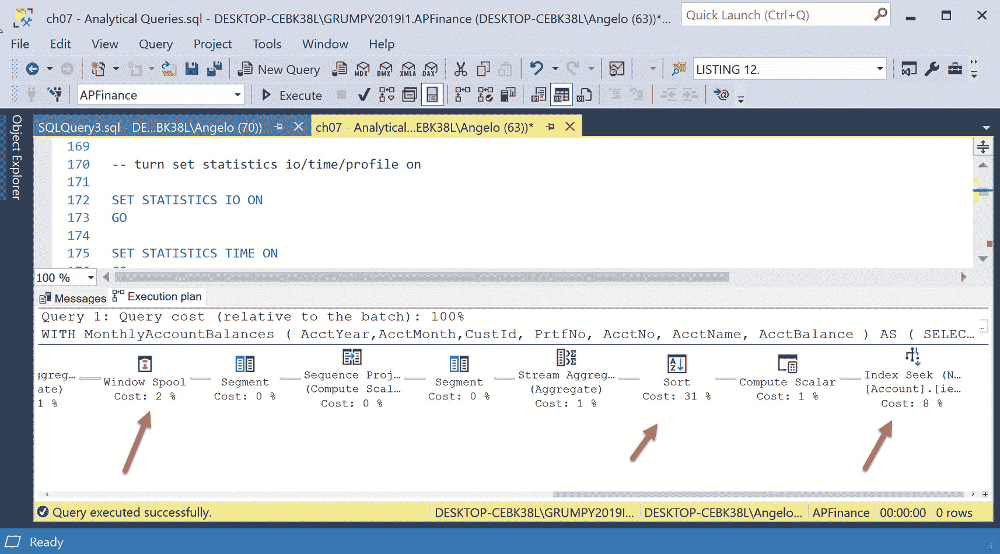

*图 7-9a：修订后的估计查询计划，前半部分*

和往常一样，索引被使用了，但排序成本上升了。我们的老朋友 `Window Spool` 仍然保持 2% 的成本。让我们看看查询计划的后半部分。


请参考图 7-9b。

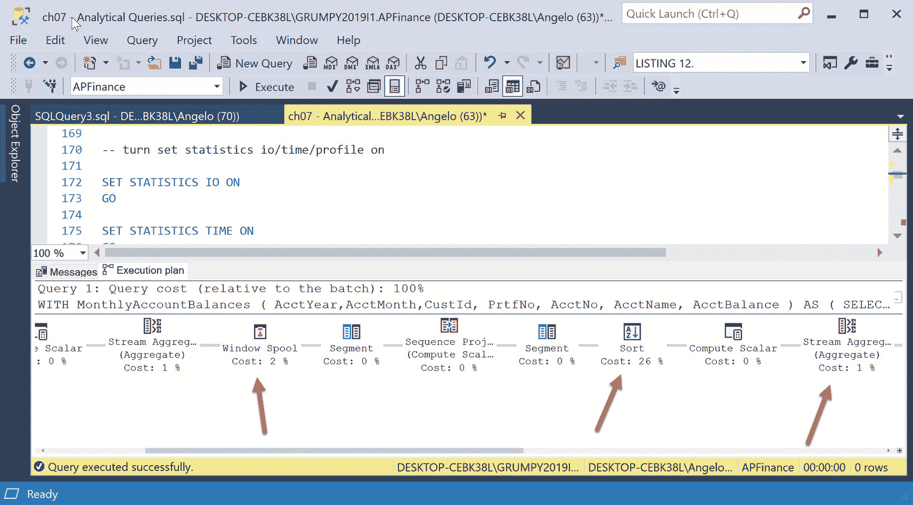

SQL Server Management Studio (SSMS) 窗口的截图。它展示了修订后的估计查询计划的第二部分，包含 8 个组件。这些组件分别是：流聚合、窗口假脱机、分段、序列投影、分段、排序、计算标量和流聚合。

**图 7-9b**
修订后的查询计划，后半部分

本节中模式相同：一个排序操作占 26%，一个窗口假脱机操作占 2%。

**提醒**
由于本书是关于应用窗口函数的，而非查询计划和性能调优的详尽指南，因此不讨论成本为 0%的任务。再次强调，在现实世界中，不要忽略它们，但要理解其背后的原理。

我们需要生成更多统计信息，以更好地理解性能方面的状况。关于`IO`和`TIME`统计信息，请参考图 7-10。

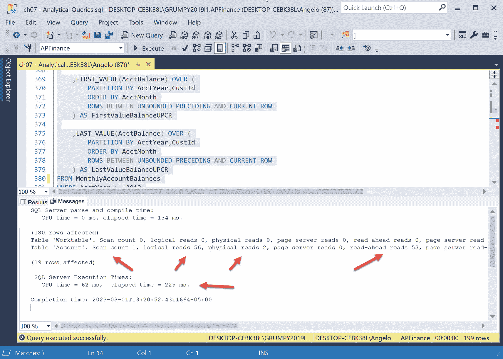

SQL Server Management Studio (SSMS) 窗口的截图。文本显示了 IO 和 TIME 统计信息。SQL Server 的解析和编译时间，CPU 时间为 0 毫秒，耗时 134 毫秒。SQL Server 的执行时间，CPU 时间为 62 毫秒，耗时 225 毫秒。受影响的行为 180 行。

**图 7-10**
IO 和 TIME 统计信息

`STATISTICS PROFILE`统计信息怎么样？这些信息通常包含许多关于执行步骤、每个步骤的成本以及`IO`和`CPU`利用率的详细内容。你还可以通过查看`StmtText`（语句文本）列来深入了解，理解哪些逻辑与哪些任务相关。请参考图 7-11。

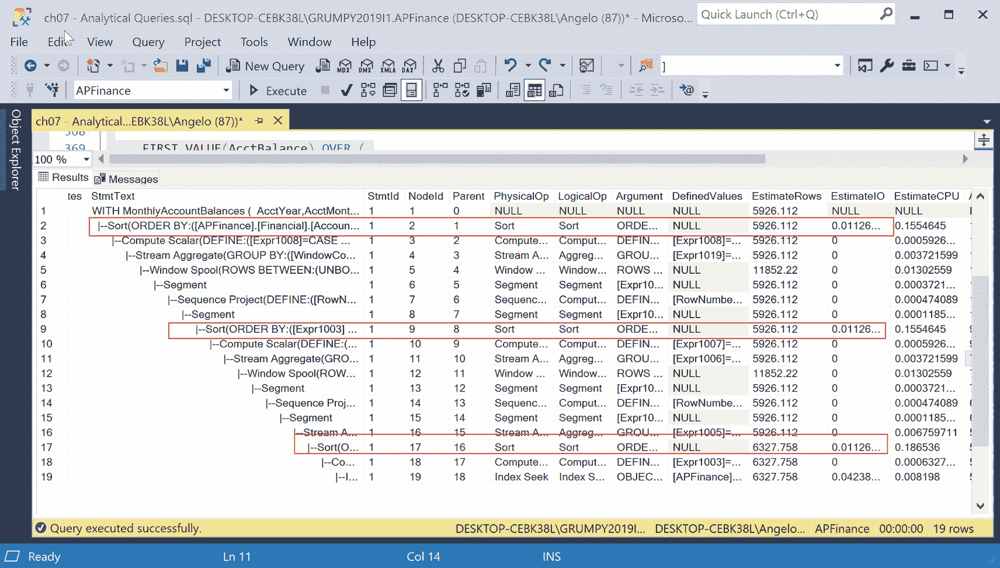

SSMS 窗口的截图。它包含一个有 12 列和 20 行的表格。列标题是：语句文本、语句 ID、节点 ID、物理操作、逻辑操作、参数、定义的值、估计行数、估计 IO 和估计 CPU。第 2、9 和 17 行被突出显示。

**图 7-11**
用于重复执行模式的配置文件统计信息

这是一组很好的统计信息，因为它包含大量信息。显然，尽管数值不高，但排序步骤承担了大部分的`IO`。最后一步，即索引查找步骤，具有最高的`IO`，达到 0.04238。目前，查询在一秒内运行。Account 表有 43,860 行。如果我们有 100,000 或 1,000,000 个账户（如大型国际银行），这些排序步骤的`IO`会是多少？这些`IO`统计信息可能会成为问题。

这最后一步引发了我思考。我在查询中有一个最终的`ORDER BY`子句，结果证明是多余的。我移除了它，检查了结果，并重新运行查询以生成`PROFILE STATISTICS`。一个昂贵的排序操作被移除了，所以这是一个改进。减少一个步骤意味着减少查询执行时间。

**小测验**
如何生成`PROFILE`统计信息？答案将在本节末尾出现。

最后，在我移除了最后的`ORDER BY`子句后，比较`IO`和`TIME`统计信息得出以下结果：

**之前**
**SQL Server 解析和编译时间**
CPU 时间：0 毫秒
耗时：134 毫秒

**IO 统计信息**
扫描计数：1
逻辑读取：56
物理读取：2
预读读取：53

**SQL Server 执行时间**
CPU 时间：62 毫秒
耗时：225 毫秒

**之后**
**SQL Server 解析和编译时间**
CPU 时间：16 毫秒
耗时：21 毫秒

**IO 统计信息**
扫描计数：1
逻辑读取：56
物理读取：0
预读读取：0

**SQL Server 执行时间**
CPU 时间：31 毫秒
耗时：128 毫秒

在移除冗余的`ORDER BY`子句后，`IO`有明显改善，执行时间减少了 50%。

又一个经验教训：检查你的代码，确保没有冗余或不必要的逻辑。通常，在工作环境中，一次良好的同行评审会议有助于发现那些你自己看不到，但旁观者可以帮你发现的小问题。

代码被评审和批评总是让人不舒服的，但这是游戏规则的一部分。

**小测验答案**
执行 `SET STATISTICS PROFILE ON` 命令。

## LAG() 和 LEAD() 函数

这对函数是你编程工具包中非常重要的工具，用于分析数据。你的业务分析师执行的活动之一是，在历史数据集中回顾过去或展望未来。当然，这些数据可能是一个包含当前和过去数据（但没有未来数据）的快照（取决于视角，未来数据尚不存在）。

这些函数允许你创建强大的查询和报告来做到这一点。

回想一下`LAG()`函数的作用：
此函数用于检索当前行某列值（通常在时间维度内）的前一个值。例如，给定某产品本月的销售额，拉取该产品上个月的销售额，或指定某个偏移量，比如三个月前或一年前，这取决于你收集了多少历史数据以及你的业务用户想看什么。使用此逻辑来计算差异。销售额是上升还是下降了？这是监控和改进销售业绩的关键指标，更不用说用于发放奖金了！

以下是`LEAD()`函数的作用：
此函数用于检索当前行某列值的下一个值。例如，给定某产品本月的销售额，拉取该产品下个月的销售额，或指定某个偏移量，比如三个月后或一年后（当然是历史数据；从现在看未来是不可能的，如果数据不存在，你的数据库也看不到未来）。

不过有一个例外，如果你有未来的销售数据预测。这对销售团队来说可以进行有趣的分析。

**提醒**
这两个函数都返回用作参数的值的数据类型。


### LAG( ) 函数

让我们首先从 `LAG()` 函数开始。我们的分析师为我们发送了以下报告规范：

我希望在同一份报告中看到本月和上月的账户余额。结果需要按年份、月份、客户标识符、投资组合编号以及账户编号和名称进行分组。结果需要针对大于或等于 2013 年的数据。最后，我希望看到本月数值与上月数值之间的差异，以便观察余额是增加了还是减少了。

我们使用与之前示例相同的 `CTE`，因此我不会在清单中重复它。这可能是将 `CTE` 转换为报告表（假设每月加载一次）的一个好候选方案。我们拭目以待。请参考清单 7-5。

```sql
SELECT CustId
,AcctYear
,AcctMonth
,PrtfNo
,AcctNo
,AcctName
,AcctBalance
,LAG(AcctBalance) OVER (
PARTITION BY CustId,AcctYear,AcctName
ORDER BY AcctMonth
) AS LastMonthBalance
,AcctBalance -
(
LAG(AcctBalance) OVER (
PARTITION BY CustId,AcctYear,AcctName
ORDER BY AcctMonth
)
) AS Change
FROM MonthlyAccountBalances
WHERE AcctYear >= 2013
GO
```
清单 7-5
使用 `LAG()` 计算上月余额

`LAG()` 函数使用一个 `OVER()` 子句，该子句包含一个 `PARTITION BY` 子句和一个 `ORDER BY` 子句。分区由客户、年份和账户名称定义。分区的结果集按账户月份升序排序。还有一个 `WHERE` 子句，它按年份大于或等于 2013 来筛选结果。

请参考图 7-12 中的部分结果。

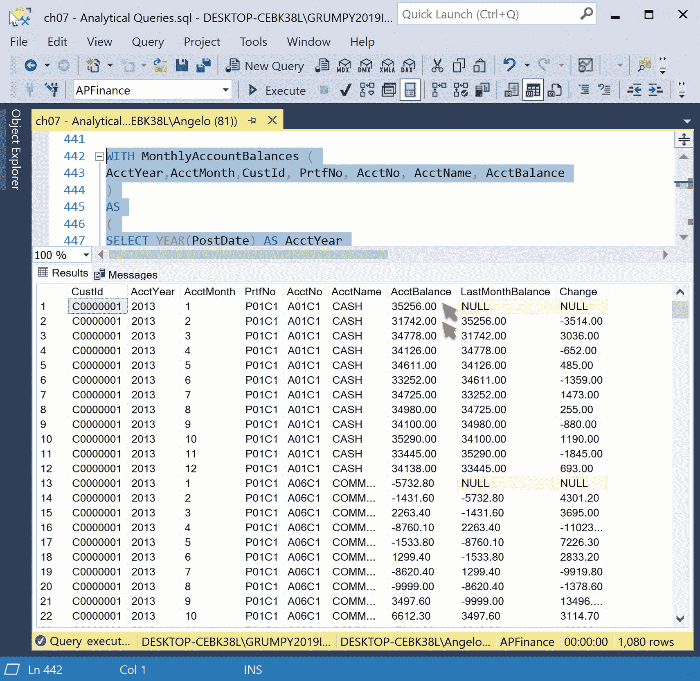

一个 S S M S 窗口的截图。其中有一个包含 10 列和 181 行的表格。列标题是客户 I D、账户年份、账户月份、投资组合编号、账户编号、账户余额、上月余额和变化。两个箭头指向第 1 行和第 2 行的账户余额。

图 7-12

用于当月和上月分析的账户余额

报告运行正确。我们看到了当月和上月的余额以及余额之间的差异。让我们将这些结果（仅针对现金账户和 2013 年的数据）放入 Microsoft Excel 电子表格图表中。

请参考图 7-13 中的 Excel 图表截图。

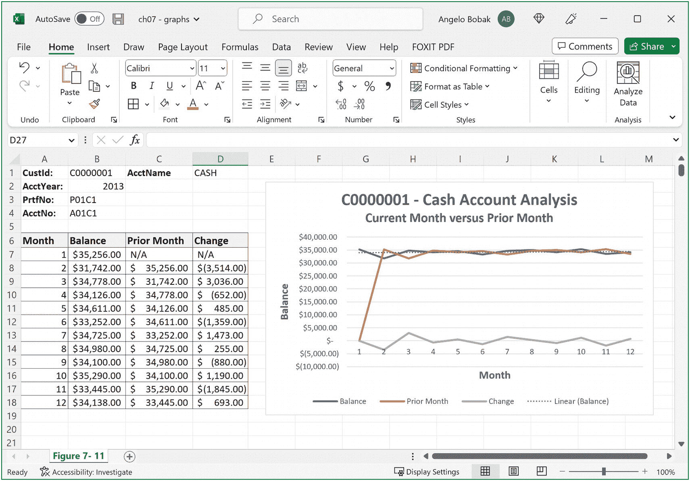

一个 M S Excel 窗口的截图。其中有一个包含 4 列和 13 行的表格。列标题是月份、余额、上月和变化。它有一个余额与月份关系的折线图，有 3 条波动的水平线分别代表余额、上月和变化。上月的曲线最初呈上升趋势。

图 7-13

用于当月和上月分析的账户余额图表

直观地看，我们可以看到这个账户在最初跃升后，每月保持在约 $35,000 的水平。余额似乎有轻微的上升趋势，每月的变化大约在 -$5000 到 +$5000 之间。

最后一个事项，为了查看跨所有年份的滚动值，请使用以下代码片段修改 `OVER()` 子句：

```sql
,LAG(AcctBalance) OVER (
PARTITION BY CustId,AcctName
ORDER BY CustId,AcctYear,AcctMonth,AcctName
) AS LastMonthBalance
,AcctBalance -
(
LAG(AcctBalance) OVER (
PARTITION BY CustId,AcctName
ORDER BY CustId,AcctYear,AcctMonth,AcctName
)
) AS Change
```

你需要对 `PARTITION BY` 和 `ORDER BY` 子句进行细微的修改。

这里出现了一个问题：

参考前面的代码片段，计算当前账户余额与上月账户余额之间差异的方式是否高效，还是会对性能产生负面影响？

让我们来看看。

#### 性能考量

让我们以常规方式生成基线估计执行计划，可以通过菜单栏中的查询选择或估计执行计划图标，你喜欢哪种方法都可以。

请参考图 7-14。

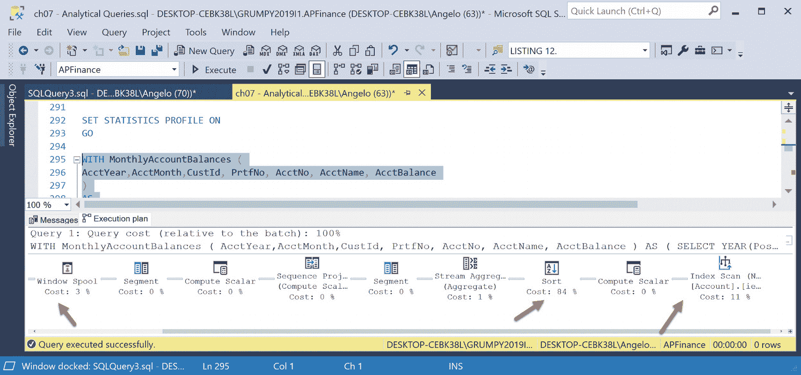

一个 S S M S 窗口的截图。它展示了一个包含 9 个组件的基线估计执行计划。组件是窗口假脱机、段、计算标量、序列项目、段、流聚合、排序、计算标量和表扫描。

图 7-14

`LAG()` 查询的基线估计执行计划

从右向左读，我们有一个良好的开端。我们看到一个索引扫描占 11% 的成本，但接着我们看到一个昂贵的排序操作占 84% 的成本。两者之间的计算标量任务用于从 `PostDate` 列中提取年份和月份。排序任务用于 `CTE` 中的 `GROUP BY` 子句。

让我们尝试报告表方法。我使用 `CTE` 查询在一个名为 `FinancialReports.` 的新模式中创建了一个报告表。另外，我们将创建两个索引：一个是聚集索引，一个是非聚集索引。

请参考清单 7-6。

```sql
CREATE SCHEMA FinancialReports
GO
SELECT YEAR(PostDate) AS AcctYear
,MONTH(PostDate) AS AcctMonth
,CustId
,PrtfNo
,AcctNo
,AcctName
,SUM(AcctBalance) AS AcctBalance
INTO FinancialReports.AccountClustered
FROM Financial.Account
GROUP BY YEAR(PostDate)
,MONTH(PostDate)
,CustId
,PrtfNo
,AcctNo
,AcctName
GO
```
清单 7-6
创建账户月度余额报告表

此批处理脚本使用 `SELECT/INTO` 命令动态创建表。章节脚本代码包含了使用 `INSERT` 命令的截断/加载表。

清单 7-7 是两个索引，希望能帮助消除计划中昂贵的排序步骤。

```sql
CREATE CLUSTERED INDEX ieYearMonthCustIdPrtfNoAcctNoAcctName
ON FinancialReports.AccountClustered (
[AcctYear],[AcctMonth],[CustId],[PrtfNo],[AcctNo],[AcctBalance]
)
GO
CREATE INDEX ieCustIdAcctYearAcctMonthAcctNameAcctName
ON FinancialReports.AccountClustered (
[CustId],[AcctYear],[AcctName],[AcctMonth]
)
GO
```
清单 7-7
创建聚集和非聚集索引

清单 7-8 是修改后的查询，因此它访问新的报告表。结果是相同的，因此我不会显示输出截图（进行修改时务必检查——你永远不知道会发生什么）。

```sql
SELECT CustId
,AcctYear
,AcctMonth
,PrtfNo
,AcctNo
,AcctName
,AcctBalance
,LAG(AcctBalance) OVER (
PARTITION BY CustId,AcctYear,AcctName
ORDER BY AcctMonth
) AS LastMonthBalance
,AcctBalance -
(
LAG(AcctBalance) OVER (
PARTITION BY CustId,AcctYear,AcctName
ORDER BY AcctMonth
)
) AS Change
FROM FinancialReports.AccountClustered
WHERE AcctYear >= 2013
GO
```
清单 7-8
使用带有聚集和非聚集索引的账户报告表

让我们比较原始查询和报告表版本的查询计划。

请参考图 7-15。

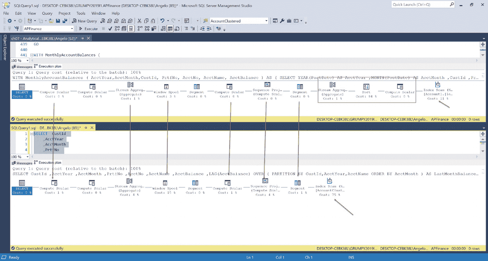

一个 S S M S 窗口的截图。它展示了 C T E 查询和报告表查询计划，分别有 13 个和 10 个组件。计算标量、流聚合、窗口假脱机、序列项目和段的成本对于 C T E 和报告表查询分别是 0%、1%、3%、0%、0% 和 1%、4%、15%、4%、1%。

图 7-15

CTE 查询 vs. 报告表查询计划

在原始估计查询计划中的计算标量 (0%)、排序 (84%) 和流聚合 (1%) 任务，在带有新报告表的新计划中被消除了。步骤更少是好事！


### 性能计划分析与比较

在新计划中，索引扫描从 11%上升到 75%，段任务从 0%上升到 1%，序列项目从 0%上升到 4%，计算标量从 0%上升到 1%，窗口假脱机从 3%上升到 15%。最后，流聚合从 1%上升到 4%，最后一个计算标量从 0%上升到 1%。

虽然任务被消除了，但改进看起来并不乐观。

让我们比较两个版本查询的`IO`和`TIME`统计信息。

请参阅图 7-16。

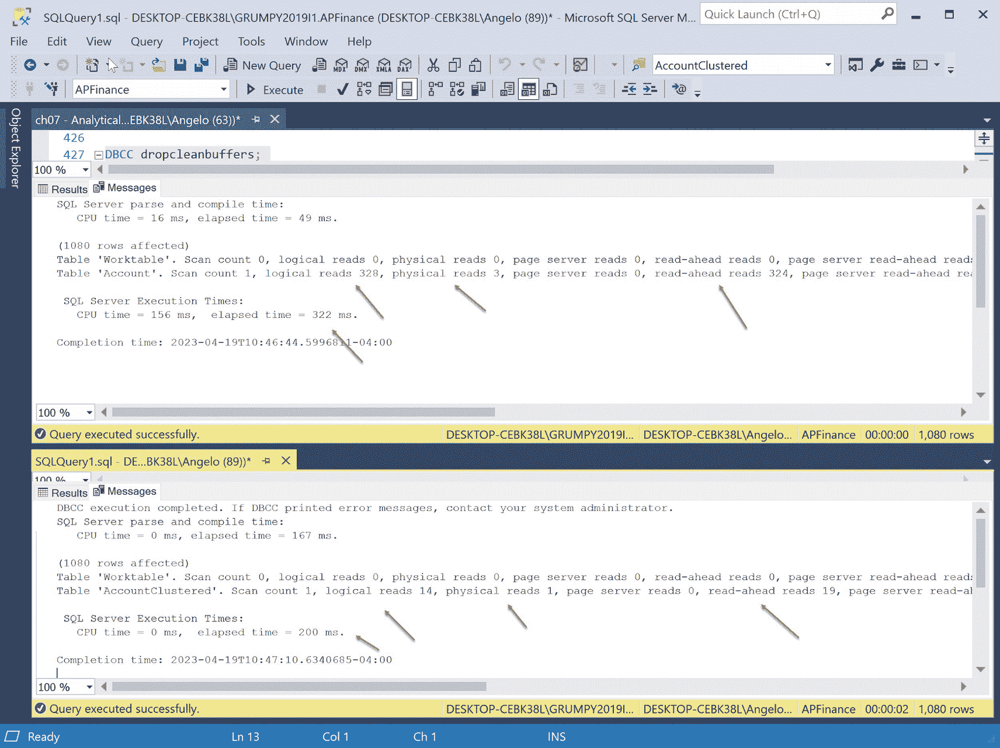

图 7-16
比较 IO 和 TIME 统计信息

我用箭头标记了我们应该关注的统计信息：

*   SQL Server 解析和编译时间从 49 毫秒增加到 167 毫秒。
*   SQL Server 执行时间从 322 毫秒减少到 200 毫秒。

以下是高价值统计信息：

*   Account 表的逻辑读取从 328 次减少到 14 次。
*   Account 表的物理读取从 3 次减少到 1 次。
*   Account 表的预读读取从 324 次减少到 19 次。

总的来说，这些统计信息确实显示了性能的改进，即使查询计划有些不确定。

让我们对`LEAD()`函数使用相同的逻辑。

## LEAD() 函数

现在让我们看看`LAG()`的对应函数，`LEAD()`函数。我们的分析师为下一个报告提供了以下业务需求：

修改之前的查询，使得这次报告显示当前月份的账户余额和明年同一月份的账户余额，针对所有客户。从 2013 年开始，包括之后的所有年份。结果应仅针对现金账户，并且报告需要按客户 ID、年份、月份以及账户编号和名称进行分组。

请参阅清单 7-9。

```sql
SELECT CustId
,AcctYear
,AcctMonth
,AcctNo
,AcctName
,AcctBalance
,LEAD(AcctBalance,12,0) OVER (
PARTITION BY CustId
ORDER BY AcctName,AcctYear,AcctMonth
) AS NextYearBalance
FROM MonthlyAccountBalances
WHERE AcctYear >= 2013
AND AcctNAme = 'CASH'
GO
```
清单 7-9
月度账户余额分析，本年 vs. 明年

这次除了列名之外，我们还需要向`LEAD()`函数传递一些参数。我们还传递了值 12 作为向前查看的月份数，最后一个参数定义了当没有更多行时函数返回什么。在这种情况下，函数将返回 0 而不是`NULL`。

分区设置为客户 ID，即每个客户一个分区，分区内行按账户名、账户年份和账户月份排序。`WHERE`子句筛选器提取 2013 年及之后的数据，并且我们只关注现金账户。

**小测验**
如果我们要查看所有账户类型，如何修改查询？`OVER()`子句需要任何更改吗？

让我们看看图 7-17 中的部分结果。

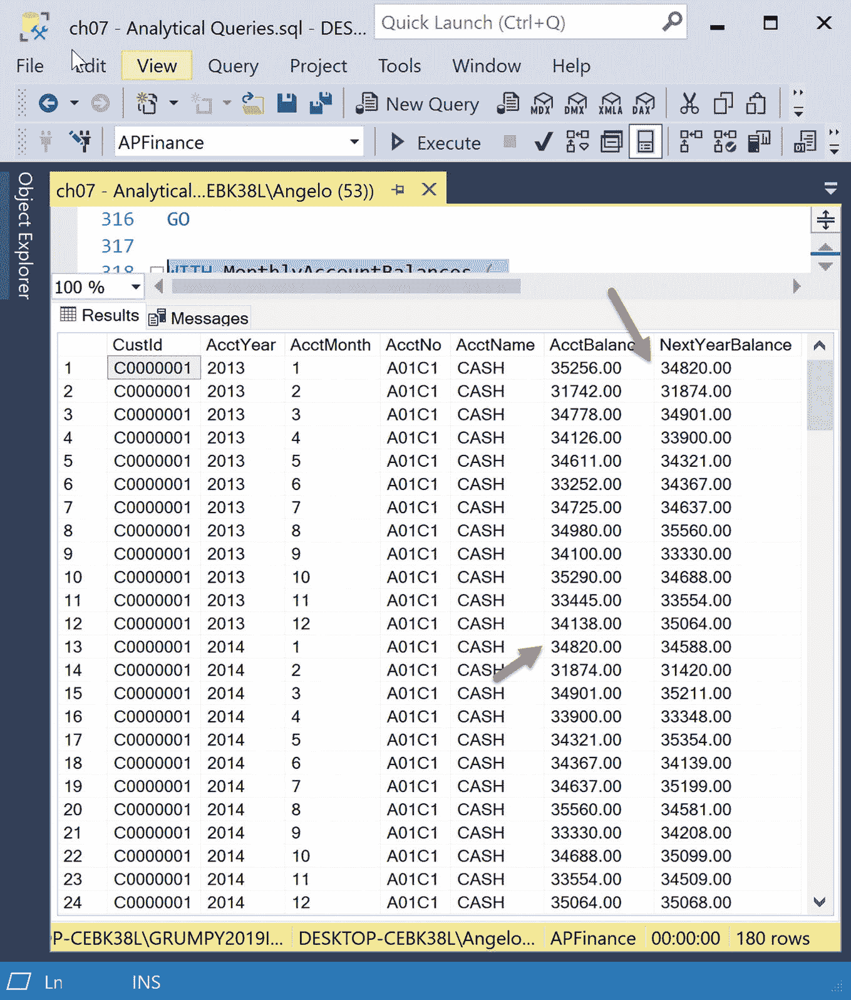

图 7-17
当年和次年月度账户余额分析报告

看起来它工作正常。第一行的次年余额指向第 13 行，即 2014 年 1 月的数据。因此我们向前看了一年。其余行的值正确地指向了下一年的值。尝试在章节脚本中下载此查询并进行修改，以便我们看到月份缩写而不是数字。同时，包含一个计算，用于显示本月余额与次年同一月份余额之间的差值。

**小测验答案**
移除`WHERE`子句中的筛选谓词，并在`OVER()`子句的`PARTITION BY`子句中包含账户类型。

### 性能考虑

图 7-18 是我们刚才讨论的查询的基线估计查询性能计划。

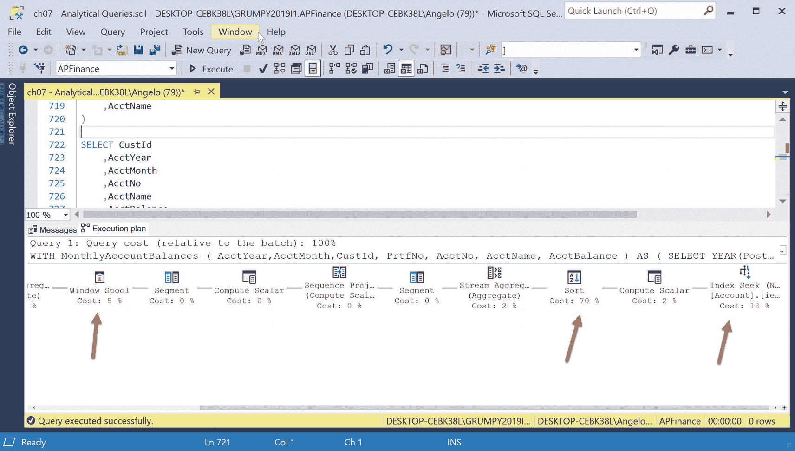

图 7-18
LEAD() 函数查询的估计查询计划

我们现在多次看到这种模式，索引查找或表扫描后跟排序任务。在这种情况下，索引查找（由`WHERE`子句引起）成本为 18%，排序成本为 70%。突出的是窗口假脱机任务占 5%。通常我们看到 1%，但似乎此函数在此特定查询中做了大量工作。让我们收集更多统计信息。

请参阅图 7-19。

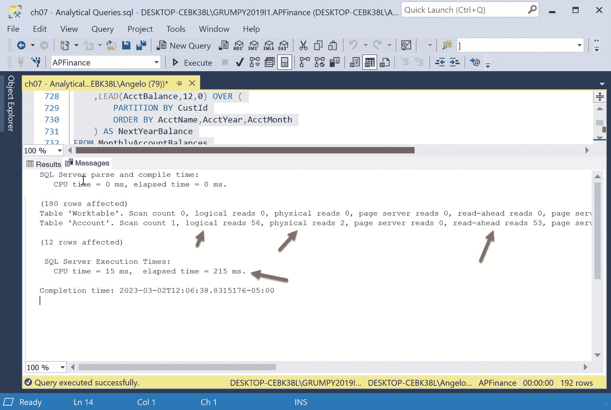

图 7-19
LEAD() 函数查询的 IO 和 TIME 统计信息

从底部开始，此查询的 SQL Server 执行时间统计如下：

*   CPU 时间：15 毫秒
*   已用时间：215 毫秒

工作表的所有值均为 0，但 Account 表具有以下统计信息：

*   扫描计数：1
*   逻辑读取：56
*   物理读取：2
*   预读读取：53

看起来有一些`IO`在进行。让我们看看`STATISTICS PROFILE`统计信息。

请参阅图 7-20。

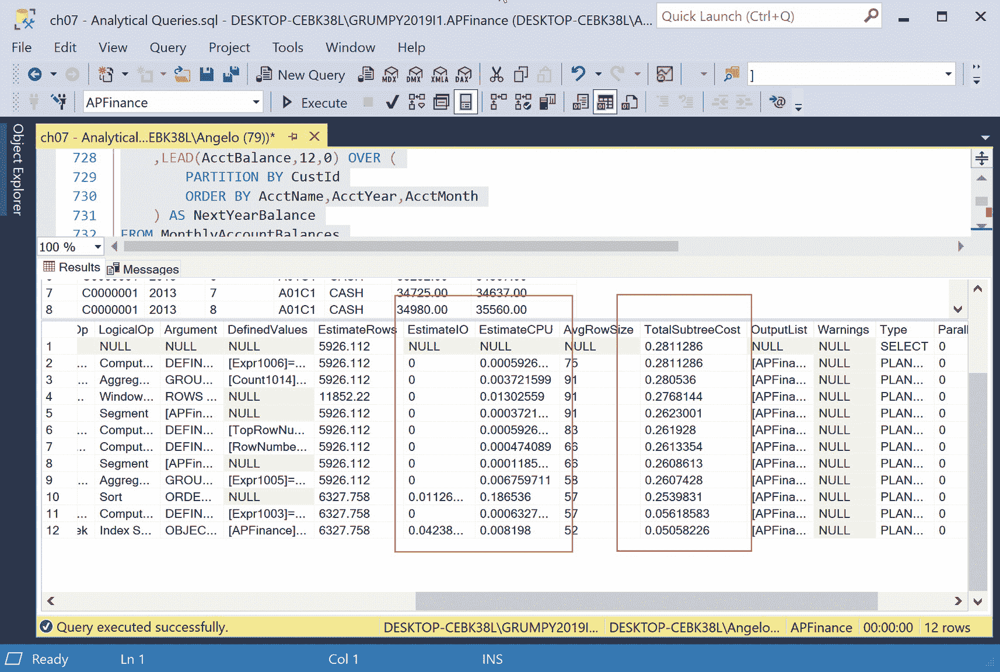

图 7-20
LEAD() 函数查询的配置文件统计信息

查看这些统计信息，我们看到`EstimateIO`统计信息几乎全为零，这包括窗口假脱机。窗口假脱机成本为 5%，尽管`EstimateIO`统计信息为零。窗口假脱机成本用于以下解释分区默认`ROWS`框架子句的逻辑：

```sql
--Window Spool(ROWS BETWEEN:([TopRowNumber1016], [BottomRowNumber1017]))
```

最后，`EstimateCPU`成本较低，`TotalSubtreeCost`值大约各为 0.2。看起来没有太多可以改进的地方，因为索引已存在并被使用。也许我们可以通过修改逻辑来改进性能，使得账户数据可以通过内存增强表加载到内存中。


### 内存优化策略

让我们创建一个内存优化表并加载账户信息，然后针对它运行查询。我们将查看估计的查询计划以确认是否有改进。清单 7-10 是创建该表的 `SQL DDL` 命令。

```sql
CREATE TABLE [FinancialReports].[AccountMonthlyBalancesMem]
(
[AcctYear]    [int] NULL,
[AcctMonth]   [int] NULL,
[CustId]      varchar NOT NULL,
[PrtfNo]      varchar NOT NULL,
[AcctNo]      varchar NOT NULL,
[AcctName]    varchar NOT NULL,
[AcctBalance] decimal NULL,
INDEX [ieMonthlyAcctBalanceMemory] NONCLUSTERED
(
[AcctYear],
[AcctMonth],
[CustId],
[PrtfNo],
[AcctNo]
)
)WITH ( MEMORY_OPTIMIZED = ON , DURABILITY = SCHEMA_ONLY )
GO
```
**清单 7-10 创建内存优化表**

该表名为 `AccountMonthlyBalancesMem`。注意我们需要包含索引声明，同时注意 `WITH` 指令包含了使此表成为内存优化表的设置。清单 7-11 是加载该表的简单 `INSERT` 命令。

```sql
INSERT INTO [FinancialReports].[AccountMonthlyBalancesMem]
SELECT YEAR(PostDate)  AS AcctYear
,MONTH(PostDate) AS AcctMonth
,CustId
,PrtfNo
,AcctNo
,AcctName
,CONVERT(DECIMAL(10,2),SUM(AcctBalance)) AS AcctBalance
FROM Financial.Account
GROUP BY YEAR(PostDate)
,MONTH(PostDate)
,CustId
,PrtfNo
,AcctNo
,AcctName
GO
```
**清单 7-11 加载内存优化表**

这个 `INSERT` 命令没什么特别的，那么让我们看看将要分析的查询。请参考清单 7-12。

```sql
SELECT CustId
,AcctYear
,AcctMonth
,AcctNo
,AcctName
,AcctBalance
,LEAD(AcctBalance,12,0) OVER (
PARTITION BY CustId
ORDER BY AcctName,AcctYear,AcctMonth
) AS NextYearBalance
,LAG(AcctBalance,12,0) OVER (
PARTITION BY CustId
ORDER BY AcctName,AcctYear,AcctMonth
) AS LastYearBalance
FROM [FinancialReports].[AccountMonthlyBalancesMem]
WHERE AcctYear >= 2013
AND AcctNAme = 'CASH'
GO
```
**清单 7-12 对内存优化表使用 LEAD() 和 LAG()**

查询和之前一样，但我们使用了内存优化表并增加了一个 `LAG()` 部分来获取去年同月的余额。回顾一下，我们按客户分区，并按账户名称、年份和月份对分区结果集进行排序。最终要求通过 `WHERE` 子句仅筛选现金账户和年份大于等于 2013 年来满足。

不需要查看结果，因为除了输出中增加的 `LAG()` 函数结果外，它们与之前非内存增强表示例中的结果一致。（本章我想节省些空间）。

> **提示**
> 
> 当你执行这类重大策略或代码更改时，务必针对已知的正确数据集测试结果，以确保一切按预期工作。永远不要想当然。错误可能而且将会潜入。别忘了保存旧脚本或查询的副本！

现在来看两者的查询计划。`**这次原始计划是指没有索引的那个，而不是图 7-18 所示的那个。**` 我在这次测试中删除了物理表上的索引。请参考图 7-21。

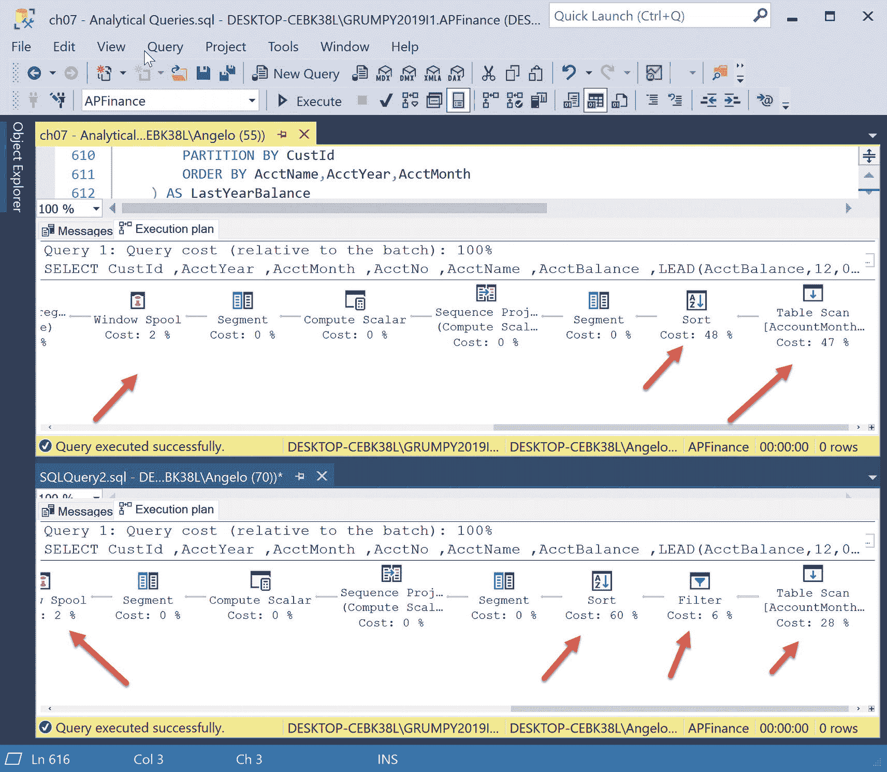

**图 7-21 对比估计的查询计划**

从右向左看，我们看到表扫描的成本从 47% 下降到了 28%；在内存表版本中添加了一个成本为 6% 的筛选任务（有点奇怪）；排序的成本从 48% 上升到了 60%，这似乎是我们尝试过的所有“增强”策略的标准情况。窗口假脱机任务——有两个——保持不变。

似乎没有显著的改进。内存表有一个默认索引，但在计划中并未使用。让我们看看 `IO` 和 `TIME` 统计数据。

请参考图 7-22。

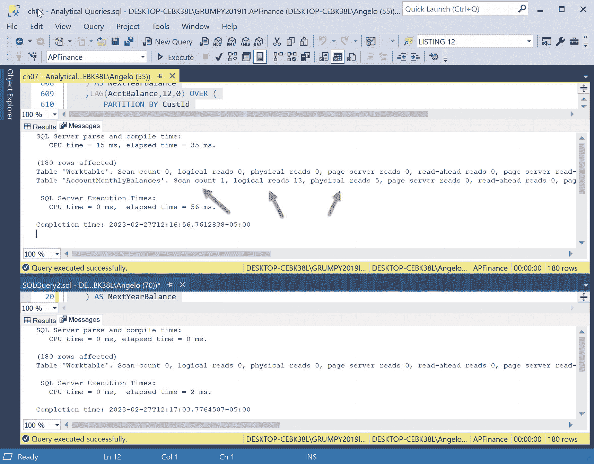

**图 7-22 对比 IO 和 TIME 统计数据**

这就是我们看到改进的地方。非内存增强版本的扫描计数为 1，逻辑读取为 13，`AccountMonthlyBalances` 表的物理读取计数为 5。内存增强版本没有此表的统计数据，因为它在内存中。工作表的统计数据均为零，因此这些数据显示出了显著的改进。

内存增强版本中的 `TIME` 统计数据有所下降。请注意，SQL Server 执行时间从 56 毫秒下降到内存增强版本的 2 毫秒，所以我认为这个策略值得投入开发时间。

> **注意**
> 
> 这些示例是在一台具有 16 GB 内存和第七代 Intel Core i7 CPU 的笔记本电脑上运行的。在具有多个 CPU 的大型服务器上运行，并且有多个查询针对内存增强表启动时，性能改进将非常显著。

### PERCENT_RANK( ) 函数

接下来介绍的是 `PERCENT_RANK()` 函数。它的作用是什么？我们在第 3 章中已经介绍过，但为了方便您复习或如果您没有按顺序阅读各章，在此再做一次回顾。

该函数针对类似查询结果、分区或表变量的数据集，计算每个值相对于整个数据集的相对排名（以百分比形式表示）。您需要将结果（返回值是浮点数）乘以 100.00，或者使用 `FORMAT()` 函数将结果转换为百分比（该函数也返回 `FLOAT(53)` 数据类型）。

此外，它的行为与 `CUME_DIST()` 函数非常相似；至少微软文档是这么说的。

您也会发现它在理论上与 `RANK()` 函数非常相似。`RANK()` 函数返回值的位次，而 `PERCENT_RANK()` 返回一个百分比值。我们将把这个函数与刚才讨论的 `CUME_DIST()` 函数一起使用，以便比较结果，并看看它对我们即将生成的查询计划有什么影响。

我们的分析师为接下来的报告提交了一个简单的业务需求。我们需要创建一个查询，按客户 ID、年份、账号和名称以及月份显示账户余额的百分比排名、密集排名和排名值。结果需要针对 2013 年及以后的年份。

幸运的是，我们已经加载了内存增强的账户余额表。让我们快速看一下能满足此请求的查询。

请参考清单 7-13。

```sql
SELECT CustId
,AcctYear
,[AcctMonth]
,AcctNo
,AcctName
,AcctBalance
,PERCENT_RANK() OVER (
PARTITION BY CustId,AcctYear,AcctMonth
ORDER BY AcctBalance DESC
) AS PercentRank
,DENSE_RANK() OVER (
PARTITION BY CustId,AcctYear,AcctMonth
ORDER BY AcctBalance DESC
) AS DenseRank
,RANK() OVER (
PARTITION BY CustId,AcctYear,AcctMonth
ORDER BY AcctBalance DESC
) AS Rank
FROM [FinancialReports].[AccountMonthlyBalancesMem]
WHERE AcctYear >= 2013
GO
```
清单 7-13
客户年度账户余额月度排名

该查询让 `PERCENT_RANK()` 函数发挥了作用，但我们也包含了 `DENSE_RANK()` 和 `RANK()` 函数，以便比较结果。在所有情况下，`OVER()` 子句都使用了 `PARTITION BY` 子句，该子句按客户 ID、账户年份和月份创建分区。分区结果按 `AcctBalance` 列排序。让我们看看结果。

请参考图 7-23。

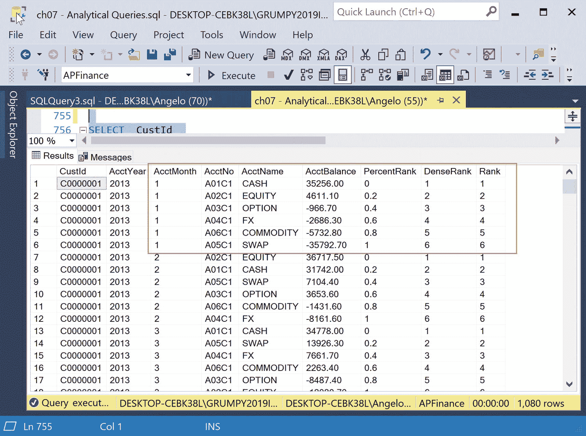

图 7-23
客户账户排名分析

我们可以看到，现金账户在 2013 年 1 月排名第一，权益账户排名第二，但差距不大。其余账户显示负余额。这意味着什么？也许他们都套现了，利润都在现金账户里。

二月份显示所有账户头寸都是正的，除了商品和外汇（FX）账户。

这些是有趣的模式，我们的分析师需要研究并理解它们，以便根据发现提出投资建议，或者分析问题出在哪里。

让我们将注意力转向一些性能调优和策略。

### 性能考虑

图 7-24 是查询计划的初步估计版本。该计划相当大，并且有一个模式重复了两次，对应于查询中的每个窗口函数。

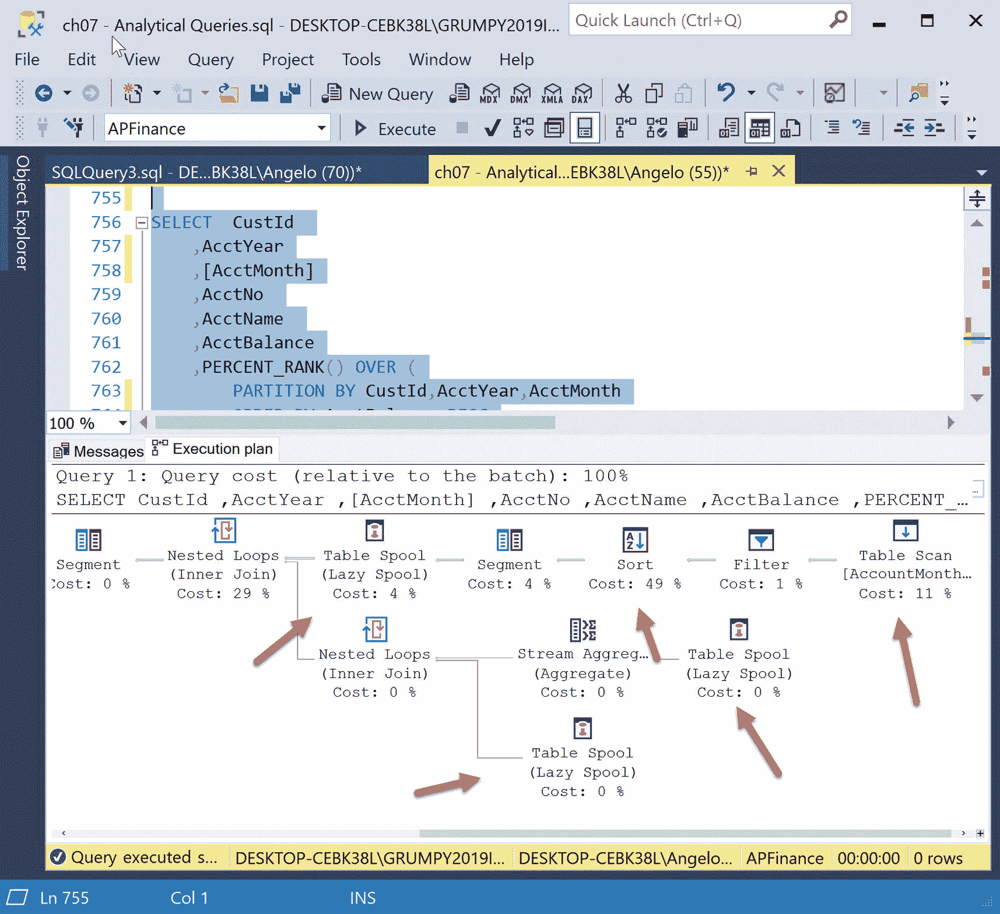

图 7-24
排名分析报告的估计查询计划

注意缺少窗口假脱机任务。请记住，我们在查询中使用了内存增强表，因此 11% 成本的表扫描无需担心。还有一个 49% 成本的排序任务，有点高。接下来，我们看到三个表假脱机，两个成本为 0%，一个成本为 4%。随后是一个成本为 29% 的嵌套循环（内连接）任务，用于合并数据流。

接下来是段、序列项目和计算标量任务，该模式针对第二个窗口函数重复。请运行此计划并查看这些任务的作用。还可以在 `PROFILE` 统计信息的 `StmtText` 列中获取更多解释。

接下来让我们看看 `IO` 和 `TIME` 统计信息。请参考图 7-25。

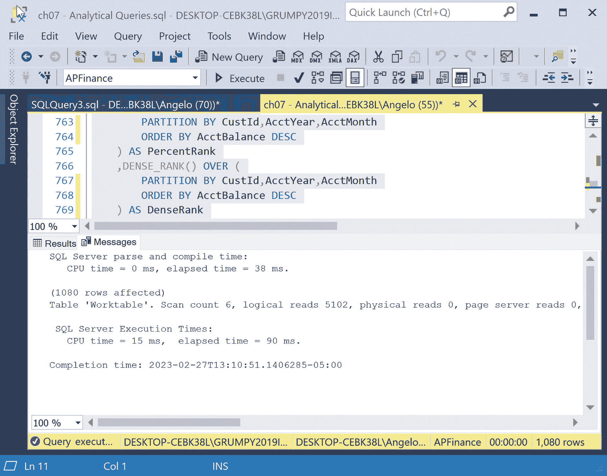

图 7-25
排名分析的 IO 和 TIME 统计信息（内存增强表）

由于这是内存增强表，因此没有 `AccountMonthlyBalancesMem` 表的统计信息，只有工作表的统计信息。

基于我们查看的计划和统计信息，我们可以在所有示例中采用此策略。让我们继续下一组函数。

### PERCENTILE_CONT( ) 和 PERCENTILE_DISC( )

这两个函数是做什么的？嗯，回想一下，它们处理连续和离散的数据集。

回想一下什么是连续数据。它是在特定时间段内变化的数据，例如随时间变化的销售金额，比如特定产品在 12 个月内的总销售额。连续数据是在一段时间内测量的数据，比如设备在 24 小时内的锅炉温度。

将每个锅炉温度相加得到总和没有意义。将锅炉温度相加然后除以时间段以获得平均值是有意义的。

那么，什么是离散数据呢？

离散数据值是可以随时间计数的数字，例如投资账户余额在几天、几个月和几年内的变化。您可以将这些值相加得到总计和平均值，并识别账户余额随时间变化的趋势。

总之，`PERCENTILE_CONT()` 函数基于所需的百分位数在连续数据集上工作，以返回满足该百分位数的数据集内的一个值（您需要提供一个百分位数作为参数，如 .25、.50、.75 等）。

对于此函数，该值是内插的。它通常不存在，所以是引入的。或者，如果数字正确对齐，它可能巧合地使用数据集中的某个值。

`PERCENTILE_DISC()` 函数基于所需的百分位数在离散数据集上工作，以返回满足该百分位数的数据集内的一个值。对于此函数，该值存在于数据集中；不像 `PERCENTILE_CONT()` 函数那样是内插的（两个函数都返回 `FLOAT(53)` 数据类型的值）。


#### PERCENTILE_CONT()

在我们深入分析财务数据之前，先从一个简单的例子开始。我们的分析师为下一个报告提交了以下业务需求：

创建一个报表，按客户、年份、月份、账号和名称显示期权（一种衍生品工具）账户余额，以及 25%、50%、75% 和 90% 的连续百分位数。最初我们将只显示客户 C0000001，但此报表稍后将用于多个客户。查询需要灵活，以便满足所有这些要求。最后，查询的运行时间必须少于一秒钟（我们的第一个性能要求）！

请参考清单 7-14 了解解决方案。

```sql
SELECT CustId
,AcctYear
,AcctMonth
,AcctNo
,AcctName
,AcctBalance
,PERCENTILE_CONT(.25)
WITHIN GROUP (ORDER BY AcctBalance)
OVER (
PARTITION BY CustId,AcctYear
) AS [PercentCont-25%]
,PERCENTILE_CONT(.50)
WITHIN GROUP (ORDER BY AcctBalance)
OVER (
PARTITION BY CustId,AcctYear
) AS [PercentCont-50%]
,PERCENTILE_CONT(.75)
WITHIN GROUP (ORDER BY AcctBalance)
OVER (
PARTITION BY CustId,AcctYear
) AS [PercentCont-75%]
,PERCENTILE_CONT(.90)
WITHIN GROUP (ORDER BY AcctBalance)
OVER (
PARTITION BY CustId,AcctYear
) AS [PercentCont-90%]
FROM [FinancialReports].[AccountMonthlyBalancesMem]
WHERE Acctname = 'OPTION'
AND CustId = 'C0000001'
GO
```

清单 7-14 客户连续百分位数查询

请注意，此查询与我们通常包含 `OVER()` 子句的查询略有不同。该函数在 `SELECT` 子句中包含了四次，但每个所需百分位数的值作为参数传入。另请注意，我们正在使用内存增强表，因此这应该很快！

在 `OVER()` 子句出现之前，我们需要包含一个 `WITHIN GROUP (ORDER BY ...)` 子句。请注意，`ORDER BY` 子句并未包含在 `OVER()` 子句中。我们看到的只有 `PARTITION BY` 子句，它在四种情况下都设置了按客户标识符和账户年份的分区。看起来在每种情况下，分区都将按 `AcctBalance` 列排序以便处理。

后面是一个简单的 `WHERE` 子句，用于筛选期权账户和客户 C0000001 的结果。此查询可以重新调整用途以显示多个客户和多个账户的结果，因此你可能需要修改 `OVER()` 子句。

> 注意
>
> 像往常一样，我们从小的数据集开始，以确保查询正确工作，之后再扩大范围。

请参考图 7-26 中的部分结果。

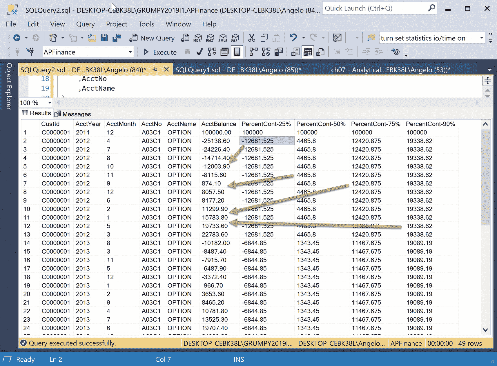

图 7-26 各种百分位数的连续百分位数报表

此报表中什么引人注目？百分位数的值是插值的。注意箭头指向两个最接近的值，例如，19338.62 介于 15783.80 和 19733.60 之间。值 19338.62 并不存在于实际的列值中。

请记住，这是该函数的行为。

但这并非普遍规律。可能存在某些数据模式，使得连续百分位数值与列值匹配。大多数情况下不会发生这种情况。再看一下 $100,000.00 的结果。列值和百分位数值是相等的。这是因为此分区中只有一行。因此，这是一个例外于该函数通常行为的场景。

在我看来，这个报表确实让我们很好地了解了值的分布情况。

### 性能考虑

让我们以通常的方式生成一个估计的查询计划。我们只检查右侧部分，因为执行模式重复了四次，对应于 `SELECT` 子句中每次 `PERCENTILE_CONT()` 函数调用（对应每个百分比参数）。在初始索引查找以设置数据之后，实际上还有第五个重复模式。这些包括一个排序步骤和一些常见的表假脱机任务。

请参考图 7-27。

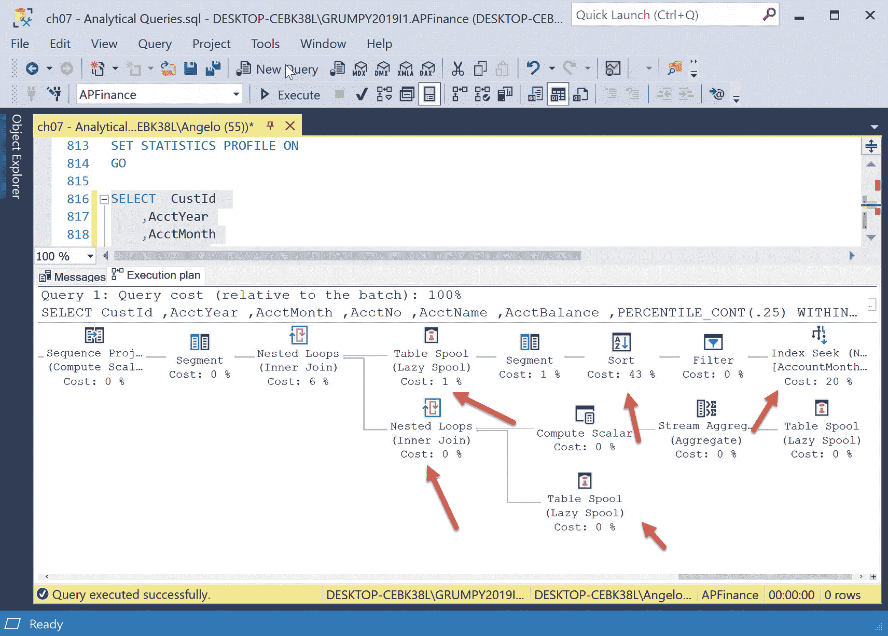

图 7-27 连续百分位数报表的估计查询计划

现有索引满足了查询要求，因此我们看到一个索引查找，其成本为 20%。有用于 `WHERE` 子句的筛选器和成本为 43% 的昂贵排序。在下方的两个分支中，我们看到两个表假脱机，它们为嵌套循环连接生成数据流，所有成本均为 0%。

第二个嵌套循环连接以 6% 的成本合并了顶部和底部的流。正如我之前所说，剩余的计划部分类似并重复自身，只是没有索引查找和排序任务。

接下来，让我们看看 `TIME` 和 `IO` 统计信息。请参考图 7-28。

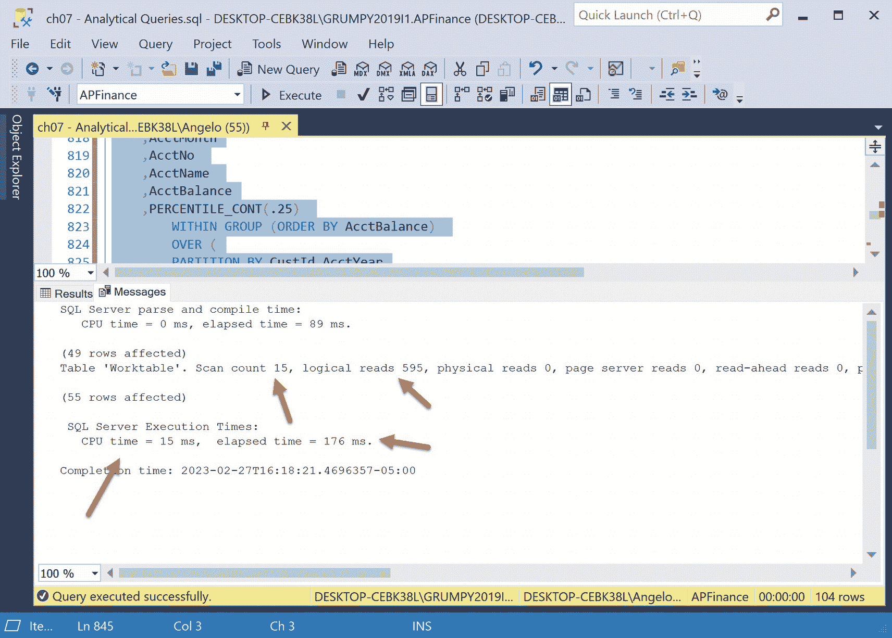

图 7-28 IO 和 TIME 统计信息

如图所示，我们只有关于工作表的统计信息，包括 15 次扫描计数和 595 次逻辑读取。内存增强表的处理没有产生任何统计信息。最后，SQL Server 的执行时间是 176 毫秒。

请参考图 7-29 了解部分 `STATISTICS PROFILE` 统计信息。

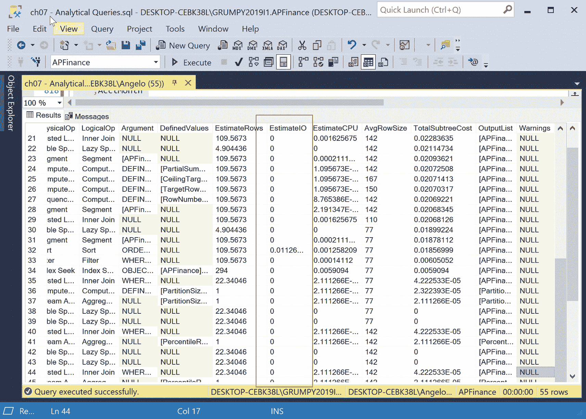

图 7-29 连续百分位数查询的配置文件统计信息

你可能注意到了，对于内存增强表，我们看到 `EstimateIO` 统计信息为 0 或非常低，但 `EstimateCPU` 统计信息较高。这是一个部分输出，因为总共有 55 个步骤，但除了一个步骤外，所有 IO 都为零！`EstimateCPU` 和 `TotalSubtreeCost` 因步骤而异，其中 `WHERE` 子句和嵌套循环连接的值最高。

就性能分析计划而言，我认为这个计划非常有趣，并展示了内存增强表的能力。

> 问题
>
> 更高的 `EstimateCPU` 统计信息是否意味着在利用内存增强表时需要强大的 CPU？这是值得考虑的一点。


## PERCENTILE_DISC 函数

以下是我们的百分位离散值示例。请记住，返回的值将是所分析列中实际存在的值，它们不是插值计算得出的。我们的分析师为下一份报告提交了以下业务需求：

通过修改之前的查询，创建一份报告，按客户、年份、月份、账号和名称显示期权账户余额，以及 25%、50%、75%和 90%百分位的离散百分位值。再次说明，这份报告是为我们的客户朋友 C0000001 准备的，但该报告稍后将用于多个客户。查询需要灵活，以便满足所有这些要求。最后，查询需要像之前的查询一样，在一秒内运行完成。

这很棒。我们可以复制之前的示例并进行修改，因此我们使用了 `CTE` 而不是内存增强表。这让我们有机会比较估算的查询计划和 `STATISTICS PROFILE` 统计信息。

进行一些复制粘贴操作，使用之前示例中的 `CTE`，我们就得到了满足需求的查询。

提示

编写代码时，请始终着眼于可重用性。

请参阅清单 7-15。

```sql
WITH MonthlyAccountBalances (
AcctYear,AcctMonth,CustId, PrtfNo, AcctNo, AcctName, AcctBalance
)
AS
(
SELECT YEAR(PostDate)  AS AcctYear
,MONTH(PostDate) AS AcctMonth
,CustId
,PrtfNo
,AcctNo
,AcctName
,SUM(AcctBalance)
FROM Financial.Account
GROUP BY YEAR(PostDate)
,MONTH(PostDate)
,CustId
,PrtfNo
,AcctNo
,AcctName
)
SELECT CustId
,AcctYear
,AcctMonth
,AcctNo
,AcctName
,AcctBalance
,PERCENTILE_DISC(.25)
WITHIN GROUP (ORDER BY AcctBalance)
OVER (
PARTITION BY CustId,AcctYear
) AS [PercentDisc-25%]
,PERCENTILE_DISC(.50)
WITHIN GROUP (ORDER BY AcctBalance)
OVER (
PARTITION BY CustId,AcctYear
) AS [PercentDisc-50%]
,PERCENTILE_DISC(.75)
WITHIN GROUP (ORDER BY AcctBalance)
OVER (
PARTITION BY CustId,AcctYear
) AS [PercentDisc-75%]
,PERCENTILE_DISC(.90)
WITHIN GROUP (ORDER BY AcctBalance)
OVER (
PARTITION BY CustId,AcctYear
) AS [PercentDisc-90%]
FROM FinancialReports.AccountMonthlyBalances
WHERE Acctname = 'OPTION'
AND CustId = 'C0000001'
ORDER BY CustId
,AcctYear
GO
```

#### 清单 7-15
使用 CTE 方案的百分位离散值

如图所示，我们希望为客户及所有年份生成账户余额分布的 25%、50%、75%和 90%百分位的离散百分位值。再次请注意该函数特有的 `WITHIN GROUP` 子句。唯一使用此子句的其他函数是我们刚刚研究的 `PERCENTILE_CONT()` 函数（不确定微软为何如此实现这些函数，但他们一定有充分的理由）。

最后，我在查询末尾添加了一个 `ORDER BY` 子句，以便输出能按客户和年份整齐排序。这并非多余，因为 `WITHIN GROUP` 子句中的 `ORDER BY` 子句是按账户余额排序的。让我们查看结果，并请记住这些值不是插值计算得出的——它们实际存在！

请参阅图 7-30 中的部分结果。

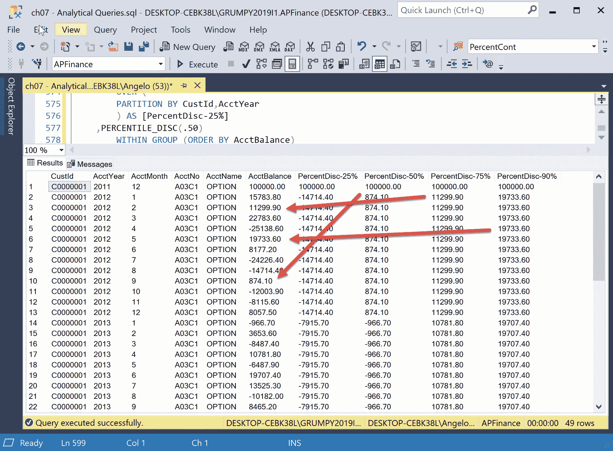

#### 图 7-30
账户余额的百分位离散分析

一个 SSMS 窗口的截图。它显示了一个包含 11 列和 50 行的表格。列标题为：客户 ID、账户年份、账户月份、账号、账户名称、账户余额、百分位离散 25%、百分位离散 50%、百分位离散 75%、百分位离散 80%。

如图所示，结果没有进行插值计算。每个百分位值都可以追溯到一个实际的账户余额值。例如，看最后一个箭头，值 19733.60 可以在“账户余额”列中找到。请注意此行为与前一示例中百分位连续计算行为的区别。

让我们看看针对此查询的一些性能分析。

### 性能考虑

和往常一样，让我们运行一个估算查询计划以建立性能基线。该计划很长，因此将分为几个截图显示。以下是右侧开始的第一部分。我们将盘点计划的每个部分，然后看看是否能得出一些观察结果和结论。从右侧开始，我们在图 7-31 中看到以下步骤。

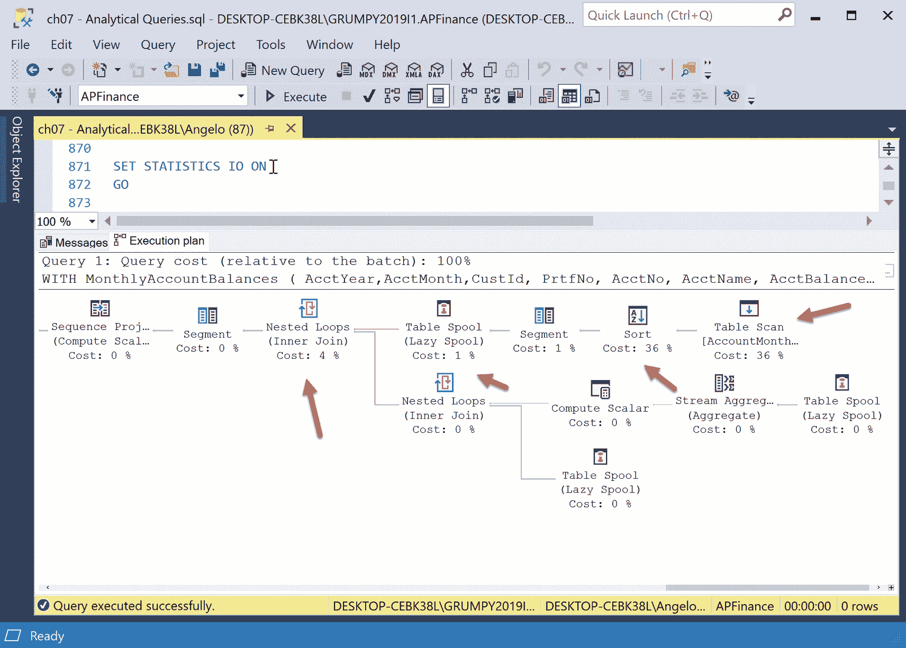

#### 图 7-31
估算执行计划，A 部分

一个 SSMS 窗口的截图。它显示了估算执行计划的 A 部分，包含 12 个组件。组件依次为：序列投影、段、嵌套循环、表假脱机、段、排序、表扫描、嵌套循环、计算标量、流聚合、表假脱机、表假脱机。

这看起来很熟悉。注意，虽然我们只看到一个针对 `AccountMonthlyBalances CTE` 的表扫描、一个成本为 36%的排序操作、两个表假脱机和一个嵌套循环连接（尽管成本为零），但没有索引建议。最后一个表假脱机显示成本为 1%（回想一下，表假脱机将数据临时存储在 `TEMPDB` 中供其他任务检索）。

接下来，我们看到另一个成本为 4%的嵌套循环连接操作。让我们看看计划的下一部分，看看这种模式是否重复出现。

请参阅图 7-32。

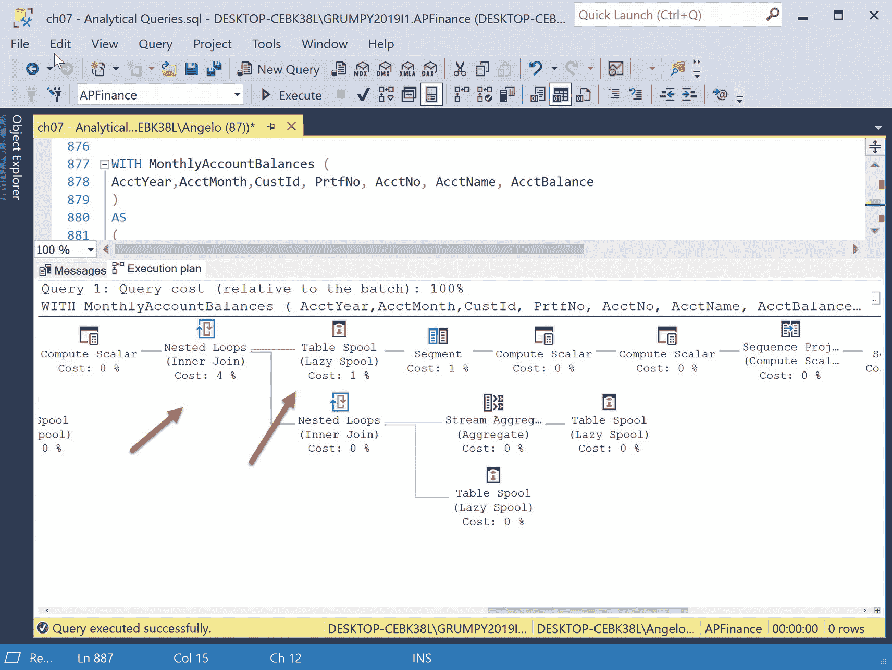

#### 图 7-32
估算执行计划，B 部分

一个 SSMS 窗口的截图。它显示了估算执行计划的 B 部分，包含 11 个组件。组件依次为：计算标量、嵌套循环、表假脱机、段、计算标量、计算标量、序列投影、嵌套循环、流聚合、表假脱机、表假脱机。

看起来与我们刚刚讨论的计划第一部分基本相同的模式，只是没有排序任务或表扫描。有人能猜出其他部分会是什么样子吗？我们来看。

请参阅图 7-33。

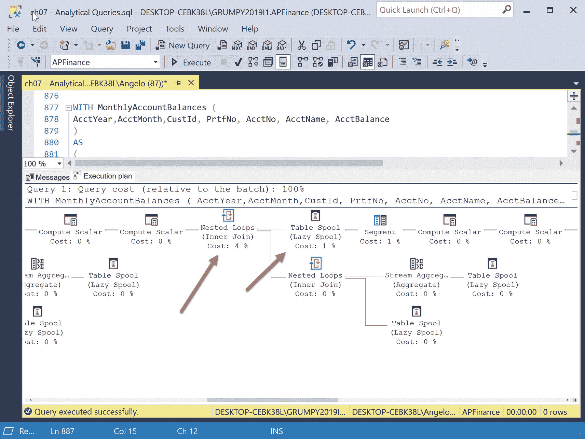

#### 图 7-33
估算执行计划，C 部分

一个 SSMS 窗口的截图。它显示了估算执行计划的 C 部分，包含 14 个组件。组件依次为：2 个计算标量、嵌套循环、表假脱机、段、2 个计算标量、嵌套循环、流聚合、2 个表假脱机、流聚合、2 个表假脱机。

是的，相同的模式：表假脱机任务、一些计算标量任务和一个成本为 4%的嵌套循环连接操作。如果你现在还没猜到的话，这种模式将重复四次，每个 `PERCENTILE_DISC()` 函数调用一次。我最初的假设是，这些模式只能通过快速的内存和磁盘或内存增强表来改进。让我们看看下一部分。

请参阅图 7-34。

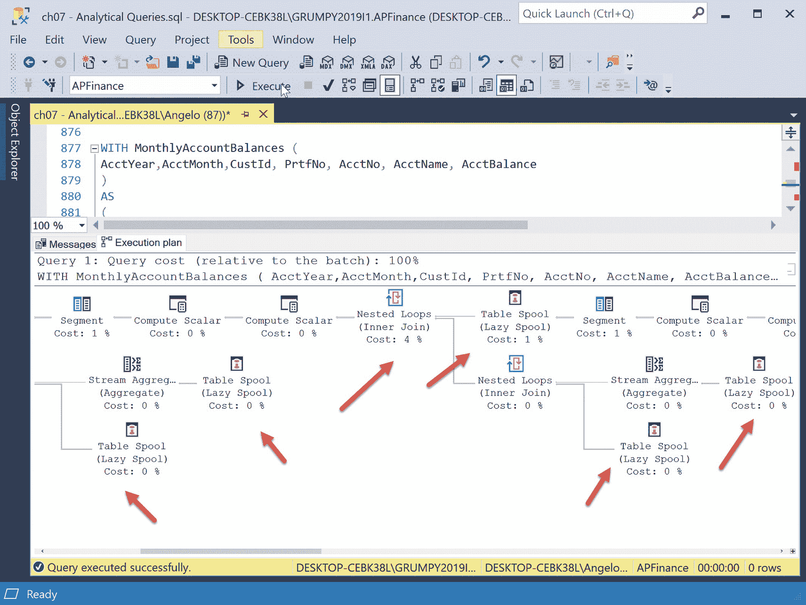

#### 图 7-34
估算执行计划，D 部分

一个 SSMS 窗口的截图。它显示了估算执行计划的 D 部分，包含 14 个组件。组件依次为：段、2 个计算标量、嵌套循环、表假脱机、段、计算标量、嵌套循环、流聚合、2 个表假脱机、流聚合、2 个表假脱机。

这里也是相同的模式：表假脱机和嵌套循环连接是主要任务。我检查了 `PROFILE STATISTICS`，几乎所有的表假脱机 `IO` 都为零，所以看起来假脱机是在内存中执行的。此外，如果你查看每个任务的提示，你会看到每个部分中的表假脱机簇具有相同的节点 ID，因此看起来临时表中假脱机的数据是可重用的。这似乎非常高效。

让我们看看计划的最后一部分。请参阅图 7-35。

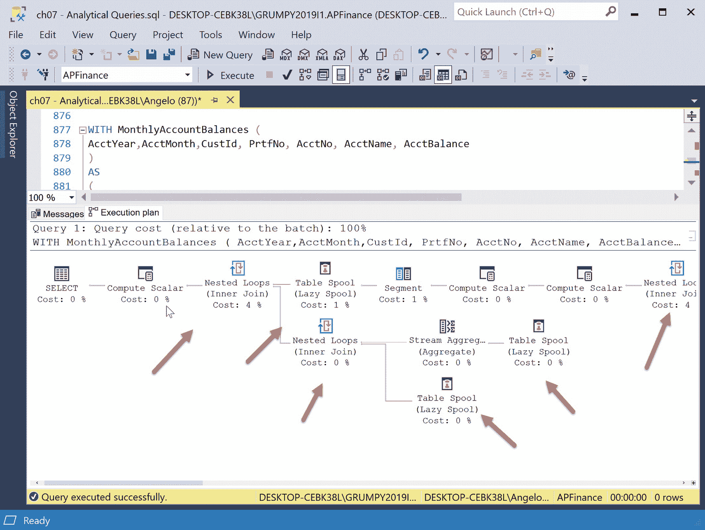


#### 执行计划分析与优化

一张 SSMS 窗口的截图。它展示了估计执行计划的 D 部分，包含 12 个组件。这些组件分别是：select、compute scalar、nested loops、table spool、segment、compute scalar、compute scalar、nested loops、nested loops、stream aggregate、table spool 和 table spool。

图 7-35

估计执行计划，E 部分

同样的模式再次出现，这次有一个最终的 table spool，其成本为 1%，以及一个最终的 nested loops join 用于合并结果（4%成本）。该 table spool 显示的成本为 1%，尽管`STATISTICS PROFILE`统计显示`IO`为 0。

初步结论是，改进此计划的唯一途径是：

1.  获取更多内存
2.  将`TEMPDB`放置在固态硬盘上
3.  通过内存优化表将 Account 表加载到内存中

都是不错的建议，但值得这样做吗？

作为最后一项，让我们生成一个实时查询计划，以便我们能看到计划最后、左侧部分所有任务之间的数据流。请参考图 7-36。

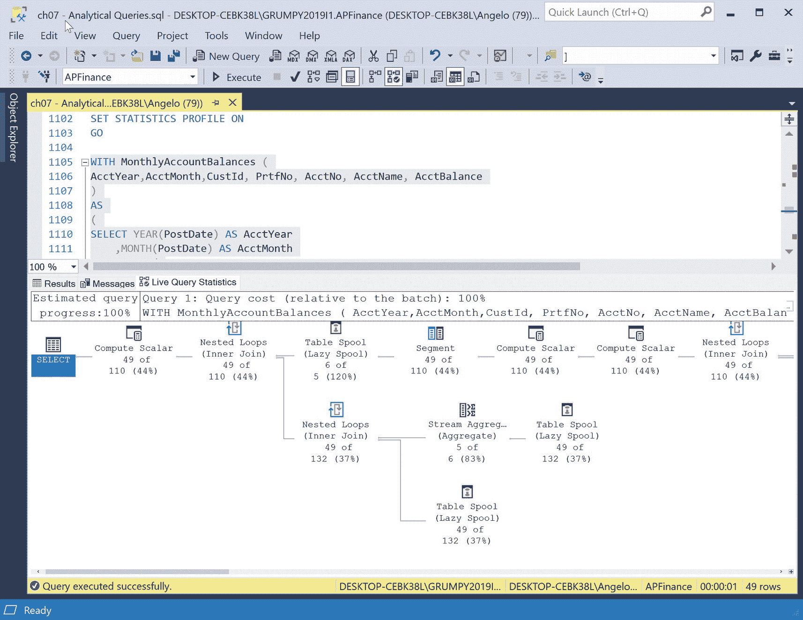

一张 SSMS 窗口的截图。它展示了一个包含 12 个组件的实时查询计划。这些组件分别是：select、compute scalar、nested loops、table spool、segment、compute scalar、compute scalar、nested loops、nested loops、stream aggregate、table spool 和 table spool。

图 7-36

实时查询计划

在这里，我们看到了各个分支中的行数，最终计数为 49 行，这与我们在查询窗格结果中看到的一致。

**提示**

务必将估计查询计划与实时查询计划进行比较，以确保数值和运算符的偏差不会过大。

还记得方案 3 吗？让我们看看它是如何工作的。我们将创建几个内存优化表，每个表对应一年的账户余额，并看看这在性能提升方面能带来什么好处，尽管代价是增加了复杂性。

### 多内存优化表策略

我们将创建五个内存优化表，每个表对应 2011 年到 2015 年中的一年。我们将加载它们，创建一个`VIEW`对象，通过`UNION ALL`运算符将所有五个表关联起来，并修改之前的查询，使其通过这个新的`VIEW`访问内存优化表。让我们从创建和加载表开始。

**注意**

一旦内存优化表被创建并加载，即使你重启笔记本电脑，也无需重新加载它们。它们会自动加载。你只需要添加新的行。确保不要意外添加重复的行！

清单 7-16 是第一个表的代码。其余表的代码与此相同，只是表名中的年份部分会相应更改为剩余的年份：2012、2013、2014 和 2015。

```
CREATE TABLE [FinancialReports].[AccountMonthlyBalancesMem2011]
(
[AcctYear]    [int] NULL,
[AcctMonth]   [int] NULL,
[CustId]      varchar NOT NULL,
[PrtfNo]      varchar NOT NULL,
[AcctNo]      varchar NOT NULL,
[AcctName]    varchar NOT NULL,
[AcctBalance] decimal NOT NULL,
INDEX [ieMonthlyAcctBalanceMemory2011] NONCLUSTERED
(
[CustId],
[AcctYear],
[AcctMonth],
[PrtfNo],
[AcctNo]
)
)WITH (MEMORY_OPTIMIZED = ON,DURABILITY = SCHEMA_ONLY)
GO
```
清单 7-16
创建五个内存优化表

这个表对于所有五个表都是典型的；当然，变化的只是表名。我们需要在`CREATE TABLE`命令中声明一个索引，并将内存优化参数设置为`ON`：

```
WITH ( MEMORY_OPTIMIZED = ON , DURABILITY = SCHEMA_ONLY )
```

在本章的脚本中，你会找到所有五个`CREATE TABLE`命令的`DDL`命令。接下来，我们需要加载这些表。

清单 7-17 是用于向第一个内存表（2011 年的账户余额）插入行的`TSQL DML`命令。其余的插入语句是相同的，只是我们将表名更改为要加载的年份，并将`WHERE`子句谓词更改为我们需要加载的剩余年份的数据。

```
INSERT INTO [FinancialReports].[AccountMonthlyBalancesMem2011]
SELECT YEAR(PostDate) AS AcctYear
,MONTH(PostDate) AS AcctMonth
,CustId
,PrtfNo
,AcctNo
,AcctName
,CONVERT(DECIMAL(10,2),SUM(AcctBalance)) AS AcctBalance
FROM Financial.Account
WHERE YEAR(PostDate) = 2011
GROUP BY YEAR(PostDate)
,MONTH(PostDate)
,CustId
,PrtfNo
,AcctNo
,AcctName
GO
```
清单 7-17
加载五个内存优化表

这是一个标准的`INSERT/SELECT`命令，带有`GROUP BY`子句，因为我们正在按年、月、客户和投资组合对账户余额进行汇总。我们的最后一步是创建`TSQL VIEW`对象。

是的，这些操作会带来性能成本，但由于这是历史数据，你每年只需要加载一次。随着新年的到来，你加载一次即可。现在我们需要将所有这些表关联成一个`VIEW`对象。

清单 7-18 是用于创建`VIEW`的`DDL`命令，该视图通过五个使用`UNION ALL`命令相互连接的查询来连接所有表。

```
CREATE VIEW [FinancialReports].[AccountMonthlyBalancesMemView]
AS
SELECT [AcctYear]
,[AcctMonth]
,[CustId]
,[PrtfNo]
,[AcctNo]
,[AcctName]
,[AcctBalance]
FROM [FinancialReports].[AccountMonthlyBalancesMem2011]
UNION ALL
SELECT [AcctYear]
,[AcctMonth]
,[CustId]
,[PrtfNo]
,[AcctNo]
,[AcctName]
,[AcctBalance]
FROM [FinancialReports].[AccountMonthlyBalancesMem2012]
UNION ALL
SELECT [AcctYear]
,[AcctMonth]
,[CustId]
,[PrtfNo]
,[AcctNo]
,[AcctName]
,[AcctBalance]
FROM [FinancialReports].[AccountMonthlyBalancesMem2013]
UNION ALL
SELECT [AcctYear]
,[AcctMonth]
,[CustId]
,[PrtfNo]
,[AcctNo]
,[AcctName]
,[AcctBalance]
FROM [FinancialReports].[AccountMonthlyBalancesMem2014]
UNION ALL
SELECT [AcctYear]
,[AcctMonth]
,[CustId]
,[PrtfNo]
,[AcctNo]
,[AcctName]
,[AcctBalance]
FROM [FinancialReports].[AccountMonthlyBalancesMem2015]
GO
```
清单 7-18
基于五个内存优化表创建视图

脚本很长，但它只是一系列四个`UNION ALL`命令，通过除了表名外完全相同的查询将所有五个表中的行连接在一起。

**提示**

与`UNION`相比，更推荐使用`UNION ALL`，因为`UNION`会去除重复项，性能成本更高。你的数据中不应该有意外的重复或三重及更多重复！

最后但同样重要的是，清单 7-19 是我们的查询，它包含了`PERCENTILE_DISC()`函数，现在该函数引用的是`VIEW`而不是一张大表。

```
SELECT CustId
,AcctYear
,AcctMonth
,AcctNo
,AcctName
,AcctBalance
,PERCENTILE_DISC(.25)
WITHIN GROUP (ORDER BY AcctBalance)
OVER (
PARTITION BY CustId,AcctYear
) AS [PercentDisc-25%]
,PERCENTILE_DISC(.50)
WITHIN GROUP (ORDER BY AcctBalance)
OVER (
PARTITION BY CustId,AcctYear
) AS [PercentDisc-50%]
,PERCENTILE_DISC(.75)
WITHIN GROUP (ORDER BY AcctBalance)
OVER (
PARTITION BY CustId,AcctYear
) AS [PercentDisc-75%]
,PERCENTILE_DISC(.90)
WITHIN GROUP (ORDER BY AcctBalance)
OVER (
PARTITION BY CustId,AcctYear
) AS [PercentDisc-90%]
FROM [FinancialReports].[AccountMonthlyBalancesMemView]
WHERE Acctname = 'OPTION'
AND CustId = 'C0000001'
ORDER BY CustId
,AcctYear
GO
```
清单 7-19
基于内存表视图的账户余额报告

无需解释代码，因为我们之前已经讨论过。所有变化的是我们现在引用的是一个`VIEW`。

结果与`CTE`查询相同，因此为了节省篇幅，我将不再在此处显示另一个截图。

### 性能考虑

我们有一个非常有趣的估计执行计划，因此请务必阅读下一部分。

请参考图 7-37。

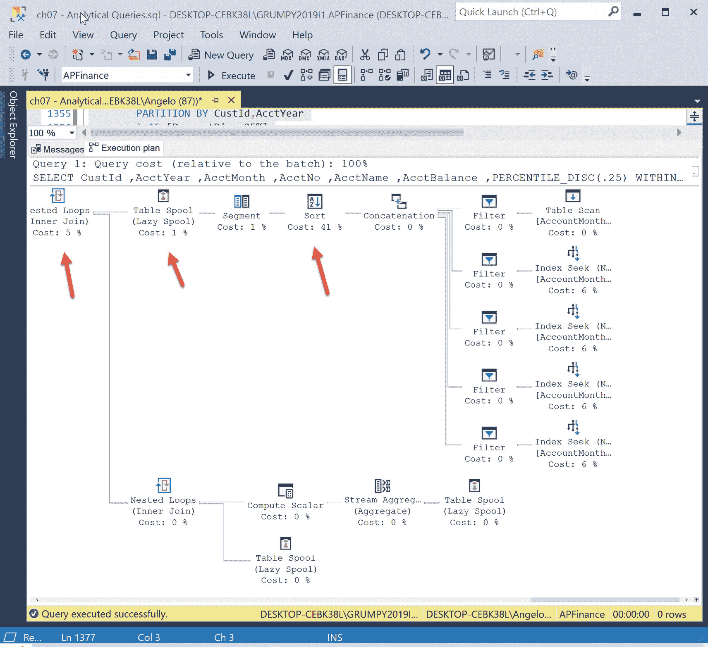

这是 SSMS 窗口的截图。它展示了包含 20 个组件的估计执行计划的 A 部分。这些组件包括嵌套循环、表假脱机、段、排序、串联、筛选器、表扫描、4 组筛选器和表 Seek、嵌套循环、计算标量、流聚合以及 2 个表假脱机。

**图 7-37**

多内存增强表策略的估计执行计划 – A 部分

是的，它很有趣且更复杂。我们看到针对内存增强表的索引 Seek，但由于它们在内存中，这应该能提高性能。我们看到了熟悉的身影：成本为 0% 的表假脱机任务、成本为 41% 的排序、成本为 1% 的表假脱机，以及第一个嵌套循环内部联接。回想一下，我们学过由表假脱机操作符创建的临时表可以被重用（*共享* 可能是更好的术语），因此我们不会有一大堆临时表占用 `TEMPDB` 上的空间。

因此，这给了我们一种提高性能的策略：如果无法消除表假脱机，那么让您的 DBA 将 `TEMPDB` 放在固态硬盘上 – 这应该会有所帮助。

让我们看看计划的第二部分。

请参考图 7-38。

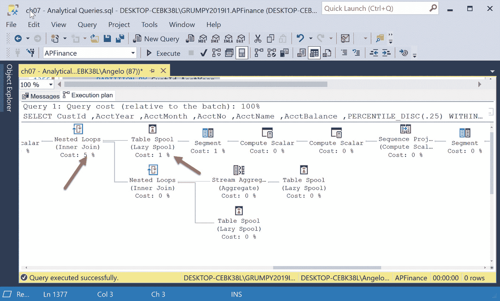

这是 SSMS 窗口的截图。它展示了包含 11 个组件的估计执行计划的 B 部分。这些组件包括嵌套循环、表假脱机、段、计算标量、计算标量、序列项目、段、嵌套循环、流聚合、表假脱机和表假脱机。

**图 7-38**

多内存增强表策略的估计执行计划 – B 部分

又来了，相同的模式：成本为 0% 的表假脱机任务，一个成本为 1%，以及成本为 5% 的嵌套循环联接。计划的其余部分相同，就像使用 `CTE` 方法的情况一样，所以看起来我们所做的只是让查询在加载和引入创建及加载内存增强表的逻辑方面变得更加复杂。

对于具有多个 `CPU` 的服务器来说，这种策略将是理想的，这样查询引擎就可以并行执行从每个表中检索数据的逻辑。更多硬件解决方案，但实施成本也更高！

让我们看看完整的性能情况。那么 `IO` 和 `TIME` 统计数据呢？

请参考图 7-39。

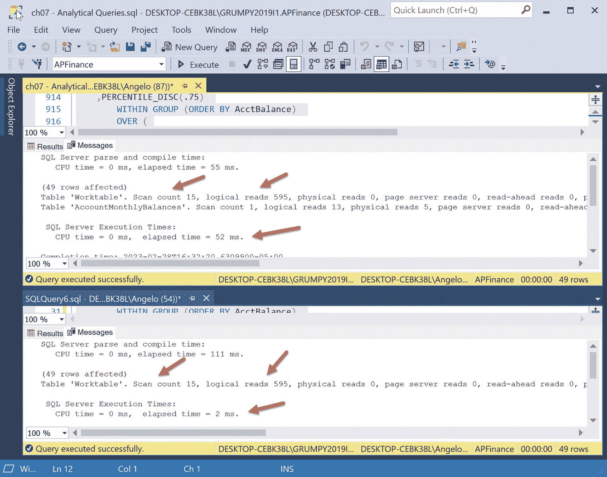

这是 SSMS 窗口的截图。文本展示了 2 组 IO 和 TIME 统计数据。对于 1 和 2，解析和编译时间的 CPU 和流逝时间分别为 0, 55 毫秒和 0, 111 毫秒。对于 1 和 2，执行时间的 CPU 和流逝时间分别为 0, 52 毫秒和 0, 2 毫秒。影响了 49 行。

**图 7-39**

多内存增强表方案的 IO 和 TIME 统计数据

现在我们有些进展了。工作表统计数据没有变化，但账户余额表统计数据没有显示在内存表查询统计信息中。这是因为所有操作都在内存中执行，因此看起来是一个显著的改进，因为我们消除了一整套操作。最后，SQL Server 的执行时间从 52 毫秒减少到 2 毫秒，这是另一个显著的改进。SQL Server 的解析和编译时间使用内存增强表方法翻了一倍。你不可能赢得所有方面。

因此，这个方案看起来很有希望。

对于最后一项，让我们比较三种方案的 `IO` 和 `TIME` 统计数据：`CTE` 方法、报表表方法和内存增强表方法。

请参考图 7-40。

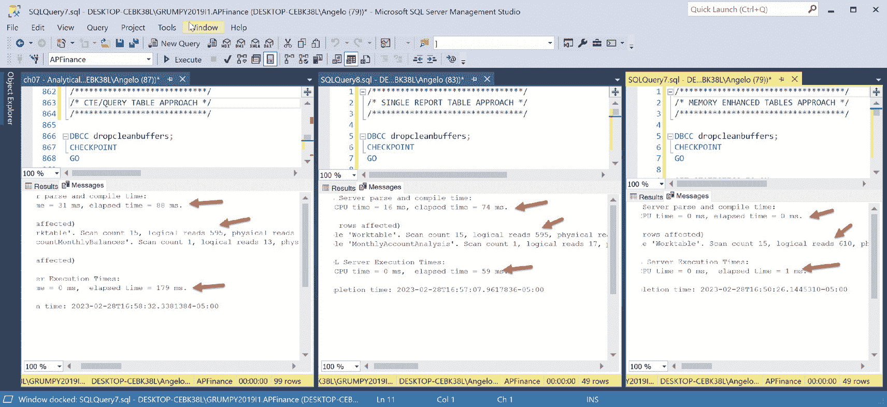

这是 SSMS 窗口的截图。文本展示了 3 组 IO 和 TIME 统计数据。对于 1、2 和 3，解析和编译时间的 CPU 和流逝时间分别为 31, 88 毫秒、16, 74 毫秒和 0, 0 毫秒。对于 1、2 和 3，执行时间的 CPU 和流逝时间分别为 0, 179 毫秒、0, 59 毫秒和 0, 1 毫秒。

**图 7-40**

比较 IO 和 TIME 统计数据

有点难看清，但让我们比较一些重要的统计数据。从左到右，我们分别看到 `CTE/QUERY` 方法、报表表方法以及最后的内存增强表方法的 `IO` 和 `TIME` 统计数据。

解析和编译时间从 88 毫秒到 74 毫秒再到 0 毫秒 – 巨大的改进。

工作表 `IO` 值在三种方法中都相同，只有内存增强表方法的 `IO` 值上升了，从 595 增加到 610。

最后，SQL Server 的执行时间从 179 毫秒到 59 毫秒再到 1 毫秒！

对我来说，这看起来是结论性的，但这些测试需要使用 `DBCC` 清除缓存并记录性能统计数据的情况下执行多次。

最后，让我们快速查看 `STATISTICS PROFILE` 统计结果。

请参考图 7-41。

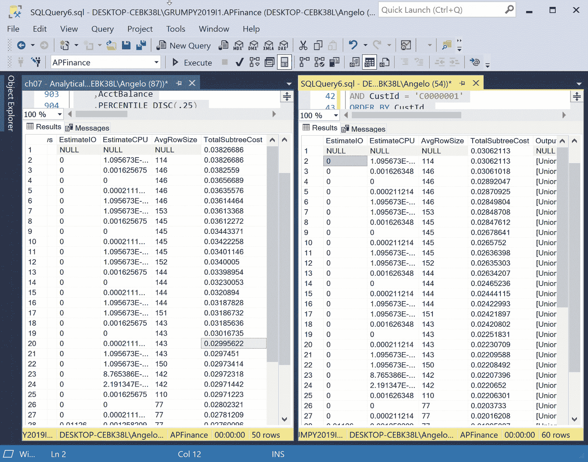

这是 SSMS 窗口的截图。它有 2 个表格，分别有 5 列和 6 列，以及 51 行和 61 行。列标题是估计 ID、估计 CPU、平均行大小、总子树和估计 ID、估计 CPU、平均行大小、总子树、输出。

**图 7-41**

比较两种方案的配置文件统计数据

看起来变化不大，只是 `CTE` 方法生成了 50 个步骤，而内存增强表方法生成了 60 个步骤。

**结论：** 就性能改进而言，内存增强表方法似乎有效，但实施和维护的复杂性增加，因为需要加载表，并且需要创建和加载新表。如前所述，如果有一个可以实施 `TEMPDB` 的固态硬盘，那么性能应该会显著提高。此外，也推荐使用非常快且容量大的内存。

总之，我们需要正确看待事物。这个分析是在个人笔记本电脑上通过运行查询和估计查询计划来执行的。当然，我们在提高性能方面能做的事情有限，但我认为我们已经看到了可用的策略以及应该查看哪些统计数据来判断哪个策略更有效。如前所述，当您在公司开发服务器上执行此工作时，您有更多的选择。我留给您一个问题：

创建和加载所有内存增强表以及创建视图值得吗？同样地，创建 `CTE`/查询和报表表方法也值得吗？我认为值得。您不仅可以了解一些可以考虑的策略，还可以了解查询计划中的操作符如何工作以及临时表如何被使用（和共享）来假脱机数据。

总结一下，这是我们讨论过的策略以及一个我们没有讨论的：

1.  `CTE`/查询方法
2.  预加载的报表表方法
3.  单个内存增强表方法
4.  多个内存增强表方法（在单独的磁盘上创建）
5.  **分区表（未讨论）**

最后一个，分区表，是一种创建跨多个快速磁盘分布的表的方法，按标准分布，例如每个磁盘存储一年的数据。这对于拥有 SAN（存储区域网络）磁盘和多 CPU 服务器的环境非常有效。

**注意**

在公司生产环境中，请确保执行与将哪些表放入内存相关的分析。这些应该是查询/报告/脚本目录中 80% 会用到的表，以便它们可以共享。内存有限且价格高昂，因此请执行分析和设计，以正确地将表放置在内存或物理存储（无论是磁盘还是 SAN）中。


