# 8. 电厂用例：聚合函数

## 概要

我们涵盖了大量内容。我们照例展示了分析函数的查询与结果，但我们讨论了分析性能的新技术和可能的解决方案。

我们重新审视了 `IO`、`TIME` 和 `STATISTIC PROFILE` 统计信息，并看到了它们背后的细节如何告诉我们很多关于查询处理方式以及查询的哪些部分与估算查询计划中的任务相关联的信息。

最后，我们看了一眼实时性能计划，以查看每个任务执行其逻辑所花费的时间，同时也检查了每个任务之间的行流。

我们探讨了用预加载表替换查询中的 `CTE` 块的常用策略，还实现了单个内存增强表，然后是多个内存增强表。

最后，我们谈到了诸如 SAN 磁盘阵列和内存等硬件也在提高性能方面发挥作用。我们还暗示了使用分区表将数据分散在多个驱动器上以提高性能，例如为特定数据集中每一年的数据专用一个驱动器。

一张图将让我们了解我们需要用窗口聚合函数监控的设备。请参考图 8-1。

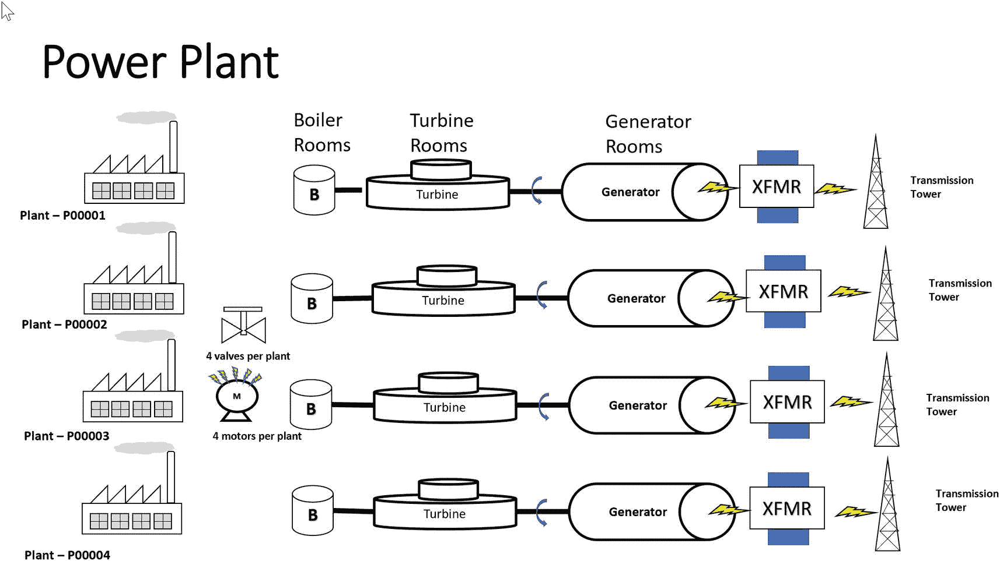

一张示意图，展示了一个由 4 个电厂 P00001、P00002、P00003 和 P00004 组成的发电厂。每个电厂都有锅炉房、涡轮机房、发电机房、X F M R（变压器）和输电电力。每个电厂有 4 个阀门和 4 个电机。

**图 8-1**

发电厂概念示意图

我们将在数据库中存储四个电厂的信息。基本上，使用诸如石油或煤炭之类的燃料来加热熔炉，进而将水煮沸直至变成蒸汽。蒸汽推动涡轮机旋转，涡轮机带动发电机旋转，发电机产生电力，最终输送到变压器以升高电压，从而可以分配到每个电厂所支持的区域。

每个电厂将有四个阀门、四个电机、一个锅炉、一个涡轮机和一个发电机，我们需要监控它们是否发生故障。故障统计数据将存储在一个作为雪花模式实现的小型数据仓库中。很简单，但它将给我们提供大量数据，可以通过聚合窗口函数进行分析。

我们将如何做到这一点？

在本章中，我们将采取略有不同的方法。我们几乎在所有的示例中都将消除 `CTE` 的使用。在创建本章代码时，我确实使用了 `CTE`，但这变得重复，因此我拿走了这些代码，并将其用于填充报表表的脚本中。此外，从前面的章节中我们了解到，在处理历史数据时，预加载报表表的方法能带来更高的性能。大多数示例将采用这种方法。

另外，我们将专注于报表输出和结果绘图，直到本章结束前都只进行最少的性能调优讨论。最后，我们将创建一个使用了大部分聚合函数的复杂查询，看看该示例的报表是什么样子。

我们将尝试几种方法，看看哪种效果更好。结论可能会让你感到惊讶！

## 聚合函数

以下是属于此类别的聚合函数列表。我们在前面的章节中已经见过它们，但为了防止你直接跳到本章而没有阅读其他章节，我在这里列出来：

*   `COUNT()` 和 `SUM()`
*   `MAX()` 和 `MIN()`
*   `AVG()`
*   `GROUPING()`
*   `STRING_AGG()`
*   `STDEV()` 和 `STDEVP()`
*   `VAR()` 和 `VARP()`

我们将一起介绍其中一些函数，因为它们天然相关，例如 `MIN()` 和 `MAX()` 函数、`STDEV()` 和 `STDEVP()`，以及 `VAR()` 和 `VARP()`。我们将在某些情况下，配合 `OVER()` 子句使用它们，也会在不使用该子句的情况下使用。

由于这是第一个处理名为 `APPlant` 的电厂数据库的章节，我们将看一下数据库的概念模型，以及描述实体、属性和关系的一些简单数据字典。

回想一下，概念数据模型是第一个与业务分析师合作创建的数据模型，目的是定义数据库的业务范围。概念模型由实体、属性和关系组成。随后，创建逻辑规范化模型，最后是物理数据库模型。这是针对事务型数据库而言的。对于数据仓库和数据集市，我们会从概念模型直接进入物理 `星型` 或 `雪花` 模式设计。

在我们的案例中，我们将从概念数据模型转向高度非规范化的 `雪花` 模式数据仓库模型。我们的数据库将包含三个事实表、几个维度表和两个报表表。事实表和维度表都包括代理键以建立 `星型` 关系，而两个报表表则没有。它们是基于 `星型` 表的非规范化表，用于生成报表。存在一些类别表和类型表，这些表会将模型从 `星型` 模式转变为 `雪花` 模式，例如 `Equipment` 维度表和 `EquipmentType` 维度表之间的关系。

最后，我们将在本章末尾看到设计中存在一个错误。缺少一个重要的关联表或连接表。我们会解决这个问题，敬请期待。


## 数据模型

以下是我们简单的概念模型，它将帮助您在开始创建窗口聚合查询时，基本理解所有表是如何关联在一起的。我将展示三个模型，每个对应一个主要的事实表。让我们从设备故障概念模型开始。

请参考图 8-2。

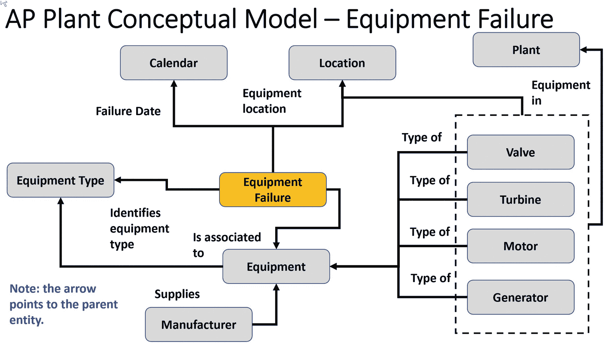

一个电厂设备故障概念模型的框图。设备故障与设备、制造商、设备类型和位置相关联。阀门、涡轮机、电机和发电机是电厂中的设备类型。

图 8-2

工厂概念数据模型 – 设备故障主题区域

在中心，我们看到 `Equipment Failure` 实体，它将构成 `Equipment Failure` 事实表的基础。顾名思义，该实体存储了每台设备的故障次数以及故障日期。

`Equipment` 实体由记录设备 ID、序列号、设备类型和制造商标识符（以代理键的形式）的属性组成。该实体链接到 `Manufacturer` 实体以及我们将要跟踪的四种设备实体之一。

阀门、涡轮机、电机和发电机是设备类型，因此我们看到这些实体与 `Equipment` 实体之间存在类型-子类型关系。

注意

当我们在物理数据库中实现时，它将把我们的模型从 `STAR` 模式修改为 `SNOWFLAKE` 模式。

在模型的右上角，我们看到 `Plant` 实体，其中包含诸如工厂名称和标识符等基本信息。

`Equipment Failure` 实体与 `Location` 实体有关联，因此我们知道故障设备的位置。`Valve`、`Turbine`、`Motor` 和 `Generator` 实体也与 `Location` 实体有关联。

倒数第二个是 `Calendar` 实体，它提供设备故障的日期。

最后，关于哪种模型更好，即 `STAR` 模型还是 `SNOWFLAKE` 模型，存在许多讨论和争论。对于较小的数据量，我倾向于选择 `SNOWFLAKE` 模型，因为它更具表现力，并允许您理解存储对象之间的关系。此外，当类别或类型代码需要更新时，特别是当您需要实现缓慢变化维度时，`SNOWFLAKE` 模型允许更轻松、更准确的更新。

结束语：如果实现得当，`STAR` 模式对于大数据量往往性能更好。`SNOWFLAKE` 模式更具表现力且更易于维护。请根据业务需求和实现选择最适合的模型。

让我们看一下将用于创建名为 `EquipmentStatusHistory` 事实表的第二个实体的数据模型。该事实表将存储历史数据，显示设备何时在线或离线以及每种状态的原因。

概念模型请参考图 8-3。

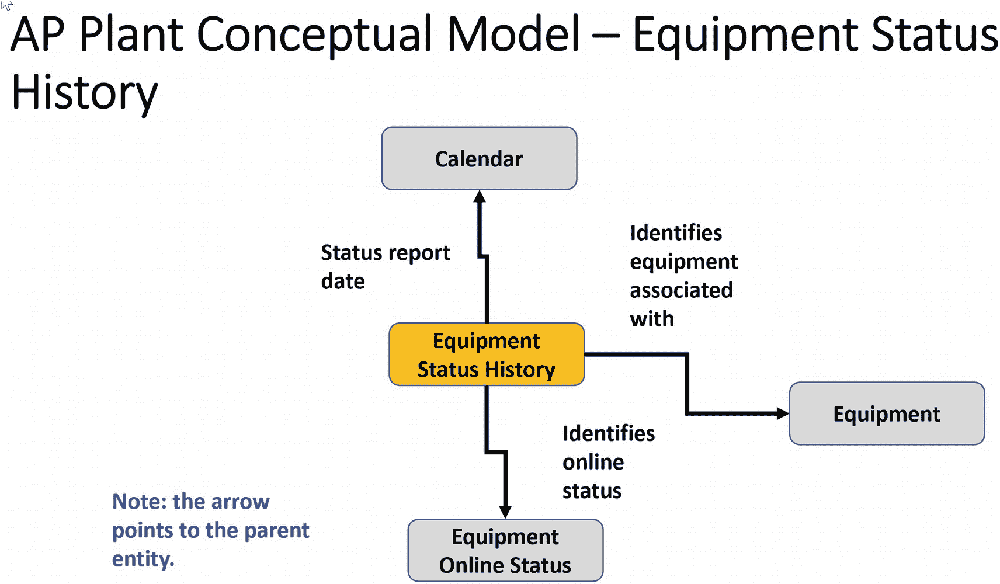

一个电厂设备状态历史概念模型的框图。设备状态历史块与日历、设备在线状态和设备块相关联。

图 8-3

工厂概念数据模型 – 设备状态历史主题区域

这是一个简单得多的模型。它只有一个事实实体和三个维度实体。与之前的模型一样，`Equipment` 实体用于标识正在跟踪其状态历史的设备。`Calendar` 实体提供状态分配的日期，最后一个实体 `Equipment Online Status` 具有标识设备状态的三个代码之一的属性，这些代码在表 8-1 中标识。

表 8-1

设备在线状态代码

| 在线状态代码 | 在线状态描述 |
| --- | --- |
| 0001 | 在线 – 正常运行 |
| 0002 | 离线 – 维护 |
| 0003 | 离线 – 故障 |

只有三个状态代码，但足够我们进行一些有趣的分析。

我们的最后一个模型是工厂费用主题区域。请参考图 8-4。

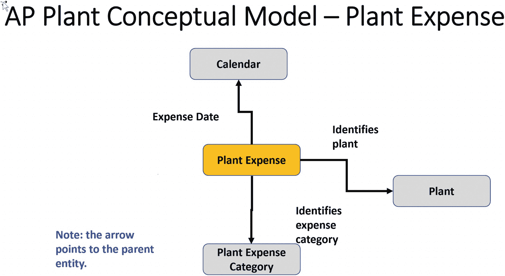

一个工厂费用概念模型的框图。工厂费用块与日历、工厂和工厂费用类别相关联。

图 8-4

工厂概念数据模型 – 工厂费用主题区域

另一个简单的主题区域模型，只有一个“事实”实体和三个“维度”实体。我用引号标出这些名称，因为这些术语实际上只适用于物理表，但就我们的目的而言，我们理解这些实体用于帮助我们理解将用于构建数据仓库的业务模型。稍后，在数据库实现时，它们将成为事实表或维度表。

回到主题区域模型。这里我们希望记录随时间推移的工厂费用，因此 `Plant Expense` 实体和 `Calendar` 实体之间当然存在关联以记录费用日期。工厂费用与工厂之间的关联是显而易见的。最后，`Plant Expense Category` 实体用于使用表 8-2 中显示的以下代码之一标识费用类型。

表 8-2

工厂费用代码

| 费用代码 | 费用描述 |
| --- | --- |
| 01 | 工资 |
| 02 | 维修 |
| 03 | 机械 |
| 04 | 建筑维护 |

创建了三个简单模型后，让我们创建一些简单的数据字典，提供实体、其属性以及实体之间关系（这些称为业务规则）的描述。

它们有点长，而且说实话，读起来很枯燥。只需看看它们，并在需要时用作参考。至少你知道在哪里可以找到它们。

## 数据字典


### 实体数据字典

我们的第一个数据字典用于描述每个业务实体的用途。这些是定义数据库用途的业务对象。

请参考表 8-3。

`表 8-3`

| 实体名称 | 描述 |
| --- | --- |
| 日历 | 用于日期报告的基础日历。 |
| 设备故障制造商 | 将故障设备与制造商关联。 |
| 设备 | 工厂中的设备，在我们的场景中可以是阀门、电机或涡轮机。 |
| 设备故障 | 包含历史设备故障率的事实表。 |
| 设备故障统计 | 包含生产键和故障历史记录的非规范化报告表。 |
| 设备状态历史 | 包含设备在线或离线状态历史的事实表。设备在线和离线的频率如何？ |
| 设备类型 | 标识设备的类型。 |
| 设备在线状态代码 | 标识设备操作的状态代码：0001 – 在线正常运行，0002 – 离线维护，0003 – 因故障离线。 |
| 发电机 | 存储发电机属性（如电压）的维度表。 |
| 位置 | 存储位置属性的维度表。 |
| 制造商 | 特定设备的制造商。 |
| 电机 | 存储电机属性（如电流和电压）的维度表。 |
| 发电厂 | 包含我们正在监控和测量的设备的发电厂。 |
| 发电厂预算 | 分配给发电厂的预算。 |
| 发电厂开支 | 发电厂产生的开支。 |
| 发电厂开支类别 | 标识开支类别：01 – 员工工资；02 – 设备及电厂维修；03 – 与机械相关的资本开支，如新电机；04 – 厂房建筑维护。 |
| 温度传感器日志 | 包含设备温度历史记录的报告表。同时标识未记录温度的小时。 |
| 涡轮机 | 存储涡轮机属性（如转速）的维度表。 |
| 阀门 | 存储阀门属性的维度表。 |

接下来是实体属性数据字典，这是一个很长的列表，但熟悉将用于创建表列的属性是值得的。您不需要逐行阅读此表；只需浏览即可。如果您在查询中使用的表的列的含义不清楚，可以回头参考它。将其视为一个参考表。我本可以把它放在附录中，但我认为放在这里更有用。省去了在章节和附录之间来回翻阅的麻烦。

### 实体属性数据字典

此数据字典还应包含一列，至少用于标识主键、外键和其他键（PK，主键；FK，外键；IE，反转条目键；AK，替代键），但为了节省篇幅，我省略了该列。我确实通过使用*斜体*和**加粗**字体突出显示了建议的代理键。这些是唯一的键，在实现数据库时可以用作主键。

这些基本信息应该足以指导您在查询中创建 `JOIN` 子句。

描述很简短，但应提供对将成为我们数据仓库表中的物理列的业务属性的基本理解。请参考表 8-4。

`表 8-4`

实体属性数据字典


#### 实体属性描述

| 实体 | 属性 | 描述 |
| --- | --- | --- |
| Calendar | CalendarDate | 一年中的具体日期。 |
| Calendar | CalendarDay | 日期的日部分（根据月份不同，范围为 1–28、1–29、1–30 或 1–31）。 |
| Calendar | `CalendarKey` | 唯一的代理键。 |
| Calendar | CalendarMonth | 日期的月部分（1–12）。 |
| Calendar | CalendarQuarter | 日期的季度部分（1–4）。 |
| Calendar | CalendarYear | 日期的年部分，例如 2016。 |
| EquipFailureManufacturer | CalendarDate | 故障日历日期。 |
| EquipFailureManufacturer | `Equipment` | 故障设备的名称。 |
| EquipFailureManufacturer | Location | 故障设备的位置。 |
| EquipFailureManufacturer | `Manufacturer` | 故障设备制造商的名称。 |
| EquipFailureManufacturer | NormalTemp | 设备的正常工作温度。 |
| EquipFailureManufacturer | OverUnderTemp | 设备的非正常工作温度。 |
| EquipFailureManufacturer | Plant | 工厂的名称。 |
| EquipFailureManufacturer | TempAlert | 告警发生的次数。 |
| Equipment | EquipAbbrev | 设备的缩写。 |
| Equipment | EquipmentId | 设备的标识符。 |
| Equipment | `EquipmentKey` | 设备的唯一代理键。 |
| Equipment | EquipmentTypeKey | 指向设备类型外围表的外部代理键。 |
| Equipment | ManufacturerKey | 指向设备制造商表的外部代理键。 |
| Equipment | SerialNo | 设备的序列号。 |
| EquipmentFailure | `CalendarKey` | 指向日历实体的外部代理键。 |
| EquipmentFailure | `EquipmentKey` | 指向设备实体的外部代理键。 |
| EquipmentFailure | `EquipmentTypeKey` | 指向设备类型实体的外部代理键。 |
| EquipmentFailure | Failure | 记录特定日期的故障次数。 |
| EquipmentFailure | `LocationKey` | 指向位置实体的外部代理键。 |
| EquipmentFailureStatistics | CalendarMonth | 故障日期的月份部分。 |
| EquipmentFailureStatistics | CalendarYear | 故障年份的年份部分。 |
| EquipmentFailureStatistics | EquipmentId | 设备的唯一标识号。 |
| EquipmentFailureStatistics | FailureEvents | 故障事件的次数。 |
| EquipmentFailureStatistics | LocationName | 发生故障的工厂内位置的名称。 |
| EquipmentFailureStatistics | MonthName | 故障日期所在月份的名称。 |
| EquipmentFailureStatistics | PlantName | 发生故障的工厂名称。 |
| EquipmentFailureStatistics | QuarterName | 日期的季度部分。 |
| EquipmentFailureStatistics | SumEquipmentFailure | 特定日期的总故障次数。 |
| EquipmentStatusHistory | `CalendarKey` | 指向日历实体的外部代理键。 |
| EquipmentStatusHistory | `EquipmentKey` | 指向设备实体的外部代理键。 |
| EquipmentStatusHistory | EquipOnlineStatus | 在线状态代码。 |
| EquipmentStatusHistory | `EquipOnlineStatusKey` | 指向设备在线状态实体的外部代理键。 |
| EquipmentType | EquipmentDescription | 设备的描述。 |
| EquipmentType | EquipmentType | 设备的类型，例如阀门、电机等。 |
| EquipmentType | `EquipmentTypeKey` | 设备类型实体的代理键。 |
| EquipOnlineStatusCode | EquipOnlineStatusCode | 设备的在线状态代码。 |
| EquipOnlineStatusCode | EquipOnlineStatusDesc | 与状态代码关联的在线状态描述。 |
| EquipOnlineStatusCode | `EquipOnlineStatusKey` | 指向设备实体的代理键。 |
| Generator | Amp | 发电机的电流值。 |
| Generator | EquipmentId | 发电机的唯一设备标识符。 |
| Generator | GeneratorId | 与通用设备 ID 关联的发电机的唯一标识符。 |
| Generator | `GeneratorKey` | 发电机实体的代理键。 |
| Generator | GeneratorName | 发电机的名称。 |
| Generator | Kva | 发电机的千伏安培额定值。 |
| Generator | LocationId | 发电机的位置标识符。 |
| Generator | PlantId | 发电机的工厂标识符。 |
| Generator | Temperature | 发电机的工作温度额定值。 |
| Generator | Voltage | 发电机的电压。 |
| Location | LocationId | 位置的标识符。 |
| Location | `LocationKey` | 位置实体的代理键。 |
| Location | LocationName | 位置的名称。 |
| Location | PlantId | 位置的工厂标识符。一个工厂有多个位置。 |
| Manufacturer | ManufacturerId | 设备制造商的唯一标识符。 |
| Manufacturer | `ManufacturerKey` | 制造商实体的代理键。 |
| Manufacturer | ManufacturerName | 制造商的名称。 |
| Motor | EquipmentId | 一件设备的唯一标识符。 |
| Motor | LocationId | 电机位置的唯一标识符。 |
| Motor | MotorId | 电机的唯一标识符。 |
| Motor | `MotorKey` | 电机实体的代理键。 |
| Motor | MotorName | 电机的名称。 |
| Motor | PlantId | 电机的工厂标识符。 |
| Motor | Rpm | 电机的每分钟转速额定值。 |
| Motor | Voltage | 电机的电压额定值。 |
| Plant | PlantDescription | 工厂的描述。 |
| Plant | PlantId | 工厂的唯一标识符。 |
| Plant | `PlantKey` | 工厂实体的代理键。 |
| Plant | PlantName | 工厂的名称。 |
| PlantBudget | Budget | 分配给工厂的预算。 |
| PlantBudget | CalendarYear | 日期的年份部分。 |
| PlantBudget | `PlantBudgetKey` | 工厂预算实体的代理键。 |
| PlantBudget | PlantId | 工厂的唯一标识符。 |
| PlantExpense | `CalendarDateKey` | 发生支出的日历日期。 |
| PlantExpense | ExpenseAmount | 支出的金额。 |
| PlantExpense | `PlantExpenseCategoryKey` | 指向工厂支出类别实体的外部代理键。 |
| PlantExpense | `PlantKey` | 指向工厂实体的外部代理键。 |
| PlantExpenseCategory | ExpenseCategoryCode | 支出的类别代码。 |
| PlantExpenseCategory | ExpenseCategoryDesc | 与支出类别代码关联的描述。 |
| PlantExpenseCategory | `PlantExpenseCategoryKey` | 工厂支出类别实体的代理键。 |
| TempSensorLog | `BoilerId` | 锅炉的唯一标识符。 |
| TempSensorLog | IslandGapGroup | 一系列测量值中岛屿或缺口的名称。 |
| TempSensorLog | ReadingHour | 读取发生的时间（小时）。 |
| TempSensorLog | SensorId | 传感器的唯一标识符。 |
| TempSensorLog | Temperature | 传感器记录的温度。 |
| Turbine | Amps | 涡轮机的电流额定值。 |
| Turbine | EquipmentId | 分配给设备的唯一标识符。 |
| Turbine | LocationId | 分配给位置的唯一标识符。 |
| Turbine | PlantId | 分配给工厂的唯一标识符。 |
| Turbine | Rpm | 涡轮机的每分钟转速额定值。 |
| Turbine | `TurbineId` | 分配给涡轮机的唯一标识符。 |
| Turbine | TurbineKey | 涡轮机的代理键。 |
| Turbine | TurbineName | 涡轮机的名称。 |
| Turbine | Voltage | 涡轮机的电压额定值。 |
| Valve | EquipmentId | 分配给设备的唯一标识符。 |
| Valve | LocationId | 分配给位置的唯一标识符。 |
| Valve | PlantId | 分配给工厂的唯一标识符。 |
| Valve | SteamPsi | 阀门的蒸汽压力（磅/平方英寸）额定值。 |
| Valve | SteamTemp | 通过传感器测量的流经阀门的蒸汽温度。 |
| Valve | ValveId | 阀门的唯一标识符。 |
| Valve | `ValveKey` | 用于阀门实体行的代理键。 |
| Valve | ValveName | 阀门的名称。 |


是的，这篇内容很长，但它提供的信息量足以让你理解每个属性的用途。

**注意**

有两点需要说明。一是**外翻表**（可参考 Kimball 的《`The Data Warehouse Toolkit: The Definitive Guide to Dimensional Modeling`》），它是指与维度表相关联的表，例如，如果你有一个产品表，那么产品子类和产品类就可以被视为外翻表，或者说是 `SNOWFLAKE` 模式中的雪花表。其次，从技术上讲，由于这些是业务型数据字典，你看不到任何代理键的提及，但我做了一些变通。主要是通过查询系统表来生成列清单，以便我能将它们放入文档表中。

还有一点：将会有一些报表表，它们是**非规范化**的，并且没有代理键。它们用于暂存数据，以提高我们聚合窗口查询的性能。它们是：

*   `Reports.EquipFailureManufacturer`
*   `Reports.EquipmentDailyStatusHistoryByHour`
*   `Reports.EquipmentFailureStatistics`
*   `Reports.EquipmentFailureStatisticsMem`
*   `Reports.EquipmentRollingMonthlyHourTotals`
*   `Reports.EquipmentStatusHistoryByHour`
*   `Reports.TempSensorLog`

请注意这些表。如你所见，它们将被分配到 `Reports` 模式下。

最后，接下来是三个数据字典，用于描述三个主题域中每个事实表与维度表之间的关系。让我们从设备故障事实表模型开始。

## 实体关系数据字典：设备故障主题域

表 8-5 展示了将设备故障主题域中的事实与维度关联起来的业务规则。

表 8-5

实体关系数据字典 – 设备故障

| `父实体` | 关系 | `子实体` |
| --- | --- | --- |
| `日历` | 标识故障日期于 | `设备故障` |
| `位置` | 标识设备位置于 | `设备故障` |
| `设备` | 与...关联 | `设备故障` |
| `设备类型` | 标识设备类型于 | `设备故障` |
| `阀门` | 可以是/是一种 | `设备` |
| `涡轮机` | 可以是/是一种 | `设备` |
| `电机` | 可以是/是一种 | `设备` |
| `发电机` | 可以是/是一种 | `设备` |
| `工厂` | 是...的位置 | `阀门` |
| `工厂` | 是...的位置 | `涡轮机` |
| `工厂` | 是...的位置 | `电机` |
| `工厂` | 是...的位置 | `发电机` |
| `位置` | 标识...的位置 | `阀门` |
| `位置` | 标识...的位置 | `涡轮机` |
| `位置` | 标识...的位置 | `电机` |
| `位置` | 标识...的位置 | `发电机` |
| `制造商` | 是...的供应商 | `设备` |
| `设备类型` | 标识...的类型 | `设备` |

这些将实体对象链接起来的规则，通常是在数据建模师或数据架构建模师与各业务利益相关者之间的会议中推导出来的。它们是推导在创建数据库时分配到物理表中的主键和外键的关键。

通常会有两个动词短语形式的规则：一个是从父实体到子实体的动词短语，另一个是从子实体到父实体的动词短语，例如：

*   一个阀门位于一个工厂中。
*   一个工厂是一个阀门的位置。

这对于主/细结构也是如此，例如：

*   一台设备可以是一个发电机。
*   一个发电机是一台设备的实例。

我没有深入进行数据字典的严格实现，而是旨在为你提供足够的业务对象间业务规则的描述，以理解链接它们的关系。

## 实体关系数据字典：设备状态历史

接下来，我们检查将设备状态历史主题域中的事实与维度关联起来的业务规则。

请参阅表 8-6。

表 8-6

实体关系数据字典 – 设备状态历史

| `父实体` | 关系 | `子实体` |
| --- | --- | --- |
| `日历` | 标识状态历史的状态日期于 | `设备状态历史` |
| `设备` | 标识状态历史中的设备于 | `设备状态历史` |
| `设备在线状态` | 标识设备在线状态代码（在线、维护或离线）于 | `设备状态历史` |

这些简单的关系提供了连接两个业务对象的业务规则的简要解释。理解这些是关键，因为在查询中创建 `JOIN` 子句时将会用到它们。这些规则当然存在于概念模型中，但也适用于我们的物理数据仓库，并将用于实现物理主代理键和外键。

**注意**

我没有提及实体之间的**基数**，例如，零、一或多行到零、一或多行。例如，设备在线状态代码在 `设备状态历史` 实体中出现零、一或多行。这样做是为了节省一些空间。你可以通过编写一些表之间的查询来推断出基数。

## 实体关系数据字典：工厂费用

接下来，让我们检查 `工厂费用` 事实表与工厂费用主题域中维度表之间的关系。

请参阅表 8-7。

表 8-7

实体关系数据字典 – 工厂费用

| `父实体` | 关系 | `子实体` |
| --- | --- | --- |
| `日历` | 标识费用日期于 | `工厂费用` |
| `工厂` | 费用标识于 | `工厂费用` |
| `工厂费用类别` | 标识工厂的费用类别于 | `工厂费用` |

概念数据模型和数据字典中包含的信息非常重要，因为它不仅能帮助你理解数据库表中有什么，还能帮助你理解列的含义，特别是在编写脚本和查询时，尤其是需要连接表的时候。

**注意**

更详尽的实体/关系模型会列出每个实体的属性。同样，这会占用大量篇幅，所以我没有包含它们。你应该尝试使用像 PowerPoint 这样的工具来创建这些模型，因为这是另一项宝贵的技能和工具。

还应该包含第四个数据字典，用于显示每个实体中的主键和外键，但你可以从物理数据库表中识别它们。它们是用于实现关系的代理键，例如，`EquipmentId` 将连接任何事实表到 `设备` 维度。你可以通过查看表列来识别这些键。

最后，这些是最简单的、使用 `SNOWFLAKE` 模式方法的数据仓库设计模型。目的是为你提供足够多的表用于查询，不仅是书中的那些，也包括你自己练习时。学习如何设计星型和雪花型模式将需要一整本书的篇幅。


## COUNT( ) 函数

让我们从 `COUNT()` 聚合函数开始。我们将首先检查原本会用在查询的 `CTE`（公共表表达式）部分的 `TSQL` 查询。我们将使用它来向一个报表表插入行，以替代 `CTE`，从而模拟一个每天或每周加载一次的报表表，因为我们关注的是分析历史数据的查询。

我们将使用的查询被称为 `STAR`（星型）查询，因为它将多个维度表连接到一个事实表。我们假设可以使用它来加载将用于多个查询的报表表。

这是概念模型有用的另一个原因；它们向我们展示了如何为查询编写 `JOIN` 子句。

**小测验**

历史上，包含事实表并链接维度表的查询被称为 `STAR` 查询。那么，一个引用了维度和支杆维度（outrigger dimensions）的查询是 `SNOWFLAKE`（雪花）查询吗？

请参阅代码清单 8-1a。

```sql
SELECT
C.CalendarYear
,C.QuarterName
,C.MonthName
,C.CalendarMonth
,P.PlantName
,L.LocationName
,E.EquipmentId
,COUNT(Failure) AS FailureEvents
,SUM(Failure) AS SumEquipmentFailure
FROM DimTable.CalendarView C
JOIN FactTable.EquipmentFailure EF
ON C.CalendarKey = EF.CalendarKey
JOIN DimTable.Equipment E
ON EF.EquipmentKey = E.EquipmentKey
JOIN DimTable.Location L
ON L.LocationKey = EF.LocationKey
JOIN DimTable.Plant P
ON L.PlantId = P.PlantId
GROUP BY
C.CalendarYear
,C.QuarterName
,C.MonthName
,C.CalendarMonth
,P.PlantName
,L.LocationName
,E.EquipmentId
ORDER BY
C.CalendarYear
,C.QuarterName
,C.CalendarMonth
,P.PlantName
,L.LocationName
GO
```
代码清单 8-1a
重新利用的 CTE 组件

此查询用于创建一个 `INSERT` 命令，以填充一个名为 `Reports.EquipmentFailureStatistics` 的表。

我将它放在 `Reports` 模式中，因为它并不是真正的事实表，而是一个报表暂存表。

`SELECT` 子句包含两个聚合函数：用于预先计算故障事件数量的 `COUNT()` 函数，以及用于累加故障次数的 `SUM()` 函数。这些是基本的聚合函数用法；没有使用 `OVER()` 子句。

使用 `GROUP BY` 子句按年、月、工厂名称、位置名称和设备 ID 对数据进行分组。

最后，请注意 `JOIN` 子句；这里有四个，因此 `FROM` 子句中使用了五个维度表。唯一的事实表是 `EquipmentFailure` 表，它只有 5,906 行，所以需要处理的行数并不多。

让我们在图 8-5 中查看结果。

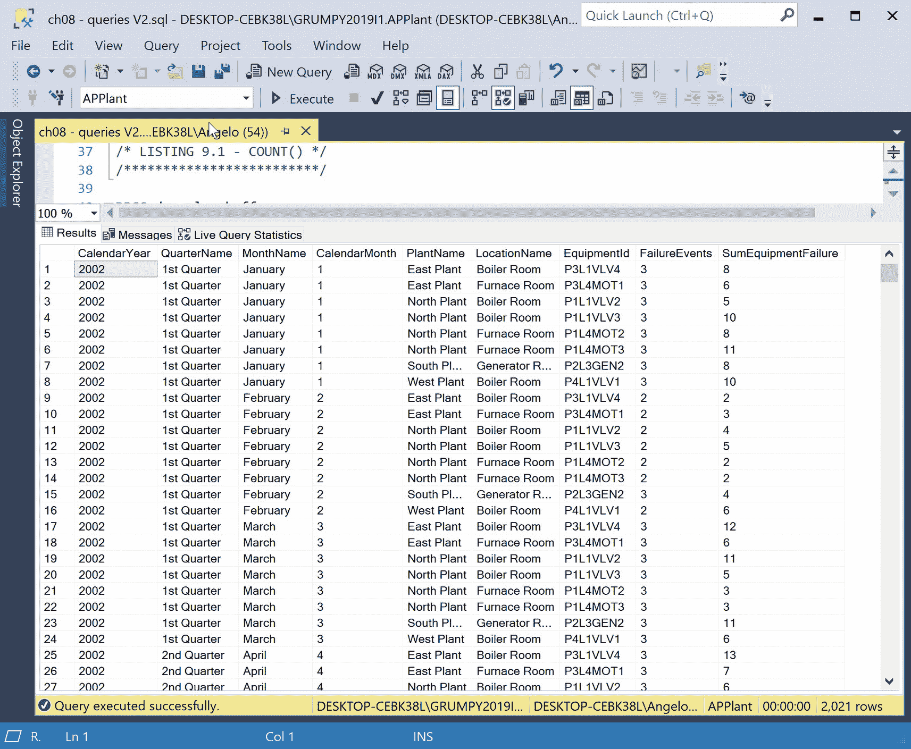

ch08 查询 V 2 .sql 窗口的截图。顶部屏幕显示了一些程序代码。底部屏幕有一个包含实时查询统计信息的表格。该表有 9 列。最后 2 列显示了故障事件和设备故障总和。

图 8-5

加载设备故障统计报表表

生成的行数不多，只有 2,021 行。不过，这确实生成了一个有趣的实时执行计划。幸运的是，在真实的生产环境中，它会在非高峰时段每天加载一次，以免影响业务用户针对数据运行报表。让我们以通常的方式创建一个估计查询计划。

基线估计查询计划请参考图 8-6。

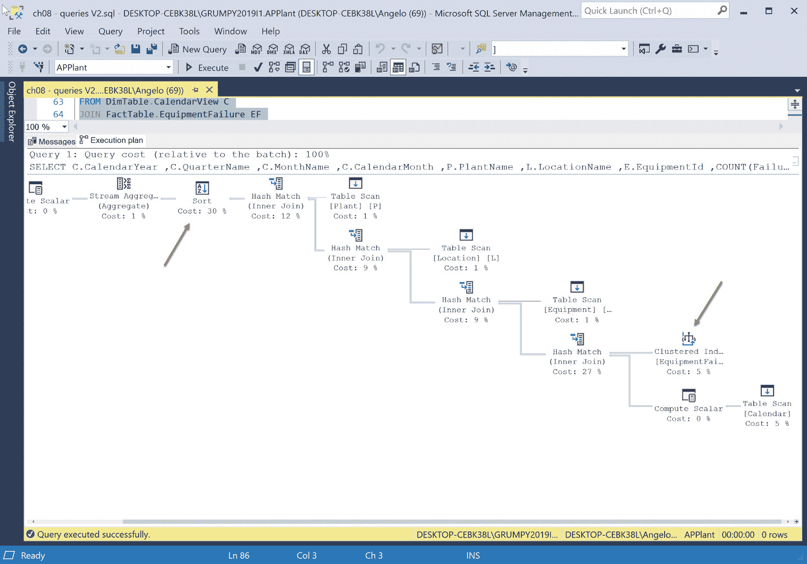

ch08 查询 V 2 .sql 窗口的截图。顶部屏幕显示了一些程序代码。底部屏幕显示了查询 1 的消息和执行计划。排序（Sort）成本为 30%，聚集索引（clustered index）成本为 5%。

图 8-6

`STAR` 查询的实时查询计划

有很多表扫描，但由于涉及的表行数较少，我们无需担心。我们确实看到了聚集索引扫描，这是预料之中的，因为我们希望将所有行加载到报表表中。

在每个需要合并数据流的阶段都使用了哈希匹配连接（Hash match joins），最后显示了一个成本为 30% 的排序（sort）。此排序是由查询中最终的 `ORDER BY` 子句引起的。需要包含此子句，因为它需要正确排序日期部分（年、季、月等）。我尝试了不带此子句的查询，结果二月的日期出现在了一月之前，所以不妨此时承受这个性能开销。这使生成的报表更易于理解。

我们将在 `INSERT` 语句中使用此查询来加载我们的报表表。请参阅代码清单 8-1b。

```sql
INSERT INTO Reports.EquipmentFailureStatistics
SELECT
C.CalendarYear
,C.QuarterName
,C.MonthName
,C.CalendarMonth
,P.PlantName
,L.LocationName
,E.EquipmentId
,CONVERT(INTEGER,COUNT(Failure)) AS CountFailureEvents
,CONVERT(INTEGER,SUM(Failure)) AS SumEquipmentFailure
FROM DimTable.CalendarView C
JOIN FactTable.EquipmentFailure EF
ON C.CalendarKey = EF.CalendarKey
JOIN DimTable.Equipment E
ON EF.EquipmentKey = E.EquipmentKey
JOIN DimTable.Location L
ON L.LocationKey = EF.LocationKey
JOIN DimTable.Plant P
ON L.PlantId = P.PlantId
GROUP BY
C.CalendarYear
,C.QuarterName
,C.MonthName
,C.CalendarMonth
,P.PlantName
,L.LocationName
,E.EquipmentId
ORDER BY
C.CalendarYear
,C.QuarterName
,C.CalendarMonth
,P.PlantName
,L.LocationName
GO
```
代码清单 8-1b
插入报表表

此查询生成了 2,021 行。

让我们针对此报表表运行我们的第一个聚合函数查询。我们的分析师提交了以下需求：

我们需要一些关于东区工厂，特别是锅炉房的信息。报告应按月列出该工厂位置故障事件的总次数。每个事件可能涉及特定设备的一个或多个故障。例如，如果在 2002 年 1 月 5 日和 2002 年 1 月 7 日分别发生了一次故障事件，则计为两个事件。

如果在 2002 年 1 月 5 日，某个特定阀门发生了三次故障，则故障总和为 3；这计为一个事件。如果在 2002 年 1 月 7 日，同一阀门又发生了四次故障，那么该阀门在该日期的故障总和为 7（3 + 4）。这计为另一个事件。因此，我们现在报告了两个事件，总故障次数为七次。

我们还需要报告随着时间推移，事件次数和故障总和的滚动月度总计。报告需要按年、季、月、工厂和位置进行分组。

再次请注意事件次数与故障总和之间的区别。正如我所说，一个事件可以在任何特定日期，涉及与其关联的设备发生一次、两次或更多次故障。

最后，在任何日期都可能有多台设备发生故障，因此我们也包括这些计数（作为月度计数和滚动月度计数）。

我们在报告中不按设备 ID 进行区分。

让我们看看满足此报告的代码。

请参阅代码清单 8-2。

```sql
SELECT
PlantName
,LocationName
,CalendarYear
,QuarterName
,MonthName
,CountFailureEvents
,SUM(CountFailureEvents) OVER (
PARTITION BY PlantName,LocationName,CalendarYear,QuarterName
ORDER BY CalendarMonth
) AS SumCountFailureEvents
,SumEquipmentFailure
,SUM(SumEquipmentFailure) OVER (
PARTITION BY PlantName,LocationName,CalendarYear,QuarterName
ORDER BY CalendarMonth
) AS SumEquipFailureFailureEvents
,COUNT(CountFailureEvents) AS CountFailureEvents
,COUNT(SumEquipmentFailure) OVER (
PARTITION BY PlantName,LocationName,CalendarYear,QuarterName
ORDER BY CalendarMonth
) AS CountEquipFailureFailureEvents
FROM Reports.EquipmentFailureStatistics
WHERE PlantName = 'East Plant'
AND LocationName = 'Boiler Room'
GROUP BY
PlantName
,LocationName
,CalendarYear
,QuarterName
,MonthName
,CalendarMonth
,CountFailureEvents
,SumEquipmentFailure
GO
```
代码清单 8-2
报表查询，按季度滚动的故障统计


## 聚合函数与滚动统计

`SUM()` 聚合函数和 `COUNT()` 函数在查询中出现了两次。所有四种情况都使用了带有 `PARTITION BY` 子句和 `ORDER BY` 子句的 `OVER()` 子句。分区由工厂名称、地点、年份和季度创建。分区按日历月份排序。包含 `CountFailureEvents` 和 `SumEquipmentFailure` 列是为了展示滚动总计和滚动和是如何得出的。让我们看看结果。

请参阅图 8-7。

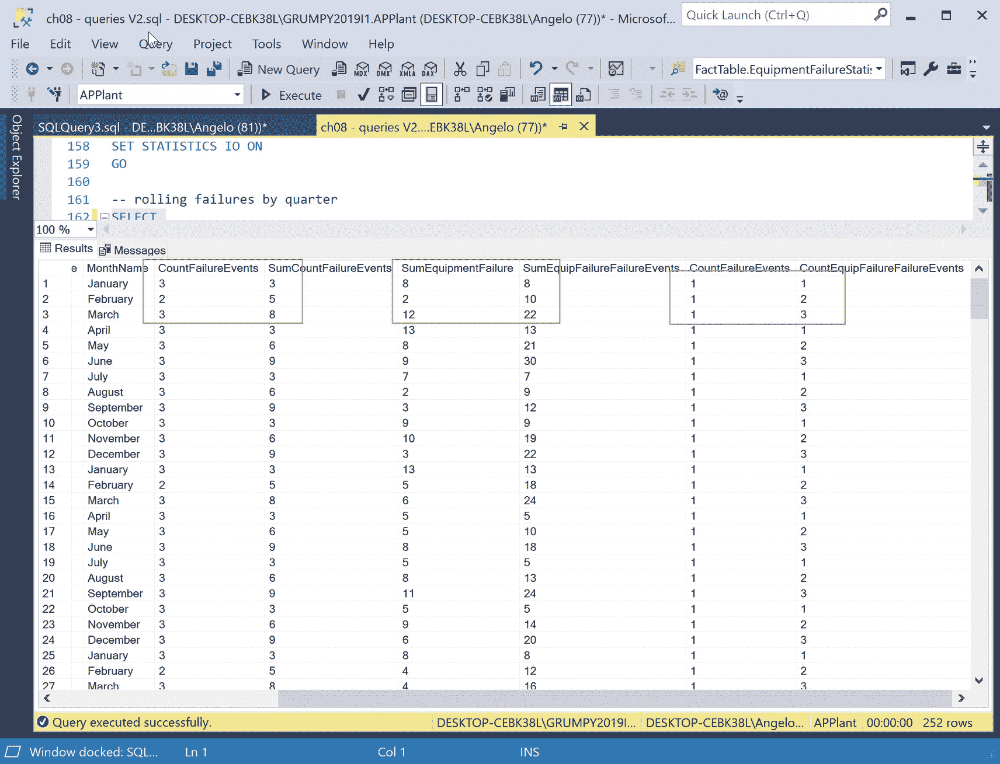

图 8-7：报告查询结果

检查框中的结果清楚地显示了滚动值相加正确。`COUNT()` 函数的结果在每个季度内重复。这个查询有点令人困惑，因为我们试图区分事件计数和故障总和，所以我选择让名称更具描述性。

在这种情况下，通过查看原始的计数和总和来验证结果是很好的做法。清单 8-3 是一个可以实现此目的的查询。

```sql
SELECT
C.CalendarYear
,C.QuarterName
,C.MonthName
,C.CalendarMonth
,C.CalendarDate
,P.PlantName
,L.LocationName
,E.EquipmentId
,Failure AS FailureEvent
,COUNT(Failure) AS SumEquipmentFailure
FROM DimTable.CalendarView C
JOIN FactTable.EquipmentFailure EF
ON C.CalendarKey = EF.CalendarKey
JOIN DimTable.Equipment E
ON EF.EquipmentKey = E.EquipmentKey
JOIN DimTable.Location L
ON L.LocationKey = EF.LocationKey
JOIN DimTable.Plant P
ON L.PlantId = P.PlantId
WHERE PlantName = 'East Plant'
AND LocationName = 'Boiler Room'
GROUP BY
C.CalendarYear
,C.QuarterName
,C.MonthName
,C.CalendarMonth
,C.CalendarDate
,P.PlantName
,L.LocationName
,E.EquipmentId
,Failure
ORDER BY
C.CalendarYear
,C.QuarterName
,C.CalendarMonth
,C.CalendarDate
,P.PlantName
,L.LocationName
GO
```

清单 8-3：验证计数和总和

我修改了用于向 `Reports.EquipmentFailureStatistics` 表插入行的查询，并添加了日历日期和设备，以使其达到最低粒度。图 8-8 是两个查询结果并排的部分比较，显示了计数和总和是如何累加的。

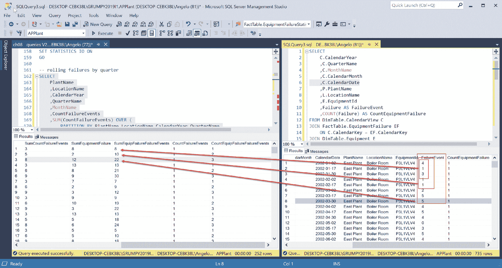

图 8-8：计数和故障总和的验证报告

如图所示，一月份的故障总数为 8 (4 + 1 + 3)，这与原始报告中 `SumEquipmentFailure` 报告列下的值一致。如果你执行加法运算，二月和三月的情况也是如此。

事件数量对应于日期，每天一个事件，因为我们没有将粒度降低到一天中的小时。因此，计数每天始终为一，而按季度的总和将是天数的总和。

希望这个例子展示了计数和求和值与事件之间的语义差异。

### AVG( ) 函数

接下来，我们使用 `AVG()` 函数，为东厂的熔炉房设备生成一些平均值。以下是分析师提交的业务需求：

需要一份报告，显示按月、按季和按年的滚动平均值。报告应显示东厂熔炉房的结果。结果应按工厂、地点、年份、季度和月份分组。平均值应为月度设备故障率。

在此报告中，我们不关心单个设备的故障率。最后，报告应参考 2002 和 2003 年（我们的最低粒度级别是按月）。

看来我们需要使用 `AVG()` 函数三次，并为每个函数定义不同的分区。清单 8-4 是满足此请求的查询。

```sql
SELECT PlantName
,LocationName
,CalendarYear
,QuarterName
,MonthName
,CalendarMonth
,SumEquipmentFailure
,AVG(CONVERT(DECIMAL(10,2),[SumEquipmentFailure])) OVER (
PARTITION BY CalendarYear
ORDER BY CalendarYear,CalendarMonth
) AS RollingAvgMon
,AVG(CONVERT(DECIMAL(10,2),[SumEquipmentFailure])) OVER (
PARTITION BY CalendarYear,QuarterName
ORDER BY CalendarYear
) AS RollingAvgQtr
,AVG(CONVERT(DECIMAL(10,2),[SumEquipmentFailure])) OVER (
PARTITION BY CalendarYear
ORDER BY CalendarYear
) AS RollingAvgYear
FROM Reports.EquipmentFailureStatistics
WHERE CalendarYear IN(2002,2003)
AND Plantname = 'East Plant'
AND LocationName = 'Furnace Room'
GO
```

清单 8-4：按滚动月、季、年统计的工厂故障

是的，三个 `OVER()` 子句中的每一个都有三个不同的 `PARTITION` 和 `ORDER BY` 子句。

对于滚动月度故障，分区定义为日历年，并按年份和月份排序。

对于滚动季度故障，分区定义为日历年和季度，并按年份和季度排序。

最后，对于滚动年度故障，分区定义为日历年，并按日历年排序（注意不需要月份列）。这与第一个分区定义给出了完全不同的结果。

尝试组合不同的条件看看结果。确保将结果复制并粘贴到 Excel 电子表格中进行验证。结果是否符合你的预期？

请参阅图 8-9 中的部分结果。

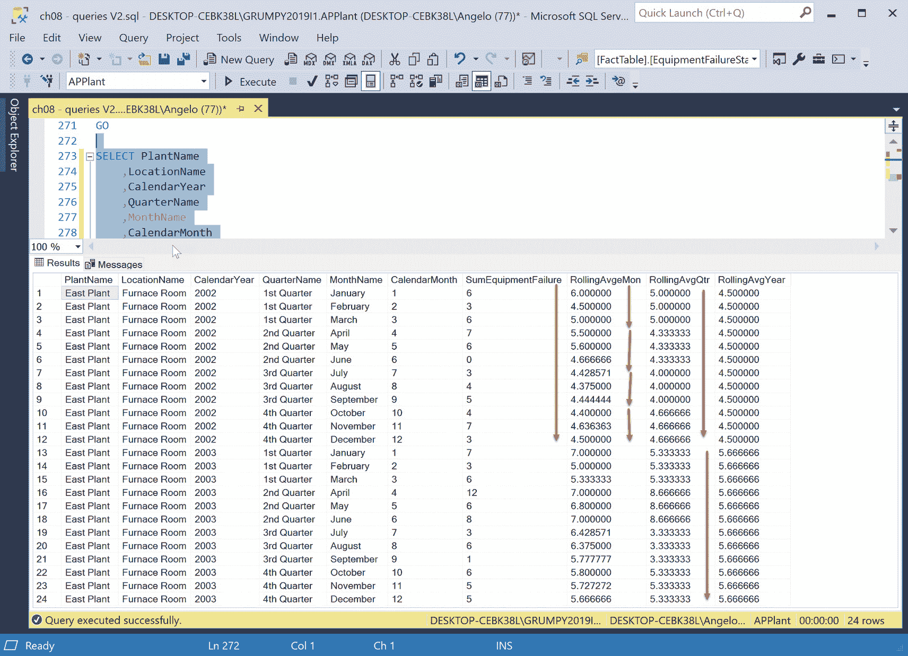

图 8-9：按月、季、年统计的滚动设备故障

图 8-10 是使用 Microsoft Excel 创建的图表，显示了三个滚动平均值和故障率。趋势似乎是下降的；故障越少越好！

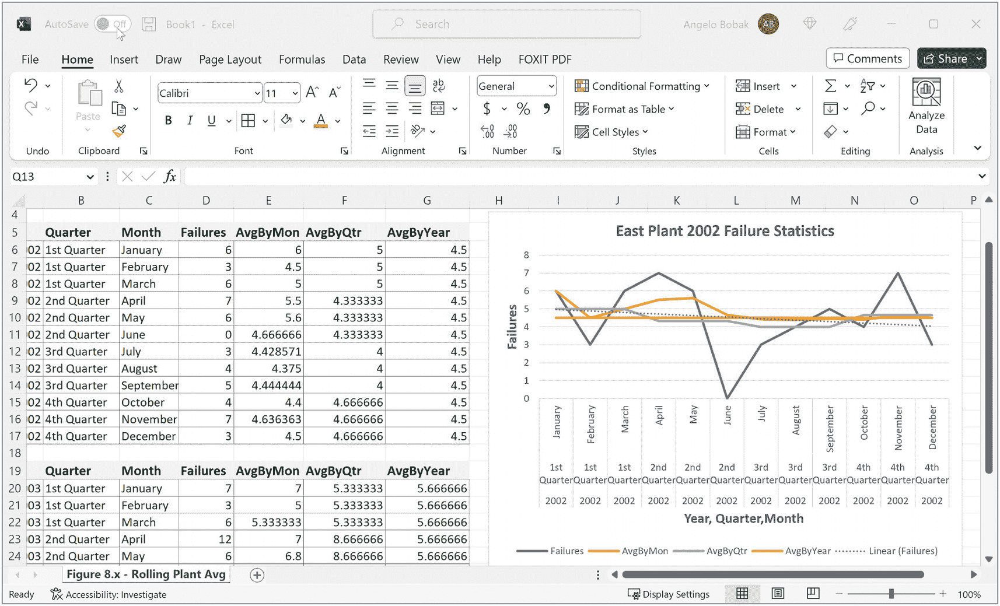

图 8-10：月度、季度和年度滚动平均值

可视化是让你对结果有一个整体概览的良好起点。查询生成的数值数据是详细的信息来源，你可以用它来进行更深入的分析。

让我们继续分析，通过查看月度层面的最小和最大故障来构建故障事件画像，从而建立我们的故障报告。顺便说一句，这些数据可以用于一系列的 SSRS（SQL Server Reporting Services）Web 报告或 Power BI 仪表板中。这些都是值得考虑学习的工具！


#### MIN() 和 MAX() 函数

## 为什么我们需要建立故障概况？

显然，我们想知道哪些设备发生了故障、故障发生在何处以及发生的频率。我们需要确定设备故障是由于维护不当或环境条件造成的，还是设备本身存在缺陷，或者是在特定区域或应用中安装了错误的设备。或者可能兼而有之！

例如，该设备额定是否能在特定工厂地点的温度下运行？

我们还想知道某台设备（如电机或阀门）是否发生了故障，是否进行了维修，几周或几个月后是否再次发生故障。我们需要了解原因。工厂的维护程序和员工也起着作用。设备是否在一天内多次故障？是否尝试了多次修复？

我们希望获得最好的设备；我们力求正确的设备安装以及尽可能少的故障。我们还希望有一个可靠的管理计划，配备知识丰富的技术人员，能够快速解决问题。我们希望回答以下问题：

*   故障发生的频率如何？
*   尝试修复问题的次数有多少？
*   问题是反复出现的吗？
*   是否是单一供应商提供了有故障的设备？
*   故障的根本原因是什么？

这就是为什么一套好的报告和图表（能为我们提供故障统计和事件概况）将帮助我们实现这些目标，并解答与设备故障相关的问题。目的是识别然后减少甚至完全防止设备故障。

我们的下一个报告将处理特定时间段内设备的最大和最小故障。以下是我们的分析师为此概况报告提供的业务需求：

请提供一份报告，显示东厂锅炉房发生的滚动月度最小和最大故障率。让我们为此地点保留报告，因为我们希望首先查看高级别数值，然后深入研究到设备级别。

有关最大和最小故障统计信息，请参阅清单 8-5。

```sql
SELECT PlantName
,LocationName
,CalendarYear
,QuarterName
,MonthName
,SumEquipmentFailure
,MIN(SumEquipmentFailure) OVER (
PARTITION BY PlantName,LocationName,CalendarYear,QuarterName
ORDER BY CalendarMonth
) AS RollingMin
,MAX(SumEquipmentFailure) OVER (
PARTITION BY PlantName,LocationName,CalendarYear,QuarterName
ORDER BY CalendarMonth
) AS RollingMax
FROM Reports.EquipmentFailureStatistics
WHERE CalendarYear IN(2002,2003)
AND Plantname = 'East Plant'
AND LocationName = 'Boiler Room'
GO
```
清单 8-5：滚动月度工厂最大和最小故障

这是一个简单的查询，对 `MIN()` 和 `MAX()` 函数使用了相同的 `OVER()` 子句。分区按工厂名称、地点名称、年份和季度设置。`ORDER BY` 子句按年份和月份排序。`WHERE` 子句筛选包括 2002 年和 2003 年，当然还有东厂的锅炉房。让我们在图 8-11 中查看结果。

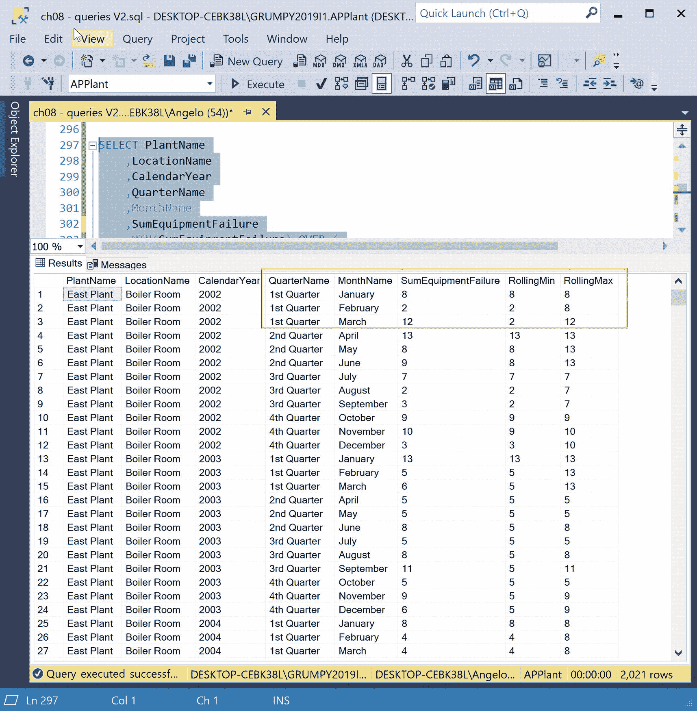
图 8-11：东厂滚动月度设备故障

我们可以看到滚动月度计算正在生效，但我们也看到该地点有很多故障。是一台设备还是多台设备？

让我们运行清单 8-6 中的查询来缩小范围。

```sql
SELECT EF.PlantName
,EF.LocationName
,EF.CalendarYear
,EF.QuarterName
,EF.MonthName
,EF.SumEquipmentFailure
,EF.EquipmentId
,E.EquipAbbrev
,MIN(EF.SumEquipmentFailure) OVER (
PARTITION BY EF.PlantName,EF.LocationName,
EF.CalendarYear,EF.QuarterName
ORDER BY EF.CalendarMonth
) AS RollingMin
,MAX(EF.SumEquipmentFailure) OVER (
PARTITION BY EF.PlantName,EF.LocationName,
EF.CalendarYear,EF.QuarterName
ORDER BY EF.CalendarMonth
) AS RollingMax
FROM Reports.EquipmentFailureStatistics EF
JOIN [DimTable].[Equipment] E
ON EF.EquipmentId = E.EquipmentId
WHERE EF.CalendarYear IN(2002,2003)
AND EF.Plantname = 'East Plant'
AND EF.LocationName = 'Furnace Room'
GO
```
清单 8-6：东厂锅炉房的设备故障

`MIN()` 和 `MAX()` 函数与定义分区的 `OVER()` 子句一起使用，分区按工厂名称、地点名称、日历年份和季度划分。分区按日历月份排序。

使用 `WHERE` 子句仅包含两年、东厂和锅炉房的数据。

查询结果请参阅图 8-12。

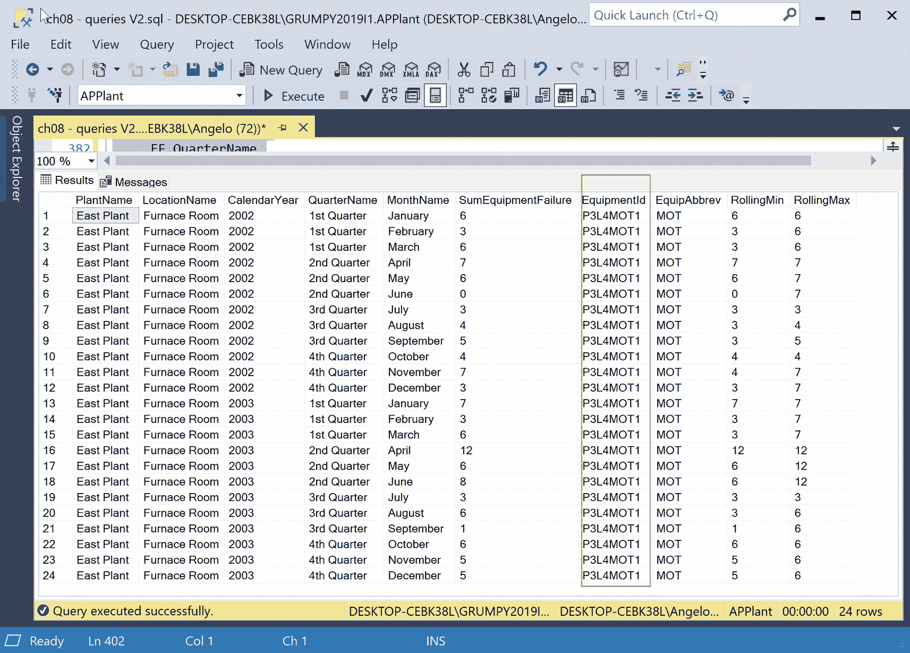
图 8-12：设备故障列表

看起来设备 `P3L4MOT1` 是故障设备。这是一个电机，是个大问题。从名字可以看出，它位于 3 号工厂 4 号地点，电机名称是 `MOT1`。这些是每月不可接受的故障次数。我们需要查看这些故障发生在哪些天。

让我们创建另一个查询，这次是设备和日期级别的粒度。请参阅清单 8-7。

```sql
SELECT
C.CalendarYear
,C.QuarterName
,C.CalendarDate
,C.MonthName
,C.CalendarMonth
,P.PlantName
,L.LocationName
,E.EquipmentId
,E.EquipAbbrev
,M.ManufacturerName
,Failure AS FailureEvent
FROM DimTable.CalendarView C
JOIN FactTable.EquipmentFailure EF
ON C.CalendarKey = EF.CalendarKey
JOIN DimTable.Equipment E
ON EF.EquipmentKey = E.EquipmentKey
JOIN [DimTable].[Manufacturer] M
ON E.ManufacturerKey = M.ManufacturerKey
JOIN DimTable.Location L
ON L.LocationKey = EF.LocationKey
JOIN DimTable.Plant P
ON L.PlantId = P.PlantId
WHERE P.PlantName = 'East Plant'
AND L.LocationName = 'Furnace Room'
AND C.CalendarYear = '2002'
AND C.MonthName = 'April'
ORDER BY
C.CalendarYear
,C.QuarterName
,C.CalendarMonth
,C.CalendarDate
,P.PlantName
,L.LocationName
GO
```
清单 8-7：按日期列出的设备故障

此查询是从我们用于加载故障报告表的原始查询修改而来的。添加了日期和设备 ID 字段，以达到最低的粒度级别。如果我们记录每 24 小时时段中的小时数，可能会让事情变得更有趣。

在真实应用中，分析师会检查此级别的所有月份，但让我们将调查限制在 2002 年 4 月，以便确保我们的逻辑有效。

执行此查询产生图 8-13 中的报告。

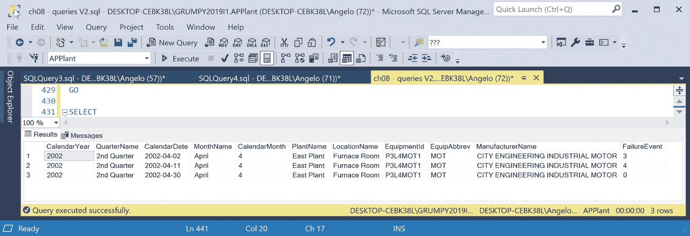
图 8-13：`P3L4MOT1` 设备按日期列出的故障

我们现在看到，电机设备标识符 `P3L4MOT1` 在 4 月 2 日故障了三次，在 4 月 11 日故障了四次。该电机由 CITY ENGINEERING INDUSTRIAL MOTOR 公司制造。现在我们有进展了。我们现在需要确定电机在这些日期故障的原因。如果你还没猜到，这意味着需要另一个查询。请参阅清单 8-8。


### 清单 8-8：检查设备状态

```sql
SELECT CV.CalendarDate
,E.EquipmentId
,E.EquipAbbrev
,EOLSC.EquipOnlineStatusCode
,EOLSC.EquipOnlineStatusDesc
FROM APPlant.FactTable.EquipmentStatusHistory ESH
JOIN DimTable.Equipment E
ON ESH.EquipmentKey = E.EquipmentKey
JOIN DimTable.EquipOnlineStatusCode EOLSC
ON ESH.EquipOnlineStatusKey = EOLSC.EquipOnlineStatusKey
JOIN DimTable.CalendarView CV
ON ESH.CalendarKey = CV.CalendarKey
WHERE E.EquipmentId = 'P3L4MOT1'
AND CV.CalendarDate IN('2002-04-02','2002-04-11','2002-04-30')
GO
```

这个查询用于检查我们需要查看的三个日期上分配的状态代码。查询中有三个 `JOIN` 操作符，这意味着需要连接四张表。关键表名为 `EquipmentStatusHistory`（设备状态历史表），它包含日期和状态代码。此表与 `EquipOnlineStatusCode`（设备在线状态代码表）连接以检索代码的描述。
我们添加了一个 `WHERE` 子句来筛选所需的设备 ID 和日期。让我们查看结果。

请参考图 8-14。

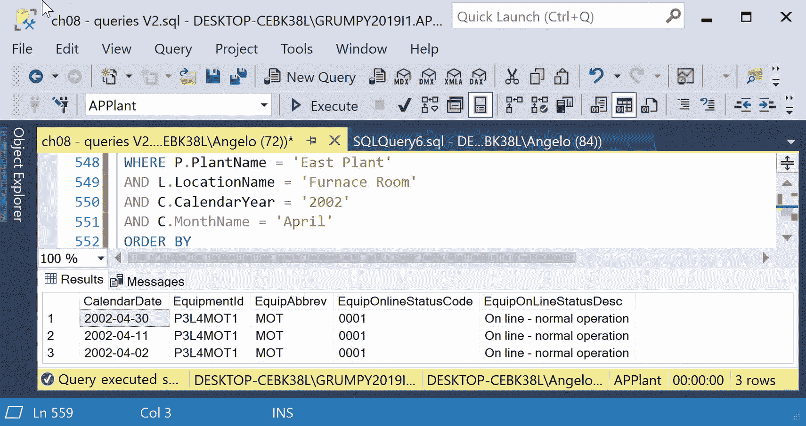

### 图 8-14：按日显示的设备故障状态

一张 ch08 queries V 2 dot sql 窗口的截图。顶部屏幕显示了一些编程代码。底部屏幕展示了结果表。该表包含 5 列：日历日期、设备 ID、设备缩写、设备在线状态代码和设备状态描述。

哇，快看！结果中的状态全是“在线 - 正常运行”。
这带来了一个问题。看起来在这三天里，这台电机都处于在线状态。幸运的是，我们还有按小时统计的那些日期的状态历史表（更低层级的粒度）。也许在这些日期的某些小时里发生过其他事件。
让我们执行清单 8-9 中的查询，分别针对这三天。

### 清单 8-9：按小时统计的设备故障

```sql
SELECT ESBH.StatusDate
,ESBH.EquipmentId
,E.EquipAbbrev
,M.MotorName
,M.Rpm
,M.Voltage
,ESBH.StatusHour
,ESBH.EquipOnlineStatusCode
,EOLSC.EquipOnlineStatusDesc
FROM Reports.EquipmentStatusHistoryByHour ESBH
JOIN DimTable.Equipment E
ON ESBH.EquipmentId = E.EquipmentId
JOIN DimTable.Motor M
ON E.EquipmentId = M.EquipmentId
JOIN DimTable.EquipOnlineStatusCode EOLSC
ON ESBH.EquipOnlineStatusCode = EOLSC.EquipOnlineStatusCode
WHERE ESBH.EquipmentId = 'P3L4MOT1'
AND StatusDate = '2002-04-02'
GO
```

这个查询引用了名为 `Reports.EquipmentStatusHistoryByHour`（按小时设备状态历史报告表）的报告表，该表包含 24 小时期间内按小时统计的设备状态。为了获取与设备、设备状态代码和描述相关的一些详细信息，需要在多个表之间进行大量连接。
没什么花哨的，只是使用连接和筛选器的老式 `TSQL` 代码。没有聚合窗口函数和 `OVER()` 子句。
执行此查询会生成我们正在检查的第一个日期的结果。

请参考图 8-15。

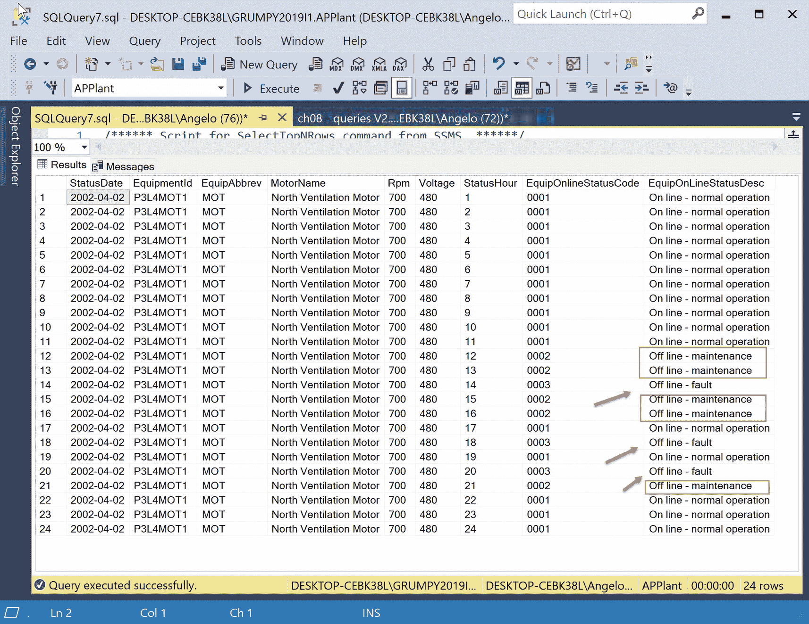

### 图 8-15：2002 年 4 月 2 日的设备故障

一张 ch08 queries V 2 dot sql 窗口的截图。顶部屏幕显示了一些编程代码。底部屏幕展示了结果表。该表包含 9 列。“设备在线状态描述”列的某些值被高亮显示。

这是 2002 年 4 月 2 日 24 小时的结果。是的，确实，我们有三次故障。这与我们之前查询的结果相符。还要注意，故障开始发生时，在 12 点和 13 点有一个维护时段。工作人员试图让电机上线，但失败了。
在 15 点和 16 点进行了更多维护，然后在 18 点正常运行一小时后又发生了一次故障。20 点再次发生故障，随后在 21 点进行了一个小时的维护。之后电机运行正常，所以看起来他们在三次维护后终于解决了问题（如果我们有数据能显示分配给这些故障事件的维护人员姓名，那就很有意思了），直到 4 月 11 日为止。让我们看看那天发生了什么。
修改 `WHERE` 子句以筛选 2002 年 4 月 11 日后执行此查询，得到图 8-16 中的结果。

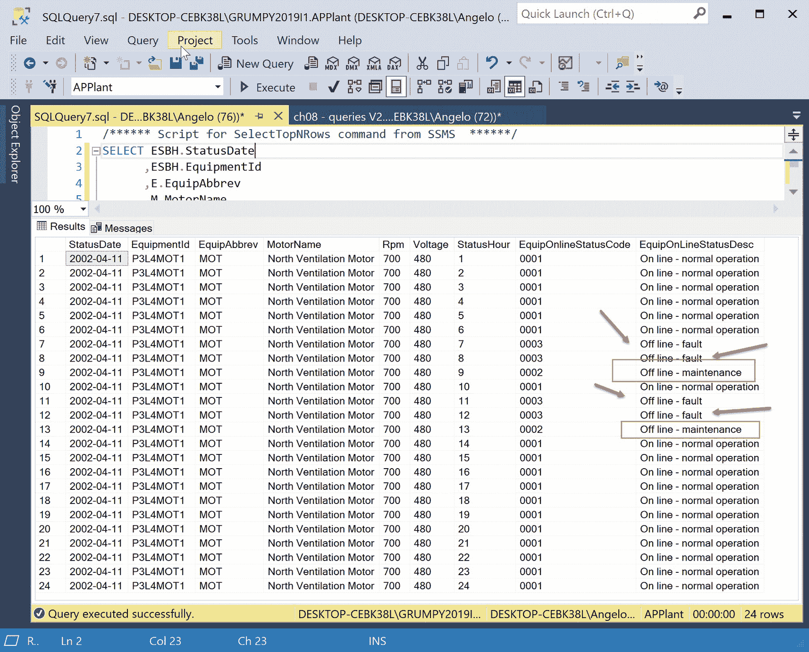

### 图 8-16：2002 年 4 月 11 日的设备故障

一张 ch08 queries V 2 dot sql 窗口的截图。顶部屏幕显示了一些编程代码。底部屏幕展示了结果表。该表包含 9 列。“设备在线状态描述”列的某些值被高亮显示。

这次我们看到了四次故障。前两次发生在 7 点和 8 点。随后在 9 点进行了一个小时的维护尝试修复，然后在 10 点有一个小时的正常运行。11 点和 12 点又发生了两次故障，13 点又进行了一个小时的维护，看起来他们在那里终于解决了问题。
所以看起来需要与供应商开个会，了解一下为什么在这些日期维护进行得不顺利（同时也需要和维护团队沟通）。
我们为什么要经历所有这些查询？
我试图说明使用带有 `OVER()` 子句的聚合函数如何帮助发现有趣的模式和异常，这些可能暗示着问题。在这个案例中，我们识别出某些日期的许多故障，并使用更低粒度的查询深入分析故障，直到发现供应商的维护团队是问题所在。
是的，我确实设定了这个场景，但目标是识别用于识别问题并找出根本原因的方法和工具！
最后一个提示：用于插入分阶段每小时状态的 `TSQL` 批处理代码可以在本章脚本的开头找到，以防你尚未执行它。

**注意**
有时，你的分析工具就是老式的、较低层级的查询，用于深入到最低的粒度级别。聚合函数只是你工具包中的一部分工具。关键在于识别模式和异常，并执行一些深入分析以发现根本原因。


#### GROUPING()函数

接下来，让我们通过`GROUPING()`函数创建一些汇总。虽然不如 Excel 数据透视表那样美观易读，但如果你热衷于挑战，它也是可用的工具！

与往常一样，我们需要从业务需求规范开始。我们的分析师提供了以下需求：

> 我需要一份报告显示所有级别的故障汇总，即按设备、工厂、位置、年份、季度和月份。最初这只是针对 2002 年的数据，但查询的编写方式应便于修改为包含所有年份或仅一个产品。报告需要排序，使所有`NULL`值都浮到顶部，以便汇总易于阅读；否则，它们会分散在整个报告中，导致无法辨识汇总内容。
>
> 此外，请创建一个能够提供底层数据的查询，并将查询结果复制粘贴到带有数据透视表的 Microsoft Excel 电子表格中，以便验证结果。

哇，这次有两个规范：一个用于报告，一个用于测试和验证查询报告的电子表格。清单 8-10 是我们提供给分析师的代码。

```
SELECT
PlantName
,LocationName
,CalendarYear
,QuarterName
,MonthName
,CalendarMonth
,EquipmentId
,SumEquipmentFailure
,SUM(SumEquipmentFailure) AS FailedEquipmentRollup
,GROUPING(SumEquipmentFailure) AS GroupingLevels
FROM [Reports].[EquipmentFailureStatistics]
WHERE CalendarYear = 2002
GROUP BY
PlantName,LocationName,CalendarYear,QuarterName,MonthName,CalendarMonth,
EquipmentId,SumEquipmentFailure WITH ROLLUP
ORDER BY PlantName,LocationName,CalendarYear,QuarterName,
CalendarMonth,EquipmentId ASC,
(
CASE
WHEN SumEquipmentFailure IS NULL THEN 0
END
) DESC,
GROUPING(SumEquipmentFailure) DESC
GO
```
清单 8-10
设备故障汇总

`SUM()`聚合函数与`SELECT`子句中的`GROUPING()`函数一起使用。`GROUP BY`子句在末尾声明了`WITH ROLLUP`，以便在所有必需的级别生成小计。最后，`ORDER BY`子句包含一个`CASE`块，用于测试`SumEquipmentFailure`列的值。如果它是`NULL`，则将其替换为 0，并按`CASE`块生成的结果值降序排列。这确实是个不错的技巧。

结果将告诉我们这个技巧是否奏效。请参考图 8-17 中的部分结果。

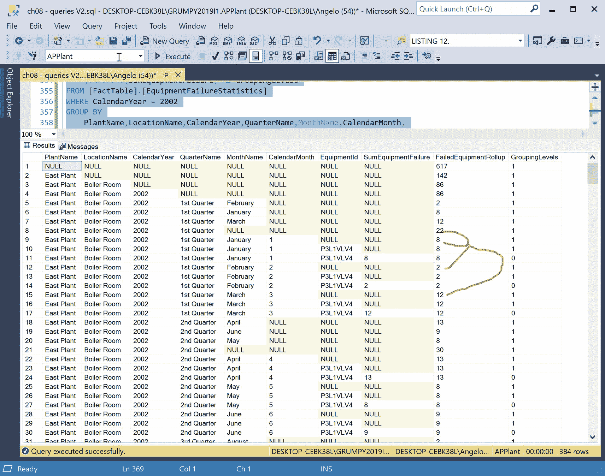

图 8-17

带汇总的故障总计

它汇总了吗？如果你看那些波浪线，我们可以看到以下结果：22 = 8 + 2 + 12！所以它确实有效。但这很难阅读和理解。想象一下如果我们需要报告多于一个设备的情况，我们可能会很快迷失。

我取刚刚讨论的查询，移除了`SUM()`和`GROUPING()`函数；同时移除了`GROUP BY`子句和`ORDER BY`子句中的`CASE`块，以得到一个生成原始数据的查询。

我将查询结果复制粘贴到 Microsoft Excel 电子表格中，然后创建了一个数据透视表。这可以在图 8-18 中看到。

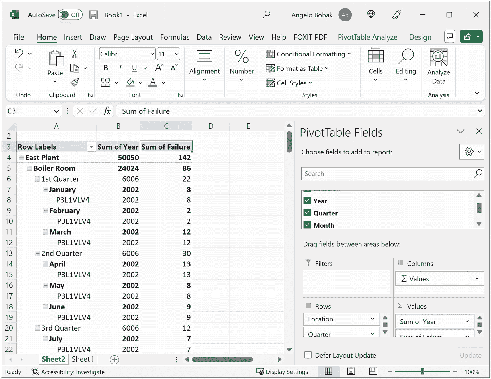

图 8-18

设备故障汇总数据透视表报告

这就好多了。你可以拖放需要的列来生成汇总，并可以折叠或展开各个级别。我认为这个选项比`GROUPING()`函数要好用得多，但至少你有两个工具可用于生成汇总：T-SQL 和 Excel。

> **注意**
> 对于非常大的数据量，你可以将它们加载到 SSAS 多维数据集，并通过 Excel 或连接到使用 SSAS 创建的多维数据集的第三方 Web 工具来执行多维数据分析。

为这个电子表格生成底层结果的代码位于本章的 T-SQL 脚本中，在`GROUPING()`函数示例之后。请参考清单 8-11。

```
SELECT
PlantName
,LocationName
,CalendarYear
,QuarterName
,MonthName
,EquipmentId
,SumEquipmentFailure
FROM Reports.EquipmentFailureStatistics
WHERE CalendarYear = 2002
ORDER BY PlantName,LocationName,CalendarYear,QuarterName,
CalendarMonth,EquipmentId ASC
GO
```
清单 8-11
用于 Microsoft Excel 的数据透视表查询

接下来，我们将聚合一些字符串来生成工厂信息流。


## STRING_AGG( ) 函数

以下示例将为某个设备生成一整天的温度结果数据集。这里使用一个表变量来存储一天的小时值，并在查询中使用 `STRING_AGG()` 函数来获取所需列。结果被汇总到一个临时表中进行处理。如果你需要将数据流从数据库发送到外部应用程序（如网站或其他数据库平台），可以采用此技术。这些数据流使用逗号和冒号作为分隔符，以便在另一端解析数据。

提示

你可以将我们脚本中开发的逻辑放入函数中，以便使用不同参数重复调用。这确实会成为一套强大的工具。

回到我们的示例。脚本的第一部分请参考代码清单 8-12。

```sql
DROP TABLE IF EXISTS #GeneratorTemperature
GO
DECLARE @Hour TABLE (
SampleHour SMALLINT
);
INSERT INTO @Hour VALUES
(1),(2),(3),(4),(5),(6),(7),(8),(9),(10),(11),(12),
(13),(14),(15),(16),(17),(18),(19),(20),(21),(22),(23),(24);
SELECT G.PlantId
,G.LocationId
,G.EquipmentId
,G.GeneratorId
,G.GeneratorName
,C.CalendarDate
,H.SampleHour
,UPPER (
CONVERT(INT,CRYPT_GEN_RANDOM(1)
) * 5) AS Temperature
,G.Voltage
INTO #GeneratorTemperature
FROM DimTable.Generator G
CROSS JOIN DimTable.Calendar C
CROSS JOIN @Hour H
ORDER BY G.PlantId
,G.LocationId
,G.EquipmentId
,G.GeneratorId
,G.GeneratorName
,C.CalendarDate
,H.SampleHour;
```

**代码清单 8-12** 汇总温度数据流

这个小的表变量被加载了 1-24 的值，代表一天中的小时。通过检索必要的列以及一个随机生成的温度值，动态创建了一个临时表。这是通过 `CRYPT_GEN_RANDOM()` 函数完成的，我认为在查询中它比 `RAND()` 函数效果更好。

对 `Generator`、`Calendar` 和 `@Hour` 表执行了两个 `CROSS JOIN`（交叉连接），以便为我们的测试数据集创建所有值的笛卡尔积。我包含了 `ORDER BY` 子句以便对数据进行排序。仅这一部分就生成了 736,320 行数据，运行耗时 15 秒。我们不会对此执行任何估算查询计划，因为它仅用于演示目的。

脚本的第二部分如代码清单 8-13 所示。

```sql
SELECT STRING_AGG('PlantId:'+ PlantId
+ ',Location:' + LocationId
+ ',Equipment:' + EquipmentId
+ ',GeneratorId:' + GeneratorId
+ ',Generator Name:' + GeneratorName
+ ',Voltage:' + CONVERT(VARCHAR,Voltage)
+ ',Temperature:' + CONVERT(VARCHAR,Temperature)
+ ',Sample Date:' + CONVERT(VARCHAR,CalendarDate)
+ ',Sample Hour:' + CONVERT(VARCHAR,SampleHour) + '>','!')
FROM #GeneratorTemperature
WHERE CalendarDate = '2005-11-30'
AND PlantId = 'PP000001'
GROUP BY PlantId
,LocationId
,EquipmentId
,GeneratorId
,GeneratorName
,CalendarDate
,SampleHour
GO
DROP TABLE IF EXISTS #GeneratorTemperature
GO
```

**代码清单 8-13** 创建消息流

第二次运行该查询只花了一秒钟。大量的数据和查询计划很可能已经位于缓存中。

如你所见，该查询有一个 `WHERE` 子句，用于仅筛选出一天和一个工厂 ID 的信息。

`STRING_AGG()` 函数接收你希望连接的字符串，以逗号分隔。通过以垂直方式列出文本来格式化查询是一个好主意，这样你就可以看到在哪里放置分隔符。

结果如图 8-19 所示。

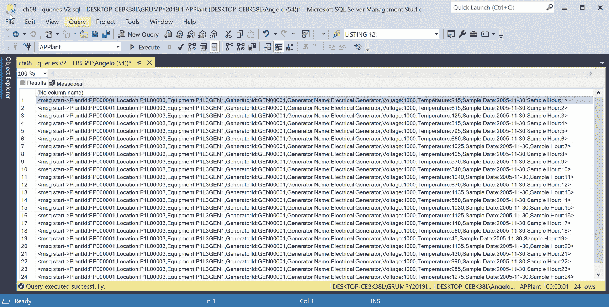

**图 8-19** 设备统计数据流

让我们提取第一行，以便你可以看到该行是如何格式化的：

```
PlantId:PP000001,
Location:P1L00003,
Equipment:P1L3GEN1,
GeneratorId:GEN00001,
Generator Name:Electrical Generator,
Voltage:1000,
Temperature:130,
Sample Date:2005-11-30,
Sample Hour:1
>
```

正如我所说，这对于在平台之间传输数据流很有用。试试看你能否修改脚本以加载第二个表，然后尝试编写一个查询，将行流中的每个元素进行分词，以便将它们加载到新表中，例如不同数据库中的表，甚至是另一个 SQL Server 实例中的表。

此技术也可用于填充网站，以便分析师和其他业务利益相关者可以通过他们的 Web 浏览器查看结果。为此，你需要一些 Java 编程技巧！

这项技能终有一天会派上用场！所以把它加入你的知识库吧。现在是统计时间了。


### 使用 STDEV()和 STDEVP()函数计算标准差

### STDEV( ) 和 STDEVP( ) 函数

作为提醒，请回忆我们在第 2 章中对标准差的定义（如果你对这部分很熟悉，可以直接跳到示例的业务规范）。如果你需要复习或者这是新知识，请继续阅读：

`STDEV()`函数在未知或无法获取整个总体时，计算一组值的统计标准差。

`STDEVP()`函数在整个数据总体已知时，计算统计标准差。

但这到底是什么意思呢？

它的含义是数据集中的数字与**算术平均值**（`MEAN`，即平均值的另一种说法）的接近或分散程度。在我们的上下文中，平均值`MEAN`是所讨论的所有数据值的总和除以数据值的数量。还有其他类型的`MEAN`，如几何平均值、调和平均值和加权`MEAN`，我将在附录 B 中简要介绍。

回顾一下标准差是如何计算的。

以下是如何计算标准差的算法，如果你有兴趣，可以用 T-SQL 自行实现：

```
*   计算所有值的平均值（`MEAN`）并将其存储在变量中。你可以使用`AVG()`函数。
*   遍历值集合。对于数据集中的每个值
    *   减去计算出的平均值。
*   对结果求平方。
*   取所有前述结果的和，并将该值除以数据元素的数量减 1。（此步骤计算方差；若要计算整个总体，则不减 1。）
*   现在取方差的平方根，这就是你的标准差。
```

或者，你也可以直接使用`STDEV()`函数！如前所述，还有一个`STDEVP()`函数。如前所述，唯一的区别是`STDEV()`处理的是数据总体的一部分。这适用于整个数据集未知的情况。`STDEVP()`函数处理整个数据集，这就是数据总体的含义。

再次说明其语法：

```sql
SELECT STDEV( ALL | DISTINCT ) AS [Column Alias]
FROM [Table Name]
GO
```

你需要提供一个包含要使用数据的列名。你可以选择性地提供`ALL`或`DISTINCT`关键字。如果你省略它们，与其他函数一样，默认行为将是`ALL`。使用`DISTINCT`关键字将忽略列中的重复值（请确保这是你想要的操作）。

接下来是我们业务分析师提供的下一个报告的业务需求：

需要一份设备故障的季度滚动标准差报告。目前，我们关注的是东电厂锅炉房内的设备。这是一份汇总报告，因此不需要单个设备故障数据，只需要总数，因此可以使用`EquipmentFailureStatistics`表中的信息。

回想一下，`EquipmentFailureStatistics`表替代了我们最初使用的`CTE`查询方法。该表是每晚预加载的。事实证明，这种方法提高了性能，因为每次运行查询时我们都不必重新生成总数。

清单 8-14 是满足分析师业务需求的 T-SQL 脚本。

```sql
SELECT PlantName    AS Plant
,LocationName AS Location
,CalendarYear AS [Year]
,QuarterName  AS [Quarter]
,MonthName           AS [Month]
,SumEquipmentFailure AS EquipFailure
,STDEV(SumEquipmentFailure) OVER (
PARTITION BY PlantName,LocationName,CalendarYear,QuarterName
ORDER BY PlantName,LocationName,CalendarYear
) AS StDevQtr
,STDEVP(SumEquipmentFailure) OVER (
PARTITION BY PlantName,LocationName,CalendarYear,QuarterName
ORDER BY PlantName,LocationName,CalendarYear
) AS StDevpQtr
FROM Reports.EquipmentFailureStatistics
WHERE CalendarYear IN(2002,2003)
AND PlantName = 'East Plant'
AND LocationName = 'Boiler Room'
ORDER BY PlantName,LocationName,CalendarYear,CalendarMonth
GO
```
清单 8-14
季度滚动设备故障标准差

这是一个容易满足的需求。`STDEV()`函数使用一个`OVER()`子句，该子句定义了按工厂名称、位置名称、年份和季度的分区。该分区按工厂名称、位置名称和日历年排序。

`STDEVP()`函数也被包含在内，它使用了与`STDEV()`函数相同的`OVER()`子句。

如果你开始熟悉这些概念，可能会问：既然我们有`WHERE`子句筛选一个工厂和一个位置，为什么还要在分区中包含工厂名称和位置名称？

确实如此。我们不需要在`PARTITION BY`子句中包含工厂名称和位置名称。我修改了查询以排除它们，并得到了相同的结果。我也得到了相同的估计执行计划，如图 8-20 所示。

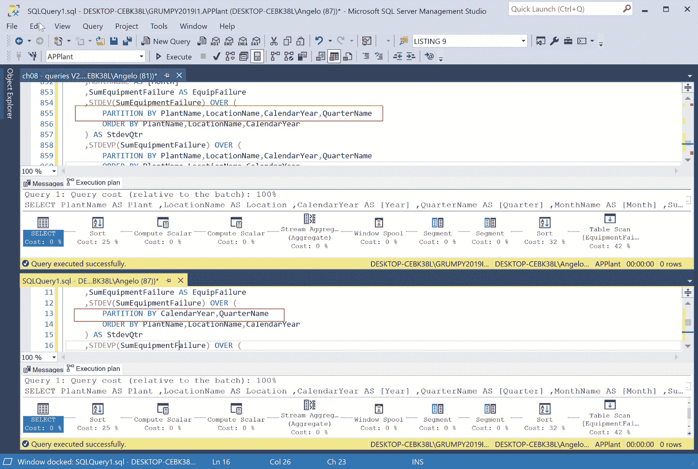
图 8-20
比较执行计划

如图所示，两个查询具有相同的估计执行计划。`IO`和`TIME`统计信息对于两者也是相同的，所以没有问题。良好的编码实践要求使用最少的代码来获得期望且正确的结果。这个查询可以用于多个工厂和多个位置，所以如果你有完整的`PARTITION BY`子句，可以直接使用。否则，如果这个查询只用于一个工厂和一个位置，请注释掉它并使用更小的版本。

我修改了查询以使用所有工厂和位置，对估计查询计划的改变很小；增加了一个窗口假脱机步骤，成本为 1%。因此，在创建脚本和查询时，请考虑所有这些因素。

回到查询，请参考图 8-21 中的部分结果。

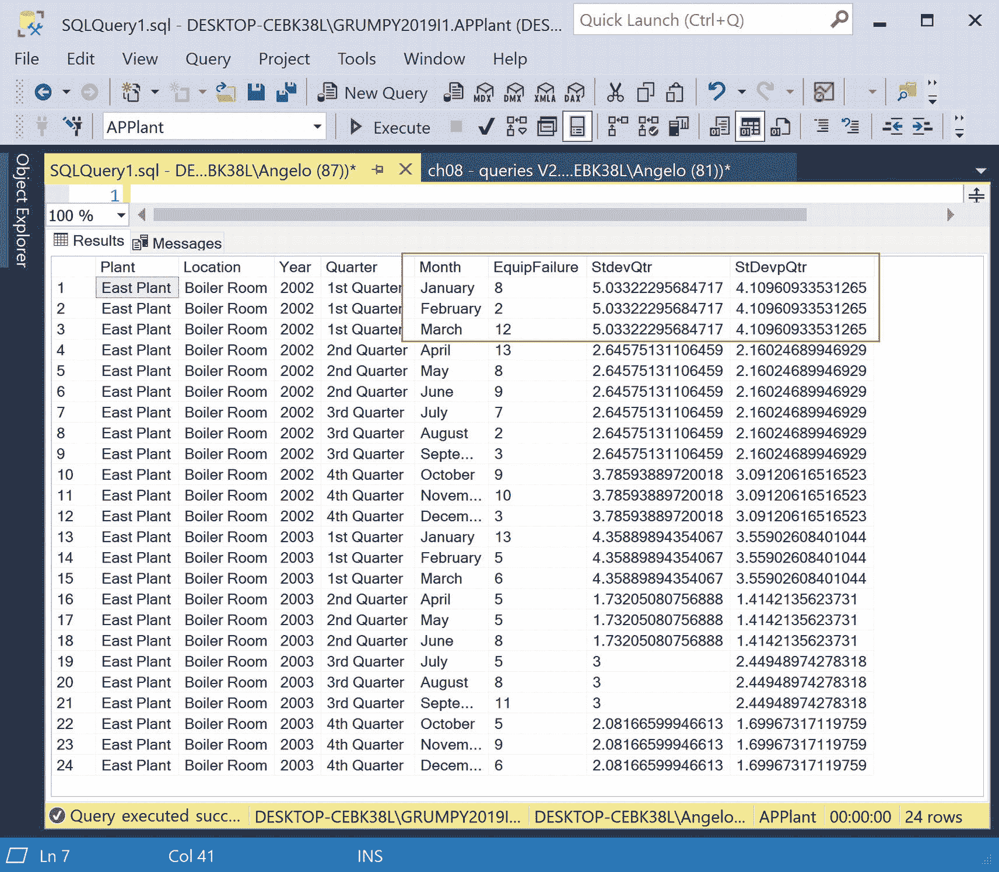
图 8-21
按工厂、位置和年份划分的季度滚动故障

注意`STDEV()`和`STDEVP()`结果之间的细微差别。

**小测验**

为什么`STDEVP()`函数生成的值总是更小？

我们将使用标准差结果来生成钟形曲线。钟形曲线是由称为正态分布的值生成的，这些值源自标准差、平均值和数据集中的每个单独值。

让我们看看这些数据在 Microsoft Excel 电子表格中生成的图形。请参考图 8-22。

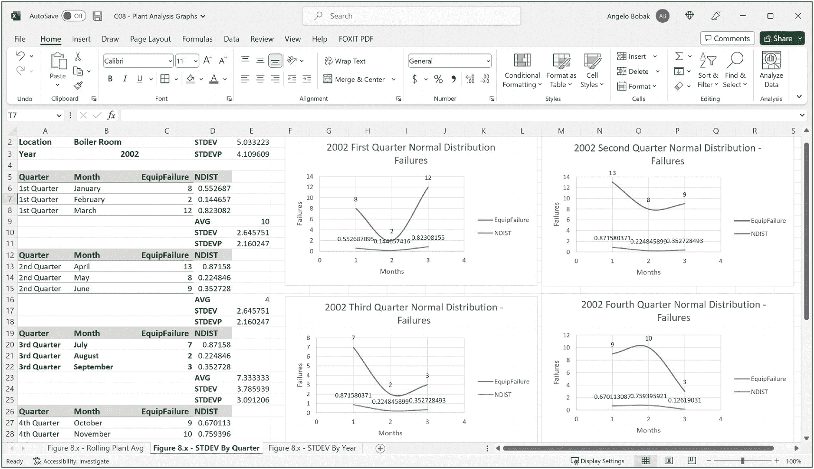
图 8-22
锅炉房设备故障按季度划分的标准差


这次我采用了多图表方法，即为每个年度-季度组合绘制一条钟形曲线。这种方法有些古怪，因为我们得到了倒置的钟形曲线和一个相对正常的（姑且这么说）钟形曲线。

**注意**

我们将在附录 B 中讨论如何在 Microsoft Excel 电子表格中生成正态分布、平均值、标准差和钟形曲线。

可以看到的是 2002 年每个季度的图表。由于 Excel 中的正态分布函数(`NORM.DIST`)需要使用`MEAN`（平均值）和由 SQL Server 查询生成的标准差，我必须为每个季度计算平均值。

尝试自己生成这些图表，但我会将电子表格包含在本章代码所在的文件夹中。提醒一下，除了你的`TSQL`技能外，这是一项很有用的技能。

让我们按年份尝试这个分析。请参考代码清单 8-15。

这是最后一个示例，我们将根据 2002 年和 2003 年这两年的年度标准差来生成正态分布。

```
SELECT PlantName AS Plant
,LocationName AS Location
,CalendarYear AS [Year]
,QuarterName  AS [Quarter]
,MonthName    AS Month
,SumEquipmentFailure As TotalFailures
,STDEV(SumEquipmentFailure) OVER (
PARTITION BY PlantName,LocationName,CalendarYear
ORDER BY CalendarYear
) AS RollingStdev
,STDEVP(SumEquipmentFailure) OVER (
PARTITION BY PlantName,LocationName,CalendarYear
ORDER BY CalendarYear
) AS RollingStdevp
FROM Reports.EquipmentFailureStatistics
WHERE CalendarYear IN(2002,2003)
AND PlantName = 'East Plant'
AND LocationName = 'Boiler Room'
ORDER BY PlantName,LocationName,CalendarYear,CalendarMonth
GO
代码清单 8-15
年度标准差
```

注意`SELECT`子句中部分列别名使用了方括号。所使用的别名在 SQL Server 中是保留字，因此使用方括号可以消除彩色的警告提示。即使使用关键字也不会造成损害，但这是一种避免看到那些颜色标记的方法。

一个微小的改动：`PARTITION BY`子句被修改为不包含季度名称，而`ORDER BY`子句被修改为只包含年份。之前的理由同样适用；因为我们只筛选了一个工厂和一个位置，我们实际上不需要在`PARTITION BY`子句中包含它们。

**作业**

一旦你熟悉了该查询的工作原理，就修改它以适用于多年份和多位置。这是开发和测试可用于 Microsoft SSRS（SQL Server Reporting Services）报告的查询的好方法。

以下是我们将复制并粘贴到 Microsoft Excel 电子表格中的结果。请参考图 8-23。

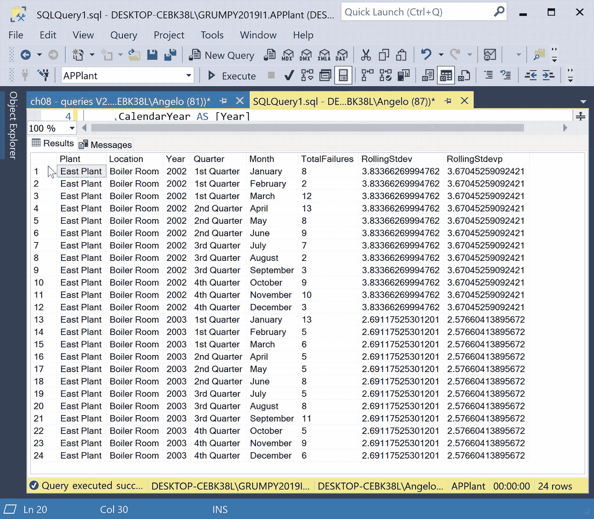

SQL 查询窗口`1.sql`的屏幕截图。它展示了一个结果表。该表有 8 列，分别是工厂、位置、年份、季度、月份、总故障数、滚动标准差和滚动总体标准差。

图 8-23
东厂锅炉房的年度故障标准差

好吧，这些数字不错，但正如我们常说的，一图胜千言，或者在我们这里，一图胜千个数字。每一年所有月份都有其各自的标准差值。换句话说，每个月份的标准差值是相同的。

稍微进行一些复制粘贴操作，再加上一些富有创意的格式调整到 Microsoft Excel 电子表格中，就得到了图 8-24 所示的报告，其中包含了这两年的正态分布图表。

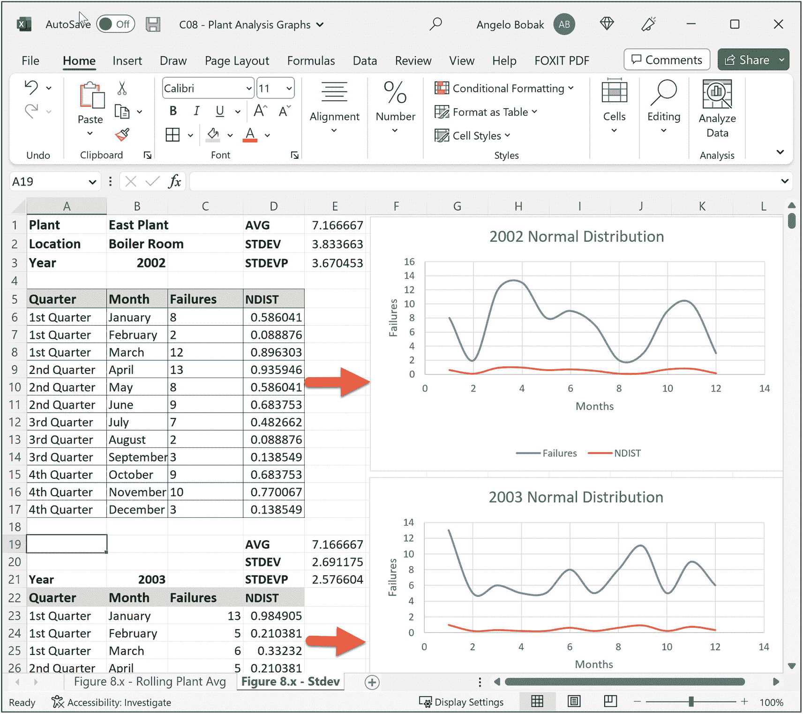

Microsoft Excel 工作表的屏幕截图。左侧屏幕有 2 个表格。每个表格有 4 列：季度、月份、故障数和 NDIST。右侧屏幕是 2002 年和 2003 年正态分布的折线图。

图 8-24
设备故障的正态分布钟形曲线

好一些了，但仍然是古怪的钟形曲线。如果我们吹毛求疵的话，每一组都是一系列钟形曲线。换句话说，不是为整年生成一条曲线，你可以为日历年的每个季度生成钟形曲线。

接下来将进行更多的统计分析，这次使用方差函数。

**随堂测验答案**

为什么`STDEVP()`函数生成的值总是更小？因为它们有更多的数据可供处理。

## `VAR()` 和 `VARP()` 函数

以下是第二章中对这些函数的定义。如果你已经熟悉它们的工作原理，可以跳过，直接去看示例查询的业务规范。

如果你阅读了第一章然后直接跳到这里是因为你的兴趣在于工程、电厂管理或其他相关领域，请阅读这些定义。

`VAR()` 和 `VARP()` 函数用于生成数据样本中一组值的方差。与`STDEV()`和`STDEVP()`示例中关于数据集使用的讨论同样适用于`VAR()`和`VARP()`函数相对于数据总体的情况。

`VAR()`函数在整体数据集未知或不可用时，对部分数据集进行处理；而`VARP()`函数在整体数据集已知时，对整个数据集总体进行处理。

因此，如果你的数据集包含十行数据，函数名以`P`结尾的会在处理值时包含所有十行；不以字母`P`结尾的则会查看 N - 1 行，即 10 - 1 = 9 行。

好了，现在解释清楚了，那么方差到底是什么意思呢？

对于我们开发者和非统计学家来说，这里有一个简单的解释：

非正式地说，如果你取每个值与平均值（均值）的所有差值，对结果求平方，然后将所有结果相加，最后除以数据样本的数量，你就得到了方差。

**提醒**

如果你对求方差的平方根，就得到了标准差，所以它们之间存在某种关联！

对于我们的工程场景，假设我们有一些数据，预测了我们某个工厂设备（比如一台电机）在特定年份的在线天数目标。当电机的设备状态历史最终生成后，我们想看看实际的在线天数与预测值是接近还是偏离。它回答了以下问题：

* 我们是否未达到在线事件目标？
* 我们是否达到了在线事件目标？
* 我们是否超过了在线事件目标（例如无停机时间）？

顺便说一下，这个统计公式也在附录 B 中讨论。

接下来的例子将展示`VAR()`和`VARP()`函数如何与三种不同的`PARTITION BY`子句结合使用。


### 示例 1：滚动方差

我们第一个方差报告的需求如下：

为工厂位置的设备故障创建一个滚动方差报告。按工厂、位置、季度和月份建立报告。滚动方差在生成方差值时，应包含任意前序行和当前行，因为结果会逐月变化。

这是一个简单的报告，我们使用标准差示例中的一个查询，稍作修改，并在 `PARTITION BY` 子句中添加一个 `ROWS` 子句。

请参考清单 8-16 以查看新查询。

```sql
SELECT PlantName
,LocationName
,CalendarYear
,QuarterName
,MonthName
,CalendarMonth
,SumEquipmentFailure
,VAR(SumEquipmentFailure) OVER (
PARTITION BY PlantName,LocationName,CalendarYear
ORDER BY CalendarMonth
ROWS BETWEEN UNBOUNDED PRECEDING AND CURRENT ROW
) AS RollingVar
,VARP(SumEquipmentFailure) OVER (
PARTITION BY PlantName,LocationName,CalendarYear
ORDER BY CalendarMonth
ROWS BETWEEN UNBOUNDED PRECEDING AND CURRENT ROW
) AS RollingVarp
FROM [Reports].[EquipmentFailureStatistics]
WHERE CalendarYear IN(2002,2003)
AND PlantName = 'East Plant'
AND LocationName = 'Boiler Room'
ORDER BY PlantName,LocationName,CalendarYear,CalendarMonth
GO
```

清单 8-16
按工厂、位置、年份和月份计算的滚动方差

可以看到，我们添加了 `ROWS` 子句，并保留了 `WHERE` 子句来将结果限制在东工厂的锅炉房。如果我们希望将结果输出到 Microsoft Excel 数据透视表，可以修改此查询以包含所有工厂和位置。

请参考图 8-25 中的部分结果。

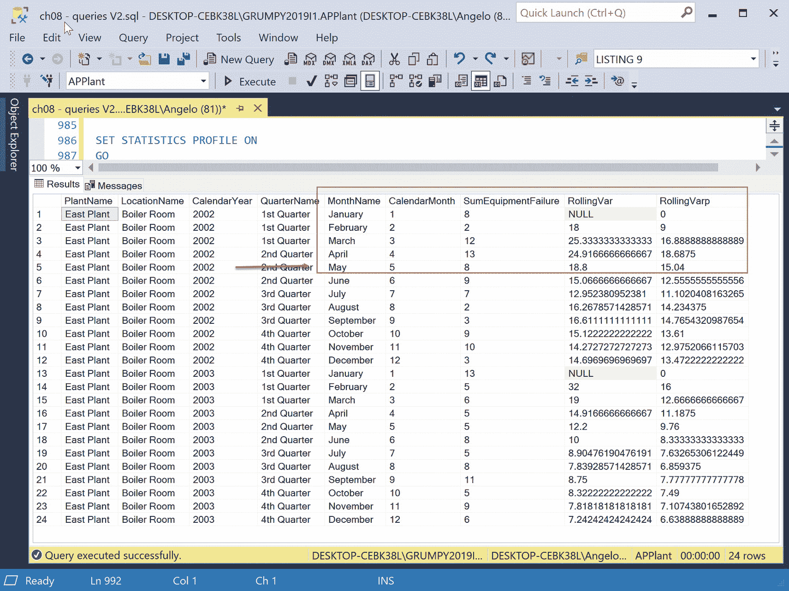

ch08_queries_V2.sql 窗口截图。上方屏幕显示部分编程代码。下方屏幕展示结果表格。表格有 9 列。其中月份名称、设备故障总和、滚动方差和滚动方差 P 列被高亮显示。

图 8-25
工厂位置故障的滚动方差

该框定义了一个包含一月、二月、三月、四月和五月值的五行分区。对于此框架，当前处理行为第 5 行。第一个 `VAR()` 值为 `NULL`，在遇到新年前，其余值均不为 `NULL`。我将这 24 行复制到 Microsoft Excel 中，并能够使用 Excel 函数复现结果。如果你也这样做，请记住 `VAR($G$1,G5)` 与 `VAR($G$1:G5)` 是不同的。你需要使用分号来定义一个包含所有前序行的、不断增长的范围：

```
VAR($G$1:G5)
VAR($G$1:G6)
VAR($G$1:G7)
```

以此类推。使用逗号版本每次只会包含两行。错了！我忘了这点，这让我抓狂。搞不懂为什么 SQL 代码生成的值与 Microsoft Excel 的不同。这是个容易掉进去的陷阱。

顺便提一下，在前面的查询中尝试这段代码片段，你会发现如果对方差取平方根，我们确实得到了标准差：

```sql
,SQRT(
VAR(SumEquipmentFailure) OVER (
PARTITION BY PlantName,LocationName,CalendarYear
ORDER BY CalendarMonth
ROWS BETWEEN UNBOUNDED PRECEDING AND CURRENT ROW
)
) AS MyRollingStdev
,STDEV(SumEquipmentFailure) OVER (
PARTITION BY PlantName,LocationName,CalendarYear
ORDER BY CalendarMonth
ROWS BETWEEN UNBOUNDED PRECEDING AND CURRENT ROW
) AS RollingStdev
```

下一个示例。

### 示例 2：按季度计算的方差

我们第二个方差报告的需求如下：

为工厂位置的设备故障创建一个按季度计算的方差报告。按工厂、位置、季度和月份建立报告。方差应包含分区内任意前序行和任意后序行。

我们只需复制粘贴前一个查询并做一些小的调整。

请参考清单 8-17。

```sql
SELECT PlantName           AS Plant
,LocationName        AS Location
,CalendarYear        AS Year
,QuarterName         AS Quarter
,MonthName           AS Month
,SumEquipmentFailure AS EquipFailure
,VAR(SumEquipmentFailure) OVER (
PARTITION BY PlantName,LocationName,CalendarYear,QuarterName
ORDER BY PlantName,LocationName,CalendarYear
ROWS BETWEEN UNBOUNDED PRECEDING AND UNBOUNDED FOLLOWING
) AS VarByQtr
,VARP(SumEquipmentFailure) OVER (
PARTITION BY PlantName,LocationName,CalendarYear,QuarterName
ORDER BY PlantName,LocationName,CalendarYear
ROWS BETWEEN UNBOUNDED PRECEDING AND UNBOUNDED FOLLOWING
) AS VarpByQtr
FROM Reports.EquipmentFailureStatistics
WHERE CalendarYear IN(2002,2003)
AND PlantName = 'East Plant'
AND LocationName = 'Boiler Room'
ORDER BY PlantName,LocationName,CalendarYear,CalendarMonth
GO
```

清单 8-17
按工厂和位置计算的季度方差报告

注意 `PARTITION BY` 子句。分区由工厂、位置、年份和季度定义。分区按工厂名称、位置名称和年份排序以便处理。

同样，有一个 `WHERE` 子句将结果集限制为两年以及该工厂内的一个工厂和一个位置。我这样做是为了保持结果集较小，但一旦你练习熟练后，就可以移除这些限制。目前，根据查询的现状，由于 `WHERE` 子句的存在，我们不需要在 `PARTITION BY` 和 `ORDER BY` 子句中包含工厂名称和位置名称，正如我们之前讨论的那样。

结果请参考图 8-26。

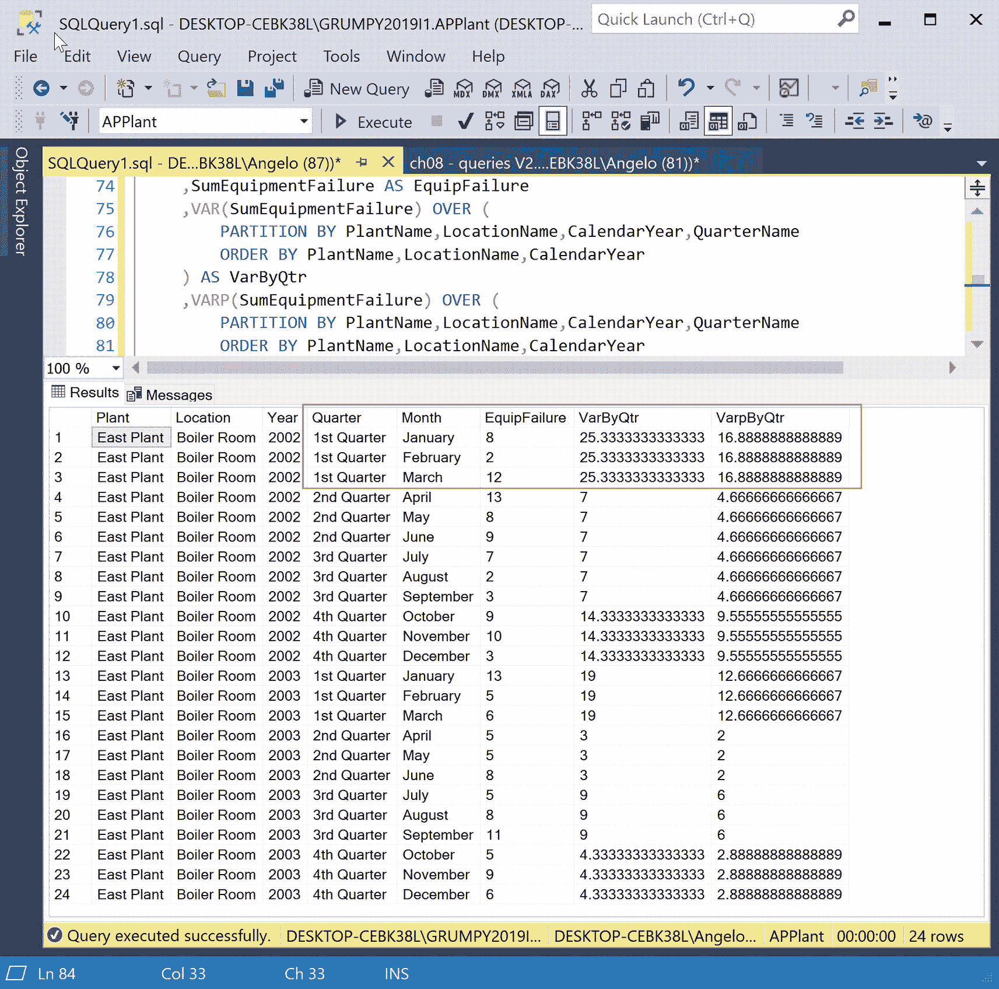

ch08_queries_V2.sql 窗口截图。上方屏幕显示部分编程代码。下方屏幕展示结果表格。表格有 8 列。其中季度、月份、设备故障、按季度方差和按季度方差 P 列被高亮显示。

图 8-26
工厂位置故障按季度计算的方差

如你所见，每个季度都有自己的方差结果。这也通过 Microsoft Excel 进行了验证。

最后但同样重要的是，让我们通过计算按年份的方差来构建我们的方差统计配置报告集。


### 示例 3：按年计算方差

这是我们友好的分析师提供的一份简短需求说明：
创建一份按工厂、地点、季度和月份划分的设备故障年度差异报告。差异应包含分区内当前行的前一行和后一行数据。

**随堂测验**

需求说明的最后一句是否暗示我们应该在查询中使用 `ROWS` 子句？或者，我们实现的 `OVER()` 子句的默认行为就能满足要求？

我们再次直接复制粘贴之前的查询，并对 `OVER()` 子句做一些小的调整。

请参考清单 8-18。

```sql
SELECT PlantName    AS Plant
,LocationName AS Location
,CalendarYear AS [Year]
,QuarterName  AS [Quarter]
,MonthName    AS Month
,SumEquipmentFailure As TotalFailures
,VAR(SumEquipmentFailure) OVER (
PARTITION BY PlantName,LocationName,CalendarYear
ORDER BY CalendarYear
) AS VarByYear
,VARP(SumEquipmentFailure) OVER (
PARTITION BY PlantName,LocationName,CalendarYear
ORDER BY CalendarYear
) AS VarpByYear
FROM Reports.EquipmentFailureStatistics
WHERE CalendarYear IN(2002,2003)
AND PlantName = 'East Plant'
AND LocationName = 'Boiler Room'
ORDER BY PlantName,LocationName,CalendarYear,CalendarMonth
GO
```

**清单 8-18** 按年计算的滚动方差

这次我们省略了 `ROWS` 子句，并按照工厂名称、地点和年份设置了一个分区。该分区按年份排序。通过这个查询，我们得到了故障方差的良好时间分布特征，即滚动的月度方差、季度方差以及最终的年度方差。让我们查看图 8-27 中的结果。

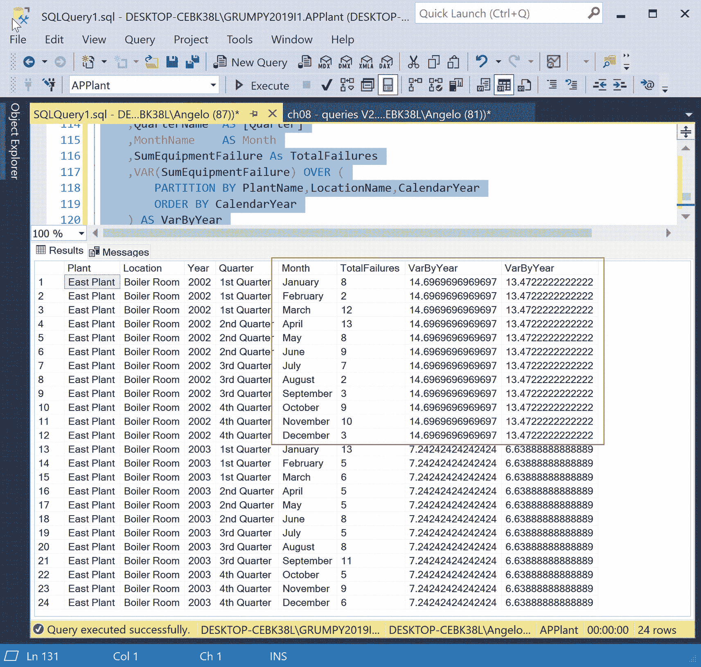
*ch08_queries_V_2.sql 窗口的截图。顶部屏幕显示了一些编程代码。底部屏幕展示了一个结果表。该表有 8 列。其中，“月份”、“总故障数”、“年度方差”和“年度方差”列被高亮显示。*

**图 8-27** 按年划分的工厂设备故障方差

每年的所有月份都有一个单一的方差值。请注意，`VARP()` 函数在每年中生成的方差较小。这是因为该函数考虑了整个数据集的总体。

**随堂测验答案**

需求说明的最后一句是否暗示我们应该在查询中使用 `ROWS` 子句？或者，我们实现的 `OVER()` 子句的默认行为就能满足要求？不，看来默认行为就满足了要求。当你包含 `PARTITION BY` 子句和 `ORDER BY` 子句时，你就包含了相对于当前正在处理的行的所有前序行和后续行。

#### 性能考量

让我们用一点性能调优来结束本章。我们将在同一个查询中使用统计聚合函数和平均值函数，以查看将生成的估计查询计划的复杂程度。
回想一下，我们将使用一个替换了 `CTE` 的报表表，因此即使没有索引，性能也应该是可接受的。这个表只有 2,021 行，因此非常小，完全可以用一个内存优化表来实现。
在尝试内存优化表方法之前，我们继续看看索引是帮助还是阻碍我们的性能目标。我们甚至会尝试一个聚集索引。
需求是创建一个可用于提供工厂故障统计概览的查询。将使用 `AVG()`、`STDEV()` 和 `STDEVP()`，以及 `VAR()` 和 `VARP()` 函数。我们希望得到按工厂、地点、日历年和月份计算的滚动值。
让我们检查一下查询。
请参考清单 8-19。

```sql
SELECT PlantName
,LocationName
,CalendarYear
,QuarterName
,MonthName
,CalendarMonth
,SumEquipmentFailure
,AVG(CONVERT(DECIMAL(10,2),SumEquipmentFailure)) OVER (
PARTITION BY PlantName,LocationName,CalendarYear
ORDER BY CalendarMonth
) AS RollingAvg
,STDEV(SumEquipmentFailure) OVER (
PARTITION BY PlantName,LocationName,CalendarYear
ORDER BY CalendarMonth
) AS RollingStdev
,STDEVP(SumEquipmentFailure) OVER (
PARTITION BY PlantName,LocationName,CalendarYear
ORDER BY CalendarMonth
) AS RollingStdevp
,VAR(SumEquipmentFailure) OVER (
PARTITION BY PlantName,LocationName,CalendarYear
ORDER BY CalendarMonth
) AS RollingVar
,VARP(SumEquipmentFailure) OVER (
PARTITION BY PlantName,LocationName,CalendarYear
ORDER BY CalendarMonth
) AS RollingVarp
FROM [Reports].[EquipmentFailureStatistics]
GO
```

**清单 8-19** 工厂故障统计概览

所有 `OVER()` 子句的分区设置方式都相同。所有分区都使用一个 `ORDER BY` 子句，该子句按 `CalendarMonth` 列对分区进行排序。`ORDER BY` 子句用于定义窗口函数应用于分区的顺序。在查看查询计划之前，我们先检查一下结果。
请参考图 8-28。

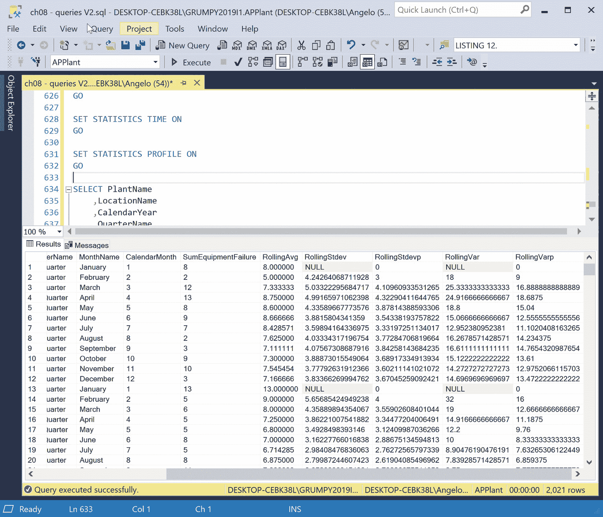
*ch08_queries_V_2.sql 窗口的截图。顶部屏幕显示了一些编程代码。底部屏幕展示了一个结果表。该表有 9 列，分别为：名称、月份、日历月份、设备故障总和、滚动平均值、滚动标准差、滚动方差和滚动总体方差。*

**图 8-28** 设备故障概览

按预期工作，在各行间返回滚动值结果。请注意在处理每个分区的第一行时，结果为 `NULL`。还要注意当函数处理整个数据集时（换句话说，整个数据集已知），结果为零。
如果你想覆盖 `NULL` 结果，可以使用 `CASE` 代码块来显示 0 代替 `NULL`。以下代码片段展示了这一点：

```sql
CASE WHEN STDEV(SumEquipmentFailure) OVER (
PARTITION BY PlantName,LocationName,CalendarYear
ORDER BY CalendarMonth
) IS NULL THEN 0
ELSE
STDEV(SumEquipmentFailure) OVER (
PARTITION BY PlantName,LocationName,CalendarYear
ORDER BY CalendarMonth
)
END AS RollingStdev
```

代码有点繁琐，但确实能解决问题。现在来看估计查询计划。
请参考图 8-29。

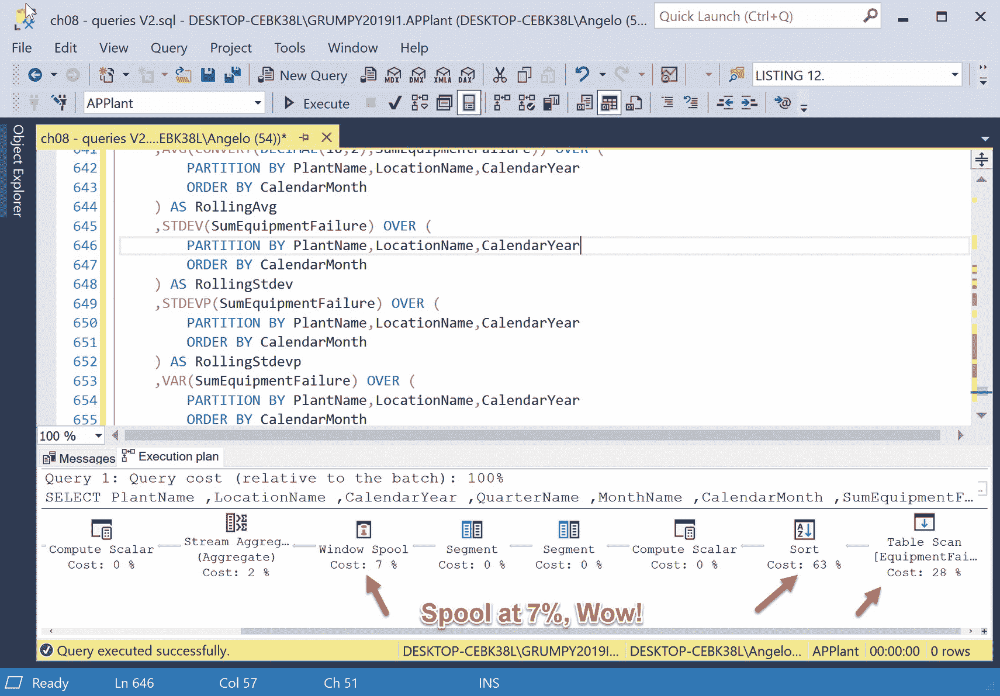
*ch08_queries_V_2.sql 窗口的截图。顶部屏幕显示了一些编程代码。底部屏幕显示了查询 1 的消息和执行计划。窗口假脱机成本占 7%，排序成本占 63%，表扫描成本占 28%。*

**图 8-29** 基线估计查询计划

我们看到了一个表扫描、一个昂贵的排序（占成本 63%）和一个繁重的窗口假脱机任务（占成本 7%）。
我创建了这个索引来查看窗口假脱机成本是否会降低：


### 提升查询性能：索引与内存优化表

## 创建索引尝试

```sql
CREATE INDEX iePlantequipmentFailureProfile
ON [Reports].EquipmentFailureStatistics
GO
```

通常的经验法则是，为`PARTITION BY`子句和`ORDER BY`子句中引用的列创建索引，以提升性能。

你猜怎么着？估计的查询计划保持不变，所以我就不展示了。这里的教训是，当表很小时，比如只有几千行，创建索引并没有帮助。它们只会占用空间，所以不如不创建。这些索引在加载表、修改表中行以及删除表中行时，反而会拖慢性能。

接着，我创建了一个聚集索引，看看窗口假脱机（window spool）的成本是否会降低：

```sql
CREATE CLUSTERED INDEX ieClustPlantequipmentFailureProfile
ON Reports.EquipmentFailureStatistics(
PlantName
,LocationName
,CalendarYear
,CalendarMonth
)
GO
```

图 8-30 展示了第二个估计的查询计划。

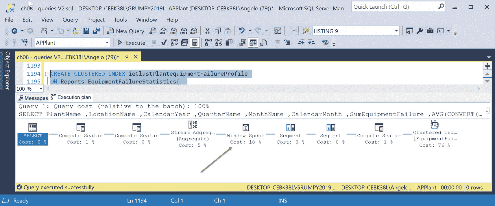
ch08 queries V 2 . sql 窗口的屏幕截图。顶部屏幕显示一些编程代码。底部屏幕显示查询 1 的消息和执行计划。窗口假脱机成本为 18%。

图 8-30：使用聚集索引的估计查询计划

这更糟了吗，还是并非如此？窗口假脱机的占比上升到了 18%，但排序步骤消失了。引入了一个成本为 76%的聚集索引扫描。

那么`IO`和`TIME`统计信息如何呢？请参考图 8-31。

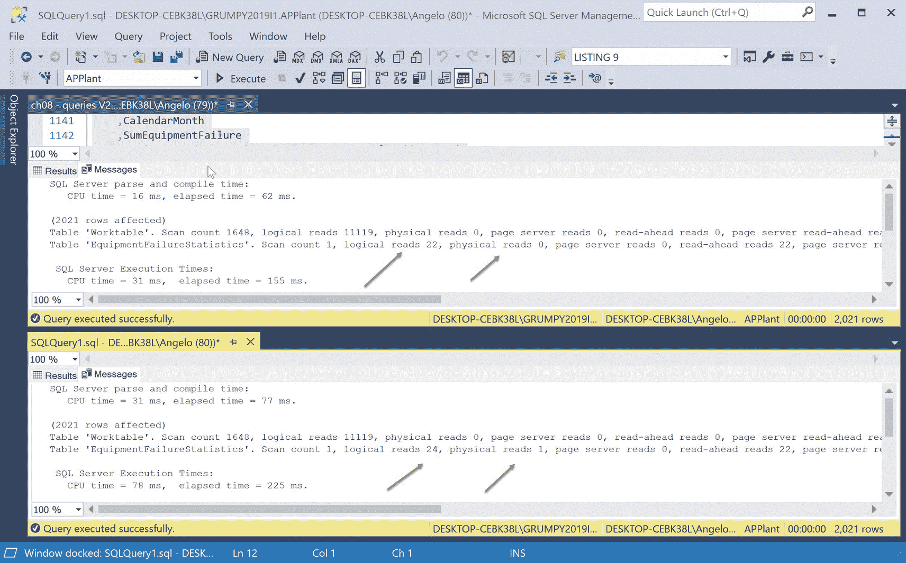
SQL Query 1 . sql 窗口的屏幕截图。顶部屏幕显示一些编程代码。两个子窗口比较显示，在计划执行后，逻辑读从 22 增加到 24，物理读从 0 增加到 1。

图 8-31：比较 IO 和 TIME 统计信息

哇，这里也没有改善。工作表上的统计信息保持不变，而使用聚集索引后，逻辑读和物理读略有上升。SQL Server 的执行时间在`CPU`时间和耗时上都增加了。这教会了我们什么？

如果有效，就不要去修改它。如果索引未被使用，就不要创建聚集索引或其他类型的索引。

## 内存优化表方法

好吧，我们前两次提升性能的尝试都没有产生令人印象深刻的结果。所以现在我们尝试内存优化表方法。回顾一下主要步骤：

*   为内存优化表创建一个文件组。
*   创建一个或多个文件并将它们分配给该文件组。
*   使用指令创建表，使其成为内存优化表。
*   加载内存优化表。
*   在查询中引用该表。

我建议你为前四个步骤保留一个模板脚本，以便快速为新的内存优化表创建所需的对象。

> **提示**
> 创建一个文件夹，存放你可能需要的模板，用于创建脚本、数据库对象，更不用说用于检索数据库对象元数据（如列出表中的列）的系统表查询。包括用于创建存储过程、函数和触发器的模板。

让我们看看代码。

### 创建文件与文件组

让我们从创建所需的文件组开始。请参考清单 8-20。

```sql
/************************************************/
/* CREATE FILE GROUP FOR MEMORY OPTIMIZED TABLE */
/************************************************/
ALTER DATABASE [APPlant]
ADD FILEGROUP AP_PLANT_MEM_FG
CONTAINS MEMORY_OPTIMIZED_DATA
GO
```
**清单 8-20**
步骤 1：为内存优化表创建文件组

这个`ALTER`命令与其他用于创建内存优化表的`ALTER`命令的唯一区别是我们添加了指令`CONTAINS MEMORY_OPTIMIZED_DATA`。

下一步是向文件组添加一个文件。请参考清单 8-21。

```sql
/*****************************************************/
/* ADD FILE TO FILE GROUP FOR MEMORY OPTIMIZED TABLE */
/*****************************************************/
ALTER DATABASE [APPlant]
ADD FILE
(
NAME = AP_PLANT_MEME_DATA,
FILENAME = 'D:\APRESS_DATABASES\AP_PLANT\MEM_DATA\AP_PLANT_MEM_DATA.NDF'
)
TO FILEGROUP AP_PLANT_MEM_FG
GO
```
**清单 8-21**
步骤 2：为内存优化表的文件组添加文件

这是一个标准的`ALTER DATABASE`命令，用于添加文件，但请注意它没有大小参数。这是与内存优化表关联的文件的一个特点。

两点说明：

> **问题**：如果表在内存中，为什么我们还要创建物理文件？
>
> **回答**：我们需要物理空间，以防内存用完，并且在服务器关闭时需要某个地方暂存数据。

确保`FILENAME`标识符指向你自己笔记本电脑或工作站上的驱动器。

> **问题**：如果我们需要存储在磁盘上的物理文件，应该使用什么？
>
> **回答**：如果管理层能负担得起价格，或者你能负担得起，请为这些类型的文件使用固态硬盘（SSD）。

下一步。

### 创建内存优化表

现在我们已经创建了文件组和一个文件，我们需要创建实际的内存优化表。请参考清单 8-22。

```sql
CREATE TABLE Reports.EquipmentFailureStatisticsMem(
CalendarYear               SMALLINT        NOT NULL,
QuarterName                VARCHAR(11)     NOT NULL,
MonthName                  VARCHAR(9)      NOT NULL,
CalendarMonth              SMALLINT        NOT NULL,
PlantName                  VARCHAR(64)     NOT NULL,
LocationName               VARCHAR(128)    NOT NULL,
EquipmentId                VARCHAR(8)      NOT NULL,
CountFailureEvents         INT             NOT NULL,
SumEquipmentFailure        INT             NOT NULL
INDEX [ieEquipFailStatMem]       NONCLUSTERED
(
PlantName     ASC,
LocationName  ASC,
CalendarYear  ASC,
CalendarMonth ASC,
EquipmentId   ASC
)
)WITH (MEMORY_OPTIMIZED = ON , DURABILITY = SCHEMA_ONLY )
GO
```
**清单 8-22**
步骤 3：创建内存优化表

该命令开始时像任何其他正常的`CREATE TABLE`命令，但我们需要指定一个非聚集索引，并添加使其成为内存优化表的指令。

### 加载内存优化表

现在我们已经创建了文件组、附加到文件组的一个文件以及内存优化表本身，我们需要加载实际的内存优化表。

请参考清单 8-23。

```sql
/***********************************/
/* LOAD THE MEMORY OPTIMIZED TABLE */
/***********************************/
TRUNCATE TABLE Reports.EquipmentFailureStatisticsMem
GO
INSERT INTO Reports.EquipmentFailureStatisticsMem
SELECT * FROM Reports.EquipmentFailureStatistics
GO
```
**清单 8-23**
步骤 4：加载内存优化表

这是一个标准的`INSERT`命令，从原始表中检索行并插入到新的内存优化表中。这种编码风格仅用于开发；记住`SELECT *`是不被推荐的。

最后，我不会展示查询的代码，因为它与我们在本节开头讨论的查询相同；我们只是将`FROM`子句中的表名改为

```sql
Reports.EquipmentFailureStatisticsMem
```


