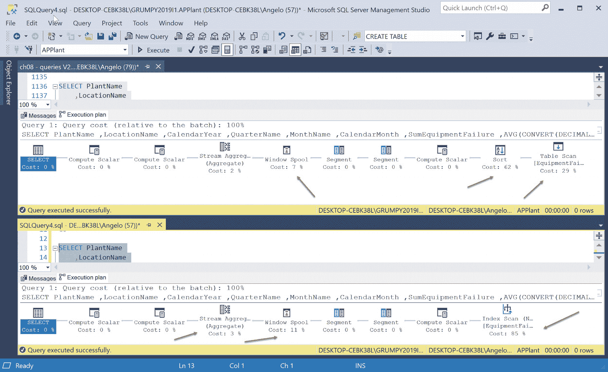
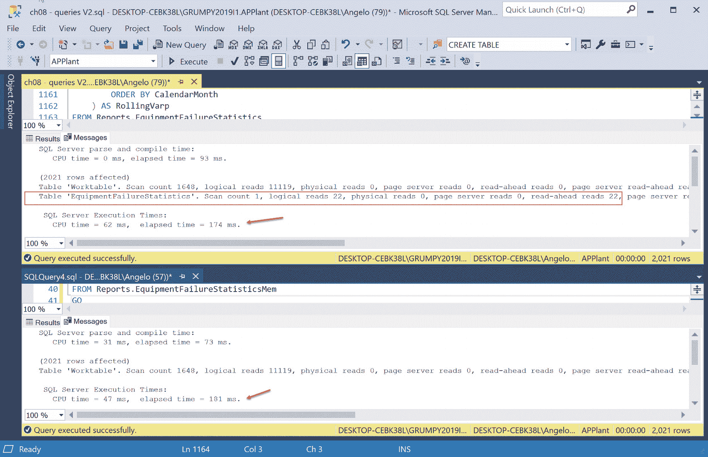
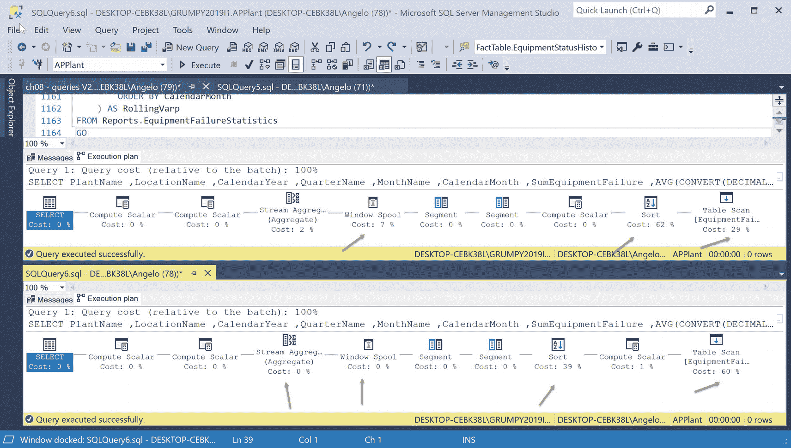
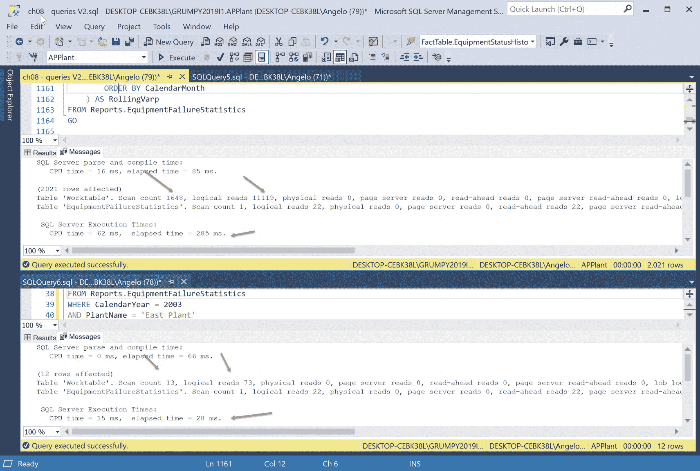
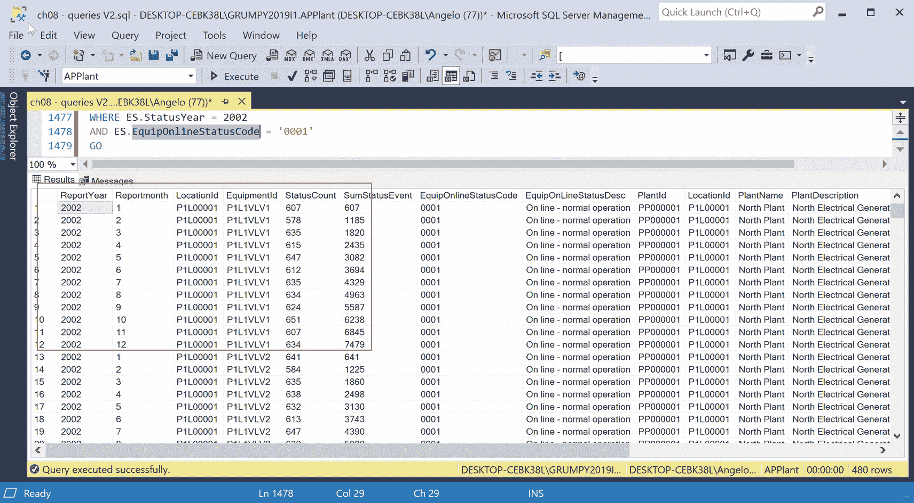
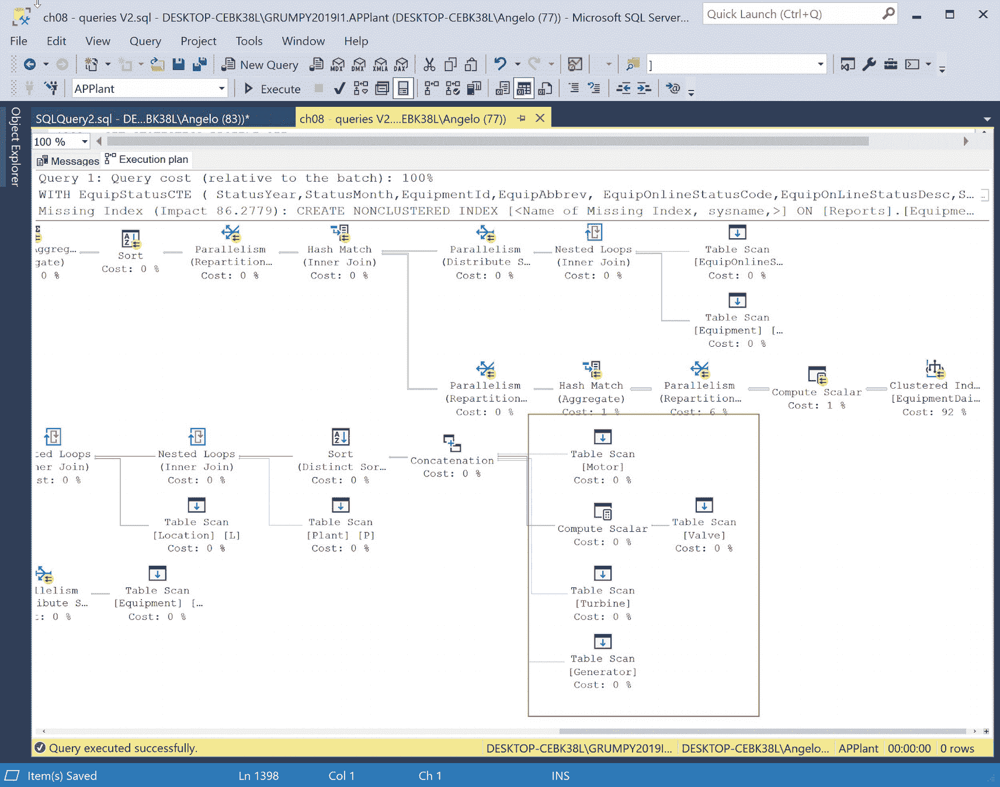
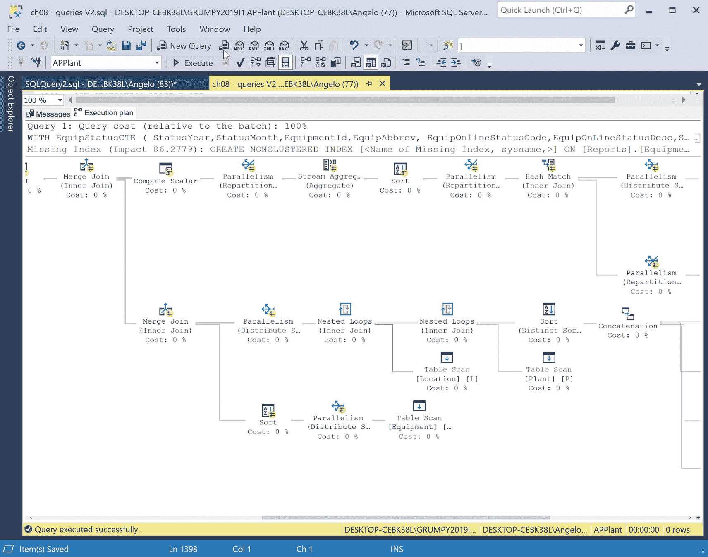
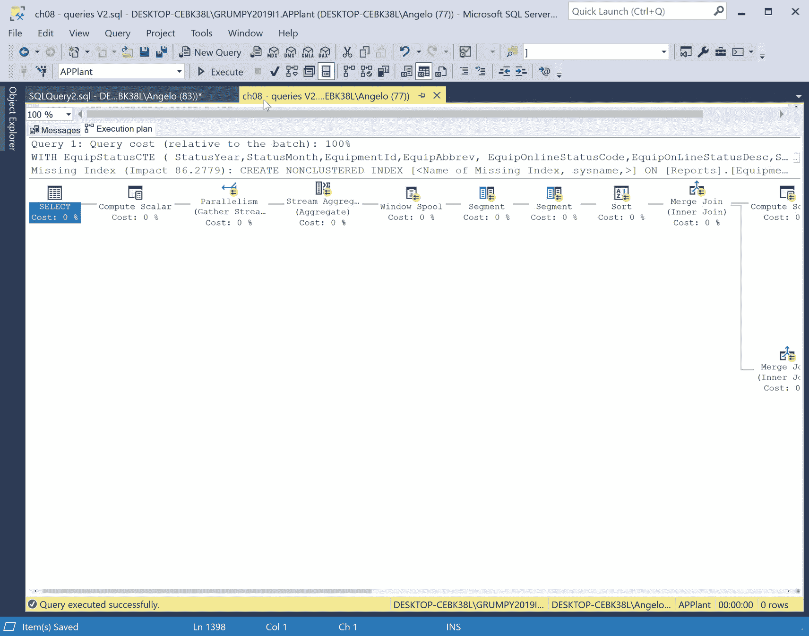
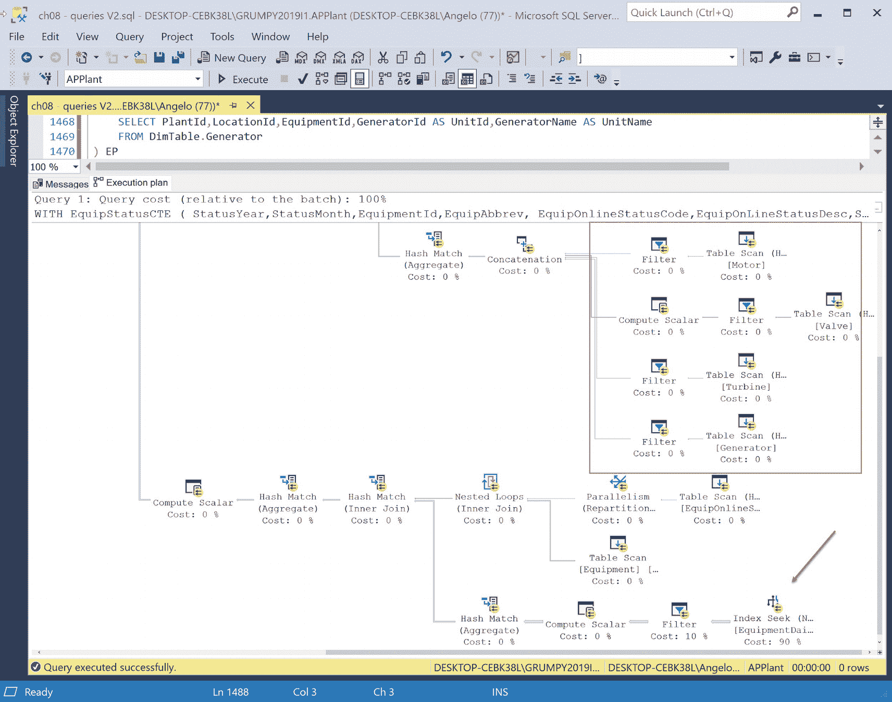
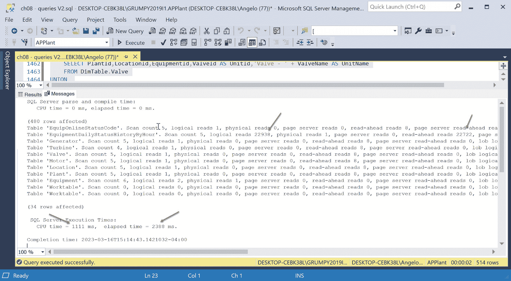

# 查询优化案例分析

## 估算查询计划

我们在 SSMS 的水平查询计划窗口中为两个查询生成了估算查询计划。这便于我们比较两个计划。

请参考图 8-32。



图 8-32：比较估算查询计划

第一个计划中的表扫描在内存优化表的计划中变成了索引扫描。排序步骤消失了，但请注意窗口假脱机任务。它的成本从 7%上升到了 31%。流聚合任务上升了 1%。

在做出判断之前，让我们先看看两个计划的成本统计。请参考表 8-8。

表 8-8：比较估算查询计划步骤成本

| 非内存优化 |   | 内存优化 |   |   |
| :--- | :--- | :--- | :--- | :--- |
| `步骤` | `成本` | `步骤` | `成本` | `注释` |
| 表扫描 | 29% | 索引扫描 | 85% | 用索引扫描替换了表扫描 |
| 排序 | 62% | 不适用 | 不适用 | 已消除 |
| 计算标量 | 0% | 计算标量 | 0% | 无变化 |
| 分段 | 0% | 分段 | 0% | 无变化 |
| 分段 | 0% | 分段 | 0% | 无变化 |
| 窗口假脱机 | 7% | 窗口假脱机 | 11% | 上升 |
| 流聚合 | 2% | 流聚合 | 3% | 上升 |
| 计算标量 | 0% | 计算标量 | 0% | 无变化 |
| 计算标量 | 0% | 计算标量 | 0% | 无变化 |
| SELECT | 0% | SELECT | 0% | 无变化 |

付出了大量工作，改进却不大。事实上，从性能提升的角度看，我们似乎还有点倒退。窗口假脱机成本上升了 3%，流聚合步骤的成本上升了 1%。虽然排序步骤被消除了，但我们有了一个索引扫描。

让我们看看两个查询的 `IO` 和 `TIME` 统计数据。请参考图 8-33。



图 8-33：比较两种策略的 IO 和 TIME 统计

> **提示：** 此类分析应执行多次，每次使用 `DBCC` 清除内存缓存，以确保结果一致。

结论是：做了这么多工作，提升却不大，因此这个场景也不是内存优化表的合适候选。

最后一个要讨论的问题是：我们最初的查询返回了所有行，这通常不是个好主意。没有人能分析结果集中的数千行。理想的策略是编写使用 `WHERE` 子句过滤器的查询，以减少结果数量并让索引充分发挥作用。

我们回去找分析师，并获得了通过过滤数据来缩小数据范围的批准。我们说服了分析师，承诺通过 SSRS 报告访问查询，该报告允许他们通过网页报告页面中的下拉列表框选择年份、工厂和位置。

我通过添加以下 `WHERE` 子句修改了查询：

```sql
WHERE CalendarYear = 2003
AND PlantName = 'East Plant'
AND LocationName = 'Boiler Room'
GO
```

看看估算查询计划发生了什么变化；顶部的计划是原始估算查询计划。请参考图 8-34。



图 8-34：引入 WHERE 子句后比较查询计划

以下是我们的分析：

- 表扫描成本从 29%上升到 60%。
- 排序步骤成本从 62%下降到 39%。
- 窗口假脱机步骤成本从 7%下降到 0%。
- 流聚合成本从 2%下降到 0%。

所以，看起来像添加 `WHERE` 子句这样简单的查询更改，比所有索引和内存优化表带来了更多的性能提升！

总之，当业务分析师向你提供业务需求时，多提问和协商总没有坏处。也许你可以建议改进，比如添加过滤器等，这会使查询结果更易于使用并提高性能。务必询问报告的使用方式和使用者。

在开始漫长的编码和测试之旅（例如在小表上创建索引，更糟糕的是创建内存优化表）之前，请先这样做。毕竟，内存是有限的资源。如果你用内存优化表堵塞它，最终会耗尽！

最后但同样重要的是 `IO` 和 `TIME` 统计数据。你会喜欢这些的；原始查询统计信息位于截图的顶部。请参考图 8-35。



图 8-35：比较 IO 和 TIME 统计

看起来这些统计数据也有所改善。让我们来看一下。

请参考表 8-9。

表 8-9：IO 和时间统计数据并排对比

|   | 原始 | 使用 WHERE |
| :--- | :--- | :--- |
| `统计项` | `IO` | `IO` |
| 工作表 |   |   |
| 扫描计数 | 1648 | 13 |
| 逻辑读取 | 11119 | 73 |
| 预读 | 0 | 0 |
| 设备故障表 |   |   |
| 扫描计数 | 1 | 1 |
| 逻辑读取 | 22 | 22 |
| 预读 | 22 | 22 |
|   | `时间` | `时间` |
| 解析 CPU | 16 ms | 0 ms |
| 解析耗时 | 85 ms | 66 ms |
| 执行 CPU | 62 ms | 15 ms |
| 执行耗时 | 285 ms | 28 ms |

结果非常有趣。`EquipmentFailureStatistics` 报告表的 `IO` 统计数据在两个查询中保持不变。但当我们查看两个查询的工作表统计数据时，存在显著差异：

- 在带有 `WHERE` 子句的查询版本中，扫描计数从 1,648 次降到了 13 次。
- 在带有 `WHERE` 子句的查询中，逻辑读取次数从 11,119 次降到了 73 次。
- 两个版本的查询中，预读次数都保持为 0。

最后，让我们看看两个查询的 `CPU` 和用时：

- 在带有 `WHERE` 子句的查询中，解析 `CPU` 时间从 16 毫秒降到了 0 毫秒。
- 在带有 `WHERE` 子句的查询中，解析用时从 85 毫秒降到了 66 毫秒。
- 在带有 `WHERE` 子句的查询中，执行 `CPU` 时间从 62 毫秒降到了 15 毫秒。
- 在带有 `WHERE` 子句的查询中，执行用时从 285 毫秒降到了 28 毫秒。

看起来添加 `WHERE` 子句显著提升了性能。这是合理的，因为我们处理的结果集更小了。

修改查询是我们在性能分析会议中需要考虑的另一种技术。没有 `WHERE` 子句的那个表扫描真的有必要吗？

## 七百万行查询：性能调优

让我们再看一个查询。我们一直在中小型表上编写查询。这让我们得以学习和解读估计的查询计划及各种统计数据。让我们尝试一个超过七百万行的表，看看查询计划是什么样的！创建和加载此表的代码位于本章的文件夹中，文件名为

> “ch08 – load large equipment status history.sql”

在创建此查询时，我发现 `APPlant` 数据库中存在一个设计缺陷。我并非有意为之，但我利用它化弊为利。

我是什么意思？

我发现这是一个机会，可以讨论有时你收到的查询需求，除非你找到迂回的方式来连接所有需要的表，否则无法满足。在你进行迂回的试错过程中，你意识到数据库设计存在缺陷。某些东西缺失了。你让查询得以运行，但在性能方面表现不佳，并且你必须检查是否引入了诸如重复项之类的数据异常。

具体来说，我发现我的设计无法直接将 `Equipment` 表链接到 `Location` 表。数据库的设计方式是，需要将 `Equipment` 表链接到 `Valve`、`Motor`、`Turbine` 或 `Generator` 表之一，然后才能将它们链接到 `Location` 表。修复方案稍后揭晓。

让我们先看看变通方法。

这是采用变通方法的查询初稿。该查询基于一个 `CTE`，因此我将讨论分为两部分。

`CTE` 块请参阅清单 8-24。

```sql
WITH EquipStatusCTE (
    StatusYear,StatusMonth,EquipmentId,EquipAbbrev,
    EquipOnlineStatusCode,EquipOnLineStatusDesc,StatusCount
)
AS (
    SELECT YEAR(ESBH.CalendarDate) AS StatusYear
          ,MONTH(ESBH.CalendarDate) AS StatusMonth
          ,ESBH.EquipmentId
          ,E.EquipAbbrev
          ,ESBH.EquipOnLineStatusCode
          ,EOLSC.EquipOnLineStatusDesc
          ,COUNT(*) AS StatusCount
    FROM Reports.EquipmentDailyStatusHistoryByHour ESBH
    JOIN DimTable.Equipment E
        ON ESBH.EquipmentId = E.EquipmentId
    JOIN DimTable.EquipOnlineStatusCode EOLSC
        ON ESBH.EquipOnLineStatusCode = EOLSC.EquipOnlineStatusCode
    GROUP BY YEAR(ESBH.CalendarDate)
            ,MONTH(ESBH.CalendarDate)
            ,ESBH.EquipmentId
            ,E.EquipAbbrev
            ,ESBH.EquipOnLineStatusCode
            ,EOLSC.EquipOnLineStatusDesc
)
```

清单 8-24
七百万行窗口聚合查询

如我们所见，我们将两个维度表连接到一个名为 `Reports.EquipmentDailyStatusHistoryByHour` 的非规范化报告表。我们想要统计的是用于识别设备是在线还是因维护或故障而离线的状态码数量。包含了一些标准的报告列，如年份、月份、设备 ID、缩写（设备类型）、状态码和描述。

由于我们使用的是不带 `OVER()` 子句的 `COUNT()` 函数，因此需要包含一个 `GROUP BY` 子句。这会增加处理时间。

接下来是查询部分。这里是通过一系列嵌套在构成内联表的查询中的 `UNION` 查询块，来解决获取设备位置的变通方法。

请参阅清单 8-25。

```sql
SELECT ES.StatusYear AS ReportYear
      ,ES.StatusMonth AS Reportmonth
      ,EP.LocationId
      ,ES.EquipmentId
      ,StatusCount
      ,SUM(StatusCount) OVER(
           PARTITION BY ES.EquipmentId,ES.StatusYear
           ORDER BY ES.EquipmentId,ES.StatusYear,ES.StatusMonth
       ) AS SumStatusEvent
      ,ES.EquipOnlineStatusCode
      ,ES.EquipOnLineStatusDesc
      ,EP.PlantId
      ,L.LocationId
      ,P.PlantName
      ,P.PlantDescription
      ,ES.EquipAbbrev
      ,EP.UnitId
      ,EP.UnitName
      ,E.SerialNo
FROM EquipStatusCTE ES
INNER JOIN DimTable.Equipment E
    ON ES.EquipmentId = E.EquipmentId
INNER JOIN (
    SELECT PlantId,LocationId,EquipmentId,MotorId AS UnitId,
           MotorName AS UnitName
    FROM DimTable.Motor
    UNION
    SELECT PlantId,LocationId,EquipmentId,ValveId AS UnitId,
           'Valve - ' + ValveName AS UnitName
    FROM DimTable.Valve
    UNION
    SELECT PlantId,LocationId,EquipmentId,TurbineId AS UnitId,
           TurbineName AS UnitName
    FROM DimTable.Turbine
    UNION
    SELECT PlantId,LocationId,EquipmentId,
           GeneratorId AS UnitId,GeneratorName AS UnitName
    FROM DimTable.Generator
) EP
    ON ES.EquipmentId = EP.EquipmentId
INNER JOIN DimTable.Plant P
    ON EP.PlantId = P.PlantId
INNER JOIN DimTable.Location L
    ON EP.PlantId = L.PlantId
   AND EP.LocationId = L.LocationId
WHERE ES.StatusYear = 2002
  AND ES.EquipOnlineStatusCode = '0001'
GO
```

清单 8-25
设备状态码总计汇总查询

是的，它很混乱！

首先，我们使用带 `OVER()` 子句的 `SUM()` 聚合函数来设置滚动计算。分区由设备 ID 和状态定义。`ORDER BY` 子句定义了按设备 ID、状态年份和状态月份列进行处理的逻辑顺序（可以这么说，`ORDER BY` 子句按实现所需结果所需的顺序对行进行排序）。

现在说说变通方法。在 `FROM` 子句中，我通过三个 `UNION` 块检索所需列，定义了一个内联表，以将设备链接到正确的工厂和位置。这些查询从 `Motor`、`Valve`、`Turbine` 和 `Generator` 表中检索所需的列。

结果被赋予别名 `EP`，在 `FROM` 子句中用于通过 `EquipmentId` 列将其他表连接到此内联表。虽然不美观，但它有效。但速度如何？

这就是设计缺陷。应该有一个关联表或维度表来存储这些数据，这样就不必在每次运行此查询时都重新组装。我们很快就会修复它。

让我们看看此查询的结果。部分结果请参见图 8-36。



ch08 queries V 2 dot sql 窗口的截图。顶部屏幕显示一些程序代码。底部屏幕呈现结果表。该表有 9 列。报告年份、报告月份、位置 I D、状态计数和状态事件总和列被高亮显示。

图 8-36
按月滚动的设备状态摘要

看起来滚动汇总在工作。快速检查显示滚动汇总有效：前两个月的故障数分别是 607 + 578 = 1185。当设备 ID 变更时，一月份的故障数会重置，滚动过程重新开始。

重要的列放在前面，因此你可以看到年份和月份信息、位置和设备 ID，然后是计数和滚动摘要，详细列紧随其后。

此查询耗时两秒运行。考虑到我们是在笔记本电脑上对一张超过七百万行的表进行查询，表现不错。

让我们看看基线查询计划；它会很大。请参考下面的三张图，以便我们理解估计的执行计划和流程。

请参阅图 8-37。



ch08 queries V 2 dot sql 窗口的截图。顶部屏幕显示一些程序代码。底部屏幕显示查询 1 的消息和执行计划。表扫描成本 0%，计算标量成本 0%。


### 图 8-37：估计的查询计划 – 第 1 部分

注意这里使用了聚簇索引扫描。其开销占比达到了 92%，因此大部分工作都是在这里完成的。注意 `Valve`、`Motor`、`Generator` 和 `Turbine` 这几个表的表扫描。它们的开销都是 0%。这些都是小表，所以没有性能问题。这里有很多表扫描和排序操作，但似乎所有这些开销都是 0。让我们看看计划的下一部分。

请参考图 8-38。



ch08 queries V 2 . sql 窗口的截图。屏幕上显示了查询 1 的消息和执行计划。Compute scalar, parallelism, stream aggregate, window spool, segment, sort, merge join, hash match, concatenation，所有这些开销均为 0%。

### 图 8-38：估计的基线执行计划，第 2 部分

顺便说一下，我称其为基线执行计划，因为它是我们生成和分析的第一个计划，这样我们可以提出一些增强建议来提高性能。然后我们生成另一个估计执行计划，来看看我们的增强是否有效。

到目前为止，我们大致了解了这些任务是什么，尽管流程看起来非常复杂，有多个包含排序、嵌套循环联接、并行化和其他任务的分支，但它们的开销都是 0%。

有不同的任务来合并流程，比如哈希匹配联接、串联和合并联接。

让我们看看计划的最后一部分。请参考图 8-39。



c h 08 queries V 2 . s q l 窗口的截图。屏幕上显示了查询 1 的消息和执行计划。Select, compute scalar, parallelism, stream aggregate, window spool, segment, sort, merge join，所有开销均为 0%。

### 图 8-39：估计的查询计划，第 3 部分

计划的最后一部分是单流和分支。我们敢说最左边的部分是主干，随着它向右流动，我们会遇到各个分支吗？就像一个倒置的树结构。

回到现实，我差点忘了这个估计执行计划正在建议一个索引。虽然我们确实使用了聚簇索引，但它并没有完成工作。让我们看看清单 8-26 中的索引是什么样子的。

```
/*
Missing Index Details from SQLQuery7.sql - DESKTOP-CEBK38L\GRUMPY2019I1.APPlant (DESKTOP-CEBK38L\Angelo (54))
The Query Processor estimates that implementing the following index could improve the query cost by 88.1301%.
*/
DROP INDEX IF EXISTS ieEquipOnlineStatusCode
ON Reports.EquipmentDailyStatusHistoryByHour
GO
CREATE NONCLUSTERED INDEX ieEquipOnlineStatusCode
ON Reports.EquipmentDailyStatusHistoryByHour(EquipOnlineStatusCode)
GO
Listing 8-26
建议的索引
```

如果我们创建这个索引，它声称执行性能将提升 86.27%。听起来不错。让我们试一试。

我们复制并粘贴建议的索引模板，给它一个名字，然后执行。（我添加了 `DROP INDEX` 代码，以防你在试验查询计划时需要创建、删除和重新创建索引。）现在我们生成第二个估计查询计划。

请参考图 8-40。



c0h08 queries V 2 . sql 窗口的截图。顶部屏幕有一些程序代码。底部屏幕显示了查询 1 的消息和执行计划。Filter, table scan, compute scalar 开销均为 0%，而 index seek 开销为 90%。

### 图 8-40：更新后的估计查询计划

注意，聚簇索引扫描已被新索引上的索引查找任务所取代。记住，查找比扫描更好，对吧？不过，我们仍然对 `Valve`、`Motor`、`Turbine` 和 `Generator` 这四个表进行了表扫描（顺便说一下，查询运行了两秒钟）。

这个查询生成了一组有趣的 `IO` 和 `TIME` 统计数据。请参考图 8-41。



ch08 queries V 2 . sql 窗口的截图。顶部屏幕有一些程序代码。底部屏幕展示了一些数据。逻辑读取 22938，预读取 22722，C P U 时间 1111 毫秒，已用时间 2388 毫秒。

### 图 8-41：IO 和 TIME 统计数据

我不会逐一分析所有结果，但请注意，物理表的逻辑读取达到 22,958，预读取达到 22,722。最后，CPU 执行时间为 1111 毫秒，已用时间为 2388 毫秒。

这是一个很大的表，你能做的提高性能的唯一事情就是将表创建为分区表，将年份分布在多个物理磁盘或 SAN 上的 LUN 上。当你处理数百万行或更多数据时，这几乎是管理性能的唯一方法！当数据可以按年份拆分时，这个策略效果很好，一年一个磁盘。

接下来，我们通过创建和加载一个关联表来纠正设计缺陷，该表将设备与工厂和位置关联起来。我们可以将其视为一个维度表，因为它可以直接与事实表一起使用，也可以用来链接另外两个维度。请参考清单 8-27。

```
DROP TABLE IF EXISTS [DimTable].[PlantEquipLocation]
GO
CREATE TABLE [DimTable].PlantEquipLocation NOT NULL,
[LocationId]  varchar NOT NULL,
[EquipmentId] varchar NOT NULL,
[UnitId]      varchar NOT NULL,
[UnitName]    varchar NOT NULL
) ON [AP_PLANT_FG]
GO
TRUNCATE TABLE DIMTable.PlantEquipLocation
GO
INSERT INTO DIMTable.PlantEquipLocation
SELECT MotorKey AS EquipmentKey,PlantId,LocationId,EquipmentId,
MotorId AS UnitId,MotorName AS UnitName
FROM DimTable.Motor
UNION
SELECT ValveKey AS EquipmentKey,PlantId,LocationId,EquipmentId,
ValveId AS UnitId,'Valve - ' + ValveName AS UnitName
FROM DimTable.Valve
UNION
SELECT TurbineKey AS EquipmentKey,PlantId,LocationId,EquipmentId,
TurbineId AS UnitId,TurbineName AS UnitName
FROM DimTable.Turbine
UNION
SELECT GeneratorKey AS EquipmentKey,PlantId,LocationId,EquipmentId,
GeneratorId AS UnitId,GeneratorName AS UnitName
FROM DimTable.Generator
GO
Listing 8-27
创建并加载关联维度
```

该脚本包含用于创建表的 `DDL` 命令以及加载该表所需的 `INSERT/SELECT` 语句。`SELECT` 语句只是四个通过 `UNION` 操作符连接的查询，用于加载将设备 ID 链接到工厂和位置所需的列。

因此，在编写查询以满足业务分析师或其他用户需求时，解决设计问题或增强数据库设计的机会就会浮现。始终寻找更好、更高效、更简单的方法来实现目标。

复杂、难以阅读的代码可能会让你的经理和朋友印象深刻，但能完成工作的简单代码会让你的用户感到高兴。毕竟，这才是最重要的。好了，我不再高谈阔论了。

作为家庭作业，修改我们刚刚讨论的查询，在 `FROM` 子句中用这个表的名称替换 `UNION` 代码块。重新运行估计查询计划以及 `IO` 和 `TIME` 统计数据，看看通过这种设计增强，性能是否有任何改进。

另外，提取 `CTE` 代码并用它构建一个报表表。针对报表表运行带有聚合函数的查询。有性能改进吗？

估计查询计划和 `TIME/IO` 统计数据显示了什么？

我在本章的脚本中包含了这项家庭作业的代码。首先自己尝试一下，如果遇到困难再查看代码。此修订版的估计查询计划与之前截然不同，而且更简短。


### 总结

希望您觉得本章内容有趣。我们在一个工厂工程数据仓库场景中全面实践了聚合函数。在此过程中，我们进行了一些详细且有趣的性能分析，不仅发现了改进查询以提升性能的机会，还发现了数据库中的一个设计缺陷。

不，我并非故意为之。我确实犯了一个设计错误，但这恰好是一个很好的机会，可以展示在真实开发环境中此类事情确实会发生，并且它不仅提供了修复设计的机会，更是改进设计的契机。

最后，我们还创建了其他一些设计产物，例如数据字典，它们帮助我们理解数据库中的内容，从而在创建查询时，我们能理解数据的语义以及表之间的关系。

接下来看第 9 章！

