# 9. 工厂用例：排名函数

在本章中，我们将使用排名窗口函数对电厂数据库进行一些分析。虽然只有四个函数，但我们会像往常一样检查性能，并创建一些 Microsoft Excel 数据透视表和图表，将我们的分析提升到更高层次。

我们的查询性能分析将利用之前章节中使用的大部分工具，并将展示一个导致我们走上错误道路的示例，我们会对其进行修正。

有时，当您在没有适当设计考虑的情况下进行编码时，可能会选择一种您认为合理的方法，结果却发现，如果当时能仔细思考，本有一种更简单的解决方案来满足编码需求。

有时，最简单的解决方案就是最好的！

## 排名函数

以下是这四个函数。希望这不是您第一次见到它们，因为我们在之前的章节中已经介绍过。如果您需要复习该主题，请查看附录 A，其中详细描述了每个函数：

* `RANK()`
* `DENSE_RANK()`
* `NTILE()`
* `ROW_NUMBER()`

前两个函数类似，它们都用于对结果进行排名，不同之处在于它们对重复值和后续排名的处理方式不同。当您试图解决需要对结果进行排名的问题时，请考虑这一点。

### RANK( ) 函数

回顾一下，`RANK()` 函数根据要排名的值，返回当前行之前的行数加上当前行。让我们看看业务分析师的需求是什么：

需要一份报告，按工厂、地点、年份、季度和月份对设备故障数量进行排名。报告需要按降序排列，且仅针对 2008 年。报告查询需要易于修改，以便将来能在结果中包含更多年份。

这是一个简单的查询，因此我们将从使用 `CTE` 方法开始。

请参见清单 9-1。

```
WITH FailedEquipmentCount
(
CalendarYear, QuarterName,[MonthName], CalendarMonth, PlantName, LocationName, SumEquipFailures
)
AS (
SELECT
C.CalendarYear
,C.QuarterName
,C.[MonthName]
,C.CalendarMonth
,P.PlantName
,L.LocationName
,SUM(EF.Failure) AS SumEquipFailures
FROM DimTable.CalendarView C
JOIN FactTable.EquipmentFailure EF
ON C.CalendarKey = EF.CalendarKey
JOIN DimTable.Equipment E
ON EF.EquipmentKey = E.EquipmentKey
JOIN DimTable.Location L
ON L.LocationKey = EF.LocationKey
JOIN DimTable.Plant P
ON L.PlantId = P.PlantId
GROUP BY
C.CalendarYear
,C.QuarterName
,C.[MonthName]
,C.CalendarMonth
,P.PlantName
,L.LocationName
)
SELECT
PlantName
,LocationName
,CalendarYear
,QuarterName
,[MonthName]
,SumEquipFailures
RANK() OVER (
PARTITION BY PlantName,LocationName
ORDER BY SumEquipFailures DESC
) AS FailureRank
FROM FailedEquipmentCount
WHERE CalendarYear = 2008
GO
清单 9-1
对设备故障总数进行排名
```

`CTE` 逻辑有点复杂。这里使用了 `星型（STAR）` 查询方法，需要通过四个 `JOIN` 谓词连接五个维度表。注意这里使用了代理键，并且我们连接到 `CalendarView` 视图而不是日历维度表，以便可以提取日期对象的一些名称。

注意

在代理键上执行连接比在具有字母数字数据类型的生产键上执行连接更快。整数连接更快。

使用了 `SUM()` 聚合函数来汇总故障总数，并且包含了必需的 `GROUP BY` 子句。

查看 `OVER()` 子句，通过工厂名称和地点名称设置了分区。年份未包含在分区定义中，因为我们的 `WHERE` 子句仅筛选出 2008 年的结果。要在结果中包含更多年份，请不要忘记在 `PARTITION BY` 子句中添加年份。

最后，注意 `ORDER BY` 子句将结果按 `DESC`（降序）排序。也就是说，它指定在分区内按 `SumEquipFailures` 列降序处理结果。

让我们看看结果是什么样子。

请参见图 9-1 中的部分结果。

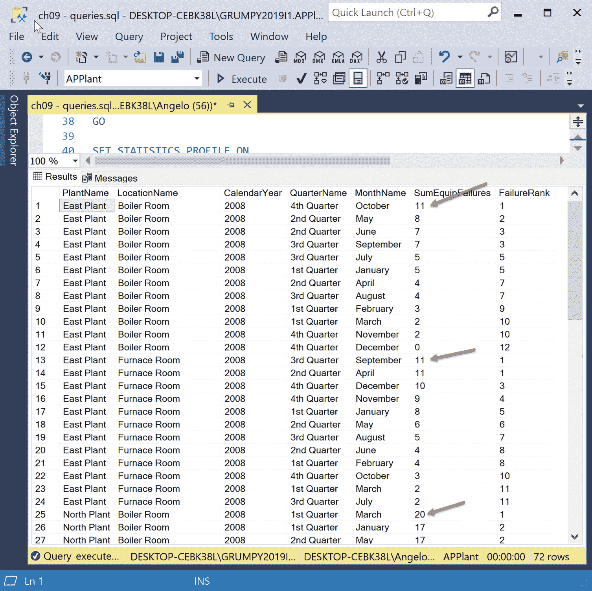

一张截图展示了一个表格。列标题为：工厂名称、地点名称、日历年、季度名称、月份名称、设备故障总和、故障排名。箭头指向 2008 年 10 月、9 月的故障排名 11 和 3 月的 20。

图 9-1

按年份和地点划分的故障排名

查看锅炉房的结果，就故障而言，10 月似乎是排名第一的月份，因此需要对此进行调查。我们的分析师需要查看是哪台或哪些设备故障最多。

对于锅炉房，看起来有并列情况。9 月和 4 月是锅炉房设备故障最严重的月份。

让我们将结果制成图表，以直观地展示 2008 年的排名情况。

请参见图 9-2。

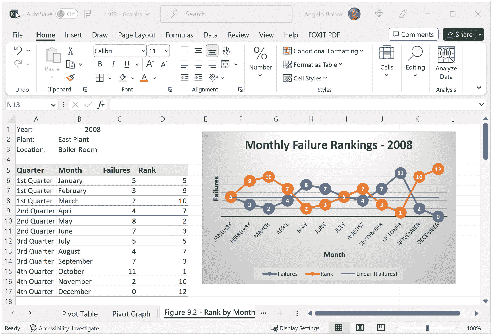

一张截图展示了一个表格和一个折线图。列标题为：季度、月份、故障、排名。故障与月份的折线图展示了故障、排名和线性故障的趋势。

图 9-2

2008 年月度故障情况

这似乎是一个不错的图表，因为它清楚地显示了按月份的排名以及故障数量。我们的分析师会满意的。

性能如何？让我们通过使用工具箱中可用的工具进行常规分析，来看看这个查询的表现如何。

### 性能注意事项

我们以常规方式生成了基线估计的查询性能计划。这个计划很大。

请参考图 9-3。

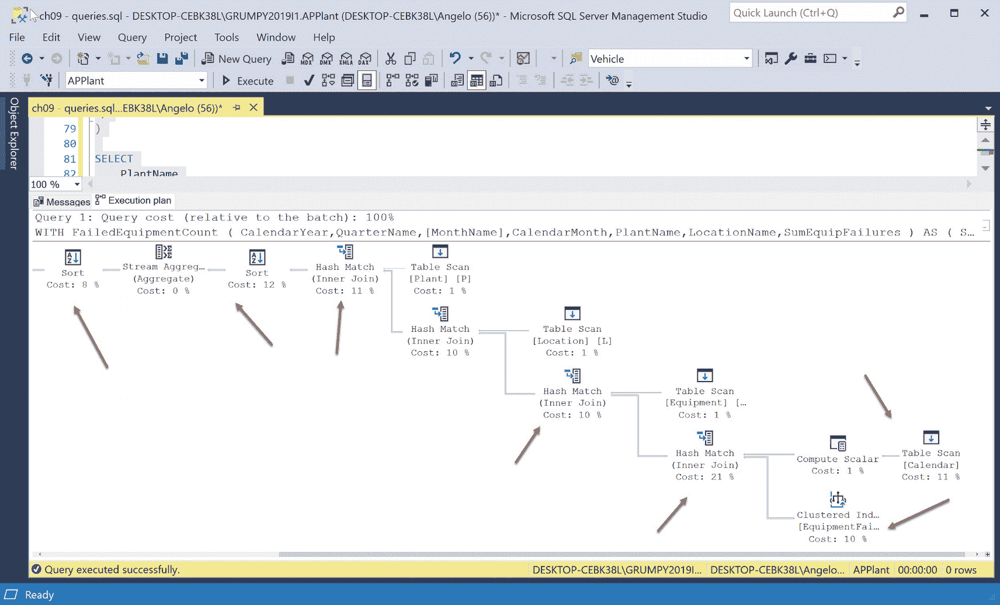

图 9-3 基线估计的查询计划

我们首先能看到的是没有建议使用索引。我们看到一个成本为 10%的聚集索引扫描，以及五个表扫描，每个表扫描的成本为 1%，除了`Calendar`表上的表扫描成本为 11%。

看起来所有的行流都是通过一系列成本从 21%到 10%不等的哈希匹配连接在一起的。随后是一个成本为 12%的排序任务，接着是成本为 0%的流聚合任务，然后是一个成本为 8%的排序步骤。计划中其余的任务成本均为 0%。

由于这是一个处理历史数据的查询，我们可以得出结论，我们可以用在几个示例中使用的报告表策略替换`CTE`部分。

让我们看一下`IO`和`TIME`统计信息。

请参考图 9-4。

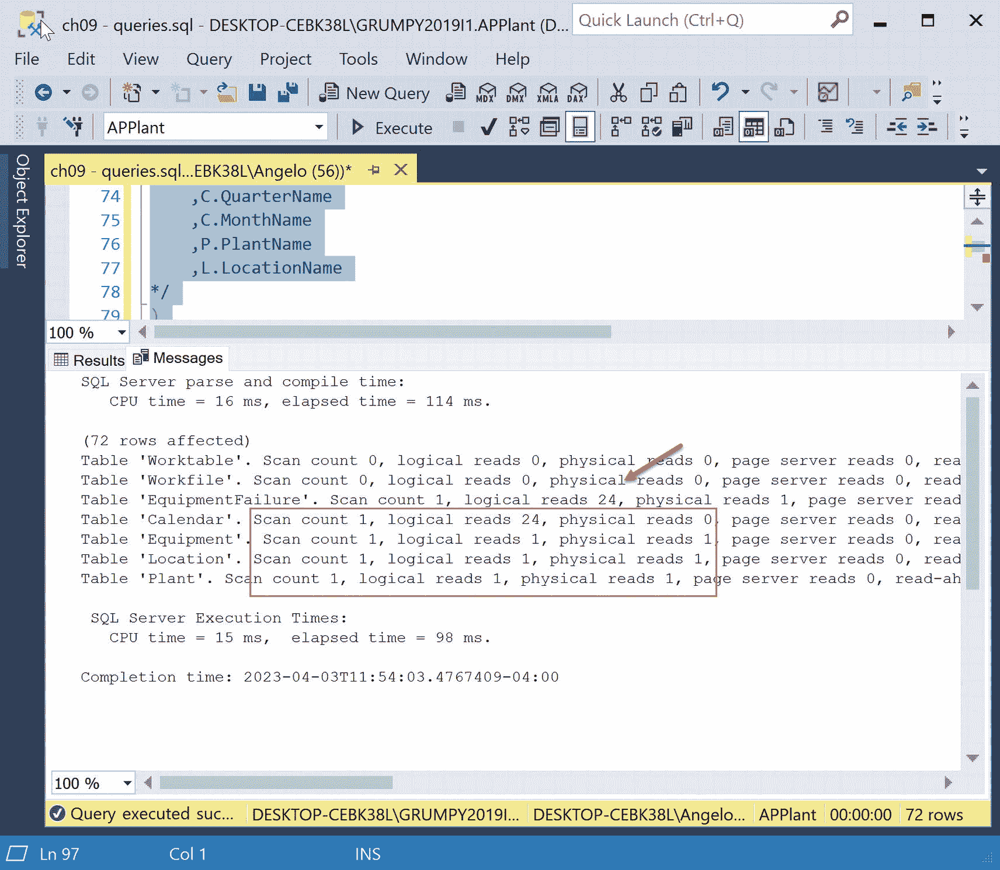

图 9-4 IO 和 TIME 统计信息

物理表上的扫描计数值为 1，而`EquipmentFailure`事实表和`Calendar`维度表上的逻辑读取值为 24。`STAR`查询中使用的其余维度表的逻辑读取值为 1，除`Calendar`维度外，所有事实表和维度表的物理读取值均为 1。

SQL 执行的经过时间为 98 毫秒。

让我们看一个访问包含超过 30,000 行的表的查询，看看我们能得到什么样的性能。这个查询与之前的查询类似，但我们在`SELECT`子句中添加了更多列以生成更详细的报告。

我们将仅过滤出 2002 年和设备状态码为“0001”的行，以限制报告的大小。

请参考代码清单 9-2。

```sql
SELECT ES.StatusYear AS ReportYear
,ES.StatusMonth AS Reportmonth
,CASE
WHEN ES.StatusMonth = 1 THEN 'Jan'
WHEN ES.StatusMonth = 2 THEN 'Feb'
WHEN ES.StatusMonth = 3 THEN 'Mar'
WHEN ES.StatusMonth = 4 THEN 'Apr'
WHEN ES.StatusMonth = 5 THEN 'May'
WHEN ES.StatusMonth = 6 THEN 'Jun'
WHEN ES.StatusMonth = 7 THEN 'Jul'
WHEN ES.StatusMonth = 8 THEN 'Aug'
WHEN ES.StatusMonth = 9 THEN 'Sep'
WHEN ES.StatusMonth = 10 THEN 'Oct'
WHEN ES.StatusMonth = 11 THEN 'Nov'
WHEN ES.StatusMonth = 12 THEN 'Dec'
END AS MonthName
,EP.LocationId
,L.LocationName
,ES.EquipmentId
,StatusCount
,RANK() OVER(
PARTITION BY ES.EquipmentId --,ES.StatusYear
ORDER BY ES.EquipmentId ASC,ES.StatusYear ASC,StatusCount DESC
) AS NoFailureRank
,ES.EquipOnlineStatusCode
,ES.EquipOnLineStatusDesc
,EP.PlantId
,P.PlantName
,P.PlantDescription
,ES.EquipAbbrev
,EP.UnitId
,EP.UnitName
,E.SerialNo
FROM Reports.EquipmentRollingMonthlyHourTotals ES -- 30,000 rows plus
INNER JOIN DimTable.Equipment E
ON ES.EquipmentId = E.EquipmentId
INNER JOIN [DimTable].[PlantEquipLocation] EP
ON ES.EquipmentId = EP.EquipmentId
INNER JOIN DimTable.Plant P
ON EP.PlantId = P.PlantId
INNER JOIN DimTable.Location L
ON EP.PlantId = L.PlantId
AND EP.LocationId = L.LocationId
WHERE ES.StatusYear = 2002
AND ES.EquipOnlineStatusCode = '0001'
GO
```

代码清单 9-2 在大表上执行排名

我们看到包含了一个`CASE`代码块来生成月份名称，并且我们将大的报告表连接到了四个维度表。为了限制报告的大小，我们只想查看在线状态码为“0001”的设备的排名。这代表“在线 – 正常运行”。

我们也想查看 2002 日历年的数据，所以注意`OVER()`子句中的`PARTITION BY`子句里的年份列被注释掉了。如果你想要更多年份，只需将其注释掉并修改`WHERE`子句的过滤条件即可。

让我们看看结果。

请参考图 9-5。

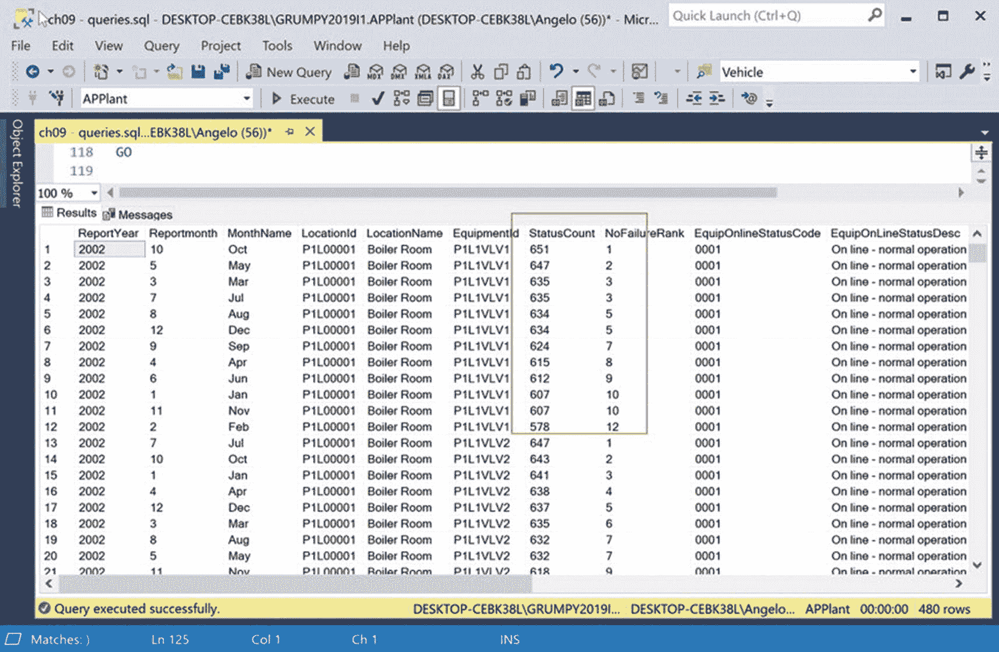

图 9-5 2002 年故障排名

如图所示，对于工厂`PL00001`（即北厂）锅炉房的设备而言，2002 年 10 月是设备在线的最佳月份。所讨论的设备是阀门`P1L1VLV1`。这是一个很大的报告，因此它是数据透视表的理想候选，你可以使用过滤器来缩小分析设备的范围并改变它！

请参考图 9-6。

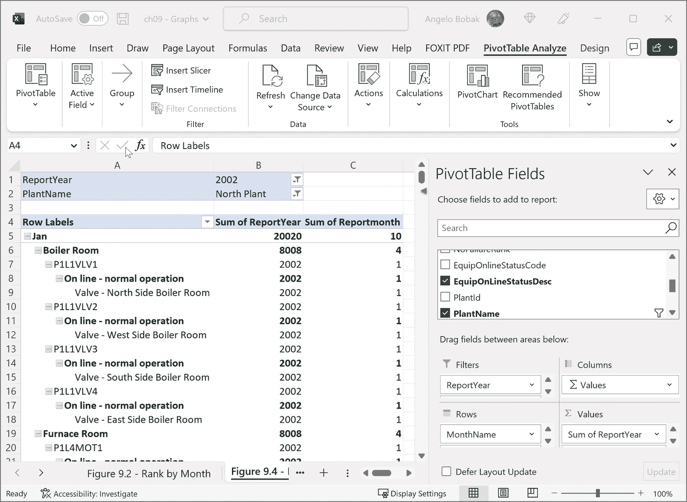

图 9-6 详细的工厂在线状态数据透视表

这种方式灵活且强大得多，因为我们可以对结果进行切片和切块，也可以限制某些参数，如工厂、位置和设备。

> **注意**
>
> 如果你的公司不使用`SSAS`来创建多维数据集，那么微软`Excel`的数据透视表是一个很好的替代品。

自己尝试这种方法，并修改查询以使其返回所有年份、所有工厂和所有位置的数据。还有所有设备！现在我们看到，我们的工具包不仅包括窗口函数，还包括微软`Excel`，这样我们就可以生成图表和数据透视表。

让我们看看这个查询的性能如何。


#### 性能考量

这是我们的基线估计查询执行计划。

请参考图 9-7。

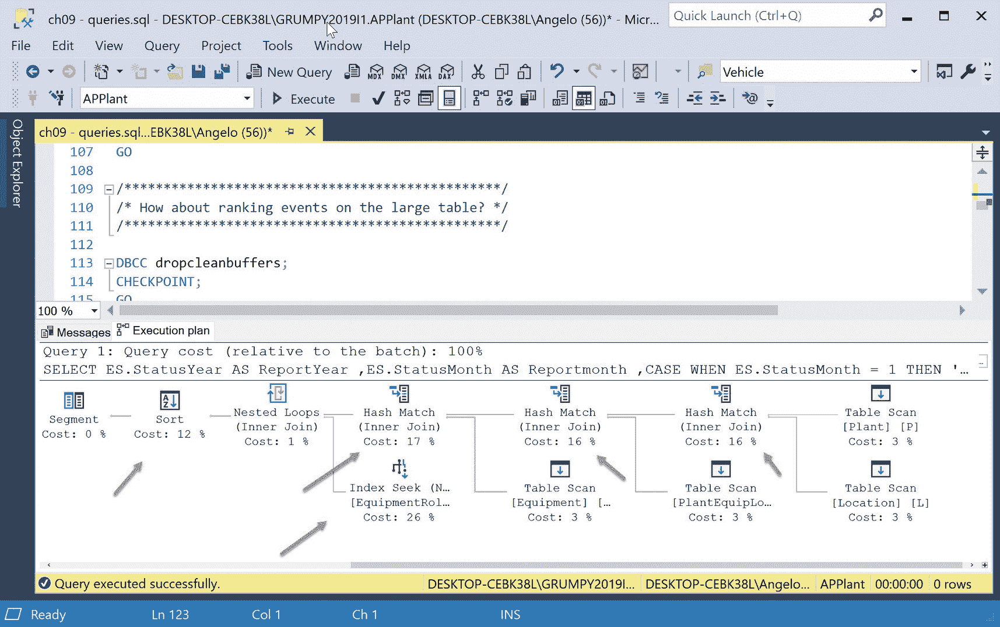

`SQL`窗口的截图。主页面上半部分显示代码，下半部分显示执行计划。

图 9-7：大表估计查询计划

我们看到对大报告表进行了索引查找，成本为 26%，但看看那些用于合并维度表行的哈希匹配联接，以及所有对维度表进行的表扫描。接着是一个成本为 1%的嵌套循环任务，然后是一个成本为 12%的排序操作。

## 随堂小测

当我们说任务成本时，它实际意味着什么？是任务执行所花费时间的百分比吗？答案稍后揭晓。

让我们查看此查询的`IO`和`TIME`统计信息。

请参考图 9-8。

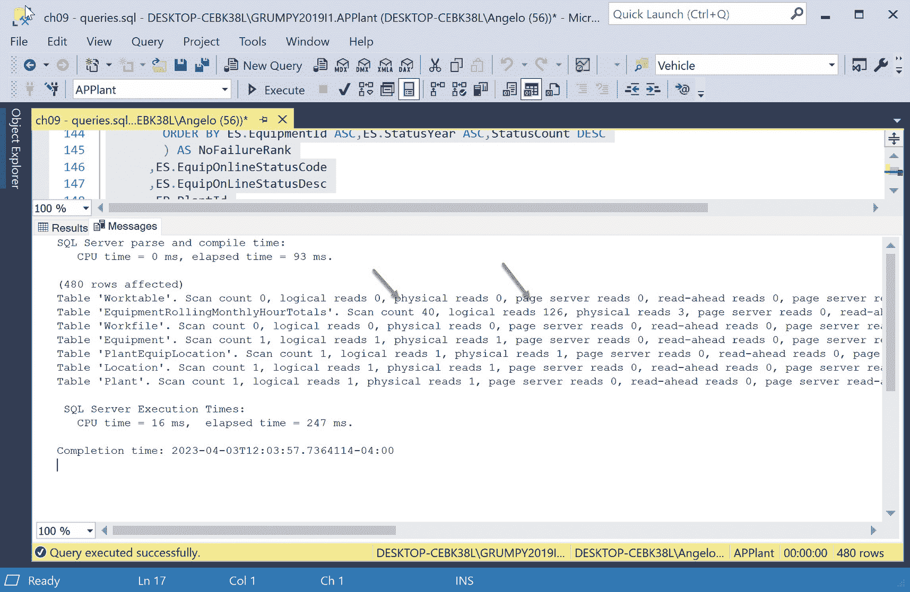

截图显示主屏幕上半部分为代码，下半部分显示消息。箭头指向物理读取，页面服务器读取为 0。

图 9-8：大表查询的 IO 和 TIME 统计信息

报告表的扫描计数（40）和逻辑读取（126）值较高，物理读取为 3。维度表的扫描计数、逻辑读取和物理读取均为 1。工作文件的所有这些参数均为 0。

如前所述，这是一份历史报告，因此很明显，为了提高性能，我们希望通过一次性加载所有历史数据来暂存大部分数据。随着时间逐月过去，我们只需要执行月度加载以更新数据。如果用户需要每周甚至每日更新数据，我们也可以进行每周加载。

## 随堂小测答案

当我们说任务成本时，它实际意味着什么？是任务执行所花费时间的百分比吗？不，这是一个综合值，表示使用了多少`CPU`、内存和`IO`以及其他一些参数。

让我们调整策略，将加载所有数据的代码提取到另一个报告表中。

请参考清单 9-3。

```
INSERT INTO Reports.EquipmentMonthlyOnLineStatus
SELECT ES.StatusYear AS ReportYear
,ES.StatusMonth AS Reportmonth
,CASE
WHEN ES.StatusMonth = 1 THEN 'Jan'
WHEN ES.StatusMonth = 2 THEN 'Feb'
WHEN ES.StatusMonth = 3 THEN 'Mar'
WHEN ES.StatusMonth = 4 THEN 'Apr'
WHEN ES.StatusMonth = 5 THEN 'May'
WHEN ES.StatusMonth = 6 THEN 'Jun'
WHEN ES.StatusMonth = 7 THEN 'Jul'
WHEN ES.StatusMonth = 8 THEN 'Aug'
WHEN ES.StatusMonth = 9 THEN 'Sep'
WHEN ES.StatusMonth = 10 THEN 'Oct'
WHEN ES.StatusMonth = 11 THEN 'Nov'
WHEN ES.StatusMonth = 12 THEN 'Dec'
END AS MonthName
,EP.LocationId
,L.LocationName
,ES.EquipmentId
,StatusCount
,ES.EquipOnlineStatusCode
,ES.EquipOnLineStatusDesc
,EP.PlantId
,P.PlantName
,P.PlantDescription
,ES.EquipAbbrev
,EP.UnitId
,EP.UnitName
,E.SerialNo
-- 创建表使用：
-- INTO  Reports.EquipmentMonthlyOnLineStatus
FROM Reports.EquipmentRollingMonthlyHourTotals ES -- 30,240 行以上
INNER JOIN DimTable.Equipment E
ON ES.EquipmentId = E.EquipmentId
INNER JOIN [DimTable].[PlantEquipLocation] EP
ON ES.EquipmentId = EP.EquipmentId
INNER JOIN DimTable.Plant P
ON EP.PlantId = P.PlantId
INNER JOIN DimTable.Location L
ON EP.PlantId = L.PlantId
AND EP.LocationId = L.LocationId
ORDER BY ES.StatusYear
,ES.StatusMonth
,EP.LocationId
,ES.EquipmentId
,ES.EquipOnlineStatusCode
,EP.PlantId
GO
```

清单 9-3：报告表的一次性加载

这里有那个大的`CASE`代码块。另外，请注意`FROM`子句中的所有`JOIN`谓词。你可以取巧，先在`FROM`子句前使用`INTO`来创建表。创建表后将其注释掉，并使用常规的`INSERT/SELECT`来加载数据。务必检查列的数据类型，确保它们与从查询中使用的表中检索的列的数据类型一致。

此策略允许我们使用`ORDER BY`子句对数据进行排序，排序方式将有助于我们将要对其执行的查询。

创建并加载此表后，我们将每月加载一次，因此需要创建一个在`where`子句中添加月份过滤器的脚本。这可以放在`SQL Agent`计划作业中，以便可以增量加载表，一次一个月、一周甚至一天。

## 提醒

`SQL Agent`是作业执行进程。你可以使用它来安排查询、脚本、外部程序和`SSIS ETL`包的执行。

对于此策略，创建一个记录表上次加载日期的小表。这样，查询脚本可以使用上次日期作为过滤条件，并请求比上次存储的日期多一天的行。请记住添加新的加载日期，以便下次运行查询时能够正确工作。

让我们看看新的改进后的查询。

请参考清单 9-4。

```
SELECT ReportYear
,Reportmonth
,MonthName
,LocationId
,LocationName
,EquipmentId
,StatusCount
,RANK() OVER(
PARTITION BY EquipmentId,ReportYear
ORDER BY LocationId,EquipmentId ASC,ReportYear ASC,
StatusCount DESC
) AS NoFailureRank
,EquipOnlineStatusCode
,EquipOnLineStatusDesc
,PlantId
,PlantName
,PlantDescription
,EquipAbbrev
,UnitId
,UnitName
,SerialNo
FROM Reports.EquipmentMonthlyOnLineStatus -- 30,240 行以上
WHERE ReportYear = 2002
AND EquipOnlineStatusCode = '0001'
AND EquipmentId = 'P1L1VLV1'
ORDER BY ReportYear
,Reportmonth
,LocationId
,EquipmentId
,EquipOnlineStatusCode
,PlantId
GO
```

清单 9-4：新的改进后的查询

并不意外。这是同一个带有`RANK()`函数的查询，但这次它使用的是我们新的改进后的表。我们可以预期性能会有所提升。或者真的如此吗？

我们将结果缩小到一台设备。

请参考图 9-9 中的部分结果。

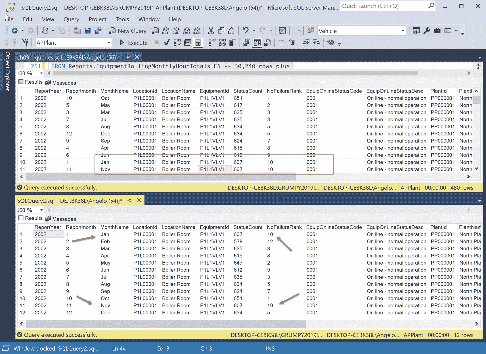

窗口的截图。屏幕上半部分和下半部分各显示一个表格。上方的表格框选了 1 月和 11 月的详细信息。下方表格中的箭头指向 1 月和 11 月，故障风险为 10。

图 9-9：比较查询报告

请记住，我添加了一个过滤器，只报告一台设备。如你所见，结果相符，但第一个报告按排名排序，而第二个报告按月份排序。这完全取决于分析师希望结果如何排序。


### 性能考虑

让我们创建一个基线估计查询计划，以便了解存在的性能条件。

请参阅图 9-10。

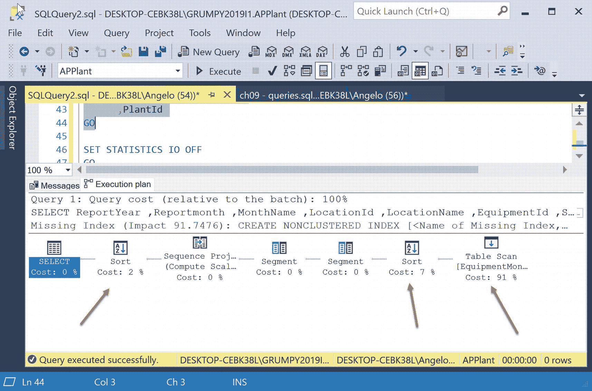

SQL 工作区的截图。上半部分描绘了代码，下半部分描绘了执行计划。箭头指向排序成本分别为 2% 和 7%，以及表扫描成本为 91%。

图 9-10

估计的基线查询计划

一个表扫描，加上两个排序和一个建议的索引。表扫描的成本占 91%，所以我们应该关注这一点！

让我们创建索引吧！有益无害！

请参阅清单 9-5。

```
/*
Missing Index Details from SQLQuery2.sql - DESKTOP-CEBK38L\GRUMPY2019I1.APPlant (DESKTOP-CEBK38L\Angelo (54))
The Query Processor estimates that implementing the following index could improve the query cost by 91.7476%.
*/
CREATE NONCLUSTERED INDEX ieEquipmentMonthlyOnLineStatus
ON Reports.EquipmentMonthlyOnLineStatus (ReportYear,EquipmentId,EquipOnlineStatusCode)
INCLUDE (
Reportmonth,MonthName,LocationId,LocationName,StatusCount,
EquipOnLineStatusDesc,PlantId,PlantName,PlantDescription,
EquipAbbrev,UnitId,UnitName,SerialNo
)
GO
```

清单 9-5

推荐的索引

估计查询计划分析器指出性能将提升 91.7476%，因此让我们创建它并运行另一个估计查询计划。

请参阅图 9-11。

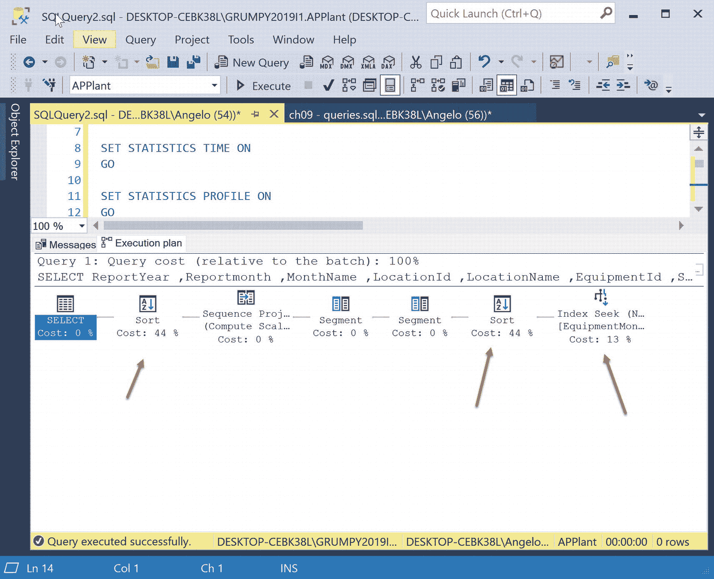

SQL 工作区的截图。上半部分描绘了代码，下半部分描绘了执行计划。箭头指示索引查找的成本百分比分别为 44% 和 12%。

图 9-11

使用索引更新的执行计划

索引被使用了（成本为 13%）。这是个好消息，但我们有两个排序，每个成本为 44%。让我们看看 `IO` 和 `TIME` 统计信息。

请参阅图 9-12。

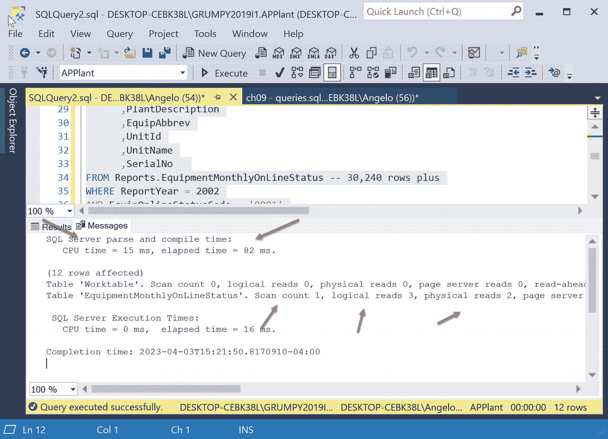

SQL 工作区的截图。窗口上半部分代表代码，下半部分代表消息。箭头指向已用时间等于 82 ms，扫描计数等于 1，逻辑读取等于 3，物理读取等于 2。

图 9-12

改进的查询 IO 和 TIME 统计信息

还不错：在新报告表上，扫描计数为 1，逻辑读取为 3，物理读取为 2。工作表上的所有统计信息均为零，SQL Server 执行已用时间为 16 ms。

回顾这个查询，我们看到使用了 `ORDER BY` 子句。这是必要的吗？我获取了查询，注释掉 `ORDER BY` 子句，并排比较了估计的执行计划，这就是我得到的结果。

请参阅图 9-13。

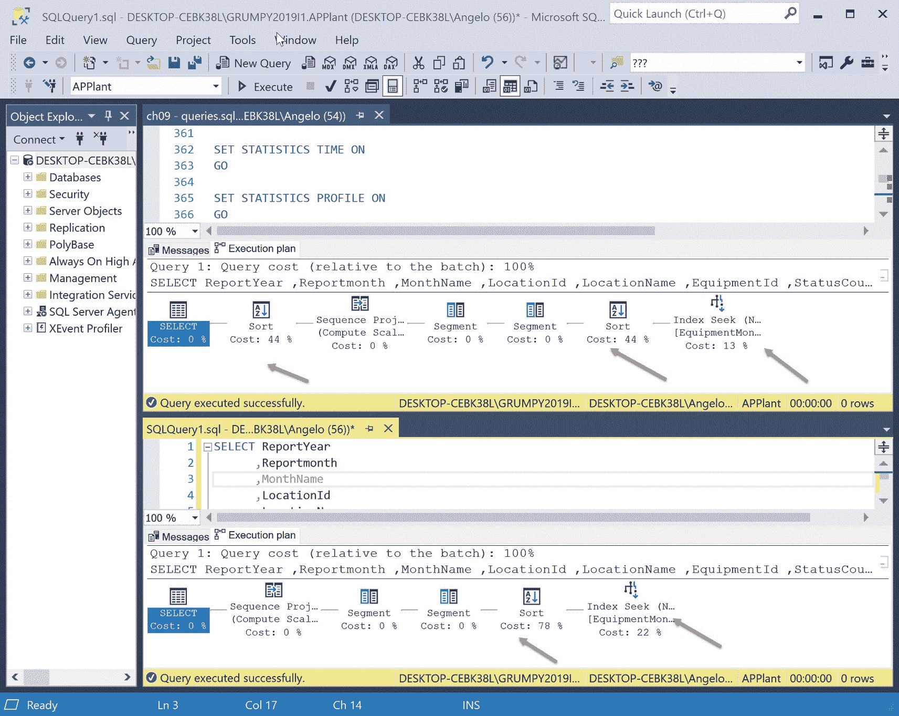

SQL 工作区的截图。窗口顶部是菜单栏，左侧是对象资源管理器。主屏幕描绘了执行计划和代码。

图 9-13

比较有和没有 ORDER BY 子句的估计执行计划

一个排序步骤被消除了，但索引查找上升到 22%，剩余的排序步骤上升到 78%。这样更好吗？让我们看看 `TIME` 和 `IO` 统计信息告诉我们什么。

请参阅图 9-14。


SQL 工作区的截图。窗口顶部是菜单栏，左侧是对象资源管理器。主屏幕描绘了代码和消息。箭头指向已用时间。

图 9-14

比较有和没有 ORDER BY 子句的 IO 和 TIME 统计信息

在没有 `ORDER BY` 子句的查询中，解析和编译时间有所改善，而执行时间有所增加。这个测试需要运行两到三次，每次运行 `DBCC` 命令以清除每个会话中的缓存，才能做出某种决定。你可以自己尝试一下，但归根结底，如果这是一个真实的生产场景，取决于分析员希望如何对报告进行排序。

正如我们在其他章节中看到的，有时最简单的解决方案就是最好的。

我这是什么意思呢？

与其创建几个索引并进行广泛的测试，不如直接拆分查询，将基础数据放入一个报告表中（如果数据具有历史性质），然后修改报告查询以从新表中访问数据。

当然，看看估计查询分析器对新表的索引有什么建议。通常至少需要一到两轮比较估计查询计划以及 `IO` 和 `TIME` 统计信息。此外，如果你需要深入研究，可以查看将 `STATISTICS PROFILE` 设置为 `ON` 的结果。

最后，如果我们理解了分析员或业务用户的需求，我们就可以设计一个高性能的解决方案。确保你提出很多问题。即使你是通过电子邮件收到的需求说明，也请立即回复一封电子邮件，附上你的问题，这样你就能掌握所有的要求和期望。


### DENSE_RANK( ) 函数

我们的业务分析师想要比较排名，使用了 `RANK()` 函数和 `DENSE_RANK()` 函数。此外，月份需要拼写出来，而不仅仅是一个数字。最后，我们想生成一份针对 2002 年、工厂 1、位置 1 的阀门 `P1L1VLV 1` 的报告。看起来这个查询一直给工程师们带来一些困扰。

这个查询在测试通过后，需要扩展到包含所有年份、工厂和位置，以便我们可以将结果加载到 Microsoft Excel 数据透视表中（作为课后练习，这将由你来完成，惊喜！）。

解码设备 ID 告诉我们，该阀门位于工厂 1（北厂）和位置 1（锅炉房）。我们对所有状态描述都感兴趣。

我们想使用之前新建的报告表，并且希望将季度名称拼写出来。遗憾的是，我们小小的 `Calendar` 表中没有拼写出季度名称，因此我们需要用一个内联表来弥补，而我们将发现这是一个错误的方向。

#### 课后作业

使用本章的 DDL 代码，看看你能否修改 `Calendar` 维度表，使其对季度和月份使用更详尽的名称，而不仅仅是数字。

有时，在设计查询时，人们会对逻辑做出假设，结果后来才发现有更简单的解决方案！我们很快就会看到这就是这种情况！

请参考清单 9-6。

```sql
SELECT
EMOLS.PlantName
,EMOLS.LocationName
,EMOLS.ReportYear
,MSC.CalendarQuarter AS ReportQuarter
,EMOLS.[MonthName] AS ReportMonth
,EMOLS.StatusCount
,EMOLS.EquipOnlineStatusCode
,EMOLS.EquipOnLineStatusDesc
-- 在出现并列时跳过序列中的下一个值
,RANK()  OVER (
PARTITION BY EMOLS.PlantName,EMOLS.LocationName --,EMOLS.ReportYear,
EMOLS.EquipOnlineStatusCode
ORDER BY EMOLS.StatusCount DESC
) AS FailureRank
-- 即使出现并列也保持序列连续
,DENSE_RANK()  OVER (
PARTITION BY EMOLS.PlantName,EMOLS.LocationName --,EMOLS.ReportYear,
EMOLS.EquipOnlineStatusCode
ORDER BY EMOLS.StatusCount DESC
) AS FailureDenseRank
FROM Reports.EquipmentMonthlyOnLineStatus EMOLS
INNER JOIN (
SELECT DISTINCT [CalendarYear]
,[CalendarQuarter]
,CASE
WHEN CalendarMonth = 1 THEN 'Jan'
WHEN CalendarMonth = 2 THEN 'Feb'
WHEN CalendarMonth = 3 THEN 'Mar'
WHEN CalendarMonth = 4 THEN 'Apr'
WHEN CalendarMonth = 5 THEN 'May'
WHEN CalendarMonth = 6 THEN 'Jun'
WHEN CalendarMonth = 7 THEN 'Jul'
WHEN CalendarMonth = 8 THEN 'Aug'
WHEN CalendarMonth = 9 THEN 'Sep'
WHEN CalendarMonth = 10 THEN 'Oct'
WHEN CalendarMonth = 11 THEN 'Nov'
WHEN CalendarMonth = 12 THEN 'Dec'
END AS CalendarMonthName
FROM [DimTable].[Calendar]
) AS MSC
ON (
EMOLS.ReportYear = MSC.CalendarYear
AND EMOLS.MonthName = MSC.CalendarMonthName
)
WHERE EMOLS.ReportYear = 2002
AND EMOLS.EquipmentId = 'P1L1VLV1'
GO
```

清单 9-6
`RANK()` 与 `DENSE_RANK()` 报告

首先，注意我在两个 `PARTITION BY` 子句中都注释掉了年份列。请记住，此报告将扩展到包含所有年份，因此在你尝试并将数据加载到 Microsoft Excel 制作数据透视表时，可以取消注释。

接下来，我们看到我们试图通过连接到 `Calendar` 维度表并使用内联表生成季度名称来满足需求，这是首先想到的办法，但却是错误的设计，尽管如果你喜欢让复杂代码过度复杂化解决方案的话，它看起来很巧妙！

最后，对于 `RANK()` 和 `DENSE_RANK()` 函数，`PARTITION BY` 和 `ORDER BY` 子句都是相同的。分区由工厂名称、位置名称、报告年份和设备在线状态代码创建。分区按照状态计数值降序排序。

#### 随堂小测

为什么使用内联表是一个糟糕的解决方案？

让我们看看图 9-15 中的结果。

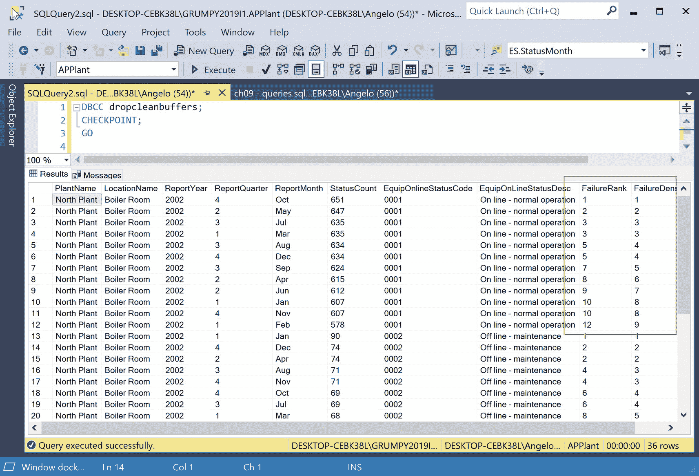

图 9-15
使用内联表的结果

一个 SQL 工作区的截图。窗口的上半部分代表代码。下半部分代表表格。框出的区域描绘了前 12 个条目的故障风险和故障密度。

结果看起来是正确的。2002 年 10 月是设备在线运行次数最多的最佳月份。2 月是最差的月份。注意当出现重复值时，`RANK()` 和 `DENSE_RANK()` 函数之间熟悉的模式。让我们看看此查询的性能情况。

让我们看一个简单的图表，了解设备在线/离线状态的三个类别的趋势。请参考图 9-16。

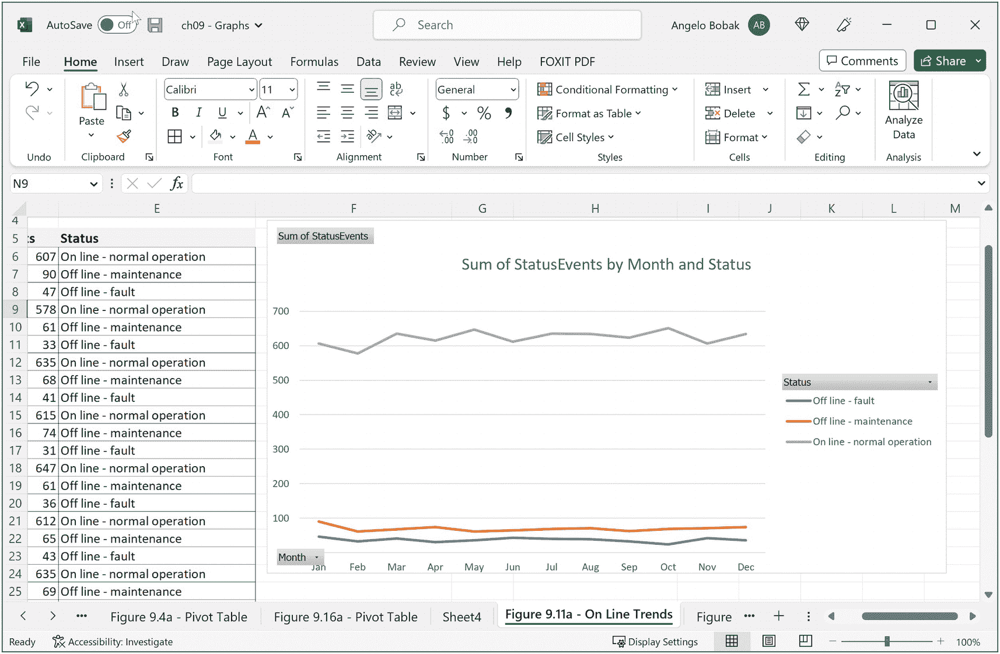

图 9-16
在线趋势

一个 Excel 表格的截图。窗口顶部是菜单栏。主屏幕左侧显示状态，一个多线图显示从一月到十二月的离线故障、离线维护和在线值。

好消息是，这个工厂的设备在线记录似乎不错。离线维护的比例有点高，但不算太糟，故障离线状态的平均值大约在 50 左右。

**提示：**
我从 SQL Server SSMS 查询平面复制结果并粘贴到 Excel 后，不得不进行一些格式调整，所以当你编写查询时，请提前考虑你将如何使用结果，以便最小化电子表格中的格式设置和列重命名。

我第一次运行这个查询时花了五秒钟。第二次运行时，它不到一秒就完成了，所以这是一个很好的例子，说明数据已被缓存，你需要在每次运行 `IO` 和 `TIME` 统计信息来评估性能时使用 `DBCC` 来清除缓存。如果你不运行 `DBCC`，你将得到误导性的统计信息！


#### 性能考量

现在是针对此查询的性能分析环节。和往常一样，我们首先创建一个基线预估`执行计划`。

请参考图 9-17。

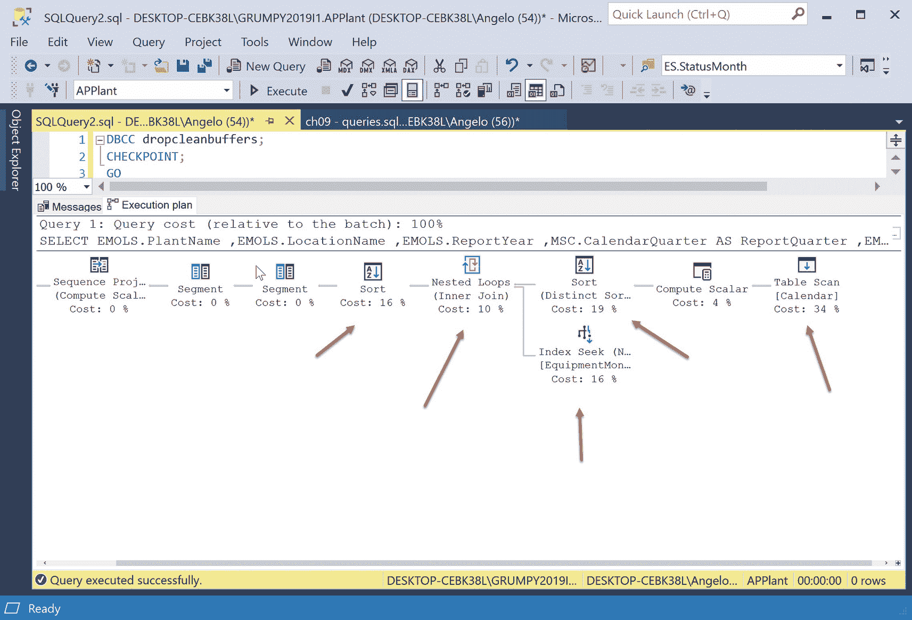

这是一张`执行计划`的截图。箭头指向的成本分别为：排序成本 16%、嵌套循环成本 16%、排序成本 19%、表扫描成本 34%以及索引查找成本 16%。

图 9-17： `RANK()` 与 `DENSE_RANK()` 的预估`执行计划`

我们对 `report` 表进行了索引查找，成本为 16%，但与 `Calendar` 维度表的 `JOIN` 子句带来了问题。

我们看到一个成本为 34%的表扫描和一个成本为 19%的排序任务。

两个数据流通过一个成本为 10%的嵌套循环（`inner join`）任务进行合并，随后是一个成本为 16%的排序任务。从性能角度来看，那个内联表并非一个好的解决方案。这就是我犯错的地方！

让我们看看 `IO` 和 `TIME` 统计数据告诉我们什么。

请参考图 9-18。

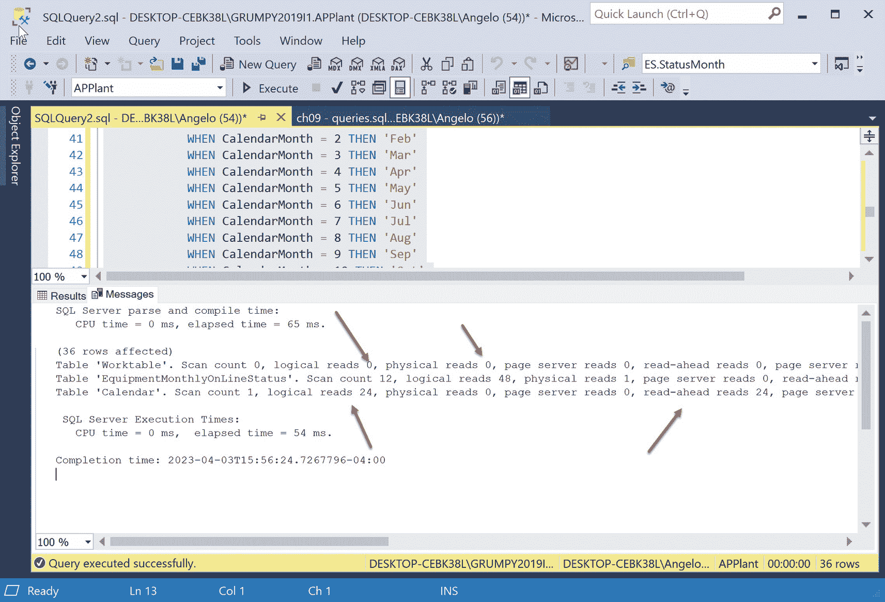

这是一张 `sql` 工作区的截图。窗口上半部分显示了用于显示日历条目对应月份名称的代码。下半部分描绘了消息。箭头指向逻辑读 0 和 24、物理读 0 以及预读 24。

图 9-18： `RANK()` 与 `DENSE_RANK()` 的 `IO` 和 `TIME` 统计

我们可以看到，对于临时工作表，所有值都是 0，因此我们无需担心。

对于我们的 `report` 表，即 `EquipmentMonthlyOnLineStatus` 表，我们看到扫描次数为 12；逻辑读为 48，物理读为 1。

最后，`Calendar` 维度表产生了 1 次扫描计数、24 次逻辑读和 24 次预读。这是我们可能想要解决的一个性能问题。

为什么不在查询的 `SELECT` 子句中使用 `CASE` 语句块来代替内联表呢？与 `Calendar` 维度表的 `JOIN` 没有意义。糟糕的编码！让我们看一个更好的解决方案。

请参考代码清单 9-7。

```sql
SELECT
EMOLS.PlantName
,EMOLS.LocationName
,EMOLS.ReportYear
,CASE
WHEN EMOLS.[MonthName] = 'Jan' THEN 'Qtr 1'
WHEN EMOLS.[MonthName] = 'Feb' THEN 'Qtr 1'
WHEN EMOLS.[MonthName] = 'Mar' THEN 'Qtr 1'
WHEN EMOLS.[MonthName] = 'Apr' THEN 'Qtr 2'
WHEN EMOLS.[MonthName] = 'May' THEN 'Qtr 2'
WHEN EMOLS.[MonthName] = 'Jun' THEN 'Qtr 2'
WHEN EMOLS.[MonthName] = 'Jul' THEN 'Qtr 3'
WHEN EMOLS.[MonthName] = 'Aug' THEN 'Qtr 3'
WHEN EMOLS.[MonthName] = 'Sep' THEN 'Qtr 3'
WHEN EMOLS.[MonthName] = 'Oct' THEN 'Qtr 4'
WHEN EMOLS.[MonthName] = 'Nov' THEN 'Qtr 4'
WHEN EMOLS.[MonthName] = 'Dec' THEN 'Qtr 4'
END AS CalendarMonthName
,EMOLS.[MonthName] AS ReportMonth
,EMOLS.StatusCount
,EMOLS.EquipOnlineStatusCode
,EMOLS.EquipOnLineStatusDesc
-- 在出现并列时跳过序列中的下一个值
,RANK()  OVER (
PARTITION BY EMOLS.PlantName,EMOLS.LocationName,EMOLS.ReportYear,
EMOLS.EquipOnlineStatusCode
ORDER BY StatusCount DESC
) AS FailureRank
-- 即使出现并列也保持序列连续
,DENSE_RANK()  OVER (
PARTITION BY EMOLS.PlantName,EMOLS.LocationName,EMOLS.ReportYear,
EMOLS.EquipOnlineStatusCode
ORDER BY EMOLS.StatusCount DESC
) AS FailureDenseRank
FROM Reports.EquipmentMonthlyOnLineStatus EMOLS
WHERE EMOLS.ReportYear = 2002
AND EMOLS.EquipmentId = 'P1L1VLV1'
GO
```

代码清单 9-7： 一个更好的解决方案

我们通过移除内联表来修改查询，从而消除了 `JOIN` 操作。添加了 `CASE` 语句块，以便我们可以根据所在的月份来确定季度。让我们运行一个新的预估查询计划，并将其与原始查询生成的旧计划进行比较。

请参考图 9-19。

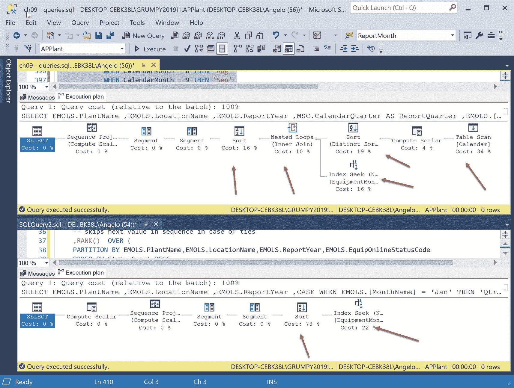

这是两张执行计划的截图。主屏幕描绘了两个执行计划。箭头指示了成本，并在新旧查询之间进行了比较。

图 9-19： 比较查询计划

新方案显示了查询计划的显著改进和简化。执行树中的 `Calendar` 维度分支消失了。然而，我们的索引查找成本从 16%上升到了 22%，第一个排序步骤的成本从 19%大幅上升到了 78%。最后一个排序步骤被消除了。我们需要比较两种策略之间的 `IO` 和 `TIME` 统计数据。

请参考图 9-20。

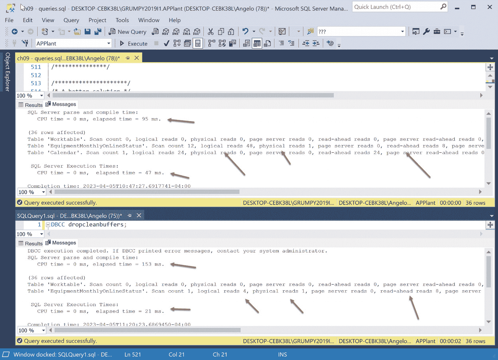

这是两张消息的截图。主窗口分为两个标题为“消息”的较小窗口。箭头指示了耗时、逻辑读、物理读和预读。

图 9-20： 比较两种策略的 `IO` 和 `TIME` 统计

让我们比较一下统计数据：

`SQL Server 解析和编译时间` 从 95 毫秒（旧查询）增加到 153 毫秒（变差了）。

`SQL Server 执行时间` 从 47 毫秒（旧查询）下降到 21 毫秒（有良好改进）。

在 `report` 表上，扫描次数从 12（旧查询）减少到 1（有良好改进）。

在 `report` 表上，逻辑读从 48（旧查询）减少到 4（有良好改进）。

在 `report` 表上，预读从 24（旧查询）减少到 8（有良好改进）。

因此，看起来新策略在性能方面比使用内联表的旧查询效果更好。

原始代码不仅设计不佳，而且我们成功绕过了一个问题：`Calendar` 维度表只有月份和季度的数字标识，没有名称。这个维度表应该被增强以包含这些名称。

看起来，`CASE` 语句比针对从 `Calendar` 维度表检索数据的内联表进行 `JOIN` 更好。


#### NTILE 函数

接下来，我们希望创建一些在线分类分桶。

我们的业务分析师希望我们开发一个查询，根据设备状态对工厂进行评级。具体来说，报告中需包含以下类别：

*   严重故障
*   关键故障
*   中等故障
*   调查故障
*   维护故障
*   无问题报告

也就是说，将故障统计数据放入代表前述类别的分桶中。报告应包括工厂名称、地点名称、日历年、季度、月份以及按月统计的设备故障总数。

## 实现步骤

以下是首次尝试，采用了一种链式 `CTE` 方法。由于代码相当长，我将其分为三个部分。让我们从第一个 `CTE` 开始。

> **注意**
>
> 请记住，所谓链式 `CTE`，是指一个较低的 `CTE` 引用其上方的 `CTE`，依此类推（`CTE n-1` 引用 `CTE n`）。

请参见代码清单 9-8a。

```sql
WITH FailedEquipmentCount
(
CalendarYear,QuarterName,[MonthName],CalendarMonth,PlantName,LocationName,SumEquipFailures
)
AS (
SELECT
C.CalendarYear
,C.QuarterName
,C.[MonthName]
,C.CalendarMonth
,P.PlantName
,L.LocationName
,SUM(EF.Failure) AS SumEquipFailures
FROM DimTable.CalendarView C
JOIN FactTable.EquipmentFailure EF
ON C.CalendarKey = EF.CalendarKey
JOIN DimTable.Equipment E
ON EF.EquipmentKey = E.EquipmentKey
JOIN DimTable.Location L
ON L.LocationKey = EF.LocationKey
JOIN DimTable.Plant P
ON L.PlantId = P.PlantId
GROUP BY
C.CalendarYear
,C.QuarterName
,C.[MonthName]
,C.CalendarMonth
,P.PlantName
,L.LocationName
)
```
代码清单 9-8a
第一个 CTE – 求和逻辑

第一个 `CTE` 检索所需的维度列，并使用 `SUM()` 函数按月对故障进行求和。注意其中包含了必需的 `GROUP BY` 子句。另外请注意，我们需要 `JOIN` 五张表：一张事实表和四张维度表。

> **提醒**
>
> 记住，如果需要用 `JOIN` 子句连接 N 张表，你需要 N-1 个连接。因此，如果要连接五张表，你的查询中需要四个 `JOIN` 子句。

接下来，我们创建另一个包含 `NTILE()` 函数的 `CTE`，并让它引用我们之前讨论的第一个 `CTE`。

请参见代码清单 9-8b。

```sql
FailureBucket (
PlantName,LocationName,CalendarYear,QuarterName,[MonthName],CalendarMonth,SumEquipFailures,MonthBucket)
AS (
SELECT
PlantName,LocationName,CalendarYear,QuarterName,[MonthName],
CalendarMonth,SumEquipFailures,
NTILE(5)  OVER (
PARTITION BY PlantName,LocationName
ORDER BY SumEquipFailures
) AS MonthBucket
FROM FailedEquipmentCount
WHERE CalendarYear = 2008
)
```
代码清单 9-8b
`NTILE()` 分桶 CTE

我们需要创建五个分桶，因此使用了 `NTILE()` 函数，并基于工厂名称和地点名称列指定了分区。该分区根据 `SumEquipFailures` 列中的值进行排序。

最后但同样重要的是生成报告的查询。

请参见代码清单 9-8c。

```sql
SELECT PlantName,LocationName,CalendarYear,QuarterName,[MonthName],SumEquipFailures,
CASE
WHEN MonthBucket = 5 AND SumEquipFailures  0 THEN 'Severe Failures'
WHEN MonthBucket = 4 AND SumEquipFailures  0 THEN 'Critical Failures'
WHEN MonthBucket = 3 AND SumEquipFailures  0 THEN 'Moderate Failures'
WHEN MonthBucket = 2 AND SumEquipFailures  0 THEN 'Investigate Failures'
WHEN MonthBucket = 1 AND SumEquipFailures  0 THEN 'Maintenance Failures'
WHEN MonthBucket = 1 AND SumEquipFailures = 0
THEN 'No issues to report'
ELSE 'No Alerts'
END AS AlertMessage
FROM FailureBucket
GO
```
代码清单 9-8c
对故障分桶进行分类

是我们的老朋友 `CASE` 语句块来救场了。我们只是简单地打印出基于分桶编号的类别。这是一个简单的解决方案，但稍微有点复杂，因为我们使用了两个链式的 `CTE` 块。在分析性能之前，我们先来看看结果。

## 结果展示

请参见图 9-21 中的部分结果。

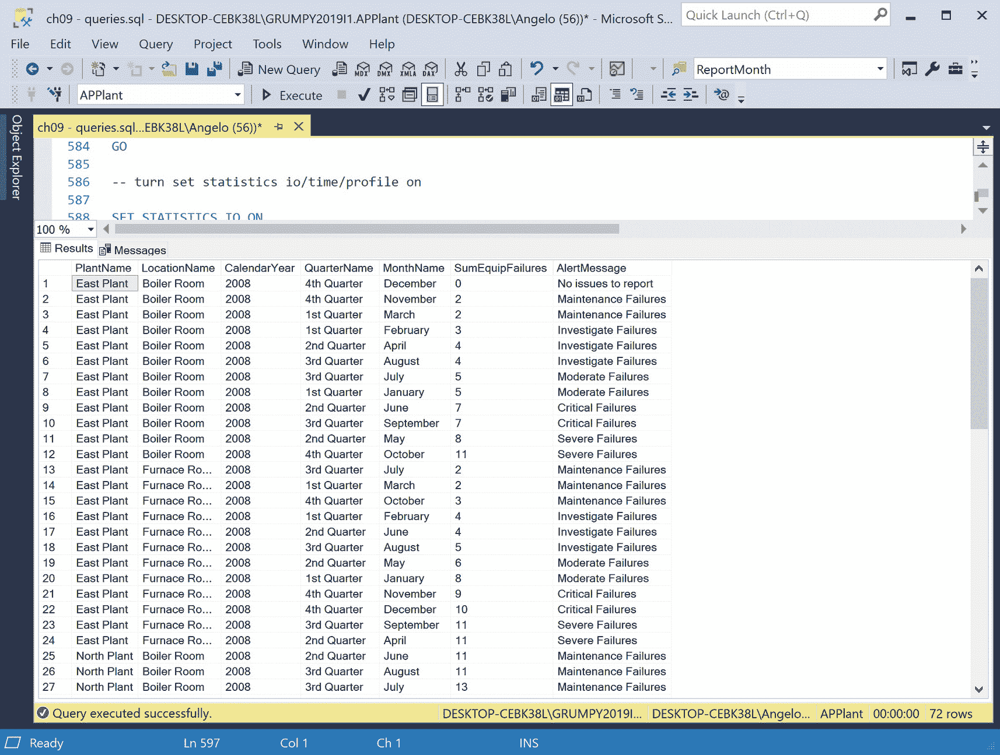
SQL 工作区的截图。主窗口包含代码和表格。表格的列标签为：工厂名称、地点名称、日历年、月份名称、季度名称、设备故障总和以及警报消息。
图 9-21
设备故障分桶报告

报告显示效果良好，按分桶、工厂、地点和日历年展示了故障情况。如果我们移除 `WHERE` 子句并运行所有年份的报告，将生成 1,517 行数据。这些数据可以复制粘贴到 Microsoft Excel 的数据透视表中，以便我们进行一些花哨的切片和切块操作，从而真正理解结果。

而这正是我们接下来要做的。请参见图 9-22。

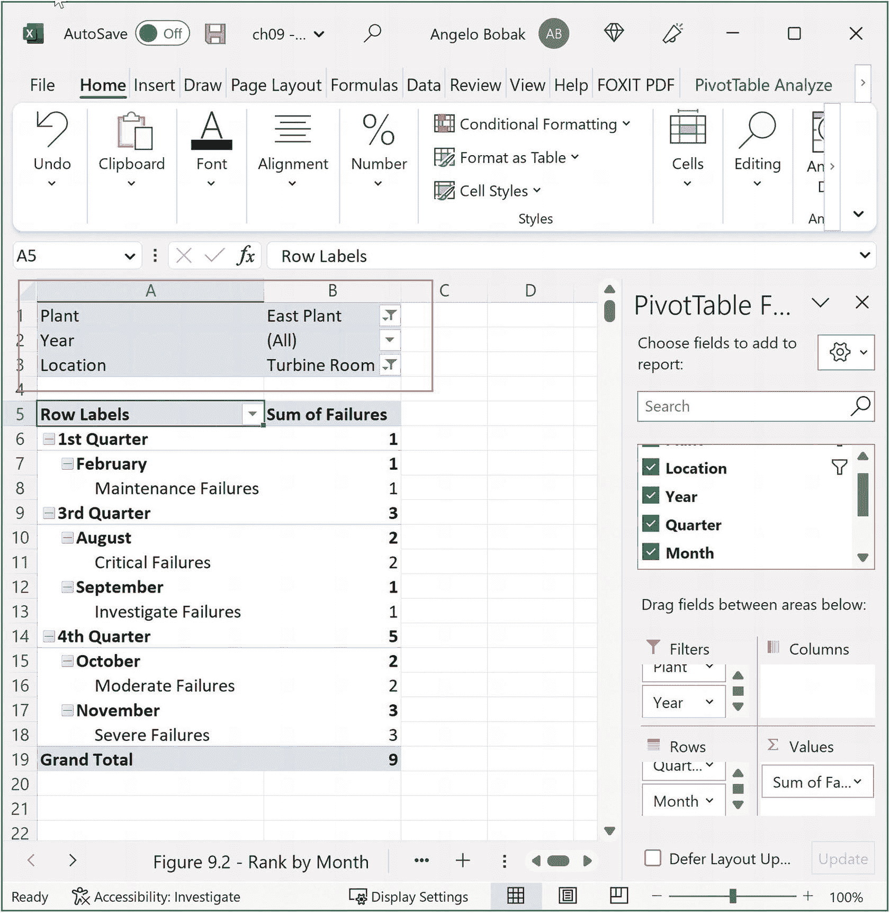
Excel 工作表的截图。窗口顶部显示了菜单栏和工具栏。主页面左侧显示了行标签和故障总和，右侧是数据透视表。
图 9-22
故障类别分桶数据透视表

这是一个非常有用的技巧和工具，可以添加到你的工具箱中，因为它将使你的业务用户和分析师能够以类似于多维数据集的方式查看结果。图中高亮的筛选区域让你可以选择工厂、年份和地点，以便深入钻取数据。

你甚至可以修改原始查询，以按设备显示故障数量，这样你就可以像使用 `GROUPING` 子句那样，在分组层次结构中向上或向下钻取！

> **作业**
>
> 尝试创建一个数据透视图来完成这个数据透视表。


#### 性能考量

### 基线估计查询计划

那么这个查询执行得如何？以下是我们基线的估计查询计划。

请参见图 9-23。

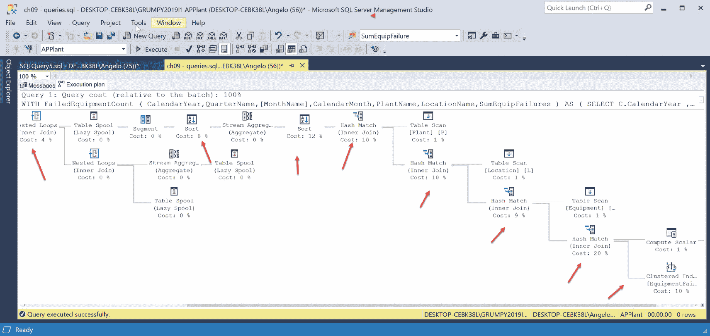

一张截图展示了执行计划。箭头指向各个操作符：嵌套循环成本占 4%，排序成本占 8%和 12%，哈希匹配成本占 10%、20%和 19%，聚集索引成本占 10%。

**图 9-23** 基线估计执行计划

由于与维度表的连接，存在许多分支和表扫描。事实表上的聚集索引有所帮助，其成本仅为 10%。有四个哈希匹配连接（20%、9%、10%和 10%）用于合并最右侧的分支，一个排序占 12%，另一个排序占 8%，以及一个最终的嵌套循环连接占 4%的代价。

表假脱机操作占 0%。显然，我们的首要目标是简化查询，使估计的查询计划变得不那么复杂。

## 使用报表表改进查询

现在，我们使用一个之前创建的现有报表表。清单 9-9 是修改后的查询。

```sql
WITH FailedEquipmentCount
AS (
SELECT
PlantName,LocationName,CalendarYear,QuarterName,[MonthName]
,CalendarMonth,SumEquipmentFailure,
NTILE(5)  OVER (
PARTITION BY PlantName,LocationName
ORDER BY SumEquipmentFailure
) AS MonthBucket
FROM Reports.EquipmentFailureStatistics
WHERE CalendarYear = 2008
)
SELECT
PlantName, LocationName, CalendarYear, QuarterName, [MonthName], SumEquipmentFailure,
CASE
WHEN MonthBucket = 5 AND SumEquipmentFailure  0
THEN 'Severe Failures'
WHEN MonthBucket = 4 AND SumEquipmentFailure  0
THEN 'Critical Failures'
WHEN MonthBucket = 3 AND SumEquipmentFailure  0
THEN 'Moderate Failures'
WHEN MonthBucket = 2 AND SumEquipmentFailure  0
THEN 'Investigate Failures'
WHEN MonthBucket = 1 AND SumEquipmentFailure  0
THEN 'Maintenance Failures'
WHEN MonthBucket = 1 AND SumEquipmentFailure = 0
THEN 'No issues to report'
ELSE 'No Alerts'
END AS AlertMessage
FROM FailedEquipmentCount
GO
```

**清单 9-9** 改进后的查询

使用其中一个现有的报表表 (`Reports.EquipmentFailureStatistics`) 消除了第一个 `CTE`。让我们看看修订后的估计执行计划。

请参见图 9-24。

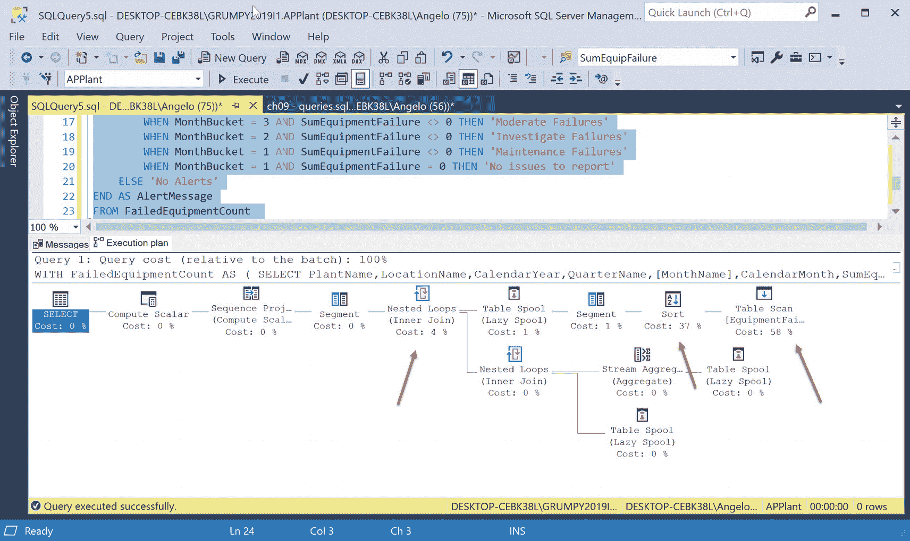

一张截图代表一个执行计划。箭头指向：嵌套循环成本占 4%，排序成本占 37%，表扫描成本占 58%。

**图 9-24** 修订后的估计查询计划

我们可以看到查询计划被简化了。聚集索引查找被消除了，因为我们不再使用那个表。现在出现的是一个对报表表的表扫描，成本为 58%。这样更好吗？这更好，因为报表表已经设置好我们所需的数据，并且只有大约 2000 行。如果我们真的想提高性能，可以将其设为内存优化表。把东西放进内存里，一切都更快了，对吧？

我们还看到一个成本为 37%的排序任务，一个成本为 1%的表假脱机，以及两个嵌套循环连接（成本分别为 0%和 4%），我们在计划中从右向左导航。

我猜这样更好，因为分支和步骤更少了。让我们看看 `IO` 和 `TIME` 统计信息。

请参见图 9-25。

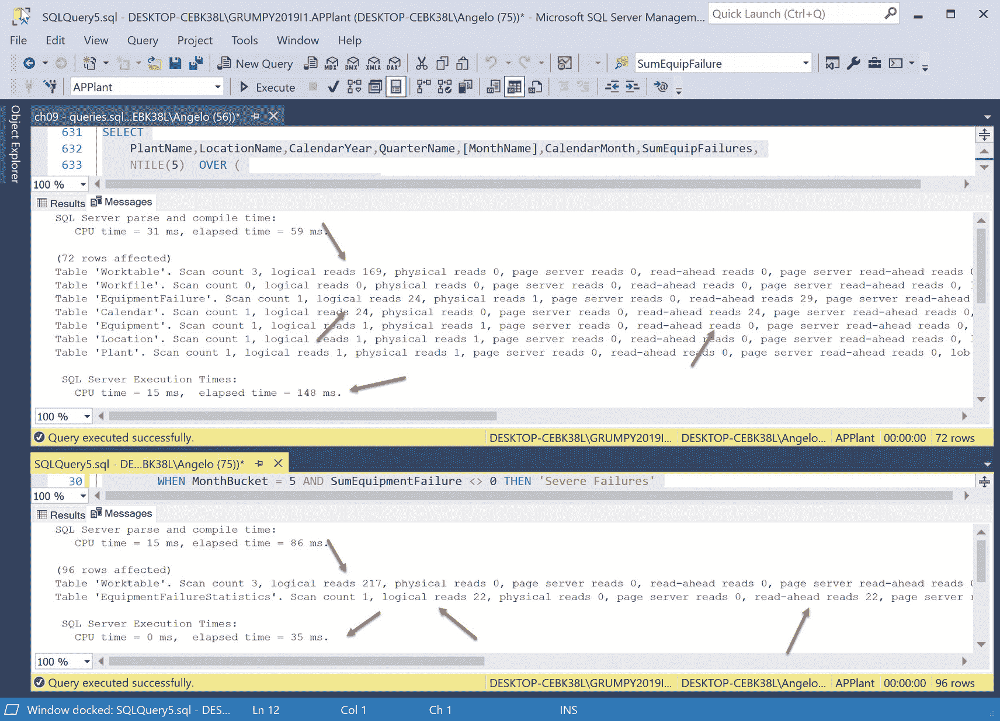

一张截图比较了两组信息。箭头指向经过的时间、逻辑读取和预读读取。

**图 9-25** 比较 IO 和 TIME 统计信息

改进后的简化查询中新表的逻辑读取次数为 22 次，而原始的 `EquipmentFailure` 表为 24 次。虽是适度的改进，但我们乐于接受。此外，执行时间从 148 毫秒下降到 35 毫秒。

## 结论

**结论：** 编码前先思考。同时，进行原型设计。

跟踪你创建的报表表，以便在不同的查询中重用它们！有时你可能会设计出两个几乎相同但略有差异的报表表，因为它们需要多一两个列。合并这些表，以便你只有一个可用于多个查询的表。

最后，在改进查询时，始终比较结果。确保新的改进查询结果与旧查询的结果完全一致。改进固然好，但如果结果不匹配，那么这些改进就毫无意义。

哦，是的，报表表解决了许多问题，但加载它们需要时间。太多的报表表，即使是在非高峰时段加载，也可能随着加载窗口越来越紧而成为问题。


### `ROW_NUMBER( )` 函数

最后但同样重要的是 `ROW_NUMBER()` 函数。让我们看看我们的业务分析师提出的需求规格是什么样的：

我们的分析师希望看到一份报告，列出工厂、地点、年份、季度和月份，并按它们所属的“桶”进行排序，例如“严重故障”桶。当然，每个月的设备故障数量也需要出现在报告中。

由于每个桶包含一个或多个月份的数据，分析师希望看到报告事件的编号——不是月份编号，而是桶内的序列号或槽位号，如果你愿意这么称呼的话。

最后，报告需要覆盖三年：2008、2009 和 2010 年。

我们将在分区定义中使用一个小技巧。以下是我们想出的方案。

请参考清单 9-10。

```sql
WITH FailedEquipmentCount
AS (
SELECT PlantName, LocationName, CalendarYear, QuarterName, [MonthName],
CalendarMonth, SumEquipmentFailure,
NTILE(5)  OVER (
PARTITION BY PlantName,LocationName
ORDER BY SumEquipmentFailure
) AS MonthBucket
FROM [Reports].[EquipmentFailureStatistics]
)
SELECT PlantName,LocationName,CalendarYear,QuarterName,[MonthName]
,CASE
WHEN MonthBucket = 5 AND SumEquipmentFailure  0
THEN '严重故障'
WHEN MonthBucket = 4 AND SumEquipmentFailure  0
THEN '关键故障'
WHEN MonthBucket = 3 AND SumEquipmentFailure  0
THEN '中等故障'
WHEN MonthBucket = 2 AND SumEquipmentFailure  0
THEN '需调查故障'
WHEN MonthBucket = 1  AND SumEquipmentFailure  0
THEN '维护故障'
WHEN MonthBucket = 1  AND SumEquipmentFailure = 0
THEN '无问题需报告'
ELSE '无警报'
END AS StatusBucket
,ROW_NUMBER()  OVER (
PARTITION BY (
CASE
WHEN MonthBucket = 5 AND SumEquipmentFailure  0
THEN '严重故障'
WHEN MonthBucket = 4 AND SumEquipmentFailure  0
THEN '关键故障'
WHEN MonthBucket = 3 AND SumEquipmentFailure  0
THEN '中等故障'
WHEN MonthBucket = 2 AND SumEquipmentFailure  0
THEN '需调查故障'
WHEN MonthBucket = 1  AND SumEquipmentFailure  0
THEN '维护故障'
WHEN MonthBucket = 1  AND SumEquipmentFailure = 0
THEN '无问题需报告'
ELSE '无警报'
END
)
ORDER BY SumEquipmentFailure
) AS BucketEventNumber
,SumEquipmentFailure AS EquipmentFailures
FROM FailedEquipmentCount
WHERE CalendarYear IN (2008,2009,2010)
GO
```

清单 9-10
包含桶槽位号的故障事件桶

技巧在于在 `PARTITION BY` 子句中使用了 `CASE` 语句块，而非列名。这展示了指定分区的多种方式之一。这是一个值得牢记的巧妙小技巧。

请参考图 9-26 中的部分结果。

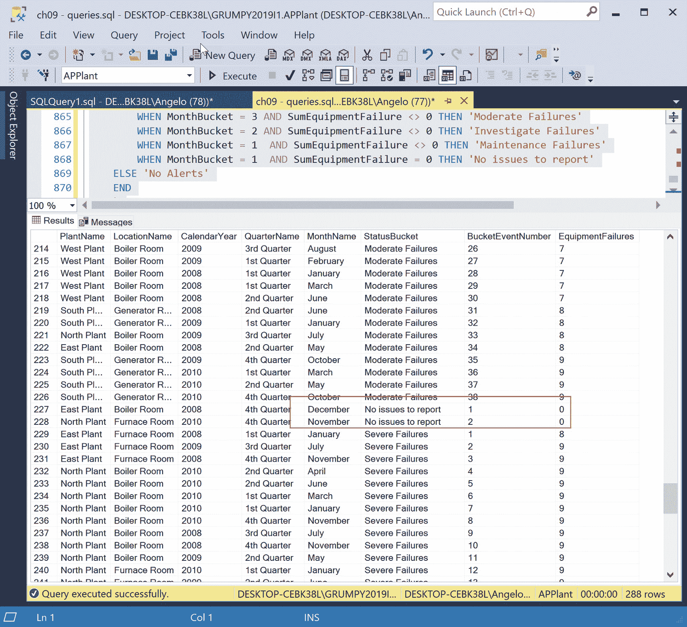

截图顶部显示代码，底部显示表格。表格的列名依次为：工厂名称、地点名称、日历年份、季度名称、月份名称、状态桶、桶事件编号和设备故障数。其中十二月和十一月的条目被高亮显示。

图 9-26
包含桶槽位号的故障事件桶报告

好的，它有效。可能不是一个非常有价值的报告，但我想展示指定 `PARTITION BY` 子句的一种变体。

另一方面，这些结果可以用来创建一个漂亮的数据透视表。让我们将结果复制粘贴到 Microsoft Excel 电子表格中，并创建数据透视表。

请参考图 9-27 中的部分结果。

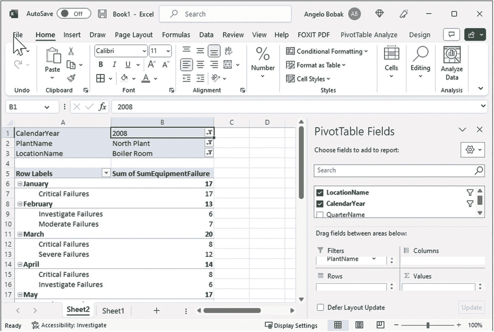

Excel 工作表的截图。窗口顶部显示菜单栏，随后是工具栏。主页面左侧显示行标签和故障总和，右侧显示数据透视表。

图 9-27
故障事件桶数据透视表

通过将列名拖放到“筛选器”、“列”、“行”或“值”列表框中，你可以对数据进行强大的切片和切块操作，并在总计的层次结构中上下穿梭。筛选器非常方便，因为你可以一次专注于部分数据。这里我们查看的是 2008 年、北厂和锅炉房位置的结果。

你还可以用相同的数据创建数据透视图。

请参考图 9-28 中的部分结果。


Excel 工作表的截图。窗口顶部显示菜单栏，随后是工具栏。主页面左侧显示行标签和故障总和，右侧显示柱形图。柱形图展示了锅炉房、熔炉房和发电机房的故障值。

图 9-28
故障事件桶数据透视图

报告输出、数据透视表和数据透视图提供了一套强大的工具，用于进行分析并理解我们这个小型电厂场景中正在发生的情况。我强烈建议你运行这些查询，将结果复制到 Microsoft Excel，并生成图表和数据透视表。这是一套强大的工具，将提升你的职业生涯，帮助你创建强大的报告，并帮助你解决性能问题。


#### 性能考量

这个查询与其他查询略有不同，因为我们使用了两个 `CASE` 语句块，并使用 `IN()` 子句为希望包含在结果中的年份指定了一些筛选器。让我们创建基线估计查询计划，看看是否有任何异常。

请参考图 9-29。

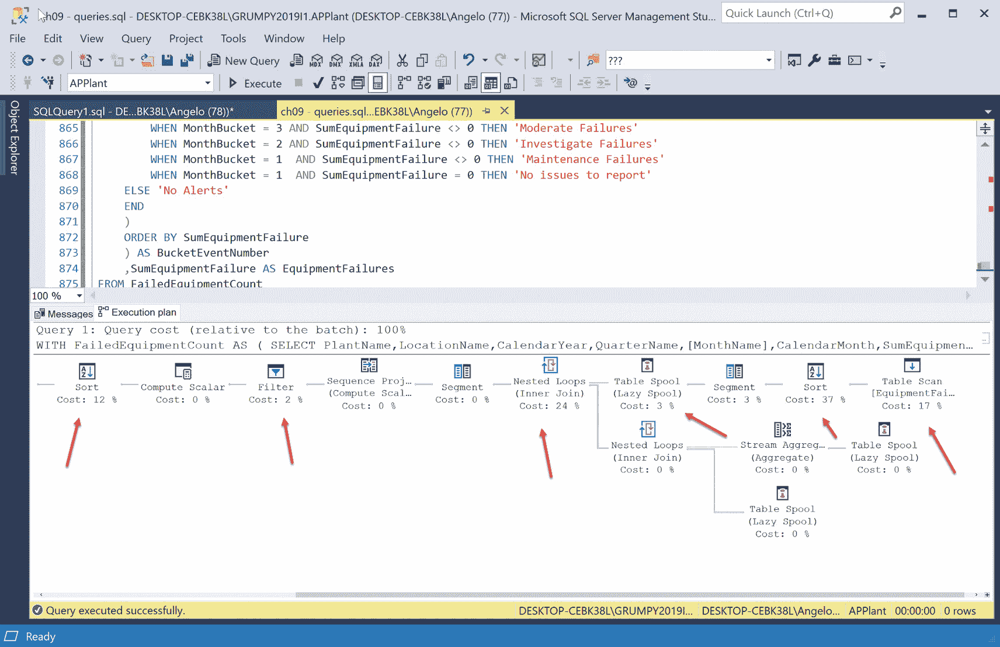

一张截图，上半部分显示代码，下半部分显示执行计划。箭头分别指向成本为 12% 和 37% 的排序操作、成本为 2% 的筛选操作、成本为 24% 的嵌套循环操作、成本为 3% 的表假脱机操作，以及成本为 17% 的表扫描操作。

图 9-29
基线估计查询计划

从计划的右侧开始向左看，我们看到一个成本为 17% 的表扫描。由于这是一个小表，大约 2000 行，我们无需担心。接下来，我们看到三个表假脱机操作，两个成本为 0%，一个成本为 3%。几个嵌套循环连接合并了来自分行的数据行。第一个成本为 0%，但第二个相当高，达到了 24%。其余流程包括一个筛选任务（针对年份）和一个成本为 12% 的排序步骤。

由于我们处理的数据量不大，我认为可以保持现状。让我们看一下 `IO` 和 `TIME` 统计信息，然后是 `STATISTICS PROFILE`，以便我们对性能步骤有一个完整的了解。

请参考图 9-30。

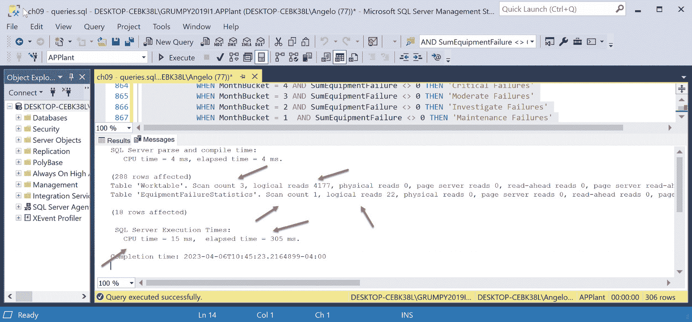

一张 SQL 工作区域的截图。窗口上半部分显示代码，下半部分显示消息。箭头指示扫描计数等于 3，逻辑读取等于 4177 和 22。

图 9-30
IO 和 TIME 统计信息

查看这些统计信息，我们看到工作表非常活跃，扫描计数为 3，逻辑读取为 4177。报告表有一个扫描计数和 22 次逻辑读取。最后，SQL Server 执行 elapsed time 为 305 毫秒，因此在 1 秒内返回了 306 行。

接下来是 `STATISTICS PROFILE` 的结果。

请参考图 9-31。

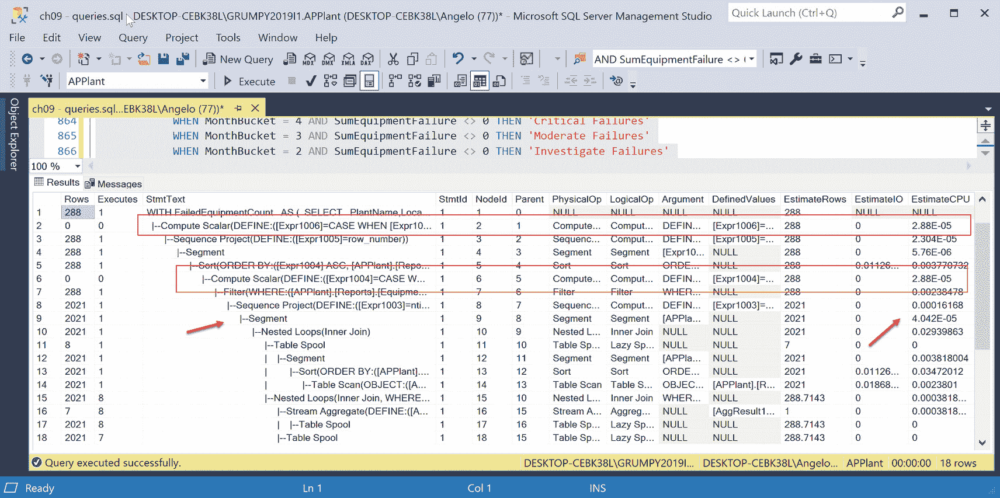

一张 SQL 工作区域的截图。窗口上半部分显示不同故障的代码，下半部分显示表格。内嵌区域描绘了当行数等于 288、执行次数等于 1 时，以及当行数和执行次数都等于 0 时的条目。

图 9-31
性能分析统计报告

除了两个 `EstimateCPU` 值外，其他值都很低。前两个是针对 `CASE` 语句块的，值为 2.88E-05。然后我们有一个针对分段任务的值 4.042E-05，该任务包括了 `GROUP BY` 逻辑处理。

总之，这个查询包含一些有趣的步骤，但需要处理的行数很低，因此无需进行性能调优。

### 总结

本章到此结束。我们涵盖了常用的排名函数应用，并使用了前几章的技术和工具进行了性能分析。我们还能够利用一些报告中的数据创建有趣的图形和数据透视表。希望您觉得这个发电厂的场景有趣，并会尝试这些代码示例。

最后一点建议：如果您是或立志成为一名监督多个开发人员的数据架构师，您需要关注报告表的泛滥。您不希望出现重复，也不希望错过代码和表共享的机会！

良好的同行评审会议将确保团队对每个独立开发工作中可用的内容保持一致和最新。您不需要重复发明轮子，并不断添加越来越多的报告表和索引。

这也适用于内存增强表；在耗尽内存之前，您只能创建有限的数量！

