# 10. 发电厂用例：分析函数

## 分析函数

在本章中，我们将为工具箱添加几个新工具。我们将快速了解 `Report Builder` 以及 `Analysis Services` 的多维数据集。

`Report Builder` 允许您连接到数据库，并通过 `SQL Server Reporting Services` 创建复杂的 Web 报告。这样，您的业务分析师可以直接访问网站并检查他们所需的报告。

`Analysis Services` 是一个强大的平台，是 `SQL Server` BI 堆栈的一部分，允许您基于数据仓库（例如我们一直在使用的 `APPlant` 数据仓库）中存储的数据构建多维数据集。

在了解 `Report Builder` 和 `SSAS` 数据集之前，让我们先像往常一样，将属于此类别的窗口函数应用于我们的数据仓库进行分析。

提醒一下，以下是按名称排序的八个分析函数类别的函数。回想一下，它们可以与 `OVER()` 子句一起在查询中使用，为我们的业务分析师生成有价值的报告。

如果您已经阅读了第 3 章和/或第 7 章，您应该对它们很熟悉。如果没有，请花时间阅读它们的功能：

*   `CUME_DIST()`：`不` 支持窗口框架规范
*   `FIRST_VALUE()` 和 `LAST_VALUE()`：`支持` 窗口框架规范
*   `LAG()` 和 `LEAD()`：`不` 支持窗口框架规范
*   `PERCENT_RANK()`：`不` 支持窗口框架规范
*   `PERCENTILE_CONT()`：`不` 支持窗口框架规范
*   `PERCENTILE_DISC()`：`不` 支持窗口框架规范

我们将采用与前一章相同的方法。`FIRST_VALUE()` 和 `LAST_VALUE()` 函数将一起讨论。

我将描述函数的功能，回顾业务分析师提供的规格说明，然后展示代码和结果，希望这些能满足业务需求。如果您已经在第 3 章和第 7 章阅读过这些描述（到现在您已经了解这些函数的工作原理，只是应用在一个新的业务场景中），可以随时跳过。

接下来，将进行我们通常的性能分析，以便我们了解需要进行哪些改进（如果有的话）。我们现在有几种可以尝试的性能增强技巧，以防我们原来的查询太慢：

*   添加索引。
*   添加非规范化的报告表。
*   将支持表创建为内存增强表。
*   修改查询。

正如我们在前几章所看到的，通常可以通过添加索引甚至创建非规范化的报告表来实现改进，这样当执行使用分析窗口函数的查询时，它针对的是预加载的数据，避免了连接、计算和复杂的逻辑。如果所有其他方法都失败，可以尝试将查询中的支持表设为内存增强表。

最后一点说明：在这组分析函数中，您只能为 `FIRST_VALUE()` 和 `LAST_VALUE()` 函数指定 `ROWS` 和 `RANGE` 窗口框架规范。其他函数不支持窗口框架规范。本章后面会有一个小测验，所以别忘了。


### CUME_DIST() 函数

回顾第 7 章，此函数用于计算一个值在诸如表、分区或加载了测试数据的表变量等数据集中的相对位置。它计算一个随机值（如故障率）小于或等于某设备特定故障率的概率。它是累积的，因为在计算特定值的分布时，它会考虑所有值。

如果你对此仍不太确定，请返回第 7 章或附录 A，复习此函数的工作原理和应用方式。

以下是我们业务分析师朋友提供的业务需求说明：

我们的分析师希望我们计算东厂故障总数的累积分布，特别是针对 2002 年锅炉房的情况。报告需要按计算出的累积分布值升序排序。

此外，报告中需要包含工厂名称、位置、年份、日历季度和月份名称。

最后，使用结果在 Microsoft Excel 中绘制折线图，以显示按月变化的故障趋势，同时包含相应的累积分布值。

**注意**

绘制累积分布值的图表没有意义，因为它们会线性上升或下降，但以条形图或折线图等形式展示故障数据则有意义。

这是一个相当简单的查询，让我们来看一下。请参考代码清单 10-1。

```sql
WITH FailedEquipmentCount
(
CalendarYear, QuarterName, MonthName, CalendarMonth, PlantName, LocationName, SumEquipFailures
)
AS (
SELECT
C.CalendarYear
,C.QuarterName
,C.MonthName
,C.CalendarMonth
,P.PlantName
,L.LocationName
,SUM(EF.Failure) AS SumEquipFailures
FROM DimTable.CalendarView C
JOIN FactTable.EquipmentFailure EF
ON C.CalendarKey = EF.CalendarKey
JOIN DimTable.Equipment E
ON EF.EquipmentKey = E.EquipmentKey
JOIN DimTable.Location L
ON L.LocationKey = EF.LocationKey
JOIN DimTable.Plant P
ON L.PlantId = P.PlantId
GROUP BY
C.CalendarYear
,C.QuarterName
,C.MonthName
,C.CalendarMonth
,P.PlantName
,L.LocationName
)
SELECT
PlantName, LocationName, CalendarYear, QuarterName,
MonthName, CalendarMonth
,SumEquipFailures
,FORMAT(CUME_DIST() OVER (
ORDER BY SumEquipFailures
),'P') AS CumeDist
FROM FailedEquipmentCount
WHERE CalendarYear = 2002
AND LocationName = 'Boiler Room'
AND PlantName = 'East Plant'
GO
```

**代码清单 10-1**
故障累积分布报告

注意，我使用了 `FORMAT()` 函数，因此结果以百分比形式打印，而不是介于 0 和 1 之间的值（这样对我而言也更直观）。`OVER()` 子句仅包含一个 `ORDER BY` 子句，该子句按升序排列设备故障总数。

**随堂测验**

你还记得当 `OVER()` 子句仅包含 `ORDER BY` 子句时，`PARTITION BY` 的默认行为是什么吗？此函数是否允许在 `OVER()` 子句中使用窗口规范？答案在本节末尾。

如果你想包含更多的电厂、位置和年份，请按如下方式修改 `OVER()` 子句：

```sql
,FORMAT(CUME_DIST() OVER (
PARTITION BY PlantName,LocationName,CalendarYear
ORDER BY CalendarMonth,SumEquipFailures
),'P') AS CumeDist
```

请确保移除 `WHERE` 子句以获取所有结果。

图 10-1 展示了两个查询的部分结果。

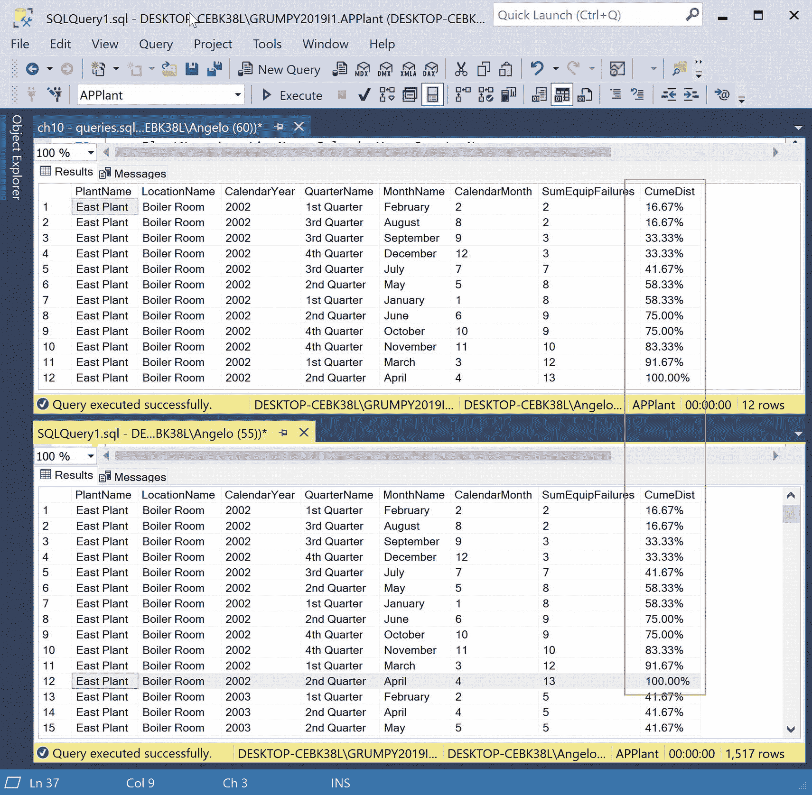

SQL Server Management Studio (SSMS) 窗口截图。它包含两个表，各有 9 列，行数分别为 12 和 1517。列标题为：工厂名称、位置名称、日历年份、季度名称、月份名称、日历月份、设备故障总和、累积分布。累积分布被突出显示。

**图 10-1**
故障累积分布报告

我在红色框中高亮显示了两个查询的第一年结果，以便你可以看到修改后的分区工作正常。

那么，你该如何解读这些结果呢？

查看 2002 年 3 月的值，即东厂锅炉房，我们可以将该值解释为：分区中 91.67% 的值将小于或等于 13 次故障。就这么简单！

接下来，让我们创建我们的分析师要求的 Microsoft Excel 电子表格。请参考图 10-2。

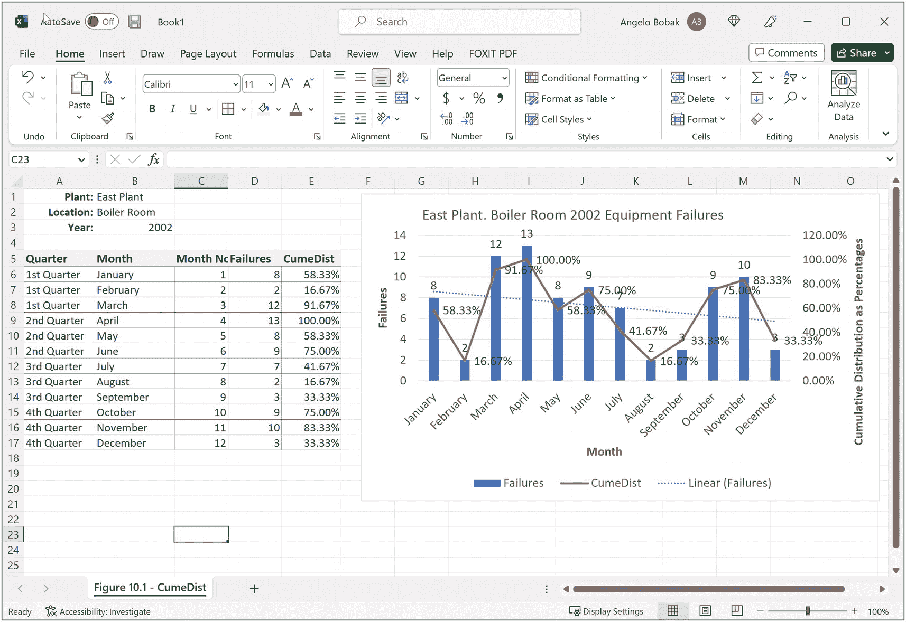

Microsoft Excel 窗口主页截图。它包含一个 5 列 12 行的表格。列标题为：季度、月份、月份编号、故障数、累积分布。它还有一个双 Y 轴的条形-折线组合图，展示了故障数和累积分布值随月份的波动趋势。

**图 10-2**
2002 年东厂锅炉房故障趋势

经过一些格式调整后，我们得到了一份漂亮的报告，其中包含一个显示 2002 年 12 个月故障率的表格。图表显示，随着年份的推进，故障呈下降趋势，其中 4 月份的故障数最高。累积分布值打印在每个月故障数的旁边，这在解释图表时非常有用。

为了生成此报告，我需要按月份编号对数据表进行排序。如果你不想看到这些数字，只想看到月份名称，可以隐藏该列。

为了让你体验一下名为 Report Builder 的 Web 报告工具（Microsoft 免费提供），图 10-3 是我们刚刚用查询生成的数据（省略了 `WHERE` 子句，以便我们可以在报告中筛选位置），它在一个简单的 Report Builder 报告中，并使用了筛选器来显示南厂的情况。

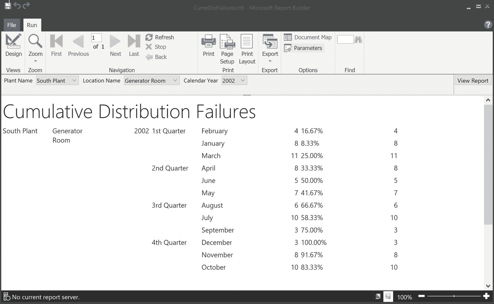

SQL Report Builder 窗口截图，已选择“运行”选项。它呈现了 2002 年南厂发电机房按 4 个季度划分的累积分布故障数据。显示了从一月到十二月所有月份的值。

**图 10-3**
Report Builder 报告

这是该工具创建的报告预览。在下一章中，我将更详细地介绍如何实际创建报告并将其发布到 SSRS（SQL Server Reporting Services）网站。现在，只需知道这是可以添加到你工具包中的另一个重要工具。

以下是我将报告发布到笔记本电脑上的 Microsoft Reporting Services 网站后的样子。注意，我们筛选了北厂的位置。请参考图 10-4。

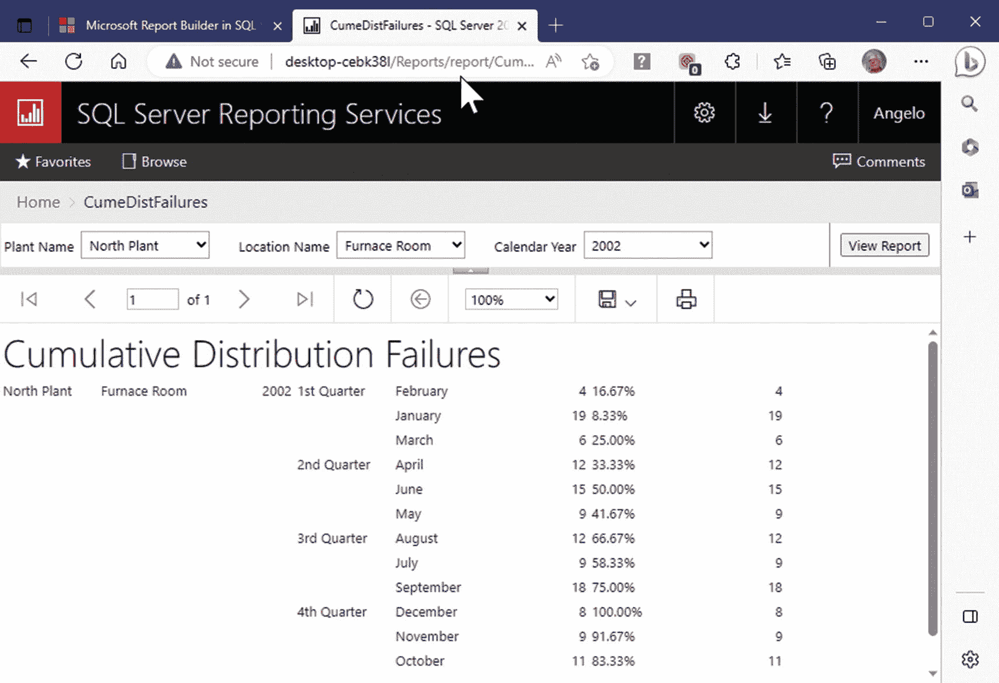

SQL Server Reporting Services 窗口截图。它呈现了 2002 年北厂熔炉房按 4 个季度划分的累积分布故障数据。显示了从一月到十二月所有月份的值。

**图 10-4**
发布在 Reporting Services 上的报告

Reporting Services，昵称 SSRS，是一个完整的 Web 服务器平台，允许你将复杂的报告和仪表板创建并发布到网站上。这是一个强大的工具，可以让业务用户和分析师快速访问他们所需的报告。

好消息是，你可以将其安装在你的笔记本电脑或工作站上，以便对你的报告进行原型设计！

回到示例报告，注意它有三个下拉列表框，因此你可以查看任何工厂、任何位置和任何年份的报告。更多内容将在后面介绍！


#### 性能考量

让我们创建通常的基线估计查询计划，来看看这个查询运行得如何（或无法运行）。

由于这是一个庞大的估计查询计划，它被分成了三个部分。第一部分请参考图 10-5a。

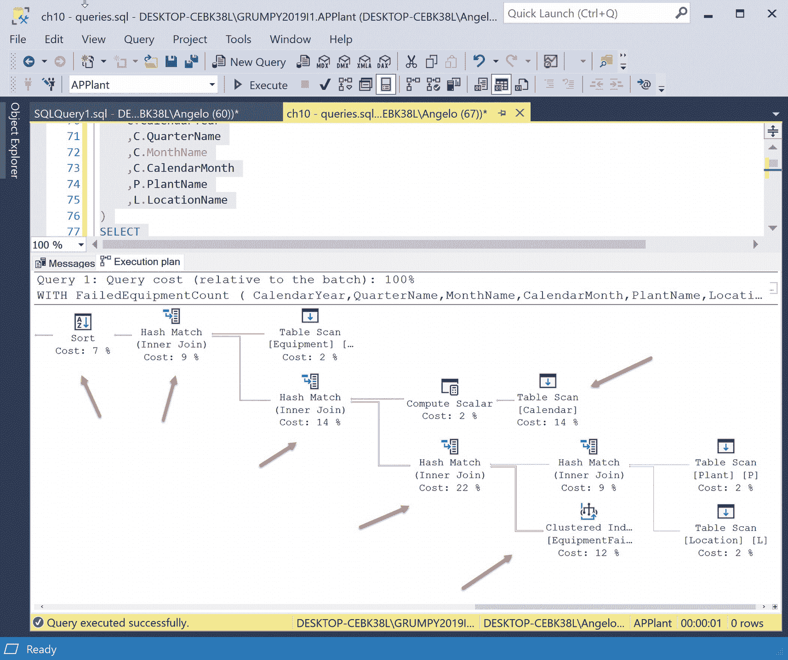

SQL Server Management Studio (SSMS) 窗口的屏幕截图。它展示了包含 11 个组件的估计查询计划的第 1 部分。这些组件是：排序、哈希匹配、表扫描、哈希匹配、计算标量、表扫描、哈希匹配、哈希匹配、聚集索引、表扫描和表扫描。6 条箭头指向 4 种成本类型。

这看起来是一个非常繁忙的计划。从右向左、从下往上看，我们看到对 `Plant` 和 `Location` 表的两个表扫描，每个成本为 2%。这些表可能是内存增强表的候选，或者可以通过创建一个结合这两个表的 `Plantlocation` 表来进行一些反规范化。

接下来是对设备故障报告表的聚集索引扫描，然后是两个成本分别为 22% 和 14% 的哈希匹配任务。

向上移动到中间分支，我们看到对 `Calendar` 表的表扫描，成本为 14%，以及一个成本为 2% 的小型计算标量任务，它们流入哈希匹配任务以合并这两个数据流。此部分计划中的最后一个任务是成本为 7% 的排序任务。

所以我们看到了大量的活动和性能改进的机会。也许可以花时间下载脚本，并在我们讨论时检查查询计划。确保将鼠标指针悬停在每个任务上，以查看弹出面板，其中提供了与每个任务所做工作相关的详细信息。

让我们转到估计查询计划的中间部分。请参考图 10-5b。

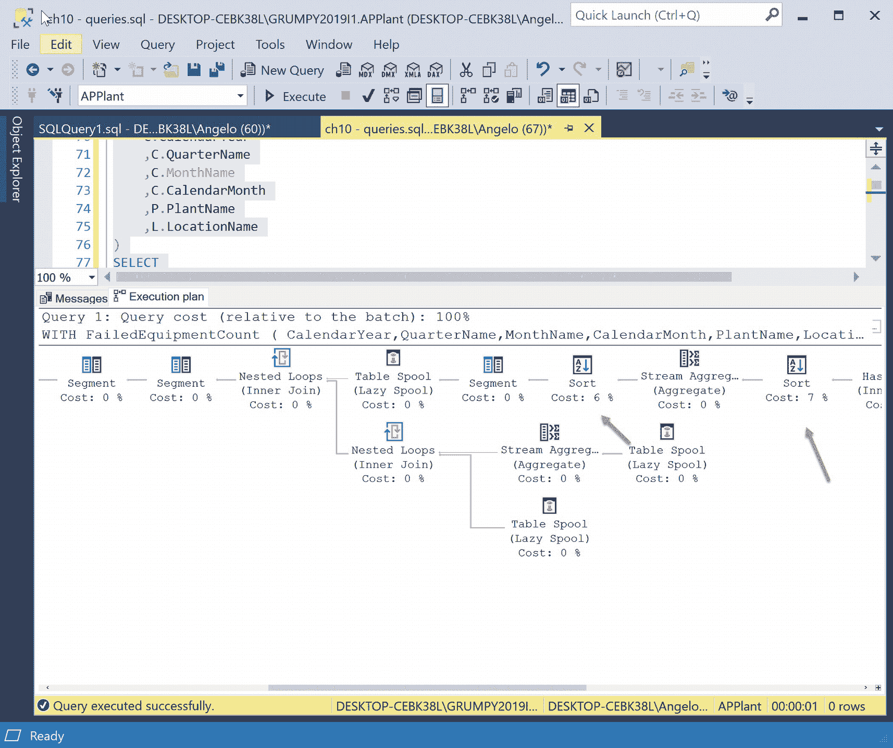

SQL Server Management Studio (SSMS) 窗口的屏幕截图，展示了包含 12 个组件的估计查询计划的第 2 部分，例如：段、段、嵌套循环、表假脱机、段、排序 成本 6%、流聚合、排序 成本 7%、嵌套循环、流聚合、表假脱机和表假脱机。

这里有一个成本为 7% 的排序任务，作为我们刚刚讨论的前一部分的参照点。

有很多任务，但除了成本为 6% 的第二个排序步骤外，所有任务成本均为零。请注意数据流从右向左移动时线条的粗细。这表示有多少数据正在通过。线条越细，行数越少。

通常，线条会随着你向左移动而变细，但当分支合并时，随着更多行通过，线条可能会变粗。

最后但同样重要的是估计执行计划的剩余部分。请参考图 10-5c。

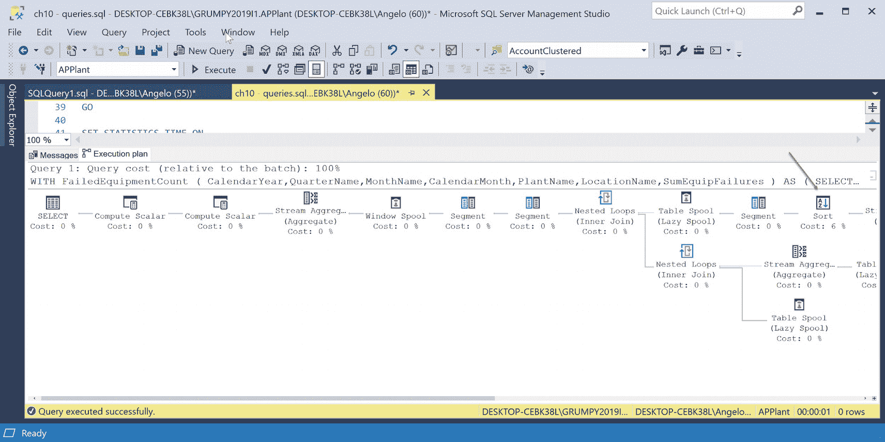

SQL Server Management Studio (SSMS) 窗口的屏幕截图，展示了包含 14 个组件的估计查询计划的第 3 部分：选择、2 个计算标量、流聚合、窗口假脱机、段、段、嵌套循环、表假脱机、段、排序、嵌套循环、流聚合和表假脱机。一个箭头指向排序 成本 6%。

请注意这个成本为 6% 的排序任务，它作为我们刚刚检查的前一部分的参照点。计划的这一部分也很繁忙，但所有成本都是 0%，所以我们就不再深究了。只需注意成本为 0% 的 `窗口假脱机` 任务。通常，0% 成本意味着 `窗口假脱机` 是在内存中执行的，所以这是一件好事。

此任务是必需的，以便被处理的数据可以被多次引用。

### IO 和 时间统计分析

接下来，让我们查看 `IO` 和 `TIME` 统计数据，以更好地了解性能方面的情况。

请参考图 10-6。

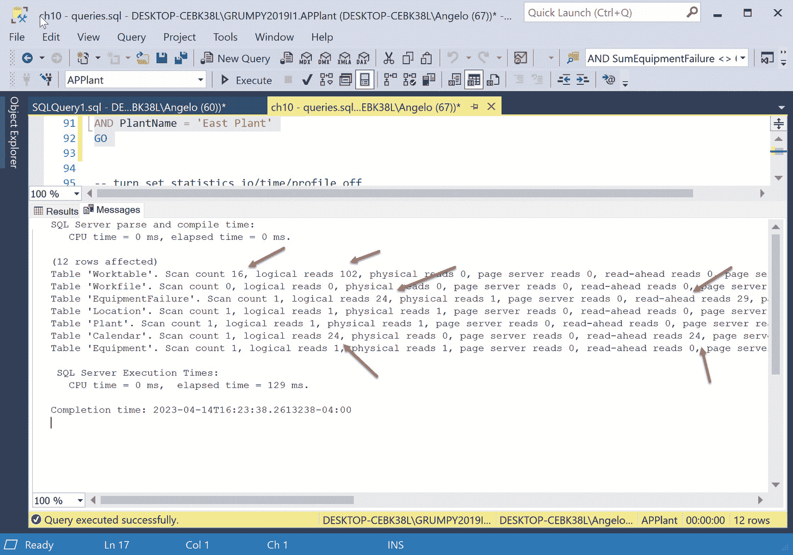

SQL Server Management Studio (SSMS) 窗口的屏幕截图。文本展示了 IO 和 TIME 统计数据。SQL Server 解析和编译时间（CPU 和 已用时间）均为 0 和 0 毫秒。SQL Server 执行时间（CPU 和 已用时间）分别为 0 和 129 毫秒。影响了 12 行，7 个表列。

首先，SQL Server 执行已用时间为 129 毫秒，低于 1 秒，所以我们这里没问题。我们确实看到工作表的扫描计数为 16，逻辑读取为 102。工作文件的值为零，因此我们不用担心这组统计数据。

`EquipmentFailure` 表有 24 次逻辑读取，1 次物理读取和 29 次预读，所以很明显这里发生了一些事情。

除了 `Calendar` 表之外，所有维度表的值都很低。`Calendar` 维度表有 24 次逻辑读取和 24 次预读。

### 结论与建议

那么，我们的结论是什么？我建议你尝试将 `Calendar` 表加载到内存中，方法是将其重建为内存增强表，并且用报表表替换 `CTE`，因为结果是历史数据，因此我们希望尽量减少生成此基础数据的影响。

另外，尝试创建一个结合了工厂和位置信息的反规范化表，并将该表创建为内存增强表。

### 随堂测验答案

以下是随堂测验的答案：

不带 `PARTITION BY` 子句的 `OVER()` 子句的默认行为是：

```
RANGE BETWEEN UNBOUNDED PRECEDING AND CURRENT ROW
```

但是，对于 `CUME_DIST()` 函数，你不能在 `OVER()` 子句中插入窗口帧规范。这是一个陷阱问题。

### 作业

这里有一些作业：

自己尝试完成前面的建议。确保创建具有不同名称的内存增强表，例如 `CalendarMEM`。此外，对两种方法运行一些详细的查询计划以及 `IO/TIME` 统计数据分析，看看结果是否匹配。完成使用后，记得删除内存增强表。


#### FIRST_VALUE() 与 LAST_VALUE() 函数

接下来我们介绍这两个窗口函数。还记得它们吗？

在给定一组已排序的值后，`FIRST_VALUE()` 函数将返回分区中的第一个值。因此，根据你按升序还是降序排序，该值会有所不同！这是数据分区中**第一个位置**的值，而不是数据集中的最小值。

在给定一组已排序的值后，`LAST_VALUE()` 函数将返回分区中的最后一个值。与之前讨论的一样，根据你对分区的排序方式，该值也会不同。

顺便说一下，这两个函数返回的数据类型与作为参数传入的类型相同；它可以是整数、字符串等。如果这里有点不清楚，你可以创建一个包含十行或更多行的自定义表变量，并针对它编写一些查询，这样你就能看到这些窗口函数的行为。稍微练习一下，窗口函数的用法和结果就会变得清晰。

让我们直接看例子。这是我们的业务需求：

我们的分析师希望查看按年份、地点和月份分组的每组故障的第一个和最后一个值。这必须包含所有日历年和工厂，因此结果集会相当大。月份名称和季度名称需要完整拼写出来。

查看这个需求后，我们意识到需要使用 `Calendar VIEW`，它包含用于季度和月份名称的 `CASE` 语句块——这可能会带来性能开销。让我们看看查询语句。

请参考清单 10-2。

```sql
WITH FailedEquipmentCount
(
CalendarYear, QuarterName, MonthName, CalendarMonth, PlantName, LocationName, SumEquipFailures
)
AS (
SELECT
    C.CalendarYear
    ,C.QuarterName
    ,C.MonthName
    ,C.CalendarMonth
    ,P.PlantName
    ,L.LocationName
    ,SUM(EF.Failure) AS SumEquipFailures
FROM DimTable.CalendarView C
JOIN FactTable.EquipmentFailure EF
    ON C.CalendarKey = EF.CalendarKey
JOIN DimTable.Equipment E
    ON EF.EquipmentKey = E.EquipmentKey
JOIN DimTable.Location L
    ON L.LocationKey = EF.LocationKey
JOIN DimTable.Plant P
    ON L.PlantId = P.PlantId
GROUP BY
    C.CalendarYear
    ,C.QuarterName
    ,C.MonthName
    ,C.CalendarMonth
    ,P.PlantName
    ,L.LocationName
)
SELECT PlantName, LocationName, CalendarYear, QuarterName, MonthName,   CalendarMonth, SumEquipFailures
    ,FIRST_VALUE(SumEquipFailures) OVER (
        PARTITION BY PlantName,LocationName,CalendarYear,QuarterName
        ORDER BY CalendarMonth
    ) AS FirstValue
    ,LAST_VALUE(SumEquipFailures) OVER (
        PARTITION BY PlantName,LocationName,CalendarYear,QuarterName
        ORDER BY CalendarMonth
    ) AS LastValue
FROM FailedEquipmentCount
GO
```

清单 10-2 按工厂、地点和年份显示故障的第一个和最后一个值

我们已经开始看到一种趋势正在形成。我们的第一个查询和这个查询似乎使用了相同的 `CTE` 块，因此我们肯定应该考虑基于该 `CTE` 使用一个通用的报告表，而不是每次需要时都重新创建 `CTE`。这是一个简单但有效的性能策略，同时也简化了我们所有解决方案所需的编码。

关于 `OVER()` 子句的逻辑，我们看到为 `FIRST_VALUE()` 和 `LAST_VALUE()` 函数都设置了按工厂、地点、年份和季度的分区。两个函数中使用的 `ORDER BY` 子句也是如此。分区中的行按月份排序。

让我们看看这个查询生成的结果。请参考图 10-7 中的部分结果。

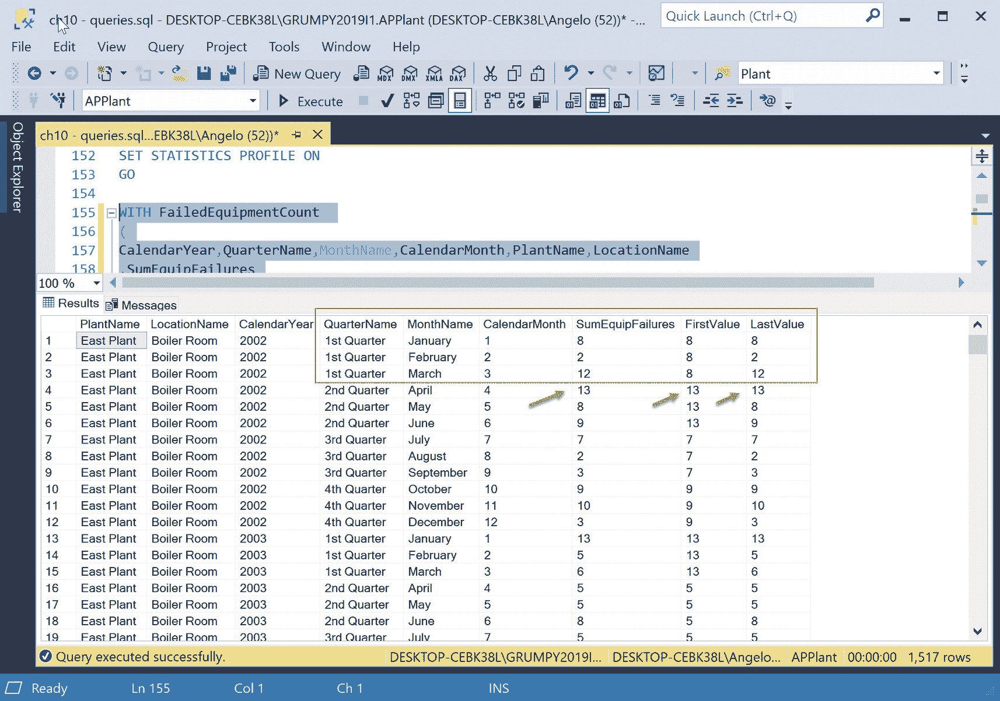

一张 SQL Server Management Studio (SSMS) 窗口的截图。其中有一个包含 10 列和 1517 行的表格。列标题分别是：工厂名称、地点名称、日历年、季度名称、月份名称、日历月份、设备故障总和、第一个值和最后一个值。最后 6 列的顶部部分被框出。

图 10-7 按季度显示的第一个和最后一个故障值

如图所示，一切都排列得很好。请注意，对于每个季度分区的第一行，第一个值和最后一个值是相同的。当我们移动到季度中的第二个月时，值会发生变化，第三个月也是如此。进入下一个季度时，第一个值和最后一个值会重置并且再次相同。这个报告很好地显示了故障按日历季度从小到大的分布情况。

#### 性能考量

让我们创建基线估计查询计划，看看其开销如何。

请参考图 10-8。

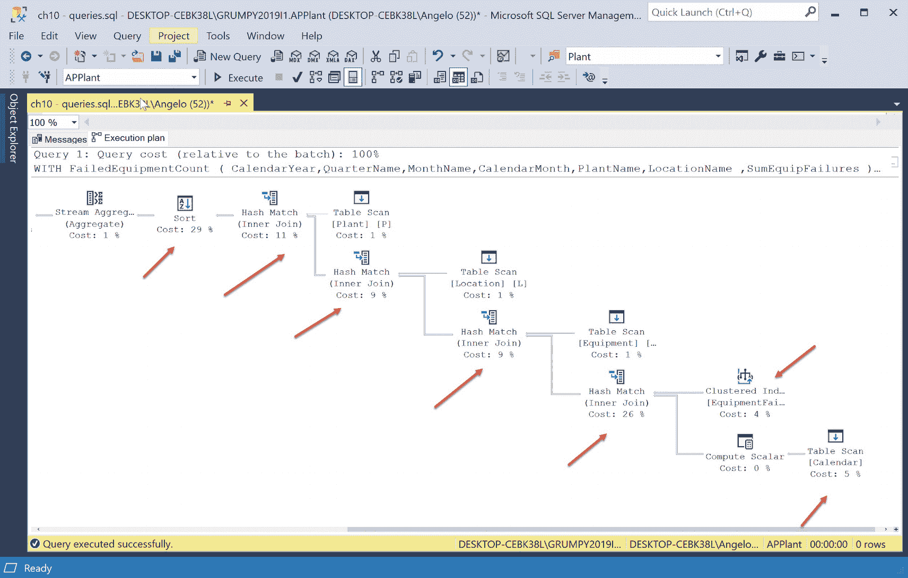

一张 SQL Server Management Studio (SSMS) 窗口的截图，选择了执行计划选项卡。它展示了一个包含 12 个组件的基线查询计划。这些组件分别是：流聚合、排序、哈希匹配、表扫描、哈希匹配、表扫描、哈希匹配、表扫描、哈希匹配、聚集索引、计算标量和表扫描。

图 10-8 第一个和最后一个值的基线估计查询计划

查看高成本操作，我们看到一个聚集索引扫描占 4%（不算太糟，但查找操作会更好），一堆哈希匹配联接的成本从 26% 到 9% 不等，以及三个表扫描各占 1%。最后，在左上角，我们看到一个昂贵的排序操作占 29%，以及一个在计划左侧出现的窗口假脱机操作占 2%（在计划左侧显示）。

为了避免浪费时间，我尝试了一个测试，即通过组合 Plant 和 Location 表进行反规范化，并在查询中用新表替代，但结果实际上更差一些，所以我们就放弃这个策略吧。不过如果你愿意，可以自己试试。

我认为我们能做的改进性能的事情，就是像之前讨论的那样，用报告表替换 `CTE` 块。


### LAG( ) 函数

我们进度落后了，所以接下来来看看下一个函数——`LAG()` 函数（糟糕的双关语！）。

回顾一下 `LAG()` 函数的作用：

该函数用于获取当前行某列值的前一个值（通常在时间维度内）。例如，给定工厂设备（如电机）本月的故障值，获取同一设备 ID 上个月的故障值，或者指定某个偏移量（如三个月前、甚至一年前或更久，这取决于收集了多少历史数据以及你的业务分析师想看什么）。

用这个逻辑来计算差值。故障是上升还是下降了？这是监控设备故障迹象的关键测量指标！也许制造商需要一次严厉的谈话了？

以下是我们分析师想要的查询的规格说明：

需要一个查询来报告滞后一个月的故障率，以便将故障与当月的故障率进行比较。该报告需要包含年份、季度、月份的日历值，以及工厂名称和位置。每个月的值应该是该月所有故障的总和。因此，该报告本质上是历史性的。

请参考代码清单 10-3。

```
WITH FailedEquipmentCount
(
CalendarYear, QuarterName, MonthName, CalendarMonth, PlantName, LocationName, SumEquipFailures
)
AS (
SELECT
C.CalendarYear
,C.QuarterName
,C.MonthName
,C.CalendarMonth
,P.PlantName
,L.LocationName
,SUM(EF.Failure) AS SumEquipFailures
FROM DimTable.CalendarView C
JOIN FactTable.EquipmentFailure EF
ON C.CalendarKey = EF.CalendarKey
JOIN DimTable.Equipment E
ON EF.EquipmentKey = E.EquipmentKey
JOIN DimTable.Location L
ON L.LocationKey = EF.LocationKey
JOIN DimTable.Plant P
ON L.PlantId = P.PlantId
GROUP BY
C.CalendarYear
,C.QuarterName
,C.MonthName
,C.CalendarMonth
,P.PlantName
,L.LocationName
)
SELECT
PlantName, LocationName, CalendarYear, QuarterName, MonthName, CalendarMonth, SumEquipFailures,
LAG(SumEquipFailures,1,0) OVER (
PARTITION BY PlantName, LocationName, CalendarYear, QuarterName
ORDER BY CalendarMonth
) AS LastFailureSum
FROM FailedEquipmentCount
WHERE CalendarYear > 2008
GO
```

## 代码清单 10-3
上月设备故障情况

这个 `CTE` 查询包含一个五表联接 (`JOIN`)，加上 `SUM()` 函数和必不可少的 `GROUP BY` 子句。你知道这可能会导致性能问题。

`OVER()` 子句包含一个 `PARTITION BY` 子句和一个 `ORDER BY` 子句。这意味着窗口帧的默认行为是

```
RANGE BETWEEN UNBOUNDED PRECEDING AND CURRENT ROW
```
真的是这样吗？

实际上，`LAG()` 和 `LEAD()` 函数也不能有窗口帧定义。这是个容易掉进去的陷阱！所以当你使用这个函数或 `LEAD()` 函数时，忘记窗口帧定义吧。如果你想想这些函数是如何工作的，这就说得通了。它们要么向前看，要么向后看，仅此而已！

回到查询。分区是按工厂名称、位置名称、年份和季度设置的。分区按月份（数值）排序。

最后，注意 `LAG()` 函数使用的参数；故障值被包含在内，1 表示回退一个月（第二个参数），0（第三个参数）表示用 0 替换任何 `NULL` 值。尝试更改要跳过的月份数，以感受该函数的工作原理。

请参考图 10-9 中的部分结果。

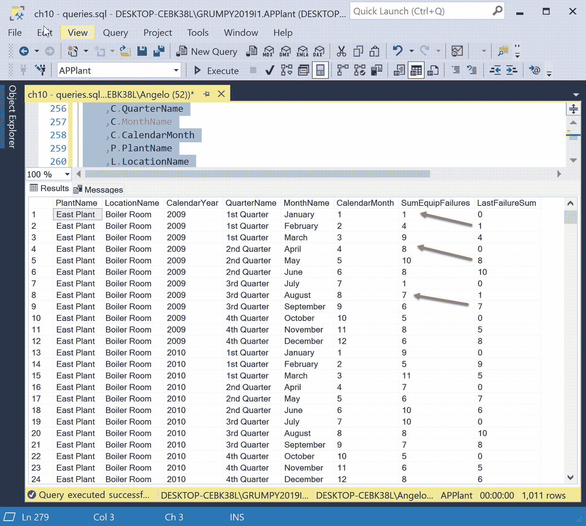

## 图 10-9
设备故障的月度滞后报告

S Q L S S M S 窗口的截图。它有一个包含 9 列和 1011 行的表格。列标题是工厂名称、位置名称、日历年度、季度名称、月份名称、日历月份、设备故障总和以及上次故障总和。有 3 个箭头指向设备故障总和的值。

注意零值。这些标记了分区的开始，因此之前的行（月份）被忽略。不过一切都对齐了。

如果我们添加一个计算，用当前月份的故障值减去滞后值，我们就可以看到故障率的变化。试试这段代码片段：

```
,SumEquipFailures –
LAG(SumEquipFailures,1,0) OVER
(
PARTITION BY PlantName,LocationName,CalendarYear,QuarterName
ORDER BY CalendarMonth
) AS FailureChange
```

这是一个很好的指标，可以判断故障是上升还是下降。


#### 性能考量

让我们按照通常的方式创建我们的基线估计查询性能计划。我将估计的执行计划分成了两部分，以便这次能看到所有步骤。

请参考图 10-10a。

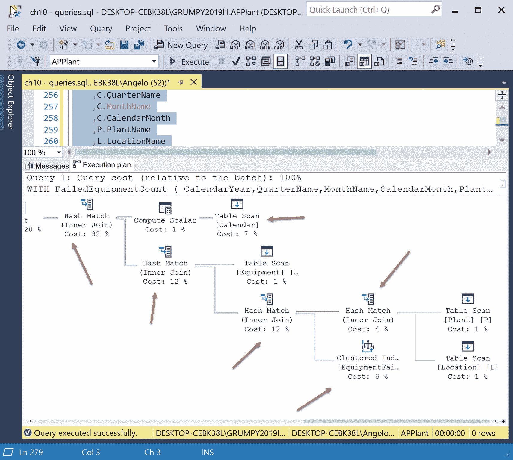

一个 SQL Server Management Studio (SSMS) 窗口的截图。它展示了估计查询性能计划的第 1 部分，包含 10 个组件。这些组件是哈希匹配、计算标量、表扫描、哈希匹配、表扫描、哈希匹配、哈希匹配、聚集索引扫描、表扫描和表扫描。

**图 10-10a**
LAG 函数的估计查询性能计划 – 第 1 部分

从右上方开始，我们看到熟悉的对 Calendar 维度表的表扫描，其成本为 7%。我们看到一个聚集索引扫描（索引查找更好），成本为 6%，但由于我们需要检索 `CTE` 中的所有行，所以无法避免。

接下来，我们看到四个哈希匹配连接操作，成本分别为 4%、12%、12%和 32%。这里有很多处理！让我们检查计划的左侧部分。

请参考图 10-10b。

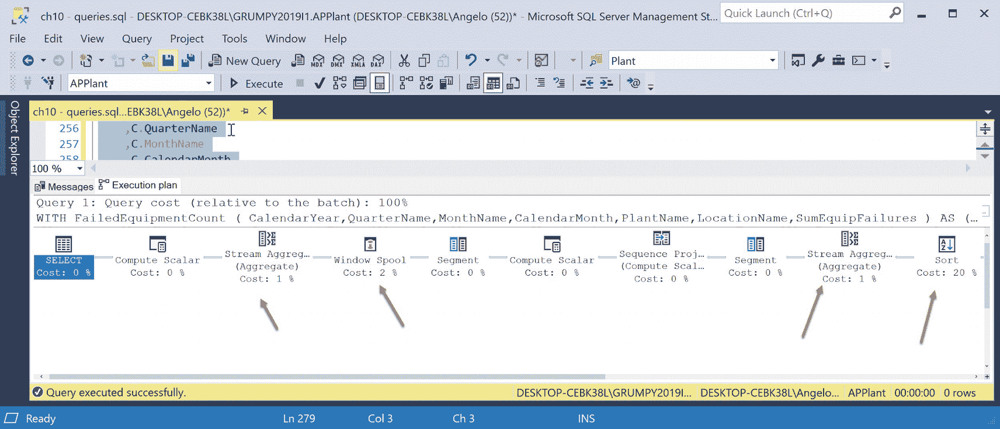

一个 SQL Server Management Studio (SSMS) 窗口的截图。它展示了估计查询性能计划的第 2 部分，包含 10 个组件。这些组件是选择、计算标量、流聚合、窗口假脱机、段、计算标量、序列投影、段、流聚合和排序。

**图 10-10b**
LAG 函数的估计查询性能计划 – 第 2 部分

从右侧开始，我们看到一个成本为 20%的排序步骤和一个成本为 1%的流聚合步骤。让我们忽略成本为 0%的任务，然后是我们成本为 2%的窗口假脱机，后面跟着一个成本为 1%的流聚合任务。请记住，2%的窗口假脱机表示假脱机操作是在物理存储中执行的。唯一的性能改进增强点是检查 `TEMPDB` 是否可以放置在固态硬盘上。

所以，步骤很多，但它们都是必要的吗？

回想一下，规范说明报告是月度历史报告，因此 `CTE` 方法可能不是最佳方法。我尝试修改查询，使 `SUM()` 函数出现在基础查询中，而不是 `CTE` 查询中，使用以下代码：

```
SUM(EquipFailures) AS SumEquipFailures,
LAG(SUM(EquipFailures),1,0) OVER (
PARTITION BY PlantName,LocationName,CalendarYear,QuarterName
ORDER BY CalendarMonth
) AS LastFailureSum
```

尽管这表明可以将聚合函数插入到 `LAG()` 函数内，但就估计查询计划而言，它并没有带来任何改进。我还移除了 `GROUP BY` 子句并将其包含在基础查询中。如果你想要尝试一下，可以在脚本中找到这段代码。

但在我们下结论之前，让我们先看看 `IO` 和 `TIME` 统计信息。

请参考图 10-11。


一个 SQL Server Management Studio (SSMS) 窗口的截图，在视图选项卡下，展示了 IO 和 TIME 统计信息。SQL Server 的解析和编译时间，CPU 和已用时间分别为 0 和 86 毫秒。SQL Server 的执行时间，CPU 和已用时间分别为 46 和 201 毫秒。影响了 1011 行，7 个表列。

**图 10-11**
LAG() 报告的 IO 和 TIME 统计信息

我们在这里看到了一个趋势。想象一下，你是负责所有开发这些报告的开发人员的经理，你不断看到相同的数值，因为当然，相同的 `CTE` 块被用于分析。同一个 `CTE` 块汇总故障，但在各种查询中使用了不同的分析窗口函数。

`EquipmentFailure` 报告表的扫描计数为 1，逻辑读取为 24，物理读取为 1，预读读取为 29。注意方框部分显示扫描计数和逻辑读取值为 1，以及我们的老朋友 Calendar 表显示 24 次逻辑读取。


如果这还不足以证明我们需要将 `CTE` 放入报告表中！

## 报告表需求与加载策略

此外，让我们修订一下需求场景，使其反映出在报告发布到 `SSRS` 网站后，将有多个用户（最多 10-20 人）运行此报告。报告需要筛选器，以便用户可以选择年份。

目前，该报告针对单个年份返回 1,011 行。用户很可能希望不仅能按年份筛选，还能按工厂、地点和年份进行筛选。从长远考虑，将 `CTE` 实现为一个每月加载一次的报告表是合理的。一个额外的复杂因素可能是用户希望获取历史数据，但同时希望对当月数据进行每日加载，因此需要修订加载策略：

一次性加载所有之前的月份数据，然后在当月的每一天晚上仅加载当天的数据。这样，我们就可以在非高峰时段完成事实表与四个维度表之间所有那些耗费性能的 `JOIN` 操作。

让 20 个用户每天多次执行基于 `CTE` 的查询是毫无意义的。以下是我们将用于执行一次性加载的 `INSERT` 命令。

## 实现报告表

请参考代码清单 10-4。

```sql
INSERT INTO Reports.PlantSumEquipFailures
SELECT
C.CalendarYear, C.QuarterName, C.MonthName, C.CalendarMonth, P.PlantName,L.LocationName, SUM(EF.Failure) AS SumEquipFailures
FROM DimTable.CalendarView C
JOIN FactTable.EquipmentFailure EF
ON C.CalendarKey = EF.CalendarKey
JOIN DimTable.Equipment E
ON EF.EquipmentKey = E.EquipmentKey
JOIN DimTable.Location L
ON L.LocationKey = EF.LocationKey
JOIN DimTable.Plant P
ON L.PlantId = P.PlantId
-- 以下是每日加载
-- 使用下面的 WHERE 子句获取当天的数值。
-- WHERE C.CalendarDate = CONVERT(DATE,GETDATE())
-- 以下是单次获取所有上月数据加载
-- 使用下面的 WHERE 子句获取上个月的所有数值。
-- WHERE MONTH(C.CalendarDate) = DATEDIFF(mm,MONTH(CONVERT(DATE,GETDATE())))
GROUP BY
C.CalendarYear
,C.QuarterName
,C.MonthName
,C.CalendarMonth
,P.PlantName
,L.LocationName
ORDER BY
C.CalendarYear
,C.QuarterName
,C.MonthName
,P.PlantName
,L.LocationName
GO
```
**代码清单 10-4**
加载报告表

`INSERT` 语句很直接。它基于 `CTE`，因此我不再重复讨论，但请注意其中注释掉的 `WHERE` 子句。

第一个可用于 `INSERT` 查询以获取当天的故障数据。第二个 `WHERE` 子句可用于一次性加载，以检索所有之前月份的故障数据。因此，现在在非高峰时段的查询应该会很快，因为它仅检索当天的故障数据。

## 查询报告表

代码清单 10-5 是修订后的查询，可轻松用于不仅包含年份筛选器，还包含工厂和地点筛选器的 `SSRS` 报告。

```sql
SELECT
PlantName, LocationName, CalendarYear, QuarterName,
MonthName, CalendarMonth, SumEquipFailures,
LAG(SumEquipFailures,1,0) OVER (
PARTITION BY PlantName,LocationName,CalendarYear,QuarterName
ORDER BY CalendarMonth
) AS LastFailureSum
FROM Reports.PlantSumEquipFailures
WHERE CalendarYear > 2008
GO
```
**代码清单 10-5**
查询报告表

非常简单。让我们看看新的修订计划。

## 性能分析：查询计划对比

请参考图 10-12a。

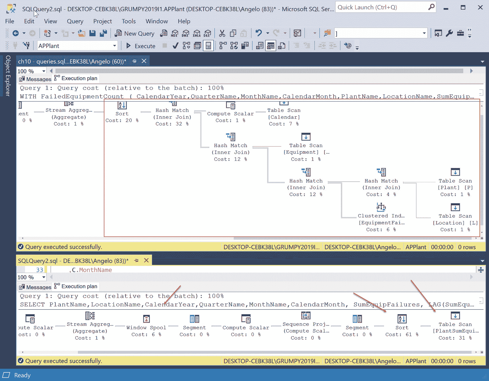

一个 `SQL` `SSMS` 窗口的截图。它展示了原始和新查询计划的第 1 部分，包含 12 个和 9 个组件。原始查询计划的 11 个组件被勾勒出来。在新查询计划中，流聚合、窗口假脱机、排序和表扫描的成本分别为 1%、6%、61% 和 31%。

**图 10-12a**
原始与新查询计划对比 – 第 1 部分

新的估计执行计划步骤更少，并且没有哈希匹配联接，尽管如计划最后部分所见，排序步骤和窗口假脱机步骤的成本显著增加。这或许更好，或许不然！

请参考图 10-12b。

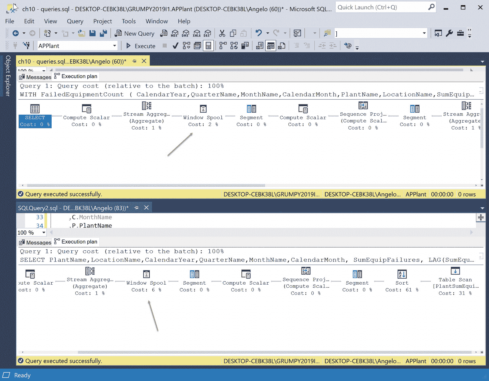

一个 `SQL` `SSMS` 窗口的截图。它展示了原始和新查询计划的第 2 部分，包含 9 个组件。在原始计划中，流聚合和窗口假脱机的成本分别为 1% 和 2%。在新计划中，流聚合、窗口假脱机、排序和表扫描的成本分别为 1%、6%、61% 和 31%。

**图 10-12b**
原始与新查询计划对比 – 第 2 部分

排序步骤增加到 41%，窗口假脱机从 2% 增加到 6%。`IO` 和 `TIME` 统计数据看起来怎么样？

## 性能分析：IO 与时间统计

请参考图 10-12c。

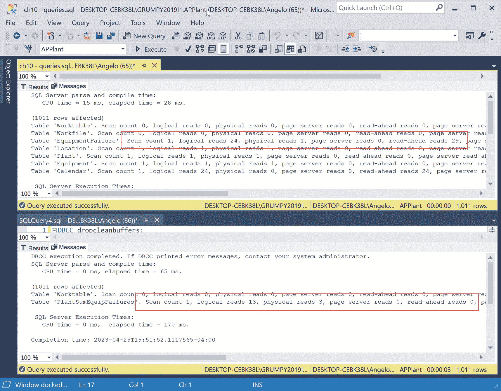

一个 `SQL` `SSMS` 窗口的截图。文本展示了 2 组 `IO` 和 `TIME` 统计数据。在第一次和第二次中，解析和编译时间的 `CPU` 和已用时间分别为 15、28 毫秒和 0、65 毫秒。第二次执行时间的 `CPU` 和已用时间分别为 0 和 170 毫秒。影响了 1011 行。

**图 10-12c**
IO 与 TIME 统计数据对比

一图胜千言。新查询中的统计信息更少，并且只使用了一个工作表，而旧查询中使用了一个工作表和一个工作文件。

逻辑读取从旧查询的 24 次下降到新查询的 13 次。物理读取虽然从 1 次上升到 3 次，但预读读取从 29 次下降到 0 次。

现在查看所有这些统计信息有点繁琐，但你需要学习并实践这种规范，因为在工作环境中创建生产级别的查询时，它会派上大用场。

**小测验**
如何开启 `IO` 和 `TIME` 统计？


#### LEAD( ) 函数

`LAG()` 函数的对应函数是 `LEAD()` 函数。此函数用于获取相对于当前行的下一行数据值。例如，给定某产品本月的销售额，可以提取该产品下个月的销售额，或指定某个偏移量，比如未来三个月甚至一年的销售额（当然是历史数据；从当前无法预见未来，如果你的数据库不存在未来数据，它也同样无法预见）。

因此，此函数只能用于截至当前日期的历史上下文。**尚不存在未来的值！**

现在来看一下业务分析师的需求：

我们的分析师希望看到与上一个报告相同类型的报告，但这次他们希望看到从当前月份（时间上）到随后的下个月之间的变化。幸运的是，我们现在有了报告表，不再需要使用基于 `CTE` 的查询。

请参考清单 10-6。

```sql
SELECT
PlantName,LocationName,CalendarYear,QuarterName,MonthName
,CalendarMonth,SumEquipFailures
,LEAD(SumEquipFailures,1,0) OVER (
PARTITION BY PlantName,LocationName,CalendarYear,QuarterName
ORDER BY CalendarMonth
) AS NextFailureSum
FROM [Reports].[PlantSumEquipFailures]
WHERE CalendarYear > 2008
GO
```

清单 10-6

设备故障 LEAD 查询

我们所做的只是复制粘贴了上一个查询，并使用 `LEAD()` 函数替代了 `LAG()` 函数。让我们在图 10-13 中查看结果。

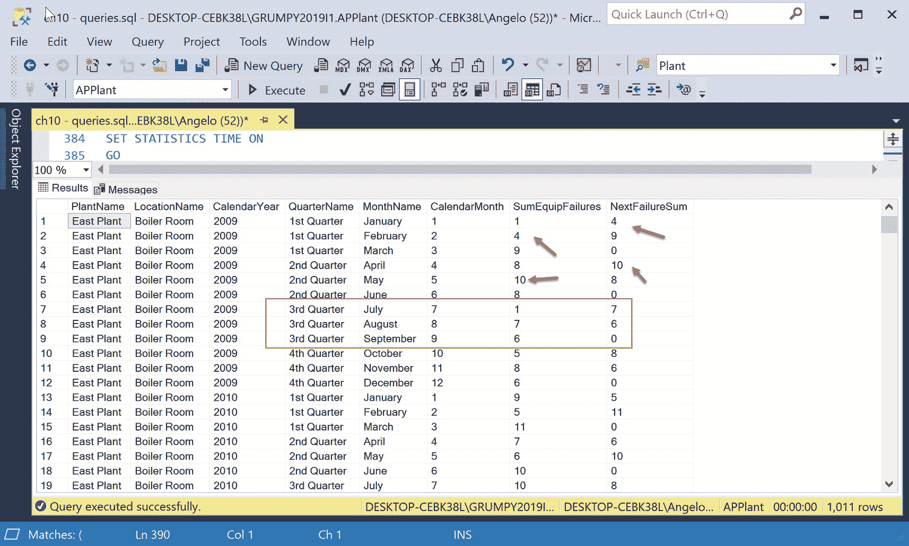

一个 S Q L, S S M S 窗口的截图。它有一个包含 9 列和 1011 行的表。列标题为：工厂名称、地点名称、日历年、季度名称、月份名称、日历月份、设备故障总数和下期故障总数。最后 5 列的第 7、8 和 9 行被框出。

图 10-13

当月与下月故障

如图所示，此函数也运行良好。请注意，当处理新季度时，下个月的值是如何重置的，这正是我们在 `PARTITION BY` 子句中指定的那样。

家庭作业

使用此函数和上一个函数，添加逻辑以计算上个月故障值与当前月故障值之间的差值。同时对 `LEAD()` 函数执行相同操作。即，计算当前值与下个月值之间的差异。创建一个大型查询并进行一些性能分析。如果你遇到困难，本章脚本中包含了此作业的代码。

性能分析时间！

### 性能注意事项

让我们以通常的方式创建一个基线估计查询计划。请记住，你不能为 `LEAD()` 或 `LAG()` 函数指定 `RANGE` 或 `ROW` 窗口框架。因此，你只能相对于当前月向前看，或从当前月向后看。

回到查询。`OVER()` 子句中包含了 `PARTITION BY` 和 `ORDER BY` 子句。

我想我们可以推断出哪些任务会有较高的百分比值。请参考图 10-14。

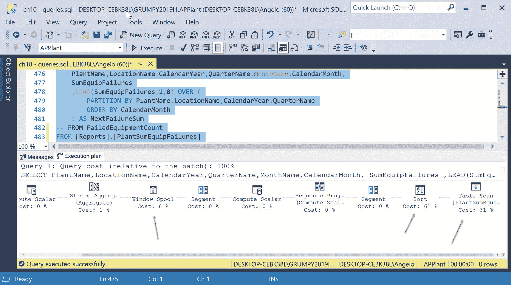

一个 S Q L, S S M S 窗口的截图。它展示了一个包含 9 个组件的基线估计查询计划。这些组件是：计算标量、流聚合、窗口假脱机 成本 6%、段、计算标量、序列投影、段、排序 成本 41%、表扫描 成本 31%。

图 10-14

LEAD 函数查询的基线估计查询计划

如果你猜到我们会看到代价高昂的排序和窗口假脱机任务，那么你是正确的。请注意，排序任务占比 61%，窗口假脱机任务占比 6%。我们正在处理的表对于建立索引来说太小了，因此我们将通过查看 `IO` 和 `TIME` 统计信息来结束分析。

请参考图 10-15。

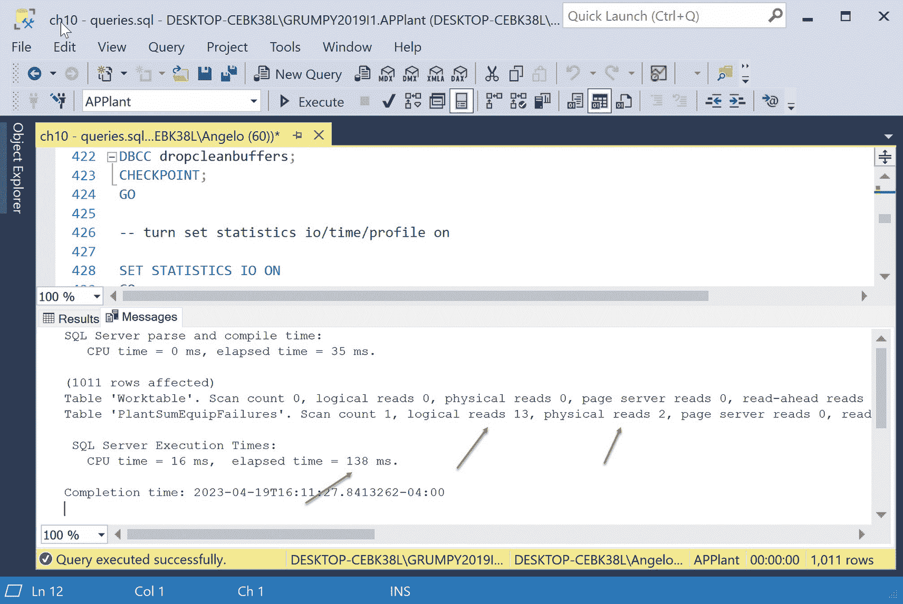

一个 S Q L, S S M S 窗口的截图。文本显示了 I O 和 TIME 统计信息。S Q L 服务器解析和编译时间，C P U 和 已用时间 分别为 0 和 35 毫秒。S Q L 服务器执行时间，C P U 和 已用时间 分别为 16 和 138 毫秒。影响了 1011 行，2 个表列。

图 10-15

`LEAD()` 函数的 IO 和 TIME 统计信息

情况不算太糟：工作表的所有值均为零，报告表的扫描计数为 1，逻辑读取为 13，物理读取为 2。

我认为我们现在可以达成共识：当使用窗口函数处理历史数据时，我们应始终考虑使用某种形式的非规范化报告表作为基表，以替代任何 `CTE`。这种方法将提供良好的性能，特别是当多个用户通过报告或直接使用 SSMS 执行相同查询时。

随堂测验答案

如何开启 `IO` 和 `TIME` 统计信息？

执行以下命令：

```sql
SET STATISTICS IO ON
GO
SET STATISTICS TIME ON
GO
```

要关闭它们，只需将 `ON` 关键字替换为 `OFF`。


### `PERCENT_RANK()` 函数

接下来介绍的是 `PERCENT_RANK()` 函数。它是做什么用的呢？我们已在第 3 章讨论过，但为了方便您回顾，或者如果您没有按顺序阅读各章，这里再做一个简要说明。

这个函数使用查询结果、分区或表变量之类的数据集，计算每个独立值在整个数据集中（以百分比形式）的相对排名。你需要将结果（返回值为浮点数）乘以 100.00，或者使用 `FORMAT()` 函数将结果转换为百分比格式（顺便说一下，这个函数返回的是 `FLOAT(53)` 数据类型）。

此外，它的行为与 `CUME_DIST()` 函数非常相似；至少微软的文档是这么说的。

你也会发现它与 `RANK()` 函数非常相似（至少在理论上是这样）。`RANK()` 函数返回值的位置，而 `PERCENT_RANK()` 返回一个百分比值。我们将把这个函数与刚刚讨论的 `CUME_DIST()` 函数一起使用，以便比较结果，并观察它对我们即将生成的查询计划的影响。

我们友好的业务分析师提供了以下规格说明：

需要一份报告，显示所有工厂、所有年份按工厂、位置、年份、季度和月份划分的百分比排名和累积分布。计算应基于年份、工厂名称和位置的分组。

基于这些简单的规格说明，代码清单 10-7 展示了 `TSQL` 查询。

```sql
SELECT
PlantName,LocationName,CalendarYear,QuarterName,MonthName,CalendarMonth
,SumEquipFailures
,FORMAT(PERCENT_RANK() OVER (
PARTITION BY CalendarYear,PlantName,LocationName
ORDER BY CalendarYear,PlantName,LocationName,SumEquipFailures
),'P') AS PercentRank
,FORMAT(CUME_DIST() OVER (
PARTITION BY CalendarYear,PlantName,LocationName
ORDER BY CalendarYear,PlantName,LocationName,SumEquipFailures
),'P') AS CumeDist
FROM [Reports].[PlantSumEquipFailures]
GO
```
代码清单 10-7
百分比排名 vs. 累积分布

请注意，这次没有使用 `CTE`。我们现在使用预先计算好的故障总和报告表，以简化查询并提高性能。

两个函数的分区都是按年份、工厂名称和位置名称设置的。`ORDER BY` 子句使用了年份、工厂名称、位置名称以及设备故障总和值进行声明。让我们看看窗口函数返回的值是如何比较的。

请参考图 10-16 中的部分结果。

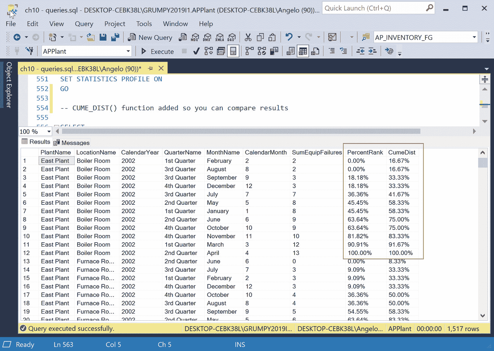

一张 SQL Server Management Studio (SSMS) 窗口的截图。显示一个包含 10 列和 1517 行的表格。列标题为：工厂名称、位置名称、日历年、季度名称、月份名称、日历月份、设备故障总和、百分比排名和累积分布。最后两列的 12 行被框出。

图 10-16
设备故障的百分比排名和累积分布

两个函数的结果相似，但差异不大。分区设置正确，我们可以看到按工厂、位置和年份划分的月度结果。看起来在 2002 年，锅炉房在四月份的故障最多，而二月和八月则完全没有故障。

让我们看看这个查询的估计执行计划。

#### 性能考量

让我们创建基线估计执行计划，以便进行一些分析。我们需要再次将计划分成两部分，因为它相当大。

请参考图 10-17a。

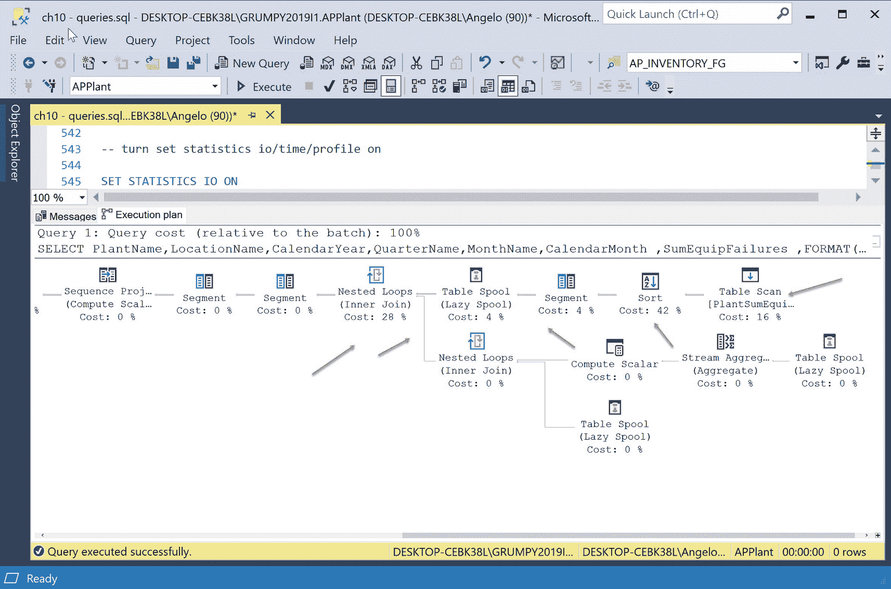

一张 SQL Server Management Studio (SSMS) 窗口的截图。展示了基线估计查询计划的第 1 部分，包含 13 个组件。组件包括：序列投射、段、段、嵌套循环、表假脱机、段、排序、表扫描、嵌套循环、计算标量、流聚合以及 2 个表假脱机。

图 10-17a
基线估计查询计划，第 1 部分

首先，我需要说明报告表只有 1,517 行，所以并不大，但看看估计性能计划如何将其分解为多个任务会很有意思。其次，查询运行时间不到一秒，所以何必费事呢？因为熟能生巧，这就是原因！

我们可以看到很多活动。表扫描占比 16%，其次是排序（42% 成本）、段（4% 成本）和表假脱机（4% 成本），然后与底部通过嵌套循环连接（28% 成本）的分支合并。在我们的性能分析之旅中，排序和连接似乎总是成本较高。虽然我们使用的是小表，但如果表的数据量很大，我们就需要考虑在维度代理键上建立索引。

让我们看看计划的后半部分。

请参考图 10-17b。


一张 SQL Server Management Studio (SSMS) 窗口的截图。展示了基线估计查询计划的第 2 部分，包含 9 个组件。组件包括：选择、计算标量、计算标量、流聚合（成本 1%）、窗口假脱机（成本 4%）、段、段、段、序列投射和段。

图 10-17b
基线估计查询计划，第 2 部分

从右向左看，我们看到一个窗口假脱机（4% 成本）和一个流聚合（1% 成本）。

我们返回了很多行，所以我们看到了很多窗口假脱机操作。请记住，窗口假脱机任务的百分比高于零意味着假脱机操作是在物理磁盘上执行的。因此，这个表可以考虑作为内存增强表的候选。

我尝试基于 `PARTITION BY` 子句和 `ORDER BY` 子句中的列添加聚集索引，但改进微乎其微，所以我甚至懒得展示结果。不过，我确实在本章的脚本中包含了索引代码。

让我们把注意力转到这个查询有 1,517 行这个事实上。当你添加一个 `WHERE` 子句来只过滤一年时，会发生什么？我们的分析师会允许修改，以便我们根据年份、工厂和位置来过滤行吗？让我们修改查询并尝试一下。

请参考代码清单 10-8。

```sql
SELECT
PlantName,LocationName,CalendarYear,QuarterName,MonthName,CalendarMonth
,SumEquipFailures
,FORMAT(PERCENT_RANK() OVER (
PARTITION BY CalendarYear,PlantName,LocationName
ORDER BY CalendarYear,PlantName,LocationName,SumEquipFailures
),'P') AS PercentRank
,FORMAT(CUME_DIST() OVER (
PARTITION BY CalendarYear,PlantName,LocationName
ORDER BY CalendarYear,PlantName,LocationName,SumEquipFailures
),'P') AS CumeDist
FROM [Reports].[PlantSumEquipFailures]
WHERE PlantName = 'East Plant'
AND LocationName = 'Boiler Room'
AND CalendarYear = 2002
GO
```
代码清单 10-8
添加 WHERE 子句

如你所见，查询是硬编码的，因此它过滤出工厂为 "East Plant"、锅炉房、年份为 2002 的结果。分析师想要所有年份、工厂和位置的数据，但让我们看看这次修改后的性能计划。

请参考图 10-18。

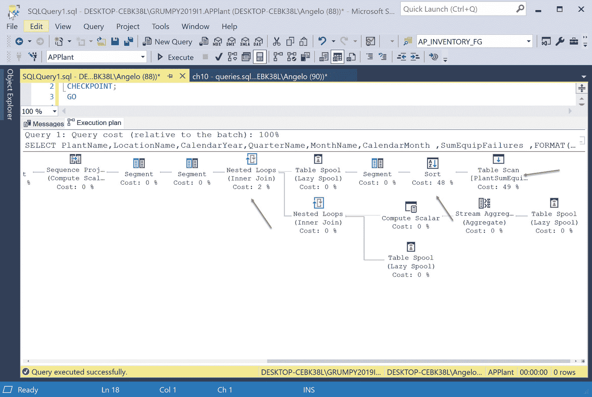


#### 随堂测验

哪些分析窗口函数不支持窗口框架规范（`ROWS` 和 `RANGE`）？请在附录 A 或本章开头寻找答案。或许这个问题是在问哪两个函数支持此规范？

现在是百分位连续函数和离散函数的时间了。

### PERCENTILE_CONT 函数

我们将首先讨论 `PERCENTILE_CONT()` 函数，这个函数是做什么的呢？

如果你读过第 7 章，你会记得它作用于一组连续的数据。

回想一下什么是连续数据。连续数据是在一段时间内测量的数据，例如 24 小时内设备的锅炉温度，或一段时间内的设备故障次数。

举例来说：将每个锅炉温度相加得到一个总数是没有意义的。将锅炉温度相加然后除以时间段以获得平均值则是有意义的。因此我们可以说，连续数据可以通过使用诸如平均值等公式进行测量。

总之，`PERCENTILE_CONT()` 函数基于一个指定的百分位数，在连续数据集上进行计算，以返回数据集中满足该百分位的一个值（你需要提供一个百分位参数，如 .25、.50、.75 等）。

使用此函数时，该值是经过插值计算的。它通常并不实际存在，因此需要进行插值。或者，碰巧如果数字排列正确，它也可能使用数据集中的某个现有值。

以下是此查询的业务需求：

我们需要了解 2004 年工厂“PP000002”中“2 号锅炉”的每日温度分布情况。报告需要显示 25%、50%和 75%的百分位连续值。

需求描述简单，但由于表中有超过 250 万行数据，这将会很有趣。请参考代码清单 10-9。

```sql
SELECT PlantId
,LocationId
,LocationName
,BoilerName
,CalendarDate
,Hour
,BoilerTemperature
,PERCENTILE_CONT(.25) WITHIN GROUP (ORDER BY BoilerTemperature)
OVER (
PARTITION BY CalendarDate
) AS [PercentCont .25]
,PERCENTILE_CONT(.5) WITHIN GROUP (ORDER BY BoilerTemperature)
OVER (
PARTITION BY CalendarDate
) AS [PercentCont .5]
,PERCENTILE_CONT(.75) WITHIN GROUP (ORDER BY BoilerTemperature)
OVER (
PARTITION BY CalendarDate
) AS [PercentCont .75]
FROM EquipStatistics.BoilerTemperatureHistory
WHERE PlantId = 'PP000002'
AND YEAR(CalendarDate) = 2004
AND BoilerName = 'Boiler 2'
GO
```

代码清单 10-9：月度故障的百分位连续分析

报告足够简单。`PERCENTILE_CONT()` 函数被使用了三次，每个所需的百分位一次。数据是连续的，因为我们是按时间（具体是天和小时）对其进行剖析。让我们看看结果。

请参考图 10-20 中的部分结果。

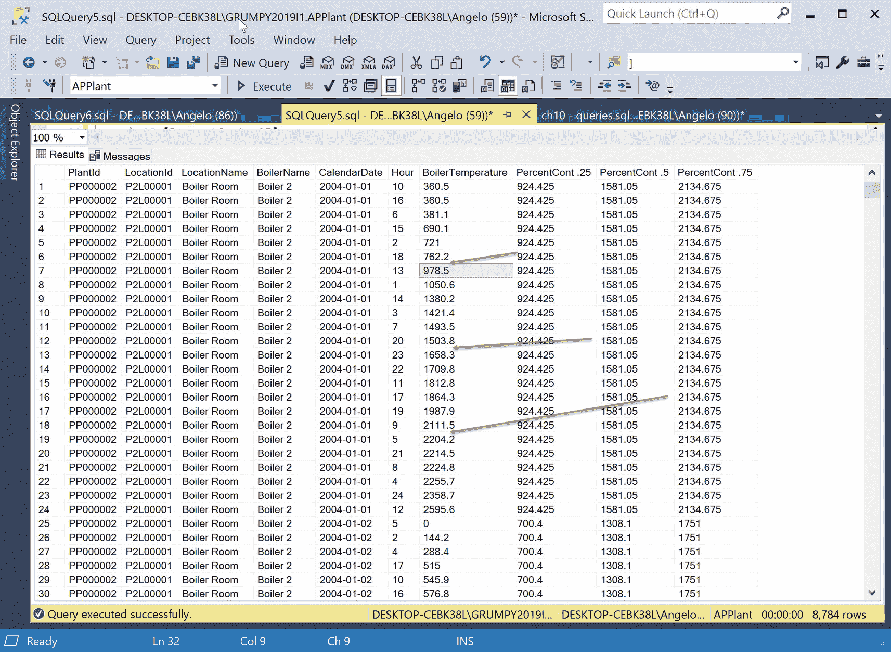

一张 SQL Server Management Studio 窗口的截图。其中有一个包含 11 列和 8784 行的表格。列标题分别是：Plant I D、Location I D、位置名称、锅炉名称、日历日期、小时、锅炉温度、百分位连续 0.25、百分位连续 0.50 和百分位连续 0.75。

查询运行非常快。它在一秒钟内完成，返回了 8,784 行数据。请注意每个百分位值是如何被插值计算出来的。箭头标出了它们如果存在时应处的位置。例如，对于第 25 个百分位，值 924.425 落在 762.2 和 978.5 这两个值之间。这意味着在分区中，有 25% 的值小于或等于这个不存在的值。

对于其他例子，只需跟随箭头指示即可。最后，提醒一下，这个查询不允许你指定 `ROWS` 或 `RANGE` 窗口框架规范。尝试也没有用，因为你会收到语法错误消息：

```sql
Msg 10752, Level 15, State 1, Line 52
The function 'PERCENTILE_CONT' may not have a window frame.
```

那么，这个查询在 250 万行数据上的表现如何呢？


### 性能考虑

让我们按照常规方式创建基线估计查询计划。正如我所说，这个查询访问的表有超过 250 万行数据，那么让我们看看计划中是否有任何重大意外！

请参考图 10-21a。

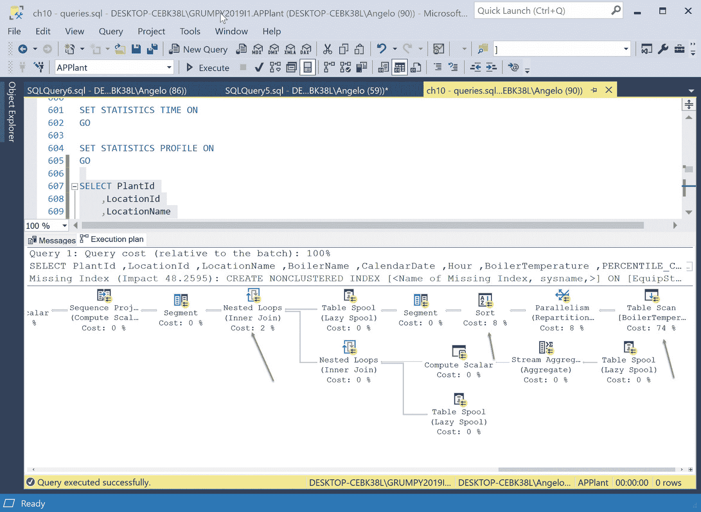
SQL SSMS 窗口的截图。它展示了一个包含 13 个组件的基线估计查询计划。这些组件是序列投射、段、嵌套循环 2%、表假脱机、段、排序 8%、并行 ism、表扫描 74%、嵌套循环、计算标量、流聚合和 2 个表假脱机。
**图 10-21a**
基线估计查询计划

我们立刻可以看出缺少了一个索引，所以我们稍后会创建它。我们在那个拥有 250 万行的表上有一个代价为 74%的表扫描，所以这是非常昂贵的。紧随其后的是一个代价为 8%的并行 ism 重分区任务和一个代价为 8%的排序任务。

较低级别的分支任务代价均为 0%，因此我们不予讨论。我们确实看到一个代价为 2%的嵌套循环联接任务，它连接了这两个（数据流）分支。我们需要针对那个昂贵的表扫描做些什么。

接下来是三个重复部分中的一个，对应于 `PERCENTILE_CONT()` 函数的每次调用。由于它们都相同，我将简要讨论第一个。

请参考图 10-21b。

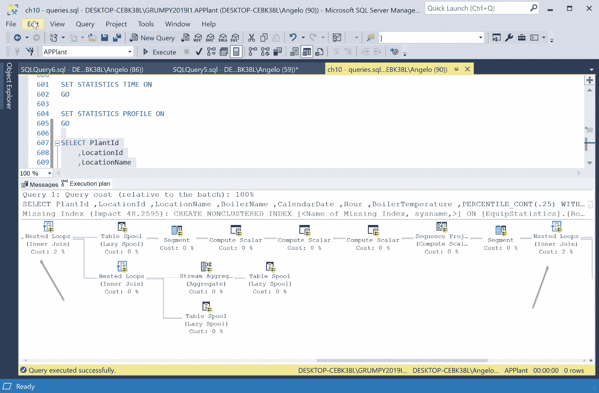
SQL SSMS 窗口的截图。它展示了一个包含 13 个组件的计划部分。这些组件是嵌套循环 2%、表假脱机、段、计算标量、计算标量、计算标量、序列投射、段、嵌套循环 2%、嵌套循环、流聚合、2 个表假脱机。
**图 10-21b**
第一个 PERCENTILE_CONT 函数调用的计划部分

右侧的第一个嵌套循环联接就是我们刚才讨论的部分左侧看到的那个。它在这里作为参考框架。我们所有其他任务的代价都是 0%，我们在左侧看到另一个代价为 2%的嵌套循环联接。让我们立即创建建议的索引，看看是否有任何改进。

请参考清单 10-10。

```sql
CREATE NONCLUSTERED INDEX [iePlantBoilerLocationDateHour]
ON [EquipStatistics].[BoilerTemperatureHistory] ([PlantId],[BoilerName])
INCLUDE ([LocationId],[LocationName],[CalendarDate],[Hour],[BoilerTemperature])
GO
```
**清单 10-10**
针对大表查询的建议索引

估计查询计划生成器指出，创建此索引将使成本降低 48.25%。让我们看看。

`CREATE INDEX` 命令运行了 11 秒！这是因为我们的表里有 250 万行数据。让我们看看新的估计执行计划是什么样子。

我将把计划分成两部分。

请参考图 10-22a，它比较了旧计划（上）和新计划（下）。

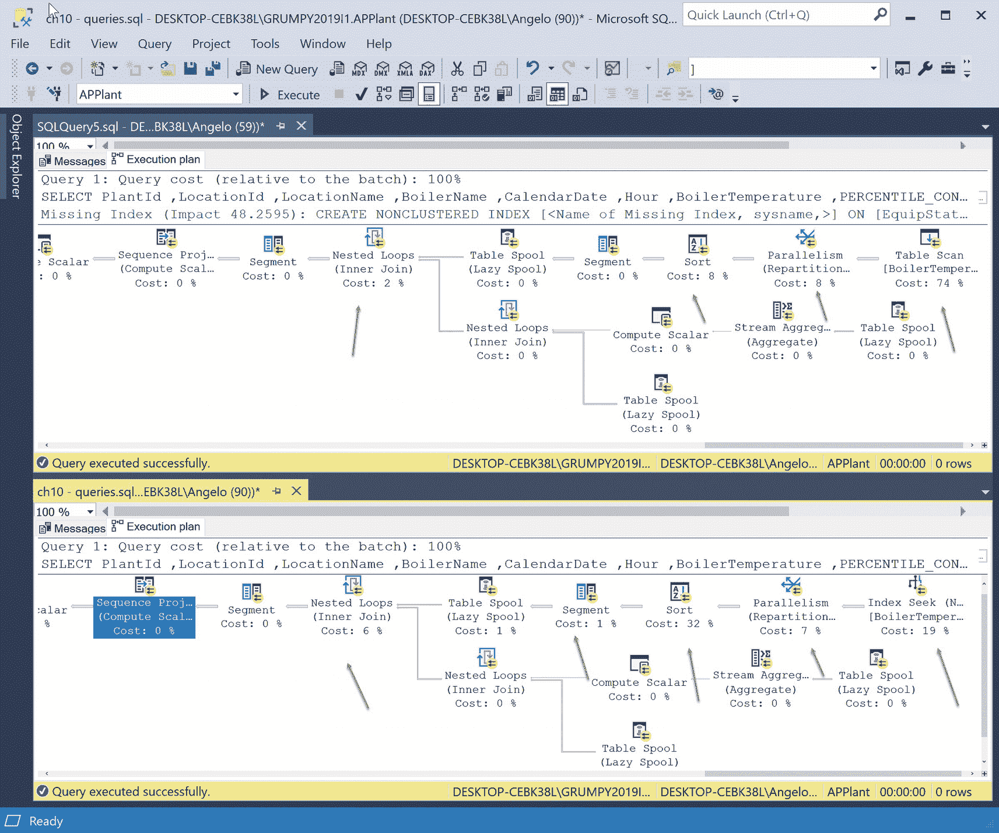
SQL SSMS 窗口的截图。它展示了原始和新的估计索引计划的第 1 部分，包含 14 个组件。在原始和新计划中，嵌套循环、排序和并行 ism 的成本分别为 2%、8%、8%和 6%、32%、7%。在新计划中，段和索引查找的成本分别为 1%和 19%。
**图 10-22a**
旧 vs. 新的估计索引计划

基于前面的截图，让我们列出新旧值，看看效果如何。从右到左：

*   旧的估计查询性能计划显示表扫描（成本 74%） vs. 新计划的索引查找（19%）– `重大改进`。

*   旧的并行 ism 任务从 8%降到了 7%– `一般般`。

*   排序从 8%上升到了 32%。这不好，但我们看到引入索引时会发生这种情况– `非常失望`。

*   段任务从 0%上升到 1%– `无需担心`。

*   嵌套循环联接从 2%上升到 6%，但我们知道由于索引这会发生。我们以前见过这种模式– `令人失望`。

让我们看看窗口函数的下一个计划部分。

请参考图 10-22b。

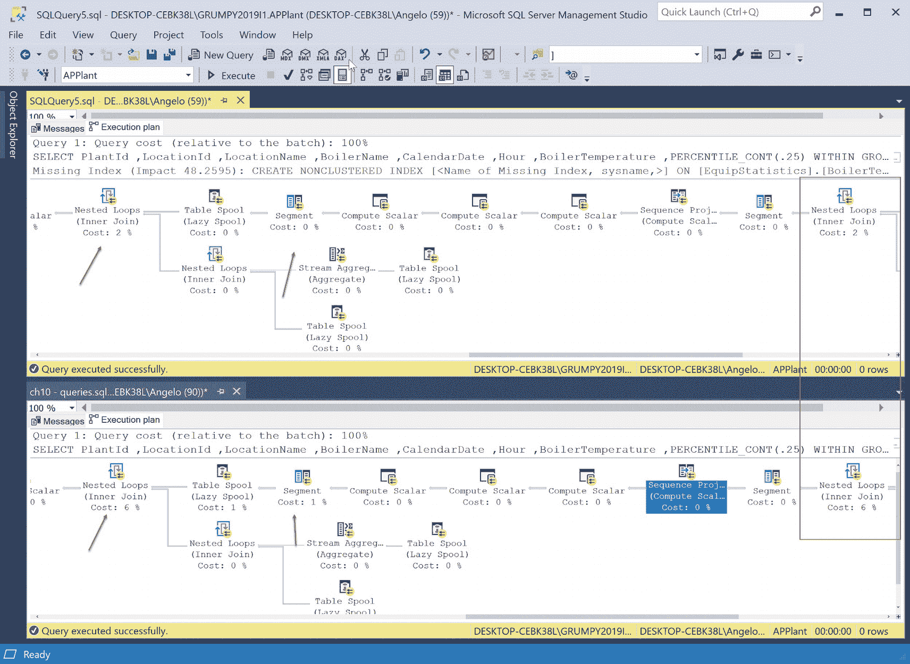
SQL SSMS 窗口的截图。它展示了原始和新的估计索引计划的第 1 部分，包含 13 个组件。在原始和新计划中，嵌套循环和段的成本分别为 2%、0%和 6%、1%。最后一列中 2%和 6%的嵌套循环被高亮显示。
**图 10-22b**
计划部分 2，旧 vs. 新

我用方框标出了嵌套循环联接任务，作为我们刚刚讨论的第一个部分的参考点。唯一发生变化的两个任务是段和最右侧的嵌套循环联接。两者都上升了。段任务从 0%上升到 1%，嵌套循环联接从 2%上升到 6%。由于这里没有获得任何改进，我们必须运行两者的 `IO` 和 `TIME` 统计信息来看看它们能告诉我们什么。

请参考图 10-23。

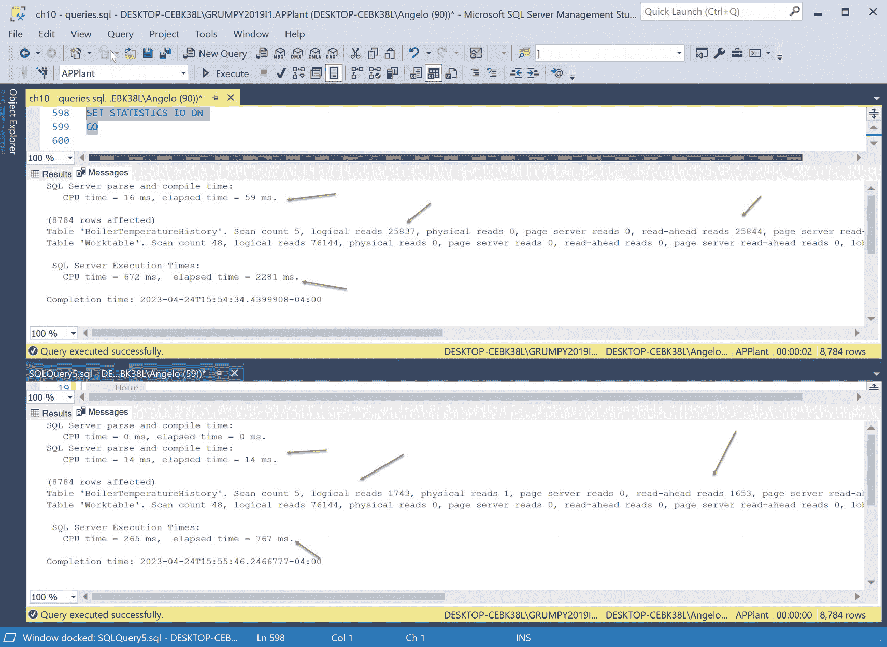
SQL SSMS 窗口的截图。文本展示了 2 个 IO 和 TIME 统计信息。在原始和新计划中，解析和编译时间的 CPU 和经过时间分别为 16、59 和 14、14 毫秒。执行时间的 CPU 和经过时间分别为 672、2281 和 265、767 毫秒。
**图 10-23**
IO 和 时间统计信息，旧 vs. 新

这里我们看到了一些真正的改进。所有关键的统计数字都下降了。首先，SQL Server 执行时间从 2281 毫秒下降到 767 毫秒。逻辑读取从 25,837 下降到 1,743。这真是巨大的提升！最后，预读从 25,844 下降到 1,653。

根据我们的分析，考虑到我们正在处理一个 250 万行的表，这个索引是一个很好的改进。

让我们来看看这个函数的近亲，`PERCENTILE_DISC()` 函数。


## PERCENTILE_DISC() 函数

这里是我们关于离散百分位的示例。`PERCENTILE_DISC()` 函数在基于指定百分位的一组离散数据上进行计算，并返回数据集中满足该百分位要求的值。

还记得离散数据吗？

离散数据的值是那些可以随时间计数的数字。同样需要记住的是，使用此函数时，返回的值是存在于数据集中的；它不像 `PERCENTILE_CONT()` 函数那样进行插值计算。

我们的分析师为下一份报告提交了以下业务需求：

这次我们需要计算按月份汇总的设备故障总和的离散百分位值。也就是说，我们每月累加故障次数，然后生成第 25、50 和 75 个百分位的离散值。结果需要按工厂名称、工厂内位置、年份、季度和月份分组。

结果需要针对 2008 年。这次我们将回归使用我们可靠的基于 `CTE` 的查询。

请参考代码清单 10-11。

```sql
WITH FailedEquipmentCount
(
CalendarYear, QuarterName, [MonthName], CalendarMonth, PlantName, LocationName, SumEquipFailures
)
AS (
SELECT
C.CalendarYear
,C.QuarterName
,C.[MonthName]
,C.CalendarMonth
,P.PlantName
,L.LocationName
,SUM(EF.Failure) AS SumEquipFailures
FROM DimTable.CalendarView C
JOIN FactTable.EquipmentFailure EF
ON C.CalendarKey = EF.CalendarKey
JOIN DimTable.Equipment E
ON EF.EquipmentKey = E.EquipmentKey
JOIN DimTable.Location L
ON L.LocationKey = EF.LocationKey
JOIN DimTable.Plant P
ON L.PlantId = P.PlantId
GROUP BY
C.CalendarYear
,C.QuarterName
,C.[MonthName]
,C.CalendarMonth
,P.PlantName
,L.LocationName
)
SELECT
PlantName,LocationName,CalendarYear,QuarterName,[MonthName]
,CalendarMonth,SumEquipFailures
-- 来自列表的实际值
,PERCENTILE_DISC(.25) WITHIN GROUP (ORDER BY SumEquipFailures)
OVER (
PARTITION BY PlantName,LocationName,CalendarYear
) AS [PercentDisc .25]
,PERCENTILE_DISC(.5) WITHIN GROUP (ORDER BY SumEquipFailures)
OVER (
PARTITION BY PlantName,LocationName,CalendarYear
) AS [PercentDisc .5]
,PERCENTILE_DISC(.75) WITHIN GROUP (ORDER BY SumEquipFailures)
OVER (
PARTITION BY PlantName,LocationName,CalendarYear
) AS [PercentDisc .75]
FROM FailedEquipmentCount
WHERE CalendarYear = 2008
GO
```

代码清单 10-11
按月设备故障的离散百分位分析

再次注意，我们同时使用了事实表和维度表，因此可以看到多个 `JOIN` 子句。对于每一个百分位计算，分区是按工厂、位置和年份设置的。`ORDER BY` 子句在对 `PERCENTILE_DISC()` 函数的三次调用中都引用了 `SumEquipFailures` 列（记住，这次返回的值应该存在于数据集中）。

请参考图 10-24 中的部分结果。

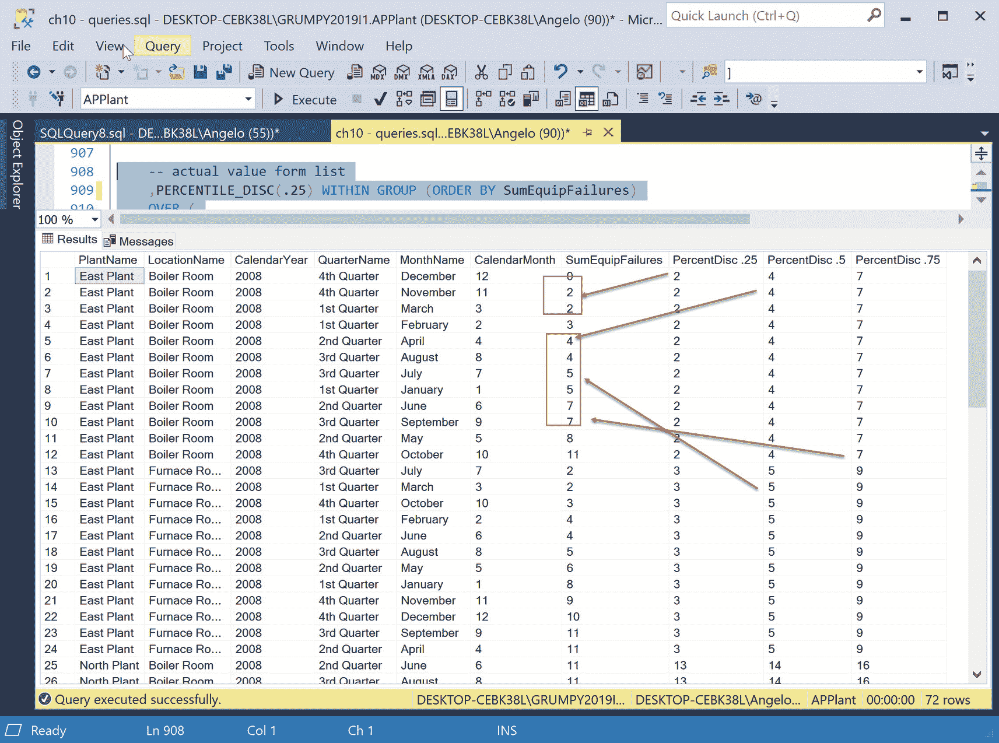

图 10-24
工厂设备故障的离散百分位分析

这是一张 SQL Server Management Studio (SSMS) 窗口的截图，其中显示了一个包含 11 列、72 行的表格。列标题为：工厂名称、位置名称、日历年、季度名称、月份名称、日历月、设备故障总和、以及第 0.25、0.50 和 0.75 个百分位。第 1 到 3 行和第 5 到 10 行的故障数据被高亮显示。

是的，返回的值确实存在，并且我们看到有一些重复值（ties），这完全正常，因为不同设备在同一月份的故障总数有可能相同。可能是不同的设备，但它们的故障数可以相同也可以不同。

### 性能考虑

让我们看看在性能方面，离散百分位函数与连续百分位函数的工作方式有何异同。我们来生成通常的基线估计查询计划，并将其分解成几部分，因为它会是一个大计划。

请参考图 10-25a。

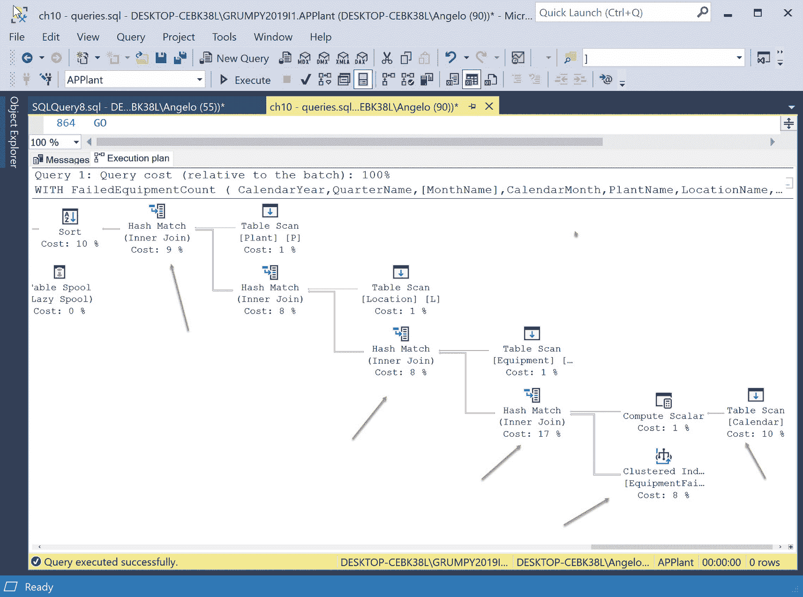

图 10-25a
基线估计查询计划，第 1 部分

这是 SQL Server Management Studio (SSMS) 窗口的截图。它展示了基线估计查询计划的第 1 部分，包含 11 个组件。组件包括：排序、哈希匹配 (9%)、表扫描、哈希匹配、表扫描、哈希匹配 (8%)、表扫描、哈希匹配 (17%)、计算标量、聚集索引扫描 (8%) 和表扫描 (10%)。

那个成本为 10% 的表扫描任务看起来很熟悉，那些成本为 1% 的维度表表扫描也是如此。有件事我忘了提，我们使用了一个名为 `CalendarView` 的视图 (`VIEW`) 来获取日期信息。

这点需要审视一下。我们使用这个 `VIEW` 是因为它包含月份、季度等的文本名称。本质上，一个 `VIEW` 等价于执行一个查询，在这个例子中是 `VIEW` 所基于的基础查询。使用这种做法成本有点高，因此我们希望用一个更详细、包含所有文本值的日历维度表来替换这个 `VIEW`。我们还希望在新的日历表上创建一两个索引（这将是本节末尾的作业，请思考一下）。

右下角的聚集索引扫描成本为 8%。沿着下部分支向上看，我们看到哈希匹配联接的成本分别为 17%、8% 和 8%，最后的哈希匹配联接成本为 9%。

最后，我们看到左侧有一个成本为 10% 的排序任务，以及一个成本为 0% 的表假脱机（延迟假脱机）任务。我认为，对于这种模式的性能规划，最终结论是要么将行数为 100 或更少的小维度表放入内存优化表中，要么将其放在非常高速的固态硬盘上。至少，`TEMPDB` 应该始终放在固态硬盘上。

现有的维度表太小，无法从索引中获益，正如我们所看到的，查询计划工具也没有推荐任何索引。让我们导航到计划左侧，查看下一部分。

请参考图 10-25b。

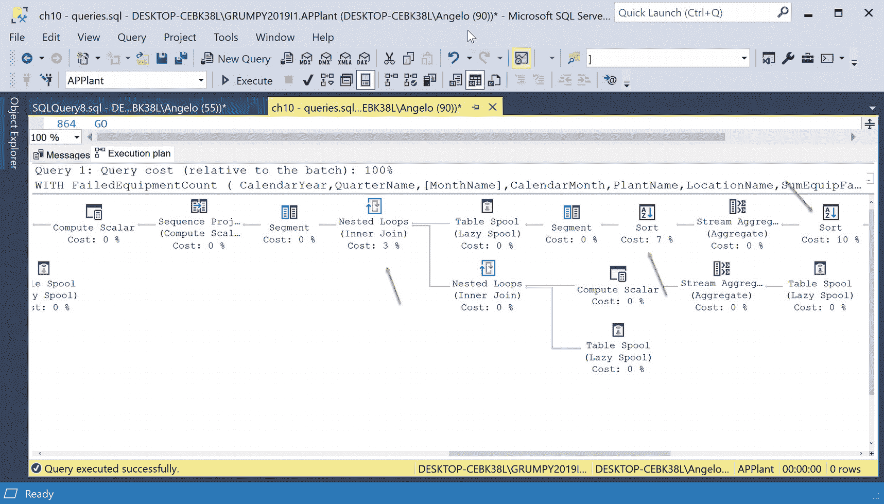

图 10-25b
基线估计查询计划，第 2 部分

这是一张 SQL Server Management Studio (SSMS) 窗口的截图，展示了估计查询计划的第 2 部分，包含 14 个组件。组件包括：计算标量、序列投影、段、嵌套循环 (3%)、表假脱机、段、排序 (7%)、流聚合、排序 (10%)、嵌套循环、计算标量、流聚合、2 个表假脱机。

图中有个来自上一张截图的排序任务作为参考点。我只指出那些非零成本的任务。出现了一个排序（成本 7%），接着是一个用于合并分支流的嵌套循环联接任务（成本 3%）。让我们继续看下一部分。

请参考图 10-25c。

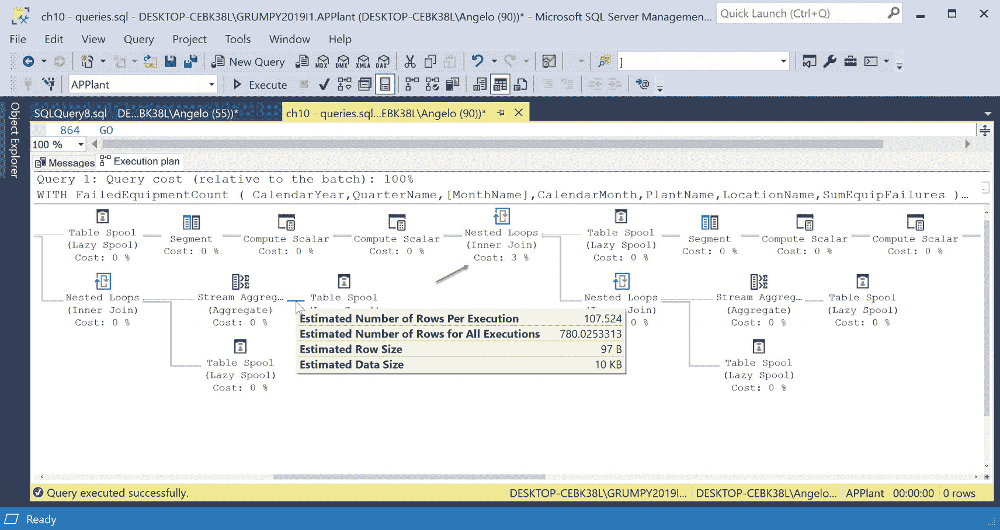

图 10-25c
基线估计查询计划，第 3 部分

这是一张 SQL Server Management Studio (SSMS) 窗口的截图，展示了估计查询计划的第 3 部分，包含 17 个组件。组件包括：表假脱机、段、2 个计算标量、嵌套循环 (3%)、表假脱机、段、2 个计算标量、以及 2 组嵌套循环、流聚合、表假脱机、表假脱机。

这里除了成本为 3% 的嵌套循环联接外，没有其他操作。注意线条的粗细表示有多少行数据通过。

让我们继续看计划的下一部分。请参考图 10-25d。

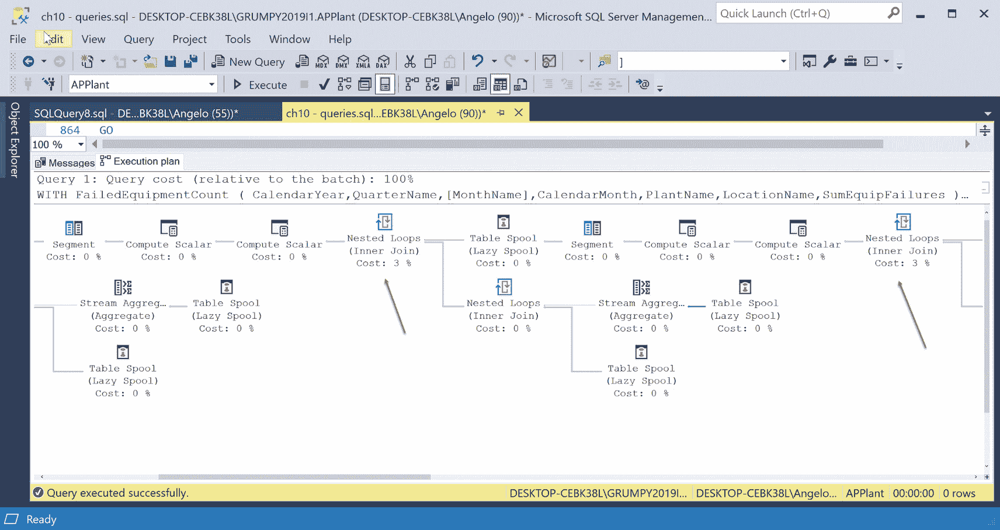


##### SQL SSMS 窗口的截图展示了估算查询计划的第四部分，包含 16 个组件

这些组件分别是：segment、2 个 compute scalar、nested loops 3%、table spool、segment、2 个 compute scalar、nested loops 3%、stream aggregate、2 个 table spool、nested loops、stream aggregate、2 个 table spool。

##### 图 10-25d
##### 估算基准查询计划，第四部分

我们可以看到模式开始重复出现。请注意，随着分支合并，嵌套循环连接后的行数增加了。有道理，对吧？

### 我没有展示最后一部分，因为它包含了嵌套循环连接，且所有其他任务的成本均为 0%。

## 我们现在可以预期，当我们多次使用一个函数时，估算的查询计划模式通常是相同的

这个假设可能有助于，也可能无助于任何性能改进。好消息是，如果你尝试了一个改进某个部分的修复方案，它很可能会改进其他部分。

## 最后但同样重要的是，让我们生成 `IO` 和 `TIME` 统计信息

请参考图 10-26。

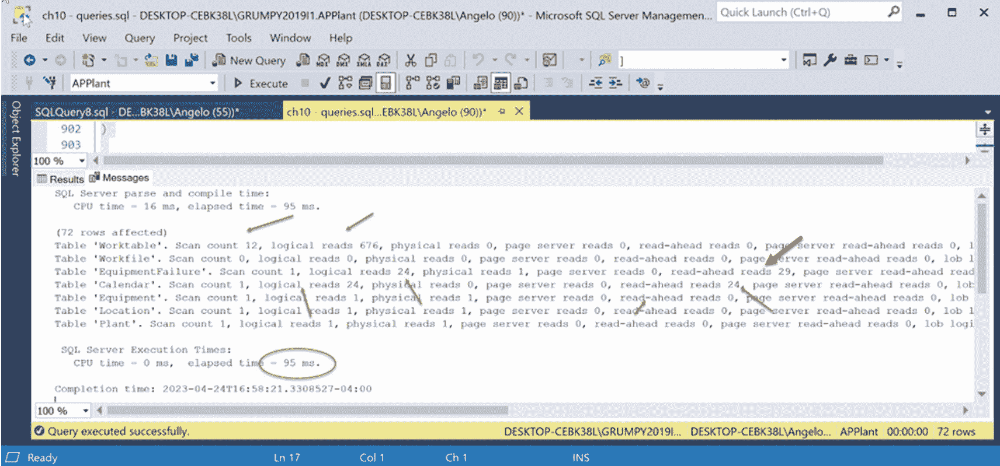

SQL SSMS 窗口的截图。文本展示了 IO 和 TIME 统计信息。SQL 服务器解析和编译时间的 CPU 和已用时间分别为 16 毫秒和 95 毫秒。SQL 服务器执行时间的 CPU 和已用时间分别为 0 毫秒和 95 毫秒。影响了 7 个表列共 72 行。

##### 图 10-26
## IO 和时间统计信息

可以看出，查询中涉及的所有维度的值都很低，除了 Calendar 维度，其逻辑读取为 24，物理读取为 1，预读为 24。所有其他值要么为 0，要么为 1，除了工作表（work table），其扫描计数为 12，逻辑读取为 676。

最后，`EquipmentFailure` 表的扫描计数为 1，逻辑读取为 24，物理读取为 1，预读为 29。

SQL Server 的已用执行时间为 85 毫秒。还不错。

## 注意

此窗口函数不支持 `OVER()` 子句中的 `ROWS` 或 `RANGE` 窗口帧规范，因此这不会是尝试提高性能的一个选项。

## 接下来是一个提示和一些作业。首先是提示：

## 提示

每次生成计划时，请务必将鼠标悬停在一些连线上，以便您可以看到在任务之间流动的估计行数。这有时有助于识别瓶颈。如果有太多行流过，也许您需要重新定义 `WHERE` 子句的过滤器或添加一些新的谓词。

## 以下是我承诺的作业：

## 作业

使用构成该 `VIEW` 的 `SELECT` 查询，创建一个名为 `CalendarEnhanced` 的新 Calendar 维度表。在我们刚刚讨论的查询中使用这个新表，并运行一些估算查询计划。如果建议了索引，请创建它们，并查看实现了哪些性能改进。解决方案位于本章的脚本中。

## 让我们尝试一下我们的报表表方法

### 我们通常的报表表解决方案

我们将创建一个名为 `EquipFailPctCountDisc` 的报表表，以便可以预加载它，一次性承担所有 `JOIN` 子句的开销，并假设该表在非高峰时段每天加载一次。

以下是加载该表的 `INSERT` 语句。

请参考代码清单 10-12。

```sql
INSERT INTO Reports.EquipFailPctContDisc
SELECT
C.CalendarYear
,C.QuarterName
,C.[MonthName]
,C.CalendarMonth
,P.PlantName
,L.LocationName
,SUM(EF.Failure) AS SumEquipFailures
FROM DimTable.CalendarView C
JOIN FactTable.EquipmentFailure EF
ON C.CalendarKey = EF.CalendarKey
JOIN DimTable.Equipment E
ON EF.EquipmentKey = E.EquipmentKey
JOIN DimTable.Location L
ON L.LocationKey = EF.LocationKey
JOIN DimTable.Plant P
ON L.PlantId = P.PlantId
GROUP BY
C.CalendarYear
,C.QuarterName
,C.[MonthName]
,C.CalendarMonth
,P.PlantName
,L.LocationName
ORDER BY
C.CalendarYear
,C.QuarterName
,C.MonthName
,P.PlantName
,L.LocationName
GO
```
代码清单 10-12
加载报表表

现在我们的查询性能应该有所提高。我们使用 `CTE` 块中的查询作为一个 `INSERT` 命令来加载一个新的报表表。我们将把它用于百分位数查询。

代码清单 10-13 是访问新表的修改后查询。

```sql
SELECT
PlantName,LocationName,CalendarYear,QuarterName
,[MonthName],CalendarMonth,SumEquipFailures
-- actual value from list
,PERCENTILE_DISC(.25) WITHIN GROUP (ORDER BY SumEquipFailures)
OVER (
PARTITION BY PlantName,LocationName,CalendarYear
) AS [PercentDisc .25]
,PERCENTILE_DISC(.5) WITHIN GROUP (ORDER BY SumEquipFailures)
OVER (
PARTITION BY PlantName,LocationName,CalendarYear
) AS [PercentDisc .5]
,PERCENTILE_DISC(.75) WITHIN GROUP (ORDER BY SumEquipFailures)
OVER (
PARTITION BY PlantName,LocationName,CalendarYear
) AS [PercentDisc .75]
FROM Reports.EquipFailPctContDisc
WHERE CalendarYear = 2008
GO
```
代码清单 10-13
修改后的百分位数查询

我不会再次逐步讲解，因为我们之前已经讨论过，所以让我们看看这个修订策略和查询的估算性能计划是什么。我想评论的一点与我的命名标准有关。我试图在查询中采用描述性的列名，以便语义值清晰明了。我相信你能想出更好的名字。

## 让我们比较新旧估算查询计划的右侧部分

请参考图 10-27。

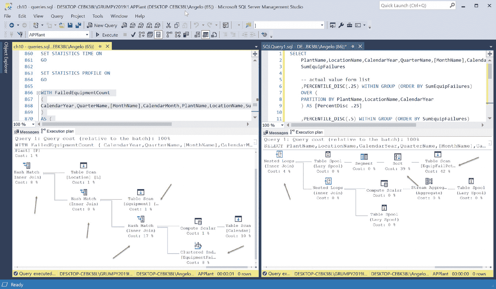

SQL SSMS 窗口的截图。它展示了旧计划和新计划的第一部分，分别包含 8 个和 10 个组件。旧计划中 2 个 hash match、表扫描、hash match 和聚集索引的成本分别为 8%、1%、17%和 8%。新计划中嵌套循环、排序和表扫描的成本分别为 4%、39%和 42%。

##### 图 10-27
## 比较新旧计划的第一部分

我只展示了估算查询计划最右侧的部分，因为所有的 `JOIN` 都在那里。如图所示，在新计划中，`JOIN` 消失了，但我们看到了一个成本为 42%的表扫描。

这替换了对事实表的聚集索引查找。我们还看到一个新的排序任务成本为 39%，以及一个新的嵌套循环连接任务成本为 4%。

当然，我们还没有在新表上创建聚集索引，但它只包含 1517 行，这与旧查询中 `CTE` 返回的行数相同。此外，估算查询计划工具没有建议索引，所以我们将保持原样。

## 剩下需要查看的只有 `TIME` 和 `IO` 统计信息

这将告诉我们报表表是否再次拯救了我们。

请参考图 10-28。

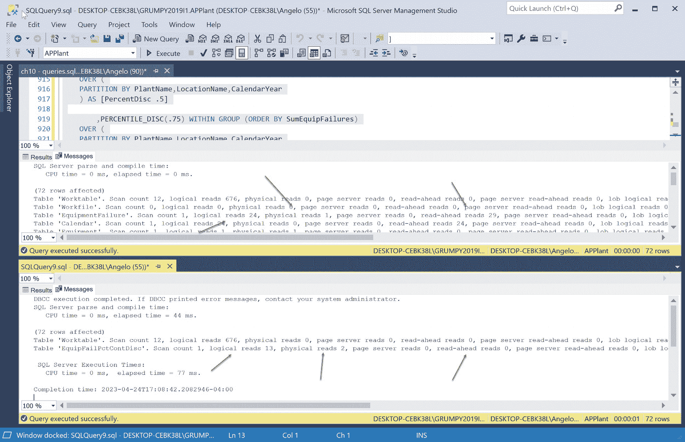


`SQL Server Management Studio` (`SSMS`) 窗口的截图。文本展示了 `IO` 和 `TIME` 统计数据。在旧计划和新计划中，`CPU` 和已用时间的解析与编译时间分别为 0, 0 毫秒和 0, 44 毫秒。新计划中，`CPU` 和已用时间的执行时间分别为 0 和 77 毫秒。影响了 72 行。

**图 10-28**

**比较 IO 和 TIME 统计数据**

我们可以看到，统计数据大大减少了，因为所有维度表的表连接都被消除了，因为它们现在被放入了 `INSERT` 语句中，该语句每天会在非高峰时段运行一次。

工作表的扫描次数和逻辑读取次数保持不变。预读读取从 29 降到了 0。最后，新的报表表显示逻辑读取从 24 降到了 13，但物理读取增加了 1。不过，最终 `SQL Server` 执行的已用时间从 98 毫秒降到了 30 毫秒。

所以，看起来这个方法再次奏效了。

**提醒**

在进行这类比较两种方法的测试时，请记住在每个会话中始终运行 `DBCC` 来清除缓冲区，以获得准确的结果。运行查询并比较三到四次以取平均值，确保没有异常情况。

正如你可能想到的，我们现在有几个报表表了，所以在使用这种方法时，看看能否合并类似的表，以减少报表表的数量。随着表的激增，情况可能会很快变得复杂。我们希望物理数据库架构尽可能简单紧凑。

我们将转换思路，看看一种用于分析的新方法。现在，我们将了解另一个可以添加到你的数据分析工具箱中的工具。`SQL Server Analysis Services` (`SSAS`) 是一个强大的平台，用于基于数百万行数据创建多维数据集！

### SQL Server Analysis Services

我们现在将介绍称为多维数据集 (`cubes`) 的多维结构，以便我们能够对数据进行切片 (`slicing`) 和切块 (`dicing`)，并沿着我们维度定义的各种层级结构进行上钻 (`drill up`) 和下钻 (`drill down`)。

切片和切块指的是通过在查看数据集时引入和移除维度列来改变视角的能力，就像我们使用数据透视表所做的那样。

导航层级结构指的是按不同的聚合级别（如按年、季度、月、周、日，以及反向）查看数据的能力。

正如我之前所述，这些类似于数据透视表，只是它们可以处理数百万行数据，这对于 Excel 电子表格来说是个挑战。额外的好消息是，Excel 电子表格可以连接到多维数据集并基于它们创建数据透视表（处理的行数可能是个问题，因为有其限制）。

最后，如果你知道如何使用 `Power BI`，你可以将 `Power BI` 连接到 `SSAS` 多维数据集，以创建一些令人印象深刻的计分卡、仪表板和报告，所以你的工具箱真的在不断进化！

这里是一个小预览！请参考 **图 10-29**。

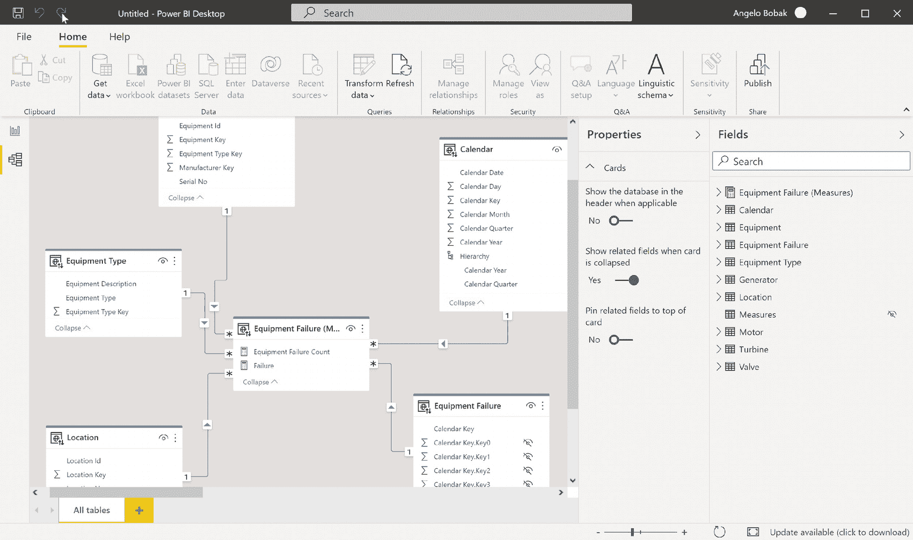

`Power BI` 未命名文件窗口的截图。它展示了一个星型模式，包含设备类型、日历、位置和连接到设备故障度量的设备故障。右侧面板是包含 3 个选项的属性、包含 11 个组件和搜索框的字段。

**图 10-29**

**`Power BI` 展示 `APPlant` `STAR` 模式**

在本书的最后三章，当我们将窗口函数应用于库存数据库业务模型时，我们将详细探讨 `Power BI`。现在，让我们看看使用 `SSAS` 创建多维数据集的主要步骤。

涉及几个步骤：

*   创建数据源。
*   创建数据源视图。
*   定义维度。
*   定义数据集。
*   定义维度用法（针对每个维度）。
*   构建并部署数据集。
*   浏览数据集。
*   使用数据集创建数据透视表。

创建数据源基本上是确定 `SSAS` 服务器并提供凭据，以便用户和开发人员能够连接到数据集（或创建一个）。

数据源视图本质上是将用于创建和填充视图的表的 `STAR` 或 `SNOWFLAKE` 模式，因此这是一个必要的组件。使用 `SSAS` 可以创建两种模型：一种是表格模型，另一种是多维模型。当你首次在笔记本电脑、工作站或服务器上安装 `SSAS` 时，需要定义模型类型。我们将专注于多维模型。

一旦定义了数据源和数据源视图，你就需要确定将用作维度的表以及将用于填充数据集中度量的事实表。

这些任务完成后，你需要将维度链接到数据集；这被称为定义维度用法。

所有这些任务完成后，你需要构建数据集并将其部署到你环境中安装的 `SSAS` 服务器实例（如果你有足够的内存、`CPU` 和磁盘空间，可以同时安装表格和多维实例）。现在，你可以浏览数据集或使用 Microsoft `Excel` 或 `Power BI` 连接到它。

请参考 **图 10-30**。

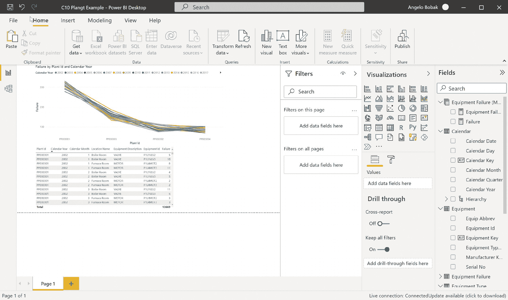

`Power BI` 仪表板的截图。它展示了一个故障与工厂 `ID` 的折线图，有 16 条下降的曲线。还有一个包含 7 列 14 行的表格。右侧面板是包含 2 个选项的筛选器、可视化效果，以及包含组件和子组件及搜索框的字段。

**图 10-30**

**一个简单的 `Power BI` 仪表板**


这是一个基于我们即将构建的立方体（cube）创建的简单仪表板。我现在展示它，是希望你能获得灵感，去学习如何使用 SSAS！这个仪表板是报表加上某种可视化图表的组合。请注意工具右侧提供的所有可视化组件。更多内容将在最后三章中介绍！

## 创建数据源

让我们从学习如何创建数据源开始。

请参考图 10-31。

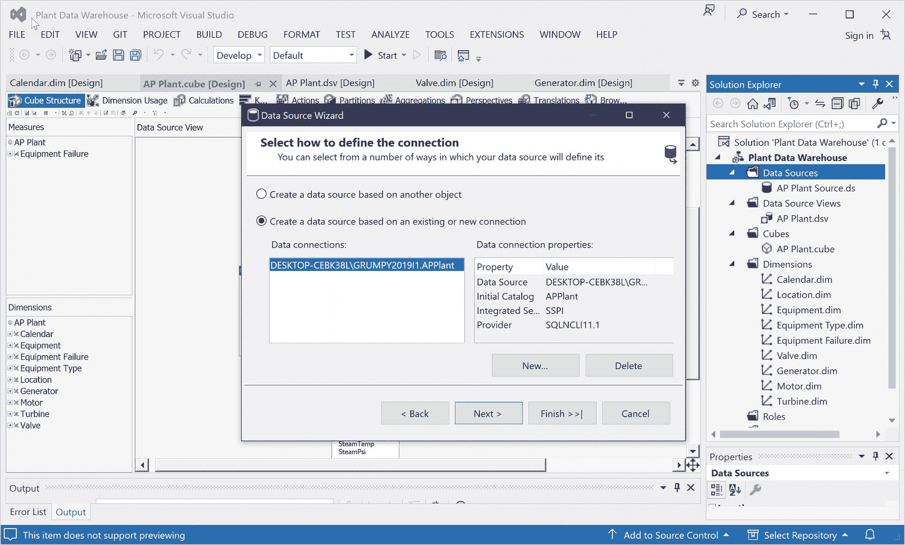

*Plant 数据仓库 Microsoft Visual Studio 窗口截图。选中了立方体结构。它展示了度量值、维度和数据源视图。解决方案资源管理器对话框中选择了“数据源”选项。数据源向导对话框中选择了“创建数据源”选项。*

**图 10-31**

创建数据源非常简单。在 `解决方案资源管理器` 中右键单击 `数据源` 文件夹，然后选择“新建数据源”。此时将显示此面板。单击“基于现有或新连接创建数据源”，点击“下一步”按钮，然后填写名为“模拟信息”的安全信息。换句话说，你希望工具模拟一个具有创建和修改立方体权限的系统用户 ID 和密码。

## 定义数据视图

请参考图 10-32。

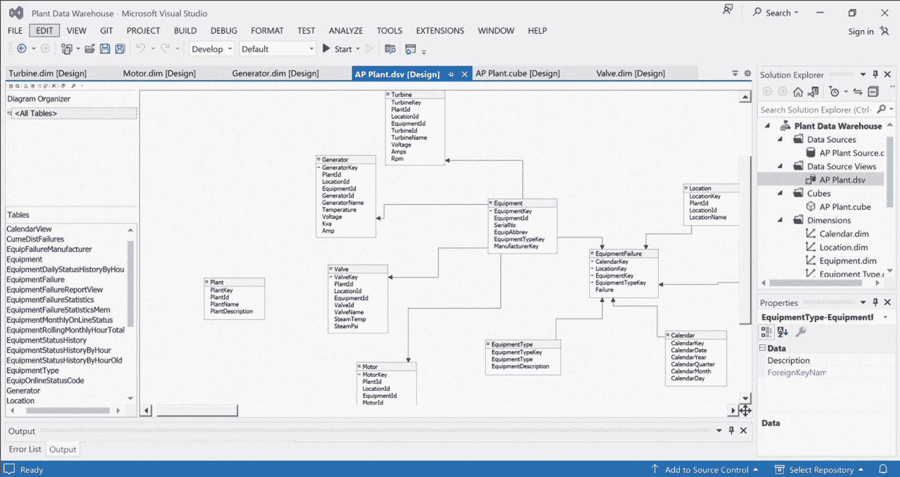

*Plant 数据仓库 Microsoft Visual Studio 窗口截图。左侧面板包含一个图表组织器和一个表列表。右侧是解决方案资源管理器面板，其中 A P plant . d s v 被选中。它展示了一个星型架构，其中设备链接到 9 个组件。*

**图 10-32**

接下来，右键单击 `数据源视图` 文件夹并选择“新建数据源视图”。在这里，你将检索定义维度表和事实表所需的所有表。大多数情况下，你将通过我们在创建数据库时包含的代理键将维度表链接到事实表。

请注意，Valve、Turbine、Generator 和 Motor 维度尚未链接到 Plant 维度。我在创建数据库时犯了一个错误，没有给前四个表设置代理键。我可以使用生产键 `PlantId` 来连接它们，但这样做有点不妥，尽管也能行得通。我不得不回头为这些表添加代理键，并用分配给 Plant 表的代理键填充它们。

我在清单 10-14 中使用了以下代码。

```sql
ALTER TABLE [DimTable].[Generator]
ADD PlantKey INTEGER NULL
GO
ALTER TABLE [DimTable].[Generator]
ADD LocationKey INTEGER NULL
GO
UPDATE [DimTable].[Generator]
SET PlantKey = P.PlantKey
FROM [DimTable].[Generator] G
JOIN [DimTable].[Plant] P
ON G.PlantId = P.PlantId
GO
UPDATE [DimTable].[Generator]
SET LocationKey = P.LocationKey
FROM [DimTable].[Generator] G
JOIN [DimTable].[Location] P
ON G.LocationId = P.LocationId
GO
SELECT * FROM [DimTable].[Generator]
GO
```

*清单 10-14 向设备表添加代理键*

为了节省篇幅，我只展示了 `Generator` 表的代码，因为其余三个表的代码是相同的，只是表名和列名有所不同。

实际上，我在创建示例数据库时就犯了这种设计错误。这是仓促行事的后果，但通常都有解决方案可以让你修正错误。`ALTER` 命令允许我们添加所需的列，而 `UPDATE` 命令允许我们初始化代理键。现在我们可以完成我们的立方体了。

请参考图 10-33 查看所做的更改以及用于验证一切顺利的简单查询。

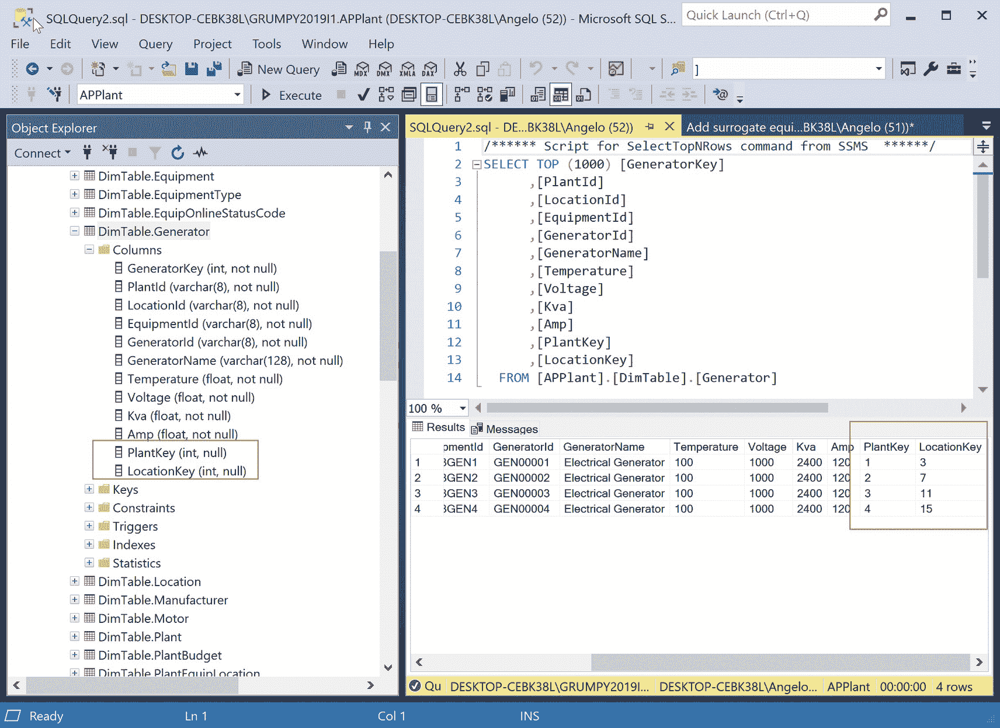

*S Q L, S S M S 窗口截图。对象资源管理器的左侧面板勾勒出了 plant key 和 location key 列。右侧面板包含代码和一个有 10 列 5 行的表。标头为 Plant key 和 Location key 的列被勾勒出来。*

**图 10-33**

我们的 plant 和 location 代理键已经初始化。这将使 `雪花型` 架构设计更加正确，并且在查询中使用这些表时也能提高性能（连接数字总是比连接字母数字值更快）。

## 创建新维度

回到创建立方体的步骤。请参考图 10-34。

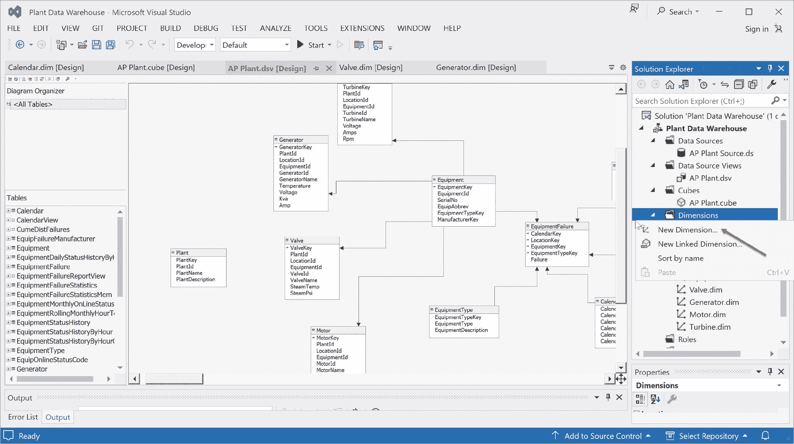

*Plant 数据仓库 Microsoft Visual Studio 窗口截图。左侧面板包含一个图表组织器和一个表列表。右侧是解决方案资源管理器面板，其中选择了“维度”选项。它展示了一个星型架构，其中设备链接到 9 个组件。*

**图 10-34**

右键单击 `维度` 文件夹并选择 `新建维度`。将显示如图 10-35 所示的面板。

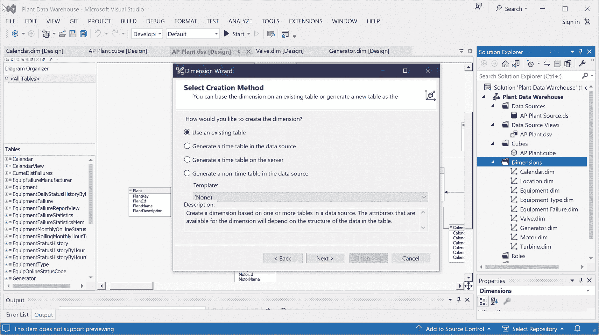

*Plant 数据仓库 Microsoft Visual Studio 窗口截图。选中了 A P Plant . d s v。它展示了一个图表组织器和一个表列表。解决方案资源管理器对话框中选择了“维度”选项。维度向导对话框中选择了“使用现有表”选项。*

**图 10-35**

显示的面板称为 `维度向导`，你只需填写或选择所需信息，然后单击 `下一步` 按钮，直到完成。在本例中，我们使用现有表来创建维度表。

## 定义维度和层次结构

完成后，我们需要执行一些最后的步骤，比如识别维度中的层次结构。请参考图 10-36。

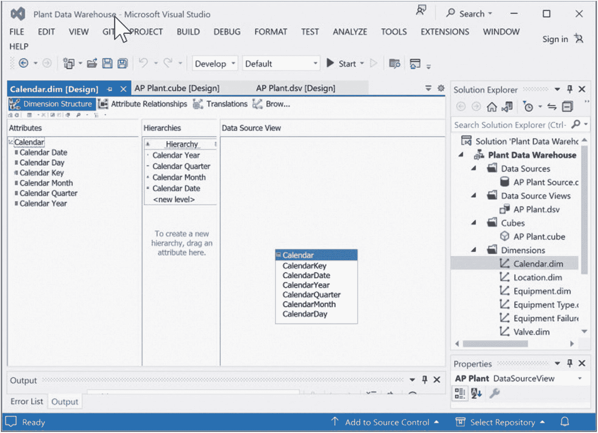

*Plant 数据仓库 Microsoft Visual Studio 窗口截图。选中了 Calendar . dim。它展示了属性、层次结构和数据源视图。解决方案资源管理器对话框中选择了 Calendar . dim 选项。数据源视图有一个包含 6 个属性的 Calendar 框。*

**图 10-36**

这是一个简单的任务，但你需要完全理解你的数据模型。只需将必要的属性从 `属性` 面板拖放到 `层次结构` 部分中的正确顺序即可。在本例中非常简单：日历层次结构定义为 Calendar Year ➤ Calendar Quarter ➤ Calendar Month ➤ Calendar Date。很简单。

## 创建立方体

接下来，我们需要通过识别包含度量值（我们可以计数或测量的东西，比如设备故障）的事实表并将其链接到维度来创建立方体。

如果你还没有猜到，创建新立方体的方法是：用鼠标右键单击 `立方体` 文件夹并选择 `新建立方体`。你将看到如图 10-37 所示的面板。

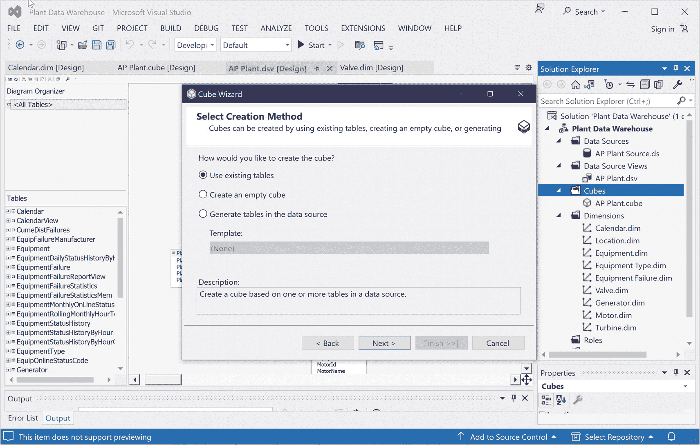

*Plant 数据仓库 Microsoft Visual Studio 窗口截图。选中了 A P Plant . d s v。它展示了一个图表组织器和一个表列表。解决方案资源管理器对话框中选择了“立方体”选项。立方体向导对话框中选择了“使用现有表”选项。*

**图 10-37**

这与我们为多维模型创建维度时的操作基本相同。向导会显示出来，你只需按照步骤点击相应的按钮或填写几个文本框即可。

完成后，你将看到如图 10-38 所示的模型。

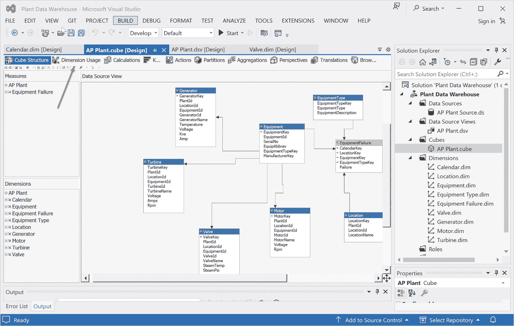


#### 图 10-38 我们的维度表和事实表

一张植物数据仓库 Microsoft Visual Studio 窗口的截图，显示了“生成”选项卡。一个箭头指向“维度用法”选项卡。右侧是“解决方案资源管理器”面板，其中 `A P Plant.dot.cube` 已被选中。数据源视图显示了一个星型架构，其中“设备”表链接到 7 个组件表。

看起来不错。在构建和部署我们的立方体到 `SSAS` 服务器实例之前，我们还有一个任务需要完成。我们需要通过使用原始表中的代理键将维度链接到立方体。这被称为维度用法定义，我们所需要做的就是导航到图中箭头指示的“维度用法”选项卡。这会呈现另一个设计面板，让我们可以完成这些任务。

请参阅图 10-39。

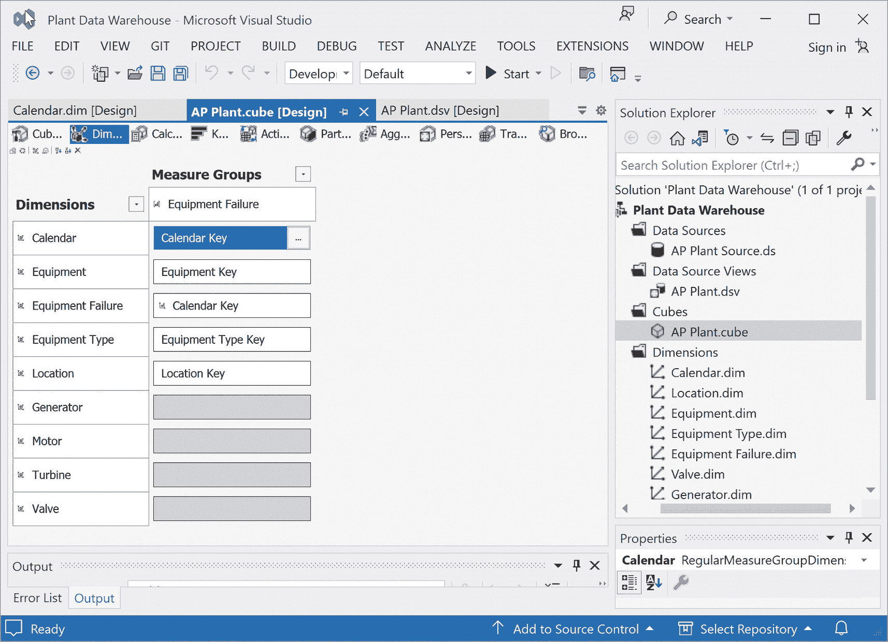

#### 图 10-39 定义维度用法

一张植物数据仓库 Microsoft Visual Studio 窗口的截图。它显示了 9 个维度和 6 个度量值组。“日历键”在度量值组中被选中。右侧是“解决方案资源管理器”面板，其中 `A P Plant.dot.cube` 已被选中。

在每个维度和度量值组（即事实表）的交汇处，都有一个下拉列表框，让你可以识别将链接这两种表的键。如图所示，我们正在使用所有的代理键。例如，我们通过 `Calendar Key` 将 `Calendar` 维度链接到 `Equipment Failure` 度量值组。

这是一个简单的任务，但它说明了良好命名标准的重要性。对于出现在多个表中的列，始终使用相同的名称，这样它们的用途（例如将维度链接到事实表）就一目了然。苹果对苹果，对吧？

我们完成了。如果我们正确地完成了每项任务，我们需要做的就是构建和部署立方体。

请参阅图 10-40。

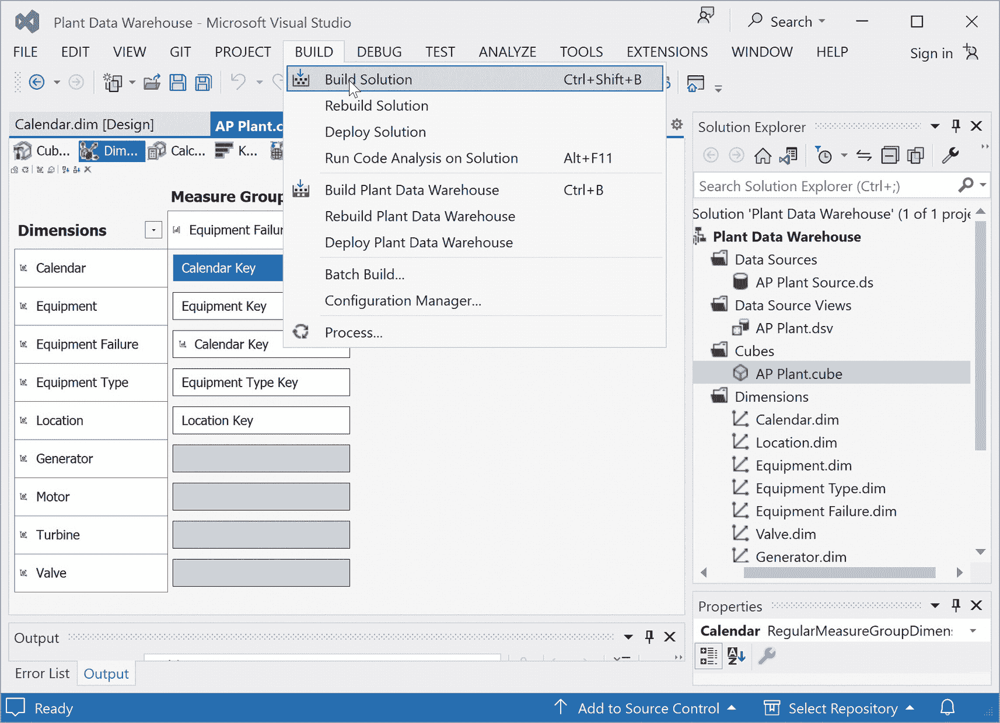

#### 图 10-40 生成并部署解决方案

一张植物数据仓库 Microsoft Visual Studio 窗口的截图。它显示了 9 个维度和 6 个度量值组。“日历键”在度量值组中被选中。“解决方案资源管理器”面板中 `A P Plant.dot.cube` 已被选中。工具栏中选择了“生成解决方案”选项。

在“生成”菜单选项卡下，我们看到了用于构建和部署立方体的选项。首先，你需要构建立方体，然后部署立方体。你会看到大量消息在面板上闪过，希望你不会看到任何表明出现问题的红色消息。

如果一切顺利，你就可以浏览立方体了。

请参阅图 10-41。

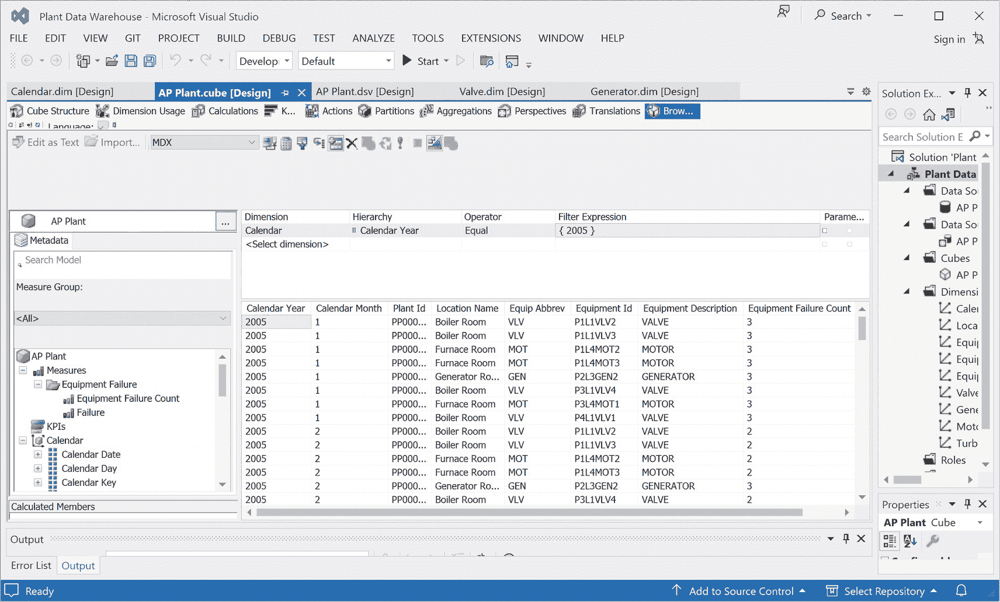

#### 图 10-41 浏览立方体

一张植物数据仓库 Microsoft Visual Studio 窗口的截图。左侧面板显示元数据和度量值组。中间有 2 张表。表 1 有 5 列和 1 行。表 2 有 8 列和 15 行。“解决方案资源管理器”面板中 `Plant Data` 选项被选中。

导航到最后一个选项卡，即“浏览”选项卡，你将看到此设计面板。将所需的属性拖放到维度和度量值组中。根据需要，也可以拖放层次结构属性。你可能需要在操作过程中刷新面板，但这就是最终结果。

我们甚至可以用一种叫做 `MDX` 的语言创建查询。点击菜单栏中的“设计”按钮，查看我们刚刚创建的报表所生成的 `MDX` 查询。将其复制并粘贴到 `MDX` 查询面板和 `SSMS` 查询面板中并执行（`MDX` 代表多维表达式）。

以下是结果。请参阅图 10-42。

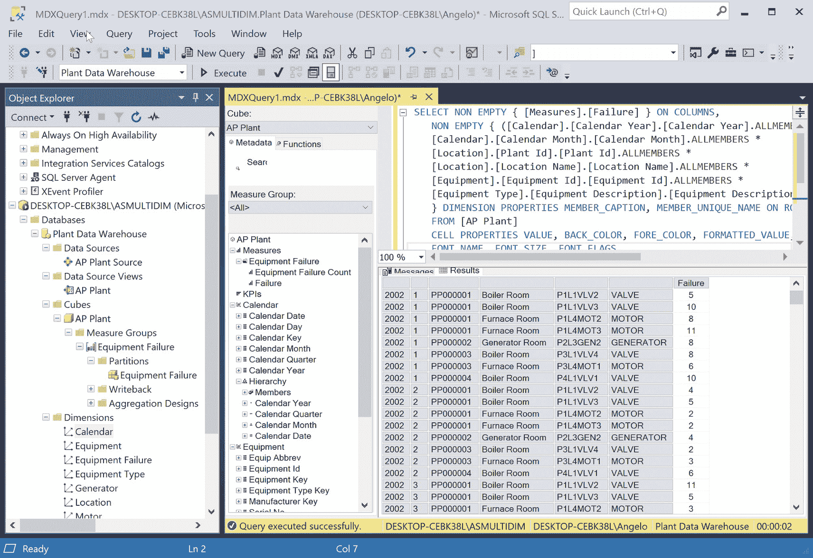

#### 图 10-42 Visual Studio 生成的 MDX 查询

一张 SQL Server Management Studio (SSMS) 窗口的截图。“对象资源管理器”左侧面板有多个文件和文件夹。中间面板有 `Cube A P plant`、元数据和度量值组。右侧面板有一段代码和一个包含 7 列 20 行的表格。最后一列的标题是 `Failure`。

一句话提醒：`MDX` 是一门复杂且难学的语言，但它可能是你 `SQL` Server 工具箱中一个有价值的工具。关于 `MDX` 有很多优秀的资源，所以请上网搜索或在 Amazon 上查找 Apress 关于此主题的书籍！

总之，对于开发人员进行测试来说，浏览器是一个不错的工具，但它并不是为我们最终用户准备的。你肯定不希望在业务分析师的桌面上安装一份包含我们刚刚使用的所有工具的开发环境 Visual Studio。

幸运的是，我们可以使用我们的老朋友 Microsoft Excel 电子表格应用程序来连接到立方体，拉取一些数据，并像创建数据透视表和图表那样进行切片和切块。让我们来看一下。

**注意**

Analysis Services 有自己的类 SQL 语言版本，称为 `MDX`，它允许你在 `SSMS` 中查询立方体，就像你使用 `TSQL` 编写查询一样——这是另一个你可能想加入工具箱的语言。

你所需要做的就是通过导航到“数据”选项卡并从第一个名为“获取数据”的菜单中选择连接来定义到立方体服务器的连接。

点击它以生成如下所示的面板。

请参阅图 10-43。

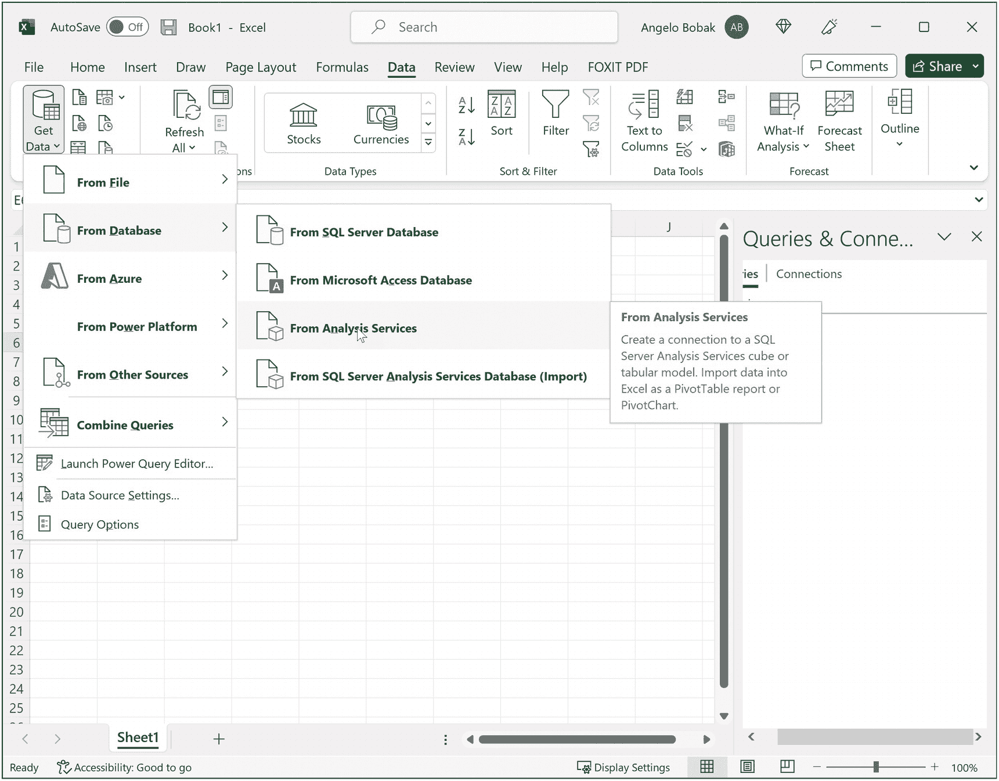

#### 图 10-43 将 Microsoft Excel 连接到 Analysis Services

一张 Microsoft Excel 窗口的截图。工具栏中选择了“获取数据”选项，并显示一个菜单，其中选择了“来自数据库”。这又打开了另一个菜单，其中选择了“来自 Analysis Services”。右侧面板显示“查询和连接”。

从出现的下拉菜单中，只需点击“来自数据库”，然后点击“来自 Analysis Services”，进行必要的选择。将出现一个面板。只需输入服务器名称和安全凭据（确保你使用创建立方体时所使用的模拟凭据），你的连接就定义好了。

还会出现两个面板，让你选择立方体以及将连接信息保存在文件中。

最后，你会看到一个小面板，让你指定在 Excel 中放置导入数据的位置，以及数据透视表的创建位置。

你现在可以拖放所需的列和值来创建数据透视表，如图 10-44 所示。

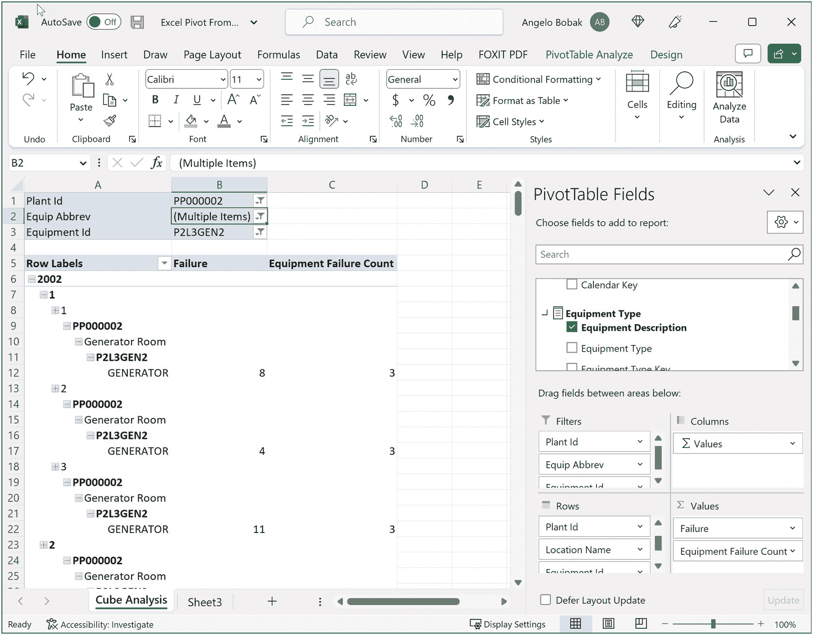

#### 图 10-44 基于立方体的 Microsoft Excel 数据透视表

一张 Microsoft Excel 窗口的截图。它显示了一个包含 3 列和 4 个主行的表格，每个主行有 5 个子行。列标题为“行标签”、“故障”和“设备故障计数”。右侧面板显示“数据透视表字段”，包含用于选择字段、筛选器、列、行和值的选项。

看起来很熟悉，不是吗？你可以根据需要添加筛选器和更改组合，以便在你定义的层次结构中向上钻取和向下钻取。

最后，只是为了再次激起你的兴趣，我将向你展示一个通过将 `Power BI` 连接到我们刚刚创建的立方体而创建的 `Power BI` 报表和仪表板。

请参阅图 10-45。

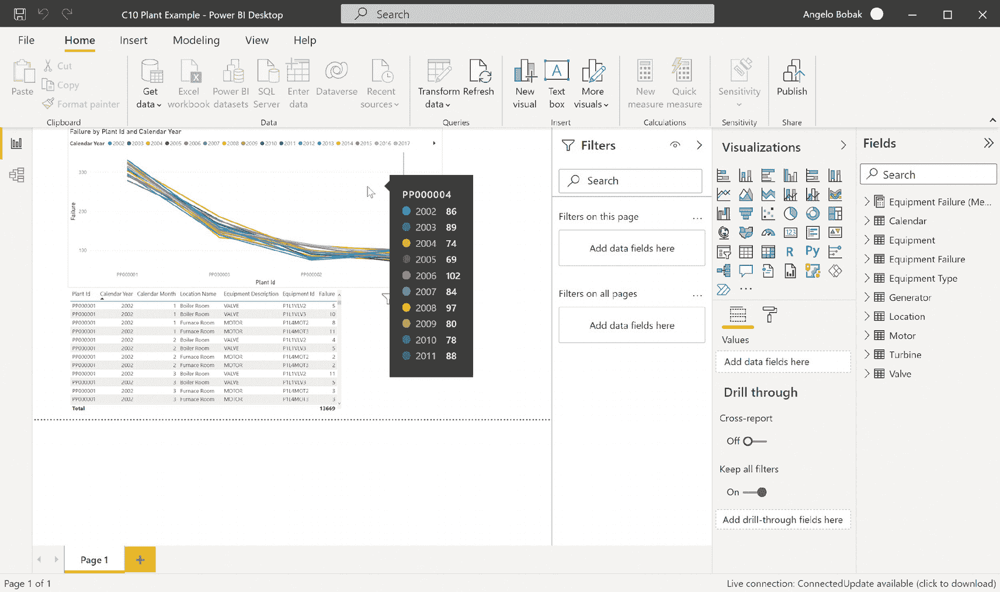

#### 图 10-45 电厂故障的 Power BI 仪表板

一张 Power BI 仪表板的截图。它显示了“故障”与“工厂 ID”关系的折线图，有 16 条下降的曲线。还有一个包含 7 列 12 行的表格。右侧面板是筛选器（有 2 个选项）、可视化效果、字段（包含组件和子组件）以及一个搜索框。


学习和创建 Power BI 仪表盘、记分卡和报告需要一整本书的篇幅。但正如您所见，这是添加到您工具包中的一个非常强大的工具。我将在最后三章介绍如何创建一两个简单的记分卡，以便您掌握一些使用 `Power BI` 的基本技能。

Apress 出版社有一本关于此主题的好书，名为 `Beginning Microsoft Power BI: A Practical Guide to Self-Service Analytics`（第三版），作者是 Dan Clark。

您可能想看看这本书。

### 总结

本章我们涵盖了很多内容。希望您喜欢并觉得有用。我们照例研究了 `SQL Server` 自带的分析函数，但这次我们将它们应用到了发电厂场景中，以了解如何进行分析来识别构成发电厂的关键设备的故障率。

我们还对编写的查询进行了性能分析，并进一步练习了本书至此所学的性能分析工具。

最后，我们通过引入两个新工具来扩展您的工具包，即 `Analysis Services` 和 `Report Builder`。

我们将在最后三章对这些工具进行扩展，通过对一个库存控制案例研究进行一些分析来实现。我还将介绍最后一个名为 `SQL Server Integration Services` 的工具，这是 `Microsoft SQL Server BI` 套件中的顶级 `ETL` 工具，它向您展示如何创建加载数据库和数据仓库的流程。

让我们在第 11 章再见，在那里我们将再次研究用于跟踪库存的聚合窗口函数。

