# 11. 库存用例：聚合函数

这将是一个有趣的章节。我们不仅要在库存管理场景中实践窗口聚合函数，还将学习如何使用 Microsoft 的顶级 `ETL` 工具（称为 `SSIS`）来创建一个流程，从我们将用于创建查询的库存数据库加载到库存数据仓库。

我们将创建针对 `APInventory` 数据库和 `APInventoryWarehouse` 数据仓库的查询，以便比较结果和性能。通常的性能分析讨论将被包括在内，并且您还会有一些建议的课后作业。

最后，用于创建和加载这两个数据库的脚本，连同查询脚本，都包含在本章在 Apress 网站上的文件夹中。让我们通过一些简单的业务概念模型来看看这些数据库是什么样子的。

## 库存数据库

让我们通过描述示例中将使用的数据库来开始本章。以下是我们高层次的业务概念模型，它标识了库存数据库的业务实体。

请参考图 11-1。

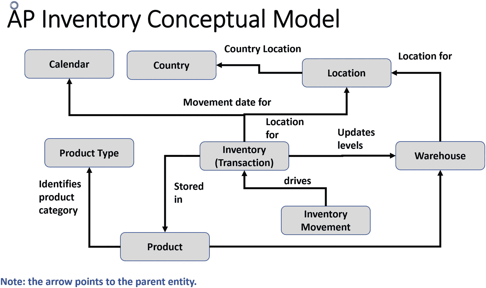

图 11-1. 库存数据库概念模型

主要的业务对象是 `Inventory` 表，它存储与产品进出库存相关的信息。`Inventory Movement` 业务对象标识了任何产品在任何日期的现有数量。`Product` 对象存储有关所销售产品的典型信息，`Product Type` 对象标识产品类型。最后，我们有常见的 `Country`、`Location` 和 `Calendar` 业务对象。

前面的模型用简单的动词短语标识了对象之间的关系。表 11-1 是各个实体的高层描述。

表 11-1. 库存数据库表

| 实体 | 描述 |
| --- | --- |
| `Calendar` | 包含用于交易事件和库存移动的日历日期。 |
| `Country` | 标识 ISO 两位和三位国家代码及国家名称。 |
| `Location` | 标识库存和仓库的位置。一个位置有一个或多个库存。库存有一个或多个仓库。 |
| `Product` | 标识库存中可用的产品。 |
| `Product Type` | 标识产品类型，例如 HO 电力机车。 |
| `Inventory` | 标识与此库存关联的仓库中可用的高级别单位。 |
| `Inventory Movement History` | 标识产品进出仓库的日期以及相关的产品。 |
| `Inventory Sales Report` | 与库存移动相关的销售报告。 |
| `Inventory Transaction` | 标识产品从仓库的每日进出移动。 |
| `Warehouse` | 与库存中产品相关的详细信息，包括当前水平和再订购数量。 |

这个简单的数据字典标识了概念模型中的业务实体以及每个表的描述。出于篇幅考虑，我将不包含详细的属性数据字典，因为数据库表中的列名清楚地标识了所存储的业务数据。


## 库存数据仓库

接下来，我们将查看第二个数据库，这是一个实现为 `SNOWFLAKE`（雪花）模式的数据仓库。此数据仓库是从 `APInventory` 数据库加载的。本章将包含一节，介绍如何使用 SQL Server Integration Services（`SSIS`）来加载这个简单的数据仓库。

图 11-2 是我们示例数据仓库的简化 `SNOWFLAKE` 模式。

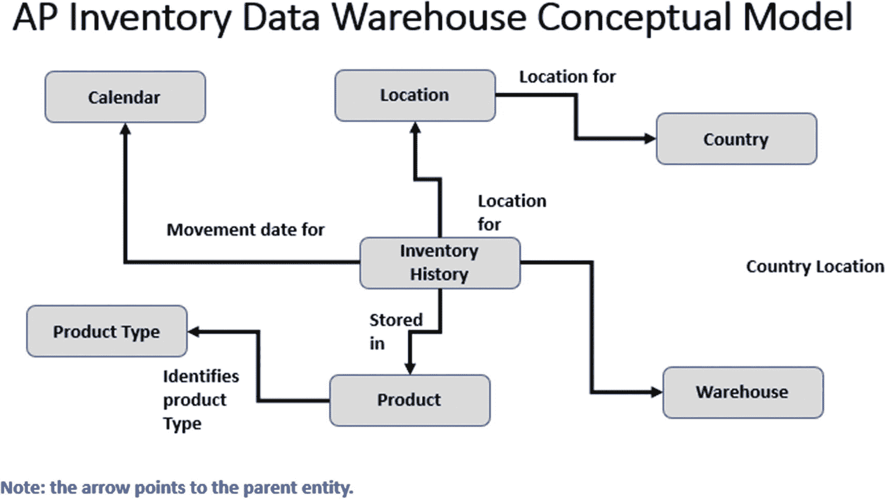

一个框图展示了一个概念模型。一个标题为"库存历史"的方框位于中央，并与其父项相连。父项描绘了日历、地点、仓库和产品。产品的父项是产品类型，地点的父项是国家。

图 11-2

库存数据仓库概念模型

此模型中的核心业务对象是 `库存历史` 对象，它将作为数据仓库中事实表的基础。与 `APInventory` 数据库中库存出入相关的存储历史数据将存储在此对象中。

围绕 `库存历史` 业务对象的是用于在数据仓库中创建维度的各种实体。这些实体基本上与我们在 `APInventory` 数据库中讨论的相同，其动词短语清晰地阐述了历史 `库存历史` 对象与未来维度表之间的业务关系。例如，产品类型标识产品的类型，比如蒸汽机车类型。

以下是数据仓库模型相关的物理表名、分配的模式和主键信息。

请参考表 11-2。

表 11-2

库存数据仓库表

| 表 | 类型 | 主键 |
| --- | --- | --- |
| Calendar | 维度表 | CalendarKey |
| Country | 维度表 | CountryKey |
| Inventory | 维度表 | InvKey |
| Location | 维度表 | LocKey |
| Product | 维度表 | ProdKey |
| Product Type | 维度表 | ProdTypeKey |
| Warehouse | 维度表 | WhKey |
| Inventory History | 事实表 | CalendarKey, LocKey, WhKey, ProdKey, ProdTypeKey |

从技术上讲，`Warehouse` 表应该包含 `Location` 和 `Inventory` 的主代理键，但为了简化模型和加载脚本，我在这里做了一点设计上的捷径。

接下来，我将为你的工具箱介绍一个新工具。这个工具叫做 `SSIS`（SQL Server Integration Services），它是 Microsoft 的顶级 `ETL`（提取、转换、加载）工具。我们将使用这个工具从事务性库存数据库中加载我们的数据仓库。

创建这两个数据库的所有代码都可以在 Apress 网站本书的章节文件夹中找到。

## 加载库存数据仓库

`SSIS` 代表 SQL Server Integration Services，它是一个图形化工具，允许用户为任何数据集成过程创建称为控制流和数据流的过程流。控制流定义了为提取、转换和加载数据而需要执行任务的步骤和顺序，而数据流则允许数据架构师指定数据的流向和低级别的转换任务。根据数据分发的需求，流程可以是顺序的，也可以包含多个分支。

`SSIS` 创建称为包的应用程序。在每个包内，有一系列定义并执行处理数据的低级别步骤的任务。因此，我们可以说 `SSIS` 由控制流和数据流、包以及任务组成。一个 `SSIS` 项目可以包含一个或多个包，这些包可以相互调用以定义非常复杂的数据集成和转换流程。

工具箱提供了所有可能需要的任务，解决方案资源管理器面板允许定义所需的数据源和连接。让我们来探索一下这个工具的主要功能。

请参考图 11-3。

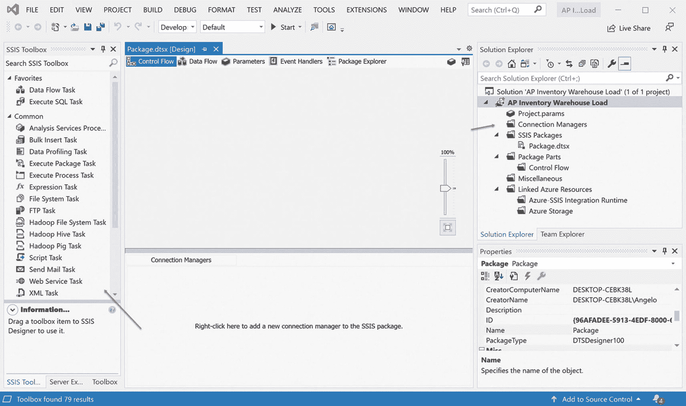

一个窗口的截图，顶部是菜单栏，左侧是工具箱列表，右侧是解决方案资源管理器。中间区域显示了标题为 `package.dtsx` 的页面。

图 11-3

创建项目

这并非一个详尽的 `SSIS` 教程。其目的是让你对这个工具有足够的熟悉度，以便能够创建简单的加载流程并自行探索该工具。有许多优秀的书籍和课程可以帮助你提升到更高的技能水平。

GUI（图形用户界面）由四个主要面板组成：

*   **SSIS 工具箱**：包含你流程中需要的所有低级别任务，例如 FTP 任务。
*   **设计区域**：包含用于创建控制流和数据流的 GUI，用于标识 `ETL` 包中使用的参数，以及事件处理程序和包资源管理器。
*   **解决方案资源管理器**：在这里你可以标识项目参数、连接管理器、你将需要的 `SSIS` 包、包部件以及用于存放杂项组件的文件夹，还有链接的 Azure 资源。
*   **连接管理器**：标识到数据库、其他服务器甚至 `SSAS`（SQL Server Analysis Services）服务器的连接。

右键单击解决方案资源管理器中的文件夹将弹出菜单，用于添加新组件，例如连接。

现在让我们开始创建我们的包（我们的项目将只有一个包）。第一个任务是创建连接管理器。

请参考图 11-4。

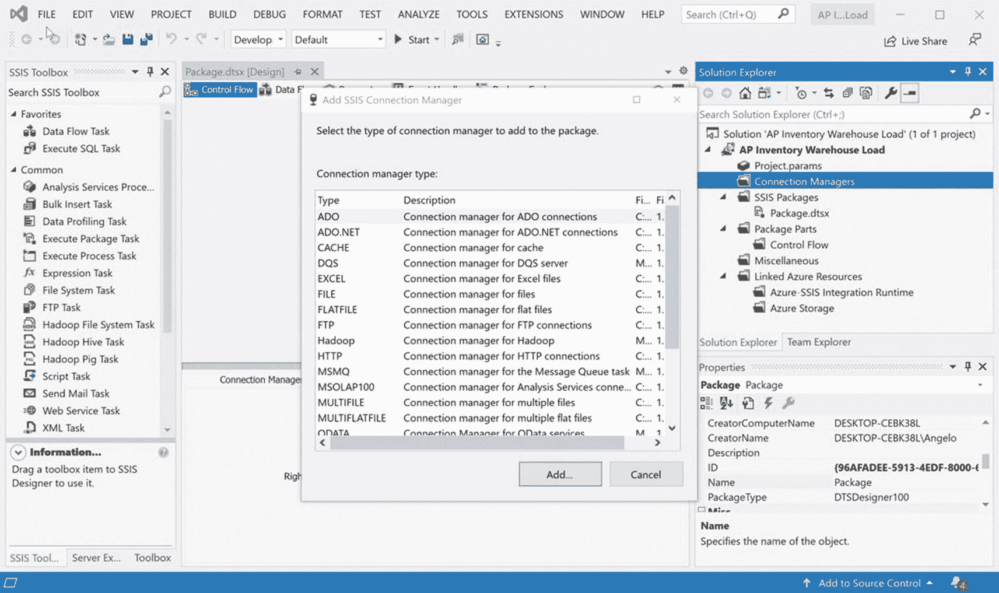

一个窗口的截图，顶部是菜单栏，左侧是工具箱列表，右侧是解决方案资源管理器。中间区域描绘了一个标题为 `添加 SSIS 连接管理器` 的对话框。

图 11-4

添加连接管理器

右键单击 `连接管理器` 文件夹，会弹出一个对话框，允许你查看并选择所需的连接管理器。就我们的目的而言，我们需要第一个名为 `ADO`（Active X Data Objects）的选项，因此我们选择它并单击 `添加` 按钮。请注意列表框，其中包含许多数据源，如 Hadoop 和 Excel。

接下来，我们需要定义安全信息。请参考图 11-5。

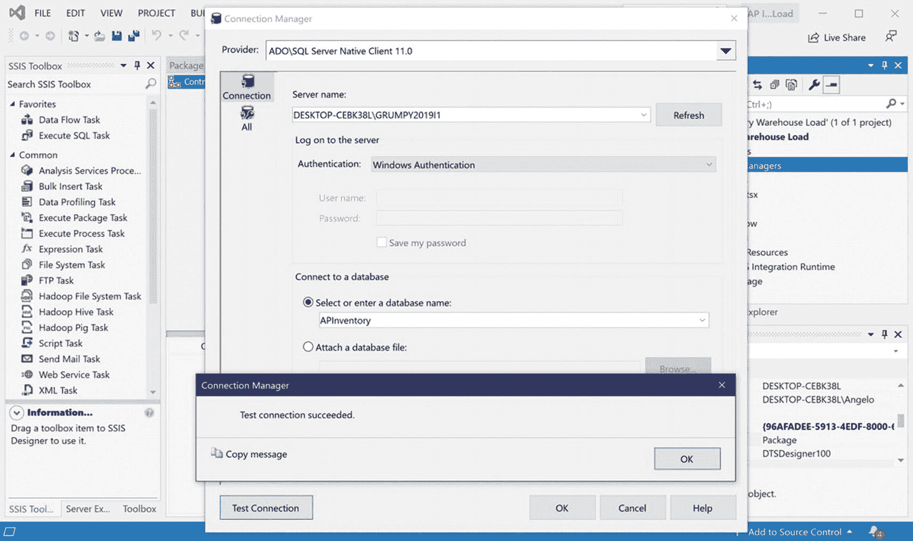

一个窗口的截图，顶部是菜单栏，左侧是工具箱列表，右侧是解决方案资源管理器。中间区域描绘了标题为 `连接管理器` 的对话框。底部的消息框显示 `测试连接成功`。

图 11-5

配置连接管理器

### 创建并执行 SSIS 包

在此步骤中，我们需要选择要连接的服务器、身份验证信息以及要连接的数据库。在本例中，我们需要连接`APInventory`数据库。我们还希望测试连接以确保所有信息都被正确识别。如图所示，测试连接成功。现在我们已准备好创建控制流。

请参考图 11-6。

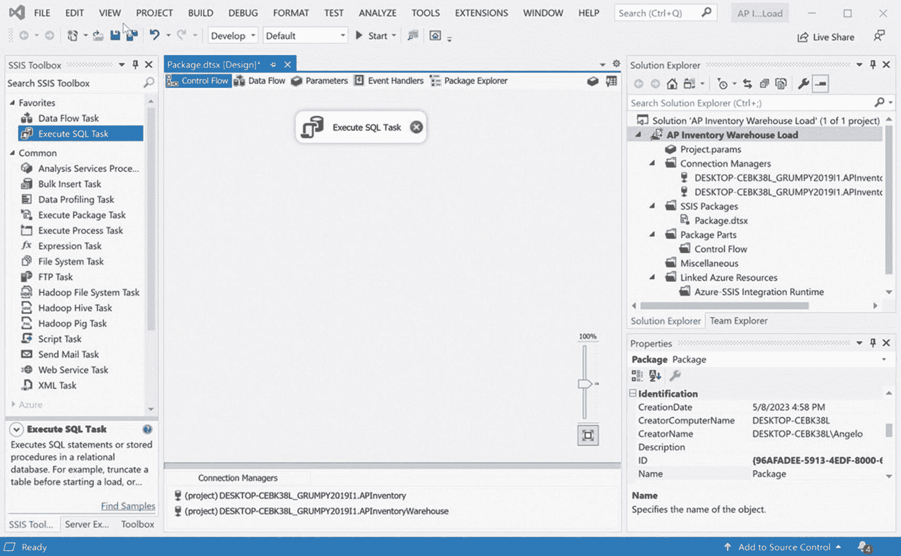

窗口截图显示顶部有菜单栏，左侧有工具箱列表，右侧有解决方案资源管理器。中间区域描绘了一个标题为`package.dtsx`的页面，并显示一条消息："Execute SQL Task"。

**图 11-6**
添加 SQL 任务

我们将创建的简单包将是一系列通过控制流连接（在“控制流”选项卡中完成）连接起来的任务。每个任务将执行一个简单的`TSQL INSERT`命令，该命令从`APInventory`数据库中的一个表中提取数据，并将其加载到`APInventoryWarehouse`数据仓库中的对应表中。

我将引导您完成完成第一个步骤所需的步骤。所有其他步骤都是相同的，只是`TSQL INSERT`命令会根据我们使用的表对进行更改。

首先，将“Execute SQL Task”从`SSIS`工具箱拖放到设计区域。

接下来，我们需要在刚刚添加的新任务中建立到数据库的连接。

请参考图 11-7。

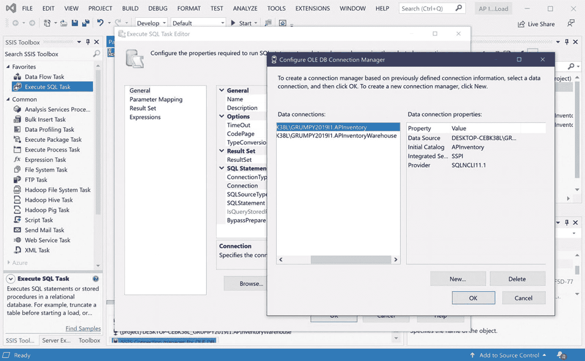

窗口截图显示顶部有菜单栏，左侧有工具箱列表，右侧有解决方案资源管理器。中间区域描绘了一个标题为"Configure OLE DB Connection Manager"的对话框。

**图 11-7**
在 SQL 任务中添加连接

双击该任务，会弹出一个名为"Execute SQL Task Editor"的对话框。在显示"SQL Statement"的地方，点击"Connection"文本框右侧的小向下箭头按钮，然后选择"New connection"。

此时会出现"Connection Manager"面板，您需要填写我们将要使用的 SQL 服务器名称以及身份验证（用户 ID 和密码）方法。最后选择要连接的数据库，别忘了测试连接。如果您已经创建了连接，只需选择现有连接而不是选择"New connection"即可。

单击"确定"按钮，我们继续下一步。

请参考图 11-8。

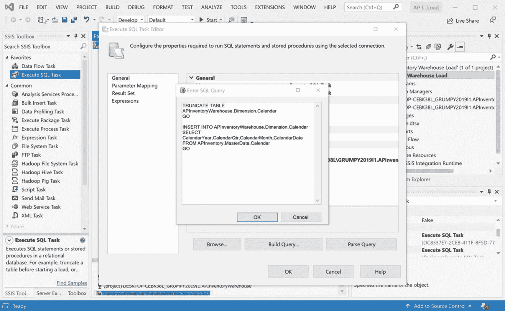

窗口截图显示顶部有菜单栏，左侧有工具箱列表，右侧有解决方案资源管理器。中间区域描绘了一个标题为"Enter SQL Query"的对话框。

**图 11-8**
向 SQL 任务添加 TSQL INSERT 查询

现在我们需要将以下小型 TSQL 脚本添加到任务中。

请参考清单 11-1。

```
TRUNCATE TABLE APInventoryWarehouse.Dimension.Calendar
GO
INSERT INTO APInventoryWarehouse.Dimension.Calendar
SELECT CalendarYear,CalendarQtr,CalendarMonth,CalendarDate
FROM APInventory.MasterData.Calendar
GO
-- Listing 11-1
-- Load the Calendar Dimension
```

如您所见，它包含两个命令：一个用于截断`Calendar`表，另一个是`INSERT/SELECT`组合，从`APInventory`事务数据库中的`Calendar`表中提取数据，并将其加载到`APInventoryWarehouse`数据仓库中的`Calendar`维度表。

建议使用完全限定的表名，即`<database>.<schema>.<table name>`，这样您就不会遇到问题！

接下来，我们拖放所需的剩余“Execute SQL Tasks”并连接它们。

请参考图 11-9。

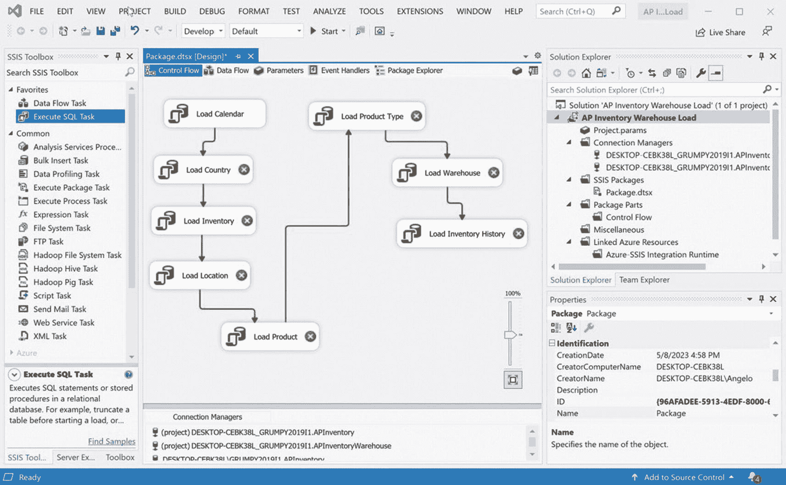

窗口截图显示顶部有菜单栏，左侧有工具箱列表，右侧有解决方案资源管理器。中间区域描绘了`package.dtsx`的控制流页面。它显示了一个块流程图，代表一个圆圈，每个任务旁边都有一个叉号。

**图 11-9**
添加其他 Execute SQL Tasks

注意所有带有`X`标签的小红圈，表示错误。这是因为我们尚未添加连接和查询信息。运行包时，您不希望看到这些错误标记。

每次将新的“Execute SQL Task”拖放到设计窗格时，您都会看到一个指向下方的小绿色箭头。这是您需要单击并拖动以附加到控制流序列中下一个任务以建立路径的箭头。如果它是序列中的最后一个任务，则无需将绿色箭头附加到任何内容；您可以直接忽略它。

您还可以拖放另一个“Execute SQL Task”，并将其命名为类似“Log Error”的名称。在其中，您可以放置一些`TSQL`逻辑来捕获 SQL Server 错误代码和消息，并将它们插入日志表。您需要单击原始的 SQL 任务，使小绿色箭头出现，然后将其附加到日志错误任务。

最后，右键单击新的绿色箭头，并在弹出菜单中单击“Failure”。这将把箭头颜色变为红色。通过这种流程，如果发生错误，流程将被重定向到此任务，错误详细信息将被加载到日志表中，您可以选择继续执行下一个任务或完全停止执行。

以下是我加载所有任务、建立连接并插入查询后完成的包。

请参考图 11-10。

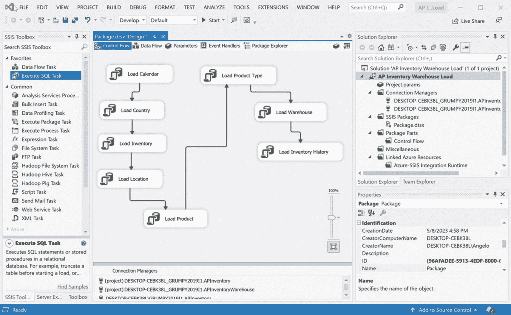

窗口截图显示顶部有菜单栏，左侧有工具箱列表，右侧有解决方案资源管理器。中间区域描绘了`package.dtsx`的控制流页面。该页面包含一个表示已建立连接的块流程图。

**图 11-10**
完成包的创建

这相当简单，正如他们所说，“a walk in the park”（轻而易举）！剩下的就是通过单击菜单栏中间、“ANALYZE”选项下方标有“Start”的绿色箭头来运行该包。

包运行后，我们应该在每个任务旁边看到绿色箭头。

请参考图 11-11。

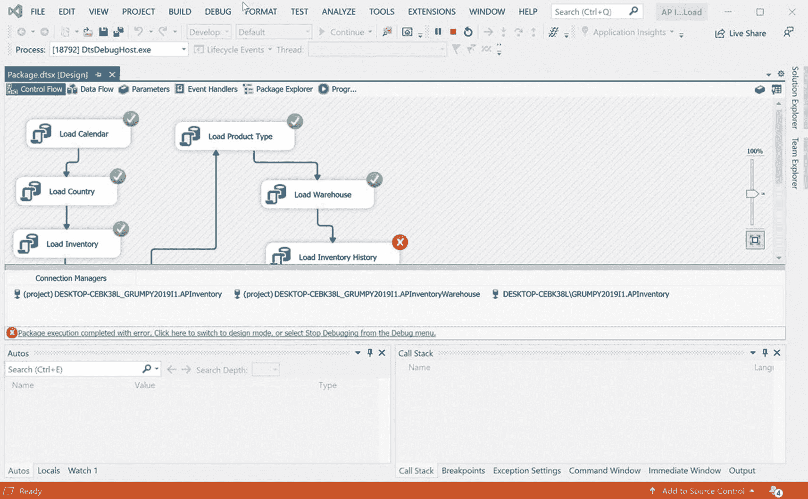

截图描绘了`package.dtsx`的控制流页面。该页面显示了一个块流程图，其中除了“load inventory history”任务旁边显示一个带叉的圆圈外，每个任务旁边都有一个复选框。

**图 11-11**
测试包

很不幸，最后一步失败了。结果发现有一个语法错误。我检查了代码，发现我没有完全限定目标表名，因此该步骤失败了。回想一下，我们在第一步中创建的连接是到事务数据库的。除非脚本中的表名包含了数据库名称，否则任务不知道目标表。因此，请记住在所有任务中完全限定所有表名！

纠正语法错误后，我们重新运行脚本以确保所有内容都已正确加载。这并非必要，因为您可以通过右键单击任务并选择“Execute Task”来单独执行每个任务。

请参考图 11-12。

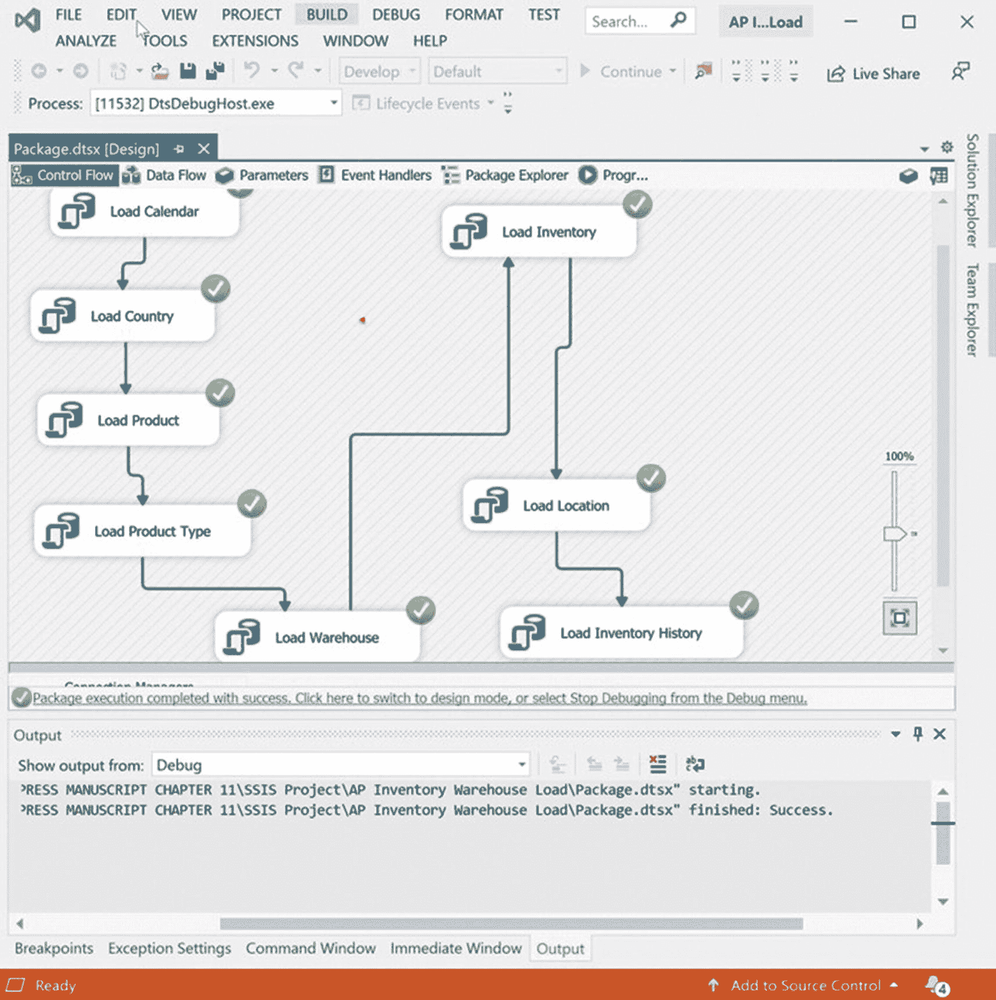

截图描绘了`package.dtsx`的控制流页面。该页面显示了一个块流程图，其中每个任务旁边都有一个复选框。流程从“load calendar”开始，依次是“load country”、“product”、“product type”、“warehouse”、“inventory”、“location”和“inventory history”。

**图 11-12**
第二次测试运行 – 成功


完美。一切运行顺利，我们的数据仓库应该已经加载完成了。

我们来检查一下事实表里面的内容，以确认无误。

请参考图 11-13。

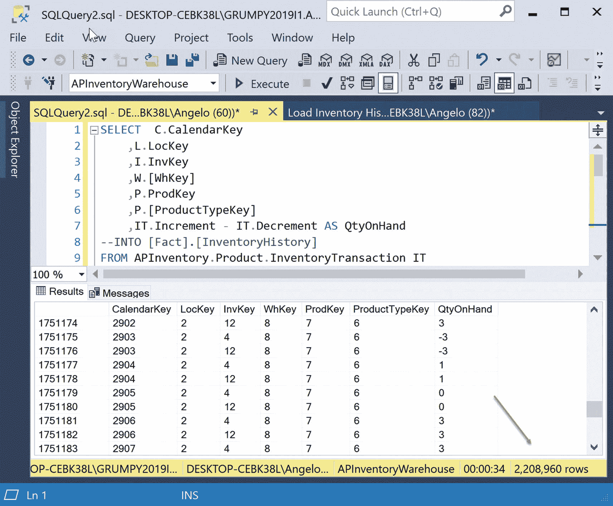

一张截图展示了用于选择`日历键`、`锁键`、`库存键`、`产品键`和`产品类型键`的`SQL`查询代码。结果表位于底部。

**图 11-13** 事实表转储 – 2,208,960 行

我们执行查询以转储所有行，看到有 2,208,960 行数据被插入。不错。我们还看到所有列都是代理键的数值，最后一列`QtyOnHand`（现有库存量）显示了可用产品的数量。所有这些代理键意味着我们需要将事实表与维度表进行连接，才能真正看清这些数据是什么！

使用代理表是因为基于数值列连接表比基于字母数字或文本列连接表更快。

我创建了一个`TSQL 视图`，稍后将用它来显示实际的产品值，如产品名称和标识符。通过查询这个`VIEW`对象，我们可以确认连接操作已成功。该`TSQL 视图`在月度级别上进行聚合，因此我们只得到 24,192 行结果。

让我们看看在一个简单的`SELECT`查询中使用该`VIEW`时，结果如何。

请参考图 11-14。

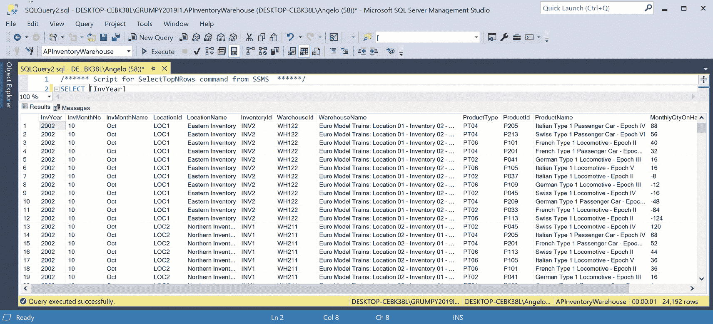

一张截图描绘了`SQL`查询的结果。表格的列名包括`库存年份`、`月份数字`、`月份名称`、`位置 ID`、`位置名称`、`库存 ID`、`仓库 ID`、`仓库名称`、`产品 ID`、`产品类型`和`产品名称`。

**图 11-14** 月度现有库存总量

如你所见，所有的描述性信息都已可用，我们可以在许多报表查询和场景中使用这个`TSQL 视图`。

关于`SSIS`的最后一点说明：之前我提到过可以添加错误捕获。清单 11-2 是一个简单的表定义和一个简单的`INSERT`命令，用于捕获`SQL Server`的系统级错误代码和消息。

```sql
CREATE TABLE [dbo].ErrorLog NULL,
[ErrorLine]       [int] NULL,
[ErrorMsg]        nvarchar NULL,
[ErrorDate]       [datetime]
)
GO
INSERT INTO [dbo].[ErrorLog]
SELECT
ERROR_NUMBER()          AS [ERROR_NO]
,ERROR_SEVERITY()        AS [ERROR_SEVERITY]
,ERROR_STATE()           AS [ERROR_STATE]
,ERROR_PROCEDURE()       AS [ERROR_PROC]
,ERROR_LINE()            AS [ERROR_LINE]
,ERROR_MESSAGE()         AS [ERROR_MSG]
,GETDATE()               AS [ERROR_DATE];
GO
```
**清单 11-2** 错误捕获工具包

如你所见，当出现问题时，该表可以存储错误号、严重性以及其他常见的系统错误信息。这些错误代码和消息存储在系统参数中，可以在前面的`INSERT/SELECT`命令中使用，将它们加载到我们的日志表中。我们可以将`INSERT`命令放在一个或多个`执行 SQL 任务`中，并将所有流程从正常任务重定向到错误任务（在出错时），如图 11-15 所示。

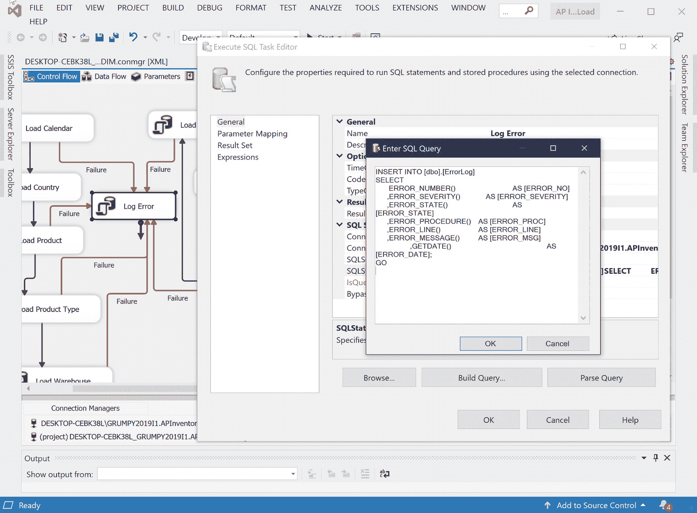

一张截图展示了两个对话框。前面的对话框标题为`输入 SQL 查询`，后面的标题为`执行 SQL 任务编辑器`。

**图 11-15** 添加的 SSIS 错误捕获

这样，如果某个环节出错，我们就能获得所有的错误代码、错误消息、问题代码的行号以及错误发生的日期。

我们现在可以转到聚合函数分析了，但我想你已经掌握了足够的`SSIS`知识，可以创建包含任务来执行简单`ETL`处理的简单包了！

## 聚合函数

我们将再次简要回顾一下聚合窗口函数。你应该对它们很熟悉，因为在之前的所有三个业务场景中我们都涵盖过。这次我们将它们应用到我们的库存控制场景中，以便了解业务分析师如何监控库存水平，并捕获诸如库存不足或无库存等事件，从而能够采取纠正措施——或者可能是高库存水平，这表明某个产品滞销！

以下是我们将在本章讨论的窗口聚合函数：

*   `COUNT()`: 支持窗口框架规范
*   `SUM()`: 支持窗口框架规范
*   `MAX()`: 支持窗口框架规范
*   `MIN()`: 支持窗口框架规范
*   `AVG()`: 支持窗口框架规范
*   `STDEV()`: 支持窗口框架规范
*   `VAR()`: 支持窗口框架规范

如你所见，它们都支持`ROWS`和`RANGE`窗口框架规范。

我们的第一个分析将前五个函数合并在一个查询中，因为我们已经涵盖并熟悉了它们的工作原理。换句话说，我们不会为每个函数单独设置一个查询。


### COUNT()、SUM()、MAX()、MIN() 和 AVG() 函数

我们之前见过这些函数，它们的名称暗示了其功能，因此这里不再逐一描述。现在，让我们看看业务分析师提供的第一组业务需求：

业务分析师希望我们创建一个库存移动概况报告，该报告需展示库存水平小于 50 个单位的产品的数量、最小值和最大值，以及总量和平均值。此外，数据范围需涵盖所有年份，且位置为“LOC1”、库存为“INV1”、产品为“P033”。

所有结果都需要按月滚动计算，但 `SUM()` 结果除外，它只需计算当前月份的总计加上上个月的结转总计。

解决方案请参考代码清单 11-3。

```sql
WITH InventoryMovement (
LocId, InvId, WhId, ProdId, AsOfYear, AsOfMonth, AsOfDate, InvOut, InvIn, Change, QtyOnHand
)
AS(
SELECT LocId
,InvId
,WhId
,ProdId
,AsOfYear
,AsOfMonth
,AsOfDate
,InvOut
,InvIn
,(InvIn - InvOut) AS Change
,(InvIn - InvOut) + LAG(QtyOnHand,1,0) OVER (
PARTITION BY LocId,InvId,WhId,ProdId
ORDER BY [AsOfDate]
)AS QtyOnHand -- 05/31/2022
FROM APInventory.Product.WarehouseMonthly
)
SELECT LocId
,InvId
,WhId
,ProdId
,AsOfYear
,AsOfMonth
,AsOfDate
,InvOut
,InvIn
,Change
,QtyOnHand
,COUNT(*) OVER (
PARTITION BY AsOfYear,LocId,InvId,WhId,ProdId
ORDER BY LocId,InvId,WhId,AsOfMonth
ROWS BETWEEN UNBOUNDED PRECEDING AND CURRENT ROW
) AS WarehouseLT50
,MIN(QtyOnHand) OVER (
PARTITION BY AsOfYear,LocId,InvId,WhId,ProdId
ORDER BY LocId,InvId,WhId,AsOfMonth
ROWS BETWEEN UNBOUNDED PRECEDING AND CURRENT ROW
) AS MinMonthlyQty
,MAX(QtyOnHand) OVER (
PARTITION BY AsOfYear,LocId,InvId,WhId,ProdId
ORDER BY LocId,InvId,WhId,AsOfMonth
ROWS BETWEEN UNBOUNDED PRECEDING AND CURRENT ROW
) AS MaxMonthlyQty
,SUM(QtyOnHand) OVER (
PARTITION BY AsOfYear,LocId,InvId,WhId,ProdId
ORDER BY LocId,InvId,WhId,AsOfMonth
--ROWS BETWEEN UNBOUNDED PRECEDING AND CURRENT ROW
ROWS BETWEEN 1 PRECEDING AND CURRENT ROW
) AS Rolling2MonthlyQty
,AVG(QtyOnHand) OVER (
PARTITION BY AsOfYear,LocId,InvId,WhId,ProdId
ORDER BY LocId,InvId,WhId,AsOfMonth
ROWS BETWEEN UNBOUNDED PRECEDING AND CURRENT ROW
) AS AvgMonthlyQty
FROM InventoryMovement
WHERE QtyOnHand <= 50
AND LocId = 'LOC1'
AND InvId = 'INV1'
AND ProdId ='P033'
ORDER BY LocId
,InvId
,WhId
,ProdId
,AsOfYear
,AsOfMonth
GO
```
代码清单 11-3
库存水平概况报告

如代码所示，我们按年份设置分区，因为我们并没有将结果过滤为仅一年。

我为所有聚合函数都包含了 `ROWS` 窗口框架子句，以生成滚动月份的效果：

```sql
ROWS BETWEEN UNBOUNDED PRECEDING AND CURRENT ROW
```

对于 `SUM()` 聚合函数，我使用了以下窗口框架子句，以便月度总和能结转上月的总计：

```sql
ROWS BETWEEN 1 PRECEDING AND CURRENT ROW
```

回想一下，这意味着聚合函数将作用于当前行和所有之前的行，从而为 `COUNT()`、`MAX()`、`MIN()` 和 `AVG()` 函数产生“滚动”效果。如前所述，`SUM()` 函数“滚动”两个月。

`ORDER BY` 子句按库存 ID 和月份对分区进行排序。如果想包含不止一年的数据，我们需要在这里和 `PARTITION BY` 子句中包含年份。

现在来看 `WHERE` 子句。由于我们正在过滤一个库存位置的结果，我们其实不需要特别指出库存 ID。可以尝试运行此查询，生成一个估计的查询计划，然后从 `OVER()` 子句中移除库存 ID，再生成第二个估计的查询计划。看看它们是否发生了变化。

最后，我们看到了 `WHERE` 子句，如果想将所有位置、库存和仓库都包含在结果中，可以轻松地更改它。可以创建一个 SQL Server Reporting Services（`SSRS`）报告，为这些维度提供筛选器，以便业务分析师可以选择他们想要的数据。

部分结果请参考图 11-16。

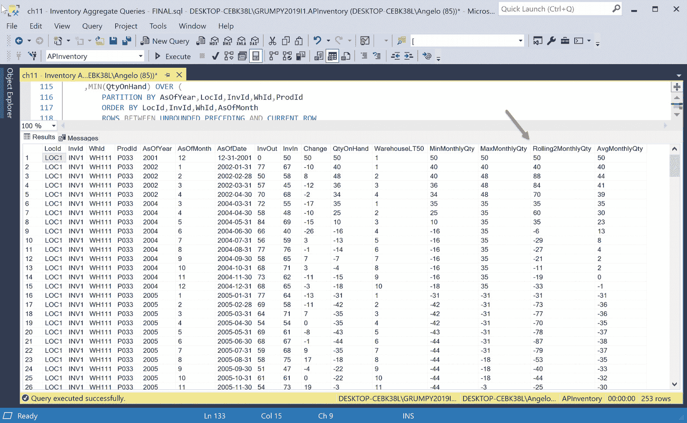

主页面上的一个窗口截图代表一个表格。表格的列描绘了库存的详细信息。一个箭头指向一个名为“滚动到月度数量”的列。

图 11-16

库存水平概况报告

看起来不错。所有的滚动月份值都加总无误。由于这是一个按月滚动的过程，而我们只查看一种产品，因此库存中少于或等于 50 件的仓库物品会随着月份推移逐月增加。当前月份和上个月的库存数量总和是递增加总的，所以符合要求。

检查几行数据并进行简单的数学计算是一种有效的验证方式。你甚至可以将结果复制粘贴到 Microsoft Excel 电子表格中进行验证。最大和最小水平看起来也是正确的。

请记住，我们开始时是正的库存水平，因此增量和减量的总和并不一定反映库存数量。换句话说，库存数量是在原始水平的基础上，加上进入库存的物品数量，再减去离开库存的物品数量后剩下的部分。


#### 性能考量

让我们运行通常的基线估计查询计划，看看此查询在性能方面的表现。请参考图 11-17。

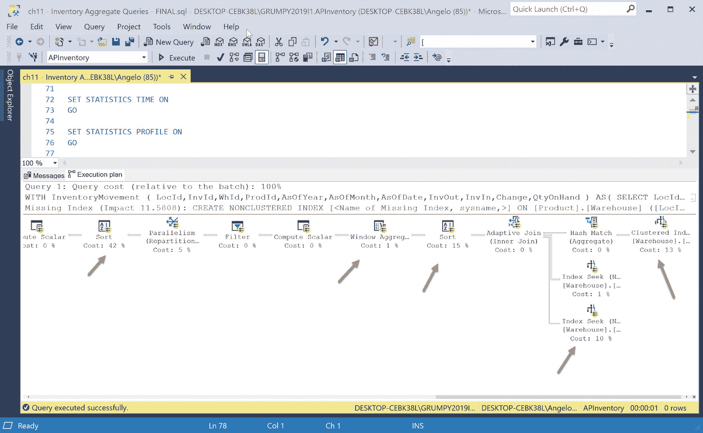

一张截图。主页显示一个执行计划。箭头指向名为“排序成本 42%”、“窗口聚合成本 1%”、“排序成本 15%”、“索引查找成本 10%”和“聚集索引成本 13%”的阶段。

图 11-17
库存移动概况基线估计查询计划

我们不会在此花太多时间，但看起来我们的索引覆盖范围还不够。我们看到在 `Warehouse` 表上有一个成本为 13% 的聚集索引查找，以及另外两个在 `Warehouse` 表上、成本分别为 10% 和 1% 的索引查找。这是因为我们使用了一个名为 `WarehouseMonthly` 的 `VIEW`（视图），该视图基于 `Warehouse` 表。

我们还看到我们仍然需要创建以下索引：

```
CREATE NONCLUSTERED INDEX ieInvOutInvInAsOfYearAsOfMonth
ON [Product].[Warehouse] ([LocId],[InvId],[ProdId])
INCLUDE ([InvOut],[InvIn],[AsOfYear],[AsOfMonth])
GO
```

最后，我们看到两个排序任务，成本分别为 15% 和 42%。所有其他任务的成本都很低。以下是此查询的 `IO` 和 `TIME` 统计信息。

请参考图 11-18。

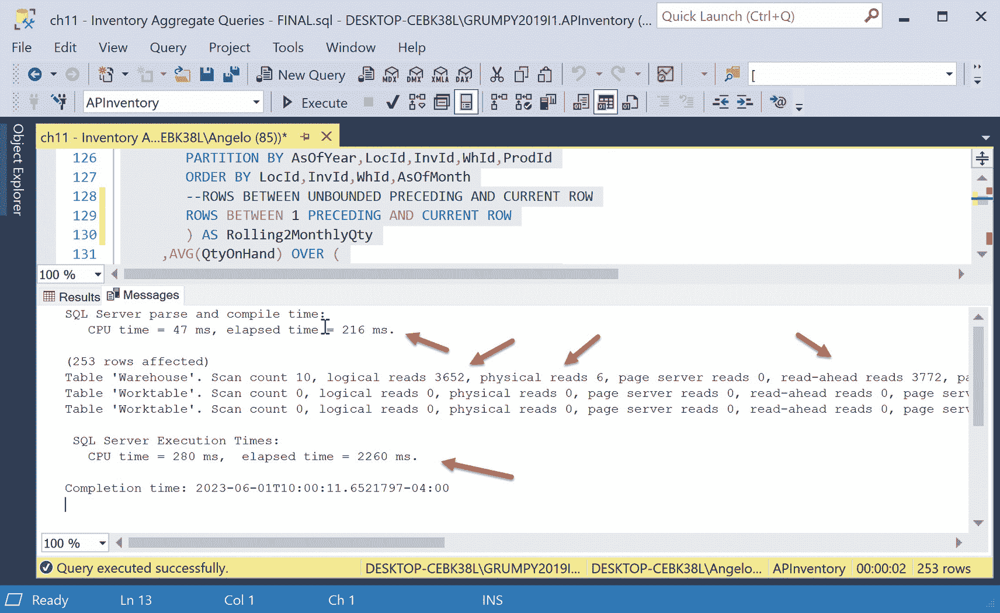

一张截图。主页标题为“消息”。箭头指向“经过时间等于 216 ms 和 2260 ms”、“逻辑读取 3652”、“物理读取 6”和“预读 3772”。

图 11-18
IO 和 TIME 统计信息

临时表的值全为零，因此我们忽略这些。但对于 `Warehouse` 表，我们看到扫描计数为 10，逻辑读取为 3,652，物理读取为 6，预读为 3,772。查询执行时间为 2260 毫秒。这确实是一个繁忙的查询。

让我们创建推荐的索引，看看能获得哪些改进（如果有的话）。

修订后的估计查询计划请参考图 11-18a。

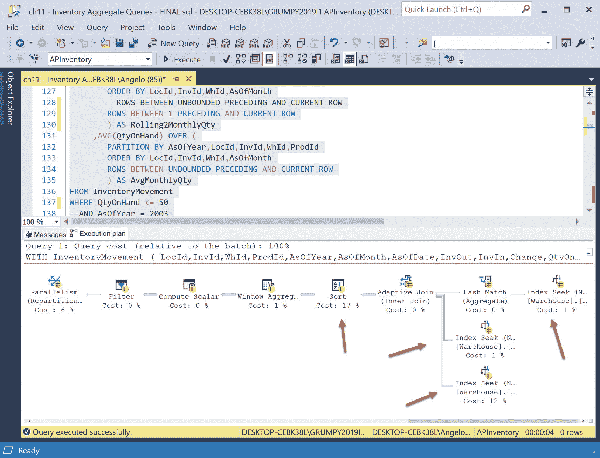

一张截图。页面上半部分描绘了 SQL 代码，下半部分描绘了执行计划。箭头指向名为“排序成本 15%”、“索引查找成本 1%”和“索引查找成本 12%”的阶段。

图 11-18a
修订后的估计查询计划

看起来好一些了。第一个索引查找任务的成本降低了；其他任务基本差不多，所以新索引带来了一些适度的改进。我们来看一下 `IO` 和 `TIME` 统计信息。

新的 `IO` 和 `TIME` 统计信息请参考图 11-18b。

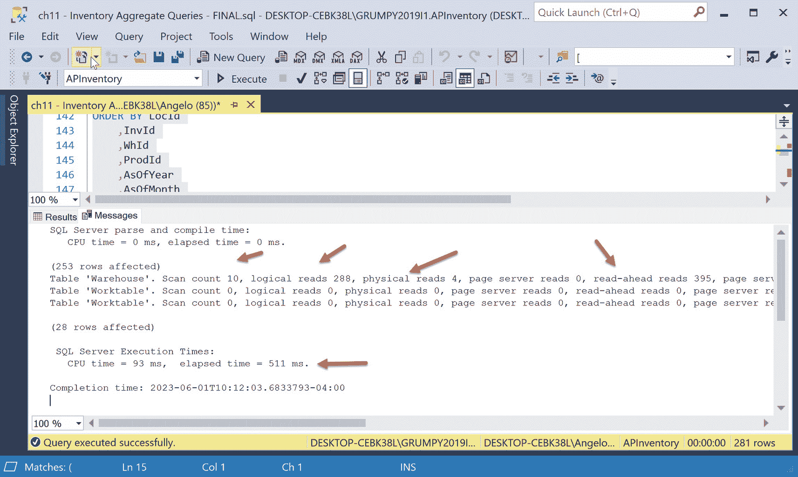

一张 SQL 工作区域的截图。主页面的上半部分描绘了库存订单详情的 SQL 代码。页面下半部分的标题是“消息”，箭头指向“扫描计数 10”、“物理读取 4”、“预读 395”和“经过时间等于 511 ms”。

图 11-18b
修订后的估计查询计划 IO 和 TIME 统计信息

这里的情况看起来好多了。`Warehouse` 表的计数大幅下降，执行时间也减少了。所以看起来推荐的索引见效了。

让我们快速再看一下 `AVG()` 函数。

### AVG( ) 函数

顾名思义，这个函数用于计算平均值，不过您应该已经知道了。让我们看看我们的业务分析师提供的业务需求说明：

这次，我们的分析师想要查看库存移动值（特别是库存入库和库存出库）的滚动平均值。滚动平均值按年计算，而不是按月。

清单 11-4 是该查询的代码。未显示的是 `CTE`，因为它与前一个查询中的 `CTE` 相同。

```
SELECT MovementDate
,InvId
,LocId
,WhId
,ProdId
,Increment
,Decrement
,AVG(CONVERT(DECIMAL(10,5),Increment)) OVER (
ORDER BY MovementDate
ROWS BETWEEN UNBOUNDED PRECEDING AND UNBOUNDED FOLLOWING
) AS MonthlyAvgIncr
,AVG(CONVERT(DECIMAL(10,5),Decrement)) OVER (
ORDER BY MovementDate
ROWS BETWEEN UNBOUNDED PRECEDING AND UNBOUNDED FOLLOWING
) AS MonthlyAvgDecr
FROM APInventory.Product.InventoryTransaction
WHERE ProdId = 'P033'
AND YEAR(MovementDate) = 2010
AND MONTH(MovementDate) = 5
AND WhId = 'WH112'
GO
```

清单 11-4
库存移动入库和出库的年度滚动平均值

这里使用了 `ROWS` 窗口框架规范来定义处理的范围。在此查询中，我们将范围定义为按年。对于当前行，我们（或者应该说 SQL Server）会考虑分区内所有在它之前的行和所有在它之后的行。

请注意，我们根据业务分析师的要求筛选了 2010 年，但一旦我们测试通过，就可以修改为更多年份、月份以及所有位置、库存、仓库和产品。这将使其成为一个使用 Report Builder 创建的 `SSRS` 报告的良好候选。

请参考图 11-19 中的部分结果以及一个漂亮的图表。

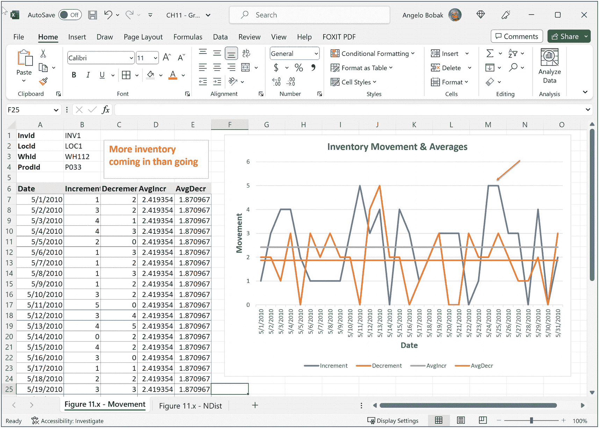

一张窗口截图，左侧代表 Excel 表格，右侧是一个多线图。各列标题为“日期”、“增量”、“减量”、“平均增长”和“平均减少”。一个移动量随日期变化的多线图描绘了波动趋势。

图 11-19
库存移动分析折线图和报告

我们可以看到库存移动存在很多上下波动。这可以解释为有大量的销售发生。但业务分析师需要确认，库存出库移动不会导致许多延期交货的情况。这意味着客户需要等待他们订购的商品，可能导致客户不满意，并进而可能造成客户流失。


#### 性能考量

接下来，我们需要像往常一样分析性能，因此让我们生成基线估计查询计划，看看此查询是否需要一些调整或索引来支持其达到最佳性能。

请参考图 11-20。

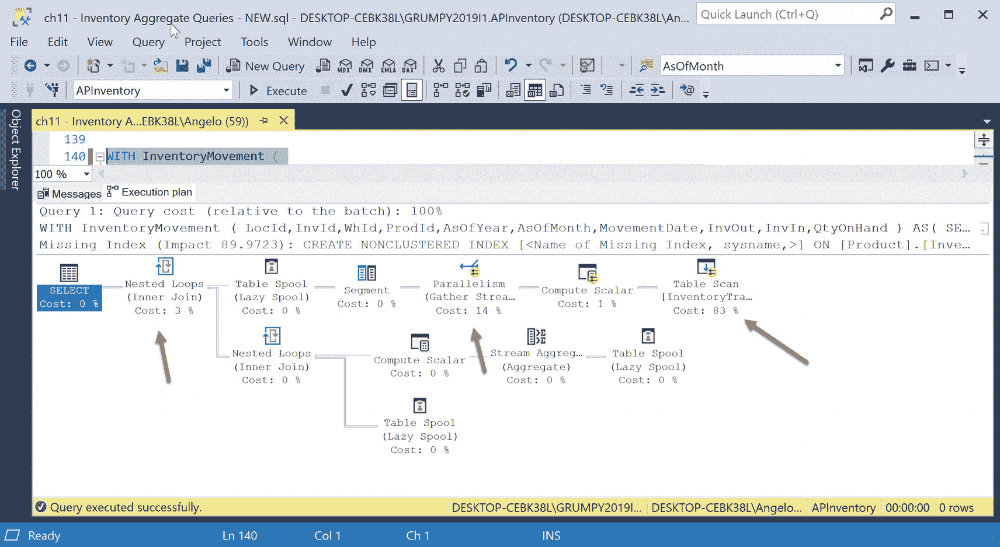

一张截图展示了窗口主页面上的执行计划。箭头指向嵌套循环、并行处理和表扫描。

图 11-20 基线估计执行计划

不算太复杂，但此计划有三个分支。我们看到右上角开始的一个昂贵的表扫描占用了 83% 的成本，接着是一个计算标量（成本 1%），一个用于收集数据流的并行任务（成本 14%），以及一个嵌套循环联接（成本 3%）。

当然，系统建议了一个索引，这将成本降低了 89.97%。让我们创建这个索引，看看是否有帮助。

请参考代码清单 11-5。

```
CREATE NONCLUSTERED INDEX ieWhIdProdIdMovementDate
ON APInventory.Product.InventoryTransaction (WhId,ProdId)
INCLUDE (Increment,Decrement,MovementDate,InvId,LocId)
GO
代码清单 11-5
建议的索引
```

请注意，索引键只有两列，即 `WhId` 和 `ProdId` 列，但我们需要在 `INCLUDE` 子句中包含其他列，如 `Increment`、`Decrement`、`MovementDate`、`InvId` 和 `LocId` 列。

创建索引并重新运行估计查询计划后，我们生成了修订后的估计查询计划。请参考图 11-21。

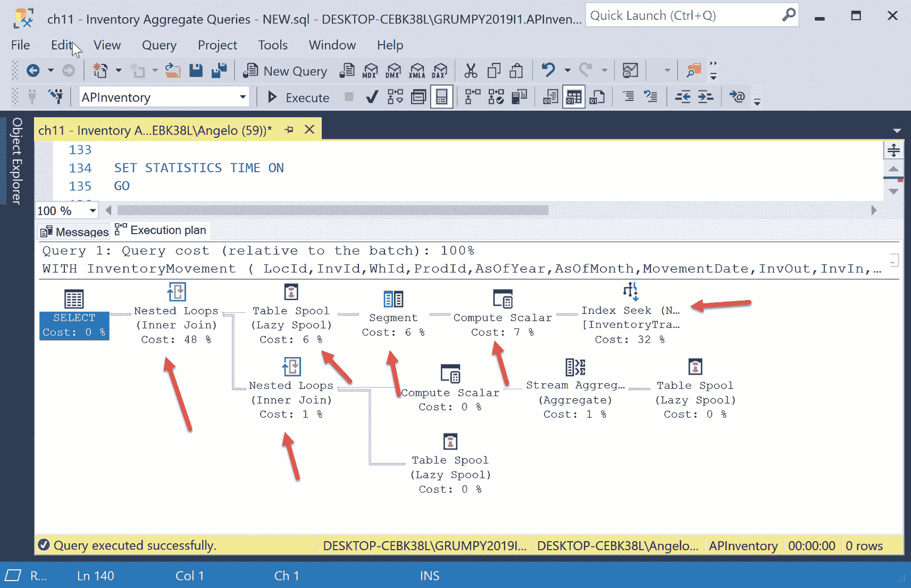

一张截图。窗口主页面显示了执行计划。箭头指向嵌套循环、表假脱机、段、计算标量和索引查找。

图 11-21 修订后的估计查询计划

我们可以看到改进之处。表扫描和并行任务消失了，现在出现了一个成本为 32% 的索引查找。我们看到了一个表假脱机以及成本为 48% 的嵌套循环联接。再次证明，估计查询分析器给出了一个很好的建议。

### 课后作业

尝试将索引创建为聚集索引，看看是否有显著改进。创建索引并查看估计查询计划以及 `IO` 和 `TIME` 统计信息。

`STAR` 查询时间（或者我应该说 `SNOWFLAKE` 查询时间）？

### 数据仓库查询

让我们看看查询 `SNOWFLAKE` 数据仓库数据库是否会与事务数据库的查询计划和统计信息相比，产生有趣的性能特性。

这个查询被称为 `STAR` 查询。这是因为它使用了采用 `STAR` 数据模型设计的数据仓库的维度表和事实表。是的，它在 `SNOWFLAKE` 模式上也适用。我猜如果你包括一些连接到维度表的支线表（如 `PRODUCT TYPE`），你可以称它为 `SNOWFLAKE` 查询。

**注意**：术语 *支线表* 指的是连接到另一个维度表的维度表，例如，产品类型到产品子类型再到产品。如果你不熟悉数据仓库模型，请上网查找描述设计数据仓库所使用的不同模型和方法组合的文章。例如，可以看看 Kimball 与 Inmon 采取的方法有何不同。

我们将采用刚刚讨论的查询规格，并稍作修改，以便报告库存水平的总和与平均值。

请参考代码清单 11-6。

```
SELECT C.CalendarYear
,C.CalendarMonth
,C.CalendarDate AS AsOfDate
,L.LocId
,L.LocName
,I.InvId
,W.WhId
,P.ProdId
,P.ProdName
,QtyOnHand
,SUM(IH.QtyOnHand) OVER (
ORDER BY C.CalendarMonth
ROWS BETWEEN 1 PRECEDING AND CURRENT ROW
) AS RollingSum
,AVG(SUM(CONVERT(DECIMAL(10,2),IH.QtyOnHand))) OVER (
ORDER BY C.CalendarMonth
ROWS BETWEEN 1 PRECEDING AND CURRENT ROW
) AS RollingAvgOnHand
FROM ApInventoryWarehouse.Fact.InventoryHistory IH
JOIN Dimension.Calendar C
ON IH.CalendarKey = C.CalendarKey
JOIN Dimension.Location L
ON IH.LocKey = L.LocKey
JOIN Dimension.Warehouse W
ON IH.WhKey = W.WhKey
JOIN Dimension.Inventory I
ON IH.InvKey = I.InvKey
JOIN Dimension.Product P
ON IH.ProdKey = P.ProdKey
JOIN Dimension.ProductType PT
ON P.ProductTypeKey = PT.ProductTypeKey
WHERE C.CalendarYear = 2010
-- 原为：AND C.[CalendarDate] = AsOfDate – 每月最后一天
-- 已更改为如下，因为 Warehouse 表现在包含每月的所有日期
-- 之前的版本只包含每月的最后一天
AND C.[CalendarDate] = EOMONTH(CONVERT(VARCHAR,YEAR(C.[CalendarDate])),(MONTH(C.[CalendarDate]) - 1))
AND L.LocId = 'LOC1'
AND I.InvId = 'INV1'
AND W.WhId = 'WH111'
AND P.ProdName LIKE 'French Type 1 Locomotive %'
AND P.ProdId = 'P101'
GROUP BY C.CalendarYear
,C.CalendarMonth
,C.CalendarDate
,L.LocId
,L.LocName
,I.InvId
,W.WhId
,P.ProdId
,P.ProdName
,QtyOnHand
GO
代码清单 11-6
SNOWFLAKE 查询示例
```

我们立刻注意到需要一个 `GROUP BY` 子句。但是看看所有这些 `JOIN` 谓词！

#### 随堂测验

为什么我们称这是一个 `SNOWFLAKE` 查询？

`SUM()` 和 `AVG()` 函数都使用了包含 `ORDER BY` 子句但没有 `PARTITION BY` 子句的 `OVER()` 子句。其中包含了一个窗口帧子句：

```
ROWS BETWEEN 1 PRECEDING AND CURRENT ROW
```

这仅考虑分区中正在处理的当前行和前一行。

你还记得如果我们不包含窗口帧规范，默认的窗口帧行为是什么吗？

这是对我们在第 1 章讨论过的表格的复习，该表格明确了在 `ORDER BY` 和 `PARTITION BY` 子句的不同组合下 `OVER()` 子句的默认行为。请参考表 11-3。

表 11-3 默认的 ROWS 和 RANGE 行为

```
| ORDER BY | PARTITION BY | 默认帧 |
| --- | --- | --- |
| 否 | 否 | ROWS BETWEEN UNBOUNDED PRECEDING AND UNBOUNDED FOLLOWING |
| 否 | 是 | ROWS BETWEEN UNBOUNDED PRECEDING AND UNBOUNDED FOLLOWING |
| 是 | 否 | RANGE BETWEEN UNBOUNDED PRECEDING AND CURRENT ROW |
| 是 | 是 | RANGE BETWEEN UNBOUNDED PRECEDING AND CURRENT ROW |
```

小小的复习总是有益的。反正也能省去翻回第 1 章的麻烦。

让我们看看估计查询计划是什么样子。


#### 性能考量

考虑到我们拥有所有这些连接，可以预期会得到一个有趣的估计查询计划。

让我们通过“查询”菜单选项下的选择，以常规方式生成该计划。

由于计划内容较长，我需要将其分成两部分。

请参考图 11-22a。

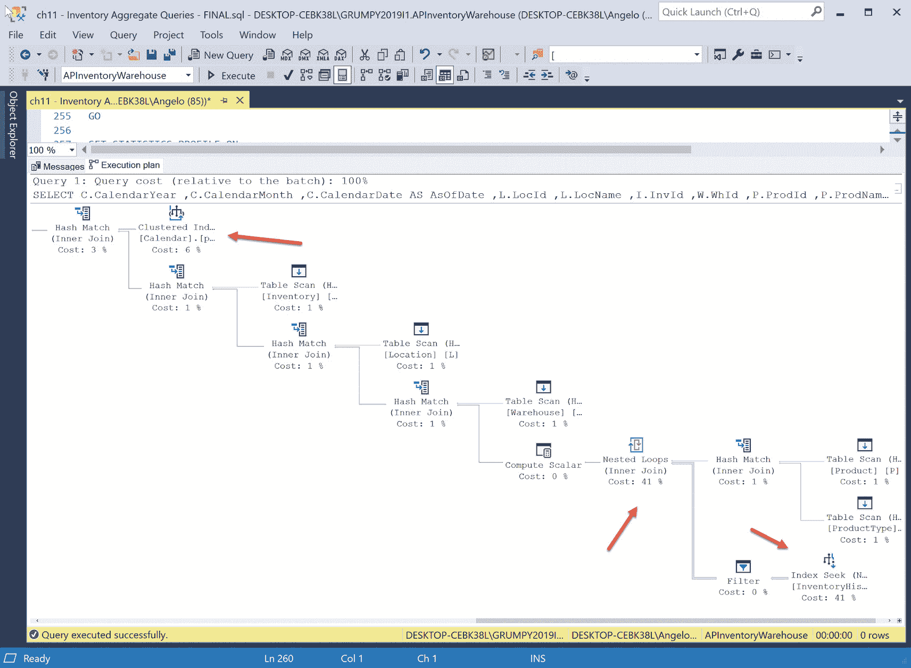

一个 SQL 工作区的截图。窗口主页面显示了执行计划。箭头指向聚集索引开销 6%、嵌套循环开销 41%和索引查找开销 41%。

图 11-22a

估计查询计划 部分 A

这是计划的第一部分。如果行数很少，这类查询将对维度表进行一系列全表扫描，因此即使你创建了索引，也可能不会被使用！

我们在事实表上确实进行了一次索引查找，这是件好事（查找优于扫描）。看起来我们有一个可用的索引，它满足了 `OVER()` 子句中的列和 `WHERE` 子句谓词列的要求，因此没有建议创建新索引。

所有数据流通过哈希匹配连接（开销 3%）进行连接。我们有一个开销为 41%的嵌套循环连接任务，它连接了来自 `Product`、`ProductType` 和 `InventoryHistory` 表的数据流。现在让我们看看查询计划的第二部分。

请参考图 11-22b。


一个 SQL 工作区的截图。窗口主页面从左到右显示了执行计划的步骤。它依次读取了选择、计算标量、流聚合、窗口假脱机、段、计算标量、流聚合和排序操作符。

图 11-22b

估计查询计划 部分 B

这部分无需担心。所有开销都为零，所以让我们查看一下 `TIME` 和 `IO` 统计信息。

请参考图 11-23。

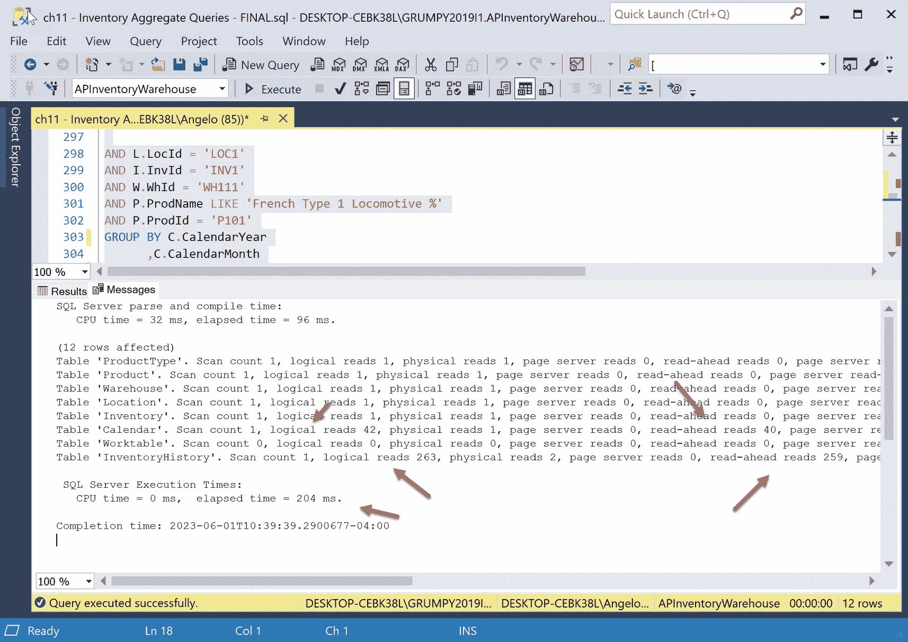

一个 SQL 工作区的截图。主页面上半部分是 SQL 查询代码，下半部分标题为“消息”。箭头指向逻辑读取 42 和 263，预读 0 和 259，经过时间等于 204 毫秒。

图 11-23

IO 和 TIME 统计信息

让我们讨论一下数值较高的统计信息。我们的 `Calendar` 维度表产生了大约 42 次逻辑读取和 40 次预读，因此这是需要重点关注以进行性能优化的领域。我们可以将其放置在高速存储或固态硬盘上，或者使用内存优化表。

工作表的所有值都为 0，所以我们不必担心这个。

最后，事实表 `InventoryHistory` 的扫描计数为 1，逻辑读取 263 次，物理读取 2 次，预读 259 次。这是可以预料的，因为该表有 736,320 行，相当大（至少对于笔记本电脑而言）。

**提示与家庭作业**

由于数据具有历史性质，我们应该像之前示例中所做的那样，将结果放入一个报表表中。这样，我们只在非高峰时段加载该表时承担一次性能影响。请自行尝试并进行必要的分析。

### `STDEV()` 函数

统计学时间到了！

提醒一下，回顾一下我们在第[2]章中对标准差的定义（如果你对此工作原理感到熟悉，请跳过此部分，直接转到示例查询的业务规范）。如果你需要复习或者这对你是新知识，请继续阅读：

`STDEV()` 函数计算一组值的统计标准差，当整个总体**未知**或不可用时。

但这意味着什么？

这意味着数据集中的数字与其算术**平均值**（这是“平均”的另一种说法）有多接近或多远。在我们的上下文中，平均或**平均值**是所讨论的所有数据值的总和除以数据值的数量。还有其他类型的**平均值**，如几何平均数、调和平均数和加权**平均数**，我将在附录 B 中简要介绍。

回想一下标准差是如何计算的。

以下是计算标准差的算法，如果你有冒险精神，可以用 TSQL 自己实现：

*   计算所有值的平均值（**平均值**）并将其存储在变量中。你可以使用 `AVG()` 函数。
*   循环遍历值集合。对于数据集中的每个值
    *   减去计算出的平均值。
*   对结果求平方。
*   取所有上述结果的总和，并将该值除以数据元素的数量减 1。（此步骤计算方差；如果要计算整个总体的方差，则不要减 1。）
*   现在对方差取平方根，那就是你的标准差。

或者你也可以直接使用 `STDEV()` 函数！还有一个 `STDEVP()` 函数。唯一的区别是 `STDEV()` 处理的是数据总体的一部分。这适用于整个数据集未知的情况。`STDEVP()` 函数处理整个数据集，即整个数据总体。

再次说明语法：

```sql
SELECT STDEV( ALL | DISTINCT ) AS [Column Alias]
FROM [Table Name]
GO
```

你需要提供一个包含要使用数据的列名。你可以选择性地提供 `ALL` 或 `DISTINCT` 关键字。如果你省略它们，与其他函数一样，默认行为将是 `ALL`。使用 `DISTINCT` 关键字将忽略列中的重复值（请确保这是你想要做的）。

以下是业务分析师提供给我们的下一份报告的业务需求：

需要一份报告，显示库存现有数量的平均值和标准差。结果需要针对年份“2003”、位置“LOC1”、库存“INV1”和产品“P033”。报告数据需要用于在 Microsoft Excel 电子表格中创建正态分布图。

以下是我们为满足规范要求而编写的代码。

请参考代码清单 11-7。

```sql
WITH YearlyWarehouseReport (
    AsOfYear,AsOfQuarter,AsOfMonth,AsOfDate,LocId,InvId,WhId,
    ProdId,AvgQtyOnHand
)
AS
(
    SELECT AsOfYear
          ,DATEPART(qq,AsOfDate) AS AsOfQuarter
          ,AsOfMonth
          ,AsOfDate
          ,LocId
          ,InvId
          ,WhId
          ,ProdId
          ,AVG(QtyOnHand) AS AvgQtyOnHand
    FROM Product.Warehouse
    GROUP BY AsOfYear
            ,DATEPART(qq,AsOfDate)
            ,AsOfMonth
            ,AsOfDate
            ,LocId
            ,InvId
            ,WhId
            ,ProdId
)
SELECT AsOfYear
      ,AsOfQuarter
      ,AsOfMonth
      ,AsOfDate
      ,LocId
      ,InvId
      ,WhId
      ,ProdId
      ,AvgQtyOnHand AS MonthlyAvgQtyOnHand
      ,AVG(AvgQtyOnHand) OVER (
            PARTITION BY AsOfYear,WhId
            ORDER BY AsOfYear
        ) AS YearlyAvg
      ,STDEV(AvgQtyOnHand) OVER (
            PARTITION BY AsOfYear,WhId
            ORDER BY AsOfYear
        ) AS YearlyStdev
FROM YearlyWarehouseReport
WHERE AsOfYear = 2003
  AND LocId = 'LOC1'
  AND InvId = 'INV1'
  AND ProdId ='P033'
GO
```
代码清单 11-7
库存数量平均值与标准差报告


`OVER()` 子句的分区依据是年份和仓库 ID，尽管年份并非必需，因为我们只筛选 2003 年的结果。业务分析师希望使用此代码包含更多年份，因此我们保留此列以便后续修改查询。此外，我们希望平均值和标准差是针对整年的，因为我们将在 Microsoft Excel 电子表格中使用这些数据来生成正态分布曲线。请注意，我们将获得两个仓库的结果。每个库存对应两个仓库。每个地点对应一个库存。

请参考图 11-24 中的部分结果。

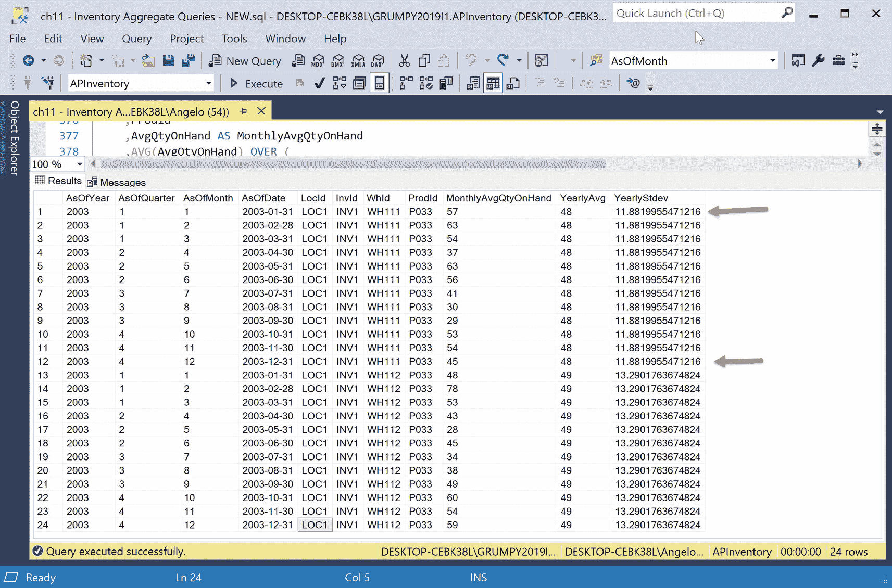

窗口截图以表格形式显示结果。列标题为：季度、日期、月份、年份、地点 ID、库存 ID、月度平均在手数量、年度平均值、年度标准差。有两支箭头指向第 1 行和第 12 行。

图 11-24

库存数量的平均值和标准差报告

结果是针对单一年份但两个仓库的。请注意，对于每个库存，所有月份的平均值和标准差值都是相同的。让我们复制这些结果并粘贴到 Microsoft Excel 电子表格中，这样就可以创建显示完美钟形曲线的图表。

请参考图 11-25 中的部分结果。

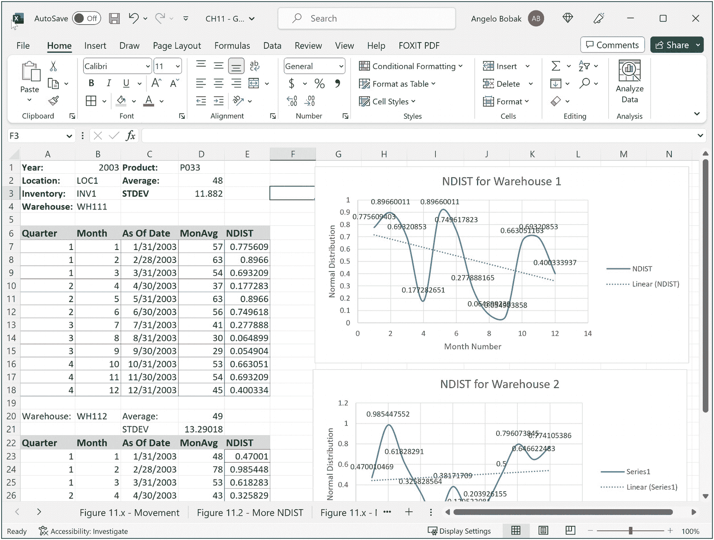

窗口截图展示了 2 个 Excel 工作表和两条折线图。Excel 工作表的列标题为：季度、月份、截至日期、月度平均值、NDIST。正态分布与月份数关系的折线图呈现波动趋势。

图 11-25

月度平均数量的钟形曲线

好的，看起来是多条钟形曲线，而不是一条。我们可以看到，随着月份推进，平均值存在很大差异，仓库 WH111 的趋势是下降的，而仓库 WH112 的趋势是上升的。方差结果会是什么样将很有趣，但让我们先执行通常的基线估计性能分析。

### 性能考虑

这次我们将只查看基线计划，并让您自行尝试任何优化，比如像前面章节那样，将查询的 `CTE` 部分替换为报表表。

以下是我们的基线估计查询性能计划，见图 11-26。

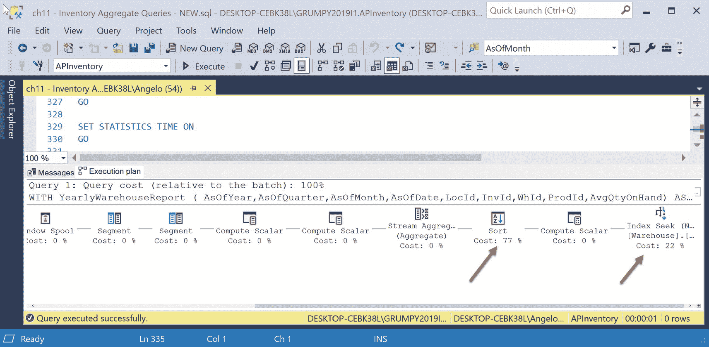

截图展示了执行计划。箭头指向排序成本等于 17%，索引查找成本等于 22%。

图 11-26

基线估计执行计划

看起来是一个简单的线性计划，大部分活动集中在 Warehouse 表上。我们有一个索引查找任务，成本为 22%，还有一个相当昂贵的排序操作，成本为 77%。所有其他任务的成本均为 0%。让我们看看 `IO` 和 `TIME` 性能统计。

请参考图 11-27。

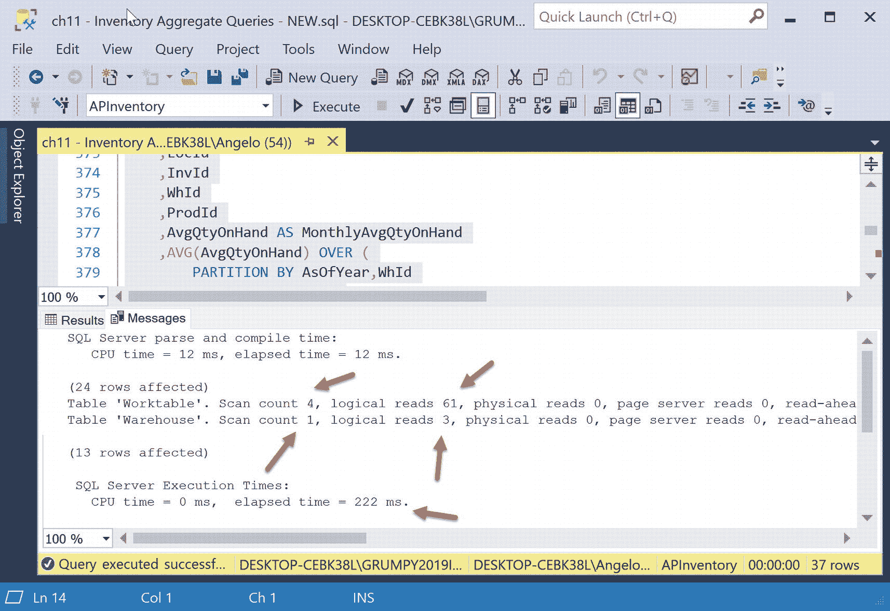

窗口截图。页面上半部分描绘了 SQL 代码。页面下半部分标题为"消息"。箭头指向：扫描计数 4 和 1，逻辑读取 61 和 3，已用时间等于 222 ms。

图 11-27

IO 和 TIME 性能统计

查询运行耗时 222 毫秒，低于 1 秒。大部分活动发生在临时表上。我们可以看到扫描计数值为 4，逻辑读取数为 61。Warehouse 表的扫描计数为 1，逻辑读取数为 3。所有其他值均为零。

看来，对于这种排序值很高的查询类型，我们能做的改进就是确保将 `TEMPDB` 放置在高速驱动器上，或者最好是固态硬盘上。有时候，你能做的就是增加更多硬件！

### 数据仓库查询

让我们看看查询 `SNOWFLAKE` 数据库是否会与事务性数据库的查询计划和统计信息相比，产生有趣的性能特征。我想您现在已经知道，该查询将使用多个 `JOIN` 子句，这将形成一个有趣的估计查询计划。

业务规范大致相同，只是没有 `WHERE` 子句。我们计算数量总和的标准差和平均值。

请参考清单 11-8。

```sql
SELECT C.CalendarYear
,C.CalendarMonth
,C.CalendarDate
,L.LocId
,L.LocName
,I.InvId
,W.WhId
,P.ProdId
,P.ProdName
,SUM(QtyOnHand) As QtyOnHandSum
,AVG(CONVERT(DECIMAL(10,2),IH.QtyOnHand)) OVER (
PARTITION BY C.CalendarYear
ORDER BY C.CalendarMonth
) AS RollingAvg
,STDEV(SUM(IH.QtyOnHand)) OVER (
PARTITION BY C.CalendarYear
ORDER BY C.CalendarMonth
) AS RollingStdev
FROM Fact.InventoryHistory IH
JOIN Dimension.Calendar C
ON IH.CalendarKey = C.CalendarKey
JOIN Dimension.Location L
ON IH.LocKey = L.LocKey
JOIN Dimension.Warehouse W
ON IH.WhKey = W.WhKey
JOIN Dimension.Inventory I
ON IH.InvKey = I.InvKey
JOIN Dimension.Product P
ON IH.ProdKey = P.ProdKey
JOIN Dimension.ProductType PT
ON P.ProductTypeKey = PT.ProductTypeKey
WHERE L.LocId = 'LOC1'
AND I.InvId = 'INV1'
AND W.WhId = 'WH112'
AND P.ProdName LIKE 'French Type 1 Locomotive%'
AND P.ProdId = 'P101'
AND C.CalendarYear = 2002
GROUP BY C.CalendarYear
,C.CalendarMonth
,C.CalendarDate
,L.LocId
,L.LocName
,I.InvId
,W.WhId
,P.ProdId
,P.ProdName
,QtyOnHand
GO
```

清单 11-8
另一个 SNOWFLAKE 查询示例

如图所示，使用了 `LIKE` 谓词，这会在性能上带来代价。我们看到了所有的 `JOIN` 子句，因为我们需要来自六个维度表的数据。`STDEV()` 函数和 `OVER()` 子句的规范要求按年份分区，并按日历月份排序。我们还需要一个强制性的 `GROUP BY` 子句，并将窗口函数传递给 `SUM(QtyOnHand)` 以生成结果。我们还必须将在手数量转换为 `DECIMAL` 数据类型来计算平均值，因为它太小以至于会产生小数部分。

让我们看看结果。

请参考图 11-28。


SQL 工作区截图。主页面标题为"消息"，展示了一个表格。列标题为：日历年份、日历月份、日历日期、地点 ID、库存 ID、产品 ID、产品名称、在手数量总和、滚动平均值、滚动标准差。

图 11-28

滚动月度标准差

结果看起来不错。由于标准差和平均值是按年计算的，这将允许我们，如果我们将结果复制粘贴到 Microsoft Excel 电子表格中，生成一些有趣的钟形曲线。请将其视为家庭作业，自己尝试一下。

家庭作业

尝试修改计算两个月滚动总和的 `SUM()` 函数。

我知道您一直期待看到查询计划，所以它来了。


#### 性能考量

让我们以常规方式运行基准执行计划。我们上一个计划是线性配置。我想你知道这个计划将是一个具有多个连接的多分支配置。

请参考图 11-29。

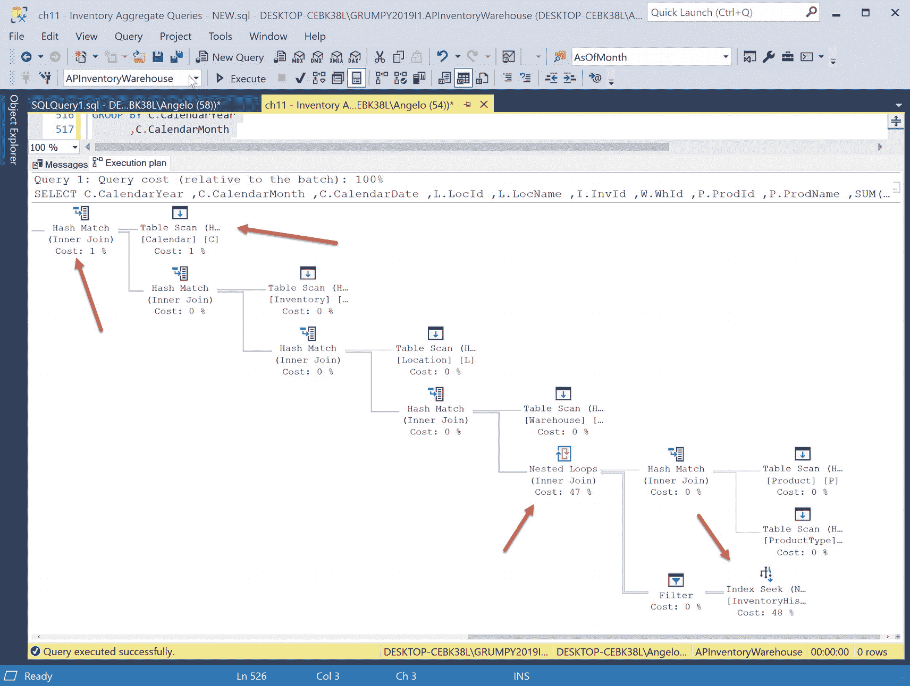

窗口截图。主页面展示了执行计划。箭头指向哈希匹配成本 1%、表扫描成本 1%、嵌套循环成本 47% 和索引查找成本 48%。

图 11-29
基准预估执行计划

果然，我们得到了一个不平衡的树状配置。在右下角最底部，我们看到一个成本为 48% 的索引查找，一个成本为 47% 的嵌套循环连接任务，最后但同样重要的是在顶部，对 `Calendar` 表进行成本为 1% 的表扫描，以及一个成本为 1% 的哈希匹配连接。

考虑到查询和表的大小及复杂性，这个计划不算坏。让我们看看这个复杂查询的 `IO` 和 `TIME` 统计信息。

请参考图 11-30。

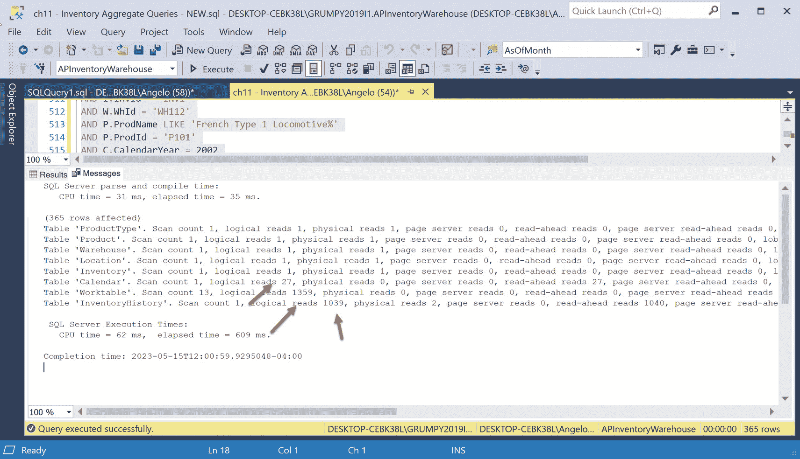

窗口截图。主页面的上半部分描绘了 SQL 查询代码，下半部分标题为消息。箭头指向逻辑读 27 和逻辑读 1039。

图 11-30
预估的 IO 和 TIME 统计信息

我只高亮了较高的数值。我们的 `Calendar` 表朋友有常规的 27 次逻辑读和 27 次预读，而我们的工作表有 13 次扫描和 1,359 次读取。

查看 `InventoryHistory` 表，我们只看到 1 次扫描和 1,039 次逻辑读，2 次物理读，以及 1,040 次预读。回想一下，这个表有 2,945,280 行，所以性能方面的结果相当不错。

根据这些统计信息以及过去的统计信息，因为我们的 `Calendar` 表很小，我会将其放入内存增强表中。

作业

将 `LIKE` 谓词替换为使用产品完整正确名称的 “=” 谓词。创建一个新的预估查询计划及其 `IO` 和 `TIME` 统计信息，看看是否有任何改进。别忘了运行 `DBCC` 命令。

更多统计信息马上呈现！

## VAR( ) 函数

以下是第 2 章中对此函数的定义。同样，如果你对其工作方式感到熟悉，请跳过它，直接转到示例查询的业务规范。

如果你阅读了第 1 章，然后因为对库存管理或其他相关学科感兴趣而直接跳到这里，请阅读此部分。

`VAR()` 函数用于生成数据样本中一组值的方差。关于数据集使用的相同讨论适用于 `VAR()` 函数相对于数据总体的情况。

当整个数据集未知或不可用时，`VAR()` 函数在数据的部分集合上工作。

因此，如果你的数据集由十行组成，这些不以字母 `P` 结尾的函数将查看 N - 1 或 10 - 1 = 9 行。

好了，现在我们已经解释清楚了，方差到底是什么意思呢？

对于我们开发人员和非统计学家来说，这里有一个简单的解释：

> `非正式地说，如果你取每个值与均值（平均值）的所有差值，对结果进行平方，然后将所有结果相加，最后除以数据样本的数量，你就得到了方差。`

提示

如果你取方差的平方根，你得到的是标准差，所以它们之间存在某种关系！

它回答了以下问题：

*   我们是否错过了目标？
*   我们是否达到了目标？
*   我们是否超过了目标？

以下是下一个查询的业务需求：

业务分析师希望采用我们之前为标准差开发的查询，并对其进行调整，以便我们可以计算方差、标准差和平均值。此外，他们希望看到以两种方式计算的标准差，第一种是使用 `STDEV()` 函数，第二种方法是通过取方差的平方根来用作验证。

以下是我们在清单 11-9 中编写的代码。

```sql
WITH YearlyWarehouseReport (
AsOfYear,AsOfQuarter,AsOfMonth,AsOfDate,LocId,InvId
,WhId,ProdId,AvgQtyOnHand
)
AS
(
SELECT AsOfYear
,DATEPART(qq,AsOfDate) AS AsOfQuarter
,AsOfMonth
,AsOfDate
,LocId
,InvId
,WhId
,ProdId
,AVG(QtyOnHand) AS AvgQtyOnHand
FROM Product.Warehouse
GROUP BY AsOfYear
,DATEPART(qq,AsOfDate)
,AsOfMonth
,AsOfDate
,LocId
,InvId
,WhId
,ProdId
)
SELECT AsOfYear
,AsOfQuarter
,AsOfMonth
,AsOfDate
,LocId
,InvId
,WhId
,ProdId
,AvgQtyOnHand AS MonthlyAvgQtyOnHand
,AVG(AvgQtyOnHand) OVER (
PARTITION BY AsOfYear,WhId
ORDER BY AsOfYear
) AS YearlyAvg
,VAR(AvgQtyOnHand) OVER (
PARTITION BY AsOfYear,WhId
ORDER BY AsOfYear
) AS YearlyVar
,STDEV(AvgQtyOnHand) OVER (
PARTITION BY AsOfYear,WhId
ORDER BY AsOfYear
) AS YearlySTDEV
/* just to prove that the square root of the variance */
/* is the standard deviation */
,SQRT(
VAR(AvgQtyOnHand) OVER (
PARTITION BY AsOfYear,WhId
ORDER BY AsOfYear
)
) AS MyYearlyStdev
FROM YearlyWarehouseReport
WHERE AsOfYear = 2003
AND LocId = 'LOC1'
AND InvId = 'INV1'
AND ProdId ='P033'
GO
```
清单 11-9
平均值、方差和标准差报告

我们又回到了通常基于 `CTE` 的查询。对于所有三个函数，我们设置了一个 `OVER()` 子句，其中包含 `PARTITION BY` 和 `ORDER BY` 子句。分区按年份和仓库 ID 设置；`ORDER BY` 子句按年份设置。

我们再次从一个小数据集开始，并使用 `WHERE` 子句，因此我们只获得年份 “2003”、位置 “LOC1”、库存 “INV1” 和产品 “P033” 的结果（一旦数据得到验证，可以移除这些条件）。

然后，该查询可用于包含筛选器的 Reporting Services (`SSRS`) 报表，以便分析师可以以他们想要的任何方式对报表进行切片和切块。

请参考图 11-31 中的部分结果。

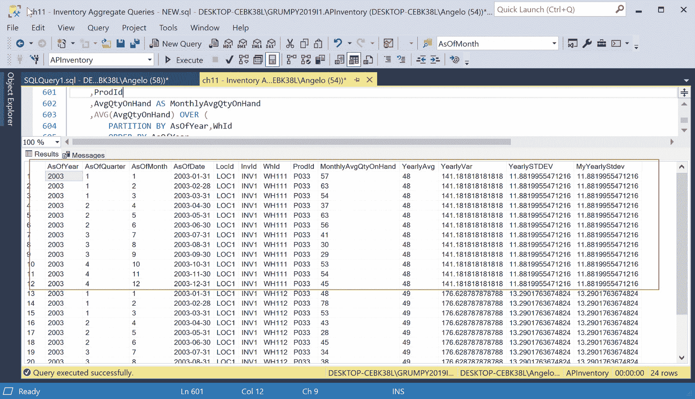

窗口截图。主页面的上半部分展示了 SQL 代码，下半部分以表格形式呈现结果。

图 11-31
平均值、方差和标准差报告

查看报告，我们看到分区按预期工作，并且两种标准差计算结果匹配，因此我们不仅验证了结果，还证明了如果我们取方差的平方根，就得到了标准差。

### 性能考虑

接下来，我们将检查此查询的估计基线执行计划。

请参考图 11-32。

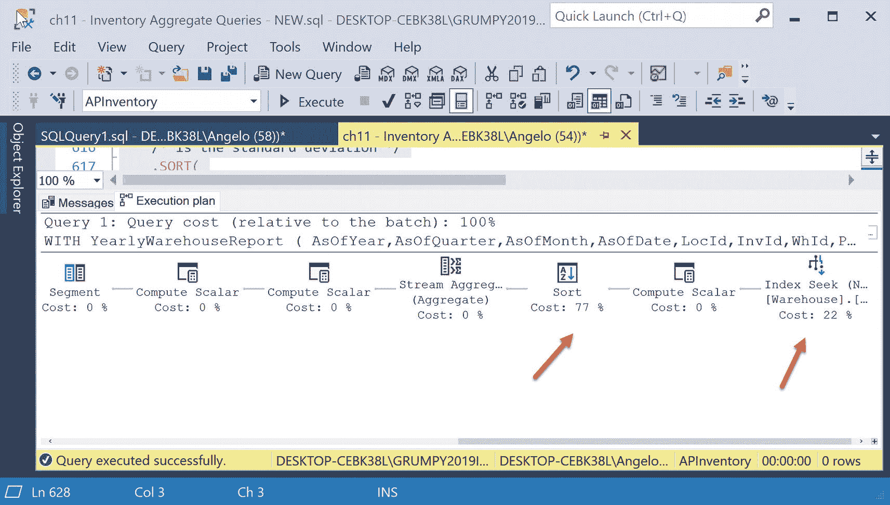

> 窗口截图。主页面展示了执行计划。箭头指向了排序成本和索引查找。

我们有一个覆盖索引，所以看到一个成本为 22%的索引查找。正如预期，通常开销较大的排序操作占了 77%。估计的查询执行计划没有推荐索引，因此这个查询已准备好用于生产环境。

与之前的查询情况一样，固态硬盘可以缓解昂贵的排序操作。我建议你尝试创建自己的索引，看看是否能降低排序开销，但 99%的情况下，估计查询计划工具的判断都是正确的。因此，要提高性能，你需要考虑物理层面的改进，比如更快的磁盘或内存增强表。

最后但同样重要的是，我们不妨检查一下`TIME`和`IO`统计信息。

请参考图 11-33。

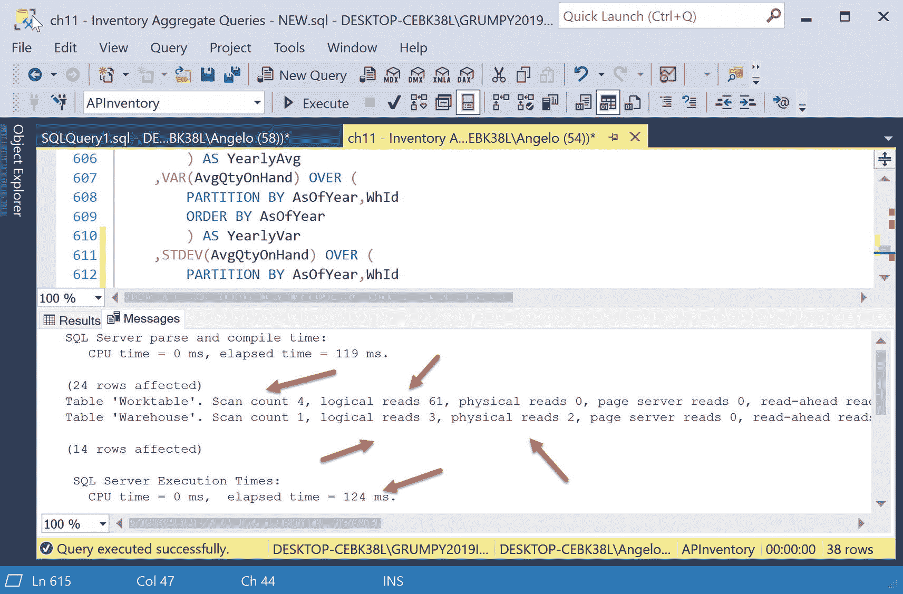

> 窗口截图。主页面的上半部分是 SQL 查询代码，下半部分标题为“消息”。箭头指向扫描计数 4、逻辑读取 6、逻辑读取 3、物理读取 2 以及耗时 124 毫秒。

我们的 SQL Server 执行时间为 124 毫秒。工作表具有最高的统计信息，包含 4 次扫描和 61 次逻辑读取。这是由于繁重的排序任务导致的。

`Warehouse`表的扫描计数值为 1，逻辑读取为 3，物理读取为 2。因此，这看起来是一个性能良好的查询。

现在，让我们将注意力转向另一个工具——SSIS。它是 Microsoft SQL Server BI 套件中的主要 ETL 工具，代表 SQL Server 集成服务。

> 注意
> 在本书中，我们一直采用查询的`CTE`部分，有时会创建一个报表表。考虑到在真实的生产环境中，这将是一个很好的解决方案，因为报表表可以被多种不同的查询或`SSRS`报表访问。这些查询和报表可以被多个用户同时执行。因此，如果数据是历史性的且至少有一天之旧，可以去掉`CTE`，转而采用一个建立了大量索引的报表表。

### 增强 SSIS 包

在本章的最后一节中，我们将通过添加任务来创建索引，并添加一个任务来加载`SSAS`多维数据集（我们将在接下来的两章中使用），从而增强我们的`SSIS`包。清单 11-10 是包含创建所需索引代码的`TSQL`脚本。

每个`CREATE`语句都将放在 SSIS 包中一个专用的执行 SQL 任务中。

```
/*******************/
/* CLUSTERED INDEX */
/*******************/
DROP INDEX IF EXISTS pkInventoryHistory
ON APInventoryWarehouse.Fact.InventoryHistory
GO
CREATE UNIQUE CLUSTERED INDEX pkInventoryHistory
ON APInventoryWarehouse.Fact.InventoryHistory (LocKey,InvKey,WhKey,ProdKey,CalendarKey)
GO
/***********************/
/* NON CLUSTERED INDEX */
/***********************/
DROP INDEX IF EXISTS ieProdProdTypeQty
ON APInventoryWarehouse.Fact.InventoryHistory
GO
CREATE NONCLUSTERED INDEX ieProdProdTypeQty
ON APInventoryWarehouse.Fact.InventoryHistory (ProdKey)
INCLUDE (ProductTypeKey,QtyOnHand)
GO
/****************/
/* Calendar Key */
/****************/
DROP INDEX IF EXISTS ieInvHistCalendar
ON APInventoryWarehouse. Fact.InventoryHistory
GO
CREATE NONCLUSTERED INDEX ieInvHistCalendar
ON APInventoryWarehouse. Fact.InventoryHistory (CalendarKey)
GO
/****************/
/* Location Key */
/****************/
DROP INDEX IF EXISTS ieInvHistLocKey
ON APInventoryWarehouse.Fact.InventoryHistory
GO
CREATE NONCLUSTERED INDEX ieInvHistLocKey
ON APInventoryWarehouse.Fact.InventoryHistory (LocKey)
GO
/*****************/
/* Inventory Key */
/*****************/
DROP INDEX IF EXISTS ieInvHistInvKey
ON APInventoryWarehouse.Fact.InventoryHistory
GO
CREATE NONCLUSTERED INDEX ieInvHistInvKey
ON APInventoryWarehouse.Fact.InventoryHistory (InvKey)
GO
/*****************/
/* Warehouse Key */
/*****************/
DROP INDEX IF EXISTS ieInvHistWHKey
ON APInventoryWarehouse.Fact.InventoryHistory
GO
CREATE NONCLUSTERED INDEX ieInvHistWHKey
ON APInventoryWarehouse.Fact.InventoryHistory (WHKey)
GO
/***************/
/* Product Key */
/***************/
DROP INDEX IF EXISTS ieInvHistProdKey
ON APInventoryWarehouse.Fact.InventoryHistory
GO
CREATE NONCLUSTERED INDEX ieInvHistProdKey
ON APInventoryWarehouse.Fact.InventoryHistory (ProdKey)
GO
/********************/
/* Product Type Key */
/********************/
DROP INDEX IF EXISTS ieInvHistProdTypeKey
ON APInventoryWarehouse.Fact.InventoryHistory
GO
CREATE NONCLUSTERED INDEX ieInvHistProdTypeKey
ON APInventoryWarehouse.Fact.InventoryHistory (ProductTypeKey)
GO
UPDATE STATISTICS Fact.InventoryHistory
GO
```

清单 11-10
用于 SSIS 执行 TSQL 任务的 TSQL 脚本

如你所见，这些都是用于创建索引的标准命令。我们将把每个单独的`CREATE INDEX`命令复制粘贴到其自己的执行 SQL 任务中。我们可以将所有命令包含在一个执行 SQL 任务中，但最好将它们分开，这样如果出现错误，将更容易隔离和纠正。

我包含了一个`DROP INDEX`命令，以防索引已经存在，这样它就可以被重新创建。此外，最后一个命令是`UPDATE STATISTICS`命令，以确保在创建所有索引后，`InventoryHistory`表上的统计信息是最新的。表统计信息的一个例子是表中加载了多少行数据，因此请务必保持这些信息的更新。

> 提示
> 在创建或重建索引；执行`INSERT`、`UPDATE`或`DELETE`行操作；或`TRUNCATE`表时，更新统计信息始终是一项良好的策略。

我们不会讨论为每个单独索引创建任务，因为步骤与我们之前讨论的用于将行从事务型库存数据库插入到库存仓库的步骤完全相同。这些步骤完全相同，只是我们使用的是刚才讨论的`CREATE INDEX`命令，而不是`INSERT`命令。

例如，请参考图 11-34。

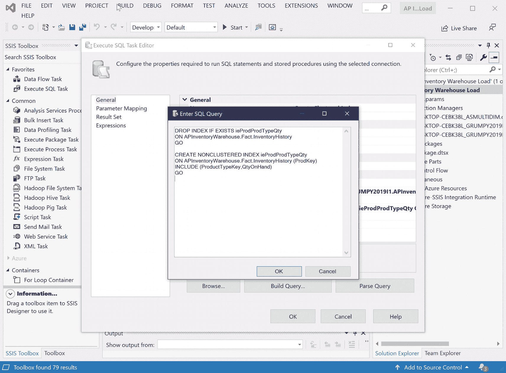


窗口截图呈现顶部菜单栏、左侧工具箱列表和右侧解决方案资源管理器。中间区域展示两个对话框。前方对话框标题为“输入 SQL 查询”，后方对话框标题为“执行 SQL 任务编辑器”。

#### 图 11-34

## 用于创建聚集索引的执行 SQL 任务

这与我们正在讨论的包中所有执行 SQL 任务的模式相同。此处我们正在`InventoryHistory`表上创建聚集索引。再次注意，表名是完全限定的。如果您使用的查询涉及不同数据库中的对象，这一点很重要。在执行 SQL 任务中只能使用一个连接，因此请限定每个表、索引等。

所有其他执行 SQL 任务与此类似，只是创建的索引不同。

#### 图 11-35

窗口截图呈现顶部菜单栏、左侧工具箱列表和右侧解决方案资源管理器。中间区域展示包 dot d t s x 的控制流页面。该页面显示任务的块流程图。

## 增强的 SSIS 包

就添加所有执行步骤以构建我们讨论的所有索引而言，这是我们最终希望达到的效果。

最后，我们还需要添加一个任务来重新构建并重新部署现有的 `SSAS` 多维数据集。让我们讨论一下如何实现这一点。

我们需要添加一个任务来处理我们在某一章节中构建的多维数据集。

我们从 `SSIS` 工具箱的“公共任务”区域将其拖出，并将其放置在控制流的末尾，位于设计区域的右下角。

请参见图 11-36。

#### 图 11-36

窗口截图描绘了包 dot d t s x 的控制流页面。左侧工具箱突出显示了分析服务处理任务，并通过虚线箭头连接到主页流程图中标题为“加载库存数据块”的块。

## 添加 SSAS 任务

现在我们需要配置它。第一步是创建并建立到 `SSAS` 服务器的连接。双击该任务将弹出连接对话框。

请参见图 11-37。

#### 图 11-37

窗口截图呈现顶部菜单栏、左侧工具箱列表和右侧解决方案资源管理器。中间区域展示一个标题为“连接管理器”的对话框。底部一个小的对话框显示测试连接成功。

## 定义到 SSAS 服务器的连接

填写 `SSAS` 服务器的名称，在本例中为“localhost”，虽然一个更好的名称，如“库存数据集服务器”会更合适。接下来，在“位置”文本框中添加 `SSAS` 的实际物理名称。最后，我们提供用户名和密码凭据并测试连接。看起来很熟悉，不是吗？与我们定义到 SQL Server 和数据库的连接概念相同。

接下来，我们需要确定需要处理的属性和对象。点击 `处理设置`，将显示以下面板。

请参见图 11-38。

#### 图 11-38

窗口截图标题为“分析服务处理任务编辑器”。主页显示处理设置选项，其中包括对象列表和批处理设置摘要。

## 确定要处理的对象

添加或删除任何对象（事实表和维度表）。同时，将鼠标悬停在任何处理选项列表框上以更改设置。

单击“确定”按钮。这应完成配置，该任务将被添加到控制流的末尾，如图 11-39 所示。

#### 图 11-39

窗口截图呈现顶部菜单栏、左侧工具箱列表和右侧解决方案资源管理器。中间区域展示包 dot d t s x 的控制流页面。该页面描绘了添加任务的块流程图。

## 完成的 SSIS 包

剩下的就是运行任务以查看其是否配置正确。此时无需运行整个包，但进行最终测试以查看是否一切执行成功是一个好主意。

右键单击“加载库存数据块”任务并选择 `执行`，然后观察步骤的进展。图 11-40 是任务运行中的状态。您无法看到旋转的圆圈，但当您自己尝试时会看到它。

#### 图 11-40

窗口截图呈现顶部菜单栏、左侧工具箱列表和右侧解决方案资源管理器。中间区域展示包 dot d t s x 的控制流页面。块流程图在分析服务处理任务旁描绘了一个旋转的轮子。

## 运行完成的 SSIS 包

如果一切运行无误，您将看到任务上有一个表示成功的绿色勾选标记，如图 11-41 所示。

#### 图 11-41

窗口截图呈现顶部菜单栏、左侧工具箱列表和右侧解决方案资源管理器。中间区域展示包 dot d t s x 的控制流页面。块流程图在分析服务处理任务旁描绘了一个勾选框。

## 新的 SSAS 任务运行完成

这就是您希望看到的情况；任何红色 `X` 标记都表示存在问题，因此您需要处理它们。在这个简单的包中，问题要么是连接或安全信息不正确，要么是查询中存在语法错误。

就是这样。您现在可以将 `SSIS` 添加到您的 SQL Server BI 工具包中的工具之一了。让我们来总结本章内容。

> **提示**
> 我鼓励您下载最新的 Visual Studio 社区版并添加 `SSIS` 和数据工具/组件。在撰写本文时，它应该是 Visual Studio 2022 社区版。
> 学习基础知识，构建一些东西，破坏它，然后修复它。这就是学习的方式！

### 总结

这是我们关于库存管理的三章系列中的第一章。我们查看了一些简单的业务数据模型，以便熟悉我们在查询中使用的数据库。

我们还继续学习了 `SSIS`，这是 Microsoft 用于创建 ETL（提取、转换和加载）过程的旗舰 ETL 工具，用于将数据从一个源提取、转换并加载到另一个源。我们使用此工具从存储与模型火车相关产品库存水平的事务数据库中提取库存移动数据，并将事务数据加载到数据仓库中以便进行分析。

我们完成了通常的查询创建，这些查询使用了聚合窗口函数，并使用估计的查询计划工具以及 SQL Server 提供的各种性能统计设置进行了分析。

最后，我们增强了我们的 SSIS 进程：调用一个包不仅要加载表，还要创建索引并处理 SSAS 多维数据集。

下一章见，我们将针对库存数据库研究排名窗口函数。


