# 第 12 章 库存用例：排名函数

欢迎来到本书的倒数第三章。希望您享受这段学习旅程。本次我们将针对库存数据库和库存数据仓库，运用四种排名窗口函数。我们将执行常规的结果分析并进行一些性能分析，但同时也会逐步指导您如何使用 Microsoft Report Builder 创建网页报告，并将其发布到由 `SSRS`（SQL Server Reporting Services）——微软首屈一指的报告架构——实现的网站上。

不仅如此，我们还将逐步创建一个简单的 Power BI 报告和仪表板，它们将提供一些相当出色的图表和报告。我们会将这些内容发布到运行在您笔记本电脑或工作站上的个人 `SSRS` 服务器网站和 Power BI 服务器网站。

最后，本章将包含大量插图，因为我深信通过图表、曲线图和屏幕截图进行学习，效果甚至优于阅读文字（嗯，几乎如此）。一图胜千言！而且在您尝试这些工具时，图表也更易于理解。

至于窗口函数，我们将遵循惯常的流程：定义业务规范、创建并运行查询、分析数据，然后生成估计的查询计划以及 `IO` 和 `TIME` 统计信息，以分析查询性能。

毕竟，我们遵循的是一种“食谱式”的方法来学习窗口函数，所以我们就按照刚才描述的步骤来操作。顺便说一句，本章有九份代码清单，但有 59 张插图和一张图表。我们要学习的内容很多。

## 排名函数

以下是此类中的四个函数：

*   `RANK()`: `不`支持 `ROWS` 和 `RANGE` 规范
*   `DENSE_RANK()`: `不`支持 `ROWS` 和 `RANGE` 规范
*   `NTILE()`: `不`支持 `ROWS` 和 `RANGE` 规范
*   `ROW_NUMBER()`: `不`支持 `ROWS` 和 `RANGE` 规范

前两个用于对分区中的结果进行排名，第三个允许您对查询返回的数据定义数据桶。`NTILE()` 函数在分类方案中效果很好。

最后一个函数 `ROW_NUMBER()` 是我们的主力函数，用于在整个数据集或数据集内的分区中生成行号。不过，我们将把它用于不同的目的。该函数可用于通过一些巧妙的逻辑生成随机数据。

这些函数都不支持 `ROW` 和 `RANGE` 窗口框架规范，如果您理解了这些函数的作用，就会觉得这很合理。

我们将从对排名函数进行常规分析开始。也就是说，我们查看友好的业务分析师提交的业务规范，创建支持需求的脚本，并运行脚本以查看结果。接下来，我们像之前那样生成估计的查询计划，以便分析并在可能的情况下改进查询的性能。当然，我们还将查看 `IO`、`TIME` 和 `PERFORMANCE STATISTICS`，以更深入地探究执行步骤和成本。

让我们从讨论 `RANK()` 函数开始，我们将把它应用于我们的库存数据。

### RANK( ) 函数

回想一下，`RANK()` 函数根据被排名的值，返回当前行之前的行数加上当前行。让我们看看业务分析师的规范是什么：

分析师希望看到一些关于库存出库移动的统计数据。

具体来说，报告需要为产品 "P209"、仓库 "WH111"、库存 "INV1" 和库位 "LOC1" 的移动分配一个排名。报告需要明确显示日历季度和月份名称，而不是仅仅显示数字。

最初此报告需要针对 2010 年，但像往常一样，一旦报告没有错误，就需要能够轻松修改以支持多年、多产品等，甚至用于 `SSRS` 报告或 Power BI 计分卡。

顺便说一句，对于任何模型火车爱好者来说，产品 "P209" 是一款“瑞士制 1 型客运车厢”。

以下是基于 `CTE` 的查询，它将满足此要求。

请参考清单 12-1。

```
WITH MonthlyInventoryMovement (
MovementYear,MovementQuarter,MovQtrName,MovementMonth,MovMonthName
,InvId,LocId,WhId,ProdId,MonthlyDecrementMovement
)
AS
(
SELECT YEAR(MovementDate) AS MovementYear
,DATEPART(qq,MovementDate) AS MovementQuarter
,CASE
WHEN DATEPART(qq,MovementDate) = 1 THEN '1st Quarter'
WHEN DATEPART(qq,MovementDate) = 2 THEN '2nd Quarter'
WHEN DATEPART(qq,MovementDate) = 3 THEN '3rd Quarter'
WHEN DATEPART(qq,MovementDate) = 4 THEN '4th Quarter'
END AS MovQtrName
,MONTH(MovementDate) AS MovementMonth
,CASE
WHEN MONTH(MovementDate)  = 1 THEN 'Jan'
WHEN MONTH(MovementDate)  = 2 THEN 'Feb'
WHEN MONTH(MovementDate)  = 3 THEN 'Mar'
WHEN MONTH(MovementDate)  = 4 THEN 'Apr'
WHEN MONTH(MovementDate)  = 5 THEN 'May'
WHEN MONTH(MovementDate)  = 6 THEN 'June'
WHEN MONTH(MovementDate)  = 7 THEN 'Jul'
WHEN MONTH(MovementDate)  = 8 THEN 'Aug'
WHEN MONTH(MovementDate)  = 9 THEN 'Sep'
WHEN MONTH(MovementDate)  = 10 THEN 'Oct'
WHEN MONTH(MovementDate)  = 11 THEN 'Nov'
WHEN MONTH(MovementDate)  = 12 THEN 'Dec'
END AS MovMonthName
,InvId,LocId,WhId,ProdId
,SUM(Decrement) AS MonthlyDecrementMovement
FROM Product.InventoryTransaction
GROUP BY YEAR(MovementDate)
,DATEPART(qq,MovementDate)
,MONTH(MovementDate)
,InvId
,LocId
,WhId
,ProdId
)
SELECT MovementYear
,MovementQuarter
,MovQtrName
,MovementMonth
,MovMonthName
,LocId
,InvId
,WhId
,ProdId
,MonthlyDecrementMovement
,RANK() OVER (
PARTITION BY MovementYear
ORDER BY MonthlyDecrementMovement DESC
) AS DecRank
FROM MonthlyInventoryMovement
WHERE MovementYear = 2010
AND LocId = 'LOC1'
AND InvId = 'INV1'
AND WhId = 'WH111'
AND ProdId = 'P209'
GO
```
清单 12-1
为瑞士客运车厢模型排名库存出库移动

我们首先注意到的是 `SELECT` 子句中的两个大型 `CASE` 语句。正如业务需求中强调的，业务分析师希望看到明确写出的季度和月份名称，因此我们需要此逻辑来解码这些数据部分的数值。我们的日历表相当简单，一个明确的改进性能的方法是添加季度和月份的文本版本，这样我们就可以通过避免在 `SELECT` 子句中使用 `CASE` 块来提高性能。

**作业**

使用两条 `ALTER` 和一条 `UPDATE` 命令，添加列以支持日历季度和日历月份的文本版本。在 `APInventory.MasterData.Calendar` 表和 `APInventory.Dimension.Calendar` 维度表中实现此修改。

接下来，让我们检查一下 `OVER()` 子句。我们看到一个引用了 `MovementYear` 列的 `PARTITION BY` 子句和一个引用了 `MonthlyDecrementMovement` 列的 `ORDER BY` 子句。值按降序排序。


请记住，我们不需要在`PARTITION BY`子句中引用年份列，因为我们有一个`WHERE`子句，它仅过滤 2010 年的结果。我们的分析师希望看到所有年份的数据，因此当提出此请求时，这将派上用场。目前保留它似乎不影响性能。你可以自己尝试一下，运行一个带有该列的基线估计查询计划，然后再运行一个不带该列的计划。别忘了为每次测试运行`DBCC`命令。

一旦所有年份都可用（如果我们移除`WHERE`子句中的过滤器），此查询生成的结果将使其成为使用 Report Builder 创建的`SSRS`报告的理想候选。所有在`WHERE`子句中的列都将用作报告过滤器。

让我们来看看结果。请参考图 12-1 中的部分结果。

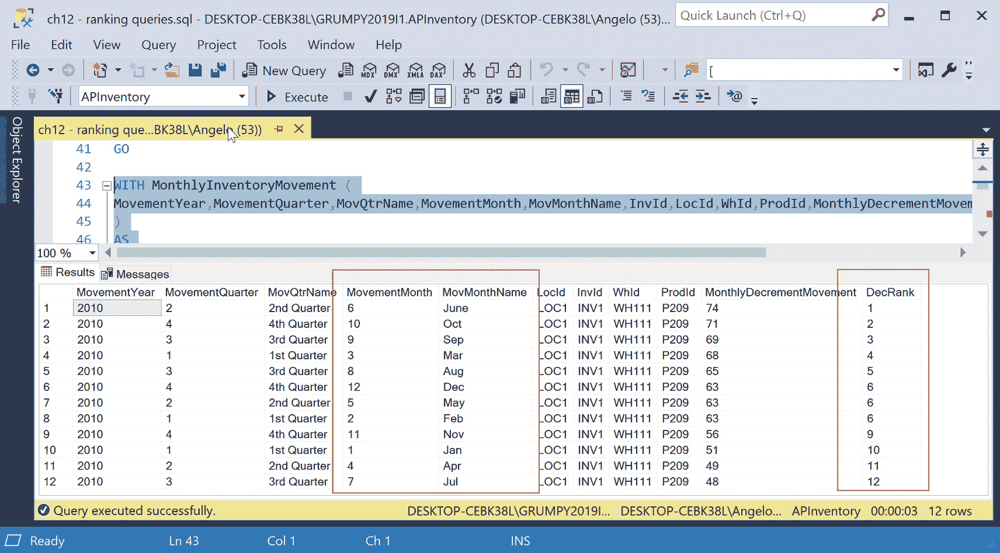

一张关于 ch 12 排名查询 SQL 窗口的截图。一个子窗口展示了一段 6 行的代码。一个表格展示了 12 行 12 列的结果。Movement month、Movement month name 和 Decrement rank 这几列被方框高亮标出。

**图 12-1** 库存出库排名报告

查看报告，我们看到六月份有最多的物品移出库存，这转化为销售，所以是件好事。七月份的物品出库排名最低。这可能意味着销售在减少。作为后续步骤，分析师会查看有多少物品返回库存，以确保库存经理没有过量订购物品。

让我们将结果复制到 Microsoft Excel 电子表格中，并创建一个折线图来查看排名和库存变动趋势。数据报告和图形是分析数据的最佳工具。

请参考图 12-2。

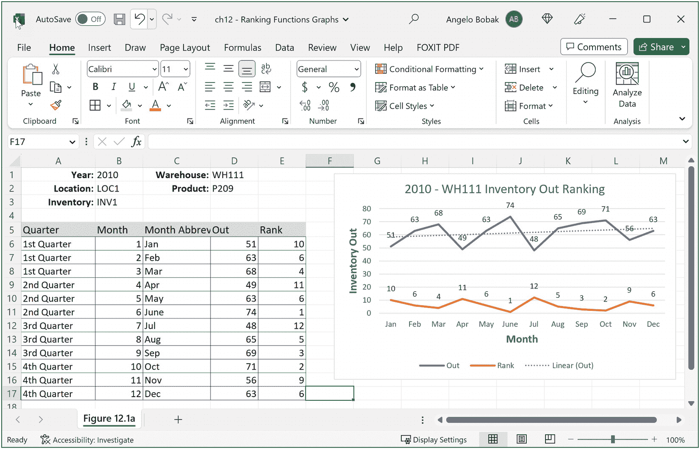

一张 Microsoft Excel 电子表格主页的截图。自动保存按钮处于关闭状态。它展示了一个包含 Quarter、month、month abbreviation、Out 和 Rank 列的表格。一个库存量与月份的折线图显示了 Out 和 Rank 的水平波动趋势，以及一条线性 Out 线。

**图 12-2** 库存出库排名报告图表

观察图表，我们看到一些波动，但趋势线（虚线）正在上升，所以销售状况不错。我们不希望看到产品出库量的趋势向下，那将表明产品滞留在库存中。本书中的此图表很可能是灰度或黑白的，但如果你正在阅读电子书，颜色是分析数据的有用辅助工具。

让我们看看此查询的性能如何。

#### 性能考量

让我们运行常规的基线执行计划，看看是否需要任何索引。我们还将查看一些`IO`和`TIME`统计信息，以真正了解查询的性能。请记住，当你自己尝试时，也要生成实时查询计划，以便比较估计计划和实时计划之间的成本。任何重大差异都可能表明存在问题，原因可能是过时的表统计信息。

### 随堂小测验

如何更新表统计信息？

请参考图 12-3。

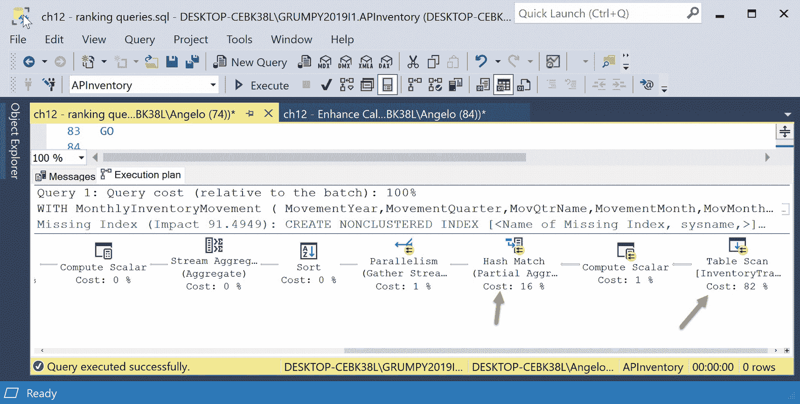

一张关于 ch 12 排名查询 SQL 窗口的截图。一个子窗口包含一段 2 行代码的查询成本。查询 1 列出了以下成本百分比：Compute scalar 0, stream aggregate 0, Sort 0, Parallelism 1, Hash match 16, compute scalar 1, 以及 table scan 82%。箭头指向了 hash match 和 table scan 的成本。

**图 12-3** 基线估计执行计划

我们看到系统建议了一个索引，因此我们需要创建它。从右向左看，我们看到一个成本为 82%的表扫描(table scan)，一个成本为 1%的计算标量(compute scalar)，以及一个成本为 16%的哈希匹配连接(hash match join)任务。最后，有一个成本为 1%的并行化（收集流）(parallelism (gather stream))任务，所有其他成本均为 0%。显然需要一些改进，因此让我们创建推荐的索引。

请参考代码清单 12-2。

```sql
CREATE NONCLUSTERED INDEX ieInvIdLocIdWhIdProdIdDecDate
ON Product.InventoryTransaction (InvId,LocId,WhId,ProdId)
INCLUDE (Decrement,MovementDate)
GO
UPDATE STATISTICS Product.InventoryTransaction
GO
```

**代码清单 12-2** 库存事务表的建议索引

如果我们将建议索引中的列与查询的`WHERE`子句和`OVER()`子句中的列进行比较，我们会发现这些列都被覆盖了（这称为覆盖索引）。

`InvId`、`LocId`、`WhId`和`ProdId`列出现在`WHERE`子句中，因此需要包含在索引中。该索引还有一个`INCLUDE`谓词，指定了`Decrement`和`MovementDate`列，它们覆盖了`PARTITION BY`和`ORDER BY`子句中提到的列。

所以，我们覆盖全面了！双关语，抱歉。

因此，基于前几章示例的经验，我们可以得出结论：对于此类基于窗口的查询，经验法则是确保我们有一个基于`OVER()`子句中列以及出现在`WHERE`子句中的任何列的索引。

让我们创建索引并检查新的估计查询计划。

请参考图 12-4。

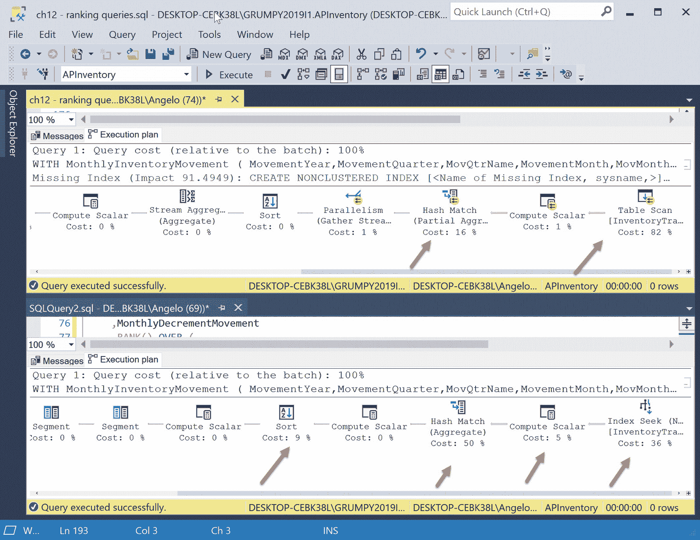

一张关于 ch 12 排名查询 SQL 窗口的截图。2 个子窗口比较了估计查询计划。Sort 成本从 0 变为 9%，Hash match 成本从 16%变为 50%，compute scalar 成本从 1%变为 5%。箭头还指向了 82%的 table scan 成本和 36%的 index seek 成本。

**图 12-4** 比较前后的估计执行计划

此截图比较了前后的估计执行计划。熟悉的模式，对吧？一个索引查找(index seek)任务取代了表扫描(table scan)，但哈希匹配(hash match)和排序(sort)的成本都上升了。

总是有得有失。

此外，排序步骤从 0%上升到 9%，因此这个步骤和哈希匹配应该成为任何进一步性能调整的重点。我之前说过，我再说一遍：确保`TEMPDB`实现在非常快的驱动器上，而不是磁性磁盘驱动器上。

### 补充说明

我们是从查询和覆盖索引的角度来看待性能调优的。但性能调优还包括调整垂直硬件扩展和水平硬件扩展。垂直扩展意味着我们查看服务器硬件，看看是否需要更多快速磁盘、更多 CPU 或更多内存。水平扩展意味着为并行处理添加更多服务器（成本高昂）。


回到我们的分析。最后一个建议是通过增强`Calendar`表来包含季度和月份数据部分的文本版本，从而消除`CASE`代码块。如果你完成了我之前建议的练习，请修改此查询，使其仅使用新的日历日期部分列，并看看能实现何种程度的改进。

接下来，让我们看看`IO`和`TIME`统计数据。

请参见图 12-5。

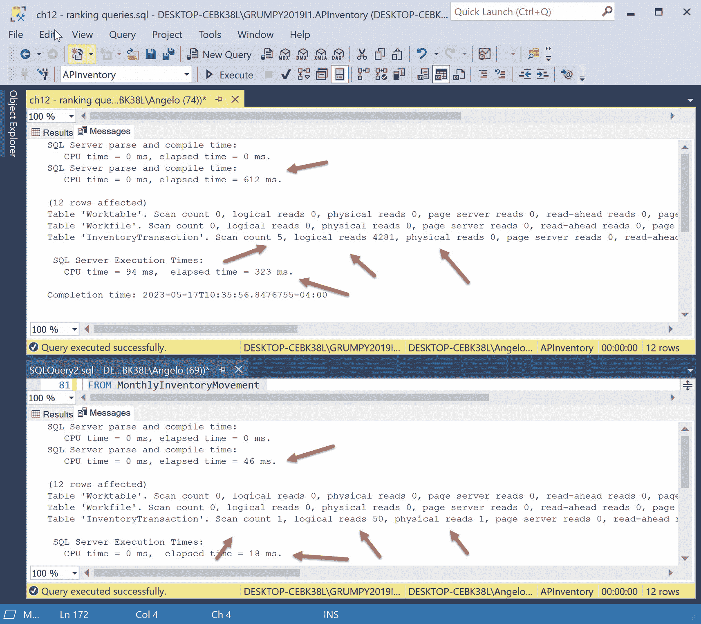

ch 12 排名查询 sql 窗口截图。2 个子窗口比较了查询执行前后的 I O 和 TIME 统计数据，例如服务器解析和编译时间下的已用时间，以及执行时间、扫描计数、逻辑读取和物理读取。

图 12-5

比较 IO 和 TIME 统计数据

正如预期，性能统计数据有所改善。SQL Server 解析和编译时间减少了。SQL Server 执行时间从 612 ms 降至 18 ms。改善显著。重点关注 `InventoryTransaction` 表，扫描计数从 5 降至 1，逻辑读取从 4,281 降至 50，但物理读取从 0 上升到 1。

总体上有重大改进。基于此分析，建议的改进是尝试 `Calendar` 表的更改，并用预加载的报告表替换 `CTE` 逻辑。请自行尝试此操作，进行分析，看看性能是否有所提高。需要特别注意的是，你将必须修改 `CTE` 查询，使其与 `Calendar` 表连接，以便使用新的列。这会更好吗？你需要在 `Calendar` 表上创建新索引吗？

让我们将注意力转向库存数据仓库，并尝试相同的查询，但这次是以 `SNOWFLAKE` 查询的形式。

小测验答案

如何更新表统计信息？通过运行命令

```
UPDATE STATISTICS <table name>
```

请务必经常执行此操作，特别是在执行了大量 `INSERT`、`UPDATE` 和 `DELETE` 查询之后。你甚至可能希望将其添加到定期运行并更新数据库中所有表统计信息的 SQL Agent 任务中。

### 查询数据仓库

现在，让我们用一个类似的查询（称为 `SNOWFLAKE` 查询）来查询我们库存数据仓库中的事实表。

小测验

为什么这被称为 `SNOWFLAKE` 查询？答案稍后揭晓。

此查询的业务需求与之前相同，因此我将不再赘述。

基于我们之前的讨论，我实施了`Calendar`维度表的更改，使其包含支持季度和月份名称的文本列。这应该会提高速度。

该查询仍然基于`CTE`，并且因为它针对`SNOWFLAKE`模式执行，所以包含许多表连接。代码清单相当长，但我建议你通读一遍，以理解所有逻辑和要点。

请参见代码清单 12-3。

```sql
WITH WarehouseCTE (
InvYear,InvMonthNo,InvMonthMonthName,LocationId,LocationName
,InventoryId,WarehouseId,WarehouseId,ProductId,ProductName
,ProductType,ProdTypeName,MonthlyQtyOnHand
)
AS ( -- 返回 24,192 行
SELECT C.CalendarYear        AS InvYear
,C.CalendarMonth     AS InvMonthNo
,C.CalendarTxtMonth  AS InvMonthMonthName
,L.LocId             AS LocationId
,L.LocName           AS LocationName
,I.InvId             AS InventoryId
,W.WhId              AS WarehouseId
,W.WhName            AS WarehouseName
,P.ProdId            AS ProductId
,P.ProdName          AS ProductName
,P.ProdType          AS ProductType
,PT.ProdTypeName     AS ProdTypeName
,SUM(IH.[QtyOnHand]) AS MonthlyQtyOnHand
FROM [Fact].[InventoryHistory] IH -- WITH (INDEX(ieInvHistCalendar))
JOIN [Dimension].[Location] L
ON IH.LocKey = L.LocKey
JOIN [Dimension].[Calendar] C
ON IH.CalendarKey = C.CalendarKey
JOIN [Dimension].[Warehouse] W
ON IH.WhKey = W.WhKey
JOIN [Dimension].[Inventory] I
ON IH.[InvKey] = I.InvKey
JOIN [Dimension].[Product] P
ON IH.ProdKey = P.ProdKey
JOIN [Dimension].[ProductType] PT
ON P.ProductTypeKey = PT.ProductTypeKey
GROUP BY C.CalendarYear
,C.CalendarMonth
,C.CalendarTxtMonth
,L.LocId
,L.LocName
,I.InvId
,W.WhId
,W.WhName
,P.ProdId
,P.ProdName
,P.ProdType
,PT.ProdTypeName
)
SELECT InvYear,InvMonthNo,InvMonthMonthName,LocationId,LocationName
,InventoryId,WarehouseId, ProductType,ProductId,ProdTypeName
,MonthlyQtyOnHand
,RANK() OVER (
ORDER BY MonthlyQtyOnHand DESC
) QtyOnHandRank
FROM WarehouseCTE
WHERE InvYear= 2010
AND LocationId = 'LOC1'
AND InventoryId = 'INV1'
AND WarehouseId = 'WH111'
AND ProductId = 'P041'
GO
```

代码清单 12-3

用于排名报告的 SNOWFLAKE 查询

此查询包含所有要素：一个`CTE`、以`SNOWFLAKE`查询形式进行的多个连接，以及一个`WHERE`子句。

请注意，在此版本的查询中，我删除了`PARTITION BY`子句，因为`WHERE`子句过滤器将结果限制为单一年份、地点、库存、仓库和产品。唯一需要的是包含引用此库存位置月度数量总和的`ORDER BY`子句。让我们查看结果。

请参见图 12-6 中的部分结果。

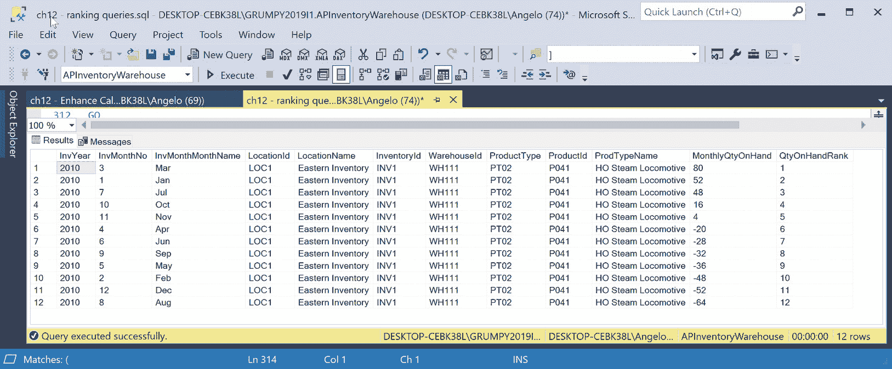

ch 12 排名查询 sql 窗口截图。它以表格形式呈现结果，包含 12 列：库存年份、月份数字、月份名称、地点 I D、地点名称、库存 I D、仓库 I D、产品类型、产品 I D、名称、月度在库数量和在库数量排名。

图 12-6

SNOWFLAKE 查询结果

看起来成功了。它在不到一秒的时间内返回了 12 行。此表有 736,320 行，所以我认为到目前为止，我们应该对其性能印象深刻。让我们查看此查询的基线估计查询计划。

请参见图 12-7。

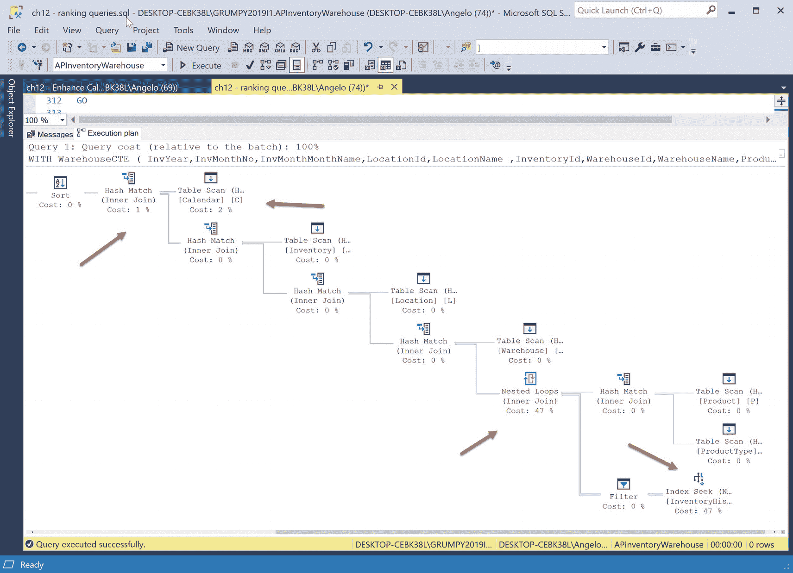

ch 12 排名查询 sql 窗口截图。它展示了查询成本的执行计划。箭头指向哈希匹配成本 1%、表扫描成本 2%、嵌套循环成本 47% 和索引查找成本 47%。

图 12-7


### 基线估计查询计划

## 查询计划分析概述

从右下角的分支开始，我们看到对事实表进行了索引查找，这是一个良好的开端。在`Product`维度表和`Product Type`外挂维度表之间存在一个高成本的嵌套循环连接操作，但这些表的行数很小，所以这不是问题。我们可以考虑对`Product`表进行反规范化，将产品类型列加入其中以消除此连接。这是值得考虑的一点。

### 注意

将外挂表与主维度表合并会消除连接，但另一方面会使维度表变大，这意味着在查询处理时，内存页面中能容纳的行数更少。因此，总是需要权衡取舍。是选择更少的连接操作，还是更大的表？

我曾认为为`Calendar`维度表添加索引并使用表提示可能会改善查询计划，但事实并非如此。如果该索引是聚集索引，它可能会有帮助。

其他所有的哈希连接成本都为零，因此我们不再关注它们。

我们的`Calendar`维度表进行了 2%的表扫描。能否通过在代理键上创建聚集索引来改进？

查看以下代码：

```sql
CREATE UNIQUE CLUSTERED INDEX ieCalendarKey
ON [Dimension].Calendar
GO
```

让我们创建这个聚集索引，然后查看修改后的估计执行计划。

请参考图 12-8。

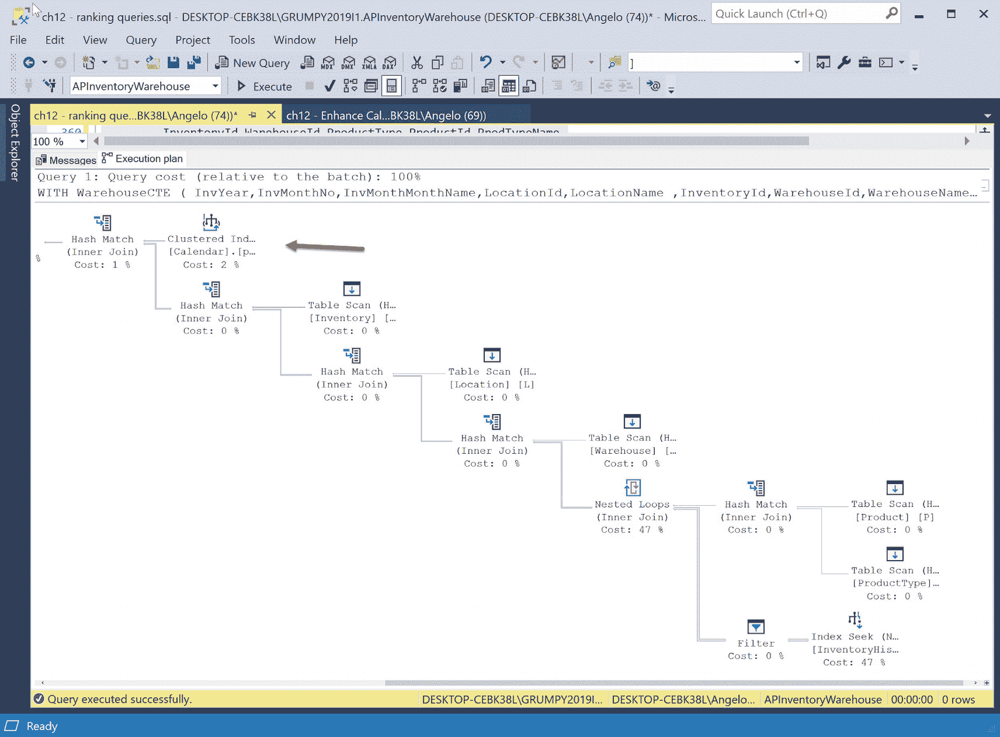

A screenshot of c h 12 ranking query s q l window. It presents the execution plan for query cost. An arrow points to clustered index cost 2%. Other costs are hash match, table scan, Nested loops, and index seek costs.

图 12-8
使用聚集`Calendar`索引的修改后估计执行计划

我很高兴地说这奏效了。由于使用了聚集索引，因此不需要表提示。

我们看到在`Calendar`表上进行了聚集索引扫描。该维度有 7,670 行，因此对于这个大小的表，我们可以得出结论：在代理键上创建聚集索引，它很可能就会被使用！

### 小测验答案

为什么这被称为`SNOWFLAKE`查询？

**答案**

因为它连接了维度表和外挂表，使得模型看起来像`SNOWFLAKE`。如果数据库是作为`STAR`模式实现的，那么针对它的查询就是`STAR`查询。有道理吧？

为了帮助你巩固知识，以下是另一个小测验，以免你忘记性能分析和调优的基础知识。

### 另一个小测验

为什么每次执行性能分析和查询调优时都需要运行`DBCC`命令？

## `DENSE_RANK()` 函数

回顾第 4 章，`DENSE_RANK()`函数的工作方式与`RANK()`函数几乎相同。在出现并列的情况下，并列的排名值相同，但重复值之后的下一个值会被简单地分配下一个排名数字。因此，如果并列的密集排名是 4，那么下一个更高值的排名就是 5。我认为这很合理。

`RANK()`函数的结果则不然。如果你有五个并列值为 6，并列的当前排名是 4，那么下一个排名是 9（5 个并列值 + 当前排名值 4 = 9）。这确实有点奇怪。

我们之前见过这个函数，但让我们再应用一次，这次用于我们的库存业务场景。以下是业务需求说明：

基本上，业务分析师喜欢我们之前给他们的报告。这次他们想创建相同的报告，但添加`DENSE_RANK()`函数，以便查看每个函数如何处理并列情况。

这是一个很容易满足的需求，我们只需复制粘贴之前的查询并添加新的排名窗口函数即可。`TSQL`强调代码重用！为什么要重新发明轮子？

以下是我们得出的结果。

请参考清单 12-4。

```sql
WITH MonthlyInventoryMovement (
MovementYear,MovementQuarter,MovementMonth,InvId,LocId,WhId
,ProdId,MonthlyDecrementMovement
)
AS
(
SELECT YEAR(MovementDate)        AS MovementYear
,DATEPART(qq,MovementDate) AS MovementQuarter
,MONTH(MovementDate)       AS MovementMonth
,InvId
,LocId
,WhId
,ProdId
,SUM(Decrement) AS MonthlyDecrementMovement
FROM Product.InventoryTransaction
GROUP BY YEAR(MovementDate)
,DATEPART(qq,MovementDate)
,MONTH(MovementDate)
,InvId
,LocId
,WhId
,ProdId
)
SELECT MovementYear
,MovementQuarter
,MovementMonth
,LocId
,InvId
,WhId
,ProdId
,MonthlyDecrementMovement
,RANK() OVER (
PARTITION BY MovementYear
ORDER BY MonthlyDecrementMovement DESC
) AS DecRank
,DENSE_RANK() OVER (
PARTITION BY MovementYear
ORDER BY MonthlyDecrementMovement DESC
) AS DecDEnseRank
FROM MonthlyInventoryMovement
WHERE MovementYear = 2010
AND LocId = 'LOC1'
AND InvId = 'INV1'
AND WhId = 'WH111'
AND ProdId = 'P209'
GO
```

清单 12-4
比较 `RANK()` 与 `DENSE_RANK()` 的排名结果

这里没什么需要详细解释的，我们已经看过这个查询了。分区是按移动年份设置的，`ORDER BY`子句按月递减总和降序排列。当此查询用于填充报告表时，可以移除`WHERE`子句，配合过滤器让业务用户可以选择要使用的值。

### 注意

在我看来，我使用的编码风格——将每个列单独列在一行——使查询易于理解。这只是我的观点。我知道这样会占用更多空间，尤其是在这样一本书里！

回到我们的讨论。我们感兴趣的是看到在库存业务场景中如何处理并列情况。让我们看看结果。

请参考图 12-9 中的部分结果。

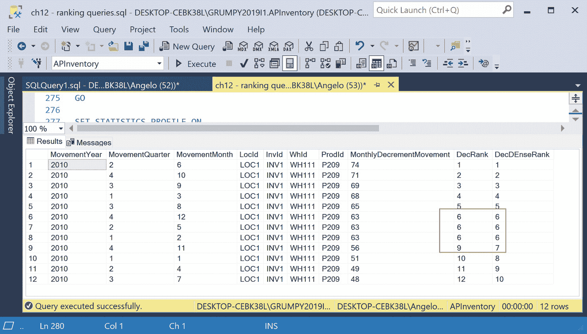

A screenshot of c h 12 ranking query s q l window. It presents the results in a table that has 10 columns for movement year, Movement quarter, Movement month, Location I d, Inventory I d, Warehouse I d, product I d, monthly decrement movement, Decrement rank, and Decrement Dence rank.

图 12-9
`RANK()` 与 `DENSE_RANK()` 对比

递减值的并列情况出现在二月(2)、五月(5)和十二月(12)。在我看来（我之前也说过），`DENSE_RANK()`的值更有意义，因为并列值具有相同的排名值。因此我们可以说，在二月、五月和十二月，产品“P209”的库存减少了 63 个单位。

在`RANK()`函数的情况下跳过两个排名值会让人困惑。我们为什么要使用这个？

我在互联网上研究为何应该使用此函数以及在何种情况下使用时，没有找到使用它的理由。如果你知道，请给我发邮件！

让我们继续讨论此函数的性能分析和调优。


#### 性能考量

图 12-10 是我们估算的基线查询计划。

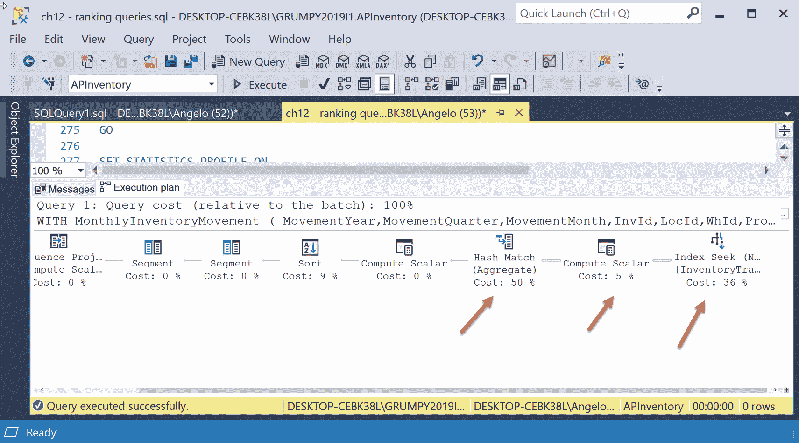

一张 `c h 12 ranking query s q l` 窗口的截图。它显示了查询成本的执行计划信息。箭头指向成本为 50% 的 `hash match`、成本为 5% 的 `compute scalar` 以及成本为 36% 的 `index seek`。其他成本包括 `sort` 成本、`segment` 成本和 `compute scalar` 成本。

图 12-10

估算的基线查询计划

看来我们建立的索引开始见效了。`index seek` 的成本是 36%。接下来是成本为 5% 的 `compute scalar` 和成本为 50% 的 `hash match` 连接任务。最后，`sort` 任务的成本是 9%。

我认为我们需要查看 `STATISTICS PROFILE` 的值，以确切了解这三个任务中发生了什么。让我们列出这些任务中使用的表达式，以便知道要查看什么：

*   `Compute Scalar:` Expr 1003, Expr 1004, Expr 1005
*   `Hash Match:` Expr 1004, Expr 1005
*   `Sort:` Expr 1004, Expr 1005, Expr 1006

那么这些表达式中使用了什么逻辑？

请参阅图 12-11。

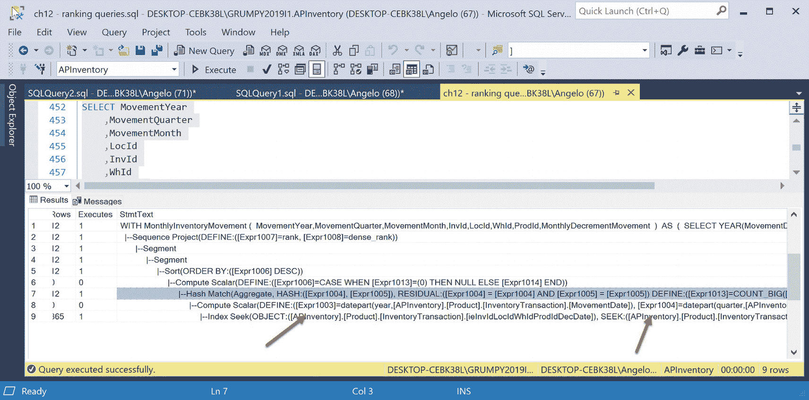

一张 `c h 12 ranking query s q l` 窗口的截图。它显示了 `static profile` 值的结果信息，以及一段 6 行的代码。两个箭头分别指向 `compute scalar`、`Expression 1003` 和 `Expression 1004`。`Hash match` 被高亮显示。

图 12-11

`RANK()` 与 `DENSE_RANK()` 查询的统计配置文件

这组统计信息深入揭示了查询的处理细节以及问题点可能所在。如果我们查看 `statement text` 列，就能明白具体情况。

图中未显示 `Expr1003`，但其值如下：

*   `Expr1003`=`datepart(year,[APInventory].[Product].[InventoryTransaction].[MovementDate])`,

以下是表达式 `Expr1004` 和 `Expr1005`：

*   `Expr1004`=`datepart(quarter,[APInventory].[Product].[InventoryTransaction].[MovementDate])`
*   `Expr1005`=`datepart(month,[APInventory].[Product].[InventoryTransaction].[MovementDate])`

这告诉我们，`DATEPART()` 函数调用是导致 `hash match` 任务成本高昂的原因。我们可以通过使用 `Calendar` 表来检索这些值以解决这个问题，尽管这会带来对 `Calendar` 表进行 `JOIN` 操作的成本（我们创建的聚集索引会有所帮助）。

这是在 `sort` 任务和 `compute scalar` 任务中使用的 `Expr1006`：

*   `Expr1006`=`CASE WHEN [Expr1013]=(0) THEN NULL ELSE [Expr1014] END))`

看起来这是一个 `CASE` 代码块？显然，提取这些日期部分正在推高这些任务的成本。等等。我们需要看看 `Expr1013` 和 `Expr1014`。我们真的深入到细节中了：

*   `Expr1013`=`COUNT_BIG([APInventory].[Product].[InventoryTransaction].[Decrement])`
*   `Expr1014`=`SUM([APInventory].[Product].[InventoryTransaction].[Decrement])`

看起来最后这两个步骤用于计算 `CTE` 的 `SELECT` 子句中减量的总和以及计数，以便计算排名。

所以这是一次很好的性能分析过程。我们从估算的查询计划开始，然后转到 `STATISTICS PROFILE` 统计信息。

但这一切告诉了我们什么？

它告诉我们，性能损耗集中在提取年、季、月部分以及 `CTE` 中的 `SUM()` 函数上。显然，推荐的解决方案是用 `INSERT/SELECT` 语句替换 `CTE` 逻辑，该语句加载一个报表表，这样我们就可以在非高峰时段每天一次隔离这些性能成本！此外，使用增强的 `Calendar` 表，这样每次加载报表表时就无需提取日期部分了。

### 作业

基于这些新知识，使用 `CTE` 中的查询来创建一个报表表。然后修改基础查询，使其引用报表表而非 `CTE`，并进行常规的性能调优分析。确保在加载报表表的逻辑中 `JOIN` 到 `Calendar` 表以获取日期部分。看看这是否比使用 `DATEPART()` 函数更高效！别忘了在 `Calendar` 表上创建聚集索引。

### 另一个突击测验答案

以下是突击测验的答案。

为什么每次进行性能分析和查询调优时都需要运行 `DBCC` 命令？

答案

因为我们希望清除可能包含旧查询计划的内存缓存。如果不这样做，你的查询可能会引用已在内存中的对象，你的性能分析结果将受到影响。务必从一张白板开始。


### NTILE() 函数

还记得这个函数的定义吗？`NTILE()` 函数允许你将数据集中的一行行数据划分为若干个数据块或桶（我更喜欢这个说法）。如果你有一个包含 12 行的数据集，并且希望分配四个数据块，那么每个数据块将包含三行。如果你有一个包含 13 行的数据集，并希望分成四个数据块，那么最后一个数据块将比其他块拥有更多的行。这无法控制。

无论如何，当你想要创建数据桶以分析库存水平，从而对需要优先重新订购的产品进行分类和排序时，这个函数就派上用场了。

**注意**

如果你的行数是奇数，比如 15 行，并且你决定创建四个数据块，你会得到分别包含四行、四行、四行和三个行的数据块。因此，无法控制什么数据进入哪个数据块；它只是进行划分。

让我们查看一下我们友好的业务分析师提交的业务需求：

我们的业务分析师希望建立一个分类方案，以便在库存需要按优先级补货时收到警报。该报告需要打印出以下消息，同时包含年份、月份、地点、库存、仓库以及当然还有剩余产品：

*   桶 1：优先订购 高优先级警报
*   桶 2：优先订购 次高优先级警报
*   桶 3：优先订购 第三优先级警报
*   桶 4：优先订购 第四中等优先级警报
*   桶 5：优先订购 第五低优先级警报

分析师希望首先为年份 "2005"、地点 "LOC1"、库存 "INV1" 和仓库 "WH111" 生成一份报告。需要包含所有产品（为了节省空间，我没有使用实际名称，但用户很可能希望看到名称，而不仅仅是代码）。

以下是我们为满足此需求设计的方案。请参考清单 12-5。

```sql
WITH InventoryReOrderAlert (
InventoryYear,InventoryMonth,LocId,InvId,WhId,ProdId,ItemsRemaining
)
AS
(
SELECT YEAR(MovementDate)  AS InventoryYear
,MONTH(MovementDate) AS InventoryMonth
,IT.LocId
,IT.InvId
,IT.WhId
,IT.ProdId
,SUM(IT.Increment - IT.Decrement) AS ItemsRemaining
FROM APInventory.Product.InventoryTransaction IT
GROUP BY YEAR(MovementDate)
,MONTH(MovementDate)
,IT.LocId
,IT.InvId
,IT.WhId
,IT.ProdId
)
SELECT
InventoryYear
,InventoryMonth
,LocId
,InvId
,WhId
,ProdId
,ItemsRemaining
,CASE
WHEN NTILE(5) OVER(
ORDER BY ItemsRemaining ASC
) = 1 THEN 'Order First High Priority Alert'
WHEN NTILE(5) OVER(
ORDER BY ItemsRemaining ASC
) = 2 THEN 'Order Second High Priority Alert'
WHEN NTILE(5) OVER(
ORDER BY ItemsRemaining ASC
) = 3 THEN 'Order Third High Priority Alert'
WHEN NTILE(5) OVER(
ORDER BY ItemsRemaining ASC
) = 4 THEN 'Order Fourth, Medium Priority Alert'
WHEN NTILE(5) OVER(
ORDER BY ItemsRemaining ASC
) = 5 THEN 'Order Fifth Low Priority Alert'
END AS AlertMessage
FROM InventoryReOrderAlert
WHERE InventoryYear = 2005
AND Locid = 'LOC1'
AND InvId = 'INV1'
AND WhId = 'WH111'
ORDER BY InventoryMonth
GO
```
清单 12-5 设置重新订购优先级警报

我们再次使用了 `CTE` 方法，并且基于我们之前的分析，我们知道在对此查询执行调优分析时会有什么预期。与之前的查询一样，我们使用 `WHERE` 子句来过滤结果，以便我们可以在少量数据上进行分析和调试（如果需要）。

我们的重点是 `SELECT` 语句中的 `CASE` 块：

```sql
,CASE
WHEN NTILE(5) OVER(
ORDER BY ItemsRemaining ASC
) = 1 THEN 'Order First High Priority Alert'
WHEN NTILE(5) OVER(
ORDER BY ItemsRemaining ASC
) = 2 THEN 'Order Second High Priority Alert'
WHEN NTILE(5) OVER(
ORDER BY ItemsRemaining ASC
) = 3 THEN 'Order Third High Priority Alert'
WHEN NTILE(5) OVER(
ORDER BY ItemsRemaining ASC
) = 4 THEN 'Order Fourth, Medium Priority Alert'
WHEN NTILE(5) OVER(
ORDER BY ItemsRemaining ASC
) = 5 THEN 'Order Fifth Low Priority Alert'
END AS AlertMessage
```

哇，这个 `CASE` 块调用了五次 `NTILE()` 函数。就预估的查询性能计划而言，这应该会很有趣。

让我们先确保查询有效并查看结果。然后我们可以进行性能分析和调优。

请参考图 12-12。

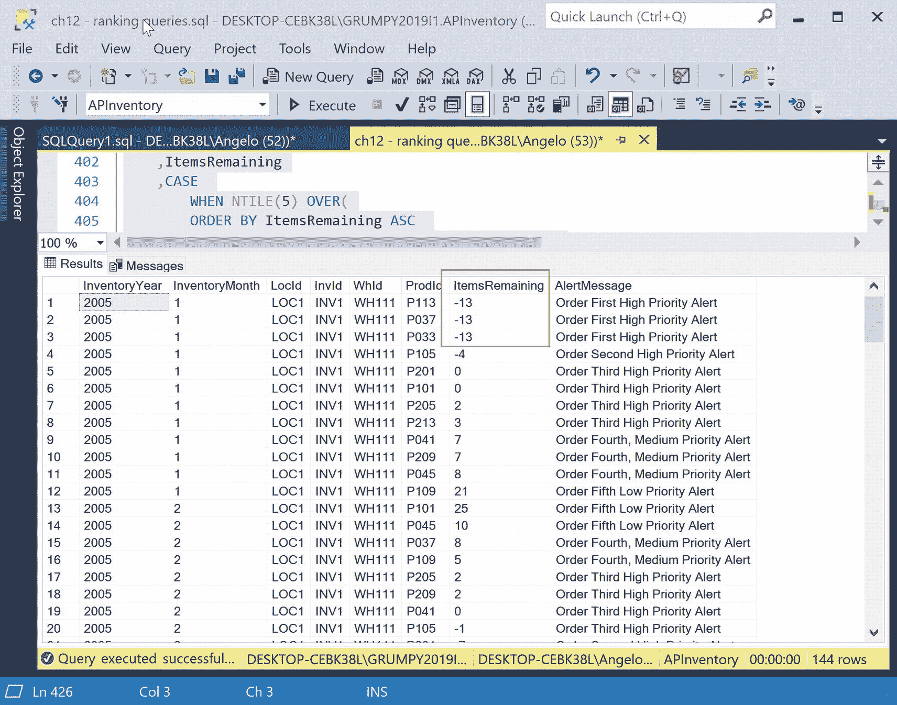
图 12-12 分配重新订购优先级

看起来它起作用了。我们看到有三个产品，P113、P037 和 P033，剩余物品数为 -13。这意味着有 13 个订单因为库存无货而延期交付。所以逻辑是有效的，而我们的仓库经理正在抓狂！这可不妙。

让我们看看这个查询的表现如何。


#### 性能考量

让我们从生成基线执行计划开始。

请参阅图 12-13。

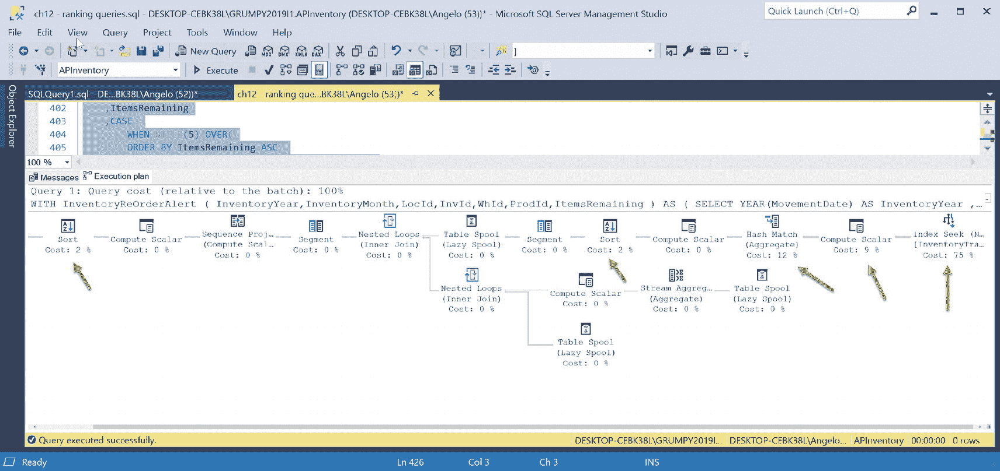

一个 ch 12 排名查询 SQL 窗口的截图。它展示了查询成本执行计划的信息。箭头指向排序成本 2%、哈希匹配成本 12%、计算标量成本 9%以及索引查找成本 75%。

图 12-13

NTILE 报告的基线估计执行计划

没有被识别为缺失的索引，所以我们有了一个良好的开端。从计划的右上角开始，我们看到一个成本为 75%的索引查找，接着是成本为 9%的计算标量和成本为 12%的哈希匹配。接下来是成本为 2%的排序（为了讨论方便，我忽略了成本为 0%的任务）。

我们下分支的成本都是 0%。令人惊讶的是，合并两个分支的嵌套循环连接任务成本也是 0%。在最左侧，我们看到一个成本为 2%的排序任务。

#### 注意

合并连接优于嵌套循环连接。对于嵌套循环连接任务，对于外部表中的每一行，都需要扫描内部表中的所有行。合并连接将它们排列好，这样你就不必扫描所有行来搜索匹配项！这就是为什么你需要索引来帮助查找和扫描。

#### 结论

这是一个性能良好的查询，所以我们保持原样。但好奇心战胜了我。让我们将`CTE`逻辑放入一个`INSERT/SELECT`查询中，以便加载一个报告表。代码清单 12-6 是用于该表的`CREATE DDL`语句，后面是加载它的代码。

```sql
USE APInventory
GO
DROP SCHEMA IF EXISTS Reports
GO
CREATE SCHEMA Reports
GO
DROP TABLE IF EXISTS Reports.InventoryReOrderAlert
GO
CREATE TABLE Reports.InventoryReOrderAlert(
InventoryYear int  NULL,
InventoryMonth int NULL,
LocId varchar(4)   NOT NULL,
InvId varchar(4)   NOT NULL,
WhId varchar(5)    NOT NULL,
ProdId varchar(4)  NOT NULL,
ItemsRemaining     int NULL
) ON AP_INVENTORY_FG
GO
INSERT INTO Reports.InventoryReOrderAlert
SELECT YEAR(MovementDate) AS InventoryYear
,MONTH(MovementDate) AS InventoryMonth
,IT.LocId
,IT.InvId
,IT.WhId
,IT.ProdId
,SUM(IT.Increment - IT.Decrement) AS ItemsRemaining
FROM APInventory.Product.InventoryTransaction IT
GROUP BY YEAR(MovementDate)
,MONTH(MovementDate)
,IT.LocId
,IT.InvId
,IT.WhId
,IT.ProdId
ORDER BY YEAR(MovementDate)
,MONTH(MovementDate)
,IT.LocId
,IT.InvId
,IT.WhId
,IT.ProdId
GO
```
代码清单 12-6
用报告表替代 CTE 逻辑

我使用了与`CTE`相同的名称来命名该表。注意我将它分配给了`Reports`架构。加载此表的代码就是之前作为`INSERT/SELECT`命令一部分的`CTE`查询。你以前见过这些。

基础查询没有改变，因为我使用了`CTE`的名称作为新表的名称，所以让我们深入探讨修订后的估计查询计划。

请参阅图 12-14。

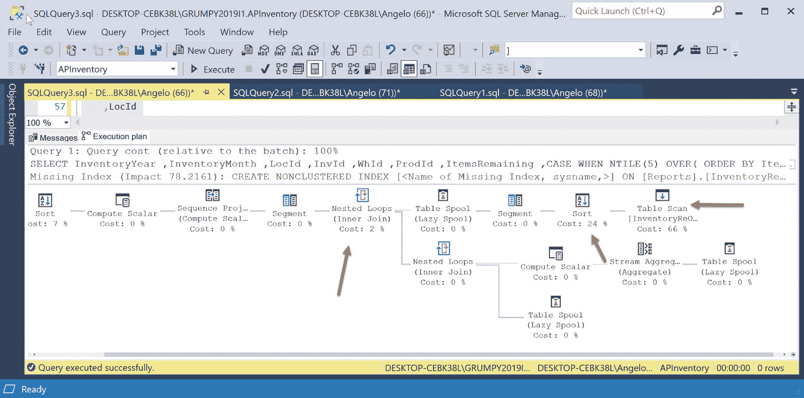

一个 ch 12 排名查询 SQL 窗口的截图。它展示了查询成本执行计划的信息。箭头指向嵌套循环成本 2%、排序成本 24%和表扫描成本 66%。

图 12-14

显示需要索引的基线估计查询计划

正如运气所使然，我们需要创建一个索引来支持此策略，因为我们看到一个成本为 66%的表扫描和一个成本昂贵的 24%排序步骤。让我们构建代码清单 12-7 中所示的建议索引。

```sql
CREATE NONCLUSTERED INDEX ieYearLocIdInvIdWhIdInventoryMonthProdIdItemsRemaining
ON Reports.InventoryReOrderAlert (InventoryYear,LocId,InvId,WhId)
INCLUDE (InventoryMonth,ProdId,ItemsRemaining)
GO
```
代码清单 12-7
为建议的索引创建 DDL

索引名称很长，我知道，但它具有描述性。

`SQL Server`在建议索引的消息中指出，如果我们构建此索引，查询成本将提高 78.2161%。不错。

让我们创建它并重新生成估计的查询计划。

请参阅图 12-15。

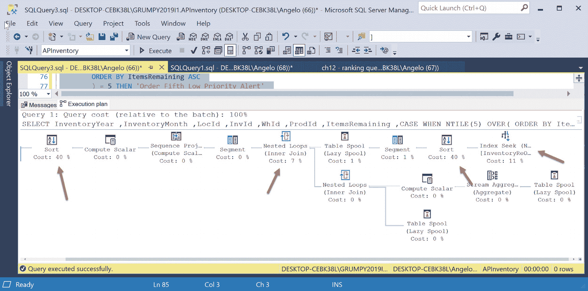

一个 ch 12 排名查询 SQL 窗口的截图。它展示了查询成本执行计划的信息。箭头指向排序成本 40%、嵌套循环成本 7%、排序成本 40%和索引查找成本 11%。

图 12-15

修订后的估计执行计划

表扫描被索引查找所取代，但当然，正如我们之前多次看到的那样，排序操作增加了，嵌套循环连接任务的成本也增加了。不妨看看`IO`和`TIME`统计信息。

请参阅图 12-16。

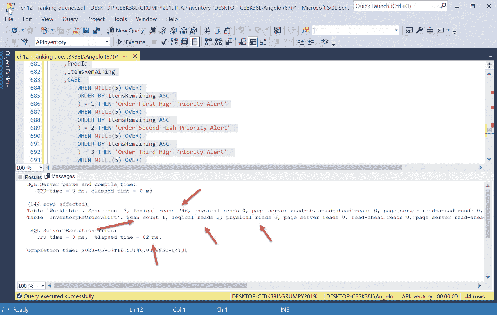

一个 ch 12 排名查询 SQL 窗口的截图。一个子窗口显示了 13 行程序代码。下部屏幕显示了执行计划信息，箭头指向逻辑读取 296、扫描计数 1、逻辑读取 3、物理读取 2 和已用时间 82 毫秒。

图 12-16

修改后查询的 IO 和 TIME 统计信息

这些看起来是很好的统计数据。首先，查询在 1 秒内运行完成，耗时 82 毫秒。非常快。工作表的扫描计数为 3，逻辑读取为 296。新的报告表扫描计数为 1，逻辑读取为 3，物理读取为 2。

我认为我们可以再次声明，当数据是历史数据时，我们的报告表策略是一个很好的选择。让我们看看最后一个函数，我们的朋友`ROW_NUMBER()`函数。

#### ROW_NUMBER() 函数

最后但同样重要的是 `ROW_NUMBER()` 函数。作为提醒，我包含了其描述。如果你按顺序阅读了其他章节并且理解了这个函数的工作原理，则无需阅读下一段。可以跳过它。

如果你还记得，这个函数正如其名所示。给定数据结果集中的一组行，它将为数据集（或分区）中的每一行分配一个顺序编号。

根据你设置 `OVER()` 子句以及 `PARTITION BY` 和 `ORDER BY` 子句的方式，它将为结果集中的每个分区分配行号。也就是说，每次移动到下一个分区时，行号从 1 开始顺序递增，直到分区的最后一行。

这次我们将使用 `ROW_NUMBER()` 函数来帮助生成一些随机数量，以便用于测试目的。在之前的章节中，我们曾使用这个函数来帮助处理“孤岛与间隙”数据现象！

最后，日历季度和月份需要拼写出来，而不仅仅是数值，因此需要一个 `CASE` 代码块。

下一个脚本的业务需求如下：

这个需求有点改变节奏。分析师不想要实际结果，而是希望我们生成一些随机的库存移动数据，以便他们可以创建一些 Microsoft Excel 的原型图表。他们对于年份为“2002”、产品为“P101”、位置为“LOC1”、库存为“INV1”和仓库为“WH112”的数据感到满意。

这是一个很棒的规格说明，因为它允许我们使用 `ROW_NUMBER()` 函数生成随机数据，而不仅仅是为结果集或分区生成行号。这是一个有价值的机制，但我们之前已经见过这方面的例子了。

无论如何，这是我们为满足此需求而设计的方案。请参考清单 12-8。

```sql
WITH InventoryMovement (
    AsOfYear,AsOfQuarter,AsOfMonth,AsOfDate,LocId,InvId,WhId,ProdId,InvOut,InvIn
)
AS
(
    SELECT AsOfYear
        ,CASE
            WHEN DATEPART(qq,AsOfDate)  = 1 THEN 'Qtr 1'
            WHEN DATEPART(qq,AsOfDate)  = 2 THEN 'Qtr 2'
            WHEN DATEPART(qq,AsOfDate)  = 3 THEN 'Qtr 3'
            WHEN DATEPART(qq,AsOfDate)  = 4 THEN 'Qtr 4'
         END AS AsOfQuarter
        ,CASE
            WHEN MONTH(AsOfDate)  = 1 THEN 'Jan'
            WHEN MONTH(AsOfDate)  = 2 THEN 'Feb'
            WHEN MONTH(AsOfDate)  = 3 THEN 'Mar'
            WHEN MONTH(AsOfDate)  = 4 THEN 'Apr'
            WHEN MONTH(AsOfDate)  = 5 THEN 'May'
            WHEN MONTH(AsOfDate)  = 6 THEN 'June'
            WHEN MONTH(AsOfDate)  = 7 THEN 'Jul'
            WHEN MONTH(AsOfDate)  = 8 THEN 'Aug'
            WHEN MONTH(AsOfDate)  = 9 THEN 'Sep'
            WHEN MONTH(AsOfDate)  = 10 THEN 'Oct'
            WHEN MONTH(AsOfDate)  = 11 THEN 'Nov'
            WHEN MONTH(AsOfDate)  = 12 THEN 'Dec'
         END AS AsOfMonth
        ,AsOfDate
        ,LocId
        ,InvId
        ,WhId
        ,ProdId
        ,ROUND(CEILING(RAND(ROW_NUMBER() OVER (
            PARTITION BY AsOfYear,DATEPART(qq,AsOfDate)
            ORDER BY AsOfDate
        ))
        * 85 *
        RAND(ROW_NUMBER() OVER (
            PARTITION BY AsOfYear
            ORDER BY AsOfDate
        ) * 1900
        )),1) AS InvOut
        ,ROUND(CEILING(RAND(ROW_NUMBER() OVER (
            PARTITION BY AsOfYear,DATEPART(qq,AsOfDate)
            ORDER BY AsOfDate
        ))
        * 100 *
        RAND(ROW_NUMBER() OVER (
            PARTITION BY AsOfYear
            ORDER BY AsOfDate
        ) * 100000
        )),1) AS InvIn
    FROM Product.Warehouse
    WHERE AsOfYear = 2002
        AND ProdId = 'P101'
        AND Locid = 'LOC1'
        AND InvId = 'INV1'
        AND WhId = 'WH112'
    GROUP BY AsOfYear
        ,DATEPART(qq,AsOfDate)
        ,AsOfMonth
        ,AsOfDate
        ,LocId
        ,InvId
        ,WhId
        ,ProdId
)
SELECT AsOfYear
    ,AsOfQuarter
    ,AsOfMonth
    ,AsOfDate
    ,LocId
    ,InvId
    ,WhId
    ,ProdId
    ,InvOut
    ,InvIn
    ,InvIn - InvOut AS QtyOnHand
FROM InventoryMovement
ORDER BY AsOfYear
    ,AsOfQuarter
    ,AsOfMonth
    ,AsOfDate
    ,LocId
    ,InvId
    ,WhId
    ,ProdId
GO
```
**清单 12-8**
使用 ROW_NUMBER() 生成随机值

我不会逐步讲解代码，因为我们之前已经见过这种结构，但我们可以重点关注生成随机库存出库值 (`InvOut`) 的代码：

```sql
,ROUND(CEILING(
    RAND(ROW_NUMBER() OVER (
        PARTITION BY AsOfYear,DATEPART(qq,AsOfDate)
        ORDER BY AsOfDate
    )
    )
    * 85 *
    RAND(ROW_NUMBER() OVER (
        PARTITION BY AsOfYear
        ORDER BY AsOfDate
    ) * 1900
    )
),1
) AS InvOut
```

从内向外分析，`ROW_NUMBER()` 函数使用了一个 `OVER()` 子句，该子句按 `AsOfYear` 列和使用 `DATEPART()` 函数从 `AsOfDate` 派生的季度进行分区。`ORDER BY` 子句按 `AsOfDate` 对分区结果集进行排序。生成的值用作 `RAND()` 函数的种子，生成的值乘以 85。

接下来，我们将刚刚生成的值乘以使用相同逻辑生成的另一个值，只是第二个 `OVER()` 子句中的 `PARTITION BY` 仅由 `AsOfYear` 定义。这个值再次被 `RAND()` 函数用作种子值，结果乘以 1900。

最后，通过使用 `CEILING()` 函数获取下一个最高值来调整新值，然后我们使用 `ROUND()` 函数对最终值进行四舍五入，以确保不包含小数部分。

此逻辑也用于为 `InvIn` 列生成随机值。

请参考图 12-17 中的部分结果。

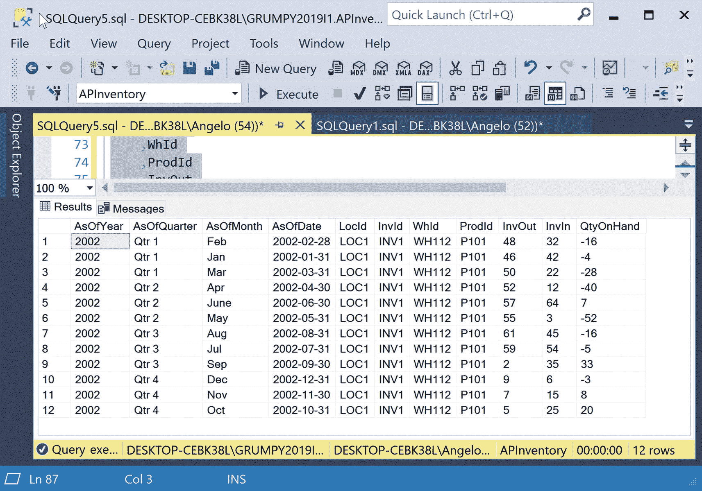

**图 12-17**
使用 ROW_NUMBER 函数生成随机值

正如我们所见，随机值看起来是合理的。归根结底，这只是一堆操作数字以达到预期结果的逻辑。我只想给出一个 `ROW_NUMBER()` 函数用于除在分区内生成行号之外其他目的的例子。

### 性能考虑

让我们通过生成此查询的基线计划来最后看一下估计的查询计划。

请参考图 12-18。

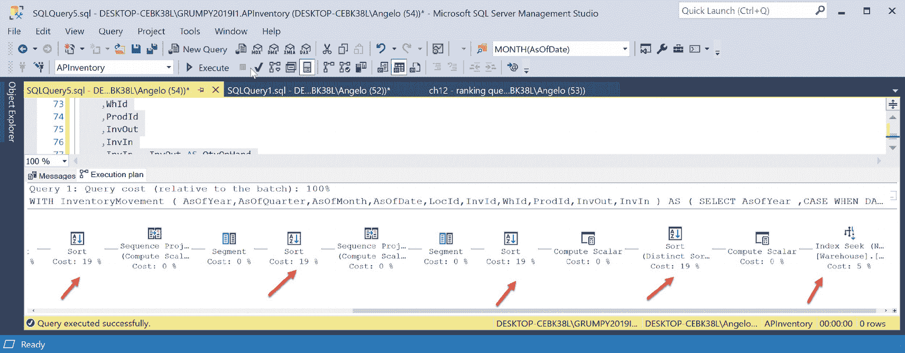

**图 12-18**
随机值生成查询的基线估计查询计划

我们将只快速检查这个查询，因为它通常不会出现在生产环境中，但当你需要生成带有随机值的测试数据时，它可能会在开发环境中使用。换句话说，除非查询运行数小时，否则性能并不是那么重要。

从计划的右侧开始，我们看到一个索引扫描，成本为 5%，一个排序成本为 19%，第二个排序成本为 19%，还有另外两个排序任务成本各为 19%。最左侧还有一个未显示的第五个排序任务，成本同样为 19%。

因此我们可以推断，这种类型的查询需要多次对中间结果进行排序。像往常一样，我忽略了零成本任务，尽管在进行分析时，你应该注意它们，尤其是那些你不知道其作用的！

这只是生成随机数据的一种方法，当你研究本书中用于加载数据库的脚本时，你会看到其他使用 SQL Server 函数生成随机数据的技术。


## 创建 SSRS 报告

我们现在将使用 Report Builder 创建一份报告，并将其发布到 `SSRS` 网站。该报告需要满足我们的分析师提交的以下要求：

这是一份详细报告，列出了所有日历年和月份的全部产品库存情况；必须包含所有位置、库存和仓库。需要显示月份的名称而非数字（是的，又一个代价高昂的 `CASE` 代码块）。

此报告将由多位用户使用，因此需要包含一组筛选器，让业务用户能够选择他们想查看的年份、月份和其他维度——并且可以任意组合！

换句话说，需要所有数据，并且这必须是一份动态报告，以支持所有可能的筛选组合。

性能是关键。我们的业务用户想要一切。他们要求很高。不能指望用户等待超过 30 秒（或更短）让报告显示结果。

我们需要将此报告建立在一个基于以下查询的 `VIEW` 上。请参考清单 12-9。

```sql
CREATE VIEW MonthlyInventoryRanks
AS
WITH WarehouseCTE (
InvYear,InvMonthNo,InvMonthMonthName,LocationId,LocationName
,InventoryId,WarehouseId,WarehouseName,ProductId,ProductName
,ProductType,ProdTypeName,MonthlyQtyOnHand
)
AS ( -- 返回 24,192 行
SELECT YEAR(C.[CalendarDate])  AS InvYear
,MONTH(C.[CalendarDate]) AS InvMonthNo
,CASE
WHEN MONTH(C.[CalendarDate])  = 1 THEN 'Jan'
WHEN MONTH(C.[CalendarDate])  = 2 THEN 'Feb'
WHEN MONTH(C.[CalendarDate])  = 3 THEN 'Mar'
WHEN MONTH(C.[CalendarDate])  = 4 THEN 'Apr'
WHEN MONTH(C.[CalendarDate])  = 5 THEN 'May'
WHEN MONTH(C.[CalendarDate])  = 6 THEN 'June'
WHEN MONTH(C.[CalendarDate])  = 7 THEN 'Jul'
WHEN MONTH(C.[CalendarDate])  = 8 THEN 'Aug'
WHEN MONTH(C.[CalendarDate])  = 9 THEN 'Sep'
WHEN MONTH(C.[CalendarDate])  = 10 THEN 'Oct'
WHEN MONTH(C.[CalendarDate])  = 11 THEN 'Nov'
WHEN MONTH(C.[CalendarDate])  = 12 THEN 'Dec'
END AS InvMonthMonthName
,L.LocId             AS LocationId
,L.LocName           AS LocationName
,I.InvId             AS InventoryId
,W.WhId              AS WarehouseId
,W.WhName            AS WarehouseName
,P.ProdId                 AS ProductId
,P.ProdName          AS ProductName
,P.ProdType          AS ProductType
,PT.ProdTypeName     AS ProdTypeName
,SUM(IH.[QtyOnHand]) AS MonthlyQtyOnHand
FROM [Fact].[InventoryHistory] IH -- WITH (INDEX(ieInvHistCalendar))
JOIN [Dimension].[Location] L
ON IH.LocKey = L.LocKey
JOIN [Dimension].[Calendar] C
ON IH.CalendarKey = C.CalendarKey
JOIN [Dimension].[Warehouse] W
ON IH.WhKey = W.WhKey
JOIN [Dimension].[Inventory] I
ON IH.[InvKey] = I.InvKey
JOIN [Dimension].[Product] P
ON IH.ProdKey = P.ProdKey
JOIN [Dimension].[ProductType] PT
ON P.ProductTypeKey = PT.ProductTypeKey
GROUP BY YEAR(C.[CalendarDate])
,MONTH(C.[CalendarDate])
,L.LocId
,L.LocName
,I.InvId
,W.WhId
,W.WhName
,P.ProdId
,P.ProdName
,P.ProdType
,PT.ProdTypeName
)
SELECT InvYear,InvMonthNo,InvMonthMonthName,LocationId,LocationName
,InventoryId,WarehouseId,WarehouseName,ProductType,ProductId
,ProductName
,MonthlyQtyOnHand
,RANK() OVER (
PARTITION BY InvYear,InvMonthNo,InvMonthName,LocationId
,InventoryId,WarehouseId
ORDER BY MonthlyQtyOnHand DESC
) QtyOnHandRank
FROM WarehouseCTE
GO
```

### 清单 12-9: 用于支持库存排名的 TSQL 视图

代码很多，但值得花时间去审阅和理解它，特别是如果你刚接触 TSQL 编码的话。

注意 `PARTITION BY` 子句中指定的分区粒度。我们指定了年份、月份（编号和名称）、位置、库存和仓库（我们没有分区到产品级别；你可以自己试试，并且修改视图使其使用 `DENSE_RANK()` 函数）。

最后，包含了一个 `ORDER BY` 子句，用于按 `MonthlyQtyOnHand` 降序对分区值的处理进行排序。

如果性能缓慢，我们需要使用 `SCHEMA` 绑定重新创建报告，这意味着 `VIEW` 将实际填充物理数据并存在于磁盘上。这将使任何引用该视图的查询都变得快速！

这是我们讨论过多次、用来替代 `CTE` 的报告表选项之外的另一个选择。只需按照以下代码片段修改 `VIEW DDL` 命令：

```sql
CREATE OR ALTER VIEW Reports.MonthlyInventoryRanks
-- 使用下面语句来实现一个物化的、绑定架构的视图
WITH SCHEMABINDING
AS
```

### Report Builder 教程

现在，是时候简要介绍一下 Report Builder 的教程了，我们将使用它来构建并发布一份基于 Web 的报告到 `SSRS`。


### 报表生成器迷你教程

让我们来看看你 BI 工具箱中的新工具之一，名为报表生成器。正如本书前面提到的，该工具允许你基于 SQL Server 数据库创建报表，并将其发布到`SSRS`（Microsoft 的旗舰级 Web 报表架构）。

本节将以迷你教程的形式进行，我们将介绍创建报表并将其发布到`SSRS`所需的步骤。它将为你提供将简单报表创建并发布到`SSRS`所需的基本步骤。本教程并非旨在涵盖所有功能，因为那需要一整本书的篇幅，而非一章中的一个章节。希望它能启发你尝试这个工具，并学习如何使用其所有功能。

顺便说一句，会有很多截图！

如果你没有报表生成器，只需用你喜欢的浏览器搜索它，然后从 Microsoft 网站下载。它是免费的！安装并启动后，你将看到如`图 12-19`所示的屏幕。

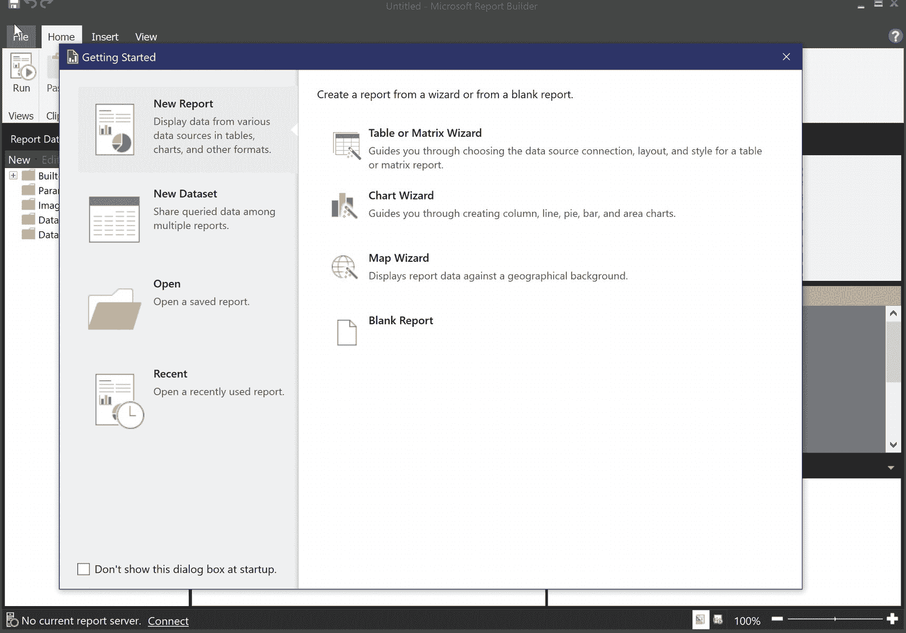

`图 12-19` 启动报表生成器

一个入门页面的截图，展示了通过向导或从空白报表创建报表的步骤。屏幕左侧有 4 个图标：新建报表、新建数据集、打开和最近。

你会看到一个弹出面板，让你选择要创建的报表或组件类型。选项如下：

*   `新建报表`（创建）
*   `新建数据集`（创建）
*   `打开`（已保存的报表）
*   `最近`（打开最近的报表）

你还可以使用引导向导创建报表。点击`新建报表`将显示所有可用的向导，引导你完成报表创建过程。

选项有

*   `表或矩阵向导`
*   `图表向导`
*   `地图向导`
*   `空白报表`

在我们的示例中，我们将选择一个新报表，并使用`表或矩阵向导`。这将使你能够访问报表向导。

你看到的第一个面板允许你创建或使用现有的数据集。数据集是一个对象，将包含来自数据库的数据，你可以在报表中使用这些数据。

提示

如果你是报表生成器的新手，我建议你使用向导，因为它们易于使用，并能让你了解在 SQL Server 架构内基于 Web 的报表创建涉及哪些内容。

请参阅`图 12-20`。

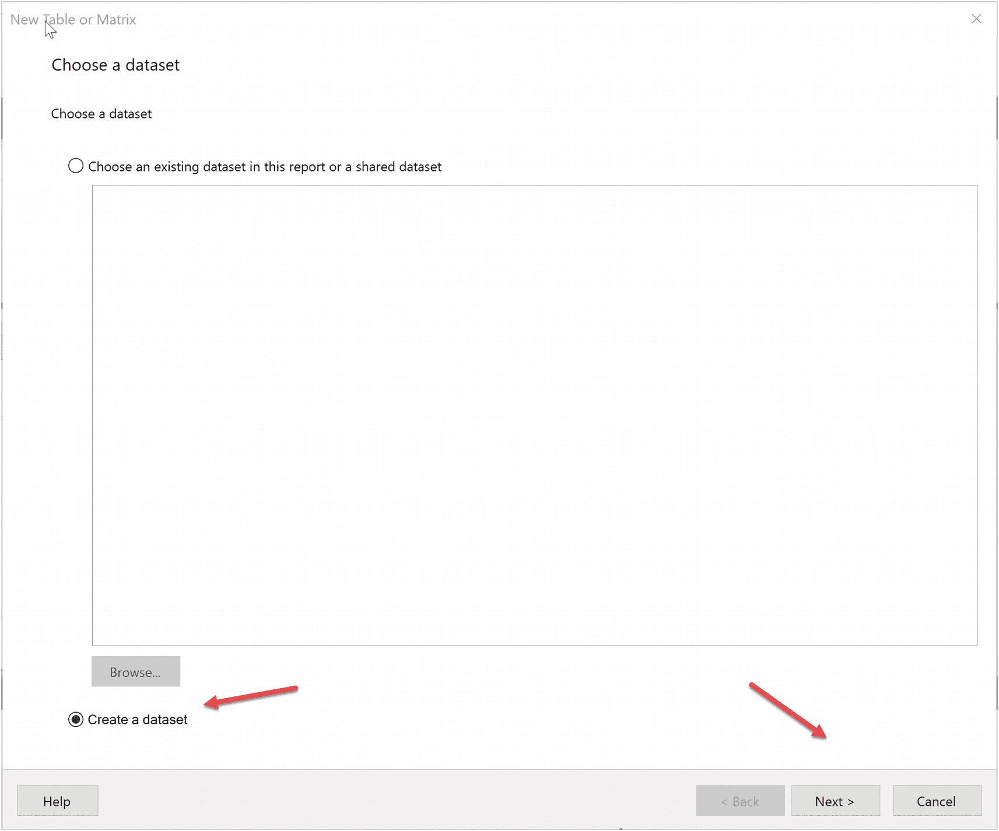

`图 12-20` 创建数据集

一个“新建表或矩阵”弹出面板的截图。包含一个大框，其上方有一个选项，用于选择此报表中的现有数据集或共享数据集。两个箭头指示选择“创建数据集”选项并单击“下一步”按钮。

在这里，你可以选择现有数据集或创建一个新数据集。我们将点击`“创建数据集”`单选按钮，然后点击`下一步`按钮。这时会显示另一个面板。

请参阅`图 12-21`。

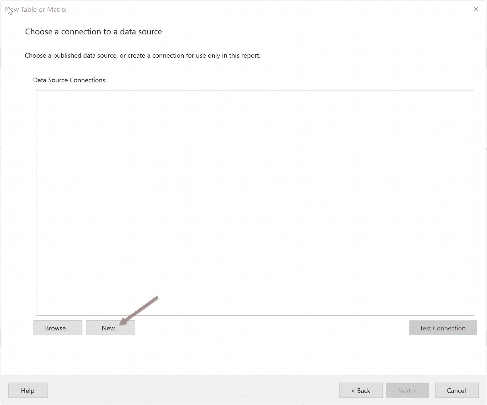

`图 12-21` 创建新数据源

一个“新建表或矩阵”弹出面板的截图。标题为“选择数据源的连接”，下方是数据源连接的框。一个箭头指示点击“新建”按钮。

在我们创建数据集之前，我们需要一个到数据源的连接，该数据源将提供我们需要的数据。数据集由数据源提供数据。

点击`“新建”`按钮。这时会显示另一个面板。

请参阅`图 12-22`。

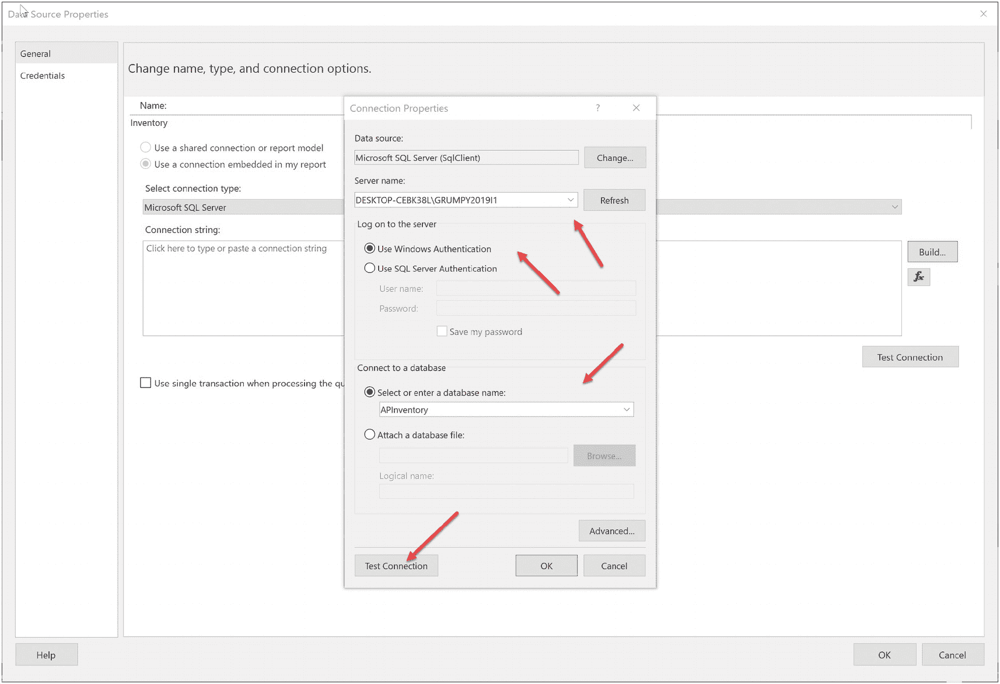

`图 12-22` 数据源属性

一个“数据源属性”弹出面板的截图。4 个箭头指示选择服务器名称字段、使用 Windows 身份验证、选择或输入数据库名称，以及点击“测试连接”按钮。


为数据集提供一个名称（请不要使用空格或特殊字符），点击“构建”按钮，会出现一个对话框，让你从列表中选择一个服务器并选择登录服务器的方式。在这里，我们希望使用 **Windows 身份验证**，而不是 **SQL Server 身份验证**。最后，选择我们想要连接到的数据库并测试连接。

## 测试连接
务必进行测试。记住，事情永远有时间重做，但永远没有时间从头做对！

点击“确定”按钮，连接创建任务就完成了，我们将返回到原始面板。

请参见图 12-23。

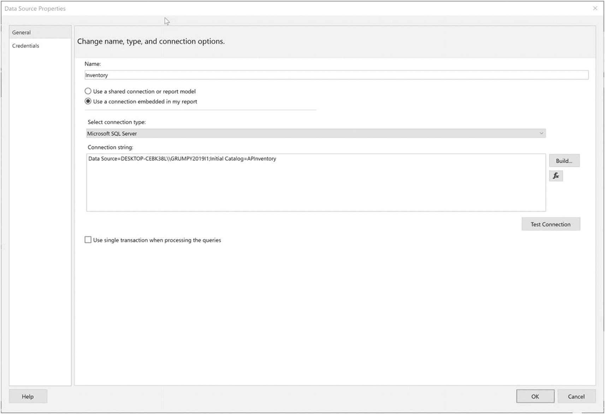
数据源属性弹出面板的截图。名称设为 inventory，连接类型选择 M S S Q L server，有一个连接字符串，并选择了“使用嵌入在我报表中的连接”选项。底部的“确定”按钮高亮显示。
**图 12-23：已完成的数据源属性**

## 确认连接
一切看起来都很好，所以再次点击“确定”按钮。如果您选择的是现有连接而不是新建一个，也可以在这里测试连接。

这时会显示另一个面板，展示新的数据源连接。

请参见图 12-24。

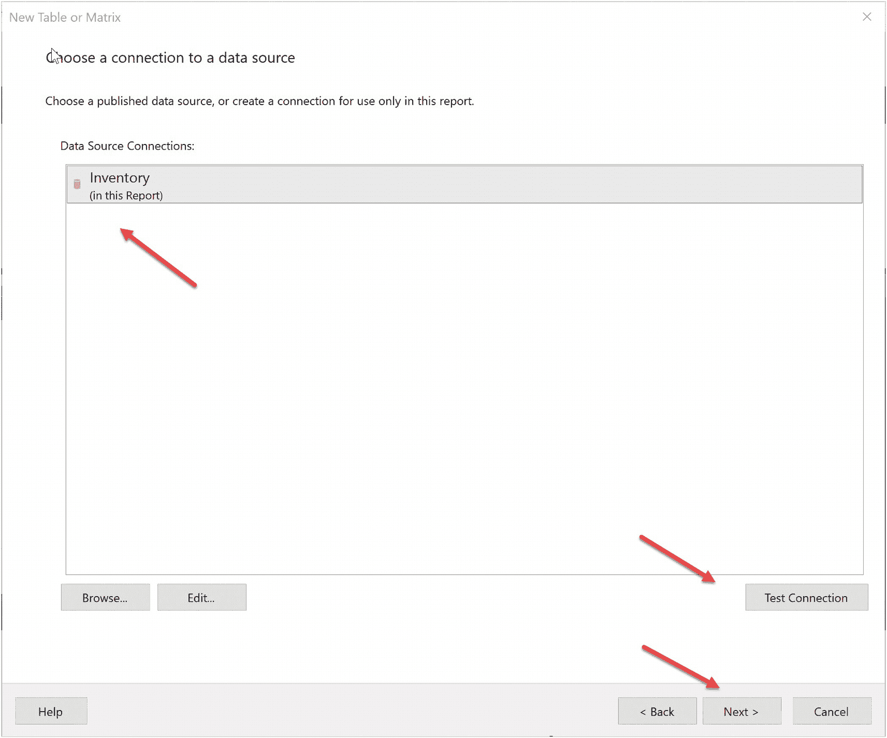
“新建表或矩阵”弹出面板的截图。Inventory 被选作数据源连接。箭头指示了测试连接按钮和下一步按钮。
**图 12-24：选择新连接**

这里有名称，并且您还有另一次机会测试它。这是为了如果您要从现有连接创建报表，您可以在这里选择并测试它。点击“下一步”按钮，是的，又一个面板出现，用于下一步操作。这可能会有些令人困惑，因为根据您是创建了新连接还是使用了现有连接，这些步骤的路径会有所不同。

## 设计查询
对于下一步，请参见图 12-25。

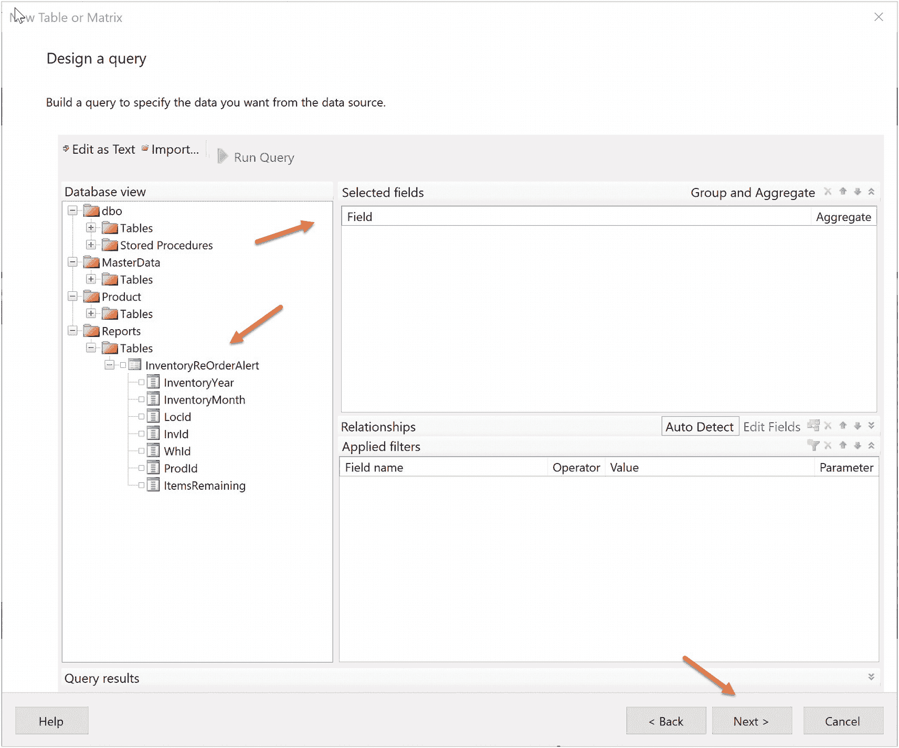
“新建表或矩阵”弹出面板的截图。标题为：设计查询。它列出了数据库视图面板中的文件夹。三个箭头分别指向：Inventory Reorder Alert 文件夹、带有聚合函数的“选定字段”选项和“下一步”按钮。
**图 12-25：设计查询**

最后，我们开始创建报表。展开 Reports 文件夹，然后展开 Tables 文件夹，在本例中，我们只有一个名为 `InventoryReOrderAlert` 的表。该表有 24,192 行，不大不小。

展开此节点以查看所有列。通过勾选每个名称左侧的复选框来选择所有列。“选定字段”面板将显示您选择的所有列。

请参见图 12-26。

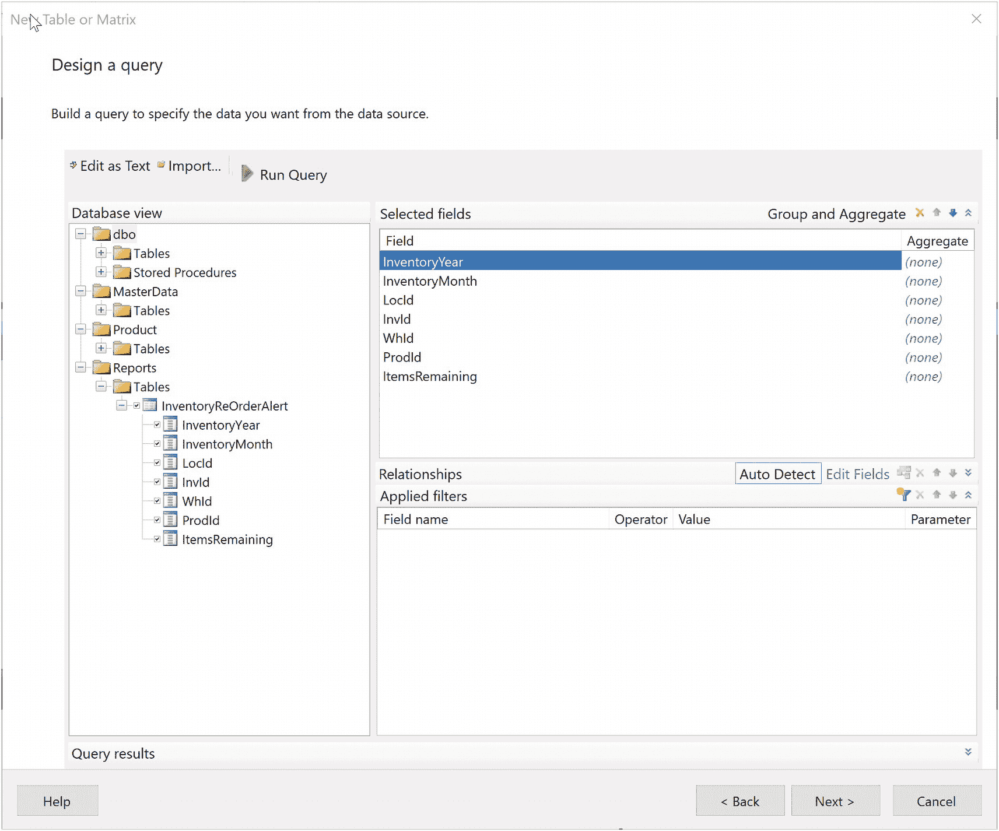
“新建表或矩阵”弹出面板的截图。标题为：设计查询。它列出了数据库视图面板中的文件夹。“Inventory year”选项在“选定字段”中高亮显示。
**图 12-26：选定的字段**

### 关于筛选器的提示
此时我们可以定义筛选器，但我们想创建一个使用所有数据的向下钻取报表，因此我们将不使用面板的这部分。点击“下一步”按钮，进入布局报表的步骤。

如果您决定使用筛选器，您还需要创建小型数据集，每个用于筛选器的列一个（形式为 `SELECT DISTINCT` `FROM` `ORDER BY` <列名>）。

**提示：** 给您的数据集起清晰简单的名称，比如 `ProductId`，而不是 dataset1, dataset2 等。您明白我的意思。

然后，您需要创建链接到数据集的参数以获取值，最后将主数据集查询的 `WHERE` 子句中的筛选器映射到这些参数。

## 布局报表
接下来，我们需要布局我们的报表。

请参见图 12-27。

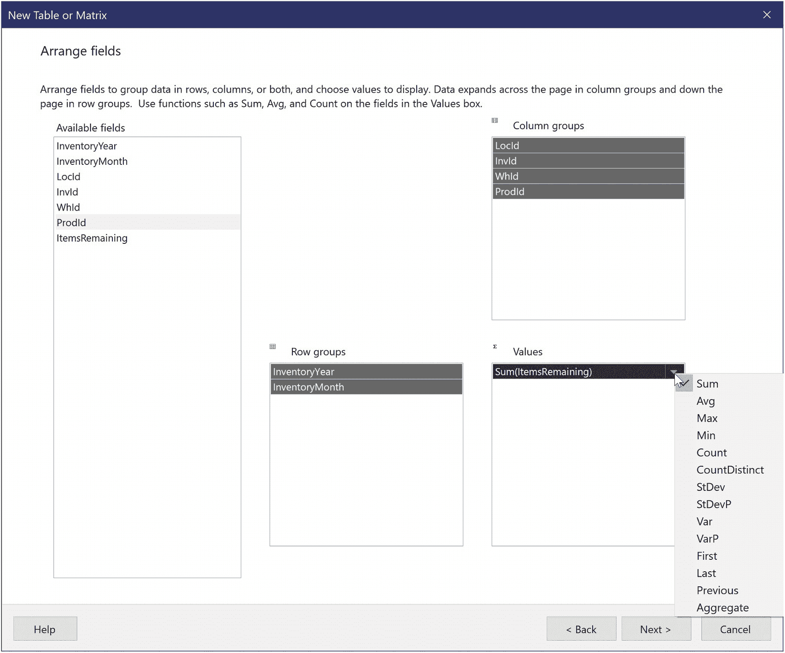
“新建表或矩阵”弹出面板的截图。它解释了如何安排字段以按行、列或两者对数据进行分组，并选择一个值来显示。
**图 12-27：排列字段**

这种类型的报表由行组、列组和值组成。对于行组，我们希望按年和月向下钻取，因此将 `InventoryYear` 和 `InventoryMonth` 列拖到此区域。

对于列组，我们希望包含 `LocId`、`InvId`、`WhId` 和 `ProdId`，因此将这些列拖到此区域。

最后，在“值”面板中，将 `ItemsRemaining` 列拖到此区域。如果您点击右侧的下拉箭头，您可以选择希望对此度量（您可以对其执行计算的列）应用的函数。注意我们的一些老朋友，比如聚合函数和分析函数。

最后，值会出现在行组和列组标识的对象的交点处。我们接下来看看这是什么样子。

点击“下一步”按钮进行下一步。

### 选择布局
请参见图 12-28。

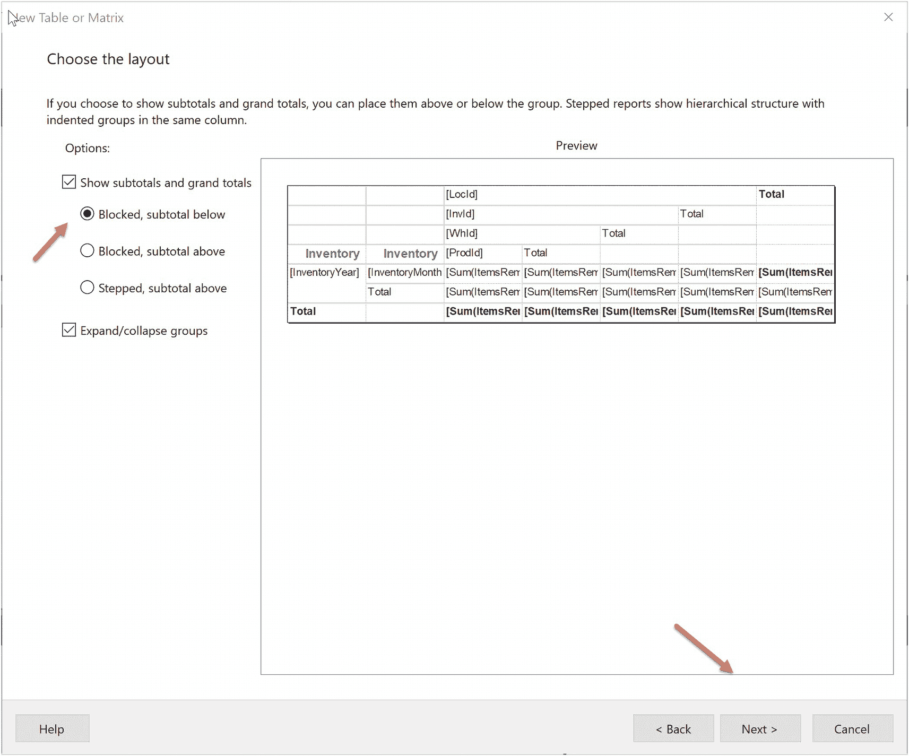
“新建表或矩阵”弹出面板的截图。它解释了如何选择布局来显示小计和总计。箭头指向选中的“分块，小计在下方”选项和底部的“下一步”按钮。预览表有 7 列 7 行。
**图 12-28：选择布局**

在这里，我们有机会指定报表的常规布局。如果您勾选“显示小计和总计”，您可以指定以下布局之一：
*   分块，小计在下方
*   分块，小计在上方（类似于本书前面章节讨论过的 `GROUPING` 函数）
*   阶梯状，小计在上方

我们勾选了“显示小计和总计”，并且我们想要“分块，小计在下方”格式。您可以在上图中看到它。

对结果满意后，点击“下一步”按钮进行预览。

## 预览报表
请参见图 12-29。

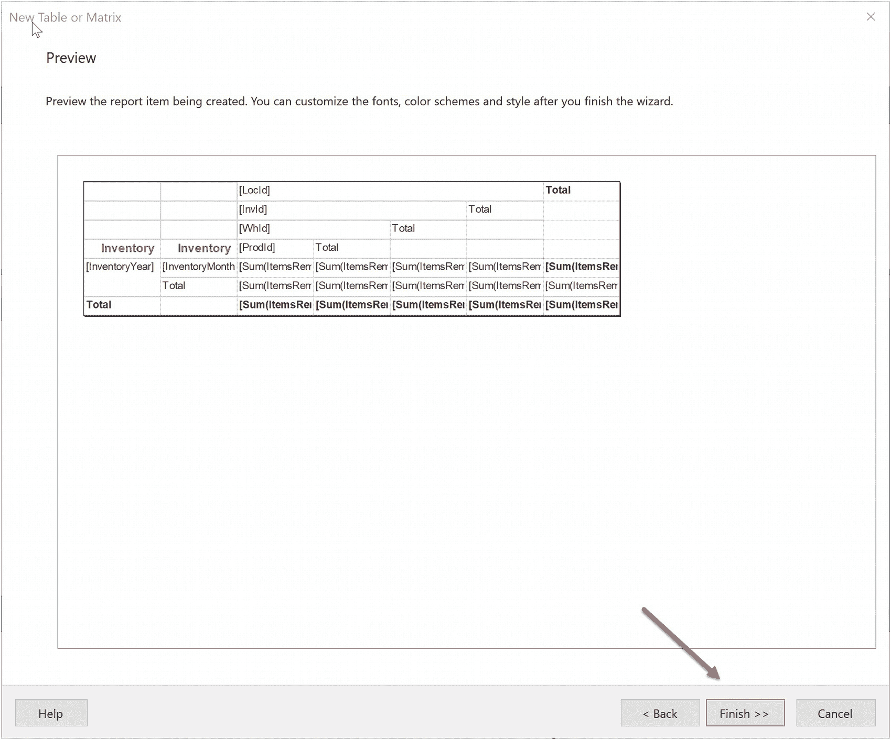
“新建表或矩阵”弹出面板的截图。它展示了报表项的预览表，有 7 行 7 列。一个箭头指向底部的“完成”按钮。
**图 12-29：报表预览**

您会再次看到布局。如果您需要更改某些内容，可以点击“返回”按钮回到上一步。我们对布局很满意，所以点击“完成”按钮。

## 运行报表
现在我们准备好测试报表了。请参见图 12-30。

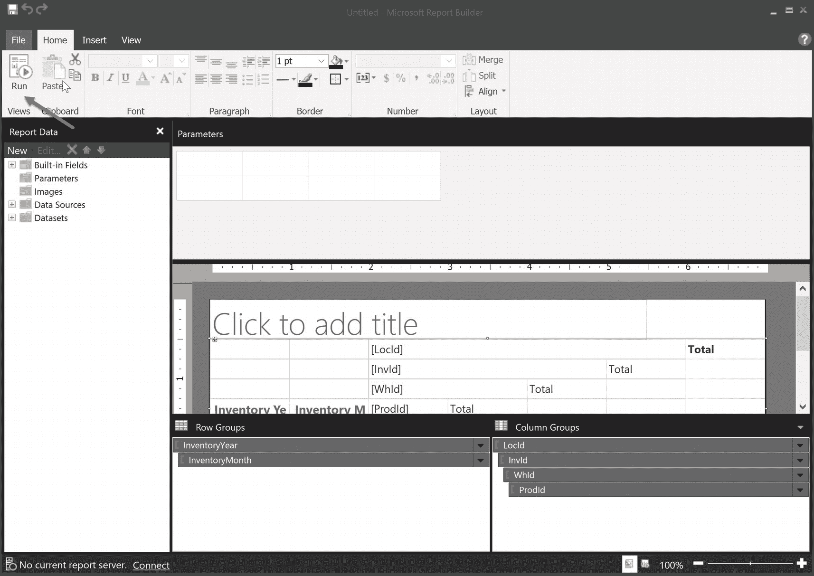
Microsoft Report Builder 主页的截图。一个箭头指向“运行”按钮。“内置字段”、“参数”、“图像”、“数据源”和“数据集”文件夹位于左侧的“报表数据”面板中。右侧包括一个参数部分，以及一个包含行组和列组部分的表格布局。
**图 12-30：报表布局 – 运行报表**

报表布局已显示。您可以进行更多修改，例如添加参数以允许业务用户进一步筛选结果，比如选择一种或多种产品或仓库。您可以添加通常在记分卡或仪表板中找到的指示符。我喜欢那些显示数值是增加还是减少的小型汽车仪表，但我离题了。

## 保存报表
顺便说一句，现在是将报表保存到文件夹的好时机。我总是忘记这一点，当各个部分发布到 SSRS 后，我需要返回并将报表以一个好的名称保存到文件夹中，然后才能将其上传到 SSRS 网站文件夹（这很令人沮丧）。

点击“另存为”，会出现以下面板。

请参见图 12-31。

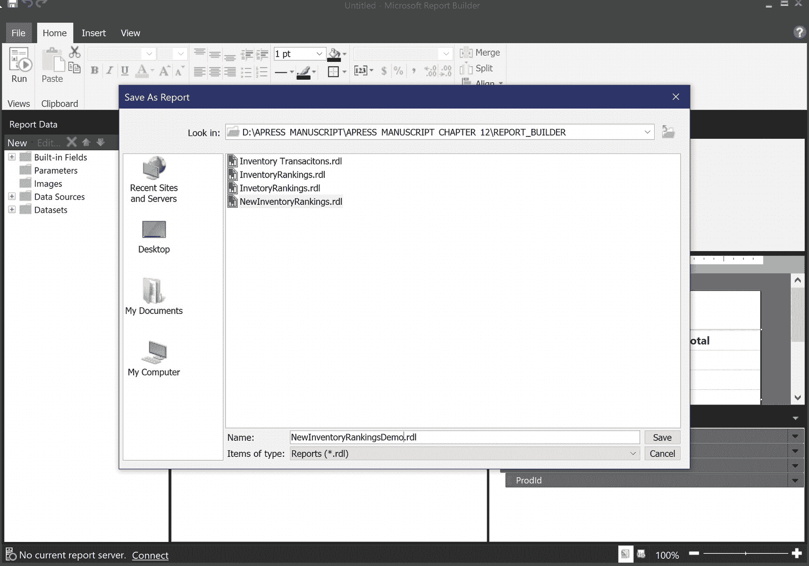


### 保存和发布报告

## 保存报告

这是 Microsoft Report Builder 主页的屏幕截图。它显示了一个“另存为报告”的弹出面板，其中包含用于导航到所需文件夹的“查找范围”字段，当前已选中“new inventory rankings.rdl”。底部是“保存”和“取消”按钮。

**图 12-31**

请导航到所需的文件夹，为报告取一个合适的名称，然后点击“保存”按钮。

## 测试报告

接下来，我们来试运行报告。点击菜单栏左上角的“运行”按钮，我们应该能看到报告的样本。

请参阅图 12-32。

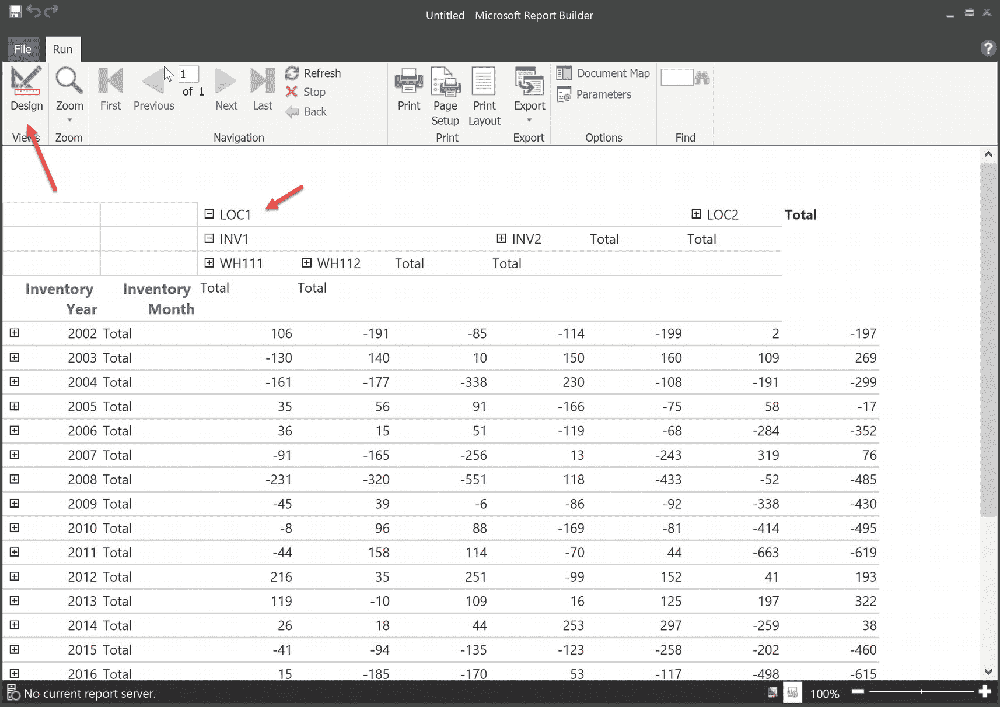

这是 Microsoft Report Builder 窗口的屏幕截图，已选择“运行”选项卡。一个箭头指示点击左上角的“设计”按钮以及顶部一排的“LOC1”按钮。它展示了一个表格形式的报告，包含“Inventory year”、“inventory total month”和“Total”列。

**图 12-32**

报告布局，报告样本

一切看起来都很好！点击维度旁边的任何按钮，例如“LOC1”，都将允许你向下钻取报告。总计会自动重新计算，以匹配你向下钻取到的层次结构级别。

请参阅图 12-33。

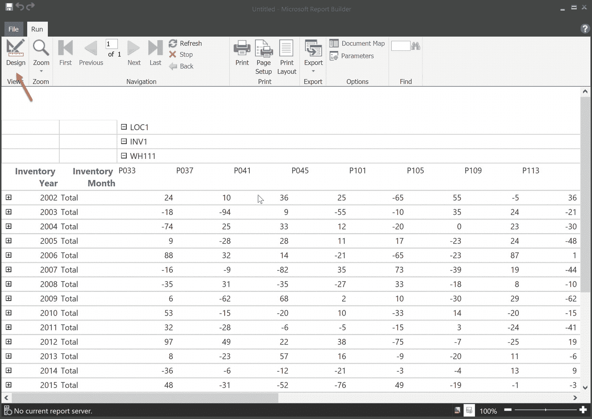

这是 Microsoft Report Builder 的屏幕截图，已选择“运行”选项卡。一个箭头指示点击左上角的“设计”按钮。它展示了一个表格形式的报告，包含“Inventory year”、“inventory month”、“P 033”、“P 037”、“P 041”、“P 045”、“P 101”、“P 105”、“P 109”和“P 113”列。

**图 12-33**

向下钻取到产品

漂亮的向下钻取。这才是真正的数据挖掘。一旦你满意地查看了报告，可以返回到设计面板。点击“设计”按钮，你就回到了设计面板。

## 连接到 SSRS 服务器

现在我们需要连接到本地的 `SSRS` 服务器，以便发布报告。

> **注意**
> 请从 Microsoft 网站下载 `SSRS`。安装程序名为 `SQLServerReportingServices.exe`！运行它，然后你需要使用 SSRS 配置管理器进行配置。在本书第 14 章结束时，我们将了解如何执行此操作。

请参阅图 12-34。

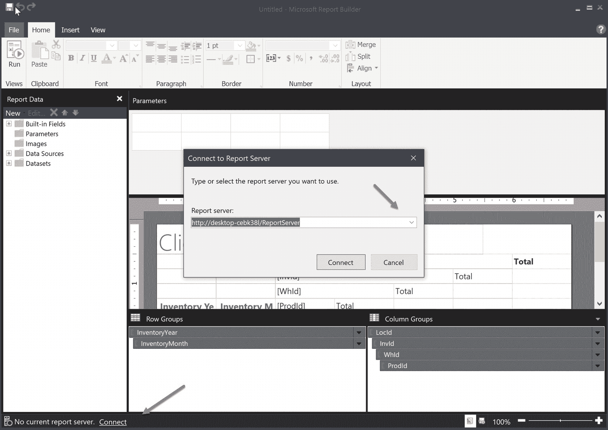

这是 Microsoft Report Builder 主页的屏幕截图。它显示了“连接到报告服务器”的弹出面板。一个箭头指示输入或选择要使用的报告服务器。另一个箭头指示左下角的“连接”按钮。

**图 12-34**

连接到服务器以发布报告

## 发布报告

现在我们准备好发布了。左下角是“连接”按钮，我们将使用它连接到我们的 Web 服务器。点击“连接”按钮，并提供你笔记本电脑、台式机上安装的 `SSRS` 服务器名称，或者你的公司给你访问权限的实际开发服务器名称。

从下拉列表中选择一个服务器，然后按“连接”按钮。现在我们准备好发布报告部件和报告了。

请参阅图 12-35。

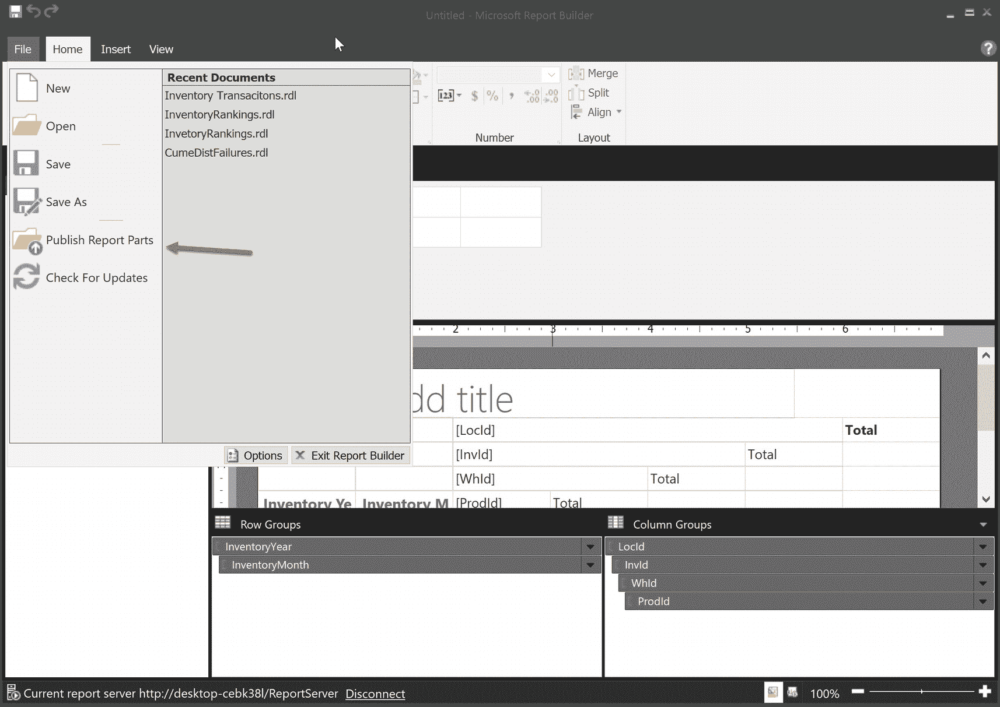

这是 Microsoft Report Builder 窗口的屏幕截图。它显示了“最近文档”弹出面板。一个箭头指示主菜单“主页”选项下的“发布报告部件”文件夹。右侧列出了最近的文档。

**图 12-35**

发布报告

切换到第一个选项卡，即“文件”选项卡，然后点击“发布报告部件”。会出现另一个面板，让你选择如何发布报告。

请参阅图 12-36。

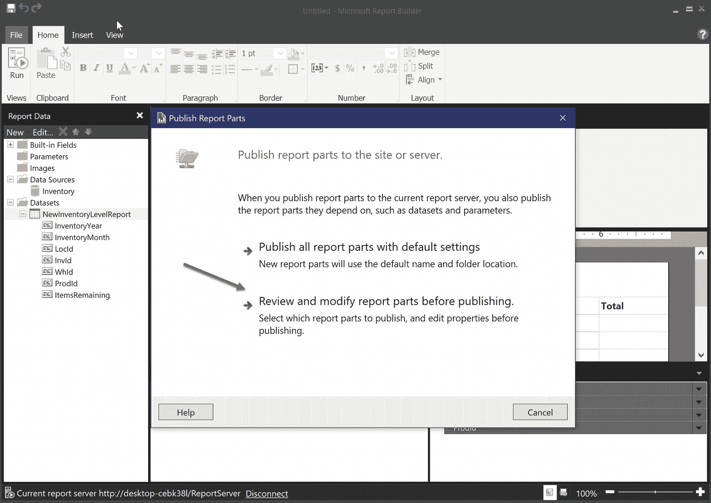

这是 Microsoft Report Builder 主页的屏幕截图。它显示了“发布报告部件”的弹出面板。一个箭头指示“在发布前检查并修改报告部件”的选项。

**图 12-36**

发布前检查部件，第 1 部分


## 审阅和发布报表部件

我们需要审阅报表部件，因为需要重命名它们以确保没有使用其他报表重复的名称。这些名称基本上指的是 `Tablix` 对象和数据集。如果不进行更改，当您创建多个报表时，会不断遇到发布错误。只需每次都使用合适的新名称，您就可以避免麻烦。

点击最后一个选项“发布前审阅并修改报表部件”。

请参阅图 12-37。

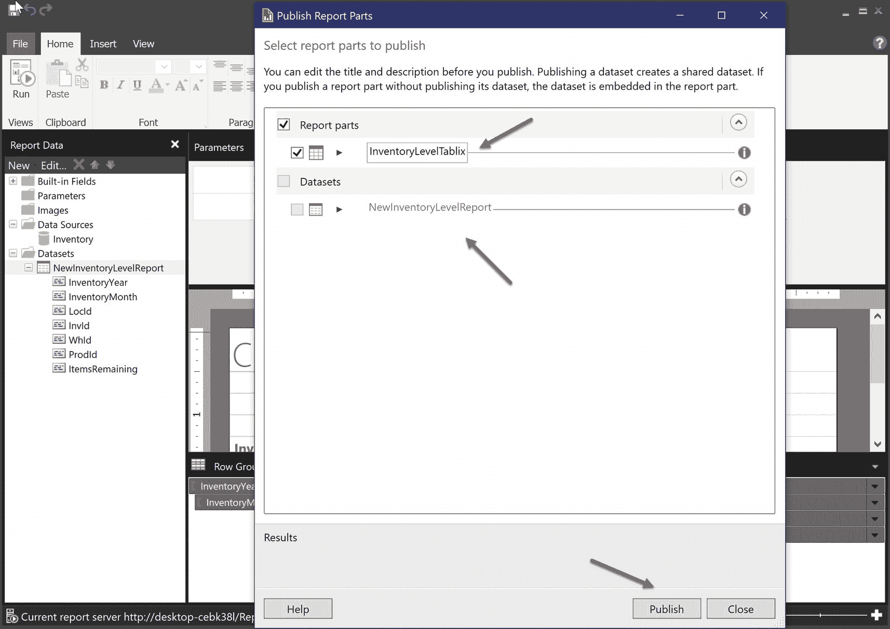
Microsoft Report Builder 主页的屏幕截图。它显示了“发布报表部件”弹出面板。两个箭头分别指向已选择的报表部件条目（库存水平 Tablix）和新库存水平报表的数据集。一个箭头指示右下角的“发布”按钮。
图 12-37
发布前审阅部件，第 2 部分

我将默认的 `Tablix1` 名称更改为 `InventoryLevelTablix`。我确定这是一个新的唯一名称。数据集名称显示为灰色，因此无法更改。我在之前讨论的定义步骤中确保给它起了一个好名字。

这看起来相当不错，所以祈祷好运，按下 `发布` 按钮。如果您收到“发布成功”的消息，您就可以查看报表了。

请参阅图 12-38。

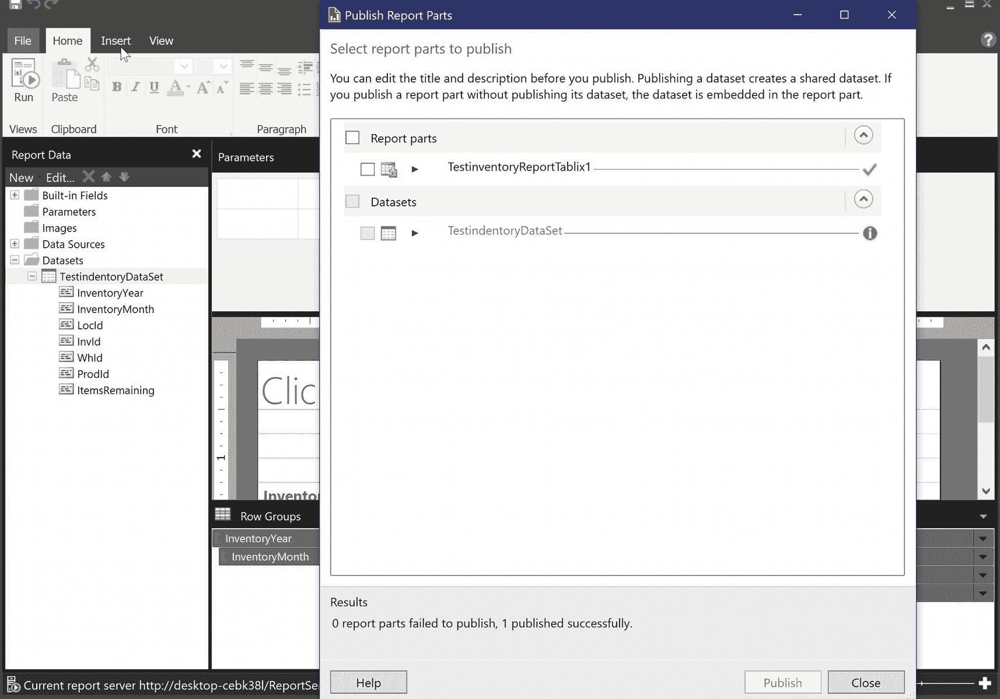
Microsoft Report Builder 主页的屏幕截图。它显示了“发布报表部件”弹出面板。它允许在发布前编辑标题和描述。结果显示，0 个报表部件发布失败，1 个发布成功。
图 12-38
成功

我们确实收到了“发布成功”的消息。让我们转到我们的 `SSRS` 网站并检查一下。

请参阅图 12-39。

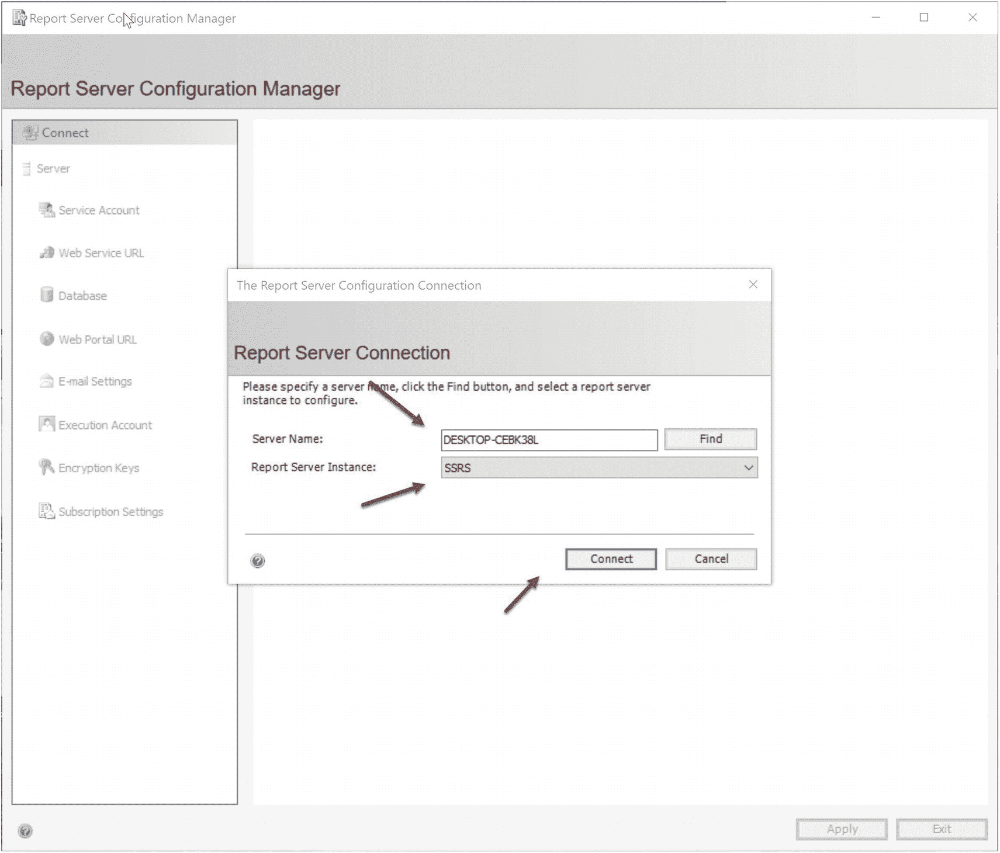
“报表服务器配置管理器”弹出面板的屏幕截图。两个箭头指示要指定的服务器名称并选择一个报表服务器实例。底部的“连接”按钮高亮显示。
图 12-39
查看报表

我总是忘记报表服务器的 URL。

如果您打开 `报表服务器配置管理器` 工具，您可以连接到服务器，然后查看 Web 报表门户的 URL，如图 12-40 所示。

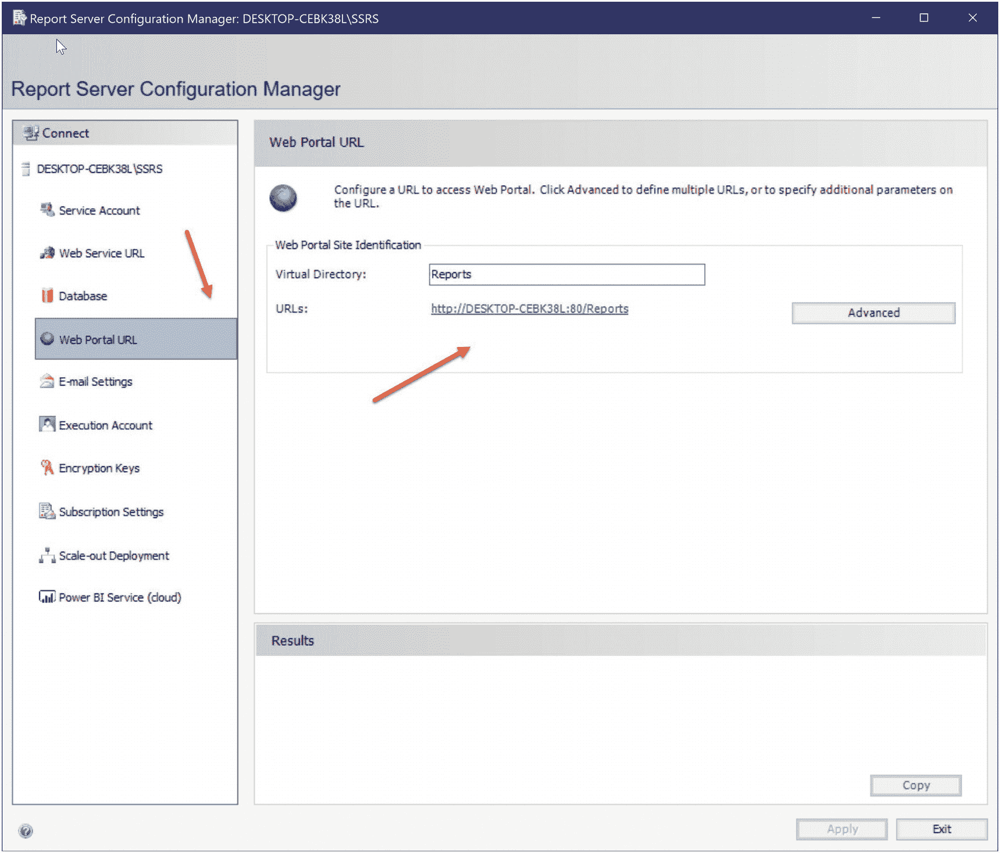
“报表服务器配置管理器”弹出面板的屏幕截图。一个箭头指示要配置以访问 Web 门户的 U R L。一个“高级”按钮允许定义多个 U R L。
图 12-40
访问 Web 门户

只需点击 URL 即可导航到该网页。您将在浏览器中看到以下页面。

请参阅图 12-41。

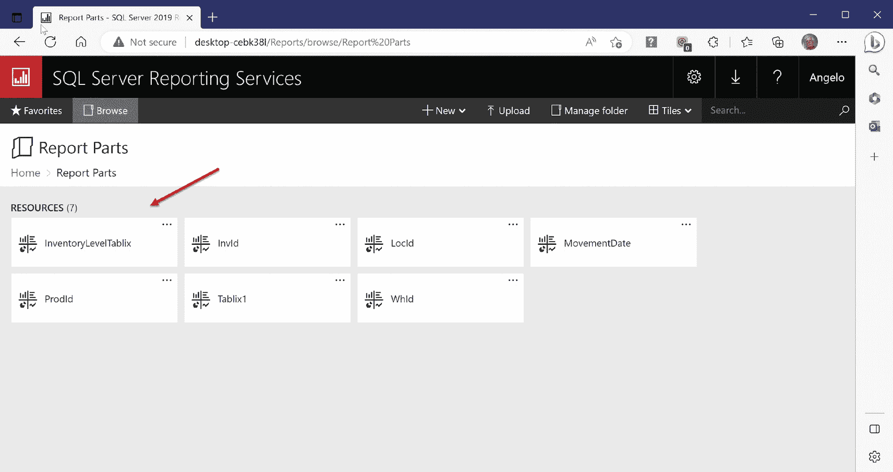
一个网页的屏幕截图，显示了 SQL Server Reporting Services 的主页。一个箭头指示在 7 个报表部件资源下的“库存水平 Tablix”。
图 12-41
报表部件已加载

我们看到这个报表以及其他报表的所有部件都在那里。如果我们导航到 `浏览` 选项卡，我们也会看到报表。在我们的案例中，我们需要上传它们。点击菜单栏中的 `上传` 按钮。

但在我们这样做之前，请回到 Report Builder 设计器，如果您忘记保存或更改了部件，请保存您的报表。如果您像我们之前那样保存了报表，我们就可以继续了。如果没有，请查看以下屏幕截图。

请参阅图 12-42。

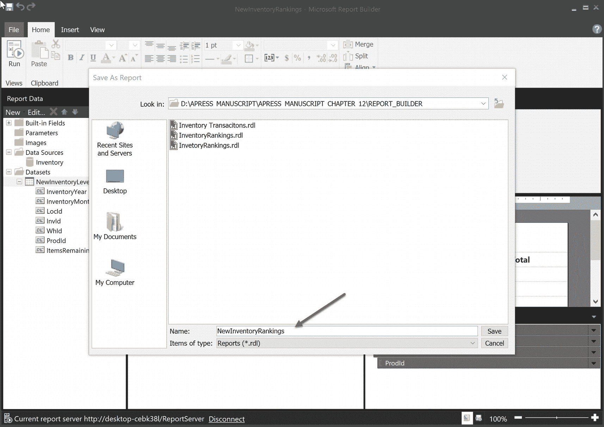
Microsoft Report Builder 主页的屏幕截图。它显示了保存报表的步骤。一个箭头指示输入报表名称为“新库存排名”。
图 12-42
上传前保存 Report Builder 报表

点击 `文件` 选项卡，然后点击 `另存为`。在对话框中选择一个合适且唯一的名称，然后点击 `保存`。确保将其放在专用文件夹中，以便您能记住名称！

实际上，我在生成本节图像时忘记了这一步，所以我不得不在这里执行此操作，所以不妨再审阅一遍。这样您就永远不会忘记了。

现在我们可以上传报表了。

请参阅图 12-43。

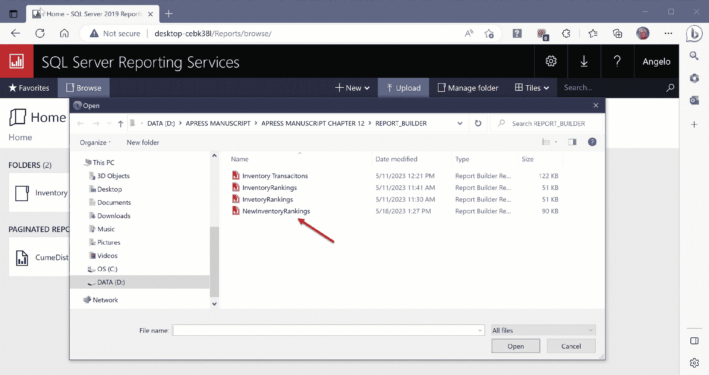
一个网页的屏幕截图，显示了 SQL Server Reporting Services 的主页。一个箭头指示在弹出面板中浏览后，在数据 D 盘中选择大小为 90 k b 的“新库存排名”文件，点击“打开”。
图 12-43
上传报表

点击您保存的新文件，然后点击 `打开` 按钮。您将收到一条消息，提示正在加载，随后是加载完成的消息。报表应按照以下屏幕截图出现在浏览器中。

请参阅图 12-44。

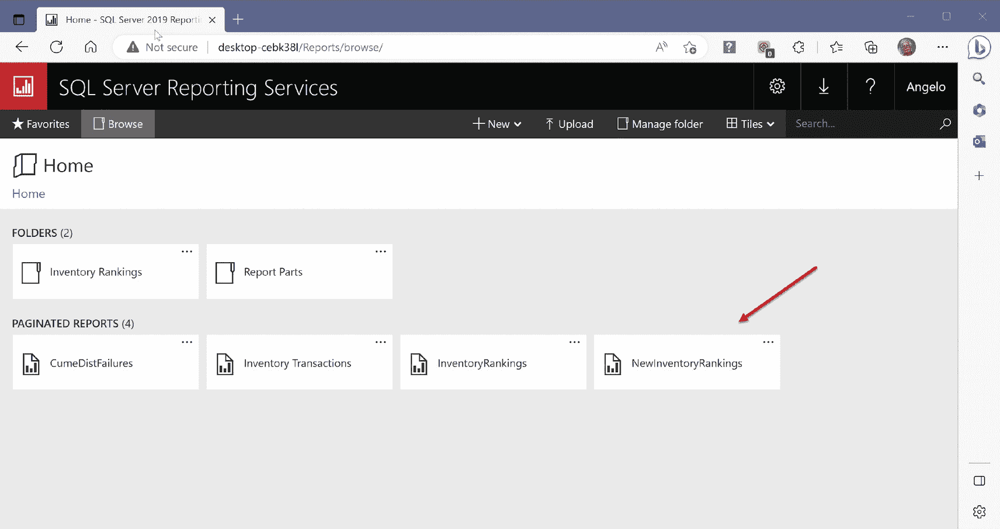
一个网页的屏幕截图，显示了 SQL Server Reporting Services 的主页。它显示了 2 个文件夹（库存排名、报表部件）和 4 个分页报表，其中一个箭头指向“新库存排名”。
图 12-44
报表已添加，第 1 部分

成功，这奏效了。让我们点击报表看看。

请参阅图 12-45。

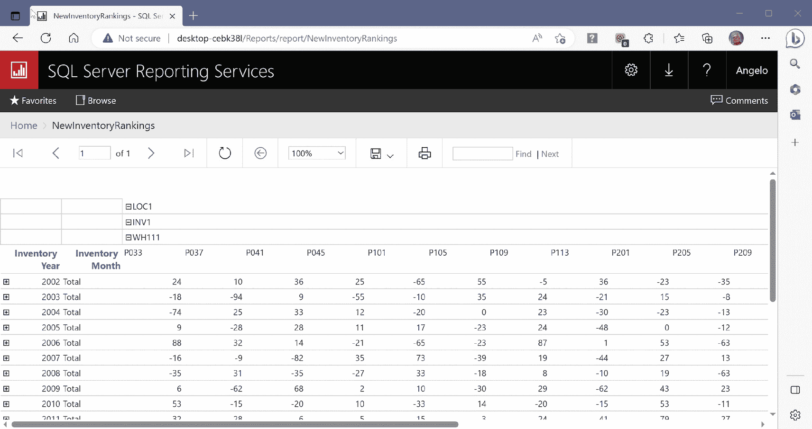
一个网页的屏幕截图，显示了 SQL Server Reporting Services 的主页。它显示了一个“新库存排名”表，该表包含库存年份、库存月份、P 033、P 037、P 041、P 045、P 101、P 105、P 109、P 113、P 201、P 205 和 P 209 等列。
图 12-45
报表已添加，第 2 部分

看起来不错。让我们点击 2002 年的 `库存年份` 节点以显示各月份的结果。顺便说一下，这被称为 `向下钻取`。再次点击节点可 `向上钻取`。

请参阅图 12-46。

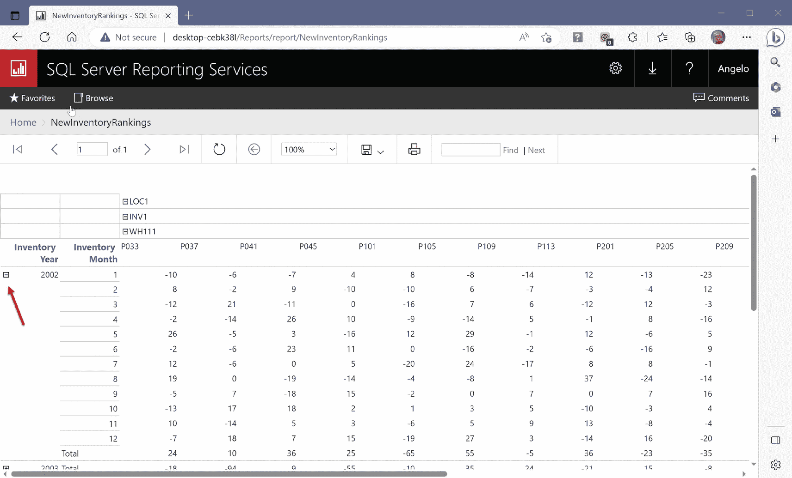
SQL Server Reporting Services 主页的屏幕截图。“新库存排名”表包含库存年份、库存月份、P 033、P 037、P 041、P 045、P 101、P 105、P 109、P 113、P 201、P 205 和 P 209 等列。一个箭头指示点击 2022 年的库存年份节点。
图 12-46
按月份向下钻取

这也成功了。我们现在有了所有产品按月份汇总的数据。使用滚动条查看所有年份或产品。请自行尝试一下。我们仅触及了该工具功能的皮毛。可以包含诸如 `折线图`、`条形图` 或 `饼图` 之类的图表，您还可以设计非常出色的 `计分卡` 和 `仪表板`，并将它们发布到 `SSRS` 站点。

让我们看一下我们 BI 工具包中的另一个工具，名为 `Power BI`。


### 创建 Power BI 报告

在本节，我们将通过一个简要教程，展示如何创建并发布一份包含库存信息的报告与图表。我们将使用的工具是 Power BI 免费开发环境，以及用于开发目的的免费 Power BI 服务器。这些工具可以从 Microsoft 相应网站获取，且易于安装。关于如何下载和安装这些工具，将在第 14 章中说明。

让我们开始导览，了解如何利用这些功能来创建复杂的报告、计分卡和仪表板。

请参阅图 12-47。

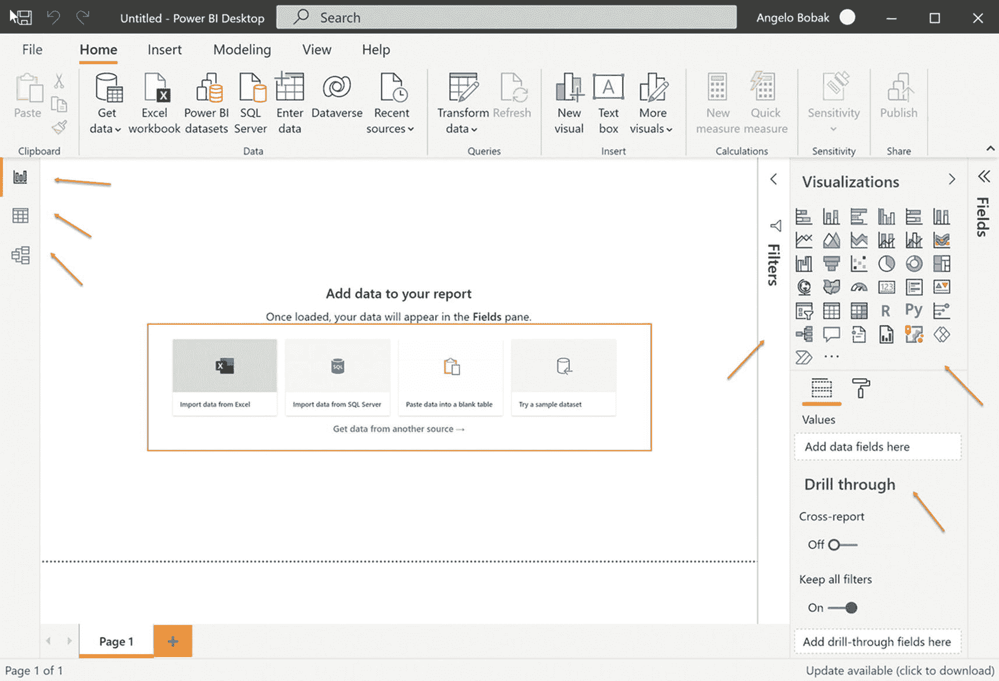

Power BI Desktop 窗口主页的截图。箭头指向左侧的三个图标，右侧的可视化面板（包含各种图表和图形的图标），以及下方的一个向下钻取部分。中间面板是用于向报告添加数据的设计面板。

图 12-47

#### 导览概览

从桌面启动 Power BI 后，您将看到此屏幕。图中突出显示了我们将要使用的主要工具组件。从左侧开始，我们看到一个面板，其中包含用于创建报告、查看数据和视图，以及根据您将连接的数据源创建或修改模型的工具。该模型看起来很像我们在创建 `SSAS` 多维数据集时生成的 `星型` 或 `雪花` 模式。

中间面板将是您的设计面板，您在此创建报告、仪表板或计分卡。您的项目实际上可以包含这些内容的任意组合或全部，因为您可以创建多个页面，每个页面都有一个独特或相关的报告或可视化内容。

在右侧，您会看到一个 `可视化` 面板，其中包含您可以创建的所有不同图表和图形的图标。最后，筛选器部分允许您识别数据中的列，这些列将用于在报告或图形数据中向上和向下钻取。当您向下钻取时，图表值将相应地改变，以对应数据聚合层次结构中的不同级别和聚合。

好了，我们如何构建这个呢？

第一步是为您的图表和报告定义数据源。听起来很熟悉，就像我们创建 `SSAS` 数据集、`SSIS` ETL 包或 Report Builder 报告时那样？

#### 定义数据源

请参阅图 12-48。

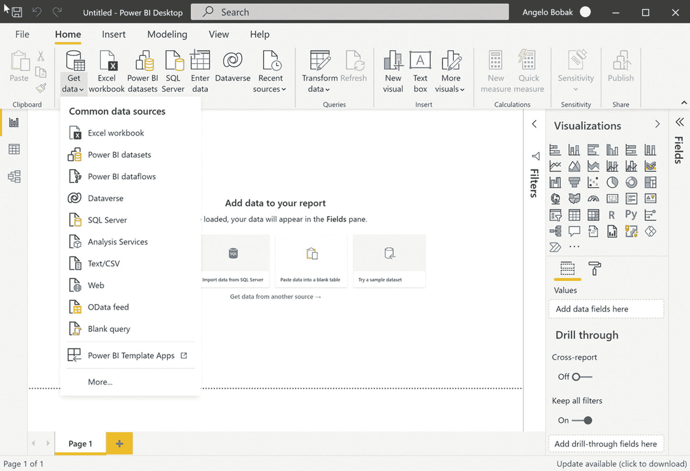

Power BI Desktop 窗口主页的截图。通过点击顶部菜单栏中的“获取数据”选项，列出了常见的数据源。

图 12-48

常见可用数据源

点击菜单栏左侧的 `获取数据` 选项，会生成一个我们可以连接的常见数据源列表。在我们的情况下，我们对 Analysis Services 感兴趣，因此让我们点击它，以便定义连接和数据库（在我们的例子中是一个 `SSAS` 实例和数据集）。

请参阅图 12-49。

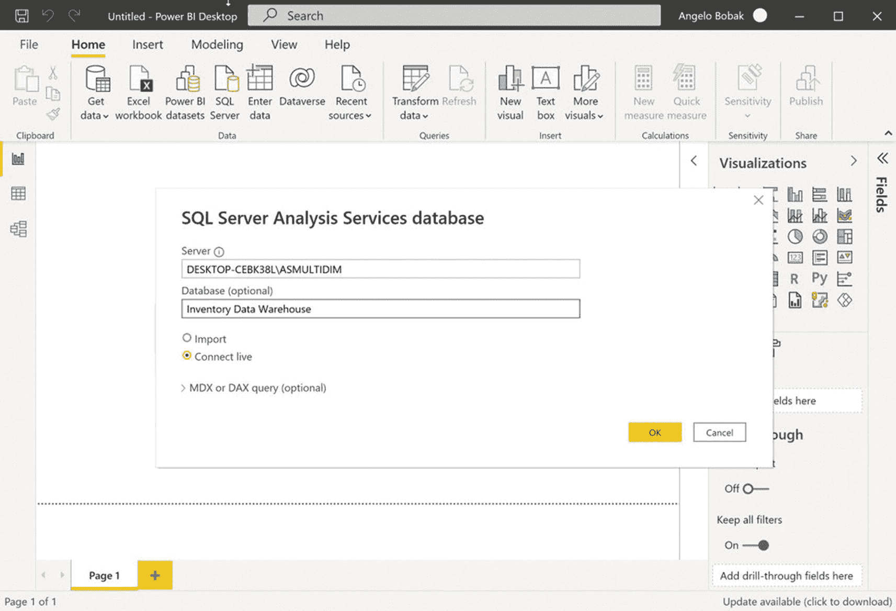

Power BI Desktop 窗口主页的截图。它显示了 SQL Server Analysis Server 数据库面板。可以输入服务器名称和数据库名称。“确定”按钮被高亮显示。

图 12-49

定义连接并指定数据库

在此面板中，我们需要指定服务器（这是我笔记本电脑上的一个 `SSAS` 实例）以及我们在第 11 章中之前创建的库存数据仓库数据集。我们点击“实时连接”单选按钮，然后点击“确定”按钮以进入下一步。

**注释**

我认为这很神奇：您可以在笔记本电脑或台式机上创建一个开发环境，其中包含数据库服务器、`SSAS` 服务器、`SSIS` 服务器、`SSRS` 服务器及其网站，以及 PowerBuilder 服务器及其网站。如果您立志成为一名 SQL Server 数据架构师，那么您能学习的东西是无穷无尽的。

#### 查看数据模型

接下来，我们将查看作为报告和可视化基础的数据模型。

请参阅图 12-50。

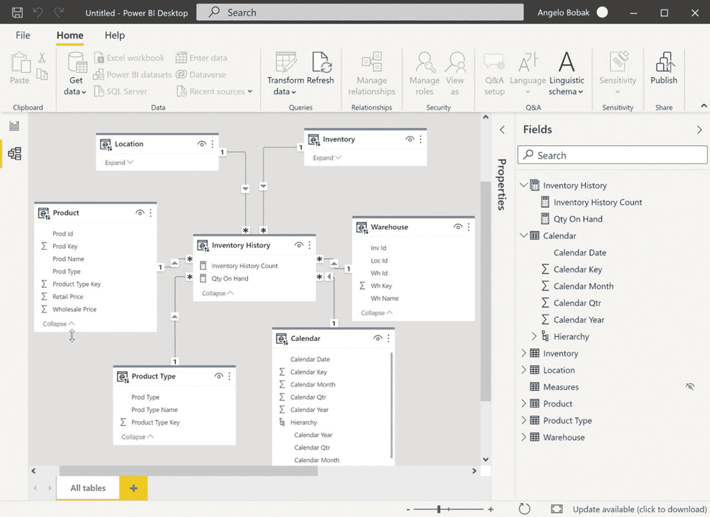

Power BI Desktop 窗口主页的截图。右侧的层次属性结构，通过点击左侧的数据模型图标，在中心以简单的星型模式呈现，包含诸如位置、库存、库存历史和产品类型等块。

图 12-50

多维模型

连接到 `SSAS` 实例和所需的数据集后，我们可以点击屏幕左侧的数据模型图标来查看该数据集的多维模型，该模型看起来像一个简单的 `星型` 模式。回想一下，这看起来像我们在 Visual Studio 中基于 `SSAS` 创建多维数据集时所创建的模型。

模型看起来很好，因此我们在这里无需做什么。我们可以开始创建报告了。

#### 创建报告

请参阅图 12-51。

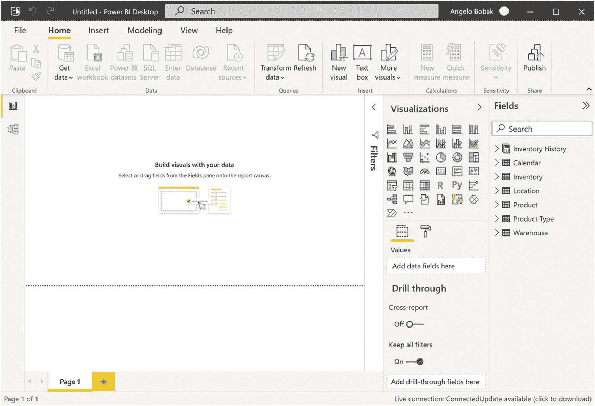

Power BI Desktop 窗口主页的截图。它通过点击左侧的条形图图标，解释了如何在项目中的多个页面上创建多个报告和图表。

图 12-51

一切就绪，准备开始

是的，我们准备好了！

我们需要开始将数据列添加到我们的设计区域，以便可以开始创建报告和图表。请注意，此选项卡名为“第 1 页”。您可以在项目中的多个选项卡上创建多个报告和图表。这些可以发布到 Power BI 服务器。在最后一章中，我将简要讨论如何下载和安装 Power BI 服务器的开发人员版。

**提示**

数据可视化设计领域的专家指出，人脑只能处理大约十个信息块。将您的可视化内容分散到多个页面中，以便用户可以轻松地在它们之间跳转。不要试图把所有东西都塞到一个页面上。我在现实生活中见过太多这样的情况，结果就是那些需要加载数小时、然后让用户挠头的可视化效果。颜色可能不错，但就实用性而言，也就仅此而已了。

回到我们的报告设计。让我们开始添加列以创建基本报告。

请参阅图 12-52。

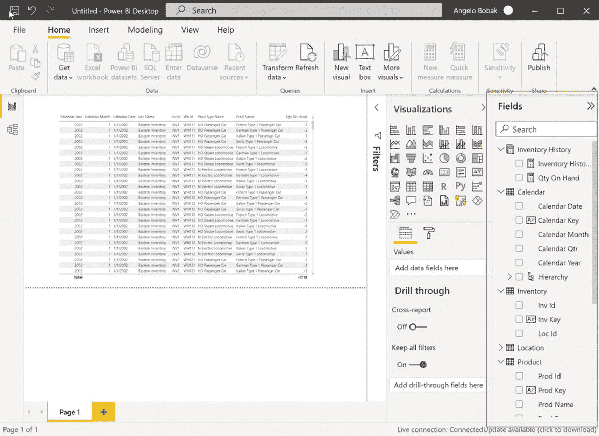

Power BI Desktop 窗口主页的截图。它以表格形式呈现了一个简单的数据报告，该表格有 9 列。右侧屏幕上的字段层次结构面板用方框高亮显示。

图 12-52

创建简单的数据报告

连接后，所有维度表和事实表及其列都会在右侧的“字段”面板中可用。我们在此设计阶段的目标是创建一个简单的数据转储报告，其中包含所有关键维度键（不是代理键）、直到产品标识符级别的现有库存数量，以及位置、库存和仓库信息。在这个阶段，我们不希望用户查看代理键。这些对他们来说毫无意义。

#### 创建图表

现在，我们准备基于 Power BI `可视化` 部分中众多图标之一来创建图表。让我们看一个例子并解释它是如何创建的。

请参阅图 12-53。

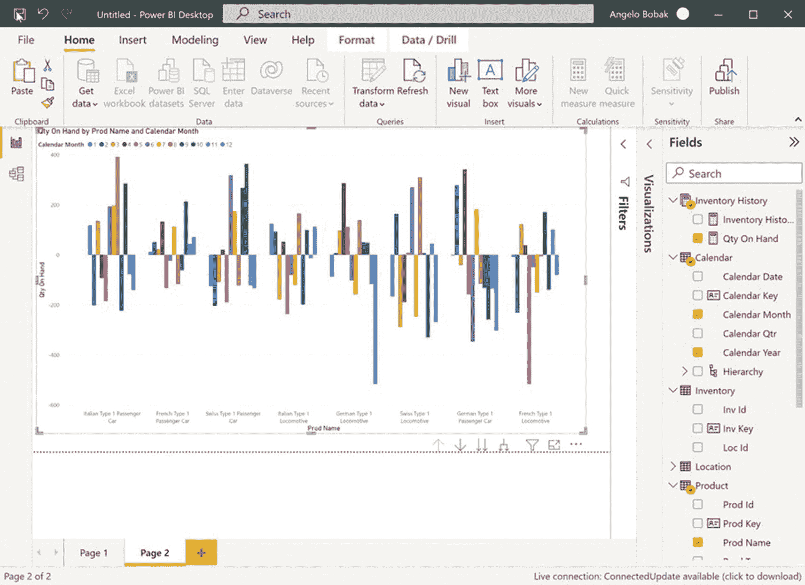

Power BI Desktop 窗口主页的截图。它以正负条形图的形式呈现数据报告。右侧的字段面板高亮显示了图中使用的参数。

图 12-53

创建可视化图表


