# 13. 库存用例：分析函数

恭喜！你已经学到了关于窗口函数的最后一章。我们确实还有最后一章，即第 14 章，这是一个总结章节，包括对我们所使用工具的回顾，以及如何获取它们。

### 总结

这是我们的倒数第三章。我希望你觉得它有趣。我们将排名窗口函数应用于我们的库存数据库和库存数据仓库，以充分测试这些函数的性能。我们执行了常规的性能分析。此外，我们还使用报表生成器创建了一个`SSRS`报表，并将其发布到了`SSRS`网站上。

最后，我们创建了一个简单的 Power BI 报表和仪表板，以便我们学习如何使用这个强大的工具，并将其添加到我们的 SQL Server BI 工具箱中。

我们下一章，也是最后一章，将把分析窗口函数应用于我们的库存数据。这应该会很有趣，所以休息一下，泡杯咖啡，我们下一章再见。

还有一句话：你的 SQL Server BI 工具包现在包括了聚合函数、排名函数和分析函数；用于创建报表、多维数据集和 ETL 项目的 Visual Studio Community 版本及`SSAS`和`SSRS`组件；以及 Power BI 和 SSIS、SSAS、SSRS 及 Power BI 服务器。我差点忘了还有 Microsoft Excel，你可以用它来创建带有图表和数据透视表的报表。

请参考图 12-59。

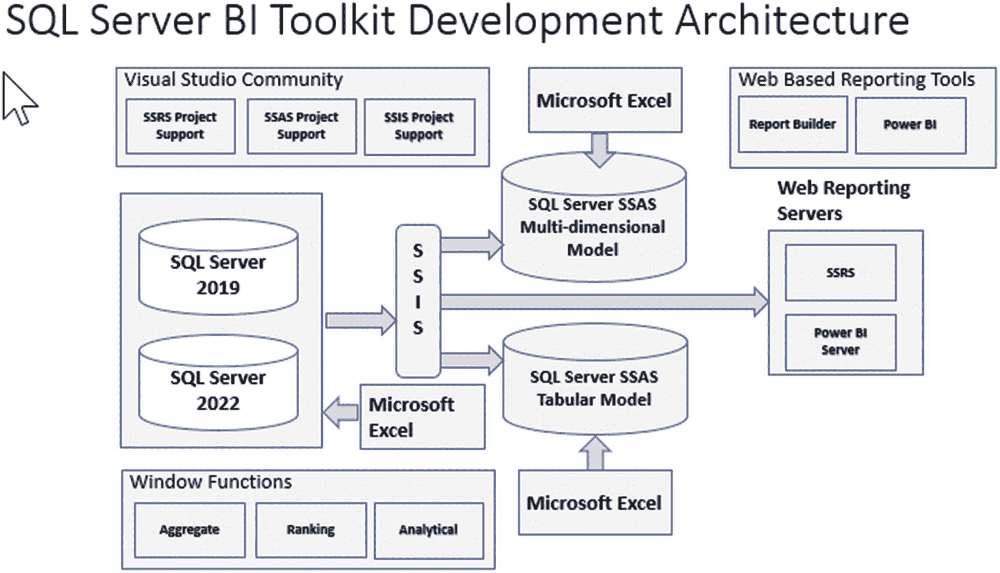

一个 SQL Server BI 工具包开发架构的流程图。它主要由 Visual Studio 社区版、基于 Web 的报表工具、SQL Server SSAS 多维和表格模型、Web 报表服务器、SQL Server 2019 和 2022 以及窗口函数组成。

**图 12-59** 你的 SQL Server BI 工具包

我该说什么呢，这套用于 BI 项目和职业技能组合的开发工具非常令人印象深刻。对于任何想要成为 SQL Server 数据架构师、分析师或开发者的人来说，这些工具和技能都是必须掌握的。

我将在我们的最后一章，即第 14 章中，告诉你如何获取、安装和配置所有这些组件。

## Power BI 操作与发布

这一步非常简单。在页面 1 上，右键单击数据报表，从下拉菜单中选择“复制”。打开第二个页面，将数据报表粘贴到设计区域。接下来，点击一个可视化图表类型，将其拖放到数据报表上。你的数据报表现在就转换成了你选择的视觉图表。

至少就创建基本报表和图表而言，就是这么简单。这个工具非常强大，允许你创建筛选器、向下钻取等功能。学习这个工具可能需要一整本书，但有了这些基本说明，你就可以开始了。网上也有大量很棒的付费课程，但获取知识总是有代价的。

接下来，我们看看如何向下钻取报表内容。

请参考图 12-54。

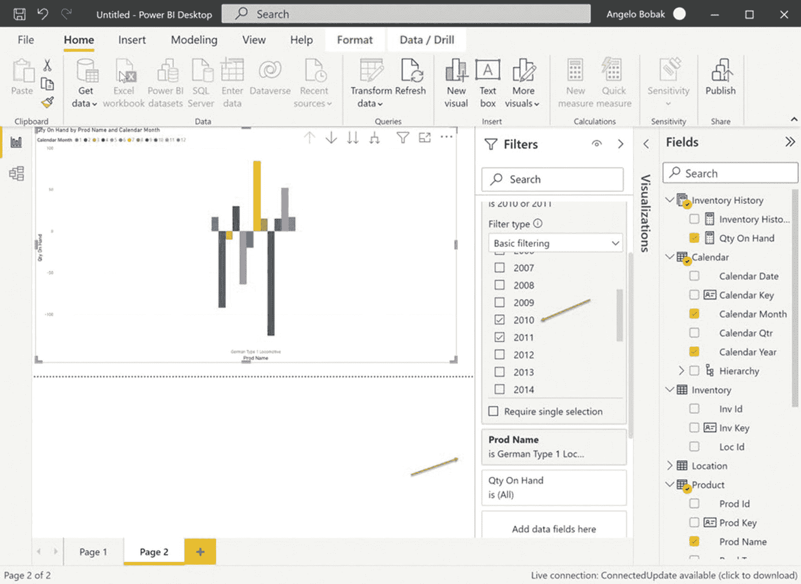

一张 Power BI Desktop 窗口主页的截图。它以正负条形图的形式呈现了一个数据报表。箭头指向筛选类型中的“2010”以及筛选器下的一个产品名称。字段面板高亮显示了图中使用的参数。

**图 12-54** 定义筛选器

我确实提到了向下钻取的功能和特性。默认情况下，如果你查看基本筛选面板，你可以点击或取消勾选你想要查看的数据字段。这里我们筛选了“2010”和“2011”年份，以及一个单一产品“德国 1 型机车”。只需勾选相应的复选框，可视化图表就会改变以表示更小的数据范围（这被称为切片和切块）。

让我们再看一个你可以创建的可视化图表，这次是用饼图。

请参考图 12-55。

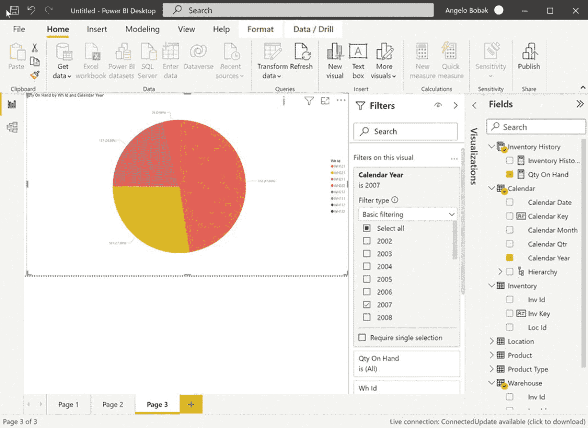

一张 Power BI Desktop 窗口主页的截图。它以一个有 4 个扇区的饼图形式呈现了一个数据报表。在筛选器下的年份筛选类型中，“全选”选项被勾选。字段面板高亮显示了图中使用的参数。

**图 12-55** 饼图，2007 年库存数量

只需将一个饼图图标从可视化部分拖放到一个新页面上的数据报表副本上，数据就变成了上图所示的饼图。你的报表现在有三页，包括一个老式的行列报表和两个图表。所有这些只需几个步骤就完成了。

剩下的就是将报表发布到 Power BI 服务器。

请参考图 12-56。

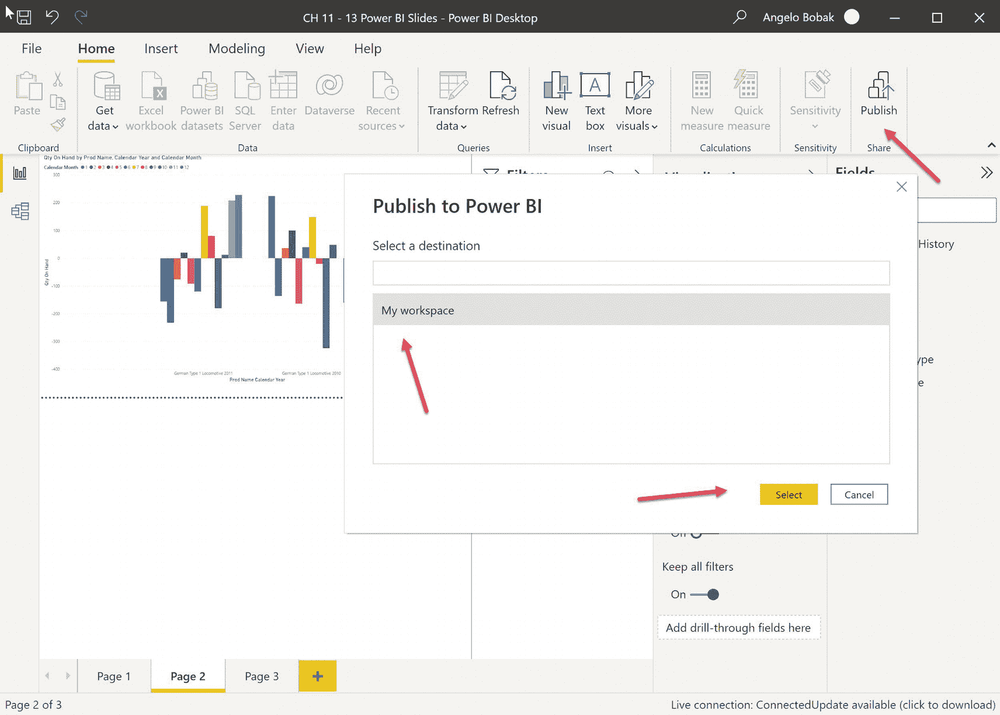

一张 Power BI Desktop 窗口主页的截图。它呈现了一个正负条形图。三个箭头分别指向顶部菜单栏中的发布按钮、“发布到 Power BI”弹出窗口中的目标位置“我的工作区”，以及点击“选择”按钮。

**图 12-56** 发布你的报表和图表

发布报表很简单，类似于我们之前将报表发布到 SSRS 的操作。只需点击菜单栏右侧的“发布”按钮，就会出现一个标记为“发布到 Power BI”的弹出面板。

**提醒**

别忘了将刚刚创建的 Power BI 报表保存到一个容易记住的文件夹中，并取一个能反映报表内容的名字！你懂的。转到“文件”选项，选择“另存为”等。

你会看到可用的目标位置。在我的开发环境中，这里只有一个叫做“我的工作区”。

点击它进行选择，然后点击“选择”按钮。你会看到一条消息，提示正在发布。完成后，打开浏览器并输入你的 Power BI 门户 URL。

请参考图 12-57。

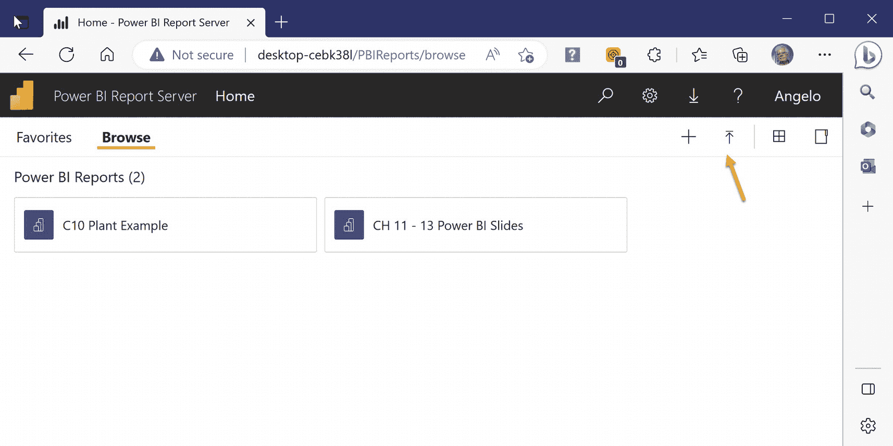

一张截图展示了 Power BI 报表服务器的主页，选择了“浏览”选项卡。它展示了 2 个 Power BI 报表：“C10 工厂示例”和“CH11 至 13 Power BI 幻灯片”。一个箭头指向菜单栏右上角的上传箭头。

**图 12-57** 服务器上的报表和图表

一旦你发布了 Power BI 报表，你会在“浏览”选项卡中看到它。上传报表与将`SSRS`报表上传到`SSRS`门户的操作相同。点击菜单栏右上角出现的上传箭头，导航到包含你新的 Power BI 报表的文件夹。点击它，你应该能看到报表，如下所示。

请参考图 12-58。

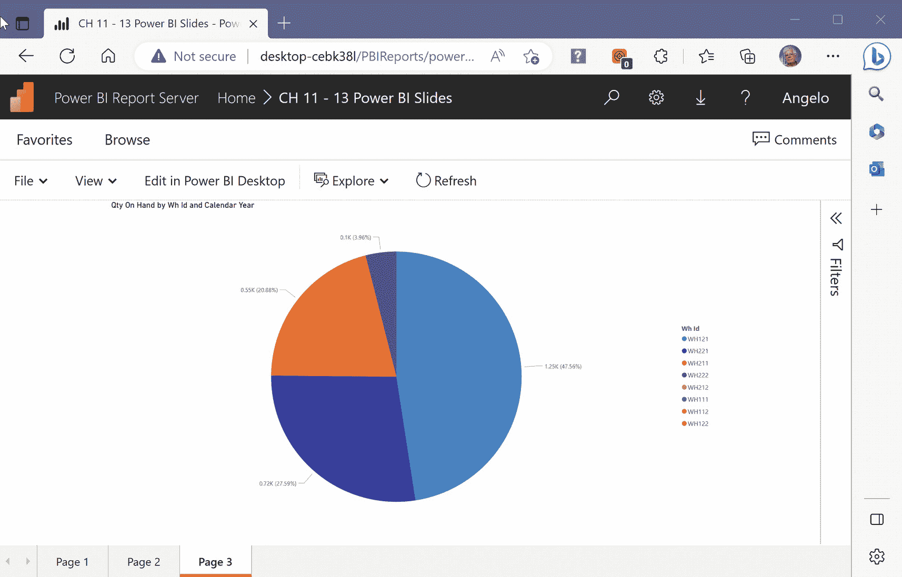

一张 Power BI 报表服务器主页的截图。它呈现了一个有 4 个扇区的饼图，“CH11 至 13 Power BI 幻灯片”。

**图 12-58** 上传你的报表和图表

就是这样。我们的饼图看起来不错，不算寒酸。

以黑白方式呈现可能不太令人印象深刻，但如果你是以电子书格式阅读本书，你会看到彩色的。

就是这样了。我们介绍了一些基本步骤，创建了一个简单的三页报表（如果你愿意，也可以称之为仪表板），并将其发布到了你笔记本电脑、台式机或开发环境上的个人 Power BI 服务器上。

在我们的最后一章，即第 14 章，我将包含一节关于如何下载和安装`SSRS`及 Power BI，以及如何配置每个组件的内容。大多数情况下，你只需保持默认设置即可。你唯一需要填写的是选择一个 SQL Server 实例，以便为`SSRS`和 Power BI 创建专用的数据库。


## 分析函数

以下是你现在应该已经熟悉的窗口分析函数，除非你直接从第 1 章跳到本章，因为你的职业重点是库存管理：

*   `CUME_DIST()`: 不支持窗口帧
*   `FIRST_VALUE()`: **支持窗口帧**
*   `LAST_VALUE()`: **支持窗口帧**
*   `LAG()`: 不支持窗口帧
*   `LEAD()`: 不支持窗口帧
*   `PERCENT_RANK()`: 不支持窗口帧
*   `PERCENTILE_CONT()`: 不支持窗口帧
*   `PERCENTILE_DISC()`: 不支持窗口帧

正如我们所看到的，只有两个函数支持窗口帧规范。其余的不支持窗口帧。当你根据本章的描述理解了这些函数的工作原理后，这是合理的。

我认为这些函数在库存分析中很重要，特别是 `LAG()` 和 `LEAD()` 函数，它们可以用来深入获取历史库存移动数据。

最后，我们将执行通常的性能分析，包括基线估计查询计划和 `IO` 与 `TIME` 统计信息。我们还将做一些新的事情；我们将收集所有分析函数的 `IO` 和 `TIME` 统计信息，并将其绘制成图表以检查相似性以及消耗大量资源的函数。

**提示**

我建议你对本书中讨论的另一类函数也执行这最后一项活动，以便真正理解它们如何影响你的环境。这将使你大致了解何时可以使用普通的 `CTE` 块，或依赖报告表甚至内存增强表的一些反规范化。

### CUME_DIST( ) 函数

回顾第 7 章和第 10 章，该函数计算一个值在数据集（如表、分区或加载了测试数据的表变量）中的相对位置。它计算一个随机值（如故障率）小于或等于特定设备故障率的概率。它是累积的，因为在计算特定值的唯一值时，它会考虑所有值。

如果你对此有点不确定，请回到第 7 章或附录 A，复习该函数的工作原理和应用方式。

让我们开始吧。以下是我们业务分析师朋友提供的业务规范：

需要创建一个仓库报告，显示“2002”年、产品“P101”、地点“LOC1”、库存“INV1”和仓库“WH112”的累积分布值。（为了节省空间，我没有使用这些名称。如果你好奇，请查看这些的主数据表。）

换句话说，对于一年中的每个月，平均值小于或等于当前月的百分比是多少？如果当前月份是“八月”，并且平均库存数量是“46”，那么其他值中小于或等于此值的百分比是多少？

详细的日历信息，如年、季度和月份，需要出现在报告中。日历季度和月份需要拼写出来，数字月份值需要包含在内，以便可以在我们用于生成结果图表的 Microsoft Excel 电子表格中用于排序。

这些要求有很多细节。希望到目前为止你已经习惯于接收书面要求并将其转化为一些 `TSQL` 代码。这是工作环境中的典型情况。有时你会得到非常模糊的要求。有时你会在电话中收到语音留言，给你口头要求。这些总是很有趣。

以下是我们想出的方案。请参考清单 13-1。

```sql
WITH YearlyWarehouseReport (
    AsOfYear,AsOfQuarter,AsOfMonth,AsOfDate,LocId
    ,InvId,WhId,ProdId,AvgQtyOnHand
)
AS
(
    SELECT AsOfYear
        ,DATEPART(qq,AsOfDate) AS AsOfQuarter
        ,AsOfMonth
        ,AsOfDate
        ,LocId
        ,InvId
        ,WhId
        ,ProdId
        ,AVG(QtyOnHand) AS AvgQtyOnHand
    FROM Product.Warehouse
    GROUP BY AsOfYear
        ,DATEPART(qq,AsOfDate)
        ,AsOfMonth
        ,AsOfDate
        ,LocId
        ,InvId
        ,WhId
        ,ProdId
)
SELECT AsOfYear
    ,AsOfQuarter
    ,CASE
        WHEN DATEPART(qq,AsOfDate) = 1 THEN '1st Quarter'
        WHEN DATEPART(qq,AsOfDate) = 2 THEN '2nd Quarter'
        WHEN DATEPART(qq,AsOfDate) = 3 THEN '3rd Quarter'
        WHEN DATEPART(qq,AsOfDate) = 4 THEN '4th Quarter'
    END AS AsOfQtrName
    ,AsOfMonth
    ,CASE
        WHEN AsOfMonth = 1 THEN 'Jan'
        WHEN AsOfMonth = 2 THEN 'Feb'
        WHEN AsOfMonth = 3 THEN 'Mar'
        WHEN AsOfMonth = 4 THEN 'Apr'
        WHEN AsOfMonth = 5 THEN 'May'
        WHEN AsOfMonth = 6 THEN 'June'
        WHEN AsOfMonth = 7 THEN 'Jul'
        WHEN AsOfMonth = 8 THEN 'Aug'
        WHEN AsOfMonth = 9 THEN 'Sep'
        WHEN AsOfMonth = 10 THEN 'Oct'
        WHEN AsOfMonth = 11 THEN 'Nov'
        WHEN AsOfMonth = 12 THEN 'Dec'
    END AS AvgMonthName
    ,AsOfDate
    ,LocId
    ,InvId
    ,WhId
    ,ProdId
    ,AvgQtyOnHand AS MonthlyAvgQtyOnHand
    ,CUME_DIST() OVER (
        PARTITION BY AsOfYear
        ORDER BY AsOfMonth ASC
    ) AS RollingYearCume
FROM YearlyWarehouseReport
WHERE AsOfYear = 2002
    AND ProdId = 'P101'
    AND Locid = 'LOC1'
    AND InvId = 'INV1'
    AND WhId = 'WH112'
GO
```
**清单 13-1**
月平均值的累积分布

为了满足日历日期部分的要求，需要两个 `CASE` 块来将数字季度和月份值解码为各自的文本值（1 = January 且 1 = 1st Quarter 等）。


`OVER()` 子句包含一个 `PARTITION BY` 子句，该子句按年份设置分区。目前这并非必需，因为我们已经在 `WHERE` 子句中筛选了年份“2002”，但如果我们包含更多年份，就需要保留它。顺便说一句，这似乎不影响性能。尝试运行包含和不包含年份在 `PARTITION BY` 子句中的估计查询计划。

最后，包含一个 `ORDER BY` 子句，该子句按 AsOfMonth 列对分区进行排序。让我们查看结果，然后使用 Microsoft Excel 创建图表。

## 作业

修改查询，使其从新的增强型日历表中检索日历季度和月份。同时，修改查询，使结果针对所有年份进行计算。练习在 Microsoft Excel 中将每个结果集绘制成图，以创建跨年累积分布值的分析图。运行我们常规的估计查询计划以及 `IO` 和 `TIME` 统计信息分析，看看修改后的查询在包含了到日历表的 `JOIN` 后，性能是变好了还是变差了。最后，运行计划和 `IO/TIME` 统计信息以获取平均值。请确保在每次运行前执行 `DBCC`。

请参考图 13-1 中的部分结果。

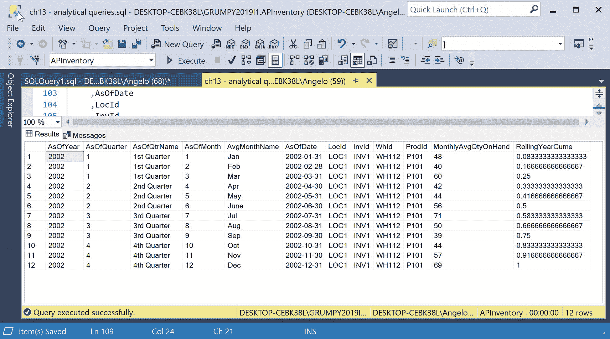

这是 SQL Server Management Studio (SSMS) 窗口的截图。其中有一个包含 13 列和 13 行的表格。列标题分别为：截至年份、截至季度、季度名称、截至月份、月份名称、截至日期、仓库 ID、库存 ID、货位 ID、产品 ID、月平均库存数量、滚动年累计。

图 13-1
月平均库存的累积分布分析

由于 `PARTITION BY` 子句指定 `ORDER BY` 子句按月份排序，RollingYearCume 值按升序排列，我们可以清楚地看到累积分布将生成一条漂亮的上弯曲线。让我们将此结果复制到 Microsoft Excel 电子表格中。

请参考图 13-2。

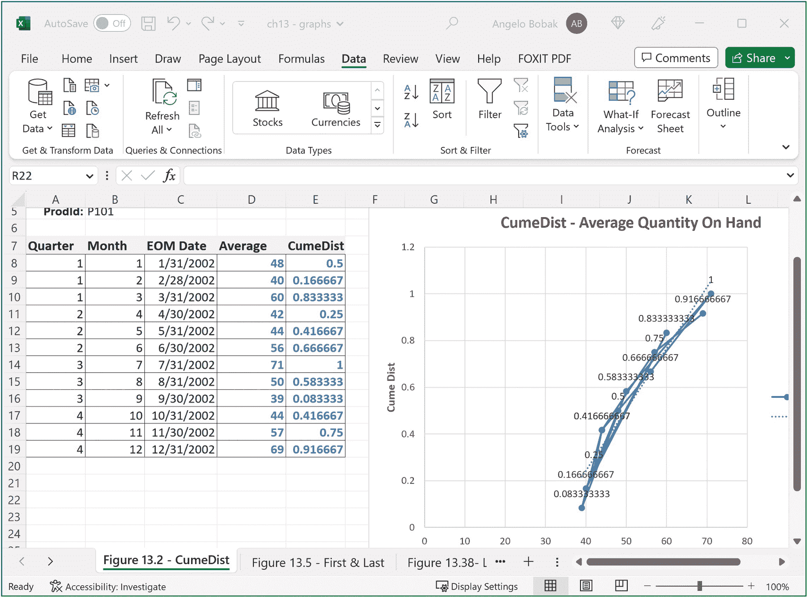

这是 Microsoft Excel 窗口的截图。其中有一个包含 5 列和 13 行的表格。列标题分别为：季度、月份、月末日期、平均值、累积分布。图中还有一个累积分布与平均库存数量的折线图，显示出两条上升趋势。

图 13-2
累积分布，平均库存数量

我稍微修改了名称并添加了一些格式，使报告看起来更专业。结果现在按月份排序。我们可以看到一个有趣的上升趋势图。如果你想查看小于特定值的实际值及其出现时间，请按平均值对数据集进行排序，然后你可以看到这些值及其出现的月份。

查询性能和分析时间。

### 性能考虑

像往常一样，让我们首先按常规方式生成基线估计查询计划。

请参考图 13-3。

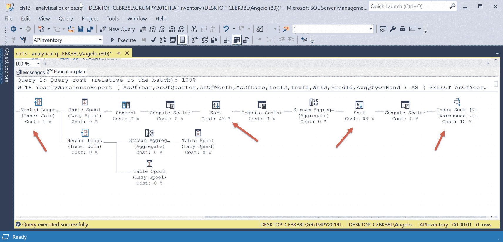

这是 SQL Server Management Studio (SSMS) 窗口的截图。它展示了一个包含 14 个组件的查询计划。这些组件是：嵌套循环成本、表假脱机、段、计算标量、排序、计算标量、流聚合、排序、计算标量、索引查找、嵌套循环、流聚合以及两个表假脱机。

图 13-3
平均库存数量的累积分布查询计划

我们将专注于计划的右侧。左侧的成本均为零，因此为了节省章节篇幅，我们将不讨论它们。但请务必自行审阅这些部分。此外，请务必将鼠标悬停在感兴趣的任务上以显示详细信息面板。作为开发人员或架构师，你需要成为查询性能调优方面的专家！

回到该计划，没有建议创建索引。因此我们有一个良好的开端。我们看到一个索引查找，成本为 12%（请记住，索引查找优于扫描）。下一个昂贵的任务是两个排序任务，合计占 43%；除了左侧的嵌套循环任务外，其余任务成本均为零。较低的分支也有零成本的任务，两个分支在一个嵌套循环（内连接）任务处汇合。

总的来说，这似乎是一个性能良好的查询。让我们看看 `IO` 和 `TIME` 统计信息。

请参考图 13-4。

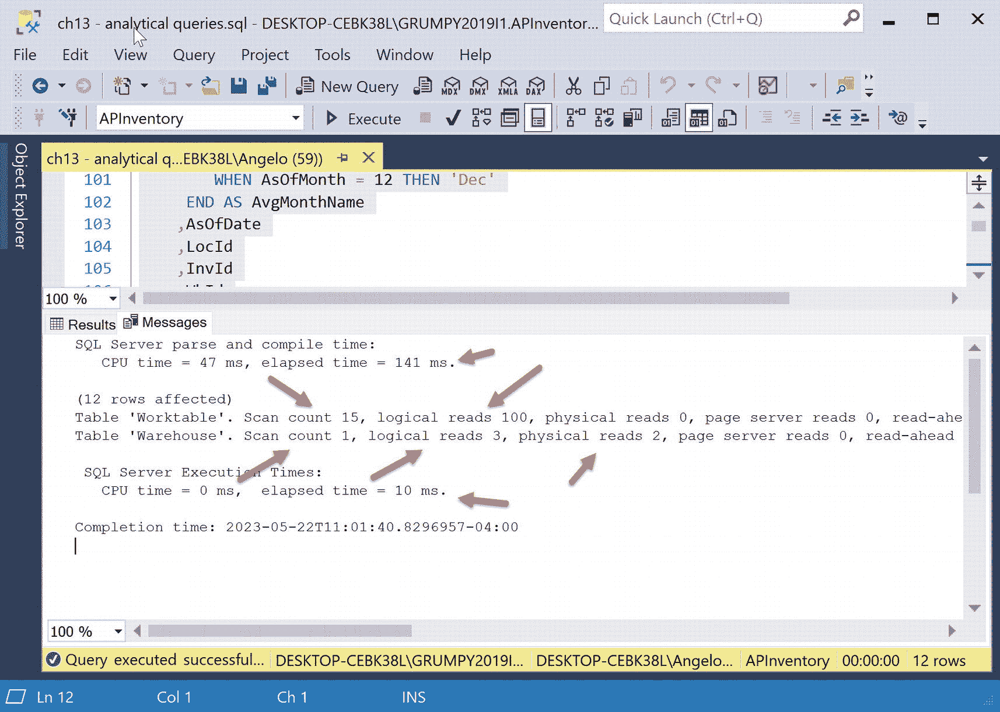

这是 SQL Server Management Studio (SSMS) 窗口的截图。文本显示了 IO 和 TIME 统计信息。SQL Server 解析和编译时间（CPU 和耗时）分别为 47 毫秒和 141 毫秒。SQL Server 执行时间（CPU 和耗时）分别为 0 毫秒和 10 毫秒。两个表受影响的行数为 12。

图 13-4
平均库存数量累积分布的 `IO` 和 `TIME` 统计信息

解析和编译耗时 141 毫秒，执行耗时 10 毫秒。可以看出，扫描计数为 15 次，逻辑读取为 100 次。Warehouse 表的扫描计数为 1，逻辑读取值为 3，物理读取值为 2（请记住这个模式 1-3-2；它还会再次出现）。

检查 Warehouse 表的行数，我们看到它包含 24,288 行。不算太大，但足以引发物理读取。

如果我们修改此查询，使其没有 `WHERE` 子句，就可以在 `SSRS` 报告中使用它。当存在益处时（例如 `CTE` 返回数十万行），我们需要考虑使用我们行之有效的报告表方法结合历史数据，也就是说，使用此查询的结果预加载表，这样当分析师使用网络报告时性能会很快。可能还需要添加一些索引来覆盖主数据列，如位置、库存等。此数据一次性加载所有可用记录，随着时间的推移，只加载新增或更新的记录。


### FIRST_VALUE( ) 与 LAST_VALUE( ) 函数

接下来我们要学习的是这两个窗口函数。还记得它们吗？

给定一组已排序的值，`FIRST_VALUE()` 函数将返回分区中的第一个值。因此，根据你是按升序还是降序排序，这个值会有所不同！

这是数据分区中第一个位置的值，不一定是数据集中的最小值。初次接触这个函数时，这一点很容易被误解。人们可能会错误地认为“first value（第一个值）”意味着最小值，而“last value（最后一个值）”意味着最大值。

接下来，给定一组已排序的值，`LAST_VALUE()` 函数将返回分区中的最后一个值。同样，根据你如何对分区进行排序，这个值也会如前所述那样发生变化。

这两个函数都会返回作为参数传入的任何数据类型。顺便说一下，这个参数可以是整数、字符串、日期等。如果这里有点不清楚，你可以创建一个自己的表变量，包含十行或更多行数据，然后写一些查询来测试，这样就能看到这些窗口函数是如何工作的。稍加练习，窗口函数的用法和结果就会变得清晰明了。

**提示**

在学习像这样的新函数时，总是使用小型、简单的数据集进行练习，这样函数的行为就能清晰地显现出来。此外，当你运行估计执行计划和统计数据时，这也有助于你理解查询的性能表现。没有什么比运行一个需要数小时、返回数百万行数据，最后才发现你所使用的逻辑是错误的查询更糟糕的了！

让我们直接来看示例。以下是我们的业务需求说明：

需要一份报告，按月显示我们指定的位置“LOC1”、库存“INV1”、仓库“WH112”和产品“P010”的平均库存水平是上升还是下降。结果需要是滚动计算的。也就是说，随着月份推移，我们想要获取该年第一个月和最后一个月的值。日历年份是 2002 年，所以我们需要在`WHERE`子句中指定它。

第一个值将是 1 月份的值，并且不会改变。随着分区增长，为了考虑下一个月，新月份的平均值将成为最后一个值。我们需要在逐月滚动时计算差值。

基于这些业务需求，我们想出了以下方案。我们将查看查询的基础部分，因为使用的`CTE`与之前的查询相同。请参考 `代码清单 13-2`。

```sql
/* CTE 此处省略 */
SELECT AsOfYear
,AsOfQuarter
,CASE
WHEN DATEPART(qq,AsOfDate) = 1 THEN '第 1 季度'
WHEN DATEPART(qq,AsOfDate) = 2 THEN '第 2 季度'
WHEN DATEPART(qq,AsOfDate) = 3 THEN '第 3 季度'
WHEN DATEPART(qq,AsOfDate) = 4 THEN '第 4 季度'
END AS AsOfQtrName
,AsOfMonth
,CASE
WHEN AsOfMonth = 1 THEN '一月'
WHEN AsOfMonth = 2 THEN '二月'
WHEN AsOfMonth = 3 THEN '三月'
WHEN AsOfMonth = 4 THEN '四月'
WHEN AsOfMonth = 5 THEN '五月'
WHEN AsOfMonth = 6 THEN '六月'
WHEN AsOfMonth = 7 THEN '七月'
WHEN AsOfMonth = 8 THEN '八月'
WHEN AsOfMonth = 9 THEN '九月'
WHEN AsOfMonth = 10 THEN '十月'
WHEN AsOfMonth = 11 THEN '十一月'
WHEN AsOfMonth = 12 THEN '十二月'
END AS AvgMonthName
,AsOfDate
,LocId
,InvId
,WhId
,ProdId
,AvgQtyOnHand AS MonthlyAvgQtyOnHand
,FIRST_VALUE(AvgQtyOnHand) OVER (
PARTITION BY AsOfYear
ORDER BY AsOfDate
) AS FirstValue
,LAST_VALUE(AvgQtyOnHand) OVER (
PARTITION BY AsOfYear
ORDER BY AsOfDate
) AS LastValue
,LAST_VALUE(AvgQtyOnHand) OVER (
PARTITION BY AsOfYear
ORDER BY AsOfDate
) -   FIRST_VALUE(AvgQtyOnHand) OVER (
PARTITION BY AsOfYear
ORDER BY AsOfDate
) AS Change
FROM YearlyWarehouseReport
WHERE AsOfYear = 2002
AND ProdId = 'P101'
AND Locid = 'LOC1'
AND InvId = 'INV1'
AND WhId = 'WH112'
GO
代码清单 13-2
滚动计算首尾值的月度平均值
```

我们使用了累计分布示例中的查询，并将 `CUME_DIST()` 函数替换为了 `FIRST_VALUE()` 和 `LAST_VALUE()` 函数。这是一个非常简单的修改。当你在日常工作中提出解决方案时，你会希望尽可能多地重用查询和脚本，以避免重复造轮子。这些是你可以重用和修改以满足新业务需求的工具箱组件、脚本和查询的其他示例。

**提示**

创建一个专用文件夹来存储你所有的脚本、模板和查询。这样，对于每个新的编码任务，它们都能随时可用。这些也是你工具箱的一部分！

两个 `OVER()` 子句都有一个 `PARTITION BY` 子句和一个 `ORDER BY` 子句。分区是按年份设置的，而 `ORDER BY` 子句是按 `AsOfDate` 而不是 `AsOfMonth` 设置的。`AsOfDate` 恰好是该月的最后一天，所以这样也能工作。为了避免查询逻辑上的混淆，我们本应该使用 `AsOfMonth` 值，但当前写法也能达到目的。

让我们看看结果。请参考 `图 13-5` 中的部分结果。

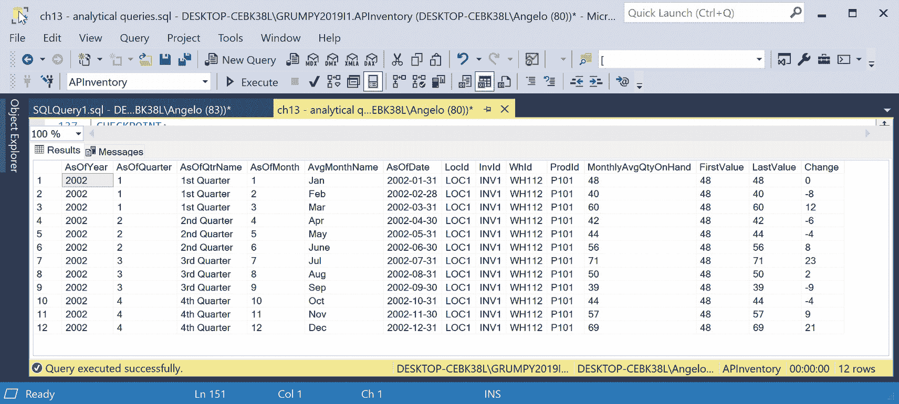

SQL Server Management Studio (SSMS) 窗口截图。图中显示一个包含 15 列 13 行的表格。列标题分别为：截止年份、截止季度、截止季度名称、截止月份、平均月份名称、截止日期、位置 ID、库存 ID、仓库 ID、产品 ID、月度平均值、首值、尾值和变化量。

`图 13-5`

月度平均库存量、首值和尾值

这些是很好的结果，分析师可以用来逐月分析平均库存变化。当然，这只是针对一年的数据，但你知道我们可以移除筛选条件，使用这个查询来填充一个报告表，该表可以被 `SSRS` 报告访问，允许用户设置适合他们希望分析的模式的过滤器。或者，也许可以将其用于 Excel 电子表格中的数据透视表，或用于 `SSAS` 多维数据集的非规范化表，甚至用于 `Power BI` 计分卡。

这就是性能调优如此重要的原因。为一年返回 12 行数据，与为多个地点、库存、仓库和产品返回成千上万行数据（这也容易验证）相比，差异巨大。

注意我们逐月计算的变化量。这些数据放在 Microsoft Excel 电子表格中会非常直观，所以我们来做一下常规的复制粘贴操作。

请参考 `图 13-6`。

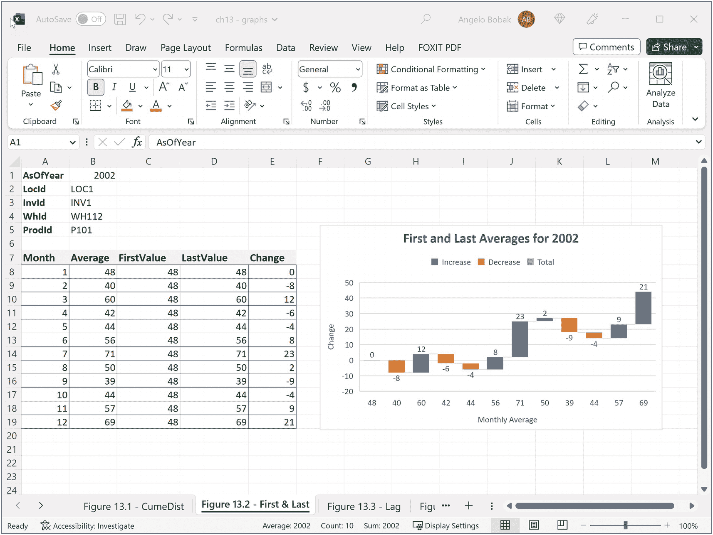

Microsoft Excel 窗口截图。图中显示一个包含 5 列 13 行的表格。列标题分别为：月份、平均值、首值、尾值和变化量。还有一个变化量相对于月度平均值的瀑布图，柱状图显示了波动上升的趋势，分别代表增加、减少和总量。

`图 13-6`

Excel 首尾值分析

这是另一项分析，能让业务分析师识别库存变动是上升还是下降，从而指示销售额是上升还是下降。如果库存增加而不是减少，那么销售分析师就需要与营销团队开会，了解产品为何未能售出而仍留在库存中。这涉及详细分析以找出销售额低的门店及其原因（如果你正在阅读电子书，这里的颜色会非常醒目）！

#### 性能考量

这是我们通常的基线估计执行计划。
请参考图 13-7。

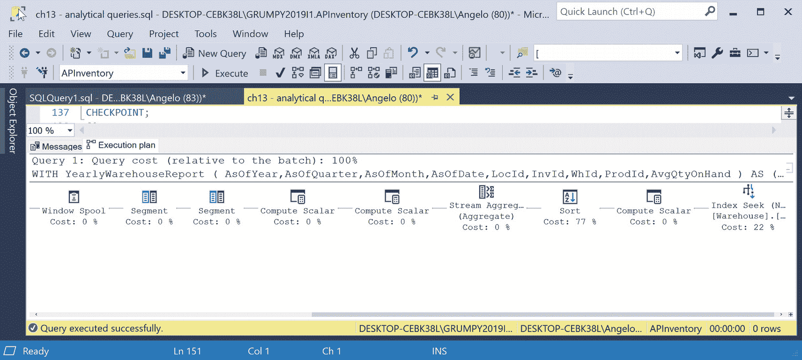

`SQLSSMS` 窗口的截图。它展示了一个包含 9 个组件的基线估计执行计划。这些组件分别是窗口假脱机、段、段、计算标量、计算标量、流聚合、排序、竞争标量和索引查找。排序和索引查找的成本分别为 77% 和 22%。

**图 13-7** 首尾值基线估计性能计划

看起来这是一个性能不错的查询。没有建议新的索引，并且通过索引查找（成本 22%）可以看到正在使用一个现有索引。
这反映了真实的生产环境，也就是说，随着创建的查询越来越多，会识别出新的索引需求并创建索引，这些索引随后可供未来的查询使用。因此，理论上当你创建新查询时，你不必每次都创建新索引。这至少是我们的目标。

> **注意**
>
> 请记住，索引可能会加速查询，但会减慢行插入、更新和删除操作。索引需要为这些操作进行更新，因此索引越多，你看到的性能就越慢。

我差点忘了，那个成本占 77% 的排序任务是需要关注的。这个值很高。设置 `PROFILE STATISTICS ON,` 后，我们看到该任务是按 `AsOfDate` 列、一个表达式和 `AsOfMonth` 进行排序。
结果发现该表达式是用于提取日历季度的 `DATEPART()` 函数。所以这里有一些需要优化的代码。

让我们用一些 `IO` 和 `TIME` 统计信息来完成分析。请参考图 13-8。

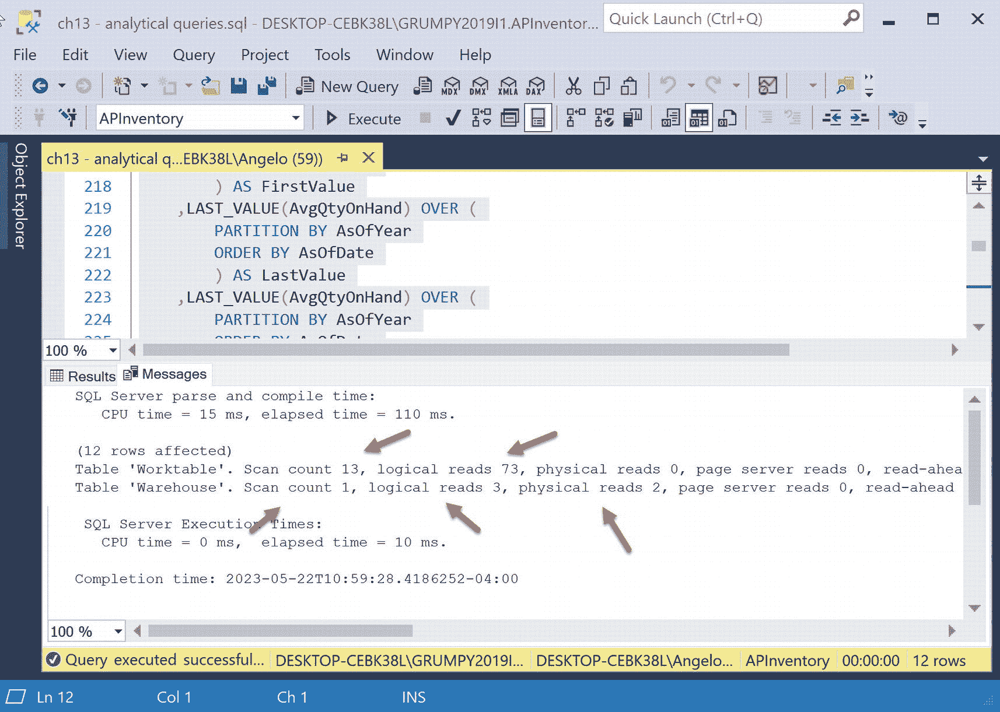

`SQLSSMS` 窗口的截图。文本展示了 `IO` 和 `TIME` 统计信息。`SQL` 服务器解析和编译时间的 `CPU` 和耗时分别为 15 和 110 毫秒。`SQL` 服务器执行时间的 `CPU` 和耗时分别为 0 和 10 毫秒。影响了 2 个表中的 12 行。

**图 13-8** `IO` 和 `TIME` 统计信息

该查询在 10 毫秒内执行完毕，不到一秒（解析时间为 110 毫秒）。我们看到扫描计数值为 13，逻辑读取次数为 73，有点高。
扫描计数、逻辑读取和物理读取的模式是相同的：1-3-2。这很合理。我们使用的是同一个表。
可能将此查询与我们之前创建的增强版日历表连接，以提取日历季度文本，而不是从日期中提取生成，可能是一个更好的解决方案，但需要考虑表 `JOIN` 的成本。此策略也将移除用于将季度和月份数值解码为其对应文本值的 `CASE` 代码块。

> **提示**
>
> 尽可能避免使用像 `DATEPART()` 这样的函数，尤其是在 `WHERE` 子句的谓词中。这会影响性能。

不甘落后，我们转到下一个函数。（是的，一个糟糕的双关语。我能想象技术审稿人翻白眼的样子！）

### LAG( ) 函数

回顾一下 `LAG()` 函数的作用：
此函数用于检索相对于当前行的列值（通常在时间维度内）的前一行的列值，在我们的例子中是库存移动日期。
这个查询可以帮助回答类似这样的问题：
当前月份与上个月、上个季度或去年相比如何？
这是 `LEAD()` 函数的对应函数，我们接下来会看到。以下是我们分析师想要的查询规范：
我们的业务分析师希望我们修改前一个查询，使其不仅显示当前平均月库存值，还要显示前一个月、前三个月和前 12 个月的平均值（对应同一个月）：

*   1：回退一个月。
*   3：回退三个月（相对于当前月份的一个季度）。
*   12：回退 12 个月（相对于当前月份的一年）。

需要相同的日期对象，即明确写出季度和月份名称。并且按相同的产品、地点、库存和仓库进行筛选。报告必须跨越三年：2002、2003 和 2004 年。
复制粘贴我们上一个查询并稍作修改，得到如下查询。注意 `CTE` 没有复制，因为它与前一个示例中的相同。
请参考代码清单 13-3。

```sql
/* CTE 在此 */
SELECT AsOfYear
      ,AsOfQuarter
      ,CASE
           WHEN DATEPART(qq,AsOfDate) = 1 THEN '1st Quarter'
           WHEN DATEPART(qq,AsOfDate) = 2 THEN '2nd Quarter'
           WHEN DATEPART(qq,AsOfDate) = 3 THEN '3rd Quarter'
           WHEN DATEPART(qq,AsOfDate) = 4 THEN '4th Quarter'
       END AS AsOfQtrName
      ,AsOfMonth
      ,CASE
           WHEN AsOfMonth = 1 THEN 'Jan'
           WHEN AsOfMonth = 2 THEN 'Feb'
           WHEN AsOfMonth = 3 THEN 'Mar'
           WHEN AsOfMonth = 4 THEN 'Apr'
           WHEN AsOfMonth = 5 THEN 'May'
           WHEN AsOfMonth = 6 THEN 'June'
           WHEN AsOfMonth = 7 THEN 'Jul'
           WHEN AsOfMonth = 8 THEN 'Aug'
           WHEN AsOfMonth = 9 THEN 'Sep'
           WHEN AsOfMonth = 10 THEN 'Oct'
           WHEN AsOfMonth = 11 THEN 'Nov'
           WHEN AsOfMonth = 12 THEN 'Dec'
       END AS AvgMonthName
      ,AsOfDate
      ,LocId
      ,InvId
      ,WhId
      ,ProdId
      ,AvgQtyOnHand AS MonthlyAvgQtyOnHand
      ,LAG(AvgQtyOnHand,1,0) OVER (
           ORDER BY AsOfDate
       ) AS PriorMonthAverage
      ,LAG(AvgQtyOnHand,3,0) OVER (
           ORDER BY AsOfDate
       ) AS PriorQuarterAverage
      ,LAG(AvgQtyOnHand,12,0) OVER (
           ORDER BY AsOfDate
       ) AS PriorYearAverage
      ,AvgQtyOnHand -LAG(AvgQtyOnHand,1,0)
                    OVER (
                         ORDER BY AsOfDate
                    ) AS Change
      ,AvgQtyOnHand -LAG(AvgQtyOnHand,1,0)
                    OVER (
                         PARTITION BY AsOfYear
                         ORDER BY AsOfDate
                    ) AS Change
FROM YearlyWarehouseReport – the CTE
WHERE AsOfYear = 2002
  AND ProdId = 'P101'
  AND Locid = 'LOC1'
  AND InvId = 'INV1'
  AND WhId = 'WH112'
GO
```
**代码清单 13-3** 当前月移动与上个月、季度和年的对比

我们来分析这三个 `LAG()` 函数。
首先，没有为年份设置分区，因为我们希望结果跨越数据集中的所有年份。每个分区都有一个 `ORDER BY` 子句，引用了 `AsOfDate` 列。唯一的区别是每个 `LAG()` 函数使用不同的参数来指定我们需要回退的时间段：

*   1：回退一个月。
*   3：回退三个月（相对于当前月份的一个季度）。
*   12：回退 12 个月（相对于当前月份的一年）。

列名具有误导性，因为它们不代表实际的季度或年份，而是代表回退三个月或 12 个月（好吧，我留给你们来想出更好的名字）。
参数“0”表示当我们到达边界起点时，需要显示“0”而不是 `NULL` 值。也就是说，没有前一行可以满足 `LAG()` 函数所需的时间跨度。
最后，对于当前/前一个月的组合，我们包含了一个简单的公式，通过从当前月的平均值中减去 `LAG()` 函数返回的值来计算变化。

#### 课后作业


修改查询，使其还能生成当前月与上月之间的百分比变化。如果你有雄心壮志，也可以对季度和年份做同样的处理（加分项！）。提示：你可以复用生成变化值的代码并稍作修改，使其返回一个百分比。可能还需要添加逻辑来显示过去六个月的数据。这将是一份强大的报告。查看一下此查询的预估性能执行计划。

请参考图 13-9 中的部分结果。

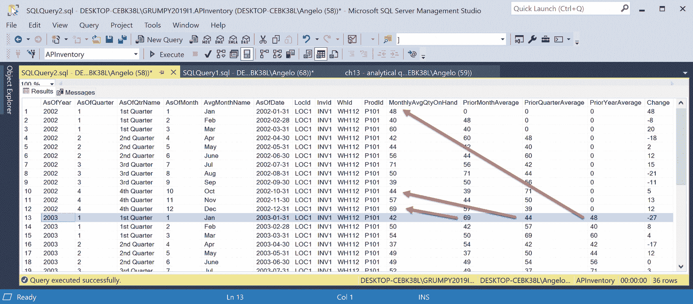

一张 SQL SSMS 窗口的截图，包含一个 16 列 37 行的表格。列标题为：截止年份、截止季度、截止季度名称、截止月份、平均月份名称、截止日期、地点 ID、库存 ID、仓库 ID、产品 ID、月度平均值、上月值、季度平均值、年度平均值、变化值。

图 13-9

本月与上月、季度及年度平均值对比

箭头表明`LAG()`滞后函数正在生效。注意所有那些零值，它们表示没有更早的行存在以满足先前的时间引用。

这是一份很好的报告，因为它允许分析师查看历史库存移动情况，并将其与当前的移动进行比较。如果过去的移动情况预示着销售情况，即大量库存移出，那么当时普遍存在哪些条件，而本月移动量较低的原因又是什么？将这些数据图表化是可视化库存移动情况的好方法。

根据我的评论，让我们用这份报告在 Microsoft Excel 电子表格中生成两种类型的图表。

请参考图 13-10 中的部分结果。

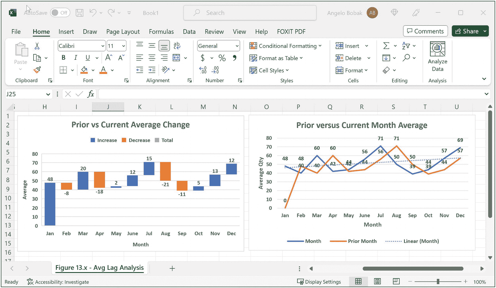

一张 Microsoft Excel 窗口的截图。左侧，一个平均值与月份的瀑布图显示出波动上升的趋势，包括增加、减少和总计。右侧，一个平均数量与月份的折线图有两条波动上升的曲线，分别代表本月和上月，并带有一条线性拟合线。

图 13-10

上月与本月平均分析（仅限月度）

第一张图用柱状图展示了增加与减少的情况，第二张图则使用折线图结合各月份的数值。我们可以看到两种类型的移动都呈上升趋势，这表明销售订单量健康。你肯定不希望看到大量库存移入，而几乎没有库存移出的情况。

小贴士

作为一名 SQL 开发人员或数据集成架构师，强烈建议你精通 Microsoft Excel 技能，以便能为用户进一步提供高质量的报告。在验证查询结果时，这些技能也很有用！

#### 性能考量

这将是一个庞大的执行计划，因为我们使用了四次`LAG()`函数：三次用于生成上月、季度和年度的数值，另一次用于计算以显示本月与上月之间的差异。

我将把修改查询的任务留给你，使其也能显示季度增量、年度增量以及每个时间段对应的百分比变化。在`SELECT`子句中执行计算的查询对性能影响很大，所以请检查预估的查询计划以及`IO`和`TIME`统计信息。

以下是我们的基线预估查询计划，分为四个部分。

请参考图 13-11。

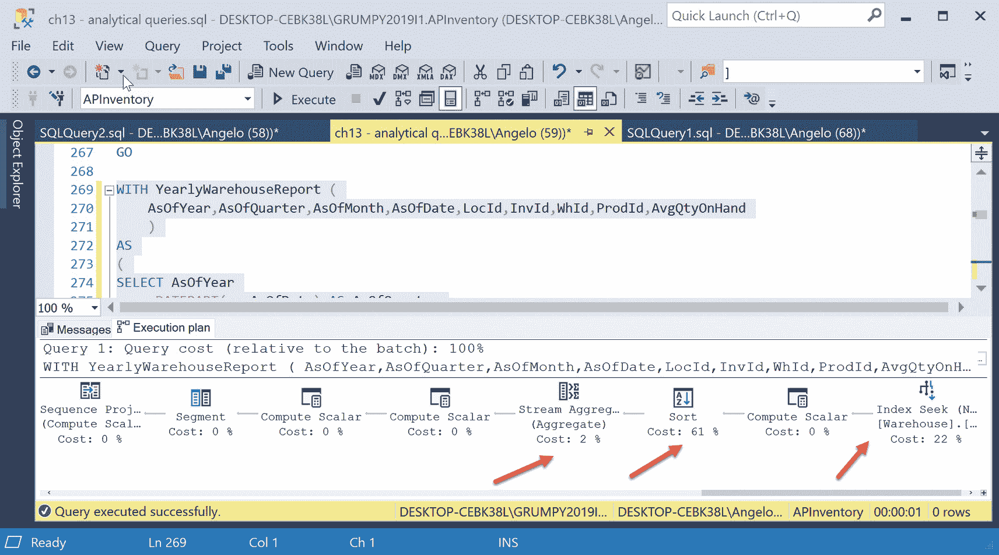

一张 SQL SSMS 窗口的截图。它展示了基线预估执行计划的第一部分，包含 8 个组件：序列项目、段、计算标量、计算标量、流聚合（成本 2%）、排序（成本 41%）、计算标量、索引查找（成本 22%）。

图 13-11

基线预估执行计划，第 1 部分

再次强调，没有建议创建索引，所以我们开了个好头。有时，你会看到一个计划使用了表索引，但同时也建议了另一个索引。我们看到索引查找任务占 22%的成本，而昂贵的排序任务占 61%的成本。我们之前见过这种模式，并且知道罪魁祸首是谁。就是`DATEPART()`函数，而且我们知道该如何改进性能。有时，提升性能需要重写查询。而有时，重写查询可能会让事情变得更糟！

这是计划的第二部分。请参考图 13-12。

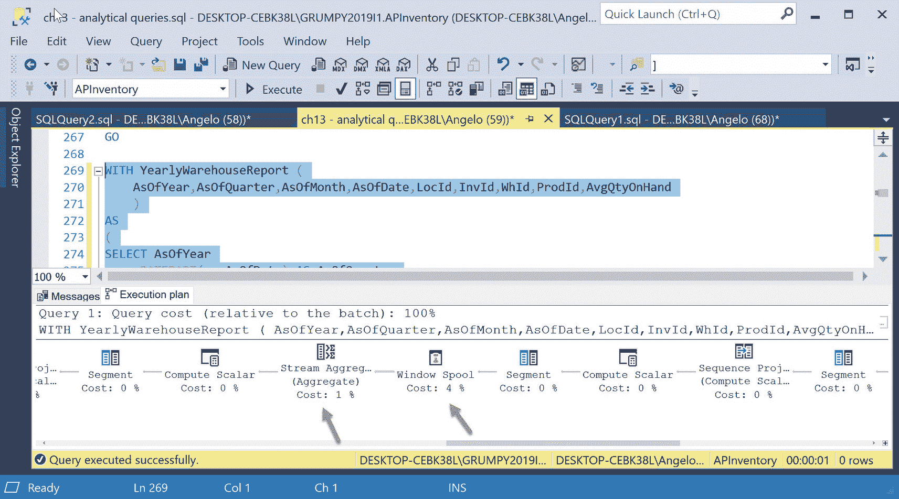

一张 SQL SSMS 窗口的截图。它展示了基线预估执行计划的第二部分，包含 8 个组件：段、计算标量、流聚合（成本 1%）、窗口假脱机（成本 4%）、段、计算标量、序列项目、段。

图 13-12

基线预估执行计划，第 2 部分

出现了一个窗口假脱机，成本为 4%。这是为第一个`LAG()`函数准备的。我们可以预期在计划中看到其他`LAG()`函数也呈现这种模式。

回想一下，非零值意味着假脱机操作发生在物理存储上，而非内存中，因此速度会更慢。除了希望你的系统管理员为`TEMPDB`安装快速固态硬盘之外，这里能做的不多。

这是第三部分。请参考图 13-13。

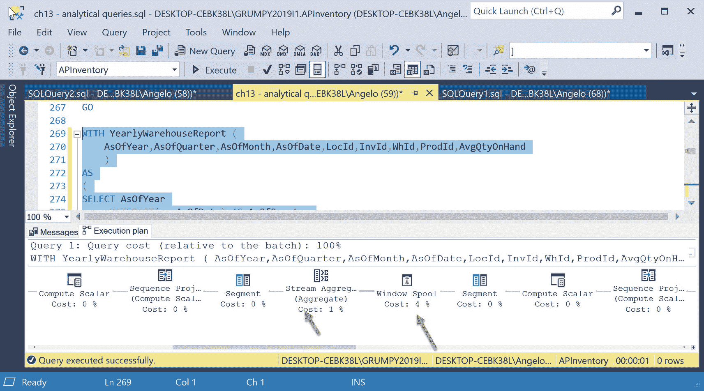

一张 SQL SSMS 窗口的截图。它展示了基线预估执行计划的第三部分，包含 8 个组件：计算标量、序列项目、段、流聚合（成本 1%）、窗口假脱机（成本 4%）、段、计算标量、序列项目。

图 13-13

基线预估执行计划，第 3 部分

我说什么来着。这里是另一个窗口假脱机任务，成本同样是 4%，后面跟着一个流聚合，成本为 1%。还剩最后一部分计划。

请参考图 13-14。

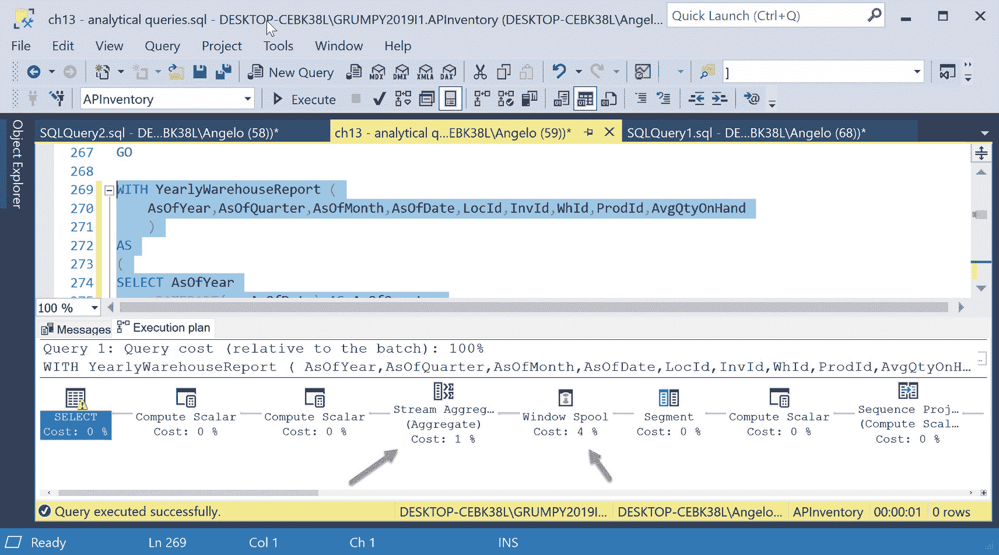

一张 SQL SSMS 窗口的截图。它展示了基线预估执行计划的第四部分，包含 8 个组件：选择、计算标量、计算标量、流聚合（成本 1%）、窗口假脱机（成本 4%）、段、计算标量、序列项目。

图 13-14

基线预估执行计划，第 4 部分

这是最后一部分，包含最后一个窗口假脱机任务和一个流聚合任务，成本相同，分别是 4%和 1%。

一个可能的选项是将`LAG()`的结果预加载到一个带有键的快速表中，这样查询就可以通过`JOIN`来检索这些值。由于数据是历史性的，这或许是一个可行的选择。

最后但同样重要的是，为了完善分析图景，以下是`IO`和`TIME`统计信息。

请记住，有时如果我们仍然卡住，并且没有足够的信息来评估性能问题，我们甚至可能需要设置`PROFILE STATISTICS`（配置文件统计信息）为开启状态，并进行更深入的调查。

请参考图 13-15。

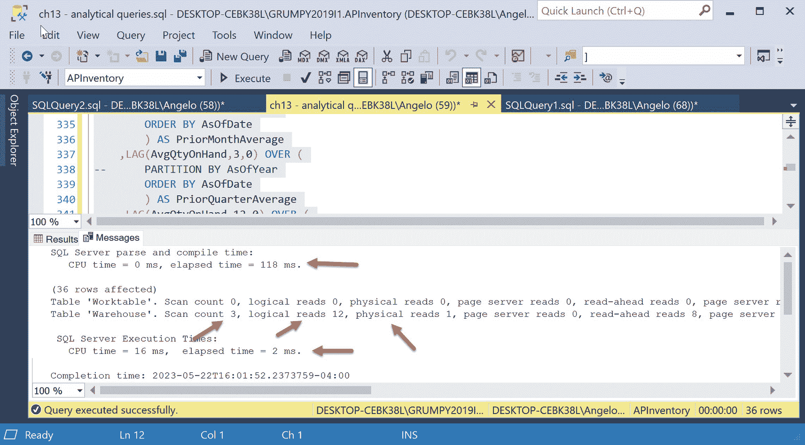

一张 SQL SSMS 窗口的截图。文本展示了 IO 和 TIME 统计信息。SQL Server 解析和编译时间的 CPU 和耗时分别为 0 毫秒和 118 毫秒。SQL Server 执行时间的 CPU 和耗时分别为 16 毫秒和 2 毫秒。影响了 2 个表的 36 行。

图 13-15

LAG()函数的 IO 和 TIME 统计信息

这很有趣。尽管重复使用了`LAG()`函数，但`IO`和`TIME`统计信息都很低！SQL Server 执行时间仅为 2 毫秒。工作表的值全为零，而仓库表的值反映出较低的扫描计数（3）、较低的逻辑读取（12）和较低的物理读取（1）。看起来，这个函数改变了我们的模式。

注意

我想我之前没提过，但生成所有这些统计信息本身也会消耗性能，所以请记住这一点。只在开发环境中执行这些操作。

既然我们已经完成了滞后分析，那就让我们领先一步吧（嘿，这是最后一个关于配方的章节了，所以我可以开个蹩脚的玩笑了）！


### `LEAD( )` 函数

`LEAD()` 函数是 `LAG()` 函数的对应函数。此函数用于检索相对于当前行的下一个值（对于日期对象，指历史数据集中的未来日期）。

以下是我们的业务需求：

我们的分析师希望得到与“回顾过去”报告完全相同的报告，但这次我们需要“展望未来”。

我们将采用不同的方法，使用查询的 `CTE` 部分来创建一个 `VIEW`。有一个选项可以创建所谓的 schema-bound `VIEW`，它实际上将查询结果存储在物理存储上。

以下是创建 `TSQL VIEW` 的 `DDL` 命令。

请参考 列表 13-4。

```
CREATE OR ALTER VIEW [Reports].[MonthlySumInventory]
-- use below to implement a materialized view
-- WITH SCHEMABINDING
AS
WITH WarehouseCTE (
InvYear,InvQuarterName,InvMonthNo,InvMonthName,LocationId
,LocationName,InventoryId,WarehouseId,WarehouseName,ProductId
,ProductName,ProductType,ProdTypeName,MonthlySumQtyOnHand
)
AS (
SELECT YEAR(C.[CalendarDate])  AS InvYear
,CASE
WHEN DATEPART(qq,C.[CalendarDate]) = 1 THEN 'Qtr 1'
WHEN DATEPART(qq,C.[CalendarDate]) = 2 THEN 'Qtr 2'
WHEN DATEPART(qq,C.[CalendarDate]) = 3 THEN 'Qtr 3'
WHEN DATEPART(qq,C.[CalendarDate]) = 4 THEN 'Qtr 4'
END AS AsOfQtrName
,MONTH(C.[CalendarDate]) AS InvQuarterName
,CASE
WHEN MONTH(C.[CalendarDate])  = 1 THEN 'Jan'
WHEN MONTH(C.[CalendarDate])  = 2 THEN 'Feb'
WHEN MONTH(C.[CalendarDate])  = 3 THEN 'Mar'
WHEN MONTH(C.[CalendarDate])  = 4 THEN 'Apr'
WHEN MONTH(C.[CalendarDate])  = 5 THEN 'May'
WHEN MONTH(C.[CalendarDate])  = 6 THEN 'June'
WHEN MONTH(C.[CalendarDate])  = 7 THEN 'Jul'
WHEN MONTH(C.[CalendarDate])  = 8 THEN 'Aug'
WHEN MONTH(C.[CalendarDate])  = 9 THEN 'Sep'
WHEN MONTH(C.[CalendarDate])  = 10 THEN 'Oct'
WHEN MONTH(C.[CalendarDate])  = 11 THEN 'Nov'
WHEN MONTH(C.[CalendarDate])  = 12 THEN 'Dec'
END AS InvMonthMonthName
,L.LocId             AS LocationId
,L.LocName           AS LocationName
,I.InvId             AS InventoryId
,W.WhId              AS WarehouseId
,W.WhName            AS WarehouseName
,P.ProdId            AS ProductId
,P.ProdName          AS ProductName
,P.ProdType          AS ProductType
,PT.ProdTypeName     AS ProdTypeName
,SUM(IH.[QtyOnHand]) AS MonthlySumQtyOnHand
FROM [Fact].[InventoryHistory] IH
JOIN [Dimension].[Location] L
ON IH.LocKey = L.LocKey
JOIN [Dimension].[Calendar] C
ON IH.CalendarKey = C.CalendarKey
JOIN [Dimension].[Warehouse] W
ON IH.WhKey = W.WhKey
JOIN [Dimension].[Inventory] I
ON IH.[InvKey] = I.InvKey
JOIN [Dimension].[Product] P
ON IH.ProdKey = P.ProdKey
JOIN [Dimension].[ProductType] PT
ON P.ProductTypeKey = PT.ProductTypeKey
GROUP BY YEAR(C.[CalendarDate])
,MONTH(C.[CalendarDate])
,DATEPART(qq,C.[CalendarDate])
,L.LocId
,L.LocName
,I.InvId
,W.WhId
,W.WhName
,P.ProdId
,P.ProdName
,P.ProdType
,PT.ProdTypeName
)
SELECT InvYear,InvQuarterName,InvMonthNo,InvMonthName,LocationId
,LocationName,InventoryId,WarehouseId,WarehouseName,ProductType
,ProductId,ProductName,MonthlySumQtyOnHand
FROM WarehouseCTE
GO
```

#### 列表 13-4：替代 CTE 的视图

正如我们之前所见，无需过多解释。它演示了如何使用 `CTE` 来创建 `TSQL VIEW` 对象。以下代码被注释掉了：

```
-- use below to implement a materialized view
--WITH SCHEMABINDING
```

我们将运行没有 schema binding 的示例，但作为练习，您应该重建启用了 schema binding 的 `VIEW` 对象，并查看估计的性能计划是什么样的。同时，检查 schema-bound `VIEW` 的 `IO` 和 `TIME` 统计信息。

以下是对新 `VIEW` 的引用查询。

请参考 列表 13-5。

```
SELECT [InvYear]
,InvQuarterName
,InvMonthNo
,[InvMonthName]
,[LocationId]
,[LocationName]
,[InventoryId]
,[WarehouseId]
,[ProductType]
,[ProductId]
,MonthlySumQtyOnHand
,LEAD(MonthlySumQtyOnHand,1,0) OVER (
PARTITION BY [LocationId],[InventoryId],[WarehouseId],[ProductId]
ORDER BY InvYear,InvMonthNo,[LocationId],[InventoryId]
,[WarehouseId],[ProductId]
) AS NextMonthSum
,LEAD(MonthlyAvgQtyOnHand,3,0) OVER (
PARTITION BY [LocationId],[InventoryId],[WarehouseId],[ProductId]
ORDER BY InvYear,InvMonthNo,[LocationId],[InventoryId]
,[WarehouseId],[ProductId]
) AS Skip3MonthSum
,LEAD(MonthlyAvgQtyOnHand,12,0) OVER (
PARTITION BY [LocationId],[InventoryId],[WarehouseId],[ProductId]
ORDER BY InvYear,InvMonthNo,[LocationId],[InventoryId]
,[WarehouseId],[ProductId]
) AS Skip12MonthSum
,MonthlySumQtyOnHand - LEAD(MonthlySumQtyOnHand,1,0)
OVER (
PARTITION BY [LocationId],[InventoryId],[WarehouseId],[ProductId]
ORDER BY InvYear,InvMonthNo,[LocationId],[InventoryId]
,[WarehouseId],[ProductId]
) AS Change
FROM [Reports].[MonthlySumInventory]
GO
```

#### 列表 13-5：使用表视图的 LEAD 示例

这与 `LAG()` 示例的逻辑完全相同，只是我们用 `LEAD()` 替换了 `LAG()`。代码的可重用性再次提高了开发人员的工作效率。我还为 `LEAD()` 函数使用了更好的列名。

请参考图 13-16 中的部分结果。

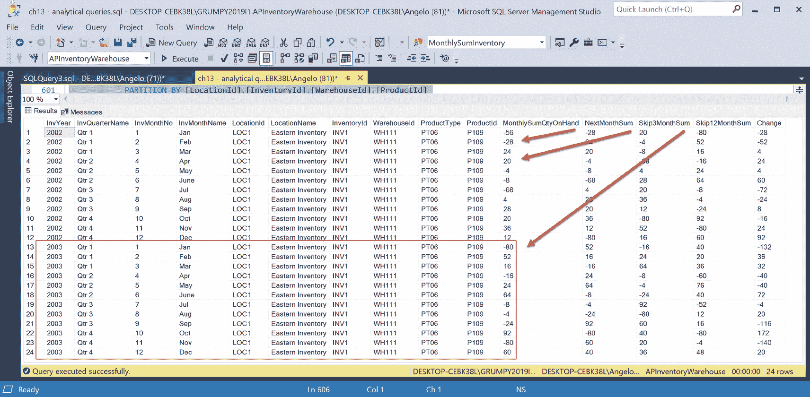

#### 图 13-16：使用 LEAD 函数的当前与下月、下季度和下一年比较

报告有效。箭头指向下个月、三个月后和 12 个月后的正确值。框选区域代表下一年，因此逻辑跨越了年份边界，这正是我们想要的。

这是一份很好的报告，允许分析师评估多年的库存变动。唯一的问题是数据仅对过去和当前日历日期有效。目前还没有未来数据！

让我们看看这些结果在图表中的样子。

请参考图 13-17。

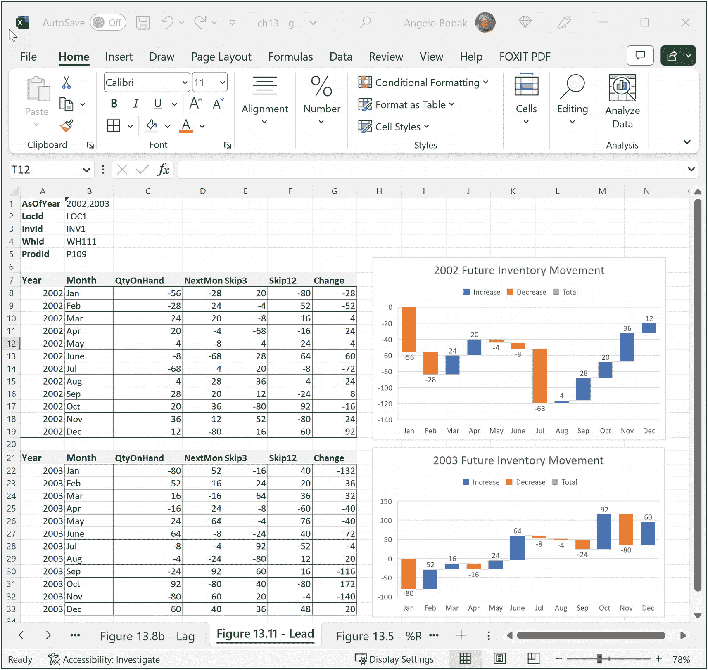

#### 图 13-17：下月、下季度和下一年的库存变动

这与为 `LAG()` 函数分析生成的图表类型相同，但它确实显示了相对于一组年份的未来变动。


#### 性能考量

我们的基准预估查询计划如下。

请参阅图 13-18。

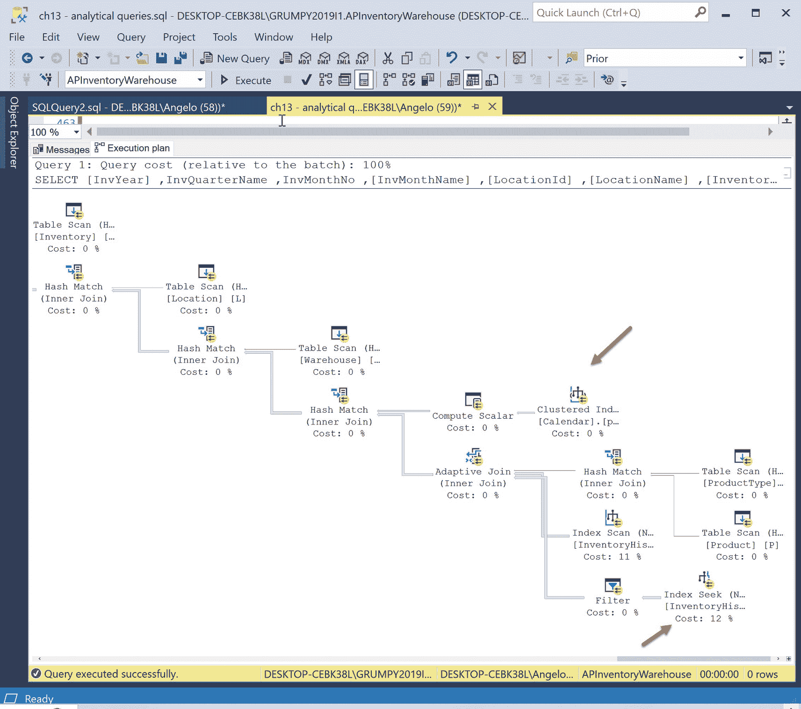

这是 SQLSSMS 窗口的截图。它展示了基准预估执行计划的第 1 部分，包含 15 个组件。这些组件是 3 组表扫描与哈希匹配、计算标量、自适应连接、聚集索引扫描、哈希匹配、表扫描、索引扫描、表扫描、筛选器和索引查找。

图 13-18
基准预估执行计划 – 第 1 部分

我们正在处理数据仓库加载，因此请查看所有不同类型的连接任务。这里有一个哈希匹配、一个自适应连接以及一系列成本为 0%的哈希匹配任务。注意看对`Calendar`表的聚集索引扫描（0%成本）以及对`InventoryHistory`事实表的索引查找任务（12%成本）。

**提示**

当你在预估查询计划中遇到一个不知道其作用的任务时，请查阅 Microsoft 文档。久而久之，你就会理解所有任务的作用。

到目前为止，看起来不错。让我们向左滚动，检查计划的下一部分。

请参阅图 13-19。


这是 SQLSSMS 窗口的截图。它展示了基准预估执行计划的第 2 部分，包含 9 个组件。这些组件是段、计算标量、成本为 55%的排序、成本为 7%的并行 ism、计算标量、成本为 10%的哈希匹配、哈希匹配、表扫描和哈希匹配。

图 13-19
基准预估执行计划 – 第 2 部分

这里我们遇到了一些麻烦：成本为 10%的哈希匹配任务、成本为 7%的并行 ism 任务，以及一个相当昂贵的成本为 55%的排序任务。排序任务涉及用于提取日期部分的表达式。我们在之前的例子中看到过，这会在排序时推高成本。

我们再次看到，可能希望为`Calendar`维度添加一个`JOIN`，这样就不必反复使用`DATEPART()`函数。这应该可以降低排序开销，并消除`CASE`代码块（但由于`JOIN`和更多的 IO，也会增加新的开销）。这个改动将在我们使用的`TSQL VIEW`上执行。

让我们再次向左移动，查看更多预估执行计划。

请参阅图 13-20。


这是 SQLSSMS 窗口的截图。它展示了基准预估执行计划的第 3 部分，包含 8 个组件。这些组件是段、计算标量、流聚合、成本为 1%的窗口假脱机、段、计算标量、序列投影和段。

图 13-20
基准预估执行计划 – 第 3 部分

当然，窗口假脱机任务必须登场，但它只带来了 1%的成本，因此无需太过担心。不过，我们还没有完成。让我们再次向左滚动。

请参阅图 13-21。


这是 SQLSSMS 窗口的截图。它展示了基准预估执行计划的第 4 部分，包含 8 个组件。这些组件是序列投影、段、流聚合、成本为 1%的窗口假脱机、段、计算标量、序列投影和段。

图 13-21
基准预估执行计划 – 第 4 部分

模式相同，但我们早有预料。当然，又有一个成本为 1%的窗口假脱机任务，用于`LEAD()`函数。这种假脱机操作在物理磁盘上执行，因此数据可以被反复检索。增加更多物理内存可能将其成本降至 0%（我认为）。

下一部分。请参阅图 13-22。

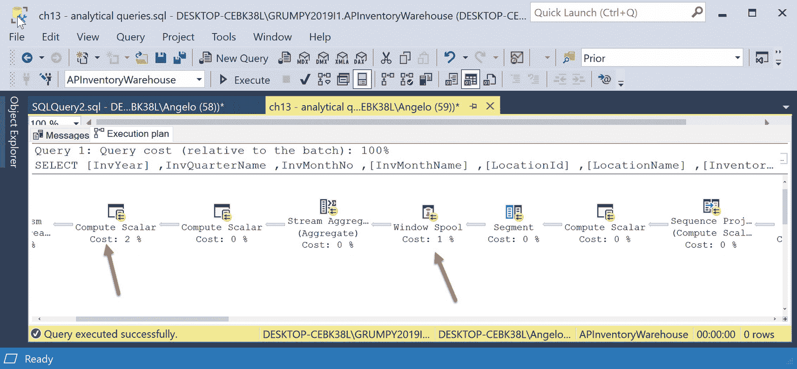

这是 SQLSSMS 窗口的截图。它展示了基准预估执行计划的第 5 部分，包含 7 个组件。这些组件是成本为 2%的计算标量、计算标量、流聚合、成本为 1%的窗口假脱机、段、计算标量和序列投影。

图 13-22
基准预估执行计划 – 第 5 部分

窗口假脱机任务不断出现，每个`LEAD()`函数一次。

再一次，向左滚动。请参阅图 13-23。

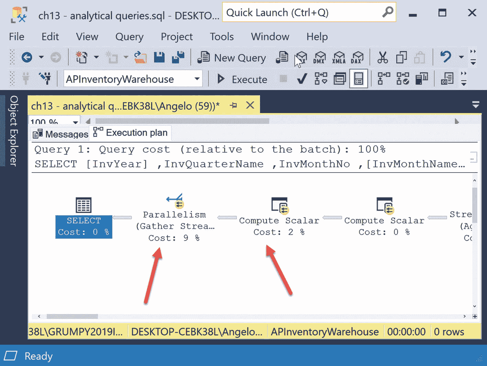

这是 SQLSSMS 窗口的截图。它展示了基准预估执行计划的最后一部分，包含 4 个组件。这些组件是成本为 0%的选定、成本为 9%的并行 ism、成本为 2%的计算标量和成本为 0%的计算标量。

图 13-23
基准预估执行计划 – 最后部分

计划以几个计算标量任务和最终成本为 9%的并行 ism 任务收尾。该任务用于处理增量计算，以生成当前库存移动值与未来值之间的差值。如果不确定，只需执行`SET STATISTICS PROFILE ON`即可查看每个任务背后的详细信息。

总的来说，活动很多，但查询执行得非常快，只用了两秒。记住，事实表有 2,945,280 行！此外，我们使用的`VIEW`是基于一个包含几个`CASE`代码块和两个`DATEPART()`函数的`CTE`代码块。

**家庭作业**

基于我们的分析，看看你是否能够重构`VIEW`，以消除`CASE`代码块和对`DATEPART()`函数的使用。

接下来，让我们查看`IO`和`TIME`统计信息，作为分析过程的最后一步。

请参阅图 13-24。

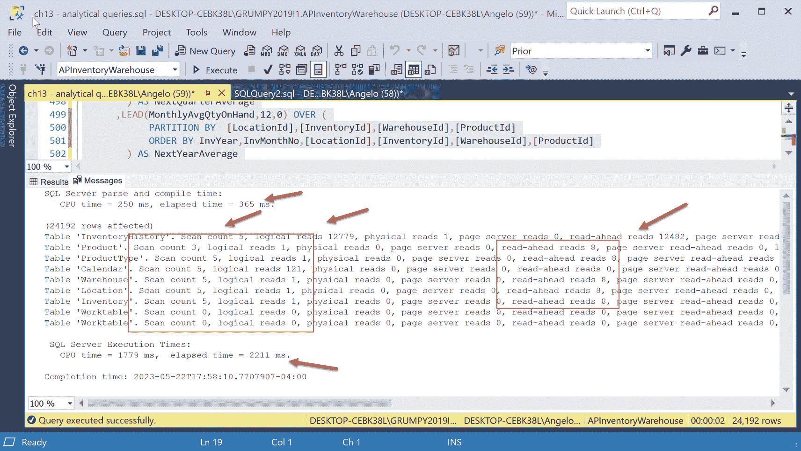

这是 SQLSSMS 窗口的截图。文本展示了`IO`和`TIME`统计信息。`SQL`服务器的解析和编译时间，`CPU`和流逝时间分别为 250 和 365 毫秒。`SQL`服务器的执行时间，`CPU`和流逝时间分别为 1779 和 2211 毫秒。24192 行数据来自 9 个表受到影响。

图 13-24
`IO`和`TIME`统计信息

这次活动很多。本章中的其他查询都相当简单。

我不会深入这些统计信息的细节，但会关注`InventoryHistory`表的逻辑读取和预读读取。这是意料之中的。同时请记住，当你在自己的计算平台上运行这些查询并进行分析时，根据硬件的不同，数值也会有所不同。

`星型`和`雪花型`查询严重依赖于已建立索引的事实表和维度表。经验法则是为维度表中的每个代理键创建一个索引，并为事实表中的所有代理键组合创建一个大的复合索引。这假设维度表包含大量行。如果一个表大约只有不到 1,000 行，那么索引将不会被使用，只会占用空间。

**注意**

为了让你能更自如地使用窗口函数以及掌握性能技术，我特意在本书中保持了查询的简单和简洁。我们刚刚介绍的这个特定查询是真实业务场景中的典型代表，因为它包含了许多活动部件。此外，拥有数亿行的表是常见的；两百万行根本不算什么。


### PERCENT_RANK() 函数

接下来要介绍的是 `PERCENT_RANK()` 函数。

还记得它的作用吗？

我们已经在第 3、7 和 10 章中讨论过，但万一你需要回顾，或者没有按顺序阅读各章，这里提供一个简要复习（如果你已经在之前的章节读过，可以直接跳到这里，转到业务规范部分）。

使用诸如查询结果、分区或表变量这样的数据集，该函数会计算每个值相对于整个数据集的相对排名（以百分比形式）。你需要将结果（返回的值是一个介于 0.0 和 1.0 之间的浮点值）乘以 100.00，或者使用 `FORMAT()` 函数将结果转换为百分比格式（顺便说一句，此函数返回的数据类型是 `FLOAT(53)`）。

回顾一下，它的功能与 `CUME_DIST()` 和 `RANK()` 函数非常相似。

`RANK()` 函数返回值的位置，而 `PERCENT_RANK()` 返回的是一个百分比值。

## 业务规范

我们友好的业务分析师提供了以下规范：

需要一份报告，显示 2002 年产品“P101”库存数量的百分比排名。换句话说，哪个月库存量最高，哪个月最低？这是为了进一步评估有多少库存没有流动。报告需要参照位置“LOC1”、库存“INV1”和仓库“WH112”。照例，季度和月份名称需要拼写完整。结果需要复制到 Microsoft Excel 电子表格中，以便创建帕累托图，实现可视化分析。

注意：帕累托图是一种包含柱状图和折线图的图表，由意大利经济学家维尔弗雷多·帕累托发明。

## 查询

以下是满足这些要求的查询。我们回到使用 `APInventory` 数据库，而不是库存数据仓库数据库。

请参考清单 13-6。

```sql
SELECT AsOfYear
,DATEPART(qq,AsOfDate) AS AsOfQuarter
,CASE
WHEN DATEPART(qq,AsOfDate) = 1 THEN '1st Quarter'
WHEN DATEPART(qq,AsOfDate) = 2 THEN '2nd Quarter'
WHEN DATEPART(qq,AsOfDate) = 3 THEN '3rd Quarter'
WHEN DATEPART(qq,AsOfDate) = 4 THEN '4th Quarter'
END AS AsOfQtrName
,AsOfMonth
,CASE
WHEN AsOfMonth = 1 THEN 'Jan'
WHEN AsOfMonth = 2 THEN 'Feb'
WHEN AsOfMonth = 3 THEN 'Mar'
WHEN AsOfMonth = 4 THEN 'Apr'
WHEN AsOfMonth = 5 THEN 'May'
WHEN AsOfMonth = 6 THEN 'June'
WHEN AsOfMonth = 7 THEN 'Jul'
WHEN AsOfMonth = 8 THEN 'Aug'
WHEN AsOfMonth = 9 THEN 'Sep'
WHEN AsOfMonth = 10 THEN 'Oct'
WHEN AsOfMonth = 11 THEN 'Nov'
WHEN AsOfMonth = 12 THEN 'Dec'
END AS AvgMonthName
,EOMONTH(CONVERT(VARCHAR,YEAR(AsOfDate)),(MONTH(AsOfDate) - 1))
,LocId
,InvId
,WhId
,ProdId
,SUM([InvIn] - [InvOut]) + 50 AS QtyOnHand
,FORMAT(PERCENT_RANK() OVER (
PARTITION BY AsOfYear
ORDER BY SUM([InvIn] - [InvOut]) + 50
),'P') AS PercentRank
FROM Product.Warehouse
WHERE AsOfYear = 2002
AND ProdId = 'P101'
AND Locid = 'LOC1'
AND InvId = 'INV1'
AND WhId = 'WH112'
GROUP BY AsOfYear,
DATEPART(qq,AsOfDate),
AsOfMonth,
EOMONTH(CONVERT(VARCHAR,YEAR(AsOfDate)),(MONTH(AsOfDate) - 1)),
Locid,
InvId,
WhId,
ProdId
ORDER BY AsOfYear,
AsOfMonth,
Locid,
InvId,
WhId,
ProdId
GO
```

清单 13-6: 2002 年产品 P101 的百分比排名查询

## 结果

我们已经了解了 `WHERE` 子句和 `CASE` 代码块，因此除了需要说明 `OVER()` 子句和 `WHERE` 子句中的列需要索引覆盖外，无需额外注释。`CASE` 代码块效果良好，但万一遇到性能问题，可以考虑连接到增强的 Calendar 表。

该函数使用了一个包含 `PARTITION BY` 和 `ORDER BY` 子句的 `OVER()` 子句。分区按年份划分，指定函数如何应用于分区的排序依据是库存数量值。请注意，这里并不需要 `CTE` 代码块。

最后，使用了 `FORMAT()` 函数将结果显示为百分比，以追求美观（让报告看起来更漂亮）。

请参考图 13-25 中的部分结果。

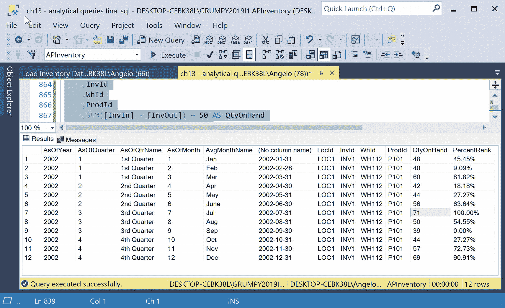

图 13-25: 库存数量的月度百分比排名。SQLSSMS 窗口的屏幕截图，包含一个 13 列 13 行的表格。列标题为：所属年份、所属季度、所属季度名称、所属月份、月份名称、无列名、位置 ID、库存 ID、仓库 ID、产品 ID、库存数量、百分比排名。

该报告生成 12 行数据，对应 2002 年的每个月。可以扩展此报告以包含所有年份，从而进行全面的历史分析，观察该产品历年的销售情况。我们可以轻松地看到最高和最低的百分比以及其间的所有值。看起来七月的库存数量值最高，这意味着该产品在七月的销量较低。结合 `LAG()` 函数来比较该产品在往年（幸运的是，我们有 2002 年以来的数据，所以除了 2001 年 12 月外没有 2001 年的数据）的销售情况会很有趣。

让我们将结果复制到 Microsoft Excel 电子表格中，以便创建帕累托图。

请参考图 13-26。

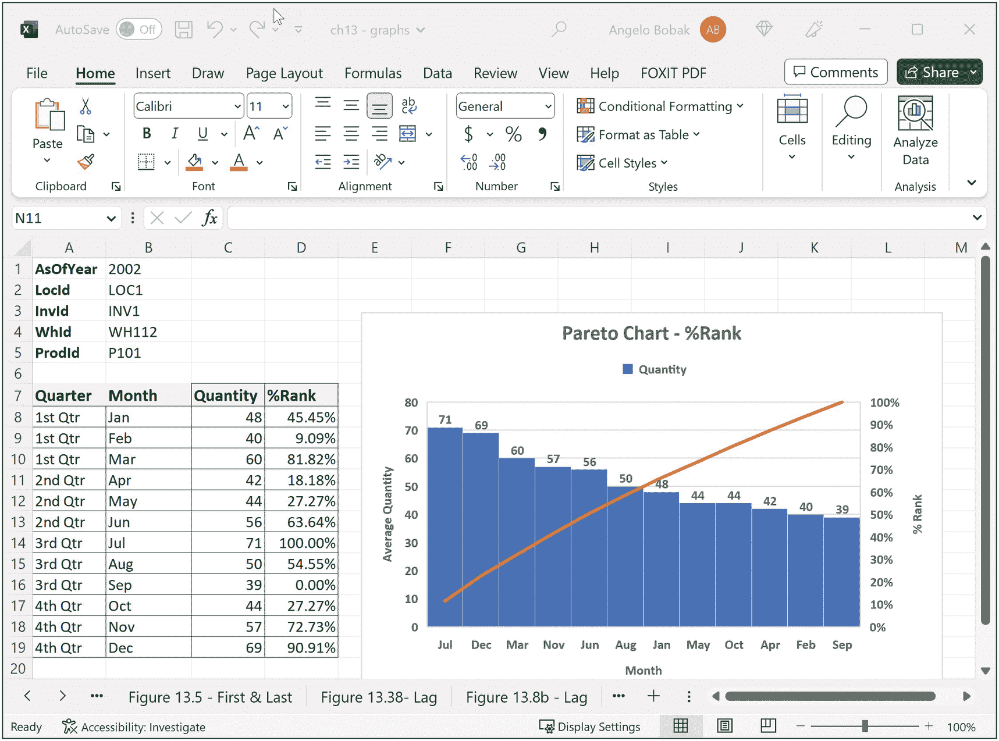

图 13-26: 百分比排名帕累托图。MS Excel 窗口的屏幕截图。它包含一个 4 列 13 行的表格。列标题为：季度、月份、数量、百分比排名。图表还有一个双 Y 轴的帕累托图，显示了平均数量和百分比排名随月份的变化。柱状图呈下降趋势。折线图呈上升趋势。

我认为这是一个有趣的图表。注意柱状图下降而折线图上升。这显示了从高到低的库存量及其对应的百分比。折线图与百分比排名值相关。柱状图代表月度数量。数据表显示月份按我们预期的顺序排列，但帕累托图重新排序了它们，使得柱状图从左到右递减。

## 作业

修改查询，使其生成所有年份的结果，并使用 `LAG()` 函数显示每个当前月份的上月、上季度和去年的结果。进行我们通常的性能分析，以查看查询的表现如何。练习你的 Microsoft Excel 技能，为每一年生成一张图表。


#### 性能考量

下面是我们估算的查询计划分析。分支模式将与之前大不相同，因为我们现在使用的是库存事务数据库，不会再看到创建 `STAR` 和 `SNOWFLAKE` 查询时出现的那些连接操作。此外，`Warehouse` 表只有大约 25,000 行，与数据仓库中近一百万行的事实表相比差异巨大。请参考图 13-27。

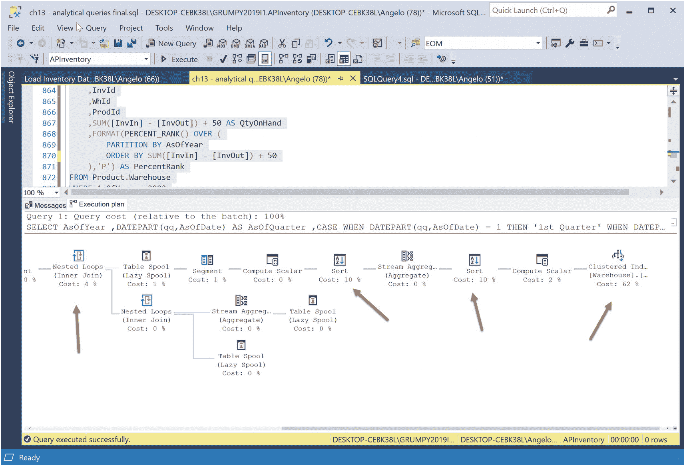

`SQLSSMS` 窗口的截图。它展示了一个包含 13 个组件的估算查询执行计划。这些组件分别是：嵌套循环、表假脱机、段、计算标量、排序、流聚合、排序、计算标量、聚集索引、嵌套循环、流聚合、表假脱机和表假脱机。

**图 13-27**
估算的查询执行计划

照例，我们关注高成本任务。从右向左看，我们发现一个成本为 62% 的聚集索引查找，这表明我们在各示例中创建的所有索引都产生了回报。没有建议新的索引，因此看来我们走在正确的道路上。

下面是 `IO` 和 `TIME` 统计数据。请参考图 13-28。

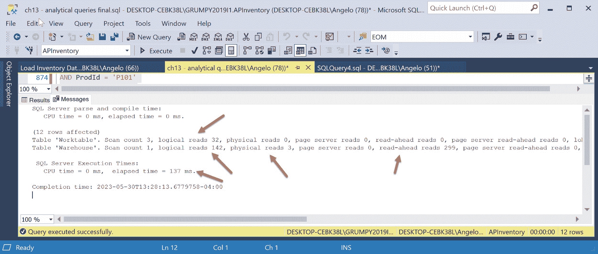

`SQLSSMS` 窗口的截图。文本展示了 `IO` 和 `TIME` 统计数据。`SQL server parse and compile times`（SQL Server 解析和编译时间）的 `CPU` 和 `elapsed`（已用时间）分别为 0 毫秒和 0 毫秒。`SQL server execution times`（SQL Server 执行时间）的 `CPU` 和 `elapsed` 分别为 0 毫秒和 137 毫秒。两个表共影响 12 行数据。

**图 13-28**
用于百分位排名计算的 `IO` 和 `TIME` 统计数据

这些结果不算太差，但与我们之前经历的其他时间相比，`SQL Server` 的执行时间偏高，达到了 137 毫秒。解析时间则很低，为 0 毫秒。

工作表显示了 3 次扫描和 32 次逻辑读取，而 `Warehouse` 表的扫描计数为 1，逻辑读取为 1,142 次，物理读取为 3 次。

我们的结论是，这个函数比本章中使用过的其他窗口函数占用更多资源，因此需要特别注意。请记住，我们还使用 `FORMAT()` 函数对结果进行了一些格式化。这使得报表看起来美观，但我们真的需要它吗？这取决于你的业务分析师！

**课后作业**
修改查询，使其不使用 `FORMAT()` 函数。同时修改查询，使其不使用文本日期部分，只使用数字。执行我们常规的查询计划以及 `IO/TIME` 统计分析，看看是否有显著改善。别忘了在每次运行前执行 `DBCC` 以清除缓存。

### PERCENTILE_CONT( ) 函数

以下是该函数的描述。如果你在之前的章节中读过并了解其工作原理，可以跳过本节讨论。如果需要复习，请继续阅读！

我们将首先讨论 `PERCENTILE_CONT()` 函数，这个函数是做什么的？

如果你阅读过第 3、7 和 10 章，你会记得它处理的是连续的数据集合。回想一下什么是连续数据。

连续数据是在一段时间内测量的数据，例如设备在 24 小时内的锅炉温度，或一段时间内设备故障的次数，就我们的例子而言，是一段时间内的库存移动。将每个锅炉温度相加以得出总和是没有意义的。将锅炉温度相加然后除以时间段以求得平均值则是有意义的。最后，将库存入库移动的值相加也没有意义，因为 99% 的情况下发生的是出库移动，因此月度总和除非没有库存出库，否则不能表明库存中有多少库存。将所有入库库存移动相加然后减去所有出库库存移动则是可行的，因为它会得出剩余库存量。所以所有这些都可能变得非常棘手。

`因此我们可以说，连续数据可以通过使用诸如平均值等公式来衡量。`

这对于每日的现有库存是适用的。我们可以将一个月内每天的库存数量相加，然后生成月度平均值。

总之，`PERCENTILE_CONT()` 函数基于所需的百分位数，在连续的数据集合上运行，以返回满足该百分位数的数据集内的一个值（你需要提供一个百分位数作为参数，如 .25、.50、.75 等）。使用此函数时，该值是插值的，意味着它通常不存在于数据集中。或者，如果数字恰好对齐，它也可能巧合地使用数据集中的某个值。这种情况是可能发生的。

以下是此查询的业务需求：

我们的业务分析师总是盯着同一个产品、位置、库存和仓库。这次，他们希望我们生成 2002 年全年的第 25、50 和 75 个百分位数作为起点。照例，季度名称和月份名称需要完整拼写，并且需要包含月份数字，以便在将数据复制到 Microsoft Excel 电子表格时，如果需要可以按月份数字排序。库存数量需要表示月底最后一天库存中剩余的数量。因此，这些值是通过将每个月内每天的所有入库库存移动减去所有出库库存移动来计算，以得出月底最后一天的总数量。

以下是我们得出的结果。请参考清单 13-7。


```
/********************************/
/* 生成插值计算值               */
/********************************/
SELECT AsOfYear
,DATEPART(qq,AsOfDate) AS AsOfQuarter
,CASE
WHEN DATEPART(qq,AsOfDate) = 1 THEN '第 1 季度'
WHEN DATEPART(qq,AsOfDate) = 2 THEN '第 2 季度'
WHEN DATEPART(qq,AsOfDate) = 3 THEN '第 3 季度'
WHEN DATEPART(qq,AsOfDate) = 4 THEN '第 4 季度'
END AS AsOfQtrName
,AsOfMonth
,CASE
WHEN AsOfMonth = 1 THEN '1 月'
WHEN AsOfMonth = 2 THEN '2 月'
WHEN AsOfMonth = 3 THEN '3 月'
WHEN AsOfMonth = 4 THEN '4 月'
WHEN AsOfMonth = 5 THEN '5 月'
WHEN AsOfMonth = 6 THEN '6 月'
WHEN AsOfMonth = 7 THEN '7 月'
WHEN AsOfMonth = 8 THEN '8 月'
WHEN AsOfMonth = 9 THEN '9 月'
WHEN AsOfMonth = 10 THEN '10 月'
WHEN AsOfMonth = 11 THEN '11 月'
WHEN AsOfMonth = 12 THEN '12 月'
END AS AvgMonthName
,AsOfDate – 月末日期
,LocId
,InvId
,WhId
,ProdId
,QtyOnHand
,PERCENTILE_CONT(.25) WITHIN GROUP (ORDER BY QtyOnHand)
OVER (
PARTITION BY AsOfYear
) AS [%Continuous .25]
,PERCENTILE_CONT(.5) WITHIN GROUP (ORDER BY QtyOnHand)
OVER (
PARTITION BY AsOfYear
) AS [%Continuous .5]
,PERCENTILE_CONT(.75) WITHIN GROUP (ORDER BY QtyOnHand)
OVER (
PARTITION BY AsOfYear
) AS [%Continuous .75]
FROM Product.WHERE AsOfYear = 2002
AND ProdId = 'P101'
AND Locid = 'LOC1'
AND InvId = 'INV1'
AND WhId = 'WH112'
GO
清单 13-7
库存数量的百分位连续函数分析
```

这次没有使用 `CTE`。回想一下，`QtyOnHand` 是月末当天所有库存入库量减去所有库存出库量的总和。请注意这个函数的格式略有不同。在定义 `OVER()` 子句之前，我们需要包含一个 `WITHIN GROUP` 子句。同时注意 `OVER()` 子句中没有 `ORDER BY` 子句，因为它已在 `WITHIN GROUP` 子句中指定了。子句真多！

最后，请注意我们需要将百分位数值作为窗口函数的参数传入。

让我们看看结果。请参考图 13-29 中的结果。

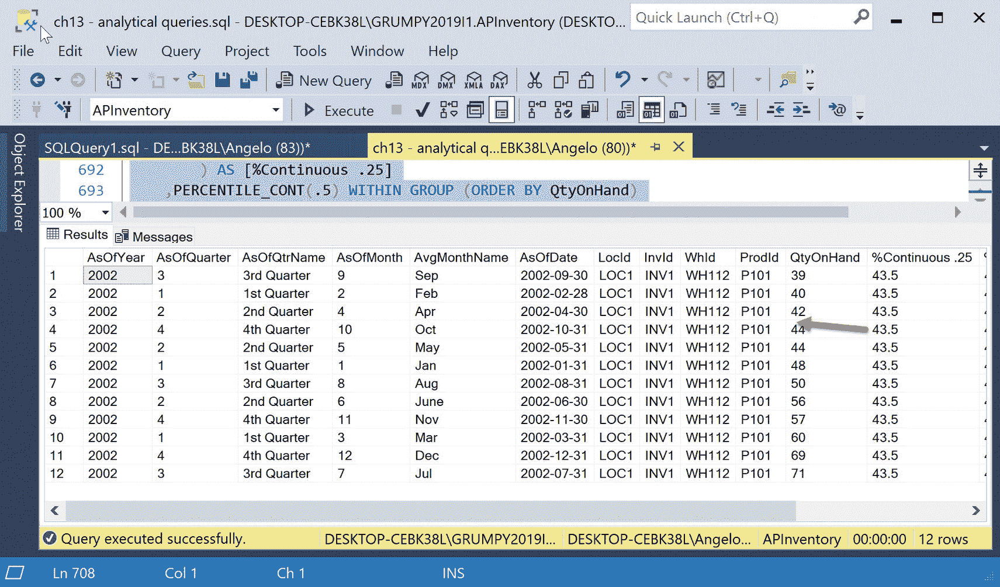
SQL Server Management Studio 窗口的屏幕截图，包含一个 13 列 13 行的表格。列标题分别为：所属年份、所属季度、季度名称、所属月份、月份名称、所属日期、地点 ID、库存 ID、仓库 ID、产品 ID、库存数量、以及百分位连续值。

图 13-29
月度库存数量的百分位连续分析

报告很宽，所以我们只看到了第 25 个百分位数值。注意结果是插值计算得出的。它并非实际存在，而是介于 42 和 44 两个库存数量值之间。另外，43.5 这个值有点不准确，因为库存数量不能是小数。可能需要使用 `CEILING()` 或 `FLOOR()` 函数来整理一下。这个百分位数值以及其他未显示的百分位数值，能让分析人员很好地了解本年度库存数量的分布情况。

让我们使用常用的 Microsoft Excel 电子表格来创建这些结果的可视化图表。请参考图 13-30 中的部分结果。

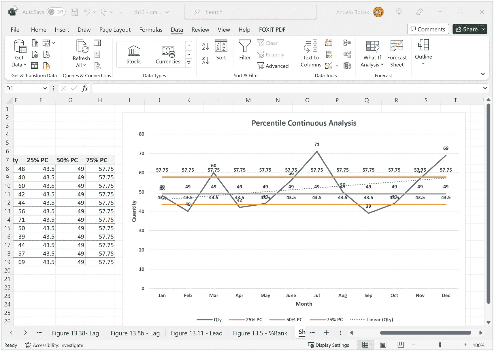
Microsoft Excel 窗口的屏幕截图。它包含一个 4 列 13 行的表格。列标题为：数量、25% PC、50% PC、75% PC。图中还有一个数量随月份变化的折线图，数量是一条波动的曲线，而 25%、50%和 75% PC 是三条线性上升的直线。

图 13-30
月度库存数量的百分位连续分析图

结果按月份在 X 轴排序，我们可以看到库存数量的波动情况。似乎三月、七月和十二月是库存较高的月份。

二月、四月、五月和九月显示的库存值较低。我们的分析人员需要将这些数值与销售数据进行比较，以确定销售业绩。

注意那三条分别代表第 25、50 和 75 个百分位连续值的水平线。这是对查询报告的一个很好的可视化呈现。它包含了大量有价值的信息。


#### 性能考量

以下是我们预估的查询计划。它被分为五个部分（部分点有重叠）。我们将看到，对于`SELECT`子句中`PERCENTILE_CONT()`函数的每个实例，这些模式会重复出现。我们将讨论第一个部分，并简要浏览预估执行计划的其余部分。

**注意**

如果你持续使用这些函数，你将开始了解在查询计划以及`IO`和`TIME`统计信息方面可以期待什么，以及为了提升性能应该怎么做。至少我是这么认为的。

从右到左，我们检查第一部分。

请参考图 13-31。

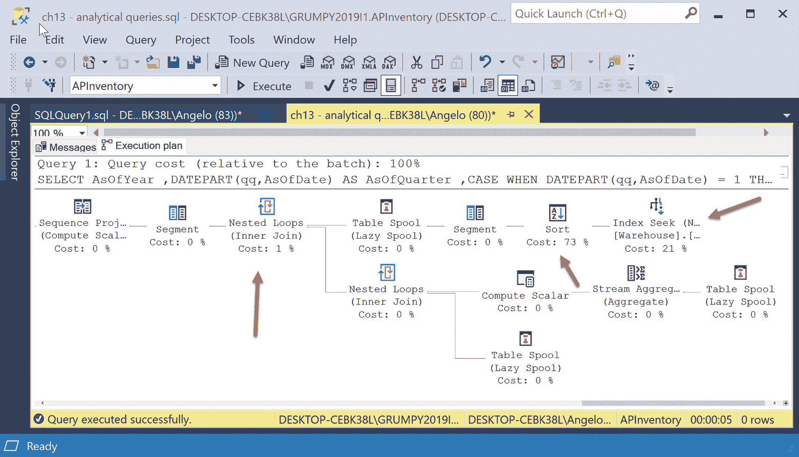

SQL SSMS 窗口的截图。它展示了基线预估查询执行计划的第 1 部分，包含 12 个组件。这些组件是序列投射、段、嵌套循环、表假脱机、段、排序、索引查找、嵌套循环、计算标量、流聚合、表假脱机和表假脱机。

**图 13-31**

基线预估查询计划 – 第 1 部分

这是一个常见的模式。我们看到三个分支通过一个嵌套循环连接（成本 1%）合并。位于计划最右侧的索引查找任务占比 21%，其次是一个开销较大的排序操作。其余任务成本均为 0%。让我们转向计划的第二部分。

## 基线预估查询计划 – 第 2 部分

请参考图 13-32 查看下一部分。

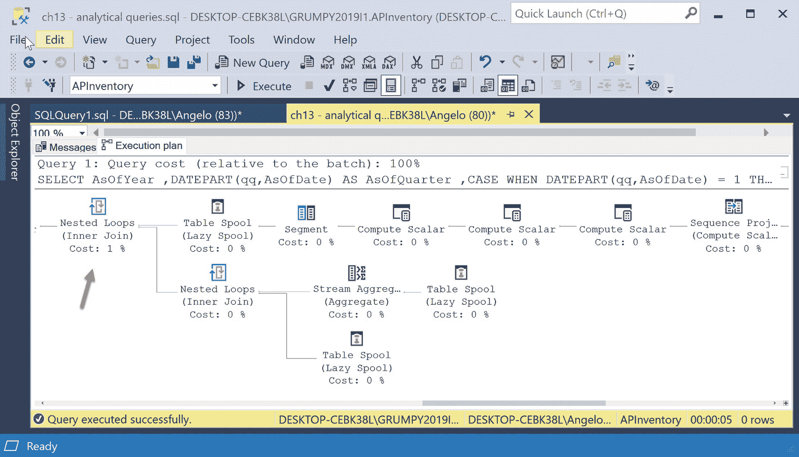

SQL SSMS 窗口的截图。它展示了基线预估查询执行计划的第 2 部分，包含 11 个组件。这些组件是嵌套循环、表假脱机、段、3 个计算标量、序列投射、嵌套循环、流聚合、表假脱机和表假脱机。

**图 13-32**

基线预估查询计划 – 第 2 部分

同样，三个分支（数据流）通过嵌套循环连接（1%成本）合并为一。所有任务成本均为 0%，这让我们相信，性能密集型处理已经在前一部分完成，并且我们需要的所有数据都在内存中。

## 基线预估查询计划 – 第 3 部分

让我们看看这是否属实。请参考图 13-33。

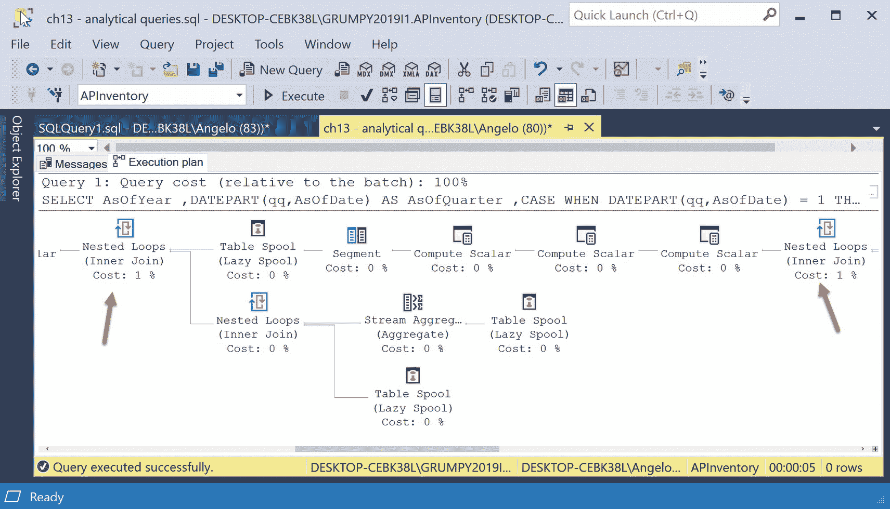

SQL SSMS 窗口的截图。它展示了基线预估查询执行计划的第 3 部分，包含 11 个组件。这些组件是嵌套循环、表假脱机、段、3 个计算标量、嵌套循环、嵌套循环、流聚合、表假脱机和表假脱机。

**图 13-33**

基线预估查询计划 – 第 3 部分

模式相同。看起来我之前的假设是正确的。所有任务成本均为 0。记住，这些模式基本上对应于`PERCENTILE_CONT()`函数的每次执行，但不妨都展示出来。

## 基线预估查询计划 – 第 4 部分

下一部分。请参考图 13-34。

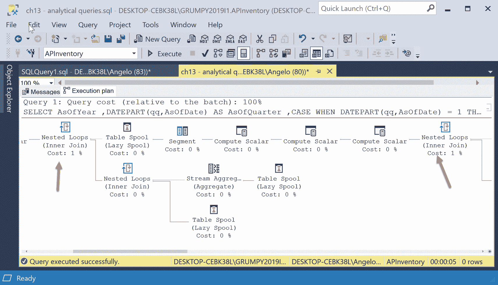

SQL SSMS 窗口的截图。它展示了基线预估查询执行计划的第 4 部分，包含 11 个组件。这些组件是嵌套循环、表假脱机、段、3 个计算标量、嵌套循环、嵌套循环、流聚合、表假脱机和表假脱机。

**图 13-34**

基线预估查询计划 – 第 4 部分

大同小异。我想我们可以假设，选择一种优化策略，比如用一个额外的与日历表的`JOIN`替换`CASE`块（这样我们可以从增强的日历表中检索日期部分），可能会有所帮助，或许吧。我们拭目以待！

后续对基础查询的执行，例如多个用户通过`SSRS`报表运行，即使不能提供极佳的性能，也将提供足够的性能。

## 基线预估查询计划 – 第 5 部分

请参考图 13-35。

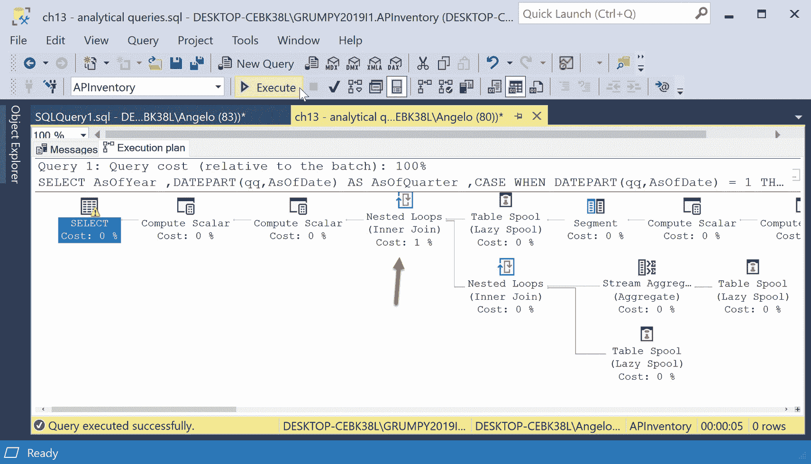

SQL SSMS 窗口的截图。它展示了基线预估查询执行计划的第 5 部分，包含 12 个组件。这些组件是选择、2 个计算标量、嵌套循环、表假脱机、段、计算标量、计算标量、嵌套循环、流聚合、表假脱机和表假脱机。

**图 13-35**

基线预估查询计划 – 第 5 部分

最后但同样重要的，是最终的嵌套循环连接任务，成本为 0%（我们并不担心 0%的成本）。

**提示**

要感受任务间的数据流数据量，请运行一个实时执行计划。点击下方菜单栏中，带有一个小剪刀图标的图标右侧的图标，然后运行查询。

结论：所有性能调优都需要集中在我们最初查看的计划的最右侧部分。

以下是一些选择：

*   修改查询以使用日历表。
*   可能将日历表放入内存。即，使其成为内存优化表。
*   有些人甚至会将文本月份和季度名称打包到数据仓库表中。

## IO 和 TIME 统计信息

让我们看一下`IO`和`TIME`统计信息。

请参考图 13-36。

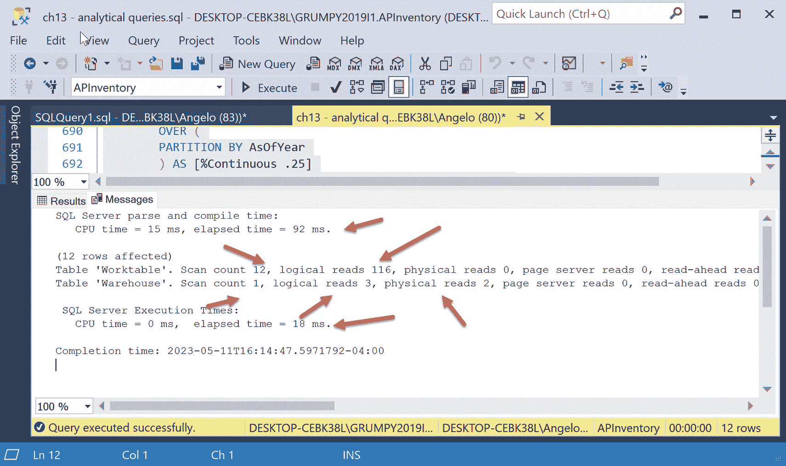

SQL SSMS 窗口的截图。文本展示了 IO 和 TIME 统计信息。SQL Server 的解析和编译时间，CPU 和耗时分别为 15 毫秒和 92 毫秒。SQL Server 的执行时间，CPU 和耗时分别为 0 毫秒和 18 毫秒。影响了 2 个表的 12 行。

**图 13-36**

`PERCENTILE_CONT`的`IO`和`TIME`统计信息

SQL Server 执行时间为 18 毫秒。工作表有 12 次扫描和 116 次逻辑读取。数据仓库表也有 1 次扫描、3 次逻辑读取和 2 次物理读取。

回想一下这个性能调优建议：至少，创建覆盖`OVER()`子句中引用的列的索引，特别是`PARTITION BY`子句和`ORDER BY`子句中的列。同时包含`WHERE`子句中引用的列。这样你的索引就可以覆盖这些列。

**注意**

顺便说一下，计算`PERCENTILE_CONT(.50)`会生成中值。在查询中将其与`AVERAGE()`函数（生成平均值）一起使用并进行比较。T-SQL 没有 MEDIAN 函数，但你可以自己创建一个。

**提示**

查阅`MERGE`命令，它可以在加载数据时使用。它允许你`INSERT`、`UPDATE`或`DELETE`新的或修改过的行。这避免了反复加载大表，否则将违背性能调优的目的。尝试将此命令添加到加载报表表的`INSERT/SELECT`命令中。向你从中检索单行的表添加几百行，然后看看当你包含`MERGE`命令时，修改后的`INSERT/SELECT`是如何工作的。


### `PERCENTILE_DISC()` 函数

这里是我们关于百分位数离散化的示例。`PERCENTILE_DISC()` 函数基于一个指定的百分位数，在**离散**数据集上进行操作，以返回数据集中满足该百分位数的一个值。

还记得离散数据吗？

离散数据值是你能随时间计数的数值，例如投资账户在每天、每月、每年的存入和取出。我们可以说，一年内某人进行了 1000 笔存款和 700 笔取款。将每月的账户余额相加来得到年度余额是行不通的。由于月度余额有涨有跌，这不能真实反映账户在一年内的实际收益。关键在于 12 月 31 日账户里还剩多少钱。将初始账户余额加上一年的所有存款，再减去该年的所有取款，这才是有意义的。

你可以将这些数值相加以获得总计，比如一年的总存款或总取款额，并识别账户余额随时间变化的趋势（平均存款或平均取款额）。

再举一例，将某个地点的每个仓库的库存量相加几乎是有意义的。如果一个地点有两个仓库，你可以计算任意时间点的总库存量、每天/每周/每月的总进出库量等等。同样，一年的总库存量是没有意义的；一年的平均库存水平值则是有意义的。

回顾一下你可以问自己以区分离散数据和连续数据的问题：

*   我能计数它吗（随时间段）？
*   我能把它加起来吗？
*   我能用它进行计算（如平均值）吗？

值得重申：

连续数据可以通过 `AVG()`、`SUM()` 等函数进行测量。
离散数据可以通过 `COUNT()` 等函数进行计数。

回到正题。以下是我们的业务分析师为此查询提供的业务规范：

我们的 `PERCENTILE_CONT()` 报告在业务分析师中大受欢迎，因此他们要求我们修改报告，以显示相同地点、库存、仓库和产品的百分位数离散百分比。这个很简单，快速复制粘贴并更改函数名称即可。是的，惰性让我们复用了处理季度和月度数据部分的 `CASE` 代码块。

最后，请记住，库存量需要代表月底最后一天库存中剩余的数量。因此，这些值是通过将每月中每天的库存入库量减去出库量进行累加，最终得到月末最后一天的总数量来计算的。

请参见代码清单 13-8。

```sql
SELECT AsOfYear
,DATEPART(qq,AsOfDate) AS AsOfQuarter
,CASE
WHEN DATEPART(qq,AsOfDate) = 1 THEN '1st Quarter'
WHEN DATEPART(qq,AsOfDate) = 2 THEN '2nd Quarter'
WHEN DATEPART(qq,AsOfDate) = 3 THEN '3rd Quarter'
WHEN DATEPART(qq,AsOfDate) = 4 THEN '4th Quarter'
END AS AsOfQtrName
,AsOfMonth
,CASE
WHEN AsOfMonth = 1 THEN 'Jan'
WHEN AsOfMonth = 2 THEN 'Feb'
WHEN AsOfMonth = 3 THEN 'Mar'
WHEN AsOfMonth = 4 THEN 'Apr'
WHEN AsOfMonth = 5 THEN 'May'
WHEN AsOfMonth = 6 THEN 'June'
WHEN AsOfMonth = 7 THEN 'Jul'
WHEN AsOfMonth = 8 THEN 'Aug'
WHEN AsOfMonth = 9 THEN 'Sep'
WHEN AsOfMonth = 10 THEN 'Oct'
WHEN AsOfMonth = 11 THEN 'Nov'
WHEN AsOfMonth = 12 THEN 'Dec'
END AS AvgMonthName
,AsOfDate
,LocId
,InvId
,WhId
,ProdId
,QtyOnHand
,PERCENTILE_DISC(.25) WITHIN GROUP (ORDER BY QtyOnHand)
OVER (
PARTITION BY AsOfYear
) AS [%Discrete.25]
,PERCENTILE_DISC(.5) WITHIN GROUP (ORDER BY QtyOnHand)
OVER (
PARTITION BY AsOfYear
) AS [%Discrete .5]
,PERCENTILE_DISC(.75) WITHIN GROUP (ORDER BY QtyOnHand)
OVER (
PARTITION BY AsOfYear
) AS [%Discrete .75]
FROM Product.Warehouse
WHERE AsOfYear = 2002
AND ProdId = 'P101'
AND Locid = 'LOC1'
AND InvId = 'INV1'
AND WhId = 'WH112'
GO
```

代码清单 13-8: 用于查询库存量的百分位数离散化查询

逻辑和结构与之前的示例相同，所以我们来看一下结果。还记得这个函数与 `PERCENTILE_CONT()` 函数结果之间的区别吗？

请参见图 13-37 中的部分结果。

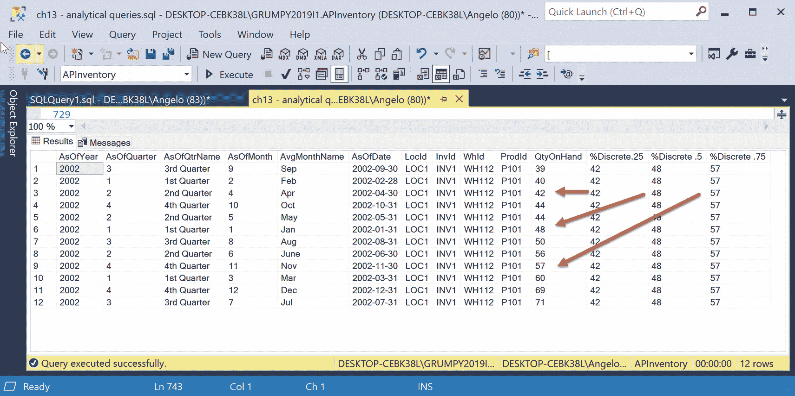

一个 SQL Server Management Studio (SSMS) 窗口的截图，显示了一个包含 15 列和 13 行的表格。列标题分别是：截至年份、截至季度、季度名称、截至月份、月份名称、截至日期、地点 ID、库存 ID、仓库 ID、产品 ID、库存量，以及离散百分位数 0.25、0.5 和 0.75。

图 13-37: 库存量的百分位数离散化查询结果

这次，三个百分位数值指向的是实际值，而非插值。此查询经验证无误，因此可以修改用于所有年份、地点、库存、仓库和产品。请注意，库存量代表的是月末最后一天报告的数值，而不是当月每天数值的总和。这正是离散数据与连续数据的区别所在。

#### 练习

使用此查询，将其修改为返回的值涵盖所有年份、月份、地点、库存、仓库和产品。先使用 `WHERE` 子句筛选条件来检查与上一个查询相同的产品和仓库。一旦确认你正确修改了 `PARTITION BY` 子句，再移除 `WHERE` 子句。你将需要为整个结果集提供一个 `ORDER BY` 子句。这个查询转换为 `VIEW`（视图）后，将是使用 Report Builder 工具（或一个非规范化报告表）构建的 `SSRS` 报告的理想候选。

性能调优时间到了。


### 性能注意事项

我们将再次生成通常的预估查询执行计划并查看结果。我们还将查看`IO`和`TIME`统计信息，然后修改查询，使其通过与`Calendar`表的`JOIN`来检索文本季度和月份名称，以替换`CASE`块。之后，我们将比较两个版本查询的分析结果。

#### 随堂测验

使用 SSMS 生成预估查询计划有哪些不同的方式？

请参考图 13-38。

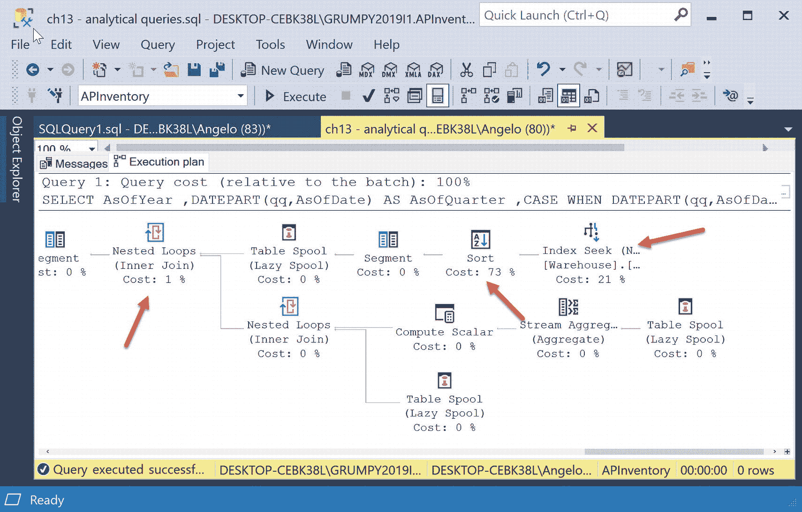

> 一个 SQL Server Management Studio (SSMS) 窗口的截图。它展示了右侧的预估查询执行计划，包含 11 个组件：Segment、Nested Loops、Table Spool、Segment、Sort、Index Seek、Nested Loops、Compute Scalar、Stream Aggregate、Table Spool 和 Table Spool。
>
> **图 13-38**
> 预估查询计划 – 右侧部分

我们将只查看计划的第一部分，因为剩余部分具有与我们分析`PERCENTILE_CONT`查询时看到的相同的重复模式。

相同的场景被生成：一个在`Warehouse`表上的索引查找任务，成本为 21%；一个昂贵的排序任务，成本为 73%。除嵌套循环联接任务成本为 1% 外，所有其他任务成本均为 0%。这是我们预期的。让我们运行`IO`和`TIME`统计信息，之后将修改查询，使其在查询中通过`JOIN`子句利用`Calendar`表。

请参考图 13-39。

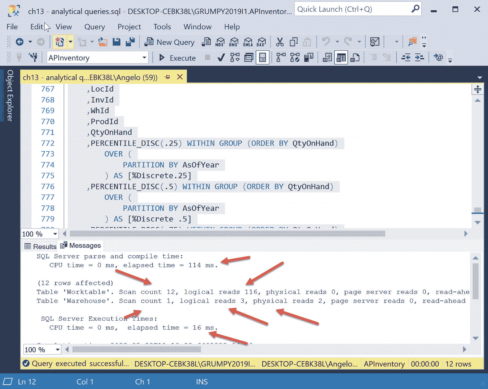

> 一个 SQL Server Management Studio (SSMS) 窗口的截图。文本展示了 I/O 和 TIME 统计信息。SQL Server 解析和编译时间，CPU 和已用时间分别为 0 和 114 毫秒。SQL Server 执行时间，CPU 和已用时间分别为 0 和 16 毫秒。影响了 2 个表的 12 行。
>
> **图 13-39**
> IO 和 TIME 统计信息

`IO`和`TIME`统计信息与`PERCENTILE_CONT()`相同，除了解析编译时间和 SQL Server 执行时间略有改善。注意`Warehouse`表上的物理读取（2）。注意临时工作表上的扫描计数（12）和逻辑读取（116）。

> **注意**
> 在您的笔记本电脑、工作站甚至开发服务器上运行此类分析时，请确保没有后台维护进程运行，因为这些进程可能会减慢性能并扭曲结果。

让我们按照清单 13-9 修改查询，使其现在包含与`Calendar`表的`JOIN`。

```sql
CREATE UNIQUE CLUSTERED INDEX pkCalendar
ON MasterData.Calendar (CalendarYear,CalendarDate)
GO
UPDATE STATISTICS MasterData.Calendar
GO
SELECT AsOfYear
,C.CalendarQtr
,C.CalendarTxtQuarter AS AsOfQtrName
,C.CalendarTxtMonth AS AvgMonthName
,C.CalendarDate AS AsOfDate
,LocId
,InvId
,WhId
,ProdId
,QtyOnHand
,PERCENTILE_DISC(.25) WITHIN GROUP (ORDER BY QtyOnHand)
OVER (
PARTITION BY AsOfYear
) AS [%Discrete.25]
,PERCENTILE_DISC(.5) WITHIN GROUP (ORDER BY QtyOnHand)
OVER (
PARTITION BY AsOfYear
) AS [%Discrete .5]
,PERCENTILE_DISC(.75) WITHIN GROUP (ORDER BY QtyOnHand)
OVER (
PARTITION BY AsOfYear
) AS [%Discrete .75]
FROM MasterData.Calendar C
JOIN Product.Warehouse W
ON W.AsOfDate = C.CalendarDate
WHERE C.CalendarYear = 2002
AND ProdId = 'P101'
AND Locid = 'LOC1'
AND InvId = 'INV1'
AND WhId = 'WH112'
GO
```

**清单 13-9**
增强的查询，至少我们希望如此！

我们需要做的第一件事是在`Calendar`表上基于年份和日历日期创建一个唯一的聚集索引。接下来，我们更新了表统计信息，以确保查询优化器拥有关于该表的最新、最准确的信息。

现在将注意力转向修改后的查询，注意`JOIN`谓词的顺序；内表是`Warehouse`表，外表是`Calendar`表。

现在让我们比较预估的查询计划。请参考图 13-40。

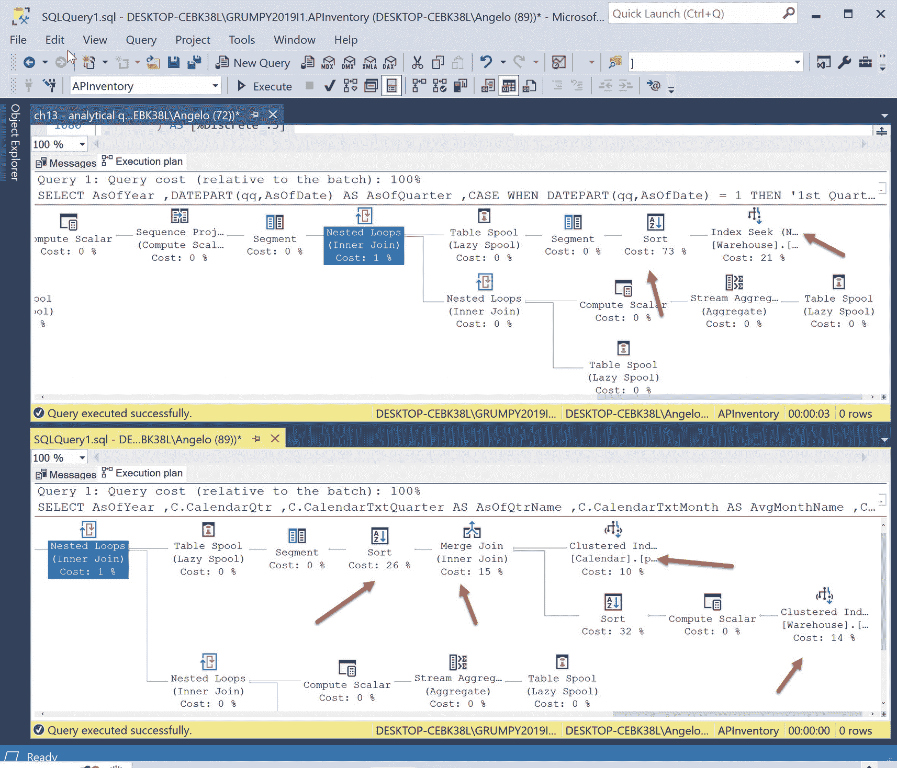

> 一个 SQL Server Management Studio (SSMS) 窗口的截图。它展示了 2 个预估查询执行计划，包含 13 个组件。两个计划中 Nested Loops 的成本均为 1%。计划 1 中 Sort 和 Index Seek 的成本分别为 73% 和 21%。计划 2 中 Sort、Merge Join 和 2 个 Clustered Index 的成本分别为 26%、15%、10% 和 14%。
>
> **图 13-40**
> 比较预估查询计划

新计划看起来好了一些。聚集索引查找成本从 21% 下降到 14%，排序任务成本从 73% 下降到 32%。

到目前为止，一切顺利。

我们看到了与`Calendar`表`JOIN`相关的新任务。我们看到一个成本为 10% 的聚集索引查找，后跟一个成本为 15% 的合并联接任务，以及一个成本为 26% 的新排序。

看起来`Warehouse`表的任务有所改进，但我们添加了一些新任务来处理我们需要的日历日期文本部分。记住，我们这样做是为了消除`CASE`块。

这样更好吗？让我们比较一下`IO`和`TIME`统计信息。

请参考图 13-41。

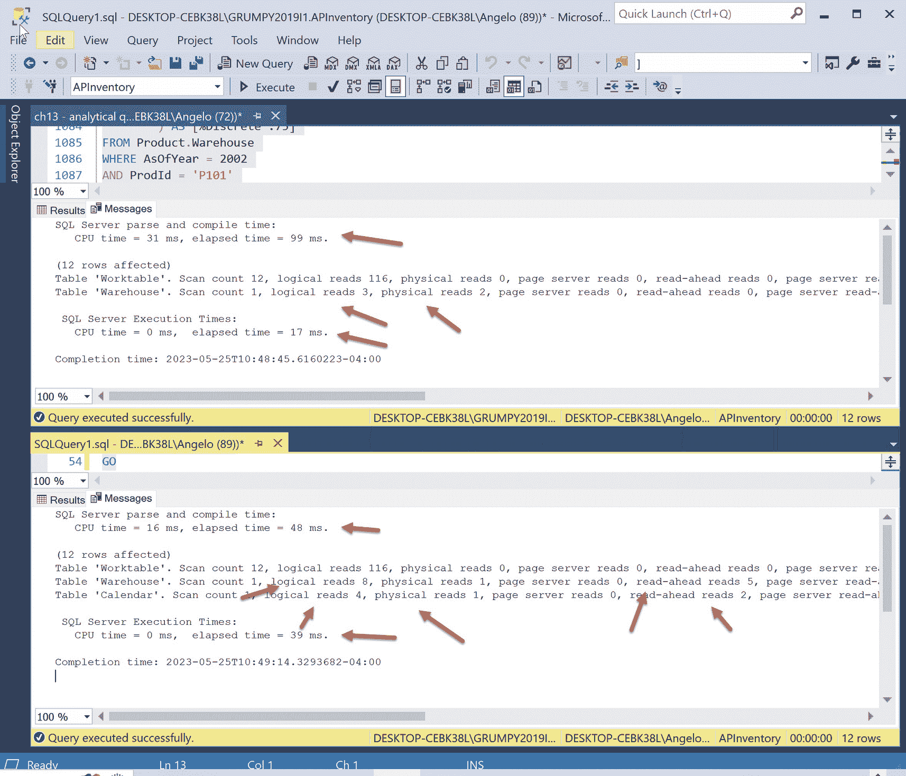

> 一个 SQL Server Management Studio (SSMS) 窗口的截图。它展示了 2 组 I/O 和 TIME 统计信息。解析和编译时间，CPU 和已用时间分别为 31, 99 和 16, 48 毫秒（对应 1 和 2）。执行时间，CPU 和已用时间分别为 0, 17 和 0, 39 毫秒（对应 1 和 2）。影响了 2 个和 3 个表的 12 行。
>
> **图 13-41**
> 比较`IO`和`TIME`统计信息

令人惊讶！

看起来我们的方案并没有产生我们所希望的积极改进。SQL Server 执行时间从 17 毫秒增加到 39 毫秒，增加了一倍多。临时工作表统计信息保持不变。

对于`Warehouse`表，我们看到扫描计数值为 1，逻辑读取为 8（这个值上升了），1 次物理读取（这个值下降了），以及 5 次预读读取。

最后，我们有了一组新的`Calendar`表统计信息：1 次扫描，4 次逻辑读取，1 次物理读取，以及 2 次预读读取。

结论：我们的增强并未实现显著的改进。如果我们将`Calendar`表通过使其成为内存增强表来置于内存中，这个策略将会奏效。否则，我们应该保留此查询原样。

有时候事情不会按预期发展，但为了学习和了解什么会奏效、什么不会奏效，值得一试。

让我们通过整体查看所有查询的统计信息来结束我们最后的性能分析与改进讨论。

### 随堂测验答案

使用 SSMS 生成预估查询计划有哪些不同的方式？

通过查询选择弹出菜单或通过顶部菜单栏中的图标。


### 整体性能考量

我们可以使用 Microsoft Excel 电子表格和图表来分析 `IO` 和 `TIME` 统计数据，以了解窗口函数之间的相对性能表现。通过将所有统计数据收集到一个表格中并绘制图表，我们可以看到 `PERCENT_RANK()` 函数相比其他函数消耗了大量的 `CPU` 和总执行时间。

我们将对 Warehouse 表和 work 表都进行此分析。图 13-42 展示了 Warehouse 表统计数据的可视化结果。

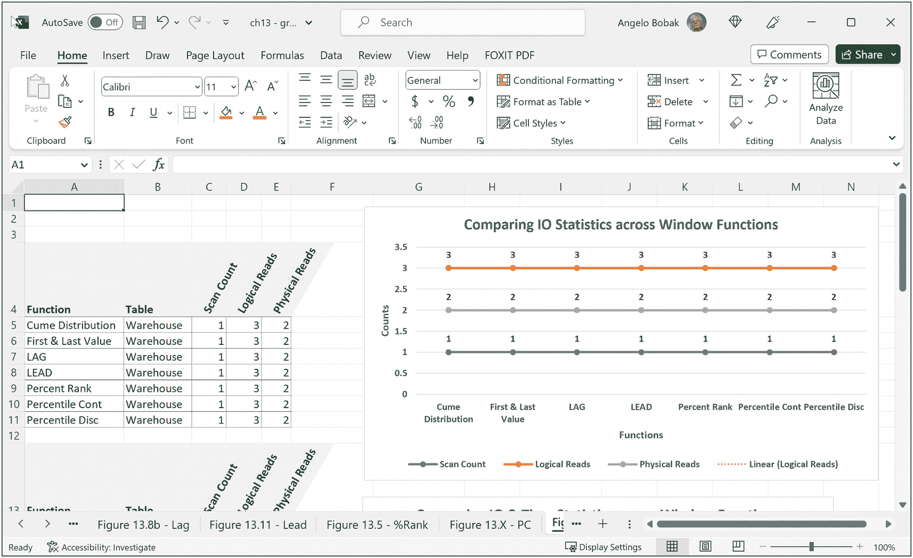

A screenshot of the M S Excel window. It has a table of 5 columns and 8 rows. The column headers are function, table, scan count, logical reads, and physical reads. It also has a line graph of counts versus functions with 3 horizontal lines for scan count, logical reads, and physical reads.

图 13-42

Warehouse 表的查询组合 IO 统计数据

这很有意思。针对 Warehouse 表的所有窗口函数的扫描计数、逻辑读取值和物理读取值都相同。那么我们能说所有这些函数的行为表现完全一致吗？

嗯，是的，因为我们大多数时候使用了相同的 `WHERE` 子句，所以这是我们需要考虑的一个因素。

让我们看看 work 表的可视化结果。

请参考图 13-43。

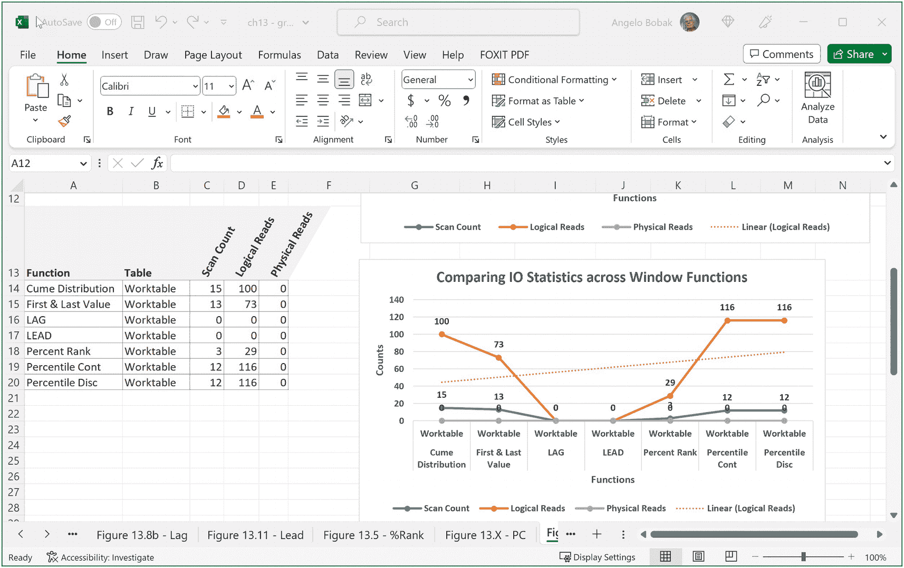

A screenshot of the M S Excel window. It has a table of 5 columns and 8 rows. The column headers are function, table, scan count, logical reads, and physical reads. It also has a line graph of counts versus functions with 2 inverted bell curves and a horizontal line.

图 13-43

work 表的查询组合 IO 统计数据

这个更有意思。看起来 `CUME_DIST()`、`PERCENTILE_CONT()` 和 `PERCENTILE_DISC()` 函数产生了最高的逻辑读取，而 `LAG()` 和 `LEAD()` 函数产生的最低。其他函数则介于两者之间。

就扫描计数而言，我们可以陈述相同的模式，有趣的是所有的物理读取都是零。

最后但同样重要的是，让我们看看所有函数的 CPU 和总耗时统计信息。

请参考图 13-44。

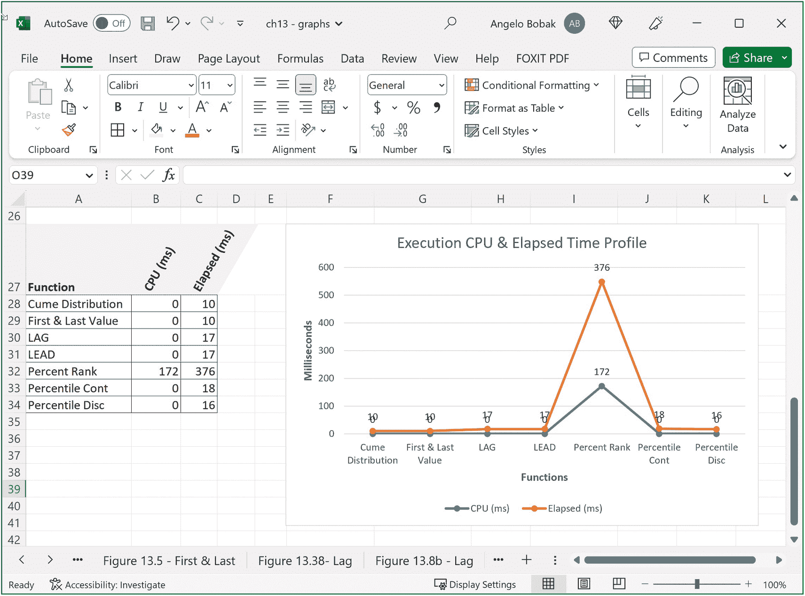

A screenshot of the M S Excel window. It has a table of 3 columns and 8 rows. The column headers are function, C P U, and elapsed. It also has a line graph of milliseconds versus functions with 2 almost horizontal curves for C P U and elapsed with a peak at 172 and 376 percent rank.

图 13-44

查询组合 CPU 和总耗时统计信息

可视化图表中又一组有趣的统计数据。看起来 `PERCENT_RANK()` 函数使用了最多的 `CPU` 资源并且执行时间最长。其余函数则相当稳定。

结论：通过生成图表来比较这些窗口函数的资源使用情况，是找出消耗资源最多的函数的好方法。这正是你开始性能调优的地方。换句话说，基于此分析来确定你需要优先调优哪些查询。

让我们通过查看几个 `SSRS` 报告来结束本章，以展示其钻取功能。这更像是一个展示与讲解的讨论，我们不会像之前那样详细介绍创建报告所需的步骤。

## Report Builder 示例

在其他章节中，我们讨论了如何修改我们创建和分析的简单查询，以返回更多数据（基本上是移除 `WHERE` 子句并调整 `PARTITION BY` 子句），这样它们就可以用作一些复杂的 SSRS 网络报告的基础。

`WHERE` 子句中的列随后将在 Report Builder 中用作过滤器。这是一个强大的概念，为业务分析师在查看和分析所需数据方面提供了极大的灵活性。

在本节中，我们将查看我创建的一个报告，该报告引用了本章讨论的一个 `VIEW`。这个 `VIEW` 叫做 `Reports.MonthlySumInventoryShort`。我们将在一个报告中使用它，该报告允许我们按年、季度、月以及地点、库存、仓库和产品进行钻取，以及你能想到的任何组合。

我不会展示如何构建它，正如我们在前面章节中看到的，但我们将专注于报告的导航功能。

请参考图 13-45。

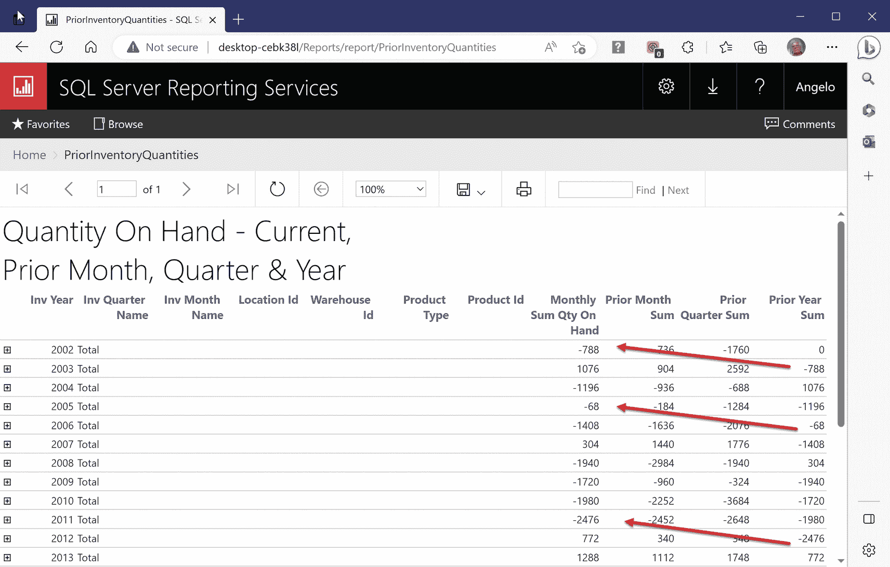

A screenshot of the S Q L S R S window with a table of 11 columns and 13 rows. The column headers are inv year, inv quarter name, inv month name, location I D, warehouse I D, product type, product I D, monthly sum quantity on hand, and prior month, quarter, and year sums in prior years view.

图 13-45

库存数量 – 往年视图

该报告已发布到我笔记本电脑上的个人 `SSRS` 网站，就像在真实的生产环境中一样。真棒！

这个初始视图显示了顶层的年份数据。如箭头所示，“前一年”列指向了 **Monthly Sum Qty On Hand** 列中的正确值。我想让报告中的字段名更详细一些，以便清楚地表明它们是什么。

如果我们点击 **Inv Year** 列旁边的加号按钮之一，我们将钻取到下一级别，即按年和季度的库存移动。

请参考图 13-46。

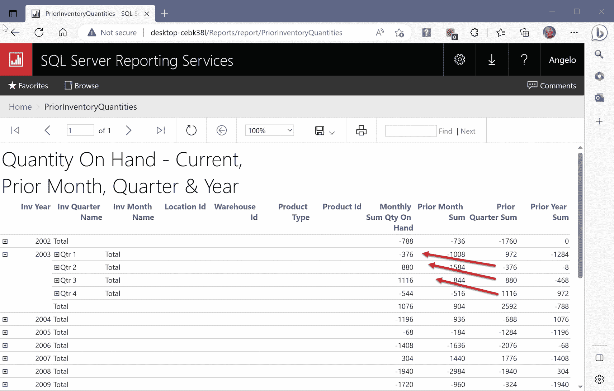

A screenshot of the S Q L S R S window with a table of 11 columns and 13 rows. The column headers are inv year, inv quarter name, inv month name, location I D, warehouse I D, product type, product I D, monthly sum quantity on hand, and prior month, quarter, and year sums in prior quarter view.

图 13-46

库存数量 – 上季度视图

成功！在 2003 年钻取显示该年的四个季度，并且“前一季度汇总”列中的值再次指向了 **Monthly Sum Qty On Hand** 中正确的库存总计。

让我们钻取到月份级别。

请参考图 13-47。

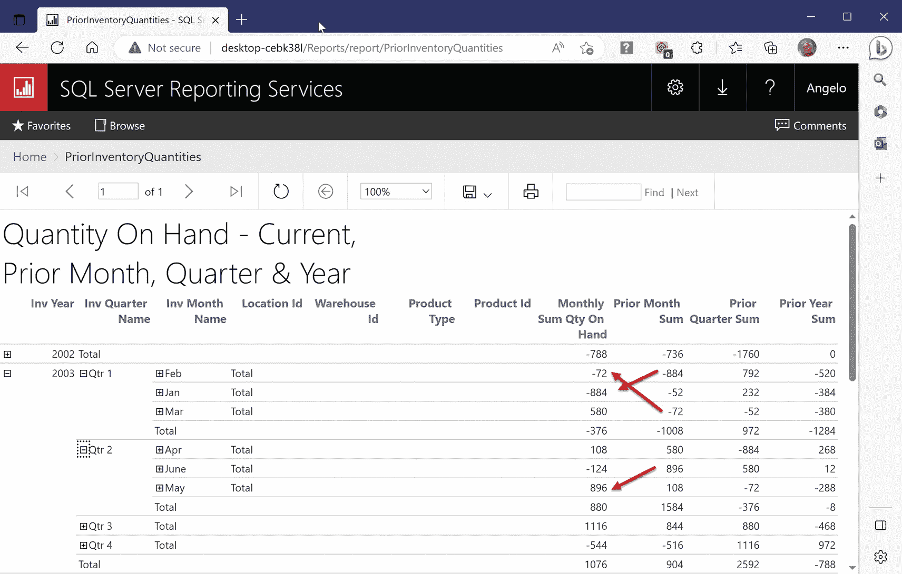

A screenshot of the S Q L S R S window with a table of 11 columns and 13 rows. The column headers are inv year, inv quarter name, inv month name, location I D, warehouse I D, product type, product I D, monthly sum quantity on hand, and prior month, quarter, and year sums in the prior month view.

图 13-47

库存数量 – 上月视图

钻取功能工作得很好，但请注意月份是按名称排序的，所以顺序有些混乱。我们总是可以回去，添加数字月份并重新发布，或者只修复显示月份文本值的列的排序顺序。是的，对于此列，你可以指定值按数字月份列排序，从而覆盖文本值上的排序。

在我们执行此操作之前，让我们在某个月份上钻取，以查看仓库级别的详细信息。

请参考图 13-48。

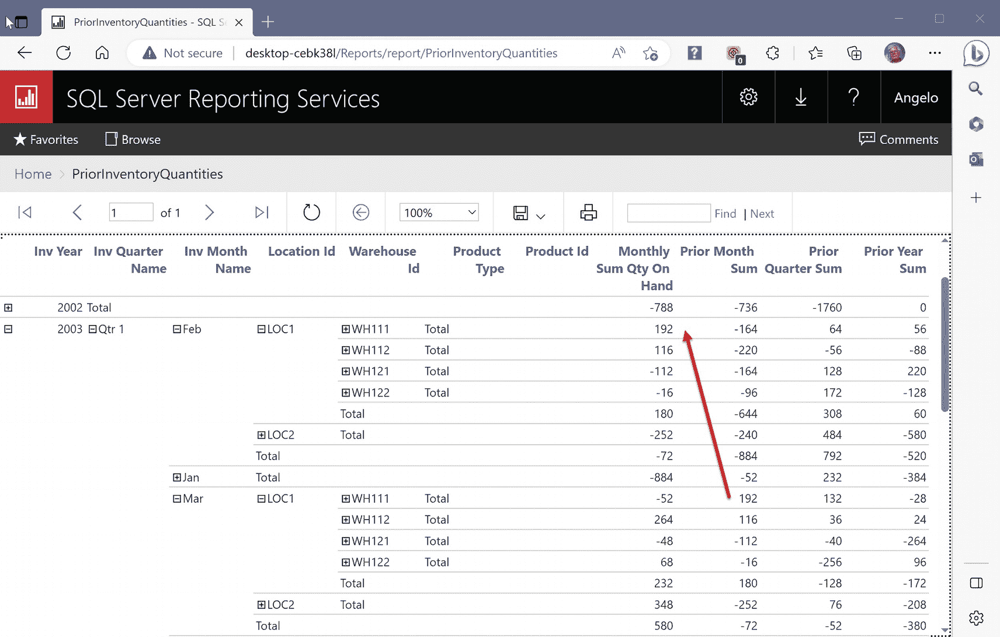


一张包含 11 列、13 行表格的 `SQL SRS` 窗口截图。列标题为 `inv year`、`inv quarter name`、`inv month name`、`location I D`、`warehouse I D`、`product type`、`product I D`、`monthly sum quantity on hand`，以及 `prior month`、`quarter` 和 `year sums in the prior warehouse view`。

**图 13-48** 库存数量 – 上月仓库视图

观察第一季度的三月份，我们可以看到仓库“WH111”的 `上月汇总` 值正确地指向了二月份在 `月库存数量汇总` 列中的对应数值。

让我们深入分析其中一个仓库，以便在产品级别查看结果。请参考 图 13-49。

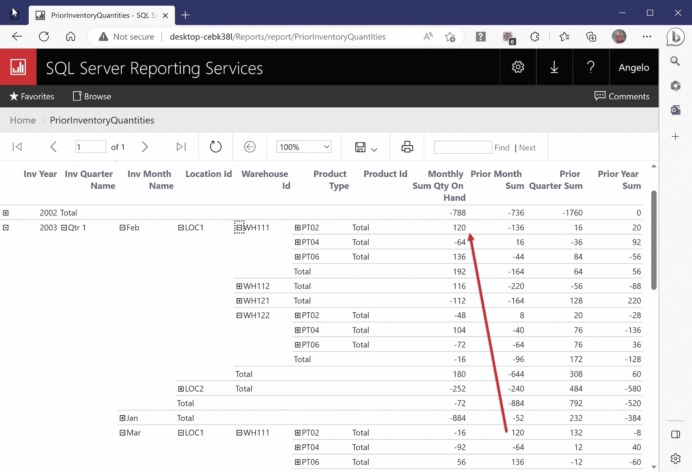

一张包含 11 列、13 行表格的 `SQL SRS` 窗口截图。列标题为 `Inv year`、`Inv quarter name`、`Inv month name`、`location I D`、`warehouse I D`、`product type`、`product I D`、`monthly sum quantity on hand`，以及 `prior month`、`quarter` 和 `year sums in prior product view`。

**图 13-49** 库存数量 – 上月产品视图

此报表也显示了正确的上月数值，但这次是在产品级别。如果不是因为月份名称排序错误，这份报表本应获得最高分！

我修复了这份报表，接下来的截图显示了月份按正确顺序排序。请参考 图 13-50。

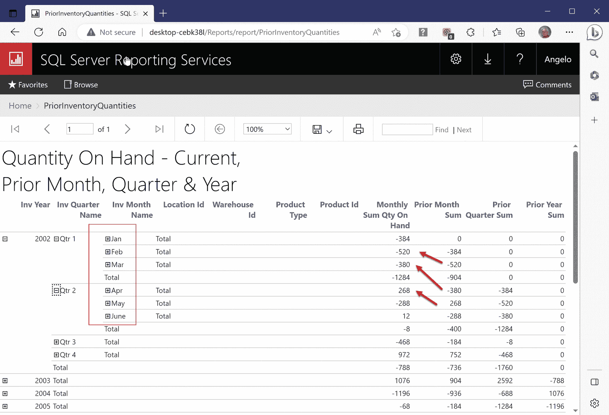

一张包含 11 列、13 行表格的 `SQL SRS` 窗口截图。列标题为 `inv year`、`inv quarter name`、`inv month name`、`location I D`、`warehouse I D`、`product type`、`product I D`、`monthly sum quantity on hand`，以及 `prior month`、`quarter` 和 `year sums in fixed sort order`。

**图 13-50** 修复后的排序顺序

这样就好多了。只需要单击月份名称列的属性，并将排序顺序更改为按月份数字排序，而不是按月份名称排序。从视觉上看，你将看到月份名称按正确顺序显示。这可以在 `报表生成器` 中完成，甚至可以直接在网站上编辑报表。

让我们看看如何实现这一点。请参考 图 13-51。

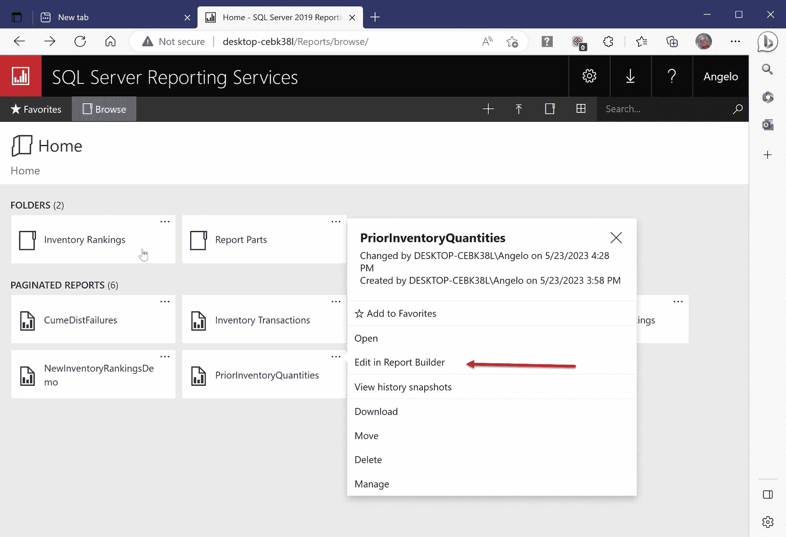

一张 `SQL Server Reporting Services` 主页的截图。它展示了两个名为“库存排名”和“报表部件”的文件夹以及 6 个分页报表。一个名为 `Prior Inventory Quantities` 的对话框包含 8 个选项。一个箭头指向 `在报表生成器中编辑`。

**图 13-51** 修复月份排序顺序，第 1 部分

我们要修复名为 `PriorInventoryQuantities` 的报表。单击报表名称右上角的三个点以显示包含多个选项的菜单。单击 “`在报表生成器中编辑`”。如果 `报表生成器` 已安装在你的计算机上，它将会启动。

**注意**

如果你的报表位于实际服务器上，则需要在服务器上安装 `报表生成器`。

一旦它在设计模式下加载了此报表，我们只需更改此列的排序参数。这非常容易操作。请参考 图 13-52。

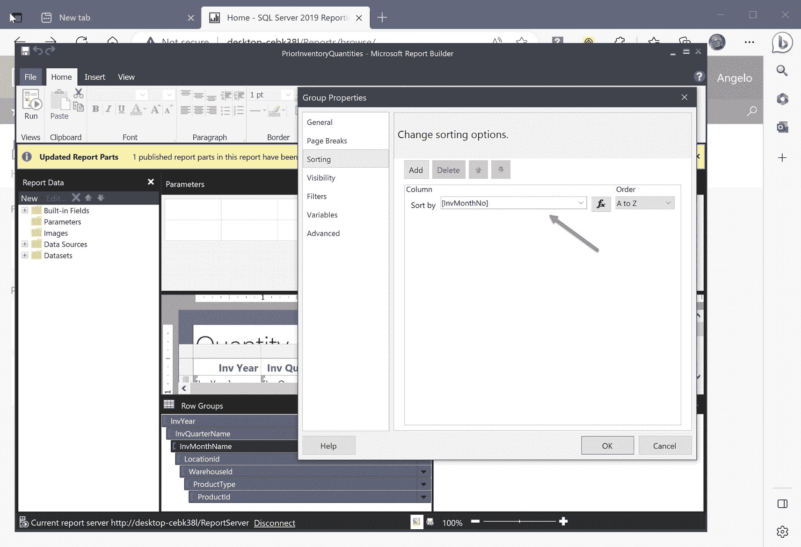

一张 `SQL Server Reporting Services` 主页的截图。它显示了 `Microsoft 报表生成器` 中的 `Prior Inventory Quantities` 文件。一个名为“组属性”的弹出对话框左面板有 7 个选项，其中选择了 `排序`。右面板有排序选项。

**图 13-52** 修复月份排序顺序，第 2 部分

在底部的 `行组` 部分，找到有问题的列。单击其右侧的向下箭头，然后选择 `组属性`。这将显示如上图所示的对话框，只需单击 `排序依据` 列表框并向下滚动到要排序的列。

一旦选定，单击 `确定` 按钮并退出 `报表生成器`。你将看到一个黄色的 `更新报表部件` 消息，说明报表已在服务器上更新。请确保也在本地保存了它！你肯定不想在笔记本电脑上重新发布本地报表并覆盖掉所做的更改。

就是这么简单。接下来是你的课后作业，完成后我们将结束本章。

## 作业

使用 `报表生成器`，利用 `APInventory` 数据库或 `APInventoryWarehouse` 数据仓库创建你想要的任何类型的报表。如果你没有在计算机或服务器上安装 `SSRS`，则无需发布它。

如果你尚未下载 `报表生成器`，只需进行网络搜索，下载并安装即可。使用标准的 Microsoft 安装程序即可完成，只需几个步骤。最后一章将向你展示在哪里可以找到并下载本书中使用的所有工具。

### 总结

我们成功了。我们的旅程已到达终点。在本章中，我们最后一次将分析函数应用于库存管理场景。我们使用了两个数据库：一个名为 `APInventory` 的库存事务数据库和一个名为 `APInventoryWarehouse` 的数据仓库。

我们根据业务分析师的规格说明执行了常见的脚本创建，并查看了结果。在某些情况下，我们利用查询的输出创建了有趣的 `Microsoft Excel` 可视化图表。

最后，我们执行了惯常的性能分析和增强，并学习了在 `Microsoft Excel` 电子表格中分析性能统计信息的技术。

我们以一个示例结束了本章，该示例演示了使用 `报表生成器` 创建的 `SSRS` 网络报表的深入分析功能。我们甚至看到了如何在报表发布后纠正其中的错误。我多希望可以说我是故意的，但我确实犯了这个错误！

正如俗话所说，如果生活给了你柠檬，那就做成柠檬汁吧。

在最后一章，我们将对冒险历程中所涵盖的内容进行简要总结，并结束全部内容。我还将向你展示在哪里可以获取：

*   `SQL Server Developer`（免费开发者许可证）
*   `Visual Studio Community`（免费开发者许可证）
*   `SQL Server Data Tools (SSMS)`（通过 `Visual Studio Installer` 安装）
*   `SSAS` 服务器和 `Visual Studio` 项目支持
*   `SSIS` 服务器和 `Visual Studio` 项目支持
*   来自 Microsoft 网站的 `SSMS` 下载安装程序（用于管理 `SQL Server` 和 `SSAS`）
*   `报表生成器`（免费开发者许可证）
*   `Microsoft Excel` – 这个需要付费，但物有所值

`SQL Server Data Tools`、`SSRS`、`SSAS` 和 `SSIS` 安装程序是从 `Visual Studio Community Installer` 下载的。如果你没有 `SQL Server` 的免费开发者许可证，请确保先下载并安装它，因为它不仅会安装 `SQL Server` 实例，还会安装 `SSAS`、`SSIS` 和 `SSRS` 服务器。

