# 14. 总结、结论与后续步骤

### 总结

恭喜！这是我们的最后一章。让我们通过总结所学内容，并查看我们工具包中的工具以及获取途径来结束。我甚至可能会告诉你如何创建数据库并加载数据！我们还将讨论如何设置用于存储代码和物理数据库文件的文件夹。

我建议你先创建文件夹、创建数据库并加载数据，这样在阅读各章节时，你就可以跟着一起操作和练习。


## 我们的历程

本书的目标是汇集一套可用于执行商业智能分析、数据挖掘和数据分析的工具。我亲切地称之为 SQL Server 工具包。

我首先识别了自 2012 年以来 SQL Server 中可用的三类函数：
- 聚合函数
- 排名函数
- 分析函数

这些函数与 `OVER()` 子句结合使用时，被视为窗口函数，并提供了强大的功能，例如跨月、日、年等时间跨度创建滚动计算。它们甚至允许我们在一组历史数据中向后和向前遍历，以便将当前值（在某个时间点）与未来或过去的值进行比较。最后但同样重要的是，一些函数可用于执行统计分析，例如在数据集中计算标准差、方差、均值和中位数值。

我们将这些函数应用于四个行业，以了解如何在每个行业中执行分析：
- 销售用例
- 财务用例
- 发电厂设备监控和故障分析用例
- 库存移动管理用例

在此过程中，我意识到这些工具只是 BI 数据分析策略版图的一部分。我介绍了多种工具，如 SSIS、SSRS、SSAS、Power BI、Report Builder 和 Microsoft Excel，以帮助我们可视化利用窗口函数的查询结果。

这些工具使我们能够生成、查看和分析业务分析师会用来报告公司绩效的有趣模式。最后，我们研究了一些性能分析工具，例如估计查询计划，它使我们能够分析查询性能并制定改进策略。

让我们回顾一下这些工具，并通过向您展示如何获取它们（下载、安装和配置）来总结！但首先，关于代码的说明。

## 关于代码

代码可以在本书出版商的网站上找到。每个业务用例都有三个专用文件夹，每个函数类别一个。作为第一章的每个业务场景章节文件夹都有三个子文件夹，分别用于创建数据库和表（`CREATE DATABASE` 文件夹）、加载表（`LOAD DATABASE` 文件夹）以及每章涵盖的查询（`CHAPTER QUERIES` 文件夹）。业务场景中剩余的两章只有查询文件夹。下载代码后，请确保在您的 PC 或笔记本电脑上为每章创建这些文件夹，以便轻松找到 TSQL 代码脚本。

如图 14-1 所示。

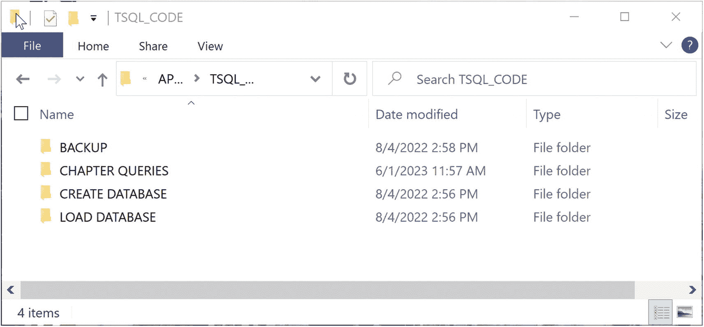

图 14-1 代码的文件夹结构

现在您知道在哪里下载代码以及将其放置在您设备上的哪个位置了。创建一个 `BACKUP` 文件夹是个好主意，这样您可以在修改脚本之前保存它们，以防万一搞砸了！相信我，备份文件夹多次救了我。

## 关于数据库文件夹

我为每个数据库设置了一个文件夹，每个数据库有三个子文件夹，如图 14-2 所示。

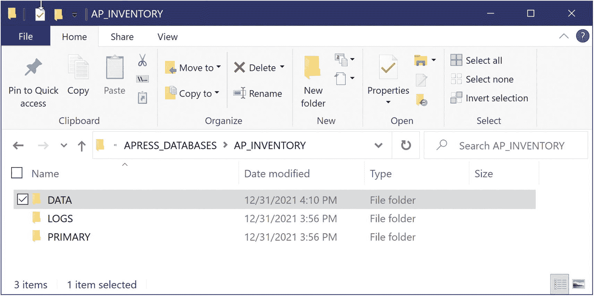

图 14-2 数据库的文件夹结构

我在 D 盘上创建了 `APRESS_DATABASES` 文件夹。我建议您使用与我相同的结构，当然，如果您只有一个驱动器（C 盘），您可以在那里设置文件夹。您需要修改创建数据库的 DDL 脚本，使其引用您在计算机上设置的文件夹结构。

如果您有 D 盘，请按照所示设置文件夹以节省一些工作。这将节省您的时间。另外，请保持数据库中使用的相同文件组名称。

## 示例中使用的数据

请记住，示例中生成的数据是随机生成的。我尽了最大努力去除了重复项和无意义的组合。在汇总账户余额和手头库存数量的章节中，我也非常自由地进行了处理，以便演示函数的行为。

例如，在财务数据库示例中：
- 假设月度值是月底扣除所有贷项和借项后账户中剩余的金额。这适用于与账户和投资组合相关的表。
- 假设滚动月度值将当月（扣除所有借项和贷项后）的值与上个月的值相加，以表示当月的总价值。

在某些情况下，我应用了以下 `ROWS` 窗口规范来处理两个月的滚动场景：

```
ROWS BETWEEN 1 PRECEDING AND CURRENT ROW
```

例如，在现实生活中，一个账户在 1 月可能有 100 美元，在 2 月有 50 美元。如果您认为总额是 150 美元，但如果 1 月或 2 月发生了借项，那就错了。如果没有发生借项，那么 150 美元就是总额，因为它包括了从 1 月结转到账户的现金。因此，有几个因素在起作用，比如账户的借项和贷项。

这是另一种情况。如果 2 月从账户中借记了 50 美元，并且没有向账户存入任何款项，那么剩下的就只有 50 美元（当月至今）。

同样的处理方式也适用于投资组合余额（在财务数据库章节）以及处理库存移动的三章。与财务场景一样，库存需要考虑进出库的流动，以实际报告月度库存总额。

代码有详细的注释，所以一切应该都很清楚。目标是理解窗口函数的工作原理，而不是模拟真实世界的业务场景或现实的数据模式。

如果您最终理解了滚动总额的工作原理，您就领先一步了。

## 工具包

我们在第 12 章预览了这个图表，但我认为值得再看一次，因为它向您展示了我们讨论过的所有工具，同时也间接地展示了您掌握这些技能后将拥有的所有能力！

除 Microsoft Excel 外，所有工具都是免费的。您需要订阅 Excel，但它物有所值。至于 SSAS、SSIS 和 SSRS，这些是在您下载并安装最新社区版的 Visual Studio 后可以添加的增强组件。我们将在最后一章讨论如何操作。

请参阅图 14-3。

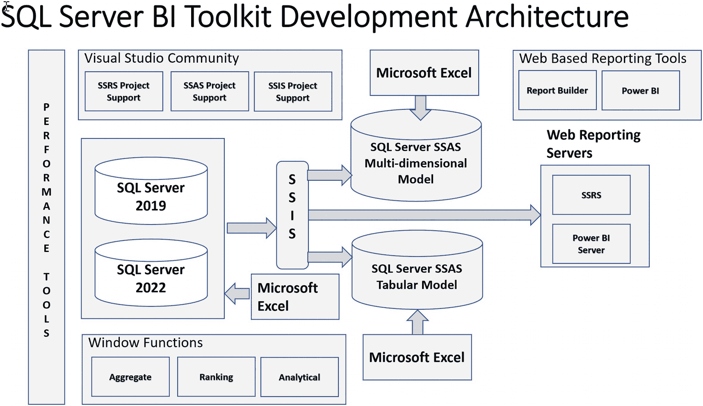

图 14-3 SQL Server BI 工具包

如图所示，有很多工具，我认为我们现在对它们的功能和应用方法有了基本的了解。你能相信你已经学会了如何使用所有这些工具吗？


## SQL Server

这是你所需的第一件也是最重要的组件工具。SQL Server 提供了数据库引擎，使你能够创建数据库、创建并加载表，当然还能运行我们刚刚讨论的所有窗口函数。

请参阅图 14-4。

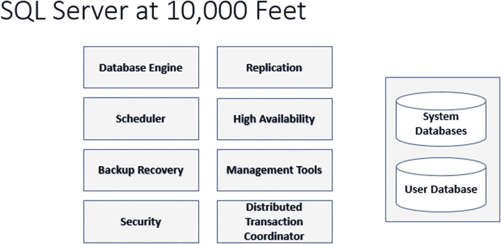

一幅图展示了 SQL Server 在万英尺高空下的 10 个组件。这些组件是数据库引擎、复制、调度器、高可用性、备份恢复、管理工具、安全、分布式事务协调器、系统数据库和用户数据库。

图 14-4

SQL Server 概览（误差一两英尺）

从一个非常高的层面来看，SQL Server 包括用于存储数据库及所有相关对象的数据库引擎，外加查询引擎、解析器和数据库文件管理进程。

注意

数据库由文件组成：用于存储数据的文件、用于存储系统数据库数据的文件、用于 `TEMPDB` 的文件以及用于事务日志的文件。所有这些文件都可以分组到称为文件组的桶中。如果你需要复习如何创建数据库及其结构，请查看我关于创建数据库的免费播客，网址是：

[`www.grumpyolditguy.com`](http://www.grumpyolditguy.com)

回到 SQL Server。它包含一个调度器，用于调度查询、脚本和外部程序，以便它们在需要的时间执行。你甚至可以调度 SSIS 包。

它包含一个备份/恢复进程，以便在数据损坏或处理错误的情况下备份和恢复数据库。

复制组件允许你在分布式架构中跨服务器复制数据库，高可用性组件确保 SQL Server 始终处于运行状态。

我们学到的工具可以利用分布式数据，所以请确保你理解此功能的工作原理。SSIS 可以连接分布式架构中的所有数据库，以便将它们加载到称为 ODS（操作数据存储）的集中式数据库中。

还有一个分布式事务协调器（DTC），它允许你创建跨多个数据库的事务。此组件确保所有跨多个服务器的分布式事务要么成功（提交），要么在出现问题时回滚（回滚），从而使数据库保持稳定和一致的状态。

最后，我们看到管理工具，其中包括我们使用过的估计查询计划生成器。我们大量依赖它来分析使用窗口函数的查询性能。

## SSMS

一旦我们下载并安装了 SQL Server，我们就需要一个工具来帮助我们管理数据库及相关对象，如表、索引、视图和查询脚本。SQL Server Management Studio 是首选工具。我们在整个旅程中都使用了它，所以你现在应该非常熟悉它了。我们只是触及了其众多功能和能力的皮毛。

请参阅图 14-5。

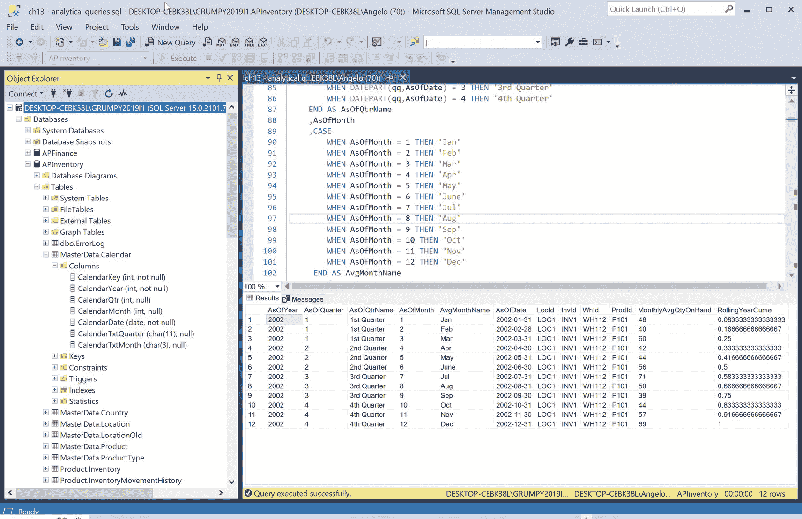

SSMS 窗口的截图。左侧面板显示了对象资源管理器，其中包含多个文件和文件夹。第一个文件被选中。右侧面板有一段用于在表中输入详细信息的代码和一个包含 13 列和 13 行的表。最后一列显示了滚动年度累计值。

图 14-5

SQL Server Management Studio

这里我们看到了熟悉的对象资源管理器、查询窗格和结果窗格窗口。未显示解决方案资源管理器，但你可以轻松修改 SSMS 的外观。

在安装 SQL Server 2019 或 2022 后，你将需要此工具。此工具不仅可以让你运行来自每一章的脚本，还可以运行创建每一章中使用的数据库并加载表的脚本。SSMS 还拥有大量你将严重依赖的管理工具。这是第二优先级！确保从 Microsoft 下载网站下载安装程序，并在设置 SQL Server 后立即安装它。

如果你想获得关于如何使用 SSMS 的简要教程，请查看我的免费播客，网址是 [`www.grumpyolditguy.com`](http://www.grumpyolditguy.com)。请参阅图 14-6。

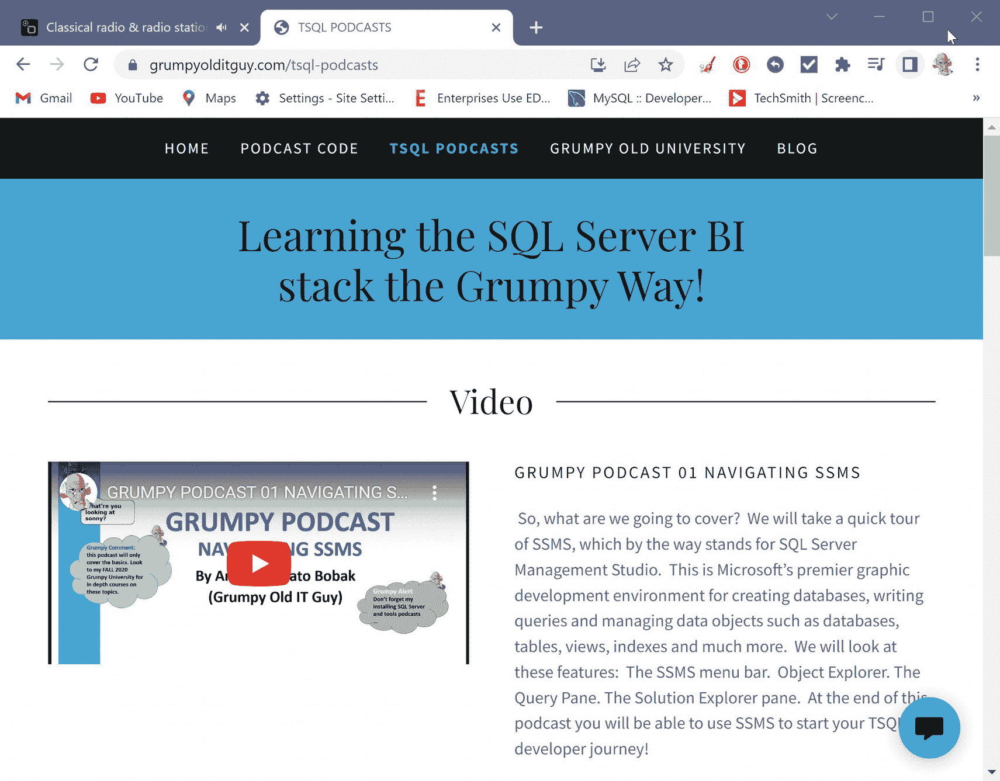

Chrome 浏览器窗口的截图。一个标签页打开了 T-SQL 播客网站。菜单栏中选中了 T-SQL 播客选项。标题写着：以暴躁的方式学习 SQL Server BI 技术栈！左侧显示一个 YouTube 视频，右侧显示详细信息。

图 14-6

Grumpy Old IT Guy 视频培训播客

顺便说一句，所有播客都是免费的，无需注册，但欢迎发表评论。如果你对如何改进内容有想法，请告诉我。

不过，使用 SSMS 的最佳方法是亲自尝试它。四处探索并尝试各种功能。很快，你就会在所有的编程任务中依赖这个工具。

稍后我将向你展示在哪里下载以及如何安装 SSMS。

## 窗口函数

以下是我们在每个业务场景中回顾的函数。

请参阅表 14-1。

表 14-1

按类别划分的函数

| 聚合 | 排名 | 分析 |
| --- | --- | --- |
| `COUNT()` | `RANK()` | `CUME_DIST()` |
| `COUNT_BIG()` | `DENSE_RANK()` | `FIRST_VALUE()` |
| `SUM()` | `NTILE()` | `LAST_VALUE()` |
| `MAX()` | `ROW_NUMBER()` | `LAG()` |
| `MIN()` |   | `LEAD()` |
| `GROUPING()` |   | `PERCENT_RANK()` |
| `STRING_AGG()` |   | `PERCENTILE_CONT()` |
| `STDEV()` |   | `PERCENTILE_DISC()` |
| `STDEVP()` |   |   |
| `VAR()` |   |   |
| `VARP()` |   |   |

这些函数与 `OVER()` 子句结合使用，使我们能够创建强大的查询，例如创建移动滚动总计和平均值。正如你所看到的，你还可以进行一些非常有趣的统计分析。

你将依赖这些查询来解决复杂的业务问题。你可以预料到在面试中会讨论这些，所以请确保你对它们了如指掌！关键在于 `OVER()` 子句。确保你理解 `PARTITION BY` 子句的作用、`ORDER BY` 子句的作用，以及窗口帧规范（`ROWS` 和 `RANGE`）的作用。同时理解当你有同时使用 `PARTITION BY` 和 `ORDER BY` 子句的 `OVER()` 子句，或仅使用其中之一，甚至是空的 `OVER()` 子句时，窗口帧规范的默认行为。确保你对数据集中的分区是什么有扎实的理解。如果这一点有点模糊，请务必回顾第 1 章，该章对此有详细解释。

如果你需要复习这些函数，挑选一章并查看它们。确保你尝试这些脚本，修改它们，破坏它们，并增强它们。这就是学习的方式。

最后，查看 Microsoft 关于这些函数的文档，以深入了解它们的工作原理。记住，这些是你的工具，所以请确保你知道它们能做什么、不能做什么以及如何使用它们！

注意

SQL Server 2022 为 `OVER()` 子句提供了替代语法。我在本书的前几章中简要介绍了这一点。还有一些新的窗口函数，例如：

`APPROX_PERCENTILE_CONT()`
`APPROX_PERCENTILE_DISC()`

绝对值得花时间通过参考 Microsoft SQL Server 2022 网站来查看 Microsoft SQL Server 2022 中可用的新功能。


## Visual Studio Community 许可证

Visual Studio Community 是 Microsoft 开发架构中提供给开发者的免费许可证，可用于创建从 C# 应用程序到 SSIS 包等各种类型的应用程序。该工具是 SSMS 的配套工具，您将用它来创建 SSAS 多维数据集和 SSIS ETL 包。

请参阅图 14-7。

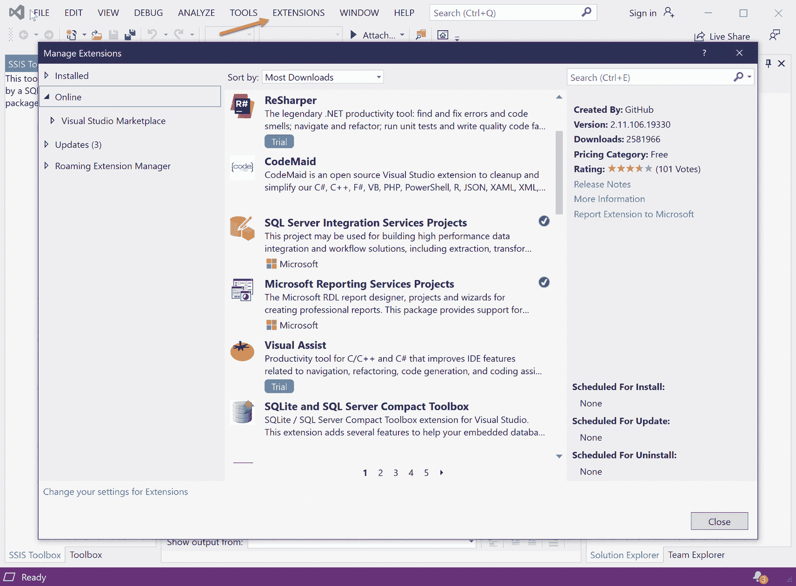

一张 Microsoft Visual Studio 窗口的截图。一个箭头指向顶部栏中的“扩展”选项。“管理扩展”弹出对话框在左面板中有 5 个选项。它展示了 6 个选项，其中包括“SQL Server Integration Services”和“Microsoft Reporting Services Projects”。

图 14-7

Visual Studio，选择项目模板

我很快会向您展示如何下载此工具，但首先让我们关注菜单栏中的 `EXTENSIONS` 选择。您将使用它来下载和安装 Visual Studio Community 中的 `SSIS`、`SSAS` 和 `SSRS` 项目支持。只需点击 `EXTENSIONS`，然后滚动列表以挑选您需要的内容。该列表非常广泛！

警告：这将需要时间进行下载和安装。再次说明，这将安装项目模板，以便您可以使用这些工具（如 `SSIS` 和 `SSAS` 项目）开发应用程序。您也可以创建 C#、Python 和其他类型的应用程序。

您在安装 SQL Server 时会安装 `SSAS`、`SSIS` 和 `SSRS` 服务器。在浏览安装界面时，您将有机会选择所需的组件，并通过指定要使用的安全凭据以及放置关键文件夹和文件的位置来配置它们。

### SSAS 项目

还记得这些吗？这是我们用来创建多维数据集的东西，它允许用户对数据进行切片和切块，并在数据的各个级别和聚合中上下导航。请参阅图 14-8。

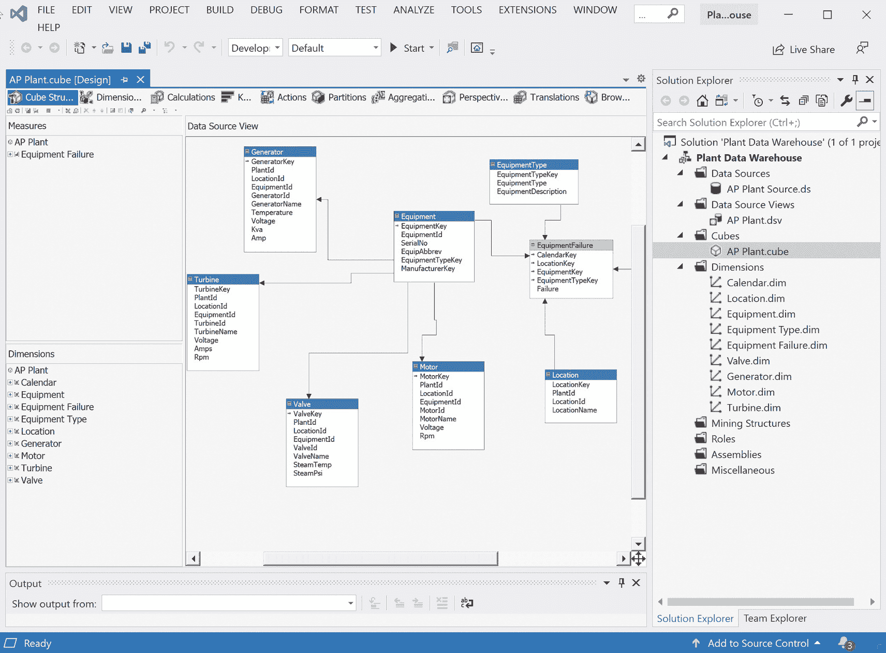

一张 SSAS 窗口的截图。左面板包含度量值和维度。“解决方案资源管理器”面板选中了“A P Plant.cube”。“数据源视图”有一个星型模式，其中“equipment”链接到“generator”、“turbine”、“valve”、“motor”和“equipment failure”，并带有“equipment type”和“location”。

图 14-8

SSAS OLAP 模型

这里是多维数据集结构面板，向您展示了我们在处理电厂用例章节中创建的 `SSAS` 多维数据集的结构。使用 Visual Studio `SSAS` 项目模板创建的多维数据集会在 `SSAS` 服务器实例上创建和加载，并可以通过 Microsoft Excel 电子表格和 Power BI 仪表板访问。您甚至可以使用一种称为 `MDX` 的查询语言来创建类似 SQL 的查询。这是另一种您可能想要学习的语言。

### SSIS 项目

Visual Studio 用于创建包含一个或多个项目的解决方案，这些项目包含用于加载数据库、创建多维数据集以及任何其他类型的数据集成过程的包。我们可以说 `SSIS` 是移动数据的工具，而 SQL Server 是提供数据的工具。

使用 `SSIS` 创建的解决方案可以部署到 SQL Server，以便按照您（DBA）或系统管理员使用称为 `SQL Agent` 的 SQL Server 调度工具定义的计划运行。

请参阅图 14-9。

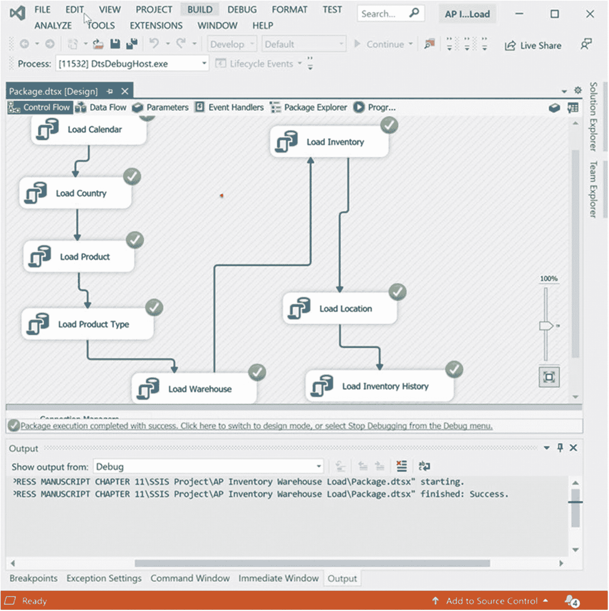

一张 SSIS 窗口的截图。包文件 “Package.dtsx” 已打开。它展示了一个流程图。第一步是“加载日历”，接着是“加载国家”、“加载产品”、“加载产品类型”、“加载仓库”、“加载库存”、“加载位置”和“加载库存历史记录”。下方是输出结果。

图 14-9

典型的 SSIS 包

这显示了我们在库存用例章节中创建的一个包的成功运行。此包从 `APInventory` 数据库检索数据，并将其加载到 `APInventoryWarehouse` 数据仓库中。这是一个非常重要的工具，您需要安装、学习并掌握它，才能成为 SQL Server 专家开发人员或数据集成架构师。

## Power BI Web 记分卡、仪表板和报表

Power BI 是我们用来创建一些简单报表和记分卡的工具。我们只触及了该工具功能的表面。Power BI 可以连接到各种数据源，包括 SQL Server 数据库和使用 Visual Studio Community（2019 或 2022；建议都安装，有备无患）创建的 `SSAS` 多维数据集。

请参阅图 14-10。

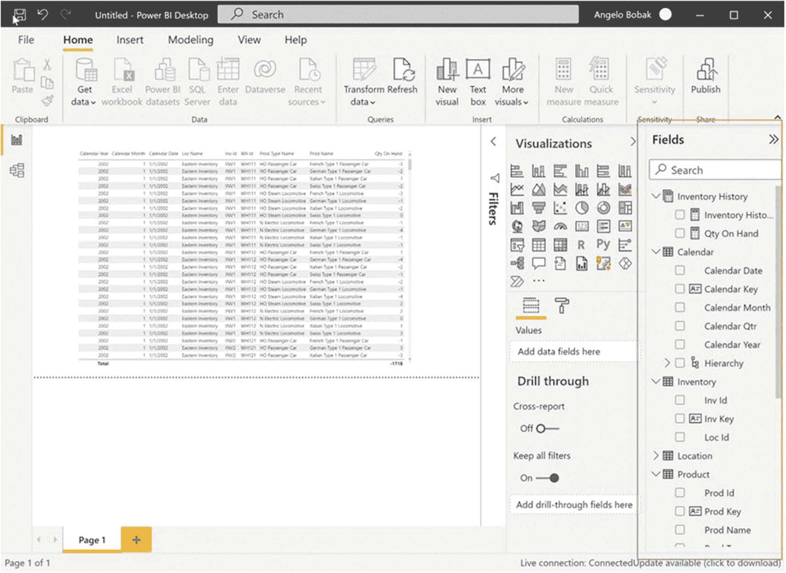

一张 Power BI 未命名文件窗口的截图。左面板有一个包含 9 列和 28 行的表格。列标题是“日历年”、“月”、“日”、“位置名称”、“I n v I D”、“W h I D”、“产品类型和名称”以及“数量”。右面板包含“筛选器”、“可视化效果”和“字段”。

图 14-10

Power BI 设计面板

此截图向您展示了设计面板，您可以在其中定义数据源、检索数据，并将其转换为多种复杂的可视化效果，如饼图、折线图和条形图。此工具可以免费获取以供评估。我们稍后将看到如何获取它。

## Microsoft Excel 电子表格

接下来是我们的老朋友，Microsoft Excel 电子表格。我们使用它来从各种业务用例数据库中提取数据，以创建一些有趣的报表和可视化效果。我们还创建了一些强大的数据透视表，使我们能够对数据进行切片和切块，并浏览每个数据库数据模型定义的各个层次结构。

请参阅图 14-11。

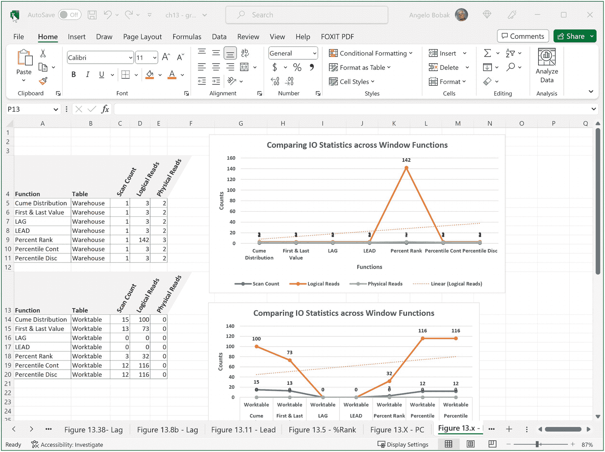

一张 MS Excel 窗口的截图。它有两个表格，各有 5 列和 8 行。列标题是“函数”、“表”、“扫描计数”、“逻辑读取”和“物理读取”。它还有两个折线图，显示了“扫描计数”、“逻辑读取”和“物理读取”针对不同函数的趋势线。

图 14-11

Microsoft Excel 可视化效果

这只是我们在库存章节中创建和讨论的可视化效果的一个示例。这是您（或您的业务分析师）用来从数据库中的数据准备报表和图表的一线工具。

如果您不熟悉电子表格的创建，请下载并安装该工具。它的价格合理，虽然不是免费的，但非常值得投资，您可以将其添加到您的技能集中。

注意

Excel 也有自己类似 `MDX` 的编程语言，称为 `DAX`。`DAX` 代表数据分析表达式。您可以将 `DAX` 与 `SSAS`、Power BI 和 Excel 数据透视表一起使用。

## SSAS 服务器

`SSAS` 服务器实例是作为整个 SQL Server Developer 安装的一部分安装的。您可以通过 SSMS 管理和操作使用 Visual Studio Community 创建的多维数据集。可以安装两种类型的服务器：多维服务器或表格（关系）服务器。安装 SQL Server 时，请同时安装这两种类型。

请参阅图 14-12。

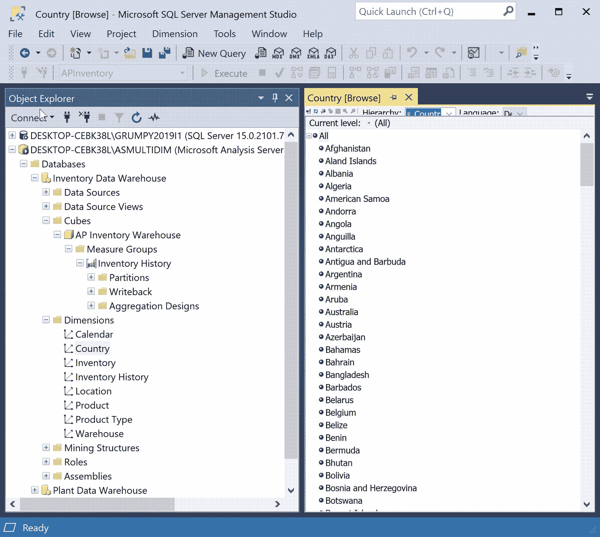

一张 SSMS 窗口的截图。左面板显示了包含多个文件和文件夹的“对象资源管理器”。右面板显示了一个国家列表。

图 14-12

从 SSMS 查看的 SSAS 实例

在这里，我们看到 AP 库存仓库多维数据集以及用于数据源、数据源视图、多维数据集度量值组和维度的各种文件夹。右侧面板显示了“国家”维度中可用的国家/地区名称。您可以使用查询窗格创建 `MDX` 查询。


## SSRS 服务器与网站

安装 SQL Server 开发人员版时，SSRS 也随之安装。现在，您需要下载一个单独的安装程序来安装最新版本的 SSRS。安装后，SSRS 允许您向用户交付基于 Web 的报告，例如图 14-13 中的示例，这是我们创建的样本报告之一。

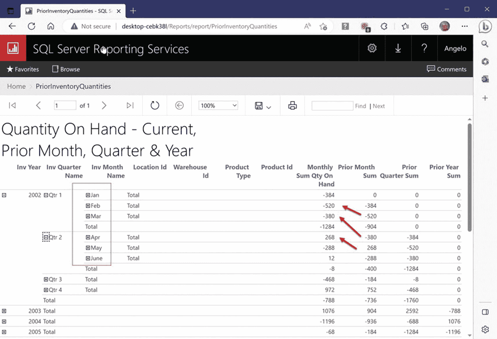
一个 SSRS 窗口的截图。它展示了一个包含 11 列和 15 行的表格。列标题为：Inv year、Inv quarter name、Inv month name、location ID、Warehouse ID、product type、Product ID、monthly sum quantity on hand、prior month sum、prior quarter sum 和 prior year sum。
图 14-13
SSRS 报告

一旦您通过 Visual Studio Community 中的 `EXTENSION` 菜单选择下载并安装了 SSRS 项目模板组件后，您需要在发布报告之前下载、安装并配置 SSRS 服务器。您可以从 Microsoft 下载站点下载 SSRS 安装程序：
`www.microsoft.com/en-us/download/details.aspx?id=100122`

运行可执行文件并按照引导安装步骤操作。最后，您可以启动配置工具。此工具也会添加到您的 Windows 桌面，因此您可以随时返回进行微调。请参考图 14-14。

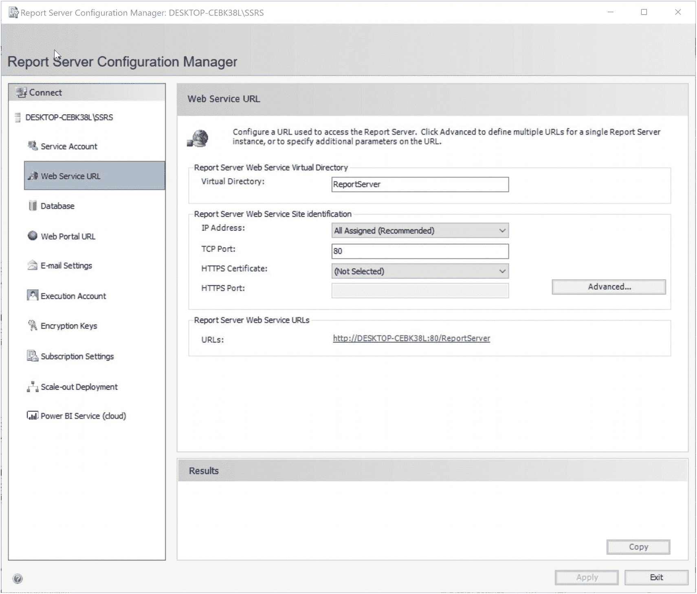
一个 Report Server Configuration Manager 窗口的截图。左侧的连接面板有 11 个选项，其中选中了 Web Service URL。右侧面板显示 Web Service URL。它包含虚拟目录、IP 地址、TCP 端口、HTTPS 证书和端口的输入框。
图 14-14
配置 SSRS

配置 SSRS 很直接。大部分情况下，您只需接受所有默认参数。如截图所示，左侧包含一个带有各种选项的面板。我们看到选中了 Web Server URL 面板，它向您显示了默认参数。

唯一需要您做一些工作的是数据库选择，您需要在其中定义将用于存储报告服务器和报告配置数据以及报告数据的数据库。大多数情况下，您只需提供一些名称，单击“确定”，然后看着它运行并构建数据库。

如果您对设置感到有点紧张，请查阅一些讨论安装和配置 SSRS 的网站。这很容易。显然，在创建报告之前，请先执行此设置。

## 报告生成器

我们在几个章节中使用此工具创建了一些简单的报告。过程很简单。选择向导会指导您，不知不觉中，您就得到了一份从数据库中提取数据的报告。请参考图 14-15。

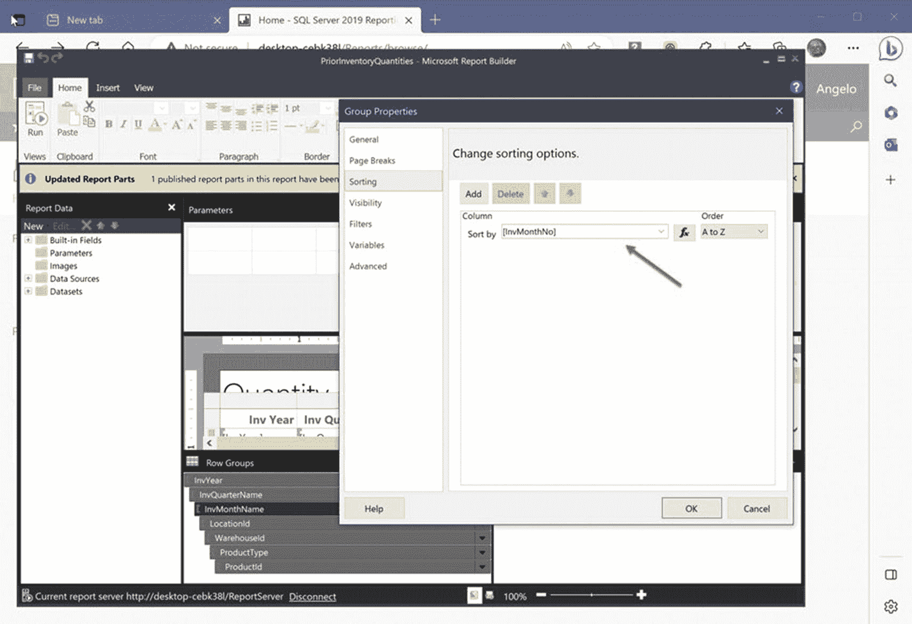
一个 Report Builder 窗口的截图。左侧面板显示包含 5 个文件夹的报告数据，右侧面板显示参数。一个 Group Properties 弹出对话框左侧有 7 个选项，其中选中了 sorting。右侧面板显示更改排序选项。
图 14-15
报告生成器设计面板

我们只触及了这个报告设计的皮毛。您可以创建包含图表和记分卡的报告，其中包含像显示关键信息的仪表这样的可视化元素，也可以创建可以向下钻取到任意多级详细信息的报告。这个工具也是免费的，所以没有理由不下载、安装并学习如何使用它。

从向导开始，不知不觉中，您就能从头开始创建带有过滤器、图表和向下钻取功能的报告。

## 性能分析工具

我相信这是您最喜欢的用于执行性能分析和增强的工具。我们使用此工具创建了估计执行计划，也创建了实时执行计划，这些计划向我们展示了 SQL Server 查询引擎执行查询所采取的步骤，以及任务之间传递了多少数据。

### 估计查询计划

请参考图 14-16。

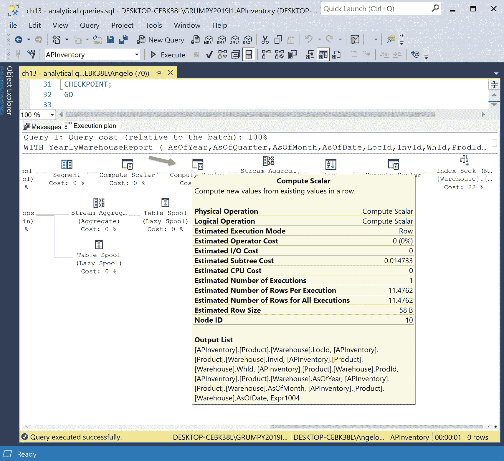
一个 SSMS 窗口的截图。它展示了一个包含 10 个组件的估计查询计划。选中了 Compute scalar，它打开一个弹出对话框。它展示了 12 个元素的详细信息，例如物理和逻辑操作、估计执行模式和运算符成本。下方是输出列表。
图 14-16
典型的估计查询计划

这个可视化效果很棒，通过将鼠标悬停在任何任务上，您都可以看到涉及的详细信息。此工具与 `IO`、`TIME` 和 `PROFILE` 统计信息结合使用非常强大，使我们能够评估性能并制定一些调优策略。

它的“兄弟”——实时查询计划，将性能分析更进一步。

### 实时查询计划

请参考图 14-17。

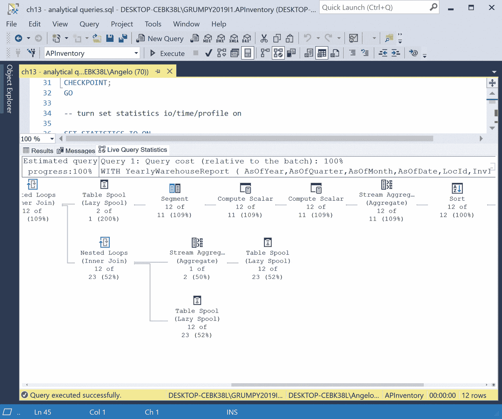
一个 SSMS 窗口的截图。它展示了一个包含 11 个组件的实时查询计划。这些组件是 nested loops、table spool、segment、compute scalar、compute scalar、stream aggregate、sort、nested loops、stream aggregate、table spool 和 table spool。
图 14-17
实时查询计划

这与估计查询计划工具类似，但我们可以看到在每个任务之间传递的实际行数。如果数据量足够大，并且查询需要运行几分钟，您可以看到这些值动态变化。

请确保两个计划中显示的估计成本接近；否则，可能存在严重问题，需要调查。

### DBCC

我们使用这个简单但重要的工具来清除查询用于存储数据和计划的内存缓存。每次需要进行性能分析时，请先运行此命令，以便清除缓存并获得准确的一组统计信息。请参考代码清单 14-1。

```
DBCC dropcleanbuffers;
CHECKPOINT;
GO
```
代码清单 14-1
运行 DBCC

如果不运行此工具，数据和计划信息将存储在内存中，因此您正在分析的查询的后续运行将返回不正确的结果（就 `IO` 和 `TIME` 统计信息而言），因为该查询利用了内存中的数据和查询信息。

### IO 和 TIME 统计信息

在我们的性能调优会话中，我们多次依赖这组统计信息。它们告诉我们发生了多少操作，例如磁盘扫描和物理读取，以及查询解析和运行所需的时间。

注意
解析步骤是查询引擎确保语法正确并知道需要检索的数据位置所在的时候。还会创建称为解析树的对象。这就是当我们查看计划时估计查询计划工具所显示的内容。请参考代码清单 14-2。

```
SET STATISTICS IO ON
GO
SET STATISTICS TIME ON
GO
```
代码清单 14-2
开启 IO 和 TIME 统计信息

在运行 `DBCC` 后运行这些命令以开启统计信息，然后执行查询。当您完成并希望停止显示统计信息时，将 `ON` 更改为 `OFF`。请参考图 14-18。

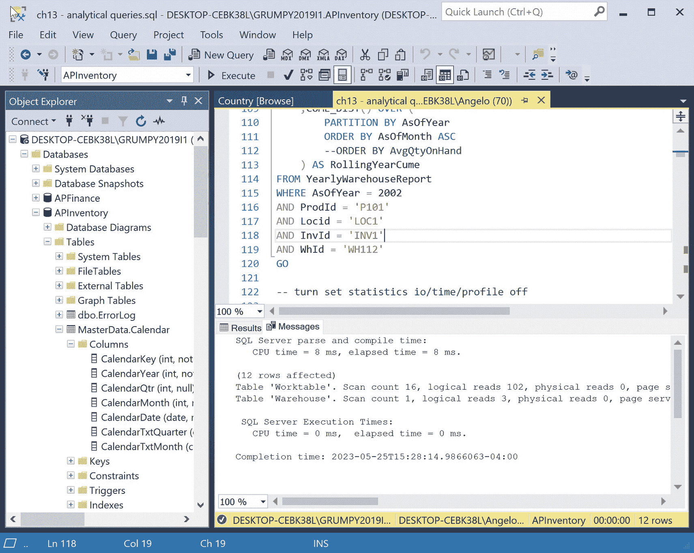
一个 SSMS 窗口的截图。左侧面板展示了对象资源管理器。右侧面板有代码以及 IO 和 TIME 统计信息。CPU 和已用时间的解析与编译时间均为 8 毫秒。CPU 和已用时间的执行时间均为 0 毫秒。影响了 12 行。
图 14-18
IO 和 TIME 统计信息

我知道您记得这些。如果所有查询都在 0 毫秒内运行，那不是很好吗？


### 统计信息配置文件

有时，你需要深入了解查询计划任务中发生了什么。这组统计信息提供的信息类似于 `IO` 和 `TIME` 统计，但它还会显示生成这些统计信息的代码段。

开启这些统计信息很简单。

请参考清单 14-3。

```sql
SET STATISTICS PROFILE ON
GO
SET STATISTICS PROFILE OFF
GO
```
*清单 14-3*
*设置 STATISTICS PROFILE ON*

你可以在设置其他统计信息之后将这些设置为 `ON`，或者单独运行它们。确保在会话结束时将它们全部关闭 `OFF`，因为它们也会消耗资源。

请参考图 14-19。

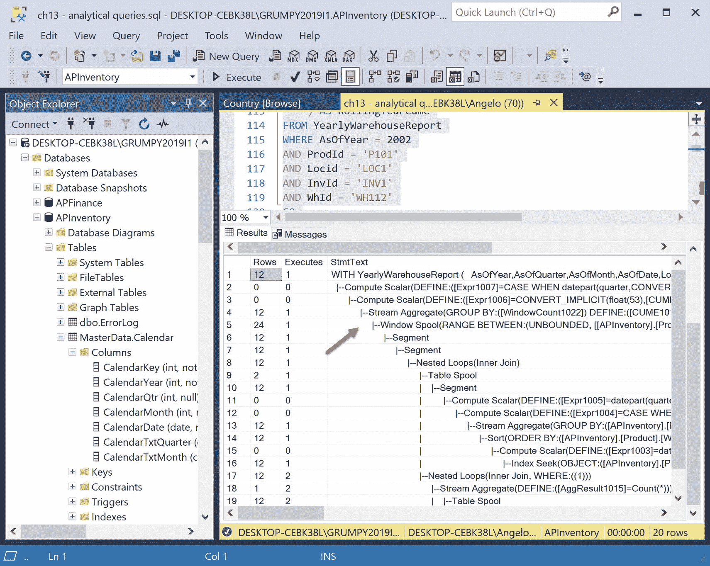
*图 14-19*
*STATISTICS PROFILE 报告*

回忆一下这些信息有多详细。以下是显示窗口假脱机任务中发生了什么的语句文本：

```sql
--Window Spool(
RANGE BETWEEN:(UNBOUNDED, [[APInventory].[Product].[Warehouse].[AsOfMonth]]
)
)
```

好了，我们的回顾到此结束。那么，我们如何获得所有这些好用的工具呢？

## 如何获取工具

你可以通过网页搜索找到这些工具中的大部分，搜索结果会指向正确的 Microsoft 网页。请仅从 Microsoft 获取这些免费工具，并阅读许可要求！

### SQL Server 开发者版

截至撰写本文时，你可以从这里获取最新版 SQL Server（如 SQL Server 2022）的开发者许可证。

请参考图 14-20。

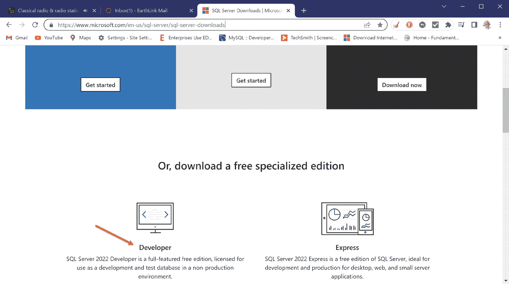
*图 14-20*
*下载 SQL Server 开发者版*

确保你下载的是开发者许可证。

截至撰写本文时，网址是：

`www.microsoft.com/en-us/sql-server/sql-server-downloads`

SQL Server 2019 也可用，还有一个称为 SQL Server Express 的轻量版。

我建议你下载 SQL Server 2022，因为它有许多新特性以及新的窗口函数，例如 `APPROX_PERCENTILE_CONT()` 和 `APPROX_PERCENTILE_DISC()`。

### Visual Studio 社区版

你需要先下载并安装这个，然后才能安装包含 SSMS 以及 SSAS、SSRS 和 SSIS 项目模板支持的数据工具。

请参考图 14-21。

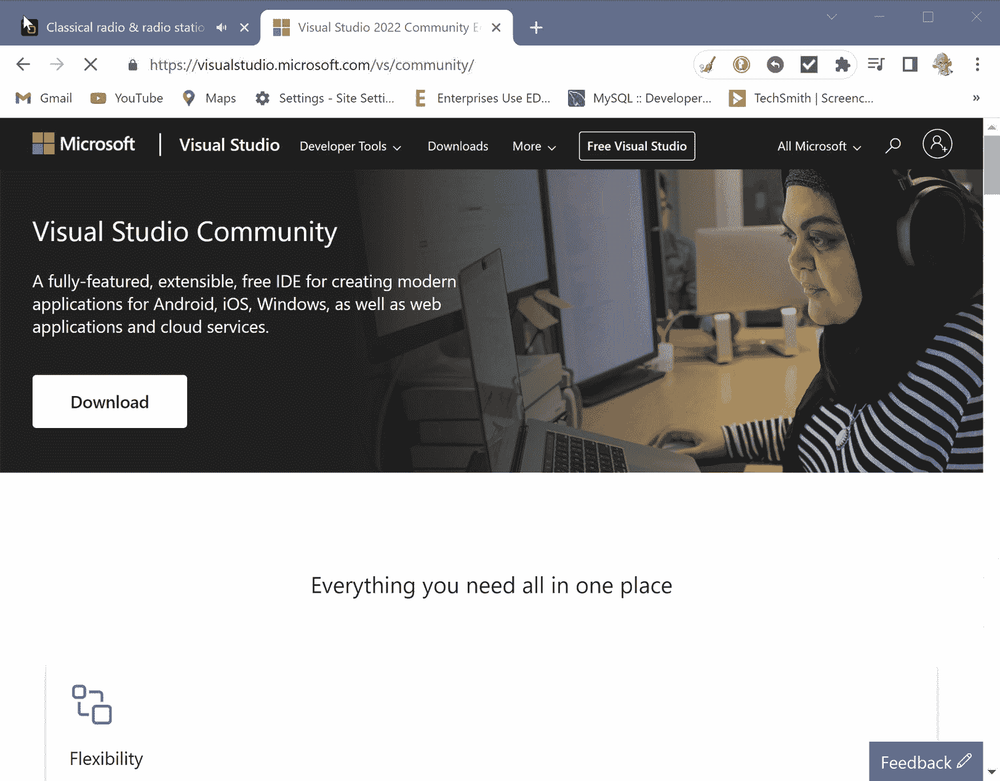
*图 14-21*
*Visual Studio 社区版*

截至撰写本文时，网址是：

`https://visualstudio.microsoft.com/vs/community/`

下载并安装它。这需要一些时间。让安装过程开始，并确保手边有杯咖啡。你的耐心将得到一个强大开发环境的回报。

### SQL Server 数据工具

这可以作为一个工作负载通过 Visual Studio Installer 下载。

当你安装 Visual Studio 社区版许可证时，安装程序会出现在你的 Windows 菜单中。

请参考图 14-22。

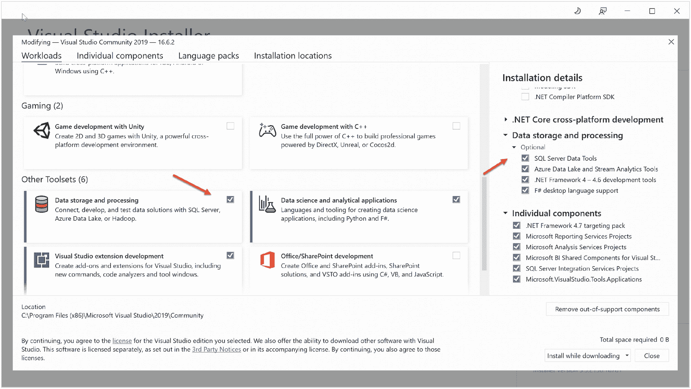
*图 14-22*
*安装“数据存储和处理”工作负载*

运行 Visual Studio Installer 工具并选择你想要的特性。

### SQL Server SSAS 项目支持

你可能也希望包含此功能，以便能够使用 Visual Studio 社区版创建 SQL Server 项目。

请参考图 14-23。

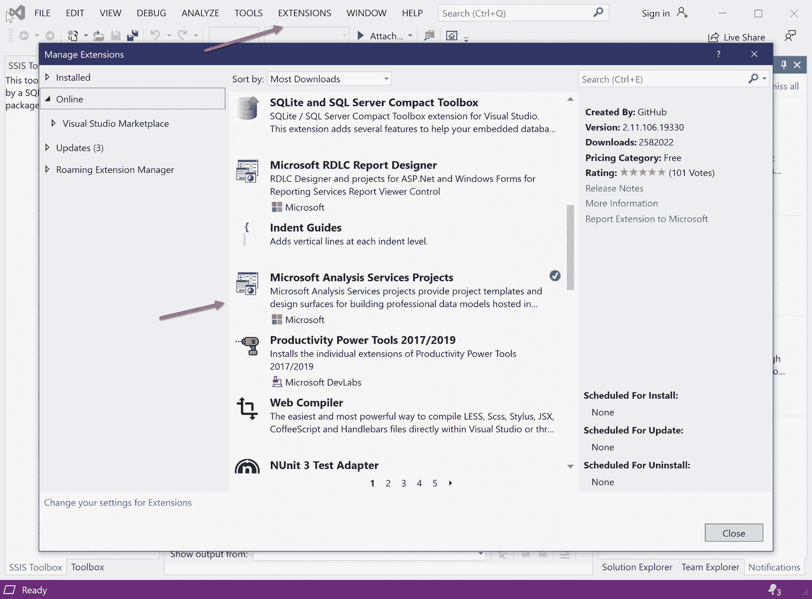
*图 14-23*
*下载 SSAS 项目支持*

请注意，有很多“东西”可选，因此你可能需要滚动相当长的距离才能找到所需内容。请准备好留出几个小时来下载和安装本书中讨论的所有项目模板。

### SQL Server SSIS 项目支持

向下滚动获取 SSIS 项目模板。

请参考图 14-24。

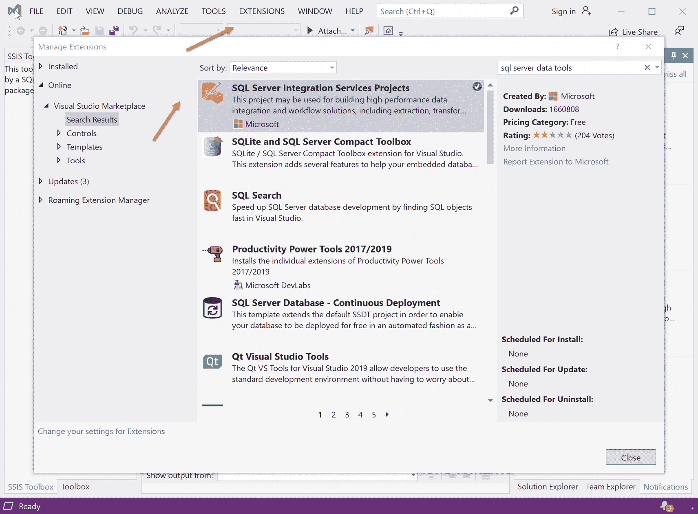
*图 14-24*
*使用 Visual Studio 获取 SSIS*

只需选择它并滚动到下一个项目，即……

### SQL Server SSRS 项目支持

和其他的一样，选择它并单击下载。

请参考图 14-25。

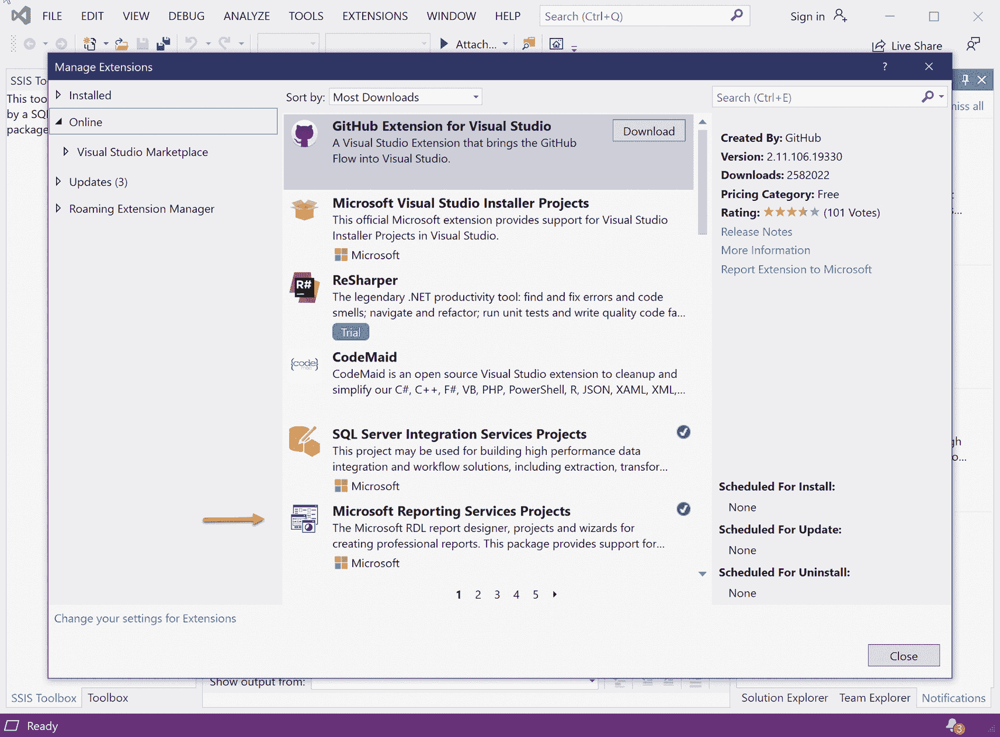
*图 14-25*
*使用 Visual Studio 获取 SSRS*

这不太难，对吧？接下来，我们需要我们的报告开发工具。

### 报表生成器

用你喜欢的网页浏览器搜索，你会找到这个网页。

请参考图 14-26。

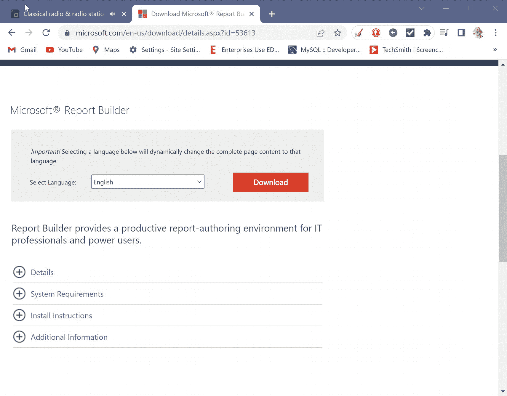
*图 14-26*
*如何获取报表生成器*

用你喜欢的浏览器搜索，或者查看以下网址。截至撰写本文时，网址是：

`www.microsoft.com/en-us/download/details.aspx?id=53613`

只需点击下载获取安装程序，然后按照步骤操作。这些大多是默认选择，接受它们即可。只需在每个屏幕上单击“下一步”按钮。

还有三个项目需要下载和安装。下一个是 Power BI Desktop。


## Power BI Desktop

我们即将完成这部分的介绍。

请参考图 14-27 获取`Power BI Desktop`。

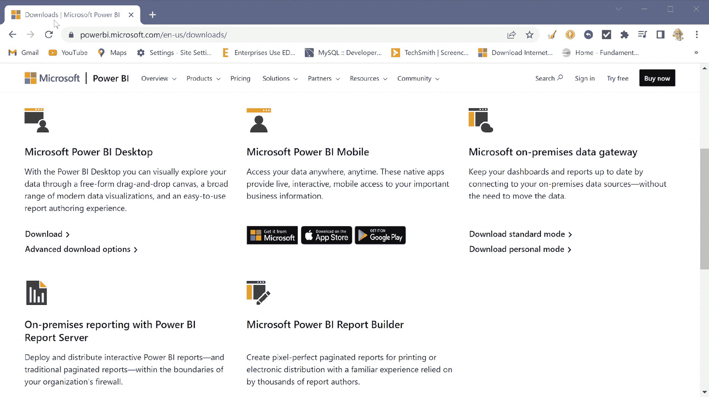

Chrome 窗口的截图。其中一个标签页打开了“下载 Microsoft Power BI”网站。它有 5 个选项：Microsoft Power BI Desktop、Microsoft Power BI Mobile、Microsoft on-premises data gateway、On-premises reporting with Power BI Report Server 和 Microsoft Power BI Report Builder。

图 14-27 获取`Power BI Desktop`

我们对`Power BI Desktop`和使用`Power BI`进行本地报告感兴趣。

截至本文撰写时，网址是：

[`https://powerbi.microsoft.com/en-us/downloads/`](https://powerbi.microsoft.com/en-us/downloads/)

照常，点击链接，下载安装程序，运行它，并按照简单的说明操作。

顺便说一下，这个网站似乎同时提供了`Power BI Desktop`和`Power BI`服务器。

## Power BI Server

最好在你的个人学习或开发环境上运行一个个人`Power BI`服务器，所以也要获取这个组件。

请参考图 14-28。

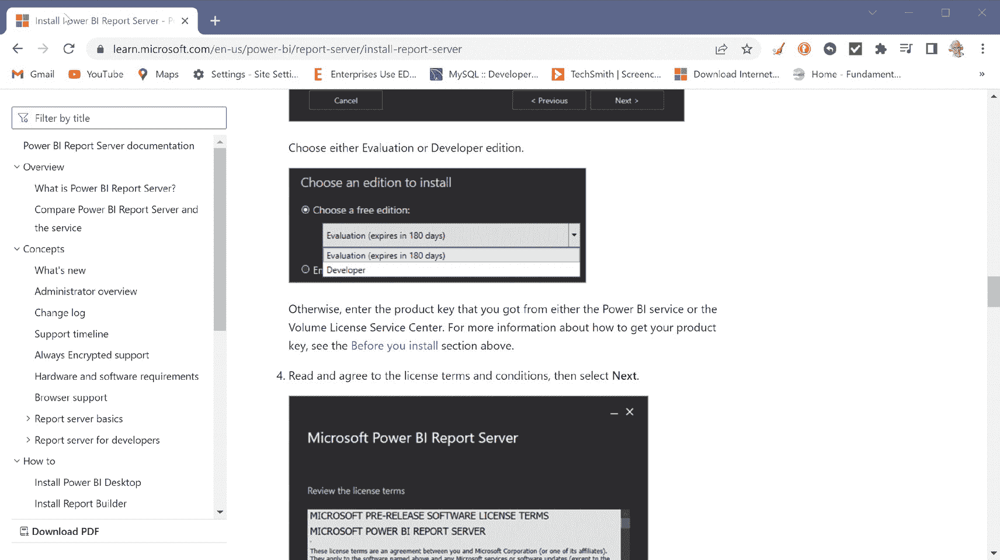

Chrome 窗口的截图。其中一个标签页打开了“安装 Power BI Report Server”网站。左侧面板有多个选项。右侧面板有选择要安装的版本、许可证和条款与条件的选项。免费版本被选中，有效期为 180 天。

图 14-28 获取`Power BI`服务器

确保你下载的是免费的开发者版本，并且始终阅读许可证要求。

截至本文撰写时，网址是：

[`https://learn.microsoft.com/en-us/power-bi/report-server/install-report-server`](https://learn.microsoft.com/en-us/power-bi/report-server/install-report-server)

安装后，配置步骤看起来很像`SSRS`。

最后但同样重要的是`Microsoft Excel`，但如果你还没有，就需要付费购买！

## Microsoft Excel

这不是免费的，但物有所值！访问以下网站或用你喜欢的浏览器进行搜索。为了安全起见，只从`Microsoft`购买。

请参考图 14-29。

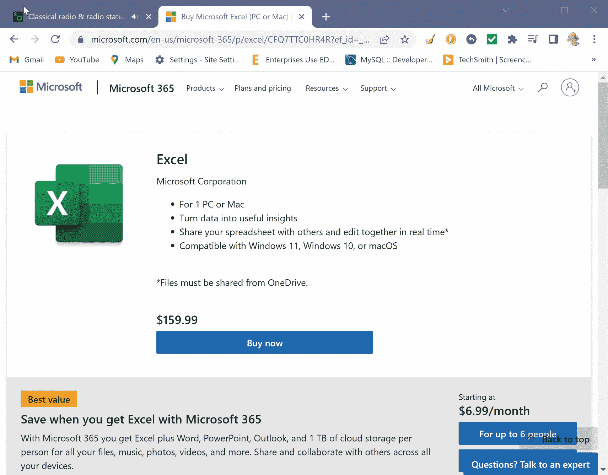

Chrome 窗口的截图。其中一个标签页打开了“购买 Microsoft Excel”网站。它展示了屏幕上的`Microsoft Excel`标志和订阅详情。费用是$159.99。下方是“立即购买”按钮。底部面板展示了通过`Microsoft 365`获取`Excel`的最佳价值方案。

图 14-29 `Microsoft Excel`订阅

查看哪种选项在价格和功能方面适合你。

截至本文撰写时，网址是：

[`www.microsoft.com/en-us/download/details.aspx?id=53613/`](http://www.microsoft.com/en-us/download/details.aspx%3Fid%3D53613/)

就是这样。现在你知道从哪里获取所有工具了。如果你像我在学习所有这些工具时那样开始，会经历很多试错和摸索，但这正是学习的方式。只要确保是在你自己的个人环境上，而不是在生产服务器上！

## SSMS

我差点忘了`SSMS`。只需导航到以下链接下载安装程序。

请参考图 14-30。

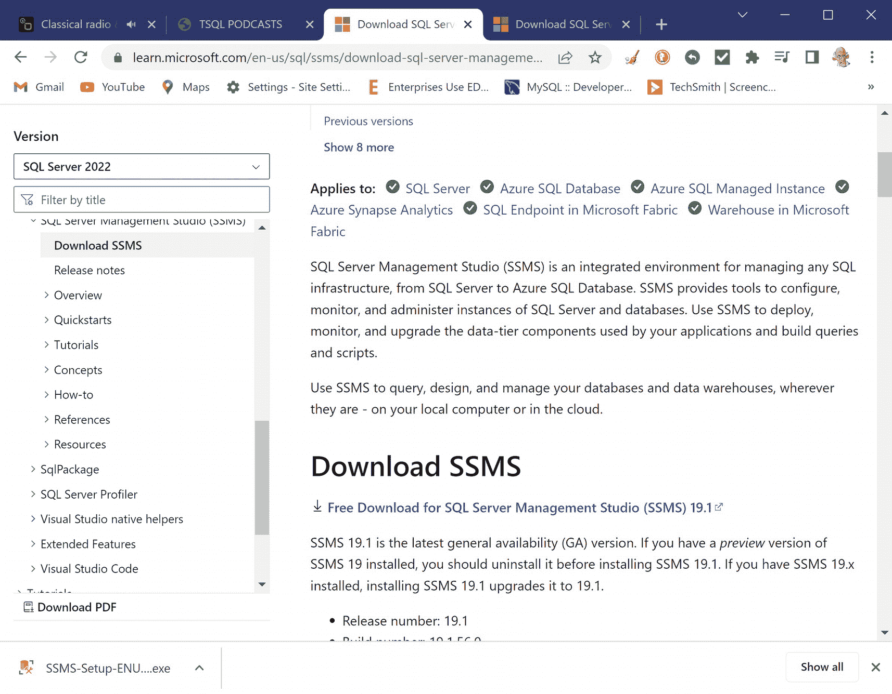

Chrome 窗口的截图。其中一个标签页打开了“下载 SSMS”网站。左侧面板显示了版本`SQL Server 2022`，以及 14 个选项，其中“下载 SSMS”被选中。右侧面板显示了软件适用的详细信息和下载链接。

图 14-30 下载`SSMS`

截至本文撰写时，网址是：

[`https://learn.microsoft.com/en-us/sql/ssms/download-sql-server-management-studio-ssms?view=sql-server-ver16`](https://learn.microsoft.com/en-us/sql/ssms/download-sql-server-management-studio-ssms%3Fview%3Dsql-server-ver16)

安装程序下载后，运行可执行文件并按照指导步骤在你的开发计算机上安装它。

## 后续步骤

练习每一个脚本。慢慢来。下载所有工具，如果需要，在线搜索教程。大多数是免费的，但也有许多网站会以合理的订阅价格提供强大的视频课程。如果你对`TSQL`真的很陌生，需要一些指导或复习如何编写查询、创建表等，请访问我的网站[`www.grumpyolditguy.com`](http://www.grumpyolditguy.com)获取关于`TSQL`编程的免费播客。

## 感谢！

感谢您购买并阅读本书。同时也感谢您的耐心。如有问题、评论或改进本书的建议，请随时通过 abobak@grumpyolditguy.com 与我联系，以便在下一版中改进。

下次见……


