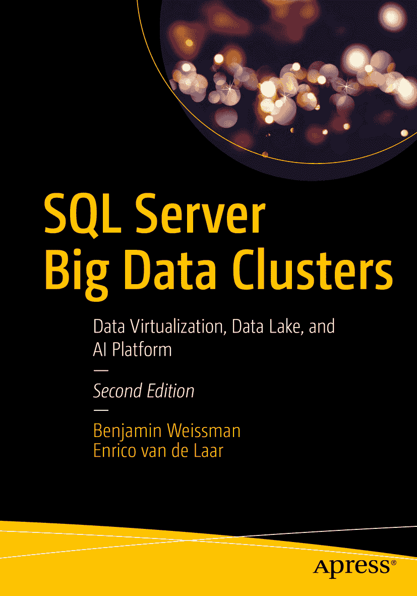
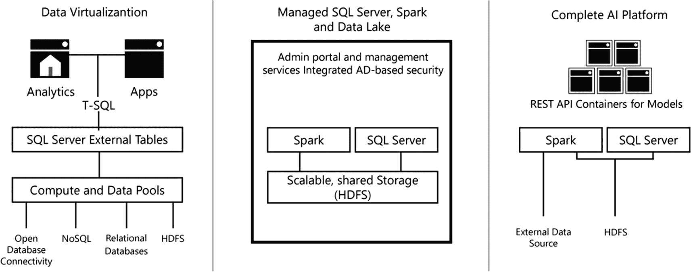
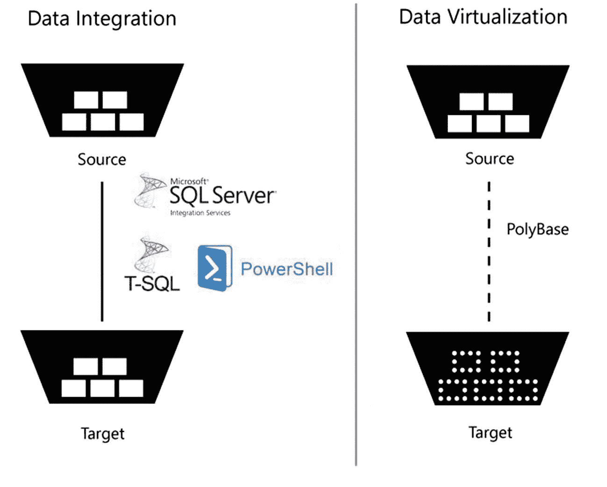
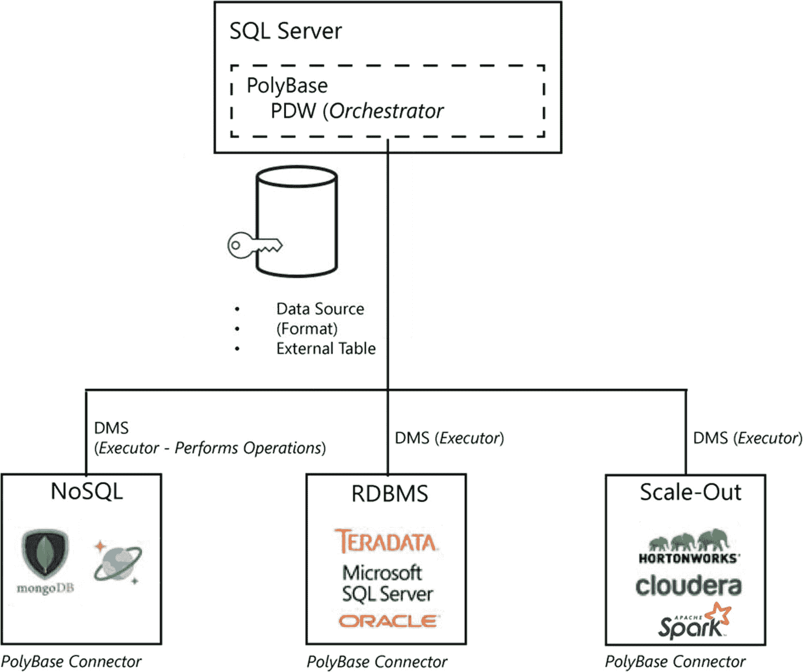

ISBN 978-1-4842-5984-9 e-ISBN 978-1-4842-5985-6 [`doi.org/10.1007/978-1-4842-5985-6`](https://doi.org/10.1007/978-1-4842-5985-6) © 本杰明·魏斯曼 和 恩里科·范·德·拉尔 2020
本作品受版权保护。出版者保留所有权利，无论涉及材料的全部或部分，具体包括翻译权、重印权、图表的重复使用、朗诵、广播、缩微胶片或其他任何物理方式的复制，以及信息存储与检索、电子改编、计算机软件，或目前未知或未来开发的类似或不同方法。在本出版物中使用通用描述性名称、注册商标、服务标记等，即使未作特别说明，也不意味着这些名称可不受相关保护性法律法规的约束而自由使用。出版者、作者和编辑可安全地假设本书中的建议和信息在出版时是真实准确的。出版者、作者或编辑均不对本文所含材料或可能存在的任何错误或遗漏提供任何明示或暗示的保证。对于已出版地图中的管辖权主张和机构从属关系，出版者保持中立。
本书由 Springer Science+Business Media New York (地址：美国纽约州纽约市斯普林街 233 号 6 层，邮编：10013) 全球发行至图书贸易领域。电话 1-800-SPRINGER，传真 (201) 348-4505，电子邮箱 orders-ny@springer-sbm.com，或访问 www.springeronline.com。Apress Media, LLC 是一家加利福尼亚州有限责任公司，其唯一成员（所有者）是 Springer Science + Business Media Finance Inc (SSBM Finance Inc)。SSBM Finance Inc 是一家特拉华州公司。

*谨以此书献给全国所有的锐舞者。*

## 引言

当我们最初开始讨论撰写一本关于 SQL Server 大数据群集的书籍时，该产品仍处于早期迭代阶段。我们俩都对其中包含的所有技术以及它可能改变数据处理和分析领域的方式感到非常兴奋。我们当时几乎不知道，在我们写作期间，该产品将经历多少变化。最终，这导致我们几乎每个月都要重写整本书。虽然这是一项艰巨的任务，但它也让我们能够跟踪并记录该产品在其开发过程中所经历的一切。现在最终产品已经发布，我们认为是时候提供一个反映大数据群集如今一切的更新版本了；结果就是您现在面前的这本书！

SQL Server 大数据群集是一个令人难以置信的激动人心的新平台。如前所述，它由多种使其运作的不同技术组成。Kubernetes、HDFS、Spark 和 Linux 上的 SQL Server 只是大数据群集内部的一些主要组成部分。除了所有这些不同的产品组合成一个单一产品外，您还可以根据您的用例将其部署在本地或 Azure 云中。正如您可以想象的那样，一本书几乎不可能深入讨论所有这些不同的产品（事实上，有很多书籍确实深入探讨了构成大数据群集的每个独立产品的所有微小细节，例如 Spark 或 Linux 上的 SQL Server）。因此，我们为本书选择了一种不同的方法，将更侧重于大数据群集的整体架构以及如何利用大数据群集提供的不同数据处理和分析方法的实用示例。

通过这种方法，我们相信在您阅读本书时，您将能够理解大数据群集的运作原理、它们的用例，以及如何开始部署、管理和使用大数据群集。这样，本书旨在提供有用的信息，可用于处理 `数据` 的各种工作角色——从希望了解大数据群集如何作为集中式数据枢纽的数据架构师，到想要知道如何将数据库管理和部署到集群的数据库管理员，再到希望在大数据群集上训练和操作化机器学习模型的数据科学家，以及许多其他角色。如果您以任何方式处理数据，这本书都应该有些东西能让您思考！

## 书籍布局

我们将本书分为九个独立的章节，每章重点介绍大数据群集的一个特定领域或功能：

### 第 1 章：“什么是大数据群集？”
在本章中，我们将概述 SQL Server 大数据群集及其各种用例。

### 第 2 章：“大数据群集架构。”
在本章中，我们将更深入地探讨构成大数据群集的内容，描述大数据群集内的各个逻辑区域，并了解所有不同部分如何协同工作。

### 第 3 章：“大数据群集的部署。”
本章将引导您完成使用本地或云环境部署大数据群集的第一步，并描述如何连接到您的集群，最后介绍可用于管理和监控大数据群集的管理选项。

### 第 4 章：“将数据加载到大数据群集。”
本章将重点介绍从各种源到大数据群集的数据摄入。

### 第 5 章：“通过 `T-SQL` 查询大数据群集。”
本章重点介绍通过 `PolyBase` 使用外部表，并使用 `T-SQL` 语句查询您的数据。

### 第 6 章：“在大数据群集中使用 Spark。”
虽然前一章主要侧重于使用 `T-SQL` 处理大数据群集上的数据，但本章将重点放在使用 Spark 进行数据探索和分析。

### 第 7 章：“大数据群集上的机器学习。”
大数据群集的主要功能之一是能够在单一平台内训练、评分和操作化机器学习模型。在本章中，我们将重点介绍通过 SQL Server 内置机器学习服务和 Spark 来构建和利用机器学习模型。

### 第 8 章：“创建和使用大数据群集应用。”
在本书倒数第二章中，我们将仔细研究如何通过大数据群集平台部署和使用自定义应用程序。这些应用程序的范围可以涵盖从管理任务到提供用于执行机器学习模型评分的 REST API。

### 第 9 章：“大数据群集的维护。”
为了完成您的大数据群集体验，我们将探讨管理和维护大数据群集需要做什么。

## 致谢

与每一次出版一样，我们首先要衷心感谢我们的家人在这个耗时的过程中给予我们的支持！

同时，非常感谢穆罕默德审阅本书所提供的帮助！

我们还要感谢 Microsoft SQL Server 产品团队，每当我们有疑问或遇到不太理解的情况时，他们总是乐于伸出援手。JRJ, Travis, Buck, Mihaela 以及所有其他人——你们太棒了！

最后但同样重要的是，感谢 #sqlfamily——您们持续的支持、反馈和鼓励，是我们在探索和谈论像大数据群集这样激动人心的技术时不断前进的动力！

## 关于作者
## 关于技术审校者


## 1. 什么是大数据集群？

SQL Server 2019 大数据集群——或简称大数据集群——是 SQL Server 2019 中的一套新功能集，围绕数据虚拟化、数据集市横向扩展和人工智能（AI）提供了广泛的功能。

SQL Server 2019 大数据集群仅作为盒装产品 SQL Server 的一部分提供。尽管微软采取“云优先”策略，先向 Azure 发布新功能和特性，最终（如果有的话）才推广到本地版本。

大数据集群的主要组件只能在 Linux 上运行。请细品这一点，并回想一下几年前的情景。如果在 2016 年初有人告诉你，你将能够在 Linux 上运行 SQL Server，你大概率是不会相信的。后来，Linux 版 SQL Server 宣布了，但它最初只提供了其“老大哥”——Windows 版 SQL Server——实际包含功能的一个子集。而现在，我们拥有了一项实际上**要求我们在 Linux 上运行 SQL Server** 的功能。

哦，顺便说一句，这个名字有点误导性。SQL Server 大数据集群的某些部分并不真正构成一个集群——不过后面会详细讲到。

说到组成部分，大数据集群并非单一功能，而是一个庞大的 `功能集`，服务于多种不同目的，因此你不太可能用到它的每一部分。根据你的角色，某些特定部分可能对你更有用。在本书的整个过程中，我们将引导你了解所有功能，让你能够选择那些对你有帮助的功能，而忽略那些对你没有价值的功能。

## SQL Server 2019 大数据集群究竟是什么？

SQL Server 2019 大数据集群本质上是在 Kubernetes 环境中运行的 SQL Server、Apache Spark 和 HDFS 文件系统的组合。如前所述，大数据集群并非单一功能。图 1-1 将该功能集的不同部分进行了分类，以帮助你更好地理解所提供的内容。其总体思路是，通过虚拟化和横向扩展，SQL Server 2019 成为你的数据枢纽，用于管理你所有的数据，即使这些数据并不物理存储在 SQL Server 中。



图 1-1
SQL Server 2019 大数据集群功能概览

图 1-1 从左到右展示了大数据集群的主要方面。你拥有数据虚拟化支持，然后是托管数据平台，最后是人工智能（AI）平台。这些方面的每一个都将在本章剩余部分进行更详细的描述。

## 数据虚拟化

SQL Server 2019 大数据集群中的第一个功能是数据虚拟化。数据虚拟化——与数据集成不同——将你的数据保留在源位置，而不是复制它。图 1-2 说明了数据集成和数据虚拟化之间的区别。数据虚拟化目标中的虚线矩形代表虚拟数据源，这些数据源总是解析回原始源数据的单个实例。在微软的世界里，这种数据到其原始源的解析是通过一个名为 PolyBase 的 SQL Server 功能完成的，它允许你虚拟化数据集市的全部或部分。



图 1-2
数据虚拟化 vs. 数据集成

数据虚拟化的一个明显好处是，你消除了冗余数据，因为你不是从源复制数据，而是直接从那里读取。特别是在你只是读取一个大的平面文件一次进行汇总的情况下，那个重复和冗余的数据可能没什么用。此外，使用 PolyBase，你的查询是实时的，而集成的数据总会存在一些延迟。

另一方面，你无法在外部表上创建索引。因此，如果你的数据经常需要以与原始源不同的工作负载进行查询，这意味着你需要另一种索引策略，那么集成数据可能仍然比虚拟化更有意义。这个决策也可能取决于你是否能接受更频繁的报告查询等给源系统带来的额外负载。

注意
虽然数据虚拟化解决了数据集成带来的一些问题，但它无法取代数据集成。这**不是** SSIS 或 ETL 的终结。

从技术上讲，PolyBase 自 SQL Server 2016 就已存在，但迄今为止只支持非常有限的数据源类型。在 SQL Server 2019 中，PolyBase 得到了极大的增强，支持多种关系型数据源，如 SQL Server 或 Oracle，以及 NoSQL 数据源，如 MongoDB、HDFS 和其他各种数据，如图 1-3 所示。



图 1-3
SQL Server 2019 中的 PolyBase 源和能力

实际上，你可以查询另一个数据库中，甚至在一台完全不同的机器上的表，就好像它是本地表一样。

使用 PolyBase 进行虚拟化可能让你想起链接服务器，它们之间肯定有一些相似之处。一个很大的区别是，针对链接服务器的查询往往比 PolyBase 查询更长、更复杂。例如，这是一个针对远程表的典型查询：

```
SELECT * FROM MyOtherServer.MyDatabase.DBO.MyTable
```

使用 PolyBase，你可以更简单地编写相同的查询，就好像表在你的本地数据库中一样。例如：

```
SELECT * FROM MyTable
```

PolyBase 会知道该表在不同的数据库中，因为你将在 PolyBase 中创建一个定义，指明表可以在哪里找到。

使用 PolyBase 的一个优点是，你可以将 `MyDatabase` 移动到另一台服务器，而无需重写你的查询。只需更改你的 PolyBase 数据源定义，重定向到新的数据源即可。你可以轻松完成，而不会损害或影响你现有的查询或视图。

链接服务器和 PolyBase 的使用还有更多不同之处。表 1-1 描述了一些你应该了解的区别。

表 1-1
链接服务器与 PolyBase 比较

| 链接服务器 | PolyBase |
| --- | --- |
| − 实例作用域− OLEDB 提供程序− 读/写和直通语句− 单线程− Always On 可用性组中每个实例都需要单独配置 | − 数据库作用域− ODBC 驱动程序− 只读操作− 查询可以横向扩展− Always On 可用性组无需单独配置 |

### 将你的数据外包

你可能听说过“伸缩数据库”(Stretch Database)，^(¹) 这是 SQL Server 2016 中引入的一个功能，它允许你将部分数据卸载到 Azure。其理念是将此功能用于“冷数据”——指的是你不经常访问的数据，因为它们要么是旧的（但某些查询仍然需要），要么仅仅是对于关注度较低的业务领域。

冷数据背后的基本原理是，在 Azure 中存储这些数据应该比在本地更便宜。不幸的是，该服务可能并不适合所有人，因为即使是其入门级也提供了显著的存储性能，这显然需要付出成本。

借助 PolyBase，你现在可以将数据卸载到 Azure SQL 数据库等，从而构建自己的非常底层的外包功能。


