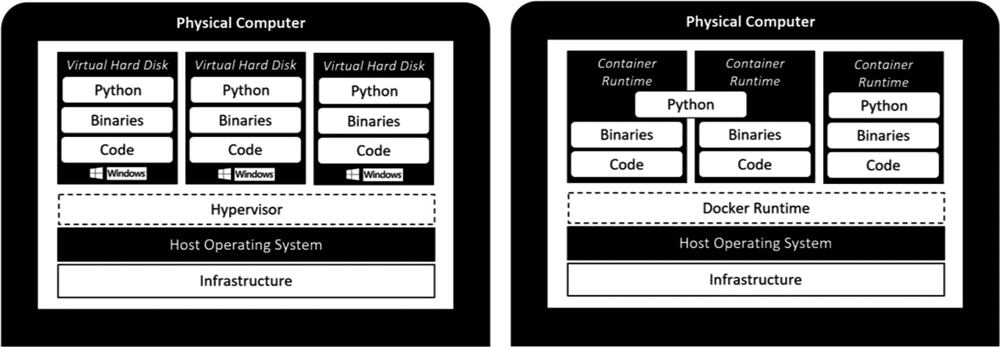
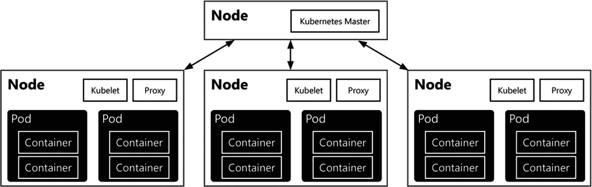

# 减少数据冗余与开发时间

除了卸载数据，虚拟化数据而非集成数据的一个明显好处是它可能大幅减少数据冗余。因为数据虚拟化将数据保留在其原始源，因此数据不会持久化到目标位置。与传统的基于 `ETL` 的暂存过程相比，这基本上将存储需求**减半**。

**注意**

我们“减半”的说法可能并不十分准确，因为你可能没有暂存完整的数据集（从而减少了节省空间），或者你可能使用了不同的数据类型（甚至可能进一步增加节省空间）。

试想一下：你想要跟踪网站上每小时的页面请求数量，这些数据被记录到文本文件中。在传统环境中，你可能需要编写一个 `SQL Server Integration Services` (`SSIS`) 包来将文本文件加载到表中，然后在其上运行查询以对数据进行分组，最后存储或使用其结果。而在这种新的虚拟化方法中，你仍然会运行查询来对数据分组，但你会直接在原始文本文件上运行它，这样就节省了开发 `SSIS` 包所需的时间，也节省了用于暂存日志数据的暂存表的存储空间——否则，这些数据会同时存在于文件中以及 `SQL Server` 的暂存表中。

## 综合数据平台环境

`SQL Server 大数据集群`的一个重要用例是能够创建一个环境，以存储、管理和分析不同格式、类型和大小的数据。最显著的是，你可以同时在 `SQL Server` 组件内存储关系型数据，以及在 `HDFS` 存储子系统内存储非关系型数据。使用 `大数据集群` 使你能够创建一个数据湖环境，满足你所有的数据需求，而无需承担管理、更新和配置构成数据湖的各个部分所带来的巨大复杂性。

`大数据集群`从产品安装开始就完全负责你 `大数据集群` 的安装和管理。由于 `大数据集群` 作为一个独立的产品推出，并得到 `Microsoft` 的全面支持，这意味着 `Microsoft` 将通过服务包和更新来处理构成 `大数据集群` 的所有技术的更新。

那么，为什么你会对数据湖感兴趣呢？事实证明，许多组织都有大量以不同格式存储的数据。在许多情况下，很大一部分数据来自应用程序的使用，这些应用程序将其数据存储在像 `SQL Server` 这样的关系型数据库中。通过使用关系型数据库，我们可以轻松地查询其中的数据，并将其用于各种用途，例如仪表板、`KPI`（关键绩效指标），甚至是用于预测未来销售的机器学习任务。

关系型数据库必须遵循若干规则，其中最重要的规则之一是关系型数据库总是以 **写入时模式** 的方式存储数据。这意味着如果你想向关系型数据库插入数据，你必须确保该数据符合要写入到的表的结构。图 1-4 说明了 **写入时模式**。

例如，一个包含 `OrderID`、`OrderCustomer` 和 `OrderAmount` 列的表规定，你插入到该表的数据也需要包含相同的列。这意味着当你想在该表中写入新行时，你必须为插入操作定义一个 `OrderID`、`OrderCustomer` 和 `OrderAmount` 才能成功。没有临时添加额外列的空间，并且在许多情况下，你插入的数据需要与表中指定的数据类型相同（例如，整数用于数字，字符串用于文本）。

```
../images/480532_2_En_1_Chapter/480532_2_En_1_Fig4_HTML.jpg
```

图 1-4
写入时模式

在许多情况下，**写入时模式** 的方法是完全可行的。你确保所有数据都按照关系型数据库期望的方式进行格式化，并将所有数据存储在其中。但是，当你决定添加不一定具有固定模式的新数据集时，会发生什么？或者，你想处理体积非常大（数 TB）的数据？在这些情况下，通常建议寻找另一种技术来存储和处理你的数据，因为关系型数据库在处理具有这些特征的数据时存在困难。

像 `Hadoop` 和 `HDFS` 这样的解决方案就是为了解决关系型数据库的一些局限性而创建的。大数据平台能够以分布式方式处理海量数据，方法是将数据分散在组成集群架构的不同机器（称为节点）上。使用像 `Hadoop` 这样的技术，或者如我们将在本书中使用的 `Spark`，可以让你以任何格式存储和处理数据。这意味着我们可以存储巨大的 `CSV`（逗号分隔值）文件、视频文件、`Word` 文档、`PDF` 或任何我们想要的东西，而不必像将数据存储在关系型数据库中那样，担心是否符合预定义的模式。


## 2. 大数据集群架构

Apache 的 Spark 技术确保我们的数据被切分成更小的块，并存储在构成 Spark 集群的节点的文件系统上。我们只在准备读取和处理数据时才需要关心模式，这被称为`读取时定义模式`。当我们加载 CSV 文件以检查其内容时，必须定义它是什么类型的数据，对于 CSV 文件而言，还要定义数据的列是什么。在读取时指定这些细节为我们处理这些数据提供了极大的灵活性，因为我们可以添加或删除列或转换数据类型，而无需在写回数据前担心模式问题。由于像 Spark 这样的技术具有分布式架构，我们可以非常快速地在大型数据集上执行所有这些数据操作和查询步骤，这一点我们将在第[2]章中更详细地解释。

现实世界中你会看到，在许多情况下，组织既拥有关系数据库，又拥有 Hadoop/Spark 集群来存储和处理他们的数据。这些解决方案是彼此独立实施的，并且在许多情况下并不“互通”。数据是关系型的吗？把它存进数据库！是非关系型的，比如 CSV、IoT 数据或其他格式？扔到 Hadoop/Spark 集群上！我们之所以对 SQL Server 大数据集群的发布感到如此兴奋，一个原因就是它将这两种解决方案结合到了一个产品中，这个产品同时包含了 Spark 集群和 SQL Server 的功能。虽然你仍然需要选择是将某些数据直接存储在 SQL Server 数据库中还是存储在 HDFS 文件系统上，但你总是可以从这两种技术中访问它！想要将关系数据与存储在 HDFS 上的 CSV 文件结合起来？没问题，使用本章前面描述的数据虚拟化，你可以从 HDFS 读取 CSV 文件的内容，并使用 T-SQL 查询将其与关系数据合并，产生一个单一的结果集！

从这个意义上说，SQL Server 大数据集群由非常互补的技术组成，使你能够弥合因数据存储方式不同而在数据处理上受到的限制。大数据集群最终让你能够创建一个可扩展且灵活的数据湖环境，在其中你可以存储和处理任何格式、形状或大小的数据，甚至允许你在使用 SQL Server 或 Spark 处理数据之间进行选择，根据你想要执行的任务选择你更偏好的那个。

大数据集群架构还能够优化数据分析方面的性能。将所有你需要的数据存储在一个集群中，无论是否是关系型数据，都意味着你可以在需要时立即访问它。你避免了跨不同系统或网络的数据移动，这在一个我们不断尝试寻找更快分析数据的解决方案的世界里是一个巨大的优势。

如果你问我们 SQL Server 大数据集群的终极优势是什么，我们坚信是在单一解决方案中存储、处理和分析任何形状、大小或类型数据的能力。

## 集中化 AI 平台

正如我们在前一节所述，SQL Server 大数据集群允许你创建一个可以处理所有类型和格式数据的数据湖环境。除了在处理方面具有巨大优势外，它自然在处理高级分析（如机器学习）方面也具有巨大优势。由于你所有的数据本质上都存储在一个地方，你可以在大数据集群上对所有可用数据执行机器学习模型训练等任务，而不必从组织内的多个系统收集数据。

通过结合 SQL Server 和 Spark，我们在处理机器学习时也有多种选择。我们可以选择通过 Spark 直接在存储于 HDFS 文件系统上的数据上训练和评分机器学习模型，或者使用通过 SQL Server 可用的内置机器学习服务。这两种选项都提供了广泛的语言和库供你或你的数据科学团队使用，例如，对于 SQL Server 机器学习服务可以使用 R、Python 和 Java，而对于通过 Spark 集群运行机器学习工作负载则可以使用 PySpark 和 Scala。

在用例方面，大数据集群几乎可以处理任何机器学习流程，从处理实时评分到结合 TensorFlow 使用 GPU 来优化处理 CPU 密集型工作负载，或者例如执行图像分类任务。

脚注 [1]

## 物理大数据集群基础设施

大数据集群的物理基础设施由容器组成，在这些容器上部署了主要的软件组件。这些主要组件是 Linux 上的 SQL Server、Apache Spark 和 HDFS 文件系统。以下是对这些基础设施元素的介绍，从容器开始，依次介绍其他部分，为你提供这些组件如何协同工作的全景图。


### 容器

一个 *容器* 是一种独立的包，它包含在隔离或沙盒环境中运行应用程序所需的一切。容器经常被拿来与虚拟机（VM）比较，因为两种方案都存在虚拟化层。然而，容器比虚拟机提供了更大的灵活性。一个显著体现灵活性的领域是可移植性。

使用容器的主要优势之一是它们避免了在容器内部实现操作系统。虚拟机需要在每个虚拟机内部安装自己的操作系统，而对于容器，每个容器都使用其运行所在的宿主机的操作系统（通过隔离的进程）。像 `Docker` 这样的工具，通过运行一个虚拟机来作为容器的宿主机，可以在单台宿主机机器上实现多种操作系统，例如让你在 Windows 上运行一个 Linux 容器。

你立刻就能看到一个优势：运行多个虚拟机时，你还有额外的负担来维护每个虚拟机上的操作系统——打补丁、配置并确保一切按预期运行。使用容器，你则没有这些额外的管理层级。相反，你维护一份操作系统副本，由所有容器共享。

容器相对于虚拟机的另一个优势是，容器可以被定义为一种“基础设施即代码”形式。这意味着你可以在构建文件或镜像中，通过脚本定义容器的整个创建过程。这意味着当你使用相同的镜像或构建文件部署多个容器时，它们是 100% 相同的。确保 100% 一致的部署在使用虚拟机时可能非常具有挑战性，但使用容器则很容易实现。

图 2-1 展示了容器和虚拟机在资源分配和隔离方面的一些差异。你可以看到容器如何减少了对多个客户操作系统的需求。



图 2-1

虚拟机 vs. 容器

我们想提到的容器的最后一个优势（还有很多其他优势，但已超出本书范围）是容器可以部署为“无状态”应用。本质上这意味着容器不会改变，并且它们自身不存储数据。

例如，考虑一种情况：你使用容器部署了多个应用服务。在这种情况下，每个容器都将以与其他容器完全相同的运行方式和状态来运行你的应用。当一个容器崩溃时，使用相同的构建文件部署一个新的容器来接替崩溃容器的角色是很容易的，因为容器在运行期间内部没有存储或更改任何数据。

你的应用数据的存储可以由基础设施中的其他角色来处理，例如，一个 `SQL Server` 保存着由你的应用容器处理的数据，或者，作为另一个例子，一个文件共享存储着容器内应用使用的数据。此外，当你有新的应用服务器软件构建可用时，你可以轻松地创建一个新的容器镜像或构建文件，将该镜像或构建文件映射到你的应用容器，并几乎在瞬间切换构建版本。

`SQL Server Big Data Clusters` 使用容器部署，为大数据集群中可用的各种角色和功能创建一个可扩展、一致且灵活的环境。`Microsoft` 选择使用 `Kubernetes` 来部署所有容器。`Kubernetes` 是容器基础设施中的一个额外层，它充当协调器。通过使用 `Kubernetes`（或通常称为 `K8s`），你在处理容器时能获得若干优势。例如，`Kubernetes` 可以在性能需要时自动部署新容器，或者在其他容器失败时部署新容器。

因为大数据集群构建在 `Kubernetes` 之上，你在部署大数据集群的位置上有一定的灵活性。`Azure` 能够使用托管的 Kubernetes 服务（`AKS`），你也可以选择在其中部署大数据集群。其他本地选项可以使用 `Docker` 或 `Minikube` 作为容器协调器。我们将在第 3 章更深入地探讨在 `AKS`、`Docker` 或 `Minikube` 内部部署大数据集群。

使用 `Kubernetes` 也引入了几个特定的术语，我们将在本书中持续使用。我们已经讨论了容器的概念和定义。然而，`Kubernetes`（以及大数据集群）也经常使用另一个术语，叫做“`pods`”。`Kubernetes` 不直接运行容器；相反，它将容器包裹在一个称为 `pod` 的结构中。一个 `pod` 组合了一个或多个容器、存储资源、网络配置以及一个管理容器如何在 `pod` 内运行的特定配置。

图 2-2 展示了 `Kubernetes` 内部的 `node` - `pods` - 容器架构的简单表示。



图 2-2

`Kubernetes` 中容器、`pods` 和 `nodes` 的表示

通常，`pods` 有两种使用方式：每个 `pod` 一个容器，或者一个 `pod` 内有多个容器。后者用于当你的多个容器需要以某种方式协同工作时——例如，在多个容器之间分配负载时。`pods` 也是为容器分配更多系统资源的管理单位。例如，要增加容器可用的内存，对 `pod` 配置的更改将导致 `pod` 内所有容器都能访问增加的内存。关于这一点，在 `Kubernetes` 集群中，你主要是在管理和扩展 `pods`，而不是容器。

`Pods` 运行在 `Kubernetes` 的 `nodes` 上。一个 `node` 是 `Kubernetes` 集群内部最小的计算硬件单元。大多数时候，一个 `node` 是一台安装了 `Kubernetes` 集群软件的物理或虚拟机，但理论上任何具有 CPU 和内存的机器/设备都可以成为一个 `Kubernetes` `node`。因为这些机器只作为 `Kubernetes` `pods` 的宿主机，它们可以轻松地被替换、添加或从 `Kubernetes` 架构中移除，使得底层的物理（或虚拟）机基础设施非常灵活。


