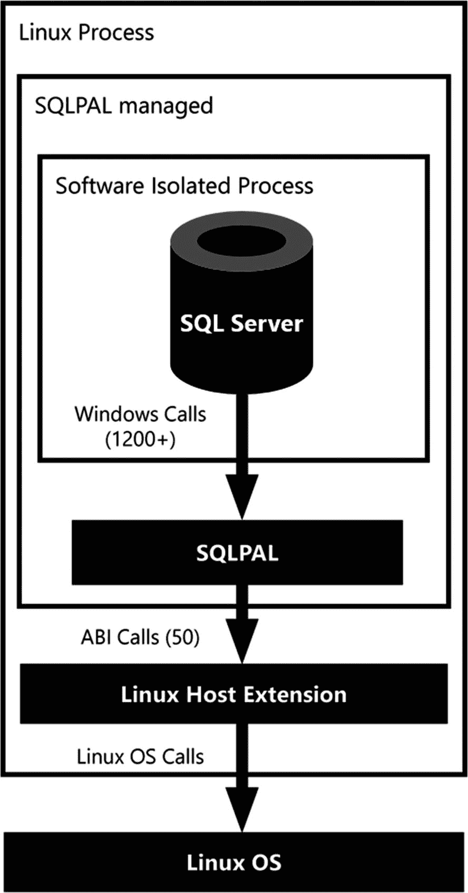

# Linux 上的 SQL Server

2016 年 3 月，微软宣布下一版 SQL Server（后来被证实为 SQL Server 2017）不仅可在 Windows 操作系统上运行，也将支持 Linux——这个长期以来似乎不可能、只要微软还在开发软件就不会发生的事情，突然间成为了现实。不用说，整个 IT 界为之震动。

事后看来，微软宣布这一战略决策（即让其旗舰产品之一可在 Linux 上运行）的时机堪称完美。我们在前一节讨论的，关于容器新技术的惊人适应性，主要就是基于各种 Linux 发行版。我们相信，如果没有容器技术的能力，进而没有这些容器所提供的 Linux 操作系统，就永远不会诞生 SQL Server 大数据集群这款产品。

值得庆幸的是，微软坚持推进了对 Linux 的采用，随着最新的 SQL Server 2019 发布，许多困扰 SQL Server 2017 在 Linux 上运行的问题现已解决，并且 Windows 版本的许多功能也已引入到 Linux 版本中。

那么，微软是如何让一个为 Windows 操作系统设计的应用程序在 Linux 上运行的呢？他们是否重写了 SQL Server 内部的所有代码以使其能在 Linux 上运行？事实证明，事情远比为了兼容 Linux 而重写代码库复杂得多。

为了使 SQL Server 能在 Linux 上运行，微软引入了一个称为 `平台抽象层`（简称 `PAL`）的概念。`PAL` 的理念是将运行 SQL Server 所需的代码，与和操作系统交互所需的代码分离开来。由于 SQL Server 以前从未在 Windows 以外的任何系统上运行过，其代码内部充满了对操作系统的引用。这意味着，要让 SQL Server 在 Linux 上运行，由于所有这些操作系统依赖性，最终将耗费巨大的时间成本。

SQL Server 团队为解决操作系统依赖问题寻找了不同的方法，并在一个名为 `Drawbridge` 的微软研究项目中找到了答案。`Drawbridge` 的定义可以在其项目页面 [`www.microsoft.com/en-us/research/project/drawbridge/`](http://www.microsoft.com/en-us/research/project/drawbridge/) 上找到，其中声明：

> *Drawbridge 是一种用于应用程序沙盒化的新虚拟化形式的研究原型。Drawbridge 结合了两项核心技术：首先，是一个微进程，这是一种基于进程的隔离容器，具有最小的内核 API 表面。其次，是一个库操作系统，这是一个经过优化以在微进程内高效运行的 Windows 版本。*

吸引 SQL Server 团队的主要部分是 `Drawbridge` 项目中的库操作系统技术。这项新技术可以处理种类繁多的 Windows 操作系统调用，并将其转换到主机的操作系统（在此情况下是 Linux）上。

当然，SQL Server 团队并没有原封不动地采用 `Drawbridge` 技术，因为该研究项目存在一些挑战。其中一个挑战是该研究项目已正式完结，意味着没有后续支持。另一个挑战是 SQL Server 操作系统 (`SOS`) 和 `Drawbridge` 在技术上存在大量重叠。例如，两种解决方案各自都有自己的内存管理和线程/调度处理功能。

最终决定是将 SQL Server OS 和 `Drawbridge` 合并为一个新的平台层，称为 `SQLPAL`（`SQL 平台抽象层`）。使用 `SQLPAL`，SQL Server 团队可以像往常一样开发代码，而将操作系统调用的转换工作留给 `SQLPAL` 处理。图 2-3 展示了在 Linux 上运行 SQL Server 时各层之间的交互。

图 2-3

Linux 上的 SQL Server 各层交互

许多微软博客提供了大量关于 `SQLPAL` 功能及设计选择的更多信息。如果您想了解更多关于 `SQLPAL` 或其诞生过程的信息，我们推荐文章“SQL Server on Linux: How? Introduction”，可在 [`https://cloudblogs.microsoft.com/sqlserver/2016/12/16/sql-server-on-linux-how-introduction/`](https://cloudblogs.microsoft.com/sqlserver/2016/12/16/sql-server-on-linux-how-introduction/) 获取。

除了容器的使用，Linux 上的 SQL Server 2019 是大数据集群产品的核心。大数据集群内部在数据访问、操作和查询分发方面发生的几乎所有操作，都是通过运行在容器内的 Linux 上的 SQL Server 实例来完成的。

在部署大数据集群时，部署脚本将负责在容器内完成完整的 Linux 版 SQL Server 安装。这意味着无需手动安装 Linux 版 SQL Server，甚至无需手动保持所有组件更新。所有这些都由大数据集群的部署和管理工具处理。

