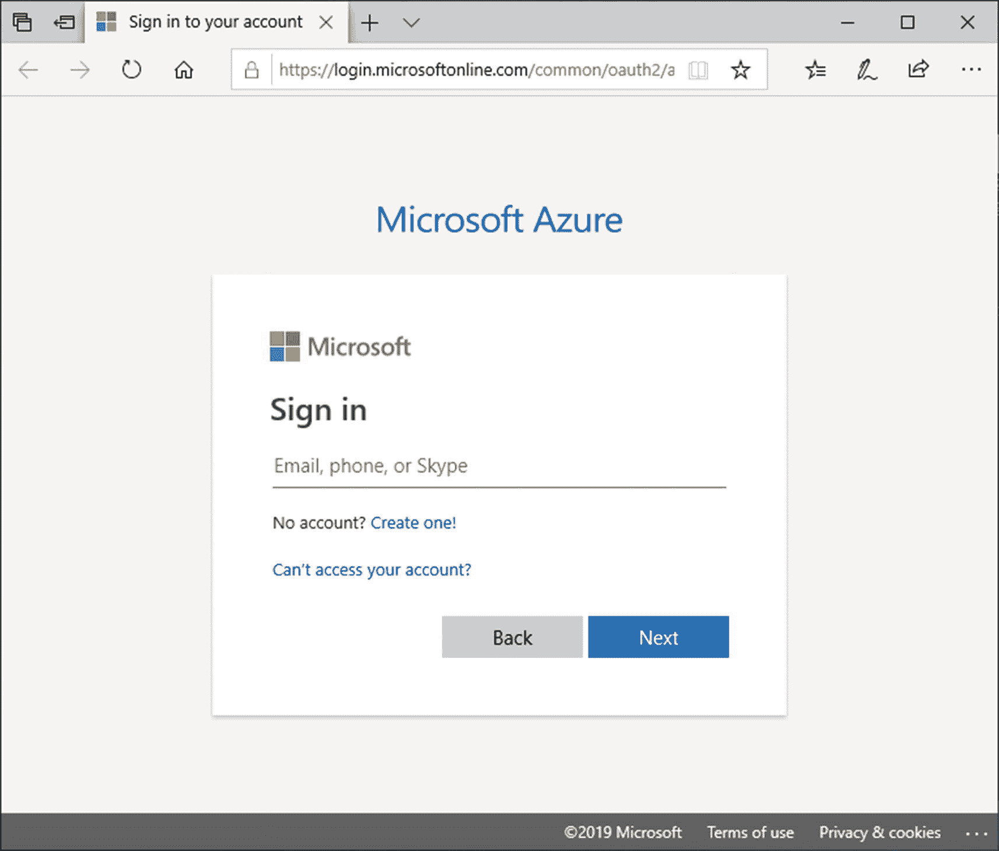
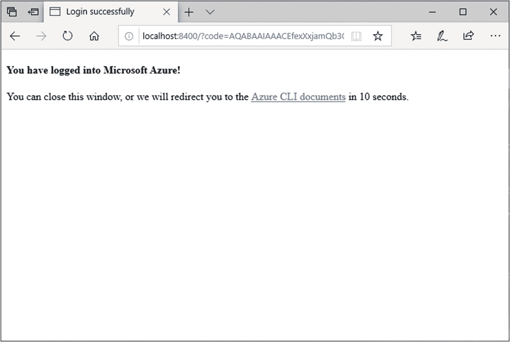
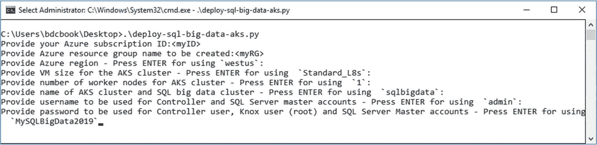
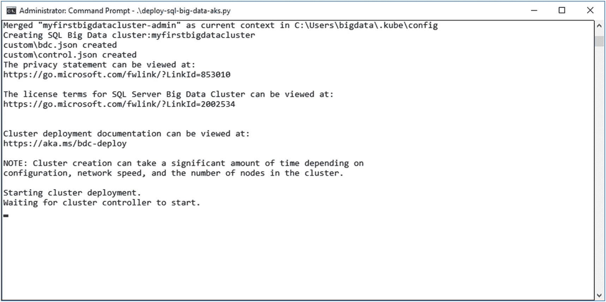
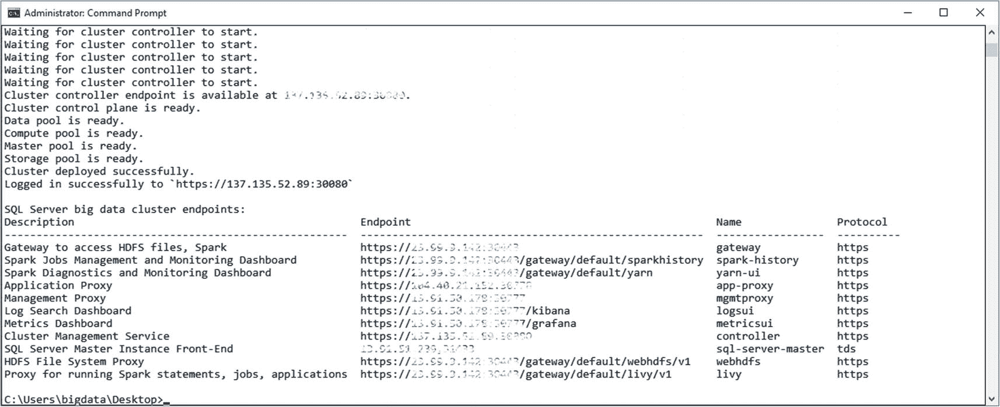
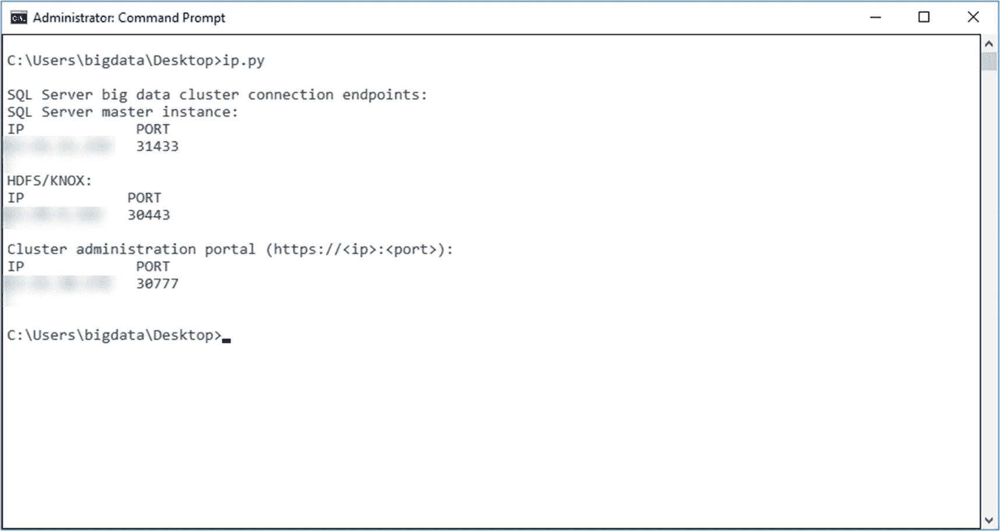

# 在 Azure 上部署

一个网站将打开；请使用你的 Azure 凭据登录，如图 3-21 所示。



**图 3-21** Azure 登录屏幕

该网站将确认你已登录；你可以关闭浏览器，如图 3-22 所示。



**图 3-22** Azure 登录确认

你的命令提示符，如图 3-23 所示，显示了与你刚使用的凭据关联的所有订阅。复制你要使用的订阅 ID 并执行 Python 脚本，该脚本将询问从订阅 ID 到 Kubernetes 集群中节点数量的所有信息。



**图 3-23** Python 部署脚本中的参数输入

脚本现在开始运行所有必需的步骤。同样，这可能需要几分钟到几小时，具体取决于虚拟机大小、节点数量等因素。

该脚本会像在 Linux 上安装时的脚本一样，在过程中进行报告。它使用了相同的工具(`azdata`)，因此创建实际大数据集群时的输出非常相似，如图 3-24 所示。



**图 3-24** Python 部署脚本的输出

脚本还会使用`azdata bdc config`来创建你的 JSON 文件。

由于此 SQL Server 2019 大数据集群是部署到 Azure 上的，与本地安装时可以直接使用`localhost`地址访问不同，你将需要有关安装的 IP 地址和端口信息。因此，IP 地址和端口会在最后提供，如图 3-25 所示。



**图 3-25** Python 部署脚本的最终输出（包括 IP 地址）

如果你忘记了 IP 地址是什么，可以运行这个简单的脚本，如清单 3-11 所示。

```
kubectl get service -n 
```

**清单 3-11** 使用`kubectl`检索 Kubernetes 服务 IP

如果你也忘记了集群的名称，试试清单 3-12。

```
kubectl get namespaces
```

**清单 3-12** 使用`kubectl`检索 Kubernetes 命名空间

如果你同时运行多个集群，清单 3-13 中的脚本也可能很有帮助。只需将其保存为`IP.py`，你就可以如图 3-26 所示运行它。



**图 3-26** `IP.py`的输出

```
CLUSTER_NAME="myfirstbigdatacluster"
from subprocess import check_output, CalledProcessError, STDOUT, Popen, PIPE
import os
import getpass
def executeCmd (cmd):
if os.name=="nt":
process = Popen(cmd.split(),stdin=PIPE, shell=True)
else:
process = Popen(cmd.split(),stdin=PIPE)
stdout, stderr = process.communicate()
if (stderr is not None):
raise Exception(stderr)
print("")
print("SQL Server big data cluster connection endpoints: ")
print("SQL Server master instance:")
command="kubectl get service master-svc-external -o=custom-columns=""IP:.status.loadBalancer.ingress[0].ip,PORT:.spec.ports[0].port"" -n "+CLUSTER_NAME
executeCmd(command)
print("")
print("HDFS/KNOX:")
command="kubectl get service gateway-svc-external -o=custom-columns=""IP:status.loadBalancer.ingress[0].ip,PORT:.spec.ports[0].port"" -n "+CLUSTER_NAME
executeCmd(command)
print("")
print("Cluster administration portal (https://:):")
command="kubectl get service mgmtproxy-svc-external -o=custom-columns=""IP:status.loadBalancer.ingress[0].ip,PORT:.spec.ports[0].port"" -n "+CLUSTER_NAME
executeCmd(command)
print("")
```

**清单 3-13** 检索大数据集群端点的 Python 脚本

你已经完成了！你在 Azure Kubernetes 服务中的大数据集群现已启动并运行。

> **注意** 无论你是否使用，这个集群都会根据虚拟机数量及其大小产生费用，所以最好不要让它闲置着！

