# 通过 Azure Data Studio 部署大数据集群

如果你更喜欢使用图形化向导进行部署，那么答案就是 Azure Data Studio (ADS)！ADS 为你提供了部署 SQL Server 的多种选项，而 **大数据集群** 就在其中。在 ADS 中，可以在欢迎屏幕上找到“新建部署”的链接，也可以在活动连接旁边的上下文菜单中找到，如图 3-27 所示。

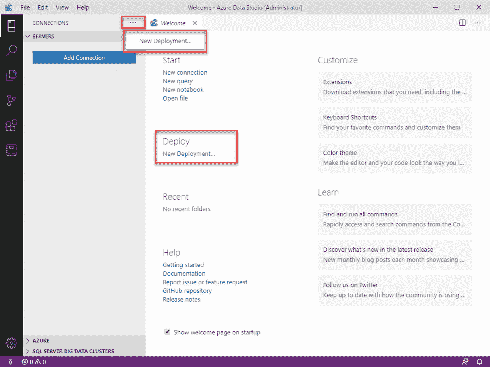

图 3-27 ADS 中的新建部署

在接下来的屏幕上，选择“`SQL Server Big Data Cluster`”。向导将要求你接受许可条款、选择一个版本，并选择一个部署目标。此向导当前支持的目标包括新的 Azure Kubernetes Service (AKS) 集群、现有的 AKS 集群或现有的 `kubeadm` 集群。如果你计划部署到现有集群，Kubernetes 上下文/连接需要存在于你的 Kubernetes 配置中。如果 Kubernetes 集群不是在同一台机器上创建的，那么它很可能还缺失。在这种情况下，你可以将 `*.kube` 文件复制到本地机器，或者按照 [`https://kubernetes.io/docs/tasks/access-application-cluster/access-cluster/`](https://kubernetes.io/docs/tasks/access-application-cluster/access-cluster/) 中的描述手动配置 Kubernetes。

在屏幕的下方，向导还会再次列出所需的工具，并确认它们是否已安装合适的版本，如图 3-28 所示。

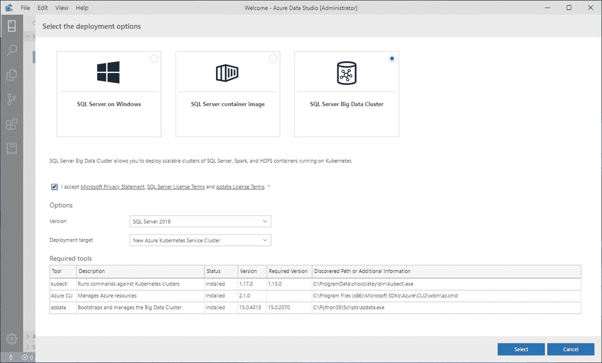

图 3-28 通过 ADS 部署 BDC – 介绍

让我们尝试使用一个新的 AKS 集群进行另一次部署（这也是默认选项）。单击“`Select`”，向导将带你进入第一步。它将为你提供与目标环境匹配的部署模板。不同的模板在大小以及功能（如身份验证类型和高可用性）上有所不同，如图 3-29 所示。

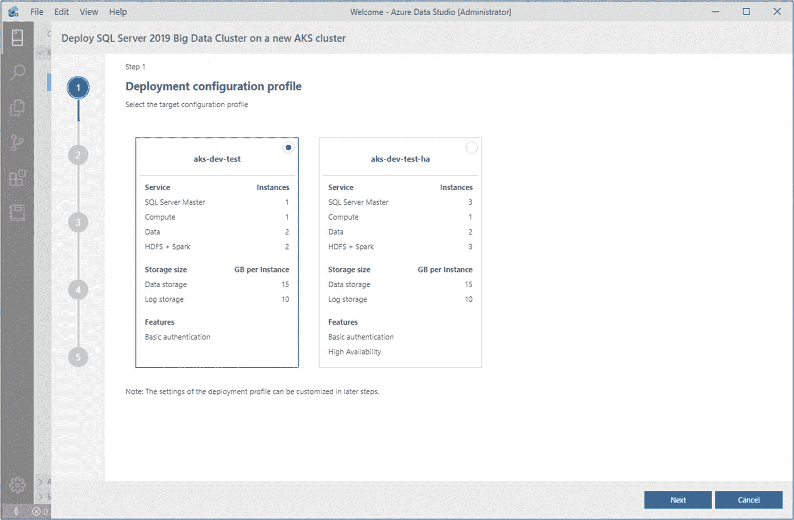

图 3-29 通过 ADS 部署 BDC – 步骤 1

接下来的屏幕将取决于你的目标。由于我们选择部署到 Azure 并包含一个新集群，我们需要提供订阅、资源组名称、位置、集群名称，以及底层虚拟机的数量和大小（参见图 3-30）。

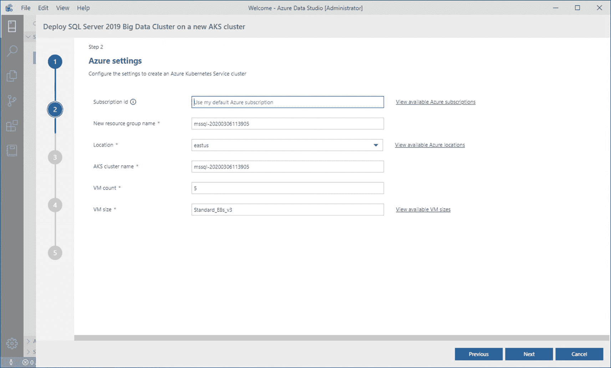

图 3-30 通过 ADS 部署 BDC – 步骤 2

在步骤 3 中，如图 3-31 所示，我们定义大数据集群的名称（这与之前设置 Kubernetes 集群名称的步骤不同！）以及身份验证类型。

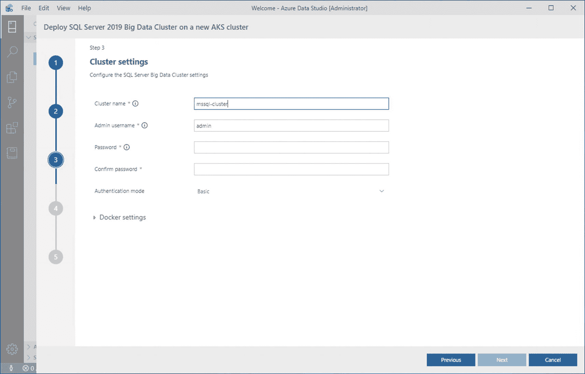

图 3-31 通过 ADS 部署 BDC – 步骤 3

在最后的配置屏幕（如图 3-32 所示）中，你可以修改每个池的实例数量，以及为数据和日志声明的存储大小和存储类。

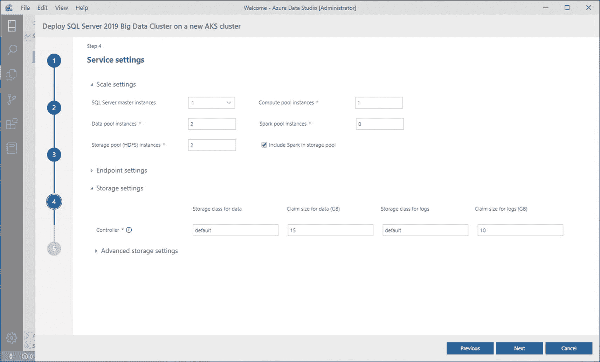

图 3-32 通过 ADS 部署 BDC – 步骤 4

如图 3-33 所示的最终屏幕会给你一个配置摘要。如果你希望继续，请点击“`Script to Notebook`”；否则，你可以使用“`Previous`”按钮返回，进行任何必要的更改和调整。

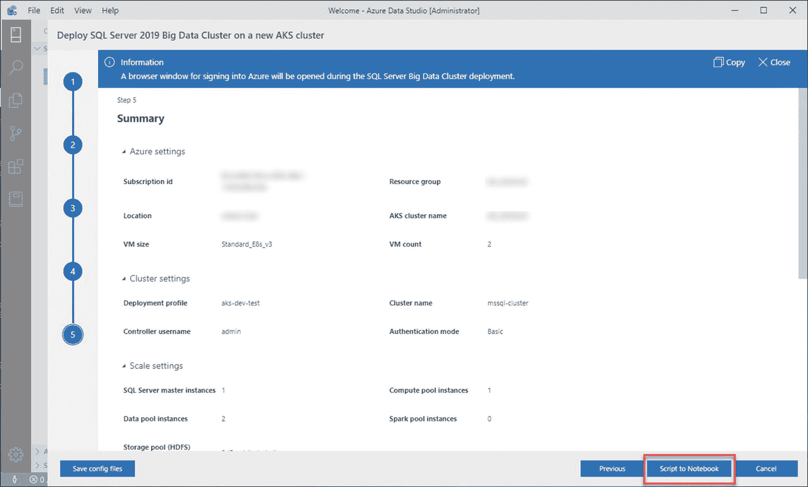

图 3-33 通过 ADS 部署 BDC – 摘要

除非你之前已经安装过，否则 ADS 会提示你为 Notebook 安装 Python，如图 3-34 所示。

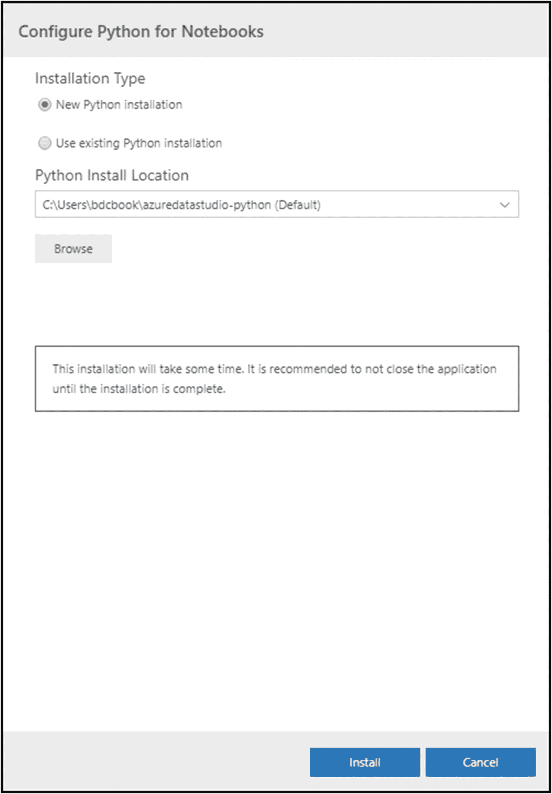

图 3-34 通过 ADS 部署 BDC – 安装 Python

等待安装完成。你的所有设置都已填充到一个 Python Notebook 中，你可以保存起来稍后使用，也可以立即运行。要执行 Notebook，只需单击“`Run Cells`”，如图 3-35 所示。请确保 Python 安装已完成。内核组合框应显示为“`Python 3`”。如果它仍然显示“`Loading kernels…`”，请耐心等待。


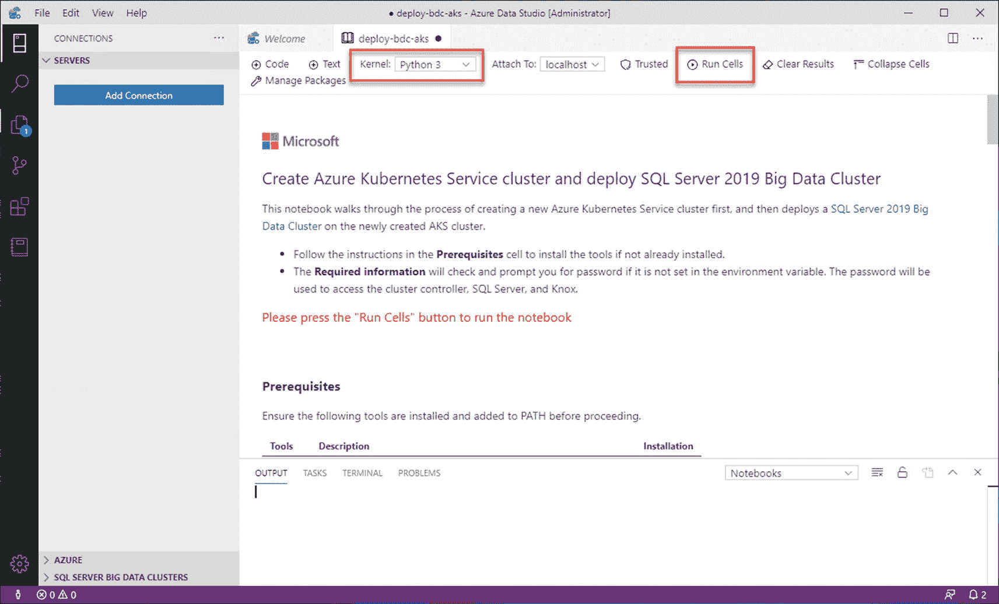

图 3-35 通过 ADS 部署 BDC – 预部署 Notebook

一旦你点击“`Run Cells`”，部署过程就会运行，并且——如果中途没有任何问题——最终会报告回集群的端点，如图 3-36 所示。你还会获得一个用于连接到主实例的直接链接。使用与脚本化部署选项相同的参数，部署所需的时间将与之相同。

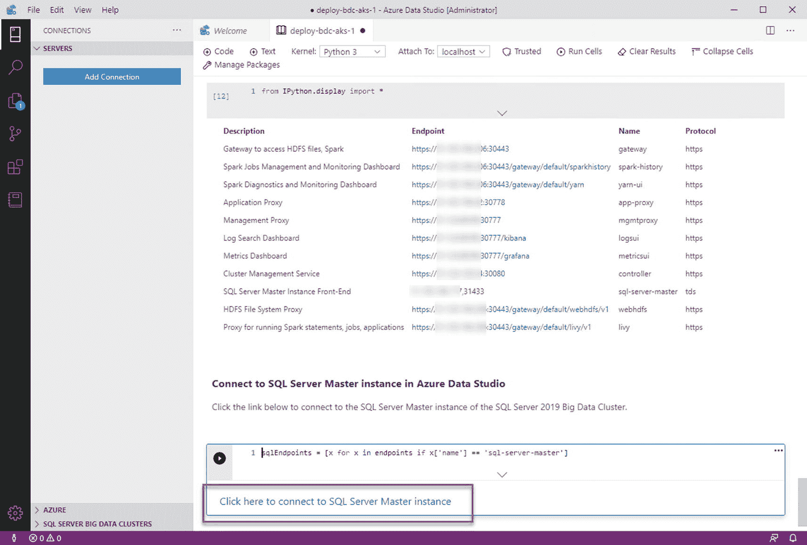

图 3-36 通过 ADS 部署 BDC – 部署后 Notebook

## 什么是 azdata？

如前所述，无论你选择哪种部署路径，大数据集群的部署始终通过一个名为 `azdata` 的工具来控制。这是一个命令行工具，将帮助你创建大数据集群配置、部署你的大数据集群，并且之后可能删除或升级你现有的集群。

合乎逻辑的第一步（在之前的脚本中以某种方式在后台发生）是创建一个配置，如清单 3-14 所示。

```
azdata bdc config init [--target -t] [--src -s]
```
*清单 3-14*
使用 `azdata` 创建集群配置

`Target` 只是你配置文件（`bdc.json` 和 `control.json`）的文件夹名称。`src` 是你可以开始使用的现有基础模板之一。

可能的取值如下（在撰写本文时）
*   `aks-dev-test`
*   `aks-dev-test-ha`
*   `kubeadm-dev-test`
*   `kubeadm-prod`

这些与你在 Azure Data Studio 中部署时看到的选项相匹配。你总是可以通过运行 `azdata bdc config init -t <yourtarget>` 而不指定源来获取所有有效选项。请记住，这些只是模板。如果你首选的环境没有作为一个选项提供，这并不一定意味着它不受支持，只是你需要对现有模板进行一些调整，以使其匹配你的目标。输出如图 3-37 所示。

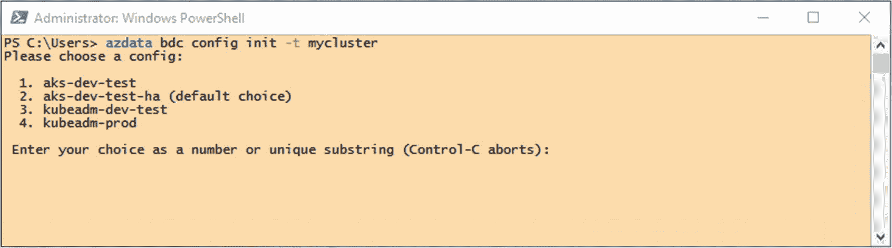
*图 3-37*
未指定源时运行 `azdata bdc config init` 的输出

选择的源将取决于你的部署类型。

运行 `azdata bdc config init` 会在一个以你的 `target` 命名的子文件夹中创建两个 `.JSON` 文件——`bdc.json` 和 `control.json`。这将基于默认值，因此我们需要对配置进行一些更改。这可以使用任何文本编辑器完成，也可以再次使用 `azdata` 的 `config replace` 选项完成，如清单 3-15 所示，我们用它来修改 `bdc.json` 文件中的大数据集群名称。

```
azdata bdc config replace -c myfirstbigdatacluster/bdc.json -j metadata.name=myfirstbigdatacluster
```
*清单 3-15*
使用 `azdata` 修改集群配置

`control` 文件定义了更通用的设置，例如你希望使用哪个版本、仓库等，而 `bdc` 文件配置了你的大数据集群环境的实际设置，例如每个角色的副本数量等，如清单 3-16 和 3-17 所示。

```
{
"apiVersion": "v1",
"metadata": {
"kind": "Cluster",
"name": "mssql-cluster"
},
"spec": {
"docker": {
"registry": "mcr.microsoft.com",
"repository": "mssql/bdc",
"imageTag": "2019-CU2-ubuntu-16.04",
"imagePullPolicy": "Always"
},
"storage": {
"data": {
"className": "",
"accessMode": "ReadWriteOnce",
"size": "15Gi"
},
"logs": {
"className": "",
"accessMode": "ReadWriteOnce",
"size": "10Gi"
}
},
"endpoints": [
{
"name": "Controller",
"dnsName": "",
"serviceType": "NodePort",
"port": 30080
},
{
"name": "ServiceProxy",
"dnsName": "",
"serviceType": "NodePort",
"port": 30777
}
],
"settings": {
"controller": {
"logs.rotation.size": "5000",
"logs.rotation.days": "7"
}
}
},
"security": {
"activeDirectory": {
"ouDistinguishedName": "",
"dnsIpAddresses": [],
"domainControllerFullyQualifiedDns": [],
"domainDnsName": "",
"clusterAdmins": [],
"clusterUsers": []
}
}
}
```
*清单 3-16*
`control.json` 示例

```
{
"apiVersion": "v1",
"metadata": {
"kind": "BigDataCluster",
"name": "mssql-cluster"
},
"spec": {
"resources": {
"nmnode-0": {
"spec": {
"replicas": 2
}
},
"sparkhead": {
"spec": {
"replicas": 2
}
},
"zookeeper": {
"spec": {
"replicas": 3
}
},
"gateway": {
"spec": {
"replicas": 1,
"endpoints": [
{
"name": "Knox",
"dnsName": "",
"serviceType": "NodePort",
"port": 30443
}
]
}
},
"appproxy": {
"spec": {
"replicas": 1,
"endpoints": [
{
"name": "AppServiceProxy",
"dnsName": "",
"serviceType": "NodePort",
"port": 30778
}
]
}
},
"master": {
"metadata": {
"kind": "Pool",
"name": "default"
},
"spec": {
"type": "Master",
"replicas": 3,
"endpoints": [
{
"name": "Master",
"dnsName": "",
"serviceType": "NodePort",
"port": 31433
},
{
"name": "MasterSecondary",
"dnsName": "",
"serviceType": "NodePort",
"port": 31436
}
],
"settings": {
"sql": {
"hadr.enabled": "true"
}
}
}
},
"compute-0": {
"metadata": {
"kind": "Pool",
"name": "default"
},
"spec": {
"type": "Compute",
"replicas": 1
}
},
"data-0": {
"metadata": {
"kind": "Pool",
"name": "default"
},
"spec": {
"type": "Data",
"replicas": 2
}
},
"storage-0": {
"metadata": {
"kind": "Pool",
"name": "default"
},
"spec": {
"type": "Storage",
"replicas": 3,
"settings": {
"spark": {
"includeSpark": "true"
}
}
}
}
},
"services": {
"sql": {
"resources": [
"master",
"compute-0",
"data-0",
"storage-0"
]
},
"hdfs": {
"resources": [
"nmnode-0",
"zookeeper",
"storage-0",
"sparkhead"
],
"settings": {
"hdfs-site.dfs.replication": "3"
}
},
"spark": {
"resources": [
"sparkhead",
"storage-0"
],
"settings": {
"spark-defaults-conf.spark.driver.memory": "2g",
"spark-defaults-conf.spark.driver.cores": "1",
"spark-defaults-conf.spark.executor.instances": "3",
"spark-defaults-conf.spark.executor.memory": "1536m",
"spark-defaults-conf.spark.executor.cores": "1",
"yarn-site.yarn.nodemanager.resource.memory-mb": "18432",
"yarn-site.yarn.nodemanager.resource.cpu-vcores": "6",
"yarn-site.yarn.scheduler.maximum-allocation-mb": "18432",
"yarn-site.yarn.scheduler.maximum-allocation-vcores": "6",
"yarn-site.yarn.scheduler.capacity.maximum-am-resource-percent": "0.3"
}
}
}
}
}
```
*清单 3-17*
`bdc.json` 示例

如你所见，该文件允许你更改相当多的设置。虽然你可能将许多设置保留为其默认值，但这在存储方面尤其方便。你可以更改磁盘大小以及存储类型。有关 Kubernetes 中存储的更多信息，我们建议阅读 [`https://kubernetes.io/docs/concepts/storage/`](https://kubernetes.io/docs/concepts/storage/)。

所有部署默认使用持久化存储。除非你有充分的理由更改这一点，否则应保持原样，因为在重启等情况下，非持久化存储可能会使你的集群处于无法工作的状态。

在已设置环境变量的命令提示符中运行以下命令（清单 3-18）。

```
azdata bdc create -c myfirstbigdatacluster --accept-eula yes
```
*清单 3-18*
使用 `azdata` 创建集群

现在，请坐下来放松一下，跟随 `azdata` 的输出（如图 3-38 所示），等待部署完成。

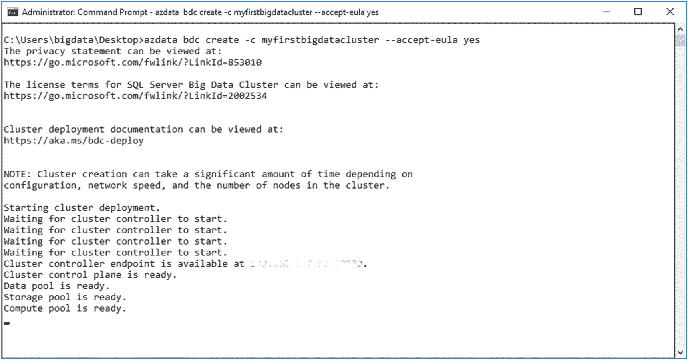
*图 3-38*
`azdata bdc create` 的输出

根据你的机器大小，这可能需要几分钟到几小时不等。

### 其他环境

还有其他多种 Kubernetes 环境可用——从树莓派到 VMWare。其中许多（但并非全部）支持 SQL Server 2019 大数据集群。支持的平台数量会随着时间的推移而增长，但没有完整的兼容环境列表。如果你正在研究一个特定的设置，最好也是最简单的方法就是亲自尝试一下！

## 高级部署选项

除了前面提到的配置选项外，我们还想提请你注意另外两个可以充分利用你的大数据集群的机会：Active Directory 身份验证和 HDFS 分层。


### 大数据集群的 Active Directory 身份验证

如果您希望使用 Active Directory (AD) 集成而非基本身份验证，这可以通过在您的 `control.json` 和 `bdc.json` 文件中提供额外信息来实现。虽然 `bdc.json` 只需要将 `nameservers` 设置为域控制器的 DNS，但 `control.json` 需要一些额外的参数，如清单 3-19 所示。

```json
"security": {
"activeDirectory": {
"ouDistinguishedName": "",
"dnsIpAddresses": [],
"domainControllerFullyQualifiedDns": [],
"domainDnsName": "",
"clusterAdmins": [],
"clusterUsers": []
}
```
**清单 3-19** `control.json` 中的 AD 参数

截至撰写本文时，仍存在不少限制。例如，AD 身份验证仅在 `kubeadm` 上受支持，在 AKS 部署中则不行，并且每个域只能有一个大数据集群。在部署大数据集群之前，您还需要在 AD 中设置一些非常具体的对象。有关如何启用此功能的详细步骤，请参阅官方文档 [`https://docs.microsoft.com/en-us/sql/big-data-cluster/deploy-active-directory?view=sql-server-ver15`](https://docs.microsoft.com/en-us/sql/big-data-cluster/deploy-active-directory%253Fview%253Dsql-server-ver15)。

### 大数据集群中的 HDFS 分层

如果您已有存储在 Azure Data Lake Store Gen2 或 Amazon S3 中的 HDFS，您可以将此存储挂载为大数据集群 HDFS 的子目录。这将通过环境变量、`kubectl` 和 `azdata` 命令的组合来实现。由于过程因源类型略有不同，我们建议您参考官方文档，可在 [`https://docs.microsoft.com/en-us/sql/big-data-cluster/hdfs-tiering?view=sql-server-ver15`](https://docs.microsoft.com/en-us/sql/big-data-cluster/hdfs-tiering%253Fview%253Dsql-server-ver15) 找到。

与在部署时启用 AD 身份验证不同，HDFS 分层将在现有的大数据集群上进行配置。

## 总结

在本章中，我们使用各种方法并安装了 SQL Server 2019 大数据集群的不同组件。

既然我们的大数据集群已经运行并准备好处理一些工作负载，让我们继续到第 4 章，我们将展示并讨论如何查询和使用该集群。

脚注 1

## 4. 将数据加载到大数据集群中

有了我们的第一个 SQL Server 大数据集群后，我们应该看看如何使用它。因此，我们将从向其添加一些数据开始。

## 为您的大数据集群全面准备好 Azure Data Studio

虽然 Azure Data Studio 默认可以连接到任何大数据集群（也可以管理和部署它），但我们建议您安装 Data Virtualization 扩展，该扩展为您提供向导，帮助创建外部（虚拟）表。

要安装该扩展，首先导航到 Azure Data Studio 中的扩展菜单，如图 4-1 所示。

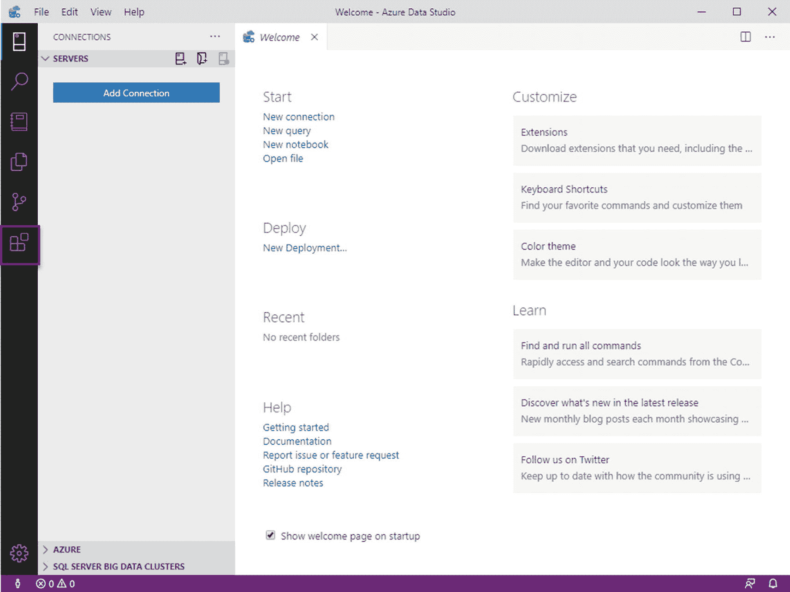
**图 4-1** 在 ADS 中从 VSIX 包安装扩展

在扩展市场中，它可能已经作为首要推荐之一显示。否则，您也可以如图 4-2 所示进行搜索。

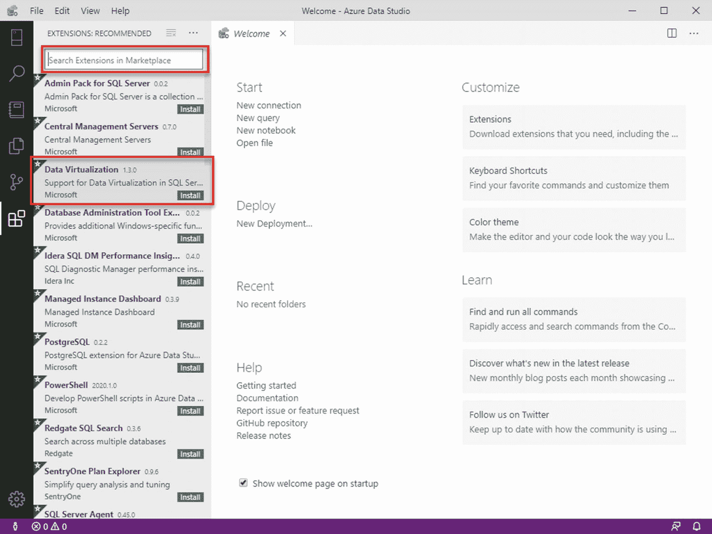
**图 4-2** Azure Data Studio 中的扩展

单击该扩展的绿色“安装”按钮，安装将立即触发，如图 4-3 所示。

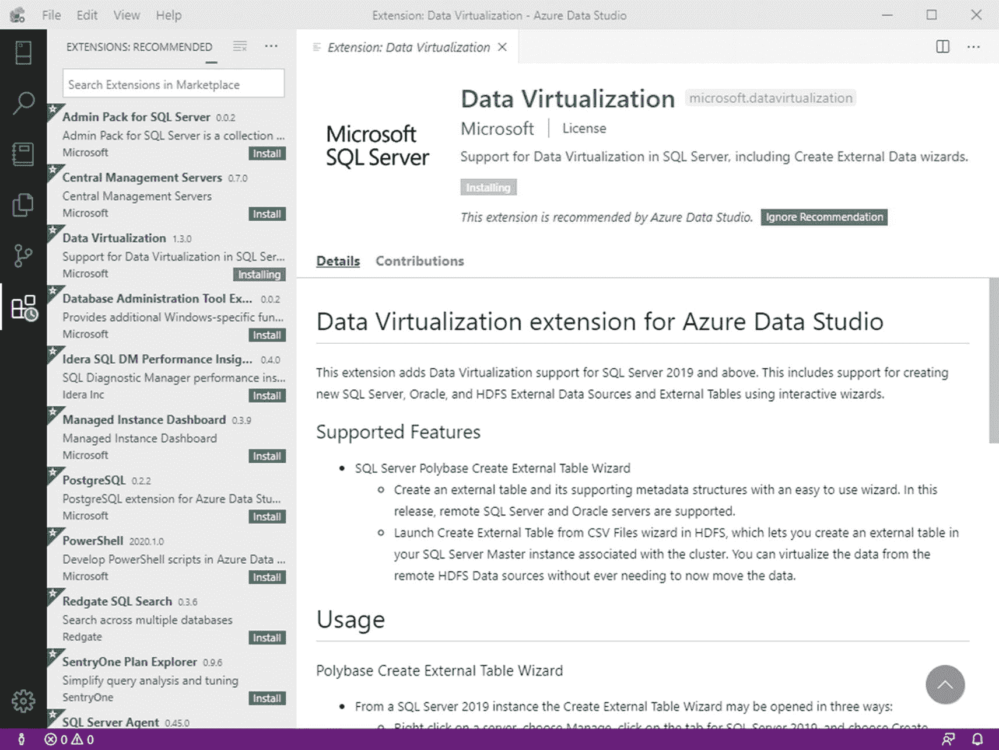
**图 4-3** Azure Data Studio 中正在进行的扩展安装

安装通常需要几分钟，最终您会看到扩展的状态变为“已安装”，如图 4-4 所示。

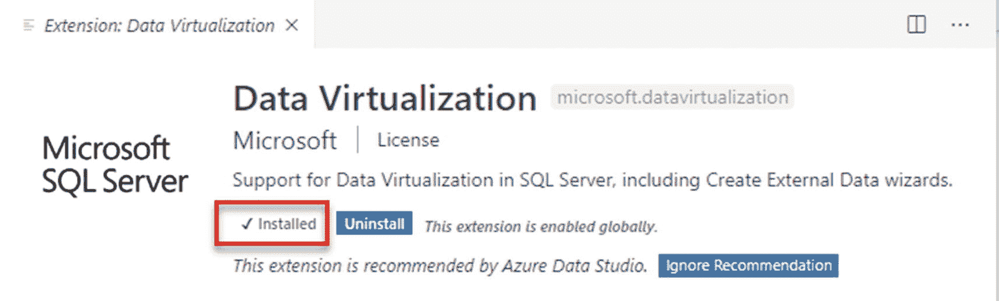
**图 4-4** Azure Data Studio 中已安装的扩展

该扩展现在可以使用了！

## 将一些示例文件导入安装中

一切准备就绪后，在我们真正开始使用新功能之前，我们需要的只是一些示例数据！

### 空数据库

要将一些外部 SQL Server 表链接到您的本地 SQL Server 实例，最简单的方法是简单地创建一个空白数据库。只需通过 SQL Server Management Studio 或 Azure Data Studio 连接到您的 SQL Server 2019 实例，并创建一个名为 `BDC_Empty` 的新数据库。您可以通过向导完成此操作，或者简单地运行如清单 4-1 所示的 T-SQL。

```sql
USE master
GO
CREATE DATABASE BDC_Empty
```
**清单 4-1** 通过 T-SQL 创建空数据库

就是这样。

### 大数据集群内的示例数据

如果您选择了包含 Kubernetes 集群的完整安装，有一些简单的方法和技术可以推送一些示例数据。如果您只部署了启用 PolyBase 但没有 Kubernetes 集群的本地安装，您可以跳过这部分——它无论如何也无法工作。

#### 将任何 SQL Server 备份还原到您的主实例

假设空数据库对您来说不够，您可能想知道如何将现有数据库还原到您的主实例。让我们用 `AdventureWorks2014` 尝试一下。

如果您手头没有 `AdventureWorks2014` 的备份，您可以通过 `curl` 从 GitHub 获取，例如（清单 4-2）。

```bash
curl -L -G "https://github.com/Microsoft/sql-server-samples/releases/download/adventureworks/AdventureWorks2014.bak" -o AdventureWorks2014.bak
```
**清单 4-2** 使用 `curl` 从 GitHub 下载 `AdventureWorks2014`

现在我们有了一个实际要还原的文件，我们需要先将其推送到主实例的文件系统。此任务将通过 `kubectl` 完成（清单 4-3）；您需要相应地替换集群的命名空间和主 Pod 名称。

```bash
kubectl cp AdventureWorks2014.bak /:var/opt/mssql/data/ -c mssql-server
```
**清单 4-3** 使用 `kubectl` 将 `AdventureWorks2014` 复制到主实例

最后但同样重要的是，我们需要从 `.bak` 文件还原数据库。这可以通过常规的 T-SQL 实现。在本例中，只需连接到您的主实例并运行脚本。当然，对于更复杂的场景，您可以使用带输入文件的 `sqlcmd` 或您熟悉的任何其他 SQL Server 机制。这里包括使用 SQL Server Management Studio 中的还原向导（清单 4-4）。

```sql
USE [master]
RESTORE DATABASE [AdventureWorks2014] FROM  DISK = N'/var/opt/mssql/data/AdventureWorks2014.bak' WITH  FILE = 1,  MOVE N'AdventureWorks2014_Data' TO N'/var/opt/mssql/data/AdventureWorks2014_Data.mdf',  MOVE N'AdventureWorks2014_Log' TO N'/var/opt/mssql/data/AdventureWorks2014_Log.ldf',  NOUNLOAD,  STATS = 5
```
**清单 4-4** 将 `AdventureWorks2014` 还原到主实例


## Microsoft 示例数据

我们将从 Microsoft 在其 GitHub 页面上提供的示例数据开始，[`https://github.com/Microsoft/sql-server-samples/tree/master/samples/features/sql-big-data-cluster`](https://github.com/Microsoft/sql-server-samples/tree/master/samples/features/sql-big-data-cluster)。请下载文件 `bootstrap-sample-db.sql`，并根据你的操作系统，下载 `bootstrap-sample-db.cmd`（适用于 Windows）或 `bootstrap-sample-db.sh`（适用于 Linux）。

然后，你可以使用以下参数运行 `.cmd` 或 `.sh` 文件（参见列表 4-5）。

```
用法: bootstrap-sample-db.cmd    [--install-extra-samples] [SQL_MASTER_PORT] [KNOX_PORT]
要使用基本身份验证，请设置 AZDATA_USERNAME 和 AZDATA_PASSWORD 环境变量。
要使用集成身份验证，请提供端点的 DNS 名称。
如果使用非默认值，可以单独指定端口。
列表 4-5
安装默认的 Microsoft 示例
```

只需传递你在安装集群时使用或提供的（IP、密码、命名空间）信息，脚本就会自动运行，并将一些示例数据导入到你的安装中。

此脚本的要求是：

*   `sqlcmd`
*   `bcp`
*   `kubectl`
*   `curl`

如果你在初始安装所用的同一台机器上运行此脚本，这些要求应该已经满足。

## 航班延误示例数据集

除了 Microsoft 示例，让我们再添加一些外部数据。寻找免费数据集的一个好地方是 `kaggle.com`（图 4-5）。

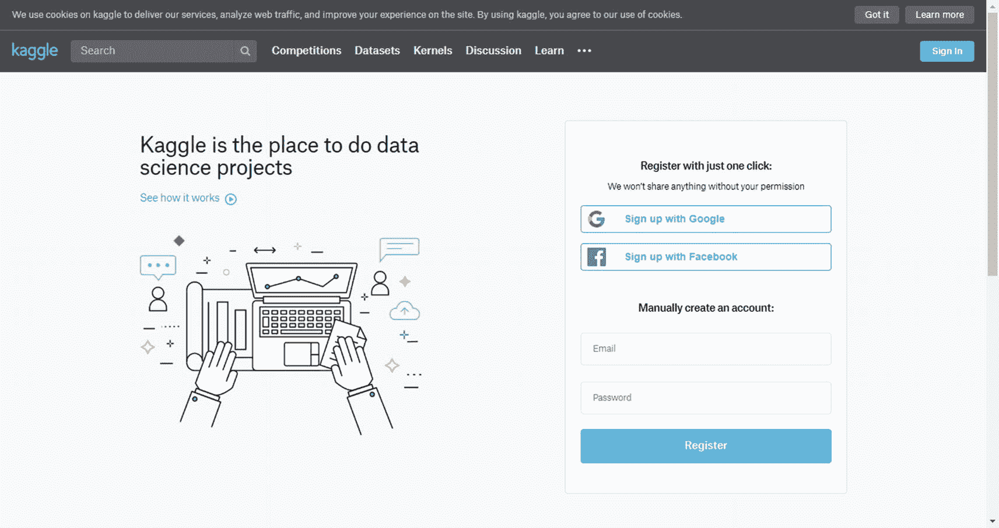

**图 4-5** Kaggle.com 登录

如果你还没有账户，只需注册一个免费账户。否则，直接登录你的账户。

登录后，导航到“数据集”并搜索“Flight Delays”，这应该会显示出来自美国交通部的“2015 航班延误和取消”数据集，如图 4-6 所示。

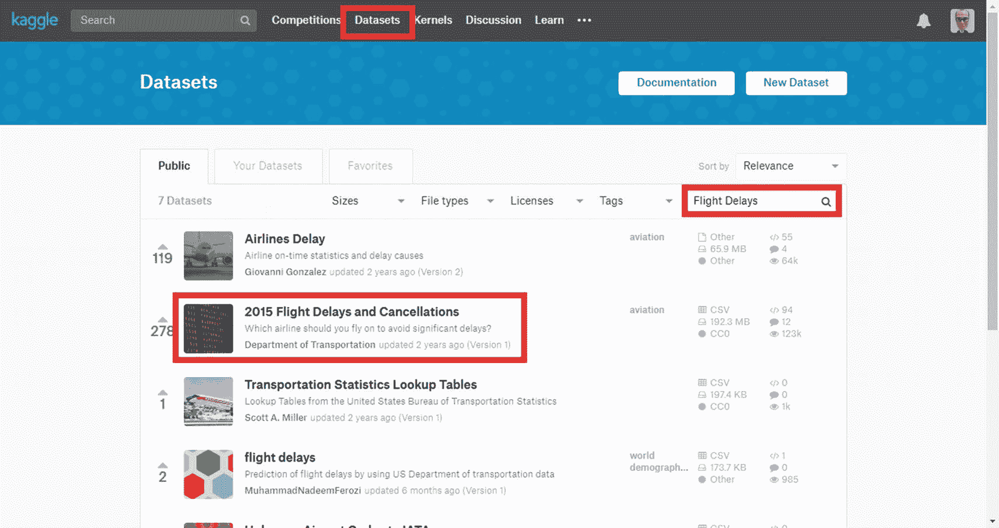

**图 4-6** Kaggle.com 数据集

或者，你也可以直接导航到 [`www.kaggle.com/usdot/flight-delays`](http://www.kaggle.com/usdot/flight-delays)。

该数据集包含三个文件：航空公司、机场和航班。你可以通过点击“下载”一次性下载所有文件，这将触发一个包含所有文件的 ZIP 文件下载，如图 4-7 所示。

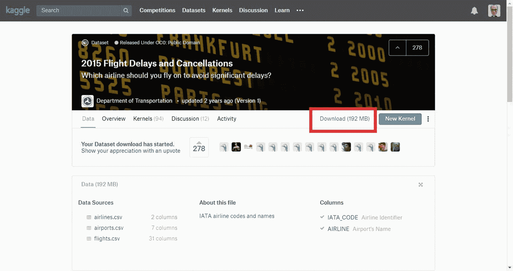

**图 4-7** Kaggle.com 下载航班延误数据集

虽然这个数据集的大小并非不合理，但它提供了很多选项来探索和处理数据。下载文件后，我们仍然需要将这些数据导入到我们的大数据集群中。由于只有三个文件，我们将通过 Azure Data Studio 手动上传它们来完成。

因此，在 Azure Data Studio 中连接到你的大数据集群，导航到“数据服务”，打开 HDFS 根文件夹，并创建一个名为“Flight_Delays”的新目录，如图 4-8 所示。

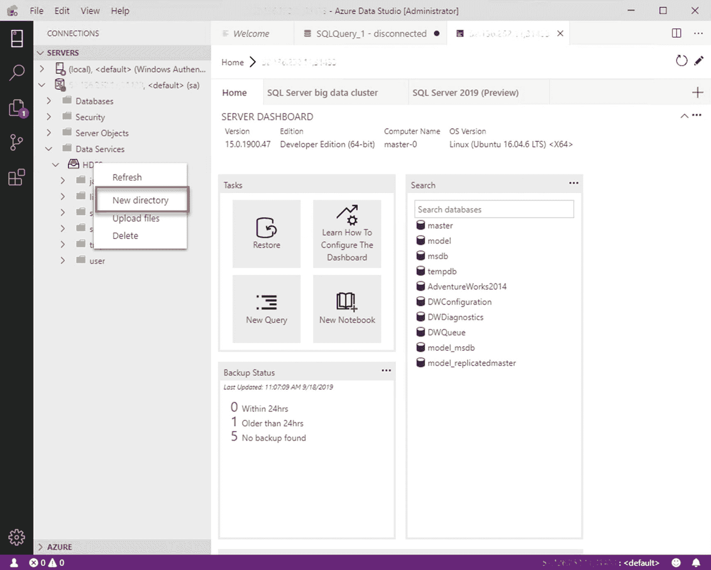

**图 4-8** 在 ADS 的 HDFS 上创建新目录

然后，你可以选择此目录，点击鼠标右键，选择“上传文件”，并上传这三个 CSV 文件。你可以多选，因此无需逐个上传。如果点击鼠标右键并刷新文件夹，文件应该可见，如图 4-9 所示。

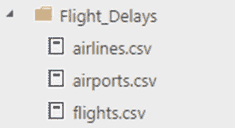

**图 4-9** ADS 中新文件夹内文件的显示

上传进度也会在 Azure Data Studio 的页脚显示。

通过前端上传的另一种方法是使用命令提示符下的 `curl`。你可以使用它来创建目标目录和上传实际文件。

对于仅 `airlines.csv`，如列表 4-6 所示（你需要替换你的 IP 地址和密码）。第一行将创建一个名为“Flight_Delays”的目录，而第二行将文件“airlines.csv”上传到其中。

```
curl -i -L -k -u root: -X PUT "https:// /gateway/default/webhdfs/v1/Flight_Delays?op=MKDIRS"
curl -i -L -k -u root: -X PUT "https:///gateway/default/webhdfs/v1/Flight_Delays /airlines.csv?op=create&overwrite=true" -H "Content-Type: application/octet-stream" -T "airlines.csv"
列表 4-6
使用 curl 上传数据到 HDFS


### Azure SQL Database

正如第 1 章用例中所述，使用大数据集群 PolyBase 实现的一种方式是将数据延伸到 Azure（或任何其他基于云的 SQL Server）。为了更好地理解这一点，除非您已经在另一台 SQL Server 或 Azure SQL DB 上拥有数据库，否则我们建议您在 Azure 中设置一个包含 AdventureWorks 数据库的小型数据库。

为此，请再次登录 Azure 门户（图 4-10），就像您在第 3 章中所做的那样。

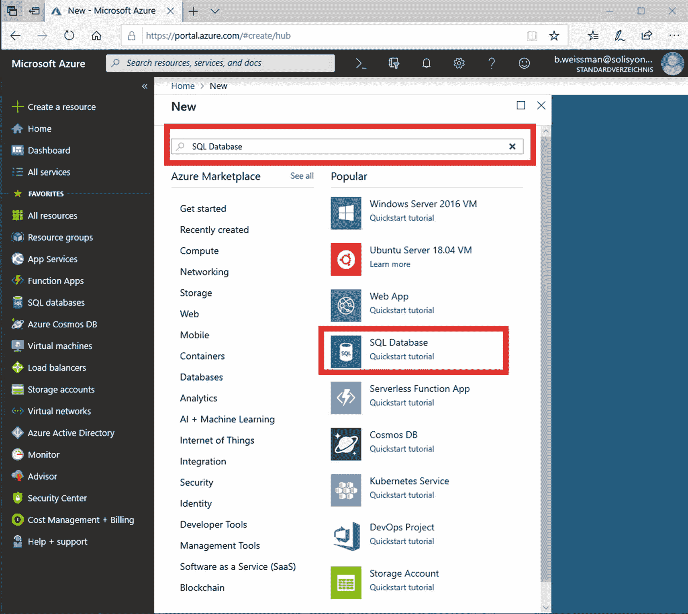

图 4-10 在 Azure 门户中创建资源

然后，在左侧面板的顶部选择“创建资源”，从列表中选取或搜索“SQL 数据库”。

在下一个屏幕上，直接点击“创建”（图 4-11）。

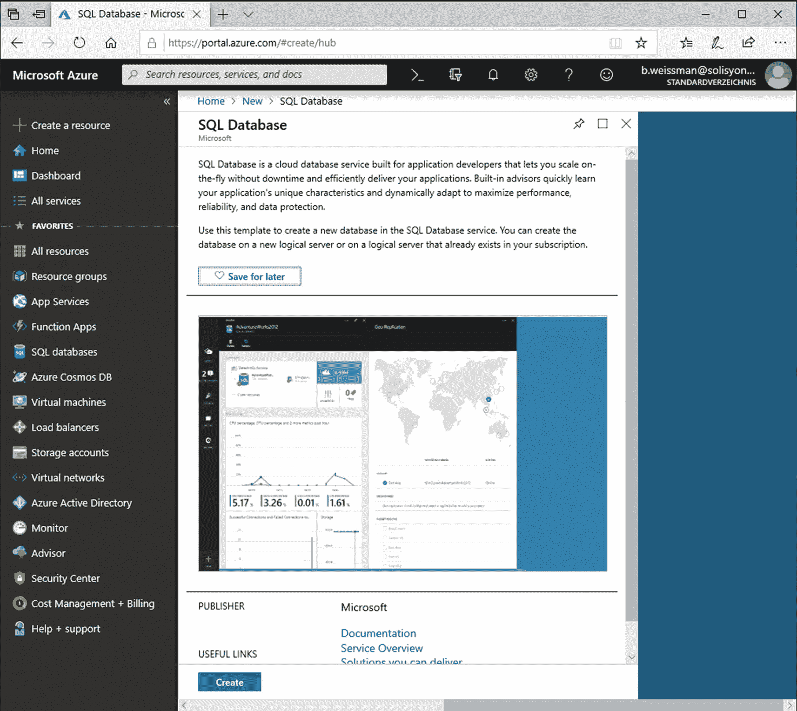

图 4-11 在 Azure 门户中创建 SQL 数据库

将数据库名称设为“AdventureWorks”，选择合适的订阅，创建新的资源组或选择现有的，并将“示例 (AdventureWorksLT)”选择为源（图 4-12）。

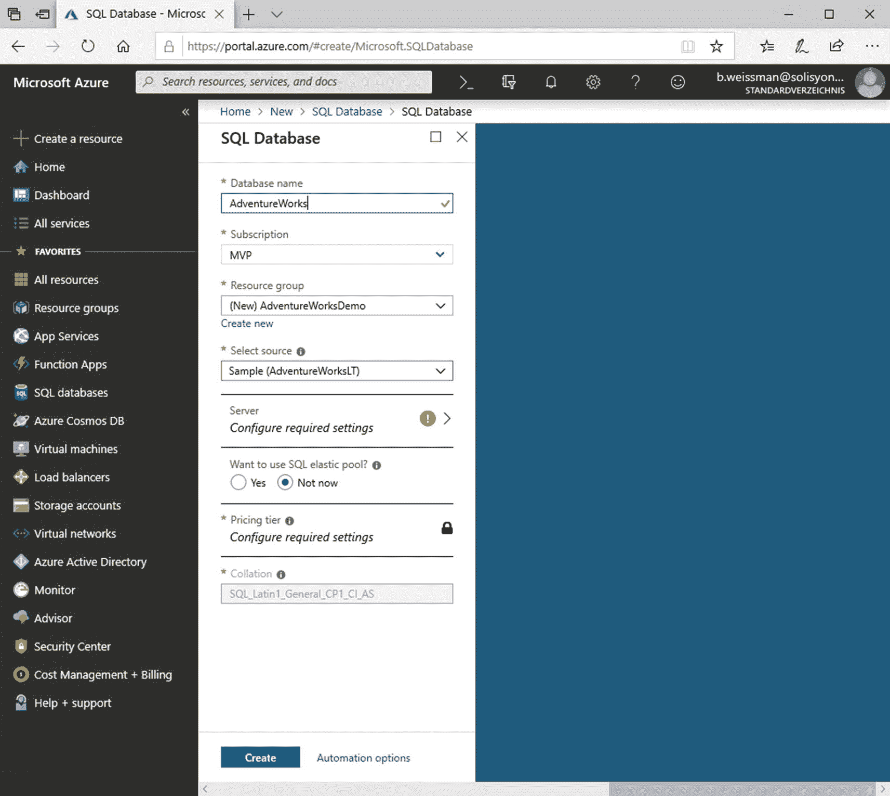

图 4-12 通过 Azure 门户配置要创建的 SQL 数据库

您还需要配置一个服务器（图 4-13），因此请展开“服务器”子菜单。通过提供名称（必须是唯一的）、用户名和密码来设置服务器。同样，选择离您最近的位置，并保持“允许 Azure 服务访问服务器”复选框为选中状态。这将允许您从其他 Azure 虚拟机或服务访问此数据库，而无需担心防火墙设置。根据您的设置，您可能仍然需要允许从本地计算机访问——我们稍后会讲到这一点。

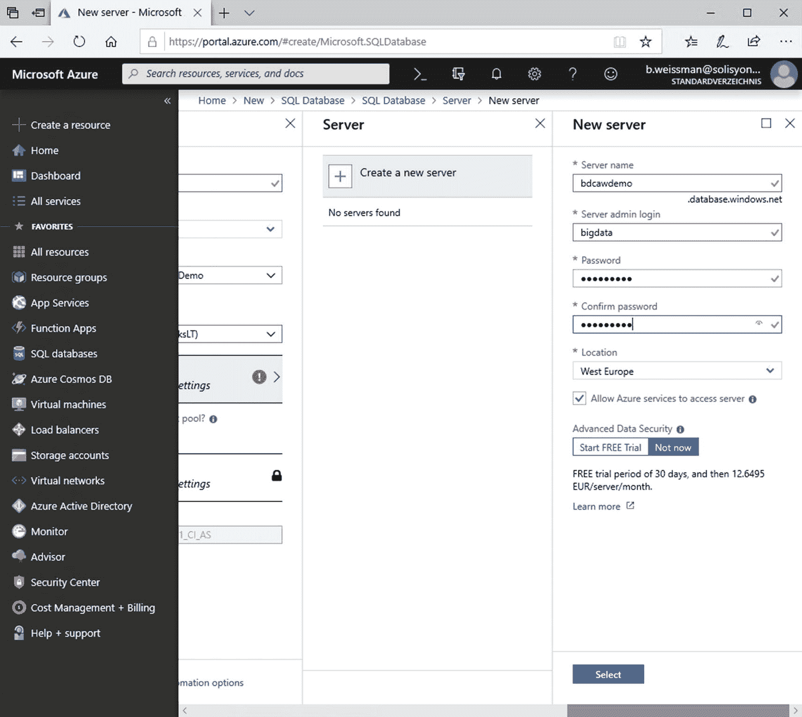

图 4-13 在 Azure 门户中为新的 SQL 数据库配置服务器

您现在可以将“定价层”更改为“基本”，这是最便宜的选项，但完全足以满足我们此处的目标。

点击“创建”确认您的选择；这将触发服务器和数据库的部署，可能需要几分钟时间。您已完成——您刚刚创建了 AdventureWorksLT 数据库，我们可以用它来进行远程查询。

尝试通过 Azure Data Studio 连接到数据库（图 4-14）。

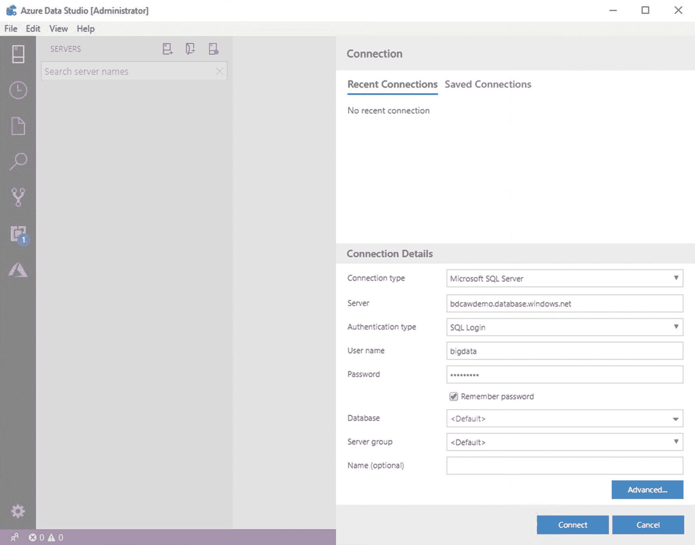

图 4-14 ADS 中的连接对话框

如果您不在 Azure 虚拟机上，或者取消选中了允许从 Azure 连接的框，您可能会看到图 4-15 中所示的错误。

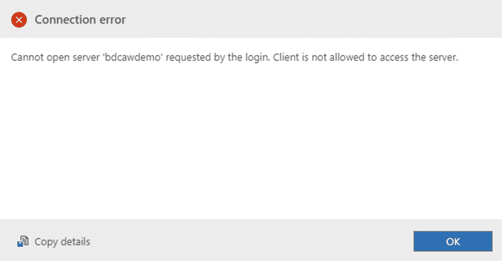

图 4-15 Azure Data Studio – 连接错误

如果发生这种情况，请返回 Azure 门户（图 4-16），导航到包含数据库服务器的资源组，并选择该服务器（确保点击的是 SQL Server，而不是 SQL 数据库）。

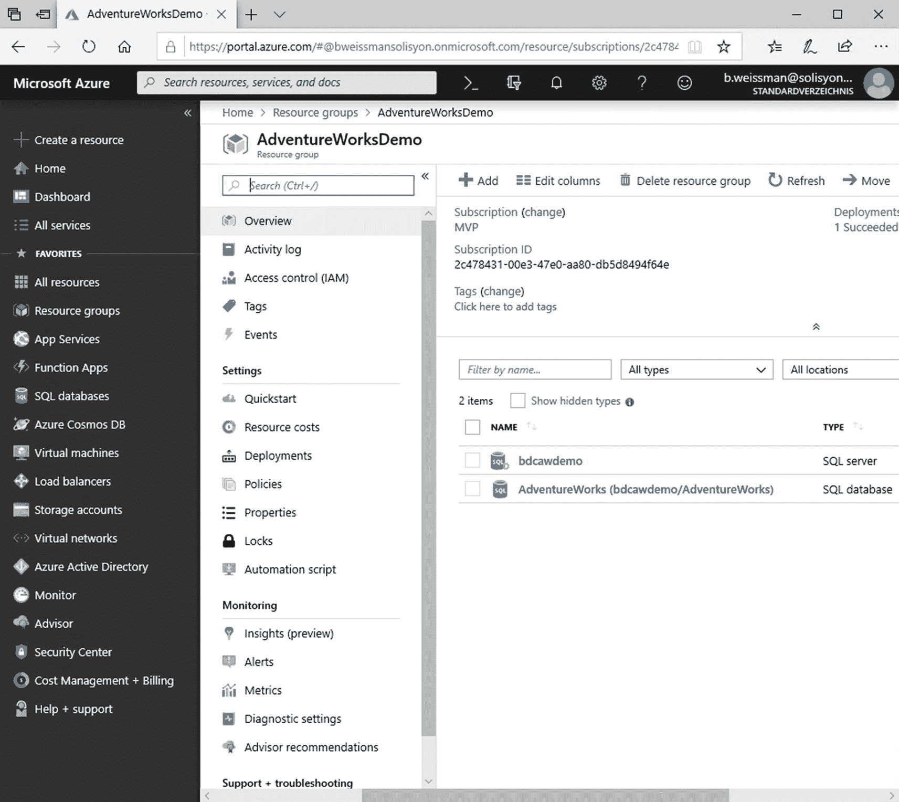

图 4-16 Azure SQL 数据库配置

在左侧，向下滚动到“安全性”，并选择“防火墙和虚拟网络”，如图 4-17 所示。

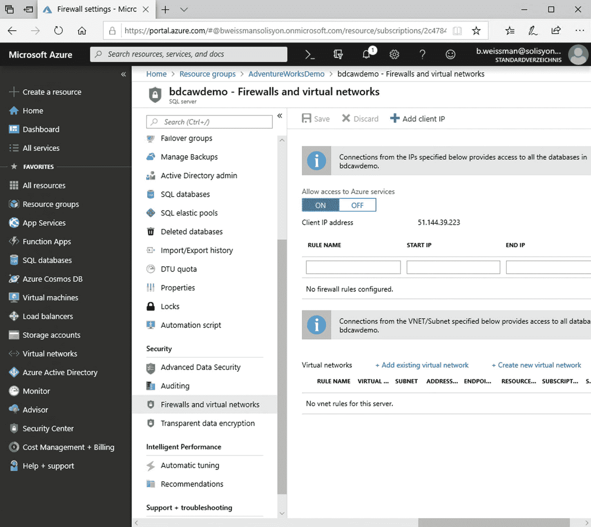

图 4-17 Azure 门户防火墙设置

点击“添加客户端 IP”或手动添加您的 IP 地址。

保存您的更改。

现在，尝试在 Azure Data Studio 中再次连接到数据库。您应该能够看到 AdventureWorks 数据库，包括图 4-18 中所示的表。

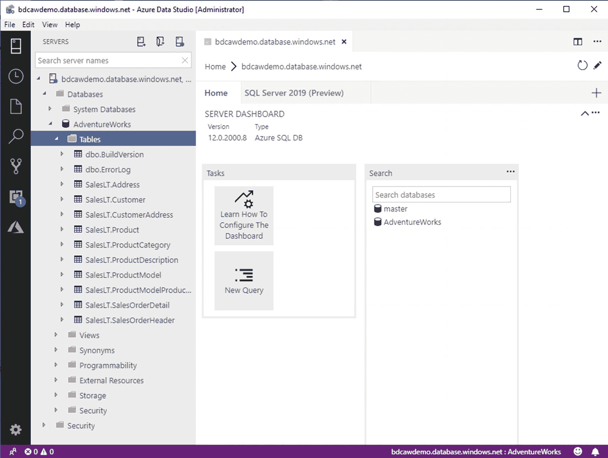

图 4-18 ADS 中显示的 AdventureWorksLT 表结构

## 总结

在本章中，我们将一些数据加载到了先前部署的 SQL Server 大数据集群中。现在是时候看看如何使用这些数据了！

### 通过 T-SQL 查询大数据集群

既然我们有一些数据可以操作了，让我们看看如何通过 Azure Data Studio 提供的多种选项来处理和查询这些数据。

## 外部表

查询大数据集群（Big Data Cluster）使用的是 T-SQL 通过 *外部表*（external tables）实现的，这个概念最初是在 SQL Server 2016 中随着 PolyBase 的出现而引入的。

我们将通过向一个新的空数据库 `BDC_Empty`（该数据库最初位于我们的 Azure `AdventureWorksLT` 数据库中）添加一些外部表，来开始查询我们的大数据集群。

首先，如图 5-1 所示，通过 Azure Data Studio 连接到你的 SQL Server 主实例（或任何其他启用了 PolyBase 的 SQL Server 2019 实例）。

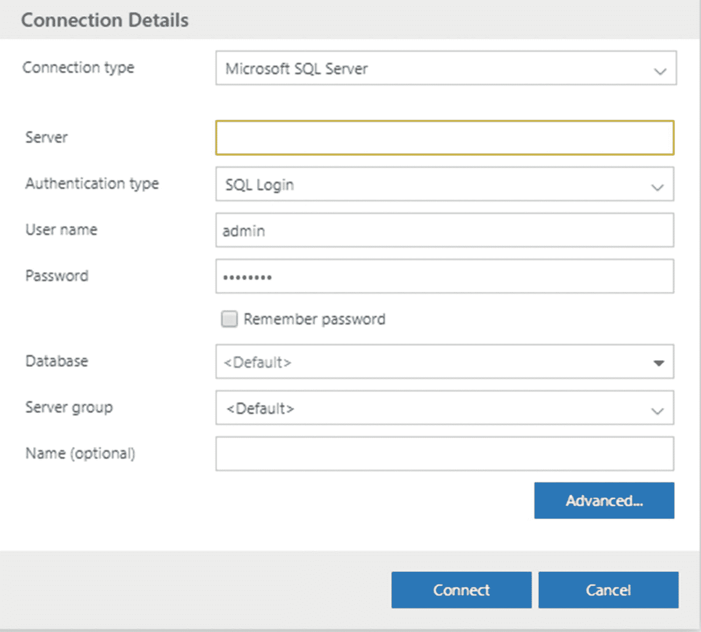

图 5-1
连接到主实例

你的连接类型将是 `Microsoft SQL Server`。服务器地址将是服务器的 IP（或 DNS 名称）（如果使用了实例名，可能需要追加实例名）以及实例的端口（用逗号分隔），除非是运行在标准端口 `1433` 上的本地安装。

展开你的连接、数据库、`BDC_Empty` 数据库以及其中的表（图 5-2）。

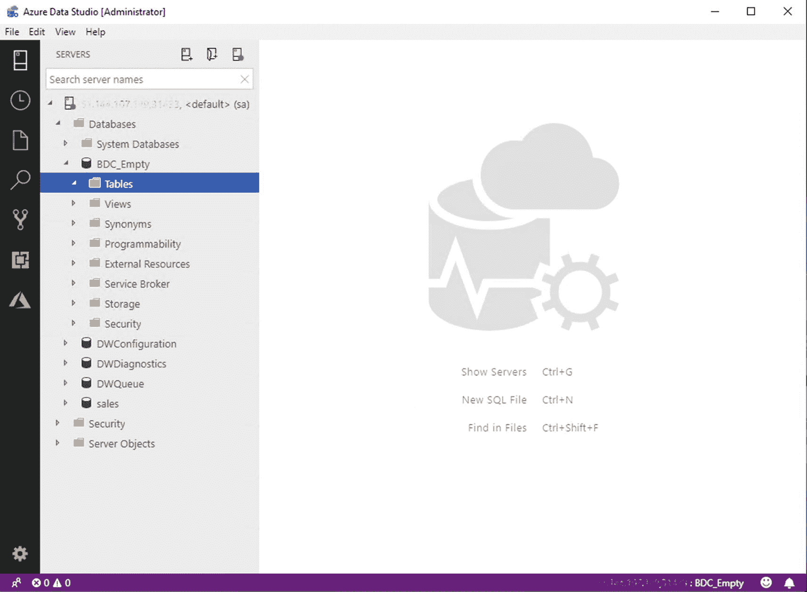

图 5-2
ADS 中的空数据库

正如预期，目前没有任何表。让我们来改变这一点！

如果你在数据库上右键单击，你会看到一个名为 `Create External Table` 的选项。这将打开相应的向导。

在第一步中，它会要求你确认要在其中创建外部表的数据库，并选择一个数据源类型。此时（图 5-3），该向导支持 `SQL Server` 和 `Oracle`；除了 `CSV` 文件（它们有自己的向导）之外，所有其他源都需要手动编写脚本。

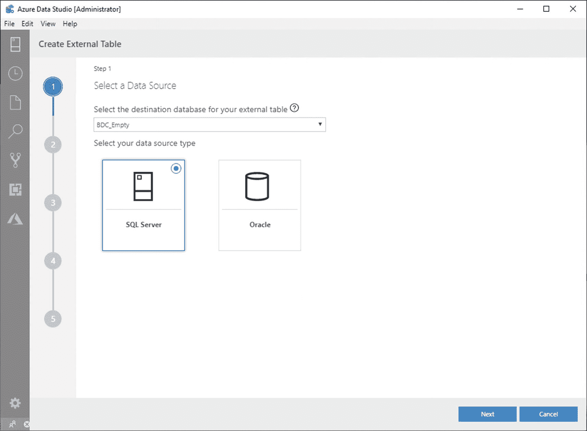

图 5-3
ADS 中的外部表向导 – 选择数据源

选择 `SQL Server` 并单击 `Next`。

在下一个对话框中（图 5-4），向导将要求你为此数据库设置一个主密钥密码。这是必需的，因为我们将把凭据存储在数据库中，这些凭据需要被加密。如果你在已设有主密钥密码的数据库上运行向导，此步骤将被跳过。

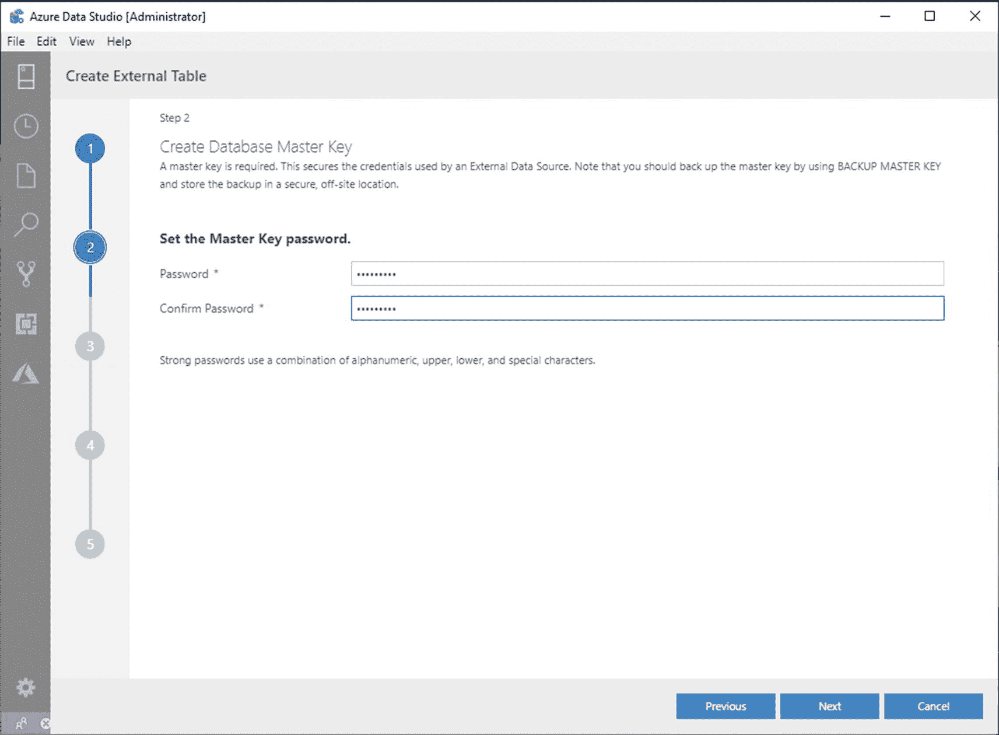

图 5-4
ADS 中的外部表向导 – 创建数据库主密钥

输入并确认密码，然后单击 `Next`。

下一个屏幕（图 5-5）要求你提供连接的名称（别名）、连接的服务器名称以及数据库名称。如果你之前配置过，也可以选择使用现有的连接。

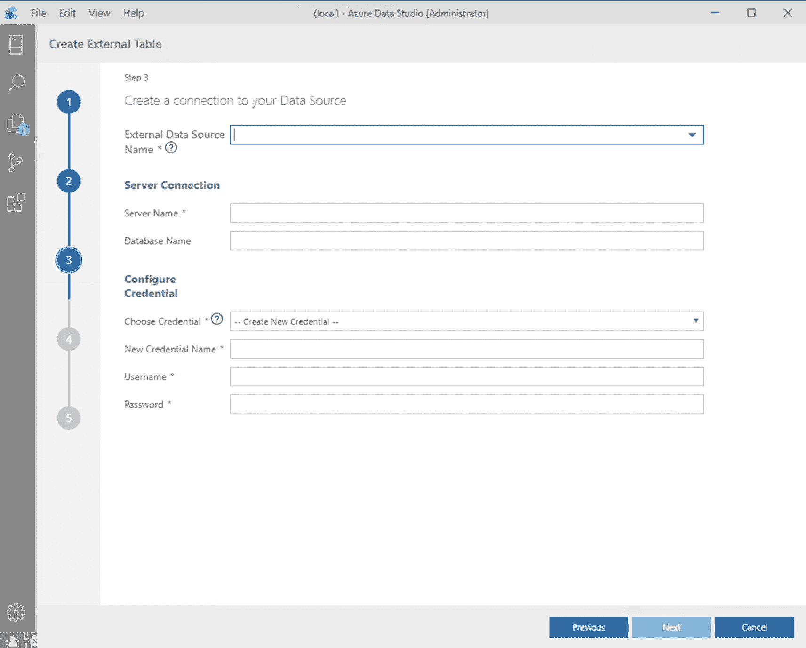

图 5-5
ADS 中的外部表向导 – 连接和凭据

此外，系统会提供一个已存在的凭据列表（如果有的话）以及创建新凭据的选项。

使用 `AW` 作为你的数据源名称和 `New Credential Name`，`AdventureWorks` 作为你的 `Database Name`，并提供你在上一步中配置的 `Server Name`、`Username` 和 `Password`。点击 `Next`。

向导现在将加载源数据库中的所有表和视图，你可以展开并浏览它们，如图 5-6 所示。

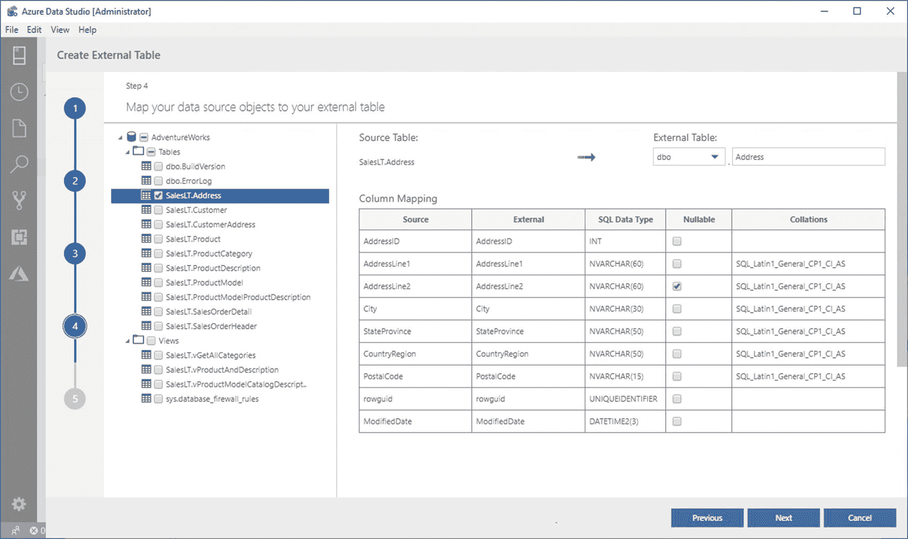

图 5-6
ADS 中的外部表向导 – 对象映射

你可以选择整个数据库、所有表或所有视图，或者选择一定数量的单个对象。

你将无法更改任何列定义，并且必须始终“创建”源中存在的所有列。由于没有实际移动数据，而只是对外部模式的引用，这不是问题。

唯一可以更改的两件事（如图 5-7 所示屏幕的右上角部分）是目标模式（target schema）和目标表名（target table name），因为你可能希望将所有外部表创建在一个单独的模式中，或者为它们添加前缀。

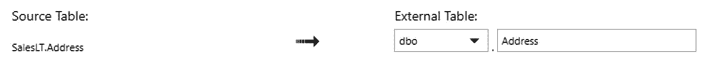

图 5-7
ADS 中的外部表向导 – 表映射

现在，选择表 `Address`、`Customer` 和 `CustomerAddress`，并保持其他所有表未选中以及所有设置不变。点击 `Next`。

你已到达最后一步，这是一个摘要页面，如图 5-8 所示。

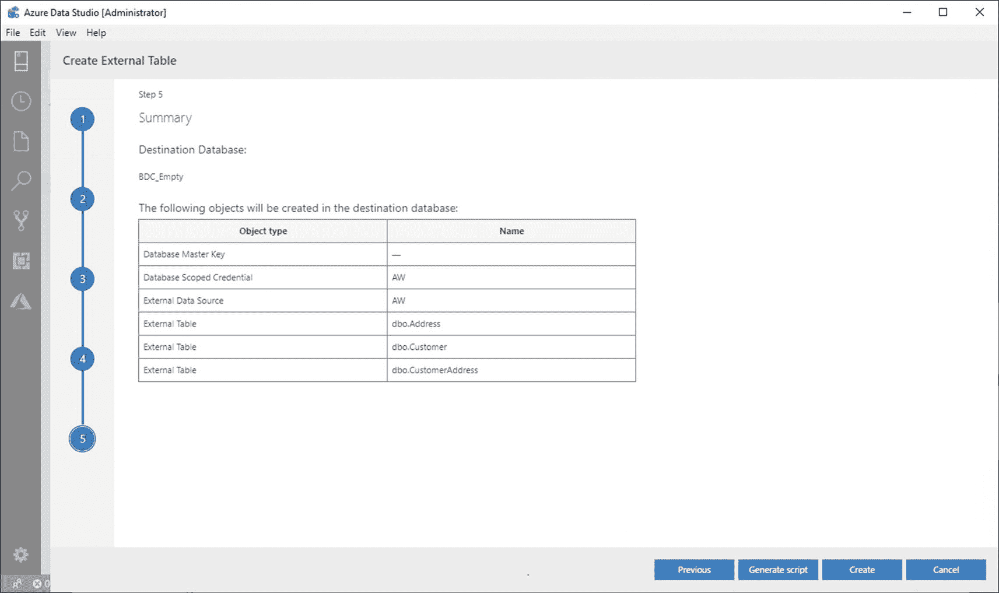

图 5-8
ADS 中的外部表向导 – 摘要

你现在可以选择生成脚本，或者直接通过向导创建所有对象。

让我们来看一下脚本（清单 5-1），所以点击 `Generate Script`，然后点击 `Cancel` 关闭向导。你将看到脚本，它将启动一个事务，然后以正确的顺序创建所有对象：从密钥开始，然后是凭据和数据源，最后是我们的三个表。


# 从 Azure SQL 数据库创建外部表

以下 T-SQL 脚本用于从 Azure SQL 数据库生成外部表。

```sql
BEGIN TRY
BEGIN TRANSACTION Tcfc2da095679401abd1ae9deb0e6eae
USE [BDC_Empty];
CREATE MASTER KEY ENCRYPTION BY PASSWORD = '';
CREATE DATABASE SCOPED CREDENTIAL [AW]
WITH IDENTITY = 'bigdata', SECRET = '';
CREATE EXTERNAL DATA SOURCE [AW]
WITH (LOCATION = 'sqlserver:// .database.windows.net', CREDENTIAL = [AW]);
CREATE EXTERNAL TABLE [dbo].[Address]
(
[AddressID] INT NOT NULL,
[AddressLine1] NVARCHAR(60) COLLATE SQL_Latin1_General_CP1_CI_AS NOT NULL,
[AddressLine2] NVARCHAR(60) COLLATE SQL_Latin1_General_CP1_CI_AS,
[City] NVARCHAR(30) COLLATE SQL_Latin1_General_CP1_CI_AS NOT NULL,
[StateProvince] NVARCHAR(50) COLLATE SQL_Latin1_General_CP1_CI_AS NOT NULL,
[CountryRegion] NVARCHAR(50) COLLATE SQL_Latin1_General_CP1_CI_AS NOT NULL,
[PostalCode] NVARCHAR(15) COLLATE SQL_Latin1_General_CP1_CI_AS NOT NULL,
[rowguid] UNIQUEIDENTIFIER NOT NULL,
[ModifiedDate] DATETIME2(3) NOT NULL
)
WITH (LOCATION = '[AdventureWorks].[SalesLT].[Address]', DATA_SOURCE = [AW]);
CREATE EXTERNAL TABLE [dbo].[Customer]
(
[CustomerID] INT NOT NULL,
[NameStyle] BIT NOT NULL,
[Title] NVARCHAR(8) COLLATE SQL_Latin1_General_CP1_CI_AS,
[FirstName] NVARCHAR(50) COLLATE SQL_Latin1_General_CP1_CI_AS NOT NULL,
[MiddleName] NVARCHAR(50) COLLATE SQL_Latin1_General_CP1_CI_AS,
[LastName] NVARCHAR(50) COLLATE SQL_Latin1_General_CP1_CI_AS NOT NULL,
[Suffix] NVARCHAR(10) COLLATE SQL_Latin1_General_CP1_CI_AS,
[CompanyName] NVARCHAR(128) COLLATE SQL_Latin1_General_CP1_CI_AS,
[SalesPerson] NVARCHAR(256) COLLATE SQL_Latin1_General_CP1_CI_AS,
[EmailAddress] NVARCHAR(50) COLLATE SQL_Latin1_General_CP1_CI_AS,
[Phone] NVARCHAR(25) COLLATE SQL_Latin1_General_CP1_CI_AS,
[PasswordHash] VARCHAR(128) COLLATE SQL_Latin1_General_CP1_CI_AS NOT NULL,
[PasswordSalt] VARCHAR(10) COLLATE SQL_Latin1_General_CP1_CI_AS NOT NULL,
[rowguid] UNIQUEIDENTIFIER NOT NULL,
[ModifiedDate] DATETIME2(3) NOT NULL
)
WITH (LOCATION = '[AdventureWorks].[SalesLT].[Customer]', DATA_SOURCE = [AW]);
CREATE EXTERNAL TABLE [dbo].[CustomerAddress]
(
[CustomerID] INT NOT NULL,
[AddressID] INT NOT NULL,
[AddressType] NVARCHAR(50) COLLATE SQL_Latin1_General_CP1_CI_AS NOT NULL,
[rowguid] UNIQUEIDENTIFIER NOT NULL,
[ModifiedDate] DATETIME2(3) NOT NULL
)
WITH (LOCATION = '[AdventureWorks].[SalesLT].[CustomerAddress]', DATA_SOURCE = [AW]);
COMMIT TRANSACTION Tcfc2da095679401abd1ae9deb0e6eae
END TRY
BEGIN CATCH
IF @@TRANCOUNT > 0
ROLLBACK TRANSACTION Tcfc2da095679401abd1ae9deb0e6eae
DECLARE @ErrorMessage NVARCHAR(4000) = ERROR_MESSAGE();
DECLARE @ErrorSeverity INT = ERROR_SEVERITY();
DECLARE @ErrorState INT = ERROR_STATE();
RAISERROR(@ErrorMessage, @ErrorSeverity, @ErrorState);
END CATCH;
```

**清单 5-1** 用于从 Azure SQL 数据库生成外部表的 T-SQL

一旦运行该脚本（点击屏幕左上角的“Run”或直接按`F5`），它将执行并在您的数据库中创建这些对象。

刷新表后，这三个新表就会显示出来，看起来如 **图 5-9** 所示。通过表名后面的提示，您可以很容易地识别出它们是外部表。

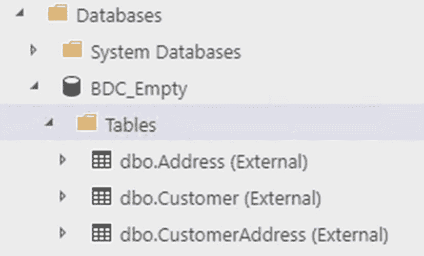

**图 5-9** 在 ADS 中创建后显示的外部表

在 SSMS 中，它们可以通过位于自己的文件夹中来识别，如 **图 5-10** 所示。

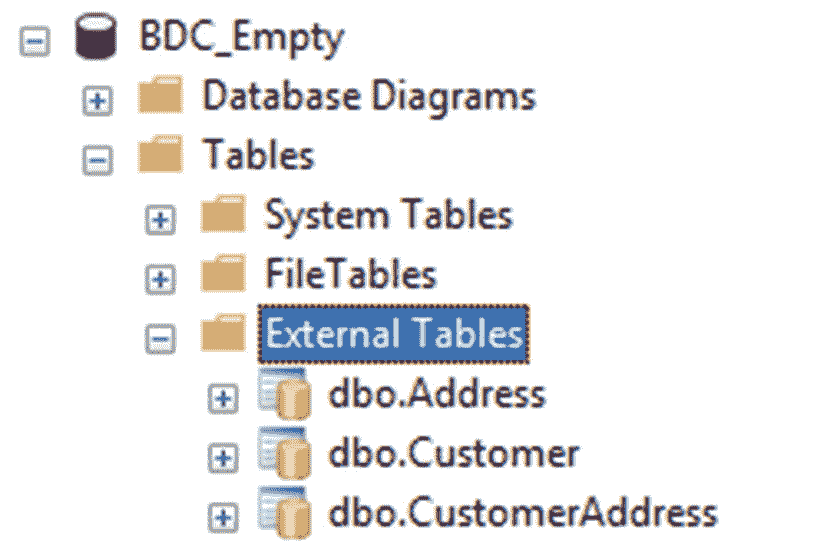

**图 5-10** 在 SSMS 中创建后显示的外部表

从客户端角度来看，这些表的行为类似于本地表。在 Azure Data Studio 中右键单击 `Address` 表（**图 5-11**）并点击 “Select Top 1000”。

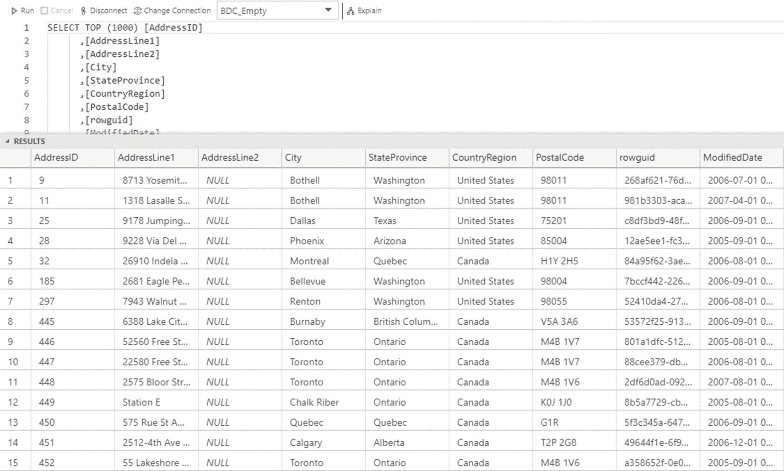

**图 5-11** 在 ADS 中针对外部表执行 `SELECT` 语句的输出

您可以看到查询基本上是 `SELECT TOP 1000 * FROM dbo.Address`，尽管数据位于外部数据库中。您可以将此数据与本地表或任何其他类型的本地数据源进行连接。在研究来自 CSV 文件的外部表时，我们会进一步探讨这一点。

让我们从运行一个针对所有三个外部表的查询开始（**清单 5-2**），以获取总部位于爱达荷州的所有公司。

```sql
SELECT CompanyName
FROM [Address] ADDR
INNER JOIN CustomerAddress CADDR ON ADDR.AddressID = CADDR.AddressID
INNER JOIN Customer CUST ON CUST.CustomerID = CADDR.CustomerID
WHERE
AddressType = 'Main Office'
AND StateProvince = 'Idaho'
```

**清单 5-2** 连接两个外部表的 `SELECT` 语句

同样，这看起来像是针对某些本地表的常规查询，如 **图 5-12** 所示。

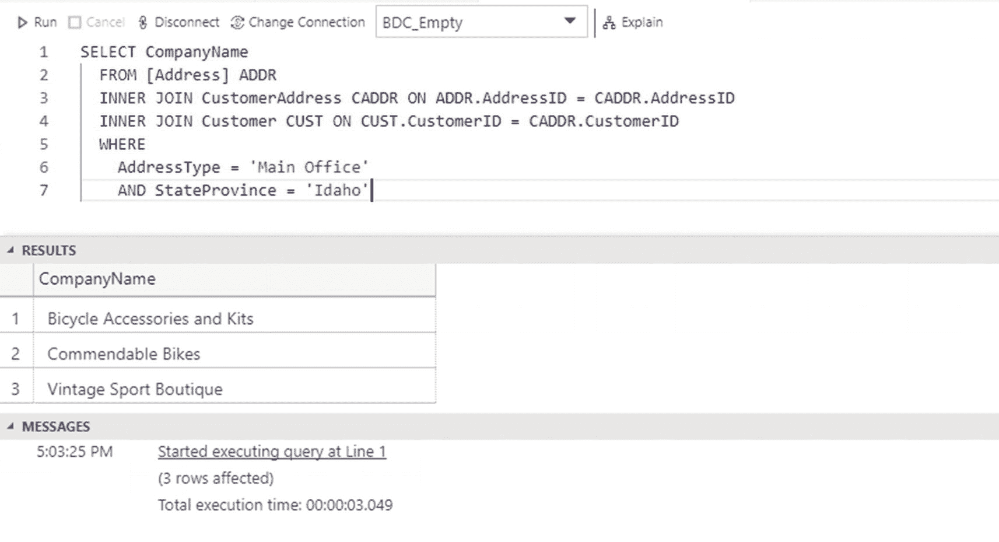

**图 5-12** 在 ADS 中连接 `SELECT` 语句的输出

只有当您点击右上角的 **Explain** 按钮时，您才会看到执行计划（**图 5-13**），它揭示了查询正在远程运行（`Remote Query` 和 `External Select` 操作符）的事实。

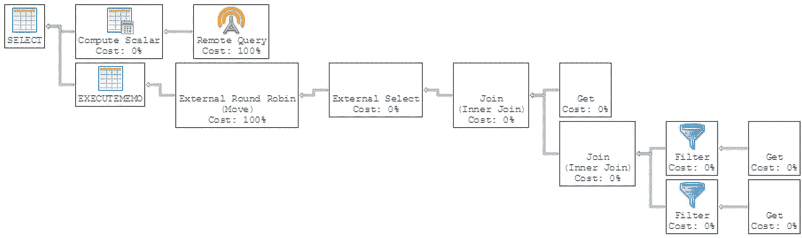

**图 5-13** 在 ADS 中针对两个外部表的执行计划


### 使用 Biml 自动化创建外部表

如你所见，这个向导有其局限性，但其底层的 T-SQL 相当直接明了。因此，它是自动化的绝佳候选对象，而自动化可以通过多种方式实现，其中之一便是使用商业智能标记语言 (`Biml`)。

如果你之前未曾接触过 `Biml`，互联网上有大量资源^(³,⁴,⁵)，《The Biml Book》^(⁶) 一书内部也提供了许多资料。如果你只想使用这个具体示例，你需要做的仅仅是：

*   获取免费的 `BimlExpress`^(⁷) 副本，这是一个完全集成于 Visual Studio 的免费 `Biml` 前端工具。
*   从本书网站获取下文提供的源代码。
*   按下文描述创建一个小型元数据存储库，并用你的元数据填充它。
*   调整解决方案中的连接字符串。
*   运行解决方案（只需在解决方案中右键单击 `11_Polybase_C.biml` 并选择 `Generate SSIS Package`）。尽管标题令人困惑，但这会将所有必需的 `.SQL` 文件写入到 `C:\Temp\Polybase` 目录。

如前所述，我们将使用一个小型元数据表来管理数据源。在此示例中，我们将再次让 `Biml` 指向我们在 Azure 中的 `AdventureWorksLT` 数据库——你可以随意在此处添加你自己的数据源进行尝试。

首先，创建一个名为 `Datasources` 的表（代码清单 5-3），例如，在你先前创建的数据库 `BDC_Empty` 中。显然，这个表可以按你希望的任何方式命名，可以放在你偏好的任何架构或数据库中——但为了简单起见，我们先保持这样。

```sql
CREATE TABLE [dbo].Datasources NULL,
    [Server] nvarchar NULL,
    [UserID] nvarchar NULL,
    [Password] nvarchar NULL,
    [SRC_DB] nvarchar NULL,
    [SRC_Schema] nvarchar NULL,
    [DEST_Schema] nvarchar NULL
) ON [PRIMARY]
```
*代码清单 5-3. 用于创建数据源元表的 T-SQL。*

同时，只需向此表添加一条记录，指向你的 `AWLT` 数据库（根据需要修改你的 DNS 名称、用户名和密码），使用代码清单 5-4 中的代码。

```sql
INSERT INTO Datasources VALUES
('AW','.database.windows.net','','','AdventureWorks','SalesLT','dbo')
```
*代码清单 5-4. 填充你的数据源元表。*

此解决方案要求主密钥已经设置好——这是一项一次性任务，完全没有必要或理由去自动化这一步。如果你在之前的练习中跳过了手动创建表的步骤，你可能需要在继续之前手动完成此步骤。

我们的解决方案包含两个 `Biml` 文件（实际上是四个——分别对应 C# 和 VB.NET 的两个文件）：

*   `11_Polybase_C.biml`
    这是控制文件，其中包含指向我们元数据以及目标数据库的连接字符串。它将遍历元数据，并为每一个条目调用另一个 `Biml` 文件（使用名为 `CallBimlScript()` 的函数），将一个 `.SQL` 文件写入到 `C:\temp\polybase`（因此，如果你的 `Datasources` 表中有十个条目，你最终会得到十个文件）。
*   `12_PolybaseWriter_C.biml`
    此文件将生成每个源架构的内容。

如果你查看第一个文件，你会注意到它以声明两个（在此情况下是相同的）连接字符串开始。一个指向存放你元数据的数据库；另一个指向你希望在其中创建或更新外部表的 PolyBase 数据库（代码清单 5-5）。

```biml
<Biml xmlns="http://schemas.varigence.com/biml.xsd">
    <Connections>
        <Connection Name="Metadata" ConnectionString="Data Source=.;Initial Catalog=BDC;Provider=SQLNCLI10.1;Integrated Security=SSPI;"/>
        <Connection Name="Target" ConnectionString="Data Source=.;Initial Catalog=BDC;Provider=SQLNCLI10.1;Integrated Security=SSPI;"/>
    </Connections>
    <Packages>
        <Package Name="11_Polybase_C" AutoCreateConnections="false" AutoCreateVariables="false">
            <Tasks>
                <ForEachLoop Name="Loop Through Metadata" CollectionName="Metadata.Objects[SELECT [DataSource],[Server],[UserID],[Password],[SRC_DB],[SRC_Schema],[DEST_Schema] FROM [dbo].[Datasources]]">
                    <Tasks>
                        <ExecuteCallBimlScript Name="Generate SQL File">
                            <BimlScript File="12_PolybaseWriter_C.biml" />
                            <InputBindings>
                                <Directory Path="C:\temp\polybase\" />
                            </InputBindings>
                            <OutputBindings>
                                <Directory Path="C:\temp\polybase\" />
                            </OutputBindings>
                        </ExecuteCallBimlScript>
                    </Tasks>
                </ForEachLoop>
            </Tasks>
        </Package>
    </Packages>
</Biml>
```
*代码清单 5-5. 用于遍历数据源元表的 Biml 代码。*

真正的魔法发生在第二个文件中。它将包含元数据的 `DataRow` 以及目标数据库的连接字符串作为其参数。然后它将生成 T-SQL 来：

1.  `CREATE`（创建）或 `ALTER`（修改）连接凭据
2.  `CREATE`（创建）或 `ALTER`（修改）外部数据源
3.  `DROP`（删除）目标数据库中每一个现有的外部表
4.  `CREATE`（创建）源架构中每一个表对应的外部表

对于前三步，它使用简单的 SQL 查询或半静态的 T-SQL。对于第四部分，它利用了 `Biml` 读取和解释数据库架构并将其存储在 `Biml` 对象模型中的能力（代码清单 5-6）。

```sql
-- Syncing schema <#=Target.Name#> in <#=Target.ConnectionString#>
-- This script assumes that a master key has been set

-- CREATE/ALTER CREDENTIAL
IF NOT EXISTS(select * from sys.database_credentials WHERE NAME = '<#=Row["DataSource"]#>')
BEGIN
    CREATE DATABASE SCOPED CREDENTIAL [<#=Row["DataSource"]#>]
    WITH IDENTITY = '<#=Row["UserID"]#>', SECRET = '<#=Row["Password"]#>';
END
ELSE
BEGIN
    ALTER DATABASE SCOPED CREDENTIAL [<#=Row["DataSource"]#>]
    WITH IDENTITY = '<#=Row["UserID"]#>', SECRET = '<#=Row["Password"]#>';
END
GO

-- CREATE DATASOURCE
IF NOT EXISTS(SELECT * FROM sys.external_data_sources WHERE NAME = '<#=Row["DataSource"]#>')
BEGIN
    CREATE EXTERNAL DATA SOURCE [<#=Row["DataSource"]#>]
    WITH (LOCATION = 'sqlserver://<#=Row["Server"]#>', CREDENTIAL = [<#=Row["DataSource"]#>]);
END
ELSE
BEGIN
    ALTER EXTERNAL DATA SOURCE [<#=Row["DataSource"]#>] SET LOCATION = N'sqlserver://<#=Row["Server"]#>', CREDENTIAL = [<#=Row["DataSource"]#>]
END
GO

-- DROP EXISTING TABLES
<#
foreach (AstTableNode tbl in RootNode.Tables.Where(t => t.Database.Name == Row["SRC_DB"].ToString() && t.Schema.Name == Row["SRC_Schema"].ToString())) {
    string targetTable = "[" + Row["DEST_Schema"].ToString() + "].[" + tbl.Name + "]";
#>
IF EXISTS(select * from sys.external_tables WHERE object_id = OBJECT_ID('<#=targetTable#>'))
BEGIN
    DROP EXTERNAL TABLE <#=targetTable#>
END
GO
<#
}
#>

-- CREATE TABLES
<#
foreach (AstTableNode tbl in RootNode.Tables.Where(t => t.Database.Name == Row["SRC_DB"].ToString() && t.Schema.Name == Row["SRC_Schema"].ToString())) {
    string targetTable = "[" + Row["DEST_Schema"].ToString() + "].[" + tbl.Name + "]";
#>
IF NOT EXISTS(SELECT * FROM sys.external_tables WHERE NAME = '<#=tbl.Name#>')
BEGIN
    CREATE EXTERNAL TABLE <#=targetTable#> (
    <#=String.Join("," + Environment.NewLine, tbl.Columns.Where(c => !c.IsComputed).Select(i => "    " + i.Name + " " + TSqlTypeTranslator.Translate(i.DataType, i.Length, i.Precision, i.Scale, i.CustomType) + (i.IsNullable ? " NULL" : " NOT NULL")))#>
    )
    WITH (LOCATION = '[<#=Row["SRC_Schema"]#>].<# =tbl.Name#>', DATA_SOURCE = [<#=Row["DataSource"]#>]);
END
GO
<#
}
#>
```
*代码清单 5-6. 被前一个 Biml 脚本调用的 Biml `12_PolybaseWriter_C.biml`。*

由于本书的重点是大数据集群，而非 `Biml`，因此我们不会深入探讨这个小助手的更多细节。主要目的是向你展示多种自动化处理外部表的方法之一。

顺便说一下，调整此代码以适用于其他关系型数据源（如 Teradata 或 Oracle）并自动化这些源上的外部表也会非常容易！


# 来自 HDFS 中 CSV 文件的外部表

正如您已经了解到的，除了其他关系型数据库外，您还可以使用 T-SQL 和 PolyBase 查询平面文件。由于分隔符等原因，平面文件没有一种“放之四海而皆准”的通用格式，因此我们至少需要定义一种格式。这个定义驻留在您的数据库中，因此同一个定义可以被多个文件共享，但您需要为希望该格式可用的每个数据库重新创建此定义。

让我们从 `sales` 数据库（包含在 Microsoft 示例中）的一个简单示例（清单 5-7）开始。

```sql
CREATE EXTERNAL FILE FORMAT csv_file
WITH (
FORMAT_TYPE = DELIMITEDTEXT,
FORMAT_OPTIONS(
FIELD_TERMINATOR = ',',
STRING_DELIMITER = '"',
FIRST_ROW = 2,
USE_TYPE_DEFAULT = TRUE)
);
```
**清单 5-7** 创建外部文件格式的 T-SQL 代码

此 T-SQL 代码将创建一个名为 `csv_file` 的格式；该文件将是一个以双引号作为文本限定符、逗号作为分隔符的分隔文本文件。第一行将被跳过。参数 `USE_TYPE_DEFAULT` 将决定如何处理缺失的字段。如果为 `false`，文件中缺失的字段将为 `NULL`；否则，数值型字段为 `0`，基于字符的列为空字符串，任何日期列为 `01/01/1900`。

在本例中，我们将使用 `StoragePool`，它是大数据集群内置的 HDFS 存储。要能够访问 `StoragePool`，您需要创建一个指向它的外部数据源，如清单 5-8 所示。

```sql
IF NOT EXISTS(SELECT * FROM sys.external_data_sources WHERE name = 'SqlStoragePool')
CREATE EXTERNAL DATA SOURCE SqlStoragePool
WITH (LOCATION = 'sqlhdfs://controller-svc/default');
```
**清单 5-8** 创建指向存储池指针的 T-SQL 代码

格式和数据源准备就绪后，我们现在可以创建一个引用此格式以及文件位置的外部表（清单 5-9）。

```sql
CREATE EXTERNAL TABLE [web_clickstreams_hdfs_csv]
("wcs_click_date_sk" BIGINT , "wcs_click_time_sk" BIGINT , "wcs_sales_sk" BIGINT , "wcs_item_sk" BIGINT , "wcs_web_page_sk" BIGINT , "wcs_user_sk" BIGINT)
WITH
(
DATA_SOURCE = SqlStoragePool,
LOCATION = '/clickstream_data',
FILE_FORMAT = csv_file
);
```
**清单 5-9** 基于 CSV 文件创建外部表的 T-SQL 代码

与基于 SQL Server 的外部表一样，第一步是定义列，包括其名称和数据类型。此外，我们需要提供一个 `DATA_SOURCE`，即我们的 `SqlStoragePool`，基本上就是我们大数据集群的 HDFS（之前我们也在此上传了航班延误样本）；该源内的一个 `LOCATION`（在本例中是 `clickstream_data` 子文件夹）；以及一个 `FILE_FORMAT`，即我们在上一步创建的 `csv_file` 格式。

同样，此时没有传输任何数据。我们所做的只是创建了对驻留在其他地方的数据的引用——在本例中是存储池内。

我们现在可以通过一个简单的查询实时查询此文件，如清单 5-10 所示。

```sql
SELECT * FROM [dbo].[web_clickstreams_hdfs_csv]
```
**清单 5-10** 针对基于 CSV 的外部表的 SELECT 语句

但是，我们也可以将来自 CSV 的数据与此数据库中常规表中的数据进行连接，如清单 5-11 所示。

```sql
SELECT
wcs_user_sk,
SUM( CASE WHEN i_category = 'Books' THEN 1 ELSE 0 END) AS book_category_clicks,
SUM( CASE WHEN i_category_id = 1 THEN 1 ELSE 0 END) AS [Home & Kitchen],
SUM( CASE WHEN i_category_id = 2 THEN 1 ELSE 0 END) AS [Music],
SUM( CASE WHEN i_category_id = 3 THEN 1 ELSE 0 END) AS [Books],
SUM( CASE WHEN i_category_id = 4 THEN 1 ELSE 0 END) AS [Clothing & Accessories],
SUM( CASE WHEN i_category_id = 5 THEN 1 ELSE 0 END) AS [Electronics],
SUM( CASE WHEN i_category_id = 6 THEN 1 ELSE 0 END) AS [Tools & Home Improvement],
SUM( CASE WHEN i_category_id = 7 THEN 1 ELSE 0 END) AS [Toys & Games],
SUM( CASE WHEN i_category_id = 8 THEN 1 ELSE 0 END) AS [Movies & TV],
SUM( CASE WHEN i_category_id = 9 THEN 1 ELSE 0 END) AS [Sports & Outdoors]
FROM [dbo].[web_clickstreams_hdfs_csv]
INNER JOIN item it ON (wcs_item_sk = i_item_sk
AND wcs_user_sk IS NOT NULL)
GROUP BY  wcs_user_sk;
```
**清单 5-11** 将常规表与基于 CSV 的外部表连接的 SELECT 语句

让我们看一下这个查询的执行计划（图 5-14）。

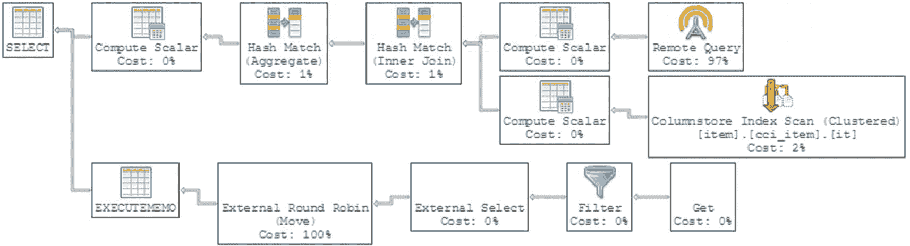
**图 5-14** ADS 中前一个 SELECT 语句的执行计划

如您所见，正如预期的那样，这是熟悉的操作（如聚集列存储索引扫描）与新功能（如最终合并在一起的外部选择）的组合。

当然，我们也可以连接来自多个 CSV 的数据。为此，我们首先为每个航班延误 CSV 文件创建一个外部表。为此，有另一个向导（图 5-15）。

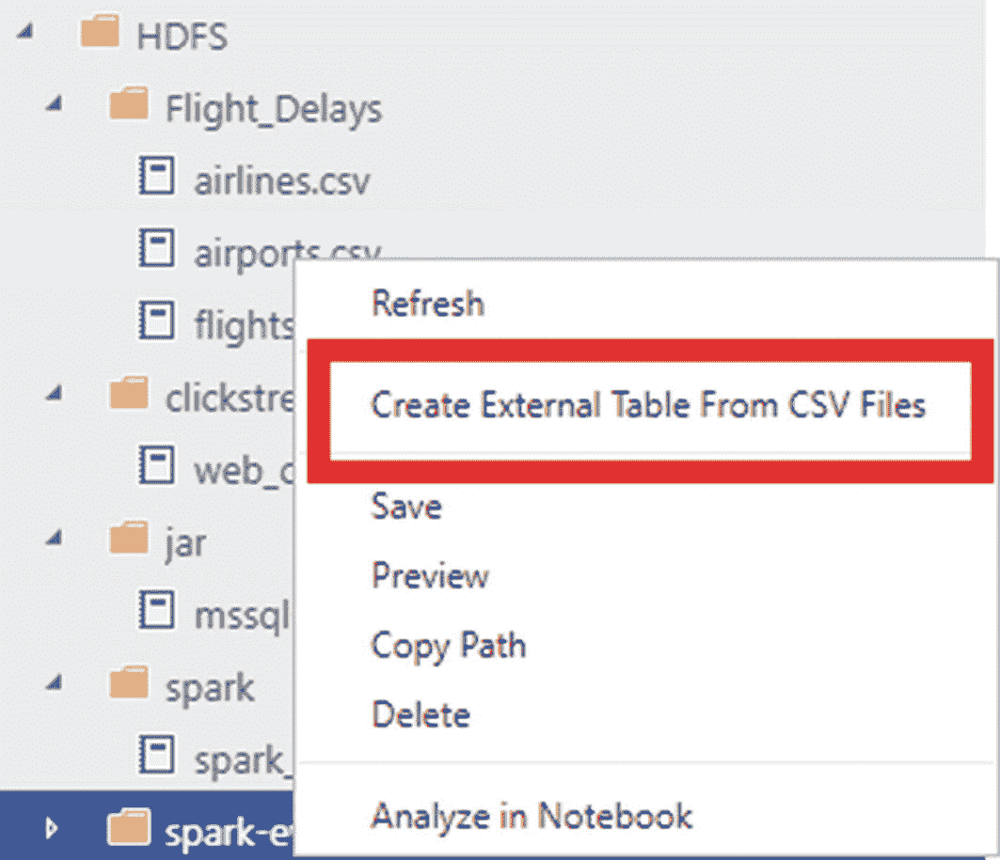
**图 5-15** ADS 中的“从 CSV 创建外部表”菜单

在 Azure Data Studio 中右键单击文件 `"airlines.csv"`，然后选择 `"Create External Table From CSV Files"`。

这将启动向导。

在第一个屏幕（图 5-16）中，它将要求您输入 SQL Server 主实例的连接详细信息，如果您当前已连接到该实例，也可以从活动连接下拉列表中选择。

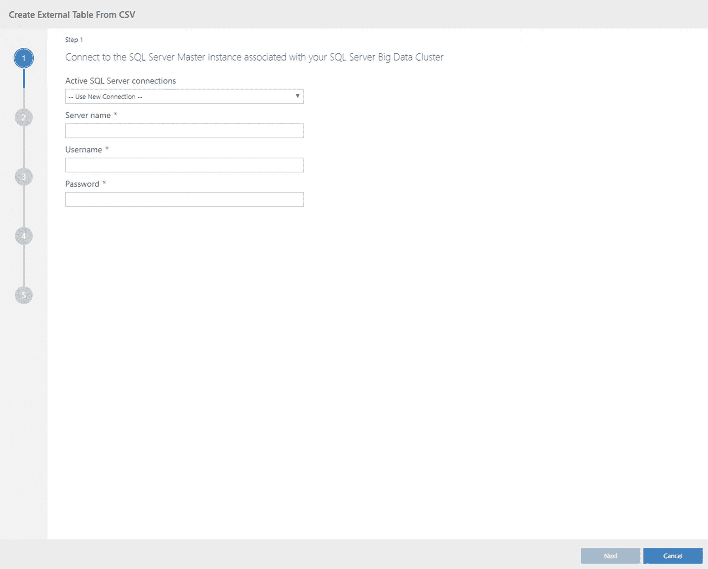
**图 5-16** ADS 中的创建外部表向导 (CSV) – 选择主实例

填写它们或选择您的连接，然后单击 `"Next"`。

在下一步（图 5-17）中，向导将建议目标数据库以及外部表的名称和架构。如果需要，所有三项都可以修改。

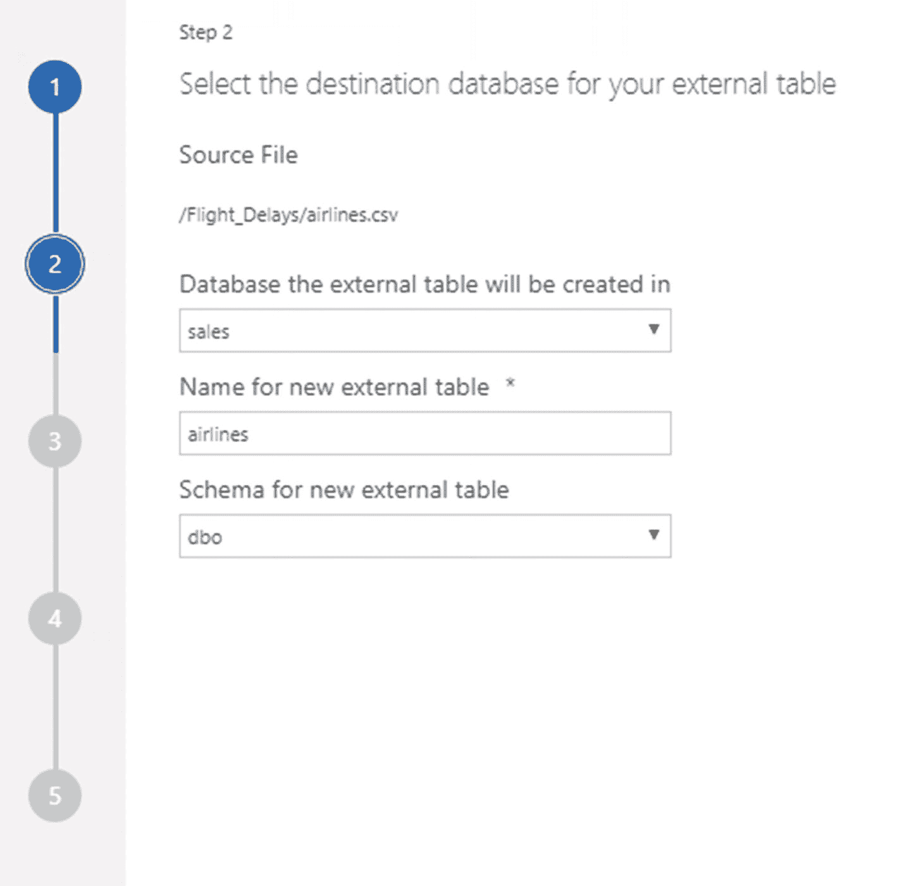
**图 5-17** ADS 中的创建外部表向导 (CSV) – 目标表详细信息

目前，只需点击 `"Next"` 确认。

下一个屏幕（图 5-18）为您提供了表中数据的预览（前 50 行），以便您了解文件所表示的内容。显然，对于较宽的文件，这并不是特别有用。

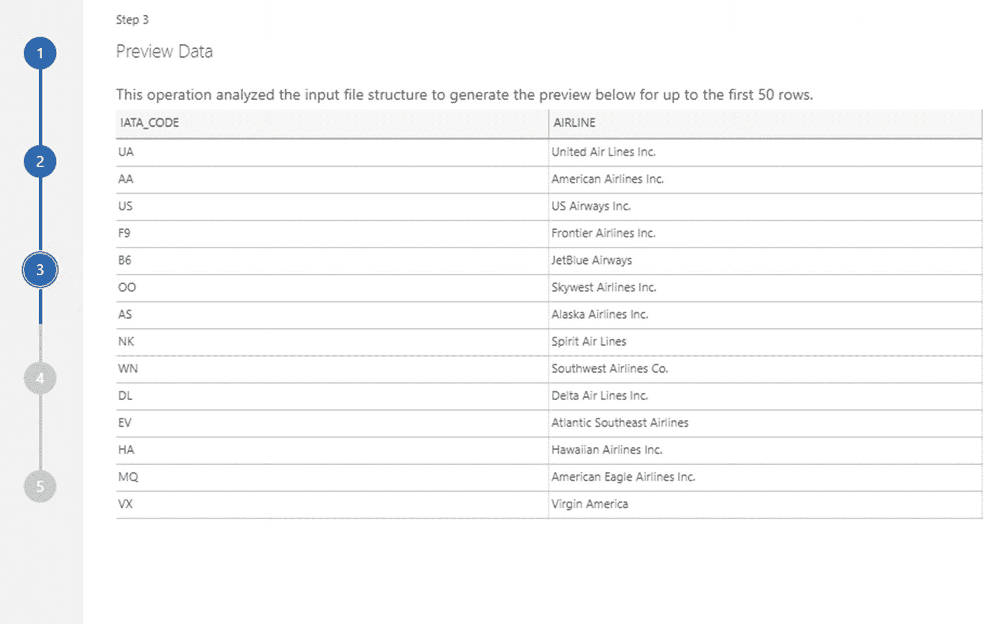
**图 5-18** ADS 中的创建外部表向导 (CSV) – 预览数据

此屏幕上实际上无法执行任何操作，因此只需再次单击 `"Next"`。

在第四步（图 5-19）中，向导会建议列名和数据类型。两者都可以覆盖。除非您有充分的理由，否则在许多情况下，实际上建议保持不变，因为目前的检测机制相当可靠。

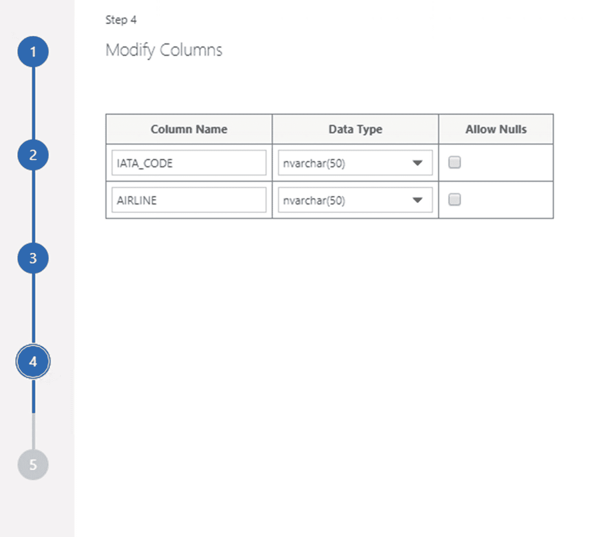
**图 5-19** ADS 中的创建外部表向导 (CSV) – 修改列

## 使用向导创建 CSV 外部表

点击“下一步”（`Next`）后，我们会看到一个如图 5-20 所示的摘要界面，这与 SQL Server 表向导之后的情况类似。

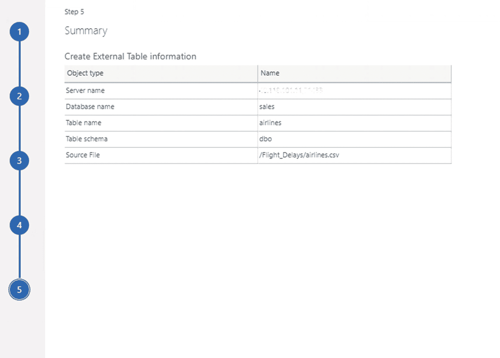

**图 5-20** ADS 中创建外部表向导（CSV）- 摘要

选择“生成脚本”（`Generate Script`）并点击“取消”（`Cancel`）。查看生成的脚本（清单 5-12）。

```sql
BEGIN TRY
BEGIN TRANSACTION Td436a09bbb9a472298de35f6f88d889
USE [sales];
CREATE EXTERNAL FILE FORMAT [FileFormat_dbo_airlines]
WITH (FORMAT_TYPE = DELIMITEDTEXT, FORMAT_OPTIONS (FIELD_TERMINATOR = ',', STRING_DELIMITER = '"', FIRST_ROW = 2));
CREATE EXTERNAL TABLE [dbo].[airlines]
(
[IATA_CODE] nvarchar(50) NOT NULL,
[AIRLINE] nvarchar(50) NOT NULL
)
WITH (LOCATION = '/Flight_Delays/airlines.csv', DATA_SOURCE = [SqlStoragePool], FILE_FORMAT = [FileFormat_dbo_airlines]);
COMMIT TRANSACTION Td436a09bbb9a472298de35f6f88d889
END TRY
BEGIN CATCH
IF @@TRANCOUNT > 0
ROLLBACK TRANSACTION Td436a09bbb9a472298de35f6f88d889
DECLARE @ErrorMessage NVARCHAR(4000) = ERROR_MESSAGE();
DECLARE @ErrorSeverity INT = ERROR_SEVERITY();
DECLARE @ErrorState INT = ERROR_STATE();
RAISERROR(@ErrorMessage, @ErrorSeverity, @ErrorState);
END CATCH;
```
**清单 5-12** ADS 中创建外部表向导（CSV）的 T-SQL 输出

如你所见，该向导不会复用相同的文件格式，而是为每个文件创建一个格式。这显然有利有弊。最大的好处是，你最终不会得到数百个格式。最大的缺点是你可能开始在不需要的地方构建文件之间的依赖关系。是否要修改脚本以使用之前创建的`csv_file`格式，或者仅为本次练习继续创建新格式，这取决于你。

对另外两个文件重复这些步骤。

然后，我们就可以像查询 SQL 表一样查询并连接它们（见清单 5-13），以获取取消次数最高的十个航空公司/目的地城市组合。

```sql
SELECT TOP 10 ap.CITY, al.AIRLINE, COUNT(*)
FROM flights fl
INNER JOIN airlines al
ON fl.AIRLINE = al.IATA_CODE
INNER JOIN airports ap
ON fl.DESTINATION_AIRPORT = ap.IATA_CODE
WHERE cancelled = 1
GROUP BY ap.CITY,
al.AIRLINE
ORDER BY COUNT(*) DESC;
```
**清单 5-13** 针对先前创建的外部表的`SELECT`语句

这将导致一个错误。

原因是该向导只查看你数据的前 50 行，所以如果你的数据在这些行中没有显示某种模式，它就不会被检测到。不过，错误信息（图 5-21）清楚地告诉了我们问题所在。

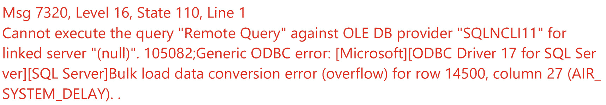

**图 5-21** 查询外部表时的错误信息

在第 14500 行（远超过前 50 行），`AIR_SYSTEM_DELAY`列发生了溢出。

如果我们查看该表的脚本（清单 5-14），会注意到此列被检测为`tinyint`。

```sql
CREATE EXTERNAL TABLE [dbo].[flights]
(
[YEAR] smallint NOT NULL,
[MONTH] tinyint NOT NULL,
[DAY] tinyint NOT NULL,
[DAY_OF_WEEK] tinyint NOT NULL,
[AIRLINE] nvarchar(50) NOT NULL,
[FLIGHT_NUMBER] smallint NOT NULL,
[TAIL_NUMBER] nvarchar(50),
[ORIGIN_AIRPORT] nvarchar(50) NOT NULL,
[DESTINATION_AIRPORT] nvarchar(50) NOT NULL,
[SCHEDULED_DEPARTURE] time NOT NULL,
[DEPARTURE_TIME] time,
[DEPARTURE_DELAY] smallint,
[TAXI_OUT] tinyint,
[WHEELS_OFF] time,
[SCHEDULED_TIME] smallint NOT NULL,
[ELAPSED_TIME] smallint,
[AIR_TIME] smallint,
[DISTANCE] smallint NOT NULL,
[WHEELS_ON] time,
[TAXI_IN] tinyint,
[SCHEDULED_ARRIVAL] time NOT NULL,
[ARRIVAL_TIME] time,
[ARRIVAL_DELAY] smallint,
[DIVERTED] bit NOT NULL,
[CANCELLED] bit NOT NULL,
[CANCELLATION_REASON] nvarchar(50),
[AIR_SYSTEM_DELAY] tinyint,
[SECURITY_DELAY] tinyint,
[AIRLINE_DELAY] smallint,
[LATE_AIRCRAFT_DELAY] smallint,
[WEATHER_DELAY] tinyint
)
WITH (LOCATION = N'/Flight_Delays/flights.csv', DATA_SOURCE = [SqlStoragePool], FILE_FORMAT = [FileFormat_flights]);
```
**清单 5-14** 外部表`flights`的原始`CREATE`语句

让我们将其改为`int`（或`bigint`），同时，一并修改其他延迟列（清单 5-15）。

```sql
CREATE EXTERNAL TABLE [dbo].[flights]
(
[YEAR] smallint NOT NULL,
[MONTH] tinyint NOT NULL,
[DAY] tinyint NOT NULL,
[DAY_OF_WEEK] tinyint NOT NULL,
[AIRLINE] nvarchar(50) NOT NULL,
[FLIGHT_NUMBER] smallint NOT NULL,
[TAIL_NUMBER] nvarchar(50),
[ORIGIN_AIRPORT] nvarchar(50) NOT NULL,
[DESTINATION_AIRPORT] nvarchar(50) NOT NULL,
[SCHEDULED_DEPARTURE] time NOT NULL,
[DEPARTURE_TIME] time,
[DEPARTURE_DELAY] smallint,
[TAXI_OUT] tinyint,
[WHEELS_OFF] time,
[SCHEDULED_TIME] smallint NOT NULL,
[ELAPSED_TIME] smallint,
[AIR_TIME] smallint,
[DISTANCE] smallint NOT NULL,
[WHEELS_ON] time,
[TAXI_IN] tinyint,
[SCHEDULED_ARRIVAL] time NOT NULL,
[ARRIVAL_TIME] time,
[ARRIVAL_DELAY] smallint,
[DIVERTED] bit NOT NULL,
[CANCELLED] bit NOT NULL,
[CANCELLATION_REASON] nvarchar(50),
[AIR_SYSTEM_DELAY] bigint,
[SECURITY_DELAY] bigint,
[AIRLINE_DELAY] bigint,
[LATE_AIRCRAFT_DELAY] bigint,
[WEATHER_DELAY] bigint
)
WITH (LOCATION = N'/Flight_Delays/flights.csv', DATA_SOURCE = [SqlStoragePool], FILE_FORMAT = [FileFormat_flights]);
```
**清单 5-15** 更新后的外部表`flights`的`CREATE`语句

注意，你需要先删除外部表（清单 5-16），然后才能重新创建它。

```sql
DROP EXTERNAL TABLE [dbo].[flights]
```
**清单 5-16** `DROP`语句

删除并重新创建表后，再次尝试运行取消查询。

错误消失了！太好了！

现在尝试从这些数据中获取另一种视图：只是前的十行（清单 5-17），包含来自所有三个表的匹配列。

```sql
SELECT TOP 10 *
FROM flights fl
INNER JOIN airlines al
ON fl.AIRLINE = al.IATA_CODE
INNER JOIN airports ap
ON fl.DESTINATION_AIRPORT = ap.IATA_CODE;
```
**清单 5-17** 针对这些外部表的另一个`SELECT`语句

不幸的是，这导致了一个新的错误（图 5-22）。

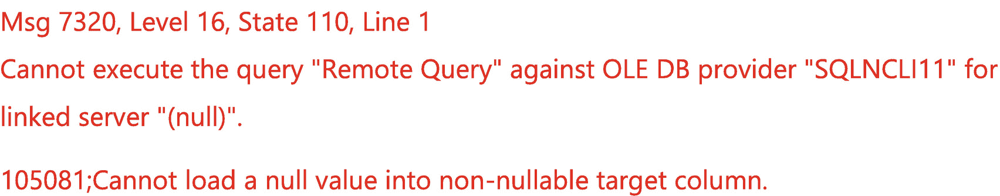

**图 5-22** 查询外部表时的不同错误信息

一个好的做法是将所有平面文件列设为可为空（`nullable`）。

因此，让我们再次重新创建我们的表（清单 5-18），这次不使用任何“`NOT NULL`”提示。

## 查询外部表与问题修复

# 访问 Azure Blob 存储中的数据

如果您将数据存储在 Azure Blob 存储中，除了可能的网络延迟外，无需将数据复制到您的 `SqlStoragePool` 中。您还可以通过将其定义为外部数据源来访问 Blob 存储（清单 5-20）。

```sql
CREATE EXTERNAL DATA SOURCE AzureStorage with (
TYPE = HADOOP,
LOCATION ='wasbs://@.blob.core.windows.net',
CREDENTIAL = AzureStorageCredential
);
```
清单 5-20
使用 Azure Blob 存储创建外部数据源

# 来自其他数据源的外部表

## 基于文件的数据源

其他基于文件的数据源变体包括 Parquet、Hive RCFile 和 Hive ORC；但是，如果您使用的是存储池，目前仅支持分隔符文件和 Parquet 文件。

由于这些是压缩文件类型，我们需要提供 `DATA_COMPRESSION`，对于 RCFile，还需要提供 `SERDE_METHOD`（清单 5-21）。

```sql
-- 为 PARQUET 文件创建外部文件格式。
CREATE EXTERNAL FILE FORMAT file_format_name
WITH (
FORMAT_TYPE = PARQUET
[ , DATA_COMPRESSION = {
'org.apache.hadoop.io.compress.SnappyCodec'
| 'org.apache.hadoop.io.compress.GzipCodec'      }
]);
--为 ORC 文件创建外部文件格式。
CREATE EXTERNAL FILE FORMAT file_format_name
WITH (
FORMAT_TYPE = ORC
[ , DATA_COMPRESSION = {
'org.apache.hadoop.io.compress.SnappyCodec'
| 'org.apache.hadoop.io.compress.DefaultCodec'      }
]);
--为 RCFILE 创建外部文件格式。
CREATE EXTERNAL FILE FORMAT file_format_name
WITH (
FORMAT_TYPE = RCFILE,
SERDE_METHOD = {
'org.apache.hadoop.hive.serde2.columnar.LazyBinaryColumnarSerDe'
| 'org.apache.hadoop.hive.serde2.columnar.ColumnarSerDe'
}
[ , DATA_COMPRESSION = 'org.apache.hadoop.io.compress.DefaultCodec' ]);
```
清单 5-21
其他外部表类型的 CREATE 语句示例

（摘自官方 Microsoft 文档，[`https://docs.microsoft.com/en-us/sql/t-sql/statements/create-external-file-format-transact-sql`](https://docs.microsoft.com/en-us/sql/t-sql/statements/create-external-file-format-transact-sql)）

## ODBC

当尝试通过通用 ODBC 连接到外部数据源时，您需要提供服务器（以及可选的端口），就像添加 SQL Server 一样，但此外，您还需要指定驱动程序（清单 5-22），以便 SQL Server 知道如何连接到该源。

```sql
CREATE EXTERNAL DATA SOURCE 
WITH (
LOCATION = odbc://[:],
CONNECTION_OPTIONS = 'Driver={};
ServerNode = :',
PUSHDOWN = ON,
CREDENTIAL = credential_name
);
```
清单 5-22
针对 ODBC 源创建外部数据源

`PUSHDOWN` 标志定义是否将计算下推到源，默认值为 `ON`。

## 其他

对于其他内置连接器，语法遵循通用模式（清单 5-23）。

```sql
CREATE EXTERNAL DATA SOURCE 
WITH (
LOCATION = ://[:],
CREDENTIAL = credential_name
);
```
清单 5-23
外部数据源的通用 CREATE 语句

其中，您将 `<vendor>` 替换为您尝试使用的内置连接器的供应商名称。

对于 Oracle，将如清单 5-24 所示。

```sql
CREATE EXTERNAL DATA SOURCE 
WITH (
LOCATION = oracle://[:],
CREDENTIAL = credential_name
```
清单 5-24
针对 Oracle 中的外部数据源的 CREATE 语句

相同的逻辑适用于 Teradata 和 MongoDB，我们期望所有未来的供应商都将以相同的方式实现。


### SqlDataPool

`SqlDataPool` 是用于处理大数据集群的数据池，它允许你将来自 SQL 表的数据分布到整个池中。

就像存储池一样，首先需要在你想要使用的每个数据库中创建一个相应的指针，如清单 5-25 所示。

```sql
IF NOT EXISTS(SELECT * FROM sys.external_data_sources WHERE name = 'SqlDataPool')
CREATE EXTERNAL DATA SOURCE SqlDataPool
WITH (LOCATION = 'sqldatapool://controller-svc/default');
-- 清单 5-25
-- 用于创建指向 SQL 数据池指针的 T-SQL 代码
```

我们将在销售数据库中再次执行此操作。

首先，我们再次创建一个外部表（清单 5-26）。请注意，与之前的示例不同，之前我们指定的是特定文件或位置，而在这里，我们只提供提示，表明此表应存储在 `SqlDataPool` 中并使用轮询（`ROUND_ROBIN`）方式进行分布。

```sql
CREATE EXTERNAL TABLE [web_clickstream_clicks_data_pool]
("wcs_user_sk" BIGINT , "i_category_id" BIGINT , "clicks" BIGINT)
WITH
(
DATA_SOURCE = SqlDataPool,
DISTRIBUTION = ROUND_ROBIN
);
-- 清单 5-26
-- 在 SqlDataPool 上为外部表创建的 CREATE 语句
```

你现在可以使用常规的 `INSERT INTO` 语句将数据插入此表，如清单 5-27 所示。

```sql
INSERT INTO web_clickstream_clicks_data_pool
SELECT wcs_user_sk, i_category_id, COUNT_BIG(*) as clicks
FROM sales.dbo.web_clickstreams_hdfs_parquet
INNER JOIN sales.dbo.item it ON (wcs_item_sk = i_item_sk
AND wcs_user_sk IS NOT NULL)
GROUP BY wcs_user_sk, i_category_id
-- 清单 5-27
-- 从 SQL 查询填充 SqlDataPool 中的表
```

与之前的所有示例一样，这个外部表现在可以像任何其他表一样进行查询和联接（清单 5-28）。

```sql
SELECT count(*) FROM [dbo].[web_clickstream_clicks_data_pool]
SELECT TOP 10 * FROM [dbo].[web_clickstream_clicks_data_pool]
SELECT TOP (100)
w.wcs_user_sk,
SUM( CASE WHEN i.i_category = 'Books' THEN 1 ELSE 0 END) AS book_category_clicks,
SUM( CASE WHEN w.i_category_id = 1 THEN 1 ELSE 0 END) AS [Home & Kitchen],
SUM( CASE WHEN w.i_category_id = 2 THEN 1 ELSE 0 END) AS [Music],
SUM( CASE WHEN w.i_category_id = 3 THEN 1 ELSE 0 END) AS [Books],
SUM( CASE WHEN w.i_category_id = 4 THEN 1 ELSE 0 END) AS [Clothing & Accessories],
SUM( CASE WHEN w.i_category_id = 5 THEN 1 ELSE 0 END) AS [Electronics],
SUM( CASE WHEN w.i_category_id = 6 THEN 1 ELSE 0 END) AS [Tools & Home Improvement],
SUM( CASE WHEN w.i_category_id = 7 THEN 1 ELSE 0 END) AS [Toys & Games],
SUM( CASE WHEN w.i_category_id = 8 THEN 1 ELSE 0 END) AS [Movies & TV],
SUM( CASE WHEN w.i_category_id = 9 THEN 1 ELSE 0 END) AS [Sports & Outdoors]
FROM [dbo].[web_clickstream_clicks_data_pool] as w
INNER JOIN (SELECT DISTINCT i_category_id, i_category FROM item) as i
ON i.i_category_id = w.i_category_id
GROUP BY w.wcs_user_sk;
-- 清单 5-28
-- 对 SqlDataPool 中的表执行 SELECT（独立查询及与其他表联接）
```

执行计划（图 5-23）与我们之前查询存储池时看到的情况类似。

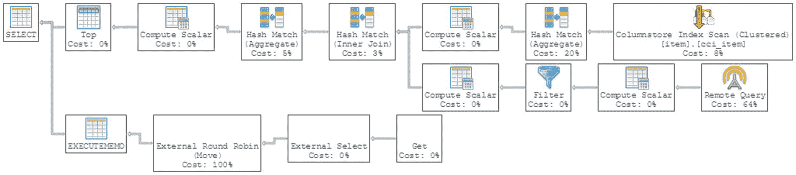

**图 5-23**

**在 ADS 中的执行计划**

请注意，与 `SqlStoragePool` 不同，位于数据池中的数据在 Azure Data Studio 的 HDFS 文件夹中不显示为文件，因为其数据存储在常规的 SQL 表中！

### SqlDataPool 上的索引

`SqlDataPool` 与其他外部数据源的一个主要区别在于它由常规的 SQL Server 表组成，这意味着你可以直接控制这些表上的索引。

默认情况下，`SqlDataPool` 中的每个表都会使用聚集列存储索引创建。由于扩展（scale out）以及数据池的主要使用场景是分析工作负载，这很可能开箱即用地满足许多查询需求。

如果你仍然想创建或更改索引，这需要在数据池内部进行，可以使用 `EXECUTE AT` 开关来实现，如清单 5-29 所示。

```sql
exec () AT Data_Source SqlDataPool
-- 清单 5-29
-- 带有 EXECUTE AT 的 EXEC
```

你可以使用它在数据池上运行任何类型的查询，它将为数据池中的每个节点返回一个结果网格。例如，要获取数据池中所有表的列表，运行清单 5-30。

```sql
exec ('SELECT * FROM sys.tables') AT Data_Source SqlDataPool
-- 清单 5-30
-- 获取数据池中的表列表
```

结果如图 5-24 所示。

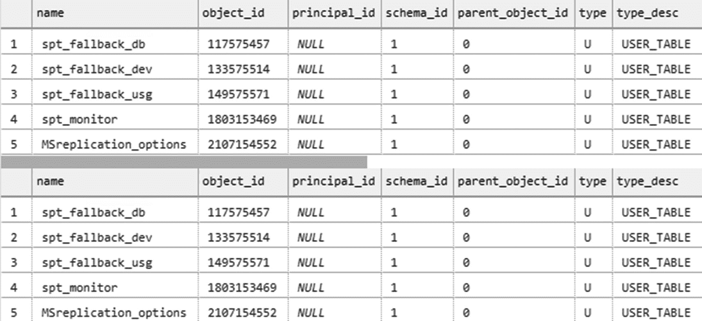

**图 5-24**

**数据池中表列表的结果**

你可能会感到有点惊讶，因为你可能期望不同的表。原因在于，就像你的主实例一样，数据池也会有多个数据库，因此上下文很重要。让我们通过切换当前数据库上下文再试一次，如清单 5-31 所示。这仅适用于在 `SqlDataPool` 中至少有一个表的数据库，因为数据库是在那时创建的。

```sql
exec ('USE sales; SELECT * FROM sys.tables') AT Data_Source SqlDataPool
-- 清单 5-31
-- 从销售数据库获取数据池中的表列表
```

这次的结果（见图 5-25）看起来更符合我们的预期。

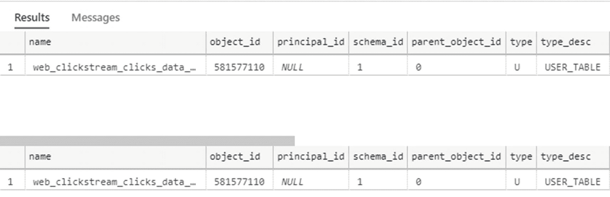

**图 5-25**

**从销售数据库查询数据池中表列表的结果**

要添加索引，你只需在 `EXEC` 语句中添加相应的 `CREATE INDEX` 语句，如清单 5-32 所示。

```sql
EXEC ('USE Sales; CREATE NONCLUSTERED INDEX [CI_wcs_user_sk] ON [dbo].[web_clickstream_clicks_data_pool] ([wcs_user_sk] ASC)') AT DATA_SOURCE SqlDataPool
-- 清单 5-32
-- 在数据池中创建索引
```

## 总结

在本章中，我们使用了先前加载的数据，并通过多种技术对其进行了查询，包括使用 T-SQL、从另一个 SQL Server 查询以及查询平面文件。我们还了解了如何自动化该方面的某些任务。

正如你之前所学的，T-SQL 并不是查询大数据集群的唯一方式：另一种方式是 Spark。第 6 章将引导你完成该过程！

脚注 1   2   3   4   5


# 第 6 章 在大数据集群中使用 Spark

到目前为止，我们一直在使用外部表和 T-SQL 代码查询 SQL Server 大数据集群中的数据。然而，我们还有另一种方法可用于查询存储在大数据集群 HDFS 文件系统中的数据。正如你在第[2]章中所读到的，大数据集群的架构中也包含了 Spark，这意味着我们可以利用 Spark 的强大功能来查询存储在大数据集群中的数据。

Spark 是分析和查询大数据集群内部数据的一个非常强大的选项，主要是因为 Spark 是作为一个分布式和并行框架构建的，这意味着它在处理超大规模数据集时速度非常快，当你需要处理大型数据集时，它比 SQL Server 高效得多。Spark 在支持的编程语言方面也提供了很大的灵活性，最突出的是 `Scala` 和 `PySpark`（尽管 Spark 也支持 `R` 和 `Java`）。

在大多数我们示例中使用的命令中，`PySpark` 和 `Scala` 的语法非常相似。不过，也有一些细微的差别。

代码清单 [6-1] 和 [6-2] 展示了如何使用 `PySpark` 和 `Scala` 将 CSV 文件读入数据帧（不用担心，我们很快会详细介绍数据帧）。

```scala
// 从 HDFS 导入 airports.csv 文件 (Scala)
val df_airports = spark.read.format("csv").option("header", "true").option("inferSchema", "true").load("/Flight_Delays/airports.csv")
清单 6-2
使用 Scala 从 HDFS 导入 CSV
```

```python
