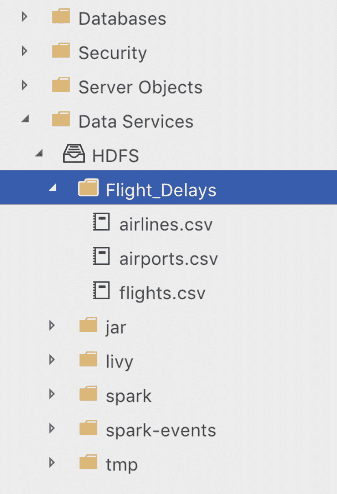
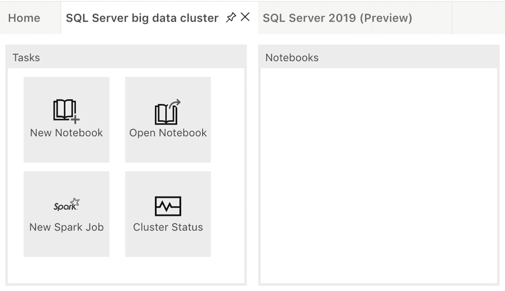
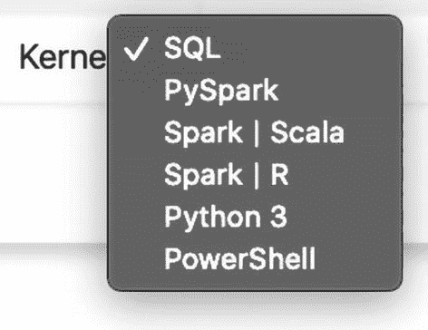

# 从 HDFS 导入 airports.csv 文件 (PySpark)
df_airports = spark.read.format('csv').options(header='true', inferSchema="true").load('/Flight_Delays/airports.csv')
清单 6-1
使用 PySpark 从 HDFS 导入 CSV
```

如你所见，`PySpark` 和 `Scala` 的示例代码看起来非常相似，但也存在一些小差异。例如，用于注释的字符，在 `PySpark` 中注释用 `#` 号标记，而在 `Scala` 中我们使用 `//`。另一个区别在于引号。在 `PySpark` 代码中，我们可以同时使用单引号和双引号，而 `Scala` 则更挑剔，只接受双引号。此外，在 `PySpark` 中我们不需要显式定义变量（在 `Scala` 中称为值），但在使用 `Scala` 时，我们需要明确指定这一点。

尽管本书的重点是大数据集群，但我们相信，介绍如何编写 `PySpark` 对于使用 SQL Server 大数据集群将非常有用，因为它为你提供了除了 SQL 之外，处理大数据集群内部数据的不同方法。

## 加载数据并创建 Spark 笔记本

如果你按照第[4]章的“将一些示例文件导入安装”部分的步骤操作，你应该已经将 Kaggle 的“2015 Flight Delays and Cancellations”数据集导入到了大数据集群的 HDFS 文件系统中。如果你还没有这样做，并且想跟随本节中的示例操作，我们建议你按照“将一些示例文件导入安装”部分概述的步骤进行操作，然后再继续。如果你正确导入了数据集，你应该能够通过 Azure Data Studio 在 HDFS 文件系统中看到“Flight_Delays”文件夹及其内部的三个 CSV 文件，如图 6-1 所示。


图 6-1
HDFS 存储中的航班延误文件

随着我们的示例数据集在 HDFS 上可用，让我们开始探索一下数据。

我们需要做的第一件事是通过 SQL 大数据集群选项卡中的“任务”窗口（图 6-2）中的“新建笔记本”选项创建一个新的笔记本。


图 6-2
Azure Data Studio 中的任务

创建新笔记本后，我们可以通过笔记本顶部的“内核”下拉框选择我们想要使用的语言，如图 6-3 所示。


图 6-3
ADS 笔记本中的内核选择

在本章的剩余部分，我们将使用 `PySpark` 作为所有示例的语言。如果你想跟随本章中的示例操作，我们建议选择“`PySpark`”语言。

笔记本已创建，语言也已配置好，现在让我们来看看航班延误的示例数据吧！


## 使用 Spark 数据框

现在我们有了数据，也有了一个 notebook，我们要做的是将 CSV 数据加载到一个数据框（data frame）中。可以将数据框想象为在 Spark 内部创建的一种类似表格的结构。从概念上讲，数据框等同于 SQL Server 中的表格，但与通常存储在单台计算机上的表格不同，数据框由分布在（潜在地）Spark 集群中所有节点上的数据组成。

将“airports.csv”文件中的数据加载到 Spark 数据框中的代码见清单 6-3。您可以将代码复制到 notebook 的一个单元格中。本章中展示的所有示例代码最好作为 notebook 中独立的单元格使用。包含所有代码的完整示例笔记本可在本书的 GitHub 页面上找到。

```python
