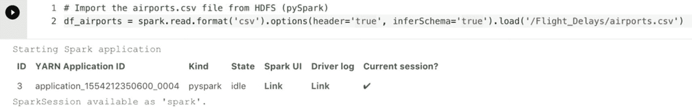

# 模式声明后，我们可以将其提供给 spark.read 函数
df_airports = spark.read.format('csv').options(header='true').schema(df_schema).load('/Flight_Delays/airports.csv')
```

**清单 6-4** 定义模式并提供给 `spark.read.format`

如果这是您对 Spark 集群执行的第一个 notebook 命令，您将收到一些关于创建 Spark 会话的信息，如图 6-4 所示。



**图 6-4** `spark.read.format` 的输出

Spark 会话（Spark session）是与 Spark 函数交互的入口点。过去，我们必须定义一个 Spark 上下文（Spark context）来连接到 Spark 集群，并且根据我们需要的功能，我们必须为该特定功能（如 Spark SQL 或流功能）创建单独的上下文。从 Spark 2.0 开始，Spark 会话作为入口点可用，它默认包含了过去我们必须为其创建单独上下文的所有各种功能，使使用它们变得更加容易。当我们在 notebook 中运行第一个针对 Spark 集群的命令时，需要创建一个 Spark 会话，以便我们能够向集群发送命令。运行后续命令将使用最初创建的 Spark 会话。

现在我们的 CSV 数据已经加载到数据框中，我们可以运行各种命令来获取有关数据框的信息。例如，清单 6-5 中的示例返回数据框中的行数。

```python
