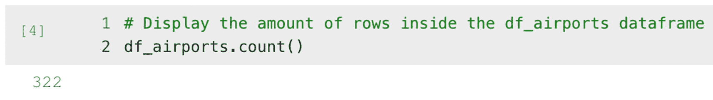

# 显示 df_airports 数据框中的行数
df_airports.count()
```

**清单 6-5** 检索数据框的行数

结果应该是 322 行，如图 6-5 所示，它返回了行数。



**图 6-5** 行数输出

另一个非常有用的命令是返回数据框的模式（schema）。这向我们展示了哪些列组成了数据框以及它们的数据类型。清单 6-6 中的代码获取 `df_airports` 数据框的模式并将其作为输出返回（图 6-6）。

```python
