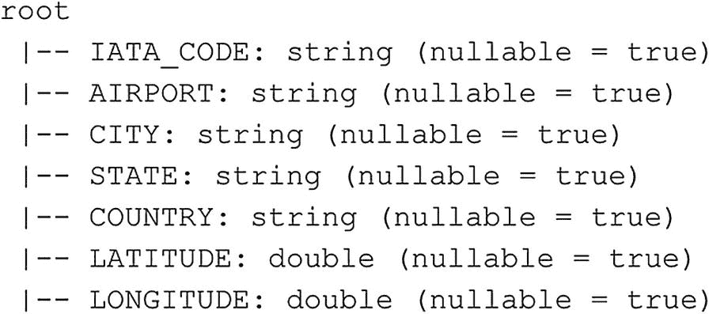

# 显示 df_flights 数据框的模式 (PySpark)
df_airports.printSchema()
```

**清单 6-6** 检索数据框的模式



**图 6-6** `df_airports` 数据框的模式输出

现在我们知道了数据框的模式，让我们从中返回一些数据。一种简单的方法是使用 `head()` 函数。此函数将从数据框中返回前 *n* 行。在以下示例中，我们将返回数据框的第一行。命令的输出显示在示例下方（清单 6-7 后面是图 6-7）。

```python
