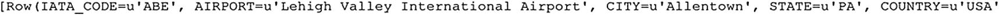

# 让我们返回第一行
df_airports.head(1)
```

**清单 6-7** 检索数据框的第一行



**图 6-7** `df_airports` 数据框的第一行

如图 6-7 所示，默认情况下结果不是以类似表格的结构返回的。这是因为 `head()` 仅以类似字符串的结构返回输出。

要从数据集中获取数据时以表格结构返回，您可以使用 `show()` 函数，如下面的示例所示。`show()` 接受一个整数作为参数，以指示应返回多少行。在示例中（清单 6-8），我们提供了一个值为 10，表示我们希望该函数返回前十行（图 6-8）。

```python
