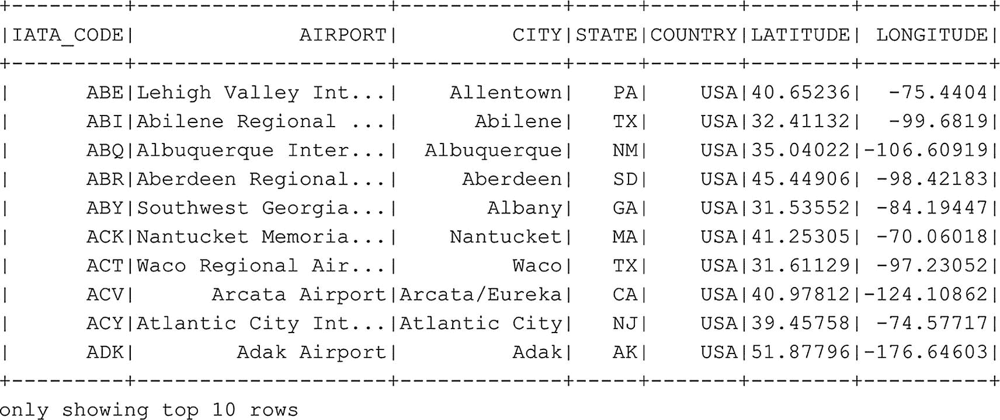
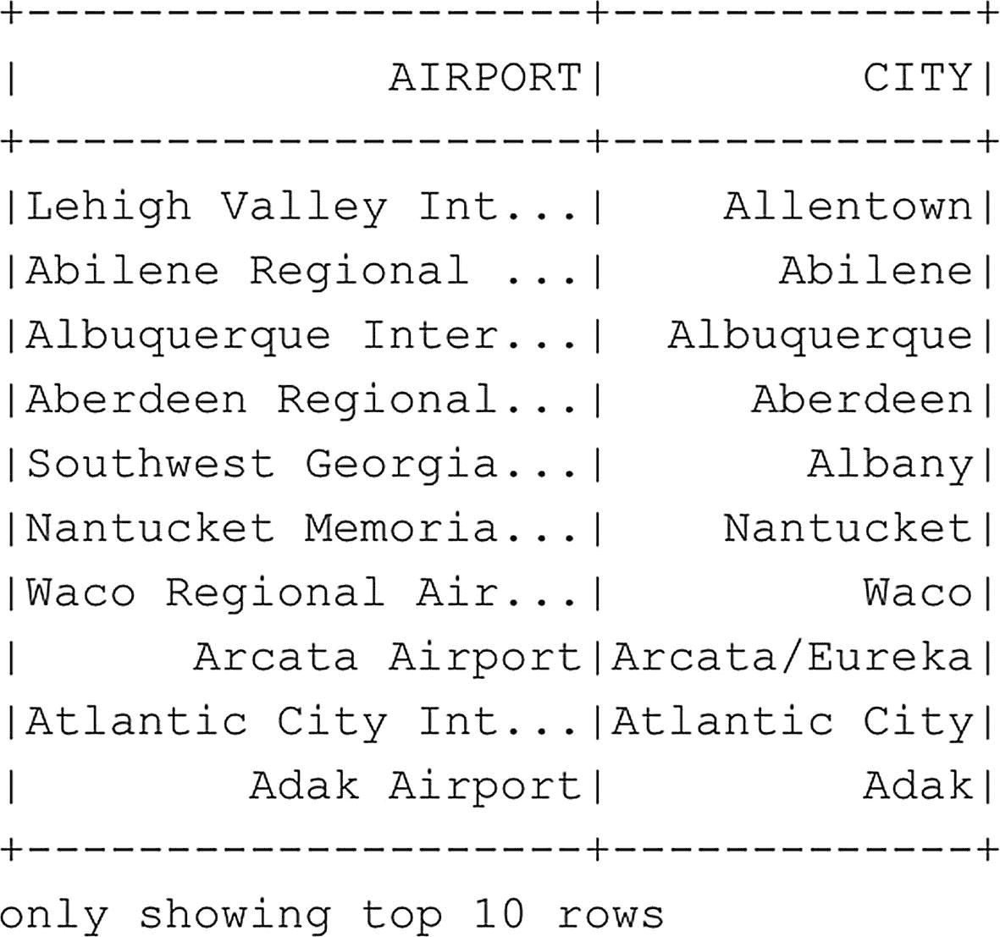

# 选择前十行，以表格结构返回
df_airports.show(10)
```

**清单 6-8** 以表格结构检索数据框的前十行



**图 6-8** 显示 `df_airports` 数据框的前十行


与返回整个数据框类似，我们也可以像在 SQL 中一样，根据我们感兴趣的列来选择数据的子集。以下示例（代码清单 `6-9`）仅返回 `df_airports` 数据框的 AIRPORT 和 CITY 列的前十行（图 `6-9`）。



图 6-9
`df_airports` 数据框的 AIRPORT 和 CITY 列的前十行

```
