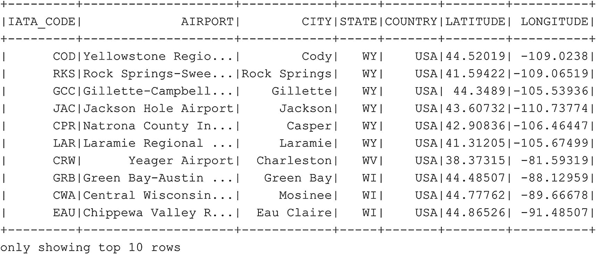

# 我们也可以从数据框中选择特定的列
df_airports.select('AIRPORT','CITY').show(10)
代码清单 6-9
选择数据框前十行的特定列
```

就像在 SQL 中一样，我们也能够根据一个或多个列对数据进行排序。在以下示例（代码清单 `6-10`）中，我们检索 `df_airports` 数据框的前十行，首先按 STATE 降序排序，然后按 CITY 降序排序（图 `6-10`）。



图 6-10
按 STATE 和 CITY 列排序的 `df_airports` 数据框

```
