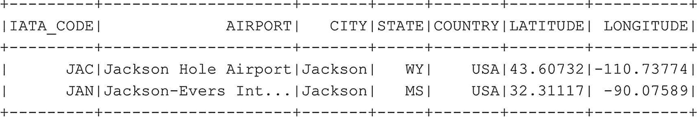

# 我们也可以在一个或多个列上进行排序
df_airports.orderBy(df_airports.STATE.desc(), df_airports.CITY.desc()).show(10)
代码清单 6-10
使用排序检索数据框的前十行
```

到目前为止，从数据框获取数据时，我们一直在选择前 *n* 行，但我们也可以根据特定的列值来过滤数据框。为此，我们可以添加 `filter` 函数并提供一个谓词。以下示例（代码清单 `6-11`）过滤数据框，并仅返回位于城市 Jackson 的机场信息（图 `6-11`）。



图 6-11
根据 CITY 列过滤后的 `df_airports`

```
