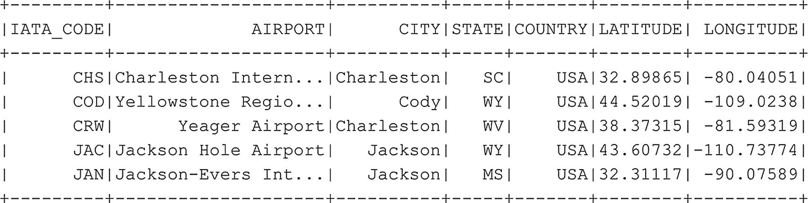

# 根据列值过滤结果
df_airports.filter(df_airports.CITY == 'Jackson').show()
代码清单 6-11
过滤数据框
```

除了过滤单个值，我们还可以提供一个要过滤的值列表，这与在 SQL 中使用 IN 子句的方式非常相似。代码清单 `6-12` 中显示的代码产生了图 `6-12`。



图 6-12
根据列表中存储的多个值进行过滤

```
