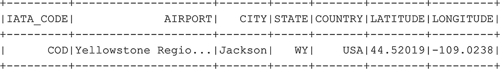

# 过滤数据框
df_airports.where(col("CITY").isin(city_list)).show()
代码清单 6-12
数据框的多重过滤
```

在图 `6–12` 的示例中，我们声明了一个要过滤的值列表，并使用 `isin` 函数将列表提供给 where 函数。

除了使用 `==` 运算符表示值应该相等之外，在过滤数据框时还有多个可用的运算符，你可能已经熟悉了，最常用的如表 `6-1` 所示。

表 6-1
PySpark 中的比较运算符

| 运算符 | 含义 |
| --- | --- |
| == | 等于 |
| != | 不等于 |
| < | 小于 |
| <= | 小于或等于 |
| > | 大于 |
| >= | 大于或等于 |

到目前为止，我们一直专注于从数据框中获取数据。然而，也可能存在你想要从数据框中删除一行，或者更新某个特定值的情况。一般来说，在 Spark 数据框中更新值并不像，例如，在 SQL 中写一条 UPDATE 语句那样直接，后者会直接更新实际表中的值。在大多数情况下，在数据框内部更新行涉及创建某种映射数据框，并将原始数据框与该映射数据框连接，然后将其存储为一个新的数据框。这样，你的最终数据框就包含了更新。

简单来说，你对要更新的数据执行选择（如图 `6-13` 所示），并返回要更新的行的更新值，然后将其保存到一个新的数据框中，如代码清单 `6-13` 的示例代码所示。



图 6-13
将值从 Jackson 更新为 Cody

```
