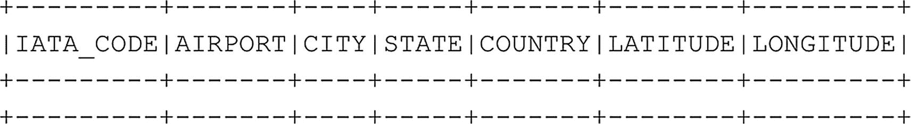

# 返回结果，过滤 IATA_CODE == "COD" 的行
df_airports_updated = df_airports_updated.filter(df_airports_updated.IATA_CODE == 'COD').show()
代码清单 6-13
在数据框上执行多个操作
```

如果我们有兴趣删除行，同样的推理也适用，我们不是从数据框中物理删除行；而是执行一个不包含要删除行的选择，并将其存储为一个单独的数据框（图 `6-14` 展示了使用代码清单 `6-14` 的结果）。



图 6-14
当 IATA_CODE == “COD” 时没有数据存在

```
