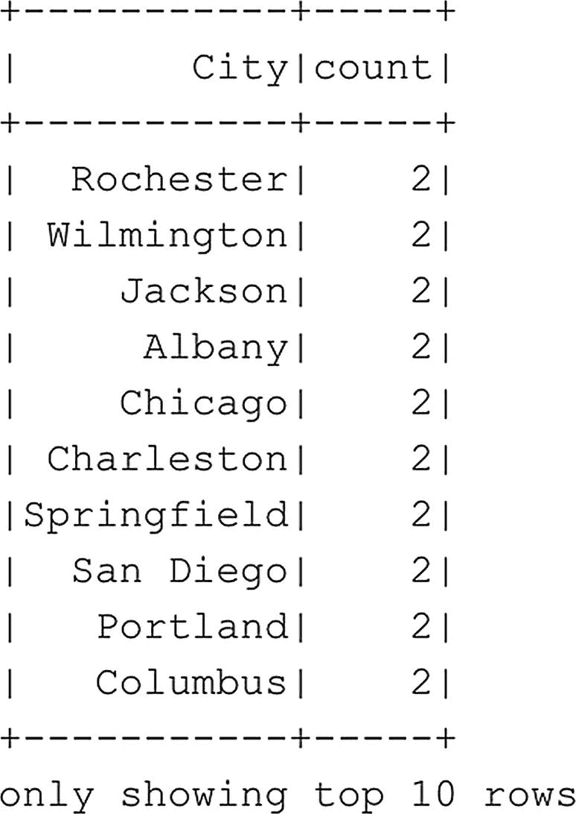

# 返回结果，过滤 IATA_CODE == "COD" 的行
df_airports_removed.filter(df_airports_removed.IATA_CODE == "COD").show()
代码清单 6-14
从数据框中移除一行
```

不删除或更新物理数据本身，而是通过选择来执行更新或删除操作（然后将它们存储在新数据框中）的概念在使用 Spark 中的数据框时非常重要，这与数据框只是 Spark 集群内存储数据的逻辑表示这一事实密切相关。数据框的行为更像是对存储在 Spark 集群中一个或多个文件内的数据的视图。虽然我们可以过滤和修改视图返回数据的方式，但我们无法通过视图本身来修改数据。

在继续介绍一些更高级的数据框处理示例之前，我们想展示的最后一个例子是数据分组。当你想要基于数据框列内的数据执行聚合或计算时，根据数据框中的列对数据进行分组非常有用。例如，在以下示例代码（代码清单 `6-15`）中，我们计算了 `df_airports` 数据框中每个不同城市拥有的机场数量（图 `6-15`）。



图 6-15
计算每个唯一城市的机场数量


```
