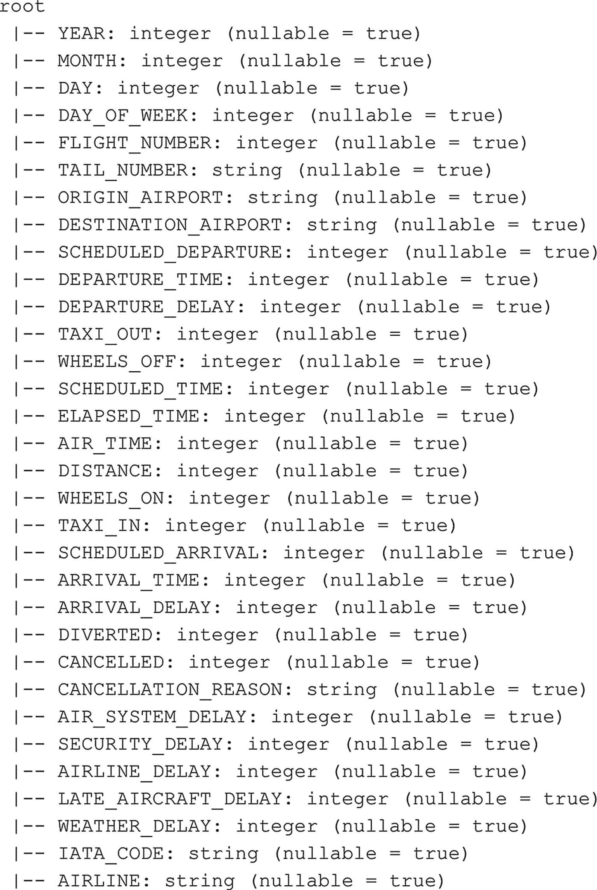

# 打印连接后数据框的模式
df_flightinfo.printSchema()
```
代码清单 6-18
连接两个数据框并获取结果的模式

如图 6-16 所示，组成 `df_airlines` 数据框的两个列（`IATA_CODE` 和 `AIRLINE`）被添加到了新的 `df_flightinfo` 数据框的右侧。由于我们在 `df_flights` 数据框中已经有了 `IATA_CODE`，我们最终在新数据框中有了重复的列（更有趣的是：在这个示例数据集中，`df_flights` 数据框使用列“AIRLINE”来表示我们连接 `df_airlines` 数据框所依据的 IATA 代码。`df_airlines` 数据框也有 `AIRLINE` 列，但它显示的是完整的航空公司名称。这实质上意味着 `df_flightinfo` 数据框中的两个 `AIRLINE` 列包含不同的数据）。

我们可以在连接两个数据框时轻松地删除重复列，通过在连接命令中指定它（代码清单 6-19 和图 6-17）。


图 6-17
删除重复 AIRLINE 列后的 df_flightinfo 模式

```
from pyspark.sql.functions import *
