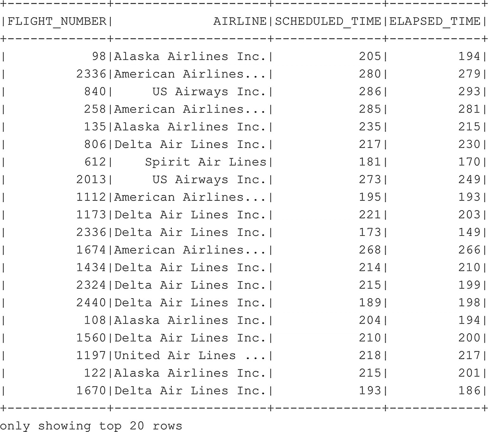

# 打印连接后数据框的模式
df_flightinfo.printSchema()
```
代码清单 6-19
连接两个数据框的同时删除一列

从图 6-17 所示的模式可以看出，我们现在只剩下一个 `AIRLINE` 列，其中包含我们想要的数据（完整的航空公司名称）。

删除重复列后，让我们从新的 `df_flightinfo` 数据框中选择一些信息。对于此示例，假设我们有兴趣查看每个航班的计划和实际已用旅行时间，以及执行该航班的航空公司。我们可以像本章前面已经做过多次的那样，简单地选择我们感兴趣的列。这次使用代码清单 6-20 所示的代码，会得到如图 6-18 所示的表格。


图 6-18
每个航班号的计划和已用飞行时间

```
