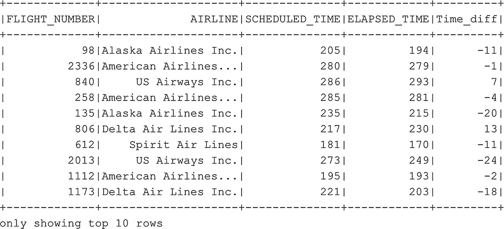

# 从连接后的数据框中选择若干列
df_flightinfo.select("FLIGHT_NUMBER", "AIRLINE", "SCHEDULED_TIME", "ELAPSED_TIME").show()
```
代码清单 6-20
从连接后的数据框中选择若干列

现在假设我们正在分析这些数据，因为我们对航班的计划时间和航班实际花费时间之间的差异感兴趣。虽然我们可以手动查看数据框中的每一行来弄清楚两个时间列之间的差异是什么，但让 Spark 为你执行这个计算要容易得多。对于此场景，我们使用以下代码（代码清单 6-21）创建一个新的数据框，该数据框选择原始 `df_flightinfo` 数据框列的子集，并在 `SCHEDULE_TIME` 和 `ELAPSED_TIME` 列之间进行简单的计算（图 6-19）。


图 6-19
显示旅行时间信息的 df_flightinfo_times 数据框


```python
