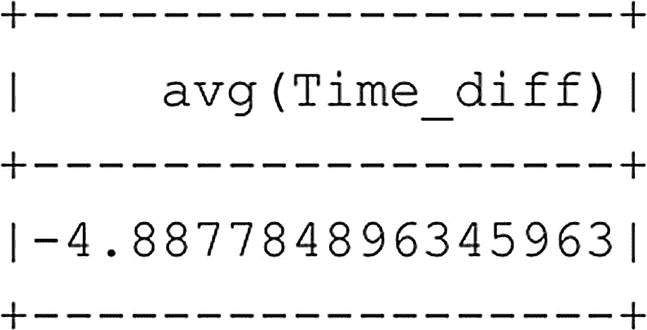
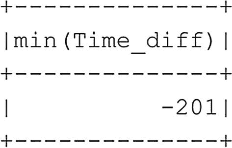
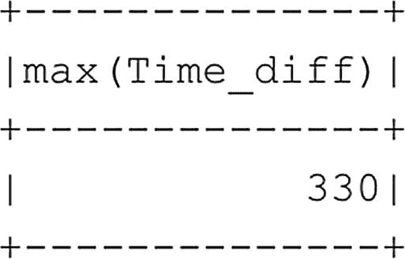

# 返回前十行
df_flightinfo_times.show(10)
代码清单 6-21
向数据框添加计算列
```

从图 6-19 中可以看出，我们所选的十行数据中的大多数航班，其实际飞行时间实际上比计划时间要短。

虽然查看单个航班的这类信息非常有用，但了解我们样本中所有航班的表现也会非常有趣。为了了解诸如平均值、最大值（代码清单 6-22 生成图 6-20）、或最小值（代码清单 6-23 生成图 6-21）等信息，我们可以调用 PySpark 中的一些函数来计算计划飞行时间与实际耗时之间的时间差（代码清单 6-24 生成图 6-22）。


**图 6-22** 计划时间与实际耗时之间的平均差值


**图 6-21** 计划时间与实际耗时之间的最小差值


**图 6-20** 计划时间与实际耗时之间的最大差值

```python
