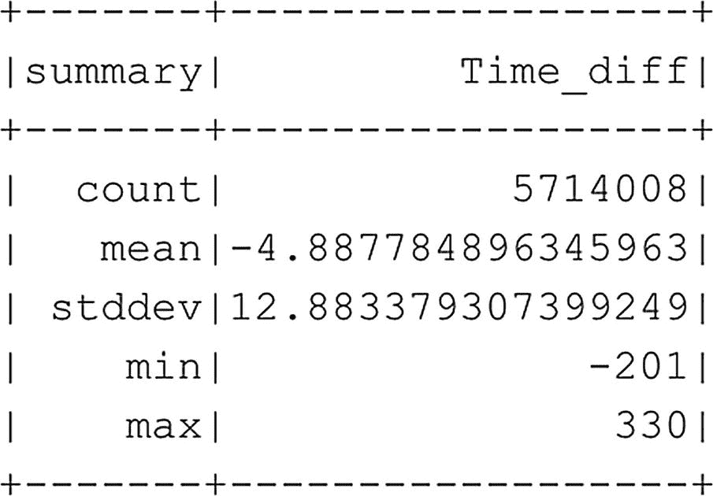

# 显示平均时间差值
df_flightinfo_times.select([mean("Time_diff")]).show()
代码清单 6-24
检索单个聚合值
```

虽然了解用于获取数据集多个汇总统计信息的独立命令无疑是有帮助的，但 Spark 还有一个单独的函数（代码清单 6-25），可以直接为你完成这项工作，并将多个结果合并为一个输出（图 6-23）。


**图 6-23** `df_flightinfo_times` 数据框中 `Time_diff` 列的汇总统计信息

```python
