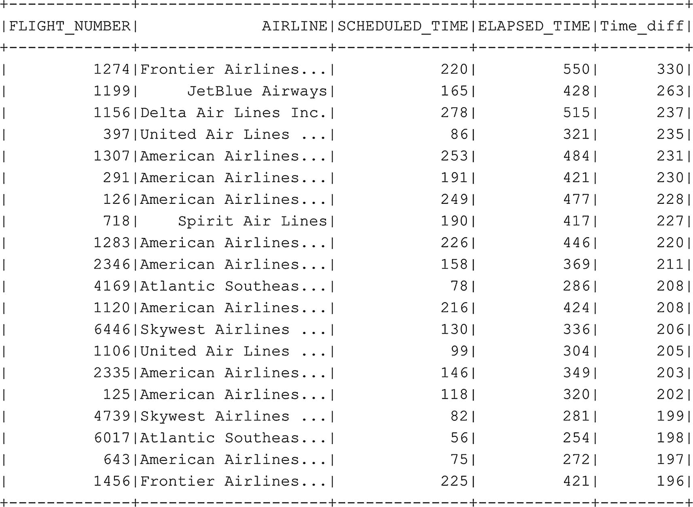

# 我们可以使用单个命令生成特定列的汇总统计信息
df_flightinfo_times.select("Time_diff").describe().show()
代码清单 6-25
从特定列生成汇总统计信息
```

从前面的汇总统计信息（图 6–23）中可以看出，平均而言，航班的实际飞行时间比原计划快了近 5 分钟。我们还可以看到数据中存在一些异常值；最快的航班比计划提前了 201 分钟到达，而有一个航班的实际飞行时间比计划长了 330 分钟。

或许通过查看延误超过 180 分钟的航班数据，我们可以对延误情况有更深入的了解。代码清单 6-26 的代码选择了其中的前 20 行，并根据延误时间降序排序，这意味着延误最严重的航班位于结果的顶部（图 6-24）。


**图 6-24** 延误最严重的前 20 个航班

```python
