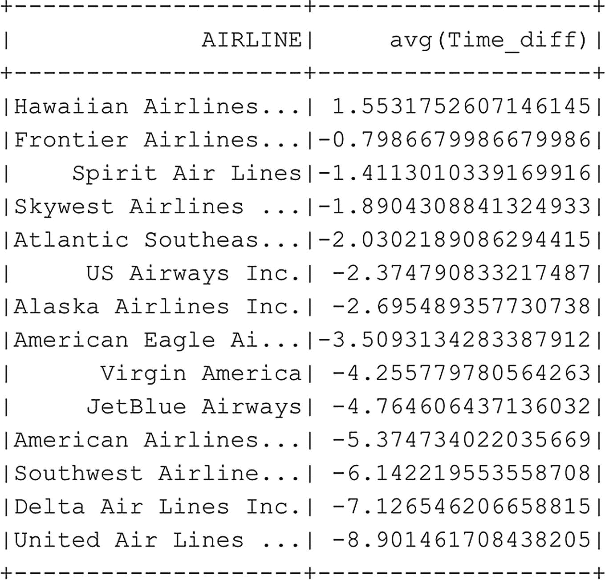

# 选择所有延误超过 60 分钟的航班
df_flightinfo_times.filter(df_flightinfo_times.Time_diff < -60).sort(desc("Time_diff")).show(20)
代码清单 6-26
基于单列进行选择和排序
```

从这些结果中我们可以看到，根据这个数据集，"美国航空公司"这个航空公司遇到了相当多的航班延误。但它们是否也是平均延误最严重的航空公司呢？要弄清楚这一点，一种方法是计算每家航空公司的平均时间差并返回结果。我们可以通过按航空公司对数据进行分组，并计算每个不同航空公司的平均延误来实现这一点。代码清单 6-27 的示例代码正是这样做的，它使用了 `groupby` 函数和一个聚合选项（写作 `agg`），来指定数据需要按哪个方法分组以及按哪一列计算（图 6-25）。


**图 6-25** 各航空公司所有航班的计划时间与实际耗时之间的平均差值

```python
