# 按航空公司对 Time_diff 数据进行分组，并返回计划时间与实际耗时之间的平均差值
df_flightinfo_times.groupby("AIRLINE").agg({"Time_diff": "mean"}).sort(desc("avg(Time_diff)")).show()
代码清单 6-27
按另一列分组聚合一列
```

当你想跨整个数据框计算值并按特定函数进行分组时，`groupby` 函数非常有用。除了我们通过 `agg` 参数提供的 `mean` 选项外，我们还可以使用其他计算方法，例如 `sum` 来计算每个分组列的总和，或者 `count` 来计算每个列值的出现次数（图 6-26）。

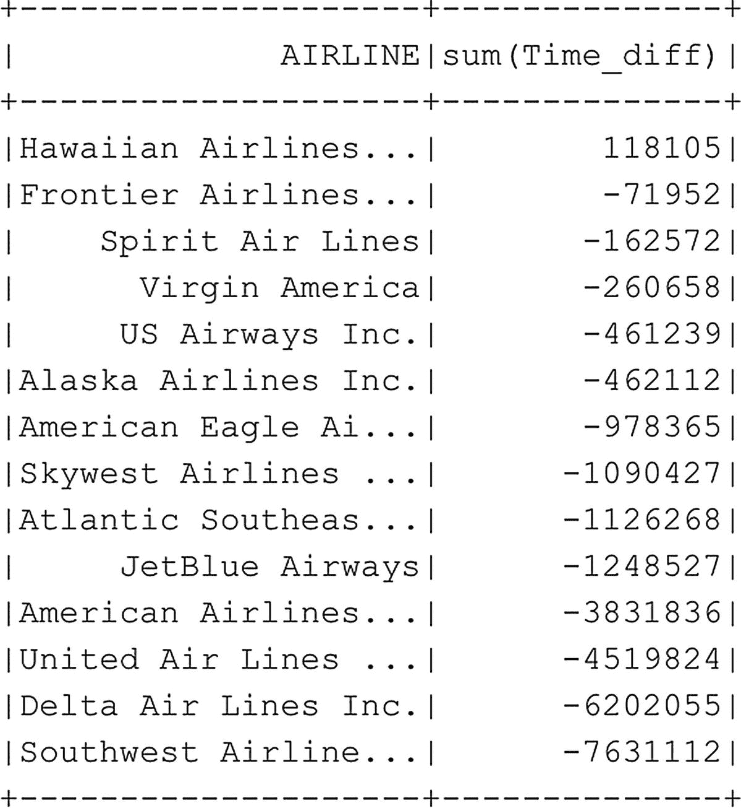
**图 6-26** 各航空公司所有航班的计划时间与实际耗时之间的总差值

另一件值得指出的事情是，我们如何将 `groupby` 函数返回的列传递给 `sort` 函数。每当一个计算列被添加到数据框中时，它也会变得可用于选择和排序，你可以将该列名传递给这些函数。

如果我们继续进行航班延误调查，从分组的平均值和总值结果中可以看出，美国航空公司（American Airlines）在延误方面的表现并不像我们最初预期的那样糟糕。事实上，平均而言，它们的航班比计划提前了 5 分钟到达！

我们将在第 7 章回到这个数据集，对其进行进一步探索，甚至对航班延误做出一些预测。
```


## 在 Spark 数据帧上使用 SQL 查询

到目前为止，在本章中我们已经使用了与数据帧处理相关的函数来执行操作，例如选择特定列、排序和分组数据。我们在数据帧内部处理数据的另一个选项是直接在 Spark 中通过 SQL 查询来访问它。对于熟悉编写 SQL 代码的人来说，这种方法可能比学习所有之前介绍的新函数（以及我们尚未涉及的更多函数）要简单得多。

在我们可以针对数据帧编写 SQL 查询之前，必须先将其注册为一个表结构，这可以通过清单 6-28 中的代码完成。

```python
# 将 df_flightinfo 数据帧注册为（临时）表，以便我们可以对其运行 SQL 查询
df_flightinfo.registerTempTable("FlightInfoTable")
```

*清单 6-28 注册一个临时表*

既然我们已经将数据帧注册为（临时）表，就可以使用 `sqlContext` 命令（清单 6-29）针对它运行 SQL 查询了，该命令会调用 Spark 引擎中包含的 Spark SQL 模块（图 6-27）。

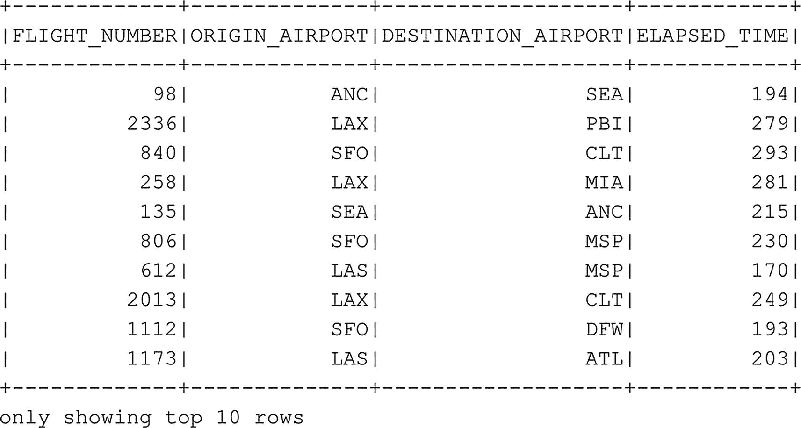

*图 6-27 使用 Spark SQL 查询的 FlightInfoTable 前十行*

```python
# 从 FlightInfoTable 中选择前十个选定列的数据行
sqlContext.sql("SELECT FLIGHT_NUMBER, ORIGIN_AIRPORT, DESTINATION_AIRPORT, ELAPSED_TIME FROM FlightInfoTable").show(10)
```

*清单 6-29 使用 SQL 选择表的前十行*

正如你在前面的示例中所见，我们执行了一个简单的 SELECT SQL 查询，指定了想要返回的若干列。Spark SQL 模块处理 SQL 查询，并针对我们之前创建的表结构执行它。就像我们之前展示的示例一样，我们仍然需要提供 `.show()` 函数以表格形式返回结果。

几乎所有你使用 SQL 代码能做的事情，在 Spark 中同样可以应用。例如，上一节中的最后一个示例（清单 6-30）展示了如何对数据进行分组并计算平均值。我们可以使用 SQL 查询进行相同的处理，如图 6-28 中的示例所示。

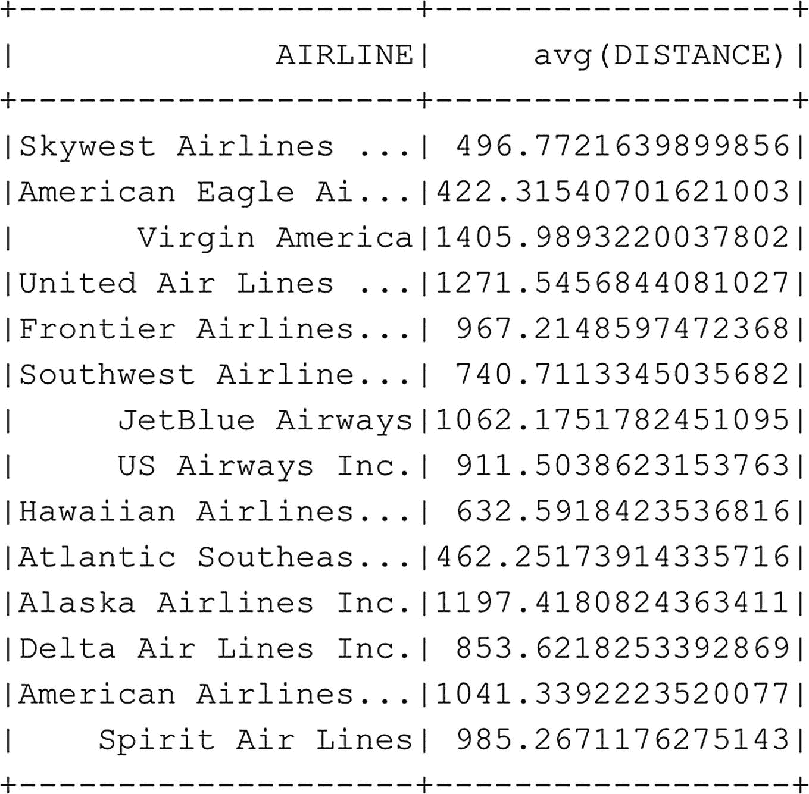

*图 6-28 按每家航空公司分组的平均飞行距离*

```python
# 按每家航空公司分组飞行距离，并返回每家航空公司的平均飞行距离
sqlContext.sql("SELECT AIRLINE, AVG(DISTANCE) FROM FlightInfoTable GROUP BY AIRLINE ORDER BY 'avg(Distance)' DESC").show()
```

*清单 6-30 使用 SQL 按另一列分组对列进行聚合*

## 从 SQL Server 主实例读取数据

SQL Server 大数据集群的一个巨大优势是，我们可以访问存储在 SQL Server 实例和 HDFS 中的数据。到目前为止，我们主要处理的是存储在 HDFS 文件系统上的数据集，通过 Spark 直接访问它们，或者在 SQL Server 内部使用 PolyBase 创建外部表。然而，我们也可以直接从 Spark 访问存储在大数据集群内 SQL Server 数据库中的数据。这在数据一部分存储在 SQL Server 中、另一部分存储在 HDFS 上，并且希望将两者结合起来的情况下非常有用。或者，也许你希望利用 Spark 的分布式处理能力，从性能角度处理你的 SQL 表数据。

获取存储在你大数据集群的 SQL Server 主实例中的数据相对简单，因为我们可以使用 Spark 原生支持的 SQL Server JDBC 驱动程序进行连接。我们可以使用 `master-0.master-svc` 服务器名称来指示我们要连接到 SQL Server 主实例（清单 6-31）。

```python
# 连接到大数据集群内的 SQL Server 主实例
# 并将表中的数据读入数据帧
df_sqldb_sales = spark.read.format("jdbc") \
.option("url", "jdbc:sqlserver://master-0.master-svc;databaseName=AdventureWorks2014") \
.option("dbtable", "Sales.SalesOrderDetail") \
.option("user", "sa") \
.option("password", "[your SA password]").load()
```

*清单 6-31 针对主实例执行 SQL 查询*

前面的代码建立了与我们的 SQL Server 主实例的连接，并连接到了我们在本书前面创建的 `AdventureWorks2014` 数据库。使用 “dbtable” 选项，我们可以直接将 SQL 表映射到使用前面代码将要创建的数据帧。

执行代码后，我们就有了 SQL 表数据的副本，它存储在我们 Spark 集群内的一个数据帧中，我们可以像之前展示的那样访问它（清单 6-31 导致图 6-30）。

要仅检索前十行，请运行清单 6-32。这将产生图 6-29 的结果。

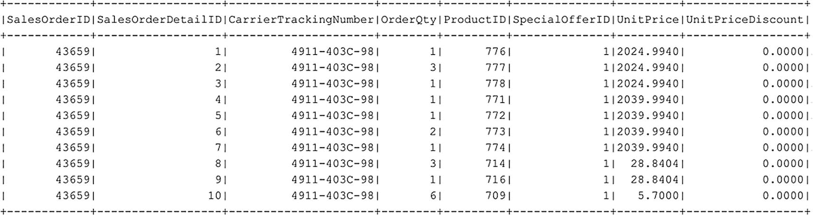

*图 6-29 从 SQL Server 主实例中的表创建的数据帧*

```python
df_sqldb_sales.show(10)
```

*清单 6-32 检索前十行*

关于这个过程需要指出的一个有趣之处是，Spark 会自动将每列的数据类型设置为与 SQL Server 数据库中配置的类型相同（在数据类型命名上有一些例外，SQL 中的 `datetime` 在 Spark 中是 `timestamp`，以及 Spark 不直接支持的数据类型，如 `uniqueidentifier`），你可以在图 6-30 所示的数据帧模式中看到这一点。

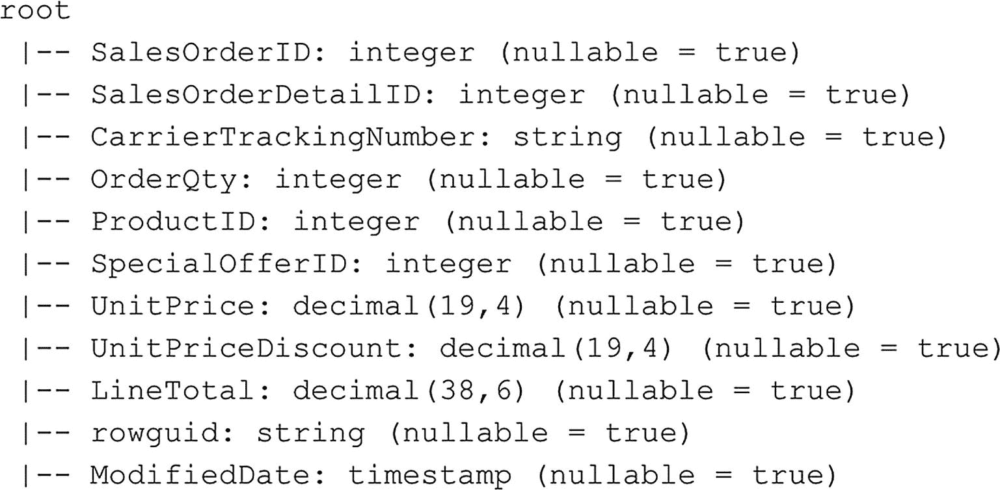

*图 6-30 我们从 SQL Server 主实例导入的数据帧的模式*

除了从 SQL 表创建数据帧之外，我们还可以提供查询来仅选择我们关心的列，或者执行一些其他的 SQL 函数，比如对数据进行分组。清单 6-33 中的示例展示了如何使用 SQL 查询加载数据帧（图 6-31）。

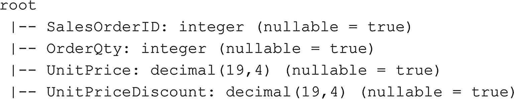

*图 6-31 df_sqldb_query 数据帧的模式*

```python
# 虽然我们可以将表映射到数据帧，但也可以执行 SQL 查询
df_sqldb_query = spark.read.format("jdbc") \
.option("url", "jdbc:sqlserver://master-0.master-svc;databaseName=AdventureWorks2014") \
.option("query", "SELECT SalesOrderID, OrderQty, UnitPrice, UnitPriceDiscount FROM Sales.SalesOrderDetail") \
.option("user", "sa") \
.option("password", "[your SA password]").load()
df_sqldb_query.printSchema()
```

*清单 6-33 使用 SQL 查询代替映射表来创建数据帧*


## 绘制图表

到目前为止，我们主要处理的是在 PySpark notebook 中执行代码时以文本类格式返回的结果。然而，在执行诸如数据探索等任务时，以更图形化的方式查看数据往往要有用得多。例如，绘制数据框的直方图可以提供关于数据分布的丰富信息，而散点图可以帮助你直观地理解不同列之间如何相互关联。

幸运的是，我们可以轻松地通过 Azure Data Studio 安装和管理软件包，这些包能帮助我们绘制存储在 Spark 集群内部数据的图表，并将这些图表显示在 notebook 中。这并不是说绘制存储在数据框中的数据的图表是件容易的事。事实上，在我们开始绘制数据之前，有许多事情需要考虑。

首先，也是最重要的一点，数据框是我们数据的逻辑表示。实际的物理数据本身分布在构成 Spark 集群的工作节点上。这意味着，如果我们想通过数据框绘制数据，事情会很快变得复杂，因为我们需要将来自各个节点的数据组合成一个单一的数据集，才能在其上创建图表。这不仅会导致非常糟糕的性能，因为我们基本上移除了数据的分布式特性，而且还可能因为需要将所有数据装入单个节点的内存中而导致错误。虽然这些问题在小数据集上可能不会出现，但数据集越大，你遇到这些问题的速度就越快。

为了解决这些问题，我们通常采用不同的数据分析方法。例如，我们不是分析整个数据集，而是从数据集中抽取一个样本——它能代表整个数据集——并在这个较小的样本数据集上绘制图表。另一种方法可以是只过滤出你需要的数据，也许预先对其进行一些计算，然后将其另存为一个独立、较小的数据集，再进行绘制。

无论你选择哪种方法来创建用于图形探索的较小数据集，我们都必须做的一件事是，将数据集传输到我们提交代码的主要 Spark 主节点上。Spark 主节点需要能够将数据集加载到内存中，这意味着主节点需要有足够的物理内存来加载数据集，而不会因内存不足而崩溃。实现这一点的一种方法是将我们的 Spark 数据框转换为 Pandas 数据框。Pandas 是 `pan`el `da`ta 的缩写，在统计学界是一个用于描述多维数据集的术语。Pandas 是一个为数据分析和操作而编写的 Python 库，如果你曾在 Python 中处理过数据，那你肯定使用过它。Pandas 还通过 `matplotlib` 库引入了一些绘图功能。虽然 Pandas 默认包含在大数据集群的库中，但 `matplotlib` 并不包含。不过，通过使用连接到你的大数据集群的 notebook 中的“管理包”选项，安装 `matplotlib` 包是非常直接和容易实现的（图 6-32）。

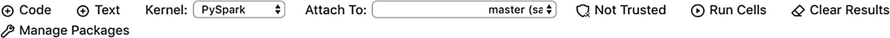

图 6-32

Notebook 标题栏中的“管理包”选项

点击“管理包”按钮后，我们可以看到已安装的软件包，并可以通过“新建”选项卡来安装额外的包（图 6-33）。

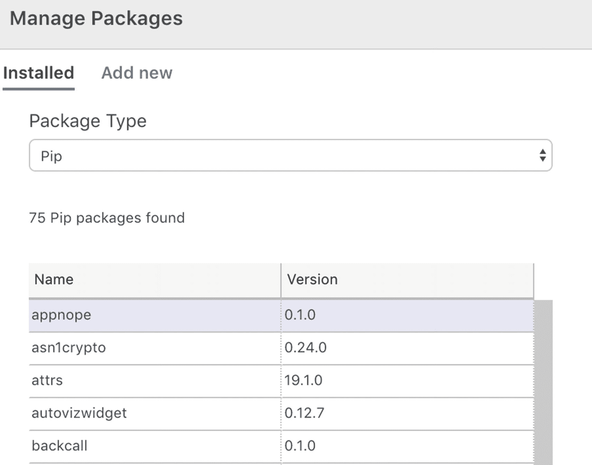

图 6-33

管理包

在本例中，我们将安装 `matplotlib` 包，以便我们能继续学习本章后续的示例。在图 6-34 中，我在“新建软件包”选项卡中搜索了 `matplotlib` 包，并选择了当前可用的最新稳定版本。

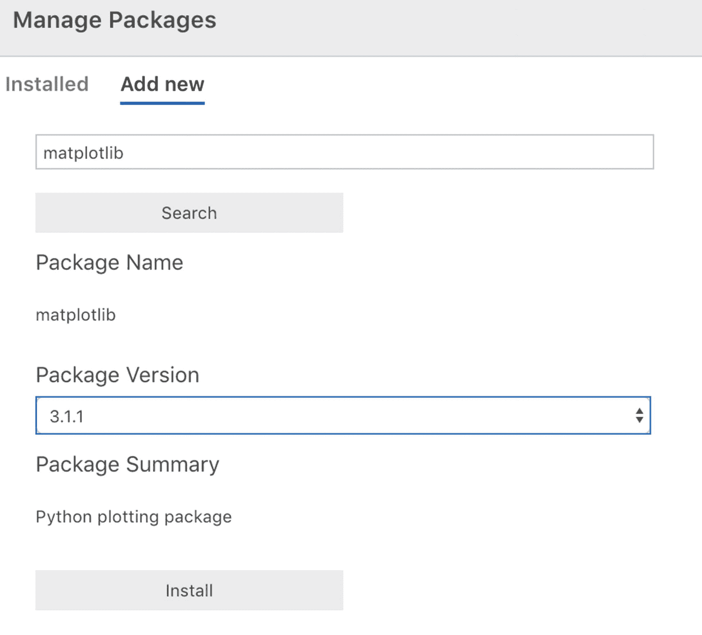

图 6-34

Matplotlib 包安装

选择好软件包和正确版本后，你可以点击“安装”按钮，将该包安装到你的大数据集群上。安装过程可以通过 Azure Data Studio 底部区域的“任务”控制台查看，如图 6-35 所示。


图 6-35

Matplotlib 安装任务

安装好 `matplotlib` 库后，我们就准备好为数据框创建一些图表了！

当我们想要绘制数据框中的数据时，第一件需要做的事就是将数据框转换为 Pandas 数据框。这移除了 Spark 数据框的分布式特性，并在 Spark 主节点的内存中创建一个数据框。我没有转换现有的数据框，而是使用了另一种方法来获取数据到我们的 Pandas 数据框中。为了创建一些更有趣的图表，我从一个 GitHub 仓库中可用的 CSV 文件中读取数据，并将其加载到 Pandas 数据框中。该数据集本身包含了汽车的各种特性，包括价格，并且经常被用作机器学习数据集，以根据重量、马力、品牌等特征来预测汽车价格。

我想指出的另一件事是清单 6-34 中示例代码的第一行。如果你想返回图表，`%matplotlib inline` 命令必须是 notebook 单元格中的第一条命令。这个命令是一个所谓的“魔法”命令，它会影响 `matplotlib` 库的行为以返回图表。如果我们不包含这个命令，Pandas 库在被要求绘制图表时会返回错误，我们将看不到图像本身。

```python
%matplotlib inline
import pandas as pd
# 通过 URL 从 csv 创建本地 Pandas 数据框
pd_data_frame = pd.read_csv("https://github.com/Evdlaar/Presentations/raw/master/Advanced%20Analytics%20in%20the%20Cloud/automobiles.csv")
```
清单 6-34
从 GitHub 导入数据到数据框

运行上述代码后，我们可以开始使用 `pd_data_frame` 作为来源来创建图表。

清单 6-35 中的代码将使用 Pandas 的 `hist()` 函数创建我们 Pandas 数据框中 `horsepower` 列的直方图（图 6-36）。直方图对于查看数据的分布情况极其有用。在进行任何形式的数据探索时，数据分布都非常重要，因为你可以看到，例如，影响你平均值的数据中的异常值。

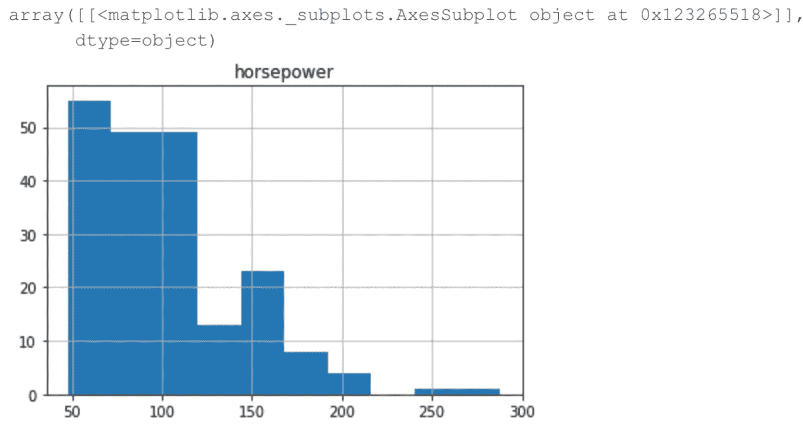

图 6-36

pd_data_frame Pandas 数据框中马力列的直方图

```python
%matplotlib inline
# 例如，我们可以为马力列创建一个直方图
pd_data_frame.hist("horsepower")
```
清单 6-35
为单列创建直方图


## Pandas 可视化概览

除了直方图，我们基本上可以创建任何感兴趣的图表类型。Pandas 支持多种不同的图表类型，并提供了许多自定义图表外观的选项。关于可实现功能的详细参考，可以在 Pandas 文档页面找到：[`https://pandas.pydata.org/pandas-docs/stable/user_guide/visualization.html`](https://pandas.pydata.org/pandas-docs/stable/user_guide/visualization.html)。

## 箱线图示例

为了展示另一种语法示例，清单 6-36 中的代码在 Pandas 数据框（`pd_data_frame`）中创建了 `price` 列的箱线图（图 6-37）。

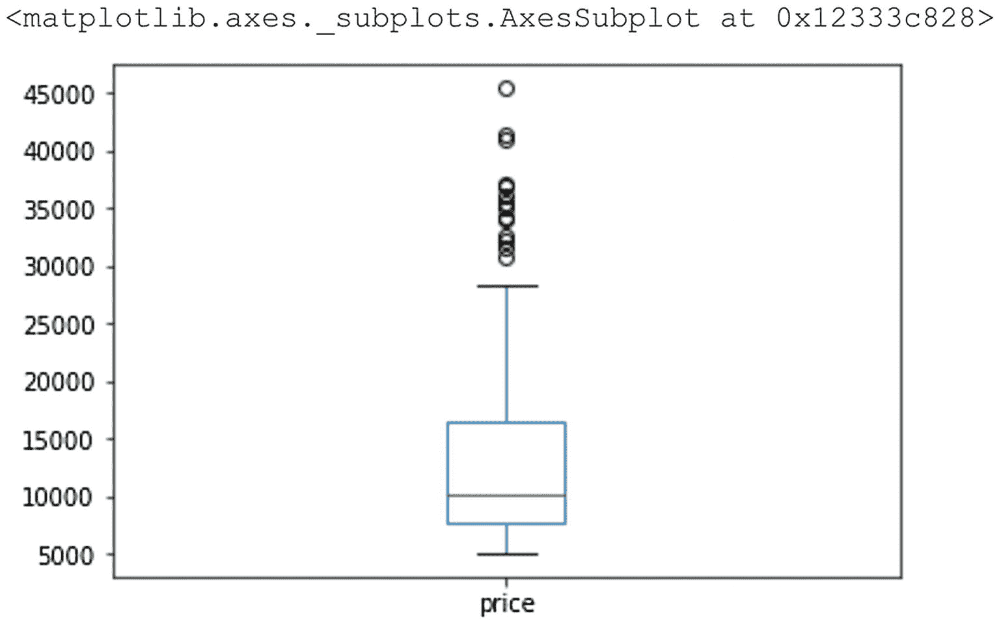

图 6-37：`pd_data` 数据框中 `price` 列的箱线图

```python
%matplotlib inline
# Also other graphs like boxplots are supported
# In this case we create a boxplot for the "price" column
pd_data_frame.price.plot.box()
Listing 6-36
Generate a boxplot based on a single column
```

## 箱线图解读

与直方图类似，箱线图以图形方式展示数据的分布情况。箱线图（也称为箱须图）相比直方图能提供更多关于数据分布的细节。箱线图的“箱体”称为四分位距（IQR），包含了我们数据中间的 50%。在我们的例子中，可以看到价格数据中间的 50%大约在 7,500 到 17,500 之间。IQR 下方的线（或须）显示了数据底部的 25%，而 IQR 上方的须则显示了顶部的 25%。顶部须上方的圆圈显示了数据集中的离群值，在本例中用于标示价格高于 `1.5 * IQR` 的汽车。离群值可能对平均价格产生巨大影响，值得调查以确保它们不是错误。最后，IQR 内部的绿色条表示 `price` 列的平均值。

## 比较多个箱线图

箱线图常用于比较多个数据集之间的数据分布。我们也可以在 PySpark 笔记本中通过设置 `matplotlib` 库的 `subplot()` 函数来实现这一点。我们为 `subplot()` 设置的参数决定了 `subplot()` 函数之后的图应显示的位置（以行和列表示）。在清单 6-37 的例子中，`price` 列的箱线图显示在位置 `1,2,1`，即 1 行、2 列、第一列。马力的图显示在 1 行、2 列、第二列的位置，从而有效地将两个箱线图并排绘制（图 6-38）。

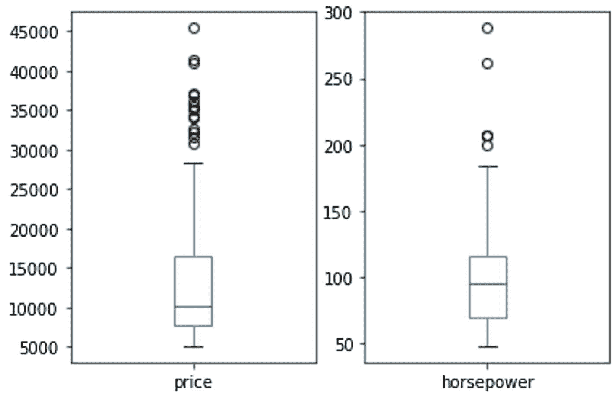

图 6-38：两个不同的箱线图并排显示

```python
%matplotlib inline
# Boxplots are frequently used to compare the distribution of datasets
# We can plot multiple boxplots together and return them as one image using the following code
import matplotlib.pyplot as plt
plt.subplot(1, 2, 1)
pd_data frame.price.plot.box()
plt.subplot(1, 2, 2)
pd_data frame.horsepower.plot.box()
plt.show()
Listing 6-37
Generate multiple boxplots to compare two values
```

我们不会深入探讨箱线图的更多细节，因为它们超出了本书的范围。但如果您有兴趣了解更多，网上有大量关于如何解读箱线图的资源。

## 散点矩阵图示例

最后一个示例展示了 Pandas 图形功能的强大之处。使用清单 6-38 中的代码，我们将创建一个所谓的散点矩阵图（图 6-39）。散点矩阵由许多不同的图表组合成一个大的单一图表。散点矩阵会为我们提供的列之间每一次交互返回一个散点图；如果交互发生在相同的列上，则返回直方图。

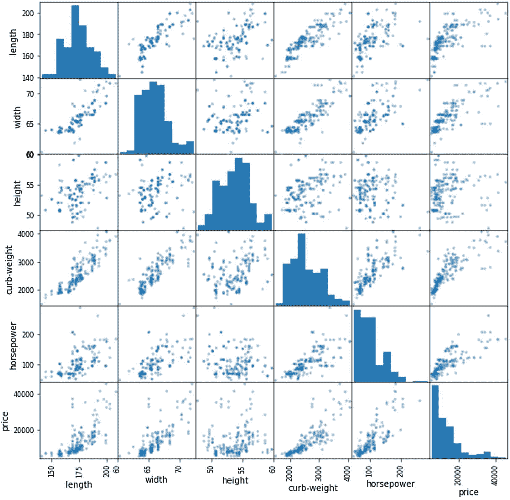

图 6-39：在 `pd_data` 数据框的各种列上绘制的散点矩阵图

```python
%matplotlib inline
import matplotlib.pyplot as plt
from pandas.plotting import scatter_matrix
# Only select a number of numerical columns from our data frame
pd_num_columns = pd_data frame[['length','width','height','curb-weight','horsepower','price']]
# More advanced plots, like a scatter matrix plot
scatter_matrix(pd_num_columns, alpha=0.5, figsize=(10, 10), diagonal="hist")
plt.show()
Listing 6-38
Create scatter matrix
```

## 散点矩阵图解读

当您想要检测数据集中各列之间的相关性时，散点矩阵图非常有用。每个散点图都在 X 轴（例如 `length`）和 Y 轴（例如 `price`）上为每个值绘制一个点。如果这些点倾向于聚集在一起，如上图中形成较深的点，则这些列内的数据可能相互相关，这意味着如果一个值较高或较低，另一个值通常也会朝相同方向移动。一个更实际的例子是 `price`（前图左下角）和 `curb weight`（前图右数第四）之间的图。随着 Y 轴上显示的 `price` 上升，汽车的 `curb weight` 也趋于增加。这是非常有用的信息，特别是如果我们有兴趣根据代表汽车特征的列值来预测汽车价格时。如果一辆车的 `curb weight` 很高，那么它的价格很可能也会很高。


