# 数据框执行

在本章中，我多次提到数据框只是对您导入数据的逻辑表示。在数据框的底层，实际的物理数据存储在大数据集群的 Spark 节点上。因为数据框是一种逻辑表示，所以处理数据框内的数据或修改数据框本身的操作方式可能与您的预期有所不同。

Spark 在处理任何命令之前，会使用一种称为“惰性求值”的方法。就 Spark 处理而言，惰性求值的基本含义是，Spark 会延迟对数据框执行几乎所有操作，直到触发一个动作。这些操作被称为转换，例如连接数据框。我们在 Spark 数据框上执行的每个转换都会被添加到一个执行计划中，但不会直接执行。执行计划只会在针对数据框执行动作时才会运行。动作包括诸如 `count()` 或 `top()` 之类的操作。

简单来说，我们对数据框执行的所有转换，如连接、排序等，都会以执行计划的形式添加到转换列表中。每当我们在数据框上执行像 `count()` 这样的动作时，执行计划就会被处理，并显示 `count()` 的结果。

从性能角度来看，Spark 使用的惰性求值模型在处理大型数据集时非常有效。通过将转换分组在一起，执行所需操作所需的数据遍历次数更少。此外，将转换分组在一起还为优化创造了空间。如果 Spark 知道需要对数据执行的所有操作，它就可以决定执行最终结果所需动作的最佳方法，也许某些操作可以避免，或者可以将其他操作合并在一起。

在我们的 PySpark notebook 内部，我们可以非常轻松地使用 `explain()` 命令查看执行计划。在清单 6-39 的示例中，我们将把航班和机场信息导入两个独立的数据框，并查看其中一个数据框的执行计划（图 6-40）。

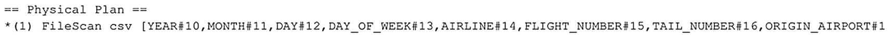

图 6-40：新导入数据框的执行计划

```python
# 如果尚未导入，请再次导入航班和航空公司数据
df_flights = spark.read.format('csv').options(header='true', inferSchema="true").load('/Flight_Delays/flights.csv')
df_airlines = spark.read.format('csv').options(header='true', inferSchema="true").load('/Flight_Delays/airlines.csv')
# 与 SQL Server 类似，Spark 使用执行计划，您可以通过 .explain() 查看
df_flights.explain()
清单 6-39：解释单表数据框的执行计划
```

如图 6-40 所示，目前只有一个操作，即 FileScan，它负责将 CSV 内容读取到 `df_flights` 数据框中。事实上，当我们执行该命令时，数据并未加载到数据框中；但每当我们执行动作以触发实际加载数据时，它将是执行计划中的第一步。

为了展示执行计划发生的变化，我们将把之前创建的两个数据框连接在一起（清单 6-40）并查看该计划（图 6-41）。

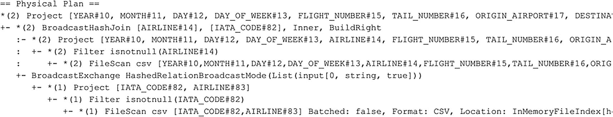

图 6-41：数据框连接的执行计划

```python
# 让我们再次连接两个数据框，看看计划发生了什么变化
from pyspark.sql.functions import *
df_flightinfo = df_flights.join(df_airlines, df_flights.AIRLINE == df_airlines.IATA_CODE, how="inner").drop(df_flights.AIRLINE)
df_flightinfo.explain()
清单 6-40：解释多表数据框的执行计划
```

从执行计划中，我们可以看到两个 FileScan 操作，它们将读取两个源 CSV 文件的内容到各自的数据框中。然后我们可以看到，Spark 决定基于我们在前面代码中提供的关键列，对两个数据框执行哈希连接。

再次强调，我们针对数据框执行的动作并未实际执行。我们可以通过执行一个简单的 `count()` 动作（清单 6-41）来触发执行。

```python
# 即使我们连接了数据框并看到这反映在执行计划中，
# 该计划也尚未被执行。
# 执行计划仅在执行 count() 或 top() 等动作时才会执行。
df_flightinfo.count()
清单 6-41：执行一个动作以运行执行计划
```

执行计划仍将附加在数据框上，我们随后执行的任何转换都将被添加到其中。无论何时我们在后续时间点执行动作，执行计划连同其包含的所有转换都将被执行。


## 数据框缓存

优化数据框操作性能的一种方法是缓存它们。通过缓存数据框，我们将其置于 Spark 工作节点的内存中，从而在每次对数据框执行操作时，避免从磁盘读取数据的开销。何时需要缓存数据框取决于众多因素，但一般来说，如果你在单个脚本中对一个数据框执行多次操作，缓存该数据框通常是加速后续操作性能的好方法。

我们可以通过调用 `storageLevel` 函数来检索有关数据框是否被缓存的信息，如图 6-42 和代码清单 6-42 所示。

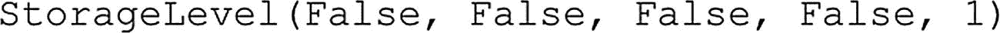
*图 6-42：`df_flightinfo` 数据框的缓存信息*

```
df_flightinfo.storageLevel
```
*代码清单 6-42：检索数据框的存储级别*

该函数返回多个布尔值，表示此数据框当前激活的缓存级别：`Disk`、`Memory`、`OffHeap` 和 `Deserialized`。默认情况下，每当缓存一个数据框时，它将同时被缓存到 `Disk` 和 `Memory` 中。

如图 6-43 所示，`df_flightinfo` 数据框此时并未被缓存。我们可以通过调用 `cache()` 函数来改变这一点，如代码清单 6-43 中的代码所示。

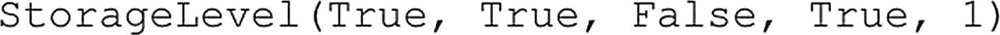
*图 6-43：`df_flightinfo` 数据框的缓存信息*

```python
# 要缓存我们的数据框，我们只需使用 .cache() 函数
# 默认的缓存级别是 Disk 和 Memory
df_flightinfo.cache()
df_flightinfo.storageLevel
```
*代码清单 6-43：在数据框上启用缓存*

如果我们查看 `storageLevel` 函数的结果，如图 6-43 所示，我们可以看到数据框现在已被缓存。

尽管 `storageLevel` 函数返回数据框已被缓存的信息，但实际上它尚未缓存。我们仍然需要执行一个操作，组成数据框的实际数据才会被检索并能够被缓存。操作的一个例子是 `count()`，如代码清单 6-44 中的代码所示。

```python
# 即使我们收到数据框已缓存的信息，我们也必须
# 执行一个操作，它才会真正被缓存
df_flightinfo.count()
```
*代码清单 6-44：通过对数据框执行计数操作来初始化缓存*

除了返回有关数据框缓存有限信息的 `storageLevel()` 命令外，我们还可以通过 Yarn 门户获取更详细的信息。

要访问 Yarn 门户，你可以使用 `Spark 诊断和监控仪表板` 的 Web 链接，该链接会在你通过 Azure Data Studio 连接或管理大数据集群时，显示在 SQL Server 大数据集群选项卡中（图 6-44）。

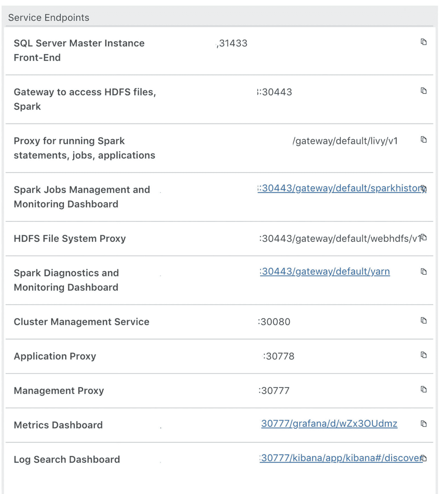
*图 6-44：Azure Data Studio 中的服务终结点*

登录 Yarn Web 门户后，我们会看到如图 6-45 所示的所有应用程序概览。

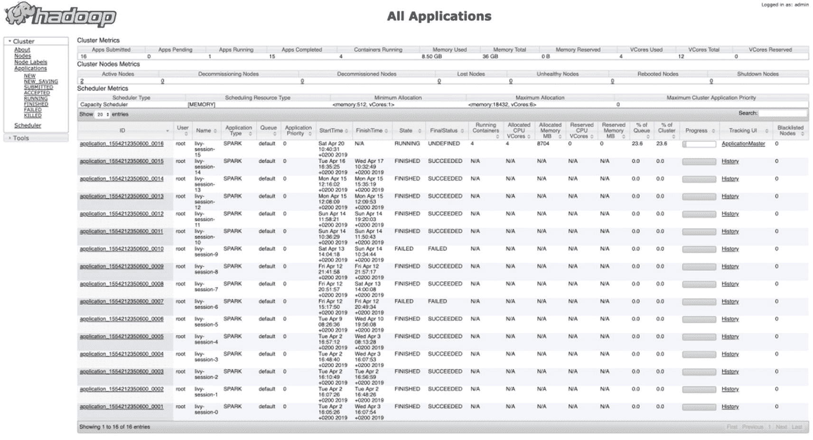
*图 6-45：Yarn Web 门户*

将 Spark 中的应用程序视为一个计算单元。例如，一个应用程序可以是通过 Notebook 与 Spark 进行的交互式会话，也可以是一个 Spark 作业。我们在本章 PySpark Notebook 中所做的一切，都是在 Spark 中作为一个或多个应用程序处理的。

事实上，我们对 Spark 集群执行的第一个命令会返回有关我们 Spark 应用程序的信息，如图 6-46 所示。

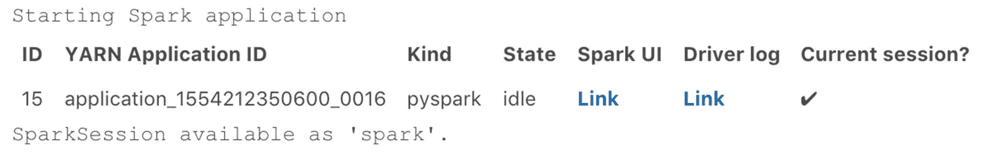
*图 6-46：Spark 应用程序信息*

对我们来说，要寻找的最重要的信息是 `YARN Application ID`。此 ID 应显示在 Yarn 所有应用程序页面上，如果你仍通过此应用程序 ID 连接到 Spark，它应标记为 `RUNNING`，如我们的会话在图 6-47 中所示。

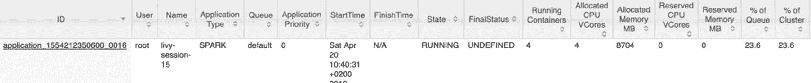
*图 6-47：来自 Yarn Web 门户的 Spark 应用程序概览*

我们寻找的有关数据框缓存的信息存储在应用程序日志记录中。我们可以通过点击 ID 页面中的链接来访问有关该应用程序的更多详细信息。这会将我们带到该特定应用程序的更详细视图，如图 6-48 所示。

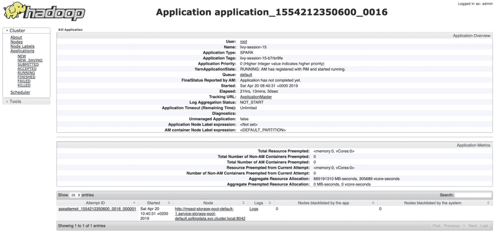
*图 6-48：Yarn Web 门户内的应用程序详细视图*

要查看我们寻找的信息，我们必须点击 `Tracking URL:` 选项处的 `ApplicationMaster` 链接。这将打开一个网页，显示由该特定应用程序处理过或正在处理的 Spark 作业。如果你将应用程序视为你与 Spark 集群的连接，那么作业就是你通过应用程序发送以执行工作的命令，例如计算数据框中的行数。图 6-49 显示了我们通过 PySpark Notebook 当前连接的应用程序中的 Spark 作业概览。

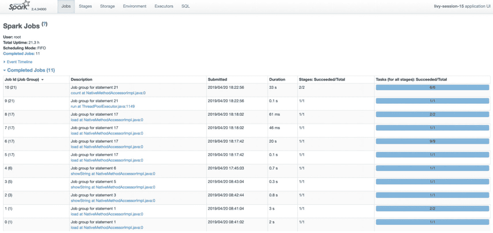
*图 6-49：Spark 作业概览*

你可以通过点击 `Description` 列中的链接来打开作业的详细信息，并访问有关作业处理的大量信息，包括作业如何被每个工作节点处理，以及作业的图形化执行计划在 Spark 中的等价物，称为 `DAG`（有向无环图），其中包含一个示例，如图 6-50 所示。

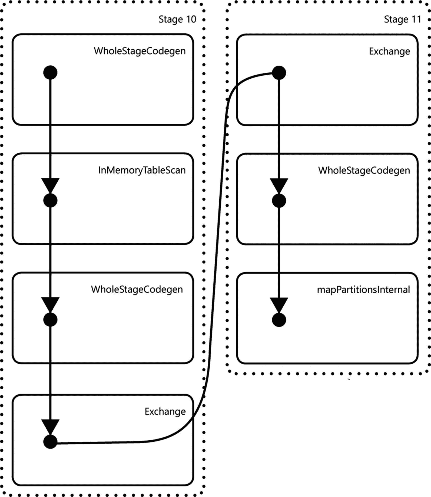
*图 6-50：跨数据框执行 `count()` 函数的 DAG*

要查看有关数据框缓存的信息，我们不必打开作业详细信息（尽管如果我们只想查看特定作业的存储处理，可以这样做）；相反，我们可以通过点击网页顶部菜单栏中的 `Storage` 菜单项来查看常规存储概览。

在此页面上，我们可以看到当前正在使用存储的所有数据框，无论是磁盘上的物理存储还是内存中的存储。图 6-51 显示了在我们的环境中，执行了本节开头进行的 `cache()` 和 `count()` 命令后的网页。

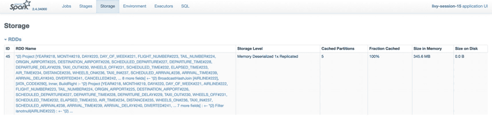
*图 6-51：数据框的存储使用情况*

从图 6-51 中我们可以看到，我们的数据框完全存储在内存中，使用了 345.6 MB 的内存，分布在五个分区中。我们甚至可以通过点击 `RDD Name` 列下方的链接，查看数据缓存和分区在哪些 Spark 节点上。在我们的例子中，我们得到如图 6-52 所示的信息。

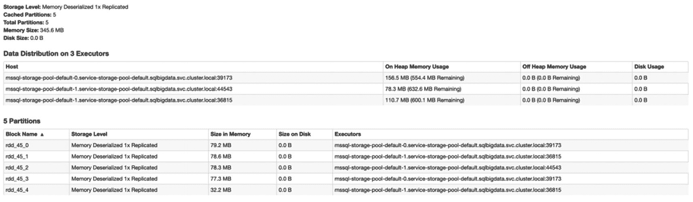
*图 6-52*


