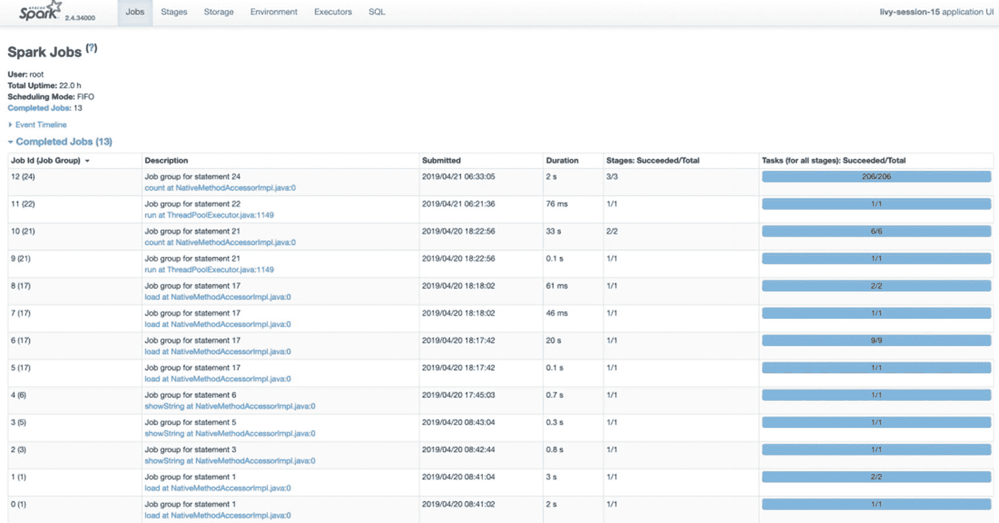
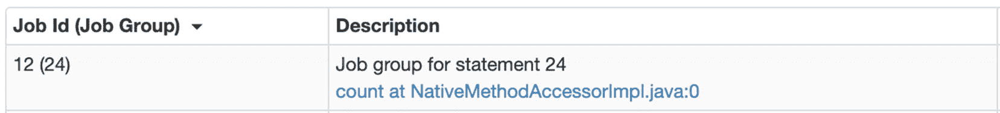
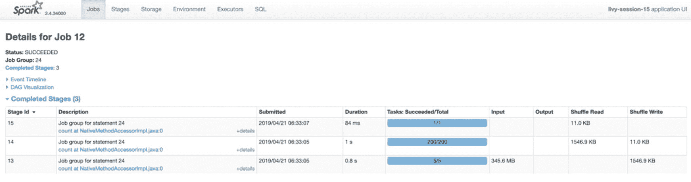
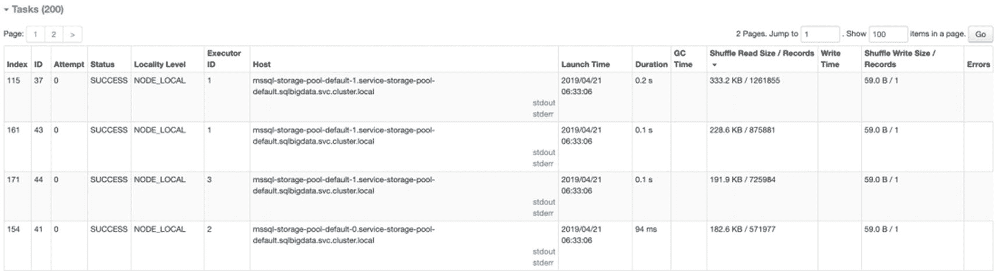
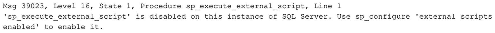
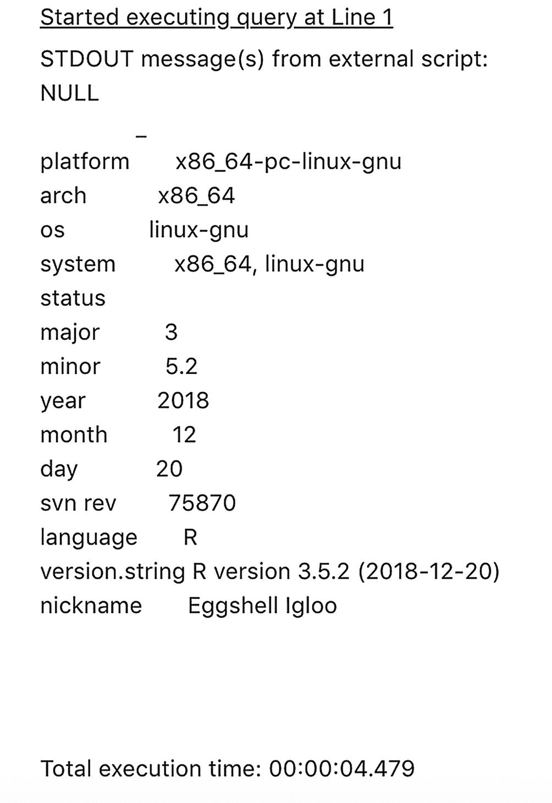
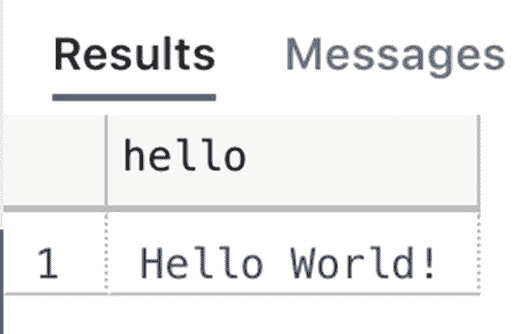
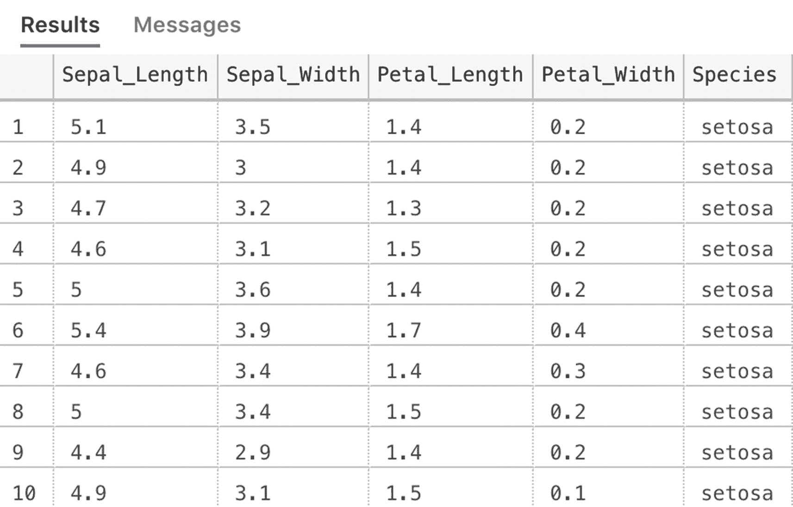
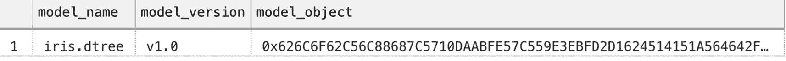

# 我们的数据框在 Spark 节点上的存储使用情况

我们可以看到，我们的数据框实际上缓存在三个 Spark 工作节点上，每个节点缓存的数据量不同。我们还可以看到数据框是如何分区的，以及这些分区是如何分布在各工作节点上的。分区是 Spark 自动处理的功能，对于平台的分布式处理至关重要。

## 数据框分区

正如我们在上一节末尾提到的，Spark 会自动处理数据框的分区。一旦我们创建了一个数据框，它就会自动被分区，并且这些分区会分布到各个工作节点上。
我们可以通过清单 6-45 所示的函数查看一个数据框被分成了多少个分区。

```
# Spark 将我们的数据切割成分区
# 我们可以使用以下命令查看数据框的分区数
df_flightinfo.rdd.getNumPartitions()
清单 6-45
获取数据框的分区数
```

在我们的例子中，本章一直使用的 `df_flightinfo` 数据框已被划分为五个分区 `–` 这一点我们在上一节中也注意到了，当时我们通过 Yarn Web 门户查看了数据是如何分布到组成我们集群的 Spark 节点上的。
如果我们愿意，我们也可以自己设置分区数量（清单 6-46）。一个简单的方法是将你想要的分区数提供给 `repartition()` 函数。

```
# 如果需要，我们可以将数据框重新分区到更多或更少的分区
df_flightinfo = df_flightinfo.repartition(1)
清单 6-46
对数据框进行重新分区
```

在清单 6-46 的示例代码中，我们会将 `df_flightinfo` 数据框重新分区为单个分区。一般来说，这不是最佳做法，因为只有一个分区意味着对数据框的所有处理最终都会集中在一个工作节点上。理想情况下，你希望将数据框分区为大小尽可能相等的分区。每当对数据框执行一个操作时，它可以被拆分成大小相等的操作，从而获得最大的计算效率。
为了确保你的数据框分区效率尽可能高，在许多情况下，仅仅提供你感兴趣的分区数并不是很高效。在大多数情况下，你会希望根据特定的键/值对数据进行分区，确保数据框中具有相同键/值的所有行都被分区在一起。Spark 也允许按特定列进行分区，如清单 6-47 的示例代码所示。

```
df_flights_partitioned = df_flightinfo.repartition("AIRLINE")
清单 6-47
创建分区后的数据框
```

在这个具体的例子中，我们正在按 `AIRLINE` 列对 `df_flights_partitioned` 数据框进行分区。尽管我们的数据框中只有 14 个不同的航空公司，但如果我们查看新创建数据框的分区计数，最终仍然会得到 200 个分区。这是因为，默认情况下，当我们按列分区时，Spark 使用最小分区数 200。对我们的例子来说，这意味着 200 个分区中的 14 个实际包含数据，而其余的是空的。
让我们看看数据是如何被分区和处理的。然而，在此之前，我们需要对数据框执行一个操作，以便它实际进行分区（清单 6-48）。

```
# 让我们运行一个 count 操作，以便我们可以通过 Web 门户获取一些分区信息
df_flights_partitioned.count()
清单 6-48
从分区后的数据框获取计数
```

运行此命令后，我们将返回到上一节中查看数据框缓存时访问过的 Yarn Web 门户。如果你没有打开它，你需要导航到 Yarn Web 门户，打开当前运行的应用程序，最后点击 `ApplicationMaster` URL 来查看应用程序内部的作业，如图 6-53 所示。


图 6-53
我们活动应用程序中的 Spark 作业

我们将重点关注图 6-53 所示列表中最顶部的作业（图 6-54）。这是我们手动按 `AIRLINE` 列对数据框进行分区后执行的计数操作，你也可以在执行的操作名称中看到这一点。


图 6-54
我们 `count()` 操作的 Spark 作业

通过点击“描述”中的链接，我们会进入一个页面，该页面显示了有关该特定作业的更多信息，如图 6-55 所示。


图 6-55
Spark 作业详情

非常有趣的是，作业本身也被划分为称为“阶段（Stages）”的子步骤。作业中的每个阶段执行特定的功能。为了展示我们的分区是如何处理的，最有趣的阶段是中间的那个，我们在图 6-56 中对其进行放大查看。


图 6-56
Spark 作业内部的一个阶段

在这个阶段，实际跨数据框的所有分区执行了计数操作；请记住，当我们基于 `AIRLINE` 列创建分区键时，创建了 200 个分区。在“任务：成功/总计（Tasks: Succeeded/Total）”列中，你可以看到返回的那个数字。
如果我们进一步深入这个阶段的详细信息，点击“描述”列中的链接，我们会收到另一个页面，该页面向我们确切展示了该特定阶段的数据处理方式。虽然这个页面提供了丰富的信息，包括事件时间线、另一个 `DAG` 可视化图，以及所有 200 个步骤（在此级别上也称为任务）的摘要指标，但我主要想关注页面底部的表格，该表格返回了此阶段下 200 个任务的处理信息。
如果我们按“洗牌读取/记录数（Shuffle Read / Records）”列对表格进行降序排序，我们就可以确切地看到每个任务从每个分区读取了多少条记录，以及从哪台主机读取的，如图 6-57 所示。该图显示了处理行的总共 14 个任务中的前几个任务（其余 186 个分区是空的；因此没有从它们处理行）。


图 6-57
计数步骤下发生的任务，按洗牌读取大小/记录数排序

从图 6-57 的结果中，我们立即也能看出按列值设置分区的一个缺点。最大的分区包含的行数（1,261,855）远多于最小的分区（61,903），这意味着我们将执行的大多数操作都会发生在包含最大分区的 Spark 工作节点上。理想情况下，你应该使分区尽可能均匀，并以这种方式分布，使得工作能均匀地分散在你的 Spark 工作节点上。

## 总结

在本章中，我们详细探讨了在 SQL Server 大数据集群中可用的 Spark 架构内处理数据的方法。

除了探索用于在 Spark 内处理数据帧的编程语言 PySpark，我们还研究了像数据可视化这样的更高级方法。最后，通过查看执行计划、缓存和分区，我们浅析了 Spark 数据帧处理的内部机制，同时介绍了能提供关于 Spark 如何处理数据帧的丰富信息的 Yarn Web 界面。

现在，所有这些数据都已存放在我们的大数据集群中，让我们继续学习第 7 章，来看看大数据集群环境中的机器学习吧！

## 7. 大数据集群上的机器学习

在之前的章节中，我们花了大量时间探讨如何通过 Spark 查询存储在 SQL Server 实例或 HDFS 中的数据。能够访问不同格式存储的数据的一个优势在于，它允许你在大规模、分布式的环境中进行数据分析。我们可以在大数据集群中利用的一个更强大的选项是，能够在我们的数据上实施机器学习解决方案。因为大数据集群允许我们以各种格式和大小存储海量数据，所以跨所有这些数据来训练和使用机器学习模型变得容易得多。

在许多涉及机器学习的工作场景中，将构建模型所需的所有数据汇集到一处的挑战占据了大部分工作。如果你能直接访问所需的所有数据，而无需将其从不同数据源移动到一个地方，那么构建机器学习模型（在数据科学领域通常称为训练）就会变得容易得多。除了能从单点访问数据外，大数据集群还允许你在数据驻留的同一位置将你的机器学习模型投入实际运营。这意味着，从技术上讲，你可以使用你的机器学习模型来为存储在大数据集群内的新数据进行评分。这极大地提升了在组织内部实施机器学习的能力，因为大数据集群让你能够在一个解决方案中训练、利用和存储机器学习模型，而无需为执行组织高级分析平台中的特定操作而部署各种平台。

在本章中，我们将更深入地研究大数据集群中可用的各种选项，用于训练、存储和部署机器学习模型。一般来说，我们将涵盖两个方向：SQL Server 内置的数据库内机器学习服务，以及基于 Spark 平台的机器学习。这两个领域涵盖不同的用例，但也存在重叠。正如你在前一章所见，如果需要，我们可以轻松地将存储在 SQL Server 实例中的数据引入 Spark，反之亦然。在这种情况下，选择在哪个领域执行你的机器学习过程，更多地基于你个人偏好使用哪种解决方案。我们将在本章的各个章节中讨论大数据集群内这两个机器学习平台的各种技术优势和劣势。这将使你更好地理解每个解决方案的工作原理，并希望能帮助你选择最适合你需求的方案。

## SQL Server 内置数据库内机器学习服务

随着 SQL Server 2016 的发布，微软引入了一项名为“数据库内 R 服务”的新功能。这项新功能允许你使用新的 `sp_execute_external_script` 存储过程或 `sp_rxPredict` CLR 过程，在 SQL Server 查询中直接执行 R 编程代码。数据库内 R 服务的引入是一个新的方向，它允许组织通过让用户直接在 SQL Server 内部训练、评分和存储模型，将机器学习模型直接集成到他们的 SQL Server 数据库中。虽然 R 是 SQL Server 2016 中唯一可用于 `sp_execute_external_script` 的语言，但随着 SQL Server 2017 的发布，Python 被添加进来，这也导致该功能被重命名为“机器学习服务”。随着大数据集群所基于的 SQL Server 2019 的发布，Java 也被添加为第三种可直接从 T-SQL 代码访问的编程语言。

虽然数据库内机器学习服务存在一些限制（例如，某些可用功能如 `PREDICT` 只接受由 Revolution Analytics 机器学习模型开发的算法），但如果你想在非常接近数据存储位置的地方训练和评分你的机器学习模型，这是一个非常有用的功能。这也是我们认为数据库内机器学习服务大放异彩的领域。通过利用该功能，数据移动几乎为零（考虑到你的机器学习模型所需的数据也可直接在 SQL Server 实例中获得），模型管理通过将模型存储在 SQL Server 表中得到解决，并且它为（接近）实时的模型评分打开了大门——方法是在数据存储到数据库表中之前，就将其传递给你的机器学习模型。

本章中的所有示例代码均可在本书的 GitHub 页面上以 T-SQL notebook 的形式获取。对于本节中的示例，我们选择使用 R 作为首选语言，而不是我们在前一章中使用的 Python。

## 在 SQL Server 主实例中训练机器学习模型

在 SQL Server 大数据集群的主实例中开始训练机器学习模型之前，我们必须先启用允许使用 `sp_execute_external_script` 函数的选项。如果在 SQL 实例中没有启用运行外部脚本的选项，数据库内机器学习服务的大部分功能将被禁用。

即使禁用了外部脚本，部分数据库内机器学习功能仍然可用。例如，你仍然可以结合预训练的机器学习模型使用 `PREDICT` 函数对数据进行评分。然而，你将无法运行训练模型所需的代码，因为这通常需要通过外部脚本功能来实现。

如果未启用外部脚本，并尝试使用 `sp_execute_external_script` 运行一段 R 代码，你将遇到如下错误消息（图 7-1）。



**图 7-1**
禁用外部脚本时运行 `sp_execute_external_script` 出错

启用 `sp_execute_external_script` 简单直接。连接到你的 SQL Server 主实例，并运行代码清单 7-1 中的代码以立即启用该选项。

```
-- 在开始之前，我们需要启用外部脚本
EXEC sp_configure 'external scripts enabled',1
RECONFIGURE WITH OVERRIDE
GO
```
**代码清单 7-1**
启用外部脚本

在启用外部脚本后，我们可以直接通过 `sp_execute_external_script` 存储过程运行 R、Python 或 Java 代码。正如本节引言中提到的，我们选择 R 作为本书本节部分的语言，代码清单 7-2 展示了一个简单的 R 命令，用于返回 R 的版本信息。

```
EXEC sp_execute_external_script
@language =N'R',
@script=N'print (version)'
```
**代码清单 7-2**
使用 `sp_execute_external_script` 的示例 R 代码

运行代码清单 7-2 中的代码，应返回如图 7-2 所示的结果。



**图 7-2**
通过 `sp_execute_external_script` 返回的 R 版本结果

从代码中可以看到，`sp_execute_external_script` 存储过程接受多个参数。我们的示例展示了调用该过程时需要提供的最小参数集，即 `@language` 和 `@script`。`@language` 参数设置在 `@script` 部分中使用的语言。在我们的例子中，这是 R。通过 `@script` 参数，我们可以运行要执行的 R 代码，本例中是 `print (version)` 命令。

虽然 `sp_execute_external_script` 总是返回有关其执行机器的信息，但 `print (version)` R 命令的输出从第 5 行的 `_ platform x86_64` 开始。

虽然我们直接在消息窗口中处理 R 输出是可以的，但也可以向 `sp_execute_external_script` 提供额外的参数，将 R 生成的输出以表格格式返回。我们通过将 R 中定义的变量（使用下面所示的 `@output_data_1_name` 参数）映射到 T-SQL 中定义的变量，并在调用存储过程时使用 `WITH RESULT SETS` 语句来实现这一点，如代码清单 7-3 中的示例所示。

```
EXEC sp_execute_external_script
@language =N'R',
@script=N'
r_hi <- "Hello World!"
r_hello <- as.data.frame(r_hi)',
@output_data_1_name = N'r_hello'
WITH RESULT SETS (([hello] nvarchar(250)));
GO
```
**代码清单 7-3**
使用 `WITH RESULT SETS` 返回数据

运行代码清单 7-3 中的代码，你应获得文本 "Hello World!"，并以表格结果返回，如图 7-3 所示。



**图 7-3**
以表格格式返回的输出

正如我们可以通过 `sp_execute_external_script` 存储过程定义和映射输出结果一样，我们也可以定义输入数据集。这当然非常有用，因为它允许我们将查询定义为 R 会话的输入数据集，并将其映射到 R 变量。能够将存储在 SQL Server 数据库中的数据用于数据库内机器学习服务功能，为执行高级分析（如训练或评分机器学习模型）打开了大门。

我们将在 “Iris” 数据集上训练一个机器学习模型。该数据集在 R 中直接可用，展示了鸢尾花的各种特征以及特定鸢尾花所属的种类。我们可以使用这些数据创建一个分类机器学习模型，用于预测鸢尾花属于哪个种类。

由于数据集已经在 R 中存在，我们可以使用一些 R 脚本结合 `sp_execute_external_script` 存储过程将该数据集作为 SQL 表返回。代码清单 7-4 创建了一个名为 “InDBML” 的新数据库和一个名为 “Iris” 的新表，并从 R 会话中的 Iris 数据集填充该表。

```
-- 创建一个新数据库来保存 Iris 数据
CREATE DATABASE InDBML
GO
USE [InDBML]
GO
-- 创建一个表来保存 Iris 数据
CREATE TABLE Iris
(
Sepal_Length FLOAT,
Sepal_Width FLOAT,
Petal_Length FLOAT,
Petal_Width FLOAT,
Species VARCHAR(50)
)
-- 从 R 会话获取 Iris 数据集并插入到我们的表中
INSERT INTO Iris
EXEC sp_execute_external_script
@language =N'R',
@script=N'
r_iris <- iris',
@output_data_1_name = N'r_iris'
-- 从新表中获取数据
SELECT * FROM Iris
```
**代码清单 7-4**
创建新数据库并用测试数据填充

如果一切处理正确，你将收到如图 7-4 所示的结果，其中显示了存储在 Iris 表中的值。



**图 7-4**
Iris 表中的值

现在我们有了一些数据来创建机器学习模型，我们可以开始训练模型了。但在那之前，我们将执行两个额外的任务。我们将创建一个 “Model” 表。数据库内机器学习服务的一个非常有用的功能是能够将模型“序列化”为二进制字符串，然后将其存储在 SQL 表中。当模型存储在表中时，我们可以通过 SQL 查询在任何需要的时候检索它。代码清单 7-5 在 InDBML 数据库中创建一个模型表。

```
-- 创建一个表来保存我们训练好的 ML 模型
CREATE TABLE models
(
model_name nvarchar(100) not null,
model_version nvarchar(100) not null,
model_object varbinary(max) not null
)
GO
```
**代码清单 7-5**
创建模型表

除了将存储序列化模型的 `model_object` 列，我们还创建了另外两个列来存储模型的名称和版本。这在你将多个模型存储在 SQL Server 数据库中并希望选择特定模型版本或名称的情况下非常有用。

## 数据集分割：训练集与测试集

接下来我们要做的是将鸢尾花数据集分割为训练集和测试集。在训练机器学习模型时，分割数据集是一项常见的任务。训练集是用来喂给你正在训练的模型的数据；测试集是你在模型训练过程中“隐藏”起来的一部分数据。这样一来，模型从未接触过测试数据，这意味着我们可以使用测试集内的数据来验证模型在面对从未见过的数据时表现如何。因此，确保训练集和测试集都能很好地代表完整数据集非常重要。例如，如果我们仅在数据集中“Setosa”鸢尾花品种的特征上训练模型，然后通过测试集向它展示另一个品种的数据，它就会预测错误（预测为 Setosa），因为它在训练过程中从未见过另一个品种。

代码清单 7-6 从鸢尾花表中随机选取 80%的行，并将它们插入一个新的 `Iris_train` 表中。另外 20%的数据则进入一个新的 `Iris_test` 表。

```sql
-- 随机选择 80%的数据到单独的训练表
SELECT TOP 80 PERCENT *
INTO Iris_train
FROM Iris
ORDER BY NEWID()
-- 选择剩余的行到测试表
SELECT *
INTO Iris_test
FROM Iris
EXCEPT
SELECT * FROM Iris_train
代码清单 7-6
将数据集分割为训练集和测试集
```

## 训练并存储机器学习模型

现在我们有了模型表，并且已经将训练和测试数据分开了，我们准备好训练我们的机器学习模型，并在训练后将其存储到模型表中。这正是代码清单 7-7 所做的。

```sql
DECLARE @model VARBINARY(MAX)
-- 基于我们的训练数据集训练一个决策树
EXEC sp_execute_external_script
@language = N'R',
@script = N'
iris.dtree <- rxDTree(Species ~ Sepal_Length + Sepal_Width + Petal_Length + Petal_Width, data = iris_sqldata)
trained_model <- rxSerializeModel(iris.dtree, realtimeScoringOnly = FALSE)',
@input_data_1 = N'SELECT * FROM Iris_train',
@input_data_1_name = N'iris_sqldata',
@params = N'@trained_model VARBINARY(MAX) OUTPUT',
@trained_model = @model OUTPUT
-- 将模型插入到我们的模型表中
INSERT INTO models
(
model_name,
model_version,
model_object
)
VALUES
(
'iris.dtree',
'v1.0',
@model
)
代码清单 7-7
使用 sp_execute_external_script 训练机器学习模型
```

## 代码步骤详解

前面的代码执行了一系列步骤来训练和存储机器学习模型。为了确保你理解如何使用 `sp_execute_external_script` 在你的 SQL Server 主实例中训练和存储模型，我们将描述前面代码中执行的每个步骤。

1.  脚本的第一行 `DECLARE @model VARBINARY(MAX)` 声明了一个 `VARBINARY` 数据类型的 T-SQL 变量，该变量将在训练后保存我们的模型。

2.  在第二步中，我们执行 `sp_execute_external_script` 存储过程，并提供训练模型所需的 R 代码。注意我们使用了一个名为 `rxDTree` 的算法。`rxDTree` 是由 Revolution Analytics（微软于 2015 年收购的一家公司）构建的决策树算法，为机器学习提供并行和基于分块的算法。模型训练的语法非常直观；我们根据训练数据集的其他列（或称为：特征）来预测品种。

    代码行 `trained_model <- rxSerializeModel(iris.dtree, realtimeScoringOnly = FALSE)` 是用来序列化我们的模型并将其存储到 R 变量 `trained_model` 中的命令。在调用 `sp_execute_external_script` 存储过程时，我们将该变量映射为 T-SQL 变量 `@model` 的输出参数。我们将从训练数据集中选择所有记录的查询映射为 R 的输入变量，以供算法使用。

3.  最后，在最后一步中，我们将训练好的模型插入到之前创建的模型表中。我们提供了一些附加数据，如名称和版本，以便在下一步使用该模型预测鸢尾花品种时能够轻松地选择它。

## 训练结果

运行这段代码（应该只需要几秒钟）后，我们应该会得到一个以二进制字符串形式存储在模型表中的模型，如图 7-5 所示。



**图 7-5**
模型表中的已训练决策树模型


