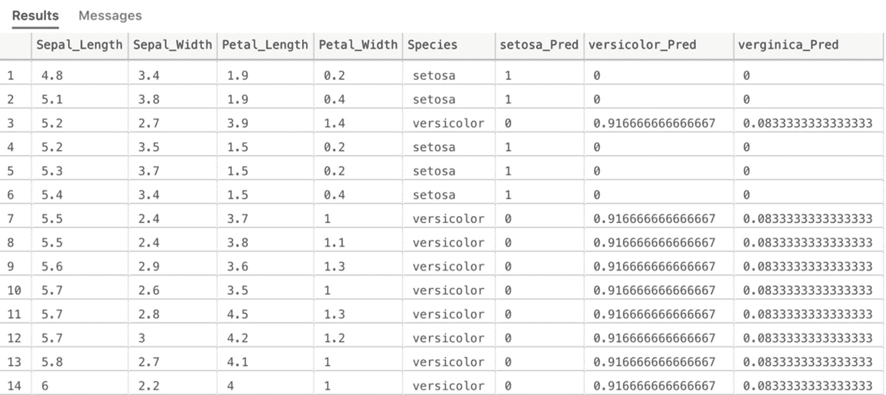
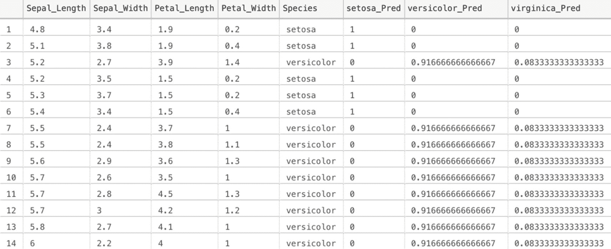
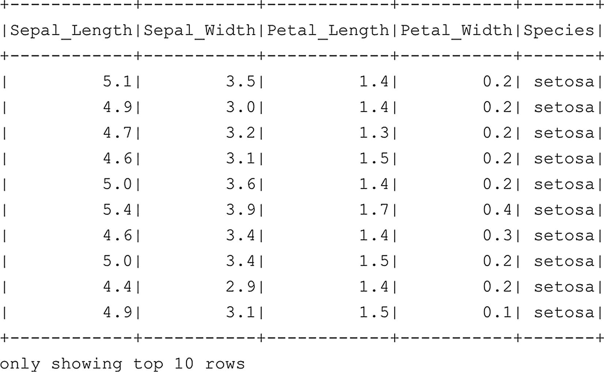
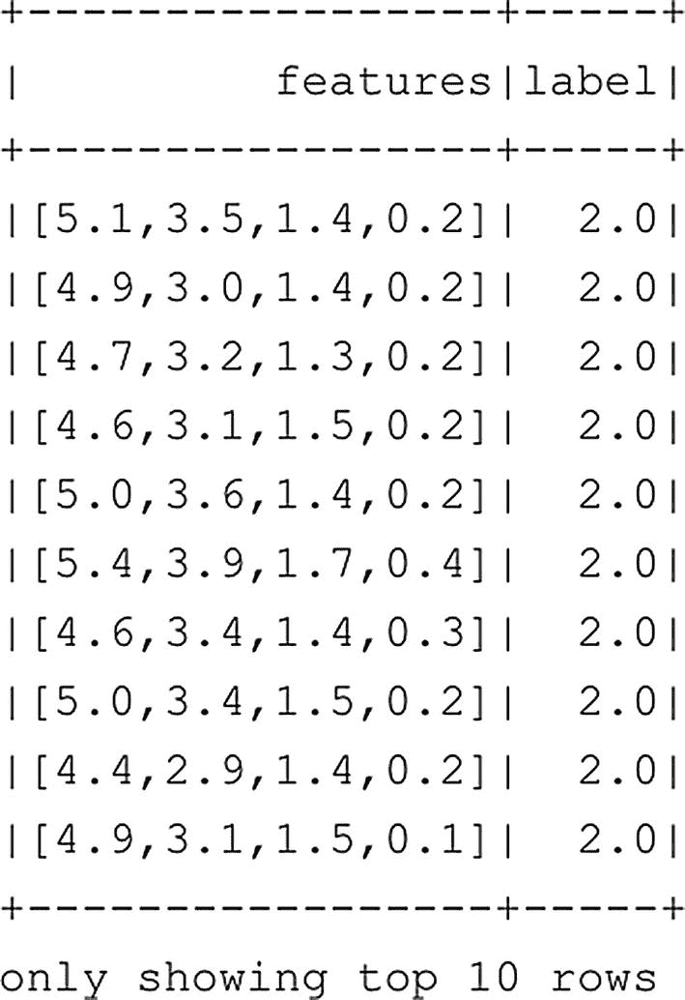

# 使用数据库内机器学习模型为数据评分

既然我们已经训练好了模型，就可以用它来对存储在 `Iris_test` 表中的数据进行评分或预测。为此，我们可以采用两种方法：一种是使用我们之前用于训练模型的 `sp_execute_external_script` 存储过程；另一种是使用 SQL Server 中可用的 `PREDICT` 函数。

清单 7-8 展示了第一种方法；请注意其语法与该方法之前的示例基本相同，但这次我们是将训练好的模型作为输入参数，连同从 `Iris_test` 表中选择数据的查询一起提供的。

```sql
-- 从模型表中检索模型
DECLARE @model VARBINARY(MAX) = (SELECT model_object FROM models WHERE model_name = 'iris.dtree')
-- 使用 Iris_test 数据作为输入运行预测
-- 返回所有列，包括每个物种的概率
EXEC sp_execute_external_script
@language = N'R',
@script = N'
model = rxUnserializeModel(model);
Iris_prediction = rxPredict(model, data=Iris_test)
Iris_pred_results <- cbind(Iris_test, Iris_prediction)
str(Iris_pred_results)
',
@input_data_1 = N'
SELECT
Sepal_Length,
Sepal_Width,
Petal_Length,
Petal_Width,
Species
FROM Iris_test',
@input_data_1_name = N'Iris_test',
@output_data_1_name = N'Iris_pred_results',
@params = N'@model varbinary(max)',
@model = @model
WITH RESULT SETS (("Sepal_Length" FLOAT, "Sepal_Width" FLOAT, "Petal_Length" FLOAT, "Petal_Width" FLOAT, Species VARCHAR(50), setosa_Pred FLOAT, versicolor_Pred FLOAT, verginica_Pred FLOAT))
清单 7-8
使用数据库内存储的模型运行预测
```

在 `sp_execute_external_script` 代码中，R 脚本的第一部分，我们必须再次使用 `rxUnserializeModel` 来反序列化我们的模型。模型反序列化后，我们就可以对输入数据进行预测。R 代码的最后一行将每个鸢尾花物种的概率列添加到了输入数据集中。这意味着我们最终得到一个包含所有输入列以及评分过程生成的列的输出表。

本书不会深入探讨机器学习或机器学习算法，但我们在此案例中尝试使用机器学习解决的问题称为**分类**。机器学习算法基本上可以分为三类：回归、分类和聚类。回归尝试预测一个数值，例如汽车的价格。分类通常处理预测分类值，就像我们在本章中所经历的示例：这是什么物种的鸢尾花？聚类算法尝试通过根据特征将类别分组在一起来预测结果。在鸢尾花示例中，我们也可以选择使用聚类算法，因为可能存在基于物种而趋于分组在一起的明显鸢尾花物种特征。

运行清单 7-8 中的代码后，我们看到如图 7-6 所示的结果。如果您自己运行代码，可能会看到一些不同的结果，因为我们是基于随机选择的行来分割训练和测试数据的。



**图 7-6**

使用我们训练的机器学习模型对 `Iris_test` 表中的数据进行评分的结果

使用 `sp_execute_external_script` 方法执行预测效果很好，并且在您可以使用 R 代码执行的操作方面提供了最大的灵活性。然而，它确实会导致相当多的代码行数。我们在 SQL Server 中可用的另一种方法是使用 `PREDICT` 函数；`PREDICT` 使用起来要容易得多，语法更简单，并且通常比 `sp_execute_external_script` 执行得更快。但它也有缺点，例如，您不能编写自定义 R 代码来对数据执行额外步骤，并且您必须使用通过 Revolution Analytics 算法训练的序列化模型（而通过使用 `sp_execute_external_script`，您基本上可以使用 R 或 R 库中可用的每种算法）。

我们在清单 7-9 的代码中使用 `PREDICT` 函数对 `Iris_test` 表中的数据执行了相同的评分。

```sql
DECLARE @model VARBINARY(MAX) = (SELECT model_object FROM models WHERE model_name = 'iris.dtree')
-- 另一种方法是使用 PREDICT 函数
SELECT
Iris_test.*,
pred.*
FROM PREDICT(MODEL = @model, DATA = dbo.Iris_test as Iris_test)
WITH(setosa_Pred FLOAT, versicolor_Pred FLOAT, virginica_Pred FLOAT) AS pred
清单 7-9
使用 PREDICT 函数运行模型预测
```

正如您可以直接看到的，`PREDICT` 比 `sp_execute_external_script` 可读性更高，对于那些更熟悉 T-SQL 的人来说，也更容易理解。在某种意义上，我们是在将模型及其输出连接到 `Iris_test` 表中的数据。我们需要在 `WITH` 子句中提供预测输出的列名和数据类型，并可以使用 `SELECT` 语句选择我们想要返回的内容。在本例中，我们选择了 `Iris_test` 表的所有列以及预测返回的所有列，结果应如图 7-7 所示。



**图 7-7**

使用 PREDICT 进行鸢尾花物种预测

现在我们已经在 SQL Server 机器学习服务中训练了一个机器学习模型并使用它对数据进行了评分，您应该对这些方法的功能有了一个大致的了解。总的来说，我们认为数据库内机器学习服务在您的所有或大部分数据都存储在 SQL Server 数据库中时特别有用。模型也存储在 SQL Server 数据库中，您可以构建能够（近）实时对存储在 SQL Server 数据库中的数据进行评分的解决方案（例如，通过使用调用 `PREDICT` 函数的触发器）。如果您愿意，您并不局限于仅使用 SQL Server 表。正如您在前面的章节中所看到的，我们可以使用外部表映射存储在 Spark 集群（或其他系统）中的数据，并将该数据传递给数据库内机器学习服务。

然而，在某些情况下，您无法使用数据库内机器学习服务，可能是因为您的数据不适合放入 SQL Server（无论是大小还是数据类型），或者您更熟悉在 Spark 上工作。在任何这些情况下，我们总是可以选择在 Spark 部分的大数据集群上执行机器学习任务，我们将在下一节中更详细地探讨这一点。


## Spark 中的机器学习

### Spark 机器学习概述

由于大数据集群由 SQL Server 和 Spark 节点组成，我们可以轻松选择在 Spark 平台内运行从训练到评分的机器学习流程。我们可以列出许多选择 Spark 而非 SQL 作为机器学习平台的原因（反之亦然）。然而，当您拥有一个非常大的数据集，将其加载到数据库中并不合理时，您或多或少只能使用 Spark，因为 Spark 能很好地处理大型数据集，并且可以以与处理数据相同的*分布式特性*来训练各种机器学习算法。

正如在一个开放、分布式数据处理平台上所期望的那样，有许多库可用于满足您的机器学习需求。在本书中，我们决定使用内置的 Spark ML 库，这些库提供了大量不同的算法选择，应该能满足您的大多数高级分析需求。

### 准备数据：加载 Iris 数据集

就像我们为 SQL Server 的数据库内机器学习服务部分所做的那样，我们需要将一些数据导入 Spark 中以供使用。为了简单起见，我们决定重用在 SQL Server 部分也使用过的 Iris 数据集。就像我们在上一章中所做的那样，我们在 Spark 中进行的所有数据处理、整理和操作都发生在数据框上。假设您已经完成了前一章 SQL Server 部分的示例，我们将使用代码清单 7-10 中的代码从 SQL Server 主实例中提取 Iris 数据集，并将其加载到 Spark 的数据框中。如果您不熟悉通过 Spark 连接到 SQL Server 主实例，建议阅读上一章的最后一节，其中详细介绍了如何实现此场景。

```
# Before we get started, let's get the Iris data from the database/table we
# created in the previous section
df_Iris = spark.read.format("jdbc") \
.option("url", "jdbc:sqlserver://master-0.master-svc;databaseName=InDBMl") \
.option("dbtable", "dbo.Iris") \
.option("user", "[username]") \
.option("password", "[password]").load()
```

清单 7-10 从 SQL Server 主实例读取数据

如果我们查看 `df_Iris` 数据框的部分内容，使用 `df_Iris.show(10)` 命令，我们应该能看到所有鸢尾花物种的特征以及物种本身都存在于数据框中（图 7-8）。



图 7-8 df_Iris 数据框的前 10 行

### 导入机器学习库

数据位于 Spark 的数据框中后，我们几乎准备好开始进行一些机器学习了。但首先我们需要处理的是加载一些 Spark ML 库，如代码清单 7-11 所示。

```
# To perform machine learning tasks, we need to import a number of libraries
# In this case we are going to perform classification
from pyspark.ml.classification import *
from pyspark.ml.evaluation import *
from pyspark.ml.feature import *
```

清单 7-11 加载机器学习库

在这种情况下，由于我们正在处理一个所谓的分类问题，我们只需要导入 `pyspark.ml.classification` 库，以及我们需要对数据框特征（在此上下文中是数据框列的另一个名称）进行一些修改和评估模型性能所需的库。

### 数据处理：特征工程

加载库之后，我们将对数据框进行一些修改，使其适合我们的机器学习算法使用。不同的机器学习算法对数据有不同的要求，例如，有些算法只适用于数值输入，就像我们正在使用的分类算法一样。代码清单 7-12 在我们的 `df_Iris` 数据框上执行了一系列任务。

```
# We are going to combine all the features we need to predict the Iris species
# into a single vector feature
feature_cols = df_Iris.columns[:-1]
assembler = VectorAssembler(inputCols=feature_cols, outputCol="features")
df_Iris = assembler.transform(df_Iris)
df_Iris = df_Iris.select("features", "Species")
# Since we are going to perform logistic regression, we are going to convert
# the string values inside species to a numerical value
label_indexer = StringIndexer(inputCol="Species", outputCol="label").fit(df_Iris)
df_Iris = label_indexer.transform(df_Iris)
```

清单 7-12 处理数据以使其适合机器学习

第一部分代码将不同的特征组合到一个名为 `"features"` 的新列中。所有这些特征都是鸢尾花物种的特征，它们被组合成一种称为向量的单一格式（我们将在本书稍后部分直观地了解其外观）。代码行 `feature_cols = df_Iris.columns[:-1]` 选择了数据框除最右侧一列（即鸢尾花实际物种）之外的所有列。

在第二部分中，我们将不同的鸢尾花物种映射到一个数值。我们用来预测鸢尾花物种的算法需要数值输入，这意味着我们必须执行转换。这在机器学习和数据科学领域并不罕见。在许多情况下，您必须将字符串值转换为数值，以便算法能够处理它。从字符串转换为数值后，我们添加了一个名为 `"label"` 的新列，其中包含物种的数值。

在下一步中，我们只从 `df_Iris` 数据框中选择特征和标签列，并返回前 10 行（代码清单 7-13 的结果如图 7-9 所示），让您了解我们在前一段代码中执行转换后的数据是什么样子。



图 7-9 修改后的 `df_Iris` 数据框

```
# We only need the feature column and the label column
df_Iris = df_Iris.select("features", "label")
df_Iris.show(10)
```

清单 7-13 仅选择数据框的特征和标签列

从图 7-9 中可以看出，所有特征（`Petal_Length`、`Petal_Width` 等）都已被转换到数据框单个列内的一个向量中。`label` 列现在返回物种的数值，2.0 代表山鸢尾，1.0 代表维吉尼亚鸢尾，0.0 代表变色鸢尾。

### 数据分割：训练集与测试集

现在我们的整个数据框已经转换成适合机器学习分类算法的格式，我们可以像上一节一样将数据分割为训练数据框和测试数据框。代码清单 7-14 处理了分割，其中 80% 的数据进入 `Iris_train` 数据框，剩余的 20% 进入 `Iris_test` 数据框。

```
# Split the dataset
(Iris_train, Iris_test) = df_Iris.randomSplit([0.8, 0.2])
```

清单 7-14 将数据框分割为训练和测试数据框


