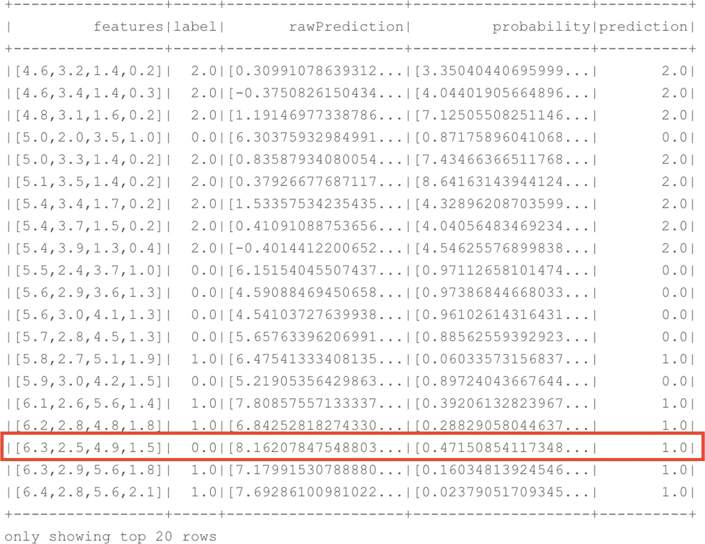
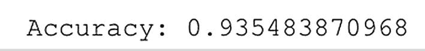
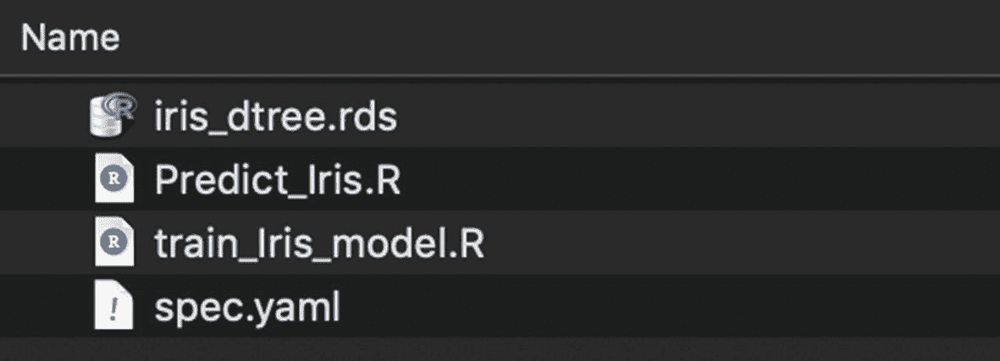

# 7. 机器学习模型训练与评估

现在我们的数据集已经准备好用于训练，可以开始实际的机器学习阶段了。首先需要做的是初始化机器学习算法（见清单 7-15）。在这一步中，我们可以指定要使用的算法以及在机器学习模型训练阶段配置的各种参数（也称为**超参数**）。

```python
# Initiate the classifier, in this case LogisticRegression
lr = LogisticRegression(maxIter=10, tol=1E-6, fitIntercept=True)
清单 7-15
初始化分类器
```

在这个例子中，我们选择了逻辑回归算法，试图根据植物的特征预测它属于哪种鸢尾花。我们现在将忽略算法参数。当你处于尝试优化和调整模型的阶段时，你会经常返回去修改参数（手动或通过程序），以找到最优设置。

训练模型实际上非常简单直接，并且在本例中，可以通过一行 PySpark 代码实现（见清单 7-16）。

```python
# Train the multiclass model
model = lr.fit(Iris_train)
清单 7-16
训练模型
```

在前面的代码（清单 7-16）运行完成后，我们就获得了一个训练好的机器学习模型，其形式是变量 `model`。然后我们可以使用这个训练好的模型在测试数据集上进行预测，以分析其表现如何。使用清单 7-17 中的代码，我们将把训练好的模型“拟合”到我们的测试数据集上，并返回前 20 个结果，这些结果如图 7-10 所示。



图 7-10
测试数据集上的预测结果

```python
# Predict on our test dataset using the model we trained
# and return the predictions
Iris_pred = model.transform(Iris_test)
Iris_pred.show(20)
清单 7-17
执行预测
```

如图 7-10 所示，我们的模型在测试数据集上表现良好。在返回的前 20 行中，只有一行预测的物种与实际物种不同（我们预测的是 virginica，但实际应该是 versicolor）。虽然我们可以逐行分析实际物种和预测物种之间的差异，但查看模型性能的一个更快的方法是使用我们之前加载的 Spark ML 评估库。

清单 7-18 中的代码针对我们的测试数据集评估了模型性能，并在性能指标“准确率”上进行了度量。准确率常用于衡量分类模型的表现，它是正确预测的数量与总预测数量的比值。

```python
# How good did our model perform?
evaluator = MulticlassClassificationEvaluator(metricName='accuracy')
accuracy = evaluator.evaluate(Iris_pred)
print("Accuracy: " + format(accuracy))
清单 7-18
衡量模型性能
```

前面代码返回的结果每次运行时可能会有所不同。这是因为我们使用的数据集相当小，并且我们进行了随机拆分，这意味着最终进入训练和测试数据集的唯一物种数量对模型性能有很大影响。我们得到的结果如图 7-11 所示，这是一个相当不错的准确率水平。



图 7-11
训练后模型的准确率

我们的模型经过训练和测试后，可以根据我们计划用模型做什么来采取进一步的步骤。如果我们对进一步优化模型性能感兴趣，可以返回去调整算法参数，然后再次训练模型。也许在这种情况下，查看训练集和测试集之间的拆分质量也是有用的，因为这对模型准确率有很大影响。如果我们愿意，还有一百多件事情可以做来进一步优化我们的模型（甚至可以选择不同的算法，看看是否比当前算法预测得更好）。

我们可以做的另一件事是存储模型。在这个领域，我们比在 SQL Server 内置机器学习服务中灵活得多，在那里模型必须被序列化并存储在表中。对于 Spark，我们可以选择不同的方法和库来存储我们的模型。例如，我们可以使用一个名为 `Pickle` 的库将模型存储在文件系统上，或者使用模型变量上的 `.save` 函数将其存储在我们选择的 HDFS 位置。每当我们需要使用训练好的模型对新数据进行评分时，我们可以直接从文件系统加载它并用于评分新数据。

## 总结

在本章中，我们探讨了在 SQL Server 大数据集群中执行机器学习任务的各种可用方法。我们研究了 SQL Server 内置机器学习服务，它允许我们使用 T-SQL 查询和新的 `sp_execute_external_script` 存储过程的组合，在 SQL Server 主实例中直接训练、利用和存储机器学习模型。在 Spark 方面，我们也有广泛的机器学习能力可供使用。我们使用了 Spark ML 库在数据帧上训练模型，并用它来对新数据进行评分。这两种方法各有优缺点，但在单个解决方案中提供这两种选择，为我们所有的机器学习需求提供了最佳的灵活性。

## 8. 创建和消费大数据集群应用

SQL Server 大数据集群的功能之一是能够在它上面构建和运行自定义应用程序。这实际上是一个非常强大的功能，因为它允许你在大数据集群上编写和运行各种解决方案的脚本。例如，你可以创建一个应用程序（或简称 app，在本章剩余部分我们将这样称呼它）来执行各种数据维护任务，比如数据库备份。另一个例子是能够通过 REST API 为你的机器学习过程创建一个入口点，这个用例我们将在本章后面探讨。

在撰写本书时，在大数据集群上创建的应用程序可以用 R 和 Python 编写，此外还有一个额外的选项可以运行 SQL Server 集成服务（SSIS）包。通过创建应用程序，你可以利用大数据集群内所有可用的计算资源，并访问存储在其中的所有数据。

大数据集群中的应用程序在专用容器中运行，并且可以在集群中复制和扩展。这意味着你可以让你的应用程序处理并行工作负载，成为高性能的解决方案。

在本章中，我们将创建一个应用程序，它将使用一个预训练的机器学习模型对鸢尾花植物的物种进行分类，这与我们在上一章中专注于在大数据集群内开发机器学习解决方案时所做的非常相似。通过构建一个应用程序来使用机器学习解决方案对数据进行评分，我们可以通过 REST API 轻松地将该模型投入运营。这意味着你使用或自己构建的应用程序可以直接通过 JSON 消息从大数据集群接收预测，从而实现从你的应用程序直接进行近实时评分，而无需先在大数据集群内存储和处理数据。


## 创建大数据集群应用

有两种方法可以将应用部署到大数据集群：通过 Visual Studio Code 的应用部署扩展，或者通过 `azdata` 命令行工具。我们将专注于使用后一种方法来创建和部署我们的应用。

在部署应用之前，我们首先需要编写它。正如本章引言中提到的，应用可以用 R 或 Python 编写，我们选择了 R 作为应用的编程语言。虽然要跟随本章的示例，严格来说并不需要访问 R，但如果你想自己训练应用内部使用的机器学习模型，那将会很有用。无论如何，预训练的模型以及应用部署所需的其他文件都可以在本书的 GitHub 页面下载。

由于我们将创建一个使用机器学习模型为新数据评分的大数据集群应用，我们需要先创建并存储模型。清单 8-1 中的代码将使用内置的 Iris 数据集通过决策树创建一个机器学习模型，并将其存储在一个 `.RDS` 文件中（运行代码前请确保设置好目录路径）。我们稍后将使用存储在 `.RDS` 文件中的模型为新数据评分。你可以从本地计算机的 R 会话中执行以下代码。你可以从 [`www.r-project.org/`](http://www.r-project.org/) 下载并安装 R。

```r
# Read the Iris data into a new dataframe
Iris_Data <- iris
# Change the column names
colnames(Iris_Data) <- c('Sepal_Length', 'Sepal_Width', 'Petal_Length', 'Petal_Width', 'Species')
# Sample a number of rows for splitting training and testing datasets
sample_size <- floor(0.75 ∗ nrow(Iris_Data))
set.seed(1234)
train_id <- sample(seq_len(nrow(Iris_Data)), size = sample_size)
Iris_train <- Iris_Data[train_id, ]
Iris_test <- Iris_Data[-train_id, ]
# Train the model, a decision tree, on the training data
Iris_Dtree <- rpart(Species~., data = Iris_train, method = 'class')
# Save the model to disk
saveRDS(Iris_Dtree, "[folder path]/iris_dtree.rds")
```
**清单 8-1** 在 R 中构建预测模型

如清单 8-1 所示，我们增加了将数据拆分为训练集和测试集的步骤。然而，在前面的代码中，我们只使用训练数据集来训练模型，并未使用测试数据集来测试其准确性。本章中我们并不特别关注模型性能，而是关注使用预训练模型通过我们的大数据集群应用为新数据评分的能力。如果你想查看模型训练的效果，可以运行清单 8-2 中的代码行，它将基于我们训练好的模型进行 Iris 品种预测，并将这些预测与原始测试数据集结合起来。

```r
Iris_Predict <- predict(Iris_Dtree, Iris_test, method = 'class')
Prediction_results <- cbind(Iris_test, Iris_Predict)
```
**清单 8-2** 使用我们训练好的模型进行预测

现在我们有了一个存储在 RDS 文件中的预训练模型，可以来看看创建大数据集群应用所需的实际代码了。

一个大数据集群应用至少包含两个文件：我们将在应用内部运行的实际代码，以及一个保存应用配置的 YAML 文件。这两个文件，以及任何你想上传到应用容器的附加文件（例如我们的预训练机器学习模型），都必须全部存储在一个单独的目录中，如图 8-1 所示。


**图 8-1** 应用文件

除了 “`spec.yaml`” 文件，你可以自由地以任何你想要的方式命名其他文件。

首先让我们看看 “`Predict_Iris.R`” 文件的内容。该文件将包含从 “`iris_dtree.rds`” 文件加载预训练模型，并根据我们传递给脚本文件的输入变量执行预测所需的代码。该文件的内容见清单 8-3。

```r
library(rpart)
runpredict <- function(SepalLength, SepalWidth, PetalLength, PetalWidth) {
input_dataframe = data.frame(Sepal_Length = SepalLength, Sepal_Width = SepalWidth, Petal_Length = PetalLength, Petal_Width = PetalWidth)
Iris_Dtree <- readRDS("iris_dtree.rds")
Iris_Predict <- predict(Iris_Dtree, input_dataframe, method = 'class')
result <- as.data.frame(Iris_Predict)
}
```
**清单 8-3** Predict_Iris.R 文件的内容

在前面的代码中，我们首先加载了基于决策树进行预测所需的 R 库。我们最初也是使用 `rpart` 库来训练模型的；因此，当我们想要执行预测时，也需要加载该库。

通过脚本文件的整个处理过程由一个 R 函数处理。这是必要的，因为我们将在 `spec.yaml` 文件中定义一个入口点，该入口点在运行应用时会被调用。在函数定义中，我定义了四个输入变量：`SepalLength`、`SepalWidth`、`PetalLength` 和 `PetalWidth`。当我们调用应用时，会将这些变量作为输入参数提供给模型以执行预测。在函数内的第一行代码中，我将输入变量分组并将它们存储在一个名为 `input_dataframe` 的 R 数据框中，同时注意将列名重命名为与我们训练模型时使用的格式相同。这是必需的，否则预测将不知道哪一列是哪种数据。

下一步，我们从 RDS 文件加载预训练模型，该文件我们也上传到了应用容器，之后调用 R 的 `predict` 函数，使用模型和输入数据框执行预测。最后，我们将预测结果转换为数据框格式并映射到 `result` 变量。

现在我们已经完成了应用程序脚本，必须创建 `spec.yaml` 文件。对于本章中我们要部署到大数据集群的示例应用，`spec.yaml` 文件内容如清单 8-4 所示。

```yaml
name: predictiris
version: v1
runtime: R
src: ./Predict_Iris.R
entrypoint: runpredict
replicas: 1
poolsize: 1
inputs:
SepalLength: numeric
SepalWidth: numeric
PetalLength: numeric
PetalWidth: numeric
output:
out: data.frame
```
**清单 8-4** spec.yaml 文件的内容

`spec.yaml` 文件的大部分内容是不言自明的。我们提供了应用的名称和版本、运行时语言，以及运行应用时调用的文件。在底部部分，我们定义了输入参数（与我们在 R 函数中定义的参数相同）及其数据类型，以及输出参数的数据类型。在这种情况下，我们没有显式设置输出参数名称。这是因为 R 在调用函数时自动使用最后设置的变量（在我们的例子中是 `result`）作为输出。


