# YAML 参数配置与应用部署

## 1. 理解关键参数
YAML 文件中比较有趣的参数是 `replicas` 和 `poolsize`。这些是我们可以配置以实现应用副本和伸缩的参数。`replicas` 参数的输入值决定了应为应用部署多少个 Pod，而 `poolsize` 则配置了一个 Pod 内应存在多少个应用实例。您的应用能够执行的并行操作数量是 `replicas x poolsize` 的计算结果。例如，将 `replicas` 配置为 4，`poolsize` 设置为 2，将使您的应用能够处理 8 个并行请求。在我们的 `spec.yaml` 中，我们将这两个设置都配置为 1，意味着我们一次只能处理一个请求。

## 2. 部署前的准备
所有应用部署所需的文件都已准备就绪并存储在一个文件夹中，我们已经可以将应用部署到大数据集群。如前所述，我们使用 `azdata` 程序来执行部署。

在连接到大数据集群之前，我们需要获取 `controller-svc-external` 服务的外部 IP。为此，您可以运行以下命令：`kubectl get svc controller-svc-external -n [clustername]`，其中 `[clustername]` 是您的集群名称。如果您使用 AKS 托管大数据集群，则需要先使用 `az` 命令登录到 Azure。

## 3. 连接到管理服务
现在我们有了管理服务的 IP 和端口号，需要使用管理员用户名和密码通过 `azdata` 连接到它。您在部署大数据集群时提供了这两者。下面的代码（清单 8-5）用于建立到大数据集群的连接。请务必将 `[ ]` 之间的变量替换为您的集群对应的值。

```
azdata login –-controller-endpoint https://[IP address]:30080 –-controller-username [username]
```
*清单 8-5：登录到控制器端点*

系统会要求您输入管理员用户的密码。如果一切顺利，您应该会收到一条成功登录的消息。

## 4. 部署应用程序
现在我们通过 `azdata` 连接到了大数据集群，可以部署我们的应用程序了。为此，我们可以使用清单 8-6 所示的代码。请务必将 `[directory path]` 更改为存放您的应用程序文件（如 `spec.yaml`）的目录路径。

```
azdata app create --spec [directory path]
```
*清单 8-6：部署大数据集群应用*

在我们的例子中，我们调用了以下命令（清单 8-7）。

```
azdata app create --spec /Users/enricovandelaar/Documents/BDC.
```
*清单 8-7：部署我们的大数据集群应用*

运行上述命令时，会发生一系列验证，以检查 `spec.yaml` 文件是否存在以及输入是否正确。如果一切正确，您应该会收到如图 8-2 所示的消息。


*图 8-2：大数据集群应用已创建*

## 5. 检查应用状态
即使您收到应用已成功创建的消息，它也不会立即可用。创建应用后，通常需要大约一分钟才能实际运行您的应用程序。如果您想了解应用创建的状态，可以运行清单 8-8 中的命令。

```
azdata app list -n predictiris
```
*清单 8-8：通过 `azdata` 检索应用状态*

这将返回应用部署的当前状态，如图 8-3 所示。

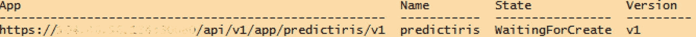
*图 8-3：应用创建状态*

大约一分钟后，我们再次运行该命令，收到了“就绪”状态（如图 8-4 所示），这意味着我们可以继续下一步来测试我们的应用。

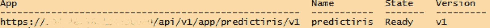
*图 8-4：应用部署完成，应用处于就绪状态*

## 6. 测试应用功能
当应用处于“就绪”状态时，我们可以通过 `azdata` 程序测试其功能。如果我们定义了任何参数，则需要在调用应用时提供它们，同时提供我们在 `spec.yaml` 文件中提供的应用名称和版本。清单 8-9 中的命令调用我们的 `predictiris` 应用，并附带了一些我们在 R 脚本和 YAML 文件中定义的输入参数。

```
azdata app run -n predictiris -v v1 --inputs PetalLength=1.4,PetalWidth=0.2,SepalLength=5.1,SepalWidth=3.5
```
*清单 8-9：通过 `azdata` 运行应用*

如果一切顺利完成，我们应该会得到图 8-5 所示的 JSON 格式结果。

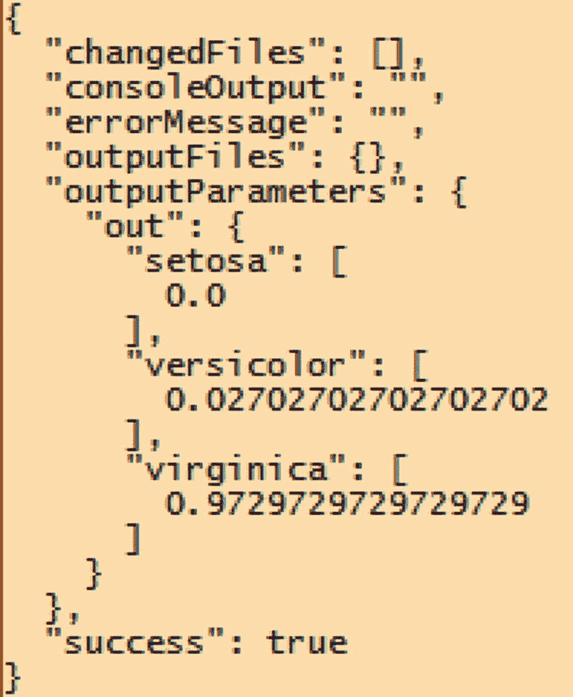
*图 8-5：应用预测结果*

由于我们从 R 脚本文件中返回的输出位于一个数据框中，因此输出会自动转换为 JSON 数组。在 `predictiris` 应用的例子中，预测返回三个输出参数，其中包含每种可能的鸢尾花物种的概率。在这种情况下，考虑到我们提供的输入参数值，`virginica` 物种似乎是最可能的，其确定性为 0.97 或 97%。

当您的应用出现问题时，在大多数情况下，您可以在返回的 JSON 的 “errorMessage” 或 “consoleOutput” 部分看到错误。在我们的例子中，应用成功执行，我们没有遇到任何错误。

## 7. 后续使用
现在我们的应用已经部署并测试完毕，我们可以继续使用 `azdata` 方法来按需或以编程方式调用该应用。另一种执行应用的方法（我认为更加优雅）是通过部署应用时自动创建的 REST API。


## 通过 REST API 使用大数据集群应用

当我们部署应用时，会创建一个专用的容器，其中包含我们的应用以及通过应用文件夹提供的所有附加文件。在部署过程中，容器内还会创建一个 RESTful Web 服务，作为调用应用的附加方法。RESTful API 使用 HTTP 请求来执行任务。在我们的案例中，可以使用 REST API 来调用我们创建的应用，并在 JSON 消息中返回输出。这在您创建了大数据集群上的应用并希望从（例如）您的应用程序直接访问时非常有用。由于所有代码和数据都驻留在大数据集群上，您的应用程序只需要能够发送 REST API 调用并处理返回的消息，即可立即将数据返回到您的应用程序中。

为了利用我们应用的 REST API，我们需要执行一系列步骤。其中最重要的是我们需要生成一个令牌以安全地调用 REST API。其中一些步骤需要通过一个可以发送 REST API 调用并处理其结果的工具来执行。在我们的案例中，我们使用 Postman ([`www.getpostman.com/`](http://www.getpostman.com/)) 作为我们的首选工具。

在能够连接到属于我们应用的 REST API 之前，我们需要做的第一件事是生成一个所谓的“持有者令牌”。只有在我们的 REST API 调用中提供此令牌，我们才能访问应用。

要生成持有者令牌，我们需要连接到令牌 URL。您可以通过运行清单 8-10 中的命令找到需要连接的 URL 和端口号。

```
azdata app describe --name predictiris -v v1
```

清单 8-10
通过 `azdata` 检索应用 URL 和端口号

运行前面的命令会返回有关您应用的信息，在我们的案例中是 `predictiris` 应用，如图 8-6 所示。我们需要的那一行信息在“links”部分返回，是“swagger”属性的 URL 和端口号。

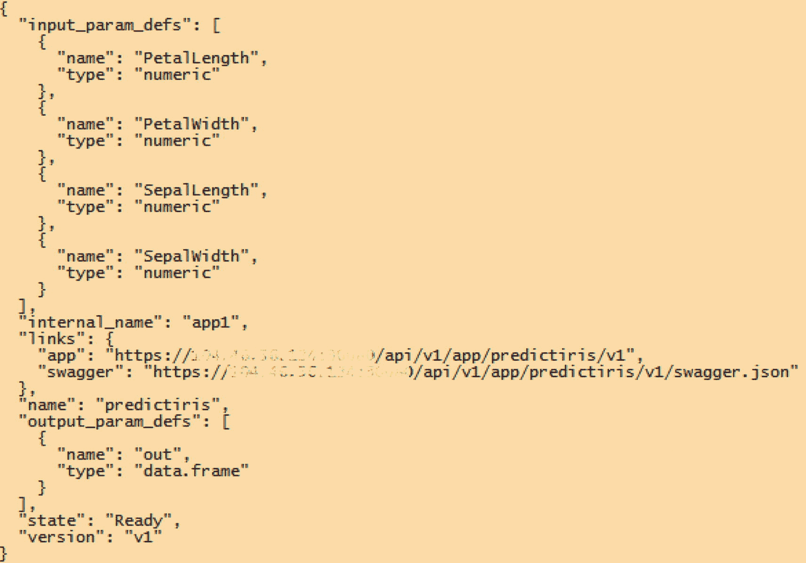

图 8-6
`predictiris` 应用的 `app describe` 命令输出

现在，请复制或记下 URL 和端口号，然后启动 Postman（或您喜欢的任何其他 REST API 调用应用）。Postman 启动后，我们必须更改一个设置以避免错误。由于大数据集群在其端点上配置了自签名证书，当我们在之后执行 REST API 调用时，可能会遇到安全问题。在 Postman 中，您可以在“首选项”菜单项中找到 SSL 证书验证，如图 8-7 所示。请确保在向大数据集群执行 REST API 调用之前禁用此设置。

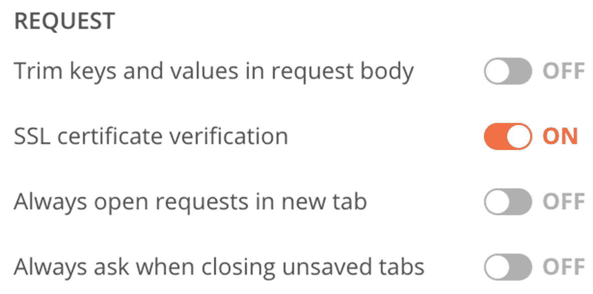

图 8-7
Postman 中的请求选项

禁用设置后，您可以在 Postman 中打开一个新标签页。将我们从 `app describe` 命令收到的 URL 和端口字符串粘贴或输入到请求 URL 字段中，并在 URL 后追加 `/api/v1/token`，然后将方法更改为 POST。最后，打开 Authorization（授权）选项卡，将 Type（类型）更改为“Basic Auth”（基本身份验证），并在正确的字段中输入您的大数据集群管理员用户名和密码。图 8-8 显示了 Postman 的截图，其中为我们大数据集群和应用 URL 填写了所有这些项目。

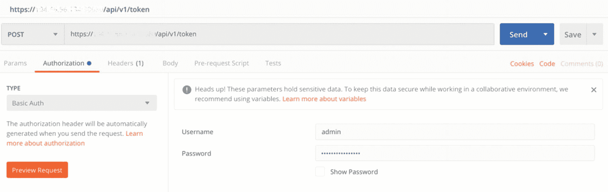

图 8-8
用于生成持有者令牌的 Postman 设置

在 Postman 中配置好所有内容后，单击 Send（发送）按钮将请求发送到该 URL。如果一切处理正确，您应该会收到一条返回消息，其中包含 JSON 响应的 `access_token` 属性中的持有者令牌，如图 8-9 所示（我们在图 8-9 中删除了 `access_token` 和 `token_id` 属性的内容）。

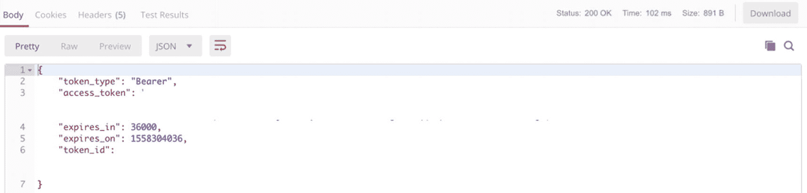

图 8-9
包含持有者令牌的 JSON 返回消息

现在我们已经生成了持有者令牌，我们可以用它来实际调用应用本身的 REST API。应用 REST API 的 URL 默认是隐藏的，可以在 `swagger.json` 文件中找到，我们可以通过访问运行 `azdata app describe --name predictiris -v v1` 命令时收到的“swagger”属性中的 URL 来打开该文件。

当您打开 URL（在我们的案例中是 `https://104.46.56.134:30080/docs/swagger.json`）时，可以在 JSON 文件中找到一个名为“host”的属性，如图 8-10 所示。

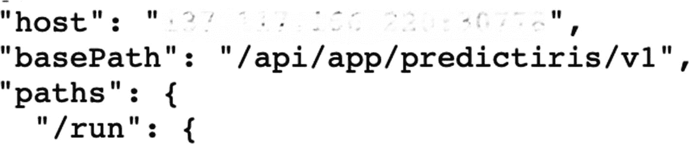

图 8-10
`swagger.json` 文件的 Host 属性

复制或记下“host”属性的值，并在 Postman 中启动一个新的会话。将请求方法更改为“POST”，并将“host”属性的内容复制到请求 URL 字段中，前面加上 `HTTPS://`。在 URL 的端口号之后，我们可以复制图 8-10 所示的“basePath”属性的内容，最后为了使 URL 完整，添加一个 `/run`。

转到 Authorization（授权）选项卡，这次选择“Bearer Token”（持有者令牌）选项，并在令牌字段中添加我们在上一步中收到的令牌。

现在我们还剩一步，即生成 REST API 调用的正文内容，并提供执行鸢尾花物种预测所需的输入参数。在 Postman 中，单击 Body（正文）选项卡，选中“raw”（原始）选项，并从下拉按钮中选择“JSON (application/json)”。将清单 8-11 中的代码部分的内容复制到正文文本区域中，以提供 `predictiris` 应用所需的输入参数。

```
{
"PetalLength": 1.4,
"PetalWidth": 0.2,
"SepalLength": 5.1,
"SepalWidth": 3.5
}
```

清单 8-11
`predictiris` 应用的输入参数（JSON）

填写完所有这些区域后，Postman 屏幕应如图 8-11 所示。

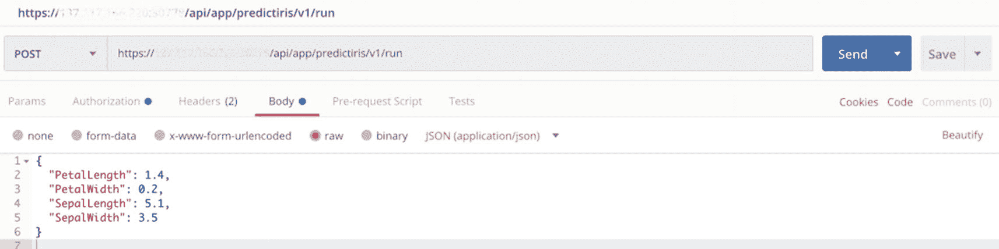

图 8-11
调用 `predictiris` 应用的 REST API 的正文

现在剩下的就是单击“Send”按钮，将 JSON 消息发送到 `predictiris` 大数据集群应用。

如果一切配置正确，我们应该会收到一条返回消息，其输出类似于我们使用 `azdata` 执行 `predictiris` 应用时的结果，其中包含每种鸢尾花植物的预测概率。我们收到的返回消息如图 8-12 所示。

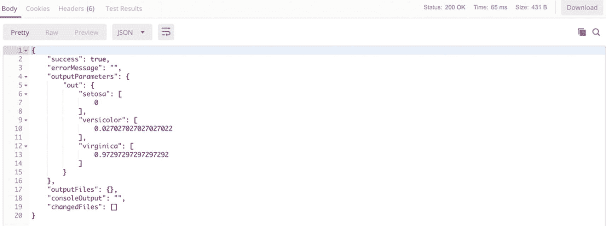

图 8-12
包含每种鸢尾花植物物种概率的 REST API 响应正文


## 本章摘要

在本章中，我们了解了如何创建和访问大数据集群应用程序。大数据集群应用是一种在**大数据集群**内部运行容器化自定义代码的方法，例如，可作为访问点来对存储在大数据集群内部的模型执行机器学习评分。我们创建了自己的应用，它能够预测鸢尾花植物的种类，将其上传到大数据集群，并使用 `azdata` 来执行该应用。然而，应用并非只能通过 `azdata` 访问；通过使用 RESTful Web 服务，我们能够访问该应用并向其发送数据，应用会使用我们训练的机器学习模型，以 JSON 消息的形式返回一个评分结果。

在本书接下来的最后一章中，我们将探讨如何管理和维护一个现有的大数据集群。

## 9. 大数据集群的维护

最后但同样重要的是，我们将探讨如何检查大数据集群的健康状况、如何将现有大数据集群升级到更新的版本，以及如果不再需要，如何删除一个大数据集群实例。

## 检查大数据集群的状态

大数据集群为您提供了两个不同的门户来了解其当前状态和健康状况。这些门户提供有关节点状态以及相关日志文件的指标和见解。除了显示信息外，`azdata` 还能为您提供集群健康状况的高级概览。

### 使用 azdata 检索大数据集群的状态

要从命令行检查集群状态，请使用命令 `azdata login` 登录到您的集群。如图 9-1 所示，`azdata` 将询问您的命名空间（您的集群名称）、用户名和密码。使用部署期间提供的值。

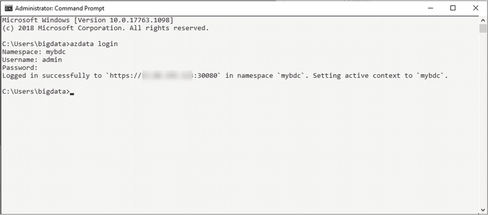
*图 9-1 `azdata login` 的输出*

成功登录后，您可以运行命令 `azdata bdc status show`。这将为您提供所有服务的概览，希望它们都报告为“健康”。示例输出如图 9-2 所示。

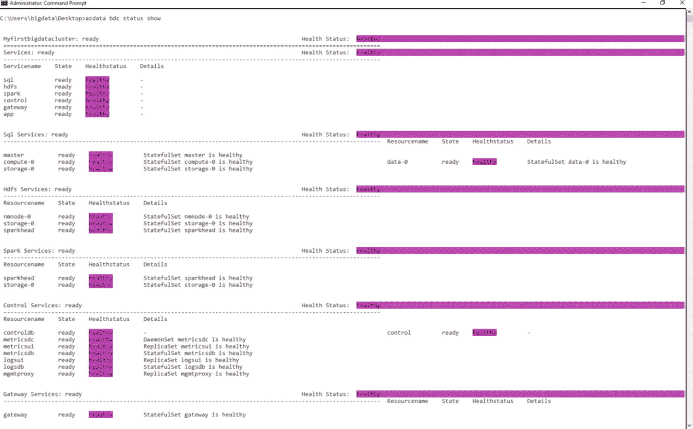
*图 9-2 `azdata bdc status show` 的输出*

之后，您可以使用 `azdata logout` 退出集群登录。

### 使用 ADS 管理大数据集群

Azure Data Studio (ADS) 为您提供了大数据集群状态和布局的更广泛视图。首先，您需要连接到集群的控制器端点，该端点在部署时已提供给您。

为此，请在 ADS 连接中找到“大数据集群”部分，然后点击如图 9-3 中指示的“+”符号。

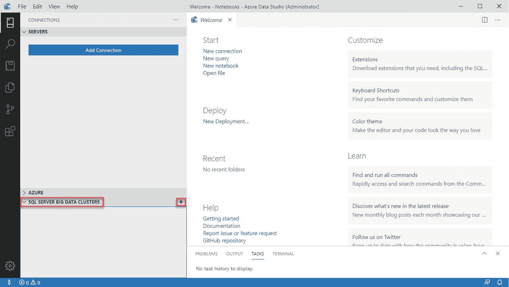
*图 9-3 ADS 中的大数据集群连接*

在下一步中，提供端点 URL 以及您的凭据以登录集群，如图 9-4 所示。

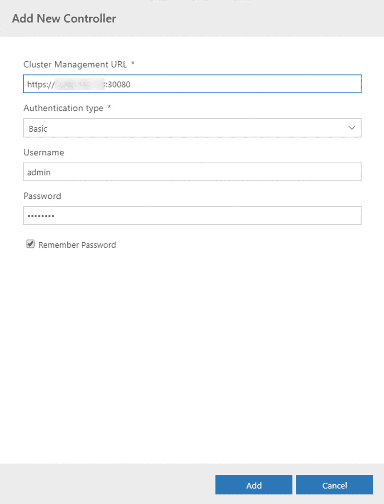
*图 9-4 在 ADS 中添加新的大数据集群连接*

这将带您进入大数据集群概览页面，该页面将显示每个服务的状态和运行状况以及您的端点，如图 9-5 所示。

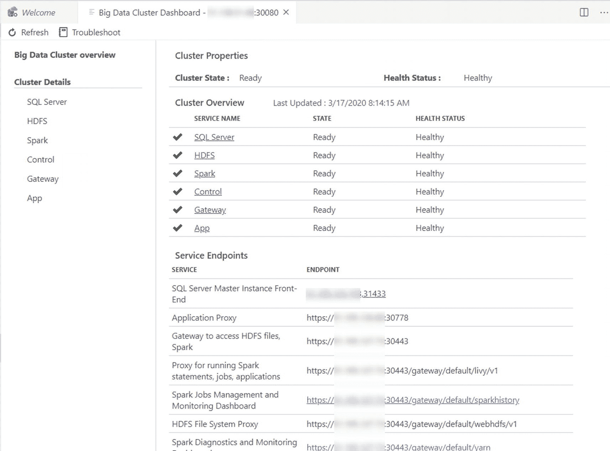
*图 9-5 ADS 中的大数据集群概览*

虽然端点更多是用作参考，但概览本身对于检索集群内每个服务和实例的更多详细信息非常有用。

例如，如果您点击 `SQL Server` 服务，这将带您进入所有 SQL 实例（主实例、计算、数据和存储）的概览页面，如图 9-6 所示。

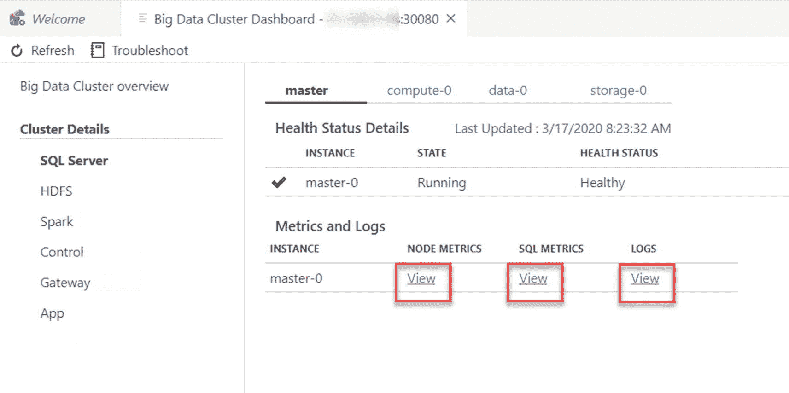
*图 9-6 ADS 中大数据集群 SQL Server 实例的详细信息*

这还将为您提供指向每个组件的指标和日志的具体链接。

### 指标 (Grafana)

Grafana 门户提供有关节点本身状态的指标和见解，以及在适用时提供更多与 SQL 相关的指标。登录门户的凭据与您在 Azure Data Studio 中连接集群所使用的凭据相同。

#### 节点指标

节点指标是典型的性能指标，如 CPU、RAM 和磁盘使用率，如图 9-7 所示。

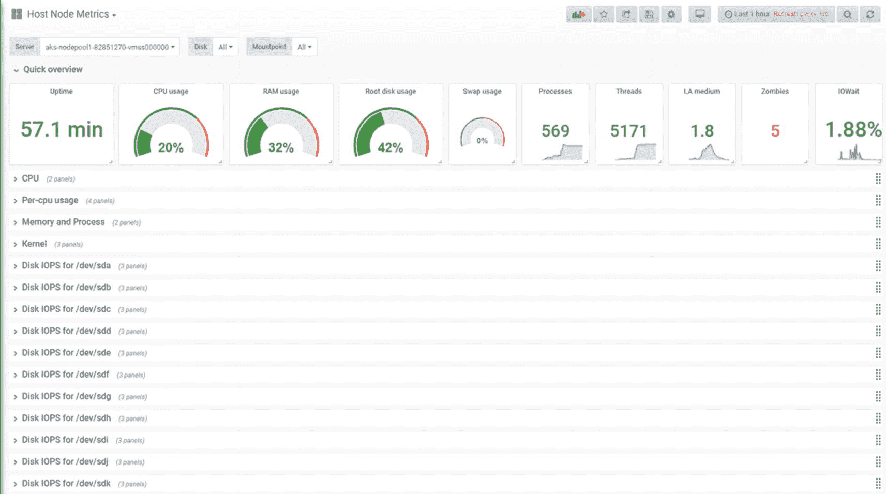
*图 9-7 Grafana 门户 – 节点指标*

除了“全局概览”外，您还可以获取每个单独组件（如特定磁盘或网络接口）的详细信息。

当遇到性能问题时，这总是一个很好的起点。显然，这也是判断您是否过度配置集群的一个重要指标。

#### SQL 指标

节点指标侧重于节点的物理层面，而 SQL 指标（如图 9-8 所示）则提供诸如按等待类型划分的等待时间或等待任务数、每秒事务数和请求数等信息，以及其他有价值的指标，以帮助您更深入地了解集群内 SQL 组件的状态。

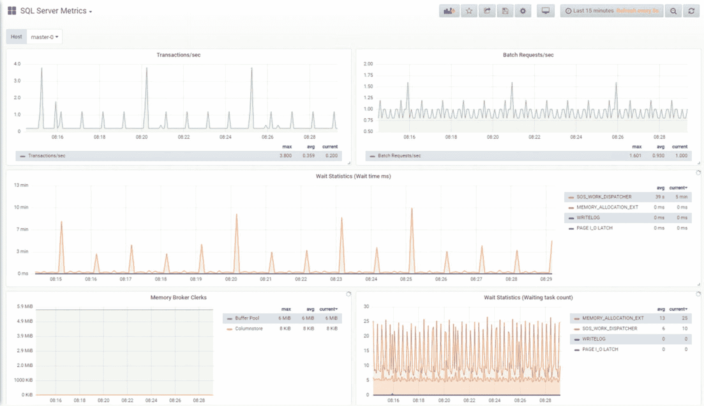
*图 9-8 Grafana 门户 – SQL 指标*

除了主实例（也可以通过 SSMS 或 Azure Data Studio 访问）之外，您通常不会直接连接到任何其他节点，因此请将这些指标视为您替代活动监视器的工具。

### 日志搜索分析 (Kibana)

另一方面，如图 9-9 所示的 Kibana 仪表板让您能够深入了解所选 Pod/节点的日志文件。

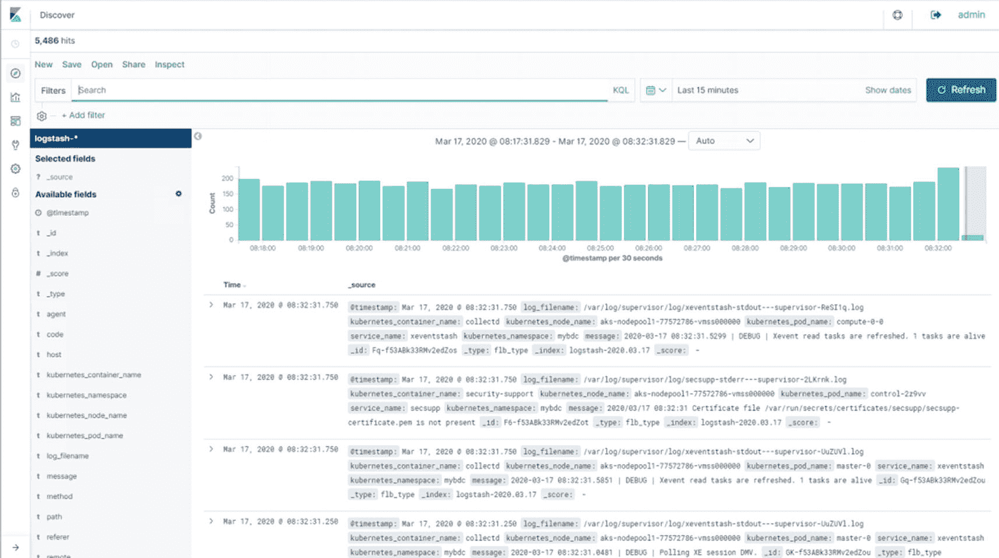
*图 9-9 Kibana 门户 – 概览*

Kibana 是 Elastic Stack 的一部分。它还提供选项，可在您的日志文件基础上创建可视化效果和仪表板。如果您想了解更多关于它的信息，其网站 [`www.elastic.co/products/kibana`](http://www.elastic.co/products/kibana) 是一个很好的起点！


