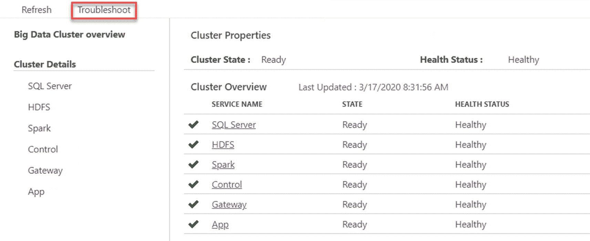
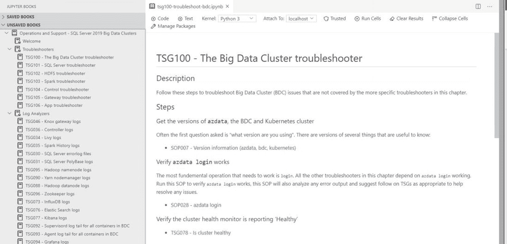
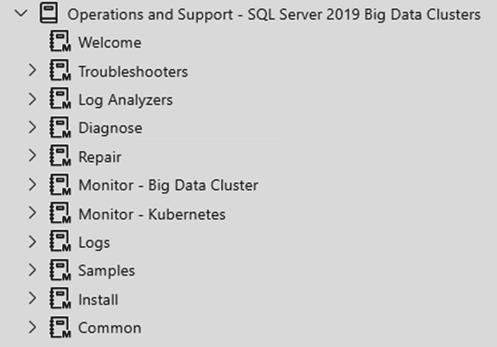
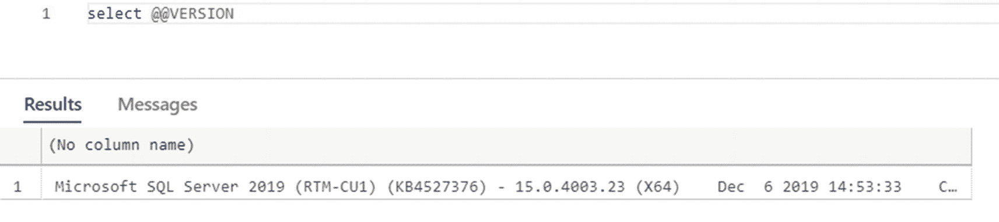
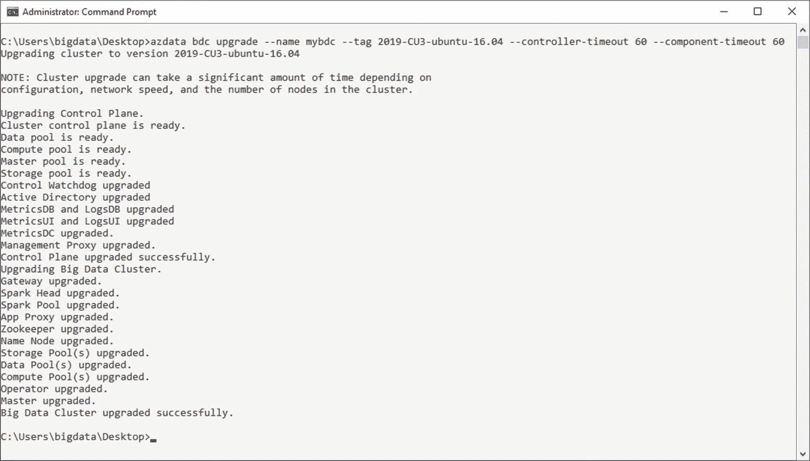
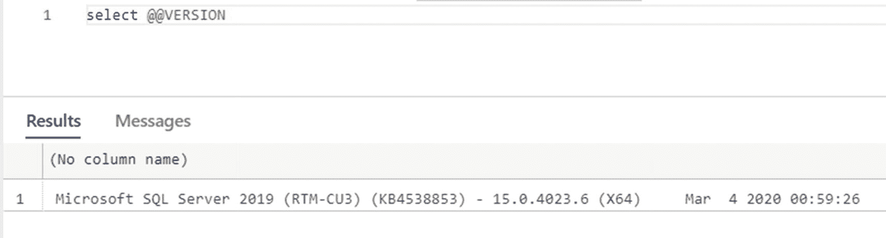
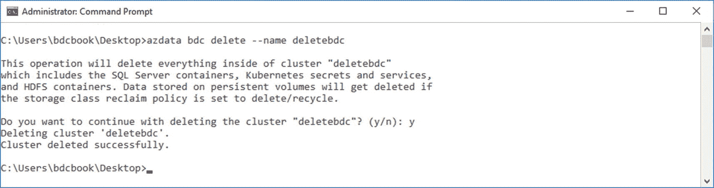

# 大数据集群故障排除、升级与删除

## 故障排除大数据集群

在某个时刻，您的**大数据集群**很可能会遇到问题——从磁盘空间不足到组件故障。Azure Data Studio 也提供了关于如何查找并可能修复此类错误原因的指导和工具。

如果您返回到大数据集群的概览页面，您将看到一个“**故障排除**”按钮，如图 9-10 所示。


*图 9-10：ADS 中的故障排除链接*

该按钮背后是一系列用于排查集群中每个组件的笔记本。首先打开的笔记本是“**TSG100 – 大数据集群故障排除程序**”，它将引导您完成对大数据集群的全面调试。如果您已经缩小了导致问题的服务范围，也可以直接在左侧导航到该特定组件的分析器笔记本，如图 9-11 所示。


*图 9-11：ADS 中的故障排除*

这些笔记本按类别分组，如图 9-12 所示，当您遇到大数据集群问题时，它们始终是您的第一个起点。


*图 9-12：ADS 中的故障排除类别*

## 升级大数据集群

就像任何其他版本的 SQL Server 一样，大数据集群在其版本的维护时间框架内会接收定期的累积更新（CU）。要检查您的安装版本，您只需在 SQL Server Management Studio 或 Azure Data Studio 中运行 `SELECT @@VERSION`。让我们假设您当前的版本是 CU1，如图 9-13 所示。


*图 9-13：`SELECT @@VERSION` 的输出*

如果您想将大数据集群升级到新版本，请首先确保您拥有最新版本的 `azdata`。为此，请运行清单 9-1 中的代码，就像您首次安装 `azdata` 时一样。

```
pip3 install -r https://aka.ms/azdata
```
*清单 9-1：将 azdata 更新到最新版本*

现在您可以使用 `azdata` 来升级您的集群。命令是 `azdata bdc upgrade`，后面至少跟上您的集群名称和目标版本。

例如，要升级到大数据集群 2019 CU3，您将使用清单 9-2 中显示的命令。

```
azdata bdc upgrade --name mybdc --tag 2019-CU3-ubuntu-16.04
```
*清单 9-2：使用 azdata 将 BDC 升级到 CU3*

这将需要一些时间，因为首先需要拉取所有单独的镜像，然后升级集群中的每个组件。就像安装过程一样，升级过程会持续为您提供它当前正在处理的组件的状态更新，直到升级过程完成（参见图 9-14）。


*图 9-14：`azdata bdc upgrade` 的输出*

如果您遇到超时问题（这被报告为一个常见问题），您可以在运行 `azdata bdc upgrade` 时添加可选参数 `controller-timeout` 和 `component-timeout`。它们的值以分钟为单位，因此如果您将它们都设置为 60，应该绰绰有余。

如果您现在再次运行 `SELECT @@VERSION`，您将看到您的大数据集群的当前版本反映为 CU3，如图 9-15 所示。


*图 9-15：升级后的 `SELECT @@VERSION` 输出*

## 删除大数据集群实例

如果您想删除大数据集群的一个实例，您只需再次使用 `azdata`。您只需提供实例的名称，如清单 9-3 所示，集群组件就会被删除。

```
azdata bdc delete –-name <instance-name>
```
*清单 9-3：删除大数据集群实例*

您可以跟踪进度，直到实例被完全删除，如图 9-16 所示。


*图 9-16：`azdata bdc delete` 的输出*

就这样——您的实例现在已被删除。这只会删除大数据集群组件，因此如果您部署到 Azure Kubernetes Service，您可能还需要考虑删除该集群，除非您需要它用于其他应用程序，以避免其产生费用。

## 总结

在这最后一章中，我们探讨了获取大数据集群健康状况快速状态的选项、当某些功能未按预期工作时该怎么办的选项，以及如何将现有集群升级到更高版本。

## 索引

### A

- Active Directory (AD)身份验证集成
- AdventureWorksLT 数据库
- Apache Spark
- 人工智能 (AI)
- 自动化外部表，Biml
  - AdventureWorksLT 数据库
  - `DataRow`数据源元表
  - PolyBase
- 数据库 `12_PolybaseWriter_C.biml` T-SQL
- `azdata bdc config init` `bdc.json`
- `azdata bdc status show cluster config`
- 群集，创建命令行工具
- `control file` `control.json`输出
- Azure Blob Storage
- Azure Data Studio (ADS)
  - AdventureWorksLT，表结构
  - 经典 T-SQL 查询/命令
  - 群集设置
  - 连接对话框
  - 连接错误
  - 部署模板
  - 扩展安装
  - 安装
  - 安装 Python，笔记本
  - 新部署
  - 笔记本
  - 部署后笔记本
  - 预部署脚本转笔记本
  - 服务设置
  - 设置版本
- Azure Kubernetes Service (AKS)
  - `azdata bdc config`
  - `azure-cli`，安装
  - 大数据群集先决条件，安装脚本
  - 部署脚本，下载
  - 安装 `IP.py`
  - 登录确认
  - 登录屏幕
  - Python 部署脚本
  - 用于检索端点的 Python 脚本
  - 检索 Kubernetes
  - 触发登录
- Azure Portal
  - 防火墙设置
  - 资源，创建
- 服务器配置
- SQL 数据库，配置
- SQL 数据库，创建

### B

- `BDC_Empty`数据库
- Bearer 令牌
- 大数据群集
  - 应用
    - 应用创建状态
    - 应用文件
  - `azdata`创建
  - `controller-svc-external`服务
  - `deploy` `errorMessage`函数定义
  - `input_dataframe`
  - 登录到控制器端点
  - 机器学习模型名称和版本
  - 参数，YAML 文件
  - R 中的预测模型
  - 预测结果
  - `Predict_Iris.R`文件
  - 预训练的机器学习模型
  - 预训练模型
  - 副本和`poolsize`参数
  - REST API (参见 REST API)
  - R 库
  - R 或 Python
  - `spec.yaml`文件
  - 训练好的模型
  - 训练和测试数据集
- Visual Studio Code
- 大数据群集
  - 架构
  - 数据湖
  - 环境
  - 数据虚拟化 (参见 数据虚拟化)
  - 功能集
  - 移除
- 箱线图

### C

- `cache()`函数
- 集中式 AI 平台
- Chocolatey
- 块
- 分类
- 聚类
- 逗号分隔值 (CSV) 文件
  - `DROP`和`CREATE`外部表
  - `flights`错误消息
  - 外部表向导
  - 主实例，选择
  - 预览数据
  - 目标表详情
  - T-SQL 输出
  - `SELECT`语句
  - 存储数据
- 计算区域
- 计算池
- 容器
  - 优势
  - 应用程序数据，存储
  - 应用程序服务
  - Docker/Minikube
  - 基础设施即代码
  - Kubernetes Pod
  - “无状态”应用程序
  - 虚拟机
- 控制器端点
  - `controller-svc-external`服务
- 控制平面
- `csv-based`外部表，`SELECT`语句
- `csv_file`
- 累积更新 (CU)

### D

- 数据框处理
  - `aggregate`选项
  - 应用程序日志记录
  - 平均时间差
  - `cache()`和`count()`命令
  - `cache()`函数
  - 计算列，添加
  - `count()`函数
  - `df_airports`、`df_airlines`和`df_flights`
  - `df_flightinfo`数据框
  - `df_flightinfo`模式
  - 启用缓存执行
  - `count()`执行计划
  - 转换
  - `groupby`函数
  - 导入`airlines.csv`和`flights.csv`
  - 导入`airports.csv`
  - 连接后的数据框
  - 分区`count()`操作
  - 创建`df_flightinfo`数据框
  - `repartition()`函数
  - 检索到的计数
  - Spark 作业任务
  - 工作节点
  - PySpark
  - 计划和已用飞行时间
  - 模式
  - 基于选择和排序
  - 检索单个聚合值
  - Spark 应用程序信息
  - Spark 作业概览
  - `storageLevel`函数
  - 存储使用摘要统计，生成
  - Yarn Web 门户
- 数据集成
- 数据平面架构
- 数据冗余
- 数据源
- 数据类型
- 数据虚拟化
  - *对比*数据集成
  - 减少数据冗余
  - 索引策略
  - 链接服务器和 PolyBase
  - PolyBase 延伸数据库
  - 传统的基于 ETL 的暂存过程
- 部署
  - ADS (参见 Azure Data Studio (ADS))
  - AKS (参见 Azure Kubernetes Service (AKS))
  - 使用`kubeadm`的 Linux
  - `df_airlines`数据框
  - `df_airports`数据框
  - `df_flightinfo`数据框
  - `df_flightinfo_times`数据框
  - `df_flights`和`df_airlines`数据框
  - `df_sqldb_query`数据框
- Docker
- Drawbridge
- `DROP`语句

### E

- 空数据库，ADS
- 通过 T-SQL 创建空数据库
- 错误消息
- `explain()`命令
- 外部数据源
- 外部表
  - `CREATE`语句
  - CSV 文件 (参见 逗号分隔值 (CSV) 文件)
  - 执行计划
  - 执行计划，`SELECT`语句
  - 连接的`SELECT`语句
  - 主实例，连接`SELECT`语句
  - SSMS
  - T-SQL
  - 向导，ADS
    - 连接和凭据
    - 数据库主密钥，创建
    - 数据源选择
    - 对象映射
    - 表映射

### F

- 基于文件的数据源
- `FileScan`
- 航班延误文件
- 航班延误示例数据集
  - 在 HDFS 上创建目录
  - 显示文件
  - Kaggle.com 数据集
  - Kaggle.com 下载
  - Kaggle.com 登录
  - 上传数据到 HDFS
- `FlightInfoTable`查询

### G

- 通用`CREATE`语句
- GitHub 仓库
- `groupby`函数
- 数据分组

### H

- Hadoop
- Hadoop 分布式文件系统 (HDFS)
  - 数据节点
  - 文件系统分层
- `hist()`函数

### I

- 数据库内机器学习服务
  - `model_object`列
  - 模型表，创建
  - `PREDICT`
  - 限制
  - 评分数据
  - `sp_execute_external_script`
  - 拆分数据集
  - SQL Server 主实例
  - `WITH RESULT SETS`
- 安装，SQL Server 2019
  - 数据库引擎配置
  - 下载介质对话框
  - 版本选择
  - 通过 T-SQL 启用 PolyBase
  - 功能选择
  - 实例配置
  - Java 安装位置
  - 主屏幕
  - 挂载 ISO
  - 概述
  - PolyBase 配置
  - 启用 PolyBase
  - 重启 SQL Server 实例
  - 服务器配置
  - 安装规则
  - 类型选择
- 四分位距 (IQR)
- 鸢尾花种类预测
  - 鸢尾花表值
  - `Iris_test`表

### J

- JSON 消息

### K

- 内核选择
- Kibana
- Linux 上的`kubeadm`
  - 部署
  - 下载并执行部署脚本
  - 修补 Ubuntu
  - Kubernetes
    - 群集
    - 节点
    - Pod

### L

- 惰性求值
- 链接服务器
- Linux
- 逻辑架构
  - 计算区域
  - 控制平面
  - 数据区域
  - 概述
  - SQL Server 主实例
  - 存储池
- 逻辑 Spark 架构
- 日志搜索分析 (Kibana)

### M

- 机器学习
  - 内置 Spark ML 库
  - 分类算法
  - 分类器
  - 数据框数据处理
  - `df_Iris`数据框
  - 特征
  - 文件系统加载
  - 机器学习库
  - 衡量模型性能
  - 模型分类
    - 鸢尾花数据集
    - 模型表，创建
    - 先前的代码
    - `sp_execute_external_script`
    - 测试数据
    - 训练
  - 修改后的`df_Iris`数据框
  - 预测结果处理
  - `pyspark.ml.classification`库
  - 读取数据
  - 服务
  - 训练好的模型
  - 训练和测试数据框
- 管理
  - 管理包
- MapReduce 框架
- MapReduce 编程模型
- 主实例
  - 复制`AdventureWorks2014`
  - 现有数据库
  - 还原`AdventureWorks2014`
- `Matplotlib`安装任务
- `Matplotlib`库
- `Matplotlib`包安装
- 指标 (Grafana)
  - 节点指标
  - SQL 指标
- Microsoft 示例数据
- Minikube

### N

- 节点指标

### O

- ODBC 源

### P

- Pandas
- 分区
  - `pd_data`框
- 物理基础设施
  - 容器 (参见 容器)
  - HDFS
  - spark (参见 Spark)
  - SQL Server 大数据群集
  - Linux 上的 SQL Server
- 平台抽象层 (PAL)
- 绘制图形
  - ADS
    - 基于单列的箱线图
    - 箱线图数据框
    - GitHub
    - 创建直方图
    - 管理包选项
    - `matplotlib`库方法，分析数据
    - 生成多个箱线图
    - Pandas
    - Pandas 库
    - `pd_data`框
    - 散点图矩阵
- Pod
- PolyBase
  - HDFS 连接器
  - SQL Server 内部的 PolyBase
- `PREDICT`函数
- 预测
- 预训练的机器学习模型
- `PUSHDOWN`标志
- PySpark

### Q

- 通过 T-SQL 查询大数据群集
  - 外部表 (参见 外部表)

### R

- 回归
- 关系数据库
- `repartition()`函数
- REST API
  - `azdata`
  - bearer 令牌
  - 主机属性，`swagger.json`文件
  - 输入参数，`predictiris`应用 JSON 返回消息
  - `predictiris`应用请求选项
  - 检索应用 URL 和端口号
  - 返回消息
  - 令牌
- RESTful API
- RESTful Web 服务

### S

- Scala
- 散点图矩阵
- 读取时模式
- 写入时模式方法
- `SELECT`语句
- `show()`函数
- 排序
- Spark
  - 大数据分析
    - `cache`命令
    - 翻译
  - 分布式和并行框架
  - 包含驱动程序进程
  - 逻辑架构
  - 机器学习 (参见 机器学习)
  - MapReduce 框架
  - Spark 应用程序
  - Spark 群集
  - Spark 数据框
    - `airports.csv`文件
    - CSV 数据
    - `df_airports`数据框
    - 过滤后的`df_airports`
    - 过滤
    - 基于列对数据分组
    - 导入 CSV 数据
    - 多重过滤
    - 多个操作
    - 无删除/更新
    - 删除行
    - 检索第一行
    - 检索行数
    - 检索模式
    - 模式
    - 选择特定列
    - 排序
    - `spark.read.format`命令
    - SQL 查询
    - 表结构
- Spark 函数
- Spark 主节点
- `spark.read.format`命令
- Spark 会话
- Spark 工作节点
- `spec.yaml`文件
- `sp_execute_external_script`函数
- `sp_execute_external_script`方法
- `SqlDataPool`
  - `CREATE`语句
  - 索引
  - 对表执行`SELECT`
- `SQL 查询`
- T-SQL 代码
- SQL 数据池
- SQL 指标
- SQL 平台抽象层 (SQLPAL)
- 基于 SQL Server 的外部表
- Linux 上的 SQL Server 2019
- SQL Server Integration Services (SSIS)
- SQL Server Management Studio (SSMS)
- SQL Server 主实例
  - 数据框，创建
  - 数据框模式
  - 存储的数据类型
  - `df_sqldb_query`数据框
  - 启用外部脚本
  - 执行`SQL 查询`
  - 先前的代码设置
  - `sp_execute_external_script` `SQL 查询`
- Linux 上的 SQL Server
- SQL Server 操作系统 (SOS)
- `SqlStoragePool`
- 状态，大数据群集
- `storageLevel()`命令
- 存储池
- `subplot()`函数

### T

- 表结构
- TensorFlow
- 训练好的决策树模型
- 训练数据集
- 转换
- 故障排除
  - ADS 链接
  - T-SQL 代码
    - 外部文件格式
    - 创建外部表
    - 指向存储池的指针
    - T-SQL 查询

### U

- `UPDATE`语句
- 升级

### V, W, X, Y, Z

- 虚拟机 (VMs)